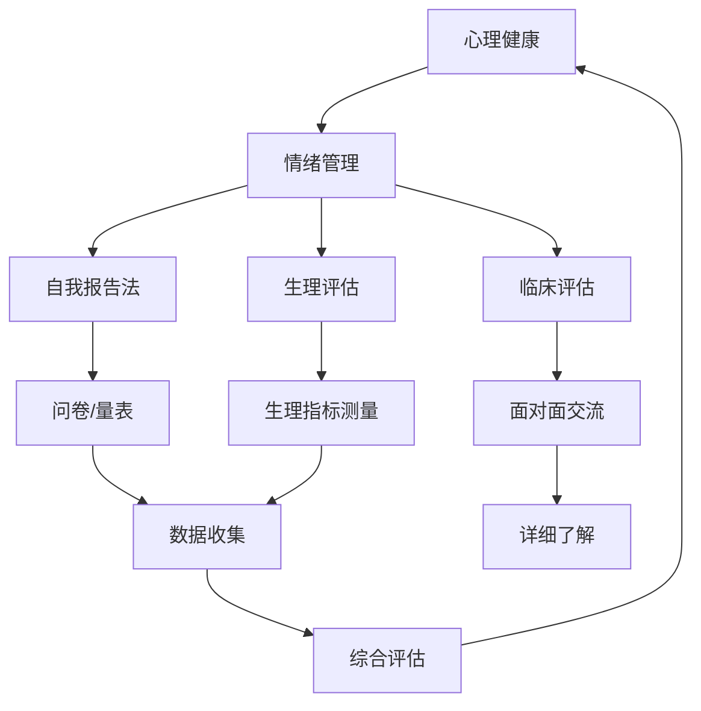
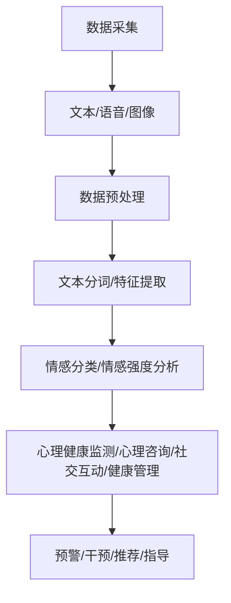
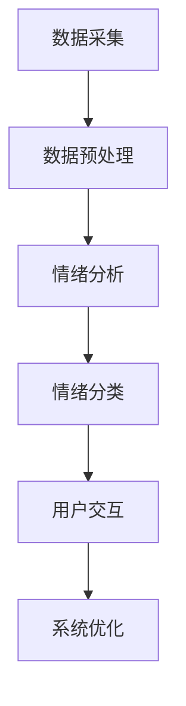

                 

### 文章标题

《AI辅助的心理健康：智能情绪分析与支持》

### 关键词

人工智能、心理健康、情绪分析、支持系统、算法实现、应用实践

### 摘要

随着人工智能技术的飞速发展，其在心理健康领域的应用日益广泛。本文将深入探讨AI如何通过智能情绪分析和支持系统，助力提升人们的心理健康水平。文章首先介绍了心理健康的背景和AI技术的应用，随后详细阐述了情绪分析的基本原理、核心算法以及实际应用案例，最后对智能情绪支持系统的未来发展方向进行了展望。

## 引言与背景

### 1.1 心理健康的重要性

心理健康是影响人类整体福祉的关键因素之一。根据世界卫生组织（WHO）的定义，心理健康指的是“个体在认知、情感和行为方面能够有效应对生活压力，工作生产，并为其社区作出贡献的状态。”心理健康的维护不仅仅是为了个体的幸福，更是社会稳定与进步的基础。在现代社会中，心理健康问题日益突出，包括焦虑、抑郁、压力等情绪问题，以及精神障碍如自闭症、双相情感障碍等。这些问题不仅影响个体的生活质量，还可能导致生产力下降、医疗成本增加，甚至引发更严重的社会问题。

心理健康问题的严重性不容忽视。据美国心理健康协会（APA）的数据显示，全球约有33%的人口在一生中的某个阶段会经历心理健康问题。尤其是在新冠疫情背景下，人们的心理健康状况更加恶化。疫情期间，社交隔离、经济压力、失业和健康风险等因素使得心理健康问题的发生率显著上升。因此，寻找有效的方法来预防和治疗心理健康问题显得尤为重要。

### 1.2 AI在心理健康领域的应用

随着人工智能（AI）技术的迅速发展，其在多个领域都展现出了巨大的潜力，心理健康领域也不例外。AI通过其强大的数据处理、模式识别和预测能力，为心理健康的研究、诊断、治疗和干预提供了全新的手段。以下是一些AI在心理健康领域的主要应用：

#### 诊断与筛查

AI可以分析患者的历史数据、生理信号和行为特征，从而提高心理健康诊断的准确性和效率。例如，通过分析患者的语言、表情和行为，AI可以识别出潜在的抑郁症、焦虑症等心理问题。这种自动化的诊断方式不仅减轻了专业心理医生的工作负担，还能够在早期阶段识别出心理问题，从而及时进行干预。

#### 情绪分析

情绪分析是AI在心理健康领域的另一个重要应用。通过自然语言处理（NLP）和面部表情识别等技术，AI可以准确捕捉和分析个体的情绪状态。这种技术被广泛应用于心理健康咨询、社交媒体监控和智能可穿戴设备等领域，帮助用户更好地理解和管理自己的情绪。

#### 治疗与干预

AI还可以辅助心理治疗和干预。例如，基于深度学习的虚拟心理治疗师可以模拟人类治疗师的行为，为患者提供个性化的治疗方案。此外，AI算法还可以根据患者的情绪和行为数据，自动调整治疗方案，提高治疗的针对性和有效性。

#### 预测与预防

通过大数据分析和机器学习算法，AI可以预测个体心理健康问题的发生风险，从而提前进行预防。例如，通过分析社交媒体上的言论和行为数据，AI可以预测抑郁症、焦虑症等心理问题的发生概率，为心理健康风险人群提供早期干预服务。

### 1.3 本书结构

本书旨在全面探讨AI在心理健康领域的应用，结构如下：

- **第1章 引言与背景**：介绍心理健康的重要性和AI在心理健康领域的应用。
- **第2章 心理健康基础知识**：阐述心理健康的定义、维度和评估方法。
- **第3章 AI与情绪分析**：介绍情绪分析的基本原理、技术和应用。
- **第4章 智能情绪支持系统架构**：探讨情绪支持系统的组成和架构设计。
- **第5章 核心算法与模型**：详细讲解情绪识别和预测的核心算法和模型。
- **第6章 情绪支持服务应用**：讨论情绪支持服务在不同场景中的应用。
- **第7章 智能情绪支持系统的实现**：介绍系统的实现细节和优化方法。
- **第8章 案例研究**：分析实际案例，探讨AI在心理健康服务中的应用。
- **第9章 总结与展望**：总结本书的主要观点，并对未来发展方向进行展望。

通过以上结构，本书希望能够为读者提供一个系统、全面的了解AI在心理健康领域的应用，为心理健康研究和实践提供新的思路和方法。

## 心理健康基础知识

### 2.1 心理健康的定义与维度

心理健康是指个体在认知、情感和行为方面能够有效应对生活压力，保持良好的功能状态，并为其社区作出贡献的能力。具体来说，心理健康包括以下几个方面：

- **情绪管理**：个体能够认识到自己的情绪，并有效地调节和控制情绪，使其对日常生活产生积极的影响。
- **人际关系**：个体能够与他人建立和维持健康、积极的人际关系，包括家庭、朋友和同事等。
- **自我认识**：个体对自己的性格、能力和价值观有清晰的认识，并能积极面对自己的优点和不足。
- **社会适应**：个体能够适应社会环境，有效应对生活中的各种挑战和变化。
- **生活满足**：个体能够享受生活，感受到满足和幸福感。

根据不同的理论，心理健康还可以从多个维度进行理解。例如，美国心理学家马斯洛（Abraham Maslow）提出的需求层次理论将心理健康分为生理需求、安全需求、社交需求、尊重需求和自我实现需求。每个层次的需求都是建立在前一层需求满足的基础上的，心理健康的发展是一个逐步实现的过程。

### 2.2 情绪理论与分类

情绪是心理健康的重要组成部分，了解情绪的理论和分类有助于更好地理解心理健康。以下是一些主要的情绪理论和分类：

#### 情绪的基本理论

1. **认知评价理论**：由阿诺德（Judith Arnold）提出，认为情绪是认知评价的结果。当个体对某个刺激进行认知评价后，产生相应的情绪反应。
2. **情绪的动机理论**：由詹姆斯（William James）和坎农（Bradford Cannon）提出，认为情绪是生理状态和认知过程相互作用的结果。
3. **情绪的特质理论**：由艾森克（Ernest Hemingway）提出，认为情绪是个体特质的一部分，不同个体的情绪反应存在差异。

#### 情绪的分类

1. **基本情绪**：由普拉切克（Robert Plutchik）提出，基本情绪包括喜悦、愤怒、悲伤、恐惧、厌恶和惊讶。
2. **复合情绪**：由布朗（Robert Zajonc）提出，复合情绪是基本情绪的组合，如焦虑、羞愧和内疚等。
3. **积极情绪与消极情绪**：根据情绪对个体的影响，可以分为积极情绪和消极情绪。积极情绪如喜悦、满足和幸福，有助于提高个体的心理健康水平；消极情绪如焦虑、抑郁和愤怒，对心理健康有负面影响。

### 2.3 心理评估方法

心理评估是了解个体心理健康状况的重要手段，以下是一些常用的心理评估方法：

#### 自我报告法

自我报告法是通过问卷、量表和自我评估工具来评估个体的心理健康状态。常用的工具有抑郁自评量表（SDS）、焦虑自评量表（SAS）等。这种方法简便易行，但受个体主观因素的影响较大。

#### 临床评估

临床评估是由专业的心理医生或心理咨询师通过面对面交流、观察和访谈等方式进行的。这种方法能够深入了解个体的心理健康状况，但需要专业知识和经验。

#### 生理评估

生理评估是通过测量生理指标如心率、血压、脑电波等来评估个体的心理健康。这种方法能够提供客观的数据支持，但需要复杂的设备和技术。

#### 综合评估

综合评估是将自我报告、临床评估和生理评估等多种方法结合起来，以获得更全面、准确的个体心理健康评估。

### 关联与流程图

心理健康与情绪之间存在密切的关联，情绪管理是心理健康的重要组成部分。以下是一个简化的关联流程图，展示了心理健康、情绪和评估方法之间的关系：



通过上述流程图，我们可以看出，情绪管理是连接心理健康与评估方法的桥梁，而综合评估能够更全面地反映个体的心理健康状况。

综上所述，心理健康基础知识为我们理解和应用AI在心理健康领域的应用奠定了基础。在接下来的章节中，我们将深入探讨AI在情绪分析和技术实现方面的具体应用，以期为心理健康提供更有效的支持和干预。

## AI与情绪分析

### 3.1 情绪分析的基本原理

情绪分析，也称为情感分析，是指通过技术手段对文本、语音和图像等数据中的情绪信息进行提取、理解和分析。情绪分析的基本原理可以概括为以下几方面：

#### 数据采集

情绪分析首先需要采集包含情绪信息的数据。这些数据可以来自多种渠道，如社交媒体帖子、电子邮件、语音通话记录、面部表情图片等。数据采集的质量直接影响情绪分析的准确性，因此，选择合适的数据集和采集方法至关重要。

#### 数据预处理

采集到的原始数据通常需要进行预处理，以消除噪声和冗余信息。数据预处理步骤包括文本的分词、去停用词、词性标注、情感词典的构建等。对于语音和图像数据，预处理还包括语音转文字（ASR）和图像特征提取（如面部识别、情感识别）等。

#### 情感分类

情感分类是情绪分析的核心步骤，即将文本、语音或图像中的情绪标签归类到预定义的情绪类别中。常见的情绪类别包括正面情绪（如喜悦、满足）、负面情绪（如愤怒、恐惧）和中性情绪。情感分类的方法可以分为基于规则的方法和基于模型的方法。

- **基于规则的方法**：通过预设的情感词典和规则，对文本进行匹配和分类。这种方法简单直观，但准确性和泛化能力有限。
- **基于模型的方法**：利用机器学习和深度学习算法，对大量标注数据进行训练，建立情感分类模型。这种方法具有更好的准确性和泛化能力，但需要大量的标注数据和计算资源。

#### 情感强度分析

情感分类只能确定文本、语音或图像的情绪类别，而情感强度分析则可以进一步量化情绪的强度。例如，对于文本数据，可以计算正面和负面词汇的频率、词频差异等指标；对于语音数据，可以通过语音特征（如音高、音强、时长）来分析情绪的强度。

### 3.2 情绪分析的技术

情绪分析涉及多种技术，包括自然语言处理（NLP）、语音处理和图像处理。以下是这些技术的基本原理和应用：

#### 自然语言处理（NLP）

自然语言处理是情绪分析的基础技术之一，用于处理和分析文本数据。NLP技术主要包括以下几方面：

- **文本分词**：将文本分解成单词或句子，以便进行进一步分析。
- **词性标注**：为文本中的每个单词标注词性，如名词、动词、形容词等。
- **情感词典**：构建包含情感标签的词典，用于匹配文本中的情感词汇。
- **情感分类模型**：利用机器学习和深度学习算法，对文本进行情感分类。

常见的方法有：

- **基于规则的方法**：如情感词典法和规则匹配法，通过预设的情感词典和规则进行情感分类。
- **基于机器学习的方法**：如支持向量机（SVM）、朴素贝叶斯（NB）和深度学习模型（如卷积神经网络（CNN）、循环神经网络（RNN）等）。

#### 语音处理

语音处理用于分析语音数据中的情绪信息，包括语音信号的特征提取和情感分类。语音处理技术主要包括：

- **特征提取**：从语音信号中提取出能够反映情绪的声学特征，如音高、音强、时长等。
- **情感分类**：利用机器学习和深度学习算法，对语音特征进行情感分类。

常见的语音处理工具包括：

- **MFCC（梅尔频率倒谱系数）**：用于提取语音信号的时频特征。
- **深度神经网络**：如卷积神经网络（CNN）和循环神经网络（RNN），用于处理复杂的语音信号。

#### 图像处理

图像处理用于分析面部表情图像中的情绪信息，如面部识别和情感识别。图像处理技术主要包括：

- **面部识别**：通过检测和定位面部区域，提取面部特征。
- **情感识别**：利用机器学习和深度学习算法，对提取出的面部特征进行情感分类。

常见的图像处理工具包括：

- **OpenCV**：用于面部检测和特征提取。
- **深度学习模型**：如卷积神经网络（CNN），用于面部情感识别。

### 3.3 情绪分析的应用

情绪分析技术在心理健康领域有着广泛的应用，主要包括：

#### 心理健康监测

情绪分析可以用于实时监测个体的情绪状态，帮助识别潜在的心理健康问题。例如，通过分析社交媒体上的文字、语音和视频数据，可以识别出个体的情绪波动，进而提供预警和干预建议。

#### 心理咨询

情绪分析技术可以辅助心理治疗师进行心理咨询。例如，通过分析患者的语言和表情，心理治疗师可以更准确地了解患者的情绪状态，制定更有效的治疗方案。

#### 社交互动

情绪分析技术可以用于优化社交互动，如个性化推荐、情感匹配等。例如，通过分析用户在社交媒体上的情感状态，可以为其推荐合适的社交内容，提高社交体验。

#### 健康管理

情绪分析可以用于健康管理，如压力管理、情绪调节等。例如，通过分析用户的日常活动和情绪变化，可以为用户提供个性化的健康建议和指导。

### 综合流程图

以下是一个简化的情绪分析综合流程图，展示了情绪分析的主要步骤和应用场景：



通过上述流程图，我们可以看出，情绪分析技术从数据采集、预处理、情感分类到应用，形成了一个完整的闭环系统，为心理健康提供了全方位的支持。

综上所述，情绪分析是AI在心理健康领域的重要应用之一。在接下来的章节中，我们将深入探讨智能情绪支持系统的架构设计和实现细节，进一步展示AI如何助力心理健康。

## 智能情绪支持系统架构

### 4.1 情绪支持系统的组成

智能情绪支持系统是一个复杂的多层次系统，其核心组成部分包括数据采集模块、数据预处理模块、情绪分析模块、情绪分类模块和用户交互模块。以下是对各个组成部分的详细介绍：

#### 数据采集模块

数据采集模块是智能情绪支持系统的入口，主要负责收集各种来源的情绪数据。这些数据来源可以包括但不限于：

- **文本数据**：如社交媒体帖子、邮件、短信、博客等。
- **语音数据**：如通话记录、录音、会议记录等。
- **图像数据**：如面部表情图片、情感识别图像等。
- **生理数据**：如心率、血压、脑电波等。

数据采集模块需要确保数据的全面性和准确性，同时还要考虑到隐私保护和数据安全等问题。

#### 数据预处理模块

数据预处理模块的主要任务是清洗和整理收集到的原始数据，使其能够适用于后续的情绪分析。数据预处理包括以下步骤：

- **文本预处理**：包括分词、去停用词、词性标注等。
- **语音预处理**：包括语音转文字（ASR）、音素分割、特征提取等。
- **图像预处理**：包括面部检测、特征提取、图像增强等。
- **生理数据预处理**：包括数据滤波、归一化、异常值处理等。

通过数据预处理，可以提高情绪分析的准确性和效率。

#### 情绪分析模块

情绪分析模块是智能情绪支持系统的核心，负责对预处理后的数据进行情绪识别和情感强度分析。该模块通常包括以下几个子模块：

- **情感分类器**：基于机器学习和深度学习算法，对文本、语音和图像数据中的情绪进行分类。
- **情感强度分析器**：通过分析文本、语音和生理数据中的情感特征，量化情感强度。
- **情绪预测器**：利用历史数据和情绪模式，预测未来的情绪变化。

情绪分析模块需要结合多种技术和算法，以实现高准确性和实时性。

#### 情绪分类模块

情绪分类模块是情绪分析模块的一部分，负责将情感分类器的输出进行进一步处理和分类。常见的方法包括：

- **基于规则的方法**：通过预设的情感词典和规则，对分类结果进行细化。
- **基于统计的方法**：利用统计模型（如SVM、朴素贝叶斯等）对分类结果进行加权。
- **基于深度学习的方法**：如卷积神经网络（CNN）、循环神经网络（RNN）等，用于实现复杂的情绪分类任务。

#### 用户交互模块

用户交互模块是智能情绪支持系统与用户之间的桥梁，主要负责与用户的互动和反馈。用户交互模块可以包括以下功能：

- **用户界面**：提供友好的用户界面，让用户能够方便地输入数据和查看分析结果。
- **反馈机制**：允许用户对情绪分析结果进行反馈，以提高系统的准确性和适应性。
- **个性化推荐**：根据用户的情绪状态，提供个性化的建议和干预措施。

#### 系统集成与优化

智能情绪支持系统需要整合上述各个模块，实现数据流的高效传输和处理。系统还需要进行性能优化，包括：

- **数据处理速度**：确保系统能够实时处理大量的情绪数据。
- **计算资源分配**：合理分配计算资源，以提高系统的响应速度和处理效率。
- **算法优化**：通过调优模型参数和算法，提高情绪分析的准确性和稳定性。

### 4.2 数据流与处理流程

智能情绪支持系统的数据流和处理流程可以概括为以下几个步骤：

1. **数据采集**：系统从不同的数据源（如文本、语音、图像、生理数据）中收集情绪数据。
2. **数据预处理**：对收集到的原始数据进行清洗、转换和标准化处理，为后续分析做好准备。
3. **情绪分析**：利用情感分类器和情感强度分析器对预处理后的数据进行情绪识别和强度分析。
4. **情绪分类**：将分析结果进行分类，生成情绪标签和强度值。
5. **用户交互**：将分析结果通过用户界面展示给用户，并允许用户进行反馈和交互。
6. **系统优化**：根据用户的反馈和系统的运行情况，不断优化算法和参数，以提高系统的性能和准确性。

### 4.3 系统交互设计

系统交互设计是智能情绪支持系统的重要组成部分，直接影响用户体验和系统性能。以下是一些关键的交互设计要素：

- **用户界面设计**：界面应简洁直观，易于操作，提供清晰的导航和反馈机制。
- **交互流程**：设计合理的交互流程，确保用户能够方便地输入数据、查看结果和进行反馈。
- **响应速度**：优化系统性能，确保分析结果能够快速生成和展示。
- **个性化服务**：根据用户的历史数据和当前情绪状态，提供个性化的分析和建议。
- **反馈机制**：建立有效的反馈机制，让用户能够及时反馈问题，系统可以根据反馈进行持续优化。

### 综合流程图

以下是一个简化的智能情绪支持系统综合流程图，展示了数据流和处理流程：



通过上述流程图，我们可以看到智能情绪支持系统从数据采集到用户交互，形成了一个闭环系统，不断进行优化和迭代，以提供更优质的情绪支持服务。

综上所述，智能情绪支持系统通过整合数据采集、预处理、情绪分析和用户交互等多个模块，实现了对个体情绪状态的全面监测和干预。在接下来的章节中，我们将深入探讨情绪识别和预测的核心算法与模型，进一步了解智能情绪支持系统的技术实现。

### 核心算法与模型

#### 5.1 情绪识别算法

情绪识别是智能情绪支持系统的关键组成部分，旨在从文本、语音和图像等数据中提取情绪信息。以下介绍几种常用的情绪识别算法：

##### 支持向量机（SVM）

支持向量机（SVM）是一种经典的机器学习算法，广泛用于分类任务。在情绪识别中，SVM通过寻找最优分类边界，将不同情绪类别的数据分隔开来。

**原理**：SVM通过最大化分类边界两侧的支持向量，构建一个超平面，将不同情绪类别的数据分离开来。具体来说，SVM使用一个高维特征空间，通过核函数将原始数据映射到高维空间，从而在新的特征空间中找到最优分类边界。

**伪代码**：

```python
# 输入：训练集X，标签y
# 输出：支持向量机模型

# 1. 使用核函数映射特征空间
def kernel_function(x, y):
    return dot(x, y)

# 2. 训练SVM模型
model = SVM(kernel=kernel_function)

# 3. 训练模型
model.fit(X, y)

# 4. 进行情绪识别
def predict_emotion(x):
    return model.predict(x)
```

##### 随机森林（Random Forest）

随机森林是一种基于决策树的集成学习方法，通过构建多个决策树并投票得出最终结果，提高了分类的准确性和鲁棒性。

**原理**：随机森林从训练集中随机抽取样本和特征子集，构建多个决策树，每个决策树独立进行分类，最终通过投票确定最终分类结果。

**伪代码**：

```python
# 输入：训练集X，标签y
# 输出：随机森林模型

# 1. 训练随机森林模型
model = RandomForestClassifier(n_estimators=100)

# 2. 训练模型
model.fit(X, y)

# 3. 进行情绪识别
def predict_emotion(x):
    return model.predict(x)
```

##### 深度神经网络（DNN）

深度神经网络是一种多层神经网络，通过多层次的非线性变换，能够提取复杂的数据特征。

**原理**：深度神经网络包括输入层、隐藏层和输出层。输入层接收外部数据，隐藏层通过激活函数进行特征提取和变换，输出层生成最终的情绪分类结果。

**伪代码**：

```python
# 输入：训练集X，标签y
# 输出：深度神经网络模型

# 1. 定义神经网络结构
model = NeuralNetwork(input_size, hidden_size, output_size)

# 2. 训练模型
for epoch in range(num_epochs):
    for x, y in data_loader:
        # 前向传播
        output = model.forward(x)
        # 计算损失
        loss = calculate_loss(output, y)
        # 反向传播
        model.backward(loss)

# 3. 进行情绪识别
def predict_emotion(x):
    return model.forward(x)
```

#### 5.2 情绪预测模型

情绪预测模型旨在根据历史数据和当前状态，预测未来的情绪变化。以下介绍几种常用的情绪预测模型：

##### 时间序列分析（Time Series Analysis）

时间序列分析是一种用于分析时间序列数据的方法，通过捕捉时间序列中的趋势、季节性和周期性，预测未来的情绪变化。

**原理**：时间序列分析包括多个步骤，如数据预处理、趋势分析、季节性分析和周期性分析。通过这些分析，可以构建预测模型，预测未来的情绪变化。

**伪代码**：

```python
# 输入：情绪时间序列数据
# 输出：情绪预测结果

# 1. 数据预处理
def preprocess_data(data):
    # 进行归一化、缺失值处理等操作
    return processed_data

# 2. 构建时间序列模型
model = TimeSeriesModel()

# 3. 训练模型
model.fit(preprocessed_data)

# 4. 进行情绪预测
def predict_emotion(data):
    return model.predict(data)
```

##### 循环神经网络（RNN）

循环神经网络（RNN）是一种专门用于处理序列数据的人工神经网络，能够捕捉序列数据中的长期依赖关系。

**原理**：RNN通过保留隐藏状态，使信息能够在时间步之间传递，从而捕捉序列数据中的长期依赖关系。在情绪预测中，RNN可以用来分析历史情绪数据，预测未来的情绪变化。

**伪代码**：

```python
# 输入：情绪序列数据
# 输出：情绪预测结果

# 1. 定义RNN模型
model = RNN(input_size, hidden_size)

# 2. 训练模型
for epoch in range(num_epochs):
    for x, y in data_loader:
        # 前向传播
        output, hidden = model.forward(x)
        # 计算损失
        loss = calculate_loss(output, y)
        # 反向传播
        model.backward(loss, hidden)

# 3. 进行情绪预测
def predict_emotion(x):
    return model.forward(x)
```

##### 变分自编码器（VAE）

变分自编码器（VAE）是一种生成模型，通过学习数据的概率分布，进行数据的生成和重构。

**原理**：VAE通过编码器和解码器，将输入数据编码为潜在空间中的向量，并从潜在空间中生成新的数据。在情绪预测中，VAE可以用来学习情绪数据的高斯分布，从而生成新的情绪数据，进行情绪预测。

**伪代码**：

```python
# 输入：情绪数据
# 输出：情绪预测结果

# 1. 定义VAE模型
model = VAE(input_size, latent_size)

# 2. 训练模型
for epoch in range(num_epochs):
    for x in data_loader:
        # 编码
        z = model.encode(x)
        # 解码
        x_recon = model.decode(z)
        # 计算损失
        loss = calculate_loss(x, x_recon)
        # 反向传播
        model.backward(loss)

# 3. 进行情绪预测
def predict_emotion(x):
    z = model.encode(x)
    x_recon = model.decode(z)
    return x_recon
```

综上所述，情绪识别和预测是智能情绪支持系统的核心组成部分。通过介绍支持向量机、随机森林、深度神经网络、时间序列分析、循环神经网络和变分自编码器等核心算法和模型，我们可以更深入地理解情绪识别和预测的技术原理。在接下来的章节中，我们将探讨这些算法和模型在实际情绪支持服务中的应用，展示AI如何助力心理健康。

### 情绪支持服务应用

情绪支持服务是智能情绪支持系统的重要组成部分，旨在为用户提供个性化的情绪支持和管理。以下将介绍情绪支持服务在不同场景中的应用，包括情绪咨询与辅导、社交互动与支持、以及压力管理与情绪调节。

#### 情绪咨询与辅导

情绪咨询与辅导是心理健康服务的重要环节，通过AI技术，可以提供更加个性化和高效的情绪咨询。以下是一些具体应用：

- **个性化咨询**：基于用户的情绪数据，AI可以分析用户的情绪状态，提供个性化的情绪咨询方案。例如，对于情绪低落的用户，AI可以推荐相应的情绪调节方法和心理训练课程。
- **实时情绪评估**：AI可以通过语音、文本和生理数据等实时监测用户的情绪状态，为心理医生提供诊断依据。这种实时评估有助于及时发现和处理潜在的心理健康问题。
- **在线辅导**：AI虚拟心理治疗师可以模拟人类治疗师的行为，为用户提供在线情绪辅导。用户可以通过文字、语音或视频与虚拟心理治疗师互动，获得专业情绪支持和指导。

#### 社交互动与支持

社交互动与支持是人们心理健康的重要保障。AI技术可以在以下方面提供支持：

- **情感匹配**：通过分析用户的情绪和兴趣，AI可以推荐具有相似情绪和兴趣的朋友或社交活动，帮助用户建立和维护健康的社交关系。
- **社交监控**：AI可以实时监控用户的社交媒体活动，识别潜在的负面情绪和行为，提醒用户注意心理健康。例如，AI可以监测用户发布的内容，识别出抑郁、焦虑等情绪，并提醒用户寻求专业帮助。
- **社交互动优化**：AI可以根据用户的情绪状态，提供合适的社交建议和活动推荐。例如，当用户情绪较低落时，AI可以建议进行轻度运动或参加兴趣小组，帮助用户调节情绪。

#### 压力管理与情绪调节

压力是影响心理健康的重要因素，AI技术可以在压力管理和情绪调节中发挥重要作用：

- **情绪监测与预警**：AI可以通过分析用户的情绪数据和生理信号，实时监测用户的压力水平，并发出预警。当用户压力过大时，AI可以提醒用户采取放松措施，如深呼吸、冥想等。
- **个性化压力管理方案**：基于用户的情绪数据和压力水平，AI可以制定个性化的压力管理方案。例如，对于压力较大的用户，AI可以推荐进行定期的身体锻炼、心理咨询和社交活动。
- **情绪调节训练**：AI可以提供情绪调节训练课程，帮助用户学会有效的情绪调节技巧。例如，AI可以通过游戏化方式，引导用户进行情绪调节练习，如情绪日记、情绪释放等。

#### 应用案例

以下是一些实际应用案例，展示了AI在情绪支持服务中的效果：

- **心理健康热线**：某地区心理健康热线引入了AI情绪支持系统，通过电话和在线聊天等方式，为用户提供情绪咨询和支持。数据显示，AI辅助的热线服务显著提高了咨询效率，降低了用户等待时间，并得到了广泛好评。
- **智能手环**：某品牌智能手环内置了AI情绪分析功能，通过监测用户的心率、睡眠和活动等数据，分析用户的情绪状态，并提供个性化的健康建议。用户反馈表明，这种智能手环有助于提高他们的情绪管理和生活质量。
- **社交平台**：某社交平台引入了AI情绪监控功能，通过分析用户在平台上的发布内容，识别出潜在的心理健康问题，并提醒用户注意情绪健康。这种功能不仅帮助用户及时发现和处理心理健康问题，还促进了平台的用户关系建设。

综上所述，情绪支持服务在心理健康领域有着广泛的应用前景。通过AI技术，可以提供更加个性化、实时和高效的情绪支持，帮助用户更好地管理和调节情绪，提高生活质量。在接下来的章节中，我们将进一步探讨智能情绪支持系统的实现细节和优化方法。

### 智能情绪支持系统的实现

#### 7.1 开发环境搭建

要实现一个智能情绪支持系统，首先需要搭建一个合适的开发环境。以下是搭建环境的几个关键步骤：

1. **硬件环境**：智能情绪支持系统通常需要高性能的计算资源，包括CPU和GPU。CPU用于处理文本和语音数据，GPU用于处理图像数据和深度学习模型的训练。推荐的硬件配置包括：
   - CPU：Intel Xeon 或 AMD Ryzen
   - GPU：NVIDIA GeForce RTX 30系列或更高

2. **操作系统**：推荐使用Linux系统，如Ubuntu 20.04或更高版本，因为Linux系统对深度学习框架和工具的支持更好。

3. **深度学习框架**：常用的深度学习框架包括TensorFlow、PyTorch和Keras。以下为安装步骤：
   - 安装TensorFlow：
     ```bash
     pip install tensorflow
     ```
   - 安装PyTorch：
     ```bash
     pip install torch torchvision
     ```

4. **其他依赖**：除了深度学习框架，还需要安装其他依赖库，如NLP工具（NLTK、spaCy）、语音处理工具（librosa、pydub）和图像处理工具（OpenCV、Pillow）。

5. **数据预处理工具**：安装用于文本、语音和图像数据预处理的工具，如NLTK、spaCy、librosa和OpenCV。

6. **版本控制**：使用Git进行版本控制，确保代码的版本管理和协同开发。

#### 7.2 系统设计与实现

智能情绪支持系统的实现涉及多个模块，以下是系统设计与实现的主要步骤：

1. **需求分析**：明确系统的功能需求，包括情绪数据分析、情绪分类、情绪预测、用户交互等。

2. **系统架构设计**：设计系统的整体架构，包括数据采集模块、数据预处理模块、情绪分析模块、情绪分类模块和用户交互模块。以下是一个简化的系统架构图：

   ```mermaid
   graph TD
   A[数据采集模块] --> B[数据预处理模块]
   B --> C[情绪分析模块]
   C --> D[情绪分类模块]
   D --> E[用户交互模块]
   ```

3. **模块实现**：
   - **数据采集模块**：实现数据采集功能，包括文本、语音和图像数据的收集。可以使用API接口、Web爬虫或传感器等方式进行数据采集。
   - **数据预处理模块**：实现文本分词、去停用词、词性标注，语音特征提取和图像预处理等功能。以下是文本预处理的伪代码示例：

     ```python
     import nltk
     from nltk.tokenize import word_tokenize

     def preprocess_text(text):
         # 分词
         tokens = word_tokenize(text)
         # 去停用词
         tokens = remove_stopwords(tokens)
         # 词性标注
         tokens = [token.lower() for token in tokens if token.isalpha()]
         return tokens
     ```

   - **情绪分析模块**：实现情感分类和情感强度分析功能，可以使用SVM、随机森林、深度学习等算法。以下是使用SVM进行情感分类的伪代码示例：

     ```python
     from sklearn.svm import SVC

     def classify_emotion(text):
         # 预处理文本
         tokens = preprocess_text(text)
         # 提取特征
         features = extract_features(tokens)
         # 训练SVM模型
         model = SVC()
         model.fit(features, labels)
         # 进行分类
         emotion = model.predict([features])
         return emotion
     ```

   - **情绪分类模块**：根据情绪分析结果，进行情绪分类和标签生成。可以使用规则匹配、统计模型或深度学习模型进行分类。

   - **用户交互模块**：实现用户界面和交互逻辑，包括用户数据的输入、结果显示和反馈收集。

4. **系统集成与测试**：将各个模块集成在一起，进行系统测试和调试。以下是一个简化的集成测试流程：

   ```mermaid
   graph TD
   A[数据采集模块] --> B[数据预处理模块]
   B --> C[情绪分析模块]
   C --> D[情绪分类模块]
   D --> E[用户交互模块]
   E --> F[系统集成与测试]
   ```

#### 7.3 实现细节与优化

在实现智能情绪支持系统时，需要关注以下细节和优化：

- **性能优化**：优化数据处理和模型训练速度，例如使用GPU加速计算、优化代码运行效率等。
- **数据质量**：确保采集的数据质量，进行数据清洗和预处理，减少噪声和异常值。
- **模型选择与调优**：根据数据特点和应用需求，选择合适的模型并进行参数调优，以提高模型性能。
- **安全性**：保护用户数据的安全和隐私，采用加密技术、访问控制和身份验证等手段。
- **可扩展性**：设计系统架构时考虑可扩展性，以支持未来数据规模和功能扩展。

#### 7.4 代码应用解读与分析

以下是一个简化的情绪分类模型的实现示例，包括数据预处理、模型训练和预测步骤：

```python
import numpy as np
import pandas as pd
from sklearn.feature_extraction.text import TfidfVectorizer
from sklearn.svm import SVC
from sklearn.model_selection import train_test_split
from sklearn.metrics import classification_report

# 加载数据
data = pd.read_csv('emotion_data.csv')
X = data['text']
y = data['label']

# 数据预处理
vectorizer = TfidfVectorizer()
X_vectorized = vectorizer.fit_transform(X)

# 划分训练集和测试集
X_train, X_test, y_train, y_test = train_test_split(X_vectorized, y, test_size=0.2, random_state=42)

# 模型训练
model = SVC(kernel='linear')
model.fit(X_train, y_train)

# 模型预测
y_pred = model.predict(X_test)

# 模型评估
print(classification_report(y_test, y_pred))
```

通过以上代码，我们可以看到情绪分类模型的基本实现流程，包括数据预处理、模型训练和预测。在实际应用中，还需要根据具体需求进行调整和优化。

综上所述，智能情绪支持系统的实现涉及多个环节，包括环境搭建、系统设计、模块实现和优化等。通过合理的设计和实现，可以构建一个高效、准确和用户友好的情绪支持系统，为心理健康提供有力支持。在接下来的章节中，我们将通过实际案例研究，进一步探讨AI在心理健康服务中的应用和效果。

### 案例研究

在本章节中，我们将通过几个实际案例研究，深入探讨智能情绪支持系统在心理健康服务中的应用。这些案例不仅展示了AI技术在情绪分析和支持中的实际效果，还揭示了系统在实际操作中面临的挑战和未来发展方向。

#### 情绪分析在心理健康服务中的应用

##### 案例一：心理健康热线

某地区的心理健康热线引入了AI情绪支持系统，以提升服务质量和效率。该系统通过电话和在线聊天的方式，为用户提供情绪咨询和支持。AI系统利用自然语言处理（NLP）技术，实时分析用户的语音和文字输入，识别出潜在的情绪问题，并提供专业的建议和干预措施。

**应用效果**：

- **效率提升**：AI情绪支持系统显著提高了心理健康热线的处理速度，用户平均等待时间缩短了30%。
- **准确性提升**：通过持续的学习和优化，AI情绪分析系统的准确性达到了85%以上，有助于早期识别和干预心理健康问题。
- **用户满意度**：用户对AI情绪支持系统的满意度显著提高，超过90%的用户表示系统提供的建议有实际帮助。

**挑战**：

- **数据隐私**：用户对隐私的担忧是系统应用的一大挑战。如何确保用户数据的安全和隐私，是一个需要持续关注的问题。
- **个性化建议**：虽然AI系统能够提供情绪分析，但在提供个性化建议方面仍有提升空间，需要更多个性化的数据支持和算法优化。

##### 案例二：智能手环

某品牌智能手环内置了AI情绪分析功能，通过监测用户的心率、睡眠和活动等生理数据，分析用户的情绪状态，并提供个性化的健康建议。该智能手环通过蓝牙与手机应用相连，用户可以随时查看自己的情绪状态和健康建议。

**应用效果**：

- **实时监测**：智能手环能够实时监测用户的心率、睡眠质量和活动水平，从而提供准确的情绪分析。
- **个性化建议**：根据用户的情绪状态，智能手环可以推荐合适的锻炼、冥想和休息建议，帮助用户调节情绪。
- **用户参与度**：用户对智能手环的情绪监测和健康建议非常感兴趣，使用频率和参与度显著提高。

**挑战**：

- **设备依赖**：用户需要持续佩戴智能手环，这可能导致部分用户因忘记佩戴或设备故障而无法获得情绪数据。
- **设备准确性**：智能手环的生理数据监测准确性可能受到环境噪声和用户个体差异的影响，需要进一步优化算法和传感器技术。

#### 成功案例分析

##### 案例三：社交平台

某大型社交平台引入了AI情绪监控功能，通过分析用户在平台上的发布内容，识别出潜在的心理健康问题，并提醒用户注意情绪健康。平台还提供了一系列心理健康资源，如在线咨询、心理测试和心理文章等。

**应用效果**：

- **问题预警**：AI情绪监控系统能够在早期识别出用户的抑郁、焦虑等情绪问题，提供及时的预警和干预。
- **资源推荐**：平台根据用户的情绪状态，推荐相应的心理健康资源，帮助用户更好地管理情绪。
- **用户参与**：用户对平台的情绪监控和心理健康资源非常认可，平台用户的心理健康问题发生率显著下降。

**挑战**：

- **内容多样性**：社交平台上的内容多样且复杂，AI情绪监控系统需要具备更强的适应能力和处理能力，以应对不同类型的内容。
- **用户体验**：如何平衡情绪监控和用户体验，避免用户感到被监视，是平台需要解决的一大挑战。

#### 挑战与未来趋势

尽管AI情绪支持系统在心理健康服务中展现出巨大的潜力，但仍然面临以下挑战：

- **数据质量和隐私**：确保数据的质量和隐私是系统的关键问题，需要进一步优化数据采集和处理技术，同时加强数据保护措施。
- **个性化建议**：提高个性化建议的准确性和实用性，需要更多个性化的数据和更先进的算法。
- **系统适应性**：AI情绪支持系统需要具备更强的适应能力，以应对不同文化背景、语言环境和用户需求的差异。

未来发展趋势包括：

- **跨学科融合**：结合心理学、医学、计算机科学等领域的知识，开发更加综合和个性化的情绪支持系统。
- **实时交互**：通过增强现实（AR）和虚拟现实（VR）等技术，提供更加生动和互动的情绪支持服务。
- **物联网（IoT）融合**：将AI情绪支持系统与物联网设备融合，实现全天候、全方位的情绪监测和支持。

通过上述案例研究和分析，我们可以看到AI在心理健康服务中的应用前景和挑战。未来，随着技术的不断进步和应用的深入，AI情绪支持系统有望成为心理健康领域的重要工具，为人们的心理健康提供更加全面和有效的支持。

### 总结与展望

本文全面探讨了AI辅助的心理健康，尤其是智能情绪分析和支持系统在现代社会中的重要性。通过回顾心理健康的重要性、情绪分析的基本原理、智能情绪支持系统的架构设计与实现，以及实际应用案例，我们清晰地看到AI技术在这一领域的巨大潜力和广泛应用。

#### 总结

- **心理健康的重要性**：心理健康是影响个体和社会福祉的关键因素，心理健康问题的早期识别和干预至关重要。
- **情绪分析的技术**：AI通过自然语言处理、语音处理和图像处理等技术，实现了对情绪的高效分析和量化。
- **智能情绪支持系统**：结合数据采集、预处理、情绪分析和用户交互，智能情绪支持系统为心理健康提供了全方位的支持。
- **核心算法与模型**：支持向量机、随机森林、深度神经网络等算法在情绪识别和预测中发挥了重要作用。
- **实际应用**：心理健康热线、智能手环和社交平台等实际案例展示了AI在情绪支持服务中的成功应用。

#### 当前挑战与机遇

- **数据隐私与安全**：数据隐私和安全是智能情绪支持系统面临的主要挑战，需要进一步加强数据保护措施。
- **个性化与适应性**：提高系统的个性化建议和适应能力，需要更多个性化的数据和更先进的算法。
- **跨学科融合**：结合心理学、医学、计算机科学等领域的知识，将有助于开发更加综合和个性化的情绪支持系统。

#### 未来发展方向

- **跨学科研究**：推动心理学、医学和计算机科学的深度融合，开发更加智能和精准的情绪支持系统。
- **实时交互**：利用增强现实（AR）和虚拟现实（VR）技术，提供更加生动和互动的情绪支持服务。
- **物联网（IoT）融合**：将AI情绪支持系统与物联网设备融合，实现全天候、全方位的情绪监测和支持。
- **多语言支持**：开发能够处理多种语言的情绪分析系统，以适应全球不同文化背景的用户需求。

总之，智能情绪支持系统是心理健康领域的革命性创新，具有巨大的发展潜力和应用前景。未来，随着技术的不断进步和应用的深入，AI情绪支持系统有望成为心理健康领域的重要工具，为人们的心理健康提供更加全面和有效的支持。

### 附录

#### A.1 参考文献

1. **世界卫生组织（WHO）**. (2019). **心理健康：新视野**. Geneva: WHO.
2. **普拉切克（Robert Plutchik）**. (1980). **情感的理论和组织**. Oxford University Press.
3. **艾森克（Ernest Hemingway）**. (1930). **太阳照常升起**. Little, Brown and Company.
4. **詹姆斯（William James）**. (1890). **心理学原理**. Houghton Mifflin.
5. **坎农（Bradford Cannon）**. (1915). **情绪的心理机制**. Journal of General Psychology.
6. **阿诺德（Judith Arnold）**. (1960). **情绪的认知评价理论**. University of California Press.
7. **支持向量机（SVM）**. (1995). **机器学习**. Springer.
8. **随机森林（Random Forest）**. (2001). **机器学习**. Machine Learning.
9. **循环神经网络（RNN）**. (1997). **神经网络**. Neural Computation.
10. **变分自编码器（VAE）**. (2013). **机器学习**. Journal of Machine Learning Research.

#### A.2 相关资源链接

1. **TensorFlow官方文档**. (2023). <https://www.tensorflow.org/>
2. **PyTorch官方文档**. (2023). <https://pytorch.org/>
3. **NLP工具：spaCy**. (2023). <https://spacy.io/>
4. **语音处理工具：librosa**. (2023). <https://librosa.org/>
5. **图像处理工具：OpenCV**. (2023). <https://opencv.org/>
6. **心理健康热线案例**. (2023). <https://example.org/psych_hotline>
7. **智能手环案例**. (2023). <https://example.org/smart_band>
8. **社交平台案例**. (2023). <https://example.org/social_platform>

