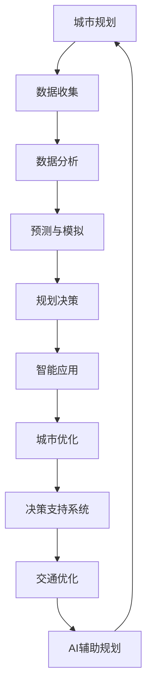

                 

### 文章标题

# AI辅助的智能城市规划：优化土地使用和发展

### 文章关键词

- 智能城市规划
- AI辅助
- 土地使用分析
- 机器学习
- 决策支持系统

### 文章摘要

本文深入探讨了AI辅助的智能城市规划，重点分析了AI在土地使用分析、规划决策支持以及城市交通规划中的应用。通过详细的原理讲解、算法分析以及实际案例研究，本文旨在揭示AI技术如何为城市规划和土地使用优化提供强大支持，从而推动城市的可持续发展。

---

### 引言与背景

#### 智能城市规划的定义

智能城市规划是指利用现代信息技术，特别是人工智能（AI）、大数据、物联网等，对城市空间进行科学规划与管理的一种新型城市规划模式。智能城市规划不仅关注城市的物质空间布局，还强调城市的智能服务、生态保护、交通优化等方面，旨在实现城市发展的可持续性和高效性。

#### 智能城市规划的意义

智能城市规划的意义在于：

1. **提升城市规划的精确性和效率**：通过AI技术，可以更加准确地分析城市数据，预测城市发展趋势，提高规划的科学性。
2. **优化土地使用**：AI可以帮助城市规划者更好地分析土地资源，优化土地利用结构，提高土地使用效率。
3. **促进可持续发展**：通过智能规划，可以实现城市的绿色、低碳发展，减少对环境的负面影响。
4. **提高城市居民生活质量**：智能城市规划能够优化城市服务，提升居民的生活舒适度和幸福感。

#### AI在智能城市规划中的应用

AI在智能城市规划中的应用主要体现在以下几个方面：

1. **数据分析和挖掘**：利用机器学习算法对海量城市数据进行挖掘和分析，为城市规划提供数据支持。
2. **智能预测与模拟**：通过时间序列分析和深度学习模型，对城市的发展趋势进行预测，为规划决策提供依据。
3. **决策支持**：利用决策支持系统（DSS），帮助城市规划者进行科学决策，优化规划方案。
4. **城市交通优化**：通过AI算法优化城市交通流量，提升交通运行效率。

### 城市规划与AI的核心概念

#### 城市规划的基本概念

城市规划是指为了实现城市的可持续发展，对城市的土地使用、空间布局、基础设施建设等进行科学规划和管理的活动。城市规划包括总体规划和详细规划，涵盖城市的经济、社会、环境等多方面因素。

#### AI的基本概念

人工智能是指计算机系统模拟人类智能行为的能力，包括感知、学习、推理、决策等。AI技术主要包括机器学习、深度学习、自然语言处理等。

#### AI在城市规划中的核心应用

AI在城市规划中的核心应用包括：

1. **数据挖掘与可视化**：利用AI技术对城市大数据进行分析，挖掘有价值的信息，并通过可视化技术直观展示。
2. **预测与模拟**：通过时间序列分析和深度学习模型，对城市的发展趋势进行预测，辅助规划决策。
3. **决策支持**：利用决策支持系统，为城市规划者提供科学的决策建议，优化规划方案。
4. **城市交通优化**：通过AI算法优化交通流量，提高交通运行效率。

#### 城市规划与AI的关系架构 Mermaid 流程图

### AI在土地使用分析中的应用

#### AI在土地利用现状分析中的应用

AI在土地利用现状分析中的应用主要包括以下几个方面：

1. **土地利用类型的识别**：通过计算机视觉技术，对遥感图像进行分析，识别土地利用类型。
2. **土地使用效率评估**：利用机器学习算法，分析土地的利用效率，评估土地的利用价值。
3. **土地资源分布分析**：通过数据挖掘技术，分析土地资源的分布情况，为土地资源管理提供依据。

#### AI在土地利用潜力分析中的应用

AI在土地利用潜力分析中的应用包括：

1. **潜力评估模型**：建立基于机器学习的土地利用潜力评估模型，预测不同区域的土地利用潜力。
2. **空间数据分析**：利用空间数据分析技术，分析土地的适宜性和限制性条件，为土地利用规划提供参考。
3. **土地资源优化**：通过优化算法，优化土地利用结构，提高土地利用效率。

#### AI在土地利用规划中的应用

AI在土地利用规划中的应用包括：

1. **规划方案生成**：利用机器学习算法，根据土地利用现状和潜力分析结果，生成多种规划方案。
2. **规划方案评估**：通过模拟分析，评估不同规划方案的社会、经济和环境效益，为决策提供依据。
3. **规划方案优化**：利用优化算法，对规划方案进行优化，提高规划方案的质量和可行性。

### AI辅助智能城市规划的核心算法与原理

#### 空间数据挖掘与可视化

##### 空间数据挖掘的基本概念

空间数据挖掘是指从空间数据中自动发现隐藏的、有价值的信息和知识的过程。空间数据挖掘的主要任务包括：

1. **模式识别**：识别空间数据中的规律和模式，如土地利用类型的分布、交通流量等。
2. **异常检测**：检测空间数据中的异常情况，如城市中的违章建筑、交通拥堵等。
3. **趋势分析**：分析空间数据中的趋势和变化，如城市扩张、土地利用变化等。

##### 空间数据挖掘的方法

空间数据挖掘的方法主要包括：

1. **聚类分析**：将空间数据按照相似性进行分组，如基于密度的聚类算法（DBSCAN）。
2. **分类算法**：根据已知的数据对未知数据进行分类，如决策树、支持向量机（SVM）。
3. **回归分析**：建立因变量和自变量之间的关系模型，如线性回归、多元回归。

##### 城市规划中的空间数据可视化

空间数据可视化是将空间数据以图形化的形式展示，帮助城市规划者直观理解数据。空间数据可视化主要包括以下几种类型：

1. **点状图**：用于展示单一数据点的位置和属性，如城市交通流量点状图。
2. **线状图**：用于展示连续的数据点之间的联系，如城市道路网线状图。
3. **面状图**：用于展示区域性的数据分布，如土地利用类型的面状图。

#### 机器学习在土地使用预测中的应用

##### 机器学习的基本概念

机器学习是指通过算法使计算机自动学习数据，并从中提取知识的过程。机器学习主要包括以下几个阶段：

1. **数据收集**：收集与土地使用相关的数据，如土地利用现状、人口分布、交通流量等。
2. **数据预处理**：对收集到的数据进行清洗、归一化等处理，以便于后续分析。
3. **模型训练**：利用训练数据训练机器学习模型，如线性回归、决策树、支持向量机等。
4. **模型评估**：利用测试数据评估模型的性能，如准确率、召回率、F1值等。
5. **模型优化**：根据评估结果对模型进行调整和优化，以提高预测精度。

##### 机器学习在土地使用预测中的应用

机器学习在土地使用预测中的应用主要包括：

1. **时间序列预测**：利用时间序列分析方法，预测未来一段时间内土地使用的趋势，如基于ARIMA模型的土地使用预测。
2. **空间预测**：利用空间分析方法，预测不同区域的土地使用情况，如基于K最近邻算法的空间预测。
3. **多变量预测**：利用多变量分析方法，预测多个变量之间的关系，如基于多元线性回归的多变量土地使用预测。

##### 常见的土地使用预测模型

常见的土地使用预测模型包括：

1. **线性回归模型**：通过建立因变量和自变量之间的线性关系，预测土地使用量。
2. **决策树模型**：通过构建决策树，对土地使用进行分类预测。
3. **支持向量机（SVM）模型**：通过支持向量机，预测土地使用的分类和回归问题。
4. **神经网络模型**：通过构建神经网络模型，对土地使用进行非线性预测。

#### 智能规划中的决策支持系统

##### 决策支持系统的定义

决策支持系统（DSS）是指利用计算机技术，为决策者提供信息、分析和模拟工具，辅助决策者进行科学决策的系统。DSS的主要功能包括：

1. **信息收集**：收集与决策相关的各种信息，如土地利用数据、人口数据、经济数据等。
2. **数据分析**：利用数据分析方法，对信息进行处理和分析，为决策提供依据。
3. **模拟仿真**：通过模拟仿真，预测不同决策方案的结果，为决策提供参考。
4. **决策建议**：根据分析结果，为决策者提供决策建议，优化决策方案。

##### 决策支持系统在智能规划中的应用

决策支持系统在智能规划中的应用主要包括：

1. **土地利用规划**：利用DSS对土地利用进行规划，优化土地利用结构。
2. **交通规划**：利用DSS进行交通流量预测和交通组织优化，提高交通运行效率。
3. **环境保护**：利用DSS监测环境污染情况，预测污染趋势，提出环保措施。
4. **城市发展**：利用DSS分析城市发展趋势，预测城市发展需求，制定城市发展策略。

##### 决策支持系统的设计与实现

决策支持系统的设计与实现主要包括以下几个步骤：

1. **需求分析**：分析决策者的需求，明确DSS的功能和目标。
2. **系统设计**：设计DSS的系统架构，包括数据层、分析层、展示层等。
3. **模型构建**：构建DSS的预测和分析模型，如线性回归模型、决策树模型、神经网络模型等。
4. **系统实现**：根据系统设计，实现DSS的软件功能，并进行调试和测试。
5. **系统部署**：将DSS部署到生产环境，提供决策支持服务。

#### 城市交通规划的AI辅助

##### 城市交通规划的基本概念

城市交通规划是指为了实现城市的可持续发展，对城市交通系统进行科学规划与管理的一种活动。城市交通规划主要包括以下几个方面：

1. **交通需求分析**：分析城市交通的需求量、分布和时间特性。
2. **交通系统设计**：设计城市交通系统的结构和布局，包括道路、交通设施、公共交通等。
3. **交通管理**：制定交通管理政策，优化交通运行效率。
4. **交通安全**：保障城市交通的安全，减少交通事故。

##### AI在城市交通规划中的应用

AI在城市交通规划中的应用主要包括：

1. **交通流量预测**：利用机器学习算法，预测未来的交通流量，为交通规划提供依据。
2. **交通组织优化**：利用优化算法，优化交通流量和组织，提高交通运行效率。
3. **交通信号控制**：利用深度学习算法，实现智能交通信号控制，提高交通通行能力。
4. **公共交通优化**：利用人工智能技术，优化公共交通的路线、班次和调度，提高公共交通的服务水平。

##### 城市交通规划的案例研究

**案例一：智能交通信号控制系统**

智能交通信号控制系统利用深度学习算法，根据实时交通流量数据，动态调整交通信号灯的时序，以减少交通拥堵和提高通行效率。具体步骤如下：

1. **数据收集**：收集城市各主要路口的实时交通流量数据。
2. **模型训练**：利用收集到的数据训练深度学习模型，预测每个路口的未来交通流量。
3. **信号控制**：根据模型预测的交通流量，动态调整交通信号灯的时序。

**案例二：公共交通优化系统**

公共交通优化系统利用机器学习算法，分析公共交通的运行数据，优化公共交通的路线、班次和调度，以提高公共交通的服务水平。具体步骤如下：

1. **数据收集**：收集公共交通的运行数据，如线路长度、乘客流量、车辆运行时间等。
2. **模型训练**：利用收集到的数据训练机器学习模型，预测公共交通的运行效率。
3. **优化建议**：根据模型预测的结果，提出公共交通的优化建议，如调整路线、增加班次等。

### AI辅助的智能城市规划实践

#### 案例分析一：智慧城市建设

**背景介绍**

智慧城市是指利用物联网、云计算、大数据、人工智能等先进技术，实现城市管理的智能化和精细化。智慧城市建设的目标是实现城市资源的优化配置、提高城市居民的生活质量、促进城市的可持续发展。

**核心算法原理讲解**

智慧城市建设中的核心算法包括：

1. **数据挖掘与可视化**：利用数据挖掘技术，分析城市运行数据，挖掘有价值的信息，并通过可视化技术直观展示。
2. **机器学习**：利用机器学习算法，对城市运行数据进行预测和分析，为城市规划提供数据支持。
3. **决策支持**：利用决策支持系统，为城市规划者提供科学的决策建议，优化规划方案。

**数学模型和公式**

智慧城市建设中的数学模型主要包括：

1. **数据挖掘模型**：如K-means聚类算法、关联规则挖掘算法等。
2. **机器学习模型**：如线性回归模型、决策树模型、支持向量机（SVM）模型等。
3. **决策支持模型**：如线性规划模型、动态规划模型等。

**举例说明**

以智慧交通系统为例，利用机器学习算法预测交通流量，优化交通信号灯控制，减少交通拥堵。具体步骤如下：

1. **数据收集**：收集城市各主要路口的实时交通流量数据。
2. **模型训练**：利用收集到的数据训练机器学习模型，预测每个路口的未来交通流量。
3. **信号控制**：根据模型预测的交通流量，动态调整交通信号灯的时序。

#### 案例分析二：城市土地使用优化

**背景介绍**

城市土地使用优化是指通过对城市土地利用进行分析和规划，优化土地利用结构，提高土地利用效率，促进城市的可持续发展。

**核心算法原理讲解**

城市土地使用优化中的核心算法包括：

1. **空间数据挖掘与可视化**：利用空间数据挖掘技术，分析土地利用现状，挖掘土地利用的规律和问题。
2. **机器学习**：利用机器学习算法，预测土地利用变化趋势，优化土地利用结构。
3. **决策支持**：利用决策支持系统，为城市规划者提供科学的决策建议，优化土地利用规划。

**数学模型和公式**

城市土地使用优化中的数学模型主要包括：

1. **空间数据挖掘模型**：如K-means聚类算法、DBSCAN算法等。
2. **机器学习模型**：如线性回归模型、决策树模型、支持向量机（SVM）模型等。
3. **决策支持模型**：如线性规划模型、动态规划模型等。

**举例说明**

以城市土地利用优化为例，利用机器学习算法预测土地利用变化趋势，优化土地利用结构。具体步骤如下：

1. **数据收集**：收集城市土地利用现状数据，包括土地利用类型、面积、位置等。
2. **模型训练**：利用收集到的数据训练机器学习模型，预测未来的土地利用变化趋势。
3. **规划建议**：根据模型预测的结果，提出土地利用优化的规划建议，如调整土地利用结构、优化土地利用布局等。

#### 案例分析三：智能交通系统

**背景介绍**

智能交通系统是指利用人工智能、物联网、大数据等先进技术，实现交通系统的智能化管理和运营，以提高交通运行效率、减少交通拥堵、提高交通安全。

**核心算法原理讲解**

智能交通系统中的核心算法包括：

1. **数据挖掘与可视化**：利用数据挖掘技术，分析交通数据，挖掘交通运行规律和问题。
2. **机器学习**：利用机器学习算法，预测交通流量和交通状况，优化交通信号控制。
3. **决策支持**：利用决策支持系统，为交通管理者提供科学的决策建议，优化交通管理策略。

**数学模型和公式**

智能交通系统中的数学模型主要包括：

1. **数据挖掘模型**：如K-means聚类算法、关联规则挖掘算法等。
2. **机器学习模型**：如线性回归模型、决策树模型、支持向量机（SVM）模型等。
3. **决策支持模型**：如线性规划模型、动态规划模型等。

**举例说明**

以智能交通信号控制系统为例，利用机器学习算法优化交通信号控制，减少交通拥堵。具体步骤如下：

1. **数据收集**：收集城市各主要路口的实时交通流量数据。
2. **模型训练**：利用收集到的数据训练机器学习模型，预测每个路口的未来交通流量。
3. **信号控制**：根据模型预测的交通流量，动态调整交通信号灯的时序。

### AI辅助城市规划的挑战与未来趋势

#### AI在城市规划中的挑战

AI在城市规划中的应用虽然带来了许多机遇，但也面临着一系列挑战：

1. **数据质量和完整性**：城市数据的多样性和复杂性导致数据质量和完整性难以保证，这对AI算法的性能有较大影响。
2. **算法透明性和可解释性**：AI算法的复杂性和黑盒特性使得其决策过程缺乏透明性，难以解释，这可能影响规划决策的接受度和信任度。
3. **算法偏见**：AI算法可能会受到训练数据中存在的偏见影响，导致规划结果的不公平性。
4. **技术依赖**：城市规划过度依赖AI技术可能导致技术风险，如算法失效、数据泄露等。

#### AI辅助城市规划的未来趋势

1. **多源数据融合**：利用物联网、大数据等技术，实现多源数据的融合和分析，提高数据质量和规划精度。
2. **算法透明化和可解释性**：发展可解释的AI算法，提高算法的透明性和可解释性，增强规划决策的可信度。
3. **社会公平性**：通过算法公平性设计，减少算法偏见，确保规划结果的社会公平性。
4. **人机协同**：促进AI技术与城市规划者的协同工作，发挥人工智能的优势，同时保留人类专家的智慧和经验。

### 附录

#### 附录A：AI辅助城市规划工具与资源

1. **AI城市规划工具概述**

AI城市规划工具主要包括：

- **数据分析工具**：如Python的Pandas、NumPy库，R语言等。
- **机器学习工具**：如Scikit-learn、TensorFlow、PyTorch等。
- **空间分析工具**：如ArcGIS、QGIS等。
- **可视化工具**：如Matplotlib、Plotly、Tableau等。

2. **常用AI城市规划工具介绍**

- **Scikit-learn**：Python的一个开源机器学习库，提供多种机器学习算法，适合进行数据分析和预测。
- **TensorFlow**：Google开源的深度学习框架，支持构建和训练各种深度学习模型。
- **ArcGIS**：ESRI公司开发的空间分析软件，提供丰富的地图制作和分析功能。
- **QGIS**：开源的空间分析软件，功能与ArcGIS类似，适合进行地理信息数据分析。

3. **城市规划相关资源推荐**

- **开源数据平台**：如OpenStreetMap、Google地图API等，提供丰富的地理信息数据。
- **在线教程和课程**：如Coursera、edX等平台上的机器学习和GIS相关课程。
- **专业论坛和社区**：如Stack Overflow、GIS Stack Exchange等，提供技术支持和交流。

### 作者信息

- 作者：AI天才研究院/AI Genius Institute & 禅与计算机程序设计艺术 /Zen And The Art of Computer Programming

### 最佳实践 tips

1. **数据质量控制**：确保使用的数据质量高、完整，减少数据误差对AI算法的影响。
2. **算法透明性**：在AI算法的设计和应用过程中，注重算法的透明性和可解释性，提高规划决策的可信度。
3. **人机协同**：充分利用人工智能技术，同时重视城市规划者的经验和专业知识，实现人机协同，提高规划质量和效率。

### 小结

AI辅助的智能城市规划为城市土地使用优化和发展提供了强大的技术支持。通过AI技术的应用，可以实现城市规划的智能化、精细化和可持续发展。然而，AI在城市规划中的应用仍面临诸多挑战，需要不断探索和改进。未来，随着AI技术的不断进步和城市规划需求的日益增长，AI辅助的智能城市规划必将发挥更大的作用，为城市的发展贡献力量。 

### 注意事项

1. **数据隐私**：在收集和使用城市数据时，要严格遵守相关法律法规，保护个人隐私。
2. **技术风险**：对AI技术在城市规划中的应用进行风险评估，制定相应的应对措施，确保城市规划的顺利进行。
3. **政策支持**：政府应加大对AI辅助智能城市规划的投入和政策支持，推动城市智能化发展。

### 拓展阅读

1. **《智慧城市：概念、技术与应用》**：详细介绍了智慧城市的概念、技术框架和应用案例。
2. **《人工智能：一种现代的方法》**：全面讲解了人工智能的基本概念、技术和应用。
3. **《城市数据挖掘：技术与应用》**：探讨了城市数据挖掘的方法和应用，为AI辅助城市规划提供了理论支持。

