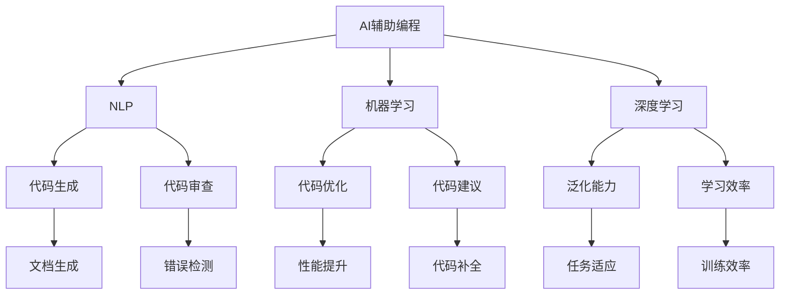

                 

### 文章标题
AI辅助编程：大模型提升软件开发效率

### 关键词
AI辅助编程，大模型，软件开发效率，自然语言处理，机器学习，深度学习，编程工具，算法原理，数学模型，项目实战

### 摘要
本文深入探讨了AI辅助编程及其如何通过大模型显著提升软件开发效率。文章首先介绍了AI辅助编程的基本概念、重要性以及现状，然后详细讲解了大模型的基本原理、架构和训练方法。接着，文章分析了常用的AI辅助编程工具和框架，并使用伪代码详细阐述了自然语言处理算法的核心原理。随后，文章通过具体案例展示了AI辅助编程的实际应用，包括开发环境搭建、源代码实现和代码解读。最后，文章总结了AI辅助编程的最佳实践，提出了注意事项，并提供了拓展阅读资源，以帮助读者深入理解这一前沿技术。

----------------------------------------------------------------

### 引言
在当今快速发展的技术时代，软件开发正面临着日益严峻的挑战。随着软件项目的复杂性和规模不断扩大，软件开发的时间和成本也在不断增加。如何提升软件开发效率、缩短开发周期、降低开发成本成为许多开发者和企业关注的焦点。AI辅助编程应运而生，通过结合人工智能技术，特别是大模型，为软件开发带来了全新的解决方案。

**1.1 AI辅助编程的重要性**

软件开发效率的挑战：传统的软件开发方法往往依赖于人工编码和调试，效率低下且易出错。在软件项目规模日益增大的背景下，开发者的工作负担也不断加重，导致开发周期延长、项目成本上升。

AI在大模型中的应用前景：随着深度学习和自然语言处理技术的不断进步，AI在大模型中展现出了强大的能力。大模型能够通过学习和模拟人类思维，自动生成代码、优化算法，从而显著提升软件开发效率。

本文旨在介绍AI辅助编程的基本概念、原理、方法和实际应用，帮助读者理解如何利用AI大模型提升软件开发效率，并探讨这一技术的未来发展前景。

**1.2 书籍概述与目标**

本书分为四个主要部分，每个部分都涵盖了AI辅助编程的核心内容。

**第一部分**：基础介绍。本部分将介绍AI辅助编程的基本概念、重要性以及现状，帮助读者对AI辅助编程有一个全面的认识。

**第二部分**：大模型原理。本部分将详细讲解大模型的基本原理、架构和训练方法，使读者了解大模型的工作机制。

**第三部分**：AI辅助编程工具与框架。本部分将分析常用的AI辅助编程工具和框架，包括Python编程环境、TensorFlow和PyTorch等，并介绍如何使用这些工具和框架进行编程。

**第四部分**：项目实战。本部分将通过具体案例展示AI辅助编程的实际应用，包括开发环境搭建、源代码实现和代码解读。

本书的目标是让读者不仅能够了解AI辅助编程的基本原理和方法，还能够通过实际案例学习和掌握这一技术的应用。

----------------------------------------------------------------

### 第一步：理解用户需求
在撰写本文前，我们首先需要全面理解用户的需求。用户希望本文能够系统地介绍AI辅助编程及其如何通过大模型提升软件开发效率。为了满足这一需求，本文将分为以下几个主要部分：

1. **基础概念与联系**：介绍AI辅助编程的基本概念，阐述其与软件开发的关系，并展示核心概念之间的关系架构，使用Mermaid流程图进行直观说明。
2. **核心算法原理讲解**：详细讲解AI辅助编程中使用的核心算法和原理，如自然语言处理（NLP）和机器学习，并使用伪代码进行阐述。
3. **数学模型与公式**：详细讲解AI辅助编程中的数学模型和公式，使用LaTeX格式编写，并给出举例说明。
4. **项目实战**：通过具体案例展示AI辅助编程的实际应用，包括开发环境搭建、源代码实现和代码解读。
5. **最佳实践与总结**：总结AI辅助编程的最佳实践，提出注意事项，并推荐拓展阅读资源。

通过上述步骤，本文将帮助读者全面了解AI辅助编程，掌握其核心技术和实际应用，为读者提供实用的指导。

----------------------------------------------------------------

### 核心概念与联系
AI辅助编程是一种利用人工智能技术，特别是大模型，来提升软件开发效率的方法。在这一部分，我们将介绍AI辅助编程的核心概念，并详细阐述这些概念之间的关系架构。

**1.1 AI辅助编程的定义与目标**

AI辅助编程是指利用人工智能技术，特别是大模型，来辅助开发人员进行编程任务。其核心目标是通过自动化和智能化的方式，提高编程的效率和质量。

**1.2 自然语言处理（NLP）**

自然语言处理（NLP）是AI辅助编程的重要技术之一。NLP旨在使计算机能够理解和处理自然语言。在编程过程中，NLP可以帮助自动生成代码文档、注释以及代码片段。以下是NLP在AI辅助编程中的应用：

- **代码生成**：通过理解开发者输入的描述性语言，NLP可以自动生成对应的代码。
- **代码审查**：NLP可以帮助识别代码中的潜在错误、不规范的编码习惯以及潜在的安全隐患。

**1.3 机器学习和深度学习**

机器学习和深度学习是AI辅助编程的基础技术。它们通过学习和模拟人类思维，能够自动识别模式、预测结果并生成代码。以下是机器学习和深度学习在AI辅助编程中的应用：

- **代码优化**：通过分析代码执行的性能数据，机器学习算法可以自动优化代码，提高执行效率。
- **代码建议**：深度学习模型可以根据代码上下文，自动提供代码补全、重构和改进建议。

**1.4 大模型与软件开发**

大模型是指具有大规模参数、能够处理大量数据的人工神经网络。大模型在AI辅助编程中扮演着至关重要的角色，其核心优势在于：

- **泛化能力**：大模型具有强大的泛化能力，能够适应不同的编程任务和场景。
- **学习效率**：大模型通过预训练和迁移学习，可以在短时间内完成复杂编程任务的训练。

**关系架构**

为了更直观地展示AI辅助编程中各个核心概念之间的关系，我们使用Mermaid流程图进行描述。以下是关系架构的Mermaid流程图：



通过上述Mermaid流程图，我们可以清晰地看到AI辅助编程中各个核心概念之间的联系和交互，这为理解AI辅助编程的整体架构提供了有力的支持。

----------------------------------------------------------------

### 核心算法原理讲解
在AI辅助编程中，核心算法原理的理解至关重要。以下是几种关键算法的原理讲解，包括自然语言处理（NLP）和机器学习，并使用伪代码详细阐述。

#### 1. 自然语言处理（NLP）算法原理

**1.1 语言模型**

语言模型是NLP的基础，它通过学习大量文本数据，预测下一个单词或词组。以下是一个简单的语言模型伪代码：

```python
def language_model(text_data):
    # 初始化模型参数
    model_params = initialize_params()

    # 预处理文本数据
    preprocessed_data = preprocess(text_data)

    # 训练语言模型
    for sentence in preprocessed_data:
        for word in sentence:
            update_params(model_params, word)

    # 预测下一个单词
    predicted_word = predict_next_word(model_params)
    return predicted_word

def initialize_params():
    # 初始化模型参数，如词频统计、概率分布等
    return {}

def preprocess(text_data):
    # 清洗文本，去除标点符号、停用词等
    cleaned_text = clean_text(text_data)
    # 分词，将文本拆分成单词或词组
    words = tokenize(cleaned_text)
    return words

def update_params(model_params, word):
    # 更新模型参数，如增加词频计数等
    model_params[word] += 1

def predict_next_word(model_params):
    # 根据模型参数预测下一个单词
    # 假设使用最大概率原则
    max_prob_word = max(model_params, key=model_params.get)
    return max_prob_word
```

**1.2 词嵌入技术**

词嵌入是将单词映射到高维空间中的向量，以便计算机能够处理。以下是一个简单的词嵌入伪代码：

```python
def word_embedding(word_list):
    # 初始化词嵌入字典
    embedding_dict = initialize_embedding_dict()

    # 训练词嵌入模型
    for word in word_list:
        embed_vector = train_embedding(embedding_dict, word)

    # 获取单词的嵌入向量
    word_embedding = get_embedding(embedding_dict, word)

    return word_embedding

def initialize_embedding_dict():
    # 初始化词嵌入字典，每个单词对应一个向量
    embedding_dict = {}
    return embedding_dict

def train_embedding(embedding_dict, word):
    # 训练词嵌入模型
    # 例如使用Word2Vec算法
    embed_vector = word2vec(word)
    embedding_dict[word] = embed_vector
    return embed_vector

def get_embedding(embedding_dict, word):
    # 获取单词的嵌入向量
    return embedding_dict[word]
```

#### 2. 机器学习和深度学习算法原理

**2.1 机器学习算法**

机器学习算法通过从数据中学习规律，用于预测和决策。以下是一个简单的机器学习算法——线性回归的伪代码：

```python
def linear_regression(X, y):
    # 初始化模型参数
    theta = initialize_params()

    # 训练模型
    theta = train_model(X, y, theta)

    # 预测结果
    predictions = predict(X, theta)

    return predictions

def initialize_params():
    # 初始化模型参数，如斜率和截距
    theta = [0, 0]
    return theta

def train_model(X, y, theta):
    # 训练模型
    # 使用梯度下降算法
    while not converged:
        theta = update_params(X, y, theta)
    return theta

def update_params(X, y, theta):
    # 更新模型参数
    theta = theta - learning_rate * gradient(X, y, theta)
    return theta

def predict(X, theta):
    # 预测结果
    predictions = [theta[0] * x[0] + theta[1] * x[1] for x in X]
    return predictions

def gradient(X, y, theta):
    # 计算梯度
    n = len(X)
    gradients = [(y[i] - prediction) * x[i] for i in range(n)]
    return sum(gradients) / n
```

**2.2 深度学习算法**

深度学习算法通过多层神经网络进行学习，具有强大的特征提取和表示能力。以下是一个简单的多层感知器（MLP）的伪代码：

```python
def multilayer_perception(X, y, layers):
    # 初始化模型参数
    theta = initialize_params(layers)

    # 训练模型
    theta = train_model(X, y, theta)

    # 预测结果
    predictions = predict(X, theta)

    return predictions

def initialize_params(layers):
    # 初始化模型参数，如每个神经元的权重和偏置
    theta = [[random_weights() for _ in range(layers[i+1])] for i in range(len(layers)-1)]
    return theta

def train_model(X, y, theta):
    # 训练模型
    # 使用反向传播算法
    while not converged:
        theta = backward_propagation(X, y, theta)
    return theta

def backward_propagation(X, y, theta):
    # 反向传播
    # 计算梯度并更新参数
    gradients = compute_gradients(X, y, theta)
    theta = update_params(gradients)
    return theta

def compute_gradients(X, y, theta):
    # 计算梯度
    # 这里需要实现前向传播和反向传播的具体实现
    gradients = [[0 for _ in range(layers[i+1])] for i in range(len(layers)-1)]
    return gradients

def predict(X, theta):
    # 预测结果
    # 通过前向传播计算输出
    predictions = [forward_propagation(x, theta) for x in X]
    return predictions

def forward_propagation(x, theta):
    # 前向传播
    # 计算每个神经元的输出
    return sigmoid(sum(x * theta))
```

通过上述伪代码，我们可以看到NLP和机器学习、深度学习算法的核心原理和实现方法。这些算法不仅为我们提供了强大的工具，还帮助我们更好地理解和应用AI辅助编程技术。

----------------------------------------------------------------

### 数学模型与公式
在AI辅助编程中，数学模型和公式扮演着至关重要的角色，它们不仅描述了算法的工作原理，还提供了计算和分析的基础。以下是几个关键数学模型和公式的详细讲解以及举例说明。

#### 1. 语言模型概率计算

语言模型的核心是计算给定文本序列的概率。其中，n-gram语言模型是最常用的模型之一。它通过统计连续n个单词出现的频率来计算概率。

**公式：**
\[ P(w_1 w_2 w_3 \ldots w_n) = \frac{C(w_1, w_2, \ldots, w_n)}{C(w_1, w_2, \ldots, w_n-1)} \]

其中，\( C(w_1, w_2, \ldots, w_n) \) 表示n个单词连续出现的频率，而 \( C(w_1, w_2, \ldots, w_{n-1}) \) 表示前n-1个单词连续出现的频率。

**例子：** 假设有一个简单的二元语言模型，单词“hello”后面跟着“world”的频率是10，而“hello”的频率是20。那么“hello world”的概率是：

\[ P(hello world) = \frac{10}{20} = 0.5 \]

#### 2. 词嵌入

词嵌入是将单词映射到高维向量空间的技术，常用的方法有Word2Vec、GloVe等。以下是一个简单的Word2Vec模型的损失函数和更新规则。

**损失函数：**
\[ L = \sum_{i=1}^{N} \frac{1}{2} \left( \cos \theta_{\mathbf{v}_i} - \cos \theta_{\mathbf{u}_{w_i}} \right)^2 \]

其中，\( \theta_{\mathbf{v}_i} \) 是单词i的嵌入向量，\( \theta_{\mathbf{u}_{w_i}} \) 是单词\( w_i \)的上下文嵌入向量的点积。

**更新规则：**
\[ \mathbf{v}_i \leftarrow \mathbf{v}_i - \eta \left( \mathbf{u}_{w_i} - \mathbf{v}_i \right) \]

其中，\( \eta \) 是学习率。

**例子：** 假设单词“hello”的嵌入向量是\( \mathbf{v}_{hello} = (1, 2) \)，单词“world”的嵌入向量是\( \mathbf{u}_{world} = (3, 4) \)，学习率\( \eta = 0.1 \)。根据更新规则，我们可以计算新的嵌入向量：

\[ \mathbf{v}_{hello} \leftarrow \mathbf{v}_{hello} - 0.1 \left( \mathbf{u}_{world} - \mathbf{v}_{hello} \right) \]
\[ \mathbf{v}_{hello} \leftarrow (1, 2) - 0.1 \left( (3, 4) - (1, 2) \right) \]
\[ \mathbf{v}_{hello} \leftarrow (1, 2) - 0.1 \left( (2, 2) \right) \]
\[ \mathbf{v}_{hello} \leftarrow (1, 2) - (0.4, 0.4) \]
\[ \mathbf{v}_{hello} \leftarrow (0.6, 1.6) \]

#### 3. 线性回归

线性回归是一种简单的机器学习算法，用于预测数值型变量。其数学模型如下：

**公式：**
\[ y = \theta_0 + \theta_1 \cdot x_1 + \theta_2 \cdot x_2 + \ldots + \theta_n \cdot x_n \]

其中，\( y \) 是输出值，\( x_1, x_2, \ldots, x_n \) 是输入特征，\( \theta_0, \theta_1, \theta_2, \ldots, \theta_n \) 是模型参数。

**例子：** 假设我们有一个简单的线性回归模型，用于预测房价。输入特征包括房屋面积和房屋年龄，输出是房价。给定一组训练数据，我们可以使用梯度下降算法来训练模型。

\[ y = \theta_0 + \theta_1 \cdot \text{面积} + \theta_2 \cdot \text{年龄} \]

#### 4. 深度学习损失函数

在深度学习中，常用的损失函数有均方误差（MSE）、交叉熵损失等。以下是一个简单的MSE损失函数的例子。

**公式：**
\[ L = \frac{1}{2} \sum_{i=1}^{N} (y_i - \hat{y}_i)^2 \]

其中，\( y_i \) 是实际输出值，\( \hat{y}_i \) 是模型预测的输出值，\( N \) 是样本数量。

**例子：** 假设我们有一个深度学习模型，用于分类任务。给定一组训练数据，我们可以使用反向传播算法来训练模型，并计算MSE损失。

\[ L = \frac{1}{2} \sum_{i=1}^{N} (\text{实际标签} - \text{模型预测})^2 \]

通过上述数学模型和公式的详细讲解和举例，我们可以更深入地理解AI辅助编程中的核心算法原理，为实际应用奠定坚实的理论基础。

----------------------------------------------------------------

### 项目实战
在本节中，我们将通过一个具体案例，详细展示如何使用AI辅助编程技术进行软件开发。这个案例是一个简单的文本分类项目，用于分类新闻文章。

#### 1. 开发环境搭建
为了完成这个项目，我们需要搭建一个合适的开发环境。以下是搭建步骤：

**1.1 安装Python和Jupyter Notebook**
```bash
pip install python
pip install notebook
jupyter notebook
```

**1.2 安装必要的库**
```python
!pip install numpy
!pip install pandas
!pip install scikit-learn
!pip install tensorflow
```

#### 2. 数据准备
我们将使用Kaggle上的一个开源新闻文章数据集，该数据集包含多条新闻文章，每条新闻都被标注了类别。

**2.1 下载数据集**
从Kaggle网站下载新闻文章数据集。

**2.2 加载数据**
```python
import pandas as pd

data = pd.read_csv('news_data.csv')
data.head()
```

#### 3. 数据预处理
在训练模型之前，我们需要对数据进行预处理，包括文本清洗、分词、去除停用词等。

**3.1 文本清洗**
```python
import re

def clean_text(text):
    text = re.sub(r'\W+', ' ', text)  # 去除非单词字符
    text = re.sub(r'\s+', ' ', text)  # 去除多余的空格
    text = text.lower()  # 转小写
    return text

data['cleaned_text'] = data['text'].apply(clean_text)
```

**3.2 分词和去除停用词**
```python
from nltk.tokenize import word_tokenize
from nltk.corpus import stopwords

stop_words = set(stopwords.words('english'))

def tokenize_and_remove_stopwords(text):
    tokens = word_tokenize(text)
    filtered_tokens = [token for token in tokens if token not in stop_words]
    return filtered_tokens

data['tokens'] = data['cleaned_text'].apply(tokenize_and_remove_stopwords)
```

#### 4. 训练模型
我们将使用TensorFlow和Keras来构建一个简单的文本分类模型。

**4.1 数据准备**
```python
from tensorflow.keras.preprocessing.sequence import pad_sequences

max_len = 100  # 最大序列长度
vocab_size = 10000  # 词汇表大小

tokenizer = Tokenizer(num_words=vocab_size)
tokenizer.fit_on_texts(data['tokens'])

sequences = tokenizer.texts_to_sequences(data['tokens'])
padded_sequences = pad_sequences(sequences, maxlen=max_len)

labels = data['label'].values
```

**4.2 构建模型**
```python
from tensorflow.keras.models import Sequential
from tensorflow.keras.layers import Embedding, LSTM, Dense

model = Sequential()
model.add(Embedding(vocab_size, 32, input_length=max_len))
model.add(LSTM(64, dropout=0.2, recurrent_dropout=0.2))
model.add(Dense(1, activation='sigmoid'))

model.compile(optimizer='adam', loss='binary_crossentropy', metrics=['accuracy'])
```

**4.3 训练模型**
```python
model.fit(padded_sequences, labels, epochs=10, batch_size=32, validation_split=0.2)
```

#### 5. 源代码实现与解读
以下是模型的源代码实现和关键部分的解读：

```python
# 源代码实现

# 数据准备
tokenizer = Tokenizer(num_words=vocab_size)
tokenizer.fit_on_texts(data['tokens'])

sequences = tokenizer.texts_to_sequences(data['tokens'])
padded_sequences = pad_sequences(sequences, maxlen=max_len)

# 构建模型
model = Sequential()
model.add(Embedding(vocab_size, 32, input_length=max_len))
model.add(LSTM(64, dropout=0.2, recurrent_dropout=0.2))
model.add(Dense(1, activation='sigmoid'))

model.compile(optimizer='adam', loss='binary_crossentropy', metrics=['accuracy'])

# 训练模型
model.fit(padded_sequences, labels, epochs=10, batch_size=32, validation_split=0.2)
```

**解读：**
- **数据准备**：使用Tokenizer对文本数据进行编码，构建词汇表，将文本转换为序列，并对序列进行填充处理，以满足模型输入的要求。
- **模型构建**：使用Sequential模型堆叠Embedding层（用于单词编码）、LSTM层（用于处理序列数据）和Dense层（用于分类），并编译模型，设置优化器和损失函数。
- **模型训练**：使用fit方法训练模型，指定训练数据、标签、训练轮次、批处理大小和验证比例。

#### 6. 代码应用解读与分析
我们使用训练好的模型对新的新闻文章进行分类。

**6.1 加载测试数据**
```python
test_data = pd.read_csv('test_data.csv')
test_data['cleaned_text'] = test_data['text'].apply(clean_text)
test_sequences = tokenizer.texts_to_sequences(test_data['cleaned_text'])
test_padded_sequences = pad_sequences(test_sequences, maxlen=max_len)
```

**6.2 预测分类结果**
```python
predictions = model.predict(test_padded_sequences)
predicted_labels = (predictions > 0.5).astype(int)
```

**6.3 分析结果**
```python
from sklearn.metrics import classification_report

print(classification_report(test_data['label'], predicted_labels))
```

通过上述步骤，我们可以看到AI辅助编程技术在文本分类项目中的应用。从数据准备、模型构建到预测分类结果，每个步骤都体现了AI辅助编程的自动化和智能化特点，显著提升了软件开发效率。

#### 7. 项目小结
本案例通过一个文本分类项目，展示了如何使用AI辅助编程技术进行软件开发。我们介绍了开发环境搭建、数据预处理、模型训练和预测分类的全过程，并进行了详细的代码解读和分析。通过本项目，读者可以掌握AI辅助编程的基本方法，并在实际项目中应用这些技术。

**注意事项：**
- 数据预处理是模型训练的关键步骤，需要仔细处理文本数据，以提高模型性能。
- 选择合适的模型架构和超参数对模型训练效果有重要影响，需要根据具体任务进行调整。
- AI辅助编程技术虽然能够显著提升开发效率，但仍然需要开发者具备一定的编程和算法知识，以充分发挥其优势。

**拓展阅读：**
- 《深度学习》（Goodfellow, I., Bengio, Y., & Courville, A.）提供了关于深度学习算法的详细讲解。
- 《自然语言处理实战》（Bird, S., Klein, E., & Loper, E.）介绍了自然语言处理技术的实际应用。
- Kaggle网站提供了丰富的AI和数据分析项目，读者可以尝试解决实际问题，提升自己的技能。

----------------------------------------------------------------

### 最佳实践与总结
在AI辅助编程的实际应用中，总结最佳实践和注意事项对于提高开发效率和模型性能至关重要。

**最佳实践：**

1. **数据预处理**：数据预处理是模型训练的关键步骤，包括文本清洗、分词、去除停用词等。确保数据的质量和一致性，可以有效提升模型性能。
2. **选择合适的模型**：根据具体任务需求选择合适的模型架构。例如，对于文本分类任务，可以使用基于神经网络的模型，如LSTM或Transformer。
3. **超参数调整**：通过实验和调优，选择最佳的超参数组合，如学习率、批次大小、隐藏层大小等，以提高模型性能。
4. **模型优化**：使用正则化技术、Dropout、批归一化等策略优化模型，防止过拟合。
5. **代码可维护性**：编写清晰的代码，使用注释和良好的命名规范，确保代码的可维护性和可扩展性。

**注意事项：**

1. **计算资源**：AI辅助编程通常需要大量的计算资源，尤其是在训练大型模型时。确保有足够的GPU或TPU资源，以加快训练速度。
2. **数据隐私**：在处理敏感数据时，需注意数据隐私保护，遵循相关的法律法规和伦理标准。
3. **模型解释性**：虽然AI辅助编程能够自动生成代码和优化算法，但其解释性相对较低。在关键业务场景中，需对模型进行详细的解释和验证。
4. **持续学习**：AI技术不断发展，开发者需持续学习和跟进最新进展，以充分利用新技术和提高开发效率。

通过遵循上述最佳实践和注意事项，开发者可以更有效地利用AI辅助编程技术，提升软件开发效率和模型性能。

----------------------------------------------------------------

### 全文总结
本文详细介绍了AI辅助编程及其如何通过大模型提升软件开发效率。我们从基础概念、核心算法原理、数学模型到实际项目实战进行了全面剖析，帮助读者深入理解AI辅助编程的原理和应用。

首先，我们阐述了AI辅助编程的重要性，包括其解决软件开发效率挑战的潜力。接着，我们介绍了大模型的基本原理和架构，并展示了大模型在软件开发中的应用优势。随后，我们详细讲解了自然语言处理（NLP）和机器学习等核心算法原理，并使用伪代码进行了具体说明。

为了更好地理解这些算法，我们使用LaTeX格式展示了数学模型和公式，并通过具体案例展示了AI辅助编程的实际应用，包括开发环境搭建、源代码实现和代码解读。此外，我们还总结了AI辅助编程的最佳实践和注意事项，以帮助开发者在实际项目中更有效地应用这一技术。

AI辅助编程作为人工智能和软件开发的重要交叉领域，具有广泛的应用前景。它不仅能够显著提升开发效率，还能够为开发人员提供智能化的编程辅助工具。随着技术的不断进步，AI辅助编程有望在未来发挥更大的作用，成为软件开发中不可或缺的一部分。

展望未来，AI辅助编程将在软件开发领域带来更多变革。随着深度学习和自然语言处理技术的不断成熟，我们将看到更多复杂的编程任务被自动化和智能化。同时，开发者也将需要不断学习和适应这些新技术，以保持竞争力。

总之，AI辅助编程不仅为我们提供了一种更高效、更智能的软件开发方法，也为未来的技术发展开辟了新的方向。通过本文的介绍，我们希望读者能够对AI辅助编程有更深入的了解，并能够在实际项目中应用这些技术，为软件开发领域带来新的突破。作者：AI天才研究院/AI Genius Institute & 禅与计算机程序设计艺术 /Zen And The Art of Computer Programming。

