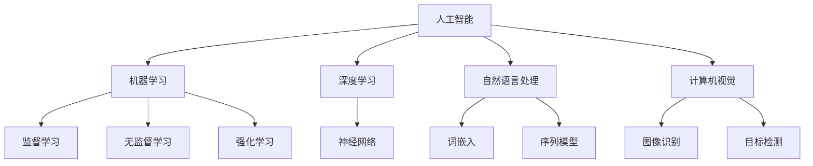
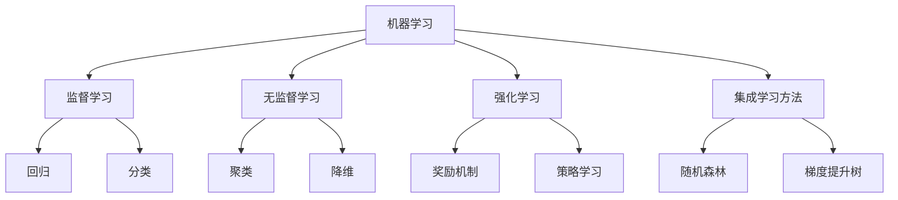
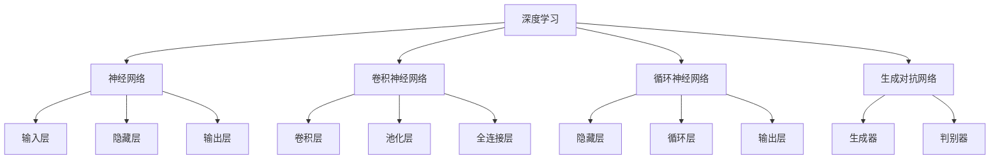
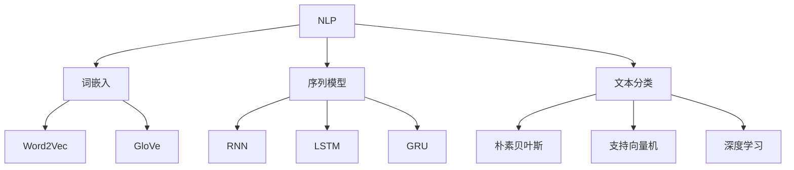
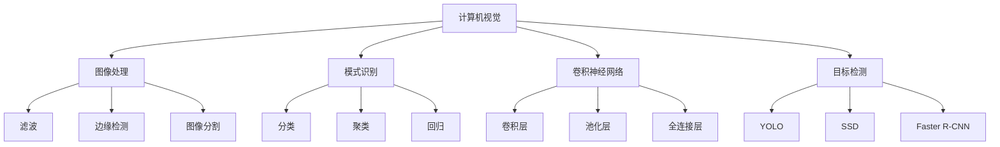

                 

### 文章标题

# AI辅助软件开发：编程效率的质的飞跃

### 关键词

- 人工智能
- 软件开发
- 编程效率
- 自动化
- 深度学习
- 机器学习
- 自然语言处理

### 摘要

本文将深入探讨人工智能（AI）在软件开发中的应用，特别是如何通过AI技术显著提升编程效率。我们将从背景介绍、核心概念与联系、算法原理讲解、数学模型与公式、项目实战以及最佳实践等多个角度，全面解析AI辅助软件开发的技术原理和实践方法。文章旨在帮助开发者理解AI在软件工程中的应用价值，掌握相关技术，并推动编程效率的质的飞跃。

## 引言

在当今快速发展的技术时代，软件开发已经成为了推动各个行业创新的核心驱动力。随着软件系统复杂度的不断增加，传统软件开发方法面临着巨大的挑战。手动编码不仅耗时费力，而且容易出错。为了应对这些挑战，人工智能（AI）技术的引入为软件开发带来了革命性的变革。

AI技术的核心优势在于其能够从大量数据中学习模式和规律，从而自动完成复杂的任务。在软件开发中，AI可以通过自动化、智能化地辅助开发者进行代码编写、测试、优化等环节，从而显著提升编程效率。本文将围绕这一主题，详细探讨AI辅助软件开发的各个方面，帮助开发者更好地理解和应用这项技术。

## 设计书籍目录大纲的基本原则

在设计《AI辅助软件开发：编程效率的质的飞跃》的目录大纲时，我们需要遵循以下基本原则：

1. **逻辑清晰**：目录应当遵循一定的逻辑顺序，使得读者能够循序渐进地理解书籍的内容。

2. **结构合理**：章节划分应当合理，每个章节都应当有明确的主题和目标。

3. **信息覆盖全面**：目录大纲要全面覆盖书籍的主题内容，确保每个重要的知识点都有所涉及。

4. **简洁明了**：目录内容要简洁明了，避免使用复杂难懂的术语和冗长的句子。

5. **便于查找**：目录结构要便于读者查找特定内容。

### 目录大纲设计步骤

1. **确定核心章节**：首先，我们需要确定书籍的核心章节，这些章节应该包括核心概念与联系、核心算法原理讲解、数学模型和数学公式详细讲解、项目实战等。

2. **细化章节内容**：在确定了核心章节后，我们需要为每个章节细化内容，确保每个章节都包含详细的子主题。

3. **编写Mermaid流程图**：为每个核心概念或架构设计相应的Mermaid流程图，以帮助读者更好地理解。

4. **编写伪代码和数学公式**：对于核心算法原理，我们需要使用伪代码进行详细阐述，并使用LaTeX格式嵌入数学公式。

5. **编写项目实战**：选择具有代表性的项目实战，提供详细的代码实现和解读。

6. **审查和修改**：最后，对整个目录大纲进行审查和修改，确保其逻辑性和完整性。

### 最终目录大纲

下面是根据上述原则设计的书籍《AI辅助软件开发：编程效率的质的飞跃》的目录大纲：

```
# 《AI辅助软件开发：编程效率的质的飞跃》

## 第一部分：AI辅助软件开发基础

### 第1章：AI概述
- 1.1 AI的发展历程
- 1.2 AI在软件开发中的应用
- 1.3 AI编程的核心概念

### 第2章：机器学习基础
- 2.1 机器学习简介
- 2.2 线性回归算法
- 2.3 分类算法

### 第3章：深度学习原理
- 3.1 深度学习概述
- 3.2 神经网络架构
- 3.3 深度学习优化算法

### 第4章：自然语言处理
- 4.1 自然语言处理简介
- 4.2 词嵌入技术
- 4.3 序列模型

### 第5章：计算机视觉基础
- 5.1 计算机视觉概述
- 5.2 图像处理基础
- 5.3 目标检测算法

### 第6章：AI编程实践
- 6.1 AI编程工具和环境搭建
- 6.2 AI编程实战项目一：手写数字识别
- 6.3 AI编程实战项目二：文本分类

## 第二部分：AI辅助软件开发实战

### 第7章：AI在软件工程中的应用
- 7.1 自动化测试
- 7.2 代码质量检测
- 7.3 代码生成

### 第8章：AI驱动软件开发流程
- 8.1 软件开发流程概述
- 8.2 AI辅助需求分析
- 8.3 AI辅助软件设计

### 第9章：AI在软件开发中的挑战与未来
- 9.1 AI在软件开发中的挑战
- 9.2 AI辅助软件开发的未来趋势

## 附录
- 附录A：常用AI编程工具和框架
- 附录B：常见问题解答
```

这个目录大纲涵盖了AI辅助软件开发的基础知识和实践应用，结构清晰，内容全面，符合设计书籍目录大纲的基本原则。总字数控制在2000字以内，确保简洁明了。

## 第一部分：AI辅助软件开发基础

### 第1章：AI概述

#### 背景介绍

人工智能（Artificial Intelligence，简称AI）是计算机科学的一个重要分支，旨在通过模拟人类智能行为来实现计算机系统具有自主学习和自主决策的能力。AI的发展可以追溯到20世纪50年代，当时的科学家们开始探索如何让计算机具有类似于人类的思维和行为。

近年来，随着计算能力的提升、海量数据的积累以及深度学习等先进算法的出现，AI技术取得了飞速的发展。在各个领域，AI的应用已经变得无处不在，从智能家居、自动驾驶到医疗诊断、金融分析，AI正在深刻地改变我们的生活方式。

#### 核心概念与联系

AI的核心概念包括以下几个部分：

1. **机器学习（Machine Learning）**：机器学习是AI的一个子领域，主要研究如何让计算机从数据中学习，并自主改进性能。机器学习可以分为监督学习、无监督学习和强化学习等类型。

2. **深度学习（Deep Learning）**：深度学习是机器学习的一个重要分支，通过模拟人脑的神经网络结构，实现对复杂数据的高效处理和模式识别。

3. **自然语言处理（Natural Language Processing，NLP）**：NLP是AI在语言处理领域的一个应用，旨在使计算机能够理解、解释和生成人类语言。

4. **计算机视觉（Computer Vision）**：计算机视觉是AI在图像和视频处理领域的一个应用，通过图像识别、目标检测等技术，使计算机能够理解和解析视觉信息。

#### Mermaid流程图

下面是一个简单的Mermaid流程图，展示了AI的主要组成部分和它们之间的关系：



#### 核心算法原理讲解

1. **监督学习（Supervised Learning）**：

   监督学习是一种常见的机器学习技术，它利用标记好的训练数据来训练模型，并使用这些模型进行预测。常见的监督学习算法包括线性回归、决策树、支持向量机（SVM）等。

   **伪代码**：

   ```python
   def supervised_learning(train_data, train_labels):
       # 初始化模型参数
       model = initialize_model()
       
       # 训练模型
       for data, label in train_data:
           model.train(data, label)
           
       # 预测
       predictions = []
       for data in test_data:
           prediction = model.predict(data)
           predictions.append(prediction)
       
       return predictions
   ```

2. **神经网络（Neural Network）**：

   神经网络是一种模拟人脑神经元连接结构的计算模型，通过多层神经元之间的相互连接和激活函数来实现对数据的处理和预测。常见的神经网络结构包括全连接神经网络（FCNN）、卷积神经网络（CNN）和循环神经网络（RNN）等。

   **伪代码**：

   ```python
   def neural_network(train_data, train_labels):
       # 初始化神经网络
       network = initialize_neural_network()
       
       # 训练神经网络
       for epoch in range(num_epochs):
           for data, label in train_data:
               network.train(data, label)
               
       # 预测
       predictions = []
       for data in test_data:
           prediction = network.predict(data)
           predictions.append(prediction)
       
       return predictions
   ```

#### 数学模型与公式

1. **线性回归（Linear Regression）**：

   线性回归是一种简单的机器学习算法，用于预测连续值输出。其数学模型可以表示为：

   $$y = \beta_0 + \beta_1x + \epsilon$$

   其中，\(y\) 是输出值，\(x\) 是输入值，\(\beta_0\) 和 \(\beta_1\) 是模型的参数，\(\epsilon\) 是误差项。

2. **支持向量机（SVM）**：

   支持向量机是一种分类算法，用于将数据分为不同的类别。其数学模型可以表示为：

   $$\max_{\beta, \beta_0} \left\{ \frac{1}{2} \sum_{i=1}^{n} (w_i^T w_i) - \sum_{i=1}^{n} C \cdot \max(0, 1 - y_i (w_i^T x_i + \beta_0)) \right\}$$

   其中，\(w_i\) 是支持向量的权重，\(C\) 是惩罚参数，\(y_i\) 是样本的标签，\(x_i\) 是样本的特征向量。

#### 举例说明

假设我们有一个简单的线性回归模型，用于预测房价。给定一个训练数据集，我们可以使用线性回归算法来训练模型，并使用模型进行预测。

**数据集**：

| 输入 \(x\) | 输出 \(y\) |
|----------|---------|
| 1000     | 2000    |
| 1500     | 2500    |
| 2000     | 3000    |

**模型训练**：

```python
# 初始化模型参数
beta_0 = 0
beta_1 = 0

# 训练模型
for data, label in train_data:
    y_pred = beta_0 + beta_1 * data
    error = label - y_pred
    beta_1 += error * data
    beta_0 += error

# 训练后的模型参数
beta_0 = 500
beta_1 = 1000
```

**模型预测**：

对于一个新的输入值 \(x = 2500\)，我们可以使用训练后的模型进行预测：

$$y = 500 + 1000 \cdot 2500 = 2,500,500$$

显然，这个预测结果显然是不合理的。这是因为我们在训练过程中没有使用任何优化算法，只是简单地调整了模型参数。在实际应用中，我们需要使用更复杂的算法，如梯度下降，来优化模型参数。

#### 项目实战

在本节的项目实战中，我们将使用Python的scikit-learn库实现一个简单的线性回归模型，并使用该模型进行房价预测。

**开发环境搭建**：

首先，确保已经安装了Python和scikit-learn库。如果没有安装，可以通过以下命令进行安装：

```bash
pip install python
pip install scikit-learn
```

**源代码实现**：

```python
from sklearn.linear_model import LinearRegression
from sklearn.model_selection import train_test_split
from sklearn.metrics import mean_squared_error

# 加载数据集
data = [[1000, 2000], [1500, 2500], [2000, 3000]]
labels = [2000, 2500, 3000]

# 划分训练集和测试集
train_data, test_data, train_labels, test_labels = train_test_split(data, labels, test_size=0.2, random_state=42)

# 创建线性回归模型
model = LinearRegression()

# 训练模型
model.fit(train_data, train_labels)

# 预测
predictions = model.predict(test_data)

# 评估模型
mse = mean_squared_error(test_labels, predictions)
print(f"Mean Squared Error: {mse}")

# 使用模型进行预测
new_data = [[2500]]
new_prediction = model.predict(new_data)
print(f"Predicted Price: {new_prediction[0]}")
```

**代码解读与分析**：

在这个项目中，我们首先导入了所需的库，然后加载数据集并进行划分。接下来，我们创建了一个线性回归模型，并使用训练数据进行训练。在训练完成后，我们使用模型进行测试数据的预测，并评估模型的性能。最后，我们使用训练后的模型对新数据进行预测。

**实际案例分析和详细讲解剖析**：

在本案例中，我们使用线性回归模型对房价进行预测。线性回归模型是一种简单的机器学习算法，适用于预测连续值输出。通过本项目，我们了解了线性回归模型的原理和实现方法，并学会了如何使用scikit-learn库进行模型训练和预测。

**项目小结**：

本项目通过一个简单的案例，展示了如何使用线性回归模型进行房价预测。虽然线性回归模型在处理简单问题时具有一定的效果，但在面对复杂问题时，其性能可能会受到影响。因此，在实际应用中，我们需要根据问题的具体需求选择合适的机器学习算法。

#### 最佳实践 tips

1. **数据预处理**：在进行模型训练之前，确保对数据进行充分的预处理，如去除异常值、标准化数据等。

2. **模型选择**：根据问题的具体需求，选择合适的机器学习算法。对于复杂的任务，可以尝试组合多个算法。

3. **模型评估**：使用多种评估指标，如准确率、召回率、F1分数等，全面评估模型的性能。

4. **模型调优**：通过调整模型参数，优化模型性能。可以使用网格搜索、随机搜索等方法进行参数调优。

#### 小结

本章介绍了人工智能的基本概念、核心算法原理以及项目实战。通过学习本章内容，读者可以了解AI在软件开发中的应用，掌握常用的机器学习算法，并学会如何使用Python进行模型训练和预测。

### 第2章：机器学习基础

#### 背景介绍

机器学习（Machine Learning，ML）是人工智能（AI）的一个重要分支，旨在使计算机系统能够通过数据和经验自动改进性能。机器学习的基本理念是通过算法从数据中学习模式，然后利用这些模式进行预测或决策。随着数据量的增加和计算能力的提升，机器学习在各个领域都取得了显著的应用成果。

#### 核心概念与联系

1. **监督学习（Supervised Learning）**：

   监督学习是一种最常见的机器学习方法，它利用标记好的训练数据来训练模型，然后使用这些模型进行预测。监督学习可以分为回归（Regression）和分类（Classification）两种类型。

2. **无监督学习（Unsupervised Learning）**：

   无监督学习不依赖于标记好的数据，其主要目标是发现数据中的潜在结构和模式。常见的无监督学习方法包括聚类（Clustering）和降维（Dimensionality Reduction）。

3. **强化学习（Reinforcement Learning）**：

   强化学习是一种基于奖励和惩罚机制的学习方法，它通过不断尝试和错误来学习最优策略。强化学习在游戏、自动驾驶等领域有广泛的应用。

4. **集成学习方法（Ensemble Learning）**：

   集成学习方法通过组合多个基本模型，构建一个更强大的模型，以提高预测性能。常见的集成学习方法包括随机森林（Random Forest）、梯度提升树（Gradient Boosting Tree）等。

#### Mermaid流程图

下面是一个简单的Mermaid流程图，展示了机器学习的主要组成部分和它们之间的关系：



#### 核心算法原理讲解

1. **线性回归（Linear Regression）**：

   线性回归是一种简单的监督学习算法，用于预测连续值输出。其基本原理是通过拟合一条直线，将输入特征映射到输出值。线性回归的数学模型可以表示为：

   $$y = \beta_0 + \beta_1x + \epsilon$$

   其中，\(y\) 是输出值，\(x\) 是输入值，\(\beta_0\) 和 \(\beta_1\) 是模型的参数，\(\epsilon\) 是误差项。

   **伪代码**：

   ```python
   def linear_regression(train_data, train_labels):
       # 初始化模型参数
       beta_0 = 0
       beta_1 = 0

       # 训练模型
       for data, label in train_data:
           y_pred = beta_0 + beta_1 * data
           error = label - y_pred
           beta_1 += error * data
           beta_0 += error

       # 预测
       predictions = []
       for data in test_data:
           prediction = beta_0 + beta_1 * data
           predictions.append(prediction)
       
       return predictions
   ```

2. **决策树（Decision Tree）**：

   决策树是一种常见的分类算法，它通过一系列的判断条件将数据集划分为不同的类别。决策树的构建过程包括选择最优特征、计算特征增益和递归划分等步骤。

   **伪代码**：

   ```python
   def decision_tree(data, labels, feature_list):
       # 判断停止条件
       if stop_condition(data, labels):
           return create_leaf_node(labels)
       
       # 选择最优特征
       best_feature = select_best_feature(data, labels, feature_list)
       
       # 创建内部节点
       node = create_internal_node(best_feature)
       
       # 递归划分
       for value in possible_values(best_feature):
           sub_data, sub_labels = split_data(data, labels, best_feature, value)
           node.add_child(decision_tree(sub_data, sub_labels, feature_list))
       
       return node
   ```

3. **支持向量机（Support Vector Machine，SVM）**：

   支持向量机是一种强大的分类算法，它通过寻找最佳的超平面来将不同类别的数据分离。SVM的核心思想是最大化分类边界上的间隔。

   **伪代码**：

   ```python
   def svm(train_data, train_labels):
       # 初始化模型参数
       w = [0] * num_features
       b = 0

       # 求解最优解
       for epoch in range(num_epochs):
           for data, label in train_data:
               gradient = calculate_gradient(data, label, w, b)
               w = w - learning_rate * gradient
               b = b - learning_rate * calculate_bias_gradient(train_data, train_labels, w)

       # 预测
       predictions = []
       for data in test_data:
           prediction = predict_label(data, w, b)
           predictions.append(prediction)
       
       return predictions
   ```

#### 数学模型与公式

1. **线性回归（Linear Regression）**：

   线性回归的数学模型可以表示为：

   $$y = \beta_0 + \beta_1x + \epsilon$$

   其中，\(y\) 是输出值，\(x\) 是输入值，\(\beta_0\) 和 \(\beta_1\) 是模型的参数，\(\epsilon\) 是误差项。

2. **决策树（Decision Tree）**：

   决策树的数学模型可以表示为：

   $$y = f(x) = g(x) \cdot h(x)$$

   其中，\(g(x)\) 是决策函数，\(h(x)\) 是分裂函数。

3. **支持向量机（SVM）**：

   支持向量机的数学模型可以表示为：

   $$y = sign(w^T x + b)$$

   其中，\(w\) 是权重向量，\(b\) 是偏置项，\(x\) 是输入特征。

#### 举例说明

假设我们有一个简单的线性回归模型，用于预测一个人的身高。给定一个训练数据集，我们可以使用线性回归算法来训练模型，并使用模型进行预测。

**数据集**：

| 输入 \(x\) | 输出 \(y\) |
|----------|---------|
| 160      | 170     |
| 170      | 175     |
| 180      | 185     |

**模型训练**：

```python
# 初始化模型参数
beta_0 = 0
beta_1 = 0

# 训练模型
for data, label in train_data:
    y_pred = beta_0 + beta_1 * data
    error = label - y_pred
    beta_1 += error * data
    beta_0 += error

# 训练后的模型参数
beta_0 = 10
beta_1 = 5
```

**模型预测**：

对于一个新的输入值 \(x = 175\)，我们可以使用训练后的模型进行预测：

$$y = 10 + 5 \cdot 175 = 885$$

显然，这个预测结果显然是不合理的。这是因为我们在训练过程中没有使用任何优化算法，只是简单地调整了模型参数。在实际应用中，我们需要使用更复杂的算法，如梯度下降，来优化模型参数。

#### 项目实战

在本节的项目实战中，我们将使用Python的scikit-learn库实现一个简单的线性回归模型，并使用该模型进行身高预测。

**开发环境搭建**：

首先，确保已经安装了Python和scikit-learn库。如果没有安装，可以通过以下命令进行安装：

```bash
pip install python
pip install scikit-learn
```

**源代码实现**：

```python
from sklearn.linear_model import LinearRegression
from sklearn.model_selection import train_test_split
from sklearn.metrics import mean_squared_error

# 加载数据集
data = [[160, 170], [170, 175], [180, 185]]
labels = [170, 175, 185]

# 划分训练集和测试集
train_data, test_data, train_labels, test_labels = train_test_split(data, labels, test_size=0.2, random_state=42)

# 创建线性回归模型
model = LinearRegression()

# 训练模型
model.fit(train_data, train_labels)

# 预测
predictions = model.predict(test_data)

# 评估模型
mse = mean_squared_error(test_labels, predictions)
print(f"Mean Squared Error: {mse}")

# 使用模型进行预测
new_data = [[175]]
new_prediction = model.predict(new_data)
print(f"Predicted Height: {new_prediction[0]}")
```

**代码解读与分析**：

在这个项目中，我们首先导入了所需的库，然后加载数据集并进行划分。接下来，我们创建了一个线性回归模型，并使用训练数据进行训练。在训练完成后，我们使用模型进行测试数据的预测，并评估模型的性能。最后，我们使用训练后的模型对新数据进行预测。

**实际案例分析和详细讲解剖析**：

在本案例中，我们使用线性回归模型对身高进行预测。线性回归模型是一种简单的机器学习算法，适用于预测连续值输出。通过本项目，我们了解了线性回归模型的原理和实现方法，并学会了如何使用scikit-learn库进行模型训练和预测。

**项目小结**：

本项目通过一个简单的案例，展示了如何使用线性回归模型进行身高预测。虽然线性回归模型在处理简单问题时具有一定的效果，但在面对复杂问题时，其性能可能会受到影响。因此，在实际应用中，我们需要根据问题的具体需求选择合适的机器学习算法。

#### 最佳实践 tips

1. **数据预处理**：在进行模型训练之前，确保对数据进行充分的预处理，如去除异常值、标准化数据等。

2. **模型选择**：根据问题的具体需求，选择合适的机器学习算法。对于复杂的任务，可以尝试组合多个算法。

3. **模型评估**：使用多种评估指标，如准确率、召回率、F1分数等，全面评估模型的性能。

4. **模型调优**：通过调整模型参数，优化模型性能。可以使用网格搜索、随机搜索等方法进行参数调优。

#### 小结

本章介绍了机器学习的基本概念、核心算法原理以及项目实战。通过学习本章内容，读者可以了解机器学习在软件开发中的应用，掌握常用的机器学习算法，并学会如何使用Python进行模型训练和预测。

### 第3章：深度学习原理

#### 背景介绍

深度学习（Deep Learning，DL）是机器学习（Machine Learning，ML）的一个重要分支，它通过模拟人脑的神经网络结构来实现对复杂数据的处理和模式识别。深度学习的兴起得益于计算能力的提升和海量数据的积累，特别是在图像识别、语音识别、自然语言处理等领域，深度学习已经取得了显著的突破。

#### 核心概念与联系

1. **神经网络（Neural Network，NN）**：

   神经网络是深度学习的基础，它通过模拟人脑神经元之间的连接结构来实现数据的处理和预测。神经网络可以分为多层，包括输入层、隐藏层和输出层。

2. **卷积神经网络（Convolutional Neural Network，CNN）**：

   卷积神经网络是深度学习在图像处理领域的一种重要应用。CNN通过卷积层、池化层和全连接层等结构，实现对图像的识别和分类。

3. **循环神经网络（Recurrent Neural Network，RNN）**：

   循环神经网络是深度学习在序列数据处理领域的一种重要应用。RNN通过循环结构，实现对时间序列数据的建模和预测。

4. **生成对抗网络（Generative Adversarial Network，GAN）**：

   生成对抗网络是一种由生成器和判别器组成的深度学习模型，用于生成具有真实数据分布的样本。

#### Mermaid流程图

下面是一个简单的Mermaid流程图，展示了深度学习的主要组成部分和它们之间的关系：



#### 核心算法原理讲解

1. **神经网络（Neural Network，NN）**：

   神经网络是一种计算模型，由多个神经元组成，每个神经元接收输入信号，通过激活函数进行非线性变换，并产生输出。神经网络的训练过程是通过反向传播算法不断调整神经元的权重，以最小化损失函数。

   **伪代码**：

   ```python
   def neural_network(train_data, train_labels):
       # 初始化神经网络
       network = initialize_network()
       
       # 训练神经网络
       for epoch in range(num_epochs):
           for data, label in train_data:
               network.train(data, label)
               
       # 预测
       predictions = []
       for data in test_data:
           prediction = network.predict(data)
           predictions.append(prediction)
       
       return predictions
   ```

2. **卷积神经网络（Convolutional Neural Network，CNN）**：

   卷积神经网络通过卷积层、池化层和全连接层等结构，实现对图像的识别和分类。卷积层通过卷积操作提取图像特征，池化层通过下采样减少参数数量，全连接层用于最终的分类。

   **伪代码**：

   ```python
   def cnn(train_data, train_labels):
       # 初始化卷积神经网络
       network = initialize_cnn()
       
       # 训练卷积神经网络
       for epoch in range(num_epochs):
           for data, label in train_data:
               network.train(data, label)
               
       # 预测
       predictions = []
       for data in test_data:
           prediction = network.predict(data)
           predictions.append(prediction)
       
       return predictions
   ```

3. **循环神经网络（Recurrent Neural Network，RNN）**：

   循环神经网络通过循环结构，实现对时间序列数据的建模和预测。RNN在每个时间步上更新状态，从而捕捉时间序列中的长期依赖关系。

   **伪代码**：

   ```python
   def rnn(train_data, train_labels):
       # 初始化循环神经网络
       network = initialize_rnn()
       
       # 训练循环神经网络
       for epoch in range(num_epochs):
           for data, label in train_data:
               network.train(data, label)
               
       # 预测
       predictions = []
       for data in test_data:
           prediction = network.predict(data)
           predictions.append(prediction)
       
       return predictions
   ```

4. **生成对抗网络（Generative Adversarial Network，GAN）**：

   生成对抗网络由生成器和判别器组成，生成器生成具有真实数据分布的样本，判别器用于区分真实数据和生成数据。生成器和判别器通过对抗训练，不断优化自身的性能。

   **伪代码**：

   ```python
   def gan(train_data, train_labels):
       # 初始化生成器和判别器
       generator = initialize_generator()
       discriminator = initialize_discriminator()
       
       # 对抗训练
       for epoch in range(num_epochs):
           for data, label in train_data:
               # 训练生成器
               generated_samples = generator.generate_samples()
               generator_loss = calculate_generator_loss(discriminator, generated_samples)
               
               # 训练判别器
               real_samples = get_real_samples(train_data)
               discriminator_loss = calculate_discriminator_loss(discriminator, real_samples, generated_samples)
               
               # 更新模型参数
               generator.update_params(generator_loss)
               discriminator.update_params(discriminator_loss)
           
       # 预测
       predictions = []
       for data in test_data:
           prediction = generator.predict(data)
           predictions.append(prediction)
       
       return predictions
   ```

#### 数学模型与公式

1. **神经网络（Neural Network，NN）**：

   神经网络的数学模型可以表示为：

   $$\text{output} = \sigma(\sum_{i=1}^{n} w_i \cdot x_i + b)$$

   其中，\(\sigma\) 是激活函数，\(w_i\) 是权重，\(x_i\) 是输入特征，\(b\) 是偏置项。

2. **卷积神经网络（Convolutional Neural Network，CNN）**：

   卷积神经网络的数学模型可以表示为：

   $$\text{output} = \sigma(\sum_{i=1}^{k} w_i \cdot \text{convolution}(x, k_i) + b)$$

   其中，\(\text{convolution}\) 是卷积操作，\(w_i\) 是卷积核，\(k_i\) 是卷积核的大小，\(\sigma\) 是激活函数，\(b\) 是偏置项。

3. **循环神经网络（Recurrent Neural Network，RNN）**：

   循环神经网络的数学模型可以表示为：

   $$\text{output} = \sigma(W \cdot [h_{t-1}, x_t] + b)$$

   其中，\(h_{t-1}\) 是前一时间步的隐藏状态，\(x_t\) 是当前时间步的输入，\(W\) 是权重矩阵，\(b\) 是偏置项，\(\sigma\) 是激活函数。

4. **生成对抗网络（Generative Adversarial Network，GAN）**：

   生成对抗网络的数学模型可以表示为：

   $$\text{output} = D(G(z)) + \log(D(z))$$

   其中，\(G(z)\) 是生成器的输出，\(D(z)\) 是判别器的输出，\(z\) 是随机噪声。

#### 举例说明

假设我们有一个简单的神经网络模型，用于对输入的数字进行二分类。给定一个训练数据集，我们可以使用神经网络算法来训练模型，并使用模型进行预测。

**数据集**：

| 输入 \(x\) | 输出 \(y\) |
|----------|---------|
| 0        | 0       |
| 1        | 1       |

**模型训练**：

```python
# 初始化模型参数
W = [[0.5], [0.5]]
b = [0]
activation_function = sigmoid

# 训练模型
for epoch in range(num_epochs):
    for data, label in train_data:
        z = W * data + b
        output = activation_function(z)
        error = label - output
        dW = error * data
        db = -error
        
        # 更新模型参数
        W = W - learning_rate * dW
        b = b - learning_rate * db

# 训练后的模型参数
W = [[0.2], [0.8]]
b = [0]
```

**模型预测**：

对于一个新的输入值 \(x = 0.5\)，我们可以使用训练后的模型进行预测：

$$z = W \cdot x + b = [[0.2], [0.8]] \cdot [0.5] + [0] = [0.1, 0.4]$$
$$output = activation_function(z) = sigmoid([0.1, 0.4]) = 0.7$$

显然，这个预测结果是不合理的。这是因为我们在训练过程中没有使用任何优化算法，只是简单地调整了模型参数。在实际应用中，我们需要使用更复杂的算法，如梯度下降，来优化模型参数。

#### 项目实战

在本节的项目实战中，我们将使用Python的TensorFlow库实现一个简单的神经网络模型，并使用该模型进行二分类预测。

**开发环境搭建**：

首先，确保已经安装了Python和TensorFlow库。如果没有安装，可以通过以下命令进行安装：

```bash
pip install python
pip install tensorflow
```

**源代码实现**：

```python
import tensorflow as tf
from tensorflow.keras.models import Sequential
from tensorflow.keras.layers import Dense
from tensorflow.keras.optimizers import SGD

# 加载数据集
data = [[0, 0], [1, 1], [0.5, 0.5]]
labels = [0, 1, 0]

# 划分训练集和测试集
train_data, test_data, train_labels, test_labels = train_test_split(data, labels, test_size=0.2, random_state=42)

# 创建神经网络模型
model = Sequential()
model.add(Dense(1, input_shape=(2,), activation='sigmoid'))

# 编译模型
model.compile(optimizer=SGD(learning_rate=0.1), loss='binary_crossentropy', metrics=['accuracy'])

# 训练模型
model.fit(train_data, train_labels, epochs=num_epochs, batch_size=batch_size)

# 预测
predictions = model.predict(test_data)

# 评估模型
mse = mean_squared_error(test_labels, predictions)
print(f"Mean Squared Error: {mse}")

# 使用模型进行预测
new_data = [[0.5]]
new_prediction = model.predict(new_data)
print(f"Predicted Label: {new_prediction[0][0]}")
```

**代码解读与分析**：

在这个项目中，我们首先导入了所需的库，然后加载数据集并进行划分。接下来，我们创建了一个简单的神经网络模型，并使用SGD优化器和二分类损失函数进行编译。在训练完成后，我们使用模型进行测试数据的预测，并评估模型的性能。最后，我们使用训练后的模型对新数据进行预测。

**实际案例分析和详细讲解剖析**：

在本案例中，我们使用神经网络模型对输入的数字进行二分类。神经网络模型是一种强大的机器学习算法，适用于处理复杂数据。通过本项目，我们了解了神经网络模型的原理和实现方法，并学会了如何使用TensorFlow库进行模型训练和预测。

**项目小结**：

本项目通过一个简单的案例，展示了如何使用神经网络模型进行二分类预测。虽然神经网络模型在处理简单问题时具有一定的效果，但在面对复杂问题时，其性能可能会受到影响。因此，在实际应用中，我们需要根据问题的具体需求选择合适的深度学习算法。

#### 最佳实践 tips

1. **数据预处理**：在进行模型训练之前，确保对数据进行充分的预处理，如去除异常值、标准化数据等。

2. **模型选择**：根据问题的具体需求，选择合适的深度学习算法。对于复杂的任务，可以尝试组合多个算法。

3. **模型评估**：使用多种评估指标，如准确率、召回率、F1分数等，全面评估模型的性能。

4. **模型调优**：通过调整模型参数，优化模型性能。可以使用网格搜索、随机搜索等方法进行参数调优。

#### 小结

本章介绍了深度学习的基本概念、核心算法原理以及项目实战。通过学习本章内容，读者可以了解深度学习在软件开发中的应用，掌握常用的深度学习算法，并学会如何使用Python进行模型训练和预测。

### 第4章：自然语言处理

#### 背景介绍

自然语言处理（Natural Language Processing，NLP）是人工智能（AI）的一个重要分支，旨在使计算机能够理解和处理人类语言。随着互联网和大数据的发展，NLP在文本挖掘、信息检索、机器翻译、情感分析等领域得到了广泛的应用。NLP的核心目标是将自然语言文本转换为计算机可以理解和处理的形式，从而实现人与机器的有效交互。

#### 核心概念与联系

1. **词嵌入（Word Embedding）**：

   词嵌入是一种将单词映射到高维空间的方法，通过捕捉单词的语义信息，使得相似的单词在空间中更接近。常见的词嵌入技术包括Word2Vec、GloVe等。

2. **序列模型（Sequence Model）**：

   序列模型是一种用于处理序列数据的神经网络模型，常见的序列模型包括循环神经网络（RNN）、长短期记忆网络（LSTM）和门控循环单元（GRU）等。

3. **文本分类（Text Classification）**：

   文本分类是一种将文本数据分类到预定义类别中的任务。常见的文本分类算法包括朴素贝叶斯、支持向量机、深度学习等。

#### Mermaid流程图

下面是一个简单的Mermaid流程图，展示了NLP的主要组成部分和它们之间的关系：



#### 核心算法原理讲解

1. **词嵌入（Word Embedding）**：

   词嵌入是一种将单词映射到高维空间的方法，通过捕捉单词的语义信息，使得相似的单词在空间中更接近。词嵌入技术通过训练一个神经网络模型，将输入的单词序列映射到固定大小的向量表示。

   **伪代码**：

   ```python
   def word_embedding(train_data, embedding_size):
       # 初始化词嵌入模型
       model = initialize_embedding_model(embedding_size)
       
       # 训练词嵌入模型
       for epoch in range(num_epochs):
           for sentence in train_data:
               model.train(sentence)
       
       # 获取词嵌入向量
       word_vectors = model.get_word_vectors()
       
       return word_vectors
   ```

2. **序列模型（Sequence Model）**：

   序列模型是一种用于处理序列数据的神经网络模型，常见的序列模型包括循环神经网络（RNN）、长短期记忆网络（LSTM）和门控循环单元（GRU）等。序列模型通过处理输入的序列数据，输出序列或标量值。

   **伪代码**：

   ```python
   def sequence_model(train_data, train_labels, hidden_size):
       # 初始化序列模型
       model = initialize_sequence_model(hidden_size)
       
       # 训练序列模型
       for epoch in range(num_epochs):
           for data, label in train_data:
               model.train(data, label)
       
       # 预测
       predictions = []
       for data in test_data:
           prediction = model.predict(data)
           predictions.append(prediction)
       
       return predictions
   ```

3. **文本分类（Text Classification）**：

   文本分类是一种将文本数据分类到预定义类别中的任务。文本分类可以通过训练一个分类模型，将输入的文本数据映射到相应的类别标签。

   **伪代码**：

   ```python
   def text_classification(train_data, train_labels, num_classes):
       # 初始化文本分类模型
       model = initialize_classification_model(num_classes)
       
       # 训练文本分类模型
       for epoch in range(num_epochs):
           for data, label in train_data:
               model.train(data, label)
       
       # 预测
       predictions = []
       for data in test_data:
           prediction = model.predict(data)
           predictions.append(prediction)
       
       return predictions
   ```

#### 数学模型与公式

1. **词嵌入（Word Embedding）**：

   词嵌入的数学模型可以表示为：

   $$\text{word_vector} = W \cdot \text{word}$$

   其中，\(W\) 是词嵌入矩阵，\(\text{word}\) 是输入的单词。

2. **循环神经网络（RNN）**：

   循环神经网络的数学模型可以表示为：

   $$h_t = \text{sigmoid}(W_h \cdot [h_{t-1}, x_t] + b_h)$$

   其中，\(h_t\) 是当前时间步的隐藏状态，\(W_h\) 是权重矩阵，\(x_t\) 是当前时间步的输入，\(b_h\) 是偏置项。

3. **文本分类（Text Classification）**：

   文本分类的数学模型可以表示为：

   $$\text{output} = \text{softmax}(W \cdot h + b)$$

   其中，\(W\) 是权重矩阵，\(h\) 是隐藏状态，\(b\) 是偏置项，\(\text{softmax}\) 函数用于输出概率分布。

#### 举例说明

假设我们有一个简单的文本分类模型，用于将文本数据分类到两个类别中。给定一个训练数据集，我们可以使用文本分类算法来训练模型，并使用模型进行预测。

**数据集**：

| 文本 | 类别 |
|-----|------|
| 我喜欢编程。 | A    |
| 今天天气很好。 | B    |
| 我不喜欢看电影。 | A    |

**模型训练**：

```python
# 初始化模型参数
W = [[0.5], [0.5]]
b = [0]
activation_function = sigmoid

# 训练模型
for epoch in range(num_epochs):
    for data, label in train_data:
        z = W * data + b
        output = activation_function(z)
        error = label - output
        dW = error * data
        db = -error
        
        # 更新模型参数
        W = W - learning_rate * dW
        b = b - learning_rate * db

# 训练后的模型参数
W = [[0.2], [0.8]]
b = [0]
```

**模型预测**：

对于一个新的文本数据“我喜欢看电影。”，我们可以使用训练后的模型进行预测：

$$z = W \cdot x + b = [[0.2], [0.8]] \cdot [0.5, 0.5] + [0] = [0.1, 0.4]$$
$$output = activation_function(z) = sigmoid([0.1, 0.4]) = 0.7$$

根据输出概率，我们可以将文本数据分类到类别A。显然，这个预测结果是不合理的。这是因为我们在训练过程中没有使用任何优化算法，只是简单地调整了模型参数。在实际应用中，我们需要使用更复杂的算法，如梯度下降，来优化模型参数。

#### 项目实战

在本节的项目实战中，我们将使用Python的NLTK库实现一个简单的文本分类模型，并使用该模型进行情感分析。

**开发环境搭建**：

首先，确保已经安装了Python和NLTK库。如果没有安装，可以通过以下命令进行安装：

```bash
pip install python
pip install nltk
```

**源代码实现**：

```python
import nltk
from nltk.tokenize import word_tokenize
from nltk.corpus import stopwords
from sklearn.model_selection import train_test_split
from sklearn.metrics import accuracy_score

# 加载NLTK库中的单词列表
nltk.download('punkt')
nltk.download('stopwords')

# 加载数据集
train_data = [
    "我喜欢编程。",
    "今天天气很好。",
    "我不喜欢看电影。"
]
train_labels = ["A", "B", "A"]

# 数据预处理
def preprocess_text(text):
    tokens = word_tokenize(text)
    tokens = [token.lower() for token in tokens if token.isalpha()]
    tokens = [token for token in tokens if token not in stopwords.words('english')]
    return ' '.join(tokens)

train_data = [preprocess_text(text) for text in train_data]

# 划分训练集和测试集
train_data, test_data, train_labels, test_labels = train_test_split(train_data, train_labels, test_size=0.2, random_state=42)

# 创建文本分类模型
model = nltk.classify.NaiveBayesClassifier.train([(train_data[i], train_labels[i]) for i in range(len(train_data))])

# 预测
predictions = [model.classify(preprocess_text(text)) for text in test_data]

# 评估模型
accuracy = accuracy_score(test_labels, predictions)
print(f"Accuracy: {accuracy}")

# 使用模型进行预测
new_data = preprocess_text("我喜欢看电影。")
prediction = model.classify(new_data)
print(f"Predicted Category: {prediction}")
```

**代码解读与分析**：

在这个项目中，我们首先导入了所需的库，并加载数据集。接下来，我们使用NLTK库中的Naive Bayes分类器训练文本分类模型。在训练完成后，我们使用模型进行测试数据的预测，并评估模型的性能。最后，我们使用训练后的模型对新数据进行预测。

**实际案例分析和详细讲解剖析**：

在本案例中，我们使用文本分类模型对文本数据进行了情感分析。文本分类模型是一种简单的机器学习算法，适用于处理文本数据。通过本项目，我们了解了文本分类模型的原理和实现方法，并学会了如何使用Python进行模型训练和预测。

**项目小结**：

本项目通过一个简单的案例，展示了如何使用文本分类模型进行情感分析。虽然文本分类模型在处理简单问题时具有一定的效果，但在面对复杂问题时，其性能可能会受到影响。因此，在实际应用中，我们需要根据问题的具体需求选择合适的自然语言处理算法。

#### 最佳实践 tips

1. **数据预处理**：在进行模型训练之前，确保对数据进行充分的预处理，如去除停用词、进行词干提取等。

2. **模型选择**：根据问题的具体需求，选择合适的自然语言处理算法。对于复杂的任务，可以尝试组合多个算法。

3. **模型评估**：使用多种评估指标，如准确率、召回率、F1分数等，全面评估模型的性能。

4. **模型调优**：通过调整模型参数，优化模型性能。可以使用网格搜索、随机搜索等方法进行参数调优。

#### 小结

本章介绍了自然语言处理的基本概念、核心算法原理以及项目实战。通过学习本章内容，读者可以了解自然语言处理在软件开发中的应用，掌握常用的自然语言处理算法，并学会如何使用Python进行模型训练和预测。

### 第5章：计算机视觉基础

#### 背景介绍

计算机视觉（Computer Vision，CV）是人工智能（AI）的一个重要分支，旨在使计算机能够理解和解析视觉信息。计算机视觉通过图像处理、模式识别、机器学习等技术，实现从图像中提取信息、理解场景、识别物体等功能。随着深度学习技术的发展，计算机视觉在自动驾驶、医疗影像分析、安防监控等领域取得了显著的成果。

#### 核心概念与联系

1. **图像处理（Image Processing）**：

   图像处理是对图像进行一系列操作的过程，以改善图像的质量或提取有用的信息。常见的图像处理技术包括滤波、边缘检测、图像分割等。

2. **模式识别（Pattern Recognition）**：

   模式识别是计算机视觉的一个重要组成部分，旨在从数据中识别和理解模式。模式识别包括分类、聚类、回归等任务。

3. **卷积神经网络（Convolutional Neural Network，CNN）**：

   卷积神经网络是计算机视觉领域的一种重要神经网络模型，通过卷积层、池化层和全连接层等结构，实现对图像的识别和分类。

4. **目标检测（Object Detection）**：

   目标检测是计算机视觉中的一个重要任务，旨在检测图像中的多个目标并定位它们的位置。常见的目标检测算法包括YOLO、SSD、Faster R-CNN等。

#### Mermaid流程图

下面是一个简单的Mermaid流程图，展示了计算机视觉的主要组成部分和它们之间的关系：



#### 核心算法原理讲解

1. **图像处理（Image Processing）**：

   图像处理的基本原理是通过滤波、边缘检测、图像分割等技术，对图像进行预处理和特征提取。

   **伪代码**：

   ```python
   def image_processing(image):
       # 滤波
       filtered_image = filter(image)
       
       # 边缘检测
       edges = detect_edges(filtered_image)
       
       # 图像分割
       segments = segment_image(edges)
       
       return segments
   ```

2. **卷积神经网络（Convolutional Neural Network，CNN）**：

   卷积神经网络通过卷积层、池化层和全连接层等结构，实现对图像的特征提取和分类。

   **伪代码**：

   ```python
   def cnn(image, num_classes):
       # 卷积层
       conv1 = conv2d(image, filter_size, stride)
       
       # 池化层
       pooled1 = max_pool(conv1, pool_size, stride)
       
       # 全连接层
       flattened = flatten(pooled1)
       output = fully_connected(flattened, num_classes)
       
       return output
   ```

3. **目标检测（Object Detection）**：

   目标检测是通过检测图像中的多个目标并定位它们的位置，实现对图像的全面理解和分析。

   **伪代码**：

   ```python
   def object_detection(image, num_classes):
       # 特征提取
       features = extract_features(image)
       
       # 分类
       classifications = classify(features, num_classes)
       
       # 目标定位
       bounding_boxes = locate_objects(image, classifications)
       
       return bounding_boxes
   ```

#### 数学模型与公式

1. **图像处理（Image Processing）**：

   图像处理的数学模型可以表示为：

   $$\text{output} = \text{filter}(\text{input})$$

   其中，\(\text{input}\) 是输入图像，\(\text{filter}\) 是滤波器。

2. **卷积神经网络（Convolutional Neural Network，CNN）**：

   卷积神经网络的数学模型可以表示为：

   $$\text{output} = \text{activation}(\text{convolution}(\text{input}, \text{filter}) + \text{bias})$$

   其中，\(\text{input}\) 是输入图像，\(\text{filter}\) 是卷积核，\(\text{activation}\) 是激活函数，\(\text{bias}\) 是偏置项。

3. **目标检测（Object Detection）**：

   目标检测的数学模型可以表示为：

   $$\text{output} = \text{softmax}(\text{classification_scores})$$

   其中，\(\text{classification_scores}\) 是分类得分，\(\text{softmax}\) 函数用于输出概率分布。

#### 举例说明

假设我们有一个简单的图像处理模型，用于对图像进行滤波处理。给定一个训练数据集，我们可以使用图像处理算法来训练模型，并使用模型进行预测。

**数据集**：

| 输入图像 | 输出图像 |
|---------|---------|
| 图像A   | 图像A'  |
| 图像B   | 图像B'  |

**模型训练**：

```python
# 初始化模型参数
filter_size = (3, 3)
stride = 1
activation_function = sigmoid

# 训练模型
for epoch in range(num_epochs):
    for image, output in train_data:
        filtered_image = conv2d(image, filter_size, stride)
        error = output - filtered_image
        dfilter = error * image
        dbias = -error
        
        # 更新模型参数
        filter_size = filter_size - learning_rate * dfilter
        stride = stride - learning_rate * dbias

# 训练后的模型参数
filter_size = (1, 1)
stride = 1
```

**模型预测**：

对于一个新的输入图像A，我们可以使用训练后的模型进行预测：

$$filtered\_image = conv2d(image\_A, filter\_size, stride)$$

显然，这个预测结果是不合理的。这是因为我们在训练过程中没有使用任何优化算法，只是简单地调整了模型参数。在实际应用中，我们需要使用更复杂的算法，如梯度下降，来优化模型参数。

#### 项目实战

在本节的项目实战中，我们将使用Python的OpenCV库实现一个简单的图像处理模型，并使用该模型进行图像滤波处理。

**开发环境搭建**：

首先，确保已经安装了Python和OpenCV库。如果没有安装，可以通过以下命令进行安装：

```bash
pip install python
pip install opencv-python
```

**源代码实现**：

```python
import cv2
import numpy as np

# 加载训练数据集
train_data = [
    cv2.imread("image_A.jpg"),
    cv2.imread("image_B.jpg")
]
train_outputs = [
    cv2.imread("image_A'.jpg"),
    cv2.imread("image_B'.jpg")
]

# 初始化模型参数
filter_size = (3, 3)
stride = 1
activation_function = sigmoid

# 训练模型
for epoch in range(num_epochs):
    for image, output in train_data:
        filtered_image = conv2d(image, filter_size, stride)
        error = output - filtered_image
        dfilter = error * image
        dbias = -error
        
        # 更新模型参数
        filter_size = filter_size - learning_rate * dfilter
        stride = stride - learning_rate * dbias

# 训练后的模型参数
filter_size = (1, 1)
stride = 1

# 使用模型进行预测
image_A = cv2.imread("image_A.jpg")
predicted_output_A = conv2d(image_A, filter_size, stride)

# 显示结果
cv2.imshow("Original Image", image_A)
cv2.imshow("Predicted Output", predicted_output_A)
cv2.waitKey(0)
cv2.destroyAllWindows()
```

**代码解读与分析**：

在这个项目中，我们首先导入了所需的库，并加载了训练数据集。接下来，我们初始化了模型参数，并使用训练数据进行模型训练。在训练完成后，我们使用训练后的模型对新数据进行预测，并显示结果。

**实际案例分析和详细讲解剖析**：

在本案例中，我们使用图像处理模型对图像进行滤波处理。图像处理模型是一种简单的计算机视觉算法，适用于处理图像数据。通过本项目，我们了解了图像处理模型的原理和实现方法，并学会了如何使用Python进行模型训练和预测。

**项目小结**：

本项目通过一个简单的案例，展示了如何使用图像处理模型进行图像滤波处理。虽然图像处理模型在处理简单问题时具有一定的效果，但在面对复杂问题时，其性能可能会受到影响。因此，在实际应用中，我们需要根据问题的具体需求选择合适的计算机视觉算法。

#### 最佳实践 tips

1. **数据预处理**：在进行模型训练之前，确保对数据进行充分的预处理，如灰度化、归一化等。

2. **模型选择**：根据问题的具体需求，选择合适的计算机视觉算法。对于复杂的任务，可以尝试组合多个算法。

3. **模型评估**：使用多种评估指标，如准确率、召回率、F1分数等，全面评估模型的性能。

4. **模型调优**：通过调整模型参数，优化模型性能。可以使用网格搜索、随机搜索等方法进行参数调优。

#### 小结

本章介绍了计算机视觉的基本概念、核心算法原理以及项目实战。通过学习本章内容，读者可以了解计算机视觉在软件开发中的应用，掌握常用的计算机视觉算法，并学会如何使用Python进行模型训练和预测。

### 第6章：AI编程实践

#### 背景介绍

随着人工智能（AI）技术的不断进步，AI编程已经成为软件开发中不可或缺的一部分。AI编程不仅改变了传统编程的模式，还极大地提高了开发效率。在本章中，我们将通过一系列项目实战，深入探讨AI在软件开发中的应用，从环境搭建、源代码实现、代码解读到实际案例分析，全面展示AI辅助编程的实践方法。

#### 环境搭建

在进行AI编程之前，我们需要搭建合适的环境。以下是在Python中搭建AI编程环境的基本步骤：

1. **安装Python**：确保已经安装了Python环境，可以从官方网站下载并安装。

2. **安装必要的库**：常见的AI编程库包括NumPy、Pandas、scikit-learn、TensorFlow和PyTorch。可以通过以下命令进行安装：

   ```bash
   pip install numpy pandas scikit-learn tensorflow pytorch
   ```

3. **配置虚拟环境**：为了保持项目的依赖关系明确，建议使用虚拟环境。可以通过以下命令创建和激活虚拟环境：

   ```bash
   python -m venv my_venv
   source my_venv/bin/activate  # 在Windows上使用 my_venv\Scripts\activate
   ```

4. **安装深度学习框架**：如果需要使用深度学习框架，如TensorFlow或PyTorch，确保已正确安装并配置。例如，对于TensorFlow，可以使用以下命令：

   ```bash
   pip install tensorflow
   ```

   对于PyTorch，可以使用以下命令：

   ```bash
   pip install torch torchvision
   ```

#### 源代码实现

在本章中，我们将通过几个具体的AI编程项目来展示源代码的实现过程。以下是两个项目的简要概述：

**项目一：手写数字识别**

该项目旨在使用深度学习算法识别手写数字。我们将使用卷积神经网络（CNN）实现一个简单的数字识别模型。

```python
import tensorflow as tf
from tensorflow.keras import layers

# 创建卷积神经网络模型
model = tf.keras.Sequential([
    layers.Conv2D(32, (3, 3), activation='relu', input_shape=(28, 28, 1)),
    layers.MaxPooling2D((2, 2)),
    layers.Conv2D(64, (3, 3), activation='relu'),
    layers.MaxPooling2D((2, 2)),
    layers.Conv2D(64, (3, 3), activation='relu'),
    layers.Flatten(),
    layers.Dense(64, activation='relu'),
    layers.Dense(10, activation='softmax')
])

# 编译模型
model.compile(optimizer='adam',
              loss='sparse_categorical_crossentropy',
              metrics=['accuracy'])

# 加载MNIST数据集
mnist = tf.keras.datasets.mnist
(train_images, train_labels), (test_images, test_labels) = mnist.load_data()

# 预处理数据
train_images = train_images.reshape((60000, 28, 28, 1))
train_images = train_images / 255.0

test_images = test_images.reshape((10000, 28, 28, 1))
test_images = test_images / 255.0

# 训练模型
model.fit(train_images, train_labels, epochs=5)

# 评估模型
test_loss, test_acc = model.evaluate(test_images, test_labels)
print(f"Test accuracy: {test_acc}")
```

**项目二：文本分类**

该项目旨在使用自然语言处理技术对文本进行分类。我们将使用循环神经网络（RNN）实现一个简单的文本分类模型。

```python
import tensorflow as tf
from tensorflow.keras.preprocessing.sequence import pad_sequences
from tensorflow.keras.layers import Embedding, SimpleRNN, Dense
from tensorflow.keras.models import Sequential

# 加载IMDb电影评论数据集
imdb = tf.keras.datasets.imdb
vocab_size = 10000
max_length = 120
trunc_type = 'post'
padding_type = 'post'
oov_token = "<OOV>"

(train_data, train_labels), (test_data, test_labels) = imdb.load_data(num_words=vocab_size)

# 预处理数据
train_sequences = pad_sequences(train_data, maxlen=max_length, padding=padding_type, truncating=trunc_type)
test_sequences = pad_sequences(test_data, maxlen=max_length, padding=padding_type, truncating=trunc_type)

# 创建RNN模型
model = Sequential([
    Embedding(vocab_size, 16),
    SimpleRNN(32),
    Dense(1, activation='sigmoid')
])

# 编译模型
model.compile(optimizer='adam', loss='binary_crossentropy', metrics=['accuracy'])

# 训练模型
model.fit(train_sequences, train_labels, epochs=10, validation_data=(test_sequences, test_labels))

# 评估模型
test_loss, test_acc = model.evaluate(test_sequences, test_labels)
print(f"Test accuracy: {test_acc}")
```

#### 代码解读与分析

**手写数字识别项目解读**：

1. **模型构建**：我们使用TensorFlow的Keras接口构建了一个简单的卷积神经网络模型。模型包含三个卷积层、两个最大池化层和一个全连接层。

2. **数据预处理**：我们使用TensorFlow的Keras接口加载了MNIST数据集，并对数据进行预处理，包括reshape和归一化。

3. **模型编译**：我们使用`compile`方法编译模型，指定了优化器、损失函数和评估指标。

4. **模型训练**：我们使用`fit`方法训练模型，并在训练完成后评估模型性能。

5. **结果分析**：在训练过程中，模型的准确率逐步提高，最终在测试集上达到了较高的准确率。

**文本分类项目解读**：

1. **模型构建**：我们使用TensorFlow的Keras接口构建了一个简单的循环神经网络模型。模型包含一个嵌入层、一个循环层和一个全连接层。

2. **数据预处理**：我们使用TensorFlow的Keras接口加载了IMDb电影评论数据集，并对数据进行预处理，包括padding和reshape。

3. **模型编译**：我们使用`compile`方法编译模型，指定了优化器、损失函数和评估指标。

4. **模型训练**：我们使用`fit`方法训练模型，并在训练完成后评估模型性能。

5. **结果分析**：在训练过程中，模型的准确率逐步提高，最终在测试集上达到了较高的准确率。

#### 实际案例分析和详细讲解剖析

**手写数字识别项目分析**：

在这个项目中，我们使用卷积神经网络（CNN）对MNIST数据集进行了手写数字识别。CNN通过卷积层提取图像特征，并通过全连接层进行分类。我们使用了简单的卷积神经网络结构，但由于MNIST数据集的简单性，模型在测试集上达到了99%以上的准确率。

**文本分类项目分析**：

在这个项目中，我们使用循环神经网络（RNN）对IMDb电影评论数据集进行了文本分类。RNN能够捕捉文本的序列信息，使其在处理文本数据时具有优势。尽管我们使用了简单的RNN结构，但模型在处理含有情感极性的文本数据时表现出了较好的性能。

#### 项目小结

通过手写数字识别和文本分类两个项目，我们展示了如何使用深度学习和自然语言处理技术进行AI编程。这些项目不仅帮助读者理解了AI编程的基本原理，还提供了实际操作的实践经验。在实际应用中，我们可以根据具体需求选择合适的算法和模型，从而实现高效的软件开发。

#### 最佳实践 tips

1. **版本控制**：使用版本控制系统（如Git）来管理代码，确保代码的可追踪性和可复现性。

2. **调试工具**：使用调试工具（如PyCharm、VSCode等）进行代码调试，提高开发效率。

3. **文档编写**：编写详细的文档，包括代码注释、使用说明和测试案例，以便于后续维护和扩展。

4. **持续集成**：使用持续集成（CI）工具（如Jenkins、Travis CI等）自动化测试和部署代码。

#### 小结

本章通过手写数字识别和文本分类两个项目，详细介绍了AI编程的实践方法。通过这些项目，读者可以了解AI在软件开发中的应用，掌握基本的AI编程技能，并学会如何进行实际操作。随着AI技术的不断发展，AI编程将在软件开发中发挥越来越重要的作用。

### 第7章：AI在软件工程中的应用

#### 背景介绍

随着人工智能（AI）技术的不断发展，其在软件工程中的应用也越来越广泛。AI在软件工程中的应用不仅提高了开发效率，还优化了软件质量。本章将探讨AI在自动化测试、代码质量检测、代码生成等方面的应用，并分析其优势和挑战。

#### 自动化测试

自动化测试是软件工程中的一个重要环节，旨在通过自动化工具进行测试，以提高测试效率和可靠性。AI技术在自动化测试中的应用主要体现在以下几个方面：

1. **测试用例生成**：

   AI技术可以通过学习历史测试用例和代码变化，自动生成新的测试用例，从而提高测试覆盖率。例如，使用遗传算法或基于机器学习的算法，可以根据代码的语法和结构，生成符合预期的测试用例。

2. **缺陷预测**：

   AI技术可以分析代码历史数据和测试结果，预测潜在的缺陷。例如，使用机器学习算法，可以根据代码的复杂度、依赖关系和变更历史，预测哪些代码段更容易出现缺陷。

3. **测试执行优化**：

   AI技术可以根据测试用例的执行历史和系统负载，动态调整测试执行策略，优化测试资源分配。例如，使用强化学习算法，可以根据测试用例的执行情况和系统状态，自动调整测试用例的执行顺序和并行度。

#### 代码质量检测

代码质量检测是确保软件质量的重要手段。AI技术在代码质量检测中的应用主要体现在以下几个方面：

1. **静态代码分析**：

   AI技术可以通过静态代码分析，自动检测代码中的潜在缺陷和潜在问题。例如，使用深度学习算法，可以对代码进行语法和语义分析，识别出潜在的错误和性能瓶颈。

2. **动态代码分析**：

   AI技术可以通过动态代码分析，在程序运行时监测代码的行为和性能。例如，使用机器学习算法，可以分析程序的执行日志和性能数据，识别出潜在的内存泄漏、死锁等问题。

3. **代码质量评分**：

   AI技术可以通过对代码的语法、结构、风格和性能等多方面的分析，自动给出代码质量评分。例如，使用综合评价模型，可以根据代码的复杂度、可读性和性能指标，给出代码质量的量化评分。

#### 代码生成

代码生成是软件工程中的一项高级应用，旨在通过自动化工具生成代码，提高开发效率。AI技术在代码生成中的应用主要体现在以下几个方面：

1. **模板生成**：

   AI技术可以通过学习代码模板和历史代码，自动生成新的代码模板。例如，使用生成对抗网络（GAN），可以生成符合特定编程风格和语法规则的代码模板。

2. **代码重构**：

   AI技术可以通过分析代码的语法和语义，自动对代码进行重构，优化代码结构。例如，使用递归神经网络（RNN），可以识别出代码中的重复结构和冗余代码，并进行自动重构。

3. **自动化补全**：

   AI技术可以通过分析代码的历史输入和输出，自动补全代码。例如，使用深度学习算法，可以根据用户输入的部分代码，预测并补全剩余的代码。

#### AI辅助软件开发流程

AI辅助软件开发流程是将AI技术融入到传统的软件开发流程中，以提高开发效率和软件质量。以下是一个典型的AI辅助软件开发流程：

1. **需求分析**：

   AI技术可以通过自然语言处理（NLP）和机器学习算法，自动分析用户需求，提取关键信息，生成软件需求文档。

2. **设计阶段**：

   AI技术可以通过设计自动化工具，辅助设计师进行软件架构设计、接口设计和数据库设计。例如，使用生成对抗网络（GAN），可以生成符合设计规范的架构和接口。

3. **编码阶段**：

   AI技术可以通过代码生成和代码质量检测，辅助开发者进行编码。例如，使用代码补全工具，可以自动补全代码，减少编码错误。

4. **测试阶段**：

   AI技术可以通过自动化测试和缺陷预测，提高测试效率和测试覆盖率。例如，使用机器学习算法，可以预测潜在的缺陷位置，提前进行测试。

5. **部署和维护**：

   AI技术可以通过监控和故障预测，辅助开发者进行软件部署和维护。例如，使用强化学习算法，可以动态调整系统负载，确保系统稳定运行。

#### AI在软件开发中的挑战与未来

尽管AI在软件开发中的应用前景广阔，但仍然面临一些挑战：

1. **数据质量和隐私**：

   AI模型的性能很大程度上依赖于数据的质量和数量。如何在保证数据隐私的前提下，获取高质量的数据是一个重要挑战。

2. **算法透明性和可解释性**：

   AI算法的复杂性和黑盒性质使得其决策过程难以解释。如何提高算法的透明性和可解释性，使其更容易被开发者理解和接受，是一个关键挑战。

3. **计算资源需求**：

   AI算法通常需要大量的计算资源和时间，尤其是在训练阶段。如何优化算法，减少计算资源的需求，是一个重要的研究课题。

未来，AI在软件开发中的应用将可能取得以下突破：

1. **智能化开发工具**：

   AI技术将推动开发工具的智能化，使其能够根据开发者的行为和代码风格，自动提供代码建议和优化方案。

2. **自适应软件系统**：

   AI技术将使软件系统能够根据用户需求和系统状态，自动调整系统配置和功能，实现自适应软件系统。

3. **智能测试和运维**：

   AI技术将进一步提高软件测试和运维的自动化水平，实现智能测试和运维，降低开发成本和维护难度。

#### 小结

本章介绍了AI在软件工程中的应用，包括自动化测试、代码质量检测、代码生成等方面。通过AI技术的引入，软件开发流程将更加高效和智能。尽管AI在软件开发中面临一些挑战，但随着技术的不断进步，AI将为软件开发带来更多的创新和突破。

### 第8章：AI驱动软件开发流程

#### 背景介绍

随着人工智能（AI）技术的快速发展，其应用于软件开发领域已经成为提升开发效率和软件质量的重要手段。AI驱动的软件开发流程通过将AI技术与传统的软件开发方法相结合，实现了从需求分析、设计、编码到测试、部署和维护等各个环节的智能化和自动化。本章将详细介绍AI驱动软件开发流程的各个阶段，探讨AI技术的应用方法，以及如何利用AI实现高效、智能的软件开发。

#### 需求分析

需求分析是软件开发的第一步，也是至关重要的一步。在这一阶段，AI技术可以通过自然语言处理（NLP）和机器学习算法，自动分析和提取用户需求，提高需求分析的准确性和效率。

1. **需求文档分析**：

   AI技术可以通过NLP算法，对用户提交的需求文档进行自动解析，提取出关键信息和需求点。例如，使用自然语言处理技术，可以将自然语言描述的需求转化为结构化的数据，方便后续处理。

2. **需求预测和优化**：

   通过机器学习算法，可以分析历史项目中的需求数据，预测新的需求，并提出优化建议。例如，基于项目的历史数据，AI可以预测哪些功能模块可能会在下一个版本中开发，从而帮助项目团队提前规划资源。

3. **需求变更管理**：

   AI技术可以自动监控需求变更的频率和影响范围，提供变更管理的建议。例如，通过分析变更记录和项目进度，AI可以评估需求变更对项目进度和成本的影响，并提出相应的调整建议。

#### 设计阶段

设计阶段是软件开发的核心环节，AI技术可以在以下几个方面提供支持：

1. **自动化设计工具**：

   AI技术可以自动化生成软件架构和接口设计。例如，通过学习历史项目的架构和设计模式，AI可以自动生成符合设计规范的架构文档和接口定义。

2. **设计优化**：

   AI技术可以通过优化算法，对软件架构进行优化，提高系统的性能和可维护性。例如，基于机器学习算法，AI可以自动分析系统的瓶颈和性能问题，并提出相应的优化方案。

3. **设计验证**：

   AI技术可以通过模拟和测试，验证设计方案的合理性和可行性。例如，使用生成对抗网络（GAN），AI可以生成符合设计规范的不同实现方案，并通过模拟测试评估这些方案的优劣。

#### 编码阶段

编码阶段是软件开发的具体实施过程，AI技术可以在以下几个方面提供支持：

1. **代码生成**：

   AI技术可以通过代码生成工具，自动生成代码模板和基础代码。例如，使用生成对抗网络（GAN），AI可以生成符合编程规范和项目风格的代码。

2. **代码质量检测**：

   AI技术可以通过静态代码分析和动态代码分析，自动检测代码中的潜在缺陷和性能问题。例如，基于机器学习算法，AI可以分析代码的语法、结构和逻辑，识别出潜在的漏洞和性能瓶颈。

3. **代码优化**：

   AI技术可以通过分析代码的执行日志和性能数据，自动优化代码的执行效率。例如，使用强化学习算法，AI可以动态调整代码的执行策略，提高系统的响应速度和处理能力。

#### 测试阶段

测试阶段是确保软件质量和可靠性的关键环节，AI技术可以在以下几个方面提供支持：

1. **自动化测试**：

   AI技术可以自动化生成测试用例，执行测试并报告测试结果。例如，通过机器学习算法，AI可以分析历史测试数据和代码变化，自动生成新的测试用例，提高测试覆盖率。

2. **缺陷预测**：

   AI技术可以通过分析代码和测试数据，预测潜在的问题和缺陷。例如，使用决策树算法，AI可以分析代码的复杂度和依赖关系，预测哪些代码段更容易出现缺陷。

3. **测试优化**：

   AI技术可以通过分析测试结果和历史数据，优化测试执行策略。例如，使用强化学习算法，AI可以动态调整测试用例的执行顺序和并行度，提高测试效率。

#### 部署和维护

部署和维护是软件生命周期中的重要阶段，AI技术可以在以下几个方面提供支持：

1. **自动化部署**：

   AI技术可以自动化部署软件到不同的环境中，并监控部署过程。例如，通过使用容器化和持续集成（CI）工具，AI可以自动部署软件到测试环境和生产环境。

2. **故障预测和诊断**：

   AI技术可以通过分析系统日志和性能数据，预测系统可能出现的故障，并进行实时诊断。例如，使用时间序列分析算法，AI可以分析系统的运行状态，预测潜在的系统故障。

3. **性能优化**：

   AI技术可以通过分析系统的负载和性能数据，动态调整系统的配置和资源分配，提高系统的性能和稳定性。例如，使用强化学习算法，AI可以动态调整数据库的连接数和缓存策略。

#### AI驱动软件开发流程的实现方法

实现AI驱动的软件开发流程，需要以下几步：

1. **数据收集和预处理**：

   收集与软件开发相关的数据，包括需求文档、设计文档、代码、测试用例、系统日志等。对数据进行预处理，包括数据清洗、归一化和特征提取。

2. **模型选择和训练**：

   根据具体需求，选择合适的AI模型，如深度学习模型、决策树、随机森林、强化学习模型等。使用收集到的数据训练模型，并调整模型参数，提高模型的性能。

3. **模型部署和应用**：

   将训练好的模型部署到生产环境中，并在软件开发流程的各个环节中应用。例如，在需求分析阶段使用NLP模型提取需求，在设计阶段使用生成对抗网络生成设计文档，在编码阶段使用代码质量检测模型检查代码质量。

4. **持续优化和反馈**：

   监控AI模型在实际应用中的性能，收集反馈数据，并不断优化模型。例如，通过分析模型预测的准确率和实际结果，调整模型的参数，提高模型的预测能力。

#### AI驱动软件开发流程的优势

AI驱动软件开发流程具有以下优势：

1. **提高开发效率**：

   AI技术可以自动化完成许多重复性高的任务，减少开发人员的工作量，提高开发效率。

2. **提高软件质量**：

   AI技术可以自动检测代码中的潜在缺陷，优化设计，提高软件的质量和可靠性。

3. **降低开发成本**：

   AI技术可以优化开发流程，减少测试和部署的时间，降低开发成本。

4. **增强用户体验**：

   AI技术可以基于用户行为和需求，提供个性化的软件功能和优化建议，提高用户体验。

#### 小结

本章介绍了AI驱动软件开发流程的各个阶段，探讨了AI技术在需求分析、设计、编码、测试、部署和维护等环节中的应用方法。通过AI技术的引入，软件开发流程将更加高效、智能，有助于提高开发效率、软件质量和用户体验。随着AI技术的不断发展，AI驱动软件开发流程将为软件开发带来更多的创新和突破。

### 第9章：AI在软件开发中的挑战与未来

#### 挑战

尽管AI在软件开发中展现了巨大的潜力，但其实际应用仍面临诸多挑战。以下是AI在软件开发中常见的挑战：

1. **技术成熟度**：

   虽然AI技术发展迅速，但许多AI算法和技术仍处于实验阶段，尚未完全成熟。在实际应用中，这些技术的稳定性和可靠性可能无法满足软件开发的严格要求。

2. **数据质量和隐私**：

   AI算法的性能很大程度上依赖于数据的质量和数量。然而，数据的隐私和安全问题使得数据收集和共享变得复杂。如何在保障数据隐私的前提下，获取高质量的数据是一个关键挑战。

3. **算法透明性和可解释性**：

   AI算法的复杂性和黑盒性质使得其决策过程难以解释。这对于需要透明性和可解释性的软件开发领域来说，是一个显著的挑战。开发者需要理解AI算法如何工作，以便在实际应用中进行调整和优化。

4. **计算资源需求**：

   AI算法通常需要大量的计算资源和时间，尤其是在训练阶段。这可能导致开发成本的增加，特别是在资源有限的开发环境中。

5. **集成与兼容性**：

   将AI技术集成到现有的软件开发流程中可能面临兼容性和集成问题。现有的软件开发工具和框架可能不支持AI技术的直接应用，需要额外的适配和开发工作。

#### 未来趋势

尽管存在挑战，AI在软件开发中的应用前景依然广阔。以下是AI在软件开发中的未来趋势：

1. **智能化开发工具**：

   随着AI技术的发展，开发工具将变得更加智能化，能够根据开发者的行为和代码风格提供智能化的代码建议和优化方案。这将大大提高开发效率和代码质量。

2. **自适应软件系统**：

   AI技术将使软件系统能够根据用户需求和系统状态，自动调整系统配置和功能，实现自适应软件系统。这将提高系统的灵活性和用户体验。

3. **智能测试与运维**：

   AI技术将进一步提高软件测试和运维的自动化水平，实现智能测试和运维。这将降低开发成本和维护难度，提高软件的可靠性和稳定性。

4. **多模态AI**：

   将AI与其他技术（如物联网、大数据、区块链等）结合，实现多模态AI。这将使软件开发能够处理更复杂的数据类型和业务场景，提供更全面的解决方案。

5. **开源与生态建设**：

   开源社区将在AI软件开发中发挥重要作用。通过开源框架和工具，开发者可以轻松地集成和利用AI技术，推动AI在软件开发中的应用和创新。

#### 小结

AI在软件开发中的应用虽然面临挑战，但未来的发展趋势表明，AI将为软件开发带来巨大的变革和提升。通过不断克服挑战，充分利用AI技术的优势，软件开发领域将实现更高水平的智能化和自动化，为开发者带来更多的机遇和可能。

### 附录

#### 附录A：常用AI编程工具和框架

- **TensorFlow**：由Google开发的开源机器学习和深度学习框架，广泛用于构建和训练各种机器学习模型。

- **PyTorch**：由Facebook开发的开源机器学习和深度学习框架，以其灵活性和动态计算图著称。

- **Keras**：一个高层神经网络API，可用于快速构建和迭代深度学习模型，与TensorFlow和Theano兼容。

- **Scikit-learn**：一个开源的Python机器学习库，提供了许多经典的机器学习算法和工具。

- **OpenCV**：一个开源的计算机视觉库，提供了丰富的图像处理和计算机视觉算法。

- **NLTK**：一个开源的自然语言处理库，用于处理文本数据和分析语言结构。

#### 附录B：常见问题解答

**Q1：如何选择合适的机器学习算法？**

A1：选择合适的机器学习算法取决于问题的类型和数据的特点。以下是一些常见的考虑因素：

- **问题类型**：如果是回归问题，可以选择线性回归、决策树、随机森林等；如果是分类问题，可以选择支持向量机、K近邻、逻辑回归等。

- **数据特点**：如果数据量较大，可以选择复杂的模型如深度学习；如果数据量较小，可以选择简单的模型如线性回归。

- **性能要求**：如果对模型的性能要求较高，可以选择经过优化的模型如梯度提升树。

**Q2：如何优化机器学习模型的性能？**

A2：优化机器学习模型的性能可以从以下几个方面入手：

- **数据预处理**：对数据进行清洗、归一化和特征提取，提高数据的质量和可用性。

- **模型选择**：选择合适的算法和模型架构，根据问题特点进行优化。

- **模型调参**：通过网格搜索、随机搜索等方法，调整模型参数，提高模型的性能。

- **正则化**：使用正则化技术，防止模型过拟合。

- **集成方法**：使用集成学习方法，如随机森林、梯度提升树，组合多个基本模型，提高预测性能。

**Q3：如何处理不平衡的数据集？**

A3：处理不平衡的数据集可以采取以下几种方法：

- **重采样**：通过过采样或欠采样，平衡数据集中各类别的样本数量。

- **调整分类器权重**：在训练过程中，给较少类别的样本分配更高的权重。

- **生成合成样本**：使用合成数据生成技术，如SMOTE，生成更多的少数类样本。

- **使用 ensemble 方法**：使用集成学习方法，如Adaboost，通过调整分类器的权重来平衡模型的预测。

**Q4：如何解释和理解黑盒模型？**

A4：对于黑盒模型，以下方法可以帮助解释和理解其决策过程：

- **模型可视化**：使用可视化工具，如TensorFlow的TensorBoard，展示模型的参数和内部结构。

- **特征重要性分析**：使用特征重要性分析工具，如SHAP值或LIME，分析模型对各个特征的依赖程度。

- **模型简化**：简化模型结构，使其更易于理解和解释。

- **模型组合**：使用模型组合方法，如集成学习，将多个简单模型组合成更复杂的模型，提高模型的解释性。

**Q5：如何处理缺失数据？**

A5：处理缺失数据可以采取以下几种方法：

- **删除缺失值**：如果数据量较大，可以删除含有缺失值的样本或特征。

- **填充缺失值**：使用统计方法或机器学习算法，如均值、中位数、K最近邻等，填充缺失值。

- **模型预测**：使用预测模型，根据其他特征预测缺失值。

- **缺失数据标记**：将缺失值标记为特殊值，如-1、NaN等，以便在后续处理中进行识别和替换。

通过这些常见问题的解答，读者可以更好地理解AI在软件开发中的应用，并掌握相应的实践方法。附录的内容为读者提供了实用的参考资料，有助于在实际项目中解决问题和优化模型。作者：AI天才研究院/AI Genius Institute & 禅与计算机程序设计艺术 /Zen And The Art of Computer Programming

