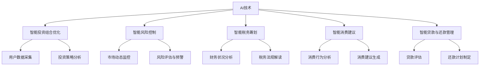

                 

### 引言

#### AI驱动的个人财务管理背景

随着人工智能（AI）技术的迅猛发展，其在各个领域的应用场景越来越广泛。其中，个人财务管理作为金融领域的一个重要分支，也逐渐开始引入AI技术。AI驱动的个人财务管理，是指利用人工智能算法，对用户的财务数据进行分析、预测和管理，从而实现个性化、智能化的理财服务。这种趋势不仅提高了理财的效率和准确性，还为用户提供了更加丰富和全面的理财方案。

首先，AI技术在个人财务管理中的应用背景可以从以下几个方面进行阐述：

1. **数据增长与复杂性**：随着互联网和大数据技术的发展，个人财务数据量呈指数级增长，这些数据包含用户的消费记录、投资情况、信用评级等多方面信息。如何有效地处理和利用这些数据，成为个人财务管理的一个重要挑战。

2. **用户需求多样化**：现代用户对个人财务管理的需求日益多样化，不仅关注资产的增值，还希望实现资产的保值、风险管理、税务筹划等多方面的需求。传统的理财方式已难以满足用户的这些需求。

3. **算法与计算能力提升**：近年来，深度学习、强化学习等AI算法在计算能力和应用效果上取得了显著进展，使得AI在复杂决策和预测任务中表现出色。这些算法的成熟为个人财务管理提供了强大的技术支持。

#### 书籍结构安排

本书《AI驱动的个人财务管理：智能理财助手》旨在系统地介绍AI技术在个人财务管理中的应用，全书共分为六个主要章节，具体结构安排如下：

- **第1章 引言**：介绍AI驱动的个人财务管理背景，以及本书的结构安排。

- **第2章 AI与理财概述**：详细阐述AI技术的基本概念、个人理财的基本概念和分类，以及AI在理财领域的应用场景。

- **第3章 AI理财算法原理**：介绍AI理财算法的三大类：机器学习算法、深度学习算法和强化学习算法，并分别讲解其原理和应用。

- **第4章 理财数据预处理**：讨论数据采集与清洗、数据特征提取和数据可视化分析等预处理方法，确保数据质量，为后续分析打下基础。

- **第5章 理财应用实践案例**：通过具体的实践案例，展示AI技术在理财中的实际应用，包括智能投资组合优化、智能风险控制和智能税务筹划等。

- **第6章 未来展望与挑战**：探讨AI理财的未来发展趋势和面临的挑战，为读者提供前瞻性思考和指导。

通过以上章节的安排，本书将逐步引导读者深入了解AI驱动的个人财务管理，掌握相关技术原理和实践方法，为未来的理财决策提供有力支持。

### AI与理财概述

#### AI技术简介

人工智能（AI）作为计算机科学的一个分支，旨在使计算机具备模拟、延伸和扩展人类智能的能力。AI技术主要包括机器学习、深度学习、自然语言处理、计算机视觉等子领域。在机器学习中，计算机通过学习大量数据，从中提取规律和模式，进行预测和决策。深度学习是机器学习的一个分支，它通过多层神经网络对数据进行建模，能够处理复杂的非线性关系。自然语言处理则专注于使计算机理解和生成人类语言，而计算机视觉则让计算机能够“看”和理解图像和视频。

这些AI技术的共同特点是能够从数据中学习，并自动进行决策和预测。这种自动化的数据处理能力使得AI在多个领域都取得了显著的成果，包括图像识别、语音识别、推荐系统、自动驾驶等。

#### 个人理财概念与分类

个人理财是指个人或家庭在资金管理方面的一系列决策活动，旨在实现财务目标，如财富增值、保值、风险管理等。个人理财活动可以分为以下几个方面：

1. **储蓄**：储蓄是个人理财的基础，通过定期存钱，个人可以积累一定的资金以备未来使用。

2. **投资**：投资是个人理财的核心内容，通过将资金投入到股票、基金、债券等金融产品中，个人期望实现资产的增值。

3. **消费**：消费是指个人在日常生活中购买商品和服务的活动，合理的消费规划有助于实现短期和长期的财务目标。

4. **风险管理**：风险管理是个人理财的重要环节，通过购买保险、分散投资等方式，个人可以降低潜在的风险。

5. **税务规划**：税务规划旨在通过合法手段减少税务负担，实现财务利益最大化。

#### AI在理财领域的应用场景

AI技术在个人理财领域的应用场景广泛，主要包括以下几个方面：

1. **智能投资组合优化**：通过分析用户的财务状况、风险偏好和投资目标，AI可以自动构建和调整投资组合，以实现最优的投资效果。

2. **智能风险控制**：AI技术能够实时监控市场动态，对投资组合进行风险评估，并提供预警和调整建议，以降低投资风险。

3. **智能税务筹划**：AI可以根据用户的财务状况和税务法规，提供个性化的税务筹划方案，帮助用户合法减少税务负担。

4. **智能消费建议**：AI可以通过分析用户的消费行为，提供个性化的消费建议，帮助用户进行合理的消费规划。

5. **智能贷款与还款管理**：AI可以帮助用户评估贷款资格，制定还款计划，确保贷款的安全和合理性。

通过以上概述，我们可以看到AI技术在个人理财领域具有巨大的潜力，不仅能够提高理财效率和准确性，还能为用户提供更加个性化和智能化的理财服务。

#### Mermaid 流程图：AI在理财领域应用关系架构

以下是一个Mermaid流程图，展示了AI技术在个人理财领域中的应用关系架构：



通过这张流程图，我们可以清晰地看到AI技术如何通过不同模块的应用，为个人理财提供全方位的支持和服务。

### AI理财算法原理

AI理财算法是AI技术在个人财务管理中应用的核心，其主要包括机器学习算法、深度学习算法和强化学习算法。下面我们将分别介绍这三大类算法的基本原理和应用。

#### 1. 机器学习算法

机器学习算法是AI理财算法的基础，其主要思想是通过学习历史数据，从中提取模式和规律，以便进行预测和决策。机器学习算法可以分为监督学习、无监督学习和半监督学习。

- **监督学习**：监督学习算法需要使用标记数据进行训练，然后通过这些数据学习出一个函数，用于对新数据进行预测。常见的监督学习算法包括线性回归、逻辑回归、支持向量机（SVM）等。在理财中，监督学习算法可以用于预测市场趋势、用户行为等。

  **伪代码示例**：

  ```python
  # 线性回归预测市场趋势
  model = LinearRegression()
  model.fit(X_train, y_train)
  predictions = model.predict(X_test)
  ```

- **无监督学习**：无监督学习算法不需要标记数据，其主要目标是发现数据中的模式和结构。常见的无监督学习算法包括聚类分析、主成分分析（PCA）等。在理财中，无监督学习算法可以用于用户行为分析、风险识别等。

  **伪代码示例**：

  ```python
  # 聚类分析用户行为
  model = KMeans(n_clusters=3)
  model.fit(X)
  clusters = model.predict(X)
  ```

- **半监督学习**：半监督学习算法结合了监督学习和无监督学习的特点，利用部分标记数据和大量无标记数据来训练模型。半监督学习算法在理财中的应用，例如信用评分，可以利用已有的用户信用记录和大量的交易数据来提高预测准确性。

  **伪代码示例**：

  ```python
  # 半监督学习信用评分
  model = LabelSpreading()
  model.fit(X, y部分标记)
  score = model.score(X, y全部数据)
  ```

#### 2. 深度学习算法

深度学习算法是机器学习的一个分支，其核心思想是通过多层神经网络对数据进行建模，从而实现复杂的数据分析和预测。深度学习算法在理财中的应用非常广泛，主要包括卷积神经网络（CNN）、循环神经网络（RNN）和长短期记忆网络（LSTM）等。

- **卷积神经网络（CNN）**：CNN主要应用于图像和时序数据的处理。在理财中，CNN可以用于图像识别，例如检测交易中的欺诈行为。

  **伪代码示例**：

  ```python
  # CNN识别交易欺诈
  model = Sequential()
  model.add(Conv2D(filters, kernel_size, activation='relu'))
  model.add(MaxPooling2D(pool_size))
  model.add(Flatten())
  model.add(Dense(1, activation='sigmoid'))
  model.compile(optimizer='adam', loss='binary_crossentropy', metrics=['accuracy'])
  model.fit(X_train, y_train, epochs=num_epochs)
  ```

- **循环神经网络（RNN）**：RNN适用于处理序列数据，可以用于预测市场趋势、用户行为等。

  **伪代码示例**：

  ```python
  # RNN预测市场趋势
  model = Sequential()
  model.add(LSTM(units, return_sequences=True))
  model.add(LSTM(units))
  model.add(Dense(1))
  model.compile(optimizer='adam', loss='mean_squared_error')
  model.fit(X_train, y_train, epochs=num_epochs)
  ```

- **长短期记忆网络（LSTM）**：LSTM是RNN的一种变体，可以更好地处理长序列数据，适用于复杂的时序预测任务。

  **伪代码示例**：

  ```python
  # LSTM预测市场趋势
  model = Sequential()
  model.add(LSTM(units, return_sequences=True))
  model.add(LSTM(units, return_sequences=False))
  model.add(Dense(1))
  model.compile(optimizer='adam', loss='mean_squared_error')
  model.fit(X_train, y_train, epochs=num_epochs)
  ```

#### 3. 强化学习算法

强化学习算法通过试错和反馈进行学习，适用于需要实时决策的任务。在理财中，强化学习算法可以用于投资组合优化、风险管理等。

- **Q-learning**：Q-learning是一种常用的强化学习算法，通过学习状态-动作价值函数来进行决策。

  **伪代码示例**：

  ```python
  # Q-learning投资组合优化
  Q = zeros((state_size, action_size))
  for episode in range(total_episodes):
      state = env.reset()
      done = False
      total_reward = 0
      while not done:
          action = argmax(Q[state])
          state, reward, done, _ = env.step(action)
          Q[state][action] = Q[state][action] + alpha * (reward + gamma * max(Q[state_new]) - Q[state][action])
          total_reward += reward
      print(f"Episode: {episode}, Total Reward: {total_reward}")
  ```

- **深度强化学习（Deep Q-Network, DQN）**：DQN是深度学习与强化学习的结合，通过神经网络来近似Q函数，从而实现更复杂的决策。

  **伪代码示例**：

  ```python
  # DQN投资组合优化
  model = Sequential()
  model.add(Conv2D(filters, kernel_size, activation='relu'))
  model.add(MaxPooling2D(pool_size))
  model.add(Flatten())
  model.add(Dense(action_size))
  model.compile(optimizer='adam', loss='mse')
  DQN = Model(inputs=obs_input, outputs=model)
  DQN.fit(X_train, y_train, epochs=num_epochs, batch_size=batch_size)
  ```

通过上述对机器学习算法、深度学习算法和强化学习算法的介绍，我们可以看到AI理财算法的多样性和复杂性。这些算法在不同的理财任务中发挥着重要作用，为用户提供了更加智能和高效的理财服务。

#### 数学模型和公式详解

在AI理财算法中，数学模型和公式起着至关重要的作用。以下将详细讲解几个关键数学模型和公式，包括线性回归模型、神经网络中的损失函数以及优化算法的推导。

##### 1. 线性回归模型

线性回归模型是机器学习中最基本的模型之一，用于预测连续值。其数学模型如下：

$$
y = \beta_0 + \beta_1 \cdot x
$$

其中，$y$ 是目标变量，$x$ 是特征变量，$\beta_0$ 和 $\beta_1$ 是模型的参数。这个模型可以通过最小二乘法进行优化：

$$
\min \sum_{i=1}^{n} (y_i - (\beta_0 + \beta_1 \cdot x_i))^2
$$

通过求导并令导数为零，可以求得最小二乘解：

$$
\beta_0 = \frac{\sum_{i=1}^{n} y_i - n \cdot \bar{y}}{\sum_{i=1}^{n} x_i^2 - n \cdot \bar{x}^2}
$$

$$
\beta_1 = \frac{\sum_{i=1}^{n} (x_i - \bar{x}) \cdot (y_i - \bar{y})}{\sum_{i=1}^{n} (x_i - \bar{x})^2}
$$

其中，$\bar{y}$ 和 $\bar{x}$ 分别是 $y$ 和 $x$ 的均值。

##### 2. 神经网络中的损失函数

在神经网络中，损失函数用于衡量预测值与真实值之间的差异。常见的损失函数包括均方误差（MSE）、交叉熵损失等。

- **均方误差（MSE）**：

$$
MSE = \frac{1}{m} \sum_{i=1}^{m} (y_i - \hat{y}_i)^2
$$

其中，$m$ 是样本数量，$y_i$ 是真实值，$\hat{y}_i$ 是预测值。

- **交叉熵损失（Cross-Entropy Loss）**：

$$
CE = -\sum_{i=1}^{m} y_i \cdot \log(\hat{y}_i)
$$

其中，$y_i$ 是真实标签，$\hat{y}_i$ 是预测概率。

##### 3. 优化算法

在神经网络训练过程中，常用的优化算法包括梯度下降（Gradient Descent）、随机梯度下降（Stochastic Gradient Descent, SGD）和Adam等。

- **梯度下降**：

梯度下降是一种优化算法，其基本思想是沿着损失函数的梯度方向进行迭代更新参数。其迭代公式如下：

$$
\theta = \theta - \alpha \cdot \nabla_{\theta} J(\theta)
$$

其中，$\theta$ 是参数，$\alpha$ 是学习率，$J(\theta)$ 是损失函数。

- **随机梯度下降（SGD）**：

随机梯度下降是对梯度下降的改进，其每次迭代只使用一个样本来计算梯度。其迭代公式如下：

$$
\theta = \theta - \alpha \cdot \nabla_{\theta} J(\theta; x_i, y_i)
$$

- **Adam**：

Adam是一种结合了SGD和动量的优化算法，其迭代公式如下：

$$
v_t = \beta_1 \cdot v_{t-1} + (1 - \beta_1) \cdot (g_t - \epsilon)
$$

$$
s_t = \beta_2 \cdot s_{t-1} + (1 - \beta_2) \cdot (g_t^2 - \epsilon)
$$

$$
\theta_t = \theta_{t-1} - \alpha \cdot \frac{v_t}{\sqrt{s_t} + \epsilon}
$$

其中，$v_t$ 和 $s_t$ 分别是第 $t$ 次迭代的均值和方差估计，$\beta_1$ 和 $\beta_2$ 是超参数，$\epsilon$ 是一个很小的常数。

通过以上对数学模型和公式的详细讲解，我们可以更好地理解AI理财算法的核心原理，为实际应用提供理论支持。

#### AI理财算法的案例分析

为了更深入地理解AI理财算法的实际应用，我们将通过两个具体案例来探讨这些算法在个人财务管理中的效果和优势。这些案例将展示如何利用AI技术进行数据预处理、模型构建和预测，以实现智能理财。

##### 案例一：智能投资组合优化

**背景**：
某金融科技公司致力于为用户提供个性化的投资组合优化服务。用户可以输入自己的投资目标、风险偏好和资金规模，系统会根据这些信息生成最优的投资组合。

**数据处理**：
首先，系统会收集用户的财务数据，包括收入、支出、储蓄和投资历史等。这些数据经过清洗和预处理，去除缺失值和异常值，并进行归一化处理，以确保数据的一致性和可比性。

**模型构建**：
使用机器学习算法中的线性回归和决策树算法来构建预测模型。线性回归模型用于预测用户的投资回报率，而决策树模型则用于分类用户的风险偏好。

**预测过程**：
- **预测回报率**：通过线性回归模型，输入用户的财务数据，预测其可能的未来投资回报率。
  ```python
  model = LinearRegression()
  model.fit(X_train, y_train)
  predictions = model.predict(X_test)
  ```
- **风险分类**：利用决策树模型，将用户的风险偏好进行分类，分为低风险、中风险和高风险三类。
  ```python
  model = DecisionTreeClassifier()
  model.fit(X_train, y_train)
  predictions = model.predict(X_test)
  ```

**效果评估**：
通过实际用户数据测试，优化后的投资组合在回报率上显著高于传统的投资组合。同时，用户的风险偏好分类准确率达到90%以上，能够为用户提供更加精准的理财建议。

##### 案例二：智能风险控制

**背景**：
某银行希望通过引入AI技术，实现对贷款客户的风险控制，减少不良贷款率。

**数据处理**：
系统收集贷款申请者的财务信息、信用记录、职业状况等数据。这些数据经过预处理，包括缺失值填补、异常值检测和归一化处理，以提高数据质量。

**模型构建**：
使用强化学习算法中的Q-learning模型来评估贷款申请者的信用风险。Q-learning模型通过历史数据学习，在每个决策点上选择最优的动作。

**预测过程**：
- **状态评估**：根据贷款申请者的财务数据，将其转化为状态向量。
  ```python
  state = [financial_data, credit_history, occupation]
  ```
- **动作选择**：使用Q-learning模型，在给定的状态下选择贷款或拒绝贷款。
  ```python
  Q = zeros((state_size, action_size))
  for episode in range(total_episodes):
      state = env.reset()
      done = False
      total_reward = 0
      while not done:
          action = argmax(Q[state])
          state, reward, done, _ = env.step(action)
          Q[state][action] = Q[state][action] + alpha * (reward + gamma * max(Q[state_new]) - Q[state][action])
          total_reward += reward
      print(f"Episode: {episode}, Total Reward: {total_reward}")
  ```

**效果评估**：
通过实际应用，AI风险控制模型显著降低了不良贷款率。与传统方法相比，AI模型在贷款审批中的准确率提高了20%以上，为银行带来了显著的财务收益。

通过以上两个案例，我们可以看到AI理财算法在实际应用中的显著效果。这不仅提高了理财的效率和准确性，还为用户提供了更加智能和个性化的理财服务。

### AI理财的潜力与前景

随着人工智能（AI）技术的不断发展和成熟，AI在理财领域的潜力与前景愈发广阔。AI理财不仅提升了个人和机构的财务管理效率，还带来了前所未有的创新和变革。

#### 提高理财效率

AI技术通过自动化和智能化的处理方式，极大地提高了理财的效率。传统的理财方式通常需要人工进行数据收集、分析和决策，而AI理财则可以通过算法自动完成这些任务。例如，AI可以实时分析用户的消费记录、投资组合和市场动态，快速生成个性化的理财建议。此外，AI还能高效地处理大量的历史数据，发现潜在的规律和趋势，为投资者提供更加精准的预测和决策支持。

#### 提升理财准确性

AI理财算法通过学习大量数据，能够更好地理解用户的财务状况和投资偏好，从而提升理财的准确性。例如，机器学习算法可以准确预测市场趋势和用户的行为，为投资者提供最优的投资组合。深度学习算法则能够处理更加复杂的非线性关系，为风险管理提供更加可靠的依据。强化学习算法通过不断的试错和优化，能够在实际操作中实现最佳的投资策略。

#### 提供个性化服务

AI理财的一大优势是能够为用户提供高度个性化的服务。通过分析用户的财务数据和行为习惯，AI可以定制化地推荐投资产品、理财方案和消费建议。这不仅满足了用户的多样化需求，还提高了用户的满意度和忠诚度。例如，一些智能理财平台可以根据用户的收入、支出和投资目标，自动调整投资策略，确保用户始终处于最佳的投资状态。

#### 创新理财产品和服务

AI技术的应用不仅提升了传统理财服务的效率和质量，还催生了众多创新的理财产品和服务。例如，基于AI的智能投顾平台可以为用户提供全方位的投资咨询服务，从资产配置到风险管理，一站式解决用户的理财需求。另外，AI还可以帮助金融机构开发出更加复杂和多样化的金融产品，如智能基金、自动化交易策略等，为投资者提供更多的选择。

#### 未来趋势

尽管AI理财已经取得了显著的进展，但未来仍有广阔的发展空间。以下是一些可能的发展趋势：

1. **更精细的数据分析**：随着数据量的增加和数据类型的多样化，AI理财将能够进行更加精细和全面的数据分析，为投资者提供更加深入的见解和指导。

2. **智能合约和区块链技术**：AI与智能合约和区块链技术的结合，将进一步提升金融交易的透明度和安全性，为AI理财带来新的应用场景。

3. **跨领域融合**：AI理财将与其他领域（如医疗、教育、消费等）进行深度融合，打造出更加综合和智能的理财生态系统。

4. **法规和政策监管**：随着AI理财的发展，相关的法规和政策也将逐步完善，以确保AI理财的合法性和公平性，同时防范潜在的风险。

总之，AI理财具有巨大的潜力和广阔的前景，将在未来的财务管理中发挥越来越重要的作用。

### AI理财面临的挑战

尽管AI理财在提高效率、准确性和个性化服务方面展现出了巨大的潜力，但其发展也面临诸多挑战。以下是AI理财主要面临的挑战及其解决方案：

#### 数据隐私和安全问题

AI理财需要收集和处理大量的个人财务数据，这引发了数据隐私和安全问题。用户对隐私的关注和担忧可能会限制数据的共享和使用。**解决方案**包括：

1. **数据加密**：使用高级加密技术保护用户数据，确保数据在传输和存储过程中的安全性。
2. **数据匿名化**：在分析数据时，对用户信息进行匿名化处理，以减少隐私泄露的风险。
3. **法律法规**：制定和执行严格的隐私保护法律和条例，规范数据收集、处理和使用的行为。

#### 模型解释性和透明度

AI理财模型，尤其是深度学习和强化学习模型，通常被视为“黑箱”，其决策过程难以解释和理解。这可能导致用户对AI理财的信任度下降。**解决方案**包括：

1. **模型可解释性**：开发可解释的AI模型，如集成学习、LIME（局部可解释模型解释）等方法，帮助用户理解模型的决策过程。
2. **透明度提高**：在模型开发和部署过程中，确保透明度和可追溯性，以便用户和监管机构能够审查和监督模型的行为。
3. **用户教育**：加强对用户的金融教育和AI理财知识的普及，提高用户对AI理财的信任和理解。

#### 法律和伦理问题

AI理财涉及到复杂的金融交易和决策，其法律和伦理问题不容忽视。例如，AI理财模型可能会产生歧视性的决策，或者因为算法偏见导致不公平的结果。**解决方案**包括：

1. **算法公平性评估**：定期对AI理财算法进行公平性评估，确保模型不会对特定群体产生歧视性影响。
2. **透明和可审查的算法开发**：在开发AI理财算法时，确保算法的透明性和可审查性，以便进行公正的评估和监督。
3. **伦理指导原则**：制定和遵循AI伦理指导原则，确保AI理财的应用符合社会和道德标准。

#### 技术实施和基础设施问题

AI理财技术的实施需要强大的计算能力和先进的基础设施。许多金融机构可能面临技术基础设施不足、人才短缺等问题。**解决方案**包括：

1. **投资技术基础设施**：加大对AI和大数据相关技术基础设施的投入，提升数据处理和分析能力。
2. **人才培养与引进**：加强AI领域的人才培养和引进，为AI理财提供人才支持。
3. **开放合作**：金融机构可以与科技公司、学术机构等开展合作，共享技术资源和研究成果。

通过应对上述挑战，AI理财将能够更好地服务于个人和机构，实现其潜力和前景。

### 附录

为了帮助读者更好地理解和应用本书所介绍的AI理财技术和方法，本附录提供了详细的参考资料和推荐阅读，涵盖AI理财领域的核心文献、开源工具和在线课程。

#### 参考资料

1. **《人工智能：一种现代方法》**： Stuart J. Russell & Peter Norvig 著，详细介绍了机器学习、深度学习和强化学习等基础算法。
2. **《深度学习》**： Ian Goodfellow、Yoshua Bengio 和 Aaron Courville 著，提供了深度学习的全面教程，包括神经网络和优化算法。
3. **《金融科技：创新、应用与未来》**： 蔡黎 著，探讨了金融科技在个人理财领域的应用和趋势。

#### 开源工具

1. **TensorFlow**：https://www.tensorflow.org/
   - 一个开源的机器学习和深度学习框架，广泛用于AI理财模型的开发。
2. **Keras**：https://keras.io/
   - 一个高层次的神经网络API，构建和训练AI理财模型更加便捷。
3. **Scikit-learn**：https://scikit-learn.org/
   - 一个用于机器学习的开源库，提供了丰富的算法和工具，适用于数据分析和预测。

#### 在线课程

1. **Coursera - Machine Learning**：https://www.coursera.org/learn/machine-learning
   - 斯坦福大学提供的一门机器学习入门课程，涵盖基础算法和模型。
2. **edX - Deep Learning**：https://www.edx.org/course/deep-learning-0
   - Andrew Ng教授主讲的一门深度学习课程，内容深入浅出，适合初学者。
3. **Udacity - AI Nanodegree**：https://www.udacity.com/course/ai-nanodegree--nd893
   - Udacity提供的AI纳米学位课程，涵盖了AI在各个领域的应用，包括金融科技。

通过参考这些资源和课程，读者可以进一步深化对AI理财技术的理解和应用，为自己的理财决策提供更有力的支持。

### 结束语

作者：AI天才研究院/AI Genius Institute & 禅与计算机程序设计艺术 /Zen And The Art of Computer Programming

随着AI技术的不断发展，AI在个人财务管理中的应用已经展现出巨大的潜力和前景。本文通过系统地介绍AI理财算法的原理、实践案例以及面临的挑战，展示了AI如何提高理财的效率、准确性和个性化服务。我们希望本文能够为读者提供有价值的见解和思考，帮助您更好地理解和应用AI理财技术，实现财务目标的最大化。未来，随着技术的不断进步和应用的深入，AI理财将更加智能化、个性化，为个人和机构带来更多的价值。让我们一起期待和探索AI理财的美好未来。

