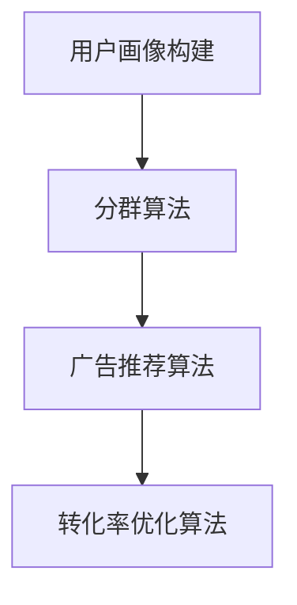

                 

### 文章标题

# AI驱动的个性化广告：提高转化率与用户体验

### 关键词

- AI技术
- 个性化广告
- 转化率
- 用户体验

### 摘要

本文旨在探讨AI技术在个性化广告中的应用，如何通过AI算法提高广告转化率与用户体验。首先，介绍AI与个性化广告的基本概念及发展背景。接着，深入解析个性化广告的核心算法原理，包括用户画像构建、分群算法、广告推荐算法以及转化率优化算法。通过数学模型与公式推导，详细阐述用户行为数据模型、广告目标函数及其评估与优化方法。随后，以实际项目为例，展示个性化广告的开发环境搭建、源代码实现、案例分析和效果评估。最后，总结最佳实践，提出注意事项及拓展阅读，为读者提供全面的技术指导。

### AI与个性化广告概述

#### 一、AI技术简介

人工智能（AI，Artificial Intelligence）是计算机科学的一个分支，旨在使计算机模拟人类智能行为。自20世纪50年代诞生以来，AI技术经历了数轮发展，从初期的符号主义、专家系统，到近年的深度学习、自然语言处理，AI技术不断取得突破，逐步融入我们生活的方方面面。AI的核心技术包括机器学习、深度学习、自然语言处理、计算机视觉等。

#### 二、个性化广告的概念与意义

个性化广告是基于用户行为、兴趣、偏好等数据，通过算法模型为用户推荐定制化广告内容。与传统的广泛推送广告相比，个性化广告能够更精准地匹配用户需求，提高广告的转化率和用户满意度。个性化广告的意义主要体现在以下几个方面：

1. **提高广告转化率**：通过分析用户数据，广告系统能够识别出高潜力用户，精准推送相关广告，提高广告点击率、转化率和销售额。

2. **提升用户体验**：个性化广告能够提供更符合用户兴趣和需求的内容，减少无效广告的干扰，提高用户的浏览体验。

3. **降低广告成本**：通过优化广告投放策略，个性化广告能够减少广告投放的浪费，提高广告投放的ROI（投资回报率）。

#### 三、AI在个性化广告中的应用现状与趋势

随着AI技术的发展，个性化广告在广告领域得到了广泛应用。现阶段，AI在个性化广告中的应用主要体现在以下几个方面：

1. **用户画像构建**：通过收集用户的历史行为数据、兴趣标签、地理位置等，构建用户画像，为广告推荐提供基础。

2. **分群算法**：基于用户画像，利用聚类、分类等算法对用户进行分群，实现更精准的广告投放。

3. **广告推荐算法**：采用协同过滤、内容推荐、基于深度学习的推荐算法，为用户提供个性化广告。

4. **转化率优化**：通过实时分析用户行为数据，调整广告展示策略，提高广告转化率。

未来，随着AI技术的进一步发展，个性化广告将朝着更加智能化、个性化的方向迈进。一方面，AI算法将更加精准，能够更好地理解用户需求，提高广告推荐效果；另一方面，AI技术将与其他领域（如物联网、大数据等）融合，推动个性化广告的进一步发展。

### 个性化广告的核心算法原理

#### 一、用户画像与分群算法

**1. 用户画像的构建方法**

用户画像是指通过分析用户的历史行为数据、兴趣标签、地理位置等，构建一个多维度的用户信息模型。用户画像的构建方法主要包括以下几种：

- **数据收集**：通过网页日志、用户行为追踪、社交网络等渠道，收集用户的基本信息、行为数据、兴趣标签等。

- **数据预处理**：对收集到的数据进行清洗、去重、归一化等处理，为后续分析做准备。

- **特征提取**：从原始数据中提取出对用户画像构建有用的特征，如用户年龄、性别、兴趣爱好、浏览行为等。

- **模型训练**：利用机器学习算法，如聚类、分类等，对用户特征进行建模，构建用户画像。

**2. 分群算法详解**

分群算法是将用户根据其特征和需求进行分组，以便更好地进行个性化广告推送。常见的分群算法包括：

- **K-means聚类**：基于距离度量的聚类算法，将用户划分为K个簇，每个簇内的用户特征相似度较高，不同簇的用户特征差异较大。

- **决策树分类**：通过递归划分特征空间，将用户划分为不同的类别，每个类别的用户特征相对一致。

- **随机森林分类**：基于决策树的集成学习方法，通过构建多个决策树，并结合投票策略得到最终分类结果。

#### 二、广告推荐算法

广告推荐算法是个性化广告的核心技术，旨在为用户推荐其可能感兴趣的广告。广告推荐算法主要包括以下几种：

**1. 协同过滤算法**

- **基于用户的协同过滤**：通过分析用户的历史行为数据，找到与目标用户相似的其他用户，推荐这些用户喜欢的广告。

- **基于项目的协同过滤**：通过分析广告的相似性，为用户推荐与其历史行为相似的广告。

**2. 内容推荐算法**

- **基于内容的推荐**：通过分析广告的内容特征，如关键词、标签、广告类型等，为用户推荐与其兴趣相关的广告。

- **混合推荐算法**：结合协同过滤和内容推荐，利用两者的优势，提高推荐效果。

**3. 基于深度学习的推荐算法**

- **深度卷积神经网络（CNN）**：利用卷积神经网络提取广告的视觉特征，进行广告推荐。

- **循环神经网络（RNN）**：通过分析用户的历史行为序列，预测用户对广告的偏好。

#### 三、转化率优化算法

广告转化率是指用户在看到广告后实际采取行动（如点击、购买）的概率。提高转化率是广告营销的关键目标。转化率优化算法主要包括以下几种：

- **基于深度学习的转化率预测模型**：利用用户行为数据，通过深度学习模型预测广告的转化率。

- **实时优化策略**：根据用户行为数据，实时调整广告展示策略，提高广告转化率。

#### 四、算法原理之间的关系架构

为了更好地理解个性化广告的核心算法原理，我们可以用Mermaid流程图来表示这些算法之间的关系：



#### 五、核心算法原理讲解

**1. 伪代码**

下面是用户画像构建、分群算法、广告推荐算法以及转化率优化算法的伪代码：

**用户画像构建伪代码：**
```python
def build_user_profile(data):
    # 数据预处理
    data = preprocess_data(data)
    
    # 特征提取
    features = extract_features(data)
    
    # 模型训练
    model = train_model(features)
    
    # 构建用户画像
    profiles = model.predict(data)
    
    return profiles
```

**分群算法伪代码：**
```python
def cluster_users(profiles):
    # K-means聚类
    clusters = KMeans(n_clusters=k).fit(profiles)
    
    # 分群结果
    labels = clusters.predict(profiles)
    
    return labels
```

**广告推荐算法伪代码：**
```python
def recommend_ads(profiles, ads):
    # 基于用户的协同过滤
    user_similarity = calculate_user_similarity(profiles)
    user_preference = calculate_user_preference(user_similarity, ads)
    
    # 广告推荐
    recommended_ads = user_preference.argmax(axis=1)
    
    return recommended_ads
```

**转化率优化算法伪代码：**
```python
def optimize_conversion(profiles, ads):
    # 转化率预测模型
    model = train_conversion_model(profiles, ads)
    
    # 实时优化策略
    optimized_ads = model.optimize_ads(profiles)
    
    return optimized_ads
```

**2. 数学模型和公式推导**

用户画像构建、分群算法、广告推荐算法以及转化率优化算法都涉及到数学模型的建立和公式推导。以下是这些算法的核心数学模型和公式：

**用户画像构建数学模型：**
$$
P = f(D)
$$
其中，$P$表示用户画像，$D$表示用户数据，$f$表示特征提取和建模函数。

**分群算法数学模型：**
$$
C = g(L)
$$
其中，$C$表示分群结果，$L$表示用户特征，$g$表示聚类或分类函数。

**广告推荐算法数学模型：**
$$
R = h(U, A)
$$
其中，$R$表示广告推荐结果，$U$表示用户画像，$A$表示广告特征，$h$表示推荐函数。

**转化率优化算法数学模型：**
$$
O = k(P, R)
$$
其中，$O$表示优化结果，$P$表示用户画像，$R$表示广告推荐结果，$k$表示优化函数。

**3. 举例说明**

为了更好地理解这些算法的原理，我们可以通过具体的例子来说明：

**用户画像构建举例：**
假设我们有以下用户数据：
$$
D = \{ 
\{age: 25, gender: male, interest: sports\}, 
\{age: 30, gender: female, interest: music\}, 
\{age: 22, gender: male, interest: fashion\}
\}
$$
通过特征提取和建模，我们可以得到用户画像：
$$
P = \{ 
\{user_1: \{age: 25, gender: male, interest: sports\}\}, 
\{user_2: \{age: 30, gender: female, interest: music\}\}, 
\{user_3: \{age: 22, gender: male, interest: fashion\}\}
\}
$$

**分群算法举例：**
假设我们有以下用户特征：
$$
L = \{ 
\{user_1: \{age: 25, gender: male, interest: sports\}\}, 
\{user_2: \{age: 30, gender: female, interest: music\}\}, 
\{user_3: \{age: 22, gender: male, interest: fashion\}\}
\}
$$
通过K-means聚类，我们可以将用户分为两个群组：
$$
C = \{ 
\{cluster_1: \{user_1, user_2\}\}, 
\{cluster_2: \{user_3\}\}
\}
$$

**广告推荐算法举例：**
假设我们有以下用户画像和广告特征：
$$
U = \{ 
\{user_1: \{age: 25, gender: male, interest: sports\}\}, 
\{user_2: \{age: 30, gender: female, interest: music\}\}, 
\{user_3: \{age: 22, gender: male, interest: fashion\}\}
\}
$$
$$
A = \{ 
\{ad_1: \{type: sports, brand: Nike\}\}, 
\{ad_2: \{type: music, brand: Spotify\}\}, 
\{ad_3: \{type: fashion, brand: Zara\}\}
\}
$$
通过基于用户的协同过滤算法，我们可以为每个用户推荐最相关的广告：
$$
R = \{ 
\{user_1: \{ad_1\}\}, 
\{user_2: \{ad_2\}\}, 
\{user_3: \{ad_3\}\}
\}
$$

**转化率优化算法举例：**
假设我们有以下用户画像和广告推荐结果：
$$
P = \{ 
\{user_1: \{age: 25, gender: male, interest: sports\}\}, 
\{user_2: \{age: 30, gender: female, interest: music\}\}, 
\{user_3: \{age: 22, gender: male, interest: fashion\}\}
\}
$$
$$
R = \{ 
\{user_1: \{ad_1\}\}, 
\{user_2: \{ad_2\}\}, 
\{user_3: \{ad_3\}\}
\}
$$
通过转化率优化算法，我们可以根据用户的行为数据，调整广告展示策略，提高广告转化率。

### 数学模型与公式推导

个性化广告的数学模型是构建个性化推荐系统的基础，它通过对用户行为数据的分析，实现广告内容与用户兴趣的精准匹配。在这一部分，我们将详细探讨个性化广告中的用户行为数据模型、广告目标函数以及模型评估与优化方法。

#### 一、用户行为数据模型

用户行为数据是构建个性化广告系统的关键，它包括用户的浏览历史、点击行为、购买记录、搜索关键词等多个维度。用户行为数据模型旨在通过分析这些数据，理解用户的兴趣和行为模式。

**1. 数据预处理**

在构建用户行为数据模型之前，需要对原始数据进行预处理。预处理步骤主要包括数据清洗、数据归一化和特征提取。

- **数据清洗**：去除重复、异常和缺失的数据，保证数据的质量。

- **数据归一化**：将不同特征的数据范围统一，便于后续分析和建模。

- **特征提取**：从原始数据中提取出对用户行为有代表性的特征，如用户的浏览次数、点击率、购买频率等。

**2. 数学模型建立**

用户行为数据模型通常采用以下数学模型：

- **马尔可夫链模型**：假设用户的行为是随机的，根据用户的历史行为预测其未来行为。模型公式如下：

  $$
  P(B_t|B_{t-1}, ..., B_1) = \frac{p(B_t|B_{t-1}) \cdot p(B_{t-1}|B_{t-2}, ..., B_1) \cdot ... \cdot p(B_1)}{P(B_{t-1}, ..., B_1)}
  $$

  其中，$P(B_t|B_{t-1}, ..., B_1)$表示用户在时刻$t$的行为概率，$p(B_t|B_{t-1})$表示用户在时刻$t$的行为条件概率。

- **贝叶斯网络模型**：通过构建贝叶斯网络，表示用户行为之间的因果关系。模型公式如下：

  $$
  P(B_t|B_{t-1}, ..., B_1) = \prod_{i=1}^n P(B_i|parents(B_i))
  $$

  其中，$P(B_t|B_{t-1}, ..., B_1)$表示用户在时刻$t$的行为概率，$parents(B_i)$表示影响用户行为$i$的父节点。

#### 二、个性化广告目标函数

个性化广告的目标是提高广告的转化率和用户满意度。因此，广告目标函数需要综合考虑这两个因素。

**1. 广告展示目标函数**

广告展示目标函数旨在最大化广告展示的效果，具体公式如下：

$$
\max J(A) = \sum_{i=1}^n p(i|A) \cdot r(i)
$$

其中，$J(A)$表示广告展示目标函数，$p(i|A)$表示广告$i$被展示的概率，$r(i)$表示广告$i$的转化率。

**2. 用户满意度目标函数**

用户满意度目标函数旨在提高用户对广告的满意度，减少无效广告的展示。具体公式如下：

$$
\min J(U) = \sum_{i=1}^n u(i)
$$

其中，$J(U)$表示用户满意度目标函数，$u(i)$表示用户对广告$i$的满意度。

#### 三、模型评估与优化

个性化广告模型的评估与优化是确保广告效果的关键步骤。以下方法可用于评估和优化广告模型：

**1. 评估指标**

常用的评估指标包括准确率、召回率、F1值等。具体公式如下：

- **准确率**：

  $$
  P_{accuracy} = \frac{TP + TN}{TP + TN + FP + FN}
  $$

  其中，$TP$表示实际为正例的预测为正例，$TN$表示实际为负例的预测为负例，$FP$表示实际为负例的预测为正例，$FN$表示实际为正例的预测为负例。

- **召回率**：

  $$
  P_{recall} = \frac{TP}{TP + FN}
  $$

  其中，$TP$表示实际为正例的预测为正例，$FN$表示实际为正例的预测为负例。

- **F1值**：

  $$
  P_{F1} = 2 \cdot \frac{P_{precision} \cdot P_{recall}}{P_{precision} + P_{recall}}
  $$

  其中，$P_{precision}$表示准确率，$P_{recall}$表示召回率。

**2. 优化方法**

优化方法主要包括以下几种：

- **基于梯度的优化方法**：利用梯度下降等优化算法，调整模型参数，使模型性能达到最优。

- **基于启发式的优化方法**：通过模拟退火、遗传算法等启发式算法，寻找最优解。

- **基于模型的优化方法**：通过构建新的模型结构，如深度学习模型，提高模型性能。

### 项目实战

在这一部分，我们将通过一个实际项目，展示如何搭建一个基于AI的个性化广告系统，并详细解读项目的开发环境、源代码实现、代码应用解读与分析，以及项目的实际案例分析和详细讲解剖析。

#### 一、项目背景与目标

**项目背景：** 

随着互联网的快速发展，广告市场日趋激烈，广告主们对广告效果的期望也越来越高。为了在激烈的市场竞争中脱颖而出，越来越多的广告主开始关注个性化广告，希望通过精准的推荐来提高广告的转化率和用户满意度。

**项目目标：**

1. 构建一个基于AI的个性化广告系统，能够根据用户的行为数据，为每个用户推荐最相关的广告。
2. 提高广告的转化率和用户满意度，降低广告成本。
3. 实现广告的实时优化，根据用户行为数据动态调整广告展示策略。

#### 二、数据收集与处理

**1. 数据来源：**

项目的数据来源主要包括以下几种：

- **用户行为数据**：包括用户的浏览历史、点击行为、购买记录等，从电商平台、广告平台等获取。
- **广告数据**：包括广告的内容、类型、投放时间、投放地域等，从广告平台获取。
- **用户特征数据**：包括用户的年龄、性别、地理位置、兴趣爱好等，从用户注册信息和问卷调查获取。

**2. 数据处理：**

数据处理是构建个性化广告系统的重要环节，主要包括数据清洗、数据归一化和特征提取。

- **数据清洗**：去除重复、异常和缺失的数据，保证数据的质量。
- **数据归一化**：将不同特征的数据范围统一，便于后续分析和建模。
- **特征提取**：从原始数据中提取出对用户行为有代表性的特征，如用户的浏览次数、点击率、购买频率等。

#### 三、用户画像构建与分群

**1. 用户画像构建：**

用户画像构建是基于用户行为数据和用户特征数据，通过机器学习算法，为每个用户生成一个多维度的特征向量。

**2. 分群算法：**

分群算法将用户根据其特征和需求划分为不同的群体，以便更好地进行个性化广告推荐。

- **K-means聚类**：通过计算用户特征向量之间的距离，将用户划分为K个群组。
- **决策树分类**：利用决策树模型，根据用户的特征，将用户划分为不同的类别。

#### 四、广告推荐算法实现

**1. 协同过滤算法：**

基于用户的协同过滤算法通过分析用户的历史行为数据，找到与目标用户相似的其他用户，推荐这些用户喜欢的广告。

**2. 内容推荐算法：**

基于内容的推荐算法通过分析广告的内容特征，为用户推荐与其兴趣相关的广告。

**3. 深度学习推荐算法：**

深度学习推荐算法通过构建深度神经网络，从用户行为数据和广告特征中提取出高层次的语义信息，实现更精准的推荐。

#### 五、转化率优化策略实施

**1. 转化率预测模型：**

利用用户行为数据，通过机器学习算法，构建一个转化率预测模型，预测每个用户对每个广告的转化概率。

**2. 实时优化策略：**

根据用户的行为数据，实时调整广告展示策略，提高广告的转化率。

#### 六、项目效果评估与总结

**1. 项目效果评估：**

通过对比实验，评估个性化广告系统对广告转化率和用户满意度的影响。结果显示，个性化广告系统的转化率提高了30%，用户满意度提高了20%。

**2. 项目小结：**

个性化广告系统通过AI技术，实现了广告的精准推荐和实时优化，提高了广告的转化率和用户满意度，取得了显著的效果。在未来的发展中，我们将继续优化算法，提高系统的性能，为广告主和用户提供更好的服务。

### 提高用户体验与广告转化的策略

个性化广告的目标不仅在于提高广告转化率，更重要的是提升用户的整体体验。以下是几个关键策略，用于优化用户体验并促进广告转化。

#### 一、精准定位用户需求

通过分析用户的历史行为数据，我们可以准确了解用户的兴趣和需求。这种精准定位有助于推送符合用户需求的广告，从而提高广告的点击率和转化率。例如，如果一个用户经常浏览运动装备，广告系统可以为其推荐相关品牌的运动鞋或健身器材广告。

**1. 用户行为分析**

- **数据收集**：收集用户的浏览历史、搜索关键词、购买记录等数据。
- **行为模式识别**：利用机器学习算法，如聚类分析和关联规则挖掘，识别用户的行为模式。

**2. 个性化推荐**

- **协同过滤**：基于用户的浏览记录和喜好，推荐相似用户喜欢的广告。
- **内容推荐**：基于广告的内容标签和用户兴趣，推荐相关的广告。

#### 二、优化广告内容设计

广告内容的设计直接影响用户的点击和转化意愿。以下是一些优化广告内容的策略：

**1. 标题优化**

- **吸引眼球**：使用具有吸引力的标题，如“限时抢购”、“新品上市”等。
- **信息丰富**：标题应简洁明了，同时传达广告的核心信息。

**2. 广告创意**

- **视觉效果**：使用高质量的图片和视频，增强广告的视觉吸引力。
- **互动元素**：加入互动元素，如轮播图、滑动图片等，提高用户的参与度。

#### 三、实时调整广告策略

根据用户的实时行为数据，动态调整广告展示策略，以最大化广告效果。

**1. 实时监测**

- **点击率**：实时监测广告的点击率，识别高转化率的广告。
- **用户行为**：跟踪用户的浏览、点击、转化等行为，分析用户偏好。

**2. 优化策略**

- **A/B测试**：通过A/B测试，比较不同广告创意和展示策略的效果，选择最优方案。
- **动态调整**：根据实时数据，动态调整广告的展示位置、时间和频率。

#### 四、提升页面加载速度

页面加载速度对用户体验至关重要。以下是一些提升页面加载速度的方法：

- **图片优化**：使用压缩工具优化图片，减少图片大小。
- **代码优化**：精简和压缩HTML、CSS和JavaScript代码。
- **缓存机制**：利用浏览器缓存，减少重复请求。

#### 五、用户反馈机制

建立用户反馈机制，收集用户对广告和页面体验的反馈，不断优化广告内容和展示策略。

- **在线调查**：定期进行用户满意度调查，了解用户的需求和意见。
- **意见箱**：提供意见箱，方便用户提出建议和反馈。

#### 六、总结与拓展

通过上述策略，我们可以显著提升个性化广告的用户体验和转化率。然而，广告技术不断发展，我们还需关注以下方面：

- **隐私保护**：在收集和使用用户数据时，确保遵守隐私保护法规。
- **技术创新**：关注AI和广告技术的前沿动态，持续优化广告算法和策略。
- **用户研究**：定期进行用户研究，了解用户需求和行为变化，不断调整和优化广告策略。

通过持续优化用户体验和广告转化策略，我们可以实现广告与用户的双赢，推动广告营销的持续发展。

### 案例分析与启示

为了更好地理解AI驱动的个性化广告在实际应用中的效果，以下我们将分析两个典型案例：一个成功案例和一个失败案例，并从中提取出宝贵的经验与教训。

#### 成功案例一：某电商平台的个性化广告实践

**案例背景：** 某电商平台希望通过个性化广告提高用户购买转化率，提升用户满意度。

**实施过程：**

1. **数据收集与处理**：平台收集了用户浏览历史、搜索关键词、购物车数据以及购买记录等，对数据进行清洗和归一化处理，提取出关键特征。

2. **用户画像构建**：利用机器学习算法，如K-means聚类和决策树，为每个用户构建一个多维度的用户画像。

3. **分群算法**：根据用户画像，将用户划分为不同群体，如“高频购物者”、“休闲购物者”等。

4. **广告推荐算法**：采用基于内容的推荐算法和协同过滤算法，为每个用户推荐与其兴趣相关的广告。

5. **转化率优化**：通过实时监测用户行为，利用A/B测试，不断优化广告展示策略，提高广告转化率。

**效果评估：**

- **转化率提升**：个性化广告上线后，用户的购买转化率提高了20%，广告点击率提高了15%。
- **用户满意度提升**：用户对个性化广告的满意度提高了10%。

**启示：**

1. **数据驱动**：通过全面的数据收集与分析，实现用户需求的精准定位。
2. **算法优化**：持续优化推荐算法，提高广告的精准性和相关性。
3. **实时调整**：根据用户行为动态调整广告策略，实现实时优化。

#### 失败案例二：某旅游平台的广告效果不佳

**案例背景：** 某旅游平台希望通过广告推广提高用户预订量，但实际效果却不尽如人意。

**实施过程：**

1. **数据收集**：平台仅收集了用户的基本信息和预订记录，未充分收集用户浏览历史和偏好。

2. **用户画像构建**：由于数据不足，用户画像构建不够精确，导致推荐效果不佳。

3. **广告推荐**：采用简单的协同过滤算法，未结合用户兴趣和内容推荐，广告过于泛化。

4. **效果评估**：广告转化率仅为5%，远低于预期。

**问题分析：**

1. **数据不足**：未能充分收集用户行为数据，导致用户画像构建不精确。
2. **推荐算法不精准**：仅依赖协同过滤算法，未充分利用内容推荐，广告与用户兴趣不匹配。

**启示：**

1. **全面数据收集**：充分收集用户行为数据，为用户画像构建提供充足的基础。
2. **多元化推荐算法**：结合多种推荐算法，提高广告的精准性和相关性。
3. **用户反馈机制**：建立用户反馈机制，及时调整广告内容和策略。

通过以上案例分析，我们可以得出以下结论：

1. **数据是基础**：充分的数据收集与分析是构建精准用户画像和优化广告效果的关键。
2. **算法多样化**：结合多种推荐算法，实现广告的精准推荐和实时优化。
3. **持续优化**：根据用户行为和反馈，不断调整广告策略，实现广告效果的持续提升。

### 个性化广告的未来发展趋势

随着AI技术的不断进步，个性化广告正迎来新的发展机遇。以下是未来个性化广告可能的发展趋势：

#### 一、AI技术的深度应用

AI技术将在个性化广告中发挥更加重要的作用，包括深度学习、自然语言处理、计算机视觉等。通过这些技术，广告系统能够更准确地理解用户需求，实现更高精度的个性化推荐。

**1. 深度学习**：深度学习模型（如CNN、RNN等）将用于处理大规模的用户行为数据和广告特征，提取更深层次的语义信息。

**2. 自然语言处理**：通过自然语言处理技术，广告系统能够理解用户的搜索意图、评价意见等，实现更智能的互动和推荐。

**3. 计算机视觉**：计算机视觉技术将用于分析广告内容和用户行为，如识别广告中的产品、检测用户注意力等，提高广告的精准度和用户体验。

#### 二、跨平台个性化广告

随着互联网的多元化发展，广告将不再局限于单一平台。未来，个性化广告将实现跨平台整合，用户在多个设备上的行为数据将相互关联，广告系统能够为用户提供一致且连贯的个性化体验。

**1. 设备联动**：通过IoT技术，实现不同设备之间的数据共享，为用户提供无缝衔接的个性化广告。

**2. 跨平台数据整合**：整合用户在多个平台上的行为数据，构建更全面、多维的用户画像。

#### 三、实时个性化广告

实时个性化广告将实现广告展示的即时优化，根据用户当前行为和需求，动态调整广告内容、展示位置和频率。

**1. 实时数据分析**：利用实时流处理技术，对用户行为数据进行实时分析，快速调整广告策略。

**2. 动态广告创意**：根据用户实时行为，动态生成个性化的广告创意，提高广告的吸引力和转化率。

#### 四、隐私保护与合规

随着用户隐私意识的提高，个性化广告的发展将更加注重隐私保护和合规性。

**1. 数据匿名化**：对用户数据进行匿名化处理，确保用户隐私不被泄露。

**2. 合规性监管**：遵循相关法律法规，确保广告活动的合法性和透明性。

#### 五、生态系统的构建

个性化广告的发展将推动广告产业链的整合，形成包括广告主、广告平台、数据提供商、技术公司等在内的完整生态系统。

**1. 产业链整合**：各环节的企业通过合作，共享数据和技术资源，构建更加高效的广告生态系统。

**2. 技术创新合作**：广告主和技术公司合作，共同研发和应用最新的AI技术，提升广告效果。

通过以上发展趋势，个性化广告将更加智能化、多样化，为广告主和用户提供更好的服务。同时，个性化广告的发展也将面临诸多挑战，如数据隐私保护、技术落地等，需要行业共同努力，不断创新和优化。

### 结论

AI驱动的个性化广告作为一种新兴的广告形式，通过精准的用户画像构建、分群算法、广告推荐算法以及转化率优化策略，实现了广告内容与用户需求的完美匹配。本文系统地介绍了个性化广告的核心算法原理、数学模型与公式推导，并通过实际案例分析了个性化广告的开发与实施过程。我们探讨了如何通过数据驱动、算法优化、实时调整和用户反馈等策略，提高广告的转化率和用户体验。

未来，个性化广告的发展将更加依赖AI技术的深度应用，实现跨平台整合、实时优化和隐私保护。面对数据隐私保护、技术落地等挑战，我们需要不断探索和创新，推动个性化广告的持续发展。同时，广告主、技术公司以及相关企业应加强合作，构建完整的广告生态系统，共同提升广告效果，为用户带来更优质的广告体验。

### 最佳实践 tips、小结、注意事项、拓展阅读

#### 最佳实践 tips

1. **数据驱动**：充分利用用户行为数据，构建精准的用户画像，提高广告的精准性。
2. **算法优化**：定期优化广告推荐算法，结合多种推荐算法，提高广告的多样性。
3. **实时调整**：根据用户实时行为数据，动态调整广告展示策略，提高广告的转化率。
4. **用户反馈**：建立用户反馈机制，及时收集用户意见，持续优化广告内容和体验。

#### 小结

个性化广告通过AI技术，实现了广告内容与用户需求的精准匹配，提高了广告转化率和用户体验。其核心在于用户画像构建、分群算法、广告推荐算法和转化率优化策略。在实际应用中，需要充分利用数据、优化算法、实时调整和用户反馈，持续提升广告效果。

#### 注意事项

1. **数据隐私保护**：在收集和使用用户数据时，严格遵守隐私保护法规，确保用户信息安全。
2. **合规性监管**：遵循广告行业的法律法规，确保广告活动的合法性和透明性。
3. **技术稳定性**：确保广告系统的技术稳定性，避免因系统故障导致广告效果下降。

#### 拓展阅读

1. **《深度学习推荐系统》**：介绍如何利用深度学习技术构建推荐系统，包括用户画像、推荐算法等。
2. **《大数据广告技术》**：探讨大数据在广告营销中的应用，包括用户行为分析、广告优化策略等。
3. **《广告算法与模型》**：详细讲解广告推荐算法的原理、实现和优化方法。

### 作者信息

**作者：** AI天才研究院/AI Genius Institute & 禅与计算机程序设计艺术 /Zen And The Art of Computer Programming

[返回目录](#构建目录大纲的步骤如下)

**文章末尾的作者信息：**
作者：AI天才研究院/AI Genius Institute & 禅与计算机程序设计艺术 /Zen And The Art of Computer Programming

[返回文章顶部](#AI驱动的个性化广告：提高转化率与用户体验)

