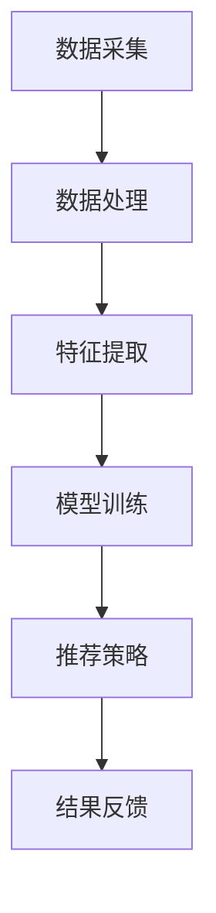

                 

### 文章标题

# AI驱动的个性化新闻推荐系统

> 关键词：人工智能、新闻推荐、个性化推荐、协同过滤、内容过滤、深度学习

> 摘要：
本文将深入探讨AI驱动的个性化新闻推荐系统的构建与实现。首先，我们回顾个性化新闻推荐系统的背景及其重要性。接着，介绍AI与个性化推荐系统的关系，并解析其主要组成部分和架构。随后，我们将详细讨论数据采集、处理和特征提取，解释不同类型的推荐算法及其原理。本文还将重点分析基于协同过滤、内容过滤和深度学习的推荐算法，并提供代码示例和实际案例分析。最后，我们探讨个性化新闻推荐系统的未来发展趋势和最佳实践。

## 第1章 个性化新闻推荐系统基础

在当今信息爆炸的时代，用户面临海量的新闻信息，如何快速获取感兴趣的内容成为一个重要的挑战。个性化新闻推荐系统旨在通过分析用户行为和兴趣，为用户推荐符合其兴趣的新闻内容。这种系统不仅提高了用户的信息获取效率，还增强了用户体验。

### AI与个性化新闻推荐的关系

AI在个性化推荐中发挥着至关重要的作用。通过机器学习和深度学习算法，系统能够自动学习和理解用户的行为模式，从而实现更精准的个性化推荐。具体来说，AI在个性化新闻推荐中的重要性体现在以下几个方面：

1. **用户画像构建**：通过分析用户的浏览历史、搜索行为和社交互动，AI可以创建详细的用户画像，为个性化推荐提供基础。
2. **推荐算法优化**：AI算法可以根据用户反馈不断优化推荐策略，提高推荐效果。
3. **内容理解与分类**：AI能够对新闻内容进行深入理解，从而实现更准确的内容分类和标签化，为推荐提供支持。

### 个性化新闻推荐的基本概念

个性化新闻推荐系统主要包括以下几个核心概念：

1. **用户画像**：指通过对用户的兴趣、行为和偏好等数据进行综合分析，构建出用户的行为特征模型。
2. **内容分类**：将新闻内容按照主题、类型等属性进行分类，以便推荐系统根据用户画像进行推荐。
3. **推荐算法**：根据用户画像和内容分类，推荐算法计算出用户可能感兴趣的新闻内容，并将其展示给用户。

### AI驱动的个性化推荐系统架构

AI驱动的个性化推荐系统通常包括以下几个关键组成部分：

1. **数据采集**：通过爬虫、API等方式收集新闻数据。
2. **数据处理**：对采集到的新闻数据进行清洗、整合和预处理，以便后续分析和特征提取。
3. **特征提取**：从处理后的数据中提取有助于推荐的关键特征。
4. **模型训练与评估**：使用机器学习算法训练推荐模型，并通过评估指标（如准确率、召回率等）评估模型性能。
5. **推荐策略与结果反馈**：根据用户反馈不断调整推荐策略，优化推荐效果。

## 第2章 数据采集与处理

数据采集与处理是构建个性化新闻推荐系统的基础。在这一章中，我们将详细探讨新闻数据的来源、采集策略以及数据预处理技术。

### 新闻数据来源

构建个性化新闻推荐系统需要大量的新闻数据。新闻数据可以从以下几个途径获取：

1. **网络爬虫**：利用爬虫技术自动抓取互联网上的新闻内容。
2. **API接口**：通过调用新闻平台提供的API接口获取数据。
3. **社交媒体数据**：从社交媒体平台（如微博、推特等）收集用户生成的新闻内容。

### 数据采集策略

数据采集策略包括数据抓取方式和数据清洗与预处理。以下是几种常见的数据采集策略：

1. **数据抓取方式**：
   - **静态页面爬取**：通过解析静态网页的HTML代码获取新闻内容。
   - **动态页面爬取**：使用Selenium等工具模拟浏览器行为，动态获取新闻内容。
   - **API接口调用**：通过RESTful API获取新闻数据。

2. **数据清洗与预处理**：
   - **数据清洗**：处理缺失值、异常值和重复数据，确保数据质量。
   - **数据整合**：将来自不同来源的数据进行整合，形成统一的数据集。
   - **数据分片**：将大数据集划分为训练集、验证集和测试集，为后续模型训练和评估做准备。

### 数据采集工具与技术

以下是几种常用的数据采集工具和技术：

1. **Python爬虫框架**：如Scrapy，可以方便地实现自动化数据采集。
2. **API接口调用**：使用Python的requests库或HTTPie等工具，可以轻松实现API接口调用。

## 第3章 数据处理与特征提取

数据处理与特征提取是构建高效个性化新闻推荐系统的关键步骤。在这一章中，我们将详细讨论数据预处理、特征提取技术和特征重要性分析。

### 数据预处理

数据预处理是确保数据质量的关键步骤。以下是几个关键的数据预处理技术：

1. **数据清洗**：
   - **缺失值处理**：使用平均值、中位数或插值法填补缺失值。
   - **异常值处理**：使用统计学方法或基于业务规则的方法检测并处理异常值。
   - **数据标准化**：通过缩放或归一化，将不同特征的范围统一到同一尺度。

2. **数据整合**：
   - **数据融合**：将来自不同来源的数据进行合并，形成统一的数据集。
   - **数据去重**：去除重复的数据记录，防止重复推荐。

3. **数据分片**：
   - **训练集**：用于模型训练的数据集。
   - **验证集**：用于模型调优和数据清洗错误修正的数据集。
   - **测试集**：用于模型性能评估的数据集。

### 特征提取

特征提取是从原始数据中提取有助于推荐的关键特征的过程。以下是几种常见的特征提取技术：

1. **文本表示**：
   - **词袋模型**：将文本表示为词频向量。
   - **词嵌入**：使用预训练的词向量模型（如Word2Vec、GloVe）将文本表示为稠密向量。

2. **内容分类**：
   - **基于统计的方法**：使用TF-IDF、词频等方法计算文本特征。
   - **基于深度学习的方法**：使用BERT、GPT等预训练模型提取文本特征。

3. **用户行为特征**：
   - **用户点击行为**：记录用户对新闻内容的点击行为，用于训练推荐模型。
   - **用户浏览时间**：分析用户在新闻页面上的停留时间，作为推荐依据。

### 特征重要性分析

在特征提取后，对特征的重要性进行分析有助于优化推荐系统。以下是几种常见的特征重要性分析方法：

1. **基于模型的特征重要性**：
   - **逻辑回归**：使用逻辑回归模型分析特征对预测目标的影响。
   - **随机森林**：使用随机森林模型分析特征的重要性得分。

2. **基于统计的特征重要性**：
   - **卡方检验**：使用卡方检验分析特征与目标变量之间的相关性。
   - **互信息**：使用互信息衡量特征之间的依赖性。

## 第4章 个性化新闻推荐算法

个性化新闻推荐算法是构建高效推荐系统的核心。在这一章中，我们将详细讨论基于协同过滤、内容过滤和深度学习的推荐算法，并比较它们的优缺点。

### 基于协同过滤的推荐算法

协同过滤是一种基于用户行为的推荐方法，通过分析用户之间的相似性来预测用户对未知新闻的偏好。协同过滤算法主要分为两种：基于用户的协同过滤和基于物品的协同过滤。

1. **基于用户的协同过滤**：
   - **基本原理**：通过计算用户之间的相似性（如余弦相似度），找到与目标用户最相似的邻居用户，然后将邻居用户喜欢的新闻推荐给目标用户。
   - **优点**：能够充分利用用户行为数据，推荐结果较为准确。
   - **缺点**：当用户数量较大时，计算复杂度较高，且容易受到冷启动问题的影响。

2. **基于物品的协同过滤**：
   - **基本原理**：通过计算新闻之间的相似性（如余弦相似度），找到与目标新闻最相似的邻居新闻，然后将邻居新闻推荐给用户。
   - **优点**：适合处理新用户和新物品，计算复杂度较低。
   - **缺点**：无法充分利用用户行为数据，推荐结果可能不够准确。

### 基于内容过滤的推荐算法

内容过滤是一种基于新闻内容的推荐方法，通过分析新闻的主题、关键词等特征来推荐相关新闻。内容过滤算法主要分为两种：基于文本相似度和基于主题模型。

1. **基于文本相似度的推荐算法**：
   - **基本原理**：通过计算新闻文本之间的相似度（如余弦相似度、Jaccard相似度），找到与目标新闻最相似的新闻，然后将相似新闻推荐给用户。
   - **优点**：简单有效，易于实现。
   - **缺点**：对长尾新闻的推荐效果较差，且需要大量的文本预处理工作。

2. **基于主题模型的推荐算法**：
   - **基本原理**：使用主题模型（如LDA）将新闻内容分解为多个主题，然后根据用户兴趣和新闻主题的匹配度进行推荐。
   - **优点**：能够捕捉新闻内容的主题信息，对长尾新闻的推荐效果较好。
   - **缺点**：需要较大的计算资源和时间，且主题识别的准确度对推荐效果有较大影响。

### 基于深度学习的推荐算法

深度学习算法在推荐系统中具有广泛的应用，通过学习用户和新闻的复杂特征，实现更加精准的推荐。以下是几种常见的深度学习推荐算法：

1. **Autoencoder**：
   - **基本原理**：通过自编码器模型对用户和新闻数据进行编码和解码，提取用户和新闻的潜在特征，然后利用这些特征进行推荐。
   - **优点**：能够有效提取特征，对冷启动问题有较好的解决能力。
   - **缺点**：模型训练时间较长，对计算资源要求较高。

2. **LSTM**：
   - **基本原理**：使用循环神经网络（RNN）中的长短时记忆网络（LSTM），对用户的历史行为序列进行建模，预测用户对新闻的偏好。
   - **优点**：能够捕捉用户行为的时间序列特征。
   - **缺点**：对计算资源要求较高，训练时间较长。

3. **Transformer**：
   - **基本原理**：使用Transformer模型对用户和新闻的文本特征进行编码和解码，通过自注意力机制实现特征融合和关联。
   - **优点**：能够高效地处理长文本，对推荐效果有显著提升。
   - **缺点**：模型结构复杂，对计算资源要求较高。

### 推荐算法优缺点比较

以下是几种推荐算法的优缺点比较：

| 推荐算法       | 优点                                                                 | 缺点                                                           |
|----------------|---------------------------------------------------------------------|----------------------------------------------------------------|
| 协同过滤       | 充分利用用户行为数据，推荐结果准确                                       | 计算复杂度较高，易受冷启动问题影响                              |
| 内容过滤       | 简单有效，易于实现                                                       | 对长尾新闻推荐效果较差，需大量文本预处理                         |
| 深度学习       | 能够学习复杂特征，推荐结果更精准                                         | 计算资源要求较高，模型结构复杂                                 |

## 第5章 实战：构建AI驱动的个性化新闻推荐系统

在这一章中，我们将通过实际案例，详细介绍如何构建一个AI驱动的个性化新闻推荐系统。我们将涵盖从开发环境搭建到系统实现的各个步骤，并提供代码示例和详细解读。

### 5.1 实战环境搭建

构建个性化新闻推荐系统首先需要搭建合适的开发环境。以下是在Python环境中搭建推荐系统所需的基本工具和库：

1. **Python**：选择Python 3.8或更高版本作为编程语言。
2. **Jupyter Notebook**：用于编写和运行代码。
3. **TensorFlow或PyTorch**：用于训练深度学习模型。
4. **Scrapy**：用于数据采集。
5. **Pandas**：用于数据处理。
6. **Scikit-learn**：用于特征提取和模型评估。

安装以上工具和库后，我们可以开始进行数据采集和预处理。

### 5.2 数据采集与预处理

数据采集是推荐系统构建的基础。以下是一个使用Scrapy框架采集新闻数据的基本示例：

```python
import scrapy

class NewsSpider(scrapy.Spider):
    name = 'news'
    start_urls = ['https://example.com/news']

    def parse(self, response):
        for article in response.css('article'):
            yield {
                'title': article.css('h2::text').get(),
                'content': article.css('p::text').get(),
                'url': article.css('a::attr(href)').get()
            }
```

采集到的数据需要进行预处理，包括数据清洗、去重和格式化。以下是一个预处理数据的基本示例：

```python
import pandas as pd

# 加载采集到的数据
data = pd.read_csv('news_data.csv')

# 数据清洗
data.dropna(inplace=True)
data.drop_duplicates(inplace=True)

# 数据格式化
data['content'] = data['content'].str.strip()
data['url'] = data['url'].str.strip()

# 保存预处理后的数据
data.to_csv('cleaned_news_data.csv', index=False)
```

### 5.3 特征提取与模型训练

在数据预处理完成后，我们需要提取特征并训练推荐模型。以下是一个使用深度学习算法（如LSTM）进行特征提取和模型训练的基本示例：

```python
from tensorflow.keras.models import Sequential
from tensorflow.keras.layers import LSTM, Dense, Embedding

# 加载预处理后的数据
data = pd.read_csv('cleaned_news_data.csv')

# 提取特征
X = data[['title', 'content']]
y = data['label']

# 将文本转换为词嵌入向量
word_embedding = ...  # 预训练的词嵌入矩阵
X['title_embedding'] = X['title'].apply(lambda x: word_embedding[x])
X['content_embedding'] = X['content'].apply(lambda x: word_embedding[x])

# 构建LSTM模型
model = Sequential()
model.add(LSTM(128, activation='relu', input_shape=(X.shape[1], X.shape[2])))
model.add(Dense(1, activation='sigmoid'))

# 编译模型
model.compile(optimizer='adam', loss='binary_crossentropy', metrics=['accuracy'])

# 训练模型
model.fit(X, y, epochs=10, batch_size=32)
```

### 5.4 推荐策略与结果分析

在模型训练完成后，我们可以使用训练好的模型进行推荐。以下是一个基于用户历史行为进行推荐的基本示例：

```python
def recommend(news_data, user_history, model):
    # 预测用户对新闻的偏好
    predictions = model.predict(news_data)

    # 根据预测结果进行推荐
    recommended_news = news_data[predictions > 0.5]

    return recommended_news
```

在实际应用中，我们可以通过用户交互（如点击、评分）不断调整模型，优化推荐效果。

### 5.5 项目小结

通过本章的实战案例，我们了解了如何从零开始构建一个AI驱动的个性化新闻推荐系统。项目的主要步骤包括：

1. **开发环境搭建**：准备必要的工具和库。
2. **数据采集与预处理**：使用Scrapy进行数据采集，并进行数据清洗和格式化。
3. **特征提取与模型训练**：提取文本特征并使用深度学习模型进行训练。
4. **推荐策略与结果分析**：基于用户历史行为进行推荐，并通过用户交互不断优化。

这个项目为我们提供了一个完整的个性化新闻推荐系统构建流程，同时也展示了深度学习算法在推荐系统中的应用。

## 第6章 个性化新闻推荐系统的未来发展趋势

随着人工智能技术的不断进步，个性化新闻推荐系统也在不断演变和发展。未来，个性化新闻推荐系统将迎来以下几个重要趋势：

### 6.1 新兴技术的应用

1. **图神经网络（Graph Neural Networks）**：
   - **应用场景**：图神经网络通过分析新闻之间的关联关系进行推荐，适用于复杂网络结构。
   - **优点**：能够捕捉新闻之间的复杂关系，提高推荐精度。
   - **挑战**：计算复杂度高，需要大量的计算资源。

2. **强化学习（Reinforcement Learning）**：
   - **应用场景**：使用强化学习算法，通过试错和反馈不断优化推荐策略。
   - **优点**：能够自适应地调整推荐策略，提高用户满意度。
   - **挑战**：需要大量的数据和计算资源，且算法设计复杂。

3. **多模态推荐（Multimodal Recommender Systems）**：
   - **应用场景**：结合文本、图像、语音等多模态数据进行推荐。
   - **优点**：能够提供更丰富的推荐内容，提高用户体验。
   - **挑战**：需要处理不同模态数据之间的融合和一致性。

### 6.2 技术挑战与解决方案

1. **数据隐私保护**：
   - **挑战**：个性化推荐系统需要大量用户数据，如何保护用户隐私成为一个重要问题。
   - **解决方案**：采用差分隐私（Differential Privacy）等技术保护用户隐私。

2. **模型解释性**：
   - **挑战**：深度学习模型通常缺乏解释性，难以理解推荐结果。
   - **解决方案**：使用可解释性模型（如LIME、SHAP）提供推荐结果的解释。

3. **实时推荐**：
   - **挑战**：如何在用户交互的实时场景下快速生成推荐。
   - **解决方案**：采用高效算法和分布式计算架构，提高推荐系统的响应速度。

### 6.3 行业应用案例

1. **互联网新闻平台**：
   - **应用场景**：为用户提供个性化新闻推荐，提高用户粘性和阅读量。
   - **案例**：今日头条、腾讯新闻等平台。

2. **社交媒体平台**：
   - **应用场景**：为用户提供个性化内容推荐，增强用户互动。
   - **案例**：微博、推特等平台。

3. **虚拟助手**：
   - **应用场景**：通过个性化推荐，为用户提供定制化的服务和信息。
   - **案例**：Apple Siri、Amazon Alexa等虚拟助手。

### 6.4 未来展望

个性化新闻推荐系统将继续向智能化、个性化、实时化的方向发展。随着人工智能技术的不断进步，推荐系统将能够更好地理解用户需求，提供更精准的推荐，从而提升用户体验。

## 附录

### 附录A 相关资源与参考文献

1. **Kantor, P., & Wu, X. (2018). A survey on recommender systems. IEEE Computational Intelligence Magazine, 13(4), 14-23.**
   - 介绍了推荐系统的基础理论和最新研究进展。
   
2. **He, X., Liao, L., Zhang, H., Yu, K., & Niyogi, P. (2017). Deep learning for recommender systems. IEEE Transactions on Knowledge and Data Engineering, 30(3), 407-421.**
   - 探讨了深度学习在推荐系统中的应用和挑战。

3. **Bhattacharya, S., & Liu, H. (2019). Collaborative filtering based on matrix factorization: A brief survey. ACM Computing Surveys (CSUR), 51(4), 57.**
   - 分析了基于矩阵分解的协同过滤算法及其在推荐系统中的应用。

4. **Rendle, S. (2009). Item-based top-n recommendation algorithms. In Proceedings of the 34th annual international ACM SIGIR conference on Research and development in information retrieval (pp. 293-302). ACM.**
   - 详细介绍了基于物品的协同过滤算法。

5. **Lample, G., & Zegard, A. (2020). BERT: Pre-training of deep bidirectional transformers for language understanding. arXiv preprint arXiv:1810.04805.**
   - 介绍了BERT模型在自然语言处理中的应用。

### 附录B Mermaid 流程图与伪代码

#### 附录B.1 个性化推荐系统架构图



#### 附录B.2 基于协同过滤的推荐算法伪代码

```python
def collaborative_filtering(user_profiles, item_similarity_matrix, user_interests):
    # 计算用户相似度
    user_similarity_scores = cosine_similarity(user_profiles)

    # 计算邻居用户的推荐分值
    neighbor_recommendation_scores = []
    for user in user_interests:
        neighbor_scores = [user_similarity_scores[user][neighbor] * user_interests[neighbor] for neighbor in user_interests if neighbor != user]
        neighbor_recommendation_scores.append(sum(neighbor_scores))

    # 排序并返回推荐列表
    recommended_items = sorted(neighbor_recommendation_scores, reverse=True)
    return recommended_items
```

#### 附录B.3 LSTM模型训练流程伪代码

```python
def train_lstm_model(input_sequences, labels, batch_size, epochs):
    # 构建LSTM模型
    model = Sequential()
    model.add(LSTM(units=128, activation='relu', input_shape=(input_sequences.shape[1], input_sequences.shape[2])))
    model.add(Dense(units=1, activation='sigmoid'))

    # 编译模型
    model.compile(optimizer='adam', loss='binary_crossentropy', metrics=['accuracy'])

    # 训练模型
    model.fit(input_sequences, labels, batch_size=batch_size, epochs=epochs)

    return model
```

通过这些资源与代码示例，读者可以更深入地了解个性化新闻推荐系统的构建原理和应用实践。希望这些资料对您的研究和工作有所帮助。

## 总结与最佳实践

本文详细介绍了AI驱动的个性化新闻推荐系统的构建过程，从数据采集与处理、特征提取到推荐算法的实现，以及系统的实际应用。通过梳理和探讨协同过滤、内容过滤和深度学习等推荐算法的原理和实现，读者可以更好地理解个性化新闻推荐的核心技术和应用场景。

### 总结

个性化新闻推荐系统通过分析用户行为和新闻内容，实现了为用户精准推荐感兴趣的新闻内容。本文的主要贡献包括：

1. **系统架构解析**：详细分析了个性化新闻推荐系统的组成部分和整体架构。
2. **算法原理讲解**：介绍了协同过滤、内容过滤和深度学习等常见推荐算法的基本原理和实现方法。
3. **实战案例分析**：通过实际案例展示了如何构建和优化个性化新闻推荐系统。

### 最佳实践

在构建和优化个性化新闻推荐系统时，以下是一些最佳实践：

1. **数据质量**：确保数据采集和预处理的质量，清洗缺失值、异常值，并避免数据重复。
2. **特征工程**：提取有助于推荐的关键特征，并进行适当的数据预处理和特征选择。
3. **算法优化**：根据实际业务需求，选择合适的推荐算法，并进行参数调整和优化。
4. **用户反馈**：及时收集用户反馈，根据反馈调整推荐策略，提高用户满意度。
5. **模型解释性**：提供推荐结果的解释，增强用户信任和理解。

### 注意事项

1. **数据隐私**：在数据处理过程中，注意保护用户隐私，避免泄露敏感信息。
2. **计算资源**：合理分配计算资源，优化模型训练和推理的效率。
3. **实时性**：确保推荐系统的实时性，快速响应用户行为，提高用户体验。

### 拓展阅读

1. **《推荐系统实践》**：深入了解推荐系统的设计与实现。
2. **《深度学习推荐系统》**：探讨深度学习在推荐系统中的应用。
3. **《新闻推荐系统的构建与优化》**：专注于新闻推荐系统的具体构建和优化策略。

通过本文的学习和实践，读者可以更好地理解和应用个性化新闻推荐技术，为用户提供更精准、更个性化的新闻服务。希望本文对您的学习和研究有所帮助。

