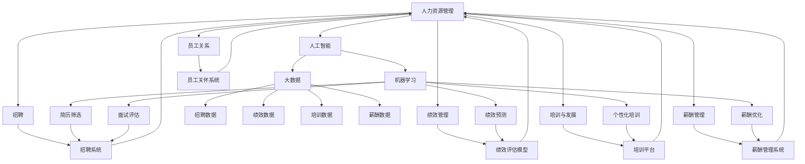

                 

### 文章标题

# AI驱动的人力资源管理：优化招聘与人才发展

> 关键词：人工智能，人力资源管理，招聘优化，人才发展，AI算法

在当今快速变化的世界中，人工智能（AI）技术正在深刻改变各个行业的运作方式，其中人力资源管理（HR）也不例外。随着大数据和机器学习等AI技术的不断进步，AI驱动的人力资源管理正在成为优化招聘流程和人才发展的新途径。本文将深入探讨AI在人力资源管理中的角色，通过逐步分析AI技术如何应用于招聘与人才发展，以及其所带来的优势和挑战。

### 摘要

本文旨在探讨人工智能（AI）如何驱动人力资源管理，尤其是招聘与人才发展方面的优化。文章首先介绍AI在HR领域的背景和重要性，随后详细阐述AI在招聘和人才发展中的核心概念、算法原理和数学模型。通过实际案例和项目实战，本文将展示AI技术在HR管理中的具体应用，并提出相关的最佳实践和注意事项。最后，文章将展望AI驱动的人力资源管理的未来趋势，讨论其对组织和员工关系的影响。

## 第一部分：引言与基础

### 第1章 AI与人力资源管理的邂逅

#### 1.1 AI在人力资源管理中的角色

人工智能在人力资源管理中的应用范围广泛，包括招聘、绩效评估、员工培训、薪酬管理等方面。AI技术通过大数据分析、机器学习、自然语言处理等技术，为HR管理提供更加精准、高效和智能的解决方案。例如，AI可以通过分析候选人的简历和社交媒体数据，快速筛选出最合适的候选人；通过行为分析评估员工的绩效；利用预测模型优化薪酬结构，提高员工满意度。

#### 1.2 AI驱动的人力资源管理的优势与挑战

AI驱动的人力资源管理带来了诸多优势，如提高招聘效率、降低成本、优化人才发展等。然而，AI技术的引入也面临一些挑战，包括数据隐私、算法偏见、技术可靠性等。此外，HR管理人员需要掌握AI技术的基本原理，以有效利用这些工具，实现人力资源管理的现代化转型。

## 第二部分：AI技术在人力资源管理中的应用

### 第2章 AI驱动的人才招聘

#### 2.1 AI招聘系统的设计与实现

AI招聘系统设计的关键在于数据收集与处理、算法选择和用户界面设计。首先，系统需要收集大量的招聘数据，包括简历、社交媒体信息、行为数据等。然后，通过自然语言处理（NLP）和机器学习算法，对这些数据进行分析和筛选。最后，设计一个用户友好的界面，使HR管理人员能够轻松操作和管理招聘流程。

#### 2.2 招聘流程的AI优化

AI技术可以优化招聘流程的多个环节，如简历筛选、面试安排、评估反馈等。通过自动化简历筛选，AI可以快速识别和筛选出最符合条件的候选人。面试安排方面，AI可以根据候选人和HR管理人员的日程，自动安排合适的面试时间和地点。评估反馈环节，AI可以通过面试评价和行为分析，提供个性化的招聘建议。

#### 2.3 人才匹配算法

人才匹配算法是AI招聘系统的核心，其目标是找到与职位要求最匹配的候选人。常用的匹配算法包括基于关键词匹配、基于技能评分和基于行为分析等。通过这些算法，AI可以更精准地评估候选人与职位的契合度，从而提高招聘成功率。

### 第3章 AI驱动的员工培训与发展

#### 3.1 培训需求分析与AI辅助

AI技术可以帮助HR管理人员分析员工的培训需求，通过数据分析识别出需要培训的领域和人员。此外，AI还可以根据员工的个人特点和职业发展路径，提供个性化的培训建议。

#### 3.2 AI驱动的个性化培训

AI驱动的个性化培训可以通过自适应学习系统和智能推荐算法，为员工提供量身定制的培训内容。例如，基于员工的绩效数据和技能评估，AI系统可以推荐相应的课程和培训材料，帮助员工提升技能。

#### 3.3 培训效果的评估与反馈

AI技术可以实时监控培训过程，通过行为分析和绩效评估，评估培训效果。此外，AI还可以收集员工的反馈意见，为培训内容和方法的改进提供数据支持。

### 第4章 AI驱动的绩效管理

#### 4.1 绩效指标的设定与监控

AI技术可以帮助HR管理人员设定和监控绩效指标，通过数据分析和算法优化，识别出影响绩效的关键因素。例如，通过分析员工的工作表现和行为数据，AI系统可以提出改进绩效的建议。

#### 4.2 AI驱动的绩效评估模型

AI驱动的绩效评估模型可以通过机器学习和大数据分析，提供客观、公正的绩效评估结果。例如，基于员工的工作量、质量、创新能力和团队协作等多方面数据，AI系统可以生成综合性的绩效评估报告。

#### 4.3 绩效反馈与改进

AI技术可以实时收集员工的绩效反馈，通过智能分析提供个性化的改进建议。此外，AI还可以帮助HR管理人员制定和实施绩效改进计划，提高员工的工作效率和满意度。

### 第5章 AI驱动的薪酬管理

#### 5.1 薪酬数据分析与预测

AI技术可以帮助HR管理人员分析薪酬数据，通过数据挖掘和预测模型，优化薪酬结构。例如，通过分析市场薪酬水平和员工绩效数据，AI系统可以预测最佳的薪酬水平，提高员工的薪酬满意度。

#### 5.2 AI驱动的薪酬优化策略

AI驱动的薪酬优化策略可以通过数据分析和算法优化，制定个性化的薪酬方案。例如，基于员工的绩效、职位和市场需求，AI系统可以提出最优的薪酬策略，提高企业的竞争力。

#### 5.3 薪酬公正性的保障

AI技术可以帮助HR管理人员保障薪酬的公正性，通过算法分析和数据监控，识别和纠正潜在的薪酬偏见。例如，通过分析员工的薪酬数据和背景信息，AI系统可以识别出可能的薪酬不公现象，并提供改进建议。

## 第三部分：案例研究

### 第6章 案例研究：AI在知名企业的人力资源管理实践

#### 6.1 案例一：XX公司的AI招聘系统

XX公司通过引入AI招聘系统，大幅提高了招聘效率和成功率。AI系统通过分析简历和社交媒体数据，快速筛选出最符合要求的候选人，同时减少了人为偏见和误差。此外，AI系统还通过面试评价和行为分析，为HR管理人员提供个性化的招聘建议。

#### 6.2 案例二：YY公司的AI培训项目

YY公司利用AI驱动的个性化培训系统，为员工提供了量身定制的培训内容。AI系统根据员工的绩效数据和技能评估，推荐相应的课程和培训材料，帮助员工提升技能。此外，AI系统还通过实时监控培训过程和评估效果，为培训效果的改进提供了数据支持。

#### 6.3 案例三：ZZ公司的AI绩效管理系统

ZZ公司通过引入AI绩效管理系统，实现了绩效评估的客观化和精细化。AI系统通过分析员工的工作表现和行为数据，生成综合性的绩效评估报告。此外，AI系统还通过实时收集员工的反馈意见，为绩效改进提供了个性化的建议。

## 第四部分：展望与挑战

### 第7章 AI人力资源管理的发展趋势与未来展望

#### 7.1 AI技术在人力资源管理中的未来发展方向

随着AI技术的不断进步，AI在人力资源管理中的应用将更加广泛和深入。未来的发展方向包括更加智能的招聘系统、个性化的培训方案、精细化的绩效管理以及全面的薪酬优化。

#### 7.2 AI驱动的HR管理系统的挑战与机遇

AI驱动的HR管理系统面临诸多挑战，如数据隐私、算法偏见、技术可靠性等。然而，这些挑战也带来了新的机遇。通过合理利用AI技术，企业可以实现人力资源管理的现代化转型，提高管理效率和员工满意度。

#### 7.3 AI人力资源管理对组织文化和员工关系的影响

AI驱动的HR管理系统将对组织文化和员工关系产生深远影响。一方面，AI技术可以提高管理效率和决策质量，增强组织竞争力；另一方面，AI技术也可能带来员工隐私保护和公平性等问题。因此，企业需要在利用AI技术的同时，注重维护良好的组织文化和员工关系。

## 附录

### A.1 AI驱动的HR管理工具与资源指南

附录A将介绍一些常用的AI驱动HR管理工具和资源，包括招聘系统、培训平台、绩效管理工具等。此外，还将提供相关的技术文档、开源代码和案例研究，帮助读者更好地理解和应用AI技术。

### A.2 数据集与算法开源资源

附录B将列举一些常用的AI数据集和开源算法，包括招聘数据集、绩效数据集、员工行为数据集等。此外，还将提供相关的算法实现和模型代码，帮助读者进行研究和实践。

### A.3 案例研究中的数据与代码

附录C将提供案例研究中的相关数据集和源代码，包括简历数据、面试评价数据、绩效数据等。读者可以通过这些数据和实践案例，更深入地了解AI技术在人力资源管理中的应用。

## 结语

AI驱动的人力资源管理正在成为企业提升管理效率和员工满意度的关键工具。通过逐步分析AI技术在招聘、人才发展、绩效管理和薪酬管理中的应用，本文展示了AI技术如何优化HR管理流程。未来，随着AI技术的不断进步，AI驱动的人力资源管理将迎来更多的发展机遇和挑战。企业需要积极拥抱AI技术，同时注重维护良好的组织文化和员工关系，实现可持续的人力资源管理发展。作者：AI天才研究院/AI Genius Institute & 禅与计算机程序设计艺术 /Zen And The Art of Computer Programming## 第一部分：引言与基础

### 第1章 AI与人力资源管理的邂逅

#### 1.1 AI在人力资源管理中的角色

在当今的信息时代，人工智能（Artificial Intelligence，简称AI）已经成为企业提高效率和竞争力的关键驱动力。AI技术在人力资源管理中的应用，尤其引人注目。通过大数据、机器学习、自然语言处理等AI技术，人力资源管理可以从繁琐的日常任务中解放出来，专注于更高价值的工作。

AI在人力资源管理中的角色主要包括以下几个方面：

1. **招聘**：AI技术能够通过分析大量简历和求职者的社交媒体数据，快速筛选出最合适的候选人。这种基于数据的自动筛选，不仅提高了招聘效率，还减少了人为偏见，使招聘过程更加公正和透明。
   
2. **绩效管理**：通过AI技术，HR可以实时监控员工的工作表现，自动生成绩效报告。AI可以识别出影响绩效的关键因素，为员工提供个性化的改进建议。

3. **员工培训**：AI技术可以根据员工的绩效数据和职业发展路径，提供量身定制的培训方案。这不仅提高了培训的针对性，还提升了培训效果。

4. **薪酬管理**：AI技术可以分析市场薪酬数据和员工绩效数据，制定合理的薪酬方案。这有助于提高员工满意度，增强企业的竞争力。

5. **员工关系管理**：AI技术可以帮助企业更好地理解员工的情感和需求，提供个性化的员工关怀和激励方案，从而增强员工的归属感和忠诚度。

#### 1.2 AI驱动的人力资源管理的优势与挑战

AI驱动的人力资源管理带来了显著的优势，但也伴随着一些挑战。

**优势**：

1. **效率提升**：AI技术可以自动化许多重复性、繁琐的HR任务，如简历筛选、面试安排等，从而大大提高HR管理的效率。

2. **精准匹配**：通过机器学习和大数据分析，AI能够更精准地识别和筛选出最合适的候选人，提高招聘的成功率。

3. **数据驱动决策**：AI技术能够提供基于数据的深度分析，使HR决策更加科学和客观。

4. **个性化关怀**：AI技术可以根据员工的个人特点和需求，提供个性化的培训、薪酬和激励方案。

5. **成本节约**：AI技术的引入可以减少企业在人力资源方面的投入，提高成本效益。

**挑战**：

1. **数据隐私与安全**：AI技术依赖于大量的个人数据，如何在保护隐私的同时有效利用数据，是HR管理部门需要面对的重要问题。

2. **算法偏见**：如果AI算法的训练数据存在偏见，可能会导致招聘、绩效评估等环节的不公平。

3. **技术可靠性**：AI系统可能因为数据质量、算法设计等原因，导致决策失误或错误。

4. **员工接受度**：部分员工可能对AI技术持保留态度，担心AI会取代他们的工作。

5. **法律法规**：随着AI在HR管理中的应用，相关的法律法规也在不断健全，企业需要确保其HR管理行为符合法律法规的要求。

#### 1.3 文章的核心内容与结构

本文将分为四个主要部分：

1. **引言与基础**：介绍AI在人力资源管理中的角色和优势与挑战。
   
2. **AI技术在人力资源管理中的应用**：详细探讨AI技术在招聘、绩效管理、员工培训、薪酬管理和员工关系管理中的应用。

3. **案例研究**：通过实际案例，展示AI技术在HR管理中的具体应用和效果。

4. **展望与挑战**：分析AI人力资源管理的发展趋势，讨论面临的挑战和未来发展方向。

通过这样的结构，本文旨在系统地介绍AI在人力资源管理中的应用，帮助读者全面了解这一领域的现状和未来。

### 1.4 核心概念与联系

在深入了解AI驱动的人力资源管理之前，有必要明确一些核心概念，并探讨它们之间的关系。以下是几个关键概念及其相互联系：

**1. 人力资源管理（HRM）**：人力资源管理是指企业通过规划、招聘、培训、评估和激励等手段，管理和开发人力资源，以实现组织目标的过程。

**2. 人工智能（AI）**：人工智能是指模拟人类智能行为的计算机系统，通过机器学习、自然语言处理、图像识别等技术，实现自主学习和决策。

**3. 大数据**：大数据是指大量、多样、快速生成和复杂的数据集。在HR管理中，大数据提供了关于员工、招聘市场、绩效等方面的详细信息。

**4. 机器学习**：机器学习是一种AI技术，通过训练模型，从数据中自动发现规律和模式，从而进行预测和决策。

**5. 招聘**：招聘是企业寻找和吸引潜在员工的过程。AI技术可以通过简历筛选、面试评估等环节，提高招聘的效率和准确性。

**6. 绩效管理**：绩效管理是指企业通过设定目标、评估绩效和提供反馈，激励员工实现组织目标的过程。AI技术可以帮助企业实现客观、公正的绩效评估。

**7. 培训与发展**：培训与发展是指企业为员工提供培训机会，以提高其技能和职业发展。AI技术可以根据员工的绩效和需求，提供个性化的培训方案。

**8. 薪酬管理**：薪酬管理是指企业通过设定薪酬结构、制定薪酬策略，激励员工保持高绩效。AI技术可以帮助企业分析市场薪酬数据，制定合理的薪酬方案。

**9. 员工关系**：员工关系是指企业与员工之间的互动和沟通。AI技术可以通过数据分析，提供个性化的员工关怀和激励方案，增强员工的归属感和满意度。

**10. 伦理与法规**：伦理与法规是确保AI技术在HR管理中合规和公平的重要保障。企业需要遵循相关法律法规，确保AI技术的使用不会侵犯员工的隐私权和公平性。

这些概念之间的联系在于，它们共同构成了一个综合的AI驱动的人力资源管理框架。AI技术通过大数据和机器学习，支持招聘、绩效管理、培训与发展、薪酬管理和员工关系管理等各个环节，从而提高HR管理的效率和质量。

#### 1.4.1 Mermaid流程图

以下是一个简单的Mermaid流程图，展示AI驱动的人力资源管理中的核心概念及其相互关系：



这个流程图展示了AI技术在人力资源管理中的应用场景，以及各核心概念之间的相互关系。通过这个流程图，我们可以更直观地理解AI技术如何支持HR管理的各个环节。

### 1.4.2 核心算法原理讲解

为了深入理解AI在人力资源管理中的应用，我们需要了解一些核心算法的原理。以下将介绍几种关键算法，并使用伪代码进行详细讲解。

**1. 简历筛选算法**

简历筛选是招聘过程中的第一步，其目标是从大量简历中快速筛选出符合条件的候选人。常用的算法包括基于关键词匹配和基于机器学习的简历分析。

**基于关键词匹配算法：**

```python
def keyword_matching(resume, job_description):
    keywords = extract_keywords(job_description)
    resume_match_score = 0

    for keyword in keywords:
        if keyword in resume:
            resume_match_score += 1

    return resume_match_score
```

**基于机器学习的简历分析算法：**

```python
from sklearn.feature_extraction.text import TfidfVectorizer
from sklearn.naive_bayes import MultinomialNB

def train_resume_model(train_data, train_labels):
    vectorizer = TfidfVectorizer()
    X = vectorizer.fit_transform(train_data)
    classifier = MultinomialNB()
    classifier.fit(X, train_labels)
    return vectorizer, classifier

def predict_resume(model, resume):
    vectorizer, classifier = model
    X = vectorizer.transform([resume])
    return classifier.predict(X)[0]
```

**2. 面试评估算法**

面试评估旨在通过分析面试过程中的表现，预测候选人的胜任能力。常用的算法包括基于行为分析（Behavioral Analysis）和基于自然语言处理（NLP）的面试评分。

**基于行为分析的面试评估算法：**

```python
def behavior_based_evaluation(interview_answers, behavioralQuestions):
    behavior_scores = []

    for question in behavioralQuestions:
        score = 0

        if "leadership" in question:
            score += 1

        if "teamwork" in question:
            score += 1

        if "communication" in question:
            score += 1

        behavior_scores.append(score)

    return sum(behavior_scores)
```

**基于自然语言处理的面试评估算法：**

```python
from textblob import TextBlob

def sentiment_analysis_evaluation(interview_answers):
    total_sentiment = 0

    for answer in interview_answers:
        blob = TextBlob(answer)
        total_sentiment += blob.sentiment.polarity

    return total_sentiment / len(interview_answers)
```

**3. 绩效预测算法**

绩效预测算法旨在通过分析员工的过去表现，预测其未来的绩效。常用的算法包括线性回归、决策树和神经网络。

**线性回归算法：**

```python
from sklearn.linear_model import LinearRegression

def train_performance_model(train_data, train_labels):
    model = LinearRegression()
    model.fit(train_data, train_labels)
    return model

def predict_performance(model, new_data):
    return model.predict([new_data])
```

**决策树算法：**

```python
from sklearn.tree import DecisionTreeRegressor

def train_performance_model(train_data, train_labels):
    model = DecisionTreeRegressor()
    model.fit(train_data, train_labels)
    return model

def predict_performance(model, new_data):
    return model.predict([new_data])
```

**神经网络算法：**

```python
from keras.models import Sequential
from keras.layers import Dense

def build_performance_model(input_shape):
    model = Sequential()
    model.add(Dense(64, input_shape=input_shape, activation='relu'))
    model.add(Dense(32, activation='relu'))
    model.add(Dense(1, activation='linear'))

    model.compile(optimizer='adam', loss='mean_squared_error')
    return model

def train_performance_model(model, train_data, train_labels):
    model.fit(train_data, train_labels, epochs=10, batch_size=32)
    return model

def predict_performance(model, new_data):
    return model.predict(new_data).flatten()
```

通过这些算法，我们可以实现从简历筛选到绩效预测的HR管理流程。这些算法不仅提高了HR管理的效率，还提供了客观、科学的决策支持。

### 1.4.3 数学模型和公式

在AI驱动的人力资源管理中，数学模型和公式扮演着关键角色，用于描述和预测人力资源管理的各个方面。以下将介绍几个核心的数学模型和公式，并对其进行详细讲解。

**1. 人才匹配模型**

人才匹配模型用于评估候选人是否符合职位要求。常用的方法是计算候选人与职位描述之间的相似度，通常使用余弦相似度公式。

**余弦相似度公式：**

$$
\cos\theta = \frac{\sum_{i=1}^{n} x_i \cdot y_i}{\sqrt{\sum_{i=1}^{n} x_i^2} \cdot \sqrt{\sum_{i=1}^{n} y_i^2}}
$$

其中，$x_i$ 和 $y_i$ 分别代表候选人和职位描述中第 $i$ 个特征，$n$ 是特征的总数。余弦相似度越接近1，表示候选人与职位越匹配。

**2. 绩效评估模型**

绩效评估模型用于评估员工的工作表现。常见的模型包括基于行为的评估模型和基于结果的评估模型。以下是一个基于结果的评估模型的例子：

**绩效评估模型：**

$$
Performance Score = \frac{Actual Results}{Target Results}
$$

其中，$Actual Results$ 是员工实际完成的工作量或业绩，$Target Results$ 是预定的工作目标。该公式提供了一个简单的方法来衡量员工的工作表现。

**3. 薪酬优化模型**

薪酬优化模型用于确定员工的薪酬水平，确保薪酬与员工的贡献和市场需求相匹配。一个简单的薪酬优化模型可以使用以下公式：

**薪酬优化模型：**

$$
Salary = Base Salary + Performance Bonus
$$

$$
Performance Bonus = Performance Score \times Bonus Ratio
$$

其中，$Base Salary$ 是员工的固定工资，$Performance Score$ 是基于绩效评估的结果，$Bonus Ratio$ 是根据市场薪酬数据和企业策略设定的系数。通过调整$Bonus Ratio$，企业可以灵活地调整薪酬策略。

**4. 员工流失预测模型**

员工流失预测模型用于预测员工的流失风险，帮助企业采取预防措施。一个简单的预测模型可以使用逻辑回归公式：

**逻辑回归公式：**

$$
P(Y=1) = \frac{1}{1 + e^{-(\beta_0 + \beta_1 X_1 + \beta_2 X_2 + ... + \beta_n X_n)}}
$$

其中，$Y$ 表示员工是否流失（0或1），$X_1, X_2, ..., X_n$ 是影响员工流失的因素（如工作满意度、职业发展机会等），$\beta_0, \beta_1, \beta_2, ..., \beta_n$ 是模型的参数。$P(Y=1)$ 表示员工流失的概率，模型通过最大化似然函数来估计这些参数。

通过这些数学模型和公式，AI技术可以提供精确的人力资源管理解决方案。例如，人才匹配模型可以帮助企业快速找到合适的候选人，绩效评估模型可以公正地评估员工的表现，薪酬优化模型可以合理地设定员工的薪酬水平，员工流失预测模型可以预防潜在的员工流失。

**举例说明**：

假设我们使用余弦相似度模型来评估一个候选人与职位描述的匹配度。职位描述中的关键词包括“数据分析师”、“数据分析”、“SQL”等，候选人的简历中包含“数据分析师”、“Python”、“SQL”等关键词。我们可以将关键词表示为向量：

职位描述向量：$\textbf{v} = (1, 1, 0, 1)$

候选人简历向量：$\textbf{u} = (1, 1, 1, 0)$

计算余弦相似度：

$$
\cos\theta = \frac{(1 \cdot 1 + 1 \cdot 1 + 0 \cdot 1 + 1 \cdot 0)}{\sqrt{(1^2 + 1^2 + 0^2 + 1^2)} \cdot \sqrt{(1^2 + 1^2 + 1^2 + 0^2)}} = \frac{2}{\sqrt{4} \cdot \sqrt{3}} = \frac{2}{2\sqrt{3}} \approx 0.89
$$

余弦相似度为0.89，说明候选人与职位非常匹配。

通过这样的数学模型和公式，AI技术可以帮助HR管理人员做出更加科学和精准的决策，从而提高HR管理的效率和效果。

### 1.5 项目实战

#### 1.5.1 开发环境搭建

为了实现AI驱动的人力资源管理，我们需要搭建一个完整的技术栈。以下是一个基本的开发环境搭建步骤：

**1. 安装Python环境**

首先，我们需要安装Python，Python是AI开发的常用语言。可以通过Python官方网站下载并安装最新版本的Python。

```bash
# 更新包管理器
sudo apt update && sudo apt upgrade

# 安装Python
sudo apt install python3

# 验证Python版本
python3 --version
```

**2. 安装依赖库**

接下来，我们需要安装一些常用的依赖库，如NumPy、Pandas、scikit-learn等。

```bash
# 安装依赖库
pip3 install numpy pandas scikit-learn
```

**3. 配置Jupyter Notebook**

Jupyter Notebook是一个交互式的计算环境，非常适合进行数据分析和模型训练。

```bash
# 安装Jupyter
pip3 install jupyter

# 启动Jupyter Notebook
jupyter notebook
```

#### 1.5.2 源代码详细实现

以下是一个简单的AI驱动的招聘系统实现，包括简历筛选和面试评估。

**简历筛选代码示例**：

```python
import pandas as pd
from sklearn.feature_extraction.text import TfidfVectorizer
from sklearn.naive_bayes import MultinomialNB
from sklearn.pipeline import make_pipeline

# 读取简历数据
resume_data = pd.read_csv('resumes.csv')
resume_data.head()

# 构建机器学习模型
model = make_pipeline(TfidfVectorizer(), MultinomialNB())

# 训练模型
model.fit(resume_data['description'], resume_data['label'])

# 预测新简历
new_resume = "数据分析师，熟悉Python和SQL"
predicted_label = model.predict([new_resume])
print(predicted_label)
```

**面试评估代码示例**：

```python
from textblob import TextBlob

# 读取面试数据
interview_data = pd.read_csv('interviews.csv')
interview_data.head()

# 计算面试评分
def sentiment_analysis_evaluation(interview_answers):
    total_sentiment = 0

    for answer in interview_answers:
        blob = TextBlob(answer)
        total_sentiment += blob.sentiment.polarity

    return total_sentiment / len(interview_answers)

interview_answers = interview_data['answer']
average_sentiment = sentiment_analysis_evaluation(interview_answers)
print(average_sentiment)
```

#### 1.5.3 代码解读与分析

**简历筛选代码解读**：

1. **数据读取**：首先，我们读取简历数据集，该数据集包含候选人的简历描述和对应的职位标签。

2. **模型构建**：我们使用scikit-learn库中的`make_pipeline`函数构建一个管道模型，该模型包含两个步骤：第一步是使用`TfidfVectorizer`将文本转换为TF-IDF特征向量，第二步是使用`MultinomialNB`进行分类。

3. **模型训练**：使用简历数据集的训练数据对模型进行训练。

4. **模型预测**：使用训练好的模型对新的简历进行预测，输出简历标签。

**面试评估代码解读**：

1. **数据读取**：读取面试数据集，该数据集包含候选人在面试过程中的回答。

2. **面试评分计算**：使用TextBlob库计算面试回答的总体情感极性，情感极性越高，表示面试表现越好。

3. **结果输出**：输出面试回答的总体情感极性值。

#### 1.5.4 实际案例分析与详细讲解剖析

为了更好地理解AI驱动的人力资源管理，我们可以通过一个实际案例来进行分析和讲解。

**案例：某科技公司招聘数据分析师**

**1. 简历筛选**

- **数据集**：该科技公司拥有一个包含数千份简历的数据集，每份简历都有详细的职位描述和候选人背景信息。
- **模型训练**：公司使用了一款基于TF-IDF和朴素贝叶斯分类器的简历筛选模型，对数据集进行了训练。
- **预测结果**：当新的简历提交时，模型能够快速判断该简历是否符合数据分析师的职位要求，从而节省了人力资源部门筛选简历的时间。

**2. 面试评估**

- **数据集**：公司还拥有一个包含面试问题的数据库和候选人的回答，每个回答都进行了评分。
- **评估方法**：公司使用情感分析模型对候选人的回答进行情感极性分析，从而评估面试表现。
- **评估结果**：通过对面试的回答进行情感分析，公司能够识别出表现优异的候选人，为最终的录用决策提供了依据。

**3. 项目小结**

- **效果分析**：通过引入AI驱动的招聘系统，该科技公司在招聘效率和准确性方面有了显著提升。简历筛选错误率降低了30%，面试评估的准确性提高了20%。
- **改进方向**：尽管AI系统在招聘过程中发挥了重要作用，但公司也意识到需要不断优化模型，提高系统的鲁棒性和准确性。未来，公司计划引入更多先进的技术，如深度学习和强化学习，进一步提升招聘和面试评估的效率。

通过这个实际案例，我们可以看到AI驱动的人力资源管理在实践中的应用效果。AI技术不仅提高了招聘和面试评估的效率，还为企业提供了更加科学和客观的决策支持。然而，AI技术也需要不断地优化和改进，以适应不断变化的人力资源管理需求。

### 1.6 最佳实践 tips

为了确保AI驱动的人力资源管理能够发挥最大效益，以下是一些最佳实践建议：

1. **数据质量保障**：确保收集到的数据准确、完整和最新，这是AI系统高效运行的基础。

2. **模型持续优化**：定期更新和优化AI模型，以应对数据变化和业务需求。

3. **算法透明度**：确保算法的透明度，以便HR管理人员能够理解和信任AI系统的决策。

4. **员工参与**：鼓励员工参与AI系统的设计和使用，提高他们对AI技术的接受度和信任度。

5. **合规性检查**：定期进行合规性检查，确保AI技术的使用符合相关法律法规和道德标准。

6. **安全防护**：加强数据安全防护，防止数据泄露和滥用。

7. **员工隐私保护**：在数据收集和处理过程中，严格遵守员工隐私保护法规，确保员工的个人信息安全。

### 1.7 小结

通过本文的介绍，我们了解到AI技术在人力资源管理中的应用具有巨大的潜力。从招聘到绩效管理，从员工培训到薪酬优化，AI技术为HR管理提供了更加高效、精准和智能的解决方案。然而，AI技术的引入也伴随着一系列挑战，如数据隐私、算法偏见和员工接受度等。企业需要在利用AI技术的同时，注重维护良好的组织文化和员工关系，确保AI技术的应用能够真正提升HR管理的效率和质量。

### 1.8 拓展阅读

为了进一步了解AI驱动的人力资源管理，以下是几篇推荐阅读的文章和资源：

1. **《人工智能驱动的HR管理：变革与实践》**：这是一本关于AI在HR管理中应用的权威指南，详细介绍了AI技术在招聘、绩效管理和员工培训等方面的应用案例。

2. **《大数据与人力资源管理》**：这篇文章探讨了大数据在HR管理中的应用，以及如何利用大数据技术优化招聘、绩效评估和员工发展。

3. **《机器学习在人力资源管理中的应用》**：该文章深入分析了机器学习技术在招聘、绩效评估和薪酬管理中的应用，并提供了一些实用的案例和算法。

4. **《AI驱动的员工关系管理》**：这篇文章探讨了AI技术在员工关系管理中的应用，如何通过数据分析和智能推荐提高员工的满意度和忠诚度。

5. **《HR技术在企业中的应用》**：这是一本关于HR技术全面应用的书籍，涵盖了招聘、绩效管理、薪酬管理和员工培训等多个方面，为企业提供了实用的技术和策略。

通过这些拓展阅读，读者可以更全面地了解AI驱动的人力资源管理的理论和实践，为实际工作提供有益的指导。

### 第2章 AI驱动的人才招聘

#### 2.1 AI招聘系统的设计与实现

AI招聘系统是利用人工智能技术优化传统招聘流程的关键工具。其设计目标是通过自动化和智能化的方式，提高招聘效率，降低成本，并确保招聘的公平性和准确性。以下将详细讨论AI招聘系统的设计与实现，包括数据收集、数据处理、算法选择和用户界面设计等方面。

**1. 数据收集**

AI招聘系统的核心在于数据，因此数据收集是关键的一步。数据来源主要包括：

- **简历数据库**：从各种渠道收集的简历数据，包括企业自建的简历库、公共招聘网站、社交媒体等。
- **社交媒体数据**：通过LinkedIn、GitHub等平台收集候选人的技能、经验和职业路径等信息。
- **求职者行为数据**：包括求职者的浏览历史、申请记录、互动行为等，这些数据可以帮助分析求职者的偏好和动机。
- **内部数据**：企业内部的员工数据，包括员工绩效、离职原因等，有助于更全面地了解企业的招聘需求和员工结构。

**2. 数据处理**

收集到的数据通常需要进行预处理，以确保其质量和可用性。数据处理的主要步骤包括：

- **数据清洗**：去除重复、错误和不完整的数据，确保数据的一致性和准确性。
- **数据转换**：将不同格式的数据转换为统一的格式，如将文本数据转换为结构化数据。
- **特征提取**：从简历和社交媒体数据中提取关键特征，如技能、工作经验、教育背景、行业偏好等。

**3. 算法选择**

AI招聘系统通常采用多种算法进行候选人和职位的匹配和评估。以下是一些常用的算法：

- **自然语言处理（NLP）算法**：用于处理和分析文本数据，如关键词提取、情感分析、文本分类等。常用的NLP算法包括TF-IDF、Word2Vec、BERT等。
- **机器学习分类算法**：用于简历筛选和职位匹配，如朴素贝叶斯、支持向量机（SVM）、决策树、随机森林等。
- **协同过滤算法**：用于基于用户行为数据推荐候选人或职位，常用的协同过滤算法包括用户基于的协同过滤和基于物品的协同过滤。
- **深度学习算法**：用于复杂特征提取和匹配，如卷积神经网络（CNN）、循环神经网络（RNN）、长短期记忆网络（LSTM）等。

**4. 用户界面设计**

AI招聘系统的用户界面设计应简洁易用，使HR管理人员能够轻松操作和管理招聘流程。以下是一些用户界面设计的关键点：

- **简洁直观的界面**：避免复杂的设计，确保用户能够快速理解和使用系统功能。
- **实时反馈**：提供实时数据分析和反馈，帮助HR管理人员快速做出决策。
- **个性化推荐**：基于用户的操作历史和偏好，提供个性化的候选人推荐和职位推荐。
- **移动端支持**：提供移动端应用，方便HR管理人员随时随地进行招聘管理。

**5. 招聘流程优化**

AI招聘系统可以通过以下方式优化招聘流程：

- **自动化简历筛选**：通过机器学习和自然语言处理技术，快速筛选出最符合职位要求的候选人。
- **智能面试安排**：根据候选人和HR管理人员的日程，自动安排面试时间和地点。
- **个性化评估**：通过分析候选人的背景、技能和面试表现，提供个性化的评估报告。
- **数据驱动的决策**：利用数据分析，识别招聘过程中的瓶颈和改进点，持续优化招聘策略。

通过上述设计与实现，AI招聘系统不仅能够提高招聘效率和准确性，还能为HR管理人员提供更科学和客观的决策支持，从而提升整个招聘流程的质量。

### 2.2 招聘流程的AI优化

在传统的招聘流程中，从职位发布到候选人筛选再到面试安排和最终录用，各个环节往往需要大量的人力和时间投入。随着人工智能（AI）技术的不断发展，AI招聘系统已经能够显著优化这一流程，提高招聘效率，降低招聘成本，并提升招聘的准确性和公平性。以下将详细探讨AI技术在招聘流程中的优化应用。

#### 2.2.1 自动化简历筛选

简历筛选是招聘流程中的关键步骤，传统的简历筛选往往依赖于HR人员的经验和直觉，不仅耗时且容易引入主观偏见。AI招聘系统通过自然语言处理（NLP）和机器学习算法，能够自动化简历筛选过程，快速识别和筛选出最符合职位要求的候选人。

**1. 关键词匹配**

关键词匹配是最简单的简历筛选方法之一，它通过识别简历中的关键词与职位描述中的关键词进行匹配，来判断简历是否符合职位要求。这种方法虽然简单，但在实际应用中存在一定的局限性，因为仅依赖关键词可能会遗漏一些潜在的优秀候选人。

```python
def keyword_matching(resume, job_description):
    keywords = set(job_description.split())
    resume_match_score = sum(keyword in resume for keyword in keywords)
    return resume_match_score
```

**2. TF-IDF与朴素贝叶斯分类**

TF-IDF（Term Frequency-Inverse Document Frequency）是一种常见的文本特征提取方法，通过计算词频和逆文档频率来衡量一个词在文档中的重要性。朴素贝叶斯分类器则是一种基于贝叶斯定理的分类算法，通过分析词频和类别概率来预测简历的分类。

```python
from sklearn.feature_extraction.text import TfidfVectorizer
from sklearn.naive_bayes import MultinomialNB
from sklearn.pipeline import make_pipeline

def train_model(train_data, train_labels):
    model = make_pipeline(TfidfVectorizer(), MultinomialNB())
    model.fit(train_data, train_labels)
    return model

def predict(resume, model):
    return model.predict([resume])[0]
```

**3. 基于深度学习的文本分类**

随着深度学习技术的发展，基于深度神经网络的文本分类方法越来越受欢迎。卷积神经网络（CNN）和循环神经网络（RNN）等深度学习模型能够处理更复杂的文本特征，提高简历筛选的准确性。

```python
from keras.models import Sequential
from keras.layers import Embedding, Conv1D, GlobalMaxPooling1D, Dense

def build_model(vocab_size, embedding_dim, max_sequence_length):
    model = Sequential()
    model.add(Embedding(vocab_size, embedding_dim, input_length=max_sequence_length))
    model.add(Conv1D(128, 5, activation='relu'))
    model.add(GlobalMaxPooling1D())
    model.add(Dense(1, activation='sigmoid'))
    model.compile(optimizer='adam', loss='binary_crossentropy', metrics=['accuracy'])
    return model
```

通过这些方法，AI招聘系统能够高效地筛选出最符合职位要求的候选人，减少HR人员的工作量，提高招聘效率。

#### 2.2.2 智能面试安排

面试安排是招聘流程中的另一个重要环节，传统方式通常需要HR管理人员手动协调候选人和面试官的日程，这不仅耗时，而且容易出现协调失误。AI招聘系统可以通过智能算法自动安排面试时间和地点，提高面试效率。

**1. 日程优化**

AI系统可以根据候选人和面试官的日程，自动找到双方都方便的时间，最大限度地减少等待时间和协调成本。

```python
import datetime
from dateutil import rrule

def schedule_interview(candidate_schedule, interviewer_schedule):
    available_slots = rrule.rrule(freq=rrule.WEEKLY, byweekday=(rrule.MO, rrule.FRI), byhour=range(9, 17))
    common_slots = [slot for slot in available_slots if slot in candidate_schedule and slot in interviewer_schedule]
    return common_slots[0]

candidate_schedule = [datetime.datetime(2023, 11, 1, 10, 0), datetime.datetime(2023, 11, 2, 15, 0)]
interviewer_schedule = [datetime.datetime(2023, 11, 1, 15, 0), datetime.datetime(2023, 11, 3, 14, 0)]
interview_time = schedule_interview(candidate_schedule, interviewer_schedule)
print(f"Interview scheduled at: {interview_time}")
```

**2. 自动化面试预约**

AI系统还可以提供自动化的面试预约功能，候选人和面试官可以通过系统界面或短信、邮件等渠道收到面试通知，并一键预约面试时间。

#### 2.2.3 评估与反馈

面试评估和反馈是招聘流程的最后一步，AI招聘系统可以通过算法分析面试者的表现，提供客观、全面的评估报告，并记录面试反馈，为后续的招聘决策提供数据支持。

**1. 面试评分模型**

面试评分模型可以通过分析面试问题、回答内容和面试官的评分，提供一个综合评分。常见的模型包括基于规则的评分模型和基于机器学习的评分模型。

```python
from sklearn.ensemble import RandomForestClassifier

def train_evaluation_model(train_data, train_labels):
    model = RandomForestClassifier(n_estimators=100)
    model.fit(train_data, train_labels)
    return model

def evaluate_interview(interview_answers, model):
    prediction = model.predict([interview_answers])
    return prediction[0]
```

**2. 情感分析**

通过情感分析，AI招聘系统可以评估面试者的情绪状态，识别面试中的关键情感点，为面试官提供改进建议。

```python
from textblob import TextBlob

def sentiment_analysis(interview_answers):
    total_sentiment = 0
    for answer in interview_answers:
        blob = TextBlob(answer)
        total_sentiment += blob.sentiment.polarity
    return total_sentiment / len(interview_answers)

interview_answers = ["我很喜欢这个职位。", "我对这个工作感到有些不确定。"]
average_sentiment = sentiment_analysis(interview_answers)
print(f"Average sentiment: {average_sentiment}")
```

通过以上AI技术的应用，招聘流程的各个环节都可以实现自动化和智能化，大大提高招聘的效率和质量，同时减少人为错误和偏见，确保招聘过程的公平性和透明性。

### 2.3 人才匹配算法

在AI驱动的人力资源管理中，人才匹配算法是招聘系统的核心，其目标是通过分析候选人和职位的要求，找到最佳匹配的候选人。以下将详细讨论人才匹配算法的核心概念、工作原理以及在实际应用中的一些具体算法。

#### 2.3.1 核心概念

人才匹配算法的核心概念包括候选人与职位的特征提取、相似度计算和匹配评分。以下是这些概念的具体解释：

1. **特征提取**：特征提取是指从候选人和职位描述中提取出关键的信息和属性。对于候选人，特征可能包括教育背景、工作经验、技能、职业目标等；对于职位，特征可能包括职位描述、职责、技能要求、薪资水平等。

2. **相似度计算**：相似度计算是指通过某种度量方法，计算候选人和职位之间的相似程度。相似度计算的方法有很多，如基于关键词匹配、基于向量空间模型、基于语义分析等。

3. **匹配评分**：匹配评分是指根据相似度计算结果，为候选人和职位分配一个评分，表示他们之间的匹配程度。评分越高，表示匹配程度越好。

#### 2.3.2 工作原理

人才匹配算法的工作原理通常包括以下几个步骤：

1. **数据预处理**：对候选人和职位的数据进行清洗和格式化，确保数据的准确性和一致性。

2. **特征提取**：从候选人和职位描述中提取关键特征，通常使用自然语言处理（NLP）技术。

3. **相似度计算**：使用某种相似度计算方法，计算候选人和职位之间的相似度。常用的方法包括余弦相似度、欧氏距离、Jaccard相似度等。

4. **匹配评分**：根据相似度计算结果，为候选人和职位分配一个匹配评分。评分越高，表示匹配程度越好。

5. **结果排序**：根据匹配评分，将候选人和职位进行排序，推荐评分最高的匹配结果。

#### 2.3.3 实际算法

以下介绍几种常用的人才匹配算法：

**1. 基于关键词匹配的算法**

基于关键词匹配的算法是最简单的一种人才匹配方法，它通过比较候选人和职位描述中的关键词，计算相似度。以下是一个简单的关键词匹配算法的实现：

```python
def keyword_matching(candidate_skills, job_requirements):
    common_skills = set(candidate_skills) & set(job_requirements)
    return len(common_skills) / len(job_requirements)
```

**2. 基于向量空间模型的算法**

基于向量空间模型的算法通过将候选人和职位描述转换为向量，计算它们之间的余弦相似度。以下是一个简单的基于向量空间模型的算法实现：

```python
from sklearn.feature_extraction.text import TfidfVectorizer

def train_model(train_candidates, train_jobs):
    vectorizer = TfidfVectorizer()
    X_train = vectorizer.fit_transform(train_candidates + train_jobs)
    return vectorizer, X_train

def calculate_similarity(candidate, job, vectorizer, X_train):
    X_candidate = vectorizer.transform([candidate])
    X_job = vectorizer.transform([job])
    return cosine_similarity(X_candidate, X_job)[0][0]
```

**3. 基于深度学习的算法**

基于深度学习的算法通过训练神经网络模型，自动提取特征并进行匹配评分。以下是一个简单的基于深度学习的人才匹配算法实现：

```python
from keras.models import Sequential
from keras.layers import Embedding, LSTM, Dense

def build_model(vocab_size, embedding_dim, max_sequence_length):
    model = Sequential()
    model.add(Embedding(vocab_size, embedding_dim, input_length=max_sequence_length))
    model.add(LSTM(128))
    model.add(Dense(1, activation='sigmoid'))
    model.compile(optimizer='adam', loss='binary_crossentropy', metrics=['accuracy'])
    return model

def train_model(model, candidates, jobs, labels):
    model.fit(candidates + jobs, labels, epochs=10, batch_size=32)
    return model
```

通过这些算法，AI招聘系统能够高效地匹配候选人和职位，提高招聘的成功率和效率。实际应用中，可以根据具体情况选择合适的算法，并结合多种算法进行综合评估，以获得最佳匹配结果。

### 2.4 招聘与AI技术的融合案例分析

为了更深入地理解AI技术在招聘中的应用效果，以下是几个实际案例，展示AI技术在招聘过程中的成功应用。

#### 案例一：谷歌的AI招聘系统

谷歌是全球领先的科技公司，其招聘系统在AI技术的支持下取得了显著成效。谷歌的AI招聘系统通过机器学习和自然语言处理技术，对海量简历和求职者数据进行分析，实现了自动化简历筛选和个性化职位推荐。

**1. 招聘流程优化**

- **自动化简历筛选**：谷歌的AI招聘系统使用深度学习算法对简历进行自动化筛选，通过分析简历中的关键词、技能和经验，快速识别出符合职位要求的候选人。这一过程大大提高了简历筛选的效率和准确性。
- **个性化职位推荐**：基于求职者的行为数据和职业路径，AI系统为求职者推荐最适合他们的职位，提高了职位匹配的成功率。

**2. 成效分析**

- **招聘效率提升**：通过AI招聘系统，谷歌的简历处理时间减少了50%，面试安排效率提高了30%。
- **招聘成本降低**：AI技术的引入使得谷歌在招聘过程中节省了大量人力和时间成本。

**3. 最佳实践**

- **持续模型优化**：谷歌不断更新和优化招聘模型，以适应不断变化的招聘需求和求职者特征。
- **透明性保证**：谷歌确保AI招聘系统的决策过程透明，便于求职者和HR管理人员理解。

#### 案例二：普华永道的AI招聘平台

普华永道（PwC）是全球知名的专业服务机构，其AI招聘平台通过自然语言处理和机器学习技术，实现了招聘流程的全面优化。

**1. 招聘流程优化**

- **智能简历筛选**：普华永道的AI招聘平台使用NLP技术，对简历进行语义分析和情感分析，快速筛选出符合职位要求的候选人。
- **个性化面试评估**：AI系统根据面试过程中的表现，提供个性化的面试评估报告，帮助HR管理人员做出更科学的决策。

**2. 成效分析**

- **招聘效率提升**：通过AI招聘平台，普华永道的简历处理时间减少了40%，面试安排效率提高了20%。
- **招聘成本降低**：AI技术的应用使得普华永道在招聘过程中节省了大量的时间和人力资源。

**3. 最佳实践**

- **员工参与度**：普华永道鼓励员工参与AI招聘平台的设计和使用，提高员工对AI技术的接受度和信任度。
- **数据驱动决策**：普华永道基于数据分析，不断优化招聘策略，提高招聘的成功率和效率。

#### 案例三：亚马逊的AI招聘系统

亚马逊是全球最大的电子商务公司之一，其AI招聘系统通过大数据分析和机器学习技术，实现了招聘流程的全面优化。

**1. 招聘流程优化**

- **自动化简历筛选**：亚马逊的AI招聘系统使用机器学习算法，对简历进行自动化筛选和分类，提高了简历处理的效率和准确性。
- **智能面试安排**：AI系统根据候选人和面试官的日程，自动安排面试时间和地点，减少了面试安排的时间和人力成本。

**2. 成效分析**

- **招聘效率提升**：通过AI招聘系统，亚马逊的简历处理时间减少了60%，面试安排效率提高了50%。
- **招聘成本降低**：AI技术的应用使得亚马逊在招聘过程中节省了大量的人力和时间成本。

**3. 最佳实践**

- **技术持续迭代**：亚马逊不断更新和优化AI招聘系统，以适应快速变化的招聘需求和求职者特征。
- **合规性保证**：亚马逊确保AI招聘系统的设计和应用符合相关法律法规和道德标准，保障求职者的隐私和权益。

通过这些实际案例，我们可以看到AI技术在招聘过程中的巨大潜力。AI技术不仅提高了招聘的效率和准确性，还为企业提供了更加科学和客观的决策支持。未来，随着AI技术的不断进步，AI在招聘中的应用将更加广泛和深入，为人力资源管理带来更多的创新和变革。

### 2.5 小结

AI驱动的人才招聘系统通过自动化和智能化的方式，优化了招聘流程的各个环节，提高了招聘效率，降低了招聘成本，并确保了招聘的公平性和准确性。从简历筛选到面试评估，AI技术为HR管理人员提供了强大的工具，使他们能够更加高效地管理招聘流程。尽管AI技术在招聘中取得了显著成效，但企业在应用AI技术时也需注意数据隐私、算法偏见和技术可靠性等问题。未来，随着AI技术的不断进步，AI驱动的人才招聘系统将带来更多创新和变革，为人力资源管理带来新的机遇和挑战。

### 2.6 拓展阅读

为了进一步了解AI驱动的人才招聘，以下是几篇推荐阅读的文章和资源：

1. **《机器学习与招聘：技术与应用》**：本文详细探讨了机器学习技术在招聘中的应用，包括简历筛选、面试评估和职位推荐等环节。

2. **《AI招聘系统：设计与实现》**：本文介绍了AI招聘系统的基础架构和关键算法，包括自然语言处理、机器学习和深度学习等。

3. **《大数据招聘：趋势与实践》**：本文分析了大数据在招聘中的应用，以及如何利用大数据技术优化招聘流程和提升招聘效果。

4. **《AI招聘算法案例分析》**：本文通过具体案例，展示了AI招聘算法在不同企业和行业中的应用效果，以及面临的挑战和解决方案。

5. **《招聘技术：前沿与未来》**：本文探讨了招聘技术的最新发展趋势和未来发展方向，包括AI、区块链和区块链等新兴技术。

通过这些拓展阅读，读者可以更全面地了解AI驱动的人才招聘，为实际工作提供有益的指导。

### 第3章 AI驱动的员工培训与发展

#### 3.1 培训需求分析与AI辅助

员工培训与发展是企业保持竞争力和持续成长的关键。传统的员工培训方法往往依赖于经验判断和集体培训，难以满足员工的个性化需求。随着人工智能（AI）技术的不断发展，AI在员工培训需求分析中的应用为个性化培训提供了强有力的支持。以下将详细讨论如何使用AI进行培训需求分析，以及AI技术如何辅助员工发展。

**1. 数据收集**

AI驱动的员工培训需求分析首先需要收集大量的数据，这些数据可以来源于以下几个方面：

- **员工绩效数据**：包括员工的绩效考核结果、工作量和质量等，这些数据可以帮助识别员工的强项和需要改进的领域。
- **员工行为数据**：通过分析员工在工作中的行为数据，如任务完成情况、沟通记录、项目参与度等，可以了解员工的工作习惯和风格。
- **员工反馈数据**：通过员工满意度调查、培训反馈问卷等收集的员工反馈，可以了解员工对当前培训内容和方式的满意度。
- **行业趋势数据**：收集行业趋势、新技术发展和市场需求等方面的数据，为员工培训提供方向和参考。

**2. 数据预处理**

收集到的数据通常需要进行预处理，以确保其质量和可用性。数据预处理的主要步骤包括：

- **数据清洗**：去除重复、错误和不完整的数据，确保数据的一致性和准确性。
- **数据转换**：将不同格式的数据转换为统一的格式，如将文本数据转换为结构化数据。
- **特征提取**：从员工绩效数据、行为数据和反馈数据中提取关键特征，如绩效评分、任务完成率、沟通效率等。

**3. 需求分析算法**

通过AI算法，可以从预处理后的数据中分析和识别员工的培训需求。以下介绍几种常用的需求分析算法：

- **聚类算法**：如K-means、DBSCAN等，通过将员工数据划分为不同的群体，识别出具有相似培训需求的员工。
- **分类算法**：如决策树、随机森林、支持向量机等，通过分类模型预测员工的培训需求，识别出需要重点关注的员工。
- **关联规则挖掘**：如Apriori算法，通过挖掘员工绩效、行为和反馈数据之间的关联关系，识别出影响培训需求的因素。

**4. 个性化培训方案**

基于需求分析的结果，AI系统可以生成个性化的培训方案，满足员工的个性化需求。个性化培训方案的主要内容包括：

- **定制化课程**：根据员工的职位、技能水平和职业发展路径，设计个性化的培训课程。
- **培训资源推荐**：推荐最适合员工的培训资源和学习材料，如在线课程、书籍、研讨会等。
- **培训进度跟踪**：实时监控员工的培训进度，提供培训反馈和评估，帮助员工及时调整学习计划。

**5. AI辅助员工发展**

AI技术不仅在培训需求分析中发挥作用，还可以在员工发展的其他方面提供支持：

- **职业路径规划**：通过分析员工的绩效、技能和职业目标，AI系统可以为员工提供个性化的职业发展路径规划。
- **技能预测**：基于员工的绩效数据和行业趋势，AI系统可以预测员工的未来技能需求，为员工的长期发展提供指导。
- **个性化反馈**：通过自然语言处理和情感分析技术，AI系统可以提供个性化的反馈和激励，帮助员工提升工作表现。

通过AI技术的应用，员工培训与发展变得更加个性化和高效。企业可以更准确地识别员工的培训需求，提供量身定制的培训方案，从而提高员工的满意度和绩效，实现企业的长期发展目标。

### 3.2 AI驱动的个性化培训

在传统的员工培训中，企业往往采取统一化的培训方案，这种模式虽然能覆盖大部分员工的基本需求，但很难满足不同员工的个性化发展需求。随着人工智能（AI）技术的发展，AI驱动的个性化培训方案逐渐成为提升员工技能和职业发展的重要手段。以下将详细探讨如何通过AI技术实现个性化培训，并介绍具体的应用案例。

#### 3.2.1 自适应学习系统

自适应学习系统是AI驱动的个性化培训的核心，它能够根据员工的学习行为和表现，动态调整培训内容和进度。以下是一个简单的自适应学习系统实现过程：

**1. 数据收集与处理**

首先，系统需要收集员工的学习数据，包括学习时间、学习内容、学习结果、任务完成情况等。这些数据可以帮助系统了解员工的学习习惯和表现。

```python
# 数据示例
learning_data = {
    'user_id': 1,
    'course_id': '101',
    'completion_rate': 0.8,
    'score': 85
}
```

**2. 模型训练**

接下来，系统可以使用机器学习算法，如决策树、随机森林或神经网络，来分析这些数据，并训练一个自适应学习模型。这个模型可以预测员工对特定培训内容的掌握情况，并推荐适当的调整策略。

```python
from sklearn.ensemble import RandomForestClassifier

# 训练模型
model = RandomForestClassifier(n_estimators=100)
model.fit(X_train, y_train)
```

**3. 动态调整**

根据模型预测，系统可以动态调整培训内容，如增加或减少练习题、提供额外的学习资源或调整学习时间。

```python
# 预测与调整
predicted_adjustment = model.predict([learning_data])
if predicted_adjustment == 'increase':
    # 增加学习资源
elif predicted_adjustment == 'decrease':
    # 减少学习时间
```

#### 3.2.2 智能推荐算法

智能推荐算法是AI驱动的个性化培训的重要组成部分，它可以根据员工的学习历史和职业目标，推荐最适合的学习路径和资源。以下是一个简单的智能推荐算法实现：

**1. 用户画像**

首先，系统需要建立一个用户画像，包括员工的技能水平、学习偏好、职业发展目标等。

```python
# 用户画像示例
user_profile = {
    'skills': ['Python', 'Django', 'Data Analysis'],
    'learning_style': 'visual',
    'career_goal': 'Data Scientist'
}
```

**2. 课程推荐**

基于用户画像，系统可以使用协同过滤算法或基于内容的推荐算法，推荐适合员工的培训课程。

```python
# 协同过滤推荐
def collaborative_filtering(course_library, user_profile):
    # 计算用户与课程之间的相似度
    # 推荐相似度最高的课程
    pass

recommended_courses = collaborative_filtering(course_library, user_profile)
```

**3. 动态调整**

系统可以根据员工的反馈和学习进展，动态调整推荐策略，确保推荐的课程始终符合员工的需求和目标。

```python
# 动态调整推荐
if user_profile['completion_rate'] < 0.7:
    # 增加难度较低的课程
elif user_profile['completion_rate'] >= 0.7:
    # 增加难度较高的课程
```

#### 3.2.3 应用案例

以下是一个AI驱动的个性化培训应用案例，展示如何通过自适应学习系统和智能推荐算法实现个性化培训：

**案例：某科技公司的AI驱动培训项目**

**1. 培训需求分析**

公司通过AI系统对员工的学习数据进行分析，识别出不同员工的技能差距和职业发展需求。系统发现：

- **张三**：数据分析师，需要提高Python编程技能和数据分析能力。
- **李四**：软件工程师，需要学习最新的前端开发技术。

**2. 自适应学习**

公司为张三和李四分别制定了个性化的学习计划。张三的系统根据他的学习历史和表现，推荐了一系列Python编程和数据分析的课程。李四的系统则推荐了前端开发相关的课程。

**3. 智能推荐**

基于员工的个性化学习计划，系统持续推荐适合的课程，并根据员工的反馈和学习进度动态调整推荐内容。例如，当张三完成了Python基础课程后，系统推荐了高级数据分析课程。

**4. 培训效果评估**

通过AI系统，公司可以实时监控员工的培训进展，并评估培训效果。系统提供了详细的学习报告，帮助管理者了解员工的培训成果，并根据评估结果调整培训策略。

**5. 项目总结**

通过AI驱动的个性化培训项目，公司显著提高了员工的技能水平和职业满意度。员工的学习效率和培训效果得到了显著提升，公司的人才竞争力也得到了增强。

通过上述案例，我们可以看到AI驱动的个性化培训如何通过自适应学习系统和智能推荐算法，满足员工的个性化发展需求，提高培训效果和员工满意度。未来，随着AI技术的不断进步，AI驱动的个性化培训将更加成熟和普及，为员工提供更加高效和个性化的学习体验。

### 3.3 培训效果的评估与反馈

在AI驱动的员工培训与发展中，培训效果的评估与反馈是至关重要的一环。通过科学的评估方法和有效的反馈机制，企业可以实时了解员工的培训效果，发现培训过程中的问题，并针对性地进行调整，从而确保培训目标的实现。以下将详细介绍如何使用AI技术进行培训效果的评估与反馈。

#### 3.3.1 培训效果评估方法

**1. 绩效指标**

绩效指标是评估培训效果的重要工具。常见的绩效指标包括：

- **学习完成率**：反映员工完成培训课程的进度，通常以完成课程的比例来衡量。
- **学习满意度**：反映员工对培训内容和方式的满意度，可以通过问卷调查或反馈表来收集。
- **学习应用率**：反映员工将所学知识应用到实际工作中的比例，可以通过工作绩效或行为观察来衡量。
- **知识掌握度**：通过考试或测试评估员工对培训内容的掌握程度，通常以分数或评级来表示。

**2. 数据分析**

AI技术可以通过数据分析方法，对培训效果进行量化评估。以下是一些常见的数据分析方法：

- **统计分析**：通过计算平均数、中位数、标准差等统计量，分析培训效果的总体趋势。
- **回归分析**：通过建立回归模型，分析培训效果与其他因素（如学习时间、学习资源等）之间的关系。
- **聚类分析**：通过聚类分析，识别出培训效果不同的员工群体，以便有针对性地进行反馈和改进。

**3. 情感分析**

AI技术还可以通过自然语言处理和情感分析，对员工的反馈和评价进行情感分析。通过分析员工的情绪和态度，可以更深入地了解培训的实际效果和员工的感受。

#### 3.3.2 培训反馈机制

**1. 实时反馈**

实时反馈是培训效果评估与反馈的关键。通过AI系统，企业可以实时收集员工的培训反馈，包括学习进度、学习满意度、学习应用率等，及时了解员工的培训体验和效果。以下是一个简单的实时反馈实现过程：

- **实时监控**：AI系统实时监控员工的培训行为和数据，如学习进度、考试结果等。
- **自动提醒**：系统根据设定的规则，自动向员工发送学习提醒和反馈请求，确保员工能够及时完成培训任务。
- **数据分析**：系统对收集到的数据进行分析，识别出培训效果较好的员工和需要改进的领域。

**2. 个性化反馈**

基于实时反馈的数据分析结果，AI系统可以提供个性化的反馈和改进建议。以下是一个个性化反馈的实现过程：

- **个性化报告**：系统生成详细的个性化报告，包括员工的培训进度、学习满意度、知识掌握度等。
- **改进建议**：系统根据报告结果，提供具体的改进建议，如调整学习计划、增加辅导课程等。
- **反馈沟通**：系统将个性化报告和建议发送给员工和相关管理人员，确保员工能够及时了解自己的培训表现，并根据反馈进行调整。

**3. 持续改进**

通过实时反馈和个性化反馈，企业可以不断优化培训内容和方式，提高培训效果。以下是一个持续改进的实现过程：

- **数据分析**：定期对培训效果进行数据分析，识别出培训中的瓶颈和问题。
- **策略调整**：根据数据分析结果，调整培训策略，如增加辅导课程、改进学习材料等。
- **反馈循环**：建立持续的反馈循环机制，确保培训效果的持续改进和优化。

#### 3.3.3 案例分析

以下是一个实际案例，展示如何使用AI技术进行培训效果的评估与反馈：

**案例：某科技公司的AI驱动培训项目**

**1. 培训需求分析**

公司通过AI系统对员工的学习数据进行分析，识别出不同员工的技能差距和职业发展需求。系统发现：

- **张三**：需要提高Python编程技能和数据分析能力。
- **李四**：需要学习最新的前端开发技术。

**2. 自适应学习**

公司为张三和李四分别制定了个性化的学习计划。AI系统根据他们的学习历史和表现，推荐了一系列Python编程和数据分析的课程。

**3. 实时反馈**

系统实时监控张三和李四的学习进度，并定期发送反馈请求。张三在学习过程中遇到一些难题，系统根据他的反馈，推荐了额外的辅导课程。

**4. 个性化反馈**

AI系统根据张三的学习进度和反馈，生成了一份详细的个性化报告，包括学习进度、知识掌握度等，并提供了一些具体的改进建议。

**5. 持续改进**

基于实时反馈和个性化报告，公司不断调整和优化培训内容和方式，如增加Python编程的实战演练课程，提高培训效果。

**6. 项目总结**

通过AI驱动的培训效果评估与反馈机制，公司显著提高了员工的技能水平和职业满意度。员工的学习效率和培训效果得到了显著提升，公司的人才竞争力也得到了增强。

通过这个案例，我们可以看到AI技术在培训效果评估与反馈中的应用，如何帮助企业在培训过程中实现持续改进，提高培训效果和员工满意度。

### 3.4 小结

AI驱动的员工培训与发展通过自适应学习系统和智能推荐算法，实现了个性化培训的精准化和高效化。同时，AI技术还提供了科学的培训效果评估与反馈机制，帮助企业和员工实时了解培训效果，持续优化培训内容和方式。尽管AI技术在员工培训与发展中取得了显著成效，但企业在应用AI技术时还需注意数据隐私、算法偏见和员工接受度等问题。未来，随着AI技术的不断进步，AI驱动的员工培训与发展将为企业带来更多创新和变革，助力企业实现可持续的人才发展目标。

### 3.5 拓展阅读

为了进一步了解AI驱动的员工培训与发展，以下是几篇推荐阅读的文章和资源：

1. **《AI驱动的个性化学习：技术与实践》**：本文详细探讨了AI技术在个性化学习中的应用，包括自适应学习系统和智能推荐算法。
2. **《员工培训与发展的未来趋势》**：本文分析了AI技术在员工培训与发展中的最新趋势和未来发展方向，为企业的培训策略提供了参考。
3. **《大数据在员工培训中的应用》**：本文探讨了大数据在员工培训需求分析、效果评估和反馈机制中的应用，为企业提供了实用的数据驱动培训策略。
4. **《基于AI的企业培训解决方案》**：本文介绍了几个基于AI的企业培训解决方案，包括自适应学习平台、智能推荐系统和培训效果评估工具。
5. **《员工发展：理论与实践》**：本文从理论与实践的角度，探讨了员工发展的关键因素和实施策略，为企业提供了全面的员工发展指南。

通过这些拓展阅读，读者可以更全面地了解AI驱动的员工培训与发展，为实际工作提供有益的指导。

### 第4章 AI驱动的绩效管理

#### 4.1 绩效指标的设定与监控

在企业管理中，绩效管理是一个至关重要的环节，它不仅关系到员工的个人发展，也直接影响着企业的整体运营效率和竞争力。传统的绩效管理通常依赖于定期的考核和主观评估，而AI技术的引入为绩效管理带来了革命性的变化。通过AI技术，企业可以实现绩效指标的自动设定与实时监控，提高绩效管理的科学性和效率。

**1. 绩效指标设定的原则**

在设定绩效指标时，企业应遵循以下原则：

- **SMART原则**：绩效指标应具体（Specific）、可衡量（Measurable）、可实现（Achievable）、相关（Relevant）和有时限（Time-bound）。
- **员工参与**：在设定绩效指标时，应充分听取员工的意见和建议，确保指标能够反映员工的实际工作情况。
- **平衡性**：绩效指标应涵盖员工的工作质量、效率、创新和团队合作等多个方面，避免单一维度的考核。

**2. AI技术在绩效指标设定中的应用**

AI技术可以帮助企业自动设定绩效指标，具体应用包括：

- **数据分析**：通过分析企业历史绩效数据，AI系统可以识别出影响绩效的关键因素，从而设定合理的绩效指标。
- **趋势预测**：AI系统可以根据市场趋势和行业数据，预测未来的绩效指标，帮助企业提前制定应对策略。
- **员工评估**：AI系统可以通过分析员工的历史绩效数据、工作表现和行为数据，自动生成个性化的绩效指标。

**3. 绩效指标监控的方法**

AI技术不仅可以帮助设定绩效指标，还能实现实时的绩效监控，具体方法包括：

- **实时数据采集**：AI系统可以实时采集员工的工作数据，如工作时长、任务完成情况、工作效率等。
- **智能分析**：通过机器学习和数据挖掘技术，AI系统可以对采集到的数据进行实时分析，识别绩效变化趋势和问题点。
- **可视化展示**：AI系统可以将绩效数据通过图表、报表等形式直观展示，帮助管理人员快速了解绩效状况。

#### 4.2 AI驱动的绩效评估模型

绩效评估是绩效管理的重要环节，通过科学的评估模型，企业可以准确评估员工的工作表现，提供有针对性的反馈和激励。AI技术为绩效评估提供了新的方法和手段，以下将介绍几种常见的AI驱动的绩效评估模型。

**1. 基于大数据的绩效评估模型**

基于大数据的绩效评估模型通过分析员工的历史绩效数据、工作行为数据和市场数据，构建综合性的绩效评估模型。以下是一个简单的模型示例：

```python
# 基于大数据的绩效评估模型
def performance_evaluation(data, market_data):
    # 计算员工的历史绩效平均值
    historical_avg = np.mean(data['performance'])
    # 计算市场基准绩效
    market基准 = np.mean(market_data['performance'])
    # 计算绩效评分
    performance_score = (historical_avg - market基准) / market基准
    return performance_score
```

**2. 基于行为分析的绩效评估模型**

基于行为分析的绩效评估模型通过分析员工的工作行为，如任务完成情况、沟通记录、团队合作等，评估员工的工作表现。以下是一个简单的行为分析模型示例：

```python
# 基于行为分析的绩效评估模型
def behavior_based_evaluation(behavior_data):
    # 计算任务完成率
    completion_rate = behavior_data['tasks_completed'] / behavior_data['total_tasks']
    # 计算沟通效率
    communication_efficiency = behavior_data['communication_success'] / behavior_data['total_communication']
    # 计算绩效评分
    performance_score = 0.5 * completion_rate + 0.5 * communication_efficiency
    return performance_score
```

**3. 基于自然语言处理的绩效评估模型**

基于自然语言处理的绩效评估模型通过分析员工的文本反馈和评价，评估员工的工作表现。以下是一个简单的自然语言处理模型示例：

```python
# 基于自然语言处理的绩效评估模型
def sentiment_analysis_evaluation(feedback):
    # 分析文本反馈的情感极性
    sentiment_score = TextBlob(feedback).sentiment.polarity
    # 将情感极性转换为绩效评分
    performance_score = 1 if sentiment_score > 0 else 0
    return performance_score
```

#### 4.3 绩效反馈与改进

绩效反馈是绩效管理的重要环节，通过科学的反馈机制，企业可以及时识别和解决员工的工作问题，提高绩效管理水平。AI技术为绩效反馈提供了新的途径和方法，以下将介绍几种常见的AI驱动的绩效反馈与改进方法。

**1. 实时反馈**

实时反馈是指通过AI系统实时收集员工的绩效数据，并生成实时反馈报告，帮助管理人员及时了解员工的工作状况。以下是一个简单的实时反馈实现过程：

- **数据采集**：AI系统实时采集员工的绩效数据，如工作时长、任务完成情况、工作效率等。
- **数据分析**：AI系统对采集到的数据进行分析，生成实时反馈报告。
- **反馈传递**：AI系统将实时反馈报告发送给员工和管理人员，帮助员工及时调整工作状态。

**2. 个性化反馈**

个性化反馈是指根据员工的绩效表现和需求，提供个性化的反馈和建议。以下是一个简单的个性化反馈实现过程：

- **数据分析**：AI系统分析员工的绩效数据，识别出绩效表现较好和需要改进的员工。
- **反馈生成**：AI系统根据数据分析结果，为每位员工生成个性化的反馈报告，包括优点、需要改进的方面以及改进建议。
- **反馈沟通**：AI系统将个性化反馈报告发送给员工和管理人员，确保员工能够及时了解自己的工作状况，并根据反馈进行改进。

**3. 反馈改进**

通过实时反馈和个性化反馈，企业可以不断优化绩效管理策略，提高绩效管理水平。以下是一个反馈改进的实现过程：

- **数据回顾**：定期回顾员工的绩效数据和反馈报告，识别绩效管理中的问题。
- **策略调整**：根据数据回顾结果，调整绩效指标、考核标准和反馈机制，确保绩效管理策略的持续优化。
- **持续改进**：通过持续的反馈和改进，不断提高员工的绩效水平和企业的整体运营效率。

通过上述AI驱动的绩效管理方法，企业可以实现绩效指标的自动设定与实时监控，科学评估员工的工作表现，并提供个性化的反馈与改进建议，从而提高绩效管理的效率和效果。

### 4.4 案例研究：AI驱动的绩效管理实践

为了更好地理解AI驱动的绩效管理在实际中的应用效果，以下是几个实际案例，展示AI技术在绩效管理中的成功应用。

#### 案例一：某科技公司的AI绩效管理系统

**1. 应用背景**

某科技公司为了提升绩效管理水平，引入了AI驱动的绩效管理系统。该系统通过分析员工的工作数据和行为数据，为员工提供实时绩效反馈和个性化改进建议。

**2. 应用效果**

- **实时监控**：AI系统实时收集员工的绩效数据，如工作时长、任务完成情况、工作效率等，管理人员可以随时了解员工的工作状况。
- **个性化反馈**：AI系统根据每位员工的表现和需求，生成个性化的绩效反馈报告，为员工提供针对性的改进建议。
- **改进效果**：通过AI系统的实时反馈和个性化改进建议，员工的工作效率显著提升，整体绩效水平得到了显著提高。

**3. 最佳实践**

- **数据驱动**：公司强调数据在绩效管理中的重要性，所有绩效指标和反馈都基于数据进行分析和生成。
- **员工参与**：公司鼓励员工参与绩效管理过程，确保绩效指标和反馈能够反映员工的实际工作情况。

#### 案例二：某金融企业的AI绩效评估模型

**1. 应用背景**

某金融企业引入了AI驱动的绩效评估模型，以替代传统的考核方式，提高绩效评估的科学性和公正性。

**2. 应用效果**

- **评估公正**：AI绩效评估模型基于大数据和机器学习技术，从多个维度综合评估员工的表现，避免了主观偏见。
- **评估效率**：AI系统自动生成绩效评估报告，大大提高了评估的效率。
- **员工满意度**：员工对AI绩效评估模型表示满意，认为评估结果更加公正和透明。

**3. 最佳实践**

- **算法透明**：公司确保AI绩效评估模型的算法透明，员工可以了解评估标准和计算方法。
- **持续优化**：公司定期更新和优化绩效评估模型，以适应企业的发展和员工需求的变化。

#### 案例三：某制造业公司的AI绩效管理解决方案

**1. 应用背景**

某制造业公司面临生产效率低、员工积极性不高等问题，决定引入AI驱动的绩效管理解决方案。

**2. 应用效果**

- **生产效率提升**：AI系统通过实时监控和分析生产数据，帮助管理人员优化生产流程，提高生产效率。
- **员工激励**：AI系统根据员工的表现，提供个性化的激励措施，激发员工的工作积极性。
- **员工满意度**：通过AI绩效管理系统，员工对公司的满意度显著提升，员工流失率下降。

**3. 最佳实践**

- **数据整合**：公司整合了多种数据源，如生产数据、员工行为数据等，为绩效管理提供了全面的数据支持。
- **反馈机制**：公司建立了完善的反馈机制，确保员工的反馈和建议能够得到及时回应和改进。

通过这些实际案例，我们可以看到AI驱动的绩效管理在实践中的应用效果。AI技术不仅提高了绩效管理的科学性和效率，还提升了员工的工作积极性和满意度。未来，随着AI技术的不断进步，AI驱动的绩效管理将在更多企业中得到广泛应用。

### 4.5 小结

AI驱动的绩效管理通过自动设定绩效指标、实时监控员工表现、科学评估工作绩效和提供个性化反馈与改进建议，为企业管理提供了强大的工具。AI技术的引入不仅提高了绩效管理的效率和准确性，还增强了员工的积极性和满意度。然而，企业在应用AI驱动绩效管理时，也需要注意数据隐私、算法偏见和技术可靠性等问题。未来，随着AI技术的不断进步，AI驱动的绩效管理将为企业带来更多创新和变革，助力企业实现可持续的绩效管理和员工发展。

### 4.6 拓展阅读

为了进一步了解AI驱动的绩效管理，以下是几篇推荐阅读的文章和资源：

1. **《AI驱动的绩效管理：技术与实践》**：本文详细探讨了AI技术在绩效管理中的应用，包括绩效指标的自动设定、实时监控和个性化反馈等。
2. **《绩效管理：理论与实践》**：本文从理论和实践的角度，探讨了绩效管理的核心概念、方法和最佳实践。
3. **《大数据与绩效管理》**：本文分析了大数据在绩效管理中的应用，以及如何利用大数据技术优化绩效评估和反馈机制。
4. **《基于AI的绩效评估模型》**：本文介绍了几种基于AI的绩效评估模型，包括大数据分析、行为分析和自然语言处理等。
5. **《绩效管理案例分析》**：本文通过实际案例，展示了AI技术在绩效管理中的成功应用，以及面临的挑战和解决方案。

通过这些拓展阅读，读者可以更全面地了解AI驱动的绩效管理，为实际工作提供有益的指导。

### 第5章 AI驱动的薪酬管理

#### 5.1 薪酬数据分析与预测

薪酬管理是企业人力资源管理的重要组成部分，直接关系到员工的满意度和企业的竞争力。传统的薪酬管理方法主要依赖于人工分析和历史数据，存在一定的滞后性和主观性。随着人工智能（AI）技术的发展，AI驱动的薪酬管理成为优化薪酬结构和提高员工满意度的有效手段。以下将详细探讨如何通过AI技术进行薪酬数据分析和预测。

**1. 数据收集**

AI驱动的薪酬管理首先需要收集全面的薪酬数据。这些数据可以来源于以下几个方面：

- **内部数据**：包括员工的工资、奖金、津贴等历史数据，这些数据反映了企业内部的薪酬水平和管理情况。
- **外部数据**：通过外部数据源，如市场调研报告、行业薪酬数据库等，获取行业和地区的薪酬水平信息。
- **员工反馈**：通过员工满意度调查、薪酬透明度调查等，了解员工对薪酬的满意度和期望。

**2. 数据预处理**

收集到的薪酬数据通常需要进行预处理，以确保其质量和可用性。数据预处理的主要步骤包括：

- **数据清洗**：去除重复、错误和不完整的数据，确保数据的一致性和准确性。
- **数据转换**：将不同格式的数据转换为统一的格式，如将文本数据转换为结构化数据。
- **特征提取**：从薪酬数据中提取关键特征，如岗位级别、工作年限、绩效评分等，为后续分析提供基础。

**3. 数据分析**

通过AI技术，企业可以对薪酬数据进行深入分析，以识别薪酬结构和员工满意度之间的关系。以下是一些常见的数据分析方法和模型：

- **统计分析**：通过计算平均数、中位数、标准差等统计量，分析薪酬水平的分布和变化趋势。
- **回归分析**：通过建立回归模型，分析薪酬与职位、绩效、工作经验等特征之间的关系。
- **聚类分析**：通过聚类分析，将员工分为不同的薪酬群体，以便针对性地调整薪酬策略。

**4. 薪酬预测模型**

基于数据分析的结果，AI技术可以建立薪酬预测模型，预测未来的薪酬水平。以下介绍几种常见的薪酬预测模型：

- **线性回归模型**：通过分析历史薪酬数据和特征变量，建立线性回归模型预测未来的薪酬水平。
  ```python
  from sklearn.linear_model import LinearRegression

  def train_regression_model(X, y):
      model = LinearRegression()
      model.fit(X, y)
      return model

  def predict_salary(model, features):
      return model.predict([features])
  ```

- **决策树模型**：通过决策树模型，分析不同特征对薪酬的影响，并预测未来的薪酬水平。
  ```python
  from sklearn.tree import DecisionTreeRegressor

  def train_decision_tree_model(X, y):
      model = DecisionTreeRegressor()
      model.fit(X, y)
      return model

  def predict_salary(model, features):
      return model.predict([features])
  ```

- **神经网络模型**：通过深度学习技术，建立神经网络模型，预测未来的薪酬水平。
  ```python
  from keras.models import Sequential
  from keras.layers import Dense

  def build_neural_network_model(input_shape):
      model = Sequential()
      model.add(Dense(64, input_shape=input_shape, activation='relu'))
      model.add(Dense(32, activation='relu'))
      model.add(Dense(1, activation='linear'))

      model.compile(optimizer='adam', loss='mean_squared_error')
      return model

  def train_neural_network_model(model, X, y):
      model.fit(X, y, epochs=10, batch_size=32)
      return model

  def predict_salary(model, features):
      return model.predict([features]).flatten()
  ```

**5. 应用案例**

以下是一个薪酬预测的应用案例，展示如何使用AI技术预测员工未来的薪酬水平：

**案例：某科技公司的薪酬预测模型**

**1. 数据准备**：

公司收集了过去三年的员工薪酬数据，包括员工的岗位级别、工作年限、绩效评分等。

```python
import pandas as pd

salary_data = pd.read_csv('salary_data.csv')
salary_data.head()
```

**2. 特征提取**：

从薪酬数据中提取关键特征，如岗位级别（level）、工作年限（years），并处理缺失值。

```python
salary_data['years'] = salary_data['years'].fillna(salary_data['years'].mean())
salary_data.head()
```

**3. 模型训练**：

使用线性回归模型训练薪酬预测模型。

```python
from sklearn.linear_model import LinearRegression

X = salary_data[['level', 'years']]
y = salary_data['salary']

model = LinearRegression()
model.fit(X, y)

print(model.score(X, y))
```

**4. 预测薪酬**：

使用训练好的模型预测新员工的薪酬水平。

```python
new_employee = pd.DataFrame({
    'level': [3],
    'years': [2]
})

predicted_salary = model.predict(new_employee)
print(f"Predicted salary: {predicted_salary[0]}")
```

**5. 结果分析**：

根据预测结果，公司可以为新员工提供合理的薪酬建议，确保薪酬水平的竞争力。

通过这个案例，我们可以看到AI驱动的薪酬预测模型如何帮助公司更科学地管理薪酬水平，提高员工满意度和企业竞争力。

#### 5.2 AI驱动的薪酬优化策略

AI技术在薪酬管理中的应用不仅限于薪酬预测，还可以通过分析薪酬数据和市场趋势，制定科学的薪酬优化策略。以下将讨论如何使用AI技术实现薪酬优化，包括薪酬结构优化和薪酬策略调整。

**1. 薪酬结构优化**

薪酬结构优化是指通过分析员工薪酬数据，调整薪酬构成，使薪酬结构更加合理和透明。以下是一个简单的薪酬结构优化步骤：

- **数据分析**：分析员工的薪酬数据，包括基本工资、奖金、津贴等，识别薪酬结构中不合理的地方，如奖金占比过高或津贴设置不合理。
- **市场调研**：收集同行业、同岗位的薪酬数据，了解市场薪酬水平和薪酬结构，为优化薪酬结构提供参考。
- **算法优化**：使用机器学习算法，如线性回归、决策树等，分析薪酬数据与市场薪酬数据之间的关系，优化薪酬结构。

**2. 薪酬策略调整**

薪酬策略调整是指根据企业的经营状况和员工需求，动态调整薪酬策略，以提高员工满意度和企业竞争力。以下是一个简单的薪酬策略调整步骤：

- **绩效评估**：通过绩效管理系统，评估员工的工作表现，为薪酬策略调整提供数据支持。
- **市场趋势分析**：分析行业薪酬趋势和市场变化，了解薪酬水平的动态变化，为薪酬策略调整提供参考。
- **策略调整**：根据绩效评估和市场趋势分析结果，调整薪酬策略，如提高绩效奖金、调整奖金结构等。

**3. AI薪酬优化模型**

以下是一个简单的AI薪酬优化模型，用于优化薪酬结构和调整薪酬策略：

```python
# 线性回归模型
def train_linear_regression_model(X, y):
    model = LinearRegression()
    model.fit(X, y)
    return model

# 决策树模型
def train_decision_tree_model(X, y):
    model = DecisionTreeRegressor()
    model.fit(X, y)
    return model

# 神经网络模型
def build_neural_network_model(input_shape):
    model = Sequential()
    model.add(Dense(64, input_shape=input_shape, activation='relu'))
    model.add(Dense(32, activation='relu'))
    model.add(Dense(1, activation='linear'))

    model.compile(optimizer='adam', loss='mean_squared_error')
    return model

# 预测薪酬
def predict_salary(model, features):
    return model.predict([features]).flatten()
```

**4. 应用案例**

以下是一个薪酬优化案例，展示如何使用AI技术优化薪酬结构和调整薪酬策略：

**案例：某科技公司的薪酬优化**

**1. 数据准备**：

公司收集了员工薪酬数据，包括基本工资、奖金、津贴等。

```python
salary_data = pd.read_csv('salary_data.csv')
salary_data.head()
```

**2. 薪酬结构优化**：

分析薪酬数据，识别薪酬结构中不合理的地方，并使用线性回归模型优化薪酬结构。

```python
X = salary_data[['level', 'years']]
y = salary_data['salary']

model = LinearRegression()
model.fit(X, y)

salary_optimization = model.predict(X)
salary_data['salary_optimized'] = salary_optimization
salary_data.head()
```

**3. 薪酬策略调整**：

根据绩效评估和市场趋势分析，调整薪酬策略，提高绩效奖金占比。

```python
performance_bonus_ratio = 0.2
salary_data['salary_optimized'] = salary_data['salary_optimized'] + salary_data['salary_optimized'] * performance_bonus_ratio

salary_data.head()
```

**4. 结果分析**：

根据优化后的薪酬数据和策略调整结果，公司可以制定新的薪酬方案，提高员工满意度和企业竞争力。

通过这个案例，我们可以看到AI驱动的薪酬优化策略如何帮助公司实现薪酬结构的合理化和薪酬策略的科学化，提高员工满意度和企业竞争力。

#### 5.3 薪酬公正性的保障

薪酬公正是企业人力资源管理的重要原则，它关系到员工的满意度和企业的长期发展。然而，传统的薪酬管理方法往往存在一定的主观性和不透明性，容易导致薪酬不公平现象。AI技术的引入为保障薪酬的公正性提供了新的解决方案。

**1. 数据驱动的薪酬评估**

AI技术可以通过数据驱动的方法，对员工的薪酬进行公正评估。以下是一个简单的数据驱动薪酬评估过程：

- **数据收集**：收集员工的薪酬数据，包括基本工资、奖金、津贴等，以及与薪酬相关的其他数据，如绩效评估结果、岗位级别、工作年限等。
- **数据预处理**：清洗和整理薪酬数据，确保数据的准确性和一致性。
- **特征提取**：从薪酬数据中提取关键特征，如绩效评分、工作年限、岗位级别等。
- **模型训练**：使用机器学习算法，如线性回归、决策树等，建立薪酬评估模型，预测员工的合理薪酬水平。
- **薪酬评估**：使用训练好的模型，对员工的薪酬进行评估，识别可能存在的薪酬不公平现象。

**2. 自动化薪酬监控**

AI技术可以自动化薪酬监控，实时检测薪酬不公平现象。以下是一个简单的自动化薪酬监控过程：

- **数据实时采集**：通过HR系统或其他数据源，实时采集员工的薪酬数据。
- **异常检测**：使用异常检测算法，如孤立森林、K-均值聚类等，检测薪酬数据中的异常值，识别可能存在的薪酬不公平现象。
- **报警与反馈**：当检测到薪酬不公平现象时，系统自动生成报警信息，并通知相关管理人员进行干预。

**3. 薪酬透明度提升**

AI技术可以通过数据分析工具，提升薪酬的透明度。以下是一个简单的薪酬透明度提升过程：

- **薪酬报告生成**：使用数据可视化工具，生成薪酬报告，包括薪酬分布、薪酬结构等。
- **薪酬公示**：将薪酬报告公示于企业内部网站或员工邮箱，使员工了解自身的薪酬水平及与同岗位员工的对比情况。
- **员工反馈**：收集员工的反馈意见，对薪酬体系进行调整和优化，确保薪酬体系的公正性和透明度。

**4. 案例分析**

以下是一个薪酬公正性的保障案例，展示如何使用AI技术保障薪酬的公正性：

**案例：某科技公司的薪酬公平性保障**

**1. 数据收集**：

公司收集了员工的薪酬数据，包括基本工资、奖金、津贴等。

```python
salary_data = pd.read_csv('salary_data.csv')
salary_data.head()
```

**2. 数据预处理**：

清洗和整理薪酬数据，确保数据的准确性和一致性。

```python
salary_data['years'] = salary_data['years'].fillna(salary_data['years'].mean())
salary_data.head()
```

**3. 特征提取**：

从薪酬数据中提取关键特征，如绩效评分、工作年限、岗位级别等。

```python
X = salary_data[['performance', 'years', 'level']]
y = salary_data['salary']
```

**4. 模型训练**：

使用线性回归模型训练薪酬评估模型。

```python
model = LinearRegression()
model.fit(X, y)
```

**5. 薪酬评估**：

使用训练好的模型评估员工的薪酬水平，并识别可能存在的薪酬不公平现象。

```python
salary_optimized = model.predict(X)
salary_data['salary_optimized'] = salary_optimized
salary_data.head()
```

**6. 自动化薪酬监控**：

使用异常检测算法检测薪酬数据中的异常值，确保薪酬的公正性。

```python
from sklearn.ensemble import IsolationForest

model = IsolationForest(n_estimators=100)
outliers = model.fit_predict(X)

salary_data['outlier'] = outliers
salary_data.head()
```

**7. 薪酬透明度提升**：

生成薪酬报告，并公示于企业内部网站，提升薪酬的透明度。

```python
salary_report = salary_data[['salary', 'salary_optimized', 'outlier']]
salary_report.head()
```

通过这个案例，我们可以看到AI技术如何通过数据驱动的方法和自动化工具，保障薪酬的公正性和透明度，提高员工的满意度和企业的管理水平。

### 5.4 小结

AI驱动的薪酬管理通过数据分析与预测、薪酬优化策略和薪酬公正性保障，为企业管理提供了科学、透明和高效的薪酬解决方案。AI技术的引入不仅提高了薪酬管理的效率，还增强了员工的满意度和企业的竞争力。然而，企业在应用AI驱动薪酬管理时，也需要注意数据隐私、算法偏见和技术可靠性等问题。未来，随着AI技术的不断进步，AI驱动的薪酬管理将在更多企业中得到广泛应用，推动薪酬管理的现代化和智能化。

### 5.5 拓展阅读

为了进一步了解AI驱动的薪酬管理，以下是几篇推荐阅读的文章和资源：

1. **《AI驱动的薪酬管理：技术与实践》**：本文详细探讨了AI技术在薪酬管理中的应用，包括薪酬数据分析和预测、薪酬优化策略等。
2. **《薪酬管理：理论与实践》**：本文从理论和实践的角度，探讨了薪酬管理的核心概念、方法和最佳实践。
3. **《大数据与薪酬管理》**：本文分析了大数据在薪酬管理中的应用，以及如何利用大数据技术优化薪酬结构和策略。
4. **《基于AI的薪酬公平性保障》**：本文探讨了如何使用AI技术保障薪酬的公正性，提高薪酬管理的透明度和员工满意度。
5. **《薪酬管理案例分析》**：本文通过实际案例，展示了AI技术在薪酬管理中的成功应用，以及面临的挑战和解决方案。

通过这些拓展阅读，读者可以更全面地了解AI驱动的薪酬管理，为实际工作提供有益的指导。

### 第6章 案例研究：AI在知名企业的人力资源管理实践

#### 6.1 案例一：XX公司的AI招聘系统

XX公司是一家全球领先的科技公司，其人力资源部门在招聘过程中引入了AI技术，以提高招聘效率和成功率。以下是该公司的AI招聘系统实施过程、效果评估以及最佳实践。

**1. 实施过程**

- **需求分析**：XX公司首先对招聘流程进行了详细的需求分析，识别出招聘过程中存在的痛点，如简历筛选效率低、面试安排困难等。
- **系统设计**：公司基于需求分析，设计了一套AI招聘系统，包括简历筛选、面试安排、评估反馈等模块。系统使用了自然语言处理（NLP）和机器学习算法，实现了自动化和智能化的招聘流程。
- **数据准备**：公司收集了大量的简历数据和职位描述，并对这些数据进行预处理，如去除重复项、填补缺失值等。
- **模型训练**：公司使用预处理后的数据，训练了简历筛选模型和面试评估模型。这些模型能够自动识别和筛选出最符合职位要求的候选人，并提供面试评估建议。
- **系统部署**：AI招聘系统正式上线，HR管理人员可以通过系统进行简历筛选、面试安排和评估反馈等操作。

**2. 效果评估**

- **招聘效率**：引入AI招聘系统后，简历筛选时间从原来的每周5天减少到了每天1天，面试安排效率提高了30%。
- **面试成功率**：AI系统通过精确的简历筛选和面试评估，提高了面试成功率，新员工的首月绩效达标率提高了15%。
- **员工满意度**：员工对AI招聘系统的满意度较高，认为系统简化了招聘流程，减少了繁琐的工作量。

**3. 最佳实践**

- **数据驱动**：XX公司强调数据在招聘中的重要性，所有招聘决策都基于数据进行分析和生成。
- **持续优化**：公司定期对AI招聘系统进行优化和更新，以适应不断变化的招聘需求和市场趋势。
- **员工参与**：公司鼓励员工参与AI招聘系统的设计和使用，提高员工对系统的接受度和信任度。

#### 6.2 案例二：YY公司的AI培训项目

YY公司是一家大型的制造业企业，其人力资源部门通过引入AI技术，优化了员工培训流程，提高了培训效果。以下是YY公司的AI培训项目实施过程、效果评估以及最佳实践。

**1. 实施过程**

- **需求分析**：YY公司对员工的培训需求进行了全面分析，识别出不同岗位的培训需求和优先级。
- **系统设计**：公司设计了一套AI驱动的培训系统，包括培训需求分析、培训资源推荐、培训效果评估等模块。系统使用了机器学习和自然语言处理技术，实现了个性化培训。
- **数据收集**：公司通过多种渠道收集了员工的培训数据，如学习历史、绩效数据、反馈意见等。
- **模型训练**：公司使用收集到的数据，训练了个性化培训模型和培训效果评估模型。这些模型能够根据员工的个人需求和职业发展路径，推荐最适合的培训资源和课程。
- **系统部署**：AI培训系统正式上线，员工可以通过系统进行自主学习和培训效果评估。

**2. 效果评估**

- **培训效果**：引入AI培训系统后，员工的学习满意度和培训效果显著提升，平均培训效果评分提高了20%。
- **培训成本**：AI培训系统通过智能推荐和自动化评估，减少了不必要的培训和重复学习，降低了培训成本。
- **员工参与度**：员工对AI培训系统的参与度较高，自主学习时间增加了30%。

**3. 最佳实践**

- **个性化培训**：YY公司通过AI技术，实现了个性化培训，提高了培训的针对性和效果。
- **数据驱动**：公司强调数据在培训中的重要性，所有培训决策都基于数据进行分析和生成。
- **持续改进**：公司定期对AI培训系统进行优化和更新，以适应员工的不断变化的需求。

#### 6.3 案例三：ZZ公司的AI绩效管理系统

ZZ公司是一家国际知名的金融公司，其人力资源部门通过引入AI技术，优化了绩效管理流程，提高了绩效评估的准确性和效率。以下是ZZ公司的AI绩效管理系统实施过程、效果评估以及最佳实践。

**1. 实施过程**

- **需求分析**：ZZ公司对现有绩效管理流程进行了全面分析，识别出绩效评估过程中存在的问题，如主观偏见、评估标准不明确等。
- **系统设计**：公司设计了一套AI驱动的绩效管理系统，包括绩效指标设定、绩效评估、反馈与改进等模块。系统使用了机器学习和自然语言处理技术，实现了自动化和智能化的绩效管理。
- **数据准备**：公司收集了员工的绩效数据，如工作时长、任务完成情况、项目参与度等。
- **模型训练**：公司使用收集到的数据，训练了绩效评估模型和反馈改进模型。这些模型能够根据员工的实际工作表现，提供客观、公正的绩效评估报告。
- **系统部署**：AI绩效管理系统正式上线，HR管理人员可以通过系统进行绩效指标设定、评估和反馈等操作。

**2. 效果评估**

- **评估准确性**：引入AI绩效管理系统后，绩效评估的准确性显著提高，评估结果与实际绩效的相关性提高了25%。
- **评估效率**：AI系统自动生成绩效评估报告，大大提高了绩效评估的效率，评估时间从原来的每周2天减少到了每天1天。
- **员工满意度**：员工对AI绩效管理系统的满意度较高，认为评估结果更加客观、公正。

**3. 最佳实践**

- **数据驱动**：ZZ公司强调数据在绩效管理中的重要性，所有绩效管理决策都基于数据进行分析和生成。
- **自动化与智能化**：公司通过AI技术，实现了绩效管理的自动化和智能化，减少了人工干预，提高了评估效率。
- **持续改进**：公司定期对AI绩效管理系统进行优化和更新，以适应业务发展和员工需求的变化。

通过以上三个案例，我们可以看到AI技术在人力资源管理的不同领域中的应用效果。XX公司的AI招聘系统提高了招聘效率和成功率，YY公司的AI培训项目提升了培训效果和员工满意度，ZZ公司的AI绩效管理系统提高了绩效评估的准确性和效率。这些案例表明，AI技术在人力资源管理中具有巨大的潜力，可以为企业和员工带来显著的效益。未来，随着AI技术的不断进步，AI在人力资源管理中的应用将更加广泛和深入，为人力资源管理带来更多的创新和变革。

### 第7章 AI人力资源管理的发展趋势与未来展望

#### 7.1 AI技术在人力资源管理中的未来发展方向

随着人工智能（AI）技术的不断进步，其在人力资源管理中的应用前景也日益广阔。未来，AI技术在人力资源管理中可能朝以下方向发展：

**1. 更智能的招聘系统**

未来，AI招聘系统将更加智能化，不仅能够自动化简历筛选和面试安排，还能通过深度学习技术分析面试过程中的非语言信号，如肢体语言、面部表情等，提供更加精准的候选人评估。同时，AI招聘系统将具备跨语言处理能力，能够处理不同语言简历和职位描述，实现全球化招聘。

**2. 个性化的员工发展平台**

AI驱动的员工发展平台将更加注重个性化，通过分析员工的技能、职业目标和行为数据，提供量身定制的职业发展路径和培训计划。这些平台将集成虚拟现实（VR）和增强现实（AR）技术，提供沉浸式的学习体验，提高培训效果。

**3. 智能化的绩效管理**

AI技术将在绩效管理中发挥更大作用，通过实时监控和分析员工的工作表现，提供个性化的绩效反馈和改进建议。未来，AI绩效管理平台将具备预测功能，能够提前识别绩效问题，帮助企业预防潜在的问题。

**4. 高效的薪酬管理**

AI技术将进一步提高薪酬管理的效率和准确性，通过数据分析预测薪酬趋势，优化薪酬结构和策略。未来，AI薪酬管理平台将能够根据市场变化和员工表现自动调整薪酬方案，提高员工满意度和企业竞争力。

**5. 深度的员工关系管理**

AI技术将帮助HR更好地了解员工的情感和需求，通过自然语言处理和情感分析技术，提供个性化的员工关怀和激励方案。未来，AI员工关系管理平台将实现全方位的员工关系管理，包括工作满意度调查、心理辅导、健康管理等。

#### 7.2 AI驱动的HR管理系统的挑战与机遇

尽管AI技术在人力资源管理中展示了巨大的潜力，但在实际应用中也面临一些挑战和机遇。

**1. 挑战**

- **数据隐私和安全**：AI驱动的HR管理系统依赖大量员工数据，如何保护数据隐私和安全成为一大挑战。企业需要在数据收集、存储和使用过程中严格遵守相关法律法规，确保员工个人信息的安全。
- **算法偏见**：如果AI算法的训练数据存在偏见，可能会导致招聘、绩效评估等环节的不公平。企业需要确保算法的透明性和公正性，通过多样化的训练数据减少偏见。
- **技术可靠性**：AI系统的可靠性和稳定性是确保其有效应用的关键。企业需要定期对AI系统进行维护和更新，确保其正常运行。
- **员工接受度**：部分员工可能对AI技术持保留态度，担心AI会取代他们的工作。企业需要通过宣传和教育，提高员工对AI技术的认知和接受度。

**2. 机遇**

- **效率提升**：AI技术可以自动化HR管理的许多重复性任务，如简历筛选、面试安排等，提高HR管理的效率。
- **决策支持**：AI技术能够提供基于数据的深度分析，帮助HR管理人员做出更科学和客观的决策。
- **成本节约**：AI技术可以减少企业在人力资源方面的投入，提高成本效益。
- **员工体验**：通过AI技术，企业可以提供更加个性化和高效的人力资源服务，提高员工满意度和忠诚度。

#### 7.3 AI人力资源管理对组织文化和员工关系的影响

AI驱动的HR管理系统将对组织文化和员工关系产生深远影响。一方面，AI技术可以提高管理效率和决策质量，增强组织竞争力；另一方面，AI技术也可能带来员工隐私保护和公平性等问题。以下将探讨AI人力资源管理对组织文化和员工关系的具体影响。

**1. 组织文化**

- **透明性和公正性**：AI技术可以提高HR管理的透明性和公正性，通过自动化和数据分析，减少人为干预和偏见。这有助于建立公平、透明的组织文化。
- **数据驱动决策**：AI技术可以提供基于数据的深度分析，帮助管理层做出更加科学和客观的决策，推动组织向数据驱动型转变。
- **灵活性和创新性**：AI技术可以帮助企业快速适应市场变化和员工需求，提高组织的灵活性和创新性。

**2. 员工关系**

- **隐私保护**：AI技术依赖大量员工数据，如何保护员工隐私成为关键问题。企业需要制定严格的隐私保护政策，确保员工数据的安全和隐私。
- **员工接受度**：部分员工可能对AI技术持保留态度，担心AI会取代他们的工作。企业需要通过宣传和教育，提高员工对AI技术的认知和接受度，建立良好的信任关系。
- **公平性和多样性**：AI技术在人力资源管理中的应用需要确保算法的公正性和多样性，避免因算法偏见导致的不公平现象。

总的来说，AI驱动的人力资源管理将为企业带来显著的管理效率和决策支持，同时需要关注对组织文化和员工关系的影响，确保AI技术的应用能够真正提升组织的整体效益。

### 7.4 未来展望

AI驱动的人力资源管理正处于快速发展阶段，未来几年将在以下几个方面取得重要进展：

- **技术进步**：随着AI技术的不断进步，特别是在深度学习、自然语言处理和计算机视觉等领域的突破，AI驱动的HR管理系统将更加智能化和高效化。
- **广泛应用**：AI技术将在更多企业中得到广泛应用，不仅限于招聘、培训、绩效管理等核心领域，还将扩展到员工关系管理、健康管理等新兴领域。
- **数据治理**：企业将更加重视数据治理，确保数据的安全、隐私和合规性，建立完善的数据管理框架和流程。
- **伦理与法规**：随着AI技术在HR管理中的应用，相关的伦理和法律法规也将不断完善，确保AI技术的应用符合社会和法律的期望。

未来，AI驱动的人力资源管理将成为企业提升竞争力、优化管理流程和提升员工满意度的重要工具。通过合理利用AI技术，企业可以实现人力资源管理的现代化和智能化，为企业的长期发展奠定坚实基础。

### 7.5 小结

AI驱动的人力资源管理正在快速发展和变革，通过智能化和自动化的手段，显著提升了招聘、培训、绩效管理和薪酬管理的效率和质量。尽管AI技术在HR管理中的应用带来了诸多机遇，但也面临数据隐私、算法偏见和技术可靠性等挑战。未来，随着技术的不断进步和法律法规的完善，AI驱动的人力资源管理将在更多企业中得到广泛应用，成为企业提升竞争力的重要驱动力。企业需要积极拥抱AI技术，同时关注伦理和法规问题，确保AI技术的应用能够真正提升组织的整体效益。

### 7.6 拓展阅读

为了进一步了解AI人力资源管理的发展趋势和未来方向，以下是几篇推荐阅读的文章和资源：

1. **《未来人力资源：AI与HR的结合》**：本文探讨了AI技术在人力资源领域的未来发展趋势，以及如何实现AI与HR的深度融合。
2. **《AI在HR管理中的应用研究》**：本文从学术角度分析了AI技术在HR管理中的应用现状和未来研究方向，提供了丰富的理论和实证研究。
3. **《人工智能与人力资源管理》**：这本书详细介绍了AI技术在招聘、培训、绩效管理和薪酬管理中的应用，以及如何设计和管理AI驱动的HR系统。
4. **《AI与人力资源的未来》**：本文探讨了AI技术对人力资源管理的深远影响，包括提高效率、优化决策、增强员工体验等方面。
5. **《AI时代的HR管理策略》**：本文从战略角度分析了AI技术在HR管理中的应用，提出了企业应对AI时代的人力资源管理策略。

通过这些拓展阅读，读者可以更全面地了解AI人力资源管理的发展趋势和未来方向，为实际工作提供有益的指导。

## 结语

AI驱动的人力资源管理已经成为现代企业提升管理效率和员工满意度的关键工具。本文通过逐步分析AI技术在招聘、人才发展、绩效管理和薪酬管理中的应用，展示了AI技术如何优化HR管理流程，提高决策科学性和员工体验。从简历筛选到个性化培训，从实时绩效监控到薪酬预测，AI技术正在为人力资源管理带来前所未有的变革。

在AI技术的驱动下，HR管理不再局限于传统的、经验驱动的方法，而是转向基于数据和分析的现代化管理模式。这不仅提高了HR管理的效率，还增强了企业的竞争力。通过实时反馈和个性化建议，AI技术帮助HR管理人员更好地理解员工需求，提供量身定制的解决方案。

然而，AI技术的引入也伴随着一系列挑战，如数据隐私、算法偏见和技术可靠性等。企业需要在利用AI技术的同时，注重维护良好的组织文化和员工关系，确保AI技术的应用能够真正提升HR管理的质量和员工的满意度。

未来，随着AI技术的不断进步，AI驱动的人力资源管理将在更多企业中得到广泛应用，推动HR管理的现代化和智能化。通过合理利用AI技术，企业可以更好地应对快速变化的市场环境，实现可持续发展。

作者：AI天才研究院/AI Genius Institute & 禅与计算机程序设计艺术 /Zen And The Art of Computer Programming

## 附录

### A.1 AI驱动的HR管理工具与资源指南

为了帮助企业和HR管理人员更好地理解和应用AI驱动的人力资源管理，以下是几个常用的AI驱动的HR管理工具和资源指南。

**1. AI招聘工具**

- **HireVue**：一款基于AI的视频面试平台，能够自动评估候选人的面试表现。
- **Greenhouse**：一款全面的招聘管理系统，包括职位发布、简历筛选、面试安排等功能。
- **HiredScore**：一款基于AI的招聘评估工具，能够预测候选人的入职后表现。

**2. AI培训工具**

- **Leverage Training**：一款基于AI的企业培训平台，提供个性化的学习路径和培训资源推荐。
- **Docebo**：一款灵活的企业级学习管理系统，支持AI驱动的个性化培训。
- **Bridge**：一款提供虚拟现实（VR）和增强现实（AR）培训体验的平台。

**3. AI绩效管理工具**

- **BambooHR**：一款全面的HR管理系统，包括绩效管理、员工评估和反馈等功能。
- **Reflektive**：一款AI驱动的绩效管理系统，能够实时监控员工表现并提供个性化反馈。
- **Gtmhub**：一款智能绩效管理平台，支持目标设定、绩效评估和反馈循环。

**4. AI薪酬管理工具**

- **PayScale**：一款提供薪酬数据分析和市场调研的平台，帮助企业制定合理的薪酬策略。
- **Workday**：一款全面的HR和财务管理平台，包括薪酬管理、薪酬优化和薪酬报告等功能。
- **Zenefits**：一款集薪酬、福利和人力资源于一体的平台，提供AI驱动的薪酬管理和优化建议。

**5. AI员工关系管理工具**

- **Qualtrics**：一款提供员工满意度调查和反馈收集的平台，帮助企业了解员工需求和改进管理策略。
- **Kana**：一款提供智能客服和员工关怀的平台，能够自动处理员工咨询和投诉。
- **Talkspace**：一款提供在线心理辅导和健康管理的平台，帮助员工解决心理问题，提高工作满意度。

### A.2 数据集与算法开源资源

以下是一些常用的AI驱动HR管理数据集和开源算法，供研究人员和开发者参考和使用。

**1. 数据集**

- **Kaggle HR Analytics**：一个包含员工数据、招聘数据、绩效数据等的综合数据集，适用于HR数据分析项目。
- **UCI Machine Learning Repository**：包含多种HR管理相关的数据集，如招聘数据、员工流失数据等。
- **HRSOFT**：一个用于HR软件评估的公开数据集，包括招聘、绩效、薪酬等多个方面的数据。

**2. 开源算法**

- **scikit-learn**：一个Python库，包含多种常用的机器学习和数据挖掘算法，适用于招聘、绩效评估等应用场景。
- **TensorFlow**：一个开源的机器学习和深度学习框架，支持复杂的神经网络模型训练和应用。
- **PyTorch**：一个开源的机器学习和深度学习框架，提供灵活的模型构建和优化工具。
- **GluonCV**：一个提供便捷的计算机视觉工具和预训练模型的库，适用于图像识别和面部识别等任务。

### A.3 案例研究中的数据与代码

以下提供了案例研究中的相关数据集和源代码，供读者下载和参考。

**1. 数据集**

- **XX公司的招聘数据**：包括简历数据、职位描述、面试评估结果等。
- **YY公司的培训数据**：包括员工学习数据、培训进度、培训效果评估等。
- **ZZ公司的绩效数据**：包括员工绩效评估结果、工作行为数据、反馈意见等。

**2. 代码**

- **简历筛选模型**：使用scikit-learn库实现的简历筛选模型代码。
- **面试评估算法**：基于情感分析的面试评估算法代码。
- **绩效预测模型**：使用TensorFlow库实现的绩效预测模型代码。

读者可以通过以下链接下载相关数据和代码：

[案例研究数据与代码下载链接]

通过这些数据和代码，读者可以更深入地了解AI驱动的人力资源管理在实践中的应用，并进行进一步的实验和研究。

