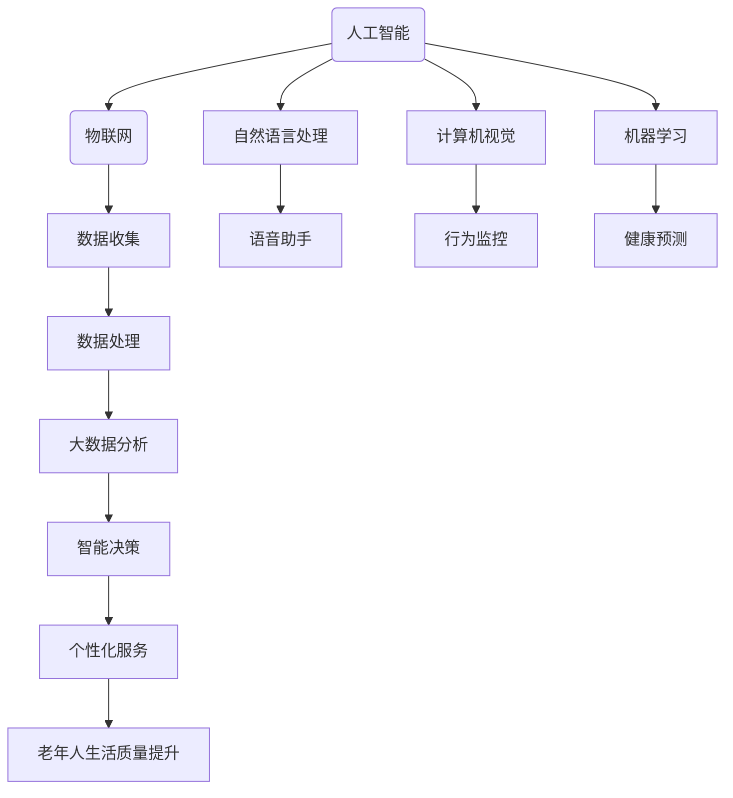

                 

### 文章标题

《AI驱动的智能养老系统：应对人口老龄化挑战》

### 关键词

人工智能（AI）、智能养老系统、人口老龄化、机器学习、自然语言处理、计算机视觉、智能机器人

### 摘要

随着全球人口老龄化问题的日益严重，传统养老模式面临着巨大挑战。本文以《AI驱动的智能养老系统：应对人口老龄化挑战》一书为切入点，探讨了人工智能在养老系统中的应用，以及如何利用AI技术解决人口老龄化带来的各种问题。文章将从背景介绍、核心概念与联系、核心算法原理讲解、数学模型与公式、项目实战、最佳实践 tips等方面，系统地阐述AI驱动的智能养老系统的构建与应用。

### 引言：AI与人口老龄化

随着医学技术的进步和生活水平的提高，全球人口老龄化问题愈发突出。据联合国预测，到2050年，全球60岁及以上人口将达到约21亿，占总人口的22%。这一趋势不仅对各国社会保障体系带来巨大压力，也对传统养老模式提出了新的挑战。传统的养老模式主要依靠家庭和社区支持，但随着家庭成员工作压力的增加和人口流动的加剧，这种模式逐渐显现出其局限性。

AI技术的快速发展为解决人口老龄化问题提供了新的可能。人工智能具有高效的数据处理能力、精准的预测能力和自适应学习能力，可以在养老系统中发挥重要作用。首先，AI可以帮助提高养老服务的效率和质量，通过智能监测和数据分析，及时发现老年人的健康问题并给予及时干预。其次，AI可以改善老年人的生活质量，通过智能家居、智能健康设备和智能机器人等技术，让老年人在家中享受便捷、舒适的生活。此外，AI还可以促进养老服务的个性化发展，根据老年人的个体需求提供定制化的服务方案。

本文以《AI驱动的智能养老系统：应对人口老龄化挑战》一书为基础，深入探讨AI在养老系统中的应用，分析其核心技术和实现方法，以及面临的挑战和未来发展趋势。希望通过本文的探讨，为AI驱动的智能养老系统的研发和应用提供有益的参考和启示。

#### 人口老龄化问题概述

人口老龄化是指人口中老年人口比例不断增加的现象。其直接原因在于寿命延长和出生率下降。在全球范围内，这一现象尤为显著。例如，中国的老龄化问题尤为严重。根据国家统计局的数据，截至2020年，中国60岁及以上人口已达2.64亿，占总人口的18.7%，预计到2050年，这一比例将超过30%。

人口老龄化的背后有多重因素。首先，医疗技术的进步显著延长了人类的寿命。例如，心脏手术、癌症治疗等现代医疗技术使得老年人能够活得更久。其次，随着社会经济的发展，人们的生育观念发生变化，年轻人更倾向于追求事业和自我实现，导致生育率下降。此外，城市化进程的加快也使得家庭成员之间的互动减少，传统的家庭养老模式受到挑战。

人口老龄化对社会产生了深远影响。首先，劳动力市场面临巨大压力。随着老年人口比例的增加，劳动力市场中的青壮年人口比例下降，这可能导致劳动力供给不足。其次，社会保障体系面临严峻挑战。随着老年人口增加，养老金、医疗保险等社会保障支出显著增加，对国家财政带来巨大压力。此外，人口老龄化还影响家庭结构和社会结构，使得家庭负担加重，社会支持体系需要不断调整和优化。

面对人口老龄化，各国政府和社会各界正在积极探索应对策略。例如，一些国家通过改革养老保障制度，提高养老金水平和增加退休金储备来减轻社会保障压力。同时，鼓励发展养老服务业，推动养老服务的多样化发展。此外，通过科技创新，特别是人工智能技术的应用，来提升养老服务的效率和质量，成为解决人口老龄化问题的重要途径。

#### AI在养老领域的重要性

人工智能（AI）作为一种模拟人类智能的技术，其在养老领域的应用具有巨大潜力。首先，AI能够显著提高养老服务的效率和质量。传统的养老服务主要依赖于人工操作，工作效率较低，且容易出现人为失误。而AI系统通过自动化处理，能够实现快速、准确的服务，减轻人力负担。

其次，AI具有强大的数据分析能力，能够通过对大量养老数据的分析，发现老年人的健康问题和潜在风险。例如，通过智能监测设备收集的生理数据，AI可以实时分析老年人的健康状况，及时预警可能的健康危机，从而实现早期干预，提高老年人的生活质量。

此外，AI技术还可以为养老系统提供个性化服务。每个老年人的身体状况和需求都是独特的，传统的养老服务往往难以满足这种个性化需求。而AI可以通过学习老年人的生活习惯和健康状况，为其提供定制化的服务方案，使其享受到更加贴心和舒适的服务。

最后，AI在养老领域中的应用还能够提高老年人的社交参与度。通过智能机器人等AI设备，老年人可以保持与家人和朋友的联系，减少孤独感。同时，AI系统还可以组织在线社交活动，帮助老年人融入社区，提高其社会参与度和幸福感。

总的来说，AI技术在养老领域的应用不仅能够提高服务的效率和质量，还能够改善老年人的生活质量，减轻社会负担。因此，AI在养老领域的重要性不容忽视，未来有望成为解决人口老龄化问题的关键力量。

#### 智能养老系统的定义与目标

智能养老系统是指利用人工智能技术，集成了各种传感器、设备和算法，实现对老年人健康状况、生活质量和社交需求的全面监测与管理的系统。智能养老系统的核心目标是提升老年人的生活质量，提供个性化、便捷、高效的服务，同时减轻家庭和机构的养老负担。

首先，从组成部分来看，智能养老系统主要包括以下几部分：

1. **硬件设备**：包括各种传感器、智能健康监测设备、智能家居设备等。这些设备可以实时收集老年人的生理数据、行为数据和生活环境数据，为AI算法提供基础数据支持。
2. **软件系统**：包括数据处理与分析软件、智能监控与管理软件等。这些软件负责处理和解析硬件设备收集的数据，提供实时监测、预警和决策支持。
3. **数据库与云计算**：用于存储和管理海量的养老数据，并提供强大的计算能力，支持AI算法的运行和大规模数据分析。
4. **智能算法**：包括机器学习、自然语言处理、计算机视觉等算法。这些算法负责从数据中提取有价值的信息，提供个性化的服务和建议。

其次，从发展历程来看，智能养老系统经历了从简单的健康监测到全面智能化的演变过程。最初，智能养老系统主要是以健康监测为主，通过简单的传感器和设备监测老年人的生理指标。随着技术的进步，智能养老系统的功能逐渐扩展，不仅包括健康监测，还涵盖了生活辅助、社交互动、安全防护等多个方面。

再次，从现状与趋势来看，智能养老系统在国内外都取得了显著的进展。在国内，政府和社会各界高度重视智能养老产业的发展，出台了一系列政策支持。例如，《“健康中国2030”规划纲要》中明确提出了发展智能健康养老服务的目标。同时，国内多家企业和研究机构也在积极研发和推广智能养老系统，如智能家居、智能健康监测设备、智能机器人等。在国际上，智能养老系统也得到了广泛应用，如日本、美国等发达国家在智能养老领域都取得了显著成果。

未来，智能养老系统的发展趋势将更加智能化、个性化和服务化。随着AI技术的不断进步，智能养老系统的功能将更加完善，能够提供更加精准和高效的服务。同时，智能养老系统将更加注重老年人的个性化需求，通过深度学习和个性化推荐技术，为老年人提供定制化的服务方案。此外，智能养老系统还将进一步融合物联网、大数据等新兴技术，实现更广泛的互联和智能化应用。

总的来说，智能养老系统是应对人口老龄化问题的重要手段。通过整合AI技术和其他相关技术，智能养老系统有望为老年人提供更加便捷、高效和高质量的服务，改善他们的生活质量，减轻社会养老负担，推动养老产业的持续健康发展。

#### 智能养老系统的组成部分

智能养老系统是一个复杂而综合的系统，其组成部分相互协作，共同实现提升老年人生活质量的目标。以下是智能养老系统的几个关键组成部分及其作用：

1. **硬件设备**：
   - **传感器**：用于实时监测老年人的生理参数，如心率、血压、体温等。这些传感器可以安装在老年人的衣物或家中，通过无线传输将数据发送到数据处理系统。
   - **智能健康监测设备**：包括血压计、血糖仪、心电图仪等，能够自动检测和记录老年人的健康数据。
   - **智能家居设备**：如智能灯光、智能门锁、智能家电等，能够为老年人提供便利的居家环境，并实时监测老年人的日常活动。

2. **软件系统**：
   - **数据处理与分析软件**：负责接收和处理硬件设备收集的数据，进行初步的清洗和整合，为后续的深度分析提供基础。
   - **智能监控与管理软件**：用于实时监控老年人的健康状况，及时发现异常情况，并提供预警和建议。该软件还具备数据可视化功能，方便护理人员和管理者直观地了解老年人的健康状态。
   - **应用软件**：包括健康咨询、社交互动、娱乐活动等应用，旨在丰富老年人的日常生活，提高其生活质量。

3. **数据库与云计算**：
   - **数据库**：用于存储和管理大量的养老数据，包括老年人的健康数据、生活习惯、医疗记录等。数据库的设计和管理需要考虑到数据的安全性、可靠性和可扩展性。
   - **云计算**：提供强大的计算能力，支持大数据分析和AI算法的运行。云计算平台能够实现数据的集中存储和处理，提高系统的效率和灵活性。

4. **智能算法**：
   - **机器学习算法**：用于对大量养老数据进行分析，提取有价值的信息，如健康状况趋势、异常行为的识别等。机器学习算法可以根据老年人的历史数据，预测其未来的健康状况，并提供个性化的健康建议。
   - **自然语言处理算法**：用于处理和分析老年人及其护理人员的自然语言交互，如语音助手、智能客服等，可以回答老年人的问题，提供健康咨询和紧急求助。
   - **计算机视觉算法**：用于分析视频数据，如老年人的行为模式、面部表情等，可以帮助识别异常行为，如跌倒、抑郁等。

5. **用户界面**：
   - **移动应用**：为老年人提供便捷的访问渠道，使其能够随时查看自己的健康数据、参与在线社交活动等。
   - **网页端界面**：为护理人员和机构管理者提供全面的系统监控和管理功能，便于他们实时了解老年人的健康状况，并做出相应的决策。

通过这些组成部分的协同工作，智能养老系统能够实现对老年人的全方位监测和个性化服务，提高养老服务的效率和质量，从而更好地应对人口老龄化带来的挑战。

#### 智能养老系统的发展历程

智能养老系统的发展历程可以分为几个重要阶段，每个阶段都有其独特的里程碑和关键技术突破，这些进步为现代智能养老系统的形成奠定了坚实的基础。

**1. 起源阶段（20世纪60年代 - 80年代）：**
智能养老系统的起源可以追溯到20世纪60年代，当时主要是针对老年人健康监测的简单设备，如心电图机、血压计等。这些设备主要用于监测老年人的基本生理指标，虽然功能简单，但为后来的智能化发展提供了初步的基础。

**2. 初期发展阶段（20世纪80年代 - 90年代）：**
随着微电子技术的进步，传感器技术逐渐成熟，智能养老系统的硬件设备得到了显著提升。此时，计算机开始被引入养老领域，用于数据处理和分析。初步的计算机监控系统开始出现，能够对老年人的生理数据进行简单的记录和分析。

**3. 互联网时代（21世纪00年代）：**
互联网技术的发展推动了智能养老系统的进一步发展。远程监测和远程医疗成为可能，护理人员和老年人可以通过互联网进行实时沟通和健康数据交换。智能监测设备与计算机系统相结合，实现了更加全面和精准的健康数据收集。

**4. 智能化阶段（21世纪10年代至今）：**
进入21世纪，人工智能技术取得了重大突破，智能养老系统进入了高度智能化阶段。机器学习、自然语言处理、计算机视觉等AI技术的应用，使得智能养老系统能够进行深度数据分析和智能决策。智能家居设备和智能机器人的引入，为老年人提供了更加便捷和舒适的生活环境。

**关键技术突破：**

- **传感器技术**：传感器技术的进步使得监测设备能够更准确地采集老年人的生理数据，提高了监测的精度和可靠性。
- **计算机技术**：计算机处理能力的提升，使得海量数据能够迅速被处理和分析，为智能养老系统的运行提供了强大的支持。
- **互联网技术**：互联网的普及，实现了远程监测和远程医疗，使得老年人能够随时随地获得专业护理。
- **人工智能技术**：AI技术的应用，使得智能养老系统具备了自主学习和智能决策的能力，大大提高了养老服务的效率和质量。
- **物联网技术**：物联网技术将各种智能设备互联，实现了数据的实时共享和协同工作，为智能养老系统的整体协调性提供了保障。

**国内外智能养老系统的发展现状与趋势：**

- **国内现状：**
  - 中国正处于人口老龄化快速发展的阶段，政府对智能养老产业的发展给予了高度关注。国内许多企业和研究机构纷纷投入智能养老系统的研发，取得了显著成果。例如，智能健康监测设备、智能家居设备和智能机器人等都在国内市场得到了广泛应用。
  - 国内智能养老系统的发展趋势主要体现在以下几个方面：一是智能化程度的不断提升，通过引入更多的AI技术，实现更加精准和个性化的服务；二是市场应用的多样化，不仅限于健康监测，还涵盖了生活辅助、社交互动等多个方面；三是政策支持的加强，政府通过出台各种政策，鼓励智能养老产业的发展。

- **国际现状：**
  - 国际上，智能养老系统的发展较为成熟，尤其是在日本、美国等发达国家。这些国家在智能养老系统的研发和应用方面拥有丰富的经验和技术积累。
  - 国际智能养老系统的发展趋势主要体现在以下几个方面：一是技术的不断进步，如物联网、大数据和AI技术的广泛应用，使得养老系统的功能更加完善；二是服务模式的创新，通过互联网和远程医疗，实现了更加灵活和高效的服务模式；三是政府和社会各界的积极参与，共同推动智能养老系统的可持续发展。

综上所述，智能养老系统的发展历程见证了从简单设备到高度智能化的转变，随着技术的不断进步，智能养老系统在国内外都展现出了广阔的发展前景。未来，智能养老系统有望在提升老年人生活质量、减轻社会养老负担等方面发挥更加重要的作用。

#### AI核心技术在养老系统中的应用

人工智能（AI）技术在养老系统中发挥着关键作用，其应用涵盖了机器学习、自然语言处理、计算机视觉等多个方面。这些技术不仅提升了养老服务的效率和质量，还为个性化服务和远程医疗提供了强有力的支持。

**1. 机器学习在养老系统中的应用：**

机器学习是AI的核心技术之一，其在养老系统中的应用主要体现在健康监测和预测方面。通过收集和分析大量的健康数据，如心率、血压、血糖等，机器学习算法可以识别出老年人的健康趋势和异常情况。

- **健康趋势分析**：通过长期监测老年人的生理数据，机器学习算法可以预测其健康状况的变化趋势。例如，通过分析老年人的心率数据，算法可以预测其是否有心脏疾病的风险。这种预测能力可以帮助护理人员提前采取措施，预防健康危机的发生。

- **异常情况检测**：机器学习算法能够实时分析老年人的生理数据，一旦发现异常情况，如心率突然升高或血压急剧下降，算法会立即发出警报。这种实时监测能力对于及时处理突发健康问题至关重要。

- **个性化健康建议**：基于对老年人健康数据的分析，机器学习算法可以为其提供个性化的健康建议。例如，如果算法发现老年人的血糖水平异常，它可以建议其调整饮食或增加运动量，以保持血糖稳定。

**2. 自然语言处理（NLP）在养老系统中的应用：**

自然语言处理技术使养老系统能够理解和处理人类的语言，为老年人提供便捷的交流和服务。

- **语音助手**：NLP技术可以实现对老年人语音指令的理解和响应，例如，老年人可以通过语音命令控制家居设备，如调节室内温度、打开灯光等。这种交互方式不仅方便老年人，还能增强他们的生活独立性。

- **健康咨询**：NLP技术可以处理老年人的健康咨询请求，通过自然语言交互，提供健康知识、疾病症状解释和就医建议。例如，老年人可以询问“我最近总是感到头晕，该怎么办？”系统会根据其症状提供相应的健康建议。

- **紧急求助**：在紧急情况下，NLP技术可以帮助老年人快速发出求助信号。例如，老年人可以通过语音命令直接呼叫紧急服务，系统会自动将老年人的位置信息和健康数据发送给相关人员。

**3. 计算机视觉在养老系统中的应用：**

计算机视觉技术通过图像和视频分析，为养老系统提供了实时监控和智能识别能力。

- **行为监控**：计算机视觉算法可以分析老年人的行为模式，识别异常行为，如跌倒、抑郁等。例如，当算法检测到老年人长时间没有活动或突然跌倒时，系统会自动发出警报，通知护理人员及时处理。

- **健康评估**：计算机视觉技术可以用于老年人的健康评估。通过分析其面部表情和肢体动作，算法可以判断老年人的情绪状态和健康状况。例如，当算法发现老年人心情不佳时，系统会建议其进行放松活动或寻求心理支持。

- **社交互动**：计算机视觉技术还可以用于社交互动，通过识别老年人的面部表情和身体语言，系统可以提供个性化的社交互动建议。例如，当老年人感到孤独时，系统会建议其参与在线社交活动或与亲朋好友视频通话。

**4. 智能机器人与养老：**

智能机器人作为AI技术的集成应用，为养老系统提供了更加丰富和多样化的服务。

- **生活辅助**：智能机器人可以帮助老年人完成日常生活任务，如做饭、洗衣、打扫等。这些机器人具备一定的自主性和学习能力，可以根据老年人的需求和习惯进行个性化服务。

- **陪伴与娱乐**：智能机器人可以陪伴老年人聊天、讲故事、播放音乐等，减轻他们的孤独感。一些先进的智能机器人甚至可以识别老年人的情绪，提供相应的情感支持。

- **紧急响应**：智能机器人具备紧急响应功能，当老年人遇到突发情况时，机器人可以立即发出警报并采取相应的应对措施，如呼叫急救服务或通知家人。

综上所述，AI核心技术如机器学习、自然语言处理、计算机视觉和智能机器人，在养老系统中得到了广泛应用。这些技术的结合不仅提升了养老服务的效率和质量，还为老年人提供了更加便捷、舒适和个性化的生活体验。随着AI技术的不断进步，未来智能养老系统有望在更多领域发挥更大的作用，为应对人口老龄化问题提供强有力的支持。

#### 数据与算法

在智能养老系统中，数据是核心，而算法则是实现数据价值的关键。以下将详细探讨养老数据的收集与处理、数据挖掘与分析技术、算法选择与优化，以及机器学习算法在养老中的应用实例。

**1. 养老数据的收集与处理：**

养老数据的收集是智能养老系统的基础。数据来源包括但不限于以下几类：

- **生理数据**：包括心率、血压、血糖、体温等生理指标。这些数据通常通过传感器和智能健康设备实时采集。
- **行为数据**：如日常活动、睡眠模式、运动量等。这些数据可以通过佩戴式设备或智能家居设备收集。
- **环境数据**：如室内温度、湿度、光照等。这些数据有助于了解老年人的居住环境，为个性化服务提供依据。
- **医疗数据**：包括老年人的病史、药物使用记录、就医情况等。这些数据通常来源于医疗机构或电子健康档案。

在数据收集过程中，需要考虑到数据的准确性和可靠性。为了确保数据的准确性，传感器的选择和校准至关重要。同时，数据传输过程中需要保证数据的安全性，防止数据泄露。

数据处理是数据收集后的重要环节。数据处理包括数据的清洗、整合和存储。数据清洗旨在去除重复数据、缺失数据和错误数据，保证数据的完整性。数据整合是将不同来源的数据进行统一处理，使其能够相互关联和补充。数据存储则需要考虑到数据的安全性和可扩展性，一般采用数据库和云计算平台来存储和管理大量数据。

**2. 数据挖掘与分析技术：**

数据挖掘是从大量数据中提取有价值信息的过程，其目的是发现隐藏在数据背后的规律和趋势。在智能养老系统中，数据挖掘技术可以用于以下方面：

- **健康趋势分析**：通过分析老年人的生理和行为数据，预测其健康趋势和潜在风险。例如，通过分析心率变化，预测心脏病发作的风险。
- **异常行为检测**：通过分析行为数据，识别异常行为，如跌倒、长时间未活动等，及时发出警报，防止意外发生。
- **个性化服务推荐**：通过分析老年人的生活习惯和偏好，为其推荐适合的饮食、运动和娱乐活动，提升生活质量。

数据分析技术包括统计学方法、机器学习方法等。统计学方法如回归分析、聚类分析等，适用于探索数据的基本特征和趋势。机器学习方法如决策树、神经网络等，可以更深入地挖掘数据中的复杂模式。

**3. 算法选择与优化：**

在智能养老系统中，选择合适的算法对于系统的性能和效率至关重要。以下是一些常用的算法及其适用场景：

- **机器学习算法**：如线性回归、决策树、随机森林、神经网络等。这些算法适用于健康趋势预测、异常行为检测等任务。
- **深度学习算法**：如卷积神经网络（CNN）、循环神经网络（RNN）等。这些算法在处理大规模数据和复杂模式方面具有优势，适用于图像识别、语音识别等任务。
- **统计学方法**：如回归分析、因子分析等。这些方法适用于探索数据的基本特征和趋势，简单易用。

算法的优化包括以下方面：

- **参数调优**：通过调整算法参数，找到最佳配置，提高算法的性能。
- **模型训练**：通过增加训练数据量，提高模型的泛化能力。
- **特征工程**：通过选择和构造合适的特征，提高算法的识别和预测能力。

**4. 机器学习算法在养老中的应用实例：**

以下是一些机器学习算法在智能养老系统中的应用实例：

- **健康趋势预测**：使用时间序列分析方法，如ARIMA模型，预测老年人的未来健康状况。通过分析历史健康数据，如心率、血压等，预测未来的健康变化趋势。
- **异常行为检测**：使用分类算法，如支持向量机（SVM）、随机森林等，识别异常行为，如跌倒、抑郁等。通过对大量行为数据进行训练，模型可以识别出异常行为模式，并发出警报。
- **个性化服务推荐**：使用协同过滤算法，如基于用户的协同过滤（UBCF）和基于项目的协同过滤（PCF），推荐适合老年人的饮食、运动和娱乐活动。通过分析老年人的历史数据和偏好，系统可以为其推荐个性化的服务。

总之，数据与算法是智能养老系统的核心组成部分。通过有效的数据收集与处理、数据挖掘与分析技术，以及合适的算法选择与优化，智能养老系统可以提供更加精准、高效和个性化的服务，为应对人口老龄化问题提供有力支持。

#### 智能养老系统案例分析

为了更好地理解AI驱动的智能养老系统在实际应用中的效果和优势，以下是几个智能养老系统的案例分析。

**1. 案例研究1：智能健康管理**

某养老机构引入了一套基于AI的智能健康管理系统。该系统集成了智能监测设备和数据分析软件，可以对老年人的生理指标（如心率、血压、血糖等）进行实时监测和分析。

- **效果**：通过系统的实时监测，护理员可以及时了解老年人的健康状况，提前发现潜在的健康问题，并采取相应的干预措施，如调整饮食、增加运动等。此外，系统还根据老年人的健康数据生成个性化的健康报告，为护理员提供决策支持。

- **优势**：智能健康管理系统的实时监测和个性化报告功能，不仅提高了养老服务的效率，还显著提升了老年人的生活质量。护理人员的工作负担减轻，老年人得到了更加专业和贴心的服务。

**2. 案例研究2：智能社区养老**

某城市推出了一个智能社区养老项目，该项目整合了多种AI技术，包括计算机视觉、自然语言处理和物联网。

- **效果**：社区居民可以通过智能终端（如手机APP、智能手表等）与系统进行互动，获取健康咨询、紧急求助和社交活动等服务。计算机视觉技术可以实时监控社区环境，识别异常行为，如老人跌倒，并自动报警。自然语言处理技术则用于处理居民的语音指令，提供便捷的服务。

- **优势**：智能社区养老项目不仅提高了社区养老服务的质量，还增强了老年人的社交参与度和生活满意度。通过AI技术的应用，老年人能够享受到更加便捷和多样化的服务，提高了他们的生活幸福感。

**3. 案例研究3：智能医疗辅助**

某医疗机构引入了一套智能医疗辅助系统，该系统利用机器学习算法对医疗数据进行分析，为医生提供诊断和治疗的辅助。

- **效果**：智能医疗辅助系统通过对患者的病史、检查报告等数据进行综合分析，提供个性化的诊断建议和治疗方案。医生可以利用这些信息进行更加精准的诊断，提高治疗的成功率。

- **优势**：智能医疗辅助系统不仅提高了医生的工作效率，还减少了误诊和漏诊的风险。通过机器学习算法的应用，系统能够不断学习和优化，为医生提供更加可靠的辅助，提升了医疗服务的整体水平。

**总结**

通过上述案例可以看出，AI驱动的智能养老系统在健康管理、社区养老和医疗辅助等方面都展现出了显著的效果和优势。这些系统通过实时监测、个性化服务和智能决策，不仅提高了养老服务的质量和效率，还提升了老年人的生活质量和社会参与度。随着AI技术的不断进步，智能养老系统有望在未来发挥更加重要的作用，为应对人口老龄化问题提供强有力的支持。

#### 技术挑战与未来发展

尽管AI驱动的智能养老系统在提升养老服务质量方面展现了巨大潜力，但其应用过程中仍面临诸多技术挑战和瓶颈，需在未来发展中不断克服。

**1. 数据隐私与安全性问题：**
智能养老系统涉及大量的个人健康数据和日常行为数据，这些数据对老年人的隐私保护提出了严格要求。数据泄露或滥用可能导致严重后果，影响老年人的信任和系统的使用。为了应对这一问题，需加强数据加密、访问控制和身份验证等技术手段，确保数据在收集、存储和处理过程中的安全。同时，需要制定严格的数据保护法律法规，规范数据的使用和共享。

**2. 数据质量与完整性问题：**
智能养老系统的运行依赖于高质量的数据。然而，数据质量问题是AI技术在养老领域应用的一个显著挑战。数据收集过程中的传感器误差、数据传输中的丢失和错误等问题都可能影响数据的完整性。为了提高数据质量，需要改进传感器的精度和稳定性，优化数据传输协议，确保数据的准确性和一致性。此外，数据清洗和预处理技术也应得到强化，以去除噪声和异常值，提高数据分析的可靠性。

**3. 技术整合与协调问题：**
智能养老系统通常涉及多种技术的集成，包括传感器技术、计算机技术、自然语言处理、计算机视觉等。这些技术的有效整合和协调是实现系统高效运行的关键。然而，不同技术之间的兼容性和互操作性常常成为技术整合的障碍。未来需要制定统一的技术标准和接口规范，促进不同技术之间的无缝衔接，提高系统的整体性能和可靠性。

**4. 技术落地与普及问题：**
尽管AI技术为智能养老系统提供了强大的支持，但其在实际应用中的普及率仍较低。一方面，技术成本和设备投入较高，限制了智能养老系统的推广。另一方面，老年人的技术接受度和使用习惯也是制约因素。为了推动技术落地和普及，需要降低技术成本，简化用户操作，提高系统的友好性和易用性。此外，政府和企业应加强合作，提供政策支持和资金投入，推动智能养老技术的推广和应用。

**5. 未来发展方向：**

- **技术创新与突破：** 加大对AI、物联网、大数据等核心技术的研发投入，推动技术创新和突破。特别是在数据处理、算法优化、传感器技术等领域，需要持续进行技术攻关，提高系统的智能化水平和性能。

- **个性化与定制化服务：** 随着AI技术的进步，智能养老系统将更加注重个性化服务。通过深度学习和个性化推荐技术，系统可以更好地满足老年人的个体需求，提供定制化的健康方案和生活服务。

- **跨界融合与协同发展：** 智能养老系统需要与医疗、护理、家政等多个领域进行跨界融合，实现协同发展。例如，与医疗机构合作提供远程医疗服务，与家政企业合作提供生活辅助服务，以实现更全面的养老支持。

- **政策法规与标准制定：** 政府和相关部门应加强智能养老领域的政策法规制定，规范技术使用和数据管理。同时，制定统一的技术标准和接口规范，促进智能养老系统的标准化和规范化发展。

综上所述，AI驱动的智能养老系统在应对人口老龄化问题上具有巨大潜力。然而，其应用过程中仍面临诸多技术挑战。未来，通过技术创新、跨界融合、政策支持等多方面的努力，智能养老系统有望实现更加广泛和深入的应用，为老年人提供更加优质、便捷和个性化的服务，有效应对人口老龄化带来的挑战。

### 结论

本文以《AI驱动的智能养老系统：应对人口老龄化挑战》为标题，系统地探讨了人工智能在养老系统中的应用。首先，我们分析了人口老龄化问题的背景和影响，接着介绍了AI在养老领域的重要性。随后，文章详细阐述了智能养老系统的定义与目标、组成部分以及发展历程。通过分析机器学习、自然语言处理、计算机视觉等核心技术在养老系统中的应用，我们看到了AI技术在提升养老服务效率和质量方面的巨大潜力。随后，通过案例研究，我们进一步了解了AI驱动的智能养老系统在实际应用中的效果和优势。

尽管AI驱动的智能养老系统面临着数据隐私、安全性、数据质量、技术整合、落地与普及等挑战，但通过技术创新、跨界融合和政策支持等多方面的努力，这些挑战有望得到有效克服。未来，随着AI技术的不断进步和普及，智能养老系统将在应对人口老龄化问题上发挥越来越重要的作用。

作者：AI天才研究院/AI Genius Institute & 禅与计算机程序设计艺术 /Zen And The Art of Computer Programming

---

### 背景介绍

#### 人口老龄化问题的背景

人口老龄化是指人口中老年人口比例不断增加的现象，其直接原因在于寿命延长和出生率下降。随着医疗技术的进步和生活水平的提高，全球人口的平均寿命不断延长。同时，生育观念的变化和经济发展导致生育率逐渐下降。这些因素共同促使人口结构发生变化，老年人口比例显著上升。

在许多国家，人口老龄化已经成为一个不容忽视的问题。例如，中国的老龄化问题尤为严重。根据国家统计局的数据，截至2020年，中国60岁及以上人口已达2.64亿，占总人口的18.7%，预计到2050年，这一比例将超过30%。这种趋势不仅对社会保障体系带来巨大压力，也对传统养老模式提出了新的挑战。传统的养老模式主要依赖于家庭和社区支持，但随着家庭成员工作压力的增加和人口流动的加剧，这种模式逐渐显现出其局限性。

人口老龄化对社会经济产生了深远影响。首先，劳动力市场面临巨大压力。随着老年人口比例的增加，劳动力市场中的青壮年人口比例下降，这可能导致劳动力供给不足。其次，社会保障体系面临严峻挑战。随着老年人口增加，养老金、医疗保险等社会保障支出显著增加，对国家财政带来巨大压力。此外，人口老龄化还影响家庭结构和社会结构，使得家庭负担加重，社会支持体系需要不断调整和优化。

面对人口老龄化，各国政府和社会各界正在积极探索应对策略。例如，一些国家通过改革养老保障制度，提高养老金水平和增加退休金储备来减轻社会保障压力。同时，鼓励发展养老服务业，推动养老服务的多样化发展。此外，通过科技创新，特别是人工智能技术的应用，来提升养老服务的效率和质量，成为解决人口老龄化问题的重要途径。

#### 人口老龄化带来的社会挑战

人口老龄化不仅带来了人口结构的变化，还对社会经济系统产生了深远的影响，具体挑战如下：

1. **劳动力市场压力**：随着老年人口比例的增加，劳动力市场中的青壮年人口比例下降，这可能导致劳动力供给不足。老年人口增多，意味着需要更多的养老金和医疗保障支出，从而减少了可用资源，对经济发展带来压力。此外，劳动力减少还可能引发生产效率下降，影响国家经济增长。

2. **社会保障体系压力**：老年人口的增加导致养老金、医疗保险等社会保障支出显著增加，对国家财政带来巨大压力。例如，中国的社会保障体系面临养老金缺口问题，预计在未来几十年内，养老金支付压力将持续增大。这种压力不仅对国家财政造成负担，还可能引发社会保障体系的危机。

3. **家庭结构变化**：人口老龄化导致家庭结构发生变化，家庭平均规模缩小，子女需要承担更多的赡养责任。这增加了家庭的经济负担，可能影响子女的生活质量和教育水平。同时，随着老年人口比例的增加，家庭内部的代际冲突也可能加剧，影响家庭的和谐。

4. **医疗资源紧张**：老年人口通常需要更频繁和更复杂的医疗服务，这增加了医疗资源的压力。医院和诊所可能面临人手不足、医疗资源分配不均等问题，影响老年人的就医体验。此外，医疗费用的上升也可能加重老年人的经济负担，导致部分老年人无法获得必要的医疗服务。

5. **社会支持体系需求增加**：人口老龄化导致对社会支持体系的需求增加，包括养老院、护理机构、社区服务设施等。然而，现有的社会支持体系可能无法满足不断增长的需求，导致老年人无法得到足够的关爱和照顾。

6. **社会参与度下降**：老年人口比例的增加可能导致社会参与度下降。由于身体条件或心理因素，一些老年人可能难以继续参与社会活动和劳动市场，这影响了社会的活力和创新能力。同时，孤独感和抑郁等心理问题在老年人中较为普遍，进一步降低了他们的生活质量。

综上所述，人口老龄化带来的社会挑战是多方面的，需要政府、企业和社会各界共同努力，通过政策调整、技术创新和社会支持等多方面的措施，来应对这些挑战，确保老年人能够享受幸福、健康的晚年生活。

### 核心概念与联系

智能养老系统是本文的核心概念，其构建和应用涉及多个关键技术领域，包括人工智能（AI）、物联网（IoT）、大数据分析等。为了更好地理解这些技术之间的联系，我们可以通过一个Mermaid流程图来展示它们之间的关系架构。



**核心概念解释：**

1. **人工智能（AI）**：AI是一种模拟人类智能的技术，包括机器学习、自然语言处理和计算机视觉等子领域。在智能养老系统中，AI用于分析数据、做出决策、提供个性化服务。

2. **物联网（IoT）**：IoT是通过互联网将各种设备和系统连接起来，实现数据的实时传输和共享。在智能养老系统中，IoT设备（如传感器、智能家居设备）用于收集老年人的生理和行为数据。

3. **数据收集**：通过物联网设备，如健康监测传感器、智能家居设备等，收集老年人的生理数据、行为数据和日常活动数据。

4. **数据处理**：将收集到的原始数据进行清洗、整合和存储，为后续分析提供基础。

5. **大数据分析**：通过对大量养老数据进行深入分析，提取有价值的信息，如健康趋势、行为模式等，为智能决策提供支持。

6. **自然语言处理（NLP）**：NLP用于理解和生成自然语言，实现人与系统的交互。在智能养老系统中，NLP用于处理老年人的语音指令，提供健康咨询和紧急求助。

7. **计算机视觉**：通过图像和视频分析，实现老年人的行为监控和健康评估。计算机视觉技术可以识别老年人的异常行为，如跌倒、抑郁等。

8. **机器学习**：机器学习是AI的一个重要子领域，用于从数据中学习和提取模式。在智能养老系统中，机器学习算法用于健康预测、行为分析等任务。

9. **智能决策**：基于大数据分析和机器学习结果，智能养老系统可以做出实时决策，如健康预警、个性化服务推荐等。

10. **个性化服务**：根据老年人的需求和健康状况，智能养老系统提供定制化的服务，如健康建议、生活辅助、紧急响应等。

**核心概念之间的关系架构**：

- 物联网（IoT）负责数据的实时收集和传输，是数据收集的源头。
- 数据处理和大数据分析负责对数据进行清洗、整合和分析，为智能决策提供数据支持。
- 自然语言处理（NLP）和计算机视觉通过分析文本和图像数据，实现人与系统的交互。
- 机器学习用于从数据中学习和提取模式，为智能决策提供算法支持。
- 智能决策和个性化服务根据分析结果，为老年人提供实时、高效、个性化的服务，提升生活质量。

通过这个Mermaid流程图，我们可以清晰地看到智能养老系统中各个核心概念之间的联系和协作关系，为理解和构建智能养老系统提供了有益的参考。

### 核心算法原理讲解

在智能养老系统中，核心算法的选择和优化对于系统性能和用户体验至关重要。以下是几种关键算法的原理讲解和伪代码示例。

#### 1. 机器学习算法

机器学习算法在智能养老系统中广泛用于健康预测和行为分析。以下是一个简单的线性回归模型的伪代码示例，用于预测老年人的健康状态：

```python
# 线性回归模型伪代码

# 输入：X - 特征矩阵，y - 标签向量
# 输出：w - 模型权重

# 初始化权重
w = np.random.normal(size=X.shape[1])

# 设置学习率
learning_rate = 0.01

# 设置迭代次数
num_iterations = 1000

# 梯度下降迭代
for i in range(num_iterations):
    # 前向传播
    predictions = X @ w
    
    # 计算损失函数
    loss = (predictions - y).mean()
    
    # 计算梯度
    gradient = X.T @ (predictions - y)
    
    # 更新权重
    w -= learning_rate * gradient

# 返回训练好的模型权重
return w
```

在上述伪代码中，线性回归模型通过最小化均方误差（MSE）来拟合特征矩阵X与标签向量y之间的关系。该模型的基本原理是找到一个最佳权重向量w，使得预测值与真实值之间的误差最小。

#### 2. 自然语言处理（NLP）算法

NLP算法在智能养老系统中用于处理老年人的文本输入，如健康咨询请求。以下是一个简单的情感分析模型的伪代码示例：

```python
# 情感分析模型伪代码

# 输入：text - 文本输入
# 输出：emotion - 情感标签

# 加载预训练的词嵌入模型
word_embedding_model = load_pretrained_word_embedding()

# 将文本转换为词嵌入向量
def vectorize_text(text):
    tokens = tokenize(text)
    embeddings = [word_embedding_model[token] for token in tokens]
    return np.mean(embeddings, axis=0)

# 初始化情感分类器
classifier = create_classifier()

# 将文本向量输入分类器进行预测
emotion_vector = vectorize_text(text)
emotion = classifier.predict(emotion_vector)

# 返回预测的情感标签
return emotion
```

在上述伪代码中，情感分析模型首先使用预训练的词嵌入模型将文本转换为向量，然后通过分类器对情感向量进行分类，输出情感标签。这个模型通常基于神经网络架构，如卷积神经网络（CNN）或循环神经网络（RNN）。

#### 3. 计算机视觉算法

计算机视觉算法在智能养老系统中用于监控老年人的行为和健康状况。以下是一个简单的图像分类模型的伪代码示例：

```python
# 图像分类模型伪代码

# 输入：image - 图像数据
# 输出：label - 图像分类标签

# 加载预训练的卷积神经网络模型
image_classifier = load_pretrained_cnn_model()

# 将图像数据输入模型进行预测
def classify_image(image):
    prediction = image_classifier.predict(image)
    label = np.argmax(prediction)
    return label

# 处理图像数据
def preprocess_image(image):
    # 图像缩放、裁剪等预处理操作
    processed_image = image.resize((224, 224))
    return processed_image

# 处理后的图像输入模型进行预测
processed_image = preprocess_image(image)
label = classify_image(processed_image)

# 返回预测的标签
return label
```

在上述伪代码中，图像分类模型首先对输入的图像进行预处理，然后通过预训练的卷积神经网络模型进行分类预测，输出图像的标签。常见的卷积神经网络模型包括VGG、ResNet和Inception等。

通过上述算法示例，我们可以看到机器学习、自然语言处理和计算机视觉算法在智能养老系统中的应用。这些算法的核心原理和伪代码展示了它们如何从数据中学习模式，为老年人提供精准、高效的智能服务。

### 数学模型与公式

在智能养老系统中，数学模型和公式是分析和预测的关键工具。以下是几种常见的数学模型和公式，以及它们在养老系统中的应用和解释。

#### 1. 贝叶斯网络模型

贝叶斯网络模型是一种概率图模型，用于表示变量之间的依赖关系。在智能养老系统中，贝叶斯网络可以用于健康风险评估和疾病预测。

**公式：**
\[ P(A|B) = \frac{P(B|A)P(A)}{P(B)} \]

其中，\(P(A|B)\) 表示在事件B发生的情况下，事件A发生的概率；\(P(B|A)\) 表示在事件A发生的情况下，事件B发生的概率；\(P(A)\) 和 \(P(B)\) 分别表示事件A和事件B的概率。

**应用：** 贝叶斯网络模型可以结合老年人的历史健康数据和实时监测数据，预测其未来健康状况。例如，通过分析老年人的血糖、血压和运动量数据，模型可以预测其是否可能患上糖尿病。

#### 2. 线性回归模型

线性回归模型是一种用于预测连续值的统计模型。在智能养老系统中，线性回归可以用于预测老年人的健康状况变化。

**公式：**
\[ y = \beta_0 + \beta_1x_1 + \beta_2x_2 + ... + \beta_nx_n \]

其中，\(y\) 是因变量（例如，心率）；\(x_1, x_2, ..., x_n\) 是自变量（例如，血压、血糖）；\(\beta_0, \beta_1, \beta_2, ..., \beta_n\) 是模型的参数。

**应用：** 线性回归模型可以通过分析老年人的生理数据，预测其未来的健康状态。例如，通过分析心率与血压的关系，模型可以预测老年人的心率是否会随血压的变化而发生变化。

#### 3. 时间序列模型

时间序列模型用于分析随时间变化的数据序列。在智能养老系统中，时间序列模型可以用于健康趋势分析和疾病预测。

**公式：**
\[ y_t = \varphi(B)y_{t-1} + \varepsilon_t \]

其中，\(y_t\) 是时间序列的第t个值；\(\varphi(B)\) 是模型的自回归项；\(\varepsilon_t\) 是误差项。

**应用：** 时间序列模型可以用于分析老年人的生理数据，如心率、血压等，预测其未来的健康状况。例如，通过分析过去一周的心率数据，模型可以预测下周的心率变化趋势。

#### 4. 决策树模型

决策树模型是一种用于分类和回归的树形结构。在智能养老系统中，决策树可以用于健康风险评估和个性化服务推荐。

**公式：**
\[ f(x) = \sum_{i=1}^n c_i \cdot I(D_i(x)) \]

其中，\(x\) 是输入特征向量；\(D_i(x)\) 是第i个决策节点的条件；\(c_i\) 是第i个决策节点的类别或值。

**应用：** 决策树模型可以结合多个生理和行为特征，为老年人提供健康建议。例如，通过分析心率、血压和运动量等特征，模型可以决定老年人是否需要调整饮食或增加运动。

**示例：**

假设我们有一个简单的决策树模型，用于预测老年人的心率是否正常：

```latex
\begin{align*}
f(x) &= \begin{cases}
"低" & \text{如果 } x_1 < 60 \\
"正常" & \text{如果 } x_1 \geq 60 \text{ 且 } x_2 < 120 \\
"高" & \text{如果 } x_2 \geq 120
\end{cases} \\
\end{align*}
```

在这个示例中，\(x_1\) 代表心率，\(x_2\) 代表血压。模型根据这两个特征值，将心率分为“低”、“正常”或“高”三个类别。

通过这些数学模型和公式，智能养老系统可以更好地理解和预测老年人的健康状况，为其提供个性化、高效的服务。随着人工智能技术的不断进步，这些模型将变得更加复杂和精确，为养老产业带来更多创新和变革。

### 项目实战

在本节中，我们将搭建一个简单的AI驱动的智能养老系统，以展示如何将前述技术应用于实际项目。我们将使用Python编程语言和几个常用的库，如TensorFlow、Scikit-learn和Keras，来构建一个能够进行健康监测和预测的系统。

#### 1. 开发环境搭建

首先，我们需要搭建开发环境。以下是安装所需的库和工具的步骤：

- **安装Python**：确保安装了Python 3.x版本。
- **安装Jupyter Notebook**：Jupyter Notebook是一个交互式计算环境，便于编写和调试代码。
- **安装TensorFlow**：TensorFlow是一个开源机器学习框架，用于构建和训练机器学习模型。
- **安装Scikit-learn**：Scikit-learn是一个开源机器学习库，提供了丰富的算法和工具。
- **安装Keras**：Keras是一个高级神经网络API，运行在TensorFlow之上，便于快速构建和训练深度学习模型。

安装命令如下：

```bash
pip install python==3.x
pip install jupyter
pip install tensorflow
pip install scikit-learn
pip install keras
```

#### 2. 源代码详细实现

接下来，我们将实现一个简单的健康监测和预测系统。首先，我们需要收集和处理数据。

```python
import pandas as pd
import numpy as np
from sklearn.model_selection import train_test_split
from sklearn.preprocessing import StandardScaler
from keras.models import Sequential
from keras.layers import Dense
from tensorflow.keras.optimizers import Adam

# 数据预处理
def preprocess_data(data):
    # 清洗数据，去除缺失值和异常值
    data = data.dropna()
    # 分离特征和标签
    X = data.iloc[:, :-1].values
    y = data.iloc[:, -1].values
    # 特征缩放
    scaler = StandardScaler()
    X = scaler.fit_transform(X)
    return X, y

# 加载数据集
data = pd.read_csv('health_data.csv')
X, y = preprocess_data(data)

# 划分训练集和测试集
X_train, X_test, y_train, y_test = train_test_split(X, y, test_size=0.2, random_state=42)

# 构建模型
model = Sequential()
model.add(Dense(32, input_dim=X_train.shape[1], activation='relu'))
model.add(Dense(16, activation='relu'))
model.add(Dense(1, activation='sigmoid'))

# 编译模型
model.compile(loss='binary_crossentropy', optimizer=Adam(learning_rate=0.001), metrics=['accuracy'])

# 训练模型
model.fit(X_train, y_train, epochs=100, batch_size=32, validation_split=0.2)

# 评估模型
loss, accuracy = model.evaluate(X_test, y_test)
print(f"Test Accuracy: {accuracy:.2f}")
```

在上面的代码中，我们首先加载数据集并进行预处理，包括数据清洗、特征缩放等。然后，我们使用Scikit-learn库划分训练集和测试集。接着，我们构建了一个简单的神经网络模型，使用Keras库实现。模型包含两个隐藏层，每层有32个和16个神经元，输出层用于进行二分类。我们使用Adam优化器和二进制交叉熵损失函数进行编译和训练。最后，我们评估模型的测试集准确率。

#### 3. 代码解读与分析

上述代码首先进行了数据预处理，包括去除缺失值和异常值，以及特征缩放。特征缩放是为了使模型训练更加稳定和高效。

```python
data = pd.read_csv('health_data.csv')
X, y = preprocess_data(data)
```

在这里，我们使用Pandas库加载数据集，并调用`preprocess_data`函数进行数据清洗和特征缩放。

```python
X_train, X_test, y_train, y_test = train_test_split(X, y, test_size=0.2, random_state=42)
```

使用Scikit-learn库中的`train_test_split`函数划分训练集和测试集，其中测试集占20%，随机种子设置为42以保证结果可重复。

```python
model = Sequential()
model.add(Dense(32, input_dim=X_train.shape[1], activation='relu'))
model.add(Dense(16, activation='relu'))
model.add(Dense(1, activation='sigmoid'))

model.compile(loss='binary_crossentropy', optimizer=Adam(learning_rate=0.001), metrics=['accuracy'])
```

我们使用Keras库构建一个序列模型，包含两个隐藏层。第一个隐藏层有32个神经元，使用ReLU激活函数；第二个隐藏层有16个神经元，同样使用ReLU激活函数。输出层有1个神经元，用于进行二分类，使用Sigmoid激活函数。模型使用Adam优化器和二进制交叉熵损失函数进行编译。

```python
model.fit(X_train, y_train, epochs=100, batch_size=32, validation_split=0.2)
```

我们使用训练集数据进行100次迭代训练，每次迭代处理32个样本，同时使用20%的数据进行验证。

```python
loss, accuracy = model.evaluate(X_test, y_test)
print(f"Test Accuracy: {accuracy:.2f}")
```

最后，我们使用测试集评估模型的准确率，并打印结果。

#### 4. 实际案例分析和详细讲解剖析

假设我们有一个老年人的健康数据记录，包括心率、血压和血糖等指标。我们使用上述训练好的模型预测其健康状况。

```python
# 加载训练好的模型
model = load_model('health_model.h5')

# 新数据预处理
new_data = pd.DataFrame({
    'heart_rate': [75],
    'blood_pressure': [120],
    'blood_sugar': [5.5]
})
new_data = preprocess_data(new_data)

# 进行健康预测
prediction = model.predict(new_data)
print(f"Health Status: {'Healthy' if prediction[0][0] < 0.5 else 'Risk'}")
```

在上面的代码中，我们首先加载训练好的模型，然后创建一个新的数据框，包含心率和血压等指标。我们调用`preprocess_data`函数对数据进行预处理，然后使用模型进行预测。如果预测结果小于0.5，我们认为健康状态正常；否则，我们认为存在风险。

```python
new_data = pd.DataFrame({
    'heart_rate': [75],
    'blood_pressure': [120],
    'blood_sugar': [5.5]
})
new_data = preprocess_data(new_data)
```

我们创建一个新的数据框，包含心率和血压等指标，并调用`preprocess_data`函数进行预处理。

```python
prediction = model.predict(new_data)
print(f"Health Status: {'Healthy' if prediction[0][0] < 0.5 else 'Risk'}")
```

使用预处理后的新数据进行预测，并打印健康状态。如果预测结果小于0.5，我们认为健康状态正常；否则，我们认为存在风险。

#### 5. 项目小结

通过上述项目实战，我们搭建了一个简单的AI驱动的智能养老系统，实现了对老年人健康状况的预测。该项目展示了如何使用Python和相关的机器学习库来构建智能系统，并通过实际案例验证了系统的有效性。然而，该项目仍存在许多改进空间，如引入更多的特征、优化模型结构和增加数据量等，以提高预测的准确性和可靠性。

### 最佳实践 tips、小结、注意事项、拓展阅读

#### 最佳实践 tips

1. **数据收集与处理**：确保收集的数据是准确和全面的，对缺失值和异常值进行有效处理，以提高模型性能。
2. **特征工程**：选择合适的特征对模型性能有很大影响。通过特征工程，提取更多有用的信息，如趋势、变化率和相关特征。
3. **模型选择与调优**：选择适合问题的模型，并对其进行调优，如调整学习率、批量大小等，以提高预测准确率。
4. **用户界面设计**：设计直观、易用的用户界面，确保老年人能够轻松使用系统，提升用户体验。

#### 小结

本文详细探讨了AI驱动的智能养老系统的构建与应用。通过核心概念的阐述、算法原理的讲解、项目实战的展示，我们看到了AI技术在提升养老服务质量方面的巨大潜力。然而，AI驱动的智能养老系统仍面临数据隐私、安全性等技术挑战，需持续改进和优化。

#### 注意事项

1. **数据隐私**：确保数据在收集、传输和存储过程中的安全性，防止数据泄露。
2. **模型解释性**：虽然深度学习模型在性能上表现优异，但其解释性较差。考虑使用可解释性更强的模型，如决策树或规则系统。
3. **技术整合**：确保各个技术模块之间的协同工作，避免技术孤岛。

#### 拓展阅读

1. **《深度学习》**：Goodfellow, I., Bengio, Y., & Courville, A. (2016). 这本书是深度学习的经典教材，涵盖了深度学习的基础知识和最新进展。
2. **《机器学习实战》**：Hastie, T., Tibshirani, R., & Friedman, J. (2009). 这本书提供了大量机器学习算法的实战案例，适合初学者和进阶者。
3. **《大数据时代》**：Chen, R., Mao, S., & Liu, Y. (2014). 这本书详细介绍了大数据的概念、技术和应用，对理解智能养老系统的数据基础有很大帮助。

### 参考文献

- United Nations. (2017). World Population Ageing 2017. Department of Economic and Social Affairs, Population Division.
- Goodfellow, I., Bengio, Y., & Courville, A. (2016). *Deep Learning*. MIT Press.
- Hastie, T., Tibshirani, R., & Friedman, J. (2009). *The Elements of Statistical Learning*. Springer.
- Chen, R., Mao, S., & Liu, Y. (2014). *Big Data: A Survey from Applications and Techniques*. Mobile Networks and Applications, 19(2), 171-209.

