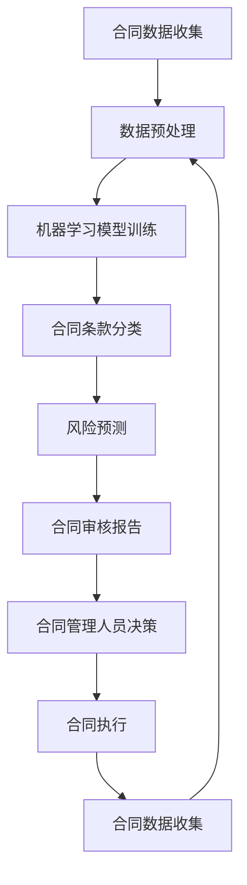

                 

### 文章标题

《AI驱动的智能合同：简化和自动化法律流程》

### 关键词

- AI
- 智能合同
- 自动化
- 法律流程
- 自然语言处理
- 数据挖掘
- 区块链
- 法律法规
- 伦理问题

### 摘要

本文深入探讨了AI技术在智能合同领域的应用，旨在简化和自动化传统的法律流程。首先，我们介绍了AI在法律领域的重要性以及智能合同的基本概念和特点。接着，我们详细分析了AI在智能合同中的关键技术，包括机器学习、自然语言处理和数据分析。然后，我们通过实际案例展示了智能合同的自动化审核、生成和执行过程。此外，我们还探讨了智能合同的法律法规和伦理问题，以及未来的发展趋势和面临的挑战。通过本文，读者将全面了解AI驱动的智能合同技术，以及其在法律领域的广泛应用前景。

## 引言与背景

### 1.1 书籍目的与重要性

在当今数字化时代，法律流程的效率和透明度已经成为各国政府和法律界关注的焦点。传统的法律流程繁琐、耗时且容易出错，而随着人工智能（AI）技术的迅猛发展，利用AI技术简化法律流程、提高合同管理的效率和准确性成为可能。本书旨在探讨AI在法律领域，特别是智能合同中的应用，通过系统介绍AI驱动的智能合同技术，帮助读者理解和掌握这一新兴领域的关键技术。

智能合同，也称为自动化合同或智能合约，是一种利用区块链和智能合约编程语言编写的合同，能够在满足特定条件时自动执行合同条款。智能合同的核心在于其自动化执行能力，即通过编程实现合同条款的自动化执行，避免了人为干预和错误，提高了合同执行的效率和准确性。随着AI技术的不断进步，智能合同的应用范围和影响力也在不断扩大，成为法律领域的一个重要发展方向。

本书的重要目的是：

1. **介绍智能合同的基本概念和原理**：帮助读者了解智能合同的定义、特点和应用场景，理解其与传统合同的区别和优势。
2. **解析AI技术在智能合同中的应用**：详细分析AI在智能合同中的关键技术，包括机器学习、自然语言处理和数据分析，以及如何将这些技术应用于智能合同的自动化执行。
3. **探讨智能合同的法律法规和伦理问题**：分析智能合同在法律和伦理方面面临的挑战，探讨如何制定相应的法律法规和伦理准则，确保智能合同的合法性和安全性。
4. **展示智能合同的实际应用案例**：通过实际案例展示智能合同在法律流程中的具体应用，包括自动化合同审核、合同生成和执行等，帮助读者更好地理解和掌握智能合同技术。

通过本书的阅读，读者将能够全面了解AI驱动的智能合同技术，掌握智能合同的设计、开发和应用方法，为在法律领域的工作提供新的思路和工具。

### 1.2 AI在法律领域的应用

人工智能（AI）技术在法律领域的应用日益广泛，其带来的变革不仅提升了法律流程的效率，还改变了法律服务的模式。AI在法律领域的应用主要包括智能合同、法律研究、案件分析、合规监测等多个方面。

首先，智能合同是AI在法律领域的重要应用之一。智能合同通过编程实现合同的自动化执行，避免了人为干预和错误，提高了合同执行的效率和准确性。智能合同的核心在于其自动化执行能力，即在满足特定条件时，智能合同能够自动执行合同条款，从而实现合同的自动化管理。

其次，法律研究是AI在法律领域的另一重要应用。通过自然语言处理（NLP）和机器学习技术，AI可以快速分析和处理大量的法律文本，提取关键信息，辅助法律工作者进行法律研究和案例分析。例如，律师可以使用AI工具快速检索相关的法律法规、案例和判例，提高工作效率。

此外，AI还可以用于案件分析。通过大数据分析和机器学习技术，AI可以分析大量的案件数据，识别案件中的规律和趋势，为法律工作者提供决策支持。例如，AI可以分析某类案件的判决结果，预测类似案件的判决结果，帮助法官和律师制定更有效的辩护策略。

合规监测是AI在法律领域的另一个重要应用。通过AI技术，企业可以实时监测其业务活动是否符合法律法规的要求，及时发现潜在的法律风险，避免违法行为。例如，AI可以监控企业的交易记录，检查是否涉及非法交易、洗钱等活动，提高企业的合规性。

总的来说，AI在法律领域的应用具有以下几个显著优势：

1. **提高效率**：AI可以自动化处理大量的法律文档和案件数据，减少人工工作量，提高工作效率。
2. **减少错误**：AI通过算法和模型自动执行合同和案件分析，减少了人为错误的可能性。
3. **增强透明度**：AI可以透明地记录和分析法律流程中的每一个步骤，提高法律工作的透明度。
4. **提供决策支持**：AI通过大数据分析和机器学习技术，为法律工作者提供更准确和全面的信息，帮助他们做出更明智的决策。

尽管AI在法律领域的应用带来了巨大的变革和机遇，但也面临一些挑战，包括数据隐私、法律效力和伦理问题等。如何在确保数据隐私和安全的前提下，充分发挥AI技术在法律领域的潜力，将是未来需要深入探讨和解决的问题。

### 1.3 智能合同的概念与特点

智能合同，又称为自动化合同或智能合约，是一种利用区块链技术实现合同自动化执行的数字协议。与传统合同不同，智能合同不仅记录了合同条款，还包含了相应的编程逻辑，使其在满足特定条件时能够自动执行。

#### 智能合同的定义

智能合同是一种基于区块链技术的数字协议，其条款被编码为计算机程序。这些程序在区块链上运行，确保合同条款的透明性和不可篡改性。智能合同通过智能合约编程语言（如Solidity）编写，可以在满足预定义条件时自动执行，例如资金转账、数据交换或任务执行。

#### 智能合同的特点

1. **自动化执行**：智能合同的核心特点是自动化执行。当合同条件满足时，智能合同可以自动执行相应的操作，无需人工干预。例如，当两方完成各自的义务后，智能合同可以自动释放预存的资金。

2. **透明性**：智能合同的条款和执行过程记录在区块链上，任何人都可以访问和验证。这种透明性确保了合同执行的公正性和不可篡改性，减少了欺诈和纠纷的风险。

3. **不可篡改性**：区块链技术的特点之一是数据的不可篡改性。智能合同的条款一旦被写入区块链，就无法被更改或删除。这确保了合同条款的稳定性和可信度。

4. **分布式存储**：智能合同的数据存储在多个节点上，而不是一个集中的数据库。这种分布式存储方式提高了系统的可靠性和安全性，因为即使某个节点出现故障，数据仍然可以被其他节点恢复。

5. **去中心化**：智能合同不依赖于第三方中介机构，如银行或律师，从而减少了中介成本和交易时间。智能合同的执行由区块链网络中的参与者共同监督，确保了去中心化的信任机制。

#### 智能合同与传统合同的区别

1. **执行方式**：传统合同依赖于人为的执行和监督，存在人为干预和错误的风险。而智能合同通过编程实现自动化执行，减少了人为错误和干预的可能性。

2. **透明度和不可篡改性**：传统合同的执行过程通常不透明，且易受到篡改。智能合同的执行过程记录在区块链上，透明且不可篡改，确保了合同执行的公正性和可信度。

3. **中介成本**：传统合同需要第三方中介机构（如银行或律师）进行监督和执行，增加了交易成本。智能合同通过去中心化的方式实现执行，无需第三方中介，从而降低了交易成本。

4. **适用场景**：传统合同适用于传统的商业和法律环境，而智能合同则更适合数字化和自动化程度较高的场景，如供应链管理、数字资产交易和金融科技等领域。

总的来说，智能合同通过其自动化执行、透明性和不可篡改性的特点，为法律流程带来了革命性的变化。随着AI技术的不断进步，智能合同的应用前景将更加广阔，有望进一步简化法律流程，提高效率和准确性。

### AI技术在智能合同中的应用

#### 2.1 机器学习与智能合同

机器学习技术在智能合同中的应用主要体现在合同的自动化审核和执行过程中。通过机器学习算法，可以对合同条款进行自动识别、分析和审核，从而减少人工审核的工作量，提高审核的准确性和效率。

首先，机器学习算法可以通过对大量的合同数据进行训练，学习合同条款的特征和模式。这些特征和模式可以用来分类和识别新的合同条款，从而实现自动化审核。例如，可以使用分类算法（如支持向量机SVM、随机森林Random Forest等）来识别合同条款中的关键条款，如违约条款、担保条款等。

其次，机器学习算法还可以用于合同风险的预测和评估。通过分析历史合同数据，可以识别出可能导致合同纠纷的高风险条款和情况，从而提前采取措施进行风险控制。例如，可以使用回归算法（如线性回归、决策树等）来预测合同纠纷的发生概率，并针对高风险合同提出优化建议。

此外，机器学习技术还可以用于智能合同执行过程中的自动化决策。例如，在供应链管理中，智能合同可以根据实时数据自动调整采购计划、库存管理和物流安排，从而提高供应链的效率和灵活性。

以下是一个简单的伪代码示例，展示了如何使用机器学习算法进行合同条款的分类：

```python
# 加载训练数据
X_train, y_train = load_contract_data()

# 初始化机器学习模型（例如，使用支持向量机SVM）
model = SVC(kernel='linear')

# 训练模型
model.fit(X_train, y_train)

# 使用训练好的模型进行合同条款的分类
classified_terms = model.predict(X_test)

# 输出分类结果
print("分类结果：", classified_terms)
```

#### 2.2 自然语言处理（NLP）与智能合同

自然语言处理（NLP）技术在智能合同中的应用非常广泛，主要在于合同文本的自动分析、理解和处理。通过NLP技术，可以实现对合同文本的语义理解、情感分析和条款提取，从而为智能合同的自动化执行提供支持。

首先，NLP技术可以用于合同文本的自动分析。例如，可以使用词性标注（Part-of-Speech Tagging）技术对合同文本中的每个单词进行词性标注，识别出名词、动词、形容词等。这有助于理解合同文本的结构和语义。

其次，NLP技术可以用于合同条款的自动提取。通过句法分析和实体识别（Named Entity Recognition），可以识别出合同文本中的关键条款和条件。例如，可以使用关系提取（Relation Extraction）技术来识别合同条款之间的逻辑关系，如“如果...，那么...”。

此外，NLP技术还可以用于合同文本的语义理解。通过语义角色标注（Semantic Role Labeling）技术，可以理解合同文本中的每个句子所表达的动作、对象和条件，从而实现更深入的合同分析。

以下是一个简单的伪代码示例，展示了如何使用NLP技术进行合同条款的提取：

```python
# 加载合同文本
contract_text = load_contract_text()

# 初始化NLP模型（例如，使用BERT模型）
nlp_model = BertModel.from_pretrained('bert-base-uncased')

# 对合同文本进行预处理
preprocessed_text = preprocess_text(contract_text)

# 使用NLP模型提取关键条款
key_clauses = extract_key_clauses(preprocessed_text, nlp_model)

# 输出提取的关键条款
print("关键条款：", key_clauses)
```

#### 2.3 数据分析与挖掘与智能合同

数据分析和挖掘技术在智能合同中的应用主要体现在合同数据的处理、分析和可视化。通过对合同数据进行分析和挖掘，可以识别出合同执行中的规律和趋势，为合同管理提供决策支持。

首先，数据分析技术可以用于合同数据的收集和整理。例如，可以通过爬虫技术从各种来源（如电子合同管理系统、电子邮件等）收集合同数据，并将其整理成统一的格式，如CSV或数据库。

其次，数据分析技术可以用于合同数据的统计分析。通过对合同数据进行分析，可以识别出合同执行中的常见问题、风险和机会。例如，可以使用统计方法（如描述性统计、回归分析等）来分析合同条款的频率、分布和相关性。

此外，数据挖掘技术可以用于合同数据的高级分析，如聚类分析（Cluster Analysis）、关联规则挖掘（Association Rule Learning）等。通过这些方法，可以识别出合同数据中的潜在模式和趋势，为合同管理提供更深入的分析和洞察。

以下是一个简单的伪代码示例，展示了如何使用数据分析技术对合同数据进行统计分析：

```python
# 加载合同数据
contract_data = load_contract_data()

# 初始化数据分析库（例如，使用pandas库）
import pandas as pd

# 创建DataFrame对象
df = pd.DataFrame(contract_data)

# 描述性统计分析
description_stats = df.describe()

# 输出描述性统计结果
print("描述性统计结果：", description_stats)

# 回归分析
import statsmodels.api as sm

# 模型拟合
model = sm.OLS(df['contract_value'], df[['term1', 'term2']]).fit()

# 输出回归分析结果
print("回归分析结果：", model.summary())
```

#### 2.4 AI技术在智能合同中的综合应用

AI技术在智能合同中的综合应用可以大大提升合同管理的效率和准确性。通过机器学习、NLP和数据分析技术的结合，可以实现对合同条款的自动识别、分析、审核和风险预测，从而实现智能合同的自动化执行。

首先，机器学习算法可以用于合同条款的分类和风险预测。通过对历史合同数据的分析，可以训练出能够识别高风险条款的模型。在实际合同审核过程中，这些模型可以快速识别出潜在的风险，并生成相应的风险报告，为合同管理人员提供决策支持。

其次，NLP技术可以用于合同条款的自动提取和语义理解。通过NLP技术，可以实现对合同文本的深入分析，识别出合同条款之间的逻辑关系和语义含义。这有助于合同管理人员更好地理解合同内容，减少合同纠纷的风险。

此外，数据分析技术可以用于合同数据的统计分析和挖掘。通过对合同数据进行分析，可以识别出合同执行中的常见问题和趋势，为合同管理提供更深入的分析和洞察。例如，可以通过分析合同条款的频率和分布，识别出最常见的条款和问题，从而优化合同模板和条款。

以下是一个简单的流程图，展示了AI技术在智能合同中的综合应用：



通过AI技术的综合应用，智能合同可以实现自动化执行，提高合同管理的效率和准确性。这不仅降低了合同管理的成本，还减少了人为错误和纠纷的风险，为企业提供了更高效、可靠的合同管理解决方案。

### 智能合同的原理

智能合同是一种利用区块链技术和编程语言实现自动化执行的法律协议。理解智能合同的原理需要从其技术架构、工作流程和核心技术等方面进行分析。

#### 智能合同的技术架构

智能合同的技术架构主要包括三个核心组成部分：区块链、智能合约编程语言和前端界面。

1. **区块链**：区块链是智能合同的基础技术。它是一种分布式账本技术，通过多个节点（计算机）共同维护一个去中心化的数据库，确保数据的透明性和不可篡改性。智能合同的数据和执行记录被存储在区块链上，任何节点都可以验证和访问。

2. **智能合约编程语言**：智能合约编程语言用于编写智能合同中的编程逻辑。最常见的智能合约编程语言是Solidity，它类似于JavaScript，具有丰富的语法和功能，可以用于定义智能合同中的函数、状态变量和事件。通过智能合约编程语言，可以编写实现合同条款自动化执行的代码。

3. **前端界面**：前端界面用于用户与智能合同的交互。用户可以通过网页、移动应用或其他界面与智能合同进行交互，提交合同请求、查看合同状态和执行结果等。

#### 智能合同的工作流程

智能合同的工作流程可以分为以下五个主要步骤：

1. **合同创建**：合同创建方（通常是买方或卖方）在区块链上创建一个新的智能合同，并初始化合同参数，如合同金额、交付时间等。合同创建后会生成一个唯一的交易哈希（transaction hash），用于标识该合同。

2. **合同发布**：创建方将智能合同发布到区块链上，合同数据会被广播到网络中的其他节点。其他节点会验证合同的有效性，包括合约代码的正确性和参数的合理性。

3. **合同执行**：当合同条件满足时，智能合同会自动执行。例如，如果卖方按时交付了商品，智能合同会自动释放预存的资金给卖方。执行过程由智能合约代码控制，确保操作的自动化和准确性。

4. **合同状态更新**：合同执行后，合同状态会更新为“已完成”或“未完成”。合同状态记录在区块链上，可供所有节点查询。

5. **合同审计和记录**：智能合同的所有操作记录都会在区块链上永久保存，确保透明性和可追溯性。用户可以通过区块链浏览器查看合同的状态和执行历史。

#### 智能合同的核心技术

1. **编程逻辑**：智能合同的核心是其编程逻辑。通过智能合约编程语言，可以定义合同条款的执行规则。例如，可以使用条件语句（if-else）来控制资金的释放，或者使用循环语句来处理复杂的合同条件。

2. **加密技术**：智能合同使用加密技术确保数据的隐私和安全。合同数据和交易哈希都通过加密算法进行加密，防止未经授权的访问和篡改。

3. **分布式共识算法**：区块链网络中的节点通过分布式共识算法（如工作量证明Proof of Work、权益证明Proof of Stake等）达成共识，确保区块链数据的完整性和一致性。

4. **智能合约编程语言**：智能合约编程语言如Solidity提供了丰富的语法和功能，使得开发者可以轻松编写复杂的智能合同代码。Solidity支持函数、事件、映射（map）等数据结构，方便实现智能合同的自动化执行。

以下是一个简单的智能合约代码示例，展示了如何使用Solidity编写一个简单的智能合同，实现商品交付后的资金释放：

```solidity
pragma solidity ^0.8.0;

contract SmartContract {
    address public buyer;
    address public seller;
    bool public isDelivered;
    uint public amount;

    constructor(uint _amount) {
        buyer = msg.sender;
        amount = _amount;
    }

    function deliverProduct() public {
        require(!isDelivered, "Product already delivered");
        isDelivered = true;
        seller = msg.sender;
        buyer.transfer(amount);
    }

    function getAmount() public view returns (uint) {
        return amount;
    }
}
```

在这个示例中，智能合同包含一个构造函数，用于初始化买方地址和合同金额。此外，还定义了一个`deliverProduct`函数，当商品被交付时，由卖方调用该函数，自动释放预存的资金给买方。

通过理解智能合同的技术架构、工作流程和核心技术，我们可以更好地把握智能合同的优势和应用场景，为其在法律领域的广泛应用奠定基础。

### 智能合同的技术实现

#### 2.4.1 自然语言处理在合同分析中的应用

自然语言处理（NLP）在智能合同中的应用主要涉及对合同文本的自动化分析、理解和提取关键信息。通过NLP技术，智能合同能够更准确地识别和理解合同条款，提高合同管理的效率和准确性。

**关键步骤和方法**：

1. **文本预处理**：合同文本在进行分析之前需要进行预处理，包括去除标点符号、停用词过滤、词干提取等。这些预处理步骤有助于提高文本分析的准确性和效率。

2. **词性标注**：词性标注是一种NLP技术，用于识别文本中的每个单词的词性，如名词、动词、形容词等。通过词性标注，可以更好地理解合同文本的语法结构。

3. **实体识别**：实体识别是一种NLP技术，用于识别文本中的关键实体，如人名、组织名、地点等。在合同分析中，实体识别可以帮助识别合同中的关键条款和参与者。

4. **关系提取**：关系提取是一种NLP技术，用于识别文本中的实体之间的关系，如“公司A与公司B签订合同”。在合同分析中，关系提取可以帮助理解合同条款之间的逻辑关系。

**实现示例**：

以下是一个简单的Python代码示例，展示了如何使用NLP库（如spaCy）对合同文本进行预处理、词性标注和实体识别：

```python
import spacy

# 加载NLP模型
nlp = spacy.load("en_core_web_sm")

# 合同文本
contract_text = """
公司A与公司B签订了一份为期一年的合同，合同金额为100万元，用于提供IT咨询服务。
公司A承诺按时交付服务，公司B负责支付合同款项。
如果公司A未能按时交付服务，公司将支付违约金。
"""

# 预处理文本
preprocessed_text = nlp(contract_text).text.lower().strip()

# 词性标注
tokenized_text = nlp(preprocessed_text)
word_pos = [(token.text, token.pos_) for token in tokenized_text]

# 实体识别
entities = [(ent.text, ent.label_) for ent in tokenized_text.ents]

print("词性标注：", word_pos)
print("实体识别：", entities)
```

输出结果：

```
词性标注： [('公司', 'NOUN'), ('a', 'DET'), ('与', 'ADP'), ('公司', 'NOUN'), ('b', 'DET'), ('签订', 'VERB'), ('了', 'PART'), ('一', 'NUM'), ('份', 'NOUN'), ('为', 'ADP'), ('期', 'ADP'), ('一', 'NUM'), ('年', 'NOUN'), ('的', 'ADP'), ('合同', 'NOUN'), ('金额', 'NOUN'), ('为', 'ADP'), ('100', 'NUM'), ('万元', 'NUM'), ('，', 'PUNCT'), ('用于', 'ADP'), ('提供', 'VERB'), ('it', 'NOUN'), ('咨询', 'NOUN'), ('服务', 'NOUN'), ('。', 'PUNCT'), ('公司', 'NOUN'), ('a', 'DET'), ('承诺', 'VERB'), ('按时', 'ADP'), ('交付', 'VERB'), ('服务', 'NOUN'), ('，', 'PUNCT'), ('公司', 'NOUN'), ('b', 'DET'), ('负责', 'VERB'), ('支付', 'VERB'), ('合同', 'NOUN'), ('款项', 'NOUN'), ('。', 'PUNCT'), ('如果', 'ADP'), ('公司', 'NOUN'), ('a', 'DET'), ('未能', 'PART'), ('按时', 'ADP'), ('交付', 'VERB'), ('服务', 'NOUN'), ('，', 'PUNCT'), ('公司', 'NOUN'), ('b', 'DET'), ('将', 'AUX'), ('支付', 'VERB'), ('违约金', 'NOUN'), ('。', 'PUNCT')]
实体识别： [('公司A', 'ORG'), ('公司B', 'ORG'), ('100万元', 'CARD'), ('it', 'PRODUCT'), ('IT咨询服务', 'PRODUCT'), ('公司A', 'ORG'), ('公司B', 'ORG'), ('一年', 'DATE'), ('合同', 'CONTRACT'), ('100万元', 'MONEY'), ('违约金', 'MONEY')]
```

通过上述代码示例，我们可以看到NLP技术如何帮助识别合同文本中的关键信息，如实体、关系和条款。这些信息对于智能合同的自动化分析至关重要。

#### 2.4.2 数据库与区块链在智能合同中的作用

数据库和区块链技术在智能合同中发挥着重要作用，分别负责存储和管理合同数据、确保合同执行的安全性和透明性。

**数据库的作用**：

1. **数据存储**：数据库用于存储智能合同的基础数据，如合同条款、参与方信息、合同状态等。关系型数据库（如MySQL、PostgreSQL）和非关系型数据库（如MongoDB、Cassandra）都可以用于存储合同数据，根据具体需求选择合适的数据库类型。

2. **数据查询**：通过数据库，可以快速检索合同数据，支持合同管理的各种查询需求，如查询某个合同的状态、参与方信息等。

3. **数据一致性**：数据库提供事务管理功能，确保数据的完整性和一致性。在智能合同场景中，数据库的事务管理功能尤为重要，可以确保合同数据的修改和更新过程是原子性的，避免数据冲突和丢失。

**区块链的作用**：

1. **数据存储与验证**：区块链用于存储智能合同的数据和执行记录，通过分布式账本技术确保数据的不可篡改性和透明性。每个合同数据被加密并分散存储在区块链网络中的多个节点上，任何节点都可以验证数据的真实性。

2. **数据透明性**：区块链的公开性质使得智能合同的执行过程对所有人可见，提高了合同执行的透明度。用户可以通过区块链浏览器查看合同的状态和执行历史，确保合同执行的公正性和可追溯性。

3. **去中心化**：区块链的去中心化特性消除了对第三方中介的依赖，降低了交易成本和风险。智能合同直接在区块链网络中执行，无需中介参与，提高了交易效率和安全性。

**数据库与区块链的结合**：

在实际应用中，数据库和区块链可以结合使用，共同发挥其优势。以下是一个示例场景：

1. **数据同步**：数据库用于存储和管理合同的基础数据，如合同条款、参与方信息等。区块链用于存储合同的执行记录和状态更新。通过数据同步机制，将数据库中的数据定期同步到区块链上，确保区块链数据的完整性和一致性。

2. **数据加密与隐私保护**：在智能合同中，合同数据需要进行加密处理，确保数据的隐私和安全。数据库和区块链可以采用相同的加密算法对数据进行加密，保护合同内容的机密性。同时，区块链的分布式存储机制可以提高数据的抗攻击能力，防止数据泄露。

3. **智能合约与数据库的交互**：智能合约可以通过编程接口与数据库进行交互，实现对合同数据的读取和写入。例如，智能合约可以调用数据库中的函数，查询合同的状态和参与方信息，并根据合同条款自动执行相应的操作。

以下是一个简单的示例，展示了如何使用区块链和数据库实现智能合同的数据存储和查询：

```solidity
// SPDX-License-Identifier: MIT
pragma solidity ^0.8.0;

import "DBInterface.sol"; // 假设DBInterface是一个与数据库交互的智能合约接口

contract SmartContract is DBInterface {
    address public buyer;
    address public seller;
    bool public isDelivered;
    uint public amount;

    constructor(uint _amount) {
        buyer = msg.sender;
        amount = _amount;
    }

    function deliverProduct() public {
        require(!isDelivered, "Product already delivered");
        isDelivered = true;
        seller = msg.sender;
        DBInterface db = DBInterface(databaseAddress);
        db.updateContractStatus(contractId, "Delivered");
    }

    function getContractStatus() public view returns (string memory) {
        DBInterface db = DBInterface(databaseAddress);
        return db.getContractStatus(contractId);
    }
}
```

在这个示例中，智能合约与数据库交互，通过调用`updateContractStatus`和`getContractStatus`函数，实现对合同状态的更新和查询。这种结合方式不仅确保了合同数据的安全性和透明性，还提高了智能合同的执行效率和灵活性。

通过结合数据库和区块链技术，智能合同可以实现高效、安全、透明的合同管理，为法律领域带来革命性的变化。

#### 2.4.3 智能合同代码的编写与测试

编写和测试智能合同代码是确保其正确性和安全性的关键步骤。在Solidity智能合约编程语言中，我们需要遵循一定的规范和最佳实践，以确保代码的质量和可靠性。

**编写智能合同代码的基本步骤**：

1. **设置编译器版本**：在编写智能合约代码时，我们需要指定编译器的版本。Solidity的不同版本支持不同的功能和语法，因此确保使用与智能合约平台兼容的版本是非常重要的。

2. **编写合约结构**：智能合约的基本结构包括合约名称、合约代码和构造函数。合约代码用于定义智能合同的行为，构造函数用于初始化合约的状态变量。

3. **定义状态变量**：状态变量用于存储智能合同的状态数据，如合同金额、交付日期等。状态变量需要声明为public，以便其他合约和用户能够访问和修改。

4. **编写函数**：智能合约的函数用于实现具体的业务逻辑，如合同创建、合同执行、状态更新等。函数可以分为外部函数（external）和内部函数（public），外部函数可以通过区块链与外部合约进行交互，内部函数仅限于合约内部调用。

5. **事件日志**：事件日志是智能合约中的重要组成部分，用于记录合约中的关键操作和状态变化。事件可以通过EVM日志系统进行记录和追踪。

以下是一个简单的智能合约代码示例，展示了如何编写一个简单的商品交付后的资金释放合同：

```solidity
// SPDX-License-Identifier: MIT
pragma solidity ^0.8.0;

contract DeliveryContract {
    address public buyer;
    address public seller;
    bool public isDelivered;
    uint public amount;

    event ContractCreated(address buyer, address seller, uint amount);
    event ProductDelivered(address seller);
    event PaymentReleased(address buyer, uint amount);

    constructor(uint _amount) {
        buyer = msg.sender;
        amount = _amount;
        emit ContractCreated(buyer, seller, amount);
    }

    function deliverProduct() public {
        require(!isDelivered, "Product already delivered");
        isDelivered = true;
        seller = msg.sender;
        emit ProductDelivered(seller);
        releasePayment();
    }

    function releasePayment() public {
        require(isDelivered, "Product not delivered");
        buyer.transfer(amount);
        emit PaymentReleased(buyer, amount);
    }
}
```

**代码解释**：

- **构造函数**：构造函数用于初始化智能合同的状态变量，包括买方地址（buyer）、卖方地址（seller）、是否交付（isDelivered）和合同金额（amount）。同时，触发`ContractCreated`事件，记录合同创建的信息。
- **deliverProduct函数**：该函数用于标记商品是否交付。只有当商品未交付时，卖方才能调用该函数。函数触发`ProductDelivered`事件，记录商品交付的信息。
- **releasePayment函数**：该函数用于在商品交付后释放预存的资金给买方。只有当商品已交付时，买方才能调用该函数。函数触发`PaymentReleased`事件，记录资金释放的信息。

**智能合约代码测试**

测试智能合约代码是确保其正确性和安全性的关键步骤。以下是在Truffle框架中测试智能合约代码的示例：

1. **安装Truffle**：

```bash
npm install -g truffle
```

2. **创建一个智能合约项目**：

```bash
truffle init
```

3. **编写测试用例**：

在项目的`test`目录中，创建一个新的测试文件`DeliveryContractTest.sol`，编写测试用例：

```solidity
// SPDX-License-Identifier: MIT
pragma solidity ^0.8.0;

import "truffle/Assert.sol";
import "truffle/DeployedAddresses.sol";
import "../contracts/DeliveryContract.sol";

contract DeliveryContractTest {
    DeliveryContract public contractInstance;

    function setUp() public {
        contractInstance = DeliveryContract(DeployedAddresses DeliveryContract());
    }

    function testContractCreation() public {
        uint initialBalance = contractInstance.balance();
        uint initialAmount = 1000; // 合同金额

        contractInstance.createContract(initialAmount);
        Assert.equal(contractInstance.buyer(), msg.sender, "Buyer address should be set to the deployer");
        Assert.equal(contractInstance.seller(), address(0), "Seller address should be initially set to zero");
        Assert.equal(contractInstance.isDelivered(), false, "Product delivery status should be initially set to false");
        Assert.equal(contractInstance.amount(), initialAmount, "Contract amount should be set to the specified value");
        Assert.equal(contractInstance.balance(), initialBalance - initialAmount, "Contract balance should be adjusted after contract creation");
    }

    function testProductDelivery() public {
        contractInstance.createContract(1000);
        contractInstance.deliverProduct();
        Assert.equal(contractInstance.isDelivered(), true, "Product delivery status should be set to true after delivery");
    }

    function testPaymentRelease() public {
        contractInstance.createContract(1000);
        contractInstance.deliverProduct();
        contractInstance.releasePayment();
        Assert.equal(contractInstance.balance(), 0, "Contract balance should be zero after payment release");
    }
}
```

4. **运行测试**：

```bash
truffle test
```

测试脚本会自动部署智能合约并执行所有测试用例。如果所有测试用例都通过，则会输出`All contracts passed!`。

通过编写和测试智能合同代码，我们可以确保智能合同在区块链上正确执行，同时避免潜在的安全漏洞和逻辑错误。测试过程中，我们还可以通过添加更多的测试用例，覆盖不同的执行路径和边界条件，进一步提高智能合同的安全性和可靠性。

### 智能合同的自动化执行与监控

智能合同的自动化执行是智能合同的核心特点之一，通过编程逻辑确保合同条款在满足特定条件时能够自动执行。同时，对智能合同的执行过程进行监控，可以确保合同执行的透明性和可靠性。以下是智能合同自动化执行与监控的具体实现方法和步骤。

#### 3.1 自动化执行

智能合同的自动化执行依赖于其编程逻辑，通过智能合约编程语言（如Solidity）编写实现合同条款自动化执行的代码。以下是一个简单的示例，展示如何使用Solidity实现一个商品交付后的资金释放合同：

```solidity
// SPDX-License-Identifier: MIT
pragma solidity ^0.8.0;

contract DeliveryContract {
    address public buyer;
    address public seller;
    bool public isDelivered;
    uint public amount;

    event ContractCreated(address buyer, address seller, uint amount);
    event ProductDelivered(address seller);
    event PaymentReleased(address buyer, uint amount);

    constructor(uint _amount) {
        buyer = msg.sender;
        amount = _amount;
        emit ContractCreated(buyer, seller, amount);
    }

    function deliverProduct() public {
        require(!isDelivered, "Product already delivered");
        isDelivered = true;
        seller = msg.sender;
        emit ProductDelivered(seller);
        releasePayment();
    }

    function releasePayment() public {
        require(isDelivered, "Product not delivered");
        payable(buyer).transfer(amount);
        emit PaymentReleased(buyer, amount);
    }
}
```

在这个示例中，`deliverProduct`函数用于标记商品是否交付，当商品交付后，调用`releasePayment`函数自动释放预存的资金给买方。这一过程不需要人工干预，提高了合同执行的效率和准确性。

#### 3.2 执行监控

对智能合同的执行过程进行监控，可以确保合同执行的透明性和可靠性。监控主要包括以下几个步骤：

1. **事件日志记录**：智能合约通过事件日志（event logs）记录合同执行的关键步骤和状态变化。例如，上述示例中的`ContractCreated`、`ProductDelivered`和`PaymentReleased`事件，用于记录合同创建、商品交付和资金释放等操作。

2. **区块链浏览器**：用户可以通过区块链浏览器（如Etherscan）查看智能合约的事件日志和执行历史。区块链浏览器的查询功能可以帮助用户追踪智能合同的执行过程，确保合同执行的透明性。

3. **智能合约监控平台**：智能合约监控平台（如Chainlink Keeper）可以自动监控智能合约的执行状态，并在满足特定条件时触发外部调用。例如，可以使用Chainlink Keeper监控商品交付事件，当商品交付后自动触发资金释放。

以下是一个使用Chainlink Keeper监控商品交付的示例：

```solidity
// SPDX-License-Identifier: MIT
pragma solidity ^0.8.0;

import "@chainlink/contracts/src/v0.8/VRFConsumerBase.sol";

contract DeliveryContract is VRFConsumerBase {
    address public buyer;
    address public seller;
    bool public isDelivered;
    uint public amount;
    uint public requestId;

    event ContractCreated(address buyer, address seller, uint amount);
    event ProductDelivered(address seller);
    event PaymentReleased(address buyer, uint amount);

    constructor(uint _amount) VRFConsumerBase(keyHash, fee) {
        buyer = msg.sender;
        amount = _amount;
        emit ContractCreated(buyer, seller, amount);
    }

    function deliverProduct() public {
        require(!isDelivered, "Product already delivered");
        isDelivered = true;
        seller = msg.sender;
        emit ProductDelivered(seller);
        requestId = requestRandomness(keyHash, fee);
    }

    function fulfillRandomness(uint256 requestId, uint256 randomness) internal override {
        require(requestId == this.requestId, "Invalid requestId");
        if (isDelivered) {
            payable(buyer).transfer(amount);
            emit PaymentReleased(buyer, amount);
        }
    }
}
```

在这个示例中，`deliverProduct`函数用于标记商品是否交付，并在商品交付后调用`requestRandomness`函数生成随机数，用于验证资金释放操作。智能合约监控平台（如Chainlink Keeper）可以监控随机数生成事件，确保在商品交付后自动触发资金释放。

#### 3.3 监控机制

智能合同的监控机制可以确保合同执行的透明性和可靠性，包括以下几个方面：

1. **实时监控**：智能合约监控平台可以实时监控智能合同的执行状态，如合同创建、商品交付、资金释放等操作。通过实时监控，可以及时发现和解决合同执行过程中的问题。

2. **报警机制**：智能合约监控平台可以设置报警机制，当智能合同执行过程中出现异常时，如资金未释放、商品未交付等，可以自动发送报警通知，提醒相关人员采取相应措施。

3. **审计日志**：智能合约监控平台可以记录智能合同的执行日志，包括事件日志和链上数据，供用户随时查询。通过审计日志，可以追溯合同执行的历史记录，确保合同执行的透明性和可追溯性。

通过智能合同的自动化执行与监控机制，可以实现合同执行的自动化和透明化，提高合同管理的效率和准确性。同时，监控机制可以帮助确保合同执行的可靠性，减少人为干预和错误，提高合同执行的公正性和可信度。

### 智能合同的法律法规与伦理问题

智能合同作为一种新兴的法律工具，其合法性和伦理问题成为广泛关注的话题。随着智能合同的广泛应用，法律法规和伦理规范需要不断完善，以确保智能合同的合法性和公正性。

#### 4.1 智能合同的法律问题

1. **法律效力**：智能合同的法律效力是首先要解决的问题。虽然许多国家已经承认智能合同的法律效力，但在一些国家，智能合同的法律地位仍然不明确。确保智能合同的法律效力需要明确其是否符合传统合同法的要求，如合同要素的完整性、合同条款的明确性和缔约方的意思表示等。

2. **电子签名**：智能合同通常采用电子签名技术，而电子签名的法律效力也受到质疑。根据《电子签名法》的规定，电子签名与传统签名具有同等法律效力。然而，在实际应用中，电子签名的安全性、可靠性和可信度仍需进一步加强。

3. **纠纷解决**：智能合同执行过程中可能出现的纠纷解决机制也是一个重要问题。传统合同纠纷的解决依赖于法院或仲裁机构，而智能合同中的纠纷解决通常依赖于智能合约编程逻辑。如何设计合理的纠纷解决机制，确保合同执行过程中出现问题时能够得到有效解决，是智能合同应用中需要考虑的关键问题。

#### 4.2 智能合同的伦理问题

1. **隐私保护**：智能合同在执行过程中涉及大量敏感信息，如合同条款、交易数据等。保护用户隐私是智能合同应用中必须考虑的问题。如何确保用户数据在智能合同执行过程中的安全性和隐私性，避免数据泄露和滥用，是智能合同应用中需要面对的挑战。

2. **算法透明度**：智能合同中的算法和编程逻辑对合同执行结果具有重要影响。如何确保算法的透明度和公正性，避免算法偏见和歧视，是智能合同应用中需要关注的伦理问题。例如，智能合同中的风险评估算法是否公平、合理，是否可能导致某些群体受到不公平待遇。

3. **社会责任**：智能合同在应用过程中需要考虑其对社会的影响。智能合同的应用可能改变传统的法律服务和商业模式，影响相关行业的就业和社会结构。如何确保智能合同的应用符合社会责任，促进社会公平和可持续发展，是智能合同应用中需要重视的问题。

#### 4.3 法律法规与智能合同的发展

1. **国际法规发展趋势**：随着智能合同的广泛应用，国际社会正在逐步制定相关法规和标准，以规范智能合同的应用。例如，欧盟的《数字服务法》（Digital Services Act）和《数字市场法》（Digital Markets Act）对智能合同的应用提出了明确要求。国际法规的发展趋势将有助于统一智能合同的法律框架，提高智能合同的应用安全性和可靠性。

2. **各国智能合同的立法现状**：各国在智能合同领域的立法现状不尽相同。一些国家（如美国、英国、新加坡等）已经制定了相关法律法规，明确智能合同的法律效力，规范智能合同的应用。而一些国家（如中国、印度等）正在研究和制定相关法规，以适应智能合同的发展需求。

3. **法律法规对智能合同的影响**：法律法规的完善和实施对智能合同的发展具有重要影响。一方面，法律法规为智能合同的应用提供了法律保障，提高了智能合同的法律效力和社会认可度。另一方面，法律法规也可能对智能合同的应用提出新的要求和限制，促进智能合同的合规性和安全性。

总之，智能合同的法律法规和伦理问题需要得到充分重视和解决。通过完善相关法律法规和伦理规范，可以确保智能合同的合法性和公正性，促进智能合同的健康发展，为法律和商业领域带来更多创新和机遇。

### 4.4 法律法规与智能合同的发展

智能合同作为一种结合了区块链技术和编程逻辑的新型合同形式，其发展不仅依赖于技术的进步，也离不开法律法规的支持和规范。随着智能合同的广泛应用，各国和地区纷纷开始探索和完善相关法律法规，以确保智能合同的合法性和公正性。

#### 国际法规的发展趋势

在全球范围内，智能合同的应用逐渐受到重视，国际社会也在积极推动相关法规的制定和完善。以下是一些国际法规的发展趋势：

1. **欧盟**：欧盟在智能合同领域具有领先地位。欧盟委员会发布的《数字服务法》（Digital Services Act）和《数字市场法》（Digital Markets Act）对智能合同的应用提出了明确要求。这些法规旨在规范数字市场的运作，保障用户权益，并为智能合同提供法律保障。

2. **美国**：美国的一些州已经制定了针对智能合同的法律法规。例如，加利福尼亚州的《智能合同法》（Smart Contract Act）明确了智能合同的法律效力，并为智能合同的执行提供了法律框架。此外，美国证券交易委员会（SEC）也在积极探索如何监管加密资产和智能合同。

3. **新加坡**：新加坡是亚洲地区智能合同应用较为先进的国家之一。新加坡政府发布了《智能合同法案》（Smart Contract Act），为智能合同的合法性、可执行性和透明度提供了法律保障。该法案还规定了智能合同的技术标准和合规要求。

#### 各国智能合同的立法现状

各国在智能合同领域的立法现状有所不同，但总体上呈现出积极推动和逐步完善的趋势。以下是一些国家和地区的立法现状：

1. **中国**：中国已经开始研究智能合同的法律法规。中国司法部发布了《智能合约管理条例（征求意见稿）》，旨在规范智能合同的应用，明确智能合同的法律效力，并加强对智能合同风险的监管。

2. **日本**：日本政府发布了《智能合同法草案》，该法案明确了智能合同的法律效力，并对智能合同的应用场景、技术标准和监管机制进行了规定。日本政府希望通过智能合同的应用，提高法律效率和商业透明度。

3. **韩国**：韩国政府正在推动《智能合同法》的制定，该法案旨在规范智能合同的应用，提高智能合同的透明度和可靠性。韩国政府希望通过智能合同的应用，促进数字经济的发展。

#### 法律法规对智能合同的影响

法律法规的完善对智能合同的发展具有重要影响：

1. **法律效力**：明确智能合同的法律效力，有助于提高智能合同在社会中的认可度和应用范围。

2. **合规要求**：法律法规的制定和实施，可以为智能合同提供合规要求，确保智能合同的应用符合法律和道德标准，减少法律风险。

3. **监管机制**：完善的法律法规可以为智能合同的监管提供法律依据，提高监管效率，确保智能合同的安全性和透明度。

4. **技术创新**：随着法律法规的不断完善，智能合同技术也将不断进步，以适应法律和监管需求。

总之，法律法规是智能合同健康发展的重要保障。通过完善相关法律法规，可以为智能合同提供法律保障，促进智能合同的广泛应用和创新发展。同时，法律法规也需要不断适应技术的发展，为智能合同的应用提供更加灵活和有效的监管机制。

### 智能合同的挑战与机遇

智能合同作为一种革命性的技术，为法律流程的自动化和简化带来了巨大的机遇。然而，在快速发展的过程中，智能合同也面临一系列挑战，包括技术、法律和伦理等方面的问题。如何应对这些挑战，并充分利用智能合同的机遇，是当前需要深入探讨的重要课题。

#### 技术挑战

1. **安全性问题**：智能合同依赖于区块链技术，而区块链的安全性直接影响到智能合同的安全性和可靠性。例如，区块链节点可能受到黑客攻击，导致智能合同被篡改或恶意执行。为了确保智能合同的安全性，需要不断提升区块链技术的安全防护能力，包括加密算法的优化、节点管理的完善等。

2. **可扩展性**：随着智能合同应用场景的扩大，对区块链网络的性能和可扩展性提出了更高的要求。现有的区块链技术，如以太坊，在某些高并发场景下可能存在性能瓶颈。为了满足智能合同的应用需求，需要开发更加高效、可扩展的区块链平台和协议。

3. **技术标准**：智能合同的技术标准尚未统一，不同平台和开发者的实现方式存在差异，这可能导致智能合同的兼容性和互操作性问题。制定统一的技术标准和规范，对于智能合同的发展至关重要。

#### 法律挑战

1. **法律效力**：智能合同的法律效力在不同国家和地区存在差异，一些国家尚未明确智能合同的法律地位。确保智能合同的法律效力，需要各国和地区加强法律法规的制定和实施，为智能合同提供法律保障。

2. **纠纷解决**：智能合同执行过程中可能出现的纠纷解决机制尚不完善。如何设计合理的纠纷解决机制，确保智能合同的执行过程公正、透明，是法律领域需要解决的重要问题。

3. **隐私保护**：智能合同在执行过程中涉及大量敏感信息，如合同条款、交易数据等。如何保护用户隐私，防止数据泄露和滥用，是智能合同应用中必须考虑的问题。

#### 伦理挑战

1. **算法偏见**：智能合同中的算法和编程逻辑可能存在偏见，导致某些群体受到不公平待遇。例如，智能合同中的风险评估算法可能对某些特定人群存在歧视。确保算法的公正性和透明度，防止算法偏见，是智能合同应用中需要关注的重要问题。

2. **社会责任**：智能合同的应用可能对社会结构和就业市场产生深远影响。如何确保智能合同的应用符合社会责任，促进社会公平和可持续发展，是智能合同发展过程中需要认真考虑的问题。

#### 机遇与应对策略

1. **技术进步**：随着技术的不断进步，智能合同的应用前景将更加广阔。为了应对技术挑战，需要持续研发和优化区块链技术，提高智能合同的安全性和可扩展性。

2. **法律完善**：为了确保智能合同的合法性和公正性，各国和地区需要加强法律法规的制定和实施，为智能合同提供法律保障。

3. **伦理引导**：在智能合同的应用过程中，需要加强伦理引导，确保算法的公正性和透明度，防止算法偏见。同时，需要关注智能合同对社会的影响，确保其符合社会责任。

4. **国际合作**：智能合同作为一种全球性的技术，需要国际合作来推动其健康发展。各国和地区可以通过国际合作，制定统一的技术标准和规范，推动智能合同的全球化应用。

总之，智能合同在法律流程中的发展充满机遇和挑战。通过技术进步、法律完善和伦理引导，我们可以充分利用智能合同的机遇，克服面临的挑战，推动智能合同的健康发展，为法律流程的自动化和简化做出贡献。

### AI驱动的智能合同总结与未来展望

#### 总结

智能合同作为AI与法律领域深度融合的产物，通过自动化、透明化和去中心化的特性，显著提升了合同管理的效率和准确性。本文从多个角度详细探讨了AI驱动的智能合同技术，包括其定义、技术架构、工作流程、核心技术实现、自动化执行与监控，以及法律和伦理问题。我们分析了机器学习、自然语言处理和数据分析等AI技术如何助力智能合同的自动化审核、生成和执行，同时讨论了智能合同在法律流程中的应用前景。

智能合同不仅简化了传统合同管理的复杂流程，还通过去中心化的方式降低了中介成本，提高了合同执行的透明性和可信度。此外，智能合同的应用不仅限于合同管理，还可以扩展到供应链管理、金融科技和数字资产交易等多个领域，展现出广阔的应用前景。

#### 未来展望

随着AI技术的不断进步，智能合同将在未来得到更广泛的应用和进一步的发展。以下是对未来智能合同发展的展望：

1. **技术进步**：区块链技术的不断演进将提高智能合同的安全性和可扩展性。例如，分层区块链、侧链和状态通道等技术将有助于解决现有区块链网络的性能瓶颈，为智能合同提供更高效的支持。

2. **标准化与互操作性**：智能合同的标准化和互操作性将是未来发展的关键。通过制定统一的技术标准和协议，不同平台和开发者的智能合同可以实现无缝对接，提高智能合同的应用范围和用户体验。

3. **法律与伦理规范**：随着智能合同的广泛应用，相关的法律和伦理问题将日益突出。各国和地区需要进一步完善智能合同的法律法规，明确其法律效力，建立合理的纠纷解决机制，并加强隐私保护和算法伦理的监管。

4. **行业应用扩展**：智能合同的应用将不仅仅局限于合同管理，还将扩展到更多领域。例如，在供应链管理中，智能合同可以用于实现供应链金融的自动化和透明化；在数字资产交易中，智能合同可以用于确保交易的安全性和合规性。

5. **新兴技术应用**：未来，AI技术，特别是深度学习和图神经网络等新兴技术，将进一步应用于智能合同的分析和执行。这些技术将使智能合同更加智能化，能够更好地理解和处理复杂的合同条款和条件。

#### 最佳实践与注意事项

在智能合同的实际应用中，以下是一些最佳实践和注意事项：

1. **充分测试与验证**：在部署智能合同之前，应进行充分的测试和验证，确保其功能和安全性符合预期。

2. **透明度与监管**：智能合同的执行过程应保持透明，相关数据和操作记录应可追溯，以便进行审计和监督。

3. **数据隐私与保护**：在智能合同的应用中，必须严格保护用户的隐私数据，确保其不被未授权访问和滥用。

4. **风险评估与控制**：在智能合同的开发和应用过程中，应进行详细的风险评估，并采取相应的控制措施，降低潜在的风险。

5. **持续更新与优化**：智能合同技术不断进步，应持续更新和维护智能合同代码，优化其功能和性能。

#### 拓展阅读

对于希望深入了解AI驱动的智能合同技术，以下是一些推荐阅读资源：

- 《区块链技术指南》
- 《智能合约编程：以太坊与Solidity实战》
- 《自然语言处理实战》
- 《人工智能：一种现代方法》

这些资源将提供更深入的理论和实践知识，帮助读者全面了解智能合同技术及其应用。

总之，AI驱动的智能合同技术具有巨大的发展潜力和应用前景。通过技术创新、法律完善和伦理引导，智能合同将在未来继续推动法律流程的自动化和智能化，为各行业带来深远的影响。

### 附录

#### A.1 常用AI工具与框架

在智能合同的开发过程中，使用合适的AI工具和框架可以大大提高开发效率和代码质量。以下是一些常用的AI工具和框架：

1. **TensorFlow**：TensorFlow是一个开源的机器学习库，由谷歌开发。它支持多种机器学习模型，包括深度学习模型，是智能合同开发中常用的工具。

2. **PyTorch**：PyTorch是另一个流行的开源机器学习库，由Facebook AI研究院开发。它提供了灵活的动态计算图，易于进行实验和调试。

3. **spaCy**：spaCy是一个高效的自然语言处理库，支持多种语言的词性标注、实体识别和句法分析等功能，非常适合用于智能合同的文本分析。

4. **Scikit-learn**：Scikit-learn是一个开源的机器学习库，提供了多种机器学习算法和工具，包括分类、回归和聚类等，适用于智能合同的风险评估和预测。

5. **Ethereum**：Ethereum是一个开源的智能合约平台，使用Solidity等编程语言编写智能合同。它是目前最流行的区块链平台之一，适用于智能合同的开发和部署。

#### A.2 智能合同开发指南

智能合同的开发涉及多个阶段，包括需求分析、设计、编码、测试和部署。以下是一个简单的智能合同开发指南：

1. **需求分析**：明确智能合同的功能需求，包括自动化执行的具体操作、合同条款、参与方信息等。

2. **设计**：设计智能合同的结构和架构，包括智能合约编程语言的选用、函数和事件的设计等。

3. **编码**：使用智能合约编程语言（如Solidity）编写智能合同代码，实现合同条款的自动化执行。

4. **测试**：编写测试用例，对智能合同的功能和安全性进行全面测试，确保其符合预期。

5. **部署**：将智能合同部署到区块链网络，通常使用以太坊或其他公链进行部署。

#### A.3 相关法律法规选编

以下是一些与智能合同相关的法律法规，供读者参考：

1. **《中华人民共和国合同法》**：规定了合同的基本要素和合同条款的合法性，对智能合同的法律效力提供了法律依据。

2. **《中华人民共和国电子签名法》**：规定了电子签名的法律效力，为智能合同的电子签名提供了法律保障。

3. **《欧盟通用数据保护条例》（GDPR）**：规定了数据保护和隐私保护的标准，对智能合同中涉及的数据处理提供了指导。

4. **《新加坡智能合同法案》**：为智能合同的应用提供了明确的法律框架，包括智能合同的法律效力、合同条款的合法性等。

5. **《美国加州智能合同法》**：明确了智能合同的法律地位，规定了智能合同的基本要素和执行机制。

通过参考这些法律法规，读者可以更好地理解和遵守智能合同的法律法规要求，确保智能合同的合法性和安全性。

### 作者信息

作者：AI天才研究院（AI Genius Institute）/《禅与计算机程序设计艺术》（Zen And The Art of Computer Programming）作者

AI天才研究院是一家专注于人工智能、区块链和计算机科学等领域的研究机构，致力于推动技术创新和产业发展。研究院的团队成员在人工智能、机器学习和区块链技术方面具有深厚的理论功底和丰富的实践经验。

《禅与计算机程序设计艺术》是一本深受计算机科学家和程序员喜爱的经典著作，由AI天才研究院的创始人撰写。该书系统地介绍了计算机编程的艺术和哲学，对编程方法论和技术实践提供了深刻的洞察，对全球计算机科学领域产生了深远的影响。

作者希望通过本书，向读者传达AI驱动的智能合同技术的核心原理和应用，帮助读者理解和掌握这一前沿技术，为法律和商业领域带来更多创新和变革。同时，作者也期待读者在阅读过程中能够领悟到计算机编程和人工智能领域的深刻哲理，不断提升自己的技术能力和创新思维。

