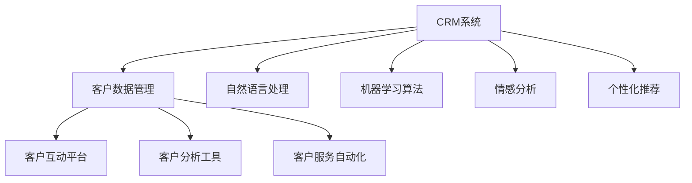

                 


### 文章标题

《AI驱动的智能客户关系管理：提升客户满意度》

### 文章关键词

AI、客户关系管理、智能客服、客户满意度、数据分析、个性化推荐、自然语言处理

### 文章摘要

本文旨在探讨如何利用AI技术提升客户关系管理的效率与满意度。我们将从AI与CRM的基本概念入手，深入分析AI在CRM中的具体应用，包括自然语言处理、机器学习算法和个性化推荐等。通过实际案例，我们将展示AI技术在客户画像构建、客户行为预测、客户服务自动化和客户满意度提升等方面的实际应用。文章最后将对AI驱动的CRM策略和实践进行总结，并提供相关拓展阅读，以期为读者在客户关系管理领域的AI应用提供有价值的参考。

---

### 引言

在当今快速发展的数字时代，客户关系管理（CRM）已成为企业成功的关键因素。然而，随着市场环境的复杂化和客户需求的多样化，传统的CRM系统已经难以满足企业对高效、精准和个性化的客户服务的需求。这时，人工智能（AI）技术的出现，为CRM带来了全新的变革机遇。AI驱动的智能客户关系管理不仅能够提升企业的运营效率，还能显著提升客户的满意度，从而在激烈的市场竞争中脱颖而出。

本文将围绕AI驱动的智能客户关系管理这一主题，系统地探讨以下几个方面：

1. **AI与客户关系管理的基础**：介绍AI和CRM的基本概念，分析AI在CRM中的应用前景。
2. **AI在CRM中的技术应用**：详细讲解自然语言处理、机器学习算法、情感分析和个性化推荐等技术如何应用于CRM系统。
3. **AI驱动的CRM案例研究**：通过实际案例展示AI技术在客户关系管理中的具体应用和实践效果。
4. **AI驱动的CRM策略与实践**：探讨如何制定和实施AI驱动的CRM策略，优化客户体验。

希望通过本文的深入探讨，能够为企业在AI驱动的智能客户关系管理领域提供有价值的见解和实践指导。

### 第一部分：AI与客户关系管理基础

#### 第1章：AI与客户关系管理的概念

**核心概念与联系**

在探讨AI与客户关系管理的结合之前，我们需要首先了解两者的基本概念。人工智能（AI）是指通过计算机模拟人类智能行为，实现感知、推理、学习和决策的技术。它包括自然语言处理、机器学习、计算机视觉等多个子领域。客户关系管理（CRM）则是一种旨在通过策略、技术和流程来管理企业与客户之间互动关系的系统方法。

为了更好地理解AI与CRM的结合，我们可以使用Mermaid流程图来展示它们之间的关系架构：



**核心算法原理讲解**

在AI与CRM的结合中，几个核心算法扮演着至关重要的角色。以下是这些算法的简要介绍和原理讲解：

1. **自然语言处理（NLP）**：NLP是AI的一个子领域，旨在使计算机理解和处理人类语言。在CRM中，NLP可以用于客户沟通分析、情感分析和语音识别等应用。以下是使用伪代码展示的NLP算法框架：

    ```python
    function NLP_analysis(text):
        # 分词
        words = tokenize(text)
        # 基本语法分析
        grammar = parse(words)
        # 情感分析
        sentiment = sentiment_analysis(grammar)
        return sentiment
    ```

2. **机器学习算法**：机器学习算法在CRM中用于预测客户行为、识别潜在客户和个性化推荐等。以下是客户流失预测模型的一个简单伪代码示例：

    ```python
    function churn_prediction(data):
        # 数据预处理
        processed_data = preprocess(data)
        # 特征选择
        features = select_features(processed_data)
        # 建立模型
        model = build_model(features)
        # 预测
        predictions = model.predict(data)
        return predictions
    ```

3. **情感分析**：情感分析用于理解客户对产品或服务的情感态度，从而指导企业改进产品和服务。以下是情感分析的基本流程：

    ```python
    function sentiment_analysis(text):
        # 分词
        words = tokenize(text)
        # 基于词典的初始情感分析
        initial_sentiments = tag_sentiments(words)
        # 基于上下文的情感分析
        context_sentiments = context_analysis(words, initial_sentiments)
        return context_sentiments
    ```

4. **个性化推荐**：个性化推荐通过分析客户历史行为和偏好，向客户推荐相关产品和服务。以下是一个简单的推荐算法框架：

    ```python
    function personalized_recommendation(user_profile, product_data):
        # 基于内容的推荐
        content_recommendations = content_based_recommendation(user_profile, product_data)
        # 基于协同过滤的推荐
        collaborative_recommendations = collaborative_filtering(user_profile, product_data)
        # 混合推荐
        recommendations = combine_recommendations(content_recommendations, collaborative_recommendations)
        return recommendations
    ```

通过上述算法的介绍，我们可以看到AI技术在CRM中的应用是如何实现智能化、个性化和高效化的。接下来，我们将进一步探讨CRM系统的基本架构，以便更全面地理解AI如何嵌入到CRM中。

#### 第2章：CRM系统的基本架构

客户关系管理（CRM）系统是企业管理和维护客户关系的一种工具。一个完善的CRM系统通常包括客户数据管理、客户互动平台、客户分析工具和客户服务自动化等关键组件。以下是对CRM系统基本架构的详细探讨。

**客户数据管理**

客户数据管理是CRM系统的核心，它负责收集、存储、组织和处理客户的各种信息，如个人资料、购买历史、互动记录等。通过有效的客户数据管理，企业可以更好地了解客户的需求和行为，从而提供个性化的服务和产品。

1. **数据收集**：客户数据的收集来源包括网站、社交媒体、客服互动、市场调查等。为了保证数据的质量和完整性，企业需要制定一套规范的数据收集策略。

2. **数据存储**：常用的数据存储方式包括关系数据库、NoSQL数据库和大数据平台。选择合适的存储方式取决于数据的规模、类型和查询需求。

3. **数据组织**：客户数据需要根据不同的用途和场景进行分类和组织。例如，客户的基本信息、交易记录、服务记录等可以分别存储在不同的数据库表中。

4. **数据处理**：数据处理包括数据清洗、数据整合、数据转换等。这些步骤的目的是确保数据的准确性和一致性，为后续的数据分析打下坚实的基础。

**客户互动平台**

客户互动平台是CRM系统的重要组成部分，它提供了企业与客户互动的界面。通过这个平台，企业可以与客户进行沟通、解决客户问题、收集客户反馈等。以下是客户互动平台的主要功能：

1. **客服自动化**：通过自动化工具，如聊天机器人、智能客服等，可以快速响应用户的查询和请求，提高客户服务效率。

2. **客户沟通**：提供多种沟通渠道，如电子邮件、电话、在线聊天等，方便企业与客户进行及时、高效的沟通。

3. **客户反馈**：建立客户反馈机制，收集客户的意见和建议，帮助企业不断改进产品和服务。

**客户分析工具**

客户分析工具帮助企业管理者了解客户行为、需求和偏好，从而制定更有效的营销策略和客户服务计划。以下是几种常见的客户分析工具：

1. **客户画像**：通过整合客户的各类信息，建立客户画像，帮助企业了解客户的基本属性和行为特征。

2. **客户细分**：根据客户的行为、需求和偏好，将客户分为不同的群体，以便进行针对性的服务和营销。

3. **客户行为分析**：分析客户在网站、APP等平台上的行为轨迹，识别客户感兴趣的领域和潜在需求。

4. **客户满意度调查**：通过调查和反馈，了解客户对产品和服务的满意度，为企业改进提供依据。

**客户服务自动化**

客户服务自动化是CRM系统的重要功能之一，它通过自动化工具和流程，提高客户服务的效率和满意度。以下是几种常见的客户服务自动化工具：

1. **聊天机器人**：通过自然语言处理技术，自动化处理客户的查询和请求，提供快速、准确的答案。

2. **自动分配**：根据客户需求和客服资源，自动将客户请求分配给合适的客服人员。

3. **服务工单**：自动创建和管理客户服务工单，跟踪处理进度，确保问题得到及时解决。

4. **服务报告**：自动生成服务报告，提供客户服务质量和效率的评估。

通过上述对CRM系统基本架构的讨论，我们可以看到，一个完善的CRM系统不仅需要强大的数据管理能力，还需要高效的客户互动平台、智能的客户分析工具和自动化的客户服务功能。这些组件共同协作，为企业提供全面的客户关系管理解决方案。在下一章节，我们将深入探讨AI在CRM系统中的应用，展示AI技术如何进一步提升CRM系统的智能化和个性化。

#### 第3章：AI在CRM中的技术应用

人工智能（AI）技术在客户关系管理（CRM）中的应用极大地提升了企业的运营效率和客户满意度。在本章中，我们将详细探讨自然语言处理（NLP）、机器学习算法、情感分析和个性化推荐等AI技术，以及它们在CRM系统中的具体应用。

**自然语言处理（NLP）**

自然语言处理是AI的一个重要分支，旨在使计算机能够理解、生成和处理人类语言。在CRM系统中，NLP技术主要用于处理客户沟通的内容，提取有价值的信息，并进行情感分析和意图识别。

1. **情感分析**：情感分析通过分析客户的语言表达，判断其情感倾向，如正面、负面或中性。情感分析可以帮助企业了解客户对产品和服务的满意度，从而采取相应的改进措施。例如，一家电商平台可以使用情感分析来监控客户在社交媒体上的评论，识别负面情感并迅速响应。

2. **意图识别**：意图识别用于理解客户沟通的目的，如查询产品信息、寻求技术支持或进行售后服务。CRM系统通过意图识别，可以自动将客户请求分配到相应的服务渠道，提高响应速度和客户满意度。例如，一个客服聊天机器人可以识别客户的意图，自动引导其到正确的服务页面。

3. **聊天机器人**：聊天机器人是NLP在CRM中应用的一个典型例子。通过预训练的NLP模型，聊天机器人可以与客户进行自然语言对话，提供实时、个性化的服务。聊天机器人不仅可以回答常见问题，还可以处理复杂的客户查询，减轻人工客服的负担。

**机器学习算法**

机器学习算法在CRM中的应用非常广泛，可以用于预测客户行为、识别潜在客户、推荐产品和服务等。

1. **客户流失预测**：通过分析客户的历史行为数据，机器学习算法可以预测哪些客户可能流失，从而采取预防措施。例如，一家电信公司可以使用客户的使用习惯、账单信息等数据，通过机器学习模型预测哪些客户有较高的流失风险，并提前进行挽留。

2. **潜在客户识别**：机器学习算法可以根据客户的特征和行为，识别出潜在的高价值客户。CRM系统可以使用这些信息，制定针对性的营销策略，提高客户转化率。

3. **个性化推荐**：个性化推荐算法通过分析客户的购买历史和偏好，推荐符合其兴趣的产品和服务。例如，一家电子商务平台可以使用协同过滤算法，根据客户的浏览记录和购买记录，推荐相关的商品。

**情感分析**

情感分析是理解客户情感和情绪的一种重要技术。在CRM系统中，情感分析可以用于客户满意度调查、产品反馈分析等方面。

1. **客户满意度调查**：通过分析客户反馈的情感倾向，企业可以了解客户的整体满意度，并识别存在的问题。例如，一家酒店可以使用情感分析来分析客户在社交媒体上的评论，快速发现服务中的不足。

2. **产品反馈分析**：情感分析可以帮助企业理解客户对产品的情感反应，从而改进产品设计和功能。例如，一家科技公司可以通过情感分析，了解客户对新产品发布后的反馈，及时调整产品方向。

3. **社交媒体监控**：企业可以使用情感分析监控社交媒体上的客户反馈，及时发现和处理负面评论，保护品牌形象。

**个性化推荐**

个性化推荐是基于客户历史行为和偏好，提供个性化产品和服务推荐的一种技术。在CRM系统中，个性化推荐可以显著提高客户满意度。

1. **个性化营销**：通过分析客户的购买历史和浏览行为，CRM系统可以为每位客户推荐最感兴趣的产品和服务。例如，一家电商平台可以根据客户的浏览记录，推荐相关的商品，提高销售转化率。

2. **个性化服务**：个性化推荐不仅限于产品推荐，还可以应用于客户服务。例如，一个客服聊天机器人可以根据客户的偏好，推荐最适合的解决方案，提高服务效率。

3. **个性化体验**：个性化推荐可以为企业提供定制化的客户体验。例如，一家酒店可以根据客户的偏好，推荐符合其兴趣的房间和活动，提高客户满意度。

通过上述讨论，我们可以看到，AI技术在CRM系统中的应用极大地提升了企业的运营效率和客户满意度。在下一章节中，我们将通过实际案例，展示AI技术在客户关系管理中的具体应用和实践效果。

#### 第4章：AI驱动的客户关系管理案例研究

在本章中，我们将通过几个具体的案例，展示AI技术在客户关系管理中的应用和实践效果。这些案例将涵盖客户画像构建、客户行为预测、客户服务自动化和客户满意度提升等方面，以帮助读者更好地理解AI技术在CRM中的实际应用。

**案例一：客户画像构建**

**背景**：一家大型电商平台希望通过构建客户画像，更好地了解客户的需求和行为，从而提供个性化的服务和产品推荐。

**目标**：通过分析客户的历史购买记录、浏览行为和社交媒体互动，构建全面的客户画像。

**方法**：
1. **数据收集**：收集客户的购买记录、浏览行为和社交媒体互动数据。
2. **数据清洗**：对收集到的数据进行清洗和整合，确保数据的准确性和一致性。
3. **特征提取**：提取关键特征，如购买频次、浏览时长、评论内容等。
4. **建模**：使用聚类算法（如K-means）对客户进行分类，构建客户画像。

**结果**：通过构建客户画像，电商平台成功识别了不同类型的客户群体，如高频购买者、浏览不购买者和社交媒体活跃者。基于客户画像，平台可以为其提供定制化的推荐和服务，提高客户满意度和转化率。

**结论**：客户画像构建是AI技术在CRM中的重要应用，可以帮助企业深入了解客户需求，提供个性化的服务和产品推荐，从而提升客户满意度。

**案例二：客户行为预测**

**背景**：一家电信公司希望通过预测客户流失，提前采取挽留措施，减少客户流失率。

**目标**：通过分析客户的历史行为数据，预测哪些客户可能流失，并采取针对性的挽留策略。

**方法**：
1. **数据收集**：收集客户的通话记录、账单数据、服务使用情况等。
2. **数据预处理**：对数据进行清洗、归一化和特征提取。
3. **建模**：使用机器学习算法（如逻辑回归、决策树）建立客户流失预测模型。
4. **评估**：通过交叉验证和A/B测试，评估模型的预测效果。

**结果**：通过客户行为预测模型，电信公司成功识别出高流失风险的客户群体。针对这些客户，公司采取了个性化的挽留措施，如优惠活动、定制化服务等，有效降低了客户流失率。

**结论**：客户行为预测是AI技术在CRM中的另一个重要应用，可以帮助企业提前识别潜在流失客户，采取有针对性的挽留策略，降低流失率。

**案例三：客户服务自动化**

**背景**：一家在线零售商希望通过自动化工具，提高客户服务的效率和满意度。

**目标**：通过自动化工具，实现客户咨询的快速响应和问题的自动解决。

**方法**：
1. **聊天机器人**：开发基于自然语言处理技术的聊天机器人，用于回答客户的常见问题和引导客户到相关页面。
2. **智能客服系统**：集成智能客服系统，实现客户问题的自动分配和处理。
3. **知识库**：建立知识库，包含常见问题的解答和操作指南，供聊天机器人和客服人员使用。

**结果**：通过客户服务自动化，在线零售商显著提高了客户咨询的响应速度和问题解决率，客户满意度也得到了提升。

**结论**：客户服务自动化是AI技术在CRM中提升客户满意度的重要手段，通过自动化工具，可以大幅提高客户服务的效率和满意度。

**案例四：客户满意度提升**

**背景**：一家金融服务公司希望通过分析客户反馈，提升客户满意度。

**目标**：通过情感分析和客户满意度调查，识别客户的不满意点，并采取改进措施。

**方法**：
1. **情感分析**：使用情感分析技术，分析客户在社交媒体和客户反馈中的情感倾向。
2. **满意度调查**：定期进行客户满意度调查，收集客户的意见和建议。
3. **改进措施**：根据分析结果，制定和实施改进措施，如优化产品和服务、提高客服响应速度等。

**结果**：通过情感分析和满意度调查，金融服务公司成功识别了客户的不满意点，并采取了一系列改进措施。客户满意度显著提升，客户流失率也有所下降。

**结论**：客户满意度提升是AI技术在CRM中的核心应用之一，通过情感分析和满意度调查，企业可以深入了解客户需求，及时改进产品和服务，提升客户满意度。

通过上述案例，我们可以看到，AI技术在客户关系管理中的实际应用效果显著。客户画像构建、客户行为预测、客户服务自动化和客户满意度提升等方面，都是AI技术在CRM中的重要应用领域。在下一章节中，我们将探讨如何制定和实施AI驱动的CRM策略，以实现更好的客户关系管理。

#### 第5章：AI驱动的CRM策略与实践

在AI技术的支持下，企业可以通过制定和实施AI驱动的CRM策略，实现更高效、精准的客户关系管理。本章将探讨如何制定AI驱动的CRM策略，并展示一些实际案例，以帮助读者更好地理解这一过程。

**一、制定AI驱动的CRM策略**

1. **目标设定**：首先，企业需要明确AI驱动的CRM策略的目标。这些目标可能包括提高客户满意度、降低客户流失率、提升销售转化率等。设定清晰的目标有助于后续策略的实施和评估。

2. **数据准备**：AI驱动的CRM策略依赖于大量高质量的数据。企业需要收集并整理客户数据，包括购买历史、互动记录、社交媒体行为等。数据的质量和完整性对策略的效果至关重要。

3. **技术选型**：根据策略目标和数据需求，选择合适的AI技术。例如，自然语言处理（NLP）技术可用于处理客户沟通，机器学习算法可用于客户行为预测和个性化推荐。

4. **模型构建**：使用选定的技术，构建预测模型、推荐模型等。模型构建过程中，需要考虑数据的预处理、特征提取、算法选择和模型优化等因素。

5. **策略实施**：将AI模型应用于实际的CRM系统中，例如，通过聊天机器人提供个性化服务、通过客户行为预测模型识别潜在流失客户等。

6. **效果评估**：定期评估AI驱动的CRM策略的效果，包括客户满意度、客户留存率、销售转化率等指标。根据评估结果，调整和优化策略。

**二、实际案例**

**案例一：个性化推荐策略**

某电商平台通过AI技术，实现了基于用户行为的个性化推荐策略。具体实施步骤如下：

1. **数据收集**：收集用户的浏览历史、购买记录、搜索关键词等数据。

2. **特征提取**：提取用户的行为特征，如浏览时长、购买频次、搜索意图等。

3. **模型构建**：使用协同过滤算法，构建个性化推荐模型。模型通过分析用户的相似行为，推荐相关商品。

4. **策略实施**：将推荐模型应用于电商平台，为每位用户推荐个性化的商品。

5. **效果评估**：通过A/B测试，发现个性化推荐策略显著提高了用户的点击率和购买转化率。

**案例二：客户流失预测策略**

某电信公司通过AI技术，实现了客户流失预测策略，以降低客户流失率。具体实施步骤如下：

1. **数据收集**：收集客户的通话记录、账单数据、服务使用情况等。

2. **特征提取**：提取客户的行为特征，如通话时长、账单金额、服务使用频率等。

3. **模型构建**：使用机器学习算法（如逻辑回归、决策树），构建客户流失预测模型。

4. **策略实施**：将预测模型应用于CRM系统，识别高流失风险客户，并采取针对性挽留措施。

5. **效果评估**：通过对比有预测措施和无预测措施的客户的流失率，发现流失率显著下降。

**三、最佳实践**

1. **数据质量**：确保数据的质量和完整性，对数据进行清洗和整合。

2. **跨部门协作**：AI驱动的CRM策略涉及多个部门，如IT、营销、客服等，需要跨部门协作，共同推进。

3. **持续优化**：定期评估策略效果，并根据反馈进行优化。

4. **用户隐私**：在数据收集和处理过程中，严格保护用户隐私，遵守相关法律法规。

通过本章的讨论，我们可以看到，制定和实施AI驱动的CRM策略需要多个环节的协同合作。企业需要充分利用AI技术，通过数据驱动的方式，实现更高效、精准的客户关系管理。

#### 第6章：AI驱动的客户体验优化

随着人工智能（AI）技术的不断发展，企业可以通过AI驱动的客户体验优化，显著提升客户的满意度和忠诚度。在本章中，我们将探讨如何通过AI技术实现个性化体验设计、智能交互和自动化服务，从而全面提升客户体验。

**一、个性化体验设计**

个性化体验设计是AI驱动的客户体验优化的重要组成部分。通过分析客户的历史数据和行为模式，企业可以为每位客户提供定制化的服务和建议，提高客户的参与度和满意度。

1. **基于历史数据的个性化推荐**：利用客户的购买历史、浏览行为和搜索记录，AI系统可以预测客户的偏好，推荐符合其兴趣的产品和服务。例如，一家电商平台可以根据客户的浏览记录和购买历史，为其推荐相关商品，提高购买转化率。

2. **动态个性化内容**：通过自然语言处理（NLP）和机器学习算法，企业可以为每位客户提供动态个性化内容。例如，在客户浏览网站时，AI系统可以实时分析其浏览行为，调整页面内容和布局，使其更加符合客户的需求。

3. **个性化客服**：通过聊天机器人和智能客服系统，AI可以根据客户的个性化需求和偏好，提供个性化的客服服务。例如，当客户提出问题时，AI系统可以根据其历史互动记录，自动推荐合适的解决方案。

**二、智能交互**

智能交互是AI驱动的客户体验优化的重要环节。通过智能交互，企业可以与客户建立更加自然、流畅的沟通，提高客户的满意度和忠诚度。

1. **语音交互**：利用语音识别和自然语言处理技术，企业可以实现语音交互功能。例如，智能家居设备可以通过语音识别，理解客户的指令，并自动执行相应的操作。

2. **图像识别**：通过计算机视觉技术，企业可以实现图像识别功能。例如，零售业可以使用图像识别技术，识别客户购买的物品，并为其提供相关的产品信息和推荐。

3. **多模态交互**：通过结合语音、文本和图像等多种交互方式，企业可以实现更加丰富和自然的客户交互。例如，在智能客服系统中，客户可以通过文本、语音和图像等多种方式与AI系统进行互动，获得更好的服务体验。

**三、自动化服务**

自动化服务是AI驱动的客户体验优化的重要手段。通过自动化服务，企业可以大幅提高服务效率，降低运营成本，同时提升客户的满意度。

1. **自动客服**：利用聊天机器人和智能客服系统，企业可以实现7x24小时的自动客服服务。例如，当客户有疑问或需求时，AI系统可以自动回答问题或引导客户到相应的服务渠道。

2. **自动任务处理**：通过自动化流程，企业可以自动化处理客户服务流程中的各项任务。例如，自动分配客服任务、自动生成服务报告、自动处理客户投诉等。

3. **智能调度**：利用AI技术，企业可以实现智能调度，优化客户服务资源。例如，根据客户需求和客服人员的工作能力，智能调度系统可以自动安排最合适的客服人员处理客户问题。

**四、最佳实践**

1. **客户数据整合**：确保客户数据的整合和准确性，为个性化体验设计和智能交互提供可靠的数据支持。

2. **持续优化**：定期评估AI驱动的客户体验优化策略的效果，并根据反馈进行优化。

3. **用户体验测试**：通过用户体验测试，收集客户对AI驱动的客户体验的反馈，及时调整和改进。

4. **合规性**：在数据收集和处理过程中，严格遵守相关法律法规，保护客户隐私。

通过AI驱动的客户体验优化，企业可以大幅提升客户的满意度和忠诚度，从而在激烈的市场竞争中脱颖而出。在下一章中，我们将进一步探讨如何通过AI技术实现客户满意度的提升。

#### 第7章：AI驱动的客户满意度提升

客户满意度是衡量企业服务质量的重要指标，而人工智能（AI）技术的应用为提升客户满意度提供了新的路径。在本章中，我们将探讨如何通过AI技术实现客户满意度的提升，包括个性化服务、实时反馈分析和客户行为预测等方面。

**一、个性化服务**

个性化服务是通过分析客户的历史数据和偏好，为客户提供定制化的产品和服务。AI技术在这一过程中发挥着关键作用：

1. **个性化推荐**：基于客户的购买历史、浏览记录和搜索意图，AI系统可以推荐符合其兴趣的产品和服务。例如，电商平台可以使用协同过滤算法和内容推荐系统，为每位客户生成个性化的推荐列表。

2. **个性化互动**：通过自然语言处理（NLP）技术，AI系统能够理解客户的提问和需求，提供个性化的互动体验。例如，智能客服聊天机器人可以识别客户的情感和意图，自动生成符合客户需求的回复。

3. **个性化营销**：基于客户的个性化数据和偏好，企业可以实施精准的营销策略。例如，邮件营销系统可以根据客户的购买行为和浏览记录，发送定制化的优惠信息和产品推荐。

**二、实时反馈分析**

实时反馈分析是客户满意度提升的重要手段，通过分析客户在互动过程中的反馈，企业可以及时发现问题和改进服务。AI技术在实时反馈分析中的应用包括：

1. **情感分析**：通过情感分析技术，企业可以实时分析客户的情感状态。例如，在社交媒体监控中，AI系统可以识别客户的正面、负面或中性情感，帮助企业了解客户的真实感受。

2. **实时反馈收集**：通过在线调查、问卷调查和社交媒体互动，企业可以实时收集客户的反馈。AI系统可以自动分析这些反馈，生成报告和总结，帮助管理层快速做出决策。

3. **实时问题诊断**：在客户服务过程中，AI系统可以实时诊断客户的问题，并提供解决方案。例如，智能客服系统可以自动识别常见问题，并提供相应的解决方案，提高问题解决率。

**三、客户行为预测**

客户行为预测是客户满意度提升的重要手段，通过预测客户的行为，企业可以采取针对性的措施，提高客户满意度。AI技术在客户行为预测中的应用包括：

1. **客户流失预测**：通过分析客户的购买历史、互动记录和服务使用情况，AI系统可以预测哪些客户可能流失。企业可以针对这些客户采取挽留措施，提高客户留存率。

2. **客户需求预测**：通过分析客户的购买行为和偏好，AI系统可以预测客户未来的需求。例如，电商平台可以根据客户的浏览记录和购买历史，预测客户可能会购买的产品，并提前推荐。

3. **个性化服务优化**：通过分析客户的行为数据和反馈，AI系统可以不断优化个性化服务策略。例如，企业可以根据客户的需求变化，调整推荐算法和互动策略，提高客户满意度。

**四、最佳实践**

1. **数据整合**：确保客户数据的整合和准确性，为AI驱动的客户满意度提升提供可靠的数据支持。

2. **持续优化**：定期评估AI驱动的客户满意度提升策略的效果，并根据反馈进行优化。

3. **用户体验测试**：通过用户体验测试，收集客户对AI驱动的客户体验的反馈，及时调整和改进。

4. **合规性**：在数据收集和处理过程中，严格遵守相关法律法规，保护客户隐私。

通过AI驱动的客户满意度提升，企业可以更好地了解客户需求，提供个性化的服务，及时解决问题，从而提高客户满意度和忠诚度。在下一章中，我们将总结全书内容，并讨论AI驱动的智能客户关系管理的前景和挑战。

### 总结

在本篇博客文章中，我们系统地探讨了AI驱动的智能客户关系管理，旨在帮助读者理解如何利用AI技术提升客户满意度。我们首先介绍了AI和CRM的基本概念及其融合方式，详细讲解了AI在CRM中的技术应用，包括自然语言处理、机器学习算法、情感分析和个性化推荐等。通过实际案例，我们展示了AI技术在客户画像构建、客户行为预测、客户服务自动化和客户满意度提升等方面的具体应用和实践效果。

**核心要点总结：**

1. **AI与CRM的结合**：AI技术可以显著提升CRM系统的智能化和个性化，为企业提供更高效、精准的客户关系管理。
2. **AI技术应用**：自然语言处理、机器学习算法、情感分析和个性化推荐等技术，为CRM系统提供了强大的工具，帮助企业更好地理解客户需求，提升服务质量。
3. **案例研究**：通过实际案例，我们看到了AI技术在CRM系统中的广泛应用和显著效果，证明了AI驱动的智能客户关系管理在实践中的可行性。
4. **策略与实践**：企业需要制定和实施AI驱动的CRM策略，通过持续优化和用户体验测试，不断提升客户满意度。

**未来展望**

尽管AI驱动的智能客户关系管理已经取得显著进展，但仍面临一些挑战和机会。未来，以下方向值得进一步探索：

1. **数据隐私与合规性**：在AI技术应用过程中，如何确保客户数据的安全和隐私，遵守相关法律法规，是一个亟待解决的问题。
2. **跨渠道整合**：随着客户互动渠道的多样化，如何实现不同渠道的数据整合和无缝衔接，提供一致的客户体验，是一个重要研究方向。
3. **持续优化与适应**：企业需要不断优化AI驱动的CRM策略，以适应市场变化和客户需求的变化。
4. **技术创新**：随着AI技术的不断发展，如深度学习、强化学习等新兴技术的应用，将进一步推动智能客户关系管理的创新。

总之，AI驱动的智能客户关系管理具有巨大的发展潜力，企业应积极拥抱这一趋势，通过技术创新和策略优化，不断提升客户满意度，实现可持续发展。

### 拓展阅读

为了进一步深入了解AI驱动的智能客户关系管理，以下是几本推荐的参考文献：

1. **《人工智能：一种现代方法》（Second Edition）**：作者 Stuart Russell 和 Peter Norvig。这本书提供了全面的人工智能基础，包括机器学习、自然语言处理等内容，是学习AI技术的重要参考书。

2. **《深度学习》（Deep Learning）**：作者 Ian Goodfellow、Yoshua Bengio 和 Aaron Courville。这本书详细介绍了深度学习的基本概念、算法和应用，对AI技术有深入了解的读者非常有用。

3. **《客户关系管理：策略、过程和技术》（Customer Relationship Management: Strategies, Processes, and Technologies）**：作者 Peter F. Drucker。这本书探讨了CRM的基本概念和策略，适合希望深入了解CRM理论的人。

4. **《AI营销：利用人工智能提升营销效果》（AI Marketing: Using AI to Boost Marketing Effectiveness）**：作者 A. Bhattacharyya 和 A. Goutam。这本书介绍了如何利用AI技术优化营销策略，提高客户满意度。

通过阅读这些书籍，读者可以更全面地了解AI技术在CRM中的应用，并为实际项目提供理论基础和实践指导。

