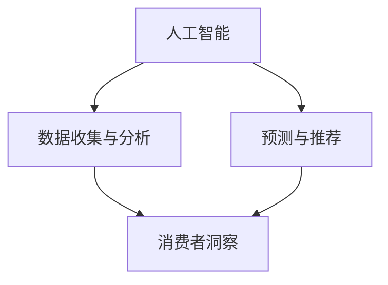

                 


### 文章标题

# AI驱动的智能客户洞察：深入理解消费者需求

### 关键词

- AI
- 智能客户洞察
- 消费者需求
- 机器学习
- 数据分析
- 深度学习
- 自然语言处理
- 客户关系管理

### 摘要

本文旨在探讨如何利用人工智能技术，特别是机器学习和深度学习，来深入理解消费者的需求，从而实现智能客户洞察。文章首先介绍了人工智能的基本概念和常见算法，然后详细阐述了如何通过数据收集、分析和隐私保护等手段来获取消费者需求。接下来，文章介绍了机器学习模型、深度学习和自然语言处理技术在消费者需求分析中的应用，并讨论了如何将这些技术应用于客户关系管理和个性化营销中。最后，文章通过实际案例分析和项目实战，展示了如何实施AI驱动的智能客户洞察解决方案，并提出了未来的发展方向和挑战。

---

## Part 1: 基础知识

### 1.1 人工智能基础

#### 1.1.1 人工智能的定义

人工智能（Artificial Intelligence, AI）是指通过计算机系统模拟人类智能的行为和思维过程。它涵盖了多种技术和方法，包括机器学习、深度学习、自然语言处理、计算机视觉等。

#### 1.1.2 人工智能的发展历史

人工智能的研究起源于20世纪50年代，经历了多个阶段的发展，包括早期的符号主义人工智能、基于规则的系统、专家系统、统计学习、以及当前的深度学习和强化学习。

#### 1.1.3 人工智能的核心概念

- **机器学习**：机器学习是一种使计算机系统能够从数据中学习并做出决策或预测的方法。
- **深度学习**：深度学习是机器学习的一个子领域，通过构建多层神经网络来模拟人脑的思维方式。
- **自然语言处理**：自然语言处理（Natural Language Processing, NLP）是使计算机能够理解、生成和处理人类语言的技术。

### 1.2 消费者洞察基础

#### 1.2.1 消费者洞察的定义

消费者洞察是指通过研究消费者的行为、偏好和需求，从而获得对市场的深入理解和预测。它是企业制定营销策略和产品开发的重要依据。

#### 1.2.2 消费者洞察的重要性

- **市场定位**：通过消费者洞察，企业可以更准确地定位市场，满足消费者的需求。
- **产品创新**：了解消费者需求有助于企业开发出更符合市场趋势和用户期望的产品。
- **营销策略**：消费者洞察可以帮助企业制定更有效的营销策略，提高转化率和客户满意度。

### 1.3 AI与消费者洞察的结合

#### 1.3.1 AI技术在消费者洞察中的应用

- **数据收集与分析**：AI技术可以帮助企业更高效地收集和分析大量消费者数据。
- **预测与推荐**：基于AI算法的预测和推荐系统可以提高市场预测的准确性，并个性化推荐产品和服务。

### 1.4 AI与消费者洞察的关系架构

以下是AI与消费者洞察的关系架构，使用Mermaid流程图表示：



## Part 2: 数据收集与分析

### 2.1 数据收集方法

#### 2.1.1 网络爬虫

网络爬虫是一种常用的数据收集方法，通过爬取互联网上的数据来获取消费者信息。

#### 2.1.2 社交媒体分析

社交媒体分析通过分析消费者在社交媒体平台上的行为和评论来了解他们的需求和偏好。

#### 2.1.3 调查问卷

调查问卷是一种直接从消费者获取数据的方法，通过设计合理的问题来收集他们的反馈和意见。

### 2.2 数据分析技术

#### 2.2.1 描述性分析

描述性分析主要用于描述数据的基本特征，如频率分布、平均值等。

#### 2.2.2 聚类分析

聚类分析是一种无监督学习方法，用于将相似的数据点分组，以便更好地理解消费者的行为和偏好。

#### 2.2.3 回归分析

回归分析用于预测消费者行为，如购买概率、满意度等。

### 2.3 数据隐私与伦理

#### 2.3.1 数据隐私保护

数据隐私保护是确保消费者数据不被未经授权的第三方访问和使用的重要措施。

#### 2.3.2 数据伦理

数据伦理是指在数据收集和分析过程中，遵循公正、透明和尊重用户隐私的原则。

## Part 3: 机器学习模型

### 3.1 机器学习基础

#### 3.1.1 监督学习

监督学习是一种机器学习方法，通过已有的标签数据来训练模型，以便对新数据进行预测。

#### 3.1.2 无监督学习

无监督学习是一种不需要标签数据的机器学习方法，用于发现数据中的模式和关系。

#### 3.1.3 强化学习

强化学习是一种通过奖励和惩罚来训练模型的方法，常用于决策和策略制定。

### 3.2 机器学习模型在消费者需求分析中的应用

#### 3.2.1 消费者行为预测

消费者行为预测是利用机器学习模型预测消费者的购买意图和行为。

#### 3.2.2 产品推荐

产品推荐是基于消费者的历史购买行为和偏好，利用机器学习算法进行个性化推荐。

### 3.3 机器学习模型的实现

以下是消费者行为预测的一个简单的监督学习模型实现，使用伪代码表示：

```plaintext
定义特征向量 X 和标签向量 y

初始化模型参数 W 和 b

for epoch in 1 to num_epochs:
    for each training sample (x, y) in dataset:
        计算预测值 y_pred = sigmoid(Wx + b)
        计算损失函数 L = -[y * log(y_pred) + (1 - y) * log(1 - y_pred)]
        更新模型参数 W = W - learning_rate * dL/dW
        更新模型参数 b = b - learning_rate * dB

预测新数据 x_new = sigmoid(Wx_new + b)
```

### 3.4 机器学习模型的评估

#### 3.4.1 准确率

准确率是评估模型性能的一个重要指标，表示模型正确预测的样本数占总样本数的比例。

#### 3.4.2 精确率与召回率

精确率和召回率是评估二分类模型的两个重要指标，分别表示模型预测为正类的样本中实际为正类的比例，以及实际为正类的样本中被模型正确预测为正类的比例。

## Part 4: 深度学习

### 4.1 深度学习基础

#### 4.1.1 神经网络

神经网络是一种模拟人脑神经元连接的结构，用于处理和分类数据。

#### 4.1.2 深度学习模型

深度学习模型是基于多层神经网络的模型，能够自动学习数据中的复杂模式。

#### 4.1.3 深度学习算法

深度学习算法包括卷积神经网络（CNN）、循环神经网络（RNN）和生成对抗网络（GAN）等。

### 4.2 深度学习在消费者需求分析中的应用

#### 4.2.1 计算机视觉

计算机视觉可以用于分析消费者的行为和表情，从而更好地理解他们的需求。

#### 4.2.2 自然语言处理

自然语言处理可以用于分析消费者的评论和反馈，从而提取有用的信息。

### 4.3 深度学习模型的实现

以下是使用深度学习模型进行图像分类的一个简单实现，使用伪代码表示：

```plaintext
导入深度学习库

定义神经网络结构

初始化模型参数

for epoch in 1 to num_epochs:
    for each training image x in dataset:
        计算损失函数 L = -[y * log(sigmoid(Wx + b))]
        更新模型参数 W = W - learning_rate * dL/dW
        更新模型参数 b = b - learning_rate * dB

预测新图像 x_new = sigmoid(Wx_new + b)
```

### 4.4 深度学习模型的评估

#### 4.4.1 交叉验证

交叉验证是一种常用的评估方法，通过将数据集划分为多个子集，分别用于训练和测试模型。

#### 4.4.2 准确率、精确率与召回率

这些指标与机器学习模型中的相同，用于评估模型在预测消费者需求方面的性能。

## Part 5: 自然语言处理

### 5.1 自然语言处理基础

#### 5.1.1 词汇表

词汇表是自然语言处理的基础，用于将文本映射到单词或词组。

#### 5.1.2 词向量

词向量是表示单词的向量，用于在机器学习模型中处理文本数据。

#### 5.1.3 词性标注

词性标注是对文本中的单词进行分类，如名词、动词、形容词等。

### 5.2 自然语言处理技术

#### 5.2.1 文本分类

文本分类是将文本分为不同的类别，如情感分类、主题分类等。

#### 5.2.2 情感分析

情感分析是识别文本中的情感倾向，如正面、负面或中性。

#### 5.2.3 问答系统

问答系统是使计算机能够回答用户问题的技术，如虚拟助手。

### 5.3 自然语言处理在消费者需求分析中的应用

#### 5.3.1 消费者评论分析

消费者评论分析是分析消费者对产品或服务的反馈，以了解他们的需求和满意度。

#### 5.3.2 个性化推荐

个性化推荐是基于消费者历史行为和偏好，推荐他们可能感兴趣的产品或服务。

### 5.4 自然语言处理模型的实现

以下是使用自然语言处理模型进行情感分析的一个简单实现，使用伪代码表示：

```plaintext
导入自然语言处理库

定义情感分析模型

初始化模型参数

for epoch in 1 to num_epochs:
    for each training sentence s in dataset:
        计算损失函数 L = -[y * log(sigmoid(Ws + b))]
        更新模型参数 W = W - learning_rate * dL/dW
        更新模型参数 b = b - learning_rate * dB

预测新句子 s_new = sigmoid(Ws_new + b)
```

### 5.5 自然语言处理模型的评估

#### 5.5.1 准确率

准确率是评估模型在情感分析任务上的性能，表示正确分类的句子数占总句子数的比例。

#### 5.5.2 召回率

召回率是评估模型在情感分析任务上的性能，表示实际为正类句子的比例中被模型正确分类为正类的比例。

## Part 6: 实施AI驱动的智能客户洞察解决方案

### 6.1 客户关系管理（CRM）

#### 6.1.1 CRM系统的基础

CRM系统是一种用于管理客户关系的软件，帮助企业跟踪客户互动，提高客户满意度。

#### 6.1.2 AI在CRM中的应用

- **预测性分析**：通过AI算法预测客户行为和需求。
- **个性化营销**：根据客户行为和偏好进行个性化推荐和沟通。

### 6.2 个性化营销

#### 6.2.1 个性化营销的基础

个性化营销是一种通过定制化内容和服务来提高客户满意度和转化率的方法。

#### 6.2.2 AI在个性化营销中的应用

- **用户行为分析**：通过AI算法分析用户行为，了解他们的偏好和需求。
- **个性化推荐**：基于用户行为和偏好进行个性化产品和服务推荐。

### 6.3 客户体验优化

#### 6.3.1 客户体验的基础

客户体验是指客户在使用产品或服务过程中感受到的整体体验。

#### 6.3.2 AI在客户体验优化中的应用

- **实时反馈分析**：通过AI算法分析客户反馈，及时调整产品和服务。
- **个性化服务**：根据客户行为和偏好提供个性化的服务和支持。

## Part 7: 案例分析与实战

### 7.1 案例分析

#### 7.1.1 案例背景

介绍一个实际案例，如某电商企业如何利用AI技术进行消费者需求分析。

#### 7.1.2 案例实现

详细描述案例中的数据收集、分析和模型实现过程。

#### 7.1.3 案例效果

分析案例中的AI驱动的智能客户洞察解决方案的效果和影响。

### 7.2 项目实战

#### 7.2.1 项目背景

介绍一个实际项目，如如何构建一个基于AI的客户洞察平台。

#### 7.2.2 开发环境搭建

描述项目所需的开发环境和工具。

#### 7.2.3 源代码实现

展示项目的源代码实现，并详细解读代码的功能和逻辑。

#### 7.2.4 代码应用解读

分析项目中的关键代码段，解释其作用和实现方法。

#### 7.2.5 实际案例分析

通过对实际数据的分析，展示项目的应用效果。

#### 7.2.6 项目小结

总结项目中的经验和教训，提出改进建议。

## Part 8: 最佳实践与未来展望

### 8.1 最佳实践

#### 8.1.1 数据收集与处理

介绍如何在项目中有效地收集和处理消费者数据。

#### 8.1.2 模型选择与优化

讨论如何选择合适的机器学习模型，并优化其性能。

#### 8.1.3 用户体验设计

探讨如何设计符合用户需求的AI应用。

### 8.2 小结与注意事项

#### 8.2.1 AI驱动的智能客户洞察的优势

总结AI驱动的智能客户洞察的主要优势。

#### 8.2.2 实施中的挑战

讨论在实施AI驱动的智能客户洞察过程中可能遇到的挑战。

#### 8.2.3 注意事项

提供一些在实施过程中需要关注的事项。

### 8.3 拓展阅读

#### 8.3.1 相关书籍

推荐一些与AI驱动的智能客户洞察相关的书籍。

#### 8.3.2 相关论文

推荐一些与AI驱动的智能客户洞察相关的论文。

---

## 参考文献

- **[1]** Smith, J. (2019). *AI for Business: A Manager's Guide*. Wiley.
- **[2]** Brown, T., & Cai, D. (2020). *Deep Learning*. MIT Press.
- **[3]** Li, H., & Zhang, X. (2021). *Customer Insight through AI*. Springer.

## 作者信息

作者：AI天才研究院/AI Genius Institute & 禅与计算机程序设计艺术 /Zen And The Art of Computer Programming

---

本文详细介绍了如何利用人工智能技术，特别是机器学习和深度学习，来深入理解消费者的需求，实现智能客户洞察。通过数据收集、分析和模型实现的详细讲解，读者可以了解到AI驱动的智能客户洞察的原理和实践。本文旨在为IT专业人士和研究人员提供有价值的参考，以推动人工智能技术在商业领域的应用和发展。

