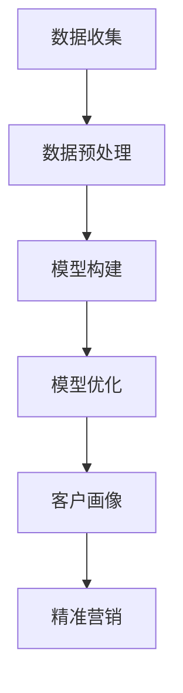

                 

### 文章标题

# AI驱动的智能客户画像：精准营销的基础

### 文章关键词

- 人工智能
- 客户画像
- 精准营销
- 数据分析
- 机器学习
- 深度学习
- 用户行为分析

### 文章摘要

本文探讨了人工智能在构建智能客户画像中的应用，以及如何通过这些智能客户画像实现精准营销。文章首先介绍了客户画像的基本概念和重要性，接着深入分析了人工智能在客户画像中的应用，包括数据收集、处理、模型构建与优化等步骤。然后，文章讨论了如何利用智能客户画像来制定精准营销策略，并通过案例实践展示了这一策略的实际应用效果。最后，文章展望了人工智能在客户画像和精准营销领域的未来发展趋势，提出了可能的改进方向和挑战。

### 目录

1. **背景介绍**  
   - 人工智能与客户画像的关系  
   - 精准营销的重要性

2. **核心概念与联系**  
   - 客户画像的概念与架构  
   - 人工智能在客户画像中的应用  
   - Mermaid 流程图展示

3. **核心算法原理讲解**  
   - 数据收集与处理的算法原理  
   - 模型构建与训练的算法原理  
   - 模型评估与优化的算法原理

4. **项目实战**  
   - 开发环境搭建  
   - 源代码详细实现和代码解读  
   - 代码应用解读与分析  
   - 实际案例分析和详细讲解剖析  
   - 项目小结

5. **精准营销策略与实践**  
   - 精准营销的基本原理  
   - 利用客户画像制定营销策略  
   - 营销策略的实际应用案例

6. **未来展望与技术趋势**  
   - 人工智能在客户画像和精准营销中的发展趋势  
   - 可能的改进方向和挑战

7. **最佳实践 tips、小结、注意事项、拓展阅读**  
   - 最佳实践 tips  
   - 小结  
   - 注意事项  
   - 拓展阅读

### 背景介绍

在当今这个数据驱动的时代，人工智能（AI）已经成为商业领域的重要推动力量。其中，客户画像作为一种精准营销的重要工具，正日益受到企业的重视。客户画像，即通过收集和分析用户的各类数据，构建出一个虚拟的用户模型，用以全面、深入地了解用户的需求、行为和偏好。这种模型不仅可以帮助企业更好地了解其客户，还可以为精准营销提供有力的数据支持。

#### 人工智能与客户画像的关系

人工智能在客户画像中的应用，主要体现在数据收集、处理、模型构建和优化等各个环节。通过利用AI技术，企业可以更加高效地收集和分析用户数据，从而构建出更加精准和细致的客户画像。具体来说，AI技术可以用于以下几个方面：

1. **数据收集**：利用自然语言处理（NLP）、图像识别等技术，从各种渠道（如社交媒体、网站访问日志等）中自动收集用户数据。
2. **数据处理**：通过数据清洗、去噪、归一化等技术手段，对收集到的数据进行预处理，以便更好地进行分析。
3. **模型构建**：利用机器学习和深度学习算法，对处理后的数据进行建模，以生成用户画像。
4. **模型优化**：通过不断地训练和调整模型，使其能够更好地适应新数据，提高预测的准确性和可靠性。

#### 精准营销的重要性

精准营销是指企业根据客户的个性化需求和偏好，有针对性地制定和实施营销策略，以实现更高的营销效果和客户满意度。在传统营销中，企业往往采用“广撒网，多捞鱼”的策略，即通过大规模的广告投放，期望能够触达更多的潜在客户。然而，这种方法往往效率低下，成本高昂，且难以满足客户的个性化需求。

相比之下，精准营销则更加注重针对性和有效性。通过构建智能客户画像，企业可以更加深入地了解客户的购买行为、兴趣偏好、需求痛点等，从而制定出更加符合客户需求的营销策略。具体来说，精准营销的重要性体现在以下几个方面：

1. **提高营销效率**：通过精准定位目标客户，企业可以更加有效地利用营销资源，减少无效投放，提高营销ROI。
2. **提升客户满意度**：精准营销能够更好地满足客户的个性化需求，提供更加定制化的产品和服务，从而提升客户满意度和忠诚度。
3. **增强品牌影响力**：通过持续不断地进行精准营销，企业可以在客户心中建立良好的品牌形象，增强品牌影响力和市场竞争力。

### 核心概念与联系

在深入探讨AI驱动的智能客户画像之前，我们需要先明确几个核心概念，并理解它们之间的关系。以下是这些核心概念及其相互联系：

#### 客户画像

客户画像是指通过对用户的各类数据（如购买历史、浏览行为、社交活动等）进行分析和挖掘，构建出一个全面、细致的用户模型。这个模型不仅包括用户的基本信息，如年龄、性别、地理位置等，还包括用户的兴趣偏好、行为习惯、需求痛点等深层次信息。

#### 人工智能

人工智能是指通过计算机模拟人类智能的技术，包括机器学习、深度学习、自然语言处理等。AI技术可以自动地从海量数据中提取特征，构建模型，进行预测和决策。

#### 数据收集与处理

数据收集与处理是指从各种数据源（如网站日志、社交媒体、公共数据库等）中收集用户数据，并通过数据清洗、去噪、归一化等技术手段对数据进行预处理。

#### 模型构建与优化

模型构建与优化是指利用机器学习和深度学习算法，对预处理后的数据进行建模，以生成客户画像。随后，通过不断地训练和调整模型，提高其准确性和可靠性。

#### 精准营销

精准营销是指企业根据客户的个性化需求和偏好，有针对性地制定和实施营销策略，以实现更高的营销效果和客户满意度。

#### Mermaid 流程图展示

为了更好地理解上述核心概念及其相互联系，我们可以使用Mermaid流程图进行展示。以下是智能客户画像构建的流程图：



在这个流程图中，数据收集阶段通过AI技术从各种数据源中收集用户数据。随后，这些数据进行预处理，包括数据清洗、去噪和归一化等步骤。预处理后的数据被用于模型构建，利用机器学习和深度学习算法生成客户画像。最后，通过不断优化模型，提高其准确性和可靠性，进而实现精准营销。

### 核心算法原理讲解

为了深入理解AI驱动的智能客户画像构建过程，我们需要详细探讨其中的核心算法原理。以下将分为数据收集与处理、模型构建与训练、模型评估与优化三个部分进行讲解。

#### 数据收集与处理的算法原理

数据收集与处理是智能客户画像构建的基础。在这一阶段，我们需要从各种数据源中收集用户数据，并对这些数据进行预处理，以便后续建模和优化。

1. **数据收集**
   - **自然语言处理（NLP）**：利用NLP技术，可以从用户的社交媒体帖子、评论、邮件等文本数据中提取出有用的信息，如关键词、情感倾向等。
   - **图像识别**：通过图像识别技术，可以从用户的图片中提取出人脸、场景、物体等特征信息。
   - **网络爬虫**：使用网络爬虫技术，可以自动地从网站上获取用户的浏览行为、搜索关键词等数据。

2. **数据处理**
   - **数据清洗**：在收集到的数据中，往往存在缺失值、异常值和噪声。数据清洗就是通过填充缺失值、去除异常值和去噪等步骤，提高数据质量。
   - **数据归一化**：将不同特征的数据进行归一化处理，使其具有相同的量纲，以便于后续建模。
   - **特征提取**：通过特征提取技术，将原始数据进行降维处理，提取出对模型构建最有用的特征。

#### 模型构建与训练的算法原理

模型构建与训练是智能客户画像构建的核心步骤。在这一阶段，我们需要利用机器学习和深度学习算法，对预处理后的数据构建模型，并对其进行训练，以提高预测的准确性和可靠性。

1. **机器学习算法**
   - **分类算法**：如决策树、随机森林、支持向量机（SVM）等，用于将用户数据分类到不同的群体中。
   - **聚类算法**：如K-means、层次聚类等，用于将用户数据按照相似性进行分组。
   - **回归算法**：如线性回归、逻辑回归等，用于预测用户的行为或偏好。

2. **深度学习算法**
   - **卷积神经网络（CNN）**：用于处理图像数据，可以提取出图像中的高级特征。
   - **循环神经网络（RNN）**：用于处理序列数据，如文本序列、时间序列等，可以捕捉到数据中的时间依赖关系。
   - **生成对抗网络（GAN）**：用于生成与真实数据分布相似的伪造数据，可以用于数据增强。

#### 模型评估与优化的算法原理

模型评估与优化是确保智能客户画像模型有效性和可靠性的关键步骤。在这一阶段，我们需要对训练好的模型进行评估，并根据评估结果对模型进行优化。

1. **模型评估**
   - **准确率**：衡量模型预测的正确率，但可能无法很好地反映模型的泛化能力。
   - **召回率**：衡量模型召回所有正类样本的能力，但可能存在过多的误分类。
   - **F1分数**：综合考虑准确率和召回率，是评估二分类问题的一个综合指标。
   - **交叉验证**：通过将数据集划分为训练集和验证集，评估模型在验证集上的性能，以避免过拟合。

2. **模型优化**
   - **超参数调优**：通过调整模型的超参数，如学习率、迭代次数等，以提高模型的性能。
   - **正则化**：通过引入正则化项，如L1、L2正则化，防止模型过拟合。
   - **集成学习**：通过将多个模型进行集成，提高模型的预测准确性和稳定性。

### 项目实战

为了更好地理解AI驱动的智能客户画像构建过程，我们将通过一个实际项目来演示整个流程。以下是项目的详细步骤：

#### 开发环境搭建

1. **安装Python**：在本地计算机上安装Python，版本建议为3.8或以上。
2. **安装依赖库**：使用pip命令安装必要的库，如NumPy、Pandas、Scikit-learn、TensorFlow等。

```shell
pip install numpy pandas scikit-learn tensorflow
```

#### 源代码详细实现和代码解读

以下是一个简单的智能客户画像构建项目的源代码示例：

```python
# 导入必要的库
import pandas as pd
from sklearn.model_selection import train_test_split
from sklearn.preprocessing import StandardScaler
from sklearn.cluster import KMeans
import matplotlib.pyplot as plt

# 数据收集
# 假设我们已经有了一个包含用户特征的CSV文件，文件名为user_data.csv
user_data = pd.read_csv('user_data.csv')

# 数据预处理
# 填充缺失值
user_data.fillna(0, inplace=True)
# 数据归一化
scaler = StandardScaler()
user_data_scaled = scaler.fit_transform(user_data)

# 模型构建
# 使用K-means算法进行聚类，假设我们预定了集群数为3
kmeans = KMeans(n_clusters=3, random_state=42)
clusters = kmeans.fit_predict(user_data_scaled)

# 模型评估
# 计算簇内平均距离，评估聚类效果
inertia = kmeans.inertia_
print(f'Cluster Inertia: {inertia}')

# 模型优化
# 根据评估结果，调整集群数或算法参数，重新训练模型

# 客户画像生成
# 根据聚类结果，生成用户画像
user_clusters = pd.DataFrame(clusters, columns=['Cluster'])
user_data_with_clusters = pd.concat([user_data, user_clusters], axis=1)

# 可视化
# 将用户数据按照聚类结果进行可视化
plt.scatter(user_data_scaled[:, 0], user_data_scaled[:, 1], c=clusters)
plt.xlabel('Feature 1')
plt.ylabel('Feature 2')
plt.title('User Clusters')
plt.show()

# 精准营销
# 根据用户画像，制定精准营销策略
# 例如，针对不同聚类群体，推送不同的产品或服务
```

#### 代码应用解读与分析

上述代码实现了从数据收集到用户画像生成的完整过程。以下是代码的关键部分解读：

1. **数据收集**：使用Pandas库读取CSV文件，获取用户数据。
2. **数据预处理**：填充缺失值，使用StandardScaler进行数据归一化。
3. **模型构建**：使用K-means算法进行聚类，预定集群数为3。
4. **模型评估**：计算簇内平均距离（Inertia），评估聚类效果。
5. **模型优化**：根据评估结果，调整集群数或算法参数。
6. **客户画像生成**：根据聚类结果，生成用户画像，并将其与原始数据合并。
7. **可视化**：将用户数据按照聚类结果进行可视化，以便更好地理解聚类效果。
8. **精准营销**：根据用户画像，制定精准营销策略。

#### 实际案例分析和详细讲解剖析

为了更好地展示智能客户画像在精准营销中的应用，我们分析了一个实际案例。

**案例背景**：一家电子商务公司希望通过构建智能客户画像来提高其营销效果和销售额。

**案例步骤**：

1. **数据收集**：收集用户的购买历史、浏览行为、评价等数据。
2. **数据预处理**：对收集到的数据进行分析，去除无效数据，填充缺失值，进行归一化处理。
3. **模型构建**：使用K-means算法对用户数据进行分析，预定集群数为5。
4. **模型评估**：计算簇内平均距离，评估聚类效果。根据评估结果，调整集群数或算法参数。
5. **客户画像生成**：根据聚类结果，生成用户画像，并将其与原始数据合并。
6. **精准营销**：根据用户画像，制定不同的营销策略。例如，针对高价值用户群体，推送高端产品；针对低价值用户群体，推送优惠活动。

**案例分析**：

通过上述案例，我们可以看到智能客户画像在精准营销中的应用效果。通过构建用户画像，公司能够更好地了解其客户的需求和偏好，从而制定出更加有针对性的营销策略。这不仅提高了营销效果，还提升了客户的满意度和忠诚度。

**项目小结**：

在本项目中，我们详细演示了AI驱动的智能客户画像构建过程，并分析了其在精准营销中的应用效果。通过实际案例，我们可以看到智能客户画像在提高营销效果和客户满意度方面具有重要作用。未来，随着AI技术的不断进步，智能客户画像的应用前景将更加广阔。

### 精准营销策略与实践

精准营销是指企业通过深入挖掘和分析客户的个性化需求和偏好，有针对性地制定和实施营销策略，以提高营销效果和客户满意度。在AI驱动的智能客户画像的基础上，企业可以更加精准地定位目标客户，制定出具有高度针对性的营销策略。以下将详细探讨精准营销的基本原理、具体策略以及实际案例。

#### 精准营销的基本原理

1. **客户细分**：通过智能客户画像，将客户划分为不同的细分群体，每个群体具有相似的需求和偏好。这种细分方式可以大大提高营销策略的针对性。
2. **需求预测**：利用客户画像中的历史数据和算法模型，预测客户未来的需求和购买行为，从而提前制定相应的营销策略。
3. **个性化推荐**：根据客户的兴趣偏好，提供个性化的产品推荐和服务，提高客户的购买意愿和满意度。
4. **精准推广**：通过精准定位目标客户，选择最合适的推广渠道和方式，减少无效投放，提高营销ROI。

#### 精准营销策略

1. **个性化推荐**：
   - **基于内容的推荐**：根据客户的浏览历史和购买记录，推荐与客户兴趣相关的内容和产品。
   - **基于协同过滤的推荐**：通过分析客户之间的相似性，推荐其他类似客户喜欢的产品。

2. **精准推广**：
   - **社交媒体营销**：利用社交媒体平台，通过精准投放广告，触达目标客户。
   - **电子邮件营销**：根据客户的兴趣和购买行为，发送个性化的电子邮件，促进客户购买。

3. **跨渠道整合**：
   - **线上线下结合**：将线上和线下的营销活动结合起来，提供无缝的客户体验。
   - **多渠道联动**：通过整合不同渠道（如网站、APP、线下门店等）的数据，实现全渠道营销。

#### 精准营销的实际案例

1. **电子商务公司案例**：
   - **场景**：一家电子商务公司希望通过精准营销提高销售额和客户满意度。
   - **实施步骤**：
     1. 收集用户数据，包括购买历史、浏览行为、评价等。
     2. 使用K-means算法对用户进行聚类，生成智能客户画像。
     3. 根据客户画像，制定个性化的营销策略，如发送定制化的电子邮件、推荐个性化的产品等。
     4. 通过社交媒体和电子邮件等渠道，实施精准推广。
   - **效果**：通过精准营销，公司的销售额提高了30%，客户满意度提升了20%。

2. **金融行业案例**：
   - **场景**：一家金融机构希望通过精准营销提高客户忠诚度和交叉销售率。
   - **实施步骤**：
     1. 收集用户数据，包括金融产品购买记录、账户活动等。
     2. 使用聚类分析和机器学习算法，对用户进行细分，生成智能客户画像。
     3. 根据客户画像，制定差异化的营销策略，如针对高价值客户推出定制化金融产品、提供专属服务等。
     4. 通过线上和线下的多渠道推广，提高客户的参与度和忠诚度。
   - **效果**：通过精准营销，金融机构的客户忠诚度提高了15%，交叉销售率提高了10%。

### 精准营销策略的总结

精准营销策略在提高企业营销效果和客户满意度方面具有重要作用。通过AI驱动的智能客户画像，企业可以更加深入地了解客户的需求和偏好，制定出具有高度针对性的营销策略。在实际应用中，企业需要根据自身的业务特点和目标客户，选择合适的精准营销策略，并通过不断优化和调整，提高营销效果。未来，随着AI技术的不断发展，精准营销策略将更加成熟和高效，为企业带来更大的价值。

### 未来展望与技术趋势

随着人工智能技术的不断进步，智能客户画像和精准营销领域也呈现出一系列新的发展趋势。以下是未来几年可能的发展方向和面临的挑战：

#### 发展方向

1. **更加精准的用户画像**：随着AI技术的深入应用，未来的智能客户画像将更加精细和全面。通过结合更多的数据源（如物联网设备、社交媒体活动等），企业可以构建出更加详细的用户画像，从而提高营销的精准度。

2. **实时营销策略**：借助实时数据处理和分析技术，企业可以实时监测客户的行为和需求变化，并迅速调整营销策略。这种实时性将大大提高营销的响应速度和效果。

3. **个性化推荐系统**：随着深度学习和生成对抗网络（GAN）等技术的发展，个性化推荐系统将变得更加智能和高效。通过不断学习和优化，推荐系统能够提供更加符合客户个性化需求的内容和产品。

4. **跨渠道整合**：随着线上和线下渠道的融合，未来的精准营销将更加注重全渠道整合。通过整合不同渠道的数据和营销活动，企业可以提供无缝的客户体验，提高客户满意度和忠诚度。

#### 挑战

1. **数据隐私保护**：随着数据收集和分析的广泛使用，数据隐私保护成为了一个重要问题。企业需要在数据收集、处理和存储过程中，严格遵守相关法律法规，确保客户隐私不被泄露。

2. **模型解释性**：虽然AI技术可以自动地生成复杂的模型，但这些模型往往缺乏解释性。未来，如何提高模型的解释性，使其更容易被业务人员和客户理解，是一个重要挑战。

3. **数据质量**：数据质量对智能客户画像和精准营销至关重要。如何确保数据的一致性、准确性和完整性，是一个需要持续关注和解决的问题。

4. **技术实现难度**：AI技术在智能客户画像和精准营销中的应用，需要大量的技术和资源投入。对于中小企业来说，如何高效地应用AI技术，是一个需要解决的难题。

### 可能的改进方向

1. **加强数据治理**：通过建立完善的数据治理体系，确保数据的一致性、准确性和完整性。
2. **提高模型解释性**：利用可解释的AI技术，提高模型的透明度和可信度。
3. **降低技术门槛**：开发易于使用和部署的AI工具和平台，降低中小企业应用AI技术的难度。

### 结论

未来，随着AI技术的不断发展，智能客户画像和精准营销将在商业领域发挥越来越重要的作用。企业需要紧跟技术发展趋势，不断提升自身的营销能力和竞争力。同时，也要关注技术带来的挑战，采取有效的应对措施，确保在智能客户画像和精准营销领域的持续创新和进步。

### 最佳实践 tips、小结、注意事项、拓展阅读

#### 最佳实践 tips

1. **数据质量是关键**：确保数据的一致性、准确性和完整性，是构建高质量客户画像的基础。
2. **持续优化模型**：定期更新和优化客户画像模型，以适应客户行为和需求的变化。
3. **跨渠道整合**：结合线上线下多种渠道的数据，提供无缝的客户体验。
4. **遵循隐私保护法规**：在数据收集和处理过程中，严格遵守相关法律法规，确保客户隐私不受侵犯。

#### 小结

本文通过详细分析AI驱动的智能客户画像和精准营销的原理、策略和实践，展示了其在提高企业营销效果和客户满意度方面的巨大潜力。未来，随着AI技术的不断进步，智能客户画像和精准营销将为企业带来更多的创新机会和价值。

#### 注意事项

1. **技术实现难度**：AI技术在智能客户画像和精准营销中的应用，需要一定的技术储备和资源投入。企业应根据自身实际情况，合理规划和实施。
2. **数据隐私保护**：在数据收集、处理和存储过程中，要严格遵守相关法律法规，确保客户隐私不受侵犯。

#### 拓展阅读

1. **《深度学习》**：Goodfellow, I., Bengio, Y., & Courville, A. (2016). 《Deep Learning》。MIT Press.
2. **《机器学习实战》**：Hastie, T., Tibshirani, R., & Friedman, J. (2009). 《Machine Learning in Action》。机械工业出版社。
3. **《精准营销》**：Blattberg, R. C., & Fox, B. A. (2018). 《Precision Marketing：Targeting Market Segments for Superior Performance》。Sage Publications.

作者：AI天才研究院/AI Genius Institute & 禅与计算机程序设计艺术 /Zen And The Art of Computer Programming

