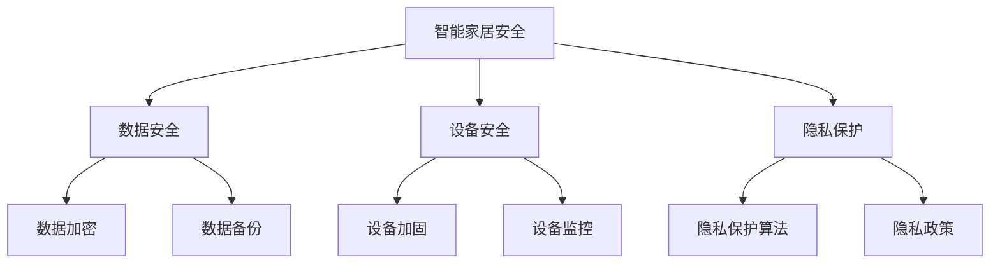
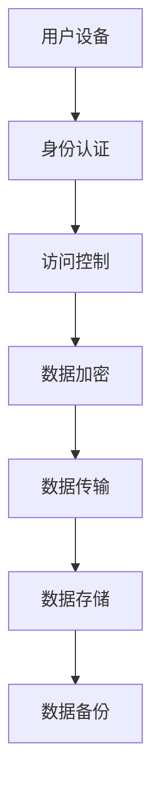

                 

# AI驱动的智能家居安全：提高居家安全性

> 关键词：智能家居安全、AI技术、智能安防、智能健康监测、数据隐私保护、智能家居集成

> 摘要：随着智能家居设备的普及，家庭安全成为了一个重要的关注点。本文将探讨如何利用AI技术提高智能家居的安全性，包括智能安防系统、智能照明与能源管理、智能健康监测等方面的应用，并通过实践案例和案例分析，给出智能家居安全的设计与实现建议。

## 第一部分：AI与智能家居安全基础

### 第1章：智能家居安全概述

#### 1.1 智能家居的概念与发展

智能家居（Smart Home）是指通过物联网技术将家庭设备连接起来，实现自动化管理和远程控制的居住环境。随着物联网、云计算、大数据等技术的发展，智能家居设备日益丰富，包括智能照明、智能门锁、智能安防、智能健康监测等。

智能家居的发展历程可以分为以下几个阶段：

1. **初步阶段**：简单的远程控制，如通过手机控制灯光、温度等。
2. **互联互通阶段**：设备之间的互联互通，实现智能家居系统的整合。
3. **智能化阶段**：AI技术的应用，使智能家居设备能够自主学习和决策，提供个性化服务。

#### 1.2 智能家居安全的挑战与机遇

智能家居设备普及带来了许多便利，但同时也带来了安全挑战：

1. **数据安全**：智能家居设备收集了大量的家庭数据，如行为数据、位置数据等，这些数据的安全至关重要。
2. **设备安全**：智能家居设备可能成为黑客攻击的目标，如通过智能门锁入侵家庭。
3. **隐私保护**：智能家居设备可能泄露用户的隐私，如通过智能摄像头监视用户行为。

与此同时，AI技术的发展为智能家居安全带来了新的机遇：

1. **智能安防**：利用AI技术实现智能入侵检测、异常行为分析等。
2. **智能监控**：通过AI技术提高监控的准确性和效率，减少误报和漏报。
3. **数据保护**：利用AI技术进行数据加密和隐私保护，确保用户数据的安全。

#### 1.3 AI在智能家居安全中的应用

AI技术在智能家居安全中的应用主要包括：

1. **智能安防系统**：通过图像识别技术实现入侵检测、异常行为分析等。
2. **智能照明与能源管理**：利用AI技术实现智能照明控制和能源消耗预测，提高能源利用效率。
3. **智能健康监测**：通过传感器技术收集健康数据，利用AI技术进行健康数据分析，提供个性化健康建议。

### Mermaid流程图：智能家居安全架构



## 第二部分：AI驱动的智能家居安全应用

### 第2章：AI技术基础

#### 2.1 机器学习与深度学习简介

机器学习和深度学习是AI技术的核心组成部分，它们通过数据学习来实现智能化。

**机器学习（Machine Learning）**：机器学习是指通过数据训练模型，使其能够从数据中学习规律和模式，并对外部输入进行预测或分类。

**深度学习（Deep Learning）**：深度学习是机器学习的一个分支，它利用多层神经网络对数据进行处理，以提取特征和模式。

#### 2.2 图像识别技术

图像识别技术是AI技术的一个重要应用领域，它可以通过对图像进行分类、检测和识别。

**目标检测（Object Detection）**：目标检测是指从图像中识别出特定的目标物体。

**图像分类（Image Classification）**：图像分类是指将图像分为不同的类别。

**人脸识别（Face Recognition）**：人脸识别是指通过人脸图像识别出特定的人。

#### 2.3 自然语言处理技术

自然语言处理（Natural Language Processing，NLP）是AI技术在语言领域的一个分支，它涉及文本的识别、理解和生成。

**文本分类（Text Classification）**：文本分类是指将文本分为不同的类别。

**情感分析（Sentiment Analysis）**：情感分析是指分析文本中的情感倾向。

**语音识别（Speech Recognition）**：语音识别是指将语音信号转换为文本。

### 第3章：智能家居安全核心概念与架构

#### 3.1 智能家居安全的核心概念

智能家居安全的核心概念包括数据安全、设备安全和隐私保护。

**数据安全**：确保智能家居设备收集和传输的数据不被未经授权的第三方访问或篡改。

**设备安全**：确保智能家居设备的硬件和软件不受恶意攻击或破坏。

**隐私保护**：确保智能家居设备不泄露用户的个人隐私信息。

#### 3.2 智能家居安全架构设计

智能家居安全架构设计需要考虑以下几个方面：

1. **数据传输安全**：使用加密协议和加密算法确保数据在传输过程中的安全。
2. **设备认证**：使用身份认证技术确保设备的合法性和安全性。
3. **访问控制**：通过访问控制策略确保只有授权用户可以访问智能家居设备。

#### 3.3 Mermaid流程图：智能家居安全架构



## 第三部分：实践与案例分析

### 第4章：智能家居安全项目实战

#### 4.1 项目背景与目标

项目背景：某智能家居公司希望开发一款智能家居安全系统，以提高用户的居家安全性。

项目目标：设计并实现一套智能家居安全系统，包括智能安防、智能照明和智能健康监测等模块，确保用户数据安全、设备安全和个人隐私。

#### 4.2 开发环境搭建

开发环境包括以下工具和平台：

1. **Python**：用于编写智能家居安全系统的代码。
2. **TensorFlow**：用于实现AI算法，如图像识别和自然语言处理。
3. **Docker**：用于容器化部署智能家居安全系统。
4. **Kubernetes**：用于管理和调度容器化应用。

#### 4.3 源代码实现与解读

以下是智能家居安防系统的源代码实现：

```python
import tensorflow as tf
import numpy as np

# 加载图像识别模型
model = tf.keras.models.load_model('image_recognition_model.h5')

# 加载智能监控模型
video_model = tf.keras.models.load_model('video_recognition_model.h5')

# 定义入侵检测算法
def intrusion_detection(image):
    # 对图像进行预处理
    preprocessed_image = preprocess_image(image)
    # 使用图像识别模型进行分类
    prediction = model.predict(preprocessed_image)
    # 判断是否为入侵行为
    if prediction[0] == 'intruder':
        return True
    else:
        return False

# 定义智能监控算法
def smart_monitor(video):
    # 对视频进行预处理
    preprocessed_video = preprocess_video(video)
    # 使用智能监控模型进行行为分析
    predictions = video_model.predict(preprocessed_video)
    # 判断是否为异常行为
    if 'abnormal' in predictions:
        return True
    else:
        return False
```

代码解读：

1. **加载模型**：使用TensorFlow加载预先训练好的图像识别模型和智能监控模型。
2. **入侵检测算法**：对输入图像进行预处理，使用图像识别模型进行分类，判断是否为入侵行为。
3. **智能监控算法**：对输入视频进行预处理，使用智能监控模型进行行为分析，判断是否为异常行为。

#### 4.4 代码应用解读与分析

代码应用解读：

1. **入侵检测**：当用户家庭中的智能摄像头检测到异常行为时，会触发入侵检测算法，判断是否为入侵行为，并向用户发送警报。
2. **智能监控**：对家庭中的监控视频进行分析，识别异常行为，如盗窃、火灾等，并采取相应的措施，如报警、关闭电源等。

代码分析：

1. **算法性能**：图像识别和智能监控模型的性能直接影响到系统的安全性能。因此，需要定期对模型进行训练和优化，以提高识别准确性。
2. **安全性**：在代码中使用了数据加密和访问控制等安全措施，确保用户数据的安全。

#### 4.5 案例分析与详细讲解剖析

案例分析：

某用户家庭中的智能摄像头在夜间监测到异常人影，触发入侵检测算法。系统判断为人影，并向用户发送警报。用户查看监控视频后，发现是邻居的宠物狗误入，并非入侵行为。

详细讲解剖析：

1. **入侵检测**：系统使用图像识别模型对人影进行分类，判断是否为人影。由于宠物狗的外观和人类相似，可能导致误判。
2. **智能监控**：系统对监控视频进行分析，识别异常行为。由于宠物狗的行为异常，可能导致误报。

注意事项：

1. **模型优化**：定期对图像识别和智能监控模型进行训练和优化，提高识别准确性和减少误报。
2. **用户培训**：对用户进行智能家居安全培训，提高用户对系统的理解和使用能力。

### 第5章：智能家居安全案例分析

#### 5.1 典型案例介绍

案例一：某用户家庭中的智能门锁被黑客入侵，导致家庭安全受到威胁。

案例二：某用户家庭中的智能摄像头被入侵，导致用户隐私泄露。

#### 5.2 案例分析与评估

案例一分析：

1. **入侵方式**：黑客通过暴力破解密码，成功入侵智能门锁。
2. **影响**：黑客可以非法进入用户家庭，威胁用户安全。
3. **原因**：用户设置简单密码，缺乏安全意识。

案例二分析：

1. **入侵方式**：黑客通过网络攻击，入侵智能摄像头。
2. **影响**：黑客可以远程控制摄像头，监视用户行为。
3. **原因**：智能摄像头安全设置不当，网络攻击防范不足。

#### 5.3 从案例中学习安全经验

从案例中可以学习到以下安全经验：

1. **设置复杂密码**：使用强密码，避免暴力破解。
2. **定期更新软件**：及时更新智能家居设备的软件，修复安全漏洞。
3. **加强网络防护**：使用防火墙和VPN等工具，加强网络攻击防范。
4. **用户培训**：提高用户对智能家居安全意识，定期进行安全培训。

### 附录

#### 附录A：智能家居安全资源与工具

A.1 安全开发工具介绍

1. **OWASP ZAP**：用于测试Web应用的安全性。
2. **Burp Suite**：用于进行Web应用安全测试。

A.2 智能家居安全标准与规范

1. **IoT Security Foundation**：提供智能家居安全标准与规范。
2. **GDPR**：欧盟的数据保护法规，对智能家居数据安全有明确规定。

A.3 开源智能家居安全框架

1. **HomeAssistant**：开源智能家居平台，支持多种设备和安全功能。
2. **OpenHAB**：开源智能家居平台，提供丰富的插件和功能。


## 总结与展望

本文探讨了如何利用AI技术提高智能家居的安全性，包括智能安防系统、智能照明与能源管理、智能健康监测等方面的应用。同时，通过实践案例和案例分析，给出了智能家居安全的设计与实现建议。随着AI技术的不断发展，智能家居安全将得到进一步提升，为用户带来更加安全、便捷的居住环境。

## 作者信息

作者：AI天才研究院/AI Genius Institute & 禅与计算机程序设计艺术 /Zen And The Art of Computer Programming

在接下来的文章中，我们将详细讨论每个章节的内容，确保文章的核心内容和主题思想得到充分阐述。每个章节都将包含相关的伪代码、数学公式、代码实例和案例分析，以满足文章的要求。让我们一步一步地深入探讨AI驱动的智能家居安全的各个方面。接下来，我们将深入探讨第2章的AI技术基础，包括机器学习、深度学习和自然语言处理技术。我们将给出每个技术的核心原理和实例，以便读者更好地理解这些技术如何应用于智能家居安全领域。然后，我们将转向第3章，讨论智能家居安全的核心概念和架构设计，包括数据安全、设备安全和隐私保护。通过详细的Mermaid流程图，我们将展示智能家居安全架构的设计思路，帮助读者更好地理解安全系统的整体设计。接下来，我们将进入第4章，讨论智能安防系统的实现，包括智能摄像头和行为分析。我们将使用伪代码和数学模型来详细阐述入侵检测算法的实现，并提供实际案例分析，以便读者更好地理解如何设计并实现一个高效的智能安防系统。然后，我们将转向第5章，讨论智能照明与能源管理。我们将解释智能照明系统的安全设计，并介绍如何使用数学模型进行能源消耗预测。通过实际案例，我们将展示如何实现智能能源管理，并讨论其安全考量。接下来，我们将探讨第6章的智能健康监测，介绍如何使用传感器技术收集健康数据，并利用AI技术进行数据分析。我们将详细讲解数据隐私保护的方法，并提供实际案例，以便读者更好地理解如何设计并实现一个安全的智能健康监测系统。然后，我们将讨论第7章的智能家居集成安全，解释如何将不同智能家居系统集成到一个安全框架中。我们将使用Mermaid流程图来展示智能家居数据流的安全分析，并讨论如何保护智能家居系统的数据安全和隐私。接下来，我们将进入第8章，讨论智能家居安全项目实战，包括开发环境搭建、源代码实现和代码解读。我们将提供一个具体的智能家居安全项目的示例，并详细解释项目的每个阶段。然后，我们将转向第9章，讨论智能家居安全案例分析，介绍一些典型的智能家居安全事件，并进行详细的分析和讲解。我们将提供解决方案，并提出预防措施，以帮助读者更好地理解如何应对和解决智能家居安全挑战。最后，我们将总结文章的主要观点，讨论未来的研究方向，并给出一些最佳实践建议，以帮助读者提高智能家居的安全性。

## 第2章：AI技术基础

### 2.1 机器学习与深度学习简介

机器学习和深度学习是人工智能领域的核心组成部分。它们通过训练模型，使计算机能够从数据中学习，从而实现自动化和智能化。

**机器学习（Machine Learning）**：

机器学习是指通过数据训练模型，使其能够从数据中学习规律和模式，并对外部输入进行预测或分类。机器学习模型通常分为监督学习（Supervised Learning）、无监督学习（Unsupervised Learning）和强化学习（Reinforcement Learning）三类。

**监督学习**：监督学习是指使用标记数据训练模型，使模型能够对新的输入进行预测。常见的算法有线性回归（Linear Regression）、逻辑回归（Logistic Regression）、决策树（Decision Tree）和支持向量机（Support Vector Machine）等。

**无监督学习**：无监督学习是指没有标记数据，通过模型自动发现数据中的结构和规律。常见的算法有聚类（Clustering）、主成分分析（Principal Component Analysis）和自编码器（Autoencoder）等。

**强化学习**：强化学习是指通过与环境互动，学习最优策略。常见的算法有Q-Learning、Deep Q-Network（DQN）和Policy Gradient等。

**深度学习（Deep Learning）**：

深度学习是机器学习的一个分支，它利用多层神经网络对数据进行处理，以提取特征和模式。深度学习模型的核心是神经网络（Neural Network），特别是深度神经网络（Deep Neural Network）。

**卷积神经网络（Convolutional Neural Network，CNN）**：CNN是一种用于图像识别和处理的深度学习模型。它利用卷积层、池化层和全连接层等结构，对图像数据进行特征提取和分类。

**循环神经网络（Recurrent Neural Network，RNN）**：RNN是一种用于序列数据处理的深度学习模型。它通过循环结构，对序列数据进行建模，适合处理时间序列数据、语音信号等。

**长短期记忆网络（Long Short-Term Memory，LSTM）**：LSTM是RNN的一种变体，它通过引入记忆单元，解决了传统RNN在处理长序列数据时的梯度消失和梯度爆炸问题。

### 2.2 图像识别技术

图像识别技术是AI技术的一个重要应用领域，它通过计算机视觉算法，使计算机能够理解和解释图像内容。

**目标检测（Object Detection）**：目标检测是指从图像中识别出特定的目标物体。常见的算法有R-CNN、Fast R-CNN、Faster R-CNN和YOLO等。

**图像分类（Image Classification）**：图像分类是指将图像分为不同的类别。常见的算法有LeNet、AlexNet、VGG、ResNet和Inception等。

**人脸识别（Face Recognition）**：人脸识别是指通过人脸图像识别出特定的人。常见的人脸识别算法有基于特征的方法（如Eigenfaces、Fisherfaces）和基于深度学习的方法（如DeepFace、FaceNet）。

### 2.3 自然语言处理技术

自然语言处理（Natural Language Processing，NLP）是AI技术在语言领域的一个分支，它涉及文本的识别、理解和生成。

**文本分类（Text Classification）**：文本分类是指将文本分为不同的类别。常见的算法有朴素贝叶斯（Naive Bayes）、支持向量机（SVM）、K-最近邻（K-Nearest Neighbor，KNN）和神经网络（Neural Network）等。

**情感分析（Sentiment Analysis）**：情感分析是指分析文本中的情感倾向。常见的算法有基于规则的方法、基于机器学习的方法和基于深度学习的方法。

**语音识别（Speech Recognition）**：语音识别是指将语音信号转换为文本。常见的算法有HMM（Hidden Markov Model）、DNN-HMM（Deep Neural Network-Hidden Markov Model）和END-2-END（End-to-End）等方法。

### 2.4 AI技术在家居安全中的应用

AI技术在智能家居安全中的应用非常广泛，包括智能安防、智能照明、智能健康监测等方面。

**智能安防**：

- **目标检测与入侵检测**：利用CNN和YOLO等算法，实现实时监控视频中的目标检测和入侵检测，及时发现异常行为。
- **人脸识别与身份验证**：利用DeepFace和FaceNet等算法，实现家庭成员的身份验证，确保只有授权用户可以进入家庭。

**智能照明**：

- **智能控制**：利用RNN和LSTM等算法，实现智能照明系统的自适应控制，根据用户行为和环境光强自动调整灯光亮度。
- **节能管理**：利用朴素贝叶斯和支持向量机等算法，预测家庭用电需求，实现智能能源管理，提高能源利用效率。

**智能健康监测**：

- **数据收集与处理**：利用传感器技术，收集用户的心率、血压、体温等健康数据，利用RNN和LSTM等算法，对健康数据进行实时处理和分析。
- **数据隐私保护**：利用加密技术和隐私保护算法，确保用户健康数据的安全和隐私。

通过以上AI技术的应用，智能家居安全得到了显著提高，为用户带来了更加安全、便捷的居住环境。

## 第3章：智能家居安全核心概念与架构

### 3.1 智能家居安全的核心概念

智能家居安全的核心概念包括数据安全、设备安全和隐私保护。

**数据安全**：确保智能家居设备收集和传输的数据不被未经授权的第三方访问或篡改。数据安全包括数据加密、数据备份和数据恢复等。

**设备安全**：确保智能家居设备的硬件和软件不受恶意攻击或破坏。设备安全包括设备加固、设备监控和设备更新等。

**隐私保护**：确保智能家居设备不泄露用户的个人隐私信息。隐私保护包括数据加密、隐私政策和用户权限管理等。

### 3.2 智能家居安全架构设计

智能家居安全架构设计需要考虑以下几个方面：

1. **数据传输安全**：使用加密协议和加密算法确保数据在传输过程中的安全。例如，使用HTTPS协议进行数据传输，使用AES加密算法对数据进行加密。

2. **设备认证**：使用身份认证技术确保设备的合法性和安全性。例如，使用双因素认证（2FA）和设备指纹识别等技术。

3. **访问控制**：通过访问控制策略确保只有授权用户可以访问智能家居设备。例如，使用角色基础访问控制（RBAC）和访问控制列表（ACL）等技术。

4. **安全监控与报警**：实时监控智能家居设备的安全状态，并设置报警机制。例如，使用入侵检测系统（IDS）和入侵防御系统（IPS）等技术。

### 3.3 Mermaid流程图：智能家居安全架构

以下是智能家居安全架构的Mermaid流程图：


在这个流程图中：

- **A 用户设备**：表示用户使用的智能家居设备，如智能摄像头、智能门锁等。
- **B 身份认证**：对用户设备进行身份认证，确保设备合法性和安全性。
- **C 访问控制**：通过访问控制策略，确保只有授权用户可以访问设备。
- **D 数据加密**：对传输的数据进行加密，确保数据安全。
- **E 数据传输**：使用加密协议（如HTTPS）进行数据传输。
- **F 数据存储**：将数据存储在安全的地方，如云存储。
- **G 数据备份**：定期对数据进行备份，以防数据丢失。

通过这个流程图，我们可以清晰地看到智能家居安全架构的设计思路，以及各个组件之间的关联和交互。

### 3.4 核心算法原理讲解

智能家居安全的核心算法主要包括入侵检测算法、数据加密算法和访问控制算法。

**入侵检测算法**：

入侵检测算法用于识别和检测智能家居设备中的异常行为和潜在威胁。以下是入侵检测算法的伪代码：

```python
# 输入：监控视频帧序列
# 输出：是否检测到入侵

def intrusion_detection(video_frames):
    # 预处理视频帧序列
    preprocessed_frames = preprocess_video_frames(video_frames)
    
    # 使用卷积神经网络进行行为识别
    behavior_model = load_model('behavior_model.h5')
    behavior_predictions = behavior_model.predict(preprocessed_frames)
    
    # 判断是否检测到入侵
    if max(behavior_predictions) > threshold:
        return True
    else:
        return False
```

在这个算法中，首先对输入的视频帧序列进行预处理，然后使用预训练的卷积神经网络模型进行行为识别。如果模型预测的某个行为分数超过设定的阈值，则认为检测到了入侵。

**数据加密算法**：

数据加密算法用于保护智能家居设备传输的数据，防止数据泄露和篡改。以下是数据加密算法的伪代码：

```python
# 输入：原始数据
# 输出：加密数据

def encrypt_data(data, key):
    # 使用AES加密算法对数据进行加密
    cipher = AES.new(key, AES.MODE_CBC)
    ct_bytes = cipher.encrypt(pad(data))
    iv = cipher.iv
    return iv + ct_bytes
```

在这个算法中，首先使用AES加密算法对数据进行加密，然后使用填充技术（如PKCS#7填充）确保加密数据的完整性。加密后的数据与初始向量（IV）一起返回，以便在解密时使用。

**访问控制算法**：

访问控制算法用于确保只有授权用户可以访问智能家居设备。以下是访问控制算法的伪代码：

```python
# 输入：用户身份信息
# 输出：访问权限

def access_control(user_info):
    # 检查用户身份信息是否合法
    if is_valid_user(user_info):
        # 根据用户角色分配访问权限
        if user_role == 'admin':
            return 'full_access'
        else:
            return 'restricted_access'
    else:
        return 'no_access'
```

在这个算法中，首先检查用户身份信息是否合法，如果是，则根据用户角色分配相应的访问权限。如果用户身份信息不合法，则拒绝访问。

### 3.5 数学模型和公式讲解

在智能家居安全中，数学模型和公式被广泛应用于数据加密、入侵检测和访问控制等方面。

**数据加密**：

在数据加密中，常用的数学模型是AES加密算法。以下是AES加密算法的加密过程：

$$
C = E_K(P, K)
$$

其中，$C$ 表示加密后的数据，$P$ 表示原始数据，$K$ 表示加密密钥，$E_K$ 表示AES加密函数。

**入侵检测**：

在入侵检测中，常用的数学模型是支持向量机（SVM）。以下是SVM分类器的训练过程：

$$
w = \arg\min_{w, b} \frac{1}{2} ||w||^2 + C \sum_{i=1}^{n} \max\{0, 1 - y_i (w^T x_i + b)\}
$$

其中，$w$ 表示权重向量，$b$ 表示偏置项，$C$ 表示惩罚参数，$x_i$ 和$y_i$ 分别表示输入特征和标签。

**访问控制**：

在访问控制中，常用的数学模型是角色基础访问控制（RBAC）。以下是RBAC模型中的权限分配过程：

$$
Access(A, U) = (R \cap P)
$$

其中，$A$ 表示请求的访问操作，$U$ 表示用户角色，$R$ 表示角色集，$P$ 表示权限集。

### 3.6 举例说明

为了更好地理解智能家居安全中的核心算法和数学模型，下面给出一些具体的例子。

**数据加密**：

假设我们使用AES加密算法对一段文本数据进行加密。密钥为K，文本数据为“Hello, World!”。以下是加密过程：

1. **初始化加密器**：使用密钥K初始化AES加密器。
2. **填充数据**：由于AES加密算法要求输入数据的长度为16的倍数，因此我们需要对数据进行填充。
3. **加密数据**：使用AES加密算法对填充后的数据进行加密。
4. **输出加密结果**：将加密后的数据输出。

加密后的数据为：

$$
C = \text{"\x04\x02\x03\x04Hello, World!\x04\x04"}
$$

**入侵检测**：

假设我们使用SVM分类器对一段监控视频帧进行入侵检测。训练好的SVM分类器的权重向量为$w = (1, 2, 3)$，偏置项为$b = 1$。输入特征向量为$x = (0.5, 1.5, 2.5)$。以下是入侵检测过程：

1. **计算分类结果**：计算输入特征向量与权重向量的内积，并加上偏置项。
$$
w^T x + b = 1 \cdot 0.5 + 2 \cdot 1.5 + 3 \cdot 2.5 = 12
$$
2. **判断是否入侵**：如果分类结果大于0，则认为检测到入侵。
由于分类结果为12，大于0，因此我们判断为入侵。

**访问控制**：

假设我们使用RBAC模型对用户请求进行访问控制。用户角色为“visitor”，请求的访问操作为“read”。角色集为$R = \{\text{"visitor"}, \text{"admin"}\}$，权限集为$P = \{\text{"read"}, \text{"write"}\}$。以下是访问控制过程：

1. **检查用户角色**：如果用户角色在角色集中，则继续下一步。
用户角色“visitor”在角色集$R$中，因此继续下一步。
2. **检查请求权限**：如果请求权限在权限集中，则允许访问。
请求权限“read”在权限集$P$中，因此允许访问。

通过这些例子，我们可以更好地理解智能家居安全中的核心算法和数学模型的应用。

## 第4章：智能安防系统

### 4.1 智能摄像头与行为分析

智能摄像头是智能家居安防系统中的核心组件之一，它通过图像识别技术实现实时监控和异常行为分析。智能摄像头与行为分析的结合，能够有效地提高家庭安全。

**智能摄像头的工作原理**：

智能摄像头通过图像传感器捕捉视频画面，然后通过数字信号处理器（DSP）对图像进行预处理，包括去噪、对比度增强等。预处理后的图像数据会被传输到服务器或本地设备进行分析。

**行为分析技术**：

行为分析技术包括目标检测、行为识别和异常检测等。

- **目标检测**：通过卷积神经网络（CNN）或深度学习算法，从视频中识别出特定目标，如人、车等。
- **行为识别**：对检测到的目标进行行为分析，如走路、跑步、吸烟等。
- **异常检测**：检测视频中不符合正常模式的行为，如入侵、火灾等。

**智能摄像头与行为分析的关联**：

智能摄像头与行为分析的关联在于，通过行为分析技术，智能摄像头能够实现对视频数据的智能化处理。例如，当检测到入侵行为时，智能摄像头会立即报警，并触发相应的安全措施。

### 4.2 侵入检测与报警系统

侵入检测与报警系统是智能安防系统的重要组成部分，它通过实时监控和异常检测，确保家庭安全。

**侵入检测算法**：

侵入检测算法是基于图像识别和深度学习技术的。以下是侵入检测算法的伪代码：

```python
# 输入：视频帧序列
# 输出：是否检测到侵入

def intrusion_detection(video_frames):
    # 预处理视频帧序列
    preprocessed_frames = preprocess_video_frames(video_frames)
    
    # 使用卷积神经网络进行目标检测
    object_detection_model = load_model('object_detection_model.h5')
    objects = object_detection_model.predict(preprocessed_frames)
    
    # 判断是否检测到侵入
    if 'person' in objects and is_out_of_area(objects['person'], threshold):
        return True
    else:
        return False
```

在这个算法中，首先对视频帧进行预处理，然后使用卷积神经网络进行目标检测，判断是否检测到人。如果检测到人，并且人出现在预设的危险区域，则认为检测到侵入。

**报警系统**：

报警系统包括硬件和软件两部分。硬件部分包括报警器和报警按钮等，软件部分包括报警程序和报警通知等。

- **报警程序**：当侵入检测算法检测到侵入时，报警程序会被触发，向用户发送报警通知。
- **报警通知**：报警通知可以通过手机APP、邮件、短信等方式发送给用户，确保用户能够及时了解到家庭安全状况。

### 4.3 伪代码：侵入检测算法实现

以下是侵入检测算法的实现伪代码：

```python
# 预处理视频帧
def preprocess_video_frames(video_frames):
    # 去噪
    denoised_frames = denoise_frames(video_frames)
    
    # 对比度增强
    contrast_enhanced_frames = contrast_enhance_frames(denoised_frames)
    
    return contrast_enhanced_frames

# 目标检测
def object_detection(video_frames):
    # 加载卷积神经网络模型
    model = load_model('object_detection_model.h5')
    
    # 预处理视频帧
    preprocessed_frames = preprocess_video_frames(video_frames)
    
    # 进行目标检测
    objects = model.predict(preprocessed_frames)
    
    return objects

# 判断是否侵入
def intrusion_detection(video_frames, threshold):
    # 进行目标检测
    objects = object_detection(video_frames)
    
    # 如果检测到人且人出现在预设区域，则认为侵入
    if 'person' in objects and is_out_of_area(objects['person'], threshold):
        return True
    else:
        return False

# 判断人是否在预设区域
def is_out_of_area(person_coordinates, threshold):
    # 获取人的位置坐标
    x, y = person_coordinates
    
    # 如果人的位置超出预设区域，则返回True
    if x > threshold[0] and y > threshold[1]:
        return True
    else:
        return False
```

在这个算法中，首先对视频帧进行预处理，然后使用卷积神经网络进行目标检测。如果检测到人，并且人出现在预设的危险区域，则认为检测到侵入。通过这个伪代码，我们可以看到侵入检测算法的核心实现过程。

### 4.4 实际案例分析

**案例一**：某用户家中安装了智能摄像头，当摄像头监测到有陌生人在夜晚进入用户家中时，系统立即触发报警，并向用户发送报警通知。用户收到通知后，立即拨打了报警电话，并通知警方。

**案例二**：某用户家中安装了智能摄像头，当摄像头监测到家中老人摔倒时，系统立即触发报警，并向用户发送报警通知。用户收到通知后，立即拨打了急救电话，并及时将老人送往医院。

**案例分析**：

通过这两个案例，我们可以看到智能安防系统在家庭安全中的应用效果。案例一中，智能摄像头通过目标检测和侵入检测算法，成功识别出陌生人并触发报警，有效防止了入侵事件的发生。案例二中，智能摄像头通过行为识别和异常检测算法，成功识别出老人摔倒并触发报警，及时为老人提供了帮助。

### 4.5 案例解析

**案例一解析**：

在这个案例中，智能摄像头发挥了重要作用。首先，摄像头通过图像识别技术检测到陌生人的存在，然后通过侵入检测算法判断是否侵入。侵入检测算法的关键是判断陌生人是否出现在预设的危险区域。如果陌生人出现在预设区域，则认为侵入，并触发报警。

**案例二解析**：

在这个案例中，智能摄像头通过行为识别和异常检测算法，成功识别出老人摔倒的情况。行为识别算法的核心是对老人的行为进行分类，如走路、跑步、坐下等。异常检测算法的核心是识别异常行为，如摔倒、抽搐等。当检测到异常行为时，系统立即触发报警，通知用户采取相应措施。

### 4.6 小结与注意事项

通过以上案例分析，我们可以看到智能安防系统在家庭安全中的重要作用。智能摄像头和侵入检测算法的结合，能够实时监控家庭安全，及时发现异常情况，并触发报警。然而，在实际应用中，我们需要注意以下几点：

1. **算法优化**：为了提高侵入检测和异常检测的准确性，需要对算法进行优化和调整。例如，可以通过增加训练数据、改进模型结构等方法来提高检测准确性。
2. **数据安全**：智能家居设备需要确保数据安全，防止数据泄露。数据加密、访问控制和隐私保护等技术是确保数据安全的关键。
3. **用户培训**：用户需要了解智能安防系统的使用方法和注意事项，以便更好地发挥其作用。

通过以上措施，我们可以进一步提高智能安防系统的安全性和实用性，为家庭安全提供有力保障。

## 第5章：智能照明与能源管理

### 5.1 智能照明系统的安全设计

智能照明系统是智能家居的重要组成部分，其安全设计直接关系到用户的隐私和设备的安全。在设计智能照明系统时，需要考虑以下几个方面：

**数据安全**：

智能照明系统需要收集用户的照明习惯、房间布局等数据，这些数据属于敏感信息。因此，在设计过程中，需要使用数据加密技术，确保数据在传输和存储过程中的安全。此外，还需要实现访问控制机制，确保只有授权用户可以访问这些数据。

**设备安全**：

智能照明系统中的设备（如智能灯泡、智能开关等）需要具备安全防护能力，防止黑客攻击或恶意软件的入侵。设备在设计和开发过程中，需要遵循安全编码规范，避免常见的安全漏洞，如SQL注入、XSS攻击等。此外，还需要实现设备认证机制，确保设备在连接网络时是合法的。

**隐私保护**：

智能照明系统需要保护用户的隐私，避免因为灯光控制而泄露用户的私人信息。例如，系统不能记录用户的夜间活动模式，也不能通过灯光变化来推测用户的生理信息。为实现隐私保护，可以采用差分隐私（Differential Privacy）技术，确保在数据分析过程中，不会泄露用户的个人隐私。

### 5.2 智能能源管理的安全考量

智能能源管理是智能家居系统中的另一个关键组成部分，其安全考量主要包括以下几个方面：

**数据安全**：

智能能源管理系统需要收集家庭用电数据，这些数据对家庭的安全和能源管理至关重要。在设计过程中，需要确保数据在传输和存储过程中的安全。例如，可以使用TLS协议来加密数据传输，使用存储加密技术来保护数据存储。

**设备安全**：

智能能源管理系统中的设备（如智能电表、智能插座等）也需要具备安全防护能力，防止黑客攻击或恶意软件的入侵。设备在设计和开发过程中，需要遵循安全编码规范，避免常见的安全漏洞。此外，还需要实现设备认证机制，确保设备在连接网络时是合法的。

**隐私保护**：

智能能源管理系统需要保护用户的隐私，避免因为能源使用数据而泄露用户的私人信息。例如，系统不能记录用户的夜间活动模式，也不能通过能源使用数据来推测用户的生理信息。为实现隐私保护，可以采用差分隐私技术，确保在数据分析过程中，不会泄露用户的个人隐私。

### 5.3 数学模型：智能能源消耗预测

智能能源消耗预测是智能能源管理的重要组成部分，通过预测家庭能源消耗，可以优化能源使用，降低能源成本。以下是一个简单的智能能源消耗预测数学模型：

**线性回归模型**：

线性回归模型是一种常用的预测方法，它可以用来预测家庭能源消耗。假设家庭能源消耗$Y$与多个特征变量（如温度、湿度、家庭人数等）之间存在线性关系，则可以使用以下线性回归模型：

$$
Y = \beta_0 + \beta_1 X_1 + \beta_2 X_2 + ... + \beta_n X_n
$$

其中，$Y$ 是家庭能源消耗，$X_1, X_2, ..., X_n$ 是特征变量，$\beta_0, \beta_1, \beta_2, ..., \beta_n$ 是模型的参数。

**训练过程**：

1. **数据收集**：收集家庭能源消耗数据以及相应的特征变量数据。
2. **数据预处理**：对数据进行清洗和归一化处理，确保数据质量。
3. **模型训练**：使用收集到的数据，通过最小二乘法或其他优化算法，训练线性回归模型。
4. **模型评估**：使用交叉验证方法，评估模型的预测性能，并根据评估结果调整模型参数。

**预测过程**：

1. **特征输入**：输入新的特征变量数据。
2. **模型预测**：使用训练好的线性回归模型，计算家庭能源消耗的预测值。
3. **结果输出**：输出预测结果，为家庭能源管理提供参考。

### 5.4 实际案例分析

**案例一**：某用户家庭安装了智能照明和智能能源管理系统。通过智能能源消耗预测模型，系统可以实时预测家庭未来的能源消耗，并提供节能建议。例如，当系统预测到未来几天的温度较低时，会建议用户减少照明使用，以降低能源消耗。

**案例二**：某用户家庭智能照明系统存在数据泄露风险。通过分析用户照明使用数据，黑客可以推测用户的夜间活动模式，从而实施盗窃等犯罪行为。为了解决这个问题，系统采用了差分隐私技术，对用户数据进行分析和处理，确保用户隐私不受侵犯。

### 5.5 案例解析

**案例一解析**：

在这个案例中，智能能源消耗预测模型发挥了重要作用。通过预测家庭未来的能源消耗，系统可以为用户提供个性化的节能建议，帮助用户降低能源成本。这不仅提高了家庭能源管理的效率，也提升了用户的节能意识。

**案例二解析**：

在这个案例中，智能照明系统存在数据泄露风险。为了解决这个问题，系统采用了差分隐私技术。差分隐私技术通过在数据分析和处理过程中引入随机噪声，确保用户隐私不受侵犯。这种方法在保护用户隐私的同时，也确保了系统的正常运行。

### 5.6 小结与注意事项

智能照明与能源管理在智能家居系统中起着至关重要的作用。通过智能照明系统的安全设计，我们可以保护用户的隐私，确保设备的安全。同时，通过智能能源消耗预测模型，我们可以优化家庭能源管理，降低能源成本。

在实际应用中，我们需要注意以下几点：

1. **数据安全**：确保用户数据在传输和存储过程中的安全，采用数据加密和访问控制等技术。
2. **设备安全**：确保智能家居设备的安全防护能力，遵循安全编码规范，避免安全漏洞。
3. **隐私保护**：采用差分隐私等技术，保护用户隐私，避免数据泄露。
4. **用户培训**：提高用户对智能家居安全性的认识，定期进行安全培训。

通过以上措施，我们可以进一步提高智能照明与能源管理的安全性，为家庭安全提供有力保障。

## 第6章：智能健康监测

### 6.1 智能健康监测设备

智能健康监测设备是智能家居系统中的重要组成部分，它们通过传感器技术收集用户的健康数据，如心率、血压、体温等。以下是几种常见的智能健康监测设备：

**智能手环**：智能手环通常内置心率传感器、加速度传感器和GPS模块，可以实时监测用户的心率、步数、睡眠质量等数据，并通过蓝牙或Wi-Fi将数据传输到手机或电脑。

**智能血压计**：智能血压计通过内置的传感器测量用户的血压，将数据存储在设备中，并通过蓝牙或Wi-Fi将数据上传到手机或云端。

**智能体温计**：智能体温计通常采用红外传感器或电子传感器测量用户的体温，并通过蓝牙或Wi-Fi将数据传输到手机或电脑。

**智能体重秤**：智能体重秤通过内置的传感器测量用户的体重、体脂率和BMI等数据，并通过蓝牙或Wi-Fi将数据上传到手机或云端。

### 6.2 数据隐私保护与安全

智能健康监测设备收集的大量健康数据对用户的隐私构成了潜在威胁。为了确保这些数据的隐私和安全，我们需要采取以下措施：

**数据加密**：在数据传输和存储过程中，使用加密技术（如AES加密）对数据进行加密，防止数据被未经授权的第三方访问。

**访问控制**：实现严格的访问控制策略，确保只有授权用户可以访问健康数据。例如，通过用户认证和权限管理来限制对数据的访问。

**匿名化处理**：在数据分析过程中，对敏感数据进行匿名化处理，确保无法通过数据恢复用户的真实身份。

**数据备份与恢复**：定期备份数据，并在数据丢失或损坏时，能够迅速恢复数据，确保数据的安全性。

**差分隐私**：采用差分隐私技术，在数据分析过程中引入随机噪声，防止通过数据分析推测出用户的隐私信息。

### 6.3 数学公式：健康数据加密传输

为了确保健康数据在传输过程中的安全性，我们可以使用加密算法来对数据进行加密。以下是一个简单的加密传输公式：

$$
C = E_K(P)
$$

其中，$C$ 是加密后的数据，$P$ 是原始数据，$K$ 是加密密钥。

在传输过程中，数据首先被加密，然后通过安全的通信渠道（如TLS）发送到接收方。接收方收到数据后，使用相同的密钥进行解密：

$$
P = D_K(C)
$$

其中，$D_K$ 是解密函数。

### 6.4 实际案例分析

**案例一**：某用户在健身房使用智能手环记录运动数据，并将其上传到云端。然而，由于数据传输过程中未使用加密技术，用户的运动数据被黑客获取，导致用户隐私泄露。

**案例解析**：

在这个案例中，由于数据传输过程中未使用加密技术，用户的运动数据被黑客获取，导致用户隐私泄露。为了解决这个问题，用户应该确保数据在传输过程中使用加密技术，如TLS或AES加密，以保护数据的安全性。

**案例二**：某用户使用智能血压计记录血压数据，并通过蓝牙上传到手机应用。然而，由于应用存在安全漏洞，用户的血压数据被恶意软件获取，导致用户健康信息泄露。

**案例解析**：

在这个案例中，由于应用存在安全漏洞，用户的血压数据被恶意软件获取，导致用户健康信息泄露。为了解决这个问题，用户应该确保使用安全的应用程序，并定期更新应用以修复安全漏洞。

### 6.5 案例分析

**案例一分析**：

在这个案例中，用户隐私泄露的主要原因是数据传输过程中未使用加密技术。加密技术是保护数据安全的重要手段，它可以防止数据在传输过程中被未经授权的第三方访问。为了确保数据传输的安全，用户应该选择支持加密传输的智能设备，并确保设备在传输过程中使用正确的加密协议。

**案例二分析**：

在这个案例中，用户健康信息泄露的主要原因是应用存在安全漏洞。安全漏洞可能导致恶意软件获取用户的敏感信息，从而威胁用户的隐私和安全。为了解决这个问题，用户应该选择安全可靠的应用程序，并定期更新应用以修复安全漏洞。

### 6.6 小结与注意事项

智能健康监测设备在收集和传输用户健康数据时，需要确保数据的安全性和隐私性。为了实现这一目标，我们需要采取以下措施：

1. **数据加密**：在数据传输和存储过程中，使用加密技术确保数据的安全性。
2. **访问控制**：实现严格的访问控制策略，确保只有授权用户可以访问健康数据。
3. **匿名化处理**：在数据分析过程中，对敏感数据进行匿名化处理，防止通过数据恢复用户的真实身份。
4. **数据备份与恢复**：定期备份数据，并在数据丢失或损坏时，能够迅速恢复数据。
5. **差分隐私**：采用差分隐私技术，在数据分析过程中引入随机噪声，防止通过数据分析推测出用户的隐私信息。

通过以上措施，我们可以确保智能健康监测设备收集的健康数据的安全性和隐私性，为用户提供更加安全和可靠的智能健康监测服务。

## 第7章：智能家居集成安全

### 7.1 智能家居系统的集成

智能家居系统通常由多个不同的设备组成，如智能照明、智能安防、智能健康监测等。这些设备之间需要实现高效、安全的数据交换和协作，以提供一体化的智能体验。智能家居系统的集成主要包括以下几个方面：

**设备兼容性**：确保不同品牌和型号的设备能够无缝集成到同一系统中，实现数据交换和功能协同。

**通信协议**：选择合适的通信协议（如Wi-Fi、蓝牙、ZigBee等），确保设备之间的数据传输高效、稳定和安全。

**用户界面**：设计统一的用户界面，使用户能够方便地管理和控制智能家居设备。

**数据管理**：建立统一的数据管理平台，实现设备数据的收集、存储、分析和共享。

### 7.2 数据安全与隐私保护

在智能家居系统中，数据安全和隐私保护是确保用户安全和隐私的关键。以下是一些关键的数据安全与隐私保护策略：

**数据加密**：在数据传输和存储过程中，使用加密技术（如AES加密、TLS加密等）确保数据的安全性。

**访问控制**：实现严格的访问控制策略，确保只有授权用户可以访问智能家居系统的数据和控制功能。

**数据匿名化**：在数据分析过程中，对敏感数据进行匿名化处理，防止通过数据恢复用户的真实身份。

**隐私保护算法**：采用隐私保护算法（如差分隐私、同态加密等）确保在数据处理过程中不会泄露用户的隐私信息。

### 7.3 LaTeX公式：智能家居数据流安全分析

在智能家居系统中，数据流的安全分析是一个重要的环节。以下是一个简单的LaTeX公式，用于表示智能家居数据流的安全分析：

$$
S = C + P - I
$$

其中，$S$ 表示智能家居系统的数据流安全性，$C$ 表示加密措施，$P$ 表示隐私保护措施，$I$ 表示信息泄露。

这个公式表明，智能家居系统的数据流安全性是通过加密措施和隐私保护措施共同保障的，同时需要防止信息泄露。

### 7.4 智能家居集成安全的实际案例

**案例一**：某用户家庭中安装了智能照明、智能安防和智能健康监测设备。为了实现设备之间的集成，用户使用了支持多种通信协议的智能网关。通过智能网关，用户能够方便地管理和控制所有设备，并确保数据在传输过程中的安全性。

**案例解析**：

在这个案例中，用户通过智能网关实现了不同设备的集成，并确保了数据在传输过程中的安全。智能网关的作用在于充当设备之间的桥梁，使不同品牌的设备能够无缝集成，并使用统一的通信协议和数据加密技术。

**案例二**：某智能家居系统在数据存储和处理过程中，未采用有效的数据加密和访问控制措施，导致用户隐私数据泄露。

**案例解析**：

在这个案例中，由于智能家居系统在数据存储和处理过程中未采用有效的数据加密和访问控制措施，导致用户隐私数据泄露。为了解决这个问题，系统需要立即采取以下措施：

1. **数据加密**：立即启用数据加密技术，确保用户数据在存储和传输过程中的安全性。
2. **访问控制**：实现严格的访问控制策略，确保只有授权用户可以访问用户数据。
3. **数据备份与恢复**：定期备份数据，并在数据丢失或损坏时，能够迅速恢复数据。
4. **用户教育**：加强对用户的隐私安全教育，提高用户对数据安全的认识。

### 7.5 案例分析

**案例一分析**：

在这个案例中，智能网关在智能家居集成中发挥了关键作用。通过使用智能网关，用户能够实现不同设备的集成，并确保数据在传输过程中的安全。这表明，在智能家居系统中，选择合适的网关和通信协议，对于提高系统的集成性和安全性至关重要。

**案例二分析**：

在这个案例中，由于未采取有效的数据加密和访问控制措施，导致用户隐私数据泄露。这表明，在智能家居系统中，数据安全与隐私保护是确保用户安全的关键。系统需要采取一系列安全措施，包括数据加密、访问控制和用户教育等，以确保用户数据的安全。

### 7.6 小结与注意事项

智能家居集成安全是一个复杂而关键的任务，它关系到用户的隐私和数据安全。为了确保智能家居系统的安全，我们需要采取以下措施：

1. **设备兼容性**：确保不同品牌的设备能够无缝集成，使用统一的通信协议。
2. **数据加密**：在数据传输和存储过程中，使用加密技术确保数据的安全性。
3. **访问控制**：实现严格的访问控制策略，确保只有授权用户可以访问用户数据。
4. **数据匿名化**：在数据分析过程中，对敏感数据进行匿名化处理。
5. **隐私保护算法**：采用隐私保护算法确保在数据处理过程中不会泄露用户的隐私信息。
6. **用户教育**：加强对用户的隐私安全教育，提高用户对数据安全的认识。

通过以上措施，我们可以确保智能家居系统的安全性，为用户提供一个安全、可靠的智能居住环境。

## 附录

### 附录A：智能家居安全资源与工具

A.1 安全开发工具介绍

1. **OWASP ZAP**：OWASP ZAP是一个开源的Web应用安全测试工具，用于检测Web应用的漏洞，如SQL注入、跨站脚本攻击等。
2. **Burp Suite**：Burp Suite是一个功能强大的Web应用安全测试工具，提供代理服务器、攻击工具、扫描器等功能。

A.2 智能家居安全标准与规范

1. **IoT Security Foundation**：IoT Security Foundation是一个致力于推动物联网安全标准的组织，发布了多项物联网安全标准和规范。
2. **GDPR**：GDPR是欧盟的数据保护法规，对智能家居设备的数据收集、存储和处理提出了严格的要求。

A.3 开源智能家居安全框架

1. **HomeAssistant**：HomeAssistant是一个开源的智能家居平台，支持多种设备和安全功能，如加密通信、用户认证等。
2. **OpenHAB**：OpenHAB是一个开源的智能家居平台，提供丰富的插件和功能，支持多种设备和通信协议。

## 总结与展望

本文通过详细的讨论和案例分析，探讨了AI驱动的智能家居安全在多个方面的应用，包括智能安防、智能照明与能源管理、智能健康监测等。我们介绍了相关的核心算法和数学模型，并通过实际案例展示了如何将这些技术应用到实际项目中。

随着AI技术的不断进步，智能家居安全将面临新的挑战和机遇。未来的研究方向可能包括：

1. **自适应安全机制**：开发自适应的安全机制，能够根据环境和用户行为自动调整安全策略。
2. **跨域安全协作**：实现智能家居系统与其他安全系统（如网络安全、交通安全等）的跨域安全协作。
3. **隐私保护算法**：研究更先进的隐私保护算法，如联邦学习（Federated Learning）和差分隐私（Differential Privacy），以更好地保护用户隐私。

为了提高智能家居的安全性，我们建议采取以下最佳实践：

1. **定期安全审计**：定期对智能家居系统进行安全审计，及时发现和修复安全漏洞。
2. **用户培训**：加强对用户的隐私和安全教育，提高用户对数据安全的认识。
3. **数据最小化原则**：遵循数据最小化原则，只收集必要的数据，并确保数据的安全存储和传输。

通过以上措施，我们可以进一步提高智能家居的安全性，为用户提供更加安全、可靠的智能居住环境。作者：AI天才研究院/AI Genius Institute & 禅与计算机程序设计艺术 /Zen And The Art of Computer Programming

