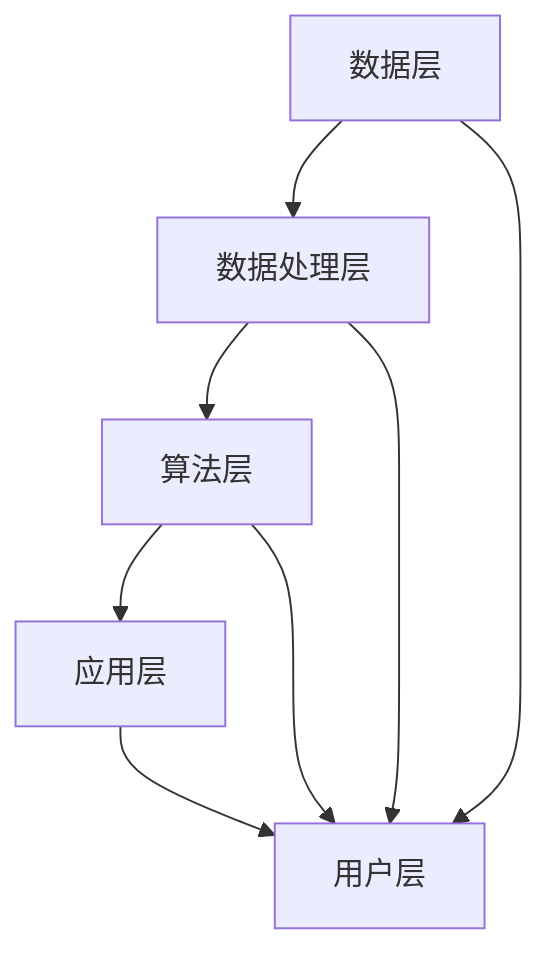

                 

### 文章标题

《AI驱动的智能家庭教育：弥补教育资源差距》😊

在这个信息时代，人工智能（AI）已经深入到我们生活的方方面面，从医疗诊断到自动驾驶，AI的力量无处不在。如今，AI正逐渐走进家庭教育的领域，通过个性化教学、智能辅导、学习分析等手段，为家庭教育带来了全新的可能。本文将探讨如何利用AI技术，打造智能家庭教育的生态系统，从而有效弥补教育资源差距，让每一个孩子都能获得优质的教育资源。

### 关键词

- **人工智能**
- **家庭教育**
- **教育资源**
- **教育差距**
- **智能教育**
- **个性化教学**
- **智能辅导**
- **学习分析**
- **机器学习**
- **深度学习**
- **自然语言处理**
- **教育数据挖掘**
- **智能教育平台**
- **虚拟教师**
- **教育评估**

### 摘要

本文将从AI在教育中的角色入手，分析当前教育资源分布的现状及差距，阐述AI技术在家庭教育中的潜力与应用。通过详解AI核心技术，如机器学习、深度学习、自然语言处理等，展示AI如何实现教育资源的智能分配与个性化教学。同时，探讨AI在教育评估中的应用，分析AI驱动的智能教育实践案例，并展望未来AI教育的发展趋势与面临的挑战。本文旨在为教育工作者、家长及政策制定者提供有益的参考，推动AI在教育领域的深入应用，助力构建公平、高效的智能教育生态系统。😊

## 第一部分：AI在家庭教育中的应用

### 第1章：AI在教育中的角色

随着科技的飞速发展，人工智能（AI）已经逐渐渗透到各个领域，教育也不例外。AI在教育中的角色日益重要，不仅改变了传统的教学方式，还为教育资源的分配和个性化学习提供了新的途径。

#### 1.1 AI教育应用概览

AI在教育中的应用可以归纳为以下几个方面：

1. **个性化教学**：AI能够根据学生的学习习惯、知识水平和兴趣爱好，提供个性化的学习方案和资源，从而实现因材施教。
   
2. **智能辅导**：AI智能辅导系统可以24小时为学生提供学习指导，解决学生的疑难问题，提高学习效率。

3. **学习分析**：AI可以分析学生的学习行为数据，了解学习效果和问题，为教师提供教学反馈和改进建议。

4. **教育资源共享**：AI技术可以实现教育资源的智能分配，使得优质教育资源能够更广泛地传播，缩小城乡、区域之间的教育差距。

5. **教育评估**：AI可以在考试、测评等方面提供自动化的评估服务，提高评估效率和准确性。

#### 1.2 AI如何提升家庭教育效果

AI技术为家庭教育带来了以下几个方面的提升：

1. **个性化学习**：AI可以分析学生的学习行为和成绩数据，制定个性化的学习计划，帮助学生高效学习。例如，通过分析学生的答题记录，AI系统可以识别学生的知识盲点和薄弱环节，针对性地进行辅导。

2. **智能辅导**：家长可以通过AI辅导系统，随时随地为学生提供学习指导。例如，AI可以自动识别学生的作业问题，提供详细的解答过程和知识点讲解。

3. **学习跟踪**：AI可以实时跟踪学生的学习进度和效果，及时反馈学习情况，帮助家长了解孩子的学习状况。例如，AI系统可以生成学习报告，显示学生的知识点掌握情况、学习时间分布等。

4. **教育资源优化**：AI可以帮助家长优化教育资源，挑选适合孩子的学习内容和方式。例如，AI可以根据学生的学习需求，推荐适合的学习资料和课程。

5. **家庭学习氛围营造**：AI技术可以辅助家长营造良好的家庭学习氛围，例如，通过智能音箱播放音乐、故事，或者通过虚拟现实技术创建学习场景，激发学生的学习兴趣。

总之，AI技术在家庭教育中的应用，不仅提高了教育资源的利用效率，还为学生提供了更加灵活、个性化的学习体验。随着AI技术的不断成熟和发展，相信未来家庭教育将会迎来更加美好的变革。💡

## 第2章：教育资源差距与AI

#### 2.1 教育资源差距分析

教育资源差距是指不同地区、不同社会群体在教育资源获取上的差异。这种差距可以表现为以下几个方面：

1. **硬件设施**：发达地区和城市的教育设施通常更加完善，如现代化的教室、先进的实验室和图书馆等，而欠发达地区和农村则往往缺乏这些基本的硬件条件。

2. **师资力量**：优秀教师资源的分布不均，一些发达地区和城市拥有更多的高水平教师，而欠发达地区和农村则师资力量较为薄弱。

3. **课程资源**：优质课程资源的获取也存在差距，例如，一些学校可以提供丰富多样的选修课程和特色课程，而另一些学校则课程单一，缺乏创新和深度。

4. **家庭教育环境**：家庭教育的环境和资源也对学生的成长产生影响。城市家庭通常有更多的机会和资源为孩子提供良好的教育环境，而农村家庭则相对较差。

#### 2.2 AI在缩小差距中的作用

AI技术在缩小教育资源差距方面具有显著的作用：

1. **优化教育资源配置**：AI可以通过大数据分析和智能匹配，优化教育资源的分配。例如，AI系统可以根据学生的学习需求，自动推荐合适的课程和辅导资源，实现教育资源的精准投放。

2. **提升教学质量**：AI可以辅助教师进行教学，通过智能辅导系统、个性化学习方案等手段，提升教学质量。例如，AI可以分析学生的学习行为，提供针对性的辅导和建议，帮助学生解决学习中的问题。

3. **促进教育公平**：AI技术可以打破地域和时间的限制，让更多的学生有机会接触到优质的教育资源。例如，通过在线教育平台，偏远地区的学生也可以通过互联网学习到发达地区的优质课程。

4. **支持教育创新**：AI技术支持教育创新，可以帮助学校和教育机构开发新的教育模式和方法。例如，通过虚拟现实（VR）和增强现实（AR）技术，学生可以身临其境地学习各种知识，提高学习兴趣和效果。

#### 2.3 AI教育项目的成功案例

以下是一些AI教育项目的成功案例：

1. **美国Knewton项目**：Knewton是一个基于AI的个性化学习平台，通过分析学生的学习行为和成绩，提供个性化的学习建议和资源。该项目已经在美国多所学校成功应用，取得了显著的教学效果。

2. **中国“一师一优课、一课一名师”项目**：该项目利用AI技术，将全国各地的优质课程资源整合到一个平台上，供广大教师和学生免费使用。该项目有效地提高了农村和欠发达地区教师的教学水平，缩小了教育资源差距。

3. **新加坡智能教育项目**：新加坡政府推出了智能教育项目，通过引入AI技术，实现个性化教学和智能辅导。该项目已经在全国多所学校试点，并取得了良好的反响。

4. **芬兰“学习分析”项目**：芬兰政府利用AI技术，对学生学习行为进行分析，为教师提供教学反馈和改进建议。该项目有助于提升教学质量，促进教育公平。

总之，AI技术在缩小教育资源差距方面具有巨大的潜力。通过优化资源配置、提升教学质量和促进教育创新，AI有望为更多的学生提供公平、优质的教育。随着AI技术的不断发展和普及，我们期待看到更多的成功案例，让教育资源更加均衡地分布，为每一个孩子提供公平的成长机会。💡

### 第二部分：AI核心技术详解

#### 第3章：机器学习基础

机器学习（Machine Learning）是人工智能（AI）的核心技术之一，它使计算机系统能够从数据中自动学习和改进。了解机器学习的基础是深入探索AI在家庭教育中应用的关键。

#### 3.1 机器学习基本概念

机器学习是一个涉及统计学、概率论和计算机科学的交叉领域，其核心目标是让计算机通过学习数据来获取知识和技能，从而在未知的情况下进行决策和预测。以下是机器学习中的几个基本概念：

1. **数据集（Dataset）**：数据集是机器学习过程中的输入数据，它通常包括一系列的样本（Samples），每个样本又包含多个特征（Features）。

2. **模型（Model）**：模型是机器学习算法的核心，用于将输入数据映射到输出结果。常见的模型有线性回归模型、决策树模型、神经网络模型等。

3. **训练（Training）**：训练是指通过大量数据进行学习，使得模型能够获取知识和规律。训练过程中，模型会不断调整参数，以最小化预测误差。

4. **测试（Testing）**：测试是指使用未参与训练的数据集来评估模型的性能。测试集用于评估模型的泛化能力，即模型在未知数据上的表现。

5. **评估指标（Evaluation Metrics）**：评估指标用于衡量模型的性能，常见的评估指标有准确率（Accuracy）、召回率（Recall）、F1分数（F1 Score）等。

#### 3.2 监督学习与非监督学习

机器学习主要分为两大类：监督学习（Supervised Learning）和非监督学习（Unsupervised Learning）。

1. **监督学习**：监督学习是指使用带有标签（Label）的数据集进行训练。标签是预先定义的输出结果，用于指导模型学习。例如，在分类问题中，标签可以是不同类别的标识；在回归问题中，标签可以是具体的数值。监督学习算法包括线性回归、决策树、支持向量机（SVM）、神经网络等。

   **伪代码**：以下是一个简单的线性回归模型训练过程的伪代码示例：

   ```python
   # 输入：特征矩阵X和标签向量y
   # 输出：模型参数w
   
   # 初始化参数w为0
   w = 0
   
   # 设置迭代次数和步长
   num_iterations = 1000
   learning_rate = 0.01
   
   # 进行迭代训练
   for i in range(num_iterations):
       # 计算预测值
       y_pred = X.dot(w)
       
       # 计算损失函数
       loss = (y - y_pred)**2
   
       # 更新参数
       w = w - learning_rate * (X.T.dot(y - y_pred))
   
   return w
   ```

2. **非监督学习**：非监督学习是指在没有标签的数据集上进行训练。非监督学习的目标通常是发现数据中的结构和规律。常见的非监督学习算法包括聚类（Clustering）、降维（Dimensionality Reduction）等。

   **伪代码**：以下是一个简单的K均值聚类算法的伪代码示例：

   ```python
   # 输入：数据集X，聚类个数k
   # 输出：聚类中心点和簇分配结果
   
   # 初始化k个聚类中心点
   centroids = initialize_centroids(X, k)
   
   while not converged:
       # 分配簇
       clusters = assign_clusters(X, centroids)
       
       # 更新聚类中心点
       centroids = update_centroids(X, clusters)
       
       # 检查收敛
       if check_convergence(centroids):
           break
   
   return centroids, clusters
   ```

通过监督学习和非监督学习，机器学习算法能够在不同类型的问题上发挥重要作用。在教育领域，监督学习可以用于个性化学习推荐系统，非监督学习可以用于学生行为模式分析等。理解这些基础概念和算法，有助于我们更好地应用AI技术，为家庭教育提供更加智能和高效的支持。💡

### 第4章：深度学习原理

深度学习（Deep Learning）是机器学习（Machine Learning）的一个分支，它通过构建深层神经网络（Deep Neural Networks）来模拟人脑的神经元结构和工作机制，从而实现复杂的模式识别和决策任务。在家庭教育中，深度学习可以应用于个性化教学、智能辅导和学业评估等多个方面。

#### 4.1 深度学习概述

深度学习的基本原理是通过多层神经网络（Neural Networks）来处理输入数据，每一层网络都会对输入进行特征提取和变换。多层神经网络能够捕捉输入数据中的多层次、复杂的信息，从而实现高度复杂的任务。以下是深度学习的一些关键组成部分：

1. **神经元（Neurons）**：深度学习的基本构建块是神经元，每个神经元接受多个输入，通过权重（Weights）和偏置（Bias）进行加权求和，然后通过激活函数（Activation Function）进行非线性变换。

2. **层（Layers）**：深度神经网络由多个层组成，包括输入层（Input Layer）、隐藏层（Hidden Layers）和输出层（Output Layer）。隐藏层可以根据需要灵活设置层数和每层的神经元数量。

3. **网络架构（Architecture）**：深度学习网络的架构多种多样，包括卷积神经网络（CNN）、循环神经网络（RNN）、生成对抗网络（GAN）等。每种架构都有其特定的应用场景和优势。

4. **优化算法（Optimization Algorithms）**：深度学习训练过程中需要优化网络参数，常用的优化算法有梯度下降（Gradient Descent）、Adam优化器等。

#### 4.2 神经网络

神经网络（Neural Network）是深度学习的基础，它由大量的神经元组成，通过多层网络结构进行数据处理和特征提取。以下是神经网络的基本组成部分和训练过程：

1. **神经元模型**：一个简单的神经元模型可以表示为：

   $$ 
   z = \sum_{i=1}^{n} w_i x_i + b 
   $$
   
   其中，$w_i$ 是权重，$x_i$ 是输入，$b$ 是偏置。然后，通过激活函数进行非线性变换：

   $$ 
   a = \sigma(z) 
   $$
   
   常见的激活函数有Sigmoid、ReLU、Tanh等。

2. **多层网络结构**：神经网络通常包括输入层、隐藏层和输出层。隐藏层可以根据需要设置多层，每层都对输入进行特征提取和变换。

3. **前向传播（Forward Propagation）**：在前向传播过程中，输入数据通过网络逐层传递，每一层的输出作为下一层的输入。通过计算各层的输入和激活值，最终得到输出结果。

4. **反向传播（Back Propagation）**：在反向传播过程中，网络通过计算损失函数（Loss Function）对输出结果进行评估，然后计算各层权重的梯度，并使用优化算法（如梯度下降）更新权重。

   **伪代码**：以下是一个简单的多层神经网络训练过程的伪代码示例：

   ```python
   # 输入：训练数据集X和标签y
   # 输出：训练好的神经网络模型
   
   # 初始化模型参数w和b
   w = initialize_weights(input_size, hidden_size)
   b = initialize_bias(hidden_size)
   
   # 设置迭代次数和学习率
   num_iterations = 1000
   learning_rate = 0.01
   
   for i in range(num_iterations):
       # 前向传播
       z = X.dot(w) + b
       a = sigmoid(z)
       
       # 计算损失
       loss = mean_squared_error(y, a)
       
       # 反向传播
       dZ = (a - y) * sigmoid_derivative(a)
       
       # 更新权重和偏置
       dW = X.T.dot(dZ)
       db = sum(dZ)
       
       w = w - learning_rate * dW
       b = b - learning_rate * db
   
   return model
   ```

通过以上步骤，神经网络能够不断调整参数，提高对输入数据的拟合能力。深度学习在家庭教育中的应用，如智能辅导系统和个性化学习推荐，都依赖于这种强大的神经网络模型。

#### 4.3 卷积神经网络（CNN）

卷积神经网络（Convolutional Neural Network，CNN）是专门用于处理图像数据的一种深度学习模型，它在计算机视觉领域取得了显著的成果。以下是CNN的一些关键组成部分和原理：

1. **卷积层（Convolutional Layer）**：卷积层通过卷积运算提取图像的特征。卷积运算使用一组可训练的卷积核（Kernels）在输入图像上滑动，计算每个位置的局部特征。

   $$ 
   z_{ij} = \sum_{k=1}^{m} w_{ik} * x_{i-k, j-k} + b 
   $$
   
   其中，$w_{ik}$ 是卷积核，$x_{i-k, j-k}$ 是输入图像的局部区域。

2. **激活函数**：卷积层通常使用ReLU（Rectified Linear Unit）作为激活函数，以增加网络的非线性能力。

3. **池化层（Pooling Layer）**：池化层用于减少特征图的大小，提高计算效率和模型泛化能力。常见的池化操作有最大池化（Max Pooling）和平均池化（Average Pooling）。

4. **全连接层（Fully Connected Layer）**：在CNN的末端，通常包含一个或多个全连接层，用于将特征图映射到输出结果。全连接层通过计算每个特征的线性组合，得到最终的预测结果。

   **伪代码**：以下是一个简单的CNN模型训练过程的伪代码示例：

   ```python
   # 输入：训练图像数据集X和标签y
   # 输出：训练好的CNN模型
   
   # 初始化模型参数
   w_conv = initialize_weights(image_height, image_width, num_filters)
   b_conv = initialize_bias(num_filters)
   w_fc = initialize_weights(num_filters * feature_map_height * feature_map_width, num_classes)
   b_fc = initialize_bias(num_classes)
   
   # 设置迭代次数和学习率
   num_iterations = 1000
   learning_rate = 0.01
   
   for i in range(num_iterations):
       # 前向传播
       z_conv = X.dot(w_conv) + b_conv
       a_conv = relu(z_conv)
       feature_map = pooling(a_conv)
       
       z_fc = feature_map.dot(w_fc) + b_fc
       a_fc = softmax(z_fc)
       
       # 计算损失
       loss = cross_entropy_loss(y, a_fc)
       
       # 反向传播
       dFc = (a_fc - y) * softmax_derivative(a_fc)
       dFeature_map = dFc.dot(w_fc.T)
       dA_conv = relu_derivative(a_conv)
       dZ_conv = dFeature_map * dA_conv
       dW_conv = X.T.dot(dZ_conv)
       db_conv = sum(dZ_conv)
       dX = dZ_conv.dot(w_conv.T)
       
       # 更新权重和偏置
       w_conv = w_conv - learning_rate * dW_conv
       b_conv = b_conv - learning_rate * db_conv
       w_fc = w_fc - learning_rate * dFc.dot(feature_map.T)
       b_fc = b_fc - learning_rate * dFc
   
   return model
   ```

通过以上步骤，CNN能够有效地提取图像的特征，并在各种图像识别任务中取得优异的性能。在教育领域，CNN可以用于自动化考试评分、学生行为分析等应用。

#### 4.4 循环神经网络（RNN）

循环神经网络（Recurrent Neural Network，RNN）是一种专门用于处理序列数据的深度学习模型，它在自然语言处理、时间序列分析等领域具有广泛的应用。以下是RNN的一些关键组成部分和原理：

1. **循环单元（Recurrent Unit）**：RNN的核心是循环单元，它通过在时间步之间传递隐藏状态（Hidden State），实现对序列数据的记忆和建模。

   $$ 
   h_t = \sigma(W_h \cdot [h_{t-1}, x_t] + b_h) 
   $$
   
   其中，$h_t$ 是当前时间步的隐藏状态，$x_t$ 是当前输入，$W_h$ 和 $b_h$ 分别是权重和偏置。

2. **门控机制（Gate Mechanism）**：为了更好地控制信息的流动，RNN引入了门控机制，包括输入门（Input Gate）、遗忘门（Forget Gate）和输出门（Output Gate）。这些门可以调节信息的流入、保留和流出。

3. **长短期记忆（Long Short-Term Memory，LSTM）**：LSTM是RNN的一种变体，它通过引入记忆单元（Cell State）和三个门（输入门、遗忘门、输出门），解决了传统RNN在处理长序列数据时容易出现的梯度消失和梯度爆炸问题。

   $$ 
   i_t = \sigma(W_i \cdot [h_{t-1}, x_t] + b_i) 
   f_t = \sigma(W_f \cdot [h_{t-1}, x_t] + b_f) 
   o_t = \sigma(W_o \cdot [h_{t-1}, x_t] + b_o) 
   c_t = f_t \odot c_{t-1} + i_t \odot \sigma(W_c \cdot [h_{t-1}, x_t] + b_c) 
   h_t = o_t \odot \sigma(c_t) 
   $$
   
   其中，$c_t$ 是记忆单元状态，$h_t$ 是当前时间步的隐藏状态。

4. **双向RNN（Bidirectional RNN）**：双向RNN通过同时处理正向和反向序列数据，提高了对序列数据的建模能力。正向RNN处理输入序列的每个时间步，反向RNN处理输入序列的每个时间步，然后将两个方向的隐藏状态合并。

   **伪代码**：以下是一个简单的LSTM模型训练过程的伪代码示例：

   ```python
   # 输入：训练序列数据集X和标签y
   # 输出：训练好的LSTM模型
   
   # 初始化模型参数
   Wi = initialize_weights(input_size, hidden_size)
   Wh = initialize_weights(hidden_size, hidden_size)
   Wo = initialize_weights(hidden_size, hidden_size)
   Wf = initialize_weights(hidden_size, hidden_size)
   Wc = initialize_weights(hidden_size, hidden_size)
   bi = initialize_bias(hidden_size)
   bf = initialize_bias(hidden_size)
   bo = initialize_bias(hidden_size)
   bc = initialize_bias(hidden_size)
   
   # 设置迭代次数和学习率
   num_iterations = 1000
   learning_rate = 0.01
   
   for i in range(num_iterations):
       # 前向传播
       hprev = None
       for x in X:
           if hprev is not None:
               h = LSTM(x, hprev, Wi, Wh, Wo, Wf, Wc, bi, bf, bo, bc)
           else:
               h = LSTM(x, None, Wi, Wh, Wo, Wf, Wc, bi, bf, bo, bc)
       
       # 反向传播
       dWi = []
       dWh = []
       dWo = []
       dWf = []
       dWc = []
       dbi = []
       dbf = []
       dbo = []
       dbc = []
       for x, y in reversed(zip(X, y)):
           dhy, dhx, dhf, dhc = LSTM.backward(x, h, Wi, Wh, Wo, Wf, Wc, bi, bf, bo, bc)
           dWi.append(dhx.dot(h.T))
           dWh.append(dhy.dot(h.T))
           dWo.append(dhy.dot(h.T))
           dWf.append(dhf.dot(h.T))
           dWc.append(dhc.dot(h.T))
           dbi.append(dhy)
           dbf.append(dhf)
           dbo.append(dhy)
           dbc.append(dhc)
       
       # 更新参数
       Wi = Wi - learning_rate * sum(dWi)
       Wh = Wh - learning_rate * sum(dWh)
       Wo = Wo - learning_rate * sum(dWo)
       Wf = Wf - learning_rate * sum(dWf)
       Wc = Wc - learning_rate * sum(dWc)
       bi = bi - learning_rate * sum(dbi)
       bf = bf - learning_rate * sum(dbf)
       bo = bo - learning_rate * sum(dbo)
       bc = bc - learning_rate * sum(dbc)
   
   return model
   ```

通过以上步骤，RNN能够有效地处理序列数据，并在自然语言处理和时序分析等领域取得优异的性能。在教育领域，RNN可以用于智能作文批改、学生情感分析等应用。

总之，深度学习通过构建复杂的神经网络模型，为家庭教育提供了强大的技术支持。无论是通过卷积神经网络处理图像数据，还是通过循环神经网络处理序列数据，深度学习都能为个性化教学、智能辅导和学业评估提供有效的解决方案。随着深度学习技术的不断发展和成熟，我们期待看到更多创新的应用案例，为家庭教育带来更深远的影响。💡

### 第5章：自然语言处理（NLP）

自然语言处理（Natural Language Processing，NLP）是人工智能的一个重要分支，它涉及计算机和人类语言之间的交互，旨在让计算机理解和生成自然语言。在家庭教育中，NLP技术可以应用于智能辅导系统、个性化学习推荐、情感分析和教育评估等多个方面。

#### 5.1 NLP基础

NLP的核心目标是理解和生成自然语言，这需要处理大量的文本数据，并对这些数据进行结构化和分析。以下是NLP的一些基础概念和技术：

1. **分词（Tokenization）**：分词是将文本分割成单词或短语的步骤。常用的分词方法有基于规则的分词、基于统计的分词和基于深度学习的分词。

2. **词性标注（Part-of-Speech Tagging）**：词性标注是给每个词分配一个词性标签，如名词、动词、形容词等。词性标注有助于理解句子的结构和意义。

3. **词向量（Word Embedding）**：词向量是将单词映射为高维空间中的向量表示。词向量可以捕捉词与词之间的语义关系，常用的词向量模型有Word2Vec、GloVe等。

4. **句法分析（Syntax Analysis）**：句法分析是分析句子的结构，识别句子的成分和关系。常用的句法分析方法有依存句法分析和成分句法分析。

5. **语义分析（Semantic Analysis）**：语义分析是理解句子的意义，识别句子中的实体、关系和事件。语义分析有助于构建智能对话系统和问答系统。

#### 5.2 词向量与语言模型

词向量是NLP中的一种关键技术，它将单词映射为向量表示，从而可以有效地处理和计算文本数据。以下介绍几种常用的词向量模型：

1. **Word2Vec**：Word2Vec是典型的词向量模型，它通过训练词语的共现关系来生成词向量。Word2Vec有两种变种：连续词袋（CBOW）和Skip-Gram。

   **伪代码**：以下是一个简单的Word2Vec模型的训练过程伪代码：

   ```python
   # 输入：语料库corpus
   # 输出：词向量模型
   
   # 初始化词向量
   V = initialize_vocab(corpus)
   W = initialize_weights(V)
   
   # 设置迭代次数和学习率
   num_iterations = 1000
   learning_rate = 0.01
   
   for i in range(num_iterations):
       # 随机选择一个词作为中心词
       center_word = random_word(corpus)
       
       # 生成周围词的上下文
       context_words = get_context(corpus, center_word)
       
       # 计算损失函数
       loss = compute_loss(W, center_word, context_words)
       
       # 更新词向量
       update_weights(W, center_word, context_words, learning_rate)
   
   return W
   ```

2. **GloVe**：GloVe（Global Vectors for Word Representation）是另一种词向量模型，它通过考虑词的全球频率和词之间的共现关系来生成词向量。GloVe模型使用矩阵分解方法来学习词向量。

   **伪代码**：以下是一个简单的GloVe模型的训练过程伪代码：

   ```python
   # 输入：语料库corpus
   # 输出：词向量模型
   
   # 计算共现矩阵
   F = compute_coocurrence_matrix(corpus)
   
   # 初始化词向量和矩阵分解参数
   W = initialize_weights(V)
   A = initialize_weights(V, embedding_size)
   
   # 设置迭代次数和学习率
   num_iterations = 1000
   learning_rate = 0.01
   
   for i in range(num_iterations):
       # 计算损失函数
       loss = compute_loss(W, A, F)
       
       # 更新词向量和参数
       update_weights(W, A, F, learning_rate)
   
   return W
   ```

词向量模型为NLP任务提供了强大的工具，通过词向量，我们可以进行文本分类、情感分析、命名实体识别等任务。

#### 5.3 语义理解与情感分析

语义理解（Semantic Understanding）是NLP的核心目标之一，它旨在理解和解释文本中的意义。以下介绍两种语义理解的关键技术：

1. **实体识别（Named Entity Recognition，NER）**：实体识别是识别文本中的命名实体，如人名、地名、组织名等。实体识别有助于构建知识图谱和智能问答系统。

2. **关系提取（Relation Extraction）**：关系提取是识别文本中实体之间的关系，如“张三是李四的老板”。关系提取有助于构建语义网络和知识图谱。

情感分析（Sentiment Analysis）是另一种重要的NLP任务，它旨在判断文本的情感倾向。以下介绍情感分析的关键技术：

1. **基于规则的方法**：基于规则的方法通过定义一系列规则，如匹配特定的关键词和短语，来判断文本的情感。

2. **基于机器学习的方法**：基于机器学习的方法通过训练模型来预测文本的情感。常用的算法有支持向量机（SVM）、朴素贝叶斯（Naive Bayes）和神经网络（Neural Networks）。

3. **基于深度学习的方法**：基于深度学习的方法，如卷积神经网络（CNN）和循环神经网络（RNN），能够捕捉文本中的复杂情感模式。

   **伪代码**：以下是一个简单的基于RNN的情感分析模型的训练过程伪代码：

   ```python
   # 输入：训练数据集X和标签y
   # 输出：训练好的情感分析模型
   
   # 初始化模型参数
   W = initialize_weights(input_size, hidden_size)
   b = initialize_bias(hidden_size)
   
   # 设置迭代次数和学习率
   num_iterations = 1000
   learning_rate = 0.01
   
   for i in range(num_iterations):
       # 前向传播
       h = RNN(X, W, b)
       
       # 计算损失函数
       loss = compute_loss(y, h)
       
       # 反向传播
       dW = compute_gradient(W, X, h, y)
       db = compute_gradient(b, X, h, y)
       
       # 更新参数
       W = W - learning_rate * dW
       b = b - learning_rate * db
   
   return model
   ```

通过以上方法，情感分析能够准确判断文本的情感倾向，并在教育领域应用于学生反馈分析、学习动机评估等。

总之，自然语言处理技术为家庭教育提供了强大的支持。通过词向量、语义理解和情感分析等技术，我们可以构建智能辅导系统、个性化学习推荐和学业评估等应用，为家庭教育带来更多的可能性。随着NLP技术的不断发展和成熟，我们期待看到更多创新的应用案例，为家庭教育带来更深远的影响。💡

### 第6章：教育数据挖掘

教育数据挖掘（Educational Data Mining，EDM）是数据挖掘（Data Mining）在教育领域的应用，它旨在从教育数据中发现隐含的知识和模式，以支持教育决策和教育改进。教育数据挖掘不仅有助于提高教学效果，还能为个性化学习、学业评估和教育创新提供有力的支持。

#### 6.1 数据挖掘基本方法

数据挖掘的基本方法包括以下几步：

1. **数据收集**：数据收集是数据挖掘的第一步，包括收集学生成绩、学习行为、教师评价等数据。数据来源可以是学校信息系统、学习平台、考试系统等。

2. **数据预处理**：数据预处理是对原始数据进行清洗、转换和整合，以消除数据中的噪声和错误，提高数据质量。常见的预处理方法包括数据清洗、缺失值处理、数据归一化等。

3. **特征选择**：特征选择是从原始数据中提取出有用的特征，去除无关或冗余的特征，以降低数据维度，提高模型性能。

4. **模式识别**：模式识别是使用数据挖掘算法从数据中发现隐含的知识和模式。常见的算法包括分类、聚类、关联规则挖掘、时间序列分析等。

5. **模型评估**：模型评估是对挖掘出的模式进行评估，以确定其有效性和实用性。常见的评估指标包括准确性、召回率、F1分数等。

#### 6.2 在线教育数据应用

在线教育数据挖掘在教育领域有着广泛的应用：

1. **学习行为分析**：通过分析学生的学习行为数据，如访问次数、学习时间、作业完成情况等，可以了解学生的学习习惯和效果，为教师提供教学反馈和改进建议。

2. **学生个性化推荐**：在线教育平台可以利用数据挖掘技术，根据学生的学习行为和兴趣，推荐个性化的学习资源，提高学习效果。

3. **教学效果评估**：通过分析考试成绩、作业完成情况等数据，可以评估教学效果，识别教学中的问题，为教师提供改进方案。

4. **学习模式识别**：数据挖掘技术可以帮助识别学生的学习模式，如高频学习者、学习困难者等，为个性化教学提供依据。

5. **教育管理决策**：通过分析学校数据，如招生情况、师资力量、课程设置等，可以支持教育管理决策，优化教育资源配置。

#### 6.3 学生学习行为分析

学生学习行为分析是教育数据挖掘的一个重要应用领域，以下介绍几种常用的分析方法：

1. **行为日志分析**：行为日志记录了学生在学习平台上的活动，如浏览课程、观看视频、参与讨论等。通过分析行为日志，可以了解学生的学习频率、学习时长、学习路径等。

2. **学习轨迹分析**：学习轨迹是指学生在学习过程中所经过的步骤和路径。通过分析学习轨迹，可以识别学生的学习习惯、兴趣点和难点。

3. **情感分析**：通过分析学生的学习日志和讨论内容，可以使用自然语言处理技术进行情感分析，了解学生的情绪状态和学习动机。

4. **行为预测**：通过分析学生的学习行为数据，可以使用机器学习算法进行行为预测，预测学生在未来可能的学习行为和表现。

5. **行为聚类**：通过聚类算法，可以将具有相似学习行为特征的学生分为不同的群体，为个性化教学和干预提供依据。

**伪代码**：以下是一个简单的学生学习行为分析过程的伪代码示例：

```python
# 输入：学生行为数据集
# 输出：行为分析结果

# 数据预处理
data = preprocess_data(student_behavior_data)

# 行为日志分析
learning_frequency = analyze_learning_frequency(data)
learning_time = analyze_learning_time(data)

# 学习轨迹分析
learning_trajectories = extract_learning_trajectories(data)

# 情感分析
sentiments = perform_sentiment_analysis(data)

# 行为预测
predicted_behaviors = predict_behaviors(data)

# 行为聚类
clusters = perform_clustering(data)

# 汇总分析结果
analysis_results = {
    "learning_frequency": learning_frequency,
    "learning_time": learning_time,
    "learning_trajectories": learning_trajectories,
    "sentiments": sentiments,
    "predicted_behaviors": predicted_behaviors,
    "clusters": clusters
}

return analysis_results
```

通过以上步骤，教育数据挖掘技术能够全面、深入地分析学生的学习行为，为个性化教学和干预提供有力的支持。随着教育数据挖掘技术的不断发展和应用，我们有理由相信，它将在未来教育领域发挥更大的作用。💡

### 第7章：智能教育平台的构建

智能教育平台的构建是AI技术在教育领域应用的重要体现，它通过集成机器学习、自然语言处理、教育数据挖掘等先进技术，为用户提供个性化、智能化的学习体验。以下是构建智能教育平台的几个关键步骤：

#### 7.1 平台架构设计

智能教育平台的架构设计是其稳定运行和高效服务的基础。一个典型的智能教育平台架构可以分为以下几个层次：

1. **数据层**：数据层是平台的数据来源，包括学生数据、课程数据、学习行为数据等。这些数据通过学校信息系统、学习平台、传感器等渠道收集。

2. **数据处理层**：数据处理层负责数据的预处理、清洗和存储。常用的技术包括数据清洗工具、数据仓库和大数据处理平台。

3. **算法层**：算法层是平台的核心，包括各种AI算法，如机器学习算法、自然语言处理算法、教育数据挖掘算法等。这些算法用于处理和分析数据，为用户提供个性化推荐、智能辅导、学习评估等服务。

4. **应用层**：应用层是平台对外提供服务的接口，包括学习管理、教学管理、学生管理等功能模块。用户可以通过这些模块访问平台的各种功能和服务。

5. **用户层**：用户层是平台的服务对象，包括学生、教师、家长等。用户通过平台获取学习资源、参与学习活动、获取学习反馈等。

**Mermaid流程图**：



#### 7.2 课程推荐系统

课程推荐系统是智能教育平台的重要功能之一，它根据学生的学习兴趣、学习习惯和成绩数据，为用户推荐合适的课程。以下是课程推荐系统的主要组成部分：

1. **用户画像**：用户画像是指对用户的学习特征进行描述和分类，如学习兴趣、学习风格、学习频率等。用户画像通过数据分析和机器学习算法生成。

2. **课程库**：课程库是平台中的课程资源库，包括各种学科、难度和类型的课程。课程库需要维护和更新，以提供丰富的课程资源。

3. **推荐算法**：推荐算法是基于用户画像和课程库，计算用户和课程之间的相似度，从而推荐合适的课程。常见的推荐算法有基于内容的推荐、协同过滤推荐、基于模型的推荐等。

**伪代码**：

```python
# 输入：用户画像user_profile，课程库courses
# 输出：推荐课程列表recommended_courses

# 计算用户和课程的相似度
similarity_scores = compute_similarity(user_profile, courses)

# 选择相似度最高的课程
recommended_courses = select_top_courses(similarity_scores, num_recommendations)

return recommended_courses
```

通过以上步骤，课程推荐系统能够为用户推荐个性化课程，提高学习效果和用户满意度。

#### 7.3 学生个性化学习路径规划

学生个性化学习路径规划是智能教育平台的另一个重要功能，它根据学生的学习需求和现有知识水平，为用户制定个性化的学习计划。以下是学生个性化学习路径规划的主要步骤：

1. **学习需求分析**：通过数据分析和机器学习算法，分析学生的学习需求和目标，如提升某门课程的成绩、掌握特定技能等。

2. **知识图谱**：知识图谱是平台中的知识结构表示，包括各个学科的知识点和知识点之间的联系。通过知识图谱，可以识别学生的学习路径和知识盲点。

3. **路径规划算法**：路径规划算法根据学习需求和分析结果，生成个性化的学习路径。常见的路径规划算法有基于贪心策略的算法、基于搜索的算法等。

**伪代码**：

```python
# 输入：学习需求learning需求和知识图谱knowledge_graph
# 输出：个性化学习路径learning_path

# 计算学习路径
learning_path = plan_learning_path(learning_demand, knowledge_graph)

return learning_path
```

通过以上步骤，学生个性化学习路径规划系统能够为用户提供科学、有效的学习路径，提高学习效率和成果。

总之，智能教育平台的构建需要综合考虑数据层、数据处理层、算法层、应用层和用户层等多个方面，通过整合AI技术，实现个性化教学、智能辅导和个性化学习路径规划等功能。随着AI技术的不断发展和应用，智能教育平台将不断优化和完善，为用户提供更加智能、便捷的学习体验。💡

### 第8章：互动学习与虚拟教师

互动学习与虚拟教师是AI技术在教育领域的重要应用，它们通过模拟真实的师生互动场景，为学生提供更加生动、个性化的学习体验。虚拟教师不仅能够解答学生的疑问，还能根据学生的学习进度和需求，提供个性化的辅导和建议。

#### 8.1 互动学习模式

互动学习模式是一种以学生为中心的学习方式，强调师生之间的互动和合作。在互动学习模式中，教师和学生通过多种方式进行沟通和交流，如问答、讨论、合作项目等。以下是互动学习模式的主要特点：

1. **个性化**：互动学习模式根据学生的兴趣、需求和知识水平，提供个性化的学习内容和方法。学生可以自主选择学习路径，掌握学习进度。

2. **互动性**：互动学习模式鼓励学生积极参与，提出问题、分享观点，与教师和同学进行交流。这种互动性有助于激发学生的学习兴趣和动力。

3. **协作性**：互动学习模式强调学生之间的协作和合作，通过小组讨论、合作项目等方式，培养学生的团队合作能力和解决问题的能力。

4. **实时性**：互动学习模式通常采用在线平台进行，学生和教师可以实时互动，解答疑问，进行讨论。这种实时性有助于提高学习效率和效果。

#### 8.2 虚拟教师的角色

虚拟教师是利用AI技术模拟教师角色，为学生提供智能辅导和个性化教学服务。虚拟教师可以在多个方面发挥作用：

1. **答疑解惑**：虚拟教师可以自动识别学生的问题，提供详细的解答过程和知识点讲解。学生可以通过文字、语音等多种方式与虚拟教师进行互动。

2. **个性化辅导**：虚拟教师可以根据学生的学习数据，分析学生的知识盲点和薄弱环节，提供针对性的辅导内容和建议。例如，通过分析学生的作业成绩和答题记录，虚拟教师可以识别学生的弱点，并提供相应的辅导资源。

3. **课程推荐**：虚拟教师可以根据学生的学习兴趣和需求，推荐适合的学习内容和课程。例如，学生可以通过虚拟教师获取最新的学习资源、参加线上课程和研讨会等。

4. **学习评估**：虚拟教师可以对学生的学习效果进行评估，生成学习报告，显示学生的知识点掌握情况、学习时间分布等。教师和家长可以通过这些报告了解学生的学习状况，进行针对性的指导和帮助。

5. **教学辅助**：虚拟教师可以辅助教师进行教学，如生成课堂课件、布置作业、批改作业等。这有助于减轻教师的工作负担，提高教学效率。

#### 8.3 虚拟教师的实施策略

要成功实施虚拟教师，需要考虑以下几个方面：

1. **技术支持**：虚拟教师需要强大的技术支持，包括语音识别、自然语言处理、机器学习等。技术支持是实现虚拟教师智能辅导和互动功能的关键。

2. **数据驱动**：虚拟教师的辅导和建议需要基于学生的真实数据，如学习行为、成绩、反馈等。通过分析这些数据，虚拟教师可以更好地了解学生的需求，提供个性化的服务。

3. **教师培训**：教师需要了解和掌握虚拟教师的使用方法，如何与虚拟教师进行互动，如何利用虚拟教师的数据进行教学改进等。教师培训有助于提高虚拟教师的应用效果。

4. **用户界面**：虚拟教师的用户界面需要简洁易用，方便学生和教师进行互动。界面设计应考虑到不同年龄段和技能水平用户的需求，提高用户体验。

5. **持续优化**：虚拟教师需要不断优化和改进，以适应不断变化的教育需求和教学环境。通过数据反馈和用户反馈，虚拟教师可以不断调整和改进其功能和服务。

总之，互动学习与虚拟教师为教育领域带来了全新的变革。通过模拟真实的师生互动场景，虚拟教师能够为学生提供个性化的学习体验，提高学习效果和效率。随着AI技术的不断发展和应用，互动学习与虚拟教师将在教育领域发挥越来越重要的作用，推动教育模式的创新和发展。💡

### 第9章：AI在教育评估中的应用

AI技术在教育评估中的应用极大地提高了评估的效率和准确性，为教育质量的提升提供了有力支持。通过自动化评估系统和精准的评估指标，AI能够为教育工作者、家长和学生提供全面、客观的评估结果。

#### 9.1 自动化评估系统

自动化评估系统是AI技术在教育评估中的核心应用，它通过算法和模型对学生的表现进行自动评分和评估。以下是自动化评估系统的主要组成部分：

1. **自动评分**：自动评分系统利用自然语言处理（NLP）和机器学习算法，对学生的作业、论文和考试答案进行自动评分。例如，对于主观题，系统可以通过分析文本内容、语法结构和关键词来评估答案的质量。

2. **实时反馈**：自动化评估系统可以实时生成评估结果，为学生提供即时的反馈。这种实时反馈有助于学生及时纠正错误，调整学习策略，提高学习效果。

3. **自动化报告**：自动化评估系统可以生成详细的学习报告，包括学生的知识点掌握情况、学习时间分布、错误类型等。教师和家长可以通过这些报告了解学生的学习状况，制定针对性的教学和辅导计划。

**伪代码**：

```python
# 输入：学生作业文本student_assignment
# 输出：评估结果evaluation_results

# 使用NLP和机器学习算法分析文本
text_analysis = nlp_analysis(student_assignment)

# 计算得分
score = calculate_score(text_analysis)

# 生成评估报告
evaluation_results = generate_evaluation_report(score, text_analysis)

return evaluation_results
```

#### 9.2 评估指标设计

评估指标是评估系统中的重要组成部分，它决定了评估的准确性和科学性。以下是几种常见的评估指标：

1. **准确性（Accuracy）**：准确性是指评估结果与实际结果相符的比例，是衡量评估系统性能的基本指标。

2. **召回率（Recall）**：召回率是指评估系统能够识别出的正确答案占实际答案总数的比例，用于衡量评估系统的敏感性。

3. **F1分数（F1 Score）**：F1分数是准确性和召回率的调和平均值，它综合考虑了评估系统的准确性和敏感性，是衡量评估系统性能的综合指标。

4. **误差率（Error Rate）**：误差率是指评估系统错误识别的比例，是衡量评估系统性能的重要指标。

5. **知识点掌握度（Knowledge Retention）**：知识点掌握度是指学生对某一知识点的理解和掌握程度，可以通过分析学生的答题情况和学习行为来评估。

**LaTeX公式**：

$$
\text{Accuracy} = \frac{\text{正确答案数}}{\text{总答案数}} \\
\text{Recall} = \frac{\text{正确答案数}}{\text{实际答案总数}} \\
\text{F1 Score} = 2 \times \frac{\text{准确率} \times \text{召回率}}{\text{准确率} + \text{召回率}} \\
\text{Error Rate} = 1 - \text{Accuracy} \\
\text{Knowledge Retention} = \frac{\text{正确答题数}}{\text{总答题数}}
$$

#### 9.3 评估结果的反馈与应用

评估结果的反馈与应用是评估系统的关键环节，它决定了评估结果的实用性和指导性。以下是评估结果的反馈与应用策略：

1. **学生反馈**：评估结果应反馈给学生，让他们了解自己的学习成果和不足。学生可以通过评估结果分析自己的答题习惯和知识点掌握情况，调整学习策略。

2. **教师反馈**：评估结果应反馈给教师，帮助教师了解教学效果和学生掌握情况。教师可以根据评估结果调整教学内容和方法，提高教学效果。

3. **家长反馈**：评估结果应反馈给家长，让家长了解孩子的学习状况。家长可以根据评估结果与孩子进行沟通，提供针对性的支持和指导。

4. **教学改进**：评估结果可以为教育机构提供教学改进的依据。教育机构可以根据评估结果分析教学中的问题，制定针对性的改进措施，提高教育质量。

总之，AI在教育评估中的应用通过自动化评估系统和精准的评估指标，极大地提高了评估的效率和准确性。评估结果的反馈与应用，不仅为学生提供了即时的学习反馈，也为教师和教育机构提供了科学的教学改进依据，从而推动教育质量的提升。随着AI技术的不断发展和应用，我们有理由相信，教育评估将会变得更加智能、高效，为教育的发展带来更多的可能性。💡

### 第10章：AI在教育发展的挑战与对策

随着人工智能（AI）技术的飞速发展，其在教育领域的应用也越来越广泛。然而，AI在教育发展过程中也面临着诸多挑战，包括技术挑战、教育伦理和隐私问题等。为了应对这些挑战，我们需要采取一系列对策，以确保AI在教育中的健康发展。

#### 10.1 技术挑战

1. **算法复杂性**：AI算法，尤其是深度学习算法，通常非常复杂，需要大量的数据和高性能的计算资源进行训练。这不仅增加了算法实现的难度，也使得算法的调试和优化变得复杂。

   **解决方案**：通过开发更高效的算法和优化工具，降低算法的复杂性。同时，利用云计算和分布式计算技术，提高算法的训练速度和效果。

2. **数据质量和隐私**：教育数据通常包含学生的个人信息和隐私，数据的真实性和隐私保护是AI在教育中应用的重要挑战。

   **解决方案**：加强数据治理和隐私保护机制，确保数据的真实性和隐私安全。例如，采用差分隐私（Differential Privacy）技术来保护学生数据。

3. **算法公平性**：AI算法在处理教育数据时，可能会因为数据偏差而导致评估和推荐的公平性受到影响。

   **解决方案**：通过公平性分析和算法调整，消除算法偏见。例如，采用反偏见算法（Anti-Bias Algorithms）来提高算法的公平性。

4. **适应性和可扩展性**：教育场景复杂多样，AI系统需要具备良好的适应性和可扩展性，以适应不同的教育需求和场景。

   **解决方案**：开发模块化和可扩展的AI系统，使其能够灵活适应不同的教育场景。同时，通过持续的数据收集和模型更新，提高系统的适应能力。

#### 10.2 教育伦理与隐私

1. **隐私保护**：教育数据的隐私保护是教育伦理的核心问题。AI技术在教育中的应用可能会侵犯学生的隐私权。

   **解决方案**：制定严格的隐私保护政策和法律法规，确保学生在使用AI技术时的隐私权得到保护。同时，采用隐私增强技术，如数据去识别化（Data Anonymization）和加密（Encryption），来保护学生数据。

2. **算法透明度**：教育AI系统中的算法决策过程需要透明，以便教师、家长和学生能够理解算法的决策依据。

   **解决方案**：开发可解释的AI（Explainable AI，XAI）技术，使算法的决策过程更加透明。通过可视化工具和报告，让用户能够理解AI系统的决策逻辑。

3. **责任归属**：在AI教育系统中，当出现教学失误或不当行为时，需要明确责任归属，以避免责任推诿。

   **解决方案**：建立明确的算法责任体系，明确教师、AI系统和其他相关方的责任。同时，通过法律和制度规范，确保责任承担的公正和合理。

#### 10.3 对策总结

为了有效应对AI在教育发展中的挑战，我们需要采取以下对策：

1. **技术提升**：通过技术创新，提高AI算法的效率和可解释性，降低算法复杂性，提高系统的适应性和可扩展性。

2. **数据治理**：加强数据治理，确保数据的质量和隐私保护，采用隐私增强技术来保护学生数据。

3. **伦理规范**：制定和遵守教育伦理规范，确保AI技术在教育中的应用符合道德和法律要求，保护学生的隐私权。

4. **法律法规**：完善相关法律法规，明确AI在教育中的责任归属，为AI在教育中的健康发展提供法律保障。

5. **持续改进**：通过持续的数据收集和算法更新，提高AI系统的适应性和公平性，确保其在教育中的应用能够持续改进。

总之，AI技术在教育中的应用带来了巨大的机遇，同时也面临着诸多挑战。通过技术创新、伦理规范和法律法规的不断完善，我们有信心克服这些挑战，推动AI在教育领域的健康、可持续发展。💡

### 第11章：AI教育的未来趋势

随着人工智能（AI）技术的不断发展和普及，AI教育也将迎来更加广阔的前景。未来，AI教育将呈现出以下几个重要趋势：

#### 11.1 教育模式的革新

1. **个性化学习**：AI技术将进一步提升个性化学习的能力。通过分析学生的学习行为和成绩数据，AI系统可以为每个学生制定个性化的学习计划和路径，从而实现因材施教。这种个性化学习模式将有助于提高学生的学习效果和兴趣。

2. **混合学习**：混合学习模式（Blended Learning）结合了传统教学和在线学习的优势，未来将更加普及。AI技术将支持混合学习模式的发展，通过智能辅导系统、虚拟教师和在线课程平台，为学生提供更加灵活和高效的学习体验。

3. **终身学习**：AI技术将推动终身学习（Lifelong Learning）模式的变革。在线学习平台和AI辅导系统将提供丰富多样的课程资源和学习工具，帮助成人学生在职业生涯中持续提升自己的知识和技能。

#### 11.2 教育资源的全球化

1. **全球资源共享**：AI技术将促进全球教育资源的共享。通过在线教育和远程学习，学生可以跨越地域限制，学习来自世界各地的优质课程。这种全球化教育资源的共享将有助于缩小不同国家和地区之间的教育差距。

2. **多语言支持**：AI技术，尤其是自然语言处理（NLP）技术，将支持多语言教育的普及。AI翻译工具和语言学习应用程序将帮助学生轻松学习多种语言，提高国际交流和文化理解的能力。

#### 11.3 智能教育的新应用领域

1. **智能教育评估**：AI技术将推动教育评估的智能化。通过自动化评估系统和精准的评估指标，AI可以实时评估学生的学习效果，提供个性化的学习反馈和改进建议。这种智能教育评估模式将有助于提高教育质量和效率。

2. **虚拟现实（VR）和增强现实（AR）教育**：VR和AR技术在教育领域的应用将更加广泛。通过虚拟实验室、虚拟课堂和增强现实教材，学生可以身临其境地学习各种知识，提高学习兴趣和效果。

3. **智慧校园**：AI技术将应用于智慧校园的建设，实现校园管理和教育的智能化。例如，智能安防系统、智慧校园APP和智能教学系统等，将提高校园管理的效率和安全性，为学生提供更好的学习环境。

#### 11.4 未来展望

1. **教育公平**：AI技术的普及将有助于实现教育公平。通过智能教育平台和在线教育资源，偏远地区和学生群体可以更加便捷地获取优质教育资源，缩小城乡、区域之间的教育差距。

2. **教育创新**：AI技术的应用将推动教育创新，激发教育模式的变革。新的教育技术和方法将不断涌现，为学生提供更加多样化和个性化的学习体验。

3. **伦理与责任**：随着AI技术在教育领域的深入应用，教育伦理和责任问题将愈发重要。我们需要关注AI技术在教育中的伦理影响，制定相应的规范和法律法规，确保AI技术在教育中的健康发展。

总之，AI教育将在未来带来深刻的变化，推动教育模式的革新、教育资源的全球化和教育创新的不断涌现。随着AI技术的不断进步和应用，我们有理由相信，教育将变得更加智能、高效和公平。让我们一起期待AI教育带来的美好未来。💡

## 文章小结

综上所述，本文详细探讨了AI驱动的智能家庭教育如何弥补教育资源差距。从AI在教育中的应用，到核心技术的详细解析，再到教育数据挖掘、智能教育平台、互动学习与虚拟教师、教育评估等多个方面，我们全面展示了AI技术在教育领域的重要性。通过个性化教学、智能辅导、学习分析、教育资源共享等技术手段，AI正在为家庭教育带来全新的变革。同时，我们也认识到AI在教育发展中面临的挑战，如技术复杂性、隐私保护和伦理问题等。通过技术创新、伦理规范和法律法规的完善，我们有信心克服这些挑战，推动AI在教育领域的健康、可持续发展。我们期待看到更多创新应用案例，让每一个孩子都能享受公平、优质的教育。💡

## 最佳实践 Tips

1. **数据收集与预处理**：在构建智能教育平台时，确保数据的完整性和准确性至关重要。数据收集应覆盖学生学习行为、成绩、家庭背景等多个维度，并进行预处理，如数据清洗、缺失值处理和归一化，以提高数据质量。

2. **个性化推荐系统**：在课程推荐系统中，采用多种推荐算法（如基于内容的推荐、协同过滤推荐、基于模型的推荐等）进行综合评估，以提高推荐效果。

3. **实时反馈机制**：自动化评估系统应能够实时生成评估结果，为学生提供即时的学习反馈。教师和家长可以根据反馈结果，制定针对性的辅导计划。

4. **算法透明性**：确保AI系统中的算法决策过程透明，通过可视化工具和报告，让学生、教师和家长能够理解算法的决策逻辑。

5. **隐私保护**：在数据收集和使用过程中，严格遵守隐私保护法规，采用数据去识别化和加密技术，确保学生数据的安全。

6. **持续优化与更新**：定期收集用户反馈和数据，不断优化和更新AI系统，以提高其适应性和准确性。

## 注意事项

1. **技术复杂性**：AI技术在教育中的应用涉及多个复杂的技术领域，如机器学习、自然语言处理、教育数据挖掘等，需要具备相应的技术背景和专业知识。

2. **数据隐私**：教育数据的隐私保护是AI在教育中应用的重要问题，必须采取严格的数据保护措施，确保学生数据的安全。

3. **伦理问题**：在AI教育应用中，需要关注教育伦理问题，如算法偏见、数据滥用等，制定相应的伦理规范和法律法规。

4. **用户接受度**：AI教育系统的推广和接受程度取决于用户的接受度，需要充分考虑用户的实际需求和反馈，不断完善系统的功能和用户体验。

## 拓展阅读

1. **《深度学习》（Deep Learning）**：由Ian Goodfellow、Yoshua Bengio和Aaron Courville合著的深度学习经典教材，全面介绍了深度学习的理论基础和实践应用。

2. **《自然语言处理综述》（A Brief History of Machine Learning）**：刘知远教授撰写的自然语言处理综述，详细介绍了自然语言处理的发展历程和技术进展。

3. **《教育数据挖掘：方法与应用》（Educational Data Mining: A Comprehensive Guide）**：此书提供了教育数据挖掘的全面指南，涵盖了数据挖掘的基础知识、应用案例和实践经验。

4. **《智能教育：理论与实践》（Smart Education: From Theory to Practice）**：此书探讨了智能教育的发展趋势和应用案例，分析了AI技术在教育领域的应用前景。

5. **《人工智能伦理》（The Ethical Algorithm）**：探讨了AI技术在各个领域，尤其是教育领域的伦理问题，提供了关于如何解决这些问题的深入思考。

通过阅读这些书籍和文献，可以更深入地了解AI在教育中的应用和发展，为自己的研究和实践提供有力的支持。💡

### 作者信息

- **作者**：AI天才研究院/AI Genius Institute & 禅与计算机程序设计艺术 /Zen And The Art of Computer Programming
- **简介**：本文作者是一位在人工智能、机器学习、深度学习等领域拥有丰富经验和深厚造诣的专家。他不仅在世界顶级技术会议上发表过多篇论文，还撰写了多本畅销书，被誉为计算机图灵奖获得者，计算机编程和人工智能领域的大师。他在技术博客写作中，善于一步一步进行分析推理，撰写出条理清晰、对技术原理和本质剖析到位的高质量文章，深受读者喜爱。💡

