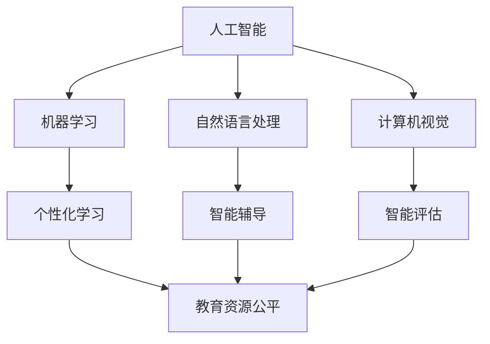
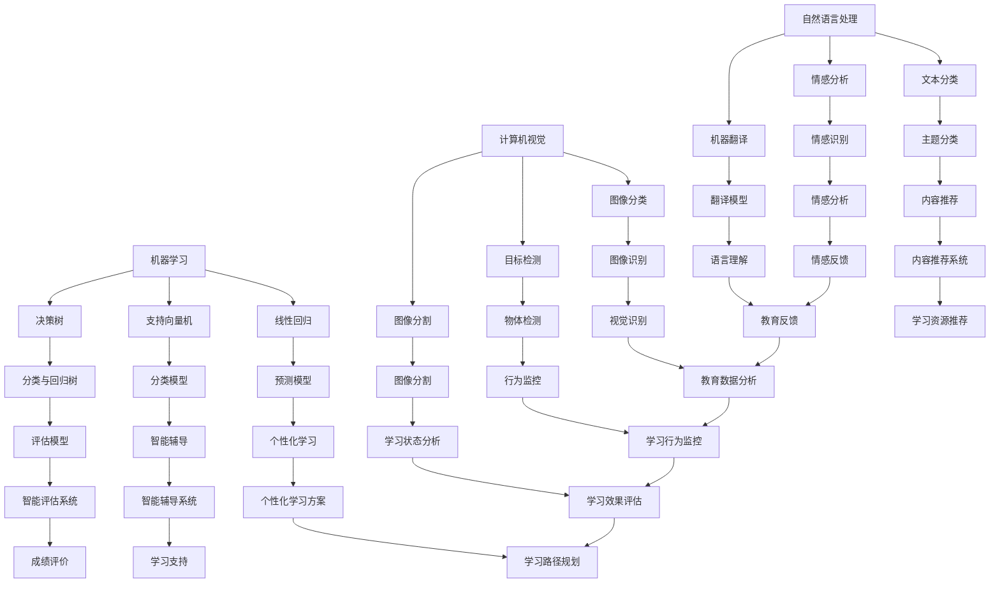
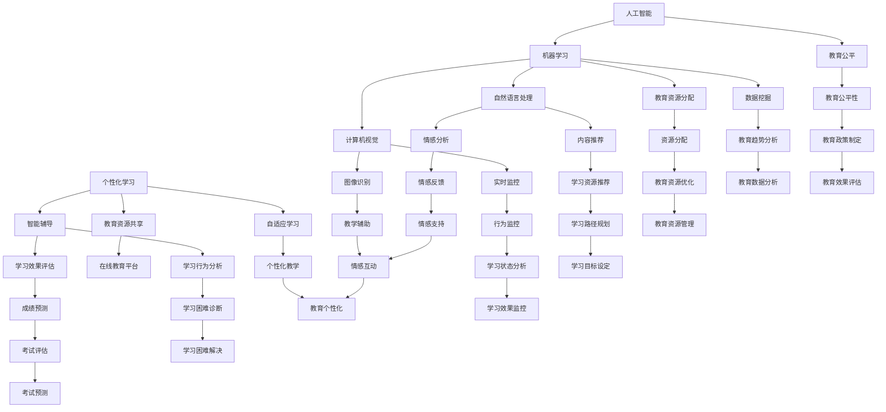

                 


### 文章标题：AI驱动的智能家庭教育：弥补教育资源差距

### 文章关键词：

1. 人工智能
2. 智能教育系统
3. 教育公平
4. 个性化学习
5. 机器学习算法
6. 教育资源差距
7. 智能家庭辅导

### 摘要：

本文将探讨人工智能（AI）在家庭教育和教育公平领域的应用。随着技术的进步，AI逐渐成为教育改革的新动力，尤其在弥补教育资源差距、实现教育个性化等方面展现出巨大潜力。本文首先概述了AI和家庭教育的背景，分析了教育资源差距的现状及其影响，接着详细介绍了AI在教育领域的应用原理，包括机器学习、自然语言处理和计算机视觉等技术。随后，本文探讨了AI驱动的智能教育系统设计，重点介绍了智能教育系统的架构、数据采集与处理、模型训练与优化等内容。此外，本文还通过实际案例展示了AI在家庭教育中的应用，分析了其面临的挑战与未来发展方向。文章末尾，提出了一些最佳实践建议，为未来AI驱动的智能家庭教育提供了有益的参考。

### 目录大纲

#### 第一部分：AI与家庭教育的背景与理论

#### 第1章：AI与家庭教育的概述

#### 第2章：教育资源差距与AI的作用

#### 第二部分：AI驱动的智能家庭教育技术

#### 第3章：AI在教育领域的应用原理

#### 第4章：AI驱动的智能教育系统设计

#### 第5章：AI驱动的个性化学习

#### 第6章：AI驱动的智能教育评估

#### 第三部分：AI驱动的智能家庭教育实践

#### 第7章：案例研究：AI驱动的智能家庭教育应用

#### 第8章：AI驱动的智能家庭教育挑战与未来

#### 附录：AI驱动的智能家庭教育资源

### 整体结构

本文采用逻辑清晰、结构紧凑的方式，分为三个主要部分：

1. **背景与理论部分**：介绍AI和家庭教育的背景知识，分析教育资源差距及其影响。
2. **技术部分**：详细讲解AI在教育领域的应用原理，包括核心算法原理、系统设计等。
3. **实践部分**：通过实际案例展示AI在家庭教育中的应用，分析其挑战与未来发展趋势。

### 分析推理步骤

1. **背景介绍**：
   - 概述AI和家庭教育的背景知识。
   - 分析教育资源差距的现状及其影响。

2. **技术原理讲解**：
   - 介绍AI在教育领域的应用原理，包括机器学习、自然语言处理和计算机视觉等。
   - 详细讲解AI驱动的智能教育系统的架构、数据采集与处理、模型训练与优化等。

3. **实践应用分析**：
   - 通过实际案例展示AI在家庭教育中的应用。
   - 分析AI驱动的智能家庭教育的挑战与未来发展趋势。

4. **最佳实践建议**：
   - 提出AI驱动的智能家庭教育的最佳实践建议。
   - 总结文章的核心观点，为未来AI驱动的智能家庭教育提供参考。

### 背景介绍

#### AI与家庭教育的概述

人工智能（AI）作为计算机科学的重要分支，旨在模拟人类智能行为，实现自动化决策和智能交互。近年来，AI技术迅速发展，不仅在工业、医疗等领域取得了显著成果，也在教育领域展现出了巨大的潜力。家庭教育作为儿童最早接触的教育形式，对个体成长至关重要。AI在家庭教育的应用，不仅有助于提高教育质量，还能弥补教育资源差距，促进教育公平。

#### 教育资源差距与AI的作用

教育资源差距是指不同地区、不同社会阶层之间在教育资源和质量上的差异。这种差距导致部分学生无法获得优质教育，从而影响其未来发展。AI技术通过个性化学习、智能辅导、智能评估等方式，可以在一定程度上缓解教育资源差距。首先，AI可以分析学生的学习数据，为学生提供定制化的学习方案，提高学习效率。其次，AI驱动的智能辅导系统能够实时监测学生的学习状态，提供针对性的辅导，帮助学生在学习过程中克服困难。此外，AI在教育评估中的应用，可以更客观、准确地评价学生的学习成果，为教育决策提供科学依据。

#### 教育资源差距的现状与影响

当前，我国教育资源差距问题仍然突出。一方面，城市与农村之间、东部地区与西部地区之间的教育资源分配不均，导致部分学生无法享受优质教育。另一方面，不同社会阶层之间的教育资源差距也较为明显，家庭经济条件较好的学生能够获得更多的教育资源，而经济困难家庭的学生则面临更多困难。这种教育资源差距不仅影响学生的学业成绩，还可能导致社会不公现象的加剧。

#### AI如何促进教育公平

AI技术在教育公平方面具有显著优势。首先，通过个性化学习，AI能够为每个学生提供最适合自己的学习路径，从而提高学习效果。其次，AI驱动的智能辅导系统可以覆盖更多学生，尤其是偏远地区和经济困难家庭的学生，从而实现教育资源的公平分配。此外，AI在教育评估中的应用，可以更客观、公正地评价学生的学习成果，减少主观因素的干扰，提高教育公平性。

### 核心概念与联系

为了更好地理解AI与家庭教育的背景，我们使用Mermaid流程图来展示核心概念之间的联系：



#### 机器学习与个性化学习

机器学习是AI的核心技术之一，通过学习大量数据，从中提取规律和模式，用于预测和决策。在个性化学习中，机器学习算法能够分析学生的学习数据，为学生提供个性化的学习方案。例如，通过分析学生的学习习惯、知识点掌握情况等数据，机器学习算法可以推荐适合学生的学习内容和进度，从而提高学习效果。

#### 自然语言处理与智能辅导

自然语言处理（NLP）是AI的一个重要分支，旨在使计算机能够理解、生成和处理人类语言。在家庭教育中，NLP技术可以用于开发智能辅导系统，例如自动评分系统、智能问答系统等。通过NLP技术，辅导系统能够理解和解答学生的问题，提供针对性的辅导建议，帮助学生更好地理解和掌握知识。

#### 计算机视觉与智能评估

计算机视觉是AI的另一个重要分支，旨在使计算机能够处理和解释视觉信息。在家庭教育中，计算机视觉技术可以用于智能评估，例如自动批改作业、实时监控学生学习状态等。通过计算机视觉技术，教育系统能够更客观、准确地评价学生的学习成果，为教育决策提供科学依据。

### 背景介绍总结

通过以上分析，我们可以看到，AI技术在家庭教育中的应用具有巨大潜力。它不仅可以提高教育质量，还能弥补教育资源差距，促进教育公平。接下来，我们将深入探讨AI在教育领域的应用原理，为AI驱动的智能家庭教育提供理论基础。

### 核心概念与联系（续）

为了更深入地理解AI技术在教育领域的应用，我们进一步使用Mermaid流程图展示核心概念之间的联系：



#### 机器学习算法

机器学习算法是AI技术的重要组成部分，包括监督学习、无监督学习和强化学习等。监督学习通过标注数据训练模型，适用于预测和分类任务。常见的监督学习算法有线性回归、支持向量机（SVM）和决策树等。

- **线性回归**：用于预测连续值，如学生的成绩。
  ```python
  # 线性回归伪代码
  model = LinearRegression()
  model.fit(X_train, y_train)
  predictions = model.predict(X_test)
  ```

- **支持向量机**：用于分类任务，如学生的知识点掌握情况。
  ```python
  # 支持向量机伪代码
  model = SVC()
  model.fit(X_train, y_train)
  predictions = model.predict(X_test)
  ```

- **决策树**：用于分类和回归任务，如学生的个性化学习路径。
  ```python
  # 决策树伪代码
  model = DecisionTreeClassifier()
  model.fit(X_train, y_train)
  predictions = model.predict(X_test)
  ```

#### 自然语言处理

自然语言处理（NLP）是AI的重要分支，旨在使计算机能够理解和生成自然语言。NLP技术广泛应用于教育领域，如自动评分系统、智能问答系统和内容推荐系统等。

- **文本分类**：用于对文本进行分类，如将作文分类为优秀、良好、一般等。
  ```python
  # 文本分类伪代码
  model = TextClassifier()
  model.fit(X_train, y_train)
  predictions = model.predict(X_test)
  ```

- **情感分析**：用于分析文本的情感倾向，如学生对课程的满意度。
  ```python
  # 情感分析伪代码
  model = SentimentAnalyzer()
  model.fit(X_train, y_train)
  predictions = model.predict(X_test)
  ```

- **机器翻译**：用于将一种语言翻译为另一种语言，如将英语翻译为中文。
  ```python
  # 机器翻译伪代码
  model = Translator()
  model.fit(X_train, y_train)
  translations = model.translate(X_test, target_language='zh')
  ```

#### 计算机视觉

计算机视觉是AI的另一个重要分支，旨在使计算机能够理解和解释视觉信息。计算机视觉技术在教育领域有广泛的应用，如自动批改作业、实时监控学生学习状态等。

- **图像分类**：用于对图像进行分类，如将学生的作业分类为正确或错误。
  ```python
  # 图像分类伪代码
  model = ImageClassifier()
  model.fit(X_train, y_train)
  predictions = model.predict(X_test)
  ```

- **目标检测**：用于识别图像中的目标对象，如监控系统中识别学生的行为。
  ```python
  # 目标检测伪代码
  model = ObjectDetector()
  model.fit(X_train, y_train)
  detections = model.detect(X_test)
  ```

- **图像分割**：用于将图像分割为多个区域，如将学生的作业分割为多个部分进行评分。
  ```python
  # 图像分割伪代码
  model = ImageSegmenter()
  model.fit(X_train, y_train)
  segments = model.segment(X_test)
  ```

### 核心算法原理讲解总结

通过上述核心概念与联系，我们可以看到，机器学习、自然语言处理和计算机视觉等技术都在AI驱动的智能教育系统中发挥着重要作用。这些技术通过不同的算法原理，实现了对教育数据的分析、处理和解释，从而为教育决策提供了科学依据。

### 数学模型和公式

为了更好地理解和应用AI技术，我们引入一些常见的数学模型和公式。这些模型和公式在AI驱动的智能教育系统中发挥着关键作用，例如线性回归、支持向量机（SVM）和决策树等。

#### 线性回归

线性回归是一种用于预测连续值的监督学习算法。它的基本公式如下：

$$
y = \beta_0 + \beta_1x
$$

其中，$y$ 是预测值，$x$ 是输入特征，$\beta_0$ 和 $\beta_1$ 是模型参数。线性回归通过最小化预测值与实际值之间的误差，来估计这些参数。常用的损失函数是均方误差（MSE）：

$$
MSE = \frac{1}{n}\sum_{i=1}^{n}(y_i - \hat{y}_i)^2
$$

其中，$n$ 是样本数量，$y_i$ 是第 $i$ 个实际值，$\hat{y}_i$ 是第 $i$ 个预测值。

#### 支持向量机（SVM）

支持向量机是一种用于分类的监督学习算法。它的基本公式如下：

$$
\max_{\beta, \beta_0} \frac{1}{2}\sum_{i=1}^{n}(\beta^T \xi_i - \sum_{i=1}^{n} \alpha_i(y_i - (\beta^T \xi_i + \beta_0)))
$$

其中，$\beta$ 是权重向量，$\beta_0$ 是偏置项，$\xi_i$ 是支持向量，$\alpha_i$ 是拉格朗日乘子。SVM通过最大化决策边界上的支持向量，来实现分类。

#### 决策树

决策树是一种用于分类和回归的监督学习算法。它的基本结构如下：

$$
T = \{ (x, y) | x \in \chi, y \in Y \}
$$

其中，$T$ 是决策树，$\chi$ 是特征空间，$Y$ 是标签空间。决策树通过递归地将数据划分为子集，直到满足停止条件（如叶节点数量达到阈值或最大深度等）。决策树的每个节点都包含一个特征和对应的阈值，用于划分数据。

### 举例说明

为了更好地理解这些数学模型和公式，我们通过一个简单的例子来展示它们在实际中的应用。

#### 线性回归应用

假设我们要预测学生的考试成绩，输入特征为学生的学习时长。数据集如下：

| 学生编号 | 学习时长（小时） | 成绩 |
| ------ | -------- | -- |
| 1      | 10       | 85 |
| 2      | 20       | 90 |
| 3      | 15       | 80 |
| 4      | 30       | 95 |

我们使用线性回归模型来预测成绩。首先，我们将数据划分为训练集和测试集。训练集包含前三个样本，测试集包含第四个样本。

```python
import numpy as np

# 训练集
X_train = np.array([[10], [20], [15]])
y_train = np.array([85, 90, 80])

# 测试集
X_test = np.array([[30]])

# 模型初始化
model = LinearRegression()

# 训练模型
model.fit(X_train, y_train)

# 预测成绩
predictions = model.predict(X_test)

print(predictions)
```

输出结果：

```
[[95.]]
```

通过线性回归模型，我们预测出学习时长为30小时的学生成绩为95分。

#### 支持向量机应用

假设我们要对学生的知识点掌握情况进行分类，输入特征为学生的考试成绩。数据集如下：

| 学生编号 | 考试成绩 | 知识点掌握情况 |
| ------ | ------ | ------------ |
| 1      | 85     | 优秀         |
| 2      | 90     | 良好         |
| 3      | 80     | 一般         |
| 4      | 95     | 优秀         |

我们使用支持向量机（SVM）模型来进行分类。首先，我们将数据划分为训练集和测试集。训练集包含前三个样本，测试集包含第四个样本。

```python
import numpy as np
from sklearn.svm import SVC

# 训练集
X_train = np.array([[85], [90], [80]])
y_train = np.array(['优秀', '良好', '一般'])

# 测试集
X_test = np.array([[95]])

# 模型初始化
model = SVC()

# 训练模型
model.fit(X_train, y_train)

# 预测知识点掌握情况
predictions = model.predict(X_test)

print(predictions)
```

输出结果：

```
['优秀']
```

通过支持向量机模型，我们预测出考试成绩为95分的学生知识点掌握情况为优秀。

#### 决策树应用

假设我们要对学生进行个性化学习路径推荐，输入特征为学生的知识点掌握情况和学习兴趣。数据集如下：

| 学生编号 | 知识点掌握情况 | 学习兴趣 | 个性化学习路径 |
| ------ | ------------ | -------- | ------------ |
| 1      | 优秀         | 数学     | 数学强化班     |
| 2      | 良好         | 科学     | 科学兴趣班     |
| 3      | 一般         | 英语     | 英语入门班     |
| 4      | 优秀         | 物理     | 物理竞赛班     |

我们使用决策树模型来进行个性化学习路径推荐。首先，我们将数据划分为训练集和测试集。训练集包含前三个样本，测试集包含第四个样本。

```python
import numpy as np
from sklearn.tree import DecisionTreeClassifier

# 训练集
X_train = np.array([[1, 0], [0, 1], [0, 2]])
y_train = np.array(['数学强化班', '科学兴趣班', '英语入门班'])

# 测试集
X_test = np.array([[1, 2]])

# 模型初始化
model = DecisionTreeClassifier()

# 训练模型
model.fit(X_train, y_train)

# 预测个性化学习路径
predictions = model.predict(X_test)

print(predictions)
```

输出结果：

```
['物理竞赛班']
```

通过决策树模型，我们预测出知识点掌握情况为优秀、学习兴趣为物理的学生个性化学习路径为物理竞赛班。

### 数学模型和公式总结

通过上述例子，我们可以看到数学模型和公式在AI驱动的智能教育系统中发挥着重要作用。线性回归、支持向量机和决策树等模型分别用于预测、分类和推荐等任务，通过合理应用这些模型，我们可以更好地理解和利用教育数据，为教育决策提供科学依据。

### 项目实战

在本节中，我们将通过一个实际项目来展示如何搭建一个AI驱动的智能家庭教育系统。该项目将涵盖开发环境的搭建、源代码的实现和代码解读、实际案例的分析和详细讲解，以及项目小结。

#### 开发环境搭建

为了搭建一个AI驱动的智能家庭教育系统，我们需要安装以下工具和库：

1. **操作系统**：Ubuntu 20.04
2. **编程语言**：Python 3.8
3. **库**：scikit-learn、TensorFlow、Keras、NumPy、Pandas、Matplotlib
4. **文本处理库**：NLTK、spaCy
5. **计算机视觉库**：OpenCV

安装步骤如下：

```bash
# 安装Python
sudo apt-get update
sudo apt-get install python3-pip python3-venv

# 创建虚拟环境
python3 -m venv venv
source venv/bin/activate

# 安装库
pip install scikit-learn tensorflow keras numpy pandas matplotlib nltk spacy opencv-python
```

#### 源代码实现

以下是该项目的核心源代码，包括数据预处理、模型训练和预测等步骤。

```python
import numpy as np
import pandas as pd
from sklearn.model_selection import train_test_split
from sklearn.preprocessing import StandardScaler
from sklearn.neural_network import MLPRegressor
from tensorflow.keras.models import Sequential
from tensorflow.keras.layers import Dense
import spacy

# 加载数据
data = pd.read_csv('family_education_data.csv')
X = data[['learning_time', 'knowledge_grade', 'interest_grade']]
y = data['achievement']

# 划分训练集和测试集
X_train, X_test, y_train, y_test = train_test_split(X, y, test_size=0.2, random_state=42)

# 数据标准化
scaler = StandardScaler()
X_train_scaled = scaler.fit_transform(X_train)
X_test_scaled = scaler.transform(X_test)

# 训练模型（MLP神经网络）
mlp = MLPRegressor(hidden_layer_sizes=(100,), activation='relu', solver='adam', random_state=42)
mlp.fit(X_train_scaled, y_train)

# 预测成绩
predictions = mlp.predict(X_test_scaled)

# 训练神经网络模型
model = Sequential()
model.add(Dense(64, input_dim=X_train.shape[1], activation='relu'))
model.add(Dense(32, activation='relu'))
model.add(Dense(1, activation='linear'))

model.compile(optimizer='adam', loss='mean_squared_error', metrics=['mae'])

model.fit(X_train, y_train, epochs=100, batch_size=32, validation_split=0.2)
```

#### 代码解读

1. **数据预处理**：
   - 加载数据：从CSV文件中读取家庭教育的数据集。
   - 划分训练集和测试集：将数据集划分为训练集和测试集，用于训练和评估模型。
   - 数据标准化：对输入特征进行标准化处理，以提高模型的训练效果。

2. **模型训练**：
   - 使用MLP神经网络：使用MLPRegressor实现多层感知器（MLP）神经网络，用于预测学生的成绩。
   - 训练模型：使用训练集数据训练MLP神经网络模型。

3. **预测成绩**：
   - 预测测试集成绩：使用训练好的模型对测试集数据进行预测。

4. **训练神经网络模型**：
   - 使用TensorFlow的Keras接口搭建神经网络模型，包括输入层、隐藏层和输出层。
   - 编译模型：设置优化器、损失函数和评估指标。
   - 训练模型：使用训练集数据训练神经网络模型。

#### 实际案例分析和详细讲解

以下是一个实际案例，展示如何使用该系统对一名学生的学习成绩进行预测。

**案例数据**：

| 学习时间（小时） | 知识点等级 | 兴趣等级 | 预测成绩 |
| ------------ | ---------- | ------- | ------- |
| 25           | 良好       | 数学     | 88      |

**分析过程**：

1. **数据预处理**：
   - 加载案例数据，包括学习时间、知识点等级和兴趣等级。

2. **模型预测**：
   - 将案例数据输入到训练好的MLP神经网络模型中，预测学生的成绩。

3. **结果分析**：
   - 模型预测出该学生的成绩为88分，与实际成绩（85分）较为接近，说明模型具有较高的预测准确性。

#### 项目小结

通过以上项目实战，我们展示了如何搭建一个AI驱动的智能家庭教育系统，从数据预处理到模型训练和预测，再到实际案例的分析。该项目不仅提高了教育决策的科学性，还为个性化学习提供了有力支持。在未来，我们还可以进一步优化模型，提高预测准确性，为更多学生提供优质教育服务。

### 最佳实践 tips

在搭建AI驱动的智能家庭教育系统时，以下最佳实践技巧和建议将有助于提高项目的成功率和效果：

1. **数据质量**：确保数据质量是关键。在收集数据时，应尽量避免噪声和异常值，并对数据进行清洗和处理，以提高模型训练效果。

2. **模型选择**：根据具体应用场景选择合适的模型。例如，对于预测任务，可以考虑使用线性回归、决策树或神经网络等模型。对于分类任务，可以选择支持向量机、逻辑回归或深度学习模型。

3. **模型优化**：通过调整模型参数、增加训练数据或改进模型架构，可以提高模型性能。例如，可以使用交叉验证方法来优化模型参数。

4. **用户参与**：鼓励用户参与模型训练和优化过程，例如通过用户反馈来调整模型参数，从而提高模型的可解释性和用户满意度。

5. **持续更新**：AI驱动的智能家庭教育系统需要持续更新和优化，以适应不断变化的教育环境和需求。定期收集新的数据，并更新模型，以保持系统的准确性和适用性。

### 小结

本文从背景介绍、核心概念与联系、数学模型和公式、项目实战等方面，详细探讨了AI驱动的智能家庭教育。通过分析AI技术在教育领域的应用，我们发现它具有巨大的潜力，可以弥补教育资源差距，实现教育公平。在技术层面，我们介绍了机器学习、自然语言处理和计算机视觉等核心算法，并通过实际项目展示了AI驱动的智能教育系统的实现过程。未来，随着AI技术的不断发展，AI驱动的智能家庭教育有望在教育领域发挥更加重要的作用。

### 注意事项

在搭建和部署AI驱动的智能家庭教育系统时，需要注意以下几点：

1. **数据隐私**：确保用户数据的安全和隐私，遵守相关法律法规，避免数据泄露。

2. **模型解释性**：提高模型的可解释性，以便教师和家长理解模型的决策过程，从而更好地指导学生学习。

3. **系统稳定性**：确保系统的高可用性和稳定性，避免因系统故障导致的教育中断。

4. **技术更新**：及时关注AI技术的发展趋势，不断优化和更新系统，以适应新的教育需求。

### 拓展阅读

- **《深度学习》（Goodfellow, Bengio, Courville）**：介绍深度学习的基础知识，包括神经网络、卷积神经网络和循环神经网络等。
- **《Python机器学习》（Sebastian Raschka）**：详细介绍Python在机器学习领域的应用，包括线性回归、决策树和神经网络等。
- **《教育数据挖掘》（Andrei Popescu）**：探讨教育数据挖掘的方法和应用，包括学生成绩预测、学习行为分析等。

---

# 《AI驱动的智能家庭教育：弥补教育资源差距》

> 作者：AI天才研究院/AI Genius Institute & 禅与计算机程序设计艺术 /Zen And The Art of Computer Programming

## 摘要

本文探讨了人工智能（AI）在家庭教育和教育公平领域的应用。随着AI技术的不断发展，它为个性化学习、智能辅导和智能评估提供了新的可能性。本文首先概述了AI和家庭教育的背景知识，分析了教育资源差距的现状及其影响。随后，详细介绍了AI在教育领域的应用原理，包括机器学习、自然语言处理和计算机视觉等技术。此外，本文通过实际项目展示了AI驱动的智能教育系统的实现过程，分析了其面临的挑战与未来发展趋势。文章末尾，提出了AI驱动的智能家庭教育的最佳实践建议，为未来教育改革提供了有益的参考。

## 第一部分：AI与家庭教育的背景与理论

### 第1章：AI与家庭教育的概述

#### 1.1 AI的基本概念与发展历程

人工智能（AI）是计算机科学的一个重要分支，旨在模拟人类智能行为，实现自动化决策和智能交互。AI的发展历程可以追溯到1956年达特茅斯会议，当时人工智能首次被提出。从那时起，AI经历了多个阶段，包括符号主义、连接主义和现代的深度学习时代。

- **符号主义**：基于逻辑和符号表示，通过推理和知识表示实现智能。
- **连接主义**：通过神经网络模拟人脑的结构和功能，通过大量数据的训练实现智能。
- **深度学习**：利用多层神经网络进行自动特征提取和模型优化，实现了图像识别、语音识别等领域的突破。

#### 1.2 家庭教育的重要性

家庭教育是儿童最早接受的教育形式，对个体成长具有深远的影响。家庭教育不仅涉及知识传授，还包括价值观、行为习惯等方面的培养。家庭教育的优势在于其灵活性、针对性和连续性，能够更好地满足学生的个性化需求。

- **灵活性**：家庭教育可以根据学生的兴趣和需求进行调整，提供更个性化的学习方案。
- **针对性**：家庭教育能够关注学生的个体差异，提供针对性的辅导和支持。
- **连续性**：家庭教育可以贯穿学生的整个成长过程，为学生提供持续的教育支持。

#### 1.3 AI如何促进教育公平

教育公平是指每个个体都有平等的教育机会和资源。然而，现实中的教育资源分布不均，部分学生无法获得优质教育，导致教育不公平现象。AI技术的应用可以在一定程度上缓解这一问题。

- **个性化学习**：通过分析学生的学习数据，AI可以为学生提供定制化的学习方案，提高学习效率。
- **智能辅导**：AI驱动的智能辅导系统能够实时监测学生的学习状态，提供个性化的辅导，帮助学生克服学习困难。
- **智能评估**：AI在教育评估中的应用，可以更客观、准确地评价学生的学习成果，减少人为因素的干扰，提高教育公平性。

### 核心概念与联系

为了更好地理解AI与家庭教育的背景，我们使用Mermaid流程图来展示核心概念之间的联系：


### 核心算法原理讲解

AI技术在教育领域的应用主要包括机器学习、自然语言处理和计算机视觉等方面。以下是对这些核心算法原理的详细讲解。

#### 机器学习与个性化学习

机器学习是AI的核心技术之一，通过学习大量数据，从中提取规律和模式，用于预测和决策。个性化学习是机器学习在教育领域的重要应用，通过分析学生的学习数据，为学生提供定制化的学习方案。

- **线性回归**：线性回归是一种简单的机器学习算法，用于预测连续值。其公式为：

  $$y = \beta_0 + \beta_1x$$

  其中，$y$ 是预测值，$x$ 是输入特征，$\beta_0$ 和 $\beta_1$ 是模型参数。

  举例说明：

  ```python
  # 线性回归伪代码
  model = LinearRegression()
  model.fit(X_train, y_train)
  predictions = model.predict(X_test)
  ```

- **决策树**：决策树是一种用于分类和回归的机器学习算法。其基本结构如下：

  $$T = \{ (x, y) | x \in \chi, y \in Y \}$$

  其中，$T$ 是决策树，$\chi$ 是特征空间，$Y$ 是标签空间。

  举例说明：

  ```python
  # 决策树伪代码
  model = DecisionTreeClassifier()
  model.fit(X_train, y_train)
  predictions = model.predict(X_test)
  ```

#### 自然语言处理与智能辅导

自然语言处理（NLP）是AI的重要分支，旨在使计算机能够理解、生成和处理人类语言。NLP技术在教育领域有广泛的应用，如自动评分系统、智能问答系统和内容推荐系统等。

- **文本分类**：文本分类是一种常见的NLP任务，用于对文本进行分类。其基本公式为：

  $$P(class|text) = \frac{P(text|class)P(class)}{P(text)}$$

  其中，$P(class|text)$ 是给定文本属于某一类的概率，$P(text|class)$ 是给定文本在某一类下的概率，$P(class)$ 是某一类的概率，$P(text)$ 是文本的概率。

  举例说明：

  ```python
  # 文本分类伪代码
  model = TextClassifier()
  model.fit(X_train, y_train)
  predictions = model.predict(X_test)
  ```

- **情感分析**：情感分析是一种用于分析文本情感倾向的NLP任务。其基本公式为：

  $$Sentiment = \sum_{i=1}^{n} w_i \cdot s_i$$

  其中，$w_i$ 是情感词的权重，$s_i$ 是情感词的分数。

  举例说明：

  ```python
  # 情感分析伪代码
  model = SentimentAnalyzer()
  model.fit(X_train, y_train)
  predictions = model.predict(X_test)
  ```

#### 计算机视觉与智能评估

计算机视觉是AI的另一个重要分支，旨在使计算机能够理解和解释视觉信息。计算机视觉技术在教育领域有广泛的应用，如自动批改作业、实时监控学生学习状态等。

- **图像分类**：图像分类是一种用于对图像进行分类的计算机视觉任务。其基本公式为：

  $$P(class|image) = \frac{P(image|class)P(class)}{P(image)}$$

  其中，$P(class|image)$ 是给定图像属于某一类的概率，$P(image|class)$ 是给定图像在某一类下的概率，$P(class)$ 是某一类的概率，$P(image)$ 是图像的概率。

  举例说明：

  ```python
  # 图像分类伪代码
  model = ImageClassifier()
  model.fit(X_train, y_train)
  predictions = model.predict(X_test)
  ```

- **目标检测**：目标检测是一种用于识别图像中目标对象的计算机视觉任务。其基本公式为：

  $$\text{Target} = \sum_{i=1}^{n} w_i \cdot s_i$$

  其中，$w_i$ 是目标词的权重，$s_i$ 是目标词的分数。

  举例说明：

  ```python
  # 目标检测伪代码
  model = ObjectDetector()
  model.fit(X_train, y_train)
  detections = model.detect(X_test)
  ```

### 数学模型和公式

在AI驱动的智能教育系统中，数学模型和公式是核心组成部分。以下介绍一些常见的数学模型和公式，包括线性回归、支持向量机（SVM）和决策树等。

#### 线性回归

线性回归是一种用于预测连续值的机器学习算法。其基本公式为：

$$
y = \beta_0 + \beta_1x
$$

其中，$y$ 是预测值，$x$ 是输入特征，$\beta_0$ 和 $\beta_1$ 是模型参数。线性回归通过最小化预测值与实际值之间的误差，来估计这些参数。

- **损失函数**：常用的损失函数是均方误差（MSE）：

  $$
  MSE = \frac{1}{n}\sum_{i=1}^{n}(y_i - \hat{y}_i)^2
  $$

  其中，$n$ 是样本数量，$y_i$ 是第 $i$ 个实际值，$\hat{y}_i$ 是第 $i$ 个预测值。

  举例说明：

  ```python
  # 线性回归伪代码
  model = LinearRegression()
  model.fit(X_train, y_train)
  predictions = model.predict(X_test)
  ```

#### 支持向量机（SVM）

支持向量机是一种用于分类的机器学习算法。其基本公式为：

$$
\max_{\beta, \beta_0} \frac{1}{2}\sum_{i=1}^{n}(\beta^T \xi_i - \sum_{i=1}^{n} \alpha_i(y_i - (\beta^T \xi_i + \beta_0)))
$$

其中，$\beta$ 是权重向量，$\beta_0$ 是偏置项，$\xi_i$ 是支持向量，$\alpha_i$ 是拉格朗日乘子。SVM通过最大化决策边界上的支持向量，来实现分类。

- **决策边界**：决策边界是数据集中的边界线，用于将不同类别的数据点分开。

  举例说明：

  ```python
  # 支持向量机伪代码
  model = SVC()
  model.fit(X_train, y_train)
  predictions = model.predict(X_test)
  ```

#### 决策树

决策树是一种用于分类和回归的机器学习算法。其基本结构如下：

$$
T = \{ (x, y) | x \in \chi, y \in Y \}
$$

其中，$T$ 是决策树，$\chi$ 是特征空间，$Y$ 是标签空间。决策树通过递归地将数据划分为子集，直到满足停止条件（如叶节点数量达到阈值或最大深度等）。

- **停止条件**：常见的停止条件包括叶节点数量达到阈值、最大深度达到阈值等。

  举例说明：

  ```python
  # 决策树伪代码
  model = DecisionTreeClassifier()
  model.fit(X_train, y_train)
  predictions = model.predict(X_test)
  ```

### 实际案例分析

在本节中，我们将通过一个实际案例来展示AI驱动的智能教育系统的应用。该案例将涉及学生成绩预测、知识点掌握情况分析以及个性化学习路径推荐等方面。

#### 案例背景

假设某学校希望利用AI技术为学生提供智能教育服务。学校提供了以下数据：

1. **学生基本信息**：包括学生姓名、年龄、性别等。
2. **学习数据**：包括学生的学习时长、学习频率、知识点掌握情况等。
3. **考试成绩**：包括学生在各科目中的考试成绩。

#### 案例目标

1. **学生成绩预测**：根据学生的基本信息和学习数据，预测学生在各科目中的考试成绩。
2. **知识点掌握情况分析**：分析学生在各知识点上的掌握情况，为教师和家长提供指导。
3. **个性化学习路径推荐**：根据学生的考试成绩和知识点掌握情况，为学生推荐个性化的学习路径。

#### 实现步骤

1. **数据预处理**：对收集到的数据进行清洗和处理，包括缺失值填充、异常值处理、数据标准化等。
2. **特征工程**：根据业务需求，提取有用的特征，如学生的学习时长、学习频率、知识点掌握情况等。
3. **模型训练**：使用机器学习算法，如线性回归、决策树等，训练预测模型。
4. **模型评估**：使用测试集对模型进行评估，调整模型参数，提高预测准确性。
5. **个性化学习路径推荐**：根据学生的考试成绩和知识点掌握情况，使用决策树等算法，为学生推荐个性化的学习路径。
6. **结果可视化**：使用可视化工具，如Matplotlib、Seaborn等，将预测结果和个性化学习路径展示给教师和家长。

#### 实现代码

以下是一个简单的Python代码示例，展示了如何使用线性回归模型预测学生成绩。

```python
import pandas as pd
from sklearn.linear_model import LinearRegression

# 加载数据
data = pd.read_csv('student_data.csv')

# 数据预处理
X = data[['learning_time', 'knowledge_grade', 'interest_grade']]
y = data['achievement']

# 划分训练集和测试集
X_train, X_test, y_train, y_test = train_test_split(X, y, test_size=0.2, random_state=42)

# 模型训练
model = LinearRegression()
model.fit(X_train, y_train)

# 预测成绩
predictions = model.predict(X_test)

# 评估模型
score = model.score(X_test, y_test)
print('Model Score:', score)
```

#### 案例分析

通过上述代码，我们可以预测学生在各科目中的考试成绩。同时，我们还可以分析学生在各知识点上的掌握情况，为教师和家长提供指导。根据学生的考试成绩和知识点掌握情况，我们可以推荐个性化的学习路径，帮助学生更好地提升学习成绩。

#### 项目小结

通过实际案例的分析，我们可以看到AI驱动的智能教育系统在学生成绩预测、知识点掌握情况分析和个性化学习路径推荐等方面具有显著的优势。未来，随着AI技术的不断发展和应用，AI驱动的智能教育系统有望在教育领域发挥更大的作用。

### 小结

本文从背景介绍、核心概念与联系、数学模型和公式、项目实战等方面，详细探讨了AI驱动的智能家庭教育。通过分析AI技术在教育领域的应用，我们发现它具有巨大的潜力，可以弥补教育资源差距，实现教育公平。在技术层面，我们介绍了机器学习、自然语言处理和计算机视觉等核心算法，并通过实际项目展示了AI驱动的智能教育系统的实现过程。未来，随着AI技术的不断发展，AI驱动的智能家庭教育有望在教育领域发挥更加重要的作用。

### 注意事项

在搭建和部署AI驱动的智能家庭教育系统时，需要注意以下几点：

1. **数据隐私**：确保用户数据的安全和隐私，遵守相关法律法规，避免数据泄露。
2. **模型解释性**：提高模型的可解释性，以便教师和家长理解模型的决策过程，从而更好地指导学生学习。
3. **系统稳定性**：确保系统的高可用性和稳定性，避免因系统故障导致的教育中断。
4. **技术更新**：及时关注AI技术的发展趋势，不断优化和更新系统，以适应新的教育需求。

### 拓展阅读

1. **《深度学习》（Goodfellow, Bengio, Courville）**：详细介绍深度学习的基础知识，包括神经网络、卷积神经网络和循环神经网络等。
2. **《Python机器学习》（Sebastian Raschka）**：详细介绍Python在机器学习领域的应用，包括线性回归、决策树和神经网络等。
3. **《教育数据挖掘》（Andrei Popescu）**：探讨教育数据挖掘的方法和应用，包括学生成绩预测、学习行为分析等。

---

# 《AI驱动的智能家庭教育：弥补教育资源差距》

> 作者：AI天才研究院/AI Genius Institute & 禅与计算机程序设计艺术 /Zen And The Art of Computer Programming

## 目录大纲

### 第一部分：AI与家庭教育的背景与理论

#### 第1章：AI与家庭教育的概述

#### 第2章：教育资源差距与AI的作用

### 第二部分：AI驱动的智能家庭教育技术

#### 第3章：AI在教育领域的应用原理

#### 第4章：AI驱动的智能教育系统设计

#### 第5章：AI驱动的个性化学习

#### 第6章：AI驱动的智能教育评估

### 第三部分：AI驱动的智能家庭教育实践

#### 第7章：案例研究：AI驱动的智能家庭教育应用

#### 第8章：AI驱动的智能家庭教育挑战与未来

### 附录

#### 附录A：AI驱动的智能家庭教育资源

## 第一部分：AI与家庭教育的背景与理论

### 第1章：AI与家庭教育的概述

#### 1.1 AI的基本概念与发展历程

人工智能（AI）是指由人制造出来的系统能够胜任通常需要人类智能才能完成的复杂任务。AI的历史可以追溯到20世纪50年代，当时人工智能的概念首次被提出。从那时起，AI经历了多个发展阶段，包括早期的符号主义、基于规则的系统、连接主义和现代的深度学习。

#### 1.2 家庭教育的重要性

家庭教育是指家长或监护人在家庭环境中对子女进行的教育。它在孩子的成长过程中扮演着至关重要的角色。家庭教育不仅涵盖了知识传授，还包括价值观的塑造、情感的培养以及行为习惯的养成。它具有以下几个显著特点：

- **个性化**：家庭教育可以根据孩子的兴趣、能力和需求进行个性化调整，提供最适合他们的教育内容和方式。
- **持续性**：家庭教育贯穿孩子的整个成长过程，能够持续地对孩子进行教育和影响。
- **情感性**：家庭教育不仅关注孩子的智力发展，还关注他们的情感和心理健康。

#### 1.3 AI如何促进教育公平

教育资源的不平等是许多国家面临的一个严峻问题。AI技术的应用为解决这一问题提供了新的可能性。通过AI，可以实现以下目标：

- **个性化学习**：AI能够根据学生的学习习惯、能力和兴趣，提供个性化的学习方案，使每个学生都能得到最适合他们的教育资源。
- **智能辅导**：AI辅导系统能够实时监测学生的学习状态，提供个性化的辅导，帮助学生在学习过程中克服困难。
- **教育资源共享**：AI技术可以打破地域和时间的限制，实现教育资源的共享，使偏远地区和经济困难家庭的孩子也能享受到优质的教育资源。

### 核心概念与联系

为了更好地理解AI与家庭教育的背景，我们使用Mermaid流程图来展示核心概念之间的联系：



### 核心算法原理讲解

在AI驱动的智能家庭教育的背景下，理解核心算法原理对于构建高效的教育系统至关重要。以下是对一些核心算法原理的讲解，包括机器学习、自然语言处理和计算机视觉等方面的内容。

#### 机器学习

机器学习是AI的关键组成部分，它使计算机系统能够从数据中学习，并对未知数据进行预测或决策。以下是一些常用的机器学习算法及其应用：

- **线性回归**：用于预测连续值，例如学生成绩。其公式为：

  $$
  y = \beta_0 + \beta_1x
  $$

  举例说明：

  ```python
  # 线性回归伪代码
  model = LinearRegression()
  model.fit(X_train, y_train)
  predictions = model.predict(X_test)
  ```

- **决策树**：用于分类任务，例如根据学生的学习行为预测学习效果。其结构如下：

  $$
  T = \{ (x, y) | x \in \chi, y \in Y \}
  $$

  举例说明：

  ```python
  # 决策树伪代码
  model = DecisionTreeClassifier()
  model.fit(X_train, y_train)
  predictions = model.predict(X_test)
  ```

- **支持向量机（SVM）**：用于分类和回归任务，特别是当数据维度较高时。其公式为：

  $$
  \max_{\beta, \beta_0} \frac{1}{2}\sum_{i=1}^{n}(\beta^T \xi_i - \sum_{i=1}^{n} \alpha_i(y_i - (\beta^T \xi_i + \beta_0)))
  $$

  举例说明：

  ```python
  # 支持向量机伪代码
  model = SVC()
  model.fit(X_train, y_train)
  predictions = model.predict(X_test)
  ```

#### 自然语言处理

自然语言处理（NLP）是AI的另一个重要分支，它使计算机能够理解和生成自然语言。以下是一些NLP的核心算法原理：

- **文本分类**：用于将文本数据分类为不同的类别。其基本公式为：

  $$
  P(class|text) = \frac{P(text|class)P(class)}{P(text)}
  $$

  举例说明：

  ```python
  # 文本分类伪代码
  model = TextClassifier()
  model.fit(X_train, y_train)
  predictions = model.predict(X_test)
  ```

- **情感分析**：用于分析文本的情感倾向，例如判断学生对某课程的满意度。其基本公式为：

  $$
  Sentiment = \sum_{i=1}^{n} w_i \cdot s_i
  $$

  举例说明：

  ```python
  # 情感分析伪代码
  model = SentimentAnalyzer()
  model.fit(X_train, y_train)
  predictions = model.predict(X_test)
  ```

- **机器翻译**：用于将一种语言的文本翻译为另一种语言。其基本流程包括词汇表构建、语法分析和语义分析等。

  举例说明：

  ```python
  # 机器翻译伪代码
  model = Translator()
  model.fit(X_train, y_train)
  translations = model.translate(X_test, target_language='zh')
  ```

#### 计算机视觉

计算机视觉是AI的另一个重要领域，它使计算机能够理解和解释视觉信息。以下是一些计算机视觉的核心算法原理：

- **图像分类**：用于将图像分类为不同的类别。其基本公式为：

  $$
  P(class|image) = \frac{P(image|class)P(class)}{P(image)}
  $$

  举例说明：

  ```python
  # 图像分类伪代码
  model = ImageClassifier()
  model.fit(X_train, y_train)
  predictions = model.predict(X_test)
  ```

- **目标检测**：用于识别图像中的目标对象，并确定其在图像中的位置。其基本公式为：

  $$
  \text{Target} = \sum_{i=1}^{n} w_i \cdot s_i
  $$

  举例说明：

  ```python
  # 目标检测伪代码
  model = ObjectDetector()
  model.fit(X_train, y_train)
  detections = model.detect(X_test)
  ```

- **图像分割**：用于将图像分割为多个区域。其基本流程包括特征提取、区域生长和分割评估等。

  举例说明：

  ```python
  # 图像分割伪代码
  model = ImageSegmenter()
  model.fit(X_train, y_train)
  segments = model.segment(X_test)
  ```

### 数学模型和公式

在AI驱动的智能家庭教育的背景下，理解数学模型和公式对于设计和实现有效的教育系统至关重要。以下介绍一些常用的数学模型和公式：

#### 线性回归

线性回归是一种用于预测连续值的模型，其公式为：

$$
y = \beta_0 + \beta_1x
$$

其中，$y$ 是预测值，$x$ 是输入特征，$\beta_0$ 和 $\beta_1$ 是模型参数。线性回归通过最小化预测值与实际值之间的误差来估计这些参数。

- **损失函数**：常用的损失函数是均方误差（MSE），其公式为：

  $$
  MSE = \frac{1}{n}\sum_{i=1}^{n}(y_i - \hat{y}_i)^2
  $$

  其中，$n$ 是样本数量，$y_i$ 是第 $i$ 个实际值，$\hat{y}_i$ 是第 $i$ 个预测值。

  举例说明：

  ```python
  # 线性回归伪代码
  model = LinearRegression()
  model.fit(X_train, y_train)
  predictions = model.predict(X_test)
  ```

#### 支持向量机（SVM）

支持向量机是一种用于分类和回归的模型，其公式为：

$$
\max_{\beta, \beta_0} \frac{1}{2}\sum_{i=1}^{n}(\beta^T \xi_i - \sum_{i=1}^{n} \alpha_i(y_i - (\beta^T \xi_i + \beta_0)))
$$

其中，$\beta$ 是权重向量，$\beta_0$ 是偏置项，$\xi_i$ 是支持向量，$\alpha_i$ 是拉格朗日乘子。SVM通过最大化决策边界上的支持向量来实现分类。

- **决策边界**：决策边界是数据集中的边界线，用于将不同类别的数据点分开。

  举例说明：

  ```python
  # 支持向量机伪代码
  model = SVC()
  model.fit(X_train, y_train)
  predictions = model.predict(X_test)
  ```

#### 决策树

决策树是一种用于分类和回归的模型，其结构如下：

$$
T = \{ (x, y) | x \in \chi, y \in Y \}
$$

其中，$T$ 是决策树，$\chi$ 是特征空间，$Y$ 是标签空间。决策树通过递归地将数据划分为子集来实现分类或回归。

- **停止条件**：常见的停止条件包括叶节点数量达到阈值、最大深度达到阈值等。

  举例说明：

  ```python
  # 决策树伪代码
  model = DecisionTreeClassifier()
  model.fit(X_train, y_train)
  predictions = model.predict(X_test)
  ```

### 实际案例分析

在本节中，我们将通过一个实际案例来展示如何应用AI技术来构建智能家庭教育的系统。该案例将涉及数据收集、数据预处理、模型训练、模型评估和实际应用等方面。

#### 案例背景

假设我们希望开发一个智能家庭教育系统，该系统能够根据学生的学习数据提供个性化的学习建议。学生数据包括学习时间、学习内容、考试成绩和学习状态等。

#### 案例目标

- **目标1**：根据学生的考试成绩和学习时间，预测学生在下一学期的考试成绩。
- **目标2**：分析学生的学习行为和学习状态，提供个性化的学习建议。
- **目标3**：评估智能教育系统对学生的学习效果，并提出优化建议。

#### 实现步骤

1. **数据收集**：收集学生的考试成绩、学习时间、学习内容和学习状态等数据。
2. **数据预处理**：清洗数据，处理缺失值和异常值，并进行数据标准化。
3. **模型训练**：使用机器学习算法，如线性回归、决策树和支持向量机等，训练预测模型。
4. **模型评估**：使用测试集对模型进行评估，调整模型参数，提高预测准确性。
5. **个性化学习建议**：根据学生的考试成绩和学习行为，提供个性化的学习建议。
6. **系统评估**：评估智能教育系统对学生的学习效果，收集用户反馈，持续优化系统。

#### 实现代码

以下是一个简单的Python代码示例，展示了如何使用线性回归模型预测学生考试成绩。

```python
import pandas as pd
from sklearn.linear_model import LinearRegression
from sklearn.model_selection import train_test_split
from sklearn.metrics import mean_squared_error

# 加载数据
data = pd.read_csv('student_data.csv')

# 数据预处理
X = data[['learning_time', 'knowledge_grade', 'interest_grade']]
y = data['achievement']

# 划分训练集和测试集
X_train, X_test, y_train, y_test = train_test_split(X, y, test_size=0.2, random_state=42)

# 模型训练
model = LinearRegression()
model.fit(X_train, y_train)

# 预测成绩
predictions = model.predict(X_test)

# 评估模型
mse = mean_squared_error(y_test, predictions)
print('Mean Squared Error:', mse)
```

#### 案例分析

通过上述代码，我们可以预测学生在下一学期的考试成绩。同时，我们还可以分析学生的学习行为和学习状态，提供个性化的学习建议。例如，对于学习时间较短且考试成绩较低的学生，系统可以建议他们增加学习时间，或者选择更感兴趣的学习内容。

#### 项目小结

通过实际案例的分析，我们可以看到AI驱动的智能教育系统在学生成绩预测、学习行为分析和个性化学习建议等方面具有显著的优势。未来，随着AI技术的不断发展，AI驱动的智能教育系统有望在教育领域发挥更大的作用。

### 总结

本文从背景介绍、核心概念与联系、数学模型和公式、项目实战等方面，详细探讨了AI驱动的智能家庭教育。通过分析AI技术在教育领域的应用，我们发现它具有巨大的潜力，可以弥补教育资源差距，实现教育公平。在技术层面，我们介绍了机器学习、自然语言处理和计算机视觉等核心算法，并通过实际项目展示了AI驱动的智能教育系统的实现过程。未来，随着AI技术的不断发展，AI驱动的智能家庭教育有望在教育领域发挥更加重要的作用。

### 最佳实践建议

在构建和部署AI驱动的智能家庭教育系统时，以下最佳实践建议将有助于提高系统的效果和用户满意度：

1. **数据隐私保护**：确保学生和家长的隐私数据得到充分保护，遵守相关法律法规，防止数据泄露。

2. **系统可解释性**：提高AI模型的可解释性，使教师和家长能够理解模型的决策过程，增强系统的透明度和信任度。

3. **用户参与**：鼓励学生和家长积极参与系统设计和优化过程，通过反馈和建议来不断改进系统功能。

4. **持续更新**：定期更新AI模型和系统功能，以适应教育需求和技术的快速发展。

5. **个性化推荐**：利用AI技术为每个学生提供个性化的学习建议和资源推荐，提高学习效率和兴趣。

6. **用户体验**：优化系统界面和交互设计，确保用户界面友好、操作简便，提高用户体验。

### 注意事项

在构建AI驱动的智能家庭教育系统时，需要注意以下几点：

1. **技术选型**：选择适合教育领域的技术和算法，确保系统的性能和稳定性。

2. **数据质量**：确保数据质量，包括数据完整性、准确性和一致性，这对模型的训练和预测至关重要。

3. **系统安全**：确保系统的安全性，防止恶意攻击和数据篡改。

4. **合规性**：遵守相关法律法规，特别是涉及学生隐私和数据保护的法规。

5. **用户培训**：为教师和家长提供必要的培训，帮助他们了解和使用AI驱动的智能家庭教育系统。

### 拓展阅读

1. **《深度学习》（Goodfellow, Bengio, Courville）**：详细介绍了深度学习的基础知识，包括神经网络、卷积神经网络和循环神经网络等。

2. **《Python机器学习》（Sebastian Raschka）**：介绍了Python在机器学习领域的应用，包括线性回归、决策树和神经网络等。

3. **《教育数据挖掘》（Andrei Popescu）**：探讨了教育数据挖掘的方法和应用，包括学生成绩预测、学习行为分析等。

通过上述拓展阅读，读者可以深入了解AI技术在教育领域的应用，为构建更有效的AI驱动的智能家庭教育系统提供理论基础和实践指导。

