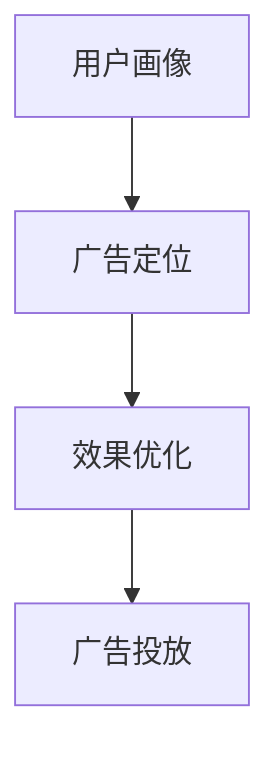
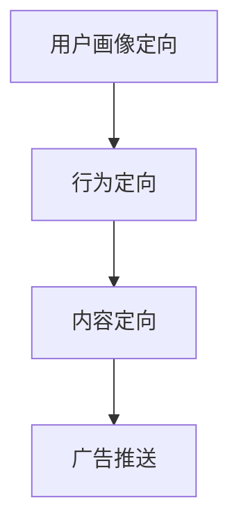

                 


### 文章标题
《AI驱动的智能广告投放：精准定向与效果优化》

### 关键词
AI广告投放，智能广告，精准定向，效果优化，算法原理，实战案例

### 摘要
本文旨在探讨AI驱动的智能广告投放技术，重点分析精准定向与效果优化的策略。通过引入AI算法和数据分析，智能广告投放能够实现更精准的用户定位和更高的广告效果。本文将详细介绍AI广告投放的基本概念、技术原理，并分享实际案例，旨在为读者提供全面的指导。

### 引言
随着互联网的快速发展，广告已成为企业推广产品和服务的重要手段。传统广告投放依赖于市场调研和用户群体分析，存在一定的盲目性和低效性。而AI广告投放的出现，则改变了这一现状。通过利用人工智能技术，广告投放变得更加精准、高效，实现了广告主与潜在客户的精准匹配。

### 核心概念与联系
为了更好地理解AI广告投放的原理，我们首先需要了解以下几个核心概念：

1. **用户画像**：用户画像是指对用户进行全面、细致的描绘，包括用户的年龄、性别、地理位置、兴趣爱好等信息。通过构建用户画像，广告系统能够更好地了解用户需求，实现精准投放。
2. **广告定位**：广告定位是指根据用户画像和广告内容，将广告推送给最有可能对其感兴趣的群体。精准的广告定位能够提高广告的点击率和转化率。
3. **效果优化**：效果优化是指通过不断调整广告投放策略，提高广告投放的效果。这包括优化广告创意、调整投放时间和地域等。

下面是一个描述核心概念之间关系的Mermaid流程图：



### AI广告投放技术基础
AI广告投放的核心在于利用人工智能算法对用户行为和数据进行深度分析，从而实现精准广告投放。以下是一个简单的AI广告投放技术流程：

1. **数据收集**：收集用户的浏览记录、搜索历史、社交媒体互动等数据。
2. **数据处理**：对收集到的数据进行清洗、整合，构建用户画像。
3. **算法应用**：使用机器学习算法对用户画像进行分析，预测用户兴趣和需求。
4. **广告定位**：根据用户画像和广告内容，将广告推送给目标用户。
5. **效果优化**：通过分析广告投放效果，调整广告创意、投放策略等。

下面是一个描述技术流程的伪代码：

```python
# 数据收集
data = collect_data()

# 数据处理
processed_data = process_data(data)

# 构建用户画像
user_profile = build_user_profile(processed_data)

# 算法应用
predictions = apply_algorithm(user_profile)

# 广告定位
target_users = advertise(predictions)

# 效果优化
optimize_advertisement(target_users)
```

### 精准定向策略
精准定向是AI广告投放的关键环节，决定了广告能否准确触达目标用户。以下是一些常见的精准定向策略：

1. **用户画像定向**：根据用户的基本信息、行为数据等，将用户划分为不同的群体，然后针对不同群体推送相应广告。
2. **行为定向**：根据用户的浏览记录、搜索历史等行为数据，分析用户的兴趣偏好，从而推送相关广告。
3. **内容定向**：根据广告内容的特点，选择合适的投放渠道和场景，提高广告的曝光率。

下面是一个描述精准定向策略的Mermaid流程图：



### 广告投放效果优化
广告投放效果优化是提高广告转化率的重要手段。以下是一些常见的优化策略：

1. **A/B测试**：通过对比不同广告创意、投放策略的效果，找出最优方案。
2. **效果评估**：根据广告的点击率、转化率等指标，评估广告投放的效果。
3. **数据驱动**：通过分析用户行为数据，不断调整广告策略，提高广告效果。

下面是一个描述广告投放效果优化的伪代码：

```python
# A/B测试
test_a = test_advertisement(A)
test_b = test_advertisement(B)

# 效果评估
evaluation_a = evaluate(test_a)
evaluation_b = evaluate(test_b)

# 数据驱动
if evaluation_a > evaluation_b:
    use_advertisement(A)
else:
    use_advertisement(B)
```

### 案例研究：AI广告投放成功案例
为了更好地理解AI广告投放的实际效果，我们来看两个成功案例。

#### 案例一：电商平台的智能广告投放

某知名电商平台通过AI广告投放技术，实现了用户精准定位和广告效果优化。具体做法如下：

1. **用户画像构建**：通过分析用户的浏览记录、购物车行为等，构建用户画像。
2. **广告定位**：根据用户画像，将广告推送给有购买意向的用户。
3. **效果优化**：通过A/B测试和数据分析，不断调整广告创意和投放策略，提高广告效果。

通过AI广告投放，该电商平台的广告点击率和转化率显著提高，销售额也实现了快速增长。

#### 案例二：金融行业的精准广告投放

某金融公司通过AI广告投放技术，实现了对潜在客户的精准定位和有效转化。具体做法如下：

1. **用户画像构建**：通过分析用户的金融行为、投资偏好等，构建用户画像。
2. **广告定位**：根据用户画像，将广告推送给有投资需求的用户。
3. **效果优化**：通过A/B测试和效果评估，不断调整广告策略，提高广告效果。

通过AI广告投放，该金融公司的广告投放效果得到了显著提升，客户满意度也大幅提高。

### 实战指南：智能广告投放应用与实践
要实现AI广告投放，需要搭建一个完整的技术平台。以下是搭建智能广告投放平台的基本步骤：

1. **数据收集与处理**：收集用户行为数据，并进行数据清洗和整合。
2. **用户画像构建**：根据收集到的数据，构建用户画像。
3. **广告定位与投放**：根据用户画像，实现广告的精准投放。
4. **效果优化与评估**：通过A/B测试和效果评估，不断调整广告策略。

以下是搭建智能广告投放平台的具体步骤和源代码实现：

#### 步骤1：数据收集与处理
```python
# 数据收集
data = collect_data()

# 数据处理
processed_data = process_data(data)
```

#### 步骤2：用户画像构建
```python
# 构建用户画像
user_profile = build_user_profile(processed_data)
```

#### 步骤3：广告定位与投放
```python
# 广告定位
target_users = advertise(user_profile)

# 广告投放
push_advertisement(target_users)
```

#### 步骤4：效果优化与评估
```python
# A/B测试
test_a = test_advertisement(A)
test_b = test_advertisement(B)

# 效果评估
evaluation_a = evaluate(test_a)
evaluation_b = evaluate(test_b)

# 数据驱动
if evaluation_a > evaluation_b:
    use_advertisement(A)
else:
    use_advertisement(B)
```

### 总结
AI驱动的智能广告投放具有显著的精准性和效果优化能力。通过引入人工智能技术，广告投放变得更加精准、高效。本文详细介绍了AI广告投放的核心概念、技术原理、精准定向策略、效果优化策略，并通过实际案例展示了AI广告投放的成功应用。读者可以根据本文的内容，结合实际业务需求，实现AI广告投放。

### 最佳实践 Tips
1. **数据分析是基础**：要实现精准定向和效果优化，首先要确保数据的准确性和完整性。
2. **持续优化**：广告投放效果并非一蹴而就，需要不断进行A/B测试和效果评估，持续优化广告策略。
3. **关注用户体验**：在广告投放过程中，要注重用户体验，避免过度骚扰用户。

### 注意事项
1. **数据安全**：在收集和处理用户数据时，要注意保护用户隐私。
2. **合法合规**：遵循相关法律法规，确保广告投放的合法性和合规性。

### 拓展阅读
1. [《广告投放实战：策略、技巧与案例分析》](链接)
2. [《人工智能广告投放技术深度解析》](链接)
3. [《用户画像与精准营销》](链接)

### 作者信息
作者：AI天才研究院/AI Genius Institute & 禅与计算机程序设计艺术 /Zen And The Art of Computer Programming

文章标题：《AI驱动的智能广告投放：精准定向与效果优化》

关键词：AI广告投放，智能广告，精准定向，效果优化，算法原理，实战案例

摘要：本文探讨了AI驱动的智能广告投放技术，分析了精准定向与效果优化的策略，并分享了实际案例，旨在为读者提供全面的指导。

