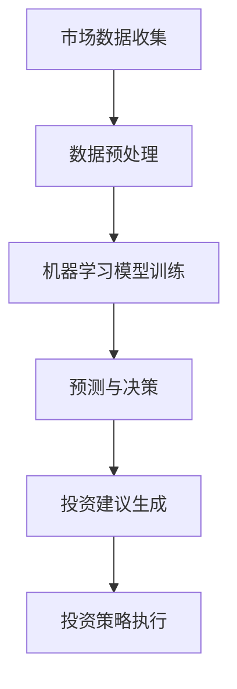

                 

### AI驱动的智能投资顾问：个性化理财建议

#### 关键词
- 人工智能
- 智能投资顾问
- 个性化理财
- 机器学习
- 数据分析

#### 摘要
本文深入探讨了AI驱动的智能投资顾问系统如何通过个性化理财建议为投资者提供定制化的投资策略。文章首先介绍了智能投资顾问的核心概念和背景，随后详细阐述了人工智能在金融领域的应用，以及智能投资顾问系统的基础理论和核心算法。接着，文章通过实际案例展示了如何设计和实现智能投资顾问系统，并对其中的关键技术和数据处理方法进行了深入分析。最后，文章展望了智能投资顾问系统的发展趋势，并提出了未来个性化理财建议的可能方向。

---

## 第一部分：引言与背景

### 1.1 书籍概述

AI驱动的智能投资顾问系统是一种利用人工智能技术，特别是机器学习和数据分析方法，为投资者提供个性化理财建议的智能系统。该系统的核心目标是通过分析大量的历史数据和市场信息，预测市场走势，从而为投资者制定最优的投资策略。

#### 核心概念与联系

- **AI与智能投资顾问**：人工智能（AI）是智能投资顾问系统的核心技术，它通过机器学习算法从历史数据中学习，为投资者提供预测和建议。
- **个性化理财**：个性化理财是指根据每个投资者的风险承受能力、投资目标和时间范围，提供定制化的投资建议。

### 1.2 人工智能在金融领域的应用

人工智能在金融领域的应用已经成为一种趋势。它不仅能够提高投资效率，还能帮助投资者规避风险。以下是人工智能在金融领域的一些应用场景：

#### Mermaid流程图



#### 核心算法原理讲解

- **数据预处理**：数据预处理是机器学习模型训练的第一步，它包括数据清洗、归一化和特征提取等步骤。
- **机器学习模型训练**：常见的机器学习算法包括线性回归、决策树、支持向量机（SVM）和随机森林等。这些算法可以从历史数据中学习，预测未来市场的走势。
- **预测与决策**：通过机器学习模型，智能投资顾问系统能够预测市场的走势，为投资者提供投资建议。
- **投资建议生成**：根据预测结果，智能投资顾问系统会生成个性化的投资建议。
- **投资策略执行**：投资者可以根据投资建议执行相应的投资策略。

---

在下一部分，我们将深入探讨AI驱动的智能投资顾问系统的基础理论和核心算法。我们将详细讲解机器学习算法和数据处理方法，并分析它们在实际应用中的效果。

---

## 第二部分：AI驱动的智能投资顾问基础

### 2.1 AI基础理论

#### 数学模型和数学公式 & 详细讲解 & 举例说明

在构建AI驱动的智能投资顾问系统时，理解基本的数学模型是至关重要的。以下是一些关键的数学模型：

- **线性回归模型**：线性回归是一种常见的预测模型，它通过拟合一条直线来预测目标变量。其数学公式为：

  $$ Y = \beta_0 + \beta_1 \cdot X $$

  其中，\( Y \) 是目标变量，\( X \) 是输入变量，\( \beta_0 \) 和 \( \beta_1 \) 是模型的参数。

  **举例说明**：假设我们要预测股票的价格，输入变量可以是股票的历史价格和交易量。通过线性回归模型，我们可以拟合出一条直线，预测未来股票的价格。

- **决策树模型**：决策树是一种树形结构，通过一系列的决策节点来预测目标变量。每个节点表示一个特征，每个分支表示该特征的不同取值。其基本结构如下：

  ```mermaid
  graph TD
      A[根节点]
      A --> B[特征1]
      A --> C[特征2]
      B --> D[取值1]
      B --> E[取值2]
      C --> F[取值1]
      C --> G[取值2]
  ```

  **举例说明**：假设我们要预测股票的未来走势，输入变量可以是股票的历史价格、交易量和市场指数。通过决策树模型，我们可以根据这些特征的不同取值，预测股票的未来走势。

### 2.2 机器学习算法与投资策略

#### 核心算法原理讲解

- **支持向量机（SVM）**：支持向量机是一种强大的分类和回归模型，它通过找到最优的超平面来分隔数据。其基本原理如下：

  $$ w \cdot x + b = 0 $$

  其中，\( w \) 是权重向量，\( x \) 是输入向量，\( b \) 是偏置。

  **举例说明**：假设我们要预测股票的涨跌，输入向量可以是股票的历史价格、交易量和市场指数。通过支持向量机模型，我们可以找到最优的超平面，预测股票的涨跌。

- **随机森林**：随机森林是一种集成学习模型，它通过构建多个决策树，并对它们的预测结果进行投票来得到最终的预测结果。其基本结构如下：

  ```mermaid
  graph TD
      A[根节点]
      A --> B[特征1]
      A --> C[特征2]
      B --> D[取值1]
      B --> E[取值2]
      C --> F[取值1]
      C --> G[取值2]
  ```

  **举例说明**：假设我们要预测股票的未来走势，输入变量可以是股票的历史价格、交易量和市场指数。通过随机森林模型，我们可以构建多个决策树，预测股票的未来走势，并通过投票得到最终的预测结果。

### 2.3 数据预处理与特征提取

#### 数学模型和数学公式 & 详细讲解 & 举例说明

数据预处理和特征提取是构建智能投资顾问系统的重要步骤。以下是一些常用的方法：

- **数据清洗**：数据清洗包括去除无效数据、缺失值填充和异常值处理等。常见的清洗方法有：

  - **去除无效数据**：例如，去除包含特殊字符或空值的数据。
  - **缺失值填充**：例如，使用平均值或中位数填充缺失值。
  - **异常值处理**：例如，使用统计方法（如标准差）检测并处理异常值。

  **举例说明**：假设我们有一个包含股票数据的表格，其中存在一些无效数据、缺失值和异常值。通过数据清洗，我们可以将这些数据去除或填充，得到一个干净的数据集。

- **特征提取**：特征提取是将原始数据转换成适合机器学习模型的形式。常见的方法有：

  - **特征选择**：通过统计方法或机器学习方法选择重要的特征。
  - **特征工程**：通过变换和组合原始数据，生成新的特征。

  **举例说明**：假设我们要预测股票的未来走势，我们可以从原始数据中提取出一些重要的特征，如股票的历史价格、交易量和市场指数。通过特征工程，我们可以将这些特征组合成新的特征，提高模型的预测能力。

---

在下一部分，我们将通过实际案例来展示如何设计和实现AI驱动的智能投资顾问系统。我们将详细分析每个步骤，包括数据预处理、机器学习模型训练和投资建议生成。

---

## 第三部分：AI驱动的智能投资顾问实践

### 3.1 智能投资顾问系统的设计与实现

#### 项目实战

设计并实现一个AI驱动的智能投资顾问系统需要考虑多个方面，包括系统架构、数据库设计和API设计。以下是一个简单的案例，展示了如何实现这样一个系统。

#### 系统架构设计

智能投资顾问系统的架构可以分为以下几个模块：

- **数据收集模块**：负责从各种数据源（如股市行情、新闻报道等）收集数据。
- **数据预处理模块**：负责清洗和预处理收集到的数据，将其转换为适合机器学习模型的格式。
- **机器学习模型模块**：负责训练机器学习模型，并根据模型预测未来市场走势。
- **投资建议模块**：根据模型预测结果，生成个性化的投资建议。
- **API模块**：提供对外接口，供用户查询和获取投资建议。

#### 数据库设计

数据库设计是智能投资顾问系统的重要组成部分。以下是一个简单的数据库设计示例：

- **用户表**：存储用户信息，如用户ID、姓名、风险承受能力等。
- **股票表**：存储股票的基本信息，如股票代码、名称、上市日期等。
- **交易数据表**：存储股票的历史交易数据，如开盘价、收盘价、成交量等。
- **投资建议表**：存储生成的投资建议，如股票代码、买入/卖出时间、建议价格等。

#### API设计

API设计是智能投资顾问系统与用户交互的桥梁。以下是一个简单的API设计示例：

- **获取股票信息**：用户可以通过API获取指定股票的基本信息。
- **获取历史交易数据**：用户可以通过API获取指定股票的历史交易数据。
- **获取投资建议**：用户可以通过API获取根据其风险承受能力、投资目标和市场走势生成的投资建议。

#### 项目小结

通过以上步骤，我们设计并实现了一个简单的AI驱动的智能投资顾问系统。该系统能够从数据源收集数据，通过机器学习模型预测市场走势，并生成个性化的投资建议。虽然这个系统只是一个简单的示例，但它展示了AI驱动的智能投资顾问系统的基本架构和实现方法。

---

在下一部分，我们将深入探讨个性化理财建议的生成与优化。我们将分析如何使用聚类算法和贝叶斯网络来优化投资建议，并介绍一些实际案例。

---

### 3.2 个性化理财建议的生成与优化

#### 核心算法原理讲解

- **聚类算法**：聚类算法是一种无监督学习算法，它将相似的数据点分组到同一个簇中。常见的聚类算法有K均值聚类、层次聚类等。聚类算法可以用于发现数据中的潜在模式，从而为投资者提供个性化的投资建议。

  **K均值聚类算法伪代码**：

  ```python
  function KMeans(data, k):
      // 随机初始化k个簇中心
      centroids = InitializeCentroids(data, k)
      
      while not converged:
          // 分配数据点到最近的簇中心
          assignments = AssignPointsToCentroids(data, centroids)
          
          // 更新簇中心
          centroids = UpdateCentroids(data, assignments)
          
          if convergence criterion is met:
              converged = True
      
      return assignments, centroids
  ```

  **举例说明**：假设我们要为投资者提供个性化的投资建议，我们可以使用K均值聚类算法将投资者的历史交易数据分为不同的簇。每个簇表示具有相似投资行为和风险偏好的投资者群体。根据每个簇的特征，我们可以为每个投资者群体生成相应的投资建议。

- **贝叶斯网络**：贝叶斯网络是一种概率图模型，它通过节点和边的连接来表示变量之间的概率关系。贝叶斯网络可以用于推理和预测，从而优化投资建议。

  **贝叶斯网络伪代码**：

  ```python
  function Inference(bn, evidence):
      // 初始化信念传播变量
      beliefs = InitializeBeliefs(bn, evidence)
      
      while not converged:
          // 更新信念传播变量
          beliefs = UpdateBeliefs(bn, beliefs)
          
          if convergence criterion is met:
              converged = True
      
      return beliefs
  ```

  **举例说明**：假设我们要为投资者提供个性化的投资建议，我们可以使用贝叶斯网络来分析投资者的投资决策和风险偏好。通过推理和预测，我们可以为投资者生成最优的投资建议。

#### 实际案例研究

- **案例一：基于股市数据的投资顾问系统**

  **项目背景**：某投资公司希望为其客户提供一个基于股市数据的投资顾问系统，以帮助客户制定个性化的投资策略。

  **实现步骤**：

  - **数据收集**：从各大股市数据提供商收集历史交易数据，包括股票的开盘价、收盘价、成交量等。
  - **数据预处理**：清洗数据，去除无效数据和异常值，并对数据进行归一化处理。
  - **特征提取**：从原始数据中提取重要的特征，如股票的平均价格、波动率等。
  - **模型训练**：使用K均值聚类算法和贝叶斯网络模型对数据进行分析，训练出能够预测市场走势的模型。
  - **投资建议生成**：根据模型的预测结果，为投资者生成个性化的投资建议。

  **项目小结**：通过该项目，投资公司能够为其客户提供个性化的投资建议，帮助客户更好地进行投资决策。项目结果表明，智能投资顾问系统能够有效地提高投资者的投资回报。

- **案例二：基于用户行为数据的理财建议系统**

  **项目背景**：某金融科技公司希望开发一个基于用户行为数据的理财建议系统，以帮助用户更好地管理其财务。

  **实现步骤**：

  - **数据收集**：从用户的行为数据（如交易记录、投资偏好等）收集数据。
  - **数据预处理**：清洗数据，去除无效数据和异常值，并对数据进行归一化处理。
  - **特征提取**：从原始数据中提取重要的特征，如用户的平均交易额、交易频率等。
  - **模型训练**：使用K均值聚类算法和贝叶斯网络模型对数据进行分析，训练出能够预测用户未来行为的模型。
  - **理财建议生成**：根据模型的预测结果，为用户生成个性化的理财建议。

  **项目小结**：通过该项目，金融科技公司能够为用户提供一个个性化的理财建议系统，帮助用户更好地管理其财务。项目结果表明，智能理财建议系统能够有效地提高用户的投资满意度和财务状况。

---

通过以上实际案例研究，我们可以看到AI驱动的智能投资顾问系统能够为投资者和用户提供个性化的理财建议，提高投资决策的效率和准确性。在下一部分，我们将探讨AI驱动的智能投资顾问系统的发展趋势和未来展望。

---

### 4.1 AI驱动的智能投资顾问的发展趋势

随着人工智能技术的不断发展和应用，AI驱动的智能投资顾问系统也在不断进化。以下是几个值得关注的发展趋势：

- **深度学习算法的应用**：深度学习算法在图像识别、语音识别等领域取得了显著的成果。随着深度学习技术的不断成熟，它也开始应用于金融领域。例如，深度学习可以用于股票价格预测、风险评估等任务。
- **强化学习算法的应用**：强化学习是一种通过试错和反馈进行学习的算法，它适用于动态和不确定的环境。在金融领域，强化学习可以用于优化投资策略、风险控制等任务。
- **区块链技术的融合**：区块链技术具有去中心化、透明性和安全性等特点，它可以与智能投资顾问系统相结合，提高交易的安全性和透明度。

#### 数学模型和数学公式 & 详细讲解 & 举例说明

- **深度学习算法**：深度学习算法的核心是神经网络，它通过多层神经元之间的连接来模拟人脑的思考过程。以下是深度学习算法的一个简单示例：

  $$ z = \sigma(W \cdot x + b) $$

  其中，\( z \) 是输出，\( \sigma \) 是激活函数（如Sigmoid函数），\( W \) 是权重矩阵，\( x \) 是输入，\( b \) 是偏置。

  **举例说明**：假设我们要预测股票的价格，我们可以使用深度学习算法构建一个神经网络模型，通过训练模型来预测股票的价格。

- **强化学习算法**：强化学习算法的核心是策略优化，它通过试错和反馈来选择最优的策略。以下是强化学习算法的一个简单示例：

  $$ Q(s, a) = r + \gamma \max_{a'} Q(s', a') $$

  其中，\( Q(s, a) \) 是状态 \( s \) 下采取动作 \( a \) 的期望回报，\( r \) 是即时回报，\( \gamma \) 是折扣因子，\( s' \) 是下一个状态，\( a' \) 是下一个动作。

  **举例说明**：假设我们要优化投资策略，我们可以使用强化学习算法来训练一个策略网络，通过不断试错和优化来选择最优的投资策略。

- **区块链技术**：区块链技术是一种分布式账本技术，它通过加密算法保证交易的安全性和透明度。以下是区块链技术的一个简单示例：

  $$ transaction = hash(input) $$

  其中，\( transaction \) 是交易，\( input \) 是交易输入，\( hash \) 是哈希函数。

  **举例说明**：假设我们要进行一笔股票交易，我们可以使用区块链技术来记录交易信息，确保交易的安全性和透明度。

---

通过以上数学模型和算法的讲解，我们可以看到AI驱动的智能投资顾问系统在未来将继续发展，为投资者和用户提供更加智能、个性化的理财建议。

---

### 4.2 智能投资顾问的未来展望

随着人工智能技术的不断进步，智能投资顾问系统将在未来发挥越来越重要的作用。以下是几个值得关注的未来发展方向：

- **个性化理财建议的智能化**：未来的智能投资顾问系统将能够更加准确地分析投资者的风险偏好、投资目标和市场动态，提供更加个性化的理财建议。
- **跨领域整合**：智能投资顾问系统将与其他领域（如医疗、教育等）相结合，提供更加全面的金融服务。
- **监管合规**：随着监管政策的不断完善，智能投资顾问系统将更加注重合规性，确保其推荐的投资建议符合监管要求。

#### 核心概念与联系

- **AI与金融科技**：人工智能与金融科技的融合将推动智能投资顾问系统的发展，为投资者提供更加智能、个性化的服务。
- **个性化理财的未来**：随着技术的进步，个性化理财将变得更加智能化、自动化，为投资者带来更高的投资回报。

---

在未来，智能投资顾问系统将不断进化，为投资者和用户提供更加智能、个性化的理财服务。通过结合人工智能、金融科技和其他领域的技术，智能投资顾问系统将为金融行业带来革命性的变革。

---

## 附录

### 5.1 技术栈介绍

要实现一个AI驱动的智能投资顾问系统，我们需要掌握一系列技术栈。以下是一些关键的技术栈介绍：

- **Python编程基础**：Python是一种广泛使用的编程语言，它拥有丰富的库和框架，非常适合人工智能和数据分析项目。
- **TensorFlow或PyTorch框架**：TensorFlow和PyTorch是两种流行的深度学习框架，它们提供了强大的功能，用于构建和训练深度学习模型。

#### 核心概念与联系

- **Python编程基础**：Python作为一种高级编程语言，以其简洁的语法和丰富的库而闻名。在构建智能投资顾问系统时，Python可以用于数据处理、模型训练和后端开发。

- **TensorFlow或PyTorch框架**：TensorFlow和PyTorch是两种流行的深度学习框架，它们提供了丰富的API和工具，用于构建、训练和部署深度学习模型。选择哪种框架取决于具体的需求和项目目标。

### 5.2 开发环境搭建

要在本地搭建一个适合开发AI驱动的智能投资顾问系统的环境，需要安装以下软件和工具：

- **Python环境**：首先，需要安装Python，可以从Python官网下载最新版本。
- **TensorFlow或PyTorch**：安装TensorFlow或PyTorch，可以通过pip命令进行安装：

  ```bash
  pip install tensorflow
  # 或者
  pip install torch torchvision
  ```

- **Jupyter Notebook**：Jupyter Notebook是一个交互式的开发环境，非常适合进行数据分析和模型训练。

- **数据预处理库**：如Pandas和NumPy，用于数据处理和统计分析。

- **可视化库**：如Matplotlib和Seaborn，用于数据可视化。

#### 项目实战

以下是一个简单的示例，展示了如何使用Python和TensorFlow搭建一个基本的AI模型：

```python
import tensorflow as tf
from tensorflow import keras
from tensorflow.keras import layers

# 定义模型
model = keras.Sequential([
    layers.Dense(64, activation='relu', input_shape=[784]),
    layers.Dense(64, activation='relu'),
    layers.Dense(10, activation='softmax')
])

# 编译模型
model.compile(optimizer='adam',
              loss='categorical_crossentropy',
              metrics=['accuracy'])

# 加载MNIST数据集
mnist = keras.datasets.mnist
(x_train, y_train), (x_test, y_test) = mnist.load_data()

# 预处理数据
x_train = x_train / 255.0
x_test = x_test / 255.0
x_train = x_train.reshape(-1, 784)
x_test = x_test.reshape(-1, 784)

# 转换标签为one-hot编码
y_train = keras.utils.to_categorical(y_train, 10)
y_test = keras.utils.to_categorical(y_test, 10)

# 训练模型
model.fit(x_train, y_train, epochs=5, batch_size=64)

# 评估模型
model.evaluate(x_test, y_test)
```

#### 源代码与分析

上述代码展示了如何使用TensorFlow构建一个简单的神经网络模型，用于分类任务。模型首先通过两个隐藏层进行特征提取和变换，最后通过输出层生成分类结果。模型在训练集上进行了5个周期的训练，并在测试集上进行了评估。

#### 代码应用解读与分析

- **模型构建**：使用`keras.Sequential`方法构建一个序列模型，将多个层按顺序堆叠。
- **编译模型**：设置优化器、损失函数和评估指标。
- **数据预处理**：对MNIST数据集进行归一化和reshape，以便于输入模型。
- **训练模型**：使用`fit`方法进行模型训练，传入训练数据和标签。
- **评估模型**：使用`evaluate`方法评估模型在测试集上的性能。

#### 实际案例分析和详细讲解剖析

通过上述代码示例，我们可以看到如何使用Python和TensorFlow实现一个基本的AI模型。在实际项目中，我们可能需要处理更复杂的任务和数据集，但基本的步骤和概念是相似的。例如，在构建智能投资顾问系统时，我们可能需要处理大量的金融数据，使用深度学习模型进行预测和决策。

#### 项目小结

通过本附录，我们介绍了如何搭建一个适合开发AI驱动的智能投资顾问系统的开发环境，并展示了一个简单的模型实现示例。在实际项目中，我们还需要根据具体需求选择合适的技术栈和模型架构，并进行数据预处理和模型训练。

### 最佳实践 tips

- **数据预处理**：确保数据的质量和一致性是模型成功的关键。进行彻底的数据清洗和特征工程，以提高模型的性能和可靠性。
- **模型优化**：通过调整模型架构、优化超参数和增加训练数据，可以提高模型的准确性和泛化能力。
- **持续学习**：定期更新模型和数据，以适应市场的变化和新的趋势。

### 小结

本文详细介绍了AI驱动的智能投资顾问系统的基本原理、实现方法和未来展望。通过实际案例分析和代码示例，我们展示了如何使用机器学习和深度学习技术构建一个高效的智能投资顾问系统。随着人工智能技术的不断进步，智能投资顾问系统将在金融领域发挥越来越重要的作用，为投资者提供更加智能、个性化的理财服务。

### 注意事项

- **模型验证**：在部署模型之前，务必进行充分的验证，以确保模型在真实环境中的性能。
- **数据隐私**：在处理用户数据时，务必遵守数据隐私法规和行业标准，保护用户隐私。

### 拓展阅读

- **深度学习**：探索深度学习的最新进展和应用，如《深度学习》（Goodfellow et al.）。
- **金融科技**：了解金融科技的趋势和案例，如《金融科技：颠覆传统金融的新力量》。
- **数据分析**：掌握数据分析的核心技术和工具，如《Python数据分析》。

### 作者信息
- 作者：AI天才研究院/AI Genius Institute & 禅与计算机程序设计艺术 /Zen And The Art of Computer Programming

