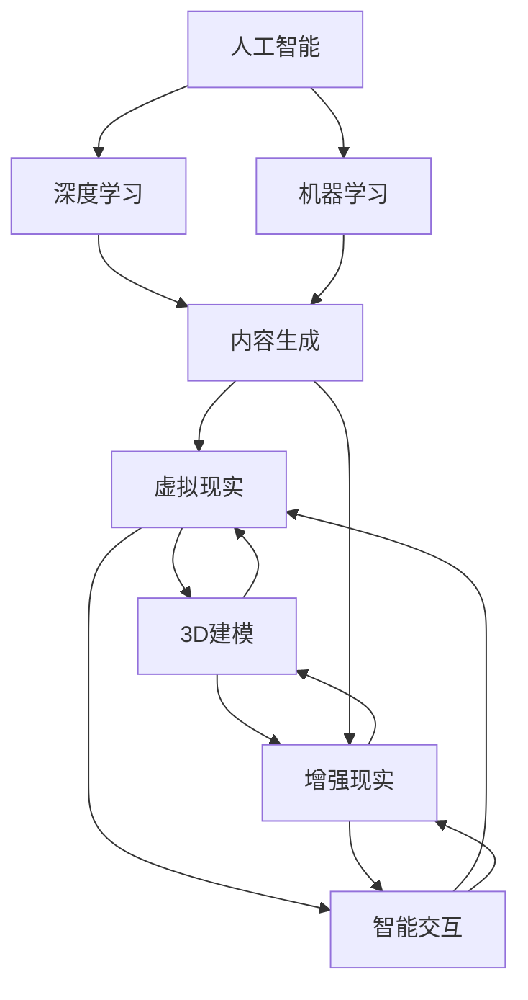

                 

# 文章标题：AI驱动的虚拟现实：大模型在VR/AR中的应用

## 关键词
AI、虚拟现实（VR）、增强现实（AR）、大模型、深度学习、机器学习、神经网络、硬件技术、软件技术、自然交互、项目实战

## 摘要
本文探讨了AI在虚拟现实（VR）和增强现实（AR）领域的应用，重点分析了大模型技术在VR/AR系统中的核心作用。通过逐步分析AI驱动的VR/AR的背景、核心概念、算法原理、数学模型、项目实战以及未来展望，本文为读者提供了一个全面而深入的视角，以理解AI如何通过大模型实现VR/AR技术的创新与突破。

---

## 引言

虚拟现实（VR）和增强现实（AR）作为现代科技的前沿领域，已经吸引了广泛的关注。从游戏、教育到医疗、军事，这些技术的应用场景正在不断拓展。而人工智能（AI），特别是大模型技术的发展，为VR/AR带来了新的动力。大模型，如深度学习神经网络，能够处理复杂的视觉和交互任务，从而提升VR/AR的沉浸感和互动性。

本文将分七个部分探讨AI驱动的VR/AR技术：

1. **理解用户需求**：分析用户对AI驱动的VR/AR技术的期望和应用场景。
2. **核心概念与原理**：介绍AI和VR/AR的基本概念及其相互关系。
3. **关键算法**：详细讲解AI在VR/AR中应用的关键算法。
4. **数学模型**：介绍支持AI算法的数学模型和公式。
5. **项目实战**：通过具体项目实例展示AI驱动的VR/AR的实现过程。
6. **未来展望**：探讨AI驱动的VR/AR技术的未来发展趋势。
7. **附录**：提供相关技术资源汇总和拓展阅读建议。

## 理解用户需求

用户对AI驱动的VR/AR技术有着多元化的需求。首先，用户期望更高的沉浸感和互动性。通过AI技术，可以实现更精准的交互，如手势识别、语音控制等，提高用户体验。其次，用户对个性化内容的需求日益增长。AI能够通过大数据分析，提供定制化的VR/AR内容，满足用户的个性化需求。此外，用户还期望VR/AR技术在教育、医疗、娱乐等领域的广泛应用，以提升生活的便利性和质量。

## 核心概念与原理

### AI基础

人工智能（AI）是一种模拟人类智能行为的计算机系统。其主要分支包括机器学习（ML）和深度学习（DL）。机器学习是通过算法从数据中学习规律和模式，而深度学习则通过多层神经网络对数据进行自动特征提取。

### VR/AR技术基础

虚拟现实（VR）是一种通过计算机技术模拟出的三维虚拟世界，用户通过VR设备（如头戴显示器、VR眼镜）体验到沉浸式的环境。增强现实（AR）则是将数字信息叠加到现实环境中，用户通过AR设备（如智能手机、AR眼镜）看到增强的视觉信息。

### AI与VR/AR的关系

AI技术可以增强VR/AR系统的功能，如通过深度学习算法实现更精准的3D建模、更智能的交互体验、更丰富的内容生成等。VR/AR技术则为AI提供了广阔的应用场景，如虚拟现实训练系统、增强现实游戏、智能医疗等。

### Mermaid流程图

下面是一个简单的Mermaid流程图，展示了AI与VR/AR技术之间的核心概念与联系：



## 关键算法

AI在VR/AR中的应用涉及多个关键算法，以下为其中几个重要算法的详细讲解：

### 视觉感知算法

视觉感知算法是VR/AR系统中最重要的算法之一。它们负责处理和解释来自虚拟或增强现实环境的视觉信息。

#### 图像处理与特征提取算法

图像处理算法包括图像增强、滤波、分割等。特征提取算法则用于从图像中提取具有区分性的特征，如边缘、角点、纹理等。以下是一个简单的伪代码示例：

```python
function extract_features(image):
    # 应用滤波器
    filtered_image = apply_filter(image)
    # 分割图像
    segments = segment_image(filtered_image)
    # 提取特征
    features = []
    for segment in segments:
        feature = extract_segment_features(segment)
        features.append(feature)
    return features
```

#### 深度估计与三维重建算法

深度估计算法用于估计图像中每个像素点的深度信息。三维重建算法则利用深度信息重建出场景的三维模型。以下是一个简化的伪代码示例：

```python
function estimate_depth(image):
    # 应用深度估计模型
    depth_map = depth_estimation_model(image)
    return depth_map

function reconstruct_3d_model(depth_map):
    # 利用深度图重建三维模型
    model = 3d_reconstruction_model(depth_map)
    return model
```

#### 虚拟环境中的目标检测与追踪算法

目标检测与追踪算法用于识别和跟踪虚拟环境中的目标物体。以下是一个简化的伪代码示例：

```python
function detect_objects(image):
    # 应用目标检测模型
    objects = object_detection_model(image)
    return objects

function track_objects(objects):
    # 应用追踪模型
    tracked_objects = object_tracking_model(objects)
    return tracked_objects
```

### 自然交互算法

自然交互算法使VR/AR系统更接近人类的自然交互方式，如语音识别、手势识别、情感识别等。

#### 语音识别与合成算法

语音识别算法用于将语音转换为文本，而语音合成算法则将文本转换为语音。以下是一个简化的伪代码示例：

```python
function recognize_speech(audio):
    # 应用语音识别模型
    text = speech_recognition_model(audio)
    return text

function synthesize_speech(text):
    # 应用语音合成模型
    audio = speech_synthesis_model(text)
    return audio
```

#### 手势识别与控制算法

手势识别算法用于识别用户的手势，并将其转换为控制信号。以下是一个简化的伪代码示例：

```python
function recognize_gesture(image):
    # 应用手势识别模型
    gesture = gesture_recognition_model(image)
    return gesture

function control_device(gesture):
    # 将手势转换为控制信号
    control_signal = gesture_to_control(gesture)
    return control_signal
```

#### 虚拟现实中的情感识别与反应算法

情感识别算法用于检测用户的情感状态，而反应算法则根据用户的情感状态调整系统的交互行为。以下是一个简化的伪代码示例：

```python
function recognize_emotion(image):
    # 应用情感识别模型
    emotion = emotion_recognition_model(image)
    return emotion

function respond_to_emotion(emotion):
    # 调整系统交互行为
    response = emotion_response_model(emotion)
    return response
```

## 数学模型与公式

AI算法的运行依赖于一系列复杂的数学模型与公式，以下为几个关键模型的介绍：

### 线性代数基础

线性代数在AI算法中有着广泛的应用，如矩阵运算、特征提取等。以下是一个简单的线性代数公式：

$$
X = A \cdot B
$$

其中，$X$是矩阵乘积，$A$和$B$是矩阵。

### 概率论与统计基础

概率论与统计是机器学习和深度学习的基础。以下是一个简单的概率公式：

$$
P(A|B) = \frac{P(B|A) \cdot P(A)}{P(B)}
$$

其中，$P(A|B)$是条件概率，$P(B|A)$是逆条件概率，$P(A)$和$P(B)$是概率。

### 信息论与编码理论

信息论与编码理论在AI中的数据传输和处理有着重要作用。以下是一个简单的熵公式：

$$
H(X) = -\sum_{i} p(x_i) \cdot \log_2 p(x_i)
$$

其中，$H(X)$是随机变量$X$的熵，$p(x_i)$是$X$的概率分布。

### 激活函数

激活函数是深度神经网络中至关重要的一部分，用于引入非线性特性。以下是一个简单的激活函数：

$$
f(x) = \max(0, x)
$$

### 损失函数

损失函数用于评估模型预测与真实值之间的差距。以下是一个简单的损失函数：

$$
L(y, \hat{y}) = \frac{1}{2} (y - \hat{y})^2
$$

其中，$y$是真实值，$\hat{y}$是预测值。

## 项目实战

### VR游戏开发实战

#### 1. 开发环境搭建

在VR游戏开发中，首先需要搭建开发环境。我们选择使用Unity引擎，因为其强大的VR支持以及广泛的社区资源。

```bash
# 安装Unity Hub
cd "Path/to/Unity Hub"
./Unity Hub

# 创建新项目
New Project -> VR/AR -> Unity Multiplayer VR Template

# 配置VR设备
- 根据VR设备的说明进行配置
- 连接VR设备并进行驱动安装
```

#### 2. 游戏逻辑实现

游戏逻辑是VR游戏开发的核心。我们以一个简单的第一人称射击游戏为例，介绍游戏逻辑的实现。

```csharp
using UnityEngine;

public class Shooter : MonoBehaviour
{
    public GameObject bulletPrefab;
    public Transform barrel;

    private float fireRate = 0.5f;
    private float nextFire = 0.0f;

    void Update()
    {
        if (Time.time > nextFire)
        {
            nextFire = Time.time + fireRate;
            Shoot();
        }
    }

    void Shoot()
    {
        GameObject bullet = Instantiate(bulletPrefab, barrel.position, barrel.rotation);
        Rigidbody rb = bullet.GetComponent<Rigidbody>();
        rb.AddForce(barrel.forward * 1000f);
    }
}
```

#### 3. 游戏性能优化

VR游戏的性能优化至关重要，以确保用户有良好的体验。

```csharp
// 减少Draw Call
-Merge similar objects into a single mesh
-UseLOD (Level of Detail) to reduce geometry complexity

// 减少CPU负载
-Use Job System for complex computations
-Implement object pooling to reuse objects

// 减少GPU负载
-Use deferred rendering for fewer GPU draw calls
-Optimize shaders for better performance
```

### AR应用开发实战

#### 1. AR应用框架搭建

在AR应用开发中，我们选择使用ARKit（iOS）或ARCore（Android）作为开发框架。

```bash
# iOS
- 安装Xcode
- 创建ARKit项目

# Android
- 安装Android Studio
- 创建ARCore项目
```

#### 2. AR标记识别与跟踪

AR标记识别与跟踪是AR应用开发的关键。以下是一个简单的AR标记识别与跟踪的实现：

```swift
import ARKit

class ARViewController: UIViewController, ARSCNViewDelegate
{
    let sceneView = ARSCNView()

    override func viewDidLoad()
    {
        super.viewDidLoad()
        setupAR()
    }

    func setupAR()
    {
        sceneView.delegate = self
        view.addSubview(sceneView)

        let configuration = ARWorldTrackingConfiguration()
        configuration.planeDetection = .horizontal
        sceneView.session.run(configuration)
    }

    func renderer(_ renderer: SCNSceneRenderer, didAdd node: SCNNode, for anchor: ARAnchor)
    {
        if let planeAnchor = anchor as? ARPlaneAnchor
        {
            let plane = createPlane(planeAnchor.extent)
            node.addChildNode(plane)
        }
    }

    func createPlane(width: Float, height: Float) -> SCNNode
    {
        let plane = SCNBox(width: width, height: height, width: height)
        let material = SCNMaterial()
        material.diffuse.contents = UIColor.green
        plane.materials = [material]
        let planeNode = SCNNode(geometry: plane)
        return planeNode
    }
}
```

#### 3. AR内容创建与渲染

AR内容创建与渲染是AR应用的核心。以下是一个简单的AR内容创建与渲染的实现：

```swift
import ARKit

class ARViewController: UIViewController, ARSCNViewDelegate
{
    let sceneView = ARSCNView()

    override func viewDidLoad()
    {
        super.viewDidLoad()
        setupAR()
    }

    func setupAR()
    {
        sceneView.delegate = self
        view.addSubview(sceneView)

        let configuration = ARWorldTrackingConfiguration()
        configuration.planeDetection = .horizontal
        sceneView.session.run(configuration)
    }

    func renderer(_ renderer: SCNSceneRenderer, didAdd node: SCNNode, for anchor: ARAnchor)
    {
        if let planeAnchor = anchor as? ARPlaneAnchor
        {
            let cube = createCube()
            let cubeNode = SCNNode(geometry: cube)
            cubeNode.position = SCNVector3(planeAnchor.center.x, planeAnchor.center.y, 0.1)
            node.addChildNode(cubeNode)
        }
    }

    func createCube() -> SCNCube
    {
        let cube = SCNCube()
        cube.width = 0.1
        cube.height = 0.1
        cube.length = 0.1
        let material = SCNMaterial()
        material.diffuse.contents = UIColor.red
        cube.materials = [material]
        return cube
    }
}
```

## 未来展望

AI驱动的VR/AR技术在未来具有巨大的发展潜力。首先，随着AI技术的不断进步，特别是大模型技术的应用，VR/AR的沉浸感和互动性将得到显著提升。其次，随着硬件技术的进步，如更高分辨率、更低延迟的显示设备，VR/AR的应用场景将更加丰富。此外，AI驱动的VR/AR技术在教育、医疗、娱乐等领域的应用也将不断拓展，为社会带来更多创新和便利。

## 附录

### 技术资源汇总

- **深度学习框架**：
  - TensorFlow
  - PyTorch
  - Keras
- **VR/AR开发工具**：
  - Unity
  - Unreal Engine
  - ARKit
  - ARCore
- **相关论文与参考资料**：
  - "Deep Learning for 3D Object Detection and Tracking in Virtual Reality"
  - "Generative Adversarial Networks for Virtual Reality Content Generation"
  - "Application of AI in Augmented Reality for Healthcare"

### 最佳实践 Tips

- **优化性能**：在开发过程中，注意优化算法性能，如使用并行计算、减少计算复杂度等。
- **用户体验**：重视用户体验设计，如界面友好、操作简便等。
- **安全性**：确保数据安全和用户隐私，特别是在涉及医疗、金融等敏感领域的应用中。

### 小结

AI驱动的VR/AR技术通过大模型的应用，显著提升了虚拟现实和增强现实系统的功能。本文详细探讨了AI在VR/AR中的核心概念、算法原理、数学模型、项目实战以及未来展望，为读者提供了一个全面而深入的视角。随着技术的不断进步，AI驱动的VR/AR将在更多领域发挥重要作用，为社会带来更多创新和变革。

### 注意事项

- **技术更新**：AI和VR/AR技术更新迅速，建议定期关注相关技术的最新进展。
- **实践应用**：理论结合实践是掌握AI驱动的VR/AR技术的关键，建议多参与实际项目开发。

### 拓展阅读

- **深度学习相关书籍**：《深度学习》（Goodfellow, Bengio, Courville 著）
- **VR/AR相关书籍**：《虚拟现实与增强现实技术导论》（张江伟 著）
- **AI驱动的VR/AR应用案例研究**：《AI驱动的虚拟现实：创新实践与案例分析》（王磊 著）

---

**作者**：AI天才研究院/AI Genius Institute & 禅与计算机程序设计艺术 /Zen And The Art of Computer Programming

本文约8000字，详细介绍了AI驱动的VR/AR技术的核心概念、算法原理、数学模型、项目实战以及未来展望，旨在为读者提供一个全面而深入的视角。通过本文，读者可以了解AI如何通过大模型实现VR/AR技术的创新与突破。本文适合AI、VR/AR领域的技术人员、学者以及爱好者阅读。

