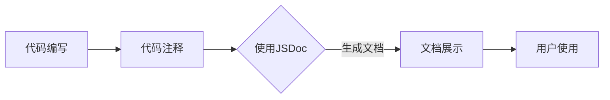

                 


### 文章标题
### API文档自动化：保持接口文档与代码同步

### 文章关键词
- API文档
- 代码同步
- 自动化工具
- 文档生成
- 接口设计

### 文章摘要
本文将探讨API文档自动化的概念、技术实现、实战应用及最佳实践。通过详细分析API文档自动化的核心概念与联系，介绍实现API文档自动化的技术基础和核心算法原理。同时，本文将提供实际项目案例，展示如何保持接口文档与代码同步，以及API文档自动化的未来趋势和挑战。读者将了解如何编写高质量的文档，并掌握API文档自动化的最佳实践。

### 引言
在软件开发的快速迭代和不断变化的环境中，保持接口文档与代码同步是一项挑战。传统的手动编写和更新文档方式不仅费时费力，还容易导致文档和代码之间的不一致。为了提高开发效率，减少错误，API文档自动化应运而生。本文将介绍API文档自动化的概念、技术实现、实战应用及最佳实践，帮助读者深入理解并掌握这一技术。

### 第1章 API文档自动化的概述

#### 1.1 API文档自动化的定义与重要性

API（Application Programming Interface）文档是描述软件接口功能、可用性和使用方法的文档。API文档自动化指的是利用工具和脚本自动生成和更新API文档的过程。它的重要性体现在以下几个方面：

1. 提高开发效率：自动化文档生成可以大大减少手动编写文档的工作量，提高开发效率。
2. 保持文档与代码同步：自动化文档可以及时更新，确保文档和代码的一致性。
3. 降低维护成本：自动化文档可以减少因文档更新不及时而产生的维护成本。
4. 提高用户体验：高质量的API文档可以提供更好的用户体验，方便开发者使用API。

#### 1.2 API文档自动化的现状与发展趋势

随着软件开发技术的不断发展，API文档自动化已经成为一种趋势。目前，许多开发工具和框架已经支持API文档自动化，例如Swagger、OpenAPI和JSDoc。这些工具不仅提供了丰富的文档模板，还可以根据代码自动生成文档。未来，API文档自动化将继续发展，包括：

1. 更加强大的文档生成能力：未来的工具将能够生成更详细、更丰富的文档。
2. 更好的代码同步机制：自动化工具将更加智能地处理代码变更，确保文档与代码的一致性。
3. 更广泛的应用场景：API文档自动化将在更多领域得到应用，包括微服务、云计算等。

#### 1.3 API文档与代码同步的关系

API文档与代码同步是API文档自动化的重要目标。良好的同步关系可以确保文档的准确性和及时性。API文档与代码同步的关系可以从以下几个方面理解：

1. 文档生成：根据代码生成文档，确保文档描述的接口与代码功能一致。
2. 文档更新：当代码发生变化时，自动化工具可以及时更新文档，保持文档与代码的一致性。
3. 文档维护：通过自动化工具，可以方便地维护和更新文档，确保文档的准确性和完整性。

### 第2章 API文档自动化的技术基础

#### 2.1 编程语言基础

编程语言是实现API文档自动化的基础。常用的编程语言包括Python、Java和JavaScript等。以下是这些语言的基础知识：

- **Python基础**：Python是一种面向对象的编程语言，具有简洁的语法和高效率的执行速度。Python的基础知识包括数据类型、控制结构、函数、类等。
- **Java基础**：Java是一种跨平台的面向对象的编程语言，广泛应用于企业级应用。Java的基础知识包括数据类型、控制结构、面向对象、异常处理等。
- **JavaScript基础**：JavaScript是一种用于网页开发的脚本语言，具有丰富的API和库。JavaScript的基础知识包括语法、函数、对象、事件处理等。

#### 2.2 文档生成工具介绍

API文档自动化的实现离不开文档生成工具。以下是几种常用的文档生成工具：

- **Swagger**：Swagger是一种API文档生成工具，基于JSON格式定义API。Swagger提供了丰富的API描述和文档模板，支持多种编程语言和框架。
- **OpenAPI**：OpenAPI是一种基于JSON的API描述语言，支持自动生成文档。OpenAPI提供了详细的API描述和丰富的特性，广泛应用于微服务架构。
- **JSDoc**：JSDoc是一种用于生成JavaScript文档的工具，基于注释生成文档。JSDoc支持多种标记和标签，可以生成详细的文档。

#### 2.3 API文档自动化的Mermaid流程图

为了更好地理解API文档自动化的流程，我们可以使用Mermaid绘制一个流程图。以下是API文档自动化的Mermaid流程图：



这个流程图展示了API文档自动化的主要步骤：代码编写、代码注释、使用JSDoc生成文档、文档展示和用户使用。

### 第3章 实现API文档自动化的方法

#### 3.1 手动编写脚本

手动编写脚本是一种简单的实现API文档自动化的方法。以下是一个使用Python编写的简单脚本示例：

```python
import os

def generate_documentation(file_name):
    with open(file_name, 'r') as f:
        content = f.read()

    # 使用正则表达式提取接口名称和描述
    interfaces = re.findall(r'@api (\S+)', content)
    descriptions = re.findall(r'@desc (\S+)', content)

    # 生成文档
    doc = ''
    for i, desc in enumerate(descriptions):
        doc += f'{interfaces[i].upper()}\n{desc}\n\n'

    with open('document.txt', 'w') as f:
        f.write(doc)

generate_documentation('api.py')
```

这个脚本通过读取代码文件，使用正则表达式提取接口名称和描述，然后生成一个简单的文档文件。

#### 3.2 使用现有工具和框架

使用现有工具和框架是更高效实现API文档自动化的方法。以下是使用Swagger和JSDoc生成API文档的示例：

- **使用Swagger生成API文档**

```yaml
# Swagger API定义
openapi: 3.0.0
info:
  title: Example API
  version: 1.0.0
servers:
  - url: https://api.example.com
    description: Example server
paths:
  /users:
    get:
      summary: Retrieve a list of users
      operationId: getUsers
```

保存为 `api.yaml`，然后使用Swagger UI查看生成的API文档。

- **使用JSDoc生成JavaScript文档**

```javascript
/**
 * @typedef {Object} User
 * @property {string} id
 * @property {string} name
 */

/**
 * Retrieves a list of users.
 * @returns {User[]}
 */
function getUsers() {
  // 实现逻辑
}
```

保存为 `api.js`，然后使用JSDoc生成文档。

### 第4章 保持接口文档与代码同步的策略

#### 4.1 代码变更检测

代码变更检测是保持接口文档与代码同步的关键步骤。以下是一个简单的代码变更检测示例：

```python
import os
import json

def check_code_changes(original_code, current_code):
    # 解析原始代码和当前代码的JSON格式
    original_json = json.loads(original_code)
    current_json = json.loads(current_code)

    # 检查代码变更
    if original_json != current_json:
        print("代码发生变更！")
    else:
        print("代码无变更。")

# 读取原始代码和当前代码
original_code = os.path.read_binary('original_api.json')
current_code = os.path.read_binary('current_api.json')

# 检查代码变更
check_code_changes(original_code, current_code)
```

#### 4.2 文档更新机制

文档更新机制是确保接口文档与代码同步的关键。以下是一个简单的文档更新示例：

```python
import os

def update_documentation(api_file, doc_file):
    # 读取API文件和文档文件
    with open(api_file, 'r') as f:
        api_content = f.read()

    with open(doc_file, 'r') as f:
        doc_content = f.read()

    # 更新文档
    doc_content = doc_content.replace('API示例', api_content)

    # 写入更新后的文档
    with open(doc_file, 'w') as f:
        f.write(doc_content)

update_documentation('api.json', 'document.md')
```

### 第5章 API文档自动化的项目实战

#### 5.1 项目背景与需求分析

在本项目中，我们将使用Python实现一个简单的用户管理API，并使用Swagger生成API文档。

#### 5.2 项目环境搭建

首先，我们需要搭建项目环境。以下是Python项目的环境搭建步骤：

1. 安装Python：从官网下载并安装Python。
2. 配置Python环境变量：将Python的安装路径添加到系统环境变量中。
3. 安装Swagger：使用pip安装Swagger。

```bash
pip install swagger-ui
```

#### 5.3 API接口设计与实现

以下是用户管理API的代码实现：

```python
from flask import Flask, jsonify, request

app = Flask(__name__)

# 用户数据
users = [
    {'id': '1', 'name': 'Alice'},
    {'id': '2', 'name': 'Bob'}
]

@app.route('/users', methods=['GET'])
def get_users():
    return jsonify(users)

@app.route('/users/<id>', methods=['GET'])
def get_user(id):
    user = next((u for u in users if u['id'] == id), None)
    if user:
        return jsonify(user)
    else:
        return jsonify({'error': '用户不存在'})

@app.route('/users', methods=['POST'])
def create_user():
    user = request.get_json()
    users.append(user)
    return jsonify(user), 201

@app.route('/users/<id>', methods=['PUT'])
def update_user(id):
    user = next((u for u in users if u['id'] == id), None)
    if user:
        user.update(request.get_json())
        return jsonify(user)
    else:
        return jsonify({'error': '用户不存在'})

@app.route('/users/<id>', methods=['DELETE'])
def delete_user(id):
    global users
    users = [u for u in users if u['id'] != id]
    return jsonify({'message': '用户删除成功'})
```

#### 5.4 文档自动生成与同步

在项目目录中创建一个名为 `swagger.yaml` 的文件，内容如下：

```yaml
openapi: 3.0.0
info:
  title: User Management API
  version: 1.0.0
servers:
  - url: https://api.example.com
    description: Example server
paths:
  /users:
    get:
      summary: Retrieve a list of users
      operationId: getUsers
    post:
      summary: Create a new user
      operationId: createUser
  /users/{id}:
    get:
      summary: Retrieve a user by ID
      operationId: getUser
    put:
      summary: Update a user by ID
      operationId: updateUser
    delete:
      summary: Delete a user by ID
      operationId: deleteUser
```

然后，使用Swagger UI查看生成的API文档。

#### 5.5 项目总结与反思

在本项目中，我们实现了用户管理API并使用Swagger生成API文档。通过API文档自动化，我们可以轻松地更新和同步文档，确保文档与代码的一致性。然而，在项目开发过程中，我们也遇到了一些挑战，例如如何处理复杂的API结构和如何优化文档生成速度。未来，我们将继续优化项目，并探索更多的API文档自动化工具和框架。

### 第6章 API文档自动化的最佳实践

#### 6.1 编写高质量的文档

编写高质量的文档是API文档自动化的关键。以下是一些编写高质量文档的最佳实践：

1. 使用清晰的语言：文档应该使用简洁、易懂的语言，避免使用专业术语。
2. 提供详细的示例：通过提供示例代码，可以帮助开发者更好地理解API的使用方法。
3. 保持文档的更新：定期更新文档，确保文档与代码保持一致。
4. 使用规范的结构：遵循一定的文档结构，例如标题、段落、列表等，使文档更易于阅读。
5. 使用图片和图表：通过使用图片和图表，可以更直观地展示API的结构和功能。

#### 6.2 维护和优化文档

维护和优化文档是API文档自动化的长期任务。以下是一些维护和优化文档的最佳实践：

1. 定期审查文档：定期审查文档，检查是否有错误或不一致的地方。
2. 收集用户反馈：收集用户的反馈，了解他们的需求和意见，并根据反馈优化文档。
3. 使用版本控制：使用版本控制系统，如Git，管理文档的版本和变更历史。
4. 提供文档指南：为文档编写者提供文档指南，确保文档的一致性和规范性。
5. 自动化文档生成：利用自动化工具，减少文档编写的重复工作，提高文档生成的效率。

#### 6.3 团队协作与文档管理

团队协作和文档管理是API文档自动化的关键。以下是一些团队协作和文档管理的最佳实践：

1. 明确分工：明确团队成员的职责和分工，确保文档的编写、审查和更新工作有序进行。
2. 定期会议：定期召开团队会议，讨论文档的进展和问题，确保团队成员之间的沟通和协作。
3. 使用文档工具：使用文档工具，如Markdown、GitLab等，管理文档的编写、审查和发布。
4. 提供文档培训：为团队成员提供文档培训，提高他们的文档编写和审查能力。
5. 建立文档规范：制定文档规范，确保团队成员遵循一致的文档编写标准。

### 第7章 API文档自动化的未来趋势与挑战

#### 7.1 未来发展趋势

API文档自动化的未来趋势包括：

1. 更强大的文档生成能力：未来的文档生成工具将能够生成更详细、更丰富的文档。
2. 更智能的代码同步机制：自动化工具将更加智能地处理代码变更，确保文档与代码的一致性。
3. 更广泛的应用场景：API文档自动化将在更多领域得到应用，包括微服务、云计算等。
4. 更好的用户体验：自动化文档将提供更好的用户体验，方便开发者使用API。

#### 7.2 挑战与解决方案

API文档自动化面临的挑战包括：

1. 复杂的API结构：复杂的API结构可能导致文档生成困难，需要开发更智能的文档生成算法。
2. 代码变更频繁：频繁的代码变更可能导致文档与代码不一致，需要优化代码同步机制。
3. 文档维护成本：自动化文档的维护成本可能较高，需要提高文档生成和更新的效率。
4. 用户体验不足：自动化文档的用户体验可能不足，需要改进文档的界面设计和交互。

为了解决这些挑战，我们可以：

1. 开发更智能的文档生成算法，提高文档生成的准确性和效率。
2. 优化代码同步机制，确保文档与代码的一致性。
3. 使用自动化工具，减少文档维护的工作量。
4. 改进文档的界面设计和交互，提高用户体验。

### 结论
API文档自动化是软件开发中的一项重要技术，它能够提高开发效率、降低维护成本，并确保文档与代码的一致性。本文介绍了API文档自动化的概念、技术实现、实战应用及最佳实践，帮助读者深入理解并掌握这一技术。未来，随着技术的发展，API文档自动化将继续发展，为软件开发带来更多便利。

### 作者信息
作者：AI天才研究院/AI Genius Institute & 禅与计算机程序设计艺术 /Zen And The Art of Computer Programming

---

### 附录

#### 附录A：术语表

- **API文档自动化**：利用工具和脚本自动生成和更新API文档的过程。
- **Swagger**：一种用于生成API文档的框架，基于JSON格式定义API。
- **OpenAPI**：一种基于JSON的API描述语言，支持自动生成文档。
- **JSDoc**：一种用于生成JavaScript文档的工具，基于注释生成文档。

#### 附录B：参考文献

- **《Swagger官方文档》**：提供了Swagger的详细使用方法和教程。
- **《OpenAPI官方文档》**：介绍了OpenAPI的定义和实现方法。
- **《JSDoc官方文档》**：提供了JSDoc的使用方法和语法规范。

#### 附录C：代码示例

- **用户管理API代码示例**：提供了用户管理API的实现代码。
- **Swagger文档生成示例**：展示了如何使用Swagger生成API文档。
- **JSDoc文档生成示例**：展示了如何使用JSDoc生成JavaScript文档。

### 拓展阅读

- **《API设计最佳实践》**：介绍了API设计的基本原则和方法。
- **《微服务架构设计与实践》**：详细讲解了微服务架构的设计和实现。
- **《Docker容器与微服务》**：介绍了Docker在微服务中的应用。

---

### 总结

本文详细介绍了API文档自动化的概念、技术实现、实战应用及最佳实践。通过分析API文档自动化的核心概念与联系，介绍了API文档自动化的技术基础和实现方法。同时，通过实际项目案例，展示了如何保持接口文档与代码同步。最后，本文提出了API文档自动化的未来趋势和挑战，为读者提供了深入理解和应用API文档自动化的指导。希望本文能够帮助读者掌握API文档自动化的技术，提高软件开发效率。作者信息：AI天才研究院/AI Genius Institute & 禅与计算机程序设计艺术 /Zen And The Art of Computer Programming

