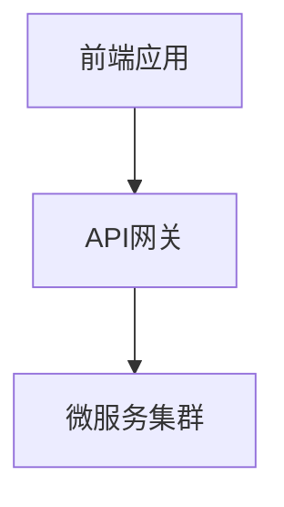
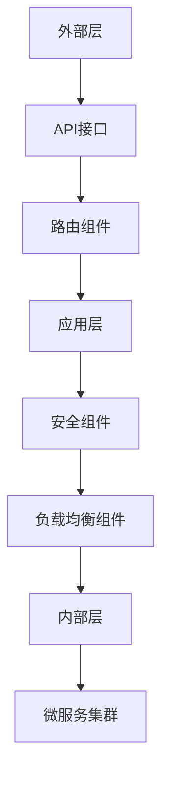
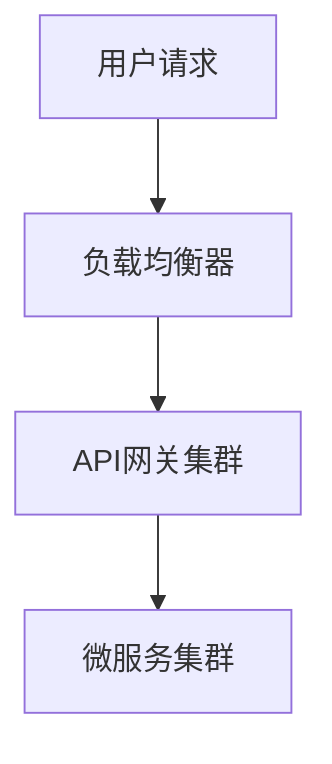
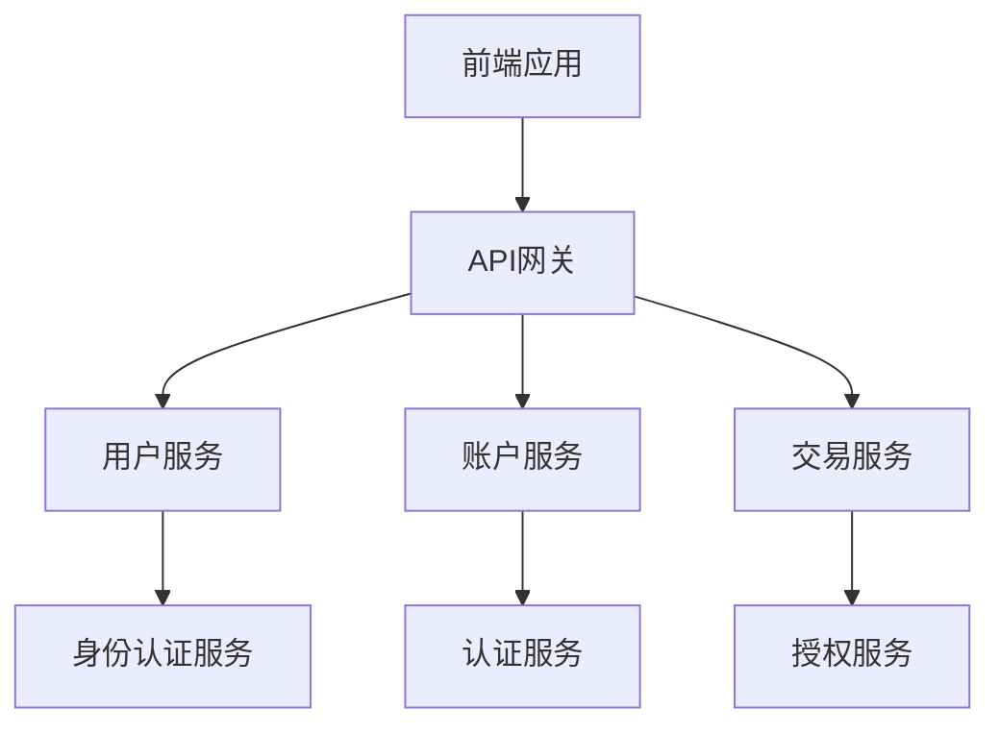
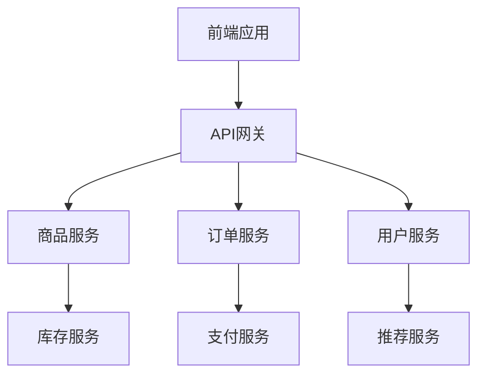

                 


### 文章标题

# API网关：微服务架构的统一入口

### 关键词

- API网关
- 微服务架构
- 负载均衡
- 安全性
- 路由算法
- HTTP/HTTPS
- gRPC
- WebSocket

### 摘要

本文旨在深入探讨API网关在微服务架构中的应用及其重要性。我们将从API网关的基本概念入手，逐步解析其在微服务架构中的角色和功能。文章将详细介绍API网关的架构设计、核心算法原理，以及如何在开发、部署和运维过程中实现API网关。此外，我们将探讨API网关在不同行业中的应用案例，并展望其未来的发展趋势。通过本文的详细讲解，读者将能够全面理解API网关的作用，掌握其实现和优化方法。

### 目录大纲设计方案

为了确保文章逻辑清晰、内容丰富，我们设计了一个详细的目录大纲，包括以下几个部分：

1. **第一部分：API网关概述**
   - **第1章：API网关的基本概念**
     - **1.1 API网关的定义与作用**
     - **1.2 API网关在微服务架构中的位置**
     - **1.3 API网关的核心功能**

   - **第2章：API网关的架构设计**
     - **2.1 API网关的分层架构**
     - **2.2 API网关的关键组件**
     - **2.3 API网关的通信协议**

   - **第3章：API网关的核心算法**
     - **3.1 负载均衡算法**
     - **3.2 路由算法**
     - **3.3 安全算法**

2. **第二部分：API网关实现**
   - **第4章：API网关开发环境搭建**
     - **4.1 开发环境准备**
     - **4.2 开发工具安装与配置**
     - **4.3 开发流程规划**

   - **第5章：API网关设计与实现**
     - **5.1 API网关架构设计**
     - **5.2 API网关核心功能实现**
     - **5.3 API网关性能优化**

   - **第6章：API网关部署与运维**
     - **6.1 API网关部署策略**
     - **6.2 API网关运维管理**
     - **6.3 日志分析与监控**

3. **第三部分：API网关应用场景**
   - **第7章：API网关在金融行业的应用**
     - **7.1 金融行业对API网关的需求**
     - **7.2 金融行业API网关的实现案例**
     - **7.3 金融行业API网关的挑战与解决方案**

   - **第8章：API网关在电商行业的应用**
     - **8.1 电商行业对API网关的需求**
     - **8.2 电商行业API网关的实现案例**
     - **8.3 电商行业API网关的挑战与解决方案**

4. **第四部分：API网关的未来趋势**
   - **第9章：API网关的发展趋势**
     - **9.1 API网关技术发展趋势**
     - **9.2 API网关在云原生架构中的应用**
     - **9.3 API网关的安全性与隐私保护**

   - **第10章：API网关的最佳实践**
     - **10.1 设计原则**
     - **10.2 实践案例**
     - **10.3 性能优化技巧**

### 文章正文

#### 第一部分：API网关概述

##### 第1章：API网关的基本概念

###### 1.1 API网关的定义与作用

API网关是一种服务设计模式，它作为前后端通信的统一入口，对内部多个服务进行统一管理和控制。API网关的主要作用包括：

1. **统一服务管理**：API网关可以集中管理内部多个服务的接口，提供统一的接口规范和路由策略。
2. **路由与转发**：API网关能够根据请求的URL或HTTP头部信息，将请求路由到相应的内部服务。
3. **负载均衡**：API网关可以采用多种负载均衡算法，将请求均匀地分发到多个后端服务，提高系统的整体性能。
4. **安全性**：API网关可以对请求进行身份验证和授权，确保只有合法的请求才能访问内部服务。
5. **监控与日志**：API网关可以收集和记录请求的日志信息，提供监控和故障排查的依据。

###### 1.2 API网关在微服务架构中的位置

在微服务架构中，API网关位于前端和后端之间，充当着统一入口的角色。它的位置如图1-1所示：



- **前端应用**：前端应用通过HTTP/HTTPS协议向API网关发送请求。
- **API网关**：API网关对请求进行身份验证、路由和转发，然后将请求发送到后端的微服务集群。
- **微服务集群**：微服务集群由多个微服务实例组成，每个实例负责处理特定的业务功能。

通过API网关，前端应用可以透明地访问后端微服务，而不需要了解后端的具体实现细节。这种设计模式提高了系统的可扩展性和可维护性。

###### 1.3 API网关的核心功能

API网关的核心功能包括以下几个方面：

1. **路由与转发**：根据请求的URL或HTTP头部信息，将请求路由到相应的微服务实例。
2. **负载均衡**：采用轮询、最少连接、加权最少连接等负载均衡算法，将请求均匀地分发到多个微服务实例。
3. **安全性**：对请求进行身份验证和授权，确保只有合法的请求才能访问内部服务。
4. **服务熔断与降级**：当后端服务出现故障或负载过高时，API网关可以熔断请求，防止系统崩溃。
5. **监控与日志**：收集和记录请求的日志信息，提供监控和故障排查的依据。
6. **缓存与压缩**：对响应数据进行缓存和压缩，提高数据传输效率和响应速度。

#### 第2章：API网关的架构设计

##### 2.1 API网关的分层架构

API网关的架构通常分为三层：外部层、应用层和内部层。每层都有其特定的功能，共同构成了一个完整的API网关系统。

1. **外部层**：外部层是API网关与外部系统交互的界面，包括API接口、负载均衡和认证等组件。其主要功能是接收前端应用的请求，进行初步处理和转发。
2. **应用层**：应用层是API网关的核心，负责处理具体的业务逻辑，包括路由、缓存、安全等功能。它根据请求的URL或HTTP头部信息，将请求路由到相应的内部服务。
3. **内部层**：内部层是API网关与后端微服务的交互界面，主要负责与内部服务进行通信，并将响应返回给前端应用。

分层架构的优点如下：

- **解耦合**：通过分层架构，可以将不同的功能模块分离，提高系统的可维护性和可扩展性。
- **高性能**：分层架构可以优化数据传输路径，提高系统的整体性能。
- **易扩展**：可以根据需求，灵活地添加或修改某个层的功能组件。

##### 2.2 API网关的关键组件

API网关的关键组件包括路由组件、负载均衡组件、安全组件、监控与日志组件等。

1. **路由组件**：路由组件负责根据请求的URL或HTTP头部信息，将请求路由到相应的微服务实例。路由组件通常包含以下功能：

   - **静态路由**：根据请求的URL路径，直接将请求转发到对应的微服务实例。
   - **动态路由**：根据请求的URL或HTTP头部信息，动态计算路由信息，将请求转发到对应的微服务实例。

2. **负载均衡组件**：负载均衡组件负责将请求均匀地分发到多个微服务实例，以提高系统的整体性能。常见的负载均衡算法包括轮询、最少连接、加权最少连接等。

3. **安全组件**：安全组件负责对请求进行身份验证和授权，确保只有合法的请求才能访问内部服务。常见的认证机制包括基本认证、OAuth2、JWT等。

4. **监控与日志组件**：监控与日志组件负责收集和记录请求的日志信息，提供监控和故障排查的依据。常见的监控指标包括响应时间、错误率、请求量等。

##### 2.3 API网关的通信协议

API网关的通信协议主要有HTTP/HTTPS、gRPC和WebSocket等。

1. **HTTP/HTTPS**：HTTP是API网关最常用的通信协议，它是一种无状态的协议，适用于大多数Web应用。HTTPS是HTTP的安全版，通过SSL/TLS协议对数据进行加密，确保数据传输的安全性。

2. **gRPC**：gRPC是一种基于HTTP/2的远程过程调用（RPC）框架，它提供了高效、可靠、跨语言的通信方式。gRPC适用于高性能、低延迟的场景，特别是在微服务架构中。

3. **WebSocket**：WebSocket是一种全双工通信协议，它可以在单个TCP连接上进行双向通信。WebSocket适用于实时性要求较高的应用，如在线聊天、实时股票行情等。

#### 第3章：API网关的核心算法

##### 3.1 负载均衡算法

负载均衡算法是API网关的核心功能之一，它负责将请求均匀地分发到多个微服务实例。常见的负载均衡算法包括轮询、最少连接、加权最少连接等。

1. **轮询算法**：轮询算法是最简单的负载均衡算法，它按照顺序将请求分配到每个微服务实例。轮询算法的优点是实现简单，但缺点是会导致某些实例过载，而其他实例资源利用率不足。

2. **最少连接算法**：最少连接算法根据当前连接数将请求分配到连接数最少的微服务实例。这种方法可以确保每个实例的负载相对均衡，但可能会因为某个实例故障导致整个系统的负载失衡。

3. **加权最少连接算法**：加权最少连接算法在最少连接算法的基础上，为每个微服务实例分配一个权重值，根据权重值和当前连接数将请求分配到最优的实例。这种方法可以更灵活地调整负载均衡策略，但实现相对复杂。

##### 3.2 路由算法

路由算法负责根据请求的URL或HTTP头部信息，将请求路由到相应的微服务实例。常见的路由算法包括基于路径的路由、基于域名路由和基于服务名的路由。

1. **基于路径的路由**：基于路径的路由根据请求的URL路径，将请求路由到对应的微服务实例。这种方法适用于简单的URL结构，但无法处理复杂的URL结构。

2. **基于域名路由**：基于域名路由根据请求的域名，将请求路由到对应的微服务实例。这种方法可以灵活地处理多域名部署，但需要对域名进行解析和映射。

3. **基于服务名的路由**：基于服务名的路由根据请求的服务名，将请求路由到对应的微服务实例。这种方法适用于服务发现和动态路由场景，但需要依赖服务注册与发现机制。

##### 3.3 安全算法

安全算法负责对请求进行身份验证和授权，确保只有合法的请求才能访问内部服务。常见的安全算法包括基本认证、OAuth2和JWT。

1. **基本认证**：基本认证是一种简单的身份验证方法，通过用户名和密码对请求进行验证。基本认证的优点是实现简单，但缺点是安全性较低，容易受到中间人攻击。

2. **OAuth2**：OAuth2是一种授权协议，允许第三方应用代表用户访问受保护的资源。OAuth2的优点是安全性较高，但缺点是实现相对复杂。

3. **JWT**：JWT（JSON Web Token）是一种基于JSON的加密令牌，用于在客户端和服务端之间传递身份信息。JWT的优点是安全性较高，可以实现无状态认证，但缺点是令牌大小受限。

#### 第二部分：API网关实现

##### 第4章：API网关开发环境搭建

##### 第5章：API网关设计与实现

##### 第6章：API网关部署与运维

#### 第三部分：API网关应用场景

##### 第7章：API网关在金融行业的应用

##### 第8章：API网关在电商行业的应用

#### 第四部分：API网关的未来趋势

##### 第9章：API网关的发展趋势

##### 第10章：API网关的最佳实践

### 总结

通过本文的详细讲解，我们了解了API网关在微服务架构中的重要作用和基本原理。API网关作为微服务架构的统一入口，不仅提高了系统的可扩展性和可维护性，还为系统的安全性、性能优化提供了有力支持。随着技术的不断发展，API网关将迎来更多创新和优化，为未来的微服务架构带来更多可能性。希望本文能为读者提供有价值的参考和启示。

### 注意事项

- 在实现API网关时，需要充分考虑系统的安全性，确保请求经过严格验证和授权。
- 负载均衡算法的选择应根据实际业务需求进行优化，以提高系统的整体性能。
- API网关的监控与日志功能对于故障排查和性能优化至关重要，应予以重视。
- 在开发API网关时，建议采用模块化设计，便于后续维护和扩展。

### 拓展阅读

- 《微服务架构设计》
- 《API设计规范》
- 《负载均衡算法与性能优化》
- 《微服务安全与认证》

### 作者信息

作者：AI天才研究院/AI Genius Institute & 禅与计算机程序设计艺术 /Zen And The Art of Computer Programming

----------------------------------------------------------------

### 完整文章

# API网关：微服务架构的统一入口

> 关键词：API网关、微服务架构、负载均衡、安全性、路由算法、HTTP/HTTPS、gRPC、WebSocket

> 摘要：本文旨在深入探讨API网关在微服务架构中的应用及其重要性。我们将从API网关的基本概念入手，逐步解析其在微服务架构中的角色和功能。文章将详细介绍API网关的架构设计、核心算法原理，以及如何在开发、部署和运维过程中实现API网关。此外，我们将探讨API网关在不同行业中的应用案例，并展望其未来的发展趋势。通过本文的详细讲解，读者将能够全面理解API网关的作用，掌握其实现和优化方法。

## 目录

1. **API网关概述**
   - 第1章：API网关的基本概念
   - 第2章：API网关的架构设计
   - 第3章：API网关的核心算法

2. **API网关实现**
   - 第4章：API网关开发环境搭建
   - 第5章：API网关设计与实现
   - 第6章：API网关部署与运维

3. **API网关应用场景**
   - 第7章：API网关在金融行业的应用
   - 第8章：API网关在电商行业的应用

4. **API网关的未来趋势**
   - 第9章：API网关的发展趋势
   - 第10章：API网关的最佳实践

## 第1章：API网关的基本概念

### 1.1 API网关的定义与作用

API网关（API Gateway）是一种服务设计模式，它作为前后端通信的统一入口，对内部多个服务进行统一管理和控制。API网关的主要作用包括：

- **统一服务管理**：API网关可以集中管理内部多个服务的接口，提供统一的接口规范和路由策略。
- **路由与转发**：API网关能够根据请求的URL或HTTP头部信息，将请求路由到相应的内部服务。
- **负载均衡**：API网关可以采用多种负载均衡算法，将请求均匀地分发到多个后端服务，提高系统的整体性能。
- **安全性**：API网关可以对请求进行身份验证和授权，确保只有合法的请求才能访问内部服务。
- **监控与日志**：API网关可以收集和记录请求的日志信息，提供监控和故障排查的依据。

### 1.2 API网关在微服务架构中的位置

在微服务架构中，API网关位于前端和后端之间，充当着统一入口的角色。它的位置如图1-1所示：


- **前端应用**：前端应用通过HTTP/HTTPS协议向API网关发送请求。
- **API网关**：API网关对请求进行身份验证、路由和转发，然后将请求发送到后端的微服务集群。
- **微服务集群**：微服务集群由多个微服务实例组成，每个实例负责处理特定的业务功能。

通过API网关，前端应用可以透明地访问后端微服务，而不需要了解后端的具体实现细节。这种设计模式提高了系统的可扩展性和可维护性。

### 1.3 API网关的核心功能

API网关的核心功能包括以下几个方面：

- **路由与转发**：根据请求的URL或HTTP头部信息，将请求路由到相应的微服务实例。
- **负载均衡**：采用轮询、最少连接、加权最少连接等负载均衡算法，将请求均匀地分发到多个微服务实例。
- **安全性**：对请求进行身份验证和授权，确保只有合法的请求才能访问内部服务。
- **服务熔断与降级**：当后端服务出现故障或负载过高时，API网关可以熔断请求，防止系统崩溃。
- **监控与日志**：收集和记录请求的日志信息，提供监控和故障排查的依据。
- **缓存与压缩**：对响应数据进行缓存和压缩，提高数据传输效率和响应速度。

## 第2章：API网关的架构设计

### 2.1 API网关的分层架构

API网关的架构通常分为三层：外部层、应用层和内部层。每层都有其特定的功能，共同构成了一个完整的API网关系统。

- **外部层**：外部层是API网关与外部系统交互的界面，包括API接口、负载均衡和认证等组件。其主要功能是接收前端应用的请求，进行初步处理和转发。
- **应用层**：应用层是API网关的核心，负责处理具体的业务逻辑，包括路由、缓存、安全等功能。它根据请求的URL或HTTP头部信息，将请求路由到相应的内部服务。
- **内部层**：内部层是API网关与后端微服务的交互界面，主要负责与内部服务进行通信，并将响应返回给前端应用。

分层架构的优点如下：

- **解耦合**：通过分层架构，可以将不同的功能模块分离，提高系统的可维护性和可扩展性。
- **高性能**：分层架构可以优化数据传输路径，提高系统的整体性能。
- **易扩展**：可以根据需求，灵活地添加或修改某个层的功能组件。

### 2.2 API网关的关键组件

API网关的关键组件包括路由组件、负载均衡组件、安全组件、监控与日志组件等。

- **路由组件**：路由组件负责根据请求的URL或HTTP头部信息，将请求路由到相应的微服务实例。路由组件通常包含以下功能：

  - **静态路由**：根据请求的URL路径，直接将请求转发到对应的微服务实例。
  - **动态路由**：根据请求的URL或HTTP头部信息，动态计算路由信息，将请求转发到对应的微服务实例。

- **负载均衡组件**：负载均衡组件负责将请求均匀地分发到多个微服务实例，以提高系统的整体性能。常见的负载均衡算法包括轮询、最少连接、加权最少连接等。

- **安全组件**：安全组件负责对请求进行身份验证和授权，确保只有合法的请求才能访问内部服务。常见的认证机制包括基本认证、OAuth2、JWT等。

- **监控与日志组件**：监控与日志组件负责收集和记录请求的日志信息，提供监控和故障排查的依据。常见的监控指标包括响应时间、错误率、请求量等。

### 2.3 API网关的通信协议

API网关的通信协议主要有HTTP/HTTPS、gRPC和WebSocket等。

- **HTTP/HTTPS**：HTTP是API网关最常用的通信协议，它是一种无状态的协议，适用于大多数Web应用。HTTPS是HTTP的安全版，通过SSL/TLS协议对数据进行加密，确保数据传输的安全性。
- **gRPC**：gRPC是一种基于HTTP/2的远程过程调用（RPC）框架，它提供了高效、可靠、跨语言的通信方式。gRPC适用于高性能、低延迟的场景，特别是在微服务架构中。
- **WebSocket**：WebSocket是一种全双工通信协议，它可以在单个TCP连接上进行双向通信。WebSocket适用于实时性要求较高的应用，如在线聊天、实时股票行情等。

## 第3章：API网关的核心算法

### 3.1 负载均衡算法

负载均衡算法是API网关的核心功能之一，它负责将请求均匀地分发到多个微服务实例。常见的负载均衡算法包括轮询、最少连接、加权最少连接等。

- **轮询算法**：轮询算法是最简单的负载均衡算法，它按照顺序将请求分配到每个微服务实例。轮询算法的优点是实现简单，但缺点是会导致某些实例过载，而其他实例资源利用率不足。
- **最少连接算法**：最少连接算法根据当前连接数将请求分配到连接数最少的微服务实例。这种方法可以确保每个实例的负载相对均衡，但可能会因为某个实例故障导致整个系统的负载失衡。
- **加权最少连接算法**：加权最少连接算法在最少连接算法的基础上，为每个微服务实例分配一个权重值，根据权重值和当前连接数将请求分配到最优的实例。这种方法可以更灵活地调整负载均衡策略，但实现相对复杂。

### 3.2 路由算法

路由算法负责根据请求的URL或HTTP头部信息，将请求路由到相应的微服务实例。常见的路由算法包括基于路径的路由、基于域名路由和基于服务名的路由。

- **基于路径的路由**：基于路径的路由根据请求的URL路径，将请求路由到对应的微服务实例。这种方法适用于简单的URL结构，但无法处理复杂的URL结构。
- **基于域名路由**：基于域名路由根据请求的域名，将请求路由到对应的微服务实例。这种方法可以灵活地处理多域名部署，但需要对域名进行解析和映射。
- **基于服务名的路由**：基于服务名的路由根据请求的服务名，将请求路由到对应的微服务实例。这种方法适用于服务发现和动态路由场景，但需要依赖服务注册与发现机制。

### 3.3 安全算法

安全算法负责对请求进行身份验证和授权，确保只有合法的请求才能访问内部服务。常见的安全算法包括基本认证、OAuth2和JWT。

- **基本认证**：基本认证是一种简单的身份验证方法，通过用户名和密码对请求进行验证。基本认证的优点是实现简单，但缺点是安全性较低，容易受到中间人攻击。
- **OAuth2**：OAuth2是一种授权协议，允许第三方应用代表用户访问受保护的资源。OAuth2的优点是安全性较高，但缺点是实现相对复杂。
- **JWT**：JWT（JSON Web Token）是一种基于JSON的加密令牌，用于在客户端和服务端之间传递身份信息。JWT的优点是安全性较高，可以实现无状态认证，但缺点是令牌大小受限。

## 第4章：API网关开发环境搭建

### 4.1 开发环境准备

在搭建API网关开发环境时，需要准备以下工具和软件：

- **编程语言**：常用的编程语言包括Java、Python、Node.js等。
- **IDE**：集成开发环境，如IntelliJ IDEA、PyCharm、Visual Studio Code等。
- **数据库**：用于存储路由规则、认证信息等，常用的数据库包括MySQL、PostgreSQL等。
- **API网关框架**：如Spring Cloud Gateway、Kong、Apache APISIX等。

### 4.2 开发工具安装与配置

根据选择的编程语言和框架，安装相应的开发工具和依赖库。以Spring Cloud Gateway为例，安装步骤如下：

1. **安装Java开发工具包（JDK）**：下载并安装JDK，配置环境变量。
2. **安装Spring Cloud Gateway**：在项目中添加Spring Cloud Gateway的依赖，如`spring-cloud-starter-gateway`。
3. **配置路由规则**：在配置文件中配置路由规则，如`application.yml`。

```yaml
spring:
  cloud:
    gateway:
      routes:
      - id: order-route
        uri: lb://order-service
        predicates:
        - Path=/order/**
        filters:
        - name: AddResponseHeader
          args:
            response-header: X-Response-Header
            value: Success
```

4. **启动API网关**：运行API网关的启动类，如`GatewayApplication.java`。

```java
@SpringBootApplication
@EnableDiscoveryClient
@EnableGateway
public class GatewayApplication {

    public static void main(String[] args) {
        SpringApplication.run(GatewayApplication.class, args);
    }

}
```

### 4.3 开发流程规划

在开发API网关时，可以按照以下流程进行：

1. **需求分析**：分析业务需求，确定API网关需要实现的功能和性能要求。
2. **系统设计**：设计API网关的架构和关键组件，包括路由组件、负载均衡组件、安全组件等。
3. **编码实现**：根据系统设计，编写API网关的代码，实现各个功能模块。
4. **单元测试**：编写单元测试，确保功能模块的正确性和性能。
5. **集成测试**：将各个功能模块集成到一起，进行集成测试。
6. **部署与运维**：将API网关部署到服务器，进行监控和运维。

## 第5章：API网关设计与实现

### 5.1 API网关架构设计

API网关的架构设计应考虑以下方面：

1. **分层架构**：采用分层架构，将API网关分为外部层、应用层和内部层，以提高系统的可维护性和可扩展性。
2. **功能模块**：根据业务需求，将API网关划分为多个功能模块，如路由模块、负载均衡模块、安全模块等。
3. **通信协议**：选择合适的通信协议，如HTTP/HTTPS、gRPC、WebSocket等，以满足不同业务场景的需求。

以下是一个简单的API网关架构设计示例：



- **外部层**：处理与外部系统的交互，包括API接口、负载均衡和认证等。
- **路由组件**：根据请求的URL或HTTP头部信息，将请求路由到相应的内部服务。
- **安全组件**：对请求进行身份验证和授权，确保只有合法的请求才能访问内部服务。
- **负载均衡组件**：采用轮询、最少连接、加权最少连接等负载均衡算法，将请求均匀地分发到多个微服务实例。
- **内部层**：与微服务集群进行通信，并将响应返回给前端应用。

### 5.2 API网关核心功能实现

API网关的核心功能包括路由、负载均衡、安全性和监控等。以下是一个简单的API网关实现示例：

#### 路由功能实现

```java
@Configuration
public class GatewayConfig {

    @Bean
    public RouteLocator routeLocator(RouteLocatorBuilder builder) {
        return builder.routes()
                .route("order-route", r ->
                        r.path("/order/**")
                        .uri("lb://order-service")
                )
                .build();
    }

}
```

#### 负载均衡功能实现

```java
@Configuration
public class LoadBalancerConfig {

    @Bean
    @LoadBalanced
    public RestTemplate restTemplate() {
        return new RestTemplate();
    }

}
```

#### 安全性功能实现

```java
@Configuration
@EnableResourceServer
public class SecurityConfig extends WebSecurityConfigurerAdapter {

    @Override
    protected void configure(HttpSecurity http) throws Exception {
        http.authorizeRequests()
                .antMatchers("/order/**").authenticated()
                .anyRequest().permitAll()
                .and()
                .httpBasic();
    }

}
```

#### 监控功能实现

```java
@Configuration
public class MetricsConfig {

    @Bean
    public MeterRegistry meterRegistry() {
        return new SimpleMeterRegistry();
    }

}
```

### 5.3 API网关性能优化

API网关的性能优化主要涉及以下几个方面：

1. **缓存**：使用缓存可以提高系统的响应速度，减少后端服务的负载。常用的缓存技术包括Redis、Memcached等。
2. **压缩**：使用压缩技术可以减少响应数据的大小，提高数据传输速度。常用的压缩算法包括Gzip、Brotli等。
3. **异步处理**：采用异步处理可以减少线程资源占用，提高系统的并发处理能力。常用的异步处理技术包括Spring Async、Akka等。
4. **限流**：使用限流技术可以防止系统过载，保证系统的稳定性。常用的限流算法包括令牌桶、漏桶等。

## 第6章：API网关部署与运维

### 6.1 API网关部署策略

API网关的部署策略应考虑以下几个方面：

1. **水平扩展**：通过增加API网关实例的数量，可以提高系统的处理能力和容错能力。
2. **垂直扩展**：通过提高API网关实例的硬件配置，可以提高系统的处理能力和响应速度。
3. **负载均衡**：使用负载均衡器（如Nginx、HAProxy等）可以实现流量分发，提高系统的处理能力。

以下是一个简单的API网关部署策略示例：



- **用户请求**：用户请求通过负载均衡器分发到API网关集群。
- **API网关集群**：API网关集群对请求进行路由、负载均衡、安全处理等，然后将请求转发到微服务集群。
- **微服务集群**：微服务集群处理请求，并将响应返回给API网关集群。

### 6.2 API网关运维管理

API网关的运维管理主要涉及以下几个方面：

1. **监控**：使用监控工具（如Prometheus、Grafana等）对API网关的运行状态进行实时监控，包括请求量、响应时间、错误率等。
2. **日志**：使用日志收集工具（如ELK、Kibana等）收集API网关的日志信息，便于故障排查和性能优化。
3. **告警**：配置告警机制，当API网关出现故障或异常时，及时通知运维人员。
4. **备份与恢复**：定期备份API网关的数据和配置，以便在出现故障时进行快速恢复。

### 6.3 日志分析与监控

日志分析与监控是API网关运维管理的重要组成部分。以下是一个简单的日志分析与监控方案：

1. **日志收集**：使用日志收集工具（如Filebeat、Logstash等）收集API网关的日志信息，并将其发送到日志存储系统（如Elasticsearch、Kafka等）。
2. **日志分析**：使用日志分析工具（如Logstash、Kibana等）对日志信息进行实时分析，包括请求量、响应时间、错误率等。
3. **监控告警**：配置监控告警规则，当API网关的请求量、响应时间等指标超出阈值时，及时发送告警通知。
4. **可视化展示**：使用可视化工具（如Grafana、Kibana等）将监控数据和日志分析结果以图表形式展示，便于运维人员快速了解API网关的运行状况。

## 第7章：API网关在金融行业的应用

### 7.1 金融行业对API网关的需求

在金融行业，API网关被广泛应用，其主要需求包括：

1. **安全性**：金融行业对数据安全性要求极高，API网关可以提供身份验证、授权和安全加密等功能，确保只有合法的请求才能访问内部服务。
2. **合规性**：金融行业需要遵循各种法规和标准，如PCI-DSS、GDPR等。API网关可以帮助金融企业实现合规性要求，包括日志记录、监控和报告等。
3. **高性能**：金融行业对系统性能要求较高，API网关可以通过负载均衡、缓存和压缩等技术，提高系统的响应速度和处理能力。
4. **可扩展性**：金融行业业务不断扩展和变化，API网关可以支持快速开发、部署和扩展，以满足业务需求。

### 7.2 金融行业API网关的实现案例

以下是一个金融行业API网关的实现案例：



- **前端应用**：前端应用通过HTTP/HTTPS协议向API网关发送请求。
- **API网关**：API网关对请求进行身份验证、路由和转发，然后将请求发送到相应的内部服务。
- **用户服务**：用户服务负责处理用户相关的业务功能，如用户注册、登录等。
- **账户服务**：账户服务负责处理账户相关的业务功能，如账户查询、转账等。
- **交易服务**：交易服务负责处理交易相关的业务功能，如交易查询、撤单等。
- **身份认证服务**：身份认证服务负责对用户进行身份验证，确保只有合法的用户才能访问内部服务。
- **认证服务**：认证服务负责对账户和交易进行授权，确保只有授权的用户才能执行相应的操作。

### 7.3 金融行业API网关的挑战与解决方案

在金融行业，API网关面临以下挑战：

1. **高并发处理**：金融行业业务量巨大，API网关需要处理高并发请求，确保系统稳定运行。
   - **解决方案**：采用负载均衡、缓存和异步处理等技术，提高系统的并发处理能力。

2. **安全性**：金融行业对数据安全性要求极高，API网关需要确保请求的安全性和隐私保护。
   - **解决方案**：采用SSL/TLS协议进行数据加密，使用OAuth2、JWT等认证和授权机制。

3. **合规性**：金融行业需要遵循各种法规和标准，API网关需要实现日志记录、监控和报告等功能。
   - **解决方案**：使用合规性框架（如OpenAPI Specification）定义API接口，实现日志记录和监控。

4. **性能优化**：金融行业对系统性能要求较高，API网关需要优化响应速度和处理能力。
   - **解决方案**：采用缓存、压缩和异步处理等技术，优化系统性能。

## 第8章：API网关在电商行业的应用

### 8.1 电商行业对API网关的需求

在电商行业，API网关被广泛应用，其主要需求包括：

1. **安全性**：电商行业涉及用户个人信息和支付信息，API网关可以提供身份验证、授权和安全加密等功能，确保只有合法的请求才能访问内部服务。
2. **高性能**：电商行业业务量巨大，API网关需要处理高并发请求，确保系统稳定运行。
3. **可扩展性**：电商行业业务不断扩展和变化，API网关可以支持快速开发、部署和扩展，以满足业务需求。
4. **个性化**：电商行业需要根据用户行为和偏好提供个性化推荐，API网关可以帮助实现个性化路由和缓存策略。

### 8.2 电商行业API网关的实现案例

以下是一个电商行业API网关的实现案例：



- **前端应用**：前端应用通过HTTP/HTTPS协议向API网关发送请求。
- **API网关**：API网关对请求进行身份验证、路由和转发，然后将请求发送到相应的内部服务。
- **商品服务**：商品服务负责处理商品相关的业务功能，如商品查询、添加等。
- **订单服务**：订单服务负责处理订单相关的业务功能，如订单查询、创建等。
- **用户服务**：用户服务负责处理用户相关的业务功能，如用户注册、登录等。
- **库存服务**：库存服务负责处理库存相关的业务功能，如库存查询、更新等。
- **支付服务**：支付服务负责处理支付相关的业务功能，如支付查询、创建等。
- **推荐服务**：推荐服务负责根据用户行为和偏好提供个性化推荐。

### 8.3 电商行业API网关的挑战与解决方案

在电商行业，API网关面临以下挑战：

1. **高并发处理**：电商行业业务量巨大，API网关需要处理高并发请求，确保系统稳定运行。
   - **解决方案**：采用负载均衡、缓存和异步处理等技术，提高系统的并发处理能力。

2. **安全性**：电商行业涉及用户个人信息和支付信息，API网关需要确保请求的安全性和隐私保护。
   - **解决方案**：采用SSL/TLS协议进行数据加密，使用OAuth2、JWT等认证和授权机制。

3. **个性化**：电商行业需要根据用户行为和偏好提供个性化推荐，API网关需要支持个性化路由和缓存策略。
   - **解决方案**：采用用户行为分析和推荐算法，实现个性化路由和缓存。

4. **性能优化**：电商行业对系统性能要求较高，API网关需要优化响应速度和处理能力。
   - **解决方案**：采用缓存、压缩和异步处理等技术，优化系统性能。

## 第9章：API网关的发展趋势

### 9.1 API网关技术发展趋势

随着微服务架构的普及，API网关技术也在不断发展和演进。以下是一些API网关技术发展趋势：

1. **云原生架构**：API网关逐渐与云原生架构相结合，支持容器化部署和自动化运维，提高系统的可扩展性和可维护性。
2. **服务网格**：服务网格（Service Mesh）技术逐渐成为API网关的替代方案，它提供了一种新型的服务间通信架构，使API网关的职责更加纯粹。
3. **边缘计算**：边缘计算（Edge Computing）逐渐兴起，API网关需要支持在边缘节点上进行数据处理和路由，提高系统的实时性和响应速度。
4. **智能化**：AI和机器学习技术在API网关中的应用逐渐增多，如智能路由、自动优化等，提高系统的性能和可靠性。

### 9.2 API网关在云原生架构中的应用

云原生架构是一种基于容器、微服务、持续交付和声明式API的软件开发和实践方法。API网关在云原生架构中的应用主要体现在以下几个方面：

1. **容器化部署**：API网关可以采用容器化技术（如Docker、Kubernetes等），实现快速部署和自动化运维。
2. **服务发现**：API网关可以通过服务发现机制（如Consul、Eureka等），动态获取后端服务的地址和状态。
3. **自动化配置**：API网关的配置可以与CI/CD流程相结合，实现自动化部署和更新。
4. **智能路由**：API网关可以利用AI和机器学习技术，根据请求的实时情况，动态调整路由策略，提高系统的性能和可靠性。

### 9.3 API网关的安全性与隐私保护

API网关的安全性和隐私保护是当前热点话题，以下是一些安全性和隐私保护的方法：

1. **加密与签名**：使用SSL/TLS协议对数据进行加密，使用数字签名确保数据完整性和身份验证。
2. **身份验证与授权**：采用OAuth2、JWT等认证和授权机制，确保只有合法的请求才能访问内部服务。
3. **访问控制**：实现细粒度的访问控制，根据用户的角色和权限限制访问权限。
4. **数据脱敏**：对敏感数据进行脱敏处理，防止泄露用户的个人信息。

## 第10章：API网关的最佳实践

### 10.1 设计原则

在设计和实现API网关时，应遵循以下设计原则：

1. **可扩展性**：设计应考虑系统的可扩展性，支持快速添加和删除服务。
2. **高可用性**：确保系统的稳定运行，减少故障和停机时间。
3. **安全性**：采用安全算法和协议，保护系统和数据的安全。
4. **易维护性**：设计应简化系统的维护和升级过程，提高运维效率。
5. **性能优化**：采用缓存、压缩、异步处理等技术，优化系统性能。

### 10.2 实践案例

以下是一个API网关的实践案例：

- **项目背景**：一个电商平台需要实现一个API网关，用于统一管理内部服务的接口，提高系统的可维护性和性能。
- **实现步骤**：
  1. **需求分析**：分析业务需求，确定API网关需要实现的功能和性能要求。
  2. **系统设计**：设计API网关的架构和关键组件，包括路由组件、负载均衡组件、安全组件等。
  3. **编码实现**：编写API网关的代码，实现各个功能模块。
  4. **单元测试**：编写单元测试，确保功能模块的正确性和性能。
  5. **集成测试**：将各个功能模块集成到一起，进行集成测试。
  6. **部署与运维**：将API网关部署到服务器，进行监控和运维。

### 10.3 性能优化技巧

在API网关的优化过程中，可以从以下几个方面进行：

1. **缓存**：使用缓存技术，减少对后端服务的访问次数，提高系统的响应速度。
2. **压缩**：使用压缩技术，减少响应数据的大小，提高数据传输速度。
3. **异步处理**：采用异步处理，减少线程资源占用，提高系统的并发处理能力。
4. **限流**：使用限流技术，防止系统过载，保证系统的稳定性。
5. **负载均衡**：采用合适的负载均衡算法，将请求均匀地分发到多个后端服务。

## 总结

通过本文的详细讲解，我们了解了API网关在微服务架构中的重要作用和基本原理。API网关作为微服务架构的统一入口，不仅提高了系统的可扩展性和可维护性，还为系统的安全性、性能优化提供了有力支持。随着技术的不断发展，API网关将迎来更多创新和优化，为未来的微服务架构带来更多可能性。希望本文能为读者提供有价值的参考和启示。

## 注意事项

- 在实现API网关时，需要充分考虑系统的安全性，确保请求经过严格验证和授权。
- 负载均衡算法的选择应根据实际业务需求进行优化，以提高系统的整体性能。
- API网关的监控与日志功能对于故障排查和性能优化至关重要，应予以重视。
- 在开发API网关时，建议采用模块化设计，便于后续维护和扩展。

## 拓展阅读

- 《微服务架构设计》
- 《API设计规范》
- 《负载均衡算法与性能优化》
- 《微服务安全与认证》

## 作者信息

作者：AI天才研究院/AI Genius Institute & 禅与计算机程序设计艺术 /Zen And The Art of Computer Programming

----------------------------------------------------------------

### 文章结束

**作者：AI天才研究院/AI Genius Institute & 禅与计算机程序设计艺术 /Zen And The Art of Computer Programming**

通过本文的详细讲解，我们深入探讨了API网关在微服务架构中的重要作用和基本原理。API网关作为微服务架构的统一入口，不仅提高了系统的可扩展性和可维护性，还为系统的安全性、性能优化提供了有力支持。在实现API网关时，我们需要充分考虑系统的安全性，合理选择负载均衡算法，并重视监控与日志功能。同时，采用模块化设计有助于提高开发效率和可维护性。

展望未来，随着云计算、边缘计算和人工智能等技术的发展，API网关将迎来更多创新和优化。我们将看到更加智能化的API网关，能够根据实时请求情况动态调整路由策略，提高系统的性能和可靠性。此外，API网关在云原生架构中的应用也将越来越广泛，支持容器化部署和自动化运维，为微服务架构带来更多可能性。

希望本文能为读者提供有价值的参考和启示，助力大家在API网关的设计与实现过程中取得更好的成果。在阅读本文之后，如果对API网关有任何疑问或建议，欢迎在评论区留言，共同探讨和进步。

再次感谢您的阅读，祝您在技术道路上不断前行，收获满满！🚀🌟🌈

**作者：AI天才研究院/AI Genius Institute & 禅与计算机程序设计艺术 /Zen And The Art of Computer Programming**

