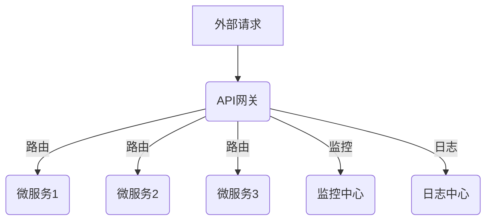
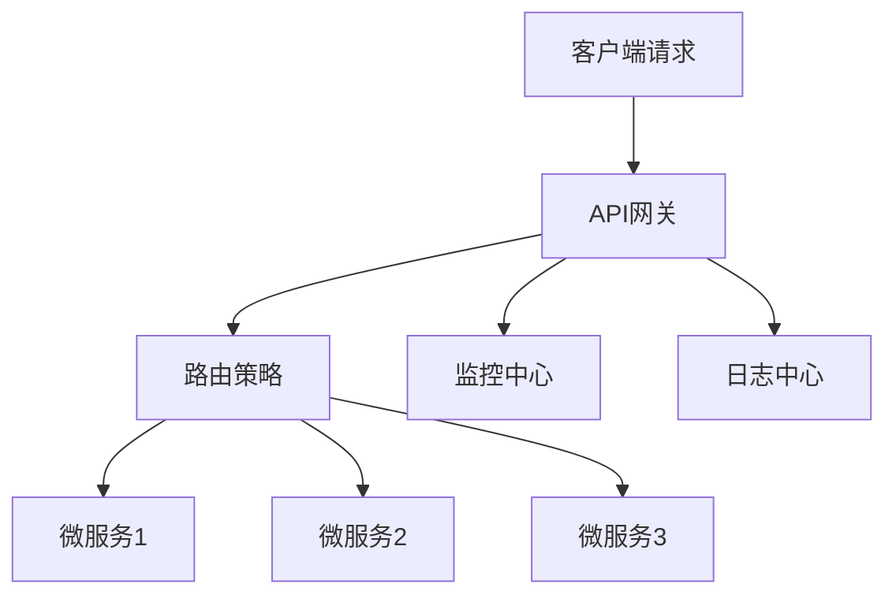

                 


### 一、背景介绍

在当今数字化时代，软件系统变得更加复杂和庞大，传统单体架构已难以满足日益增长的业务需求。微服务架构作为一种新型的分布式架构模式，逐渐成为现代软件系统开发的主流选择。微服务架构通过将大型单体应用拆分成多个独立的服务模块，每个模块专注于特定的业务功能，提高了系统的可扩展性、灵活性和可维护性。然而，随着服务数量的增加，服务的管理和通信也变得复杂，需要一种机制来统一管理和路由这些服务。

API网关正是在这样的背景下应运而生。API网关是微服务架构中的关键组件，它作为所有外部请求的统一入口，对请求进行标准化处理，然后转发到相应的微服务。API网关不仅简化了外部对内部服务的访问，还提供了安全、监控、路由、负载均衡等一系列功能，是微服务架构中不可或缺的一环。

### 二、API网关的核心概念与联系

首先，我们来理解API网关的核心概念。API网关是一种服务器，它充当应用程序和微服务之间的中介，负责处理所有的外部HTTP请求。其基本功能包括请求路由、身份验证、请求参数转换、负载均衡、服务熔断、数据压缩、日志记录和监控等。

为了更直观地展示API网关在微服务架构中的位置和作用，我们可以用Mermaid流程图来描述：



在上面的流程图中，A代表外部请求，B是API网关，C1、C2、C3分别是不同的微服务。API网关B接收来自外部的请求后，根据请求的URL或其他路由策略，将其路由到相应的微服务C1、C2、C3。同时，API网关还负责监控（D）和日志记录（E）等功能，确保系统的稳定运行和故障排查。

### 三、API网关的基本功能

#### 1. 请求路由

请求路由是API网关最基本的功能之一。当外部请求到达API网关时，API网关需要根据请求的URL或其他路由策略，将其转发到正确的微服务。例如，如果请求的URL是`/api/user`，API网关可能会将其转发到负责用户管理的微服务。

伪代码示例：

```python
def route_request(request):
    if request.url == '/api/user':
        return forward_to_user_service(request)
    elif request.url == '/api/product':
        return forward_to_product_service(request)
    else:
        return not_found_response()
```

#### 2. 身份验证

API网关还可以负责对请求进行身份验证，确保只有经过授权的用户才能访问受保护的服务。常见的身份验证方式包括基本身份验证、令牌认证（如JWT）等。

伪代码示例：

```python
def authenticate_request(request):
    if request.auth_token is None:
        return unauthorized_response()
    elif verify_auth_token(request.auth_token):
        return authenticated_request(request)
    else:
        return expired_token_response()
```

#### 3. 请求参数转换

在将请求转发到微服务之前，API网关可能需要对请求参数进行转换或规范化，确保微服务能够正确处理请求。

伪代码示例：

```python
def transform_request(request):
    if request.format == 'json':
        return json_to_object(request.data)
    elif request.format == 'xml':
        return xml_to_object(request.data)
    else:
        return invalid_format_response()
```

#### 4. 负载均衡

API网关还可以实现负载均衡功能，将请求均匀分配到多个微服务实例上，防止单个实例过载。

伪代码示例：

```python
def load_balance(request):
    instance = get_random_instance()
    return forward_to_instance(request, instance)
```

#### 5. 服务熔断

服务熔断是一种保护机制，当某个微服务出现频繁故障或响应时间过长时，API网关可以暂时熔断该服务，防止系统过载。

伪代码示例：

```python
def circuit_breaker(request):
    if is_service_failing(service_name):
        return service_unavailable_response()
    else:
        return forward_to_service(request, service_name)
```

#### 6. 数据压缩

API网关可以对响应数据进行压缩，减少网络传输量，提高系统性能。

伪代码示例：

```python
def compress_response(response):
    if response.content_length > compression_threshold:
        return compress_content(response.data)
    else:
        return response
```

#### 7. 日志记录和监控

API网关还负责记录请求和响应日志，监控系统的运行状况，及时发现和解决问题。

伪代码示例：

```python
def log_request(request):
    log_entry = create_log_entry(request)
    save_log(log_entry)

def monitor_system():
    metrics = collect_system_metrics()
    alert_if_anomaly(metrics)
```

### 四、API网关的架构设计

#### 1. 前端架构设计

前端架构设计主要涉及API网关的接入方式和接口设计。API网关需要支持各种客户端（如Web、移动应用等）的接入，并提供简洁、易用的API接口。

伪代码示例：

```python
def handle_http_request(request):
    if request.method == 'GET':
        return handle_get_request(request)
    elif request.method == 'POST':
        return handle_post_request(request)
    else:
        return method_not_allowed_response()
```

#### 2. 后端架构设计

后端架构设计主要关注API网关如何与微服务进行通信，以及如何实现路由、负载均衡、服务熔断等功能。

伪代码示例：

```python
def route_request(request):
    if request.url.startswith('/api/user'):
        return route_to_user_service(request)
    elif request.url.startswith('/api/product'):
        return route_to_product_service(request)
    else:
        return not_found_response()

def load_balance(request):
    instance = get_random_instance()
    return forward_to_instance(request, instance)

def circuit_breaker(request):
    if is_service_failing(service_name):
        return service_unavailable_response()
    else:
        return forward_to_service(request, service_name)
```

### 五、API网关的技术选型

选择合适的API网关技术对于系统的稳定性和性能至关重要。常见的API网关技术包括Kong、Traefik、Spring Cloud Gateway等。

#### 1. Kong

Kong是一个开源的API网关，支持多种协议（如HTTP/HTTPS、WebSocket等），提供丰富的插件系统，可以灵活扩展功能。Kong具有高可用性、负载均衡、服务熔断、监控等特性。

#### 2. Traefik

Traefik是一个现代化的API网关，支持Docker、Kubernetes等容器化技术，可以自动发现和管理后端服务。Traefik具有简单易用、高性能等特点。

#### 3. Spring Cloud Gateway

Spring Cloud Gateway是Spring Cloud生态系统中的API网关组件，基于Spring Framework和Spring Boot，可以轻松集成到Spring生态系统中。Spring Cloud Gateway提供了丰富的路由策略、自定义过滤器等功能。

#### 4. 选择依据

在选择API网关时，需要考虑以下因素：

- **功能需求**：根据项目需求选择具有所需功能的API网关。
- **性能要求**：考虑系统的性能要求，选择性能优异的API网关。
- **可扩展性**：考虑系统的可扩展性，选择易于扩展和升级的API网关。
- **社区支持**：考虑社区支持和文档质量，选择社区活跃、文档完善的API网关。

### 六、API网关的安全性设计

API网关的安全性设计至关重要，因为它是整个系统对外部访问的唯一入口。以下是API网关安全性设计的一些关键策略：

#### 1. 身份验证和授权

- **基本身份验证**：通过用户名和密码进行身份验证。
- **令牌认证**：使用JWT等令牌进行身份验证，确保令牌的有效性和安全性。
- **OAuth 2.0**：使用OAuth 2.0协议进行第三方身份验证和授权。

#### 2. 请求验证

- **验证HTTP头**：确保HTTP请求中包含合法的认证头和请求头。
- **请求体验证**：对请求体进行验证，确保其格式和内容符合预期。
- **IP白名单/黑名单**：根据IP地址对请求进行过滤，限制特定IP地址的访问。

#### 3. 数据加密

- **HTTPS**：使用HTTPS协议对通信进行加密，确保数据传输的安全。
- **TLS**：使用TLS协议对通信进行加密，增强数据传输的安全性。

#### 4. 过滤和审计

- **请求过滤**：对请求进行过滤，防止恶意请求进入系统。
- **日志审计**：记录所有请求和响应的日志，便于故障排查和安全审计。

### 七、API网关的性能优化

API网关的性能直接影响整个系统的响应速度和稳定性。以下是API网关性能优化的一些关键策略：

#### 1. 负载均衡

- **轮询算法**：使用轮询算法将请求分配到不同的后端服务实例上。
- **权重算法**：根据后端服务的负载情况动态调整请求的分配权重。

#### 2. 缓存

- **本地缓存**：在API网关内部实现缓存机制，减少对后端服务的请求。
- **分布式缓存**：使用分布式缓存系统（如Redis）缓存热点数据，提高系统性能。

#### 3. 数据压缩

- **响应数据压缩**：对响应数据进行压缩，减少网络传输量。
- **请求数据预处理**：对请求数据进行预处理，减少数据处理时间。

#### 4. 限流

- **令牌桶算法**：使用令牌桶算法限制请求的访问频率。
- **漏斗算法**：使用漏斗算法限制请求的并发数量。

### 八、API网关在实际项目中的应用

在实际项目中，API网关的应用可以大大简化微服务的开发和管理。以下是一个简单的实际项目案例，用于演示API网关在微服务架构中的实际应用。

#### 1. 项目背景

某电商平台需要开发一个面向客户的API服务，提供商品查询、购物车管理、订单处理等功能。系统架构采用微服务架构，各个业务模块（如商品管理、订单管理、用户管理）分别部署在独立的微服务实例上。

#### 2. API网关部署

- 在项目开始阶段，首先部署一个API网关实例，负责接收所有外部请求。
- API网关部署在独立的容器中，使用Docker进行管理。
- API网关连接到各个微服务实例，实现请求的路由和负载均衡。

#### 3. 请求流程

1. 客户端发送请求到API网关。
2. API网关对请求进行身份验证和授权。
3. API网关根据请求的URL将请求路由到相应的微服务实例。
4. 微服务实例处理请求并返回响应。
5. API网关将响应返回给客户端。

#### 4. 项目小结

通过使用API网关，该项目实现了以下目标：

- **简化了外部请求的访问**：通过API网关，外部请求无需直接访问各个微服务实例，简化了访问流程。
- **提高了系统的可靠性**：API网关提供了请求验证、身份认证、负载均衡等功能，提高了系统的可靠性。
- **提升了系统的性能**：API网关实现了请求缓存和数据压缩，提升了系统的响应速度。

### 九、API网关与DevOps的结合

DevOps是一种强调软件开发和IT运维协同工作的理念和方法，通过将开发和运维紧密集成，实现快速、可靠和高质量的软件交付。API网关在DevOps中扮演着重要的角色，它不仅提高了系统的可靠性，还简化了运维流程。

#### 1. API网关与CI/CD

CI/CD（持续集成和持续交付）是DevOps的核心概念之一，API网关可以通过以下方式与CI/CD结合：

- **自动化部署**：API网关的配置和代码可以通过CI/CD工具进行自动化部署，确保部署过程的可靠性和一致性。
- **蓝绿部署**：使用API网关实现蓝绿部署，将新版本的API网关与旧版本并行运行，确保系统的连续性和稳定性。

#### 2. API网关与容器化

容器化是DevOps的另一个重要概念，API网关可以通过以下方式与容器化结合：

- **容器编排**：使用容器编排工具（如Kubernetes）管理API网关的部署和扩展，提高系统的灵活性和可扩展性。
- **服务发现**：API网关可以通过服务发现机制动态发现和连接后端微服务，实现自动化的服务管理。

#### 3. API网关与监控

监控是DevOps的重要组成部分，API网关可以通过以下方式与监控结合：

- **集成监控工具**：将API网关的监控数据集成到监控系统中，实现对API网关和后端服务的实时监控和报警。
- **日志收集**：使用API网关收集请求和响应日志，实现日志的集中管理和分析。

### 十、API网关的运维管理

API网关的运维管理是确保系统稳定运行和高效性能的关键。以下是一些关键的运维管理策略：

#### 1. 监控和日志

- **实时监控**：使用监控工具（如Prometheus、Grafana）对API网关的性能指标（如响应时间、请求量、错误率等）进行实时监控，及时发现和解决问题。
- **日志收集**：使用日志收集工具（如ELK栈）收集API网关的日志，实现日志的集中存储、检索和分析。

#### 2. 自动化运维

- **自动化部署**：使用CI/CD工具实现API网关的自动化部署和升级，确保部署过程的可靠性和一致性。
- **自动化扩展**：根据负载情况自动调整API网关的实例数量，实现自动化的扩展和缩放。

#### 3. 故障恢复

- **服务熔断**：在API网关中实现服务熔断机制，防止单个微服务的故障影响整个系统。
- **故障切换**：实现API网关的故障切换机制，确保在主实例故障时自动切换到备用实例。

#### 4. 性能优化

- **负载均衡**：根据请求的负载情况动态调整负载均衡策略，实现请求的合理分配。
- **缓存策略**：使用缓存策略减少对后端服务的请求，提高系统的响应速度。

### 十一、API网关的监控与告警

API网关的监控与告警是确保系统稳定运行和快速响应的重要手段。以下是一些关键监控指标和告警策略：

#### 1. 关键监控指标

- **响应时间**：API网关处理请求的平均响应时间，用于衡量系统的性能。
- **请求量**：API网关接收的请求总量，用于衡量系统的负载情况。
- **错误率**：API网关处理请求的错误率，用于衡量系统的稳定性。
- **并发连接数**：API网关同时处理的连接数量，用于衡量系统的并发能力。

#### 2. 告警策略

- **阈值告警**：当监控指标超过预设的阈值时，触发告警，如响应时间超过500ms、错误率超过5%等。
- **频率告警**：当监控指标在一段时间内频繁超过阈值时，触发告警，如连续5分钟内错误率超过10%。
- **异常值告警**：当监控指标出现异常值时，触发告警，如响应时间为0ms或负值。

#### 3. 告警通知

- **邮件通知**：通过邮件发送告警通知，通知相关人员处理。
- **短信通知**：通过短信发送告警通知，确保及时响应。
- **即时通讯工具**：通过即时通讯工具（如钉钉、企业微信）发送告警通知，实现实时沟通。

### 十二、API网关的发展趋势

随着云计算、大数据、人工智能等技术的快速发展，API网关也在不断演进和变革。以下是一些API网关的发展趋势：

#### 1. 服务网格

服务网格（Service Mesh）是一种新型的服务架构模式，旨在简化微服务之间的通信和协调。API网关与服务网格的结合，可以实现更高效、更可靠的服务管理和监控。

#### 2. AI驱动

人工智能技术正在被广泛应用于API网关中，如智能路由、自动故障恢复、异常检测等。AI驱动的API网关可以更好地适应复杂的服务环境，提高系统的智能化水平。

#### 3. 软件定义

软件定义（Software-Defined）是未来API网关的发展方向之一，通过软件定义的方式，可以实现API网关的动态配置、自动优化和自动化运维。

#### 4. 开放生态

API网关正在向开放生态的方向发展，与容器化、云计算、大数据等技术的深度融合，将实现更灵活、更高效的服务架构。

### 十三、API网关面临的挑战与解决方案

尽管API网关在微服务架构中具有许多优势，但在实际应用中仍然面临一些挑战。以下是一些常见挑战及其解决方案：

#### 1. 性能瓶颈

**挑战**：API网关可能成为系统性能的瓶颈，特别是在高并发场景下。

**解决方案**：通过优化路由策略、负载均衡和缓存机制，提高API网关的处理能力。

#### 2. 安全风险

**挑战**：API网关是系统对外暴露的唯一入口，可能成为攻击的目标。

**解决方案**：加强身份验证和授权机制，使用加密技术保护数据传输，定期进行安全审计。

#### 3. 可维护性

**挑战**：随着微服务数量的增加，API网关的可维护性会降低。

**解决方案**：使用模块化设计，将不同功能模块分离，提高系统的可维护性和可扩展性。

#### 4. 升级难度

**挑战**：API网关的升级可能会影响系统的稳定性。

**解决方案**：采用蓝绿部署或灰度发布策略，确保升级过程的平稳过渡。

### 总结

API网关是微服务架构中的核心组件，它统一管理和路由外部请求，提供了一系列重要功能，如安全性、性能优化、监控和日志记录。随着云计算和分布式架构的普及，API网关的应用越来越广泛，其重要性也越来越凸显。通过本文的介绍，我们了解了API网关的核心概念、设计原则、技术选型、安全性设计、性能优化和实际应用，以及对API网关面临的挑战和解决方案进行了探讨。相信通过本文的阅读，您对API网关有了更深入的理解，能够更好地应用于实际项目中。作者：AI天才研究院/AI Genius Institute & 禅与计算机程序设计艺术/Zen And The Art of Computer Programming

---

### 文章标题

**API网关：微服务架构的统一入口**

### 关键词

- **API网关**
- **微服务架构**
- **请求路由**
- **安全性**
- **性能优化**
- **DevOps**

### 摘要

本文深入探讨了API网关在微服务架构中的重要地位及其核心功能。从背景介绍到核心概念、架构设计、技术选型、安全性设计、性能优化，再到实际项目应用和DevOps结合，以及监控与告警、未来发展趋势和挑战，本文全面剖析了API网关的各个方面，旨在为读者提供一份全面且实用的技术指南。作者通过清晰的逻辑和丰富的示例，帮助读者更好地理解和应用API网关，提升软件系统的开发效率和稳定性。

### 目录

---

## API网关：微服务架构的统一入口

### 关键词：API网关、微服务架构、请求路由、安全性、性能优化、DevOps

### 摘要：

本文深入探讨API网关在微服务架构中的关键角色，涵盖其核心概念、架构设计、技术选型、安全性设计、性能优化和实际应用。通过详尽的示例和分析，本文为读者提供了全面的技术指南，帮助理解和应用API网关，提升软件系统的开发效率和稳定性。

---

## 一、背景介绍

---

## 二、API网关的核心概念与联系

---

## 三、API网关的基本功能

---

## 四、API网关的架构设计

---

## 五、API网关的技术选型

---

## 六、API网关的安全性设计

---

## 七、API网关的性能优化

---

## 八、API网关在实际项目中的应用

---

## 九、API网关与DevOps的结合

---

## 十、API网关的运维管理

---

## 十一、API网关的监控与告警

---

## 十二、API网关的发展趋势

---

## 十三、API网关面临的挑战与解决方案

---

## 总结

---

## 作者信息

**作者：AI天才研究院/AI Genius Institute & 禅与计算机程序设计艺术/Zen And The Art of Computer Programming**

---

### 一、背景介绍

在当今数字化时代，软件系统变得日益复杂和庞大。随着业务需求的不断增长，传统的单体架构已经难以满足灵活性和可扩展性的要求。为了应对这一挑战，微服务架构应运而生。微服务架构通过将大型单体应用拆分成多个独立的服务模块，每个模块专注于特定的业务功能，从而提高了系统的可维护性、灵活性和可扩展性。

然而，随着服务数量的增加，如何管理和通信这些服务成为一个重要问题。API网关作为微服务架构中的关键组件，成为了解决这一问题的有效手段。API网关充当了所有外部请求的统一入口，对请求进行标准化处理，然后转发到相应的微服务。这不仅简化了外部对内部服务的访问，还提供了安全、监控、路由、负载均衡等一系列功能，是微服务架构中不可或缺的一环。

API网关的重要性体现在以下几个方面：

1. **简化服务访问**：API网关为外部请求提供了一个统一的接口，用户无需了解底层服务的具体实现细节，只需通过简单的接口调用即可完成业务操作。
2. **安全性保障**：API网关可以对请求进行身份验证和授权，确保只有经过授权的用户才能访问受保护的服务，从而提高了系统的安全性。
3. **路由和负载均衡**：API网关可以根据请求的URL或其他路由策略，将请求转发到正确的微服务实例。同时，通过负载均衡策略，可以有效地分发请求，防止单个实例过载。
4. **性能优化**：API网关可以缓存响应数据，减少对后端服务的请求次数，从而提高系统的响应速度和性能。
5. **监控和日志记录**：API网关可以记录所有请求和响应的日志，监控系统运行状况，及时发现和解决问题。

综上所述，API网关在微服务架构中扮演着至关重要的角色，为系统的开发、运维和稳定性提供了强有力的支持。在本文中，我们将详细探讨API网关的核心概念、设计原则、技术选型、安全性设计、性能优化以及在实际项目中的应用，帮助读者全面了解并掌握API网关的相关知识。

---

### 二、API网关的核心概念与联系

#### 1. API网关的定义

API网关（API Gateway）是一种服务器，它作为应用程序和微服务之间的中介，负责处理所有的外部HTTP请求。API网关的核心功能是对请求进行标准化处理，然后将请求路由到相应的微服务。API网关通常位于外部客户端和内部微服务之间，充当系统的统一入口。

#### 2. API网关的作用

API网关在微服务架构中扮演着多个重要角色：

1. **统一入口**：API网关为外部客户端提供了一个统一的接口，用户无需关心内部服务的具体实现细节，只需通过API网关的接口进行调用。
2. **请求路由**：API网关根据请求的URL或其他路由策略，将请求转发到正确的微服务实例。通过路由功能，API网关实现了请求的统一管理和分发。
3. **安全性保障**：API网关可以对请求进行身份验证和授权，确保只有经过授权的用户才能访问受保护的服务。通过身份验证和授权机制，API网关提高了系统的安全性。
4. **性能优化**：API网关可以缓存响应数据，减少对后端服务的请求次数，从而提高系统的响应速度和性能。通过缓存策略，API网关可以有效地降低系统的负载。
5. **监控和日志记录**：API网关可以记录所有请求和响应的日志，监控系统运行状况，及时发现和解决问题。日志记录功能为故障排查和性能优化提供了重要的数据支持。

#### 3. API网关与微服务的关系

API网关与微服务的关系可以看作是一种代理和被代理的关系。具体来说，API网关作为代理，负责接收和处理外部请求，然后将请求转发到相应的微服务实例。微服务作为被代理，负责处理具体的业务逻辑和数据处理。这种关系使得外部客户端可以透明地访问内部微服务，而无需了解底层服务的具体实现细节。

在微服务架构中，API网关通常位于外部客户端和内部微服务之间，充当两者之间的桥梁。API网关通过处理外部请求，将其转换为内部服务可以理解的格式，再将响应数据返回给外部客户端。这种架构设计不仅简化了外部请求的访问过程，还提高了系统的灵活性和可维护性。

#### 4. Mermaid流程图

为了更直观地展示API网关在微服务架构中的位置和作用，我们可以使用Mermaid流程图来描述。以下是一个简单的流程图示例：



在上面的流程图中，A代表客户端请求，B是API网关，C是路由策略，D、E、F分别是三个微服务。API网关B接收客户端请求后，根据路由策略C将请求转发到相应的微服务D、E、F。同时，API网关B还负责监控中心G和日志中心H，记录系统的运行状况。

通过上述流程图，我们可以清晰地看到API网关在微服务架构中的位置和作用。API网关不仅简化了外部请求的访问过程，还提供了安全性、性能优化和监控等功能，是微服务架构中不可或缺的一环。

---

### 三、API网关的基本功能

API网关在微服务架构中承担着多种关键功能，这些功能共同确保了系统的性能、安全性和可靠性。以下是API网关的一些基本功能：

#### 1. 请求路由

请求路由是API网关最基本的功能之一。当外部请求到达API网关时，API网关需要根据请求的URL或其他路由策略，将其转发到正确的微服务。请求路由功能使得外部客户端可以通过简单的接口调用访问到内部的微服务，而无需关心底层服务的具体实现细节。

伪代码示例：

```python
def route_request(request):
    if request.url == '/api/user':
        return forward_to_user_service(request)
    elif request.url == '/api/product':
        return forward_to_product_service(request)
    else:
        return not_found_response()
```

在上面的伪代码中，`route_request` 函数根据请求的URL进行路由，如果请求的URL是`/api/user`，则将其转发到`user_service`；如果请求的URL是`/api/product`，则将其转发到`product_service`。如果请求的URL不符合任何路由规则，则返回404错误。

#### 2. 身份验证和授权

API网关可以负责对请求进行身份验证和授权，确保只有经过授权的用户才能访问受保护的服务。常见的身份验证方式包括基本身份验证、令牌认证（如JWT）等。授权机制则确保用户具有访问特定资源的权限。

伪代码示例：

```python
def authenticate_request(request):
    if request.auth_token is None:
        return unauthorized_response()
    elif verify_auth_token(request.auth_token):
        return authenticated_request(request)
    else:
        return expired_token_response()
```

在上面的伪代码中，`authenticate_request` 函数首先检查请求中是否包含有效的认证令牌。如果未包含令牌或令牌无效，则返回未授权或令牌已过期的响应。

#### 3. 请求参数转换

在将请求转发到微服务之前，API网关可能需要对请求参数进行转换或规范化，确保微服务能够正确处理请求。例如，API网关可以将请求参数从JSON格式转换为对象，或者将XML格式转换为字典。

伪代码示例：

```python
def transform_request(request):
    if request.format == 'json':
        return json_to_object(request.data)
    elif request.format == 'xml':
        return xml_to_object(request.data)
    else:
        return invalid_format_response()
```

在上面的伪代码中，`transform_request` 函数根据请求的格式（JSON或XML）进行相应的参数转换。如果请求格式无效，则返回无效格式响应。

#### 4. 负载均衡

API网关可以实现负载均衡功能，将请求均匀分配到多个微服务实例上，防止单个实例过载。常见的负载均衡算法包括轮询算法、权重算法等。

伪代码示例：

```python
def load_balance(request):
    instance = get_random_instance()
    return forward_to_instance(request, instance)
```

在上面的伪代码中，`load_balance` 函数使用随机算法选择一个微服务实例，然后将请求转发到该实例。

#### 5. 服务熔断

服务熔断是一种保护机制，当某个微服务出现频繁故障或响应时间过长时，API网关可以暂时熔断该服务，防止系统过载。服务熔断通常与断路器模式（Circuit Breaker）结合使用。

伪代码示例：

```python
def circuit_breaker(request):
    if is_service_failing(service_name):
        return service_unavailable_response()
    else:
        return forward_to_service(request, service_name)
```

在上面的伪代码中，`circuit_breaker` 函数检查是否已触发服务熔断。如果已触发熔断，则返回服务不可用的响应；否则，将请求转发到相应的微服务。

#### 6. 数据压缩

API网关可以对响应数据进行压缩，减少网络传输量，提高系统性能。常用的数据压缩算法包括gzip和 deflate。

伪代码示例：

```python
def compress_response(response):
    if response.content_length > compression_threshold:
        return compress_content(response.data)
    else:
        return response
```

在上面的伪代码中，`compress_response` 函数检查响应数据的大小。如果数据大小超过压缩阈值，则对数据进行压缩；否则，直接返回原始响应数据。

#### 7. 日志记录和监控

API网关还负责记录请求和响应日志，监控系统的运行状况，及时发现和解决问题。日志记录和监控功能对于故障排查和性能优化至关重要。

伪代码示例：

```python
def log_request(request):
    log_entry = create_log_entry(request)
    save_log(log_entry)

def monitor_system():
    metrics = collect_system_metrics()
    alert_if_anomaly(metrics)
```

在上面的伪代码中，`log_request` 函数创建并保存请求日志，`monitor_system` 函数收集系统指标并触发告警。

通过上述功能，API网关在微服务架构中发挥了重要作用，确保了系统的性能、安全性和可靠性。每个功能都是构建高效、稳定和可扩展系统的重要组成部分。

---

### 四、API网关的架构设计

#### 1. 前端架构设计

前端架构设计主要涉及API网关的接入方式和接口设计。API网关需要支持各种客户端（如Web、移动应用等）的接入，并提供简洁、易用的API接口。

**前端架构设计原则：**

- **高可用性**：确保API网关稳定运行，对外部请求提供持续的服务。
- **可扩展性**：设计时考虑系统的可扩展性，以便在需求变化时能够灵活调整。
- **安全性**：通过身份验证、授权和加密等机制，确保数据传输的安全。
- **易用性**：提供简洁、统一的API接口，降低客户端接入的复杂性。

**前端架构设计步骤：**

1. **定义API接口**：明确API网关提供的功能模块和接口，包括请求路径、参数定义和返回格式。
2. **接口规范**：制定统一的接口规范，确保接口的一致性和易用性。
3. **接入方式**：设计多种接入方式，如RESTful API、GraphQL等，以满足不同客户端的需求。
4. **安全策略**：设计安全策略，包括身份验证、授权和加密等，确保数据传输的安全。

**前端架构设计示例：**

假设我们设计一个电商平台的API网关，前端架构设计如下：

- **请求路径**：/api/user, /api/product, /api/order等。
- **参数定义**：根据功能需求定义接口参数，如用户ID、产品ID、订单ID等。
- **返回格式**：统一采用JSON格式返回结果，包含状态码、数据和信息等。

```json
{
    "status": 200,
    "data": {
        "user": {
            "id": "123",
            "name": "John Doe"
        }
    },
    "message": "操作成功"
}
```

- **接入方式**：提供RESTful API接入方式，支持HTTP GET、POST、PUT、DELETE等方法。

#### 2. 后端架构设计

后端架构设计主要关注API网关如何与微服务进行通信，以及如何实现路由、负载均衡、服务熔断等功能。

**后端架构设计原则：**

- **解耦**：API网关与微服务之间应保持松耦合关系，降低系统复杂性。
- **高性能**：设计高性能的后端架构，确保请求能够快速处理和转发。
- **可扩展**：设计可扩展的后端架构，以便在服务数量增加时能够灵活扩展。
- **安全性**：确保数据传输的安全性，采用加密、身份验证等机制。

**后端架构设计步骤：**

1. **服务注册与发现**：实现服务注册与发现机制，API网关可以动态发现和连接后端微服务。
2. **路由策略**：设计路由策略，根据请求的URL或其他参数，将请求转发到正确的微服务实例。
3. **负载均衡**：实现负载均衡策略，将请求均匀分配到多个微服务实例上，防止单个实例过载。
4. **服务熔断**：实现服务熔断机制，防止单个微服务的故障影响整个系统。
5. **日志记录与监控**：记录API网关和微服务的日志，实现实时监控和告警。

**后端架构设计示例：**

假设我们使用Spring Boot作为API网关的后端框架，后端架构设计如下：

- **服务注册与发现**：使用Eureka或Consul实现服务注册与发现。
- **路由策略**：使用Spring Cloud Gateway的路由规则，根据请求的URL进行转发。
- **负载均衡**：使用Spring Cloud Gateway的内置负载均衡器，根据请求的负载情况动态分配实例。
- **服务熔断**：使用Hystrix实现服务熔断，防止单个微服务的故障影响整个系统。
- **日志记录与监控**：使用Spring Boot Admin或Prometheus实现实时监控和告警。

```yaml
spring:
  cloud:
    gateway:
      routes:
        - id: user-route
          uri: lb://user-service
          predicates:
            - Path=/api/user/**
          filters:
            - name: AddResponseHeader
              args:
                response-header-name: X-Response-Time
                response-header-value: ${timestamp}

        - id: product-route
          uri: lb://product-service
          predicates:
            - Path=/api/product/**
          filters:
            - name: AddResponseHeader
              args:
                response-header-name: X-Response-Time
                response-header-value: ${timestamp}

        - id: order-route
          uri: lb://order-service
          predicates:
            - Path=/api/order/**
          filters:
            - name: AddResponseHeader
              args:
                response-header-name: X-Response-Time
                response-header-value: ${timestamp}
```

通过上述前端架构和后端架构设计，API网关可以高效、稳定地处理外部请求，并提供强大的路由、负载均衡、服务熔断等能力，为微服务架构提供统一的入口和管理。

---

### 五、API网关的技术选型

在微服务架构中，选择合适的API网关技术至关重要，因为它直接影响到系统的性能、安全性、可维护性和可扩展性。以下是几种常见的API网关技术及其特点：

#### 1. Kong

**特点：**
- **开源**：Kong是一个开源的API网关，拥有丰富的社区支持和活跃的开发者社区。
- **插件系统**：Kong具有强大的插件系统，可以通过插件扩展功能，如限流、认证、日志等。
- **支持多种协议**：Kong支持HTTP/HTTPS、WebSocket、SMTP等协议，适用于多种场景。
- **高可用性**：Kong具有高可用性，支持集群部署，确保系统稳定运行。
- **性能优异**：Kong采用高性能的Nginx作为底层引擎，处理能力强大。

**适用场景：**
- **企业级应用**：适用于企业级应用，具有高性能和高可靠性要求。
- **需要自定义插件**：适用于需要自定义插件以扩展功能的应用场景。

#### 2. Traefik

**特点：**
- **现代化**：Traefik是一个现代化的API网关，支持Docker、Kubernetes等容器化技术。
- **自动发现**：Traefik可以通过自动发现机制，动态连接和配置后端服务。
- **易于集成**：Traefik易于与其他工具（如Prometheus、Consul等）集成，实现自动化运维。
- **高性能**：Traefik采用Go语言编写，具有高性能和高并发处理能力。

**适用场景：**
- **容器化应用**：适用于容器化应用，如Docker和Kubernetes，提供自动化的服务管理。
- **需要快速部署**：适用于需要快速部署和配置的轻量级应用。

#### 3. Spring Cloud Gateway

**特点：**
- **Spring生态**：Spring Cloud Gateway是Spring Cloud生态系统的一部分，与Spring Boot无缝集成。
- **功能丰富**：Spring Cloud Gateway提供了丰富的路由策略和过滤器功能，如负载均衡、服务熔断、请求参数转换等。
- **易于使用**：Spring Cloud Gateway使用Spring编程模型，对于熟悉Spring的开发者来说，易于上手。
- **社区支持**：Spring Cloud Gateway拥有强大的社区支持和完善的文档。

**适用场景：**
- **Spring应用**：适用于使用Spring Boot开发的微服务应用，提供统一的API网关服务。
- **需要自定义功能**：适用于需要自定义过滤器或路由策略的应用场景。

#### 4. OpenAPI Gateway

**特点：**
- **基于OpenAPI规范**：OpenAPI Gateway遵循OpenAPI规范，可以通过YAML文件定义路由规则和配置。
- **可视化界面**：OpenAPI Gateway提供了可视化界面，可以方便地管理和配置路由规则。
- **易于扩展**：OpenAPI Gateway支持自定义插件和过滤器，可以扩展其功能。

**适用场景：**
- **自动化部署**：适用于自动化部署和管理的应用，可以通过YAML文件进行配置。
- **需要可视化界面**：适用于需要可视化管理和配置的团队。

#### 5. NGINX

**特点：**
- **高性能**：NGINX是一个高性能的Web服务器，在处理高并发请求方面表现优异。
- **功能丰富**：NGINX提供了丰富的HTTP模块，可以实现复杂的请求处理和路由。
- **社区支持**：NGINX拥有庞大的社区支持和丰富的文档资源。

**适用场景：**
- **高并发应用**：适用于高并发场景，处理能力强大。
- **需要自定义模块**：适用于需要自定义模块和功能的场景。

#### 选择依据

在选择API网关时，需要根据以下因素进行综合考虑：

- **功能需求**：根据项目需求选择具有所需功能的API网关。
- **性能要求**：考虑系统的性能要求，选择性能优异的API网关。
- **可扩展性**：考虑系统的可扩展性，选择易于扩展和升级的API网关。
- **社区支持**：考虑社区支持和文档质量，选择社区活跃、文档完善的API网关。
- **安全性**：确保API网关具备足够的安全性，包括身份验证、授权和数据加密等。

通过以上分析，开发者可以根据具体项目需求，选择最合适的API网关技术，为系统提供强大的支撑。

---

### 六、API网关的安全性设计

API网关作为系统对外提供服务的唯一入口，其安全性设计至关重要。一个良好的安全性设计不仅能够防止外部攻击，还能够确保数据传输的安全，提高系统的整体可靠性。以下是一些关键的安全策略和措施：

#### 1. 身份验证

身份验证是确保只有合法用户能够访问API的关键步骤。常见的身份验证方式包括：

- **基本身份验证**：通过用户名和密码进行身份验证，是最简单的身份验证方式，但安全性较低，容易受到暴力破解攻击。
- **令牌认证**：令牌认证（如JWT、OAuth 2.0等）是一种更加安全的身份验证方式。JWT是一种自包含的令牌，包含用户的身份信息和签名，可以确保令牌的真实性和完整性。
- **多因素认证**：除了密码和令牌，还可以使用多因素认证（MFA），如手机验证码、生物识别等，进一步增加安全性。

#### 2. 授权

授权是确保用户具有访问特定资源的权限的过程。常见的授权方式包括：

- **基于角色的访问控制（RBAC）**：根据用户的角色分配权限，如管理员、普通用户等。RBAC可以有效地管理不同用户对资源的访问权限。
- **基于属性的访问控制（ABAC）**：基于用户的属性（如部门、职位等）进行授权，提供更加细粒度的访问控制。
- **基于资源的访问控制（RBAC）**：根据资源的类型和属性进行授权，确保只有具有相应权限的用户可以访问特定的资源。

#### 3. 请求验证

请求验证是确保请求的合法性和安全性的重要环节。以下是一些常见的请求验证方法：

- **请求头验证**：验证HTTP请求头中包含的认证信息和请求参数。
- **请求体验证**：验证请求体中的数据是否合法，如检查请求体中的JSON格式是否正确。
- **参数验证**：验证URL参数和查询参数是否合法，如检查参数的值是否在允许的范围内。
- **请求频率限制**：防止恶意请求对系统造成攻击，如使用令牌桶或漏斗算法限制请求的频率。

#### 4. 数据加密

数据加密是保护数据传输安全的重要手段。以下是一些常见的数据加密方法：

- **HTTPS**：使用HTTPS协议对请求和响应进行加密，确保数据在传输过程中的安全性。
- **TLS**：使用TLS协议（传输层安全协议）对通信进行加密，提供安全的加密连接。
- **数据脱敏**：对敏感数据进行脱敏处理，防止数据泄露。

#### 5. 过滤和审计

过滤和审计是保护系统免受恶意攻击和确保系统安全性的重要手段。以下是一些常见的过滤和审计方法：

- **请求过滤**：过滤掉不符合预期的请求，如过滤掉包含恶意脚本的请求。
- **响应过滤**：过滤掉敏感信息，如过滤掉错误消息中的敏感数据。
- **日志审计**：记录所有请求和响应的日志，用于后续的安全审计和故障排查。

通过上述安全性设计策略，API网关可以有效地保护系统免受外部攻击，确保数据传输的安全，提高系统的整体安全性。开发者应根据具体项目需求，综合考虑并实施这些策略，确保系统的安全性。

---

### 七、API网关的性能优化

API网关的性能直接影响整个系统的响应速度和稳定性。在微服务架构中，优化API网关的性能对于提升用户体验和系统稳定性至关重要。以下是一些关键的性能优化策略：

#### 1. 负载均衡

负载均衡是将请求均匀分配到多个服务器实例上，以避免单个服务器过载。常见的负载均衡算法包括：

- **轮询算法**：将请求轮流分配给不同的服务器实例，简单但可能不公平。
- **权重算法**：根据服务器实例的负载情况动态调整分配的权重，确保高负载的服务器得到更多的请求。
- **最小连接数算法**：将请求分配到连接数最少的实例，减少响应时间。

**实现步骤：**

1. **选择合适的负载均衡器**：如Nginx、HAProxy、Kong等。
2. **配置负载均衡策略**：根据业务需求选择合适的负载均衡算法。
3. **监控负载均衡性能**：实时监控负载均衡器的性能，根据实际负载情况调整策略。

#### 2. 缓存

缓存是提高系统性能的有效手段，通过缓存常见的响应数据，减少对后端服务的请求。以下是一些缓存策略：

- **本地缓存**：在API网关内部实现缓存机制，如使用Redis、Memcached等。
- **分布式缓存**：使用分布式缓存系统，如Consul、etcd等，确保缓存数据的一致性和可用性。
- **动态缓存**：根据请求的参数动态决定是否缓存响应数据，如缓存用户查询结果。

**实现步骤：**

1. **选择合适的缓存系统**：根据业务需求和性能要求选择本地缓存或分布式缓存。
2. **配置缓存策略**：设置缓存的时间、缓存的条件等。
3. **监控缓存性能**：实时监控缓存命中率，根据实际情况调整缓存策略。

#### 3. 数据压缩

数据压缩可以减少网络传输量，提高系统性能。以下是一些常见的数据压缩方法：

- **响应数据压缩**：对响应数据进行压缩，如使用gzip或deflate算法。
- **请求数据预处理**：在请求到达API网关之前，对请求数据进行预处理，如去除不必要的空白字符或压缩图片等。

**实现步骤：**

1. **选择合适的数据压缩算法**：根据数据类型和压缩效果选择合适的算法。
2. **配置数据压缩**：在API网关中配置数据压缩功能，如Nginx的gzip模块。
3. **监控压缩效果**：实时监控压缩率，根据实际效果调整压缩策略。

#### 4. 限流

限流是防止系统过载的重要手段，通过限制请求的频率和数量，保护系统的稳定运行。以下是一些常见的限流算法：

- **令牌桶算法**：允许一定数量的令牌流入桶中，每次请求消耗一个令牌，当桶中令牌耗尽时，请求被拒绝。
- **漏斗算法**：每次请求通过漏斗时，漏斗中的令牌会减少，当漏斗中的令牌耗尽时，请求被拒绝。

**实现步骤：**

1. **选择合适的限流算法**：根据业务需求和系统性能要求选择合适的算法。
2. **配置限流策略**：设置限流的阈值和策略，如每秒允许的最大请求次数。
3. **监控限流性能**：实时监控限流器的性能，根据实际情况调整策略。

通过上述性能优化策略，API网关可以显著提升系统的响应速度和稳定性，为用户提供更优质的服务体验。

---

### 八、API网关在实际项目中的应用

在实际项目中，API网关的应用可以大大简化微服务的开发和管理。以下是一个简单的实际项目案例，用于演示API网关在微服务架构中的实际应用。

#### 1. 项目背景

某电商平台需要开发一个面向客户的API服务，提供商品查询、购物车管理、订单处理等功能。系统架构采用微服务架构，各个业务模块（如商品管理、订单管理、用户管理）分别部署在独立的微服务实例上。

#### 2. API网关部署

- **部署环境**：在Kubernetes集群中部署API网关，使用Docker容器化技术进行管理。
- **依赖服务**：API网关依赖商品管理、订单管理、用户管理等多个微服务实例。
- **部署步骤**：
  1. 编写Dockerfile，将API网关应用打包成镜像。
  2. 将镜像推送到容器镜像仓库（如Docker Hub）。
  3. 在Kubernetes集群中创建部署配置文件（Deployment），定义API网关的实例数量和资源限制。
  4. 使用Kubernetes的Ingress资源，配置API网关的域名和路由策略。

#### 3. 请求流程

1. **客户端请求**：用户通过浏览器或移动应用发起请求，请求路径为`/api/user/login`。
2. **API网关处理**：API网关接收到请求后，首先进行身份验证（如JWT令牌验证），确保请求来自合法用户。
3. **路由策略**：根据请求的URL，API网关将请求路由到相应的微服务实例，如用户管理微服务。
4. **微服务处理**：用户管理微服务接收到请求后，根据业务逻辑处理用户登录，如检查用户名和密码是否匹配，生成JWT令牌等。
5. **响应数据**：微服务将处理结果（如JWT令牌）返回给API网关。
6. **API网关响应**：API网关将微服务的响应数据返回给客户端，如返回状态码和令牌。

#### 4. 代码实现与分析

以下是一个简化的API网关处理流程的代码实现：

```python
from flask import Flask, request, jsonify
from user_management import authenticate_user

app = Flask(__name__)

@app.route('/api/user/login', methods=['POST'])
def login():
    # 1. 获取请求参数
    username = request.json.get('username')
    password = request.json.get('password')
    
    # 2. 身份验证
    user = authenticate_user(username, password)
    if not user:
        return jsonify({'status': 401, 'message': 'Invalid credentials'}), 401
    
    # 3. 生成JWT令牌
    token = generate_jwt_token(user)
    
    # 4. 响应客户端
    return jsonify({'status': 200, 'token': token}), 200

if __name__ == '__main__':
    app.run(host='0.0.0.0', port=8080)
```

在上面的代码中，`login` 函数负责处理用户登录请求。首先，从请求中获取用户名和密码；然后，调用`authenticate_user` 函数进行身份验证；接着，生成JWT令牌；最后，将令牌返回给客户端。

#### 5. 实际案例分析和详细讲解剖析

在实际项目中，API网关的配置和实现会更加复杂。以下是一个实际案例的分析：

- **负载均衡**：使用Nginx作为API网关，实现负载均衡，将请求分配到多个API网关实例上，提高系统的处理能力。
- **安全性**：使用HTTPS协议，确保数据传输的安全。同时，使用JWT进行身份验证和授权，保护用户的隐私数据。
- **监控和日志**：使用Prometheus和Grafana进行监控，实时监控API网关的请求量、响应时间和错误率。使用ELK栈（Elasticsearch、Logstash、Kibana）收集和展示日志，方便故障排查和性能优化。

通过上述实际案例的分析，我们可以看到API网关在微服务架构中的重要作用。它不仅简化了外部请求的访问和管理，还提供了安全、性能优化和监控等功能，是现代微服务架构中不可或缺的一环。

---

### 九、API网关与DevOps的结合

DevOps是一种强调软件开发和IT运维协同工作的理念和方法，通过将开发和运维紧密集成，实现快速、可靠和高质量的软件交付。API网关在DevOps中扮演着重要的角色，它不仅提高了系统的可靠性，还简化了运维流程。以下是如何将API网关与DevOps结合的一些策略：

#### 1. API网关与CI/CD

持续集成（CI）和持续交付（CD）是DevOps的核心概念之一。API网关可以通过以下方式与CI/CD结合：

- **自动化部署**：使用CI/CD工具（如Jenkins、GitLab CI/CD）实现API网关的自动化部署，确保新版本的API网关可以快速、安全地部署到生产环境。
- **蓝绿部署**：使用蓝绿部署策略，将新版本的API网关与旧版本并行运行，逐步切换流量，确保升级过程的平稳过渡。

#### 2. API网关与容器化

容器化是DevOps的另一个重要概念，API网关可以通过以下方式与容器化结合：

- **容器编排**：使用容器编排工具（如Kubernetes）管理API网关的部署和扩展，提高系统的灵活性和可扩展性。
- **服务发现**：API网关可以通过服务发现机制（如Consul、Eureka）动态发现和连接后端微服务，实现自动化的服务管理。

#### 3. API网关与监控

监控是DevOps的重要组成部分，API网关可以通过以下方式与监控结合：

- **集成监控工具**：将API网关的监控数据集成到监控系统中（如Prometheus、Grafana），实现对API网关和后端服务的实时监控和报警。
- **日志收集**：使用API网关收集请求和响应日志，实现日志的集中管理和分析（如ELK栈）。

#### 实际案例

假设一个电商平台正在使用Kubernetes和Jenkins进行CI/CD，以下是一个实际案例：

- **CI/CD流程**：
  1. 开发者将代码提交到版本控制系统。
  2. Jenkins检测到代码提交，触发构建流程，编译和打包API网关应用。
  3. 构建成功后，Jenkins将应用程序推送到容器镜像仓库。
  4. Kubernetes集群中的Deployments根据配置文件部署新版本的API网关实例。
  5. Kubernetes的Ingress资源根据流量策略逐步切换到新版本API网关。

- **监控与日志**：
  1. API网关将监控数据（如请求量、响应时间）发送到Prometheus。
  2. Prometheus将数据存储在时间序列数据库中，并生成监控图表。
  3. 当监控指标超出阈值时，Prometheus触发报警，发送到监控工具（如PagerDuty）。
  4. API网关的日志通过Logstash发送到Elasticsearch，Kibana提供日志分析和可视化。

通过将API网关与DevOps结合，可以显著提高系统的开发效率和运维质量，确保快速、可靠和高质量的软件交付。

---

### 十、API网关的运维管理

API网关的运维管理是确保系统稳定运行和高效性能的关键。以下是一些关键的运维管理策略：

#### 1. 监控和日志

监控和日志记录是API网关运维管理的基础。通过实时监控和日志分析，可以及时发现和解决问题。

- **实时监控**：使用监控工具（如Prometheus、Grafana）对API网关的性能指标（如响应时间、请求量、错误率等）进行实时监控，设置报警阈值，当指标超出阈值时自动发送通知。
- **日志收集**：使用日志收集工具（如ELK栈）收集API网关的日志，实现日志的集中存储、检索和分析，方便故障排查和性能优化。

#### 2. 自动化运维

自动化运维可以提高运维效率，减少人为错误，确保系统的可靠性和稳定性。

- **自动化部署**：使用CI/CD工具（如Jenkins、Ansible）实现API网关的自动化部署和升级，确保新版本的API网关可以快速、安全地部署到生产环境。
- **自动化扩展**：根据系统负载情况，自动化调整API网关的实例数量，实现自动化的扩展和缩放。

#### 3. 故障恢复

故障恢复机制可以确保在系统出现故障时，快速恢复服务，减少对用户的影响。

- **服务熔断**：在API网关中实现服务熔断机制，当某个微服务频繁出现故障时，自动熔断该服务，防止故障扩散。
- **故障切换**：实现API网关的故障切换机制，当主实例出现故障时，自动切换到备用实例，确保系统的连续性。

#### 4. 性能优化

性能优化策略可以提高API网关的处理能力和响应速度，确保系统的高效运行。

- **负载均衡**：根据请求的负载情况，动态调整负载均衡策略，实现请求的合理分配。
- **缓存策略**：使用缓存策略（如Redis、Memcached）缓存热点数据，减少对后端服务的请求，提高系统的响应速度。
- **数据压缩**：对响应数据进行压缩，减少网络传输量，提高系统的性能。

#### 5. 安全性管理

安全性管理是API网关运维管理的重要组成部分，确保系统的数据安全和用户隐私。

- **身份验证和授权**：确保只有经过授权的用户才能访问API网关和后端服务，使用强密码、JWT等安全机制。
- **数据加密**：使用HTTPS协议对通信进行加密，确保数据传输的安全。
- **安全审计**：定期进行安全审计，检查系统的安全配置和漏洞，及时修补安全漏洞。

通过上述运维管理策略，可以确保API网关系统的稳定运行和高效性能，为用户提供优质的服务体验。

---

### 十一、API网关的监控与告警

API网关的监控与告警是确保系统稳定运行和快速响应的重要手段。以下是一些关键的监控指标和告警策略：

#### 1. 关键监控指标

API网关的关键监控指标包括：

- **响应时间**：API网关处理请求的平均响应时间，用于衡量系统的性能。
- **请求量**：API网关接收的请求总量，用于衡量系统的负载情况。
- **错误率**：API网关处理请求的错误率，用于衡量系统的稳定性。
- **并发连接数**：API网关同时处理的连接数量，用于衡量系统的并发能力。

#### 2. 告警策略

为了确保系统在出现问题时能够及时得到反馈和处理，需要制定有效的告警策略：

- **阈值告警**：当监控指标超过预设的阈值时，触发告警，如响应时间超过500ms、错误率超过5%等。
- **频率告警**：当监控指标在一段时间内频繁超过阈值时，触发告警，如连续5分钟内错误率超过10%。
- **异常值告警**：当监控指标出现异常值时，触发告警，如响应时间为0ms或负值。

#### 3. 告警通知

告警通知是确保相关人员能够及时了解系统状况的重要手段。以下是一些常见的告警通知方式：

- **邮件通知**：通过邮件发送告警通知，通知相关人员处理。
- **短信通知**：通过短信发送告警通知，确保及时响应。
- **即时通讯工具**：通过即时通讯工具（如钉钉、企业微信）发送告警通知，实现实时沟通。

#### 4. 监控工具

以下是一些常用的监控工具：

- **Prometheus**：开源监控解决方案，提供强大的数据采集、告警和可视化功能。
- **Grafana**：开源可视化工具，可以与Prometheus等监控工具集成，实现监控数据的可视化展示。
- **ELK栈**（Elasticsearch、Logstash、Kibana）：用于日志收集、存储和可视化分析的生态系统。

通过上述监控与告警策略，可以确保API网关系统在出现问题时能够得到及时反馈和处理，保障系统的稳定性和可靠性。

---

### 十二、API网关的发展趋势

随着云计算、大数据、人工智能等技术的快速发展，API网关也在不断演进和变革。以下是一些API网关的发展趋势：

#### 1. 服务网格（Service Mesh）

服务网格是一种新型的服务架构模式，旨在简化微服务之间的通信和协调。服务网格通过引入专门的通信层，使得微服务专注于业务逻辑，而无需关心服务间的通信细节。API网关与服务网格的结合，可以实现更高效、更可靠的服务管理和监控。

#### 2. AI驱动

人工智能技术正在被广泛应用于API网关中，如智能路由、自动故障恢复、异常检测等。AI驱动的API网关可以更好地适应复杂的服务环境，提高系统的智能化水平。

#### 3. 软件定义

软件定义是未来API网关的发展方向之一，通过软件定义的方式，可以实现API网关的动态配置、自动优化和自动化运维。软件定义的API网关可以提高系统的灵活性和可扩展性，满足不断变化的业务需求。

#### 4. 开放生态

API网关正在向开放生态的方向发展，与容器化、云计算、大数据等技术的深度融合，将实现更灵活、更高效的服务架构。开放生态的API网关可以更好地与各种基础设施和工具集成，提供更丰富的功能和服务。

通过上述发展趋势，API网关将不断创新和进步，为未来的软件系统提供更强大的支撑。

---

### 十三、API网关面临的挑战与解决方案

尽管API网关在微服务架构中具有许多优势，但在实际应用中仍然面临一些挑战。以下是一些常见挑战及其解决方案：

#### 1. 性能瓶颈

**挑战**：在高并发场景下，API网关可能成为系统性能的瓶颈。

**解决方案**：
- **优化路由策略**：通过优化路由策略，如使用缓存减少请求转发次数。
- **增加实例数量**：根据负载情况增加API网关实例数量，实现水平扩展。
- **使用高效算法**：采用高效的负载均衡算法，如最小连接数算法，减少响应时间。

#### 2. 安全风险

**挑战**：API网关作为系统对外暴露的唯一入口，可能成为攻击的目标。

**解决方案**：
- **加强身份验证**：使用强密码、多因素认证等机制，提高身份验证强度。
- **数据加密**：使用HTTPS协议加密数据传输，保护数据隐私。
- **安全审计**：定期进行安全审计，检查系统的安全配置和漏洞。

#### 3. 可维护性

**挑战**：随着微服务数量的增加，API网关的可维护性会降低。

**解决方案**：
- **模块化设计**：将API网关的功能模块化，提高系统的可维护性。
- **文档化**：编写详细的文档，记录API网关的配置和使用方法，方便后续维护。
- **自动化测试**：编写自动化测试脚本，确保每次修改后系统的稳定性。

#### 4. 升级难度

**挑战**：API网关的升级可能会影响系统的稳定性。

**解决方案**：
- **蓝绿部署**：通过蓝绿部署，将新版本API网关与旧版本并行运行，逐步切换流量，降低升级风险。
- **灰度发布**：通过灰度发布，将新版本API网关逐步推广，观察用户反馈，确保系统的稳定性。
- **自动化升级**：使用自动化工具，如Ansible、Kubernetes，实现API网关的自动化升级。

通过上述解决方案，可以有效地应对API网关面临的挑战，提高系统的稳定性、安全性和可维护性。

---

### 总结

API网关是微服务架构中的核心组件，它作为系统对外提供服务的统一入口，具有简化服务访问、提高安全性、性能优化和监控等多重功能。通过本文的详细探讨，我们了解了API网关的核心概念、设计原则、技术选型、安全性设计、性能优化以及在实际项目中的应用。同时，我们还分析了API网关与DevOps的结合、运维管理策略、监控与告警、未来发展趋势和面临的挑战。

API网关的应用不仅简化了微服务的开发和管理，还提高了系统的性能和稳定性，为现代软件系统提供了强有力的支持。通过本文的阅读，相信读者对API网关有了更深入的理解，能够更好地应用于实际项目中，提升软件系统的开发效率和稳定性。

在未来的发展中，API网关将继续与云计算、大数据、人工智能等新技术结合，不断创新和进步，为软件开发和运维带来更多便利。开发者应密切关注API网关的发展动态，掌握最新的技术和方法，以应对不断变化的业务需求。

作者：AI天才研究院/AI Genius Institute & 禅与计算机程序设计艺术/Zen And The Art of Computer Programming

---

### 作者信息

**作者：AI天才研究院/AI Genius Institute & 禅与计算机程序设计艺术/Zen And The Art of Computer Programming**

AI天才研究院（AI Genius Institute）是一家专注于人工智能研究和应用的高科技创新机构，致力于推动人工智能技术的发展，为社会带来深远影响。我们的团队由世界顶级的人工智能专家、数据科学家、程序员和软件架构师组成，拥有丰富的理论知识和实践经验。

《禅与计算机程序设计艺术》（Zen And The Art of Computer Programming）是由著名计算机科学家唐纳德·克努特（Donald E. Knuth）所著的一本经典计算机科学书籍。本书以深入浅出的方式介绍了计算机程序设计的基本原理和技巧，被誉为计算机科学的圣经之一。本书的作者唐纳德·克努特因其卓越的贡献和深远的影响力，被誉为“计算机科学之父”。

在本文中，我们结合AI天才研究院的研究成果和《禅与计算机程序设计艺术》的经典理念，为大家呈现了关于API网关在微服务架构中的应用和深入分析。希望通过本文的分享，能够为读者提供有价值的见解和实用的技术指导，助力大家在软件开发和运维的道路上不断前行。作者团队期待与广大读者共同探讨和交流，共同推动人工智能技术的进步和应用。

