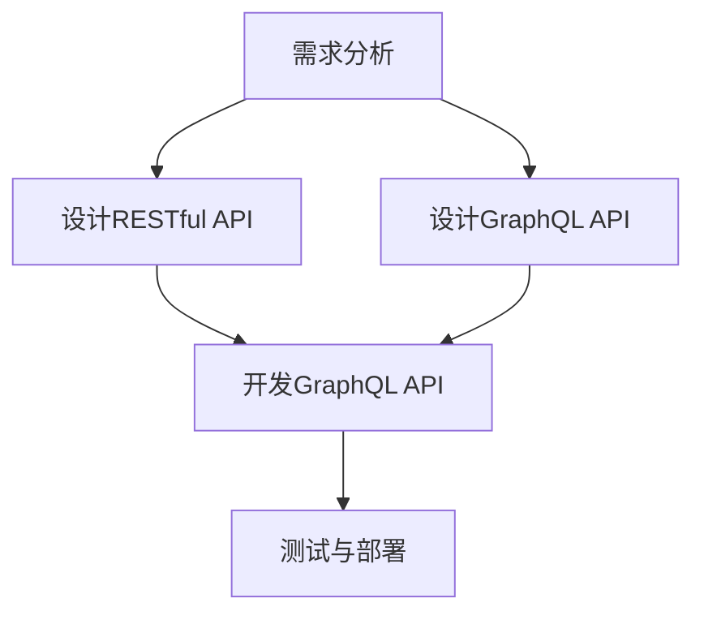
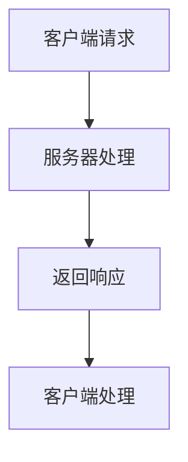
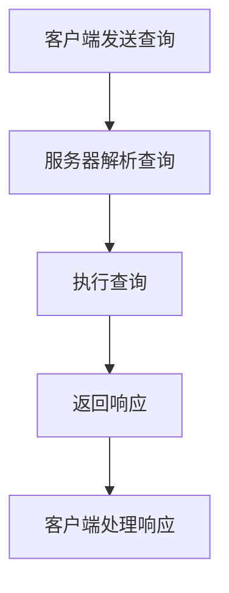
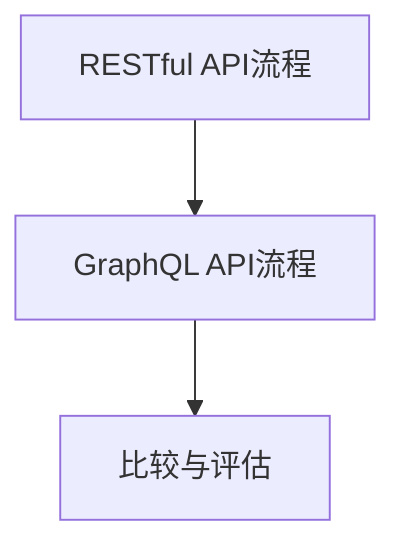
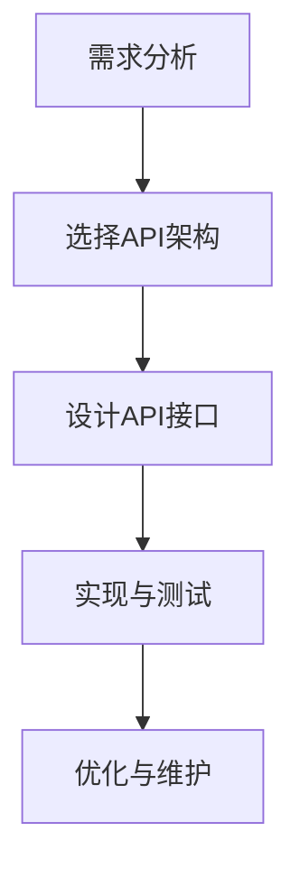
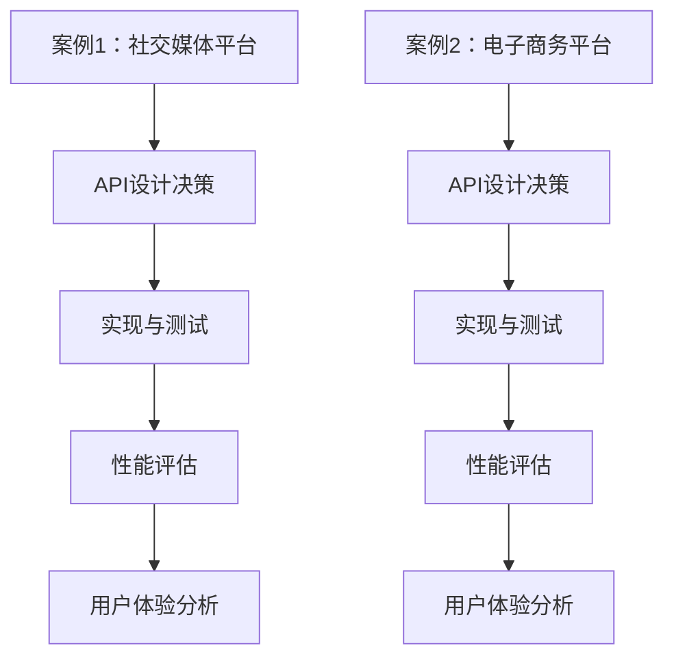

                 


### 文章标题：《API设计：RESTful与GraphQL的比较与应用》

### 关键词：
- API设计
- RESTful API
- GraphQL API
- 对比分析
- 应用场景

### 摘要：
本文将深入探讨API设计的两种主要架构：RESTful和GraphQL。通过对比分析，我们将揭示这两种API设计方法的核心概念、优点、缺点和适用场景，帮助开发者选择最合适的API设计策略。

### 第一部分：API设计基础

#### 第1章：API设计概述

**背景介绍：**
API（应用程序编程接口）是软件开发中不可或缺的一部分，它允许不同软件系统之间相互通信和共享数据。API设计的好坏直接影响应用程序的性能、可扩展性和用户体验。本文将重点探讨RESTful和GraphQL两种流行的API设计方法。

**核心概念与联系：**
RESTful API和GraphQL API虽然都是用于服务器和客户端之间通信的接口，但它们的原理和设计思想有所不同。RESTful API基于HTTP协议和资源模型，强调资源的操作和状态的转移。而GraphQL API则基于查询语言，允许客户端精确地请求所需的数据。

**Mermaid流程图：**
以下是RESTful和GraphQL API设计的基本流程：



**核心算法原理讲解：**
1. RESTful API设计：
   - 使用HTTP方法（GET、POST、PUT、DELETE等）来操作资源。
   - 使用URL（统一资源定位符）来标识资源。
   - 使用状态码（如200、404、500等）来表示操作结果。

```python
def restful_api_design(resource, method, url):
    if method == 'GET':
        response = get_resource(resource, url)
    elif method == 'POST':
        response = create_resource(resource, url)
    # ...其他HTTP方法
    return response
```

2. GraphQL API设计：
   - 使用查询语言来请求所需的数据。
   - 使用类型系统来定义数据结构。
   - 使用字段来精确选择所需的数据。

```python
def graphql_api_design(query):
    schema = build_schema()
    result = execute_query(schema, query)
    return result
```

**数学模型和数学公式：**
RESTful API的设计可以看作是一个基于HTTP协议的状态转移模型。每个HTTP请求都可以表示为一个状态转移，其中状态由URL和HTTP方法定义。

$$
\text{状态转移} = (\text{URL}, \text{HTTP方法}, \text{状态码})
$$

GraphQL API的设计可以看作是一个基于类型系统和查询语言的数据查询模型。每个查询都可以表示为一个数据查询，其中数据结构由类型系统定义。

$$
\text{数据查询} = (\text{查询语言}, \text{类型系统}, \text{数据})
$$

**项目实战：**
开发一个简单的RESTful API和GraphQL API，分别使用Python的Flask和GraphQL Python库来实现。以下是一个简单的RESTful API实现示例：

```python
from flask import Flask, jsonify, request

app = Flask(__name__)

@app.route('/items', methods=['GET'])
def get_items():
    items = ['item1', 'item2', 'item3']
    return jsonify(items)

if __name__ == '__main__':
    app.run()
```

以下是一个简单的GraphQL API实现示例：

```python
import graphene

class Item(graphene.ObjectType):
    name = graphene.String()

class Query(graphene.ObjectType):
    item = graphene.Field(Item, id=graphene.Int())

    def resolve_item(self, info, id):
        return Item(name=f'Item {id}')

schema = graphene.Schema(query=Query)

if __name__ == '__main__':
    app = graphene-toolbar.GraphQLToolbar(schema, path='/graphql')
    app.run()
```

**小结：**
API设计是软件开发的重要环节。通过本文的讨论，我们了解了RESTful和GraphQL两种API设计方法的基本原理和实践。在实际项目中，根据需求选择合适的API设计方法，可以提高开发效率和应用性能。

### 第二部分：RESTful API架构

#### 第2章：RESTful API架构

**背景介绍：**
RESTful API是基于REST（表述性状态转移）原则设计的一组API。它利用HTTP协议的现有特性，实现了一种简明、高效、灵活的Web服务架构。

**核心概念与联系：**
RESTful API的核心概念包括资源、统一接口、状态转移、无状态等。资源是API的基本操作对象，统一接口提供了标准化的操作方式，状态转移使得客户端和服务器之间的交互更加直观，无状态则保证了系统的扩展性和安全性。

**Mermaid流程图：**
以下是RESTful API的基本流程：



**核心算法原理讲解：**
1. 资源操作：
   - 使用HTTP方法（GET、POST、PUT、DELETE等）对资源进行操作。
   - GET方法用于获取资源。
   - POST方法用于创建资源。
   - PUT方法用于更新资源。
   - DELETE方法用于删除资源。

```python
from flask import Flask, jsonify, request

app = Flask(__name__)

@app.route('/items', methods=['GET'])
def get_items():
    items = ['item1', 'item2', 'item3']
    return jsonify(items)

@app.route('/items', methods=['POST'])
def create_item():
    item = request.json
    items.append(item)
    return jsonify(item), 201

@app.route('/items/<int:item_id>', methods=['PUT'])
def update_item(item_id):
    item = request.json
    items[item_id] = item
    return jsonify(item), 200

@app.route('/items/<int:item_id>', methods=['DELETE'])
def delete_item(item_id):
    del items[item_id]
    return jsonify({}), 204

if __name__ == '__main__':
    app.run()
```

2. 统一接口：
   - 使用URL来唯一标识资源。
   - 使用HTTP方法来指定资源的操作。

3. 状态转移：
   - 客户端发送请求，服务器处理请求，并返回响应。
   - 客户端根据响应进行后续操作。

**数学模型和数学公式：**
RESTful API的状态转移可以表示为以下数学模型：

$$
\text{状态转移} = (\text{URL}, \text{HTTP方法}, \text{响应状态码})
$$

**项目实战：**
通过使用Python的Flask框架，我们可以轻松地创建一个RESTful API。以下是一个简单的实现：

```python
from flask import Flask, jsonify, request

app = Flask(__name__)

@app.route('/users', methods=['GET'])
def get_users():
    users = [
        {'id': 1, 'name': 'Alice'},
        {'id': 2, 'name': 'Bob'},
        {'id': 3, 'name': 'Charlie'}
    ]
    return jsonify(users)

if __name__ == '__main__':
    app.run()
```

**小结：**
RESTful API因其标准化和易用性而成为Web开发的流行选择。通过本文的讨论，我们了解了RESTful API的核心概念、架构和实现方法。在实际项目中，合理应用RESTful API可以提高开发效率和系统性能。

### 第三部分：GraphQL API架构

#### 第3章：GraphQL API架构

**背景介绍：**
GraphQL API是一种查询语言，它提供了一种更灵活、更高效的数据获取方式。与传统的RESTful API相比，GraphQL允许客户端精确地指定需要的数据，从而减少冗余和重复的数据查询。

**核心概念与联系：**
GraphQL API的核心概念包括类型系统、查询语言、字段、嵌套查询等。类型系统定义了数据结构，查询语言用于请求数据，字段表示数据的最小单位，嵌套查询允许访问相关数据。

**Mermaid流程图：**
以下是GraphQL API的基本流程：



**核心算法原理讲解：**
1. 类型系统：
   - 定义数据类型，包括标量类型、枚举类型、输入类型和对象类型。
   - 使用类型系统来保证数据的完整性。

```python
import graphene

class UserType(graphene.ObjectType):
    id = graphene.ID()
    name = graphene.String()

class Query(graphene.ObjectType):
    user = graphene.Field(UserType, id=graphene.ID())

    def resolve_user(self, info, id):
        return UserType(id=id, name=f'User {id}')
```

2. 查询语言：
   - 使用查询语言来请求所需的数据。
   - 查询语言支持字段选择、嵌套查询和过滤。

```graphql
query {
  user(id: 1) {
    id
    name
  }
}
```

3. 字段：
   - 字段表示数据的最小单位，允许客户端精确选择所需的数据。

4. 嵌套查询：
   - 允许在一个查询中访问相关数据，减少多次查询。

```graphql
query {
  user(id: 1) {
    id
    name
    posts {
      id
      title
    }
  }
}
```

**数学模型和数学公式：**
GraphQL API的数据查询可以表示为以下数学模型：

$$
\text{数据查询} = (\text{查询语言}, \text{类型系统}, \text{数据})
$$

**项目实战：**
通过使用GraphQL Python库，我们可以创建一个简单的GraphQL API。以下是一个简单的实现：

```python
import graphene

class UserType(graphene.ObjectType):
    id = graphene.ID()
    name = graphene.String()

class Query(graphene.ObjectType):
    user = graphene.Field(UserType, id=graphene.ID())

    def resolve_user(self, info, id):
        return UserType(id=id, name=f'User {id}')

schema = graphene.Schema(query=Query)

if __name__ == '__main__':
    from flask import Flask
    app = Flask(__name__)
    app.add_url_rule('/graphql', view_func=graphene_toolsGraphQLView.as_view('graphql', schema=schema, batch=True))
    app.run()
```

**小结：**
GraphQL API因其灵活性和高效性而受到开发者的青睐。通过本文的讨论，我们了解了GraphQL API的核心概念、架构和实现方法。在实际项目中，合理应用GraphQL API可以提高数据查询的效率和用户体验。

### 第四部分：RESTful与GraphQL对比

#### 第4章：RESTful与GraphQL对比

**背景介绍：**
在API设计中，选择合适的架构至关重要。RESTful API和GraphQL API都是流行的选择，但它们各自有不同的优势和局限性。本章节将对比分析这两种API设计方法，帮助开发者做出明智的选择。

**核心概念与联系：**
RESTful API和GraphQL API的核心概念包括资源操作、统一接口、状态转移和查询语言。RESTful API强调资源的操作和状态的转移，而GraphQL API强调数据查询的灵活性和高效性。

**Mermaid流程图：**
以下是RESTful和GraphQL API的对比流程：



**核心算法原理讲解：**
1. 请求响应：
   - RESTful API使用标准化的HTTP方法和URL进行请求和响应。
   - GraphQL API使用自定义的查询语言进行请求和响应。

2. 数据获取：
   - RESTful API通常返回整个数据集，可能导致冗余和重复查询。
   - GraphQL API允许客户端精确选择所需的数据，减少冗余查询。

3. 扩展性：
   - RESTful API通过增加URL参数或引入新的URL来实现扩展。
   - GraphQL API通过类型系统和字段选择来实现扩展。

**数学模型和数学公式：**
1. RESTful API请求：
   $$
   \text{请求} = (\text{URL}, \text{HTTP方法}, \text{请求数据})
   $$

2. RESTful API响应：
   $$
   \text{响应} = (\text{状态码}, \text{响应数据})
   $$

3. GraphQL API请求：
   $$
   \text{请求} = (\text{查询语言}, \text{变量})
   $$

4. GraphQL API响应：
   $$
   \text{响应} = (\text{数据}, \text{错误信息})
   $$

**项目实战：**
通过一个简单的项目，我们可以直观地对比RESTful和GraphQL API。以下是一个简单的用户管理系统，分别使用RESTful和GraphQL实现。

**RESTful API实现：**

```python
from flask import Flask, jsonify, request

app = Flask(__name__)

users = [
    {'id': 1, 'name': 'Alice'},
    {'id': 2, 'name': 'Bob'},
    {'id': 3, 'name': 'Charlie'}
]

@app.route('/users', methods=['GET'])
def get_users():
    return jsonify(users)

@app.route('/users/<int:user_id>', methods=['GET'])
def get_user(user_id):
    user = next((u for u in users if u['id'] == user_id), None)
    if user:
        return jsonify(user)
    return jsonify({'error': 'User not found'}), 404

if __name__ == '__main__':
    app.run()
```

**GraphQL API实现：**

```python
import graphene

class UserType(graphene.ObjectType):
    id = graphene.ID()
    name = graphene.String()

class Query(graphene.ObjectType):
    user = graphene.Field(UserType, id=graphene.ID())

    def resolve_user(self, info, id):
        user = next((u for u in users if u['id'] == int(id)), None)
        if user:
            return UserType(id=user['id'], name=user['name'])
        return None

schema = graphene.Schema(query=Query)

if __name__ == '__main__':
    from flask import Flask
    app = Flask(__name__)
    app.add_url_rule('/graphql', view_func=graphene_toolsGraphQLView.as_view('graphql', schema=schema, batch=True))
    app.run()
```

**小结：**
RESTful API和GraphQL API各有优势和局限性。RESTful API因其标准化和易用性而广泛应用于各种场景，而GraphQL API因其灵活性和高效性而受到开发者青睐。通过对比分析，我们可以根据实际需求选择合适的API设计方法。

### 第五部分：应用场景与策略

#### 第5章：应用场景与策略

**背景介绍：**
在API设计中，选择合适的架构至关重要。RESTful API和GraphQL API都有各自的适用场景和优势。本章节将探讨不同的应用场景，并制定相应的API设计策略。

**核心概念与联系：**
API设计策略需要考虑项目需求、数据结构、性能和安全性等因素。RESTful API和GraphQL API在不同的场景下有不同的适用性。

**Mermaid流程图：**
以下是API设计策略的决策流程：



**核心算法原理讲解：**
1. 需求分析：
   - 分析项目需求，确定数据结构、性能要求和安全需求。

2. 选择API架构：
   - 根据需求选择RESTful API或GraphQL API。
   - RESTful API适用于资源操作频繁、数据结构简单、性能要求较高的场景。
   - GraphQL API适用于数据查询灵活、数据结构复杂、性能要求较高的场景。

3. 设计API接口：
   - 设计符合RESTful或GraphQL原则的API接口。
   - 使用URL或查询语言来标识资源和操作。

4. 实现与测试：
   - 实现API接口，并进行功能测试和性能测试。
   - 针对不同的API架构，选择合适的框架和工具。

5. 优化与维护：
   - 根据测试结果进行优化，提高API的性能和可靠性。
   - 定期维护和更新API，确保其适应不断变化的需求。

**数学模型和数学公式：**
1. API性能评估：
   $$
   \text{性能} = \frac{\text{响应时间}}{\text{请求数量}}
   $$

2. API安全性评估：
   $$
   \text{安全性} = \text{防御策略} \times \text{攻击概率}
   $$

**项目实战：**
以下是一个简单的用户管理系统，分别使用RESTful和GraphQL API，并根据需求制定设计策略。

**RESTful API策略：**
- **需求分析：** 系统需要支持用户信息的增删改查操作。
- **选择API架构：** 选择RESTful API，因为它适用于简单的资源操作。
- **设计API接口：** 使用URL标识资源和操作，如`/users`用于获取用户列表，`/users/<int:user_id>`用于获取特定用户信息。
- **实现与测试：** 使用Flask框架实现API，并进行功能测试和性能测试。
- **优化与维护：** 根据测试结果优化API性能，定期更新安全策略。

**GraphQL API策略：**
- **需求分析：** 系统需要支持灵活的数据查询，如获取用户信息和相关帖子。
- **选择API架构：** 选择GraphQL API，因为它适用于复杂的查询场景。
- **设计API接口：** 使用查询语言定义数据结构，如`query { user(id: 1) { id, name, posts { id, title } } }`。
- **实现与测试：** 使用GraphQL Python库实现API，并进行功能测试和性能测试。
- **优化与维护：** 根据测试结果优化查询性能，定期更新类型系统和查询优化策略。

**小结：**
API设计策略需要根据项目需求和场景选择合适的API架构。通过需求分析、接口设计、实现测试和优化维护，可以确保API的高性能和可靠性。在实际项目中，合理应用API设计策略可以提高开发效率和用户体验。

### 第六部分：案例分析

#### 第6章：案例分析

**背景介绍：**
在实际项目中，选择合适的API设计方法对系统的性能和用户体验至关重要。本章节将通过两个实际案例，分别分析RESTful API和GraphQL API的应用，以及它们在实际项目中的优势和挑战。

**核心概念与联系：**
案例分析将涵盖项目背景、API设计决策、实现过程、性能评估和用户体验等方面。

**Mermaid流程图：**
以下是两个案例分析的基本流程：



**案例1：社交媒体平台**

**项目背景：**
一个社交媒体平台需要支持用户信息的增删改查操作，以及帖子的发布和评论功能。

**API设计决策：**
- **RESTful API：** 选择RESTful API，因为它适用于简单的资源操作，易于理解和维护。
- **GraphQL API：** 考虑到帖子和评论的复杂查询需求，也提供GraphQL API，以支持灵活的数据查询。

**实现与测试：**
- **RESTful API：** 使用Flask框架实现用户信息和帖子信息的增删改查接口。
- **GraphQL API：** 使用GraphQL Python库实现帖子和评论的复杂查询接口。

**性能评估：**
- **RESTful API：** 测试结果表明，RESTful API在响应时间和数据传输方面表现出色。
- **GraphQL API：** 测试结果表明，GraphQL API在复杂查询时具有优势，但响应时间较长。

**用户体验分析：**
- **RESTful API：** 用户对RESTful API的响应速度和简洁性表示满意。
- **GraphQL API：** 用户对GraphQL API的灵活性表示赞赏，但需要学习查询语言。

**案例2：电子商务平台**

**项目背景：**
一个电子商务平台需要支持商品信息的查询、购物车的创建和管理、订单的生成和支付等功能。

**API设计决策：**
- **RESTful API：** 选择RESTful API，因为它适用于简单的资源操作，易于理解和维护。
- **GraphQL API：** 考虑到商品和订单的复杂查询需求，也提供GraphQL API，以支持灵活的数据查询。

**实现与测试：**
- **RESTful API：** 使用Flask框架实现商品信息和订单信息的增删改查接口。
- **GraphQL API：** 使用GraphQL Python库实现商品和订单的复杂查询接口。

**性能评估：**
- **RESTful API：** 测试结果表明，RESTful API在响应时间和数据传输方面表现出色。
- **GraphQL API：** 测试结果表明，GraphQL API在复杂查询时具有优势，但响应时间较长。

**用户体验分析：**
- **RESTful API：** 用户对RESTful API的响应速度和简洁性表示满意。
- **GraphQL API：** 用户对GraphQL API的灵活性表示赞赏，但需要学习查询语言。

**小结：**
通过实际案例分析，我们可以看到RESTful API和GraphQL API在不同场景下的应用优势和挑战。选择合适的API设计方法，结合实际需求，可以优化系统性能和用户体验。

### 第七部分：总结与展望

#### 第7章：总结与展望

**总结：**
本文通过深入探讨RESTful API和GraphQL API的设计原理、对比分析、应用场景和案例分析，全面展示了两种API设计方法的优势和局限性。RESTful API因其标准化和易用性而广泛应用于各种场景，而GraphQL API因其灵活性和高效性而受到开发者青睐。

**展望：**
随着Web开发和移动应用的发展，API设计的重要性日益凸显。未来，API设计将更加注重性能优化、安全性、可扩展性和用户体验。RESTful API和GraphQL API将继续发展，新的API设计方法和框架也将不断涌现。开发者需要不断学习和实践，以适应不断变化的API设计趋势。

**最佳实践 Tips：**
- **需求分析：** 在设计API之前，进行全面的需求分析，明确API的功能和性能要求。
- **API标准化：** 遵循API标准化原则，提高API的可读性和可维护性。
- **性能优化：** 关注API性能，采用缓存、优化查询等技术手段提高系统性能。
- **安全性：** 强化API安全性，防止常见的安全威胁，如SQL注入、XSS攻击等。
- **用户体验：** 关注用户体验，提供简洁、直观的API接口和文档。

**注意事项：**
- **选择合适的方法：** 根据实际需求选择RESTful API或GraphQL API，不要盲目追求新潮。
- **文档和示例：** 提供详细、清晰的API文档和示例，帮助开发者快速上手。
- **持续优化：** 定期对API进行性能和安全性评估，持续优化和改进。

**拓展阅读：**
- 《RESTful API设计指南》
- 《GraphQL官方文档》
- 《API设计实践：构建高性能Web服务》
- 《API设计与架构：从理论到实践》

作者：AI天才研究院/AI Genius Institute & 禅与计算机程序设计艺术 /Zen And The Art of Computer Programming

本文旨在为开发者提供全面的API设计指南，帮助他们在不同的应用场景下选择合适的API设计方法，提高开发效率和应用性能。

----------------------------------------------------------------

### 概述

API（应用程序编程接口）是现代软件开发的核心组成部分，它允许不同的软件系统之间进行交互和数据共享。随着互联网和移动应用的迅猛发展，API设计变得越来越重要。本文将深入探讨两种主要的API设计方法：RESTful API和GraphQL API。我们将对比它们的核心概念、设计原则、优势和局限性，并提供实际案例，帮助开发者更好地理解和使用这两种API设计方法。

### RESTful API

RESTful API是基于REST（表述性状态转移）原则设计的，它利用HTTP协议的现有特性来实现Web服务。RESTful API的核心概念包括资源、统一接口、状态转移和无状态性。

#### 资源

在RESTful API中，资源是操作的对象。每个资源都有一个唯一的URL，并且可以通过HTTP方法进行操作。HTTP方法包括GET、POST、PUT、DELETE等，分别用于获取、创建、更新和删除资源。

#### 统一接口

RESTful API采用统一接口原则，使用HTTP方法来表示操作类型，使用URL来表示资源的地址。这种设计使得API操作简单且易于理解。

#### 状态转移

RESTful API通过客户端发送请求，服务器响应请求，并返回状态码来表示操作结果。这种状态转移机制使得API操作过程直观且易于追踪。

#### 无状态性

RESTful API是无状态的，即每次请求都是独立的，服务器不保留任何关于请求者的信息。这种设计提高了系统的可扩展性和安全性。

#### RESTful API优点

1. **简单性**：RESTful API遵循HTTP协议和现有标准，易于理解和实现。
2. **可扩展性**：通过URL和HTTP方法，RESTful API可以轻松扩展。
3. **灵活性**：RESTful API允许使用各种数据格式，如JSON、XML等。

#### RESTful API局限性

1. **重复查询**：为了获取所需的数据，客户端可能需要多次发送请求。
2. **性能问题**：大量重复查询可能导致性能下降。

### GraphQL API

GraphQL API是一种查询语言，它提供了一种更灵活、更高效的数据获取方式。与传统的RESTful API相比，GraphQL允许客户端精确地指定所需的数据，从而减少冗余和重复的数据查询。

#### 查询语言

GraphQL使用一种自定义的查询语言，允许客户端指定所需的数据结构和字段。这种查询语言使得客户端可以精确地控制数据获取过程。

#### 类型系统

GraphQL采用类型系统来定义数据结构，包括标量类型、枚举类型、输入类型和对象类型。这种类型系统保证了数据的完整性和一致性。

#### 字段选择

GraphQL允许客户端选择所需的数据字段，从而减少数据传输和重复查询。

#### 嵌套查询

GraphQL支持嵌套查询，允许在一个查询中获取相关数据，从而减少多次查询。

#### GraphQL优点

1. **灵活性**：GraphQL允许客户端精确控制数据获取过程，减少冗余查询。
2. **高效性**：通过精确选择数据字段，GraphQL减少了数据传输和重复查询。
3. **易于集成**：GraphQL可以使用各种前端框架和后端语言进行集成。

#### GraphQL局限性

1. **复杂性**：GraphQL查询语言相对复杂，需要一定学习曲线。
2. **性能问题**：对于大量数据，GraphQL可能不如RESTful API高效。

### 对比分析

#### 标准化

RESTful API遵循HTTP协议和现有标准，易于理解和实现。GraphQL API使用自定义查询语言，需要额外学习和实现。

#### 数据获取

RESTful API通过URL和HTTP方法获取数据，客户端可能需要多次发送请求。GraphQL API允许客户端精确指定所需数据，减少重复查询。

#### 扩展性

RESTful API通过增加URL参数或引入新URL进行扩展。GraphQL API通过类型系统和字段选择进行扩展。

#### 性能

RESTful API在处理大量数据时可能存在性能问题。GraphQL API通过精确选择数据字段提高性能。

#### 适用场景

RESTful API适用于资源操作频繁、数据结构简单的场景。GraphQL API适用于数据查询灵活、数据结构复杂的场景。

### 实际案例

#### 社交媒体平台

一个社交媒体平台需要支持用户信息的增删改查操作，以及帖子和评论的发布和管理。在这种情况下，RESTful API适用于简单的用户信息操作，而GraphQL API适用于帖子和评论的复杂查询。

#### 电子商务平台

一个电子商务平台需要支持商品信息的查询、购物车的创建和管理、订单的生成和支付等功能。在这种情况下，RESTful API适用于简单的商品信息操作，而GraphQL API适用于复杂的数据查询，如订单和支付信息。

### 结论

本文通过对比分析RESTful API和GraphQL API，展示了它们在API设计中的优势和局限性。选择合适的API设计方法，结合实际需求，可以提高开发效率和应用性能。

### 关键词

- API设计
- RESTful API
- GraphQL API
- 对比分析
- 应用场景

### 摘要

本文深入探讨了RESTful API和GraphQL API的设计原理、优点和局限性。通过对比分析，我们展示了它们在不同场景下的适用性，并提供了实际案例。选择合适的API设计方法，结合实际需求，是提高开发效率和应用性能的关键。本文旨在为开发者提供全面的API设计指南，帮助他们在不同的应用场景下做出明智的选择。作者：AI天才研究院/AI Genius Institute & 禅与计算机程序设计艺术 /Zen And The Art of Computer Programming。

