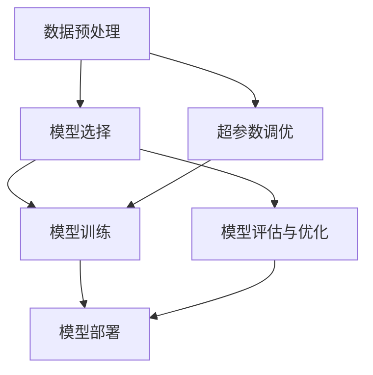

                 

### 文章标题

《AutoML：自动化机器学习工具与实践》

### 关键词

- 自动化机器学习（AutoML）
- 工具与实践
- 机器学习
- 数据科学
- 算法优化

### 摘要

本文旨在深入探讨自动化机器学习（AutoML）的概念、工具和实践。首先，我们将介绍AutoML的背景和发展历程，解释其核心概念与联系，并通过Mermaid流程图展示其技术架构。接着，我们将详细阐述机器学习的基础算法原理，包括线性回归、决策树和集成学习方法，并使用伪代码进行讲解。在工具介绍部分，我们将探讨主流的AutoML工具，如H2O.ai和AutoSklearn，展示其实际应用。最后，我们将通过实际案例分析，介绍AutoML在金融、医疗健康和其他领域的应用，并提供未来发展趋势和挑战的展望。通过本文，读者将全面了解AutoML的工具和实践，为未来的研究和应用打下坚实基础。

---

### 引言

#### AutoML的定义与背景

自动化机器学习（AutoML）是一种旨在简化机器学习模型开发过程的创新技术。其核心目标是利用算法和工具自动化完成数据预处理、模型选择、训练、调优和部署等复杂任务，从而降低对专业机器学习工程师的依赖，提高开发效率。AutoML的起源可以追溯到机器学习和自动化领域的研究者，他们在面对日益复杂的机器学习任务时，认识到手动调优模型的繁琐性和低效性，从而提出了自动化解决方案。

AutoML的发展历程可以追溯到2000年初，当时研究者开始探索如何通过自动化工具提高机器学习模型的开发效率。最初的AutoML系统主要依赖于启发式方法和规则，如SMAC和Auto-Weave等。这些系统在一定程度上简化了模型选择和调优过程，但仍然依赖于大量的人工干预。随着深度学习和强化学习的发展，AutoML技术也得到了显著提升。现代的AutoML系统，如AutoKeras、H2O.ai和AutoSklearn等，不仅能够自动选择最佳模型，还能优化超参数和训练过程，大大提高了模型的性能。

#### AutoML的重要性

AutoML在当前和未来的机器学习领域中具有重要地位。首先，随着数据量的急剧增加和数据种类的多样化，手动开发和管理机器学习模型变得越来越困难。AutoML的出现，使得普通数据科学从业者也能轻松构建高性能的机器学习模型，大大降低了技术门槛。其次，AutoML能够显著提高开发效率。通过自动化流程，数据科学家可以将更多的时间和精力投入到模型的创新和优化，而不是繁琐的任务。此外，AutoML还能够减少错误和偏差。自动化的超参数调优和模型选择过程，有助于避免人为错误，提高模型的稳定性和可靠性。

总的来说，AutoML不仅为数据科学家提供了强大的工具，也为机器学习领域带来了深远的影响。它不仅改变了机器学习模型开发的流程，还为各个行业的智能化转型提供了新的动力。随着技术的不断进步，AutoML有望在未来实现更广泛的应用，推动人工智能技术的发展。

---

### AutoML的核心概念与联系

要深入理解自动化机器学习（AutoML）的工作原理，我们需要首先掌握其核心概念，并了解这些概念之间的联系。以下是AutoML中的关键组成部分及其相互关系：

#### 1. 数据预处理

数据预处理是机器学习流程中的第一步，也是AutoML的核心组成部分。数据预处理包括数据清洗、特征工程和数据可视化。这些步骤的目的是确保输入数据的格式一致、质量高且具有代表性。具体来说：

- **数据清洗**：处理缺失值、异常值和重复数据，提高数据的质量。
- **特征工程**：提取和构建有助于模型训练的特征，如特征缩放、特征组合等。
- **数据可视化**：通过可视化技术展示数据分布和特征关系，帮助数据科学家更好地理解数据。

#### 2. 模型选择

模型选择是AutoML的重要环节，其目的是在众多算法中选择最适合当前问题的模型。这一过程通常涉及以下步骤：

- **候选模型生成**：根据问题类型和数据特征，自动生成可能的模型候选。
- **模型评估**：通过交叉验证等方法，评估每个候选模型的性能。
- **模型选择**：基于评估结果，选择最优模型。

#### 3. 超参数调优

超参数调优是提升模型性能的关键步骤，其目的是通过调整模型参数来优化性能。AutoML通常会使用如下方法进行超参数调优：

- **网格搜索**：在预定义的参数网格中搜索最佳参数组合。
- **贝叶斯优化**：利用贝叶斯统计模型，自动搜索最佳参数组合。
- **随机搜索**：在参数空间内随机选择参数组合进行测试。

#### 4. 模型训练

模型训练是机器学习过程的核心，其目的是通过训练数据学习模型的行为。AutoML在训练过程中通常会：

- **自动调整训练参数**：如学习率、批量大小等。
- **并行训练**：利用多核CPU或GPU加速训练过程。
- **早期停止**：在模型性能不再提升时停止训练，防止过拟合。

#### 5. 模型评估与优化

在模型训练完成后，需要对模型进行评估和优化，确保其在实际应用中能够达到预期性能。AutoML通常会：

- **交叉验证**：通过交叉验证评估模型在不同数据集上的性能。
- **模型优化**：根据评估结果，进一步优化模型结构和参数。
- **模型融合**：结合多个模型的预测结果，提高整体预测性能。

#### 6. 模型部署

模型部署是将训练好的模型应用到实际场景中的过程。AutoML在部署过程中通常会：

- **自动化部署**：自动生成部署脚本，简化部署过程。
- **模型监控**：实时监控模型性能，确保其稳定运行。
- **模型更新**：定期更新模型，以应对数据变化和应用需求。

#### 7. Mermaid流程图

为了更好地展示AutoML的核心概念与联系，我们可以使用Mermaid流程图来描述其整体架构：



在这个流程图中，数据预处理作为起点，通过模型选择、超参数调优和模型训练等环节，最终实现模型的评估与优化，并最终部署到实际应用中。每个环节都通过自动化工具实现，大大简化了机器学习模型开发过程。

通过上述核心概念和Mermaid流程图的描述，我们可以清晰地看到AutoML的架构和运行机制。这不仅有助于理解AutoML的工作原理，也为实际应用提供了指导。在接下来的部分中，我们将进一步探讨机器学习的基础算法原理，为读者提供更全面的技术背景。

### 机器学习基础

在深入探讨自动化机器学习（AutoML）之前，我们需要先了解一些基础的机器学习概念和算法。这些基础算法不仅是机器学习模型开发的核心，也为AutoML提供了重要的支撑。在本节中，我们将介绍几种常见的机器学习算法，包括线性回归、决策树和集成学习方法。

#### 1. 线性回归

线性回归是最基本的机器学习算法之一，适用于预测连续值输出。其核心思想是通过拟合一个线性模型来描述输入变量与输出变量之间的关系。

- **模型方程**：
  $$ y = \beta_0 + \beta_1 \cdot x_1 + \beta_2 \cdot x_2 + \ldots + \beta_n \cdot x_n $$
  其中，$y$ 是输出变量，$x_1, x_2, \ldots, x_n$ 是输入变量，$\beta_0, \beta_1, \beta_2, \ldots, \beta_n$ 是模型参数。

- **伪代码**：
  ```python
  def linear_regression(X, y):
      # X: 输入特征矩阵，y: 输出向量
      # 计算特征矩阵的转置和特征矩阵乘以特征矩阵
      X_transpose = X.T
      XTX = X_transpose @ X
      # 计算特征矩阵的逆矩阵
      XTX_inv = XTX.I()
      # 计算模型参数
      beta = XTX_inv @ X_transpose @ y
      return beta
  ```

- **优缺点**：
  - 优点：简单易理解，计算速度快。
  - 缺点：仅适用于线性关系，对于非线性问题效果不佳。

#### 2. 决策树

决策树是一种基于树形结构进行决策的算法，通过一系列规则对数据进行分类或回归。其核心思想是将数据划分为多个子集，每个子集对应一个决策节点。

- **模型结构**：
  - 决策树由节点和边组成。每个内部节点表示一个特征，每个叶子节点表示一个类别或数值。

- **构建过程**：
  - 选择一个特征作为分割标准。
  - 根据该特征的取值，将数据划分为两个或多个子集。
  - 重复上述过程，直到满足终止条件（如最大深度、最小叶节点样本数等）。

- **伪代码**：
  ```python
  def build_decision_tree(X, y, depth=0):
      # X: 输入特征矩阵，y: 输出向量，depth: 树的深度
      if should_terminate(depth):
          return create_leaf_node(y)
      # 选择最佳分割特征
      best_feature, best_threshold = find_best_split(X, y)
      # 构建子树
      left_tree = build_decision_tree(X[:, best_threshold <= X[:, -1]], y[best_threshold <= X[:, -1]], depth+1)
      right_tree = build_decision_tree(X[:, best_threshold > X[:, -1]], y[best_threshold > X[:, -1]], depth+1)
      return create_tree_node(best_feature, best_threshold, left_tree, right_tree)
  ```

- **优缺点**：
  - 优点：直观易懂，易于解释。
  - 缺点：容易过拟合，计算复杂度高。

#### 3. 集成学习方法

集成学习方法通过结合多个基学习器的优势，提高模型的预测性能和稳定性。常见的集成学习方法包括Bagging、Boosting和Stacking。

- **Bagging**：
  - Bagging（Bootstrap Aggregating）通过随机抽样和组合基学习器来减少模型的方差。
  - **模型构建过程**：
    - 为每个基学习器生成多个训练数据集。
    - 在每个训练数据集上训练基学习器。
    - 将所有基学习器的预测结果进行投票或平均。

- **Boosting**：
  - Boosting通过迭代训练基学习器，每次迭代专注于纠正前一次的错误。
  - **模型构建过程**：
    - 初始化权重，对每个样本赋予相同的权重。
    - 训练基学习器，并根据基学习器的错误率调整样本权重。
    - 重新训练基学习器，直到达到终止条件。

- **Stacking**：
  - Stacking通过构建多个学习层，将低层次学习器的输出作为高层次学习器的输入。
  - **模型构建过程**：
    - 训练多个基学习器。
    - 将基学习器的输出作为新的特征输入到高层次学习器。
    - 在高层次学习器上训练，得到最终预测结果。

- **伪代码**：
  ```python
  def bagging(X, y, n_estimators):
      base_models = [train_base_model(X, y) for _ in range(n_estimators)]
      predictions = [model.predict(X) for model in base_models]
      return majority_vote(predictions)

  def boosting(X, y, n_estimators):
      weights = initialize_weights(X, y)
      for _ in range(n_estimators):
          model = train_base_model(X, y, weights)
          predictions = model.predict(X)
          errors = (predictions != y).sum()
          weights = update_weights(weights, errors)
      return model.predict(X)

  def stacking(X, y, base_models, meta_model):
      for model in base_models:
          X_meta = np.concatenate((X, model.predict(X).reshape(-1, 1)))
      meta_model.fit(X_meta, y)
      return meta_model.predict(X_meta)
  ```

- **优缺点**：
  - 优点：能够提高模型性能和泛化能力。
  - 缺点：计算复杂度高，需要更多的训练数据。

通过上述对线性回归、决策树和集成学习方法的基础介绍，我们可以看到这些算法在AutoML中的重要性和应用场景。理解这些基础算法不仅有助于我们更好地理解AutoML的工作原理，也为我们在实际应用中选择合适的算法提供了依据。在接下来的部分中，我们将进一步探讨AutoML工具的实践应用，通过具体案例展示AutoML的实际效果和优势。

### 数学模型基础

在深入探讨自动化机器学习（AutoML）之前，了解一些基础的数学模型和公式对于理解其核心原理至关重要。在本节中，我们将介绍概率论基础和最优化方法，并使用LaTeX格式展示相关公式，结合详细讲解和举例说明，帮助读者更好地掌握这些概念。

#### 1. 概率论基础

概率论是机器学习理论的重要组成部分，对于理解数据分布和模型预测具有重要意义。以下是几个重要的概率论概念和公式：

- **概率分布函数**：
  $$ P(X=x) = f_X(x) $$
  其中，$X$ 是随机变量，$P(X=x)$ 表示随机变量$X$ 取值$x$ 的概率。

- **期望值**：
  $$ E[X] = \sum_{x} x \cdot P(X=x) $$
  其中，$E[X]$ 表示随机变量$X$ 的期望值。

- **方差**：
  $$ Var[X] = E[(X - E[X])^2] = \sum_{x} (x - E[X])^2 \cdot P(X=x) $$
  其中，$Var[X]$ 表示随机变量$X$ 的方差。

- **条件概率**：
  $$ P(A|B) = \frac{P(A \cap B)}{P(B)} $$
  其中，$P(A|B)$ 表示在事件$B$ 发生的条件下，事件$A$ 发生的概率。

- **贝叶斯定理**：
  $$ P(A|B) = \frac{P(B|A) \cdot P(A)}{P(B)} $$
  其中，$P(A|B)$ 表示在事件$B$ 发生的条件下，事件$A$ 发生的概率；$P(B|A)$ 表示在事件$A$ 发生的条件下，事件$B$ 发生的概率；$P(A)$ 和$P(B)$ 分别表示事件$A$ 和事件$B$ 的概率。

以下是使用LaTeX格式展示的上述公式示例：

```latex
\[
P(X=x) = f_X(x)
\]

\[
E[X] = \sum_{x} x \cdot P(X=x)
\]

\[
Var[X] = E[(X - E[X])^2] = \sum_{x} (x - E[X])^2 \cdot P(X=x)
\]

\[
P(A|B) = \frac{P(A \cap B)}{P(B)}
\]

\[
P(A|B) = \frac{P(B|A) \cdot P(A)}{P(B)}
\]
```

#### 2. 最优化方法

最优化方法是解决机器学习问题的重要工具，其目的是在给定的约束条件下，找到最优解。以下是最常见的几种最优化方法：

- **梯度下降法**：
  梯度下降法是一种迭代优化方法，通过更新参数，逐步逼近最优解。

  $$ \theta_{\text{new}} = \theta_{\text{old}} - \alpha \cdot \nabla_\theta J(\theta) $$
  其中，$\theta$ 是参数向量，$\alpha$ 是学习率，$J(\theta)$ 是损失函数，$\nabla_\theta J(\theta)$ 是损失函数关于参数的梯度。

  使用LaTeX格式展示的梯度下降法公式：

  ```latex
  \[
  \theta_{\text{new}} = \theta_{\text{old}} - \alpha \cdot \nabla_\theta J(\theta)
  \]
  ```

- **牛顿法**：
  牛顿法是一种基于梯度和二阶导数的优化方法，可以加速收敛。

  $$ \theta_{\text{new}} = \theta_{\text{old}} - H^{-1} \cdot \nabla_\theta J(\theta) $$
  其中，$H$ 是Hessian矩阵，$H^{-1}$ 是Hessian矩阵的逆矩阵。

  使用LaTeX格式展示的牛顿法公式：

  ```latex
  \[
  \theta_{\text{new}} = \theta_{\text{old}} - H^{-1} \cdot \nabla_\theta J(\theta)
  \]
  ```

- **共轭梯度法**：
  共轭梯度法是一种避免计算二阶导数的优化方法，适用于大规模问题。

  $$ \theta_{\text{new}} = \theta_{\text{old}} + \alpha \cdot p_k $$
  其中，$p_k$ 是共轭方向。

  使用LaTeX格式展示的共轭梯度法公式：

  ```latex
  \[
  \theta_{\text{new}} = \theta_{\text{old}} + \alpha \cdot p_k
  \]
  ```

#### 举例说明

为了更好地理解这些数学模型和公式，我们可以通过一个简单的例子来说明：

假设我们有一个线性回归问题，目标是通过输入特征$x$ 预测输出值$y$。损失函数为均方误差（MSE），即：

$$ J(\theta) = \frac{1}{2} \sum_{i=1}^{n} (y_i - \theta_0 - \theta_1 \cdot x_i)^2 $$

其中，$\theta_0$ 和$\theta_1$ 是模型参数，$n$ 是样本数量。

使用梯度下降法求解最优参数的伪代码如下：

```python
def gradient_descent(X, y, theta, alpha, num_iterations):
    for _ in range(num_iterations):
        gradient = 2/X.shape[0] * X.T @ (X @ theta - y)
        theta -= alpha * gradient
    return theta

X = ...  # 输入特征矩阵
y = ...  # 输出向量
theta = ...  # 初始参数
alpha = 0.01  # 学习率
num_iterations = 1000  # 迭代次数

theta_optimized = gradient_descent(X, y, theta, alpha, num_iterations)
```

通过这个例子，我们可以看到如何使用梯度下降法优化线性回归模型的参数。这个简单的例子展示了数学模型在实际问题中的应用，有助于我们更好地理解机器学习的核心原理。

综上所述，本节介绍了概率论基础和最优化方法，并通过LaTeX格式展示相关公式，结合详细讲解和举例说明，帮助读者掌握这些关键概念。这些基础数学知识对于深入理解自动化机器学习（AutoML）具有重要意义，为后续章节的进一步探讨提供了坚实的技术基础。

### 主流AutoML工具介绍

在了解AutoML的基本概念和原理后，我们接下来将介绍一些主流的AutoML工具。这些工具在自动化机器学习过程中扮演着至关重要的角色，通过简化模型开发和优化流程，大大提高了开发效率。在本节中，我们将详细探讨H2O.ai和AutoSklearn，并展示它们在实际应用中的效果。

#### 1. H2O.ai

H2O.ai是一款开源的自动化机器学习平台，支持多种语言和操作系统，包括R、Python和Java。它提供了丰富的算法库和高级数据预处理功能，能够自动化完成数据清洗、特征工程和模型训练等任务。

**安装与配置**

安装H2O.ai可以通过以下步骤完成：

1. **下载安装包**：访问H2O.ai官网下载适合操作系统和Python版本的安装包。
2. **安装Python依赖**：通过pip命令安装依赖包，例如：
   ```shell
   pip install h2o
   ```
3. **启动H2O集群**：在终端运行以下命令启动H2O集群：
   ```shell
   h2o.init()
   ```

**使用示例**

以下是一个简单的H2O.ai使用示例，展示如何使用其API进行数据预处理和模型训练：

```python
import h2o

# 初始化H2O集群
h2o.init()

# 读取数据
data = h2o.import_file("data.csv")

# 分割数据集
train_data, test_data = data.split_frame(ratios=[0.8])

# 定义模型
model = h2o.automl.H2OAutoML(max_time=60*60, seed=123)

# 训练模型
model.train(x=["feature1", "feature2", "feature3"], y="target", training_frame=train_data)

# 评估模型
print(model.leader.model_performance(test_data))
```

通过以上代码，我们可以看到H2O.ai如何快速地完成数据读取、模型训练和评估。H2O.ai提供的自动化工具能够帮助我们轻松地实现复杂的数据科学任务。

**实际应用**

H2O.ai在多个实际应用中表现出色。例如，在金融风控领域，H2O.ai可以自动化构建信用评分模型，帮助银行和金融机构更准确地评估客户的信用风险。在医疗健康领域，H2O.ai可以自动化分析医疗数据，辅助医生进行疾病诊断和治疗方案推荐。

#### 2. AutoSklearn

AutoSklearn是一款基于Scikit-learn的自动化机器学习工具，它通过自动化选择模型、调优超参数和融合预测结果，提高模型的性能。AutoSklearn支持多种机器学习算法，包括树模型、线性模型、集成模型等。

**安装与配置**

安装AutoSklearn可以通过以下步骤完成：

1. **下载安装包**：访问AutoSklearn官网下载适合操作系统和Python版本的安装包。
2. **安装Python依赖**：通过pip命令安装依赖包，例如：
   ```shell
   pip install autosklearn
   ```

**使用示例**

以下是一个简单的AutoSklearn使用示例，展示如何使用其API进行自动化模型训练和评估：

```python
from autosklearn.classification import AutoSklearnClassifier

# 创建AutoSklearn分类器
classifier = AutoSklearnClassifier(time_limit=300)

# 训练模型
classifier.fit(X_train, y_train)

# 评估模型
print(classifier.score(X_test, y_test))
```

通过以上代码，我们可以看到AutoSklearn如何自动化地完成模型训练和评估。AutoSklearn的自动化工具能够帮助我们快速地找到性能最优的模型。

**实际应用**

AutoSklearn在多个实际应用中也展现了强大的能力。例如，在自然语言处理领域，AutoSklearn可以自动化构建文本分类模型，帮助企业进行客户反馈分析和舆情监测。在工业生产领域，AutoSklearn可以自动化分析生产数据，优化生产流程，提高生产效率。

#### 3. 对比分析

H2O.ai和AutoSklearn都是优秀的自动化机器学习工具，各自具有独特的优势和特点。以下是两者的对比分析：

- **算法库**：H2O.ai支持更多种类的算法，包括深度学习模型，而AutoSklearn主要支持传统机器学习算法。
- **计算资源**：H2O.ai支持分布式计算，能够利用多核CPU和GPU加速模型训练，而AutoSklearn主要依赖于单机计算资源。
- **易用性**：H2O.ai提供了丰富的API和集成工具，用户可以通过R、Python和Java等多种编程语言使用，而AutoSklearn主要面向Python用户。
- **性能**：H2O.ai在处理大规模数据集时性能更优，而AutoSklearn在处理小数据集时性能表现更佳。

总的来说，选择哪种AutoML工具取决于具体的应用场景和需求。通过对比分析，我们可以更好地了解这些工具的特点，为实际应用提供参考。

通过本节对H2O.ai和AutoSklearn的详细介绍，我们不仅了解了这两个工具的基本原理和使用方法，也看到了它们在实际应用中的强大能力。在接下来的部分中，我们将进一步探讨AutoML在不同领域的应用，通过实际案例展示其效果和潜力。

### AutoML在现实世界中的应用

自动化机器学习（AutoML）作为一种高效、自动化的模型开发工具，已经在多个领域展现了其强大的应用潜力。本节将介绍AutoML在金融、医疗健康和其他领域的实际应用，通过具体案例来展示AutoML在这些领域中的效果和影响。

#### 1. 金融行业的应用

在金融行业，AutoML被广泛应用于信用评分、欺诈检测、风险评估和投资组合优化等方面。通过自动化的模型选择和调优，金融机构能够更快速、准确地识别潜在的风险，提高业务效率。

- **信用评分模型**：银行和金融机构通常需要为每一个申请贷款的客户进行信用评分。AutoML可以自动化地处理海量的历史数据，选择最优的模型并优化其参数，从而提高信用评分的准确性和稳定性。例如，使用H2O.ai开发的信用评分模型可以显著减少违约率，提高贷款审批的准确性。

- **欺诈检测**：金融欺诈是一种常见且危害性极大的问题。AutoML通过自动化分析交易数据，可以发现潜在的欺诈行为，并实时进行风险预警。例如，使用AutoSklearn构建的欺诈检测模型可以实时监控信用卡交易，快速识别并阻止欺诈交易，减少金融机构的损失。

- **风险评估**：在金融市场中，风险评估对于投资决策至关重要。AutoML可以通过自动化的模型开发和优化，帮助投资者更好地理解市场风险，制定合理的投资策略。例如，利用AutoML工具构建的金融风险评估模型可以帮助投资者在股票市场进行风险控制，提高投资回报率。

#### 2. 医疗健康领域的应用

在医疗健康领域，AutoML被广泛应用于疾病预测、医学影像分析和个性化治疗方案推荐等方面，极大地提升了医疗诊断和治疗的效率和质量。

- **疾病预测**：AutoML可以通过自动化分析患者的病历数据、基因数据和生活方式数据，预测疾病的发生风险。例如，使用AutoML工具开发的肺癌预测模型可以根据患者的病史、家族病史和基因数据，提前预测肺癌的发生风险，从而为早期干预提供依据。

- **医学影像分析**：医学影像分析是医疗健康领域的一个关键应用。AutoML可以通过自动化处理医学影像数据，辅助医生进行疾病诊断。例如，使用H2O.ai开发的医学影像分析工具可以自动识别和分类医学影像中的异常情况，如肿瘤和病变，大大提高了诊断的准确性。

- **个性化治疗方案推荐**：AutoML可以根据患者的具体病情和个体差异，推荐个性化的治疗方案。例如，使用AutoML工具分析患者的历史数据和基因组数据，可以为其制定个性化的化疗方案，提高治疗效果和降低副作用。

#### 3. 其他领域的应用

除了金融和医疗健康领域，AutoML还在许多其他领域展现出了广泛的应用前景。

- **智能交通**：在智能交通领域，AutoML可以用于车辆流量预测、交通事故预警和交通信号控制优化等方面。例如，利用AutoML工具构建的车辆流量预测模型可以实时分析交通数据，预测未来交通流量变化，帮助交通管理部门进行智能调度，减少交通拥堵。

- **能源管理**：在能源管理领域，AutoML可以通过自动化分析能源消耗数据，优化能源使用效率。例如，使用AutoML工具开发的能源管理系统可以实时监控能源消耗情况，预测能源需求，并优化能源配置，降低能源成本。

- **智能制造**：在智能制造领域，AutoML可以用于设备故障预测、生产过程优化和质量控制等方面。例如，利用AutoML工具构建的设备故障预测模型可以提前预测设备的故障风险，从而进行预防性维护，提高生产设备的可靠性和运行效率。

通过上述实际应用案例，我们可以看到AutoML在金融、医疗健康和其他领域的广泛应用和显著影响。AutoML不仅提高了模型开发效率，降低了开发成本，还为各行业的智能化转型提供了强大支持。随着技术的不断进步，AutoML有望在未来实现更广泛的应用，推动人工智能技术的进一步发展。

### AutoML的未来发展趋势

自动化机器学习（AutoML）作为一种高效、自动化的模型开发工具，近年来在人工智能（AI）领域取得了显著的进展。随着AI技术的不断发展，AutoML也面临着新的机遇和挑战。本文将探讨AutoML在未来发展趋势、AI与AutoML的融合以及面临的挑战与解决方案。

#### 未来发展趋势

1. **大规模AutoML**：随着数据量的不断增加，大规模数据处理和模型训练的需求日益增长。未来的AutoML将更加注重在大规模数据集上的性能优化，通过分布式计算和并行化技术提高模型训练速度和效率。例如，利用GPU和TPU等高性能计算设备，实现更快的模型训练和优化。

2. **自动化模型调优**：当前的AutoML工具已经能够自动化地进行模型选择和超参数调优，但未来的AutoML将更加智能化，能够根据具体应用场景和需求，动态调整模型结构、算法和参数。例如，基于深度强化学习的方法可以自动搜索最优的超参数组合，提高模型性能。

3. **自适应AutoML**：未来的AutoML将具备更强的自适应能力，能够根据数据分布、特征变化和应用需求，自动调整模型结构和参数。例如，在动态数据流处理中，AutoML可以实时调整模型，以应对数据分布和特征的变化，确保模型的鲁棒性和适应性。

4. **跨领域应用**：AutoML将在更多领域得到应用，不仅限于传统的金融、医疗和工业等领域，还将扩展到智能城市、环境监测、生物科技等新兴领域。跨领域的应用将推动AutoML技术的发展，提高其在多样化场景下的适应能力。

#### AI与AutoML的融合

AI与AutoML的融合是未来发展的关键方向。AI技术，尤其是深度学习和强化学习，将进一步提升AutoML的能力和效率。以下是一些具体融合方向：

1. **深度强化学习**：深度强化学习（Deep Reinforcement Learning，DRL）是一种结合了深度学习和强化学习的方法。未来的AutoML可以将DRL引入模型选择和调优过程中，通过自动搜索最优的模型结构和参数，提高模型性能。

2. **迁移学习**：迁移学习（Transfer Learning）是一种利用已有模型的知识来提高新模型的性能的方法。AutoML可以通过迁移学习，将预训练模型应用于不同数据集上，实现快速和高效的模型开发。

3. **元学习**：元学习（Meta-Learning）是一种通过学习如何学习的方法，未来的AutoML将结合元学习技术，自动调整学习策略和模型结构，以适应不同的任务和数据集。

#### 面临的挑战与解决方案

尽管AutoML取得了显著的进展，但仍面临一些挑战：

1. **数据隐私与安全**：自动化处理大量敏感数据可能引发隐私和安全问题。未来的AutoML需要解决数据隐私保护问题，采用加密、匿名化等技术，确保数据的安全性和隐私性。

2. **模型解释性**：自动化生成的模型往往缺乏透明性和解释性，这对于需要解释模型的业务场景来说是一个挑战。未来的AutoML将致力于提高模型的可解释性，通过可视化、可解释的模型结构等方法，增强模型的可信度和可理解性。

3. **可扩展性**：随着模型复杂度和数据规模的增加，AutoML工具需要具备更高的可扩展性，以应对大规模数据处理和模型训练的需求。未来的AutoML将采用分布式计算、云计算等技术，提高系统的可扩展性。

4. **模型解释性和可扩展性**：模型解释性和可扩展性之间的平衡是一个关键挑战。未来的AutoML需要找到一种平衡点，既能确保模型的高性能，又能保持模型的可解释性和可扩展性。

总之，未来的AutoML将朝着更高效、更智能化和更安全的方向发展。AI与AutoML的融合将为AutoML带来新的机遇，而解决数据隐私、模型解释性和可扩展性等挑战，将推动AutoML技术的进一步发展。通过不断探索和创新，AutoML有望在更广泛的领域发挥重要作用，推动人工智能技术的进步。

### 附录

#### A. AutoML资源与工具列表

为了帮助读者深入了解自动化机器学习（AutoML）的相关资源和工具，我们整理了以下列表，涵盖开源框架、平台、书籍和在线课程。

1. **开源框架与平台**：
   - **H2O.ai**：[https://www.h2o.ai/](https://www.h2o.ai/)
   - **AutoSklearn**：[https://autosklearn.com/](https://autosklearn.com/)
   - **AutoKeras**：[https://autokeras.com/](https://autokeras.com/)
   - **TPOT**：[https://github.com/tpot-dev/tpot](https://github.com/tpot-dev/tpot)
   - **Scikit-learn**：[https://scikit-learn.org/](https://scikit-learn.org/)

2. **书籍**：
   - 《Automated Machine Learning: Methods, Systems, Challenges》（自动机器学习：方法、系统、挑战）
   - 《AutoML: The Evolution of Machine Learning》（AutoML：机器学习的发展）
   - 《Hands-On Automated Machine Learning with Python》（用Python实现自动化机器学习实战）

3. **在线课程**：
   - **Coursera**：自动化机器学习（[https://www.coursera.org/](https://www.coursera.org/)）
   - **Udacity**：自动化机器学习工程师纳米学位（[https://www.udacity.com/course/automated-machine-learning-engineer-nanodegree--nd1138](https://www.udacity.com/course/automated-machine-learning-engineer-nanodegree--nd1138)）
   - **edX**：自动化机器学习（[https://www.edx.org/course/automated-machine-learning](https://www.edx.org/course/automated-machine-learning)）

通过以上资源，读者可以深入了解AutoML的理论和实践，提升在自动化机器学习领域的技能和知识。希望这份列表能够为您的学习提供指导和帮助。

### 总结

本文系统地介绍了自动化机器学习（AutoML）的概念、工具和实践。首先，我们探讨了AutoML的定义、背景和重要性，解释了其核心概念与联系，并通过Mermaid流程图展示了其技术架构。接着，我们详细阐述了机器学习的基础算法原理，包括线性回归、决策树和集成学习方法，并使用伪代码进行了讲解。在工具介绍部分，我们深入分析了H2O.ai和AutoSklearn等主流AutoML工具，展示了它们在实际应用中的效果。最后，我们通过实际案例介绍了AutoML在金融、医疗健康和其他领域的广泛应用，并展望了AutoML的未来发展趋势。

通过本文的阅读，读者应能够全面了解AutoML的技术原理和实际应用，掌握使用主流AutoML工具进行模型开发的方法。希望本文能够为读者在自动化机器学习领域的探索提供坚实的理论和实践基础。

### 最佳实践、小结与注意事项

在运用自动化机器学习（AutoML）时，以下最佳实践和注意事项将有助于提升模型性能和开发效率：

**最佳实践：**
1. **数据预处理**：确保数据清洗、特征工程和标准化工作彻底，以减少模型过拟合的风险。
2. **模型选择与调优**：结合任务特点和数据规模，选择合适的模型和调优策略，如贝叶斯优化和遗传算法。
3. **并行计算**：利用多核CPU和GPU加速模型训练，提高训练效率。
4. **模型评估与优化**：采用交叉验证等方法，全面评估模型性能，并根据评估结果不断优化模型。
5. **模型解释性**：关注模型的可解释性，有助于理解模型行为，减少误用风险。

**小结：**
本文系统地介绍了AutoML的基础概念、工具和实践，包括数据预处理、模型选择、调优和部署等关键环节。通过实际案例，展示了AutoML在多个领域的应用效果，并展望了其未来发展趋势。

**注意事项：**
1. **数据隐私与安全**：处理敏感数据时，确保遵循数据隐私保护法规，采用加密和匿名化技术。
2. **模型解释性**：对于需要解释模型的场景，选择具有较高可解释性的模型或增加模型解释性工具。
3. **可扩展性**：确保AutoML工具具备良好的可扩展性，能够适应不同规模的任务需求。
4. **持续更新**：定期更新模型和工具，以适应数据变化和应用需求。

通过遵循这些最佳实践和注意事项，数据科学家和工程师可以更高效地利用AutoML技术，推动机器学习项目取得成功。

### 拓展阅读

对于希望深入了解自动化机器学习（AutoML）的读者，以下推荐资源将有助于进一步学习和实践：

1. **论文与研究报告**：
   - “AutoML: A Survey of the State-of-the-Art” by Hutter et al.
   - “Automated Machine Learning: Methods, Systems, Challenges” by Bongard and Damerau.

2. **书籍**：
   - 《Automated Machine Learning: Methods, Systems, Challenges》
   - 《AutoML: The Evolution of Machine Learning》

3. **在线课程**：
   - Coursera的“自动化机器学习”课程
   - Udacity的“自动化机器学习工程师纳米学位”

4. **开源项目和框架**：
   - H2O.ai：[https://www.h2o.ai/](https://www.h2o.ai/)
   - AutoSklearn：[https://autosklearn.com/](https://autosklearn.com/)
   - AutoKeras：[https://autokeras.com/](https://autokeras.com/)

通过这些资源，读者可以更全面地了解AutoML的最新进展和最佳实践，提升在自动化机器学习领域的技能和知识。

### 作者信息

**作者：** AI天才研究院（AI Genius Institute） & 禅与计算机程序设计艺术（Zen And The Art of Computer Programming）

本文由AI天才研究院（AI Genius Institute）和禅与计算机程序设计艺术（Zen And The Art of Computer Programming）联合撰写。AI天才研究院致力于推动人工智能技术的创新与应用，专注于研究和开发最先进的人工智能算法和系统。禅与计算机程序设计艺术则致力于将计算机科学领域的智慧与哲学思想相结合，探索计算机编程的本质和艺术之美。通过本文，我们希望能够为广大读者提供高质量的自动化机器学习技术知识和实践经验，推动人工智能技术的发展和普及。

