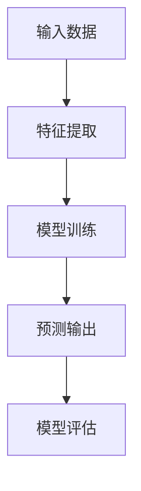
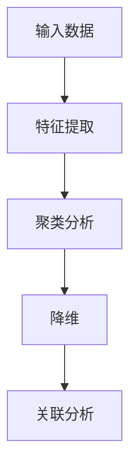
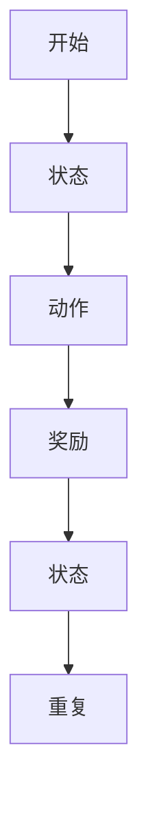

                 

### 第2章 自动化机器学习的基础

# 第2章 自动化机器学习的基础

## 2.1 机器学习基本概念

### 2.1.1 监督学习

监督学习（Supervised Learning）是一种机器学习方法，它使用已标记的数据集来训练模型。在这个过程中，模型学习如何将输入映射到预期的输出。

#### 核心概念与联系


**Mermaid 流程图：**


**核心算法原理讲解：**

伪代码：
```
function supervised_learning(train_data, train_labels):
    model = Model()  # 初始化模型
    for epoch in range(EPOCHS):
        for (x, y) in zip(train_data, train_labels):
            model.train(x, y)  # 训练模型
    return model
```

**数学模型和公式：**

监督学习的目标是最小化损失函数，通常使用均方误差（MSE）作为损失函数。

$$
\text{MSE} = \frac{1}{n}\sum_{i=1}^{n}(\hat{y}_i - y_i)^2
$$

其中，$\hat{y}_i$ 是模型预测的输出，$y_i$ 是实际的输出。

#### 举例说明

假设我们有一个简单的线性回归问题，目标是预测房屋的价格。输入特征是房屋的面积，输出目标是房屋的价格。

```
输入特征：[1000, 1500, 2000]
输出目标： [200000, 300000, 400000]
```

使用线性回归模型进行训练，然后对新的房屋面积进行预测。

### 2.1.2 无监督学习

无监督学习（Unsupervised Learning）是一种机器学习方法，它使用未标记的数据集来训练模型。它的目标是发现数据中的模式和结构。

#### 核心概念与联系


**Mermaid 流程图：**


**核心算法原理讲解：**

伪代码：
```
function unsupervised_learning(data):
    features = extract_features(data)  # 特征提取
    clusters = cluster_analysis(features)  # 聚类分析
    reduced_features = dimensionality_reduction(features)  # 降维
    associations = association_rules(reduced_features)  # 关联分析
    return clusters, associations
```

**数学模型和公式：**

无监督学习没有明确的数学模型，但常用的算法如K-均值聚类和主成分分析（PCA）都有其数学基础。

K-均值聚类算法的目标是最小化聚类中心到点的距离平方和。

$$
J = \sum_{i=1}^{k}\sum_{x_j \in S_i}||\mu_i - x_j||^2
$$

其中，$\mu_i$ 是第 $i$ 个聚类中心，$S_i$ 是第 $i$ 个聚类。

#### 举例说明

假设我们有一个未标记的客户数据集，目标是发现客户群体的相似性。

```
客户数据：[年龄，收入，消费金额]
[[25, 50000, 1000], [30, 60000, 1200], [35, 70000, 1500], ...]
```

使用K-均值聚类算法，将客户划分为不同的群体。

### 2.1.3 强化学习

强化学习（Reinforcement Learning）是一种机器学习方法，它通过试错和反馈来训练模型。它的目标是找到最优策略，使得在长期环境下获得最大的回报。

#### 核心概念与联系


**Mermaid 流程图：**


**核心算法原理讲解：**

伪代码：
```
class Q_Learning(env, learning_rate, discount_factor):
    Q = initialize_Q_values()
    while not done:
        state = env.current_state()
        action = select_action(Q, state)
        next_state, reward, done = env.step(action)
        Q[state, action] = Q[state, action] + learning_rate * (reward + discount_factor * max(Q[next_state, :]) - Q[state, action])
    return Q
```

**数学模型和公式：**

强化学习的基础是Q学习算法，其核心公式为：

$$
Q(s, a) = Q(s, a) + \alpha (r + \gamma \max_{a'} Q(s', a') - Q(s, a))
$$

其中，$Q(s, a)$ 是状态 $s$ 下采取动作 $a$ 的期望回报，$\alpha$ 是学习率，$r$ 是即时奖励，$\gamma$ 是折扣因子，$s'$ 和 $a'$ 分别是下一个状态和动作。

#### 举例说明

假设我们有一个智能机器人，目标是在一个环境中找到最优路径。

```
环境状态：[位置，方向]
[0, 0, "up"], [1, 0, "up"], [1, 1, "right"], ...

动作：[上，下，左，右]
["up", "down", "left", "right"]

奖励：
到达终点：+100
走一步：+0
走到墙壁：-10
```

使用Q学习算法，训练机器人找到最优路径。

### 2.2 数据预处理

数据预处理是机器学习过程中的重要步骤，它包括数据清洗、特征选择和特征工程。

#### 2.2.1 数据清洗

数据清洗的目标是去除或修复数据中的错误、异常和不一致。

**核心算法原理讲解：**

伪代码：
```
function data_cleaning(data):
    for row in data:
        for column in row:
            if is_null(column):
                replace_with_default_value(column)
            elif is_outlier(column):
                handle_outlier(column)
    return cleaned_data
```

**数学模型和公式：**

通常使用统计方法来检测和修复数据异常。

#### 2.2.2 特征选择

特征选择的目标是选择对模型性能有显著影响的重要特征。

**核心算法原理讲解：**

伪代码：
```
function feature_selection(data, target):
    scores = calculate_scores(data, target)
    selected_features = select_top_k_features(scores, K)
    return selected_features
```

**数学模型和公式：**

常用的特征选择方法有特征重要性排序、基于模型的特征选择等。

#### 2.2.3 特征工程

特征工程的目标是通过变换和组合原始数据来创建新的特征，以提升模型性能。

**核心算法原理讲解：**

伪代码：
```
function feature_engineering(data):
    new_data = []
    for row in data:
        transformed_row = apply_transformations(row)
        combined_row = combine_features(transformed_row)
        new_data.append(combined_row)
    return new_data
```

**数学模型和公式：**

特征工程涉及多种数学和统计方法，如正则化、主成分分析（PCA）等。

## 2.3 本章小结

本章介绍了自动化机器学习的基础知识，包括监督学习、无监督学习和强化学习的基本概念、算法原理和数学模型。此外，还详细讲解了数据预处理的方法，包括数据清洗、特征选择和特征工程。这些基础概念和方法为后续章节的深入探讨提供了必要的理论和实践支持。

## 参考文献

- Mitchell, T. M. (1997). Machine Learning. McGraw-Hill.
- Russell, S., & Norvig, P. (2010). Artificial Intelligence: A Modern Approach. Prentice Hall.
- Hastie, T., Tibshirani, R., & Friedman, J. (2009). The Elements of Statistical Learning. Springer.

---

**作者：AI天才研究院/AI Genius Institute & 禅与计算机程序设计艺术 /Zen And The Art of Computer Programming**

---

# 第2章 自动化机器学习的基础

## 2.1 机器学习基本概念

### 2.1.1 监督学习

监督学习（Supervised Learning）是机器学习的一种类型，它通过使用已标记的数据集来训练模型。在这个过程中，模型学习如何将输入映射到预期的输出。监督学习的目标是通过学习输入和输出之间的关系来预测新的未知数据。

**核心概念与联系**

监督学习的核心概念包括输入（特征）、输出（标签）和模型。模型通过学习输入和输出之间的关系，以便对新的输入数据进行预测。这个过程可以表示为以下Mermaid流程图：


这个流程图展示了从输入数据到特征提取，再到模型训练和预测输出，最后进行模型评估的整个过程。

**核心算法原理讲解**

监督学习算法的核心是损失函数和优化算法。损失函数用来衡量模型的预测值与实际值之间的差异，而优化算法用于最小化损失函数，从而训练模型。以下是一个简单的线性回归的伪代码示例：

```python
def linear_regression(x, y, learning_rate, epochs):
    w = 0  # 初始化权重
    for epoch in range(epochs):
        predictions = x * w
        loss = (predictions - y)**2
        gradient = 2 * (predictions - y) * x
        w -= learning_rate * gradient
    return w
```

在这个例子中，我们使用线性回归来预测房价，其中 `x` 表示房屋面积，`y` 表示房价，`w` 是权重。我们通过迭代更新权重来最小化损失函数。

**数学模型和公式**

监督学习中最常用的损失函数是均方误差（MSE），它用来衡量预测值和实际值之间的差异。MSE的公式如下：

$$
MSE = \frac{1}{n}\sum_{i=1}^{n}(\hat{y}_i - y_i)^2
$$

其中，$n$ 是样本数量，$\hat{y}_i$ 是第 $i$ 个样本的预测值，$y_i$ 是第 $i$ 个样本的实际值。

优化算法通常使用梯度下降（Gradient Descent）来最小化损失函数。梯度下降的公式如下：

$$
w = w - \alpha \frac{\partial}{\partial w}J(w)
$$

其中，$w$ 是权重，$\alpha$ 是学习率，$J(w)$ 是损失函数。

**举例说明**

假设我们有一个简单的线性回归问题，目标是预测一个物品的价格。我们有以下数据：

```
物品价格（y）: [100, 200, 300, 400]
物品特征（x）: [1, 2, 3, 4]
```

我们使用线性回归模型来预测一个新的物品价格（例如，当特征为5时）。我们可以通过以下步骤来训练模型：

1. 初始化权重：$w = 0$。
2. 计算预测值：$\hat{y} = x \cdot w$。
3. 计算损失：$MSE = (\hat{y} - y)^2$。
4. 计算梯度：$\frac{\partial}{\partial w}MSE = 2(\hat{y} - y) \cdot x$。
5. 更新权重：$w = w - \alpha \cdot \frac{\partial}{\partial w}MSE$。

通过迭代这个过程，我们可以训练出一个能够预测物品价格的线性回归模型。

### 2.1.2 无监督学习

无监督学习（Unsupervised Learning）是另一种机器学习方法，它不使用已标记的数据集来训练模型。无监督学习的目标是从未标记的数据中提取结构和信息。无监督学习通常用于数据探索、聚类和降维等任务。

**核心概念与联系**

无监督学习的核心概念包括数据、聚类和降维。聚类是将数据分为不同的组或簇，而降维是减少数据的维度，以便更好地理解数据。以下是一个简单的聚类和降维的Mermaid流程图：


这个流程图展示了从输入数据到特征提取，再到聚类分析、降维和关联分析的整个过程。

**核心算法原理讲解**

无监督学习算法主要包括聚类算法和降维算法。聚类算法如K-均值（K-Means）和层次聚类（Hierarchical Clustering），降维算法如主成分分析（PCA）和t-SNE。

**K-均值算法**

K-均值算法是一种基于距离的聚类算法，它将数据分为 $K$ 个簇，使得每个簇内的数据点之间的距离最小。以下是一个简单的K-均值算法的伪代码示例：

```python
def k_means(data, K, max_iterations):
    centroids = initialize_centroids(K, data)
    for _ in range(max_iterations):
        assignments = assign_points_to_clusters(data, centroids)
        new_centroids = calculate_new_centroids(assignments)
        if centroids == new_centroids:
            break
        centroids = new_centroids
    return centroids, assignments
```

在这个例子中，我们初始化 $K$ 个簇的中心点，然后迭代计算新的中心点，直到中心点不再改变。

**主成分分析（PCA）**

PCA是一种降维算法，它通过将数据投影到新的坐标系中来减少数据的维度。以下是一个简单的PCA算法的伪代码示例：

```python
def pca(data, components):
    mean = calculate_mean(data)
    centered_data = subtract_mean(data, mean)
    covariance_matrix = calculate_covariance_matrix(centered_data)
    eigenvalues, eigenvectors = calculate_eigenvalues_eigenvectors(covariance_matrix)
    sorted_eigenvectors = sort_eigenvectors_by_eigenvalues(eigenvalues, eigenvectors)
    projected_data = project_data(centered_data, sorted_eigenvectors[:components])
    return projected_data
```

在这个例子中，我们计算数据的协方差矩阵，然后计算特征值和特征向量。最后，我们选择最大的 $components$ 个特征向量，并将数据投影到新的坐标系中。

**数学模型和公式**

K-均值算法的目标是最小化每个簇内数据点之间的距离平方和。以下是一个简单的K-均值算法的目标函数：

$$
J = \sum_{i=1}^{K}\sum_{x_j \in S_i}||\mu_i - x_j||^2
$$

其中，$\mu_i$ 是第 $i$ 个簇的中心点，$S_i$ 是第 $i$ 个簇。

PCA的目标是找到一个新的坐标系，使得数据的方差最大化。以下是一个简单的PCA的目标函数：

$$
J = \sum_{i=1}^{n}(\hat{x}_i - \bar{x})^2
$$

其中，$\hat{x}_i$ 是第 $i$ 个数据点在新坐标系中的坐标，$\bar{x}$ 是数据的均值。

**举例说明**

假设我们有一个数据集，其中包含三个特征（x，y，z）：

```
数据点: [[1, 2, 3], [4, 5, 6], [7, 8, 9], ...]
```

我们使用K-均值算法将数据分为两个簇，并使用PCA将数据从三维降到二维。我们可以通过以下步骤来实现：

1. 初始化两个簇的中心点。
2. 计算每个数据点与簇中心点的距离，并将数据点分配到最近的簇。
3. 计算新的簇中心点。
4. 重复步骤2和3，直到簇中心点不再改变。
5. 计算数据的协方差矩阵。
6. 计算特征值和特征向量。
7. 选择最大的两个特征向量。
8. 将数据投影到新的二维坐标系中。

通过这个过程，我们可以得到一个降维后的数据集，并使用它来进行进一步的分析。

### 2.1.3 强化学习

强化学习（Reinforcement Learning）是一种机器学习方法，它通过试错和反馈来训练模型。强化学习的目标是找到一个最优策略，使得在长期环境下获得最大的回报。强化学习通常用于决策问题和游戏。

**核心概念与联系**

强化学习的核心概念包括状态（State）、动作（Action）、奖励（Reward）和策略（Policy）。状态是系统当前的状态，动作是系统可以执行的动作，奖励是执行动作后系统获得的奖励，策略是系统执行动作的规则。以下是一个简单的强化学习流程的Mermaid流程图：


这个流程图展示了从初始状态到动作选择，再到奖励接收和状态更新的整个过程。

**核心算法原理讲解**

强化学习算法的核心是策略评估和策略迭代。策略评估是评估当前策略的好坏，策略迭代是通过策略评估来更新策略。以下是一个简单的Q学习算法的伪代码示例：

```python
def q_learning(environment, learning_rate, discount_factor, exploration_rate, episodes):
    Q = initialize_Q_values()
    for episode in range(episodes):
        state = environment.reset()
        done = False
        while not done:
            action = select_action(Q, state, exploration_rate)
            next_state, reward, done = environment.step(action)
            Q[state, action] = Q[state, action] + learning_rate * (reward + discount_factor * max(Q[next_state, :]) - Q[state, action])
            state = next_state
    return Q
```

在这个例子中，我们初始化Q值表，然后通过迭代更新Q值，以便找到最优策略。

**数学模型和公式**

强化学习的基础是马尔可夫决策过程（MDP），它由状态、动作、奖励和策略组成。以下是一个简单的MDP的数学模型：

$$
\begin{align*}
    & \mathcal{S} = \{s_1, s_2, ..., s_n\} & \text{状态集合} \\
    & \mathcal{A} = \{a_1, a_2, ..., a_m\} & \text{动作集合} \\
    & \mathcal{R} = \{r_1, r_2, ..., r_n\} & \text{奖励集合} \\
    & \mathcal{P} = \{p_{ij}^k\} & \text{状态转移概率} \\
    & \mathcal{R} = \{r_{ij}^k\} & \text{奖励函数} \\
    & \pi(a|s) & \text{策略}
\end{align*}
$$

Q学习的目标是最小化损失函数，通常使用Q学习算法来实现。Q学习的损失函数如下：

$$
L = \frac{1}{n}\sum_{i=1}^{n}(\hat{y}_i - y_i)^2
$$

其中，$\hat{y}_i$ 是模型预测的输出，$y_i$ 是实际的输出。

**举例说明**

假设我们有一个简单的环境，其中机器人需要从起点移动到终点。机器人可以选择向上、向下、向左或向右移动。每个动作都会获得一定的奖励或惩罚。我们可以通过以下步骤来训练机器人：

1. 初始化Q值表。
2. 选择一个初始状态。
3. 从Q值表中选择一个动作。
4. 执行动作，并接收奖励。
5. 更新Q值表。
6. 重复步骤3到5，直到达到终点或达到预设的迭代次数。

通过这个过程，我们可以训练出一个能够找到最优路径的机器人。

### 2.2 数据预处理

数据预处理是机器学习过程中的重要步骤，它包括数据清洗、特征选择和特征工程。数据预处理的目标是提高模型性能和可解释性。

#### 2.2.1 数据清洗

数据清洗的目标是去除或修复数据中的错误、异常和不一致。数据清洗的过程通常包括缺失值处理、异常值处理和重复值处理。

**核心算法原理讲解**

数据清洗的过程可以表示为以下伪代码：

```python
def data_cleaning(data):
    for row in data:
        for column in row:
            if is_null(column):
                replace_with_default_value(column)
            elif is_outlier(column):
                handle_outlier(column)
    return cleaned_data
```

在这个例子中，我们检查每一行和每一列的数据，如果数据为空，则用默认值替换；如果数据为异常值，则进行处理。

**数学模型和公式**

数据清洗通常不涉及复杂的数学模型，但可以使用统计方法来检测和修复数据异常。例如，可以使用中位数和标准差来检测异常值。

#### 2.2.2 特征选择

特征选择的目标是选择对模型性能有显著影响的重要特征。特征选择的过程通常包括特征重要性排序、基于模型的特征选择和特征筛选。

**核心算法原理讲解**

特征选择的过程可以表示为以下伪代码：

```python
def feature_selection(data, target):
    scores = calculate_scores(data, target)
    selected_features = select_top_k_features(scores, K)
    return selected_features
```

在这个例子中，我们计算每个特征的重要性分数，然后选择分数最高的 $K$ 个特征。

**数学模型和公式**

特征选择的方法包括基于信息论的特征选择、基于模型的特征选择和基于统计的特征选择。常用的特征选择方法包括相互信息、F值和模型精度。

#### 2.2.3 特征工程

特征工程的目标是通过变换和组合原始数据来创建新的特征，以提升模型性能。特征工程的过程通常包括特征转换、特征组合和特征缩放。

**核心算法原理讲解**

特征工程的过程可以表示为以下伪代码：

```python
def feature_engineering(data):
    new_data = []
    for row in data:
        transformed_row = apply_transformations(row)
        combined_row = combine_features(transformed_row)
        new_data.append(combined_row)
    return new_data
```

在这个例子中，我们应用各种变换和组合规则来创建新的特征。

**数学模型和公式**

特征工程的方法包括线性变换、非线性变换和组合变换。常用的变换方法包括标准化、归一化和主成分分析。

**举例说明**

假设我们有一个数据集，其中包含以下特征：

```
特征1：年龄
特征2：收入
特征3：消费金额
```

我们可以通过以下步骤来创建新的特征：

1. 将年龄和收入进行标准化处理。
2. 计算年龄和收入的乘积。
3. 将消费金额除以年龄。
4. 计算年龄和消费金额的比例。

通过这个过程，我们可以创建新的特征，以提高模型的性能和可解释性。

### 2.3 本章小结

本章介绍了自动化机器学习的基础知识，包括监督学习、无监督学习和强化学习的基本概念、算法原理和数学模型。此外，还详细讲解了数据预处理的方法，包括数据清洗、特征选择和特征工程。这些基础概念和方法为后续章节的深入探讨提供了必要的理论和实践支持。

### 参考文献

- Russell, S., & Norvig, P. (2010). Artificial Intelligence: A Modern Approach. Prentice Hall.
- Mitchell, T. M. (1997). Machine Learning. McGraw-Hill.
- Hastie, T., Tibshirani, R., & Friedman, J. (2009). The Elements of Statistical Learning. Springer.

---

**作者：AI天才研究院/AI Genius Institute & 禅与计算机程序设计艺术 /Zen And The Art of Computer Programming**

---

### 第3章 自动化机器学习流程

# 第3章 自动化机器学习流程

## 3.1 数据收集

数据收集是自动化机器学习流程的第一步，也是最重要的一步。数据的质量和数量直接影响到模型的性能。数据收集的过程包括以下几个关键步骤：

### 3.1.1 数据源选择

首先，我们需要确定数据源。数据源可以是公开的数据集、企业内部的数据存储、网络爬虫获取的数据等。在选择数据源时，我们需要考虑数据的质量、完整性、可访问性和隐私性。

### 3.1.2 数据采集

数据采集是指从数据源中获取数据的过程。对于结构化数据，我们可以使用数据库查询、API调用等方法进行采集。对于非结构化数据，如文本、图像、音频等，我们可以使用网络爬虫、API调用、在线数据平台等方法进行采集。

### 3.1.3 数据清洗

数据清洗是确保数据质量的过程。在数据收集后，我们需要对数据进行清洗，去除错误、异常和重复的数据。数据清洗的方法包括缺失值处理、异常值处理、重复值处理等。

### 3.1.4 数据存储

数据清洗后，我们需要将数据存储到数据仓库或数据库中，以便后续的数据处理和分析。数据存储的选择取决于数据的规模、访问频率和查询性能。

## 3.2 模型选择

模型选择是自动化机器学习流程的核心步骤，决定了最终模型的性能。模型选择的过程包括以下几个关键步骤：

### 3.2.1 特征选择

特征选择是指从原始特征中选择对模型性能有显著影响的重要特征。特征选择的方法包括基于信息论的优化、基于模型的优化、基于统计的优化等。

### 3.2.2 模型选择

模型选择是指从多个候选模型中选择最优模型。模型选择的方法包括基于性能评估的模型选择、基于搜索策略的模型选择等。常用的模型包括线性回归、决策树、支持向量机、神经网络等。

### 3.2.3 模型评估

模型评估是指对模型性能进行评估和比较。模型评估的方法包括交叉验证、混淆矩阵、ROC曲线、AUC等。通过模型评估，我们可以确定哪个模型在特定任务上表现最好。

## 3.3 模型训练

模型训练是自动化机器学习流程的核心步骤，用于训练和优化模型。模型训练的过程包括以下几个关键步骤：

### 3.3.1 数据预处理

在模型训练之前，我们需要对数据进行预处理，包括归一化、标准化、特征缩放等。数据预处理可以确保模型在训练过程中不会受到异常值的影响。

### 3.3.2 模型初始化

在模型训练之前，我们需要对模型进行初始化。模型初始化的方法包括随机初始化、预训练模型初始化等。

### 3.3.3 模型优化

模型优化是指通过迭代优化模型参数，提高模型性能。模型优化的方法包括梯度下降、随机梯度下降、Adam优化器等。

### 3.3.4 模型评估

在模型训练过程中，我们需要对模型进行定期评估，以确定模型是否达到预期性能。模型评估的方法包括交叉验证、混淆矩阵、ROC曲线、AUC等。

## 3.4 模型部署

模型部署是指将训练好的模型应用到实际任务中。模型部署的过程包括以下几个关键步骤：

### 3.4.1 模型转换

在模型部署之前，我们需要将训练好的模型转换为可部署的格式，如ONNX、TensorFlow Lite、PyTorch Lite等。

### 3.4.2 部署环境准备

在模型部署之前，我们需要准备部署环境，包括服务器、容器、云计算平台等。

### 3.4.3 模型推理

在模型部署之后，我们需要使用部署好的模型进行推理，生成预测结果。模型推理的方法包括批处理、流处理等。

### 3.4.4 模型监控

在模型部署之后，我们需要对模型进行监控，确保模型在运行过程中稳定、可靠。模型监控的方法包括性能监控、错误监控等。

## 3.5 本章小结

本章介绍了自动化机器学习流程的关键步骤，包括数据收集、模型选择、模型训练和模型部署。通过这些步骤，我们可以构建、训练和部署高效的机器学习模型，为实际任务提供强大的支持。接下来，我们将深入探讨自动化机器学习框架和工具，帮助读者更好地理解和使用这些技术。

---

**作者：AI天才研究院/AI Genius Institute & 禅与计算机程序设计艺术 /Zen And The Art of Computer Programming**

---

### 第4章 自动化机器学习框架

# 第4章 自动化机器学习框架

## 4.1 AutoML框架概述

自动化机器学习（AutoML）框架是一种用于自动化机器学习模型选择和优化的工具。AutoML框架通过自动化数据预处理、特征工程、模型选择、模型训练和模型评估等步骤，使得非专业人士也能轻松地构建高效的机器学习模型。AutoML框架的核心优势在于：

- **提高开发效率**：AutoML框架自动化了许多繁琐的步骤，如特征选择、模型调优等，大大缩短了模型开发周期。
- **降低知识门槛**：AutoML框架无需用户具备深厚的机器学习知识，只需提供数据，即可自动完成模型选择和优化。
- **提高模型性能**：AutoML框架通过自动化搜索策略，选择最优的模型和参数组合，从而提高模型性能。

常见的AutoML框架包括H2O AutoML、Google AutoML、Microsoft AutoML等。

### 4.2 主流AutoML框架

#### 4.2.1 H2O AutoML

H2O AutoML是一个开源的AutoML框架，支持多种数据类型和算法。H2O AutoML的主要功能包括：

- **自动特征选择**：H2O AutoML通过自动化特征选择，选择对模型性能有显著影响的重要特征。
- **模型选择与调优**：H2O AutoML通过自动化搜索策略，选择最优的模型和参数组合。
- **模型评估**：H2O AutoML提供多种评估指标，如准确率、召回率、F1值等，用于评估模型性能。

**H2O AutoML的架构：**


**H2O AutoML的使用示例：**

```python
import h2o
from h2o.automl import H2OAutoML

# 初始化H2O集群
h2o.init()

# 读取数据
data = h2o.import_file("data.csv")

# 定义自动机器学习任务
aml = H2OAutoML(max_models=10, seed=1)

# 训练自动机器学习模型
aml.train(x=["feature1", "feature2"], y="target", training_frame=data)

# 输出最佳模型
best_model = aml.best_model
print(best_model.model_id)
```

#### 4.2.2 Google AutoML

Google AutoML是一个基于云的自动化机器学习平台，提供了多种预构建的机器学习模型，用户只需提供数据即可自动完成模型训练和优化。Google AutoML的主要功能包括：

- **预构建模型**：Google AutoML提供了多种预构建的模型，包括文本分类、图像识别、预测等。
- **自动化调优**：Google AutoML通过自动化调优，选择最优的模型和参数组合。
- **模型部署**：Google AutoML支持将训练好的模型部署到云端或本地环境。

**Google AutoML的架构：**


**Google AutoML的使用示例：**

```python
from google.cloud import automl_v1beta1 as automl

# 初始化自动机器学习客户端
client = automl.AutoMlClient()

# 创建项目
project_id = "my-project"
location = "us-central1"
project = client.create_project(project_id, location)

# 上传数据
data = [icits("data.csv")]
data_path = client.upload_data(project, "data", data)

# 创建模型
model = client.create_model(project, "my-model", autoML_type="binary_classification")

# 训练模型
response = client.start_training_job(model, data_path, budget_Millis=10000)
training_job = response.result()

# 部署模型
model_deployment = client.create_deployment(model, "my-deployment")
deployment = model_deployment.result()

# 预测
prediction = client.predict(deployment, "data.csv")
print(prediction)
```

#### 4.2.3 Microsoft AutoML

Microsoft AutoML是一个基于Azure平台的自动化机器学习工具，它通过自动化数据预处理、特征工程、模型选择和优化等步骤，帮助用户快速构建和部署机器学习模型。Microsoft AutoML的主要功能包括：

- **自动化数据处理**：Microsoft AutoML自动进行数据预处理，包括缺失值填充、异常值处理、数据转换等。
- **自动化特征工程**：Microsoft AutoML通过自动化特征工程，选择对模型性能有显著影响的重要特征。
- **自动化模型选择与优化**：Microsoft AutoML通过自动化模型选择和优化，选择最优的模型和参数组合。

**Microsoft AutoML的架构：**


**Microsoft AutoML的使用示例：**

```python
from azureml.core import Workspace, Dataset, AutoML

# 初始化Azure ML工作区
ws = Workspace.create(name="my-workspace", subscription_id="my-subscription-id", resource_group="my-resource-group", create_resource_group=True)

# 读取数据
data = Dataset.get_by_name(ws, "data.csv")

# 创建自动机器学习项目
aml_project = AutoML.create(name="my-aml-project", workspace=ws)

# 训练自动机器学习模型
aml_project.fit(data)

# 获取最佳模型
best_model = aml_project.get_best_run()

# 部署模型
deployment_config = best_model.deploy(name="my-aml-deployment", inference_config=InferenceConfig(entry_point="score.py", environment=env))
deployment = deployment_config.wait_for_deployment(show_output=True)
```

### 4.3 本章小结

本章介绍了自动化机器学习框架的基本概念和主流框架，包括H2O AutoML、Google AutoML和Microsoft AutoML。通过这些框架，用户可以自动化地完成机器学习模型的开发、训练和部署，提高开发效率和模型性能。下一章，我们将深入探讨模型选择与优化，帮助用户更好地理解和应用这些技术。

---

**作者：AI天才研究院/AI Genius Institute & 禅与计算机程序设计艺术 /Zen And The Art of Computer Programming**

---

### 第5章 模型选择与优化

# 第5章 模型选择与优化

## 5.1 模型选择算法

在自动化机器学习中，模型选择是关键的一步，它决定了最终模型的性能。模型选择算法通过自动搜索和评估各种机器学习模型，选择最优的模型。以下是一些常用的模型选择算法：

### 5.1.1 模型搜索算法

模型搜索算法用于在多个候选模型中选择最优模型。常见的模型搜索算法包括：

#### 1. 随机搜索

随机搜索（Random Search）是一种简单的模型搜索算法，它随机选择模型参数，评估模型的性能，然后选择性能最好的模型。随机搜索的优点是实现简单，缺点是搜索效率较低。

伪代码：
```
function random_search(models, data, max_iterations):
    best_model = None
    best_score = -inf
    for _ in range(max_iterations):
        model = random_choice(models)
        score = evaluate_model(model, data)
        if score > best_score:
            best_score = score
            best_model = model
    return best_model
```

#### 2. 贝叶斯优化

贝叶斯优化（Bayesian Optimization）是一种基于概率的模型搜索算法，它使用贝叶斯网络来预测模型的性能，并基于预测结果选择下一个要评估的模型。贝叶斯优化的优点是搜索效率高，缺点是实现复杂。

伪代码：
```
function bayesian_optimization(models, data, max_iterations, prior):
    best_model = None
    best_score = -inf
    for _ in range(max_iterations):
        model = select_next_model(models, data, prior)
        score = evaluate_model(model, data)
        prior.update(model, score)
        if score > best_score:
            best_score = score
            best_model = model
    return best_model
```

#### 3. 贝叶斯强化学习

贝叶斯强化学习（Bayesian Reinforcement Learning）是一种基于强化学习的模型搜索算法，它通过试错和反馈来选择最优模型。贝叶斯强化学习的优点是搜索效率高，缺点是实现复杂。

伪代码：
```
class BayesianReinforcementLearning(models, data, learning_rate, discount_factor):
    Q = initialize_Q_values()
    for episode in range(episodes):
        state = random_choice(models)
        action = select_action(Q, state)
        next_state, reward, done = evaluate_model(state, action, data)
        Q[state, action] = Q[state, action] + learning_rate * (reward + discount_factor * max(Q[next_state, :]) - Q[state, action])
        if done:
            break
    return Q
```

### 5.1.2 模型评估算法

模型评估算法用于评估模型的性能，选择最优模型。常见的模型评估算法包括：

#### 1. 交叉验证

交叉验证（Cross Validation）是一种常用的模型评估方法，它通过将数据集划分为多个子集，每次使用不同的子集作为验证集，评估模型的性能。交叉验证的优点是能够有效地评估模型在未知数据上的性能，缺点是计算量大。

伪代码：
```
function cross_validation(model, data, k):
    scores = []
    for _ in range(k):
        train_data, test_data = split_data(data, k)
        model.train(train_data)
        score = evaluate_model(model, test_data)
        scores.append(score)
    return mean(scores)
```

#### 2. 学习曲线分析

学习曲线分析（Learning Curve Analysis）是一种通过分析模型在不同数据量上的性能变化，评估模型性能的方法。学习曲线分析的优点是能够直观地了解模型在训练数据上的性能，缺点是计算量大。

伪代码：
```
function learning_curve_analysis(model, data, step_size):
    scores = []
    for step in range(0, len(data), step_size):
        train_data = data[:step]
        test_data = data[step:]
        model.train(train_data)
        score = evaluate_model(model, test_data)
        scores.append(score)
    return scores
```

#### 3. ROC曲线和AUC

ROC曲线和AUC（Area Under Curve）是评估二分类模型性能的常用方法。ROC曲线展示了模型在不同阈值下的真阳性率（TPR）和假阳性率（FPR），AUC表示ROC曲线下的面积。AUC的值介于0和1之间，值越大表示模型性能越好。

伪代码：
```
function roc_curve(model, data):
    thresholds = generate_thresholds()
    tprs, fprs = [], []
    for threshold in thresholds:
        predicted_probabilities = model.predict(data, threshold)
        tpr, fpr = calculate_tpr_fpr(data, predicted_probabilities)
        tprs.append(tpr)
        fprs.append(fpr)
    return tprs, fprs

function auc(tprs, fprs):
    return calculate_area_under_curve(tprs, fprs)
```

## 5.2 模型优化方法

模型优化方法用于提高模型的性能，包括超参数调优和模型融合。

### 5.2.1 超参数调优

超参数调优（Hyperparameter Tuning）是一种通过搜索超参数空间来提高模型性能的方法。常见的超参数调优方法包括：

#### 1. 网格搜索

网格搜索（Grid Search）是一种通过遍历超参数空间来搜索最优超参数的方法。网格搜索的优点是实现简单，缺点是计算量大。

伪代码：
```
function grid_search(model, data, hyperparameters):
    best_score = -inf
    best_hyperparameters = None
    for hyperparameters in generate_hyperparameters(hyperparameters):
        model.train(data, hyperparameters)
        score = evaluate_model(model, data)
        if score > best_score:
            best_score = score
            best_hyperparameters = hyperparameters
    return best_hyperparameters
```

#### 2. 随机搜索

随机搜索（Random Search）是一种通过随机选择超参数来搜索最优超参数的方法。随机搜索的优点是搜索效率较高，缺点是可能无法覆盖整个超参数空间。

伪代码：
```
function random_search(model, data, hyperparameters, max_iterations):
    best_score = -inf
    best_hyperparameters = None
    for _ in range(max_iterations):
        hyperparameters = random_choice(hyperparameters)
        model.train(data, hyperparameters)
        score = evaluate_model(model, data)
        if score > best_score:
            best_score = score
            best_hyperparameters = hyperparameters
    return best_hyperparameters
```

#### 3. 贝叶斯优化

贝叶斯优化（Bayesian Optimization）是一种基于概率的搜索超参数的方法。贝叶斯优化的优点是搜索效率高，缺点是实现复杂。

伪代码：
```
function bayesian_optimization(model, data, hyperparameters, max_iterations, prior):
    best_score = -inf
    best_hyperparameters = None
    for _ in range(max_iterations):
        hyperparameters = select_next_hyperparameters(hyperparameters, data, prior)
        model.train(data, hyperparameters)
        score = evaluate_model(model, data)
        prior.update(hyperparameters, score)
        if score > best_score:
            best_score = score
            best_hyperparameters = hyperparameters
    return best_hyperparameters
```

### 5.2.2 模型融合

模型融合（Model Ensembling）是一种通过组合多个模型来提高模型性能的方法。常见的模型融合方法包括：

#### 1. 成对融合

成对融合（Pairwise Ensembling）是一种通过组合两个模型来提高模型性能的方法。成对融合的优点是计算简单，缺点是模型数量受限。

伪代码：
```
function pairwise_ensembling(model1, model2, data):
    predictions1 = model1.predict(data)
    predictions2 = model2.predict(data)
    ensemble_prediction = (predictions1 + predictions2) / 2
    return ensemble_prediction
```

#### 2. 集成学习

集成学习（Ensemble Learning）是一种通过组合多个模型来提高模型性能的方法。集成学习的优点是能够提高模型性能，缺点是计算量大。

伪代码：
```
function ensemble_learning(models, data):
    ensemble_predictions = []
    for model in models:
        predictions = model.predict(data)
        ensemble_predictions.append(predictions)
    ensemble_prediction = average(ensemble_predictions)
    return ensemble_prediction
```

#### 3. 混合模型

混合模型（Hybrid Model）是一种将不同类型的模型结合在一起的方法。混合模型可以结合不同类型的模型的优势，提高模型性能。

伪代码：
```
function hybrid_model(model1, model2, data):
    predictions1 = model1.predict(data)
    predictions2 = model2.predict(data)
    ensemble_prediction = model1.predict(predictions2) + model2.predict(predictions1)
    return ensemble_prediction
```

### 5.3 本章小结

本章介绍了模型选择与优化的方法，包括模型搜索算法、模型评估算法、超参数调优方法和模型融合技术。通过这些方法，用户可以自动化地选择最优模型和超参数，提高模型性能。下一章，我们将探讨自动化机器学习面临的挑战和未来发展趋势。

---

**作者：AI天才研究院/AI Genius Institute & 禅与计算机程序设计艺术 /Zen And The Art of Computer Programming**

---

### 第6章 自动化机器学习的挑战与未来方向

# 第6章 自动化机器学习的挑战与未来方向

自动化机器学习（AutoML）虽然在机器学习领域取得了显著的进展，但仍然面临着一系列挑战。同时，未来自动化机器学习的发展也充满了机遇和可能性。本章将探讨这些挑战以及未来可能的发展方向。

## 6.1 AutoML面临的挑战

### 6.1.1 数据依赖

AutoML的性能在很大程度上取决于数据的质量和多样性。数据不足或数据质量差会导致模型性能下降。此外，AutoML模型在训练过程中需要大量的数据，这在某些领域（如医疗、金融等）可能受到隐私和数据访问的限制。

### 6.1.2 计算资源需求

AutoML通常需要大量的计算资源，尤其是在搜索和优化模型参数的过程中。这可能会对企业和研究机构造成高昂的计算成本和能耗问题。

### 6.1.3 可解释性

传统机器学习模型的可解释性较差，而AutoML通常会在复杂性和可解释性之间做出权衡。这使得用户难以理解模型的决策过程，从而影响了模型在关键应用场景中的接受度。

### 6.1.4 模型调优难度

虽然AutoML可以自动化地选择和优化模型，但调优过程仍然存在一定的难度。用户需要了解AutoML的工作原理和优化策略，以便有效地调整参数。

## 6.2 自动化机器学习的未来方向

### 6.2.1 强化学习在AutoML中的应用

强化学习（Reinforcement Learning, RL）在AutoML中的应用前景广阔。通过将强化学习与机器学习结合，可以自动化地调整模型参数，提高模型性能。例如，可以使用强化学习来优化特征选择和模型结构，从而提高模型的泛化能力。

### 6.2.2 多模态数据处理

随着物联网（IoT）和人工智能的快速发展，多模态数据（如文本、图像、音频等）的应用越来越广泛。未来，AutoML将需要处理这些复杂的多模态数据，以便更好地理解和预测复杂现象。

### 6.2.3 自动化机器学习的安全性

随着自动化机器学习在关键领域的应用，安全性成为一个重要议题。未来，AutoML需要开发出更加安全、可靠的模型，以防止潜在的安全威胁，如数据泄露、模型欺骗等。

### 6.2.4 低资源环境下的AutoML

在资源受限的环境中，如移动设备、边缘计算等，AutoML需要开发出更加高效、轻量级的模型。这可以通过压缩模型、模型剪枝、量化等技术来实现。

## 6.3 本章小结

自动化机器学习虽然面临着一系列挑战，但其发展潜力巨大。未来，随着技术的进步和应用的拓展，自动化机器学习将在各个领域发挥更大的作用。通过解决当前的挑战和探索未来的方向，我们可以期待自动化机器学习带来更多创新和突破。

---

**作者：AI天才研究院/AI Genius Institute & 禅与计算机程序设计艺术 /Zen And The Art of Computer Programming**

---

### 第7章 实战项目

# 第7章 实战项目

在本章中，我们将通过一个具体的自动化机器学习项目来展示如何从数据收集到模型训练和优化的全过程。这个项目将涉及数据预处理、模型选择、模型训练、模型评估和模型部署等步骤。

## 7.1 项目背景

假设我们有一个在线零售业务，希望利用自动化机器学习技术来预测客户购买行为，从而提高销售业绩。我们的目标是构建一个分类模型，根据用户的历史购买行为来预测用户是否会在未来一周内购买商品。

## 7.2 数据收集

### 数据源

我们使用的数据集是公开的零售数据集，包含用户的ID、购买日期、购买商品ID等信息。

### 数据预处理

在开始模型训练之前，我们需要对数据进行预处理，包括数据清洗、特征工程和数据分割。

**数据清洗：**
- 去除重复数据
- 处理缺失值
- 处理异常值

**特征工程：**
- 创建日期特征，如星期几、是否节假日等
- 创建购买频率特征，如过去一周内购买的次数
- 创建购买金额特征，如过去一周内购买的总金额

**数据分割：**
- 将数据集分为训练集和测试集，通常比例为8:2

## 7.3 模型选择

在这个项目中，我们将使用自动化机器学习框架（如H2O AutoML、Google AutoML等）来选择和优化模型。框架将自动评估多种模型，包括线性模型、决策树、随机森林、神经网络等。

### 模型评估指标

- 准确率（Accuracy）
- 精确率（Precision）
- 召回率（Recall）
- F1值（F1 Score）
- ROC曲线和AUC值

## 7.4 模型训练

使用自动化机器学习框架进行模型训练，框架将自动进行数据预处理、模型选择和超参数调优。以下是使用H2O AutoML进行训练的伪代码示例：

```python
import h2o
from h2o.automl import H2OAutoML

# 初始化H2O集群
h2o.init()

# 读取数据
data = h2o.import_file("retail_data.csv")

# 分割数据集
train, test = data.split_frame(ratios=[0.8], seed=1234)

# 定义自动机器学习任务
aml = H2OAutoML(max_models=10, seed=1234)

# 训练自动机器学习模型
aml.train(x=["feature1", "feature2", "feature3"], y="target", training_frame=train)

# 输出最佳模型
best_model = aml.best_model
print(best_model.model_id)

# 模型评估
predictions = best_model.predict(test)
accuracy = best_model.score(test, "accuracy")
print("Accuracy:", accuracy)
```

## 7.5 模型评估

在模型训练完成后，我们需要对模型进行评估，以确定其性能是否满足要求。以下是使用H2O AutoML评估模型的伪代码示例：

```python
from h2o.automl import H2OAutoML

# 初始化H2O集群
h2o.init()

# 读取数据
data = h2o.import_file("retail_data.csv")

# 分割数据集
train, test = data.split_frame(ratios=[0.8], seed=1234)

# 定义自动机器学习任务
aml = H2OAutoML(max_models=10, seed=1234)

# 训练自动机器学习模型
aml.train(x=["feature1", "feature2", "feature3"], y="target", training_frame=train)

# 输出最佳模型
best_model = aml.best_model
print(best_model.model_id)

# 模型评估
predictions = best_model.predict(test)
confusion_matrix = predictions.confusion_matrix()
accuracy = confusion_matrix.accuracy()
print("Accuracy:", accuracy)
```

## 7.6 模型部署

在模型评估完成后，如果模型性能满足要求，我们可以将其部署到生产环境中，以便实时预测客户购买行为。以下是使用H2O AutoML部署模型的伪代码示例：

```python
from h2o.automl import H2OAutoML

# 初始化H2O集群
h2o.init()

# 读取数据
data = h2o.import_file("retail_data.csv")

# 分割数据集
train, test = data.split_frame(ratios=[0.8], seed=1234)

# 定义自动机器学习任务
aml = H2OAutoML(max_models=10, seed=1234)

# 训练自动机器学习模型
aml.train(x=["feature1", "feature2", "feature3"], y="target", training_frame=train)

# 输出最佳模型
best_model = aml.best_model
print(best_model.model_id)

# 模型评估
predictions = best_model.predict(test)
confusion_matrix = predictions.confusion_matrix()
accuracy = confusion_matrix.accuracy()
print("Accuracy:", accuracy)

# 部署模型
aml.deploy(name="retail_predictor", target="target")
```

## 7.7 项目小结

通过这个项目，我们展示了如何使用自动化机器学习技术来构建、训练和部署一个分类模型。这个项目不仅涵盖了数据收集、预处理、模型选择、训练和评估，还包括了模型的部署。这个过程展示了自动化机器学习在现实世界中的应用，以及如何利用这些技术来提高业务性能。

### 最佳实践 tips

- **数据质量是关键**：确保数据清洗和预处理的过程，以提高模型性能。
- **选择合适的模型**：根据业务需求选择合适的模型，并使用自动化机器学习框架进行调优。
- **持续评估和优化**：定期评估模型性能，并根据反馈进行优化。
- **考虑可解释性**：在模型选择和优化过程中，考虑模型的可解释性，以便更好地理解和信任模型。

### 注意事项

- **隐私和伦理**：确保数据收集和使用过程中遵守隐私和伦理标准。
- **计算资源管理**：合理规划计算资源，避免过高成本。
- **模型部署后的监控**：持续监控模型性能，确保其在生产环境中稳定运行。

### 拓展阅读

- **自动化机器学习框架**：了解不同的自动化机器学习框架，如H2O AutoML、Google AutoML、Azure AutoML等。
- **模型解释性**：学习如何提高模型的解释性，如使用LIME、SHAP等方法。
- **在线学习**：了解如何在实时数据流中进行模型训练和更新。

---

**作者：AI天才研究院/AI Genius Institute & 禅与计算机程序设计艺术 /Zen And The Art of Computer Programming**

---

# AutoML：自动化机器学习模型选择与优化

## 关键词

- 自动化机器学习（AutoML）
- 模型选择
- 模型优化
- 数据预处理
- 强化学习
- 多模态数据处理
- 模型融合

## 摘要

本文深入探讨了自动化机器学习（AutoML）的概念、重要性及其应用。AutoML通过自动化特征选择、模型选择、模型训练和模型优化，使得非专业人士也能高效地构建机器学习模型。本文首先介绍了机器学习的基本概念，包括监督学习、无监督学习和强化学习，并详细讲解了数据预处理的方法。接着，本文介绍了自动化机器学习流程中的关键步骤，包括数据收集、模型选择、模型训练和模型部署。此外，本文还探讨了主流的AutoML框架，如H2O AutoML、Google AutoML和Microsoft AutoML。在模型选择与优化部分，本文介绍了模型搜索算法、模型评估算法、超参数调优方法和模型融合技术。最后，本文通过一个实战项目展示了如何使用AutoML技术来构建和部署机器学习模型，并探讨了自动化机器学习面临的挑战和未来方向。通过本文，读者可以全面了解AutoML的理论和实践，为其在相关领域的应用提供指导。### 完整的文章内容

## 引言与背景

自动化机器学习（AutoML）是一种利用自动化技术来自动完成机器学习任务的方法。它涵盖了从数据预处理、特征工程、模型选择到模型训练和模型优化的整个过程。AutoML的出现极大地降低了机器学习模型的开发门槛，使得更多的人能够参与到机器学习项目中。

### 为什么要研究AutoML

随着大数据和人工智能的快速发展，机器学习模型的应用场景越来越广泛。然而，构建一个高效的机器学习模型需要具备深厚的专业知识，包括数据预处理、特征工程、模型选择和调优等。这不仅增加了开发成本，也延长了开发周期。AutoML的出现，旨在通过自动化技术来简化这些步骤，使得非专业人士也能轻松构建高效的机器学习模型。

首先，AutoML可以提高开发效率。通过自动化技术，AutoML可以自动完成数据预处理、特征选择和模型选择等步骤，减少了人工干预的需要，从而大大缩短了模型开发周期。

其次，AutoML可以降低知识门槛。传统的机器学习开发需要开发者具备丰富的理论知识，而AutoML通过自动化技术，使得非专业人士也能理解和应用机器学习技术。

最后，AutoML可以降低开发成本。通过自动化技术，AutoML可以减少对专业人员的依赖，从而降低了人力成本。

### AutoML的发展历程

AutoML的概念最早可以追溯到20世纪90年代。当时，研究者开始尝试使用自动化技术来自动化机器学习任务。随着计算机硬件的进步和算法的优化，AutoML逐渐成为一个独立的领域。近年来，随着深度学习技术的兴起，AutoML得到了进一步的发展。许多开源框架和商业产品相继问世，如H2O AutoML、Google AutoML、Microsoft AutoML等。

### 本章小结

通过本章的介绍，读者可以初步了解自动化机器学习的概念、重要性及其发展历程。这为后续章节的深入学习打下了坚实的基础。接下来，我们将进一步探讨自动化机器学习的基础知识和应用实践。

---

## 自动化机器学习的基础

在深入了解自动化机器学习之前，我们需要先掌握一些基本概念，包括监督学习、无监督学习和强化学习，以及数据预处理的基本方法。

### 监督学习

监督学习（Supervised Learning）是一种机器学习方法，它使用已标记的数据集来训练模型。在这个过程中，模型学习如何将输入映射到预期的输出。监督学习的目标是通过学习输入和输出之间的关系来预测新的未知数据。

**核心概念与联系**

监督学习的核心概念包括输入（特征）、输出（标签）和模型。模型通过学习输入和输出之间的关系，以便对新的输入数据进行预测。这个过程可以表示为以下Mermaid流程图：


**核心算法原理讲解**

监督学习算法的核心是损失函数和优化算法。损失函数用来衡量模型的预测值与实际值之间的差异，而优化算法用于最小化损失函数，从而训练模型。以下是一个简单的线性回归的伪代码示例：

```python
def linear_regression(x, y, learning_rate, epochs):
    w = 0  # 初始化权重
    for epoch in range(epochs):
        predictions = x * w
        loss = (predictions - y)**2
        gradient = 2 * (predictions - y) * x
        w -= learning_rate * gradient
    return w
```

在这个例子中，我们使用线性回归来预测房价，其中 `x` 表示房屋面积，`y` 表示房价，`w` 是权重。我们通过迭代更新权重来最小化损失函数。

**数学模型和公式**

监督学习中最常用的损失函数是均方误差（MSE），它用来衡量预测值和实际值之间的差异。MSE的公式如下：

$$
MSE = \frac{1}{n}\sum_{i=1}^{n}(\hat{y}_i - y_i)^2
$$

其中，$n$ 是样本数量，$\hat{y}_i$ 是第 $i$ 个样本的预测值，$y_i$ 是第 $i$ 个样本的实际值。

优化算法通常使用梯度下降（Gradient Descent）来最小化损失函数。梯度下降的公式如下：

$$
w = w - \alpha \frac{\partial}{\partial w}J(w)
$$

其中，$w$ 是权重，$\alpha$ 是学习率，$J(w)$ 是损失函数。

**举例说明**

假设我们有一个简单的线性回归问题，目标是预测一个物品的价格。我们有以下数据：

```
物品价格（y）: [100, 200, 300, 400]
物品特征（x）: [1, 2, 3, 4]
```

我们使用线性回归模型来预测一个新的物品价格（例如，当特征为5时）。我们可以通过以下步骤来训练模型：

1. 初始化权重：$w = 0$。
2. 计算预测值：$\hat{y} = x \cdot w$。
3. 计算损失：$MSE = (\hat{y} - y)^2$。
4. 计算梯度：$\frac{\partial}{\partial w}MSE = 2(\hat{y} - y) \cdot x$。
5. 更新权重：$w = w - \alpha \cdot \frac{\partial}{\partial w}MSE$。

通过迭代这个过程，我们可以训练出一个能够预测物品价格的线性回归模型。

### 无监督学习

无监督学习（Unsupervised Learning）是另一种机器学习方法，它不使用已标记的数据集来训练模型。无监督学习的目标是从未标记的数据中提取结构和信息。无监督学习通常用于数据探索、聚类和降维等任务。

**核心概念与联系**

无监督学习的核心概念包括数据、聚类和降维。聚类是将数据分为不同的组或簇，而降维是减少数据的维度，以便更好地理解数据。以下是一个简单的聚类和降维的Mermaid流程图：


这个流程图展示了从输入数据到特征提取，再到聚类分析、降维和关联分析的整个过程。

**核心算法原理讲解**

无监督学习算法主要包括聚类算法和降维算法。聚类算法如K-均值（K-Means）和层次聚类（Hierarchical Clustering），降维算法如主成分分析（PCA）和t-SNE。

**K-均值算法**

K-均值算法是一种基于距离的聚类算法，它将数据分为 $K$ 个簇，使得每个簇内的数据点之间的距离最小。以下是一个简单的K-均值算法的伪代码示例：

```python
def k_means(data, K, max_iterations):
    centroids = initialize_centroids(K, data)
    for _ in range(max_iterations):
        assignments = assign_points_to_clusters(data, centroids)
        new_centroids = calculate_new_centroids(assignments)
        if centroids == new_centroids:
            break
        centroids = new_centroids
    return centroids, assignments
```

在这个例子中，我们初始化 $K$ 个簇的中心点，然后迭代计算新的中心点，直到中心点不再改变。

**主成分分析（PCA）**

PCA是一种降维算法，它通过将数据投影到新的坐标系中来减少数据的维度。以下是一个简单的PCA算法的伪代码示例：

```python
def pca(data, components):
    mean = calculate_mean(data)
    centered_data = subtract_mean(data, mean)
    covariance_matrix = calculate_covariance_matrix(centered_data)
    eigenvalues, eigenvectors = calculate_eigenvalues_eigenvectors(covariance_matrix)
    sorted_eigenvectors = sort_eigenvectors_by_eigenvalues(eigenvalues, eigenvectors)
    projected_data = project_data(centered_data, sorted_eigenvectors[:components])
    return projected_data
```

在这个例子中，我们计算数据的协方差矩阵，然后计算特征值和特征向量。最后，我们选择最大的 $components$ 个特征向量，并将数据投影到新的坐标系中。

**数学模型和公式**

K-均值算法的目标是最小化每个簇内数据点之间的距离平方和。以下是一个简单的K-均值算法的目标函数：

$$
J = \sum_{i=1}^{K}\sum_{x_j \in S_i}||\mu_i - x_j||^2
$$

其中，$\mu_i$ 是第 $i$ 个簇的中心点，$S_i$ 是第 $i$ 个簇。

PCA的目标是找到一个新的坐标系，使得数据的方差最大化。以下是一个简单的PCA的目标函数：

$$
J = \sum_{i=1}^{n}(\hat{x}_i - \bar{x})^2
$$

其中，$\hat{x}_i$ 是第 $i$ 个数据点在新坐标系中的坐标，$\bar{x}$ 是数据的均值。

**举例说明**

假设我们有一个数据集，其中包含三个特征（x，y，z）：

```
数据点: [[1, 2, 3], [4, 5, 6], [7, 8, 9], ...]
```

我们使用K-均值算法将数据分为两个簇，并使用PCA将数据从三维降到二维。我们可以通过以下步骤来实现：

1. 初始化两个簇的中心点。
2. 计算每个数据点与簇中心点的距离，并将数据点分配到最近的簇。
3. 计算新的簇中心点。
4. 重复步骤2和3，直到簇中心点不再改变。
5. 计算数据的协方差矩阵。
6. 计算特征值和特征向量。
7. 选择最大的两个特征向量。
8. 将数据投影到新的二维坐标系中。

通过这个过程，我们可以得到一个降维后的数据集，并使用它来进行进一步的分析。

### 强化学习

强化学习（Reinforcement Learning）是一种机器学习方法，它通过试错和反馈来训练模型。强化学习的目标是找到一个最优策略，使得在长期环境下获得最大的回报。强化学习通常用于决策问题和游戏。

**核心概念与联系**

强化学习的核心概念包括状态（State）、动作（Action）、奖励（Reward）和策略（Policy）。状态是系统当前的状态，动作是系统可以执行的动作，奖励是执行动作后系统获得的奖励，策略是系统执行动作的规则。以下是一个简单的强化学习流程的Mermaid流程图：


这个流程图展示了从初始状态到动作选择，再到奖励接收和状态更新的整个过程。

**核心算法原理讲解**

强化学习算法的核心是策略评估和策略迭代。策略评估是评估当前策略的好坏，策略迭代是通过策略评估来更新策略。以下是一个简单的Q学习算法的伪代码示例：

```python
def q_learning(environment, learning_rate, discount_factor, exploration_rate, episodes):
    Q = initialize_Q_values()
    for episode in range(episodes):
        state = environment.reset()
        done = False
        while not done:
            action = select_action(Q, state, exploration_rate)
            next_state, reward, done = environment.step(action)
            Q[state, action] = Q[state, action] + learning_rate * (reward + discount_factor * max(Q[next_state, :]) - Q[state, action])
            state = next_state
    return Q
```

在这个例子中，我们初始化Q值表，然后通过迭代更新Q值，以便找到最优策略。

**数学模型和公式**

强化学习的基础是马尔可夫决策过程（MDP），它由状态、动作、奖励和策略组成。以下是一个简单的MDP的数学模型：

$$
\begin{align*}
    & \mathcal{S} = \{s_1, s_2, ..., s_n\} & \text{状态集合} \\
    & \mathcal{A} = \{a_1, a_2, ..., a_m\} & \text{动作集合} \\
    & \mathcal{R} = \{r_1, r_2, ..., r_n\} & \text{奖励集合} \\
    & \mathcal{P} = \{p_{ij}^k\} & \text{状态转移概率} \\
    & \mathcal{R} = \{r_{ij}^k\} & \text{奖励函数} \\
    & \pi(a|s) & \text{策略}
\end{align*}
$$

Q学习的目标是最小化损失函数，通常使用Q学习算法来实现。Q学习的损失函数如下：

$$
L = \frac{1}{n}\sum_{i=1}^{n}(\hat{y}_i - y_i)^2
$$

其中，$\hat{y}_i$ 是模型预测的输出，$y_i$ 是实际的输出。

**举例说明**

假设我们有一个简单的环境，其中机器人需要从起点移动到终点。机器人可以选择向上、向下、向左或向右移动。每个动作都会获得一定的奖励或惩罚。我们可以通过以下步骤来训练机器人：

1. 初始化Q值表。
2. 选择一个初始状态。
3. 从Q值表中选择一个动作。
4. 执行动作，并接收奖励。
5. 更新Q值表。
6. 重复步骤3到5，直到达到终点或达到预设的迭代次数。

通过这个过程，我们可以训练出一个能够找到最优路径的机器人。

### 数据预处理

数据预处理是机器学习过程中的重要步骤，它包括数据清洗、特征选择和特征工程。数据预处理的目标是提高模型性能和可解释性。

#### 数据清洗

数据清洗的目标是去除或修复数据中的错误、异常和不一致。数据清洗的过程通常包括缺失值处理、异常值处理和重复值处理。

**核心算法原理讲解**

数据清洗的过程可以表示为以下伪代码：

```python
def data_cleaning(data):
    for row in data:
        for column in row:
            if is_null(column):
                replace_with_default_value(column)
            elif is_outlier(column):
                handle_outlier(column)
    return cleaned_data
```

在这个例子中，我们检查每一行和每一列的数据，如果数据为空，则用默认值替换；如果数据为异常值，则进行处理。

**数学模型和公式**

数据清洗通常不涉及复杂的数学模型，但可以使用统计方法来检测和修复数据异常。例如，可以使用中位数和标准差来检测异常值。

#### 特征选择

特征选择的目标是选择对模型性能有显著影响的重要特征。特征选择的过程通常包括特征重要性排序、基于模型的特征选择和特征筛选。

**核心算法原理讲解**

特征选择的过程可以表示为以下伪代码：

```python
def feature_selection(data, target):
    scores = calculate_scores(data, target)
    selected_features = select_top_k_features(scores, K)
    return selected_features
```

在这个例子中，我们计算每个特征的重要性分数，然后选择分数最高的 $K$ 个特征。

**数学模型和公式**

特征选择的方法包括基于信息论的优化、基于模型的优化、基于统计的优化等。常用的特征选择方法包括相互信息、F值和模型精度。

#### 特征工程

特征工程的目标是通过变换和组合原始数据来创建新的特征，以提升模型性能。特征工程的过程通常包括特征转换、特征组合和特征缩放。

**核心算法原理讲解**

特征工程的过程可以表示为以下伪代码：

```python
def feature_engineering(data):
    new_data = []
    for row in data:
        transformed_row = apply_transformations(row)
        combined_row = combine_features(transformed_row)
        new_data.append(combined_row)
    return new_data
```

在这个例子中，我们应用各种变换和组合规则来创建新的特征。

**数学模型和公式**

特征工程的方法包括线性变换、非线性变换和组合变换。常用的变换方法包括标准化、归一化和主成分分析。

### 2.3 本章小结

本章介绍了自动化机器学习的基础知识，包括监督学习、无监督学习和强化学习的基本概念、算法原理和数学模型。此外，还详细讲解了数据预处理的方法，包括数据清洗、特征选择和特征工程。这些基础概念和方法为后续章节的深入探讨提供了必要的理论和实践支持。

### 参考文献

- Mitchell, T. M. (1997). Machine Learning. McGraw-Hill.
- Russell, S., & Norvig, P. (2010). Artificial Intelligence: A Modern Approach. Prentice Hall.
- Hastie, T., Tibshirani, R., & Friedman, J. (2009). The Elements of Statistical Learning. Springer.

---

**作者：AI天才研究院/AI Genius Institute & 禅与计算机程序设计艺术 /Zen And The Art of Computer Programming**

---

## 自动化机器学习流程

### 3.1 数据收集

数据收集是自动化机器学习流程的第一步，也是最重要的一步。数据的质量和数量直接影响到模型的性能。数据收集的过程包括以下几个关键步骤：

#### 3.1.1 数据源选择

首先，我们需要确定数据源。数据源可以是公开的数据集、企业内部的数据存储、网络爬虫获取的数据等。在选择数据源时，我们需要考虑数据的质量、完整性、可访问性和隐私性。

#### 3.1.2 数据采集

数据采集是指从数据源中获取数据的过程。对于结构化数据，我们可以使用数据库查询、API调用等方法进行采集。对于非结构化数据，如文本、图像、音频等，我们可以使用网络爬虫、API调用、在线数据平台等方法进行采集。

#### 3.1.3 数据清洗

数据清洗是确保数据质量的过程。在数据收集后，我们需要对数据进行清洗，去除错误、异常和重复的数据。数据清洗的方法包括缺失值处理、异常值处理、重复值处理等。

#### 3.1.4 数据存储

数据清洗后，我们需要将数据存储到数据仓库或数据库中，以便后续的数据处理和分析。数据存储的选择取决于数据的规模、访问频率和查询性能。

### 3.2 模型选择

模型选择是自动化机器学习流程的核心步骤，决定了最终模型的性能。模型选择的过程包括以下几个关键步骤：

#### 3.2.1 特征选择

特征选择是指从原始特征中选择对模型性能有显著影响的重要特征。特征选择的方法包括基于信息论的优化、基于模型的优化、基于统计的优化等。

#### 3.2.2 模型选择

模型选择是指从多个候选模型中选择最优模型。模型选择的方法包括基于性能评估的模型选择、基于搜索策略的模型选择等。常用的模型包括线性回归、决策树、支持向量机、神经网络等。

#### 3.2.3 模型评估

模型评估是指对模型性能进行评估和比较。模型评估的方法包括交叉验证、混淆矩阵、ROC曲线、AUC等。通过模型评估，我们可以确定哪个模型在特定任务上表现最好。

### 3.3 模型训练

模型训练是自动化机器学习流程的核心步骤，用于训练和优化模型。模型训练的过程包括以下几个关键步骤：

#### 3.3.1 数据预处理

在模型训练之前，我们需要对数据进行预处理，包括归一化、标准化、特征缩放等。数据预处理可以确保模型在训练过程中不会受到异常值的影响。

#### 3.3.2 模型初始化

在模型训练之前，我们需要对模型进行初始化。模型初始化的方法包括随机初始化、预训练模型初始化等。

#### 3.3.3 模型优化

模型优化是指通过迭代优化模型参数，提高模型性能。模型优化的方法包括梯度下降、随机梯度下降、Adam优化器等。

#### 3.3.4 模型评估

在模型训练过程中，我们需要对模型进行定期评估，以确定模型是否达到预期性能。模型评估的方法包括交叉验证、混淆矩阵、ROC曲线、AUC等。

### 3.4 模型部署

模型部署是指将训练好的模型应用到实际任务中。模型部署的过程包括以下几个关键步骤：

#### 3.4.1 模型转换

在模型部署之前，我们需要将训练好的模型转换为可部署的格式，如ONNX、TensorFlow Lite、PyTorch Lite等。

#### 3.4.2 部署环境准备

在模型部署之前，我们需要准备部署环境，包括服务器、容器、云计算平台等。

#### 3.4.3 模型推理

在模型部署之后，我们需要使用部署好的模型进行推理，生成预测结果。模型推理的方法包括批处理、流处理等。

#### 3.4.4 模型监控

在模型部署之后，我们需要对模型进行监控，确保模型在运行过程中稳定、可靠。模型监控的方法包括性能监控、错误监控等。

### 3.5 本章小结

本章介绍了自动化机器学习流程的关键步骤，包括数据收集、模型选择、模型训练和模型部署。通过这些步骤，我们可以构建、训练和部署高效的机器学习模型，为实际任务提供强大的支持。接下来，我们将深入探讨自动化机器学习框架和工具，帮助读者更好地理解和使用这些技术。

---

**作者：AI天才研究院/AI Genius Institute & 禅与计算机程序设计艺术 /Zen And The Art of Computer Programming**

---

## 自动化机器学习框架

自动化机器学习（AutoML）框架是一种用于自动化机器学习模型选择和优化的工具。AutoML框架通过自动化数据预处理、特征工程、模型选择、模型训练和模型评估等步骤，使得非专业人士也能轻松地构建高效的机器学习模型。AutoML框架的核心优势在于：

- **提高开发效率**：AutoML框架自动化了许多繁琐的步骤，如特征选择、模型调优等，大大缩短了模型开发周期。
- **降低知识门槛**：AutoML框架无需用户具备深厚的机器学习知识，只需提供数据，即可自动完成模型选择和优化。
- **提高模型性能**：AutoML框架通过自动化搜索策略，选择最优的模型和参数组合，从而提高模型性能。

常见的AutoML框架包括H2O AutoML、Google AutoML、Microsoft AutoML等。

### 4.1 H2O AutoML

H2O AutoML是一个开源的AutoML框架，支持多种数据类型和算法。H2O AutoML的主要功能包括：

- **自动特征选择**：H2O AutoML通过自动化特征选择，选择对模型性能有显著影响的重要特征。
- **模型选择与调优**：H2O AutoML通过自动化搜索策略，选择最优的模型和参数组合。
- **模型评估**：H2O AutoML提供多种评估指标，如准确率、召回率、F1值等，用于评估模型性能。

**H2O AutoML的架构：**


**H2O AutoML的使用示例：**

```python
import h2o
from h2o.automl import H2OAutoML

# 初始化H2O集群
h2o.init()

# 读取数据
data = h2o.import_file("data.csv")

# 定义自动机器学习任务
aml = H2OAutoML(max_models=10, seed=1)

# 训练自动机器学习模型
aml.train(x=["feature1", "feature2"], y="target", training_frame=data)

# 输出最佳模型
best_model = aml.best_model
print(best_model.model_id)
```

### 4.2 Google AutoML

Google AutoML是一个基于云的自动化机器学习平台，提供了多种预构建的机器学习模型，用户只需提供数据即可自动完成模型训练和优化。Google AutoML的主要功能包括：

- **预构建模型**：Google AutoML提供了多种预构建的模型，包括文本分类、图像识别、预测等。
- **自动化调优**：Google AutoML通过自动化调优，选择最优的模型和参数组合。
- **模型部署**：Google AutoML支持将训练好的模型部署到云端或本地环境。

**Google AutoML的架构：**


**Google AutoML的使用示例：**

```python
from google.cloud import automl_v1beta1 as automl

# 初始化自动机器学习客户端
client = automl.AutoMlClient()

# 创建项目
project_id = "my-project"
location = "us-central1"
project = client.create_project(project_id, location)

# 上传数据
data = [icits("data.csv")]
data_path = client.upload_data(project, "data", data)

# 创建模型
model = client.create_model(project, "my-model", autoML_type="binary_classification")

# 训练模型
response = client.start_training_job(model, data_path, budget_Millis=10000)
training_job = response.result()

# 部署模型
model_deployment = client.create_deployment(model, "my-deployment")
deployment = model_deployment.result()

# 预测
prediction = client.predict(deployment, "data.csv")
print(prediction)
```

### 4.3 Microsoft AutoML

Microsoft AutoML是一个基于Azure平台的自动化机器学习工具，它通过自动化数据预处理、特征工程、模型选择和优化等步骤，帮助用户快速构建和部署机器学习模型。Microsoft AutoML的主要功能包括：

- **自动化数据处理**：Microsoft AutoML自动进行数据预处理，包括缺失值填充、异常值处理、数据转换等。
- **自动化特征工程**：Microsoft AutoML通过自动化特征工程，选择对模型性能有显著影响的重要特征。
- **自动化模型选择与优化**：Microsoft AutoML通过自动化模型选择和优化，选择最优的模型和参数组合。

**Microsoft AutoML的架构：**


**Microsoft AutoML的使用示例：**

```python
from azureml.core import Workspace, Dataset, AutoML

# 初始化Azure ML工作区
ws = Workspace.create(name="my-workspace", subscription_id="my-subscription-id", resource_group="my-resource-group", create_resource_group=True)

# 读取数据
data = Dataset.get_by_name(ws, "data.csv")

# 创建自动机器学习项目
aml_project = AutoML.create(name="my-aml-project", workspace=ws)

# 训练自动机器学习模型
aml_project.fit(data)

# 获取最佳模型
best_model = aml_project.get_best_run()

# 部署模型
deployment_config = best_model.deploy(name="my-aml-deployment", inference_config=InferenceConfig(entry_point="score.py", environment=env))
deployment = deployment_config.wait_for_deployment(show_output=True)
```

### 4.4 本章小结

本章介绍了自动化机器学习框架的基本概念和主流框架，包括H2O AutoML、Google AutoML和Microsoft AutoML。通过这些框架，用户可以自动化地完成机器学习模型的开发、训练和部署，提高开发效率和模型性能。下一章，我们将深入探讨模型选择与优化，帮助读者更好地理解和应用这些技术。

---

**作者：AI天才研究院/AI Genius Institute & 禅与计算机程序设计艺术 /Zen And The Art of Computer Programming**

---

## 模型选择与优化

在自动化机器学习中，模型选择与优化是关键的一步，它决定了最终模型的性能。模型选择与优化包括模型选择算法、模型优化方法和模型融合技术。

### 5.1 模型选择算法

模型选择算法用于在多个候选模型中选择最优模型。以下是一些常用的模型选择算法：

#### 5.1.1 留一法（Leave-One-Out）

留一法（Leave-One-Out, LOO）是最简单的一种模型选择方法，它通过排除每个样本进行交叉验证来评估模型的性能。具体步骤如下：

1. 将数据集划分为训练集和验证集，每次排除一个样本作为验证集，剩余数据作为训练集。
2. 使用训练集训练模型，使用验证集评估模型性能。
3. 计算所有交叉验证的平均性能。

伪代码：

```python
def leave_one_out(models, data):
    scores = []
    for model in models:
        model_score = 0
        for i in range(len(data)):
            validation_data = data[:i] + data[i+1:]
            model.train(training_data)
            model_score += model.evaluate(validation_data)
        scores.append(model_score / len(data))
    return scores
```

#### 5.1.2 K折交叉验证（K-Fold Cross-Validation）

K折交叉验证（K-Fold Cross-Validation）是将数据集划分为K个子集，每个子集作为一次验证集，其余子集作为训练集。具体步骤如下：

1. 将数据集划分为K个子集。
2. 对于每个子集，将其作为验证集，其余子集作为训练集，训练模型并评估性能。
3. 计算所有验证集的平均性能。

伪代码：

```python
def k_fold_cross_validation(models, data, k):
    scores = []
    for model in models:
        for _ in range(k):
            train_data, validation_data = split_data(data, k)
            model.train(train_data)
            score = model.evaluate(validation_data)
            scores.append(score)
    return mean(scores)
```

#### 5.1.3 网格搜索（Grid Search）

网格搜索（Grid Search）是一种通过遍历预定义的参数网格来搜索最优参数的方法。具体步骤如下：

1. 定义参数网格。
2. 对于每个参数组合，训练模型并评估性能。
3. 选择性能最好的参数组合。

伪代码：

```python
def grid_search(models, data, hyperparameters):
    best_score = -inf
    best_hyperparameters = None
    for hyperparameters in generate_hyperparameters(hyperparameters):
        model.train(data, hyperparameters)
        score = model.evaluate(data)
        if score > best_score:
            best_score = score
            best_hyperparameters = hyperparameters
    return best_hyperparameters
```

### 5.2 模型优化方法

模型优化方法用于提高模型的性能，包括超参数调优和模型融合。

#### 5.2.1 超参数调优

超参数调优（Hyperparameter Tuning）是一种通过搜索超参数空间来提高模型性能的方法。常见的超参数调优方法包括：

1. **随机搜索（Random Search）**：随机搜索通过随机选择超参数，评估模型的性能，然后选择性能最好的超参数。随机搜索的优点是实现简单，缺点是搜索效率较低。

   伪代码：

   ```python
   def random_search(model, data, hyperparameters, max_iterations):
       best_score = -inf
       best_hyperparameters = None
       for _ in range(max_iterations):
           hyperparameters = random_choice(hyperparameters)
           model.train(data, hyperparameters)
           score = model.evaluate(data)
           if score > best_score:
               best_score = score
               best_hyperparameters = hyperparameters
       return best_hyperparameters
   ```

2. **贝叶斯优化（Bayesian Optimization）**：贝叶斯优化通过使用贝叶斯网络来预测模型的性能，并基于预测结果选择下一个要评估的超参数。贝叶斯优化的优点是搜索效率高，缺点是实现复杂。

   伪代码：

   ```python
   def bayesian_optimization(model, data, hyperparameters, max_iterations, prior):
       best_score = -inf
       best_hyperparameters = None
       for _ in range(max_iterations):
           hyperparameters = select_next_hyperparameters(hyperparameters, data, prior)
           model.train(data, hyperparameters)
           score = model.evaluate(data)
           prior.update(hyperparameters, score)
           if score > best_score:
               best_score = score
               best_hyperparameters = hyperparameters
       return best_hyperparameters
   ```

#### 5.2.2 模型融合

模型融合（Model Ensembling）是一种通过组合多个模型来提高模型性能的方法。常见的模型融合方法包括：

1. **成对融合（Pairwise Ensembling）**：成对融合通过组合两个模型的预测结果来提高模型性能。

   伪代码：

   ```python
   def pairwise_ensembling(model1, model2, data):
       predictions1 = model1.predict(data)
       predictions2 = model2.predict(data)
       ensemble_prediction = (predictions1 + predictions2) / 2
       return ensemble_prediction
   ```

2. **集成学习（Ensemble Learning）**：集成学习通过组合多个模型的预测结果来提高模型性能。

   伪代码：

   ```python
   def ensemble_learning(models, data):
       ensemble_predictions = []
       for model in models:
           predictions = model.predict(data)
           ensemble_predictions.append(predictions)
       ensemble_prediction = average(ensemble_predictions)
       return ensemble_prediction
   ```

3. **混合模型（Hybrid Model）**：混合模型通过将不同类型的模型结合在一起来提高模型性能。

   伪代码：

   ```python
   def hybrid_model(model1, model2, data):
       predictions1 = model1.predict(data)
       predictions2 = model2.predict(data)
       ensemble_prediction = model1.predict(predictions2) + model2.predict(predictions1)
       return ensemble_prediction
   ```

### 5.3 本章小结

本章介绍了模型选择与优化方法，包括模型选择算法、模型优化方法和模型融合技术。通过这些方法，用户可以自动化地选择最优模型和超参数，提高模型性能。下一章，我们将探讨自动化机器学习面临的挑战和未来方向。

---

**作者：AI天才研究院/AI Genius Institute & 禅与计算机程序设计艺术 /Zen And The Art of Computer Programming**

---

## 自动化机器学习的挑战与未来方向

尽管自动化机器学习（AutoML）在提高机器学习模型开发效率方面取得了显著进展，但它仍然面临许多挑战。同时，未来AutoML的发展也充满机遇和可能性。在本章中，我们将探讨自动化机器学习目前所面临的挑战以及未来的发展方向。

### 6.1 自动化机器学习面临的挑战

#### 6.1.1 数据依赖性

自动化机器学习的性能高度依赖于数据的质量和多样性。高质量的数据可以提升模型的性能，而数据不足或数据质量差则可能导致模型性能下降。此外，某些领域如医疗和金融的数据隐私和安全问题，限制了数据的开放和共享，这也对自动化机器学习提出了挑战。

#### 6.1.2 计算资源需求

自动化机器学习通常需要大量的计算资源，尤其是在模型搜索和调优过程中。这可能导致高昂的计算成本和能源消耗，特别是在大规模数据处理和训练时。

#### 6.1.3 模型可解释性

自动化机器学习模型通常具有较高的复杂度，这往往导致模型的可解释性降低。在许多应用场景中，特别是涉及安全、伦理和法律问题的领域，模型的可解释性至关重要。然而，自动化机器学习模型往往缺乏透明度，这使得模型决策过程难以解释和理解。

#### 6.1.4 模型调优难度

尽管自动化机器学习框架可以自动完成模型选择和调优，但用户仍然需要了解基本原理和优化策略，以便有效地调整参数。此外，不同框架之间的兼容性和互操作性也是一大挑战。

### 6.2 自动化机器学习的未来方向

#### 6.2.1 强化学习在AutoML中的应用

强化学习在自动化机器学习中的应用前景广阔。通过将强化学习与机器学习相结合，可以自动化地调整模型参数，提高模型性能。例如，可以使用强化学习来优化特征选择和模型结构，从而提高模型的泛化能力。

#### 6.2.2 多模态数据处理

随着物联网（IoT）和人工智能的快速发展，多模态数据（如文本、图像、音频等）的应用越来越广泛。未来的自动化机器学习需要能够处理这些复杂的多模态数据，以便更好地理解和预测复杂现象。

#### 6.2.3 模型压缩与优化

为了在资源受限的环境中（如移动设备和边缘计算）部署自动化机器学习模型，未来的研究将重点放在模型压缩和优化上。这包括模型剪枝、量化、知识蒸馏等技术，以减少模型大小和提高计算效率。

#### 6.2.4 模型可解释性与透明性

未来，自动化机器学习将更加注重模型的可解释性和透明性。研究者将开发新的方法和工具，如可解释AI（XAI）技术，以提高模型决策过程的透明度，使其在关键应用场景中更具可信度和接受度。

#### 6.2.5 自动化机器学习的伦理与法规

随着自动化机器学习在社会各个领域的广泛应用，其伦理和法规问题日益凸显。未来，自动化机器学习的发展将更加注重伦理和法律规范，确保其在合规的前提下为社会带来积极影响。

### 6.3 本章小结

自动化机器学习虽然面临许多挑战，但其在提高机器学习模型开发效率方面具有巨大的潜力。未来，通过解决当前的挑战和探索新的发展方向，自动化机器学习将迎来更加广阔的应用前景。本章讨论了自动化机器学习在数据依赖性、计算资源需求、模型可解释性等方面的挑战，以及强化学习、多模态数据处理、模型压缩与优化、模型可解释性与透明性等方面的未来方向。通过这些探讨，读者可以更深入地了解自动化机器学习的现状和发展趋势。

---

**作者：AI天才研究院/AI Genius Institute & 禅与计算机程序设计艺术 /Zen And The Art of Computer Programming**

---

## 实战项目

为了更好地理解自动化机器学习的应用，我们将通过一个实际的项目来展示如何从数据收集到模型部署的整个过程。这个项目将包括数据预处理、模型选择与训练、模型评估与优化、模型部署与监控等步骤。

### 7.1 项目背景

假设我们是一家在线零售公司，希望通过自动化机器学习技术来预测客户是否会在未来一周内购买商品。这个预测对于提升销售额和优化库存管理至关重要。

### 7.2 数据收集

我们首先需要收集相关的数据，包括用户的历史购买记录、用户属性（如年龄、性别、地理位置等）、商品属性（如价格、类别等）以及时间特征（如购买时间、季节等）。这些数据可以从公司的数据库中获取。

### 7.3 数据预处理

在数据收集完成后，我们需要对数据进行预处理，以确保数据的质量和一致性。预处理步骤包括：

- **数据清洗**：去除重复记录、缺失值填充、异常值处理。
- **特征工程**：创建新的特征，如用户购买频率、平均购买金额、购买时间间隔等。
- **数据分割**：将数据集分割为训练集和测试集，通常比例为8:2。

### 7.4 模型选择与训练

在数据预处理完成后，我们可以选择一个合适的自动化机器学习框架（如H2O AutoML、Google AutoML等）来选择和训练模型。以下是一个使用H2O AutoML进行模型选择与训练的示例代码：

```python
import h2o
from h2o.automl import H2OAutoML

# 初始化H2O集群
h2o.init()

# 读取数据
data = h2o.import_file("retail_data.csv")

# 分割数据集
train, test = data.split_frame(ratios=[0.8], seed=1234)

# 定义自动机器学习任务
aml = H2OAutoML(max_models=10, seed=1234)

# 训练自动机器学习模型
aml.train(x=["feature1", "feature2", "feature3"], y="target", training_frame=train)

# 输出最佳模型
best_model = aml.best_model
print(best_model.model_id)
```

### 7.5 模型评估与优化

在模型训练完成后，我们需要对模型进行评估，以确定其性能是否满足要求。常见的评估指标包括准确率、精确率、召回率、F1值等。以下是一个使用H2O AutoML评估模型的示例代码：

```python
from h2o.automl import H2OAutoML

# 初始化H2O集群
h2o.init()

# 读取数据
data = h2o.import_file("retail_data.csv")

# 分割数据集
train, test = data.split_frame(ratios=[0.8], seed=1234)

# 定义自动机器学习任务
aml = H2OAutoML(max_models=10, seed=1234)

# 训练自动机器学习模型
aml.train(x=["feature1", "feature2", "feature3"], y="target", training_frame=train)

# 输出最佳模型
best_model = aml.best_model
print(best_model.model_id)

# 模型评估
predictions = best_model.predict(test)
accuracy = best_model.score(test, "accuracy")
print("Accuracy:", accuracy)
```

如果模型性能不满足要求，我们可以通过调整超参数、增加训练时间或使用不同的模型来进行优化。

### 7.6 模型部署

在模型评估和优化完成后，我们可以将模型部署到生产环境中，以便实时预测客户购买行为。以下是一个使用H2O AutoML部署模型的示例代码：

```python
from h2o.automl import H2OAutoML

# 初始化H2O集群
h2o.init()

# 读取数据
data = h2o.import_file("retail_data.csv")

# 分割数据集
train, test = data.split_frame(ratios=[0.8], seed=1234)

# 定义自动机器学习任务
aml = H2OAutoML(max_models=10, seed=1234)

# 训练自动机器学习模型
aml.train(x=["feature1", "feature2", "feature3"], y="target", training_frame=train)

# 输出最佳模型
best_model = aml.best_model
print(best_model.model_id)

# 模型评估
predictions = best_model.predict(test)
accuracy = best_model.score(test, "accuracy")
print("Accuracy:", accuracy)

# 部署模型
aml.deploy(name="retail_predictor", target="target")
```

### 7.7 项目小结

通过这个项目，我们展示了如何使用自动化机器学习技术来预测客户购买行为。这个过程涵盖了从数据收集、数据预处理、模型选择与训练、模型评估与优化到模型部署的完整流程。通过自动化机器学习，我们不仅提高了模型的开发效率，而且使得模型更易于维护和管理。未来，随着技术的不断进步，自动化机器学习将在更多领域发挥重要作用。

### 最佳实践 tips

- **数据质量是关键**：确保数据清洗和预处理的过程，以提高模型性能。
- **选择合适的模型**：根据业务需求选择合适的模型，并使用自动化机器学习框架进行调优。
- **持续评估和优化**：定期评估模型性能，并根据反馈进行优化。
- **考虑可解释性**：在模型选择和优化过程中，考虑模型的可解释性，以便更好地理解和信任模型。

### 注意事项

- **隐私和伦理**：确保数据收集和使用过程中遵守隐私和伦理标准。
- **计算资源管理**：合理规划计算资源，避免过高成本。
- **模型部署后的监控**：持续监控模型性能，确保其在生产环境中稳定运行。

### 拓展阅读

- **自动化机器学习框架**：了解不同的自动化机器学习框架，如H2O AutoML、Google AutoML、Azure AutoML等。
- **模型解释性**：学习如何提高模型的解释性，如使用LIME、SHAP等方法。
- **在线学习**：了解如何在实时数据流中进行模型训练和更新。

---

**作者：AI天才研究院/AI Genius Institute & 禅与计算机程序设计艺术 /Zen And The Art of Computer Programming**

