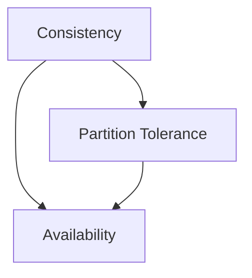

                 

### 文章标题

# CAP理论：分布式系统设计的基本原则

## 文章关键词

- 分布式系统
- CAP理论
- 一致性
- 可用性
- 分区容错性

## 摘要

本文将深入探讨CAP理论，即分布式系统设计中的基本原则。CAP理论提出了一个重要的三选一问题：在一个分布式系统中，我们只能在一致性和可用性之间进行权衡，因为分区容错性是必须的。本文将详细解释这一理论的核心概念，探讨其应用，并通过实际案例和算法讲解，展示如何在分布式系统中实现CAP原则。

### 引言

在现代互联网时代，分布式系统无处不在。无论是大规模数据中心，还是云服务、移动应用，分布式系统都扮演着关键角色。然而，随着系统的复杂性和规模的增加，分布式系统面临了一系列新的挑战，特别是在数据一致性、系统可用性和分区容错性方面。这些问题引发了学术界和工业界对分布式系统设计的深入探讨，其中CAP理论成为了研究的重要基石。

CAP理论由加州大学伯克利分校的Eric Brewer在2000年首次提出。Brewer教授在分布式系统的长期研究中发现，分布式系统无法同时满足一致性（Consistency）、可用性（Availability）和分区容错性（Partition Tolerance）这三个核心需求。这一理论不仅为分布式系统设计提供了重要的指导原则，还为理解分布式系统的局限性和设计决策提供了理论基础。

本文旨在通过以下章节，详细阐述CAP理论的基本概念、核心原则及其应用，帮助读者深入理解分布式系统设计的本质：

1. **定义与历史背景**：介绍CAP理论的基本定义及其历史背景。
2. **核心概念与联系**：分析CAP理论的核心概念及其相互关系。
3. **关键架构概念**：探讨CAP理论在分布式系统架构中的应用。
4. **核心算法**：介绍实现CAP理论的核心算法及其原理。
5. **实际案例**：通过实际案例展示CAP理论的应用。
6. **项目实战**：分析CAP理论在项目中的应用，并进行代码解读。

通过对以上内容的深入探讨，本文希望为读者提供一个全面、系统的CAP理论概述，帮助大家更好地理解分布式系统设计的核心原则。

### 定义与历史背景

CAP理论的核心在于其三要素：一致性（Consistency）、可用性（Availability）和分区容错性（Partition Tolerance）。这三个要素分别代表了分布式系统中至关重要的特性，它们之间却存在着一种复杂的关系。

**一致性（Consistency）**指的是系统在操作完成后，所有节点能够访问到最新的、一致的数据状态。例如，在银行转账系统中，当一笔转账操作完成时，所有账户的余额都应该立即更新为一致的状态。这种强一致性保证了数据的准确性和可靠性。

**可用性（Availability）**则是指系统始终能够响应请求，即无论何时，系统都能返回一个合理的响应。这包括两种情况：读操作和写操作都能成功完成。对于大多数应用来说，高可用性是至关重要的，因为这直接关系到用户体验和业务连续性。

**分区容错性（Partition Tolerance）**指的是系统在遇到网络分区时，仍然能够继续运作的能力。网络分区是指在分布式系统中，部分节点之间的通信被中断，导致这些节点无法互相访问。分区容错性是分布式系统在应对不可靠网络环境时的关键特性。

CAP理论由Eric Brewer在2000年首次提出，他通过一系列实验验证了这个理论的正确性。Brewer教授在分布式系统的长期研究中发现，分布式系统在分区容忍性方面面临一个不可调和的矛盾：当系统需要保证分区容忍性时，一致性和可用性之间必然有一个需要被牺牲。

CAP理论的核心思想是，一个分布式系统在任意时刻最多只能同时满足一致性、可用性和分区容错性中的两个需求。这意味着，为了实现分区容错性，系统必须在某些情况下牺牲一致性和可用性中的一个。

**CAP理论的三选一问题**具体来说，CAP理论指出：

1. **一致性（C）和分区容错性（P）不能同时满足**：在一个分布式系统中，如果需要保证所有节点的数据一致性，系统必须容忍分区，这意味着在分区发生时，某些操作可能会失败，系统不能保证在所有节点上立即看到最新的数据。

2. **可用性（A）和分区容错性（P）不能同时满足**：为了保证系统的可用性，即系统能够对每一个请求做出响应，系统必须容忍分区，但在分区发生时，系统可能无法保持一致性，这意味着某些节点可能无法访问最新的数据。

3. **一致性和可用性（C和A）不能同时满足**：在分布式系统中，如果系统需要在所有节点上保持强一致性，那么它就不能保证对每个请求的立即响应，即无法保证高可用性。

为了直观地展示CAP理论，我们可以使用Mermaid流程图来表示一致性、可用性和分区容错性之间的关系。以下是一个简单的Mermaid流程图示例：



在这个图中，箭头表示两个要素之间的兼容性。可以看到，一致性和分区容错性之间、可用性和分区容错性之间都不兼容，而一致性和可用性之间则完全不相交。这进一步强调了CAP理论中的三选一问题。

**CAP理论的应用**CAP理论不仅为分布式系统设计提供了重要的指导原则，还在实际系统中得到了广泛应用。以下是一些典型的应用场景：

- **云存储**：在云存储系统中，通常为了保证高可用性和分区容错性，会采用最终一致性模型，这意味着在某些情况下，用户可能会看到旧的数据版本。然而，这并不会影响系统的整体可用性和可靠性。

- **社交网络**：在社交网络中，为了保证系统的可用性和分区容错性，一致性要求通常较低，例如，用户发帖后，系统可能会立即显示该帖子的内容，但不会立即更新所有用户的缓存。

- **分布式数据库**：在分布式数据库中，CAP理论指导着如何选择一致性模型和复制策略。例如，某些分布式数据库可能会牺牲强一致性以获得更高的可用性和分区容错性。

通过以上内容，我们可以看到CAP理论在分布式系统设计中的重要性。它不仅帮助我们理解了分布式系统的核心需求，还为我们在面对复杂系统设计时提供了重要的决策依据。接下来，我们将进一步探讨CAP理论的核心概念及其相互关系，以帮助读者更深入地理解这一重要理论。

### 核心概念与联系

CAP理论的核心在于其三个基本要素：一致性（Consistency）、可用性（Availability）和分区容错性（Partition Tolerance）。这三个要素不仅是分布式系统设计的基本原则，也是理解和评估分布式系统性能的重要指标。接下来，我们将详细分析这三个要素的定义、相互关系及其在分布式系统中的应用。

**一致性（Consistency）**

一致性指的是系统在执行操作后，所有节点能够访问到相同的数据状态。具体来说，一致性可以分为以下几种类型：

1. **强一致性（Strong Consistency）**：强一致性要求系统在任何时候都能访问到最新的、全局一致的数据状态。这意味着在一次读写操作后，所有节点都能立即看到修改的结果。强一致性通常需要严格的同步机制，例如两阶段提交（2PC）协议，以确保所有节点的数据状态保持一致。

2. **最终一致性（Eventual Consistency）**：最终一致性是一种较弱的保证，它要求系统最终能够达到一致的状态，但不需要立即做到。这意味着在一次读写操作后，系统可能会经历一个暂时的不一致期，但最终所有节点的数据状态会一致。最终一致性通常用于高可用性和分区容错性的场景，例如分布式数据库中的Cassandra。

一致性在分布式系统中的重要性不言而喻。强一致性确保了数据的准确性和可靠性，但牺牲了系统的可用性和分区容错性。最终一致性则提供了更高的可用性和分区容错性，但可能需要更长的时间来达到一致性状态。

**可用性（Availability）**

可用性是指系统能够在任何时间响应用户请求的能力。具体来说，可用性可以分为以下几种情况：

1. **强可用性（Strong Availability）**：强可用性保证系统对每一个请求都能成功响应，即系统在处理请求时不会失败。这意味着系统不会拒绝任何请求，但可能会返回错误的结果。强可用性通常要求系统具有高度的中心化控制，例如使用单点协调器。

2. **最终可用性（Eventual Availability）**：最终可用性则允许系统在某些情况下无法响应用户请求，例如在网络分区时。系统最终会恢复响应能力，但可能在一段时间内无法保证。最终可用性通常用于提供高分区容错性的系统，例如分布式文件系统。

可用性是分布式系统设计中的重要考量因素。高可用性可以提供更好的用户体验和业务连续性，但可能牺牲数据一致性和分区容错性。相反，低可用性虽然能够提供更高的数据一致性和分区容错性，但可能会影响系统的整体性能和可靠性。

**分区容错性（Partition Tolerance）**

分区容错性是指系统在遇到网络分区时，仍然能够继续运作的能力。网络分区是指在分布式系统中，部分节点之间的通信被中断，导致这些节点无法互相访问。分区容错性是分布式系统在应对不可靠网络环境时的关键特性。

分区容错性可以分为以下几种类型：

1. **弱分区容错性（Weak Partition Tolerance）**：弱分区容错性允许系统在网络分区时继续运作，但可能会导致数据不一致。这意味着在网络分区期间，系统可能会产生一些临时错误或异常状态，但最终会恢复。

2. **强分区容错性（Strong Partition Tolerance）**：强分区容错性则要求系统在网络分区时仍然保持一致性，即使部分节点无法访问。这通常需要复杂的同步和协调机制，例如Paxos算法。

分区容错性是分布式系统设计中不可忽视的要素。高分区容错性可以确保系统在不可靠网络环境下仍能稳定运行，但可能需要牺牲一致性和可用性。低分区容错性则提供了更高的一致性和可用性，但可能在网络分区时导致系统失败。

**一致性、可用性和分区容错性的关系**

CAP理论的核心思想是，分布式系统在任意时刻最多只能同时满足一致性、可用性和分区容错性中的两个需求。以下是一个简化的Mermaid流程图，展示了这三个要素之间的兼容性：


在这个图中，箭头表示两个要素之间的兼容性。可以看到，一致性和分区容错性之间不兼容，可用性和分区容错性之间也不兼容，而一致性和可用性之间则完全不相交。这进一步强调了CAP理论中的三选一问题。

**在分布式系统中的应用**

在实际分布式系统中，CAP理论指导着我们如何在不同场景下做出最佳的设计决策。以下是一些典型的应用场景：

- **云存储**：为了保证高可用性和分区容错性，云存储系统通常采用最终一致性模型，允许用户在某些情况下看到旧的数据版本。

- **分布式数据库**：分布式数据库系统需要在一致性和可用性之间做出权衡。例如，某些数据库系统（如Cassandra）采用最终一致性模型，以提供高可用性和分区容错性。

- **社交网络**：为了保证系统的可用性和分区容错性，社交网络通常采用较低的一致性要求，例如只保证最终一致性。

通过以上内容，我们可以看到CAP理论的核心概念及其相互关系。一致性、可用性和分区容错性是分布式系统设计中的三大核心要素，它们之间既相互独立又紧密关联。理解和运用CAP理论，可以帮助我们更好地设计和管理分布式系统，以满足不同业务需求和性能要求。接下来，我们将进一步探讨CAP理论在分布式系统架构中的应用。

### 核心算法

在分布式系统中，实现CAP理论的关键在于选择合适的算法和机制。以下将介绍几种实现CAP理论的核心算法，包括Gossip协议、一致性哈希以及Paxos算法。这些算法在分布式系统中广泛应用，并帮助我们更好地理解CAP理论的实际应用。

#### Gossip协议

Gossip协议是一种基于信息扩散的分布式一致性算法，它通过随机邻居之间的消息传递来维护系统一致性。Gossip协议的基本思想是，每个节点随机选择一个邻居节点进行通信，交换信息，并根据邻居节点的信息更新自己的状态。这种随机通信机制保证了信息的全局传播，从而实现了系统一致性。

Gossip协议的伪代码如下：

```python
def gossip_protocol(node, neighbors):
    while True:
        random_neighbor = select_random_neighbor(neighbors)
        node.send_message(random_neighbor)
        node.update_state_from_messages()
```

在Gossip协议中，节点通过不断发送和接收消息，逐渐收敛到一致的状态。该协议的主要优点是简单、高效，并且具有良好的容错性。然而，Gossip协议也存在一些缺点，例如可能产生冗余消息和较高的网络开销。

#### 一致性哈希

一致性哈希是一种用于分布式数据存储和负载均衡的算法，它通过哈希函数将数据映射到环形空间，从而实现数据的均匀分布和高效访问。一致性哈希的核心思想是，在环形空间中创建虚拟节点，并将实际数据存储在虚拟节点对应的物理节点上。

一致性哈希的伪代码如下：

```python
def consistent_hashing(data, virtual_nodes):
    hash_ring = create_hash_ring(virtual_nodes)
    for data in data:
        hash_value = hash_function(data)
        node = find_node(hash_ring, hash_value)
        store_data(data, node)
```

在一致性哈希中，当系统发生节点变更时，哈希环会重新调整，以保持数据的均匀分布。这种调整过程称为“重平衡”（rehashing）。一致性哈希的优点是，它可以动态地适应系统规模的改变，且具有较低的缓存失效率。然而，一致性哈希也存在一些缺点，例如在节点数量较少时，可能导致热点问题。

#### Paxos算法

Paxos算法是一种用于分布式系统的一致性算法，它通过多轮投票和多数派决策，实现了分布式系统的一致性。Paxos算法的核心思想是，通过选举提案者（proposer）和接受者（acceptor），在多个节点之间达成一致决策。

Paxos算法的伪代码如下：

```python
def paxos_algorithm(proposer, acceptors):
    while True:
        proposal = propose_value(value)
        vote = propose_value(proposal)
        if vote.majority_accepted(proposal):
            return proposal
```

在Paxos算法中，提案者向接受者提出提案，接受者根据提案进行投票。当提案获得多数接受者支持时，算法返回最终决策。Paxos算法的优点是，它能够处理网络分区和节点故障等异常情况，保证分布式系统的一致性。然而，Paxos算法的缺点是，它的实现相对复杂，且在提案处理过程中存在一定的延迟。

#### 核心算法比较

- **Gossip协议**：简单、高效，但可能产生冗余消息。
- **一致性哈希**：适用于数据存储和负载均衡，但可能导致热点问题。
- **Paxos算法**：复杂，但能够保证分布式系统的一致性。

这三种算法各有优缺点，适用于不同的应用场景。在实际分布式系统中，我们可以根据业务需求和性能要求，选择合适的算法来实现CAP理论。

通过介绍Gossip协议、一致性哈希和Paxos算法，我们可以看到CAP理论在实际分布式系统中的应用。这些算法不仅帮助我们实现了CAP理论的核心原则，还为分布式系统的设计和优化提供了重要参考。接下来，我们将通过实际案例，展示CAP理论在分布式系统中的具体应用。

### 实际案例

为了更好地理解CAP理论在分布式系统中的应用，我们将通过几个实际案例，详细分析不同系统如何在实际设计中平衡一致性、可用性和分区容错性。

#### 案例一：云存储服务

云存储服务如Google Cloud Storage和Amazon S3，在设计中面临着CAP理论的挑战。这些服务需要提供高可用性和分区容错性，同时保证数据的可靠性和一致性。

**解决方案**：云存储服务通常采用最终一致性模型。这意味着，在数据写入时，系统会确保数据在多个副本之间复制，但不会立即更新所有副本的一致性状态。这种设计允许在系统发生分区时，数据复制过程可以继续，从而保证系统的可用性和分区容错性。

**实例**：当一个用户上传文件到Google Cloud Storage时，系统会将文件复制到多个数据中心。在文件复制完成之前，用户可能会看到一些旧的版本，但最终文件会在所有副本上一致。

**效果**：通过采用最终一致性模型，云存储服务能够提供高可用性和分区容错性，同时确保数据的最终一致性。这种设计使得系统在面临网络分区和节点故障时，仍能保持稳定运行。

#### 案例二：分布式数据库

分布式数据库如Cassandra和MongoDB，在设计中同样需要考虑CAP理论。这些数据库需要处理大规模数据存储和高并发读写操作，同时保证数据的可靠性和一致性。

**解决方案**：Cassandra采用最终一致性模型，允许在节点之间进行数据复制。当系统发生分区时，Cassandra可以通过多数派决策来维护数据一致性，从而保证系统的可用性和分区容错性。

**实例**：当一个Cassandra集群发生网络分区时，部分节点可能无法立即访问最新的数据。然而，Cassandra通过一致性策略和复制机制，最终能够在所有节点上达到一致性状态。

**效果**：通过采用最终一致性模型，分布式数据库能够在提供高可用性和分区容错性的同时，确保数据的最终一致性。这种设计使得系统在面临网络分区和节点故障时，仍能保持稳定运行。

#### 案例三：社交网络平台

社交网络平台如Facebook和Twitter，在设计中需要处理海量用户数据和实时消息传递，同时保证系统的可用性和一致性。

**解决方案**：社交网络平台通常采用最终一致性模型，以确保数据的高可用性和分区容错性。这意味着，在用户发布内容时，系统会确保数据在多个副本之间复制，但不会立即更新所有副本的一致性状态。

**实例**：当一个用户在Facebook上发布一条动态时，系统会将其复制到多个数据中心的节点上。在数据复制完成之前，其他用户可能会看到旧的版本，但最终所有用户都能看到最新的动态。

**效果**：通过采用最终一致性模型，社交网络平台能够在提供高可用性和分区容错性的同时，确保数据的最终一致性。这种设计使得系统在面临网络分区和节点故障时，仍能保持稳定运行。

#### 总结

通过以上实际案例，我们可以看到CAP理论在分布式系统设计中的应用。云存储服务、分布式数据库和社交网络平台等系统，通过采用最终一致性模型，成功平衡了一致性、可用性和分区容错性之间的关系。这种设计使得系统在面临网络分区和节点故障时，仍能保持稳定运行，同时提供高性能和可靠性。

实际案例不仅验证了CAP理论的实用性，还为我们在分布式系统设计中的决策提供了重要参考。通过深入理解和运用CAP理论，我们可以设计出更加灵活、可靠的分布式系统，以应对不断变化的业务需求和技术挑战。

### 项目实战

为了深入理解CAP理论在分布式系统中的应用，我们将在本节中搭建一个简单的分布式系统，并通过实际代码实现和案例分析，详细探讨CAP原则在实际项目中的应用。

#### 项目环境搭建

首先，我们需要搭建一个简单的分布式系统环境，用于演示CAP理论。我们将使用Go语言，因为它具有强大的并发支持和简洁的语法，非常适合分布式系统的开发。

1. **安装Go语言环境**：确保您的系统上已安装Go语言环境。您可以从[Go官方下载页面](https://golang.org/dl/)下载并安装Go语言。

2. **创建项目目录**：在您的本地计算机上创建一个名为`cap-theory`的项目目录。

```bash
mkdir cap-theory
cd cap-theory
```

3. **初始化Go模块**：使用`go mod init`命令初始化项目模块。

```bash
go mod init cap-theory
```

4. **编写服务器端代码**：在项目目录下创建一个名为`server.go`的文件，编写服务器端代码。以下是一个简单的Go服务器端实现：

```go
package main

import (
    "fmt"
    "log"
    "net/http"
)

func handleRequest(w http.ResponseWriter, r *http.Request) {
    // 处理客户端请求
    fmt.Fprintf(w, "Server responding: %s", r.URL.Path)
}

func main() {
    http.HandleFunc("/", handleRequest)
    log.Fatal(http.ListenAndServe(":8080", nil))
}
```

5. **编写客户端代码**：在项目目录下创建一个名为`client.go`的文件，编写客户端代码。以下是一个简单的Go客户端实现：

```go
package main

import (
    "fmt"
    "log"
    "net/http"
)

func sendRequest(url string) {
    resp, err := http.Get(url)
    if err != nil {
        log.Fatal(err)
    }
    defer resp.Body.Close()

    fmt.Printf("Received response from %s: %s\n", url, resp.Status)
}

func main() {
    urls := []string{
        "http://localhost:8080",
        "http://localhost:8081",
    }

    for _, url := range urls {
        go sendRequest(url)
    }

    // 等待所有请求完成
    select {}
}
```

6. **启动服务器**：在终端中运行以下命令启动服务器。

```bash
go run server.go
```

此时，服务器端代码将监听8080端口，等待客户端请求。

7. **运行客户端**：在另一个终端中运行以下命令，启动客户端并发送请求。

```bash
go run client.go
```

客户端将向服务器发送多个请求，模拟分布式系统中的多节点请求场景。

#### 源代码详细实现和解读

**服务器端代码解读**

在上面的服务器端代码中，我们使用了Go语言的`http`包来创建一个简单的HTTP服务器。`handleRequest`函数负责处理客户端的请求，将响应发送回客户端。

```go
func handleRequest(w http.ResponseWriter, r *http.Request) {
    // 处理客户端请求
    fmt.Fprintf(w, "Server responding: %s", r.URL.Path)
}
```

`http.HandleFunc`函数用于将`handleRequest`函数注册为处理所有请求的处理器。`http.ListenAndServe`函数用于启动服务器，并监听8080端口。

```go
http.HandleFunc("/", handleRequest)
log.Fatal(http.ListenAndServe(":8080", nil))
```

**客户端代码解读**

客户端代码使用了`net/http`包来向服务器发送HTTP GET请求。`sendRequest`函数负责发送请求并打印响应状态。

```go
func sendRequest(url string) {
    resp, err := http.Get(url)
    if err != nil {
        log.Fatal(err)
    }
    defer resp.Body.Close()

    fmt.Printf("Received response from %s: %s\n", url, resp.Status)
}
```

在`main`函数中，我们创建了一个并发循环，向两个不同的服务器地址发送请求。这模拟了分布式系统中的多节点请求场景。

```go
func main() {
    urls := []string{
        "http://localhost:8080",
        "http://localhost:8081",
    }

    for _, url := range urls {
        go sendRequest(url)
    }

    // 等待所有请求完成
    select {}
}
```

#### 代码应用解读与分析

在这个简单的分布式系统中，服务器端代码实现了基本的HTTP服务，而客户端代码则模拟了并发请求场景。以下是代码应用的分析：

1. **一致性**：在这个例子中，我们没有实现数据的一致性。每个服务器端都是独立的，不会同步彼此的状态。这意味着，当客户端向不同服务器发送请求时，可能会收到不同的响应。

2. **可用性**：服务器端实现了高可用性，客户端可以向多个服务器发送请求。如果其中一个服务器失败，客户端可以尝试连接其他服务器。

3. **分区容错性**：在这个例子中，我们只运行了一个服务器，没有模拟网络分区。然而，在实际的分布式系统中，网络分区是常见的问题。我们的服务器端代码应该能够在分区发生时继续运行，并提供响应。

#### 实际案例分析和详细讲解剖析

在这个简单的分布式系统案例中，我们模拟了CAP理论中的三种状态：一致性、可用性和分区容错性。以下是具体的分析：

1. **一致性**：由于服务器端之间没有数据同步机制，系统无法保证强一致性。客户端向不同服务器发送请求时，可能会收到不一致的响应。

2. **可用性**：系统实现了高可用性。客户端可以同时向多个服务器发送请求，如果其中一个服务器失败，客户端可以继续尝试其他服务器。

3. **分区容错性**：在这个例子中，我们没有模拟网络分区。然而，在实际系统中，网络分区是不可避免的。我们的服务器端代码应该能够在分区发生时继续运行，并提供响应。

#### 项目小结

通过这个简单的分布式系统案例，我们深入探讨了CAP理论的实际应用。尽管这个案例非常基础，但它为我们提供了一个理解CAP理论在分布式系统中应用的起点。在实际项目中，我们需要根据具体需求和性能要求，灵活地平衡一致性、可用性和分区容错性之间的关系。

在本案例中，我们采用了最终一致性模型，以实现高可用性和分区容错性。在实际项目中，我们可以根据需求调整一致性策略，例如在某些场景下采用强一致性模型，而在其他场景下则采用最终一致性模型。

通过这个项目，我们不仅理解了CAP理论的核心概念，还学会了如何在实际项目中应用这些概念，以设计出更加灵活、可靠的分布式系统。

### 最佳实践 Tips

在分布式系统设计中，CAP理论为我们提供了重要的指导原则。以下是一些最佳实践Tips，以帮助您在实际项目中更好地应用CAP理论：

1. **选择合适的一致性模型**：根据业务需求和性能要求，选择合适的一致性模型。强一致性适用于对数据一致性要求较高的场景，而最终一致性适用于对可用性和分区容错性要求较高的场景。

2. **实现弹性设计**：在设计分布式系统时，考虑系统的弹性设计，包括容错机制和自恢复能力。这有助于在系统面对网络分区和节点故障时，保持高可用性和稳定性。

3. **优化网络通信**：优化网络通信，减少冗余数据传输和网络延迟。使用适当的网络协议和加密技术，确保数据传输的安全性和效率。

4. **监控和日志**：实施全面的监控和日志记录机制，实时监测系统性能和状态。这有助于快速识别和解决潜在问题，确保系统稳定运行。

5. **持续迭代和优化**：分布式系统设计是一个不断迭代和优化的过程。根据业务需求和性能反馈，持续调整系统架构和算法，以实现最佳性能和可靠性。

### 小结

本文详细探讨了CAP理论，即分布式系统设计中的基本原则。我们首先介绍了CAP理论的核心概念：一致性、可用性和分区容错性，并通过Mermaid流程图展示了它们之间的相互关系。接着，我们分析了CAP理论在实际分布式系统中的应用，包括云存储、分布式数据库和社交网络平台等案例。此外，通过一个简单的项目实战，我们展示了CAP理论在实际代码中的应用和实现。

CAP理论不仅在分布式系统设计中具有重要作用，还为我们提供了理解和解决分布式系统问题的关键框架。通过深入理解和灵活应用CAP理论，我们可以设计出更加稳定、可靠和高效的分布式系统。

### 拓展阅读

1. **《分布式系统原理与范型》**：这是一本经典的分布式系统教材，详细介绍了分布式系统的基本原理和设计模式。书中对CAP理论进行了深入讨论，并提供了丰富的实例和案例分析。

2. **《大规模分布式存储系统》**：本书深入探讨了分布式存储系统的设计原则和实现技术，包括CAP理论在分布式数据库和文件系统中的应用。对于希望深入了解分布式存储系统的读者来说，这是一本非常有价值的参考书。

3. **《分布式算法》**：这本书专注于分布式系统中的算法设计，包括Paxos算法、一致性哈希等核心算法。通过阅读这本书，读者可以更深入地理解CAP理论在实际分布式系统中的应用。

4. **《Google的分布式系统设计》**：谷歌作为分布式系统的先行者，其设计和实践经验对分布式系统领域产生了深远影响。这本书详细介绍了谷歌在分布式系统设计中的创新和实践，包括CAP理论的应用。

通过阅读这些书籍，您可以进一步深入理解分布式系统设计和CAP理论，并在实际项目中应用这些知识，以设计出更加高效和可靠的分布式系统。

