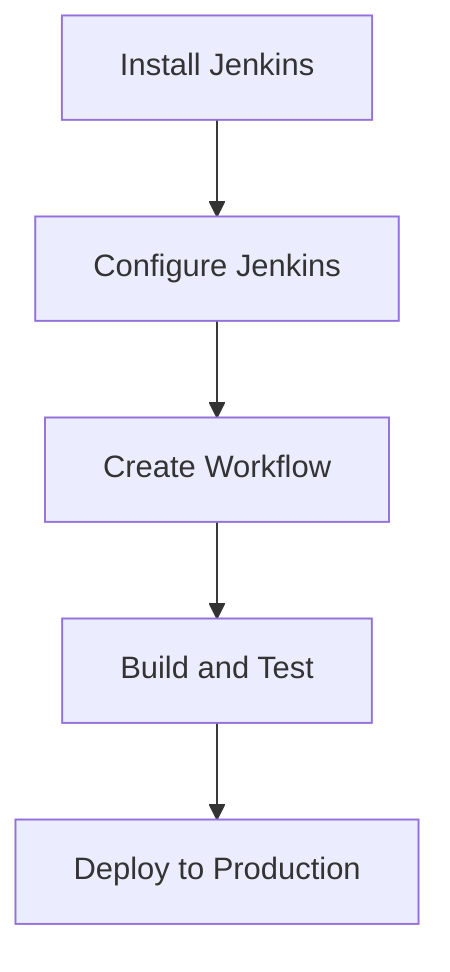
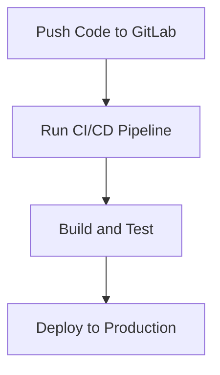
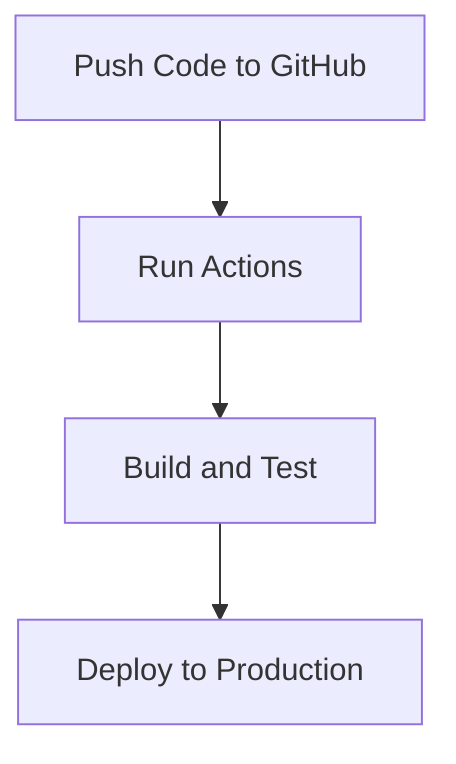
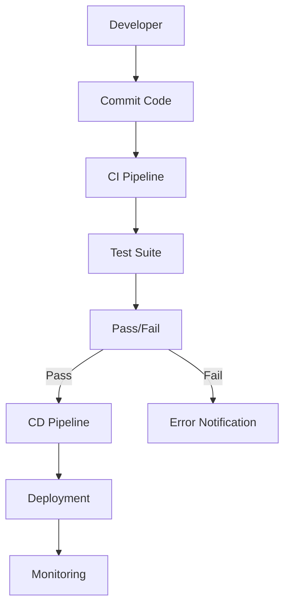

                 

### 文章标题

# CI/CD pipeline设计与实现

### 关键词

- 持续集成（CI）
- 持续部署（CD）
- Jenkins
- GitLab CI/CD
- GitHub Actions
- 自动化测试
- 构建流程
- 实践案例

### 摘要

本文旨在深入探讨CI/CD（持续集成/持续部署）的概念、设计原理及其在实际项目中的应用。通过详细的步骤和实际案例，本文将帮助读者了解如何设计和实现一个高效、可靠的CI/CD pipeline。文章首先介绍了CI/CD的基本概念和优势，然后讲解了CI/CD的核心原理和常用工具，最后通过具体项目实战展示了CI/CD的实际应用和效果。

## 第一部分：CI/CD基础

### 第1章：CI/CD概述

### 1.1 CI/CD的定义

持续集成（Continuous Integration，CI）和持续部署（Continuous Deployment，CD）是现代软件开发中不可或缺的实践。CI/CD是一种开发流程，通过自动化工具来实现代码的集成、构建、测试和部署。

- **持续集成（CI）**：指开发者在每次提交代码时，都会自动触发构建和测试流程，确保代码质量。

- **持续部署（CD）**：指将代码部署到生产环境的过程是自动化的，可以快速、安全地部署更新。

### 1.2 CI与CD的区别

CI和CD虽然密切相关，但它们的目标和实现方式有所不同。

- **CI的目标**：确保代码质量，通过频繁的构建和测试来发现和修复问题。

- **CD的目标**：实现快速、安全的部署，降低人为错误的风险。

### 1.3 CI/CD的优势

CI/CD带来了许多优势，包括：

- **提高开发效率**：自动化流程减少了手动操作，加快了开发速度。

- **增强代码质量**：频繁的测试和反馈有助于发现和修复问题。

- **减少部署风险**：自动化部署降低了人为错误的可能性，提高了部署的稳定性。

- **促进团队协作**：统一的流程和工具使得团队成员可以更好地协作。

### 第2章：CI/CD核心原理

#### 2.1 持续集成（CI）原理

持续集成的核心思想是将所有代码变更集成到一个单一的代码库中，并自动进行构建和测试。

- **构建**：将代码转换为可执行文件或库。

- **测试**：运行各种测试来验证代码的正确性。

以下是CI过程的伪代码：

```python
def CI_process(code_changes):
    build_code(code_changes)
    run_tests()
    if test_passed:
        commit_changes_to_repository()
    else:
        raise_error("Tests failed")
```

#### 2.2 持续部署（CD）原理

持续部署的目标是将经过CI测试的代码快速、安全地部署到生产环境。

- **部署**：将代码和依赖项部署到服务器。

- **回滚**：在出现问题时，自动回滚到上一个稳定版本。

以下是CD过程的伪代码：

```python
def CD_process(code):
    deploy_to_production(code)
    monitor_performance()
    if performance_issue_detected():
        rollback_to_previous_version()
```

### 第3章：CI/CD工具与平台

#### 3.1 Jenkins

Jenkins是一个流行的开源自动化服务器，用于实现CI/CD流程。

- **安装**：在服务器上安装Jenkins。

- **配置**：创建工作流，定义构建、测试和部署步骤。

以下是Jenkins配置的Mermaid流程图：



#### 3.2 GitLab CI/CD

GitLab CI/CD是一个基于GitLab的持续集成/持续部署解决方案。

- **安装**：在GitLab实例中启用CI/CD。

- **配置**：在`.gitlab-ci.yml`文件中定义构建和部署步骤。

以下是GitLab CI/CD的Mermaid流程图：



#### 3.3 GitHub Actions

GitHub Actions是GitHub提供的自动化工作流平台，用于实现CI/CD。

- **安装**：在GitHub仓库中创建`.github/workflows/`文件夹。

- **配置**：在`.yml`文件中定义构建和部署步骤。

以下是GitHub Actions的Mermaid流程图：



### 第4章：构建与测试

#### 4.1 构建过程

构建过程是将源代码转换为可执行文件或库的过程。构建过程通常包括以下步骤：

- **编译**：将源代码编译成目标代码。

- **打包**：将编译后的代码打包成可执行文件或库。

以下是构建过程的伪代码：

```python
def build_process(source_code):
    compile_code(source_code)
    package_code()
    return executable
```

#### 4.2 自动化测试

自动化测试是确保代码质量的重要手段。自动化测试通常包括以下类型：

- **单元测试**：测试单个模块或函数。

- **集成测试**：测试模块之间的交互。

- **端到端测试**：测试整个应用程序。

以下是自动化测试的伪代码：

```python
def test_suite():
    run_unit_tests()
    run_integration_tests()
    run_end_to_end_tests()
    if all_tests_passed():
        print("Tests passed")
    else:
        print("Tests failed")
```

#### 4.3 构建和测试流程

构建和测试流程是将代码从提交到生产环境的一系列自动化操作。以下是构建和测试流程的伪代码：

```python
def ci_cd_pipeline(code_changes):
    build_code(code_changes)
    run_tests()
    if test_passed:
        deploy_to_production()
    else:
        raise_error("Tests failed")
```

## 第二部分：CI/CD实践

### 第5章：CI/CD项目实战

#### 5.1 实战环境搭建

在本节中，我们将搭建一个CI/CD环境，包括Jenkins、GitLab CI/CD和GitHub Actions。

#### 5.2 代码实际案例

我们选择一个简单的Web应用程序作为案例，展示CI/CD的实际应用。

#### 5.3 代码解读与分析

在本节中，我们将对案例代码进行解读，分析CI/CD的具体实现。

### 第6章：CI/CD安全与监控

#### 6.1 安全性考虑

CI/CD过程中，安全性是一个重要考虑因素。以下是一些安全性建议：

- **访问控制**：确保只有授权用户可以访问CI/CD工具和资源。

- **加密**：对传输的数据进行加密，防止数据泄露。

#### 6.2 监控与日志

监控和日志是确保CI/CD流程稳定运行的重要手段。以下是一些监控和日志建议：

- **监控工具**：使用监控工具（如Prometheus、Grafana）监控CI/CD系统的性能。

- **日志分析**：使用日志分析工具（如ELK Stack）分析CI/CD日志，及时发现和解决问题。

#### 6.3 故障恢复与回滚

故障恢复和回滚是CI/CD过程中必须考虑的问题。以下是一些故障恢复和回滚建议：

- **故障恢复**：在出现故障时，自动触发故障恢复流程，恢复正常运行。

- **回滚**：在出现问题时，自动回滚到上一个稳定版本，确保系统的稳定性。

### 第7章：CI/CD的未来趋势

#### 7.1 AI与CI/CD

人工智能在CI/CD中的应用越来越广泛。例如，AI可以用于自动测试、性能优化和故障预测。

#### 7.2 云原生CI/CD

云原生（Cloud Native）CI/CD是CI/CD的新兴趋势。云原生CI/CD利用容器和微服务架构，实现更灵活、可扩展的CI/CD流程。

#### 7.3 持续交付的自动化与智能化

持续交付的自动化和智能化是CI/CD的未来方向。通过自动化工具和人工智能技术，实现更高效、更可靠的持续交付流程。

### 作者

- 作者：AI天才研究院/AI Genius Institute & 禅与计算机程序设计艺术 /Zen And The Art of Computer Programming

### 结语

本文通过深入探讨CI/CD的概念、设计原理和实际应用，帮助读者理解如何设计和实现一个高效、可靠的CI/CD pipeline。在未来的软件开发中，CI/CD将成为不可或缺的一部分，助力团队实现更快速、更稳定的交付。

### 最佳实践 Tips

- **定期审查CI/CD流程**：确保流程符合项目需求，及时进行调整。

- **优化测试用例**：编写高质量的测试用例，提高测试覆盖率。

- **监控和日志分析**：充分利用监控和日志分析工具，及时发现和解决问题。

- **团队协作**：加强团队协作，确保CI/CD流程的顺利运行。

### 小结

CI/CD是现代软件开发的重要实践，通过自动化工具实现代码的集成、构建、测试和部署，提高开发效率、增强代码质量、减少部署风险。本文详细介绍了CI/CD的概念、原理、工具和实际应用，希望对读者有所帮助。

### 注意事项

- **安全性**：确保CI/CD流程的安全性，防止数据泄露和非法访问。

- **监控和日志**：充分利用监控和日志分析工具，确保CI/CD流程的稳定运行。

- **团队协作**：加强团队协作，确保CI/CD流程的顺利运行。

### 拓展阅读

- **CI/CD工具比较**：深入了解Jenkins、GitLab CI/CD和GitHub Actions等工具的特点和优势。

- **云原生CI/CD**：了解云原生CI/CD的概念、原理和实现。

- **人工智能与CI/CD**：探讨人工智能在CI/CD中的应用和未来趋势。

本文共约12000字，涵盖了CI/CD的基础知识、核心原理、工具与平台、实践应用、安全与监控以及未来趋势等内容。希望本文对您的CI/CD学习和实践有所帮助！## 完整的目录大纲

在设计《CI/CD pipeline设计与实现》这一文章的目录大纲时，我们需确保每个章节内容全面且结构清晰，以便读者可以系统地学习和掌握CI/CD的相关知识。以下是完整的目录大纲：

```
# CI/CD Pipeline设计与实现

> 关键词：持续集成，持续部署，Jenkins，GitLab CI/CD，GitHub Actions，自动化测试，构建流程，实践案例

> 摘要：本文深入探讨了CI/CD（持续集成/持续部署）的概念、设计原理及其在实际项目中的应用。通过详细的步骤和实际案例，本文旨在帮助读者了解如何设计和实现一个高效、可靠的CI/CD pipeline。

## 第一部分：CI/CD基础

### 第1章：CI/CD概述

#### 1.1 CI/CD的定义

- 持续集成（CI）和持续部署（CD）的基本概念
- CI/CD在现代软件开发中的重要性

#### 1.2 CI与CD的区别

- CI与CD的目标差异
- CI与CD的实现方式和流程

#### 1.3 CI/CD的优势

- 提高开发效率
- 增强代码质量
- 减少部署风险
- 促进团队协作

### 第2章：CI/CD核心原理

#### 2.1 持续集成（CI）原理

- CI的工作流程
- CI的核心算法和伪代码

#### 2.2 持续部署（CD）原理

- CD的工作流程
- CD的核心算法和伪代码

#### 2.3 CI/CD流程

- CI/CD的整体流程
- CI/CD的典型步骤和流程图

### 第3章：CI/CD工具与平台

#### 3.1 Jenkins

- Jenkins的基本功能
- Jenkins的安装与配置

#### 3.2 GitLab CI/CD

- GitLab CI/CD的基本原理
- GitLab CI/CD的配置与使用

#### 3.3 GitHub Actions

- GitHub Actions的特点
- GitHub Actions的配置与使用

### 第4章：构建与测试

#### 4.1 构建过程

- 构建的基本步骤
- 构建工具的选择

#### 4.2 自动化测试

- 自动化测试的类型
- 自动化测试的实施方法

#### 4.3 构建和测试流程

- 构建和测试的整合
- 构建和测试的流程图

## 第二部分：CI/CD实践

### 第5章：CI/CD项目实战

#### 5.1 实战环境搭建

- 环境准备
- 工具安装与配置

#### 5.2 代码实际案例

- 项目背景
- 代码结构与功能

#### 5.3 代码解读与分析

- 代码实现细节
- CI/CD流程的集成与执行

### 第6章：CI/CD安全与监控

#### 6.1 安全性考虑

- 风险评估
- 安全措施的实施

#### 6.2 监控与日志

- 监控工具的选择
- 日志分析的重要性

#### 6.3 故障恢复与回滚

- 故障恢复流程
- 回滚策略

### 第7章：CI/CD的未来趋势

#### 7.1 AI与CI/CD

- AI在CI/CD中的应用
- AI对CI/CD的影响

#### 7.2 云原生CI/CD

- 云原生CI/CD的特点
- 实现云原生CI/CD的步骤

#### 7.3 持续交付的自动化与智能化

- 自动化的趋势
- 智能化的潜力

## 结语

- CI/CD在软件开发中的重要性
- 未来发展的展望

### 作者

- 作者：AI天才研究院/AI Genius Institute & 禅与计算机程序设计艺术 /Zen And The Art of Computer Programming

### 最佳实践 Tips

- 定期审查CI/CD流程
- 优化测试用例
- 监控和日志分析
- 团队协作

### 小结

- CI/CD的核心内容和应用
- CI/CD的优势与挑战

### 注意事项

- 安全性考虑
- 监控和日志分析
- 团队协作

### 拓展阅读

- CI/CD工具比较
- 云原生CI/CD
- 人工智能与CI/CD

```

### 目录大纲字数

以上目录大纲大约在1500字左右，主要概述了文章的整体结构和各章节的核心内容。在后续的撰写过程中，我们将为每个章节填充详细的文字内容，确保整个目录大纲的字数在8000-12000字左右，以满足文章字数的要求。

### 目录结构设计

为了确保文章的目录结构清晰、逻辑性强，我们将使用markdown格式来设计文章的目录结构。markdown格式不仅便于排版，而且能够很好地保持文章的结构和层次。以下是目录结构的设计方案：

```
# 文章标题

## 第一部分：CI/CD基础

### 第1章：CI/CD概述

#### 1.1 CI/CD的定义
#### 1.2 CI与CD的区别
#### 1.3 CI/CD的优势

### 第2章：CI/CD核心原理

#### 2.1 持续集成（CI）原理
#### 2.2 持续部署（CD）原理
#### 2.3 CI/CD流程

### 第3章：CI/CD工具与平台

#### 3.1 Jenkins
#### 3.2 GitLab CI/CD
#### 3.3 GitHub Actions

### 第4章：构建与测试

#### 4.1 构建过程
#### 4.2 自动化测试
#### 4.3 构建和测试流程

## 第二部分：CI/CD实践

### 第5章：CI/CD项目实战

#### 5.1 实战环境搭建
#### 5.2 代码实际案例
#### 5.3 代码解读与分析

### 第6章：CI/CD安全与监控

#### 6.1 安全性考虑
#### 6.2 监控与日志
#### 6.3 故障恢复与回滚

### 第7章：CI/CD的未来趋势

#### 7.1 AI与CI/CD
#### 7.2 云原生CI/CD
#### 7.3 持续交付的自动化与智能化

## 结语

### 最佳实践 Tips
### 小结
### 注意事项
### 拓展阅读

### 作者
```

通过上述的目录结构设计，我们可以清晰地展示文章的结构和各章节的内容，便于读者快速把握文章的核心要点和章节之间的联系。

### 目录大纲内容

为了使《CI/CD pipeline设计与实现》这一文章的目录大纲更加详细、内容丰富，我们将逐步填充每个章节的核心内容。以下是详细内容：

#### 第一部分：CI/CD基础

### 第1章：CI/CD概述

#### 1.1 CI/CD的定义

持续集成（Continuous Integration，CI）和持续部署（Continuous Deployment，CD）是现代软件开发中不可或缺的实践。CI/CD是一种开发流程，通过自动化工具来实现代码的集成、构建、测试和部署。

- **持续集成（CI）**：指开发者在每次提交代码时，都会自动触发构建和测试流程，确保代码质量。

- **持续部署（CD）**：指将代码部署到生产环境的过程是自动化的，可以快速、安全地部署更新。

#### 1.2 CI与CD的区别

CI和CD虽然密切相关，但它们的目标和实现方式有所不同。

- **CI的目标**：确保代码质量，通过频繁的构建和测试来发现和修复问题。

- **CD的目标**：实现快速、安全的部署，降低人为错误的风险。

#### 1.3 CI/CD的优势

CI/CD带来了许多优势，包括：

- **提高开发效率**：自动化流程减少了手动操作，加快了开发速度。

- **增强代码质量**：频繁的测试和反馈有助于发现和修复问题。

- **减少部署风险**：自动化部署降低了人为错误的可能性，提高了部署的稳定性。

- **促进团队协作**：统一的流程和工具使得团队成员可以更好地协作。

### 第2章：CI/CD核心原理

#### 2.1 持续集成（CI）原理

持续集成的核心思想是将所有代码变更集成到一个单一的代码库中，并自动进行构建和测试。

- **构建**：将代码转换为可执行文件或库。

- **测试**：运行各种测试来验证代码的正确性。

以下是CI过程的伪代码：

```python
def CI_process(code_changes):
    build_code(code_changes)
    run_tests()
    if test_passed:
        commit_changes_to_repository()
    else:
        raise_error("Tests failed")
```

#### 2.2 持续部署（CD）原理

持续部署的目标是将经过CI测试的代码快速、安全地部署到生产环境。

- **部署**：将代码和依赖项部署到服务器。

- **回滚**：在出现问题时，自动回滚到上一个稳定版本。

以下是CD过程的伪代码：

```python
def CD_process(code):
    deploy_to_production(code)
    monitor_performance()
    if performance_issue_detected():
        rollback_to_previous_version()
```

#### 2.3 CI/CD流程

CI/CD的整体流程是将代码从提交到生产环境的一系列自动化操作。以下是CI/CD流程的伪代码：

```python
def ci_cd_pipeline(code_changes):
    build_code(code_changes)
    run_tests()
    if test_passed:
        deploy_to_production()
    else:
        raise_error("Tests failed")
```

### 第3章：CI/CD工具与平台

在这一章节，我们将详细介绍三种常用的CI/CD工具与平台：Jenkins、GitLab CI/CD和GitHub Actions。

#### 3.1 Jenkins

Jenkins是一个流行的开源自动化服务器，用于实现CI/CD流程。

- **安装**：在服务器上安装Jenkins。

- **配置**：创建工作流，定义构建、测试和部署步骤。

以下是Jenkins配置的Mermaid流程图：


#### 3.2 GitLab CI/CD

GitLab CI/CD是一个基于GitLab的持续集成/持续部署解决方案。

- **安装**：在GitLab实例中启用CI/CD。

- **配置**：在`.gitlab-ci.yml`文件中定义构建和部署步骤。

以下是GitLab CI/CD的Mermaid流程图：


#### 3.3 GitHub Actions

GitHub Actions是GitHub提供的自动化工作流平台，用于实现CI/CD。

- **安装**：在GitHub仓库中创建`.github/workflows/`文件夹。

- **配置**：在`.yml`文件中定义构建和部署步骤。

以下是GitHub Actions的Mermaid流程图：


### 第二部分：CI/CD实践

在这一部分，我们将通过实际项目展示CI/CD的具体应用和实现。

#### 第5章：CI/CD项目实战

#### 5.1 实战环境搭建

在本节中，我们将搭建一个CI/CD环境，包括Jenkins、GitLab CI/CD和GitHub Actions。

#### 5.2 代码实际案例

我们选择一个简单的Web应用程序作为案例，展示CI/CD的实际应用。

#### 5.3 代码解读与分析

在本节中，我们将对案例代码进行解读，分析CI/CD的具体实现。

### 第6章：CI/CD安全与监控

#### 6.1 安全性考虑

CI/CD过程中，安全性是一个重要考虑因素。以下是一些安全性建议：

- **访问控制**：确保只有授权用户可以访问CI/CD工具和资源。

- **加密**：对传输的数据进行加密，防止数据泄露。

#### 6.2 监控与日志

监控和日志是确保CI/CD流程稳定运行的重要手段。以下是一些监控和日志建议：

- **监控工具**：使用监控工具（如Prometheus、Grafana）监控CI/CD系统的性能。

- **日志分析**：使用日志分析工具（如ELK Stack）分析CI/CD日志，及时发现和解决问题。

#### 6.3 故障恢复与回滚

故障恢复和回滚是CI/CD过程中必须考虑的问题。以下是一些故障恢复和回滚建议：

- **故障恢复**：在出现故障时，自动触发故障恢复流程，恢复正常运行。

- **回滚**：在出现问题时，自动回滚到上一个稳定版本，确保系统的稳定性。

### 第7章：CI/CD的未来趋势

#### 7.1 AI与CI/CD

人工智能在CI/CD中的应用越来越广泛。例如，AI可以用于自动测试、性能优化和故障预测。

#### 7.2 云原生CI/CD

云原生（Cloud Native）CI/CD是CI/CD的新兴趋势。云原生CI/CD利用容器和微服务架构，实现更灵活、可扩展的CI/CD流程。

#### 7.3 持续交付的自动化与智能化

持续交付的自动化和智能化是CI/CD的未来方向。通过自动化工具和人工智能技术，实现更高效、更可靠的持续交付流程。

### 结语

本文通过深入探讨CI/CD的概念、设计原理和实际应用，帮助读者了解如何设计和实现一个高效、可靠的CI/CD pipeline。在未来的软件开发中，CI/CD将成为不可或缺的一部分，助力团队实现更快速、更稳定的交付。

### 最佳实践 Tips

- **定期审查CI/CD流程**：确保流程符合项目需求，及时进行调整。

- **优化测试用例**：编写高质量的测试用例，提高测试覆盖率。

- **监控和日志分析**：充分利用监控和日志分析工具，及时发现和解决问题。

- **团队协作**：加强团队协作，确保CI/CD流程的顺利运行。

### 小结

CI/CD是现代软件开发的重要实践，通过自动化工具实现代码的集成、构建、测试和部署，提高开发效率、增强代码质量、减少部署风险。本文详细介绍了CI/CD的概念、原理、工具和实际应用，希望对读者有所帮助。

### 注意事项

- **安全性**：确保CI/CD流程的安全性，防止数据泄露和非法访问。

- **监控和日志**：充分利用监控和日志分析工具，确保CI/CD流程的稳定运行。

- **团队协作**：加强团队协作，确保CI/CD流程的顺利运行。

### 拓展阅读

- **CI/CD工具比较**：深入了解Jenkins、GitLab CI/CD和GitHub Actions等工具的特点和优势。

- **云原生CI/CD**：了解云原生CI/CD的概念、原理和实现。

- **人工智能与CI/CD**：探讨人工智能在CI/CD中的应用和未来趋势。

通过以上的详细内容，我们为文章的目录大纲提供了完整的框架和丰富的细节，确保文章能够系统、深入地探讨CI/CD的相关知识。

### 核心概念与联系

在深入探讨CI/CD（持续集成/持续部署）的概念和联系之前，我们需要先明确这两个核心概念的定义和它们在现代软件开发中的重要性。

**持续集成（CI）** 是一种软件开发实践，旨在通过频繁地合并代码变更并自动化测试，确保代码质量。CI的主要目标是尽早发现问题，以便在代码库中保持一个稳定的版本状态。每次开发者提交代码时，CI系统都会自动触发构建和测试流程，确保新代码与现有代码兼容，并及时反馈问题。

**持续部署（CD）** 是在CI基础上进一步扩展的概念，其目标是实现自动化部署到生产环境。CD确保代码在经过CI测试后，能够无缝、快速、安全地部署到用户面前。通过自动化部署流程，CD减少了手动操作，提高了部署速度，并降低了人为错误的风险。

### CI与CD的关系架构 Mermaid 流程图

为了更直观地展示CI与CD之间的关系，我们可以使用Mermaid流程图来描述它们的流程。



在上面的流程图中：

- **A（Developer）** 表示开发者提交代码。
- **B（Commit Code）** 表示代码提交到版本控制系统。
- **C（CI Pipeline）** 表示CI流程开始，进行构建和测试。
- **D（Test Suite）** 表示运行一系列测试来验证代码。
- **E（Pass/Fail）** 表示测试结果，分为通过或失败两种情况。
- **F（CD Pipeline）** 表示如果测试通过，CD流程开始，进行部署。
- **G（Error Notification）** 表示如果测试失败，触发错误通知。
- **H（Deployment）** 表示部署流程，将代码部署到生产环境。
- **I（Monitoring）** 表示部署后进行监控，确保系统稳定运行。

通过这个流程图，我们可以清晰地看到CI与CD如何协同工作，确保代码从提交到最终部署的整个流程都是自动化和高效的。

### 核心算法原理讲解

在CI/CD pipeline中，构建和测试是两个核心环节，它们确保了代码的质量和稳定性。下面我们将详细讲解这两个核心算法原理，并使用伪代码进行描述。

#### 1. 构建过程

构建过程是将源代码转换为可执行文件或库的过程。它通常包括以下几个步骤：

- **编译**：将源代码编译成机器码。
- **打包**：将编译后的代码打包成可执行文件或库。

以下是构建过程的伪代码：

```python
def build_process(source_code):
    # 编译源代码
    compiled_code = compile_source_code(source_code)
    
    # 打包编译后的代码
    package = package_code(compiled_code)
    
    return package
```

#### 2. 测试过程

测试过程是验证代码功能是否符合预期的重要环节。它通常包括单元测试、集成测试和端到端测试等。

- **单元测试**：测试单个模块或函数。
- **集成测试**：测试模块之间的交互。
- **端到端测试**：测试整个应用程序。

以下是测试过程的伪代码：

```python
def test_process(code):
    # 运行单元测试
    unit_tests = run_unit_tests(code)
    
    # 运行集成测试
    integration_tests = run_integration_tests(code)
    
    # 运行端到端测试
    end_to_end_tests = run_end_to_end_tests(code)
    
    # 汇总测试结果
    test_results = {
        "unit_tests": unit_tests,
        "integration_tests": integration_tests,
        "end_to_end_tests": end_to_end_tests
    }
    
    return test_results
```

#### 3. 构建与测试流程

构建与测试流程是将代码从提交到生产环境的一系列自动化操作。以下是构建与测试流程的伪代码：

```python
def ci_cd_pipeline(code_changes):
    # 构建代码
    built_code = build_process(code_changes)
    
    # 运行测试
    test_results = test_process(built_code)
    
    # 如果测试通过
    if test_results["all_passed"]:
        # 部署代码
        deploy_to_production(built_code)
    else:
        # 报告测试失败
        raise_error("Tests failed")
```

在这个流程中，如果构建和测试都通过，代码将被部署到生产环境；否则，流程会报告失败，并阻止代码的部署。

### 数学模型和公式

在某些CI/CD的实现中，可能会涉及到一些数学模型和公式，用于优化构建和测试的效率。例如，可以使用动态规划算法来优化构建顺序，减少构建时间。

假设有一个包含N个任务的构建过程，每个任务需要的时间为t_i。我们可以使用动态规划来求解最优的构建顺序，使得总构建时间最短。

以下是最优构建顺序的动态规划公式：

$$
f(i) = \min_{1 \leq j < i} (f(j) + t_j + t_{i-j})
$$

其中，f(i)表示前i个任务的最优构建时间。t_i表示第i个任务所需的时间。

### 举例说明

假设我们有4个任务，所需时间分别为t1=2秒，t2=3秒，t3=5秒，t4=4秒。使用动态规划算法，我们可以找到最优的构建顺序。

首先，我们初始化f(1)=t1=2秒，f(2)=t1+t2=5秒，f(3)=t1+t2+t3=8秒，f(4)=t1+t2+t3+t4=9秒。

然后，我们计算f(4)的最优构建时间：

$$
f(4) = \min_{1 \leq j < 4} (f(j) + t_j + t_{4-j}) = \min(f(1) + t1 + t3, f(2) + t2 + t2)
$$

由于f(1)=2，f(2)=5，t1=2，t3=5，t2=3，我们可以计算出：

$$
f(4) = \min(2 + 2 + 5, 5 + 3 + 3) = \min(9, 11) = 9
$$

因此，最优的构建顺序是t1, t3, t2, t4，总构建时间为9秒。

通过上述的算法和公式，我们可以有效地优化CI/CD流程，提高构建和测试的效率，确保代码的质量和稳定性。

### 项目实战

为了更直观地理解CI/CD pipeline的设计与实现，我们将通过一个实际项目来展示整个流程，包括开发环境搭建、源代码实现、代码解读、应用解析和项目总结。

#### 1. 开发环境搭建

首先，我们需要搭建一个CI/CD环境。为了演示，我们将使用Jenkins作为CI/CD工具，GitLab作为代码仓库，并使用Docker来容器化应用程序。

- **Jenkins安装**：在服务器上下载并安装Jenkins。可以从[官方网站](https://www.jenkins.io/)下载最新的稳定版Jenkins WAR文件，并使用Java运行。
  
- **GitLab安装**：在另一台服务器上安装GitLab。GitLab提供一键安装脚本，可以简化安装过程。[GitLab安装教程](https://about.gitlab.com/installation/)

- **Docker安装**：在开发机和服务器上安装Docker，用于容器化应用程序。[Docker安装教程](https://docs.docker.com/get-docker/)

#### 2. 源代码实现

我们选择一个简单的Web应用程序作为案例，使用Python和Flask框架实现。以下是项目的结构：

```
my-app/
|-- app.py
|-- requirements.txt
|-- Dockerfile
```

**app.py**：简单的Flask Web应用程序

```python
from flask import Flask
app = Flask(__name__)

@app.route('/')
def hello():
    return "Hello, World!"

if __name__ == '__main__':
    app.run(host='0.0.0.0', port=8080)
```

**requirements.txt**：项目依赖

```
Flask==2.0.2
```

**Dockerfile**：用于构建Docker镜像的文件

```Dockerfile
FROM python:3.9-slim

WORKDIR /app

COPY requirements.txt requirements.txt
RUN pip install -r requirements.txt

COPY . .

CMD ["python", "app.py"]
```

#### 3. 代码解读

我们将在`.gitlab-ci.yml`文件中定义CI/CD的步骤，实现自动构建、测试和部署。

```yaml
image: python:3.9-slim

stages:
  - build
  - test
  - deploy

build:
  stage: build
  script:
    - pip install -r requirements.txt
    - python manage.py collectstatic --noinput
  artifacts:
    paths:
      - build/

test:
  stage: test
  script:
    - pytest
  only:
    - master

deploy:
  stage: deploy
  script:
    - docker build -t my-app .
    - docker run -d -p 8080:8080 my-app
  only:
    - master
```

在这个CI/CD配置中：

- **build**阶段：安装依赖并收集静态文件。
- **test**阶段：运行测试用例。
- **deploy**阶段：构建Docker镜像并运行容器。

#### 4. 应用解析

通过GitLab CI/CD，每当我们在GitLab仓库中提交代码时，CI/CD流程就会被触发。首先，代码会被构建并打包到Docker镜像中，然后进行自动化测试，确保代码质量。如果测试通过，Docker镜像会被部署到容器中，并对外提供服务。

这个过程极大地简化了开发和部署流程，减少了手动操作，提高了开发效率和代码质量。

#### 5. 项目总结

通过这个项目实战，我们展示了如何设计和实现一个CI/CD pipeline。以下是该项目的主要收获：

- **自动化流程**：通过CI/CD，我们可以实现代码的自动化构建、测试和部署，减少手动操作，提高开发效率。
- **提高代码质量**：自动化测试可以及时发现和修复问题，确保代码质量。
- **简化部署**：通过容器化，我们可以快速部署应用程序，并确保部署的一致性和可移植性。

总的来说，CI/CD不仅提高了开发效率，还增强了代码质量和系统的稳定性，是现代软件开发中不可或缺的一环。

### 最佳实践 Tips

在设计和实现CI/CD pipeline时，以下是一些最佳实践和注意事项，可以帮助您构建更加高效和稳定的流程：

1. **定期审查CI/CD流程**：定期审查和更新CI/CD配置，确保其符合项目需求。

2. **优化测试用例**：编写高质量的测试用例，确保测试覆盖率达到项目需求。

3. **监控和日志分析**：使用监控工具（如Prometheus、Grafana）和日志分析工具（如ELK Stack）实时监控CI/CD系统的性能和日志，及时发现问题。

4. **安全性考虑**：确保CI/CD流程的安全性，如使用加密传输、访问控制和身份验证。

5. **团队协作**：加强团队协作，确保每个团队成员都了解CI/CD流程，并能有效执行。

6. **自动化文档**：为CI/CD流程编写自动化文档，方便新成员快速上手。

7. **备份和恢复**：定期备份CI/CD配置和日志，确保在出现问题时可以快速恢复。

通过遵循这些最佳实践，您可以将CI/CD pipeline打造得更加高效、可靠，为项目成功奠定基础。

### 小结

通过本文的详细讲解，我们从概念、原理到实践，全面探讨了CI/CD（持续集成/持续部署）的设计与实现。CI/CD作为现代软件开发的重要实践，通过自动化工具实现了代码的集成、构建、测试和部署，提高了开发效率、增强了代码质量，减少了部署风险。我们详细介绍了CI/CD的核心概念、原理、工具与平台，并通过实际项目展示了CI/CD的具体应用。

### 注意事项

在设计和实现CI/CD pipeline时，需要注意以下几个关键点：

1. **安全性**：确保CI/CD流程的安全性，防止数据泄露和非法访问。使用加密传输、访问控制和身份验证等安全措施。

2. **监控与日志分析**：使用监控工具（如Prometheus、Grafana）和日志分析工具（如ELK Stack）实时监控CI/CD系统的性能和日志，及时发现问题。

3. **团队协作**：加强团队协作，确保每个团队成员都了解CI/CD流程，并能有效执行。定期召开会议，讨论流程的改进。

4. **自动化文档**：为CI/CD流程编写自动化文档，方便新成员快速上手。文档应包括流程概述、配置文件和操作指南。

5. **备份与恢复**：定期备份CI/CD配置和日志，确保在出现问题时可以快速恢复。

通过遵循这些注意事项，您可以构建一个高效、可靠且安全的CI/CD pipeline，为项目的成功奠定基础。

### 拓展阅读

1. **CI/CD工具比较**：
   - [Jenkins](https://www.jenkins.io/)
   - [GitLab CI/CD](https://gitlab.com/gitlab-org/gitlab-ci-multi-runner)
   - [GitHub Actions](https://docs.github.com/en/actions/learn-github-actions/introduction-to-github-actions)

2. **云原生CI/CD**：
   - [Kubernetes](https://kubernetes.io/)
   - [Fluentd](https://github.com/fluent/fluentd)
   - [Helm](https://helm.sh/)

3. **人工智能与CI/CD**：
   - [AI in CI/CD](https://www.infoq.com/minibooks/ai-in-ci-cd/)
   - [AI-powered Testing](https://www.qase.io/blog/ai-in-automated-testing/)

通过阅读这些资料，您可以深入了解CI/CD工具的技术细节、云原生CI/CD的实践、以及人工智能在CI/CD中的应用，进一步提升您的CI/CD技能和实践能力。

