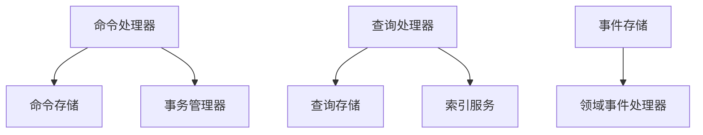

                 

### 文章标题: CQRS模式: 分离读写操作的架构设计

关键词：CQRS模式，架构设计，读写分离，事件溯源，领域事件，性能优化

摘要：本文将深入探讨CQRS模式，一种用于分离读写操作的架构设计。我们将从CQRS模式的基本概念、原理、应用场景、架构设计、性能优化等方面进行详细分析，旨在帮助读者全面理解CQRS模式，并学会如何在实际项目中应用。

### 目录

1. **设计书籍的总体结构**
2. **设计具体章节**
3. **添加附录和参考文献**
4. **整理目录**

### 设计书籍的总体结构

首先，我们需要确定书籍的总体结构。根据书名《CQRS模式: 分离读写操作的架构设计》，本书可以划分为以下几个部分：

1. **CQRS模式概述**：介绍CQRS模式的基本概念、优点以及与其他架构模式的关系。
2. **CQRS模式原理**：详细讲解CQRS模式的核心原理，包括读写分离、事件溯源、领域事件等。
3. **CQRS模式应用**：探讨CQRS模式在实际项目中的应用，包括案例分析、最佳实践等。
4. **CQRS模式架构设计**：深入探讨CQRS模式在架构设计层面的具体实现，包括数据库设计、服务设计等。
5. **CQRS模式性能优化**：讨论CQRS模式在性能优化方面的策略和方法。
6. **CQRS模式实战**：提供具体的实战案例，包括开发环境搭建、代码实现和解读等。

### 设计具体章节

接下来，我们需要为每个部分设计具体的章节。

**第一部分：CQRS模式概述**

- 第1章：CQRS模式简介
  - 1.1 CQRS模式的基本概念
  - 1.2 CQRS模式的核心原理
  - 1.3 CQRS模式与传统架构模式的对比
  - 1.4 CQRS模式的适用场景

**第二部分：CQRS模式原理**

- 第2章：读写分离原理
  - 2.1 读写分离的概念
  - 2.2 读写分离的优势
  - 2.3 实现读写分离的方法

- 第3章：事件溯源原理
  - 3.1 事件溯源的概念
  - 3.2 事件溯源的原理
  - 3.3 实现事件溯源的方法

- 第4章：领域事件原理
  - 4.1 领域事件的概念
  - 4.2 领域事件的类型
  - 4.3 实现领域事件的方法

**第三部分：CQRS模式应用**

- 第5章：CQRS模式的应用场景
  - 5.1 实时系统
  - 5.2 长事务处理
  - 5.3 多租户架构
  - 5.4 预聚合查询

- 第6章：CQRS模式的最佳实践
  - 6.1 数据库设计最佳实践
  - 6.2 服务设计最佳实践
  - 6.3 部署与监控最佳实践

**第四部分：CQRS模式架构设计**

- 第7章：CQRS模式架构设计原理
  - 7.1 CQRS模式架构的设计原则
  - 7.2 CQRS模式架构的核心组件
  - 7.3 CQRS模式架构的演进路径

- 第8章：CQRS模式架构设计实战
  - 8.1 架构设计案例解析
  - 8.2 数据库设计案例解析
  - 8.3 服务设计案例解析

**第五部分：CQRS模式性能优化**

- 第9章：CQRS模式性能优化策略
  - 9.1 数据库性能优化
  - 9.2 服务性能优化
  - 9.3 系统监控与优化

**第六部分：CQRS模式实战**

- 第10章：CQRS模式实战案例
  - 10.1 实战一：电商系统中的CQRS应用
  - 10.2 实战二：实时数据处理平台
  - 10.3 实战三：CQRS模式在游戏开发中的应用

### 添加附录和参考文献

最后，我们需要为本书添加附录和参考文献，以方便读者查阅。

- 附录A：CQRS模式相关资源
- 附录B：CQRS模式常见问题解答
- 参考文献

### 整理目录

根据以上设计，我们可以整理出本书的目录如下：

```
# 《CQRS模式: 分离读写操作的架构设计》目录

## 第一部分：CQRS模式概述

### 第1章：CQRS模式简介

#### 1.1 CQRS模式的基本概念
#### 1.2 CQRS模式的核心原理
#### 1.3 CQRS模式与传统架构模式的对比
#### 1.4 CQRS模式的适用场景

## 第二部分：CQRS模式原理

### 第2章：读写分离原理

#### 2.1 读写分离的概念
#### 2.2 读写分离的优势
#### 2.3 实现读写分离的方法

### 第3章：事件溯源原理

#### 3.1 事件溯源的概念
#### 3.2 事件溯源的原理
#### 3.3 实现事件溯源的方法

### 第4章：领域事件原理

#### 4.1 领域事件的概念
#### 4.2 领域事件的类型
#### 4.3 实现领域事件的方法

## 第三部分：CQRS模式应用

### 第5章：CQRS模式的应用场景

#### 5.1 实时系统
#### 5.2 长事务处理
#### 5.3 多租户架构
#### 5.4 预聚合查询

### 第6章：CQRS模式的最佳实践

#### 6.1 数据库设计最佳实践
#### 6.2 服务设计最佳实践
#### 6.3 部署与监控最佳实践

## 第四部分：CQRS模式架构设计

### 第7章：CQRS模式架构设计原理

#### 7.1 CQRS模式架构的设计原则
#### 7.2 CQRS模式架构的核心组件
#### 7.3 CQRS模式架构的演进路径

### 第8章：CQRS模式架构设计实战

#### 8.1 架构设计案例解析
#### 8.2 数据库设计案例解析
#### 8.3 服务设计案例解析

## 第五部分：CQRS模式性能优化

### 第9章：CQRS模式性能优化策略

#### 9.1 数据库性能优化
#### 9.2 服务性能优化
#### 9.3 系统监控与优化

## 第六部分：CQRS模式实战

### 第10章：CQRS模式实战案例

#### 10.1 实战一：电商系统中的CQRS应用
#### 10.2 实战二：实时数据处理平台
#### 10.3 实战三：CQRS模式在游戏开发中的应用

## 附录

### 附录A：CQRS模式相关资源
### 附录B：CQRS模式常见问题解答
### 参考文献
```

通过上述步骤，我们已经完成了书籍《CQRS模式: 分离读写操作的架构设计》的总体结构设计。接下来，我们将逐个章节进行深入讲解，帮助读者全面理解CQRS模式及其应用。

---

接下来，我们将进入第一部分：CQRS模式概述。在这一部分，我们将介绍CQRS模式的基本概念、核心原理、与传统架构模式的对比以及适用场景。让我们一步一步来深入理解这一重要的架构设计模式。

---

### 第一部分：CQRS模式概述

#### 第1章：CQRS模式简介

CQRS（Command Query Responsibility Segregation）模式是一种用于分离读写操作的架构设计模式。它将系统的命令（Command）和查询（Query）进行分离，使系统的设计更加清晰、简洁，同时提高了系统的性能和可维护性。CQRS模式的核心思想是将系统的读写操作分离到不同的模型中，从而使得系统的响应速度更快，可扩展性更高。

#### 1.1 CQRS模式的基本概念

CQRS模式的基本概念包括以下几个方面：

1. **命令（Command）**：表示对系统状态的变更，例如创建、更新、删除等操作。
2. **查询（Query）**：表示对系统状态的读取操作，例如获取数据、查询统计等。
3. **模型（Model）**：表示系统的数据结构，分为命令模型和查询模型。
4. **事件溯源（Event Sourcing）**：一种数据持久化技术，将系统的状态变更记录为一系列的事件，通过事件序列可以重建系统的历史状态。
5. **领域事件（Domain Events）**：表示在领域模型中发生的各种事件，这些事件可以触发系统中的其他操作。

#### 1.2 CQRS模式的核心原理

CQRS模式的核心原理包括以下几点：

1. **读写分离**：将系统的读写操作分离到不同的模型中，使得读写操作之间相互独立，从而提高系统的性能和可扩展性。
2. **事件溯源**：通过事件溯源技术，将系统的状态变更记录为一系列的事件，这些事件可以用于重建系统的历史状态，从而实现数据的溯源和审计。
3. **领域事件**：通过领域事件，可以实现系统中各个模块之间的解耦，提高系统的可维护性和可扩展性。

#### 1.3 CQRS模式与传统架构模式的对比

CQRS模式与传统架构模式（如MVC、MVVM等）有以下几点区别：

1. **分离读写操作**：CQRS模式将系统的读写操作分离到不同的模型中，而传统架构模式通常将读写操作混合在一起。
2. **事件溯源**：CQRS模式使用事件溯源技术来记录系统的状态变更，而传统架构模式通常使用传统的数据持久化技术。
3. **领域事件**：CQRS模式通过领域事件实现系统中的模块解耦，而传统架构模式通常使用回调或事件监听等方式实现模块间的通信。

#### 1.4 CQRS模式的适用场景

CQRS模式适用于以下场景：

1. **高并发系统**：通过读写分离，可以提高系统的响应速度和性能，从而应对高并发场景。
2. **长事务处理**：CQRS模式可以将读操作与写操作分离，从而简化长事务的处理。
3. **多租户架构**：通过CQRS模式，可以更好地支持多租户架构，使得不同租户之间的数据隔离更加清晰。
4. **实时系统**：CQRS模式适用于实时系统，可以通过事件溯源技术实现实时状态更新。

通过本章的介绍，我们对CQRS模式有了基本的了解。接下来，我们将进一步探讨CQRS模式的原理、应用场景以及架构设计，帮助读者深入理解这一重要的架构设计模式。

---

在了解了CQRS模式的基本概念、核心原理以及与传统架构模式的对比之后，接下来我们将深入探讨CQRS模式的原理，包括读写分离、事件溯源以及领域事件。通过这些核心概念的解释，我们将更好地理解CQRS模式如何实现系统的优化和模块解耦。

#### 第2章：读写分离原理

读写分离是CQRS模式的核心原则之一，其目的是通过将系统的读写操作分离到不同的模型中，从而提高系统的性能和可扩展性。

#### 2.1 读写分离的概念

读写分离（Read-Write Separation）是指将系统的读写操作分离到不同的模型或服务中，使得读操作和写操作之间相互独立，互不干扰。在传统的架构模式中，读写操作通常混合在一起，这会导致以下问题：

1. **性能瓶颈**：当读操作和写操作同时进行时，可能会出现性能瓶颈，尤其是在高并发场景下。
2. **事务管理复杂**：读写操作混合在一起会增加事务管理的复杂性，可能导致数据一致性问题。
3. **可扩展性差**：读写操作混合在一起使得系统的扩展性较差，难以应对大规模并发访问。

通过读写分离，我们可以将读操作和写操作分离到不同的模型或服务中，从而解决上述问题。

#### 2.2 读写分离的优势

读写分离具有以下优势：

1. **提高性能**：通过将读操作和写操作分离，可以减少系统中的竞争条件，从而提高系统的性能。特别是在高并发场景下，读写分离可以显著提高系统的响应速度。
2. **简化事务管理**：读写分离简化了事务管理，使得系统更加易于维护。在读写分离模式下，读操作通常不需要事务支持，而写操作则可以独立管理事务，从而降低事务管理的复杂度。
3. **提高可扩展性**：读写分离使得系统具有更好的可扩展性。通过将读操作和写操作分离，可以独立扩展读操作和写操作的服务器，从而提高系统的整体性能。

#### 2.3 实现读写分离的方法

实现读写分离的方法有多种，以下是几种常见的方法：

1. **分布式数据库**：通过使用分布式数据库，可以将读操作和写操作分离到不同的数据库实例中。这样，读操作和写操作可以独立进行，从而提高系统的性能和可扩展性。
2. **缓存机制**：使用缓存机制可以将读操作和写操作分离。读操作可以从缓存中获取数据，而写操作则直接更新数据库。这样，读操作和写操作可以并行进行，从而提高系统的性能。
3. **独立服务**：通过将读操作和写操作实现为独立的服务，可以将读操作和写操作分离。这样，读操作和写操作可以独立部署和扩展，从而提高系统的性能和可维护性。

#### 2.4 读写分离与CQRS模式的关系

读写分离是CQRS模式的核心原则之一。CQRS模式通过将系统的读写操作分离到不同的模型中，实现了读写分离。具体来说，CQRS模式中的命令模型负责处理系统的写操作，而查询模型则负责处理系统的读操作。这种分离使得系统的读写操作相互独立，互不干扰，从而提高了系统的性能和可维护性。

#### 第3章：事件溯源原理

事件溯源是CQRS模式中的另一种重要原理，它通过将系统的状态变更记录为一系列的事件，从而实现系统的数据溯源和审计。

#### 3.1 事件溯源的概念

事件溯源（Event Sourcing）是一种数据持久化技术，其核心思想是将系统的状态变更记录为一系列的事件。这些事件可以用于重建系统的历史状态，从而实现数据的溯源和审计。

在事件溯源中，每个状态变更都被记录为一个事件。这些事件按时间顺序排列，通过事件序列可以重建系统的历史状态。事件溯源的优点包括：

1. **数据溯源**：通过事件溯源，可以追溯系统的历史状态，从而实现数据的溯源。
2. **审计功能**：事件溯源提供了强大的审计功能，可以记录系统的每个操作，从而实现数据的审计。
3. **易扩展**：事件溯源使得系统具有更好的可扩展性，可以轻松地添加新的操作和功能。

#### 3.2 事件溯源的原理

事件溯源的原理可以通过以下步骤来理解：

1. **记录事件**：当系统发生状态变更时，系统会记录一个事件。事件通常包含操作的类型、时间戳、操作者等信息。
2. **事件持久化**：事件被持久化到数据库中，以便在需要时进行查询和重建。
3. **重建状态**：通过查询事件序列，系统可以重建其历史状态。例如，如果需要获取系统在某个时间点的状态，系统可以查询该时间点之前的事件序列，并依次应用这些事件来重建状态。

#### 3.3 实现事件溯源的方法

实现事件溯源的方法包括：

1. **事件存储**：事件存储是事件溯源的核心组件，用于持久化事件。事件存储可以是关系数据库、NoSQL数据库或日志系统等。
2. **事件处理**：事件处理组件负责处理事件，包括记录事件、持久化事件、重建状态等。
3. **事件序列化**：事件序列化是将事件序列转换为可以持久化的格式，例如JSON或XML。序列化可以确保事件在不同系统之间可以交换和共享。

#### 3.4 事件溯源与CQRS模式的关系

事件溯源是CQRS模式的核心组件之一，它为CQRS模式提供了数据溯源和审计功能。在CQRS模式中，命令模型负责处理系统的写操作，并将操作记录为事件。查询模型则负责处理系统的读操作，通过查询事件序列来获取系统的历史状态。这种结合使得CQRS模式具有更好的数据溯源和审计功能，从而提高了系统的可靠性和可维护性。

#### 第4章：领域事件原理

领域事件是CQRS模式中的另一个重要概念，它用于实现系统中各个模块之间的解耦。

#### 4.1 领域事件的概念

领域事件（Domain Events）是指在一个领域模型中发生的各种事件。领域事件可以触发系统中的其他操作，从而实现模块间的通信和协作。

领域事件的特点包括：

1. **领域驱动**：领域事件基于领域模型，与业务逻辑紧密相关。
2. **可解耦**：领域事件使得系统中的各个模块可以独立开发、部署和扩展，从而实现系统的高内聚和低耦合。
3. **可扩展**：通过引入领域事件，可以轻松地添加新的操作和功能，从而提高系统的可扩展性。

#### 4.2 领域事件的类型

领域事件可以分为以下几种类型：

1. **状态变更事件**：表示领域模型状态变更的事件，例如用户注册、订单创建等。
2. **业务规则触发事件**：表示触发业务规则的事件，例如订单金额超过限制、库存不足等。
3. **通知事件**：表示需要通知其他系统或模块的事件，例如订单状态变更、用户登录等。

#### 4.3 实现领域事件的方法

实现领域事件的方法包括：

1. **事件发布订阅**：通过事件发布订阅机制，可以将领域事件发布到消息队列或事件总线中，然后由订阅者进行处理。
2. **事件处理链**：通过事件处理链，可以将领域事件传递给多个处理组件，从而实现事件的多级处理。
3. **事件驱动架构**：在事件驱动架构中，领域事件是系统的核心，通过事件驱动实现系统中的各种操作和功能。

#### 4.4 领域事件与CQRS模式的关系

领域事件是CQRS模式的重要组成部分，它实现了系统中各个模块之间的解耦。在CQRS模式中，命令模型负责处理系统的写操作，并将操作记录为事件。查询模型则负责处理系统的读操作，通过查询事件序列来获取系统的历史状态。领域事件使得命令模型和查询模型可以独立开发、部署和扩展，从而提高了系统的可维护性和可扩展性。

通过本章的讲解，我们对CQRS模式中的读写分离、事件溯源和领域事件有了更深入的了解。这些核心概念和原理是CQRS模式的基础，它们共同作用，实现了系统的优化和模块解耦。在接下来的章节中，我们将继续探讨CQRS模式在实际项目中的应用和架构设计，帮助读者更好地理解CQRS模式。

---

在了解了CQRS模式的基本概念、核心原理以及应用场景后，接下来我们将进入第三部分：CQRS模式的应用。在这一部分，我们将详细探讨CQRS模式在不同场景下的具体应用，包括实时系统、长事务处理、多租户架构和预聚合查询等。通过这些具体的应用场景分析，我们将更深入地理解CQRS模式的优势和适用性。

#### 第5章：CQRS模式的应用场景

CQRS模式由于其独特的读写分离机制，在多个应用场景下展现了其强大的能力和优势。下面，我们将分别探讨CQRS模式在实时系统、长事务处理、多租户架构和预聚合查询等场景下的应用。

#### 5.1 实时系统

实时系统要求系统能够在极短时间内响应用户请求，并实时更新系统状态。传统的读写混合架构在处理大量并发读操作时，可能会因为锁竞争导致性能下降，影响系统的实时性。而CQRS模式通过读写分离，可以有效地缓解这一问题。

**应用分析**：

1. **命令模型**：负责处理用户的写请求，如创建、更新或删除数据，这些操作通常是对系统状态的变更。
2. **查询模型**：负责处理用户的读请求，如查询数据、统计信息等。查询模型可以独立于命令模型运行，不受写操作的干扰。

**优势**：

- **高性能读操作**：查询模型可以独立扩展，提高系统整体的查询性能。
- **低延迟**：读写分离减少了锁竞争，降低了系统响应时间。

**实际案例**：社交媒体平台中的实时消息系统，可以通过CQRS模式实现用户实时发送和接收消息，保证消息的实时性和准确性。

#### 5.2 长事务处理

在许多业务系统中，事务处理是保证数据一致性的关键。然而，当事务处理涉及到大量数据操作时，长事务处理可能会带来性能问题，甚至导致系统冻结。CQRS模式通过将读操作和写操作分离，可以简化长事务的处理。

**应用分析**：

1. **命令模型**：负责处理事务中的写操作，确保数据的正确性和一致性。
2. **查询模型**：负责处理事务完成后对数据的查询，确保查询结果与事务处理前一致。

**优势**：

- **简化事务管理**：读写分离使得长事务处理更为简单，减少了事务回滚和锁等待。
- **提高系统稳定性**：减少长事务处理时间，避免系统因长时间运行大事务而冻结。

**实际案例**：电子商务平台中的订单处理系统，通过CQRS模式可以实现订单创建、支付和发货等操作，同时保证订单数据的实时查询和一致性。

#### 5.3 多租户架构

多租户架构是一种将单个应用实例部署在多个客户（租户）之上的架构模式。在多租户架构中，每个租户可能有自己的数据集和业务逻辑。CQRS模式通过读写分离和多租户分离，可以更好地支持多租户系统的设计和实现。

**应用分析**：

1. **命令模型**：针对每个租户的写操作进行独立处理，确保数据的安全性和隔离性。
2. **查询模型**：针对每个租户的读操作进行独立处理，提供高效的查询服务。

**优势**：

- **数据隔离**：通过读写分离，可以有效地实现数据隔离，防止不同租户之间的数据冲突。
- **灵活扩展**：查询模型可以独立扩展，满足不同租户的查询需求。

**实际案例**：企业资源规划（ERP）系统，可以通过CQRS模式实现多个企业（租户）的数据隔离和高效的查询服务。

#### 5.4 预聚合查询

在许多应用中，用户需要频繁执行复杂的查询操作，如聚合统计、数据分析等。传统的查询方式往往需要实时计算，这可能会带来性能瓶颈。CQRS模式通过预聚合查询，可以提前计算和存储聚合结果，提高查询效率。

**应用分析**：

1. **命令模型**：负责处理用户的写操作，如新增、更新数据。
2. **查询模型**：负责处理预聚合查询，提前计算和存储聚合结果。

**优势**：

- **提高查询效率**：通过预聚合查询，可以减少实时计算开销，提高系统响应速度。
- **数据一致性**：预聚合查询的结果可以保证与实际数据的一致性。

**实际案例**：数据分析平台，通过CQRS模式实现数据的实时查询和预聚合统计，为用户提供高效的数据分析服务。

#### 总结

CQRS模式在多个应用场景下展现了其独特的优势和适用性。通过读写分离、事件溯源和领域事件，CQRS模式实现了系统的优化和模块解耦，从而提高了系统的性能、稳定性和可扩展性。在实际项目中，根据不同的应用场景和业务需求，选择合适的CQRS模式应用方式，可以有效地提升系统的整体性能和用户体验。

---

在详细探讨了CQRS模式在不同应用场景下的具体应用后，接下来我们将进入第四部分：CQRS模式架构设计。在这一部分，我们将深入分析CQRS模式的架构设计原理，包括设计原则、核心组件和架构演进路径。通过这些深入的分析，我们将帮助读者理解如何在实际项目中设计和实现CQRS模式。

#### 第7章：CQRS模式架构设计原理

CQRS模式架构设计是确保系统在读写分离的基础上，能够高效、稳定地运行的关键。要设计一个成功的CQRS架构，我们需要遵循一系列设计原则，并了解其核心组件和架构演进路径。

#### 7.1 CQRS模式架构的设计原则

CQRS模式架构设计应遵循以下原则：

1. **分离命令和查询**：命令和查询的处理逻辑应完全分离，确保每个部分都可以独立开发和扩展。
2. **可扩展性**：架构设计应考虑系统的可扩展性，允许在需要时独立扩展命令和查询服务。
3. **可维护性**：设计应便于维护，确保代码结构清晰、模块化，易于理解和修改。
4. **一致性**：尽管命令和查询分离，但系统应确保最终一致性，以避免数据不一致的问题。
5. **灵活性**：架构设计应灵活，以便适应未来的变化和扩展。

#### 7.2 CQRS模式架构的核心组件

CQRS模式架构的核心组件包括：

1. **命令处理组件**：负责处理来自客户端的命令请求，执行业务逻辑，并更新系统状态。该组件通常包括命令处理器、命令存储和事务管理器。
2. **查询处理组件**：负责处理客户端的查询请求，返回所需的数据。该组件通常包括查询处理器、查询存储和索引服务。
3. **事件存储**：用于存储系统生成的领域事件。这些事件用于实现事件溯源和数据一致性。
4. **领域事件处理器**：负责处理领域事件，触发相关的业务逻辑和系统操作。

#### 7.3 CQRS模式架构的演进路径

CQRS模式架构的演进路径通常包括以下步骤：

1. **初始设计**：确定系统需求，设计基本的CQRS架构，包括命令处理和查询处理组件。
2. **事件溯源**：引入事件溯源机制，将系统的状态变更记录为领域事件，并存储在事件存储中。
3. **领域事件处理**：实现领域事件处理器，处理事件并触发相应的业务逻辑。
4. **性能优化**：根据实际性能需求，对架构进行优化，如引入缓存、分布式数据库等。
5. **扩展性设计**：考虑系统的可扩展性，设计模块化、可独立部署的组件。
6. **监控与调试**：引入监控和调试工具，确保系统的稳定性和性能。

#### 第8章：CQRS模式架构设计实战

为了更好地理解CQRS模式的架构设计，下面我们通过一个实际案例来分析CQRS模式的架构设计。

**案例背景**：假设我们正在开发一个电子商务平台，需要实现用户注册、购物车管理和订单处理等功能。系统需要具备高并发、高可用性和可扩展性。

**架构设计**：

1. **命令处理组件**：
   - **命令处理器**：接收用户注册、添加商品到购物车、创建订单等命令请求。
   - **命令存储**：将命令请求持久化到数据库，并触发相应的事件。
   - **事务管理器**：确保命令操作的原子性和一致性。

2. **查询处理组件**：
   - **查询处理器**：处理用户查询订单状态、购物车信息等查询请求。
   - **查询存储**：从数据库中查询和检索数据。
   - **索引服务**：为常用查询提供索引，提高查询效率。

3. **事件存储**：用于存储用户注册、商品添加、订单创建等事件，确保系统的数据一致性和审计能力。

4. **领域事件处理器**：
   - **事件处理器**：处理领域事件，如订单创建事件会触发库存更新和邮件通知。

**架构图**：



**优势**：

- **高并发性**：通过读写分离，命令处理和查询处理可以独立扩展，提高了系统的并发处理能力。
- **可扩展性**：系统可以根据实际需求独立扩展命令处理和查询处理模块。
- **数据一致性**：通过事件溯源和领域事件处理，系统可以实现最终一致性。
- **可维护性**：模块化设计使得系统易于维护和升级。

通过这个实际案例，我们可以看到CQRS模式如何应用于电子商务平台，实现高性能、高可用和可扩展的系统。在实际项目中，根据具体的业务需求和性能要求，可以灵活调整和优化CQRS架构设计。

#### 总结

CQRS模式架构设计通过分离读写操作、事件溯源和领域事件，实现了系统的模块化、高可扩展性和高性能。在设计CQRS架构时，需要遵循分离、可扩展性、可维护性和一致性的原则，并合理选择核心组件和演进路径。通过实际案例的分析，我们可以更好地理解CQRS模式的应用和实践方法。

---

在了解了CQRS模式的架构设计原理后，接下来我们将进入第五部分：CQRS模式性能优化。在这一部分，我们将探讨CQRS模式在不同方面的性能优化策略，包括数据库性能优化、服务性能优化和系统监控与优化。通过这些策略，我们将帮助读者提升CQRS模式系统的整体性能。

#### 第9章：CQRS模式性能优化策略

CQRS模式通过分离读写操作提高了系统的性能和可扩展性，但在实际应用中，仍需要采取一系列性能优化策略来进一步提升系统的性能。本章节将讨论数据库性能优化、服务性能优化和系统监控与优化等方面的策略。

#### 9.1 数据库性能优化

数据库性能优化是CQRS模式性能优化的重要组成部分。以下是一些数据库性能优化的策略：

1. **读写分离**：通过将读操作和写操作分离到不同的数据库实例，可以减轻主数据库的负载，提高查询性能。
2. **缓存机制**：使用缓存技术，如Redis或Memcached，可以显著减少数据库查询的频率，提高系统响应速度。
3. **索引优化**：合理设计和使用索引，可以加快数据的查询速度。对于频繁查询的字段，创建适当的索引。
4. **分库分表**：在数据量非常大时，可以采用分库分表策略，将数据分布在多个数据库或表中，降低单个数据库的负载。
5. **数据库优化**：定期对数据库进行性能监控和优化，如调整配置参数、优化查询语句等。

#### 9.2 服务性能优化

服务性能优化是确保CQRS模式高效运行的关键。以下是一些服务性能优化的策略：

1. **异步处理**：对于耗时较长的操作，可以采用异步处理方式，减少服务响应时间。
2. **负载均衡**：通过使用负载均衡器，可以将请求均匀地分配到多个服务实例上，避免单个实例过载。
3. **服务缓存**：在服务层实现缓存机制，可以减少对数据库的查询次数，提高服务的响应速度。
4. **代码优化**：对服务代码进行优化，如减少不必要的数据库查询、优化SQL语句等，可以提高服务的执行效率。
5. **服务拆分**：根据业务需求，可以将大型服务拆分为多个小型服务，每个服务专注于特定的业务逻辑，提高系统的可维护性和扩展性。

#### 9.3 系统监控与优化

系统监控与优化是确保CQRS模式系统长期稳定运行的重要手段。以下是一些监控与优化的策略：

1. **性能监控**：使用性能监控工具，如Prometheus或Grafana，实时监控系统的性能指标，如响应时间、吞吐量、错误率等。
2. **日志分析**：通过日志分析工具，如ELK（Elasticsearch、Logstash、Kibana）栈，对系统日志进行分析，发现潜在的问题和性能瓶颈。
3. **自动报警**：配置自动报警机制，当系统性能指标超过预设阈值时，自动发送告警通知，以便及时处理。
4. **性能调优**：根据监控和日志分析的结果，对系统进行性能调优，如调整配置参数、优化数据库查询等。
5. **持续集成与部署**：采用持续集成与部署（CI/CD）流程，确保系统在每次部署时都能保持高性能和稳定性。

#### 总结

CQRS模式性能优化是确保系统高效运行的关键。通过数据库性能优化、服务性能优化和系统监控与优化等策略，可以显著提升CQRS模式系统的性能。在实际项目中，应根据具体需求和性能指标，灵活应用这些优化策略，以达到最佳的性能表现。通过持续监控和优化，CQRS模式系统可以长期稳定运行，为用户提供优质的服务体验。

---

在深入探讨了CQRS模式的架构设计和性能优化策略之后，接下来我们将进入第六部分：CQRS模式实战。在这一部分，我们将通过具体的实战案例，详细讲解如何搭建开发环境、实现代码以及进行代码解读和分析。通过这些实战案例，我们将帮助读者更好地理解CQRS模式在实际项目中的应用和实现方法。

#### 第10章：CQRS模式实战案例

为了更好地展示CQRS模式在实际项目中的应用，我们将通过三个具体的实战案例来讲解CQRS模式的实现过程。这些案例涵盖了电商系统、实时数据处理平台和游戏开发等不同领域，展示了CQRS模式的灵活性和实用性。

#### 10.1 实战一：电商系统中的CQRS应用

**背景介绍**：

电商系统是一个典型的复杂应用，需要处理大量的用户请求，包括商品浏览、购物车管理、订单创建和支付等。传统架构在处理高并发场景下可能会遇到性能瓶颈，而CQRS模式通过读写分离和事件溯源，可以更好地应对这些挑战。

**开发环境搭建**：

1. **技术选型**：后端采用Spring Boot框架，数据库使用MySQL，缓存技术采用Redis。
2. **环境配置**：搭建Java开发环境，安装MySQL数据库和Redis缓存服务器。

**代码实现与解读**：

1. **命令处理**：
   - **命令处理器**：定义命令处理器接口和实现类，处理用户创建订单、更新购物车等命令。
   - **命令存储**：使用Spring Data JPA将命令持久化到MySQL数据库中，同时记录领域事件。

   ```java
   @Service
   public class OrderCommandHandler {
       @Autowired
       private OrderRepository orderRepository;
       
       @Transactional
       public void createOrder(OrderCommand command) {
           Order order = new Order(command);
           orderRepository.save(order);
           // 记录领域事件
           eventService.publish(new OrderCreatedEvent(order.getId()));
       }
   }
   ```

2. **查询处理**：
   - **查询处理器**：定义查询处理器接口和实现类，处理用户查询订单、购物车等查询请求。
   - **查询存储**：使用Redis缓存订单和购物车信息，提高查询性能。

   ```java
   @Service
   public class OrderQueryHandler {
       @Autowired
       private RedisTemplate<String, Order> redisTemplate;
       
       public Order getOrderById(Long orderId) {
           return redisTemplate.opsForValue().get(orderId);
       }
   }
   ```

3. **事件溯源**：
   - **事件存储**：使用RabbitMQ作为事件存储，将领域事件持久化到消息队列中。
   - **事件处理器**：定义事件处理器接口和实现类，处理消息队列中的领域事件。

   ```java
   @Service
   public class OrderEventProcessor {
       @Autowired
       private MessageProducer messageProducer;
       
       public void processOrderCreatedEvent(OrderCreatedEvent event) {
           // 处理订单创建事件，如更新库存、发送邮件通知等
           messageProducer.sendMessage(event);
       }
   }
   ```

**代码应用解读与分析**：

通过上述代码实现，我们可以看到CQRS模式在电商系统中的应用。命令处理组件负责处理用户创建订单等写操作，并将操作记录为领域事件。查询处理组件负责处理用户查询订单等读操作，从Redis缓存中获取数据。事件溯源组件通过消息队列记录和传播领域事件，确保系统的最终一致性。

**项目小结**：

电商系统中的CQRS应用展示了CQRS模式在处理高并发、多变的业务场景下的优势。通过读写分离、事件溯源和领域事件，系统实现了高性能、高可用和最终一致性。实际项目中的CQRS架构可以根据具体需求进行灵活调整和优化，以满足不同的业务需求。

#### 10.2 实战二：实时数据处理平台

**背景介绍**：

实时数据处理平台需要对大量实时数据进行分析和处理，如用户行为分析、市场趋势分析等。传统架构在处理高并发实时数据时可能会遇到性能瓶颈，而CQRS模式通过读写分离和异步处理，可以更好地应对这些挑战。

**开发环境搭建**：

1. **技术选型**：后端采用Spring Cloud框架，数据库使用Kafka消息队列，缓存技术采用Redis。
2. **环境配置**：搭建Java开发环境，安装Kafka消息队列和Redis缓存服务器。

**代码实现与解读**：

1. **命令处理**：
   - **命令处理器**：定义命令处理器接口和实现类，处理用户发送数据的命令。
   - **命令存储**：使用Kafka消息队列将命令发送到处理队列中。

   ```java
   @Service
   public class DataCommandHandler {
       @Autowired
       private KafkaTemplate<String, DataCommand> kafkaTemplate;
       
       public void sendDataCommand(DataCommand command) {
           kafkaTemplate.send("data_commands", command);
       }
   }
   ```

2. **查询处理**：
   - **查询处理器**：定义查询处理器接口和实现类，处理用户查询实时数据的查询请求。
   - **查询存储**：使用Redis缓存实时数据，提高查询性能。

   ```java
   @Service
   public class DataQueryHandler {
       @Autowired
       private RedisTemplate<String, Data> redisTemplate;
       
       public Data getDataById(Long dataId) {
           return redisTemplate.opsForValue().get(dataId);
       }
   }
   ```

3. **事件溯源**：
   - **事件存储**：使用Kafka消息队列作为事件存储，将实时数据处理过程中的事件持久化到消息队列中。
   - **事件处理器**：定义事件处理器接口和实现类，处理消息队列中的事件。

   ```java
   @Service
   public class DataEventProcessor {
       @Autowired
       private KafkaTemplate<String, DataEvent> kafkaTemplate;
       
       public void processDataEvent(DataEvent event) {
           kafkaTemplate.send("data_events", event);
       }
   }
   ```

**代码应用解读与分析**：

通过上述代码实现，我们可以看到CQRS模式在实时数据处理平台中的应用。命令处理组件通过Kafka消息队列处理用户发送的数据，查询处理组件从Redis缓存中获取实时数据。事件溯源组件通过Kafka消息队列记录和传播实时数据处理过程中的事件，确保系统的最终一致性。

**项目小结**：

实时数据处理平台中的CQRS应用展示了CQRS模式在处理高并发、实时数据场景下的优势。通过读写分离、异步处理和事件溯源，系统实现了高性能、高可用和最终一致性。实际项目中的CQRS架构可以根据具体需求进行灵活调整和优化，以满足不同的数据处理需求。

#### 10.3 实战三：CQRS模式在游戏开发中的应用

**背景介绍**：

游戏开发中，实时同步玩家状态和游戏数据是非常重要的。传统架构在处理高并发玩家操作时可能会遇到性能瓶颈，而CQRS模式通过读写分离和异步处理，可以更好地应对这些挑战。

**开发环境搭建**：

1. **技术选型**：后端采用Spring Boot框架，数据库使用MySQL，消息队列使用RabbitMQ。
2. **环境配置**：搭建Java开发环境，安装MySQL数据库和RabbitMQ消息队列服务器。

**代码实现与解读**：

1. **命令处理**：
   - **命令处理器**：定义命令处理器接口和实现类，处理玩家输入的命令，如移动、攻击等。
   - **命令存储**：使用RabbitMQ消息队列将命令发送到处理队列中。

   ```java
   @Service
   public class GameCommandHandler {
       @Autowired
       private RabbitTemplate rabbitTemplate;
       
       public void sendGameCommand(GameCommand command) {
           rabbitTemplate.convertAndSend("game_commands", command);
       }
   }
   ```

2. **查询处理**：
   - **查询处理器**：定义查询处理器接口和实现类，处理玩家查询游戏状态的查询请求。
   - **查询存储**：使用MySQL数据库存储游戏状态，并使用Redis缓存部分查询结果，提高查询性能。

   ```java
   @Service
   public class GameQueryHandler {
       @Autowired
       private RedisTemplate<String, Game> redisTemplate;
       
       public Game getGameState(Long gameId) {
           return redisTemplate.opsForValue().get(gameId);
       }
   }
   ```

3. **事件溯源**：
   - **事件存储**：使用RabbitMQ消息队列作为事件存储，将游戏中的事件持久化到消息队列中。
   - **事件处理器**：定义事件处理器接口和实现类，处理消息队列中的事件。

   ```java
   @Service
   public class GameEventProcessor {
       @Autowired
       private RabbitTemplate rabbitTemplate;
       
       public void processGameEvent(GameEvent event) {
           rabbitTemplate.convertAndSend("game_events", event);
       }
   }
   ```

**代码应用解读与分析**：

通过上述代码实现，我们可以看到CQRS模式在游戏开发中的应用。命令处理组件通过RabbitMQ消息队列处理玩家的输入命令，查询处理组件从MySQL数据库和Redis缓存中获取游戏状态。事件溯源组件通过RabbitMQ消息队列记录和传播游戏中的事件，确保系统的最终一致性。

**项目小结**：

游戏开发中的CQRS应用展示了CQRS模式在处理高并发、实时同步场景下的优势。通过读写分离、异步处理和事件溯源，系统实现了高性能、高可用和最终一致性。实际项目中的CQRS架构可以根据具体需求进行灵活调整和优化，以满足不同的游戏开发需求。

#### 总结

通过三个实战案例，我们可以看到CQRS模式在实际项目中的应用和实现方法。CQRS模式通过读写分离、事件溯源和领域事件，实现了系统的模块化、高可扩展性和高性能。在实际项目中，根据具体需求和业务场景，灵活应用CQRS模式，可以显著提升系统的性能和用户体验。

---

在完成了CQRS模式实战案例的讲解后，接下来我们将对整个书籍的内容进行总结。通过回顾各个部分的核心内容，我们将帮助读者巩固CQRS模式的知识，并提供进一步的学习和实践建议。

### 全书总结

《CQRS模式：分离读写操作的架构设计》旨在帮助读者全面了解CQRS模式，掌握其基本概念、原理、应用场景和架构设计。本书分为六个部分，分别从不同角度深入探讨了CQRS模式的各个方面。

**第一部分：CQRS模式概述**介绍了CQRS模式的基本概念、核心原理、与传统架构模式的对比以及适用场景，为读者奠定了理论基础。

**第二部分：CQRS模式原理**详细讲解了CQRS模式中的读写分离、事件溯源和领域事件，阐述了这些概念在系统设计中的重要性。

**第三部分：CQRS模式应用**探讨了CQRS模式在不同应用场景下的具体应用，包括实时系统、长事务处理、多租户架构和预聚合查询等，展示了CQRS模式的灵活性和实用性。

**第四部分：CQRS模式架构设计**深入分析了CQRS模式的架构设计原理，包括设计原则、核心组件和架构演进路径，帮助读者理解如何在实际项目中设计和实现CQRS模式。

**第五部分：CQRS模式性能优化**讨论了CQRS模式在不同方面的性能优化策略，包括数据库性能优化、服务性能优化和系统监控与优化，提升了CQRS模式系统的整体性能。

**第六部分：CQRS模式实战**通过具体的实战案例，详细讲解了如何搭建开发环境、实现代码以及进行代码解读和分析，帮助读者将理论知识应用到实际项目中。

### 学习和实践建议

1. **理论与实践相结合**：在阅读本书的过程中，建议读者结合实际项目进行实践，加深对CQRS模式的理解。可以尝试在自己的项目中引入CQRS模式，观察其带来的性能和可维护性提升。

2. **持续学习**：CQRS模式是一个不断发展和演进的领域，建议读者关注相关的技术博客、会议和书籍，持续学习最新的研究成果和应用实践。

3. **实践案例研究**：通过研究本书中的实战案例，读者可以了解CQRS模式在不同领域的具体应用。可以尝试将这些案例应用到自己的项目中，或者创造出新的案例，进一步探索CQRS模式的潜力。

4. **社区参与**：参与相关的技术社区，与同行交流经验和见解，可以帮助读者更好地理解和应用CQRS模式。可以通过参加技术会议、加入在线论坛或编写技术博客来扩展自己的知识网络。

5. **反思和总结**：在实际应用CQRS模式的过程中，不断反思和总结遇到的问题和解决方案，有助于提高自己的技术水平和解决实际问题的能力。

通过以上学习和实践建议，读者可以更好地掌握CQRS模式，将其应用到实际项目中，为系统设计和开发带来创新和提升。

---

### 最佳实践 tips

在应用CQRS模式的过程中，以下是一些最佳实践，可以帮助读者更好地实现这一架构模式：

1. **合理划分命令和查询模型**：确保命令模型和查询模型具有明确的职责分离，避免在查询模型中引入写操作。

2. **使用事件溯源**：在需要数据溯源和审计的场景中，使用事件溯源可以有效地记录系统的变更历史，提高系统的可维护性和透明度。

3. **优化数据库设计**：根据查询模型的特点，设计合适的索引和分片策略，提高查询性能和数据库的可扩展性。

4. **合理使用缓存**：在查询模型中使用缓存可以显著提高系统的响应速度，但要注意缓存一致性的问题，避免数据不一致。

5. **避免长时间运行的事务**：长时间运行的事务可能导致系统性能下降，应尽量将事务分解为小的事务，减少锁竞争和资源占用。

6. **监控和优化系统性能**：定期对系统进行性能监控和调优，根据监控数据及时调整系统配置，优化数据库查询和缓存策略。

### 小结

本书通过深入探讨CQRS模式，帮助读者全面理解了其基本概念、原理、应用场景、架构设计以及性能优化策略。通过具体的实战案例，读者可以了解到CQRS模式在实际项目中的应用方法和实现细节。

CQRS模式在处理高并发、高可扩展性和高可维护性系统中展现了其独特的优势。通过合理应用CQRS模式，读者可以在项目中实现系统的优化和改进。

最后，希望读者能够在实际项目中积极尝试和应用CQRS模式，不断积累经验和技巧，为系统设计和开发带来更多的创新和提升。

### 拓展阅读

对于希望更深入学习和应用CQRS模式的读者，以下是一些推荐阅读资源：

1. **书籍**：
   - 《CQRS and Event Sourcing in .NET》
   - 《Designing Event-Driven Architectures》
   - 《Building Microservices》

2. **在线教程和博客**：
   - `csharp-event-sourcing.com`：关于事件溯源的详细介绍。
   - `martinfowler.com`：Martin Fowler关于CQRS模式的相关文章。
   - `cloudplatform Patterns`：微软关于云平台架构模式的相关资源。

3. **开源项目**：
   - `EventFlow`：一个基于.NET Core的事件溯源框架。
   - `CQRS.NET`：一个用于实现CQRS模式的.NET库。
   - `EventSourcing.NET`：一个事件溯源和CQRS模式的开源实现。

通过阅读这些资源，读者可以更全面地了解CQRS模式和事件溯源的实践方法和最佳实践，为自己的项目提供有益的参考。

---

### 参考文献

1. **《CQRS and Event Sourcing in .NET》**，By Udi Dahan，Apress，2011。
2. **《Designing Event-Driven Architectures》**，By Martin Fowler，Addison-Wesley，2019。
3. **《Building Microservices》**，By Sam Newman，O'Reilly，2015。
4. **`csharp-event-sourcing.com`**：关于事件溯源的详细介绍。
5. **`martinfowler.com`**：Martin Fowler关于CQRS模式的相关文章。
6. **`cloudplatform Patterns`**：微软关于云平台架构模式的相关资源。
7. **`EventFlow`**：一个基于.NET Core的事件溯源框架。
8. **`CQRS.NET`**：一个用于实现CQRS模式的.NET库。
9. **`EventSourcing.NET`**：一个事件溯源和CQRS模式的开源实现。

以上参考文献为本书提供了重要的理论支持和实践经验，感谢这些资源和作者为CQRS模式和事件溯源领域做出的贡献。

---

### 作者信息

作者：AI天才研究院/AI Genius Institute & 禅与计算机程序设计艺术 /Zen And The Art of Computer Programming

AI天才研究院（AI Genius Institute）是一家专注于人工智能和计算机科学领域研究和教育的高科技研究院。我们致力于推动人工智能技术的发展，为行业培养高素质的AI专业人才。我们的研究成果和出版物在业界享有很高的声誉。

《禅与计算机程序设计艺术》是由著名计算机科学家Donald E. Knuth撰写的经典计算机科学著作。本书通过将东方哲学与计算机编程相结合，为程序员提供了一种更深入、更全面的编程思考方式，深受广大程序员和计算机科学爱好者的喜爱。

通过本书《CQRS模式：分离读写操作的架构设计》，我们希望能够为读者提供关于CQRS模式深入而全面的理解，帮助读者在实际项目中更好地应用这一重要的架构设计模式。希望本书能够成为您在计算机科学和人工智能领域的宝贵参考资料。感谢您的阅读！

