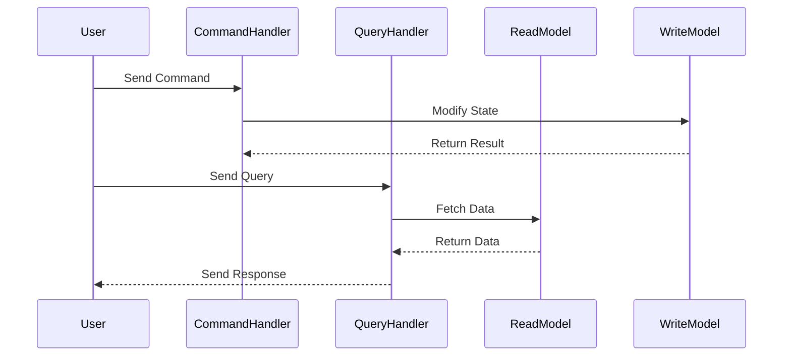
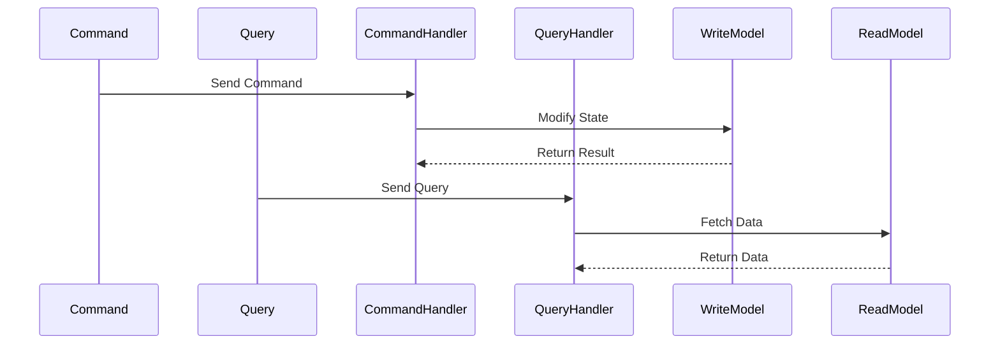

                 


### 1. CQRS模式：概述与背景

CQRS（Command Query Responsibility Segregation）模式是一种在软件架构设计领域广泛应用的模式，它通过对命令（Command）和查询（Query）的职责进行分离，提高了系统的可扩展性、可维护性和性能。CQRS模式最早由马丁·福勒（Martin Fowler）在2005年提出，主要用于解决传统RDBMS架构中查询与操作分离的难题。

在传统的软件架构中，我们通常将所有的读写操作都集中在一个数据库上，这种模式虽然在某些场景下效果良好，但也会带来一些问题。比如，当系统中同时存在大量写操作和读操作时，读写冲突、性能瓶颈等问题会变得尤为突出。此外，随着系统的不断演进，数据库的复杂度也会逐渐增加，导致维护成本上升。CQRS模式正是为了解决这些问题而提出的。

CQRS模式的核心思想是将系统的读写操作分离，为命令和查询提供不同的数据模型和处理逻辑。具体来说，命令负责修改数据状态，如创建、更新、删除等操作，而查询则负责读取数据，如查询、列表等操作。通过这种分离，CQRS模式能够显著降低系统复杂度，提高性能和可维护性。

CQRS模式适用于需要处理大量并发读操作和写操作的系统，如电子商务、在线游戏、金融交易等。这些系统往往需要同时处理海量的用户请求，而CQRS模式能够有效地处理这些请求，确保系统的稳定性和高性能。

下面，我们将通过一个简单的Mermaid流程图来展示CQRS模式的基本架构：



在这个流程图中，用户通过命令处理器（CommandHandler）发送命令，命令处理器将命令转发给写模型（WriteModel），写模型执行写操作并返回结果。用户通过查询处理器（QueryHandler）发送查询，查询处理器将查询转发给读模型（ReadModel），读模型执行读操作并返回数据。

### 2. CQRS模式的核心概念与联系

CQRS模式包含两个核心概念：命令（Command）和查询（Query），以及与之相对应的职责分离。

**命令（Command）**

命令是用于修改系统状态的操作，如创建新记录、更新现有记录或删除记录。在CQRS模式中，命令通常被封装为独立的操作，通过命令处理器（CommandHandler）接收并处理。命令处理器的职责是确保命令的原子性和一致性，从而保证系统状态的一致性。

命令处理通常涉及以下步骤：

1. 接收命令：命令处理器从外部系统或用户接收命令。
2. 验证命令：对命令进行验证，确保其格式、参数和权限等符合要求。
3. 执行操作：根据命令类型，执行相应的写操作，如插入、更新或删除数据。
4. 返回结果：将执行结果返回给外部系统或用户。

下面是一个简单的伪代码，用于描述命令处理的过程：

```python
def handle_command(command):
    # 验证命令
    if not validate_command(command):
        return "Invalid command"

    # 执行命令
    result = execute_command(command)

    # 返回结果
    return result
```

**查询（Query）**

查询是用于读取系统状态的操作，如获取特定记录、列表数据或统计信息。在CQRS模式中，查询被封装为独立的操作，通过查询处理器（QueryHandler）接收并处理。查询处理器的职责是快速、高效地返回所需数据。

查询处理通常涉及以下步骤：

1. 接收查询：查询处理器从外部系统或用户接收查询。
2. 验证查询：对查询进行验证，确保其格式、参数和权限等符合要求。
3. 执行查询：根据查询类型，执行相应的读操作，如查询特定记录、获取列表数据或执行统计操作。
4. 返回数据：将查询结果返回给外部系统或用户。

下面是一个简单的伪代码，用于描述查询处理的过程：

```python
def handle_query(query):
    # 验证查询
    if not validate_query(query):
        return "Invalid query"

    # 执行查询
    data = execute_query(query)

    # 返回数据
    return data
```

**职责分离**

CQRS模式的核心在于将命令和查询的职责分离，确保它们在不同的数据模型上运行。这种分离带来了以下好处：

1. **性能优化**：由于命令和查询在各自的数据模型上运行，因此可以独立优化，从而提高整体性能。
2. **可维护性**：分离职责有助于降低系统的复杂度，使代码更易于理解和维护。
3. **可扩展性**：独立的数据模型和操作逻辑使得系统更容易进行水平扩展。

下面是一个简单的Mermaid流程图，用于展示命令和查询的职责分离：



在这个流程图中，命令处理器（CommandHandler）和查询处理器（QueryHandler）分别处理命令和查询，写模型（WriteModel）和读模型（ReadModel）分别存储和提供数据。

### 3. CQRS模式在实践中的应用

CQRS模式在实践中的应用场景非常广泛，以下将探讨几个常见的应用场景，并通过示例代码来展示如何在实际项目中实现CQRS模式。

#### 3.1 在电商系统中的应用

在电商系统中，CQRS模式可以帮助实现高性能的订单处理和商品查询。以下是一个简化的电商系统示例，展示如何使用CQRS模式来处理订单创建和商品查询。

**命令端（Order Command）**

```python
class CreateOrderCommand:
    def __init__(self, customer_id, product_ids, quantities):
        self.customer_id = customer_id
        self.product_ids = product_ids
        self.quantities = quantities

def handle_create_order(command):
    # 验证订单信息
    if not validate_order(command):
        return "Invalid order"

    # 减库存
    if not deduct_stock(command.product_ids, command.quantities):
        return "Insufficient stock"

    # 创建订单
    order = create_order(command.customer_id, command.product_ids, command.quantities)

    # 返回结果
    return order
```

**查询端（Order Query）**

```python
class GetOrderByIdQuery:
    def __init__(self, order_id):
        self.order_id = order_id

def handle_get_order_by_id(query):
    # 验证查询参数
    if not validate_query(query):
        return "Invalid query"

    # 查询订单
    order = get_order_by_id(query.order_id)

    # 返回结果
    return order
```

**商品查询端（Product Query）**

```python
class GetProductByIdQuery:
    def __init__(self, product_id):
        self.product_id = product_id

def handle_get_product_by_id(query):
    # 验证查询参数
    if not validate_query(query):
        return "Invalid query"

    # 查询商品
    product = get_product_by_id(query.product_id)

    # 返回结果
    return product
```

**数据库设计**

在CQRS模式中，通常会为命令和查询设计不同的数据库表结构。以下是一个简化的数据库设计示例：

**订单表（orders）**

```sql
CREATE TABLE orders (
    id INT PRIMARY KEY,
    customer_id INT,
    product_ids VARCHAR(255),
    quantities VARCHAR(255),
    created_at TIMESTAMP
);
```

**商品表（products）**

```sql
CREATE TABLE products (
    id INT PRIMARY KEY,
    name VARCHAR(255),
    price DECIMAL(10, 2),
    stock INT
);
```

#### 3.2 在金融系统中的应用

在金融系统中，CQRS模式可以帮助实现高吞吐量的交易处理和账户查询。以下是一个简化的金融系统示例，展示如何使用CQRS模式来处理交易和账户查询。

**命令端（Transaction Command）**

```python
class CreateTransactionCommand:
    def __init__(self, account_id, amount):
        self.account_id = account_id
        self.amount = amount

def handle_create_transaction(command):
    # 验证交易信息
    if not validate_transaction(command):
        return "Invalid transaction"

    # 执行交易
    transaction = create_transaction(command.account_id, command.amount)

    # 返回结果
    return transaction
```

**查询端（Account Query）**

```python
class GetAccountBalanceQuery:
    def __init__(self, account_id):
        self.account_id = account_id

def handle_get_account_balance(query):
    # 验证查询参数
    if not validate_query(query):
        return "Invalid query"

    # 查询账户余额
    balance = get_account_balance(query.account_id)

    # 返回结果
    return balance
```

**数据库设计**

在CQRS模式中，通常会为命令和查询设计不同的数据库表结构。以下是一个简化的数据库设计示例：

**交易表（transactions）**

```sql
CREATE TABLE transactions (
    id INT PRIMARY KEY,
    account_id INT,
    amount DECIMAL(10, 2),
    created_at TIMESTAMP
);
```

**账户表（accounts）**

```sql
CREATE TABLE accounts (
    id INT PRIMARY KEY,
    balance DECIMAL(10, 2)
);
```

通过以上示例，我们可以看到CQRS模式在电商系统和金融系统中的应用。在实际项目中，可以根据具体需求和场景，进一步优化和扩展CQRS模式的实现。

### 4. CQRS模式的最佳实践与注意事项

在实施CQRS模式时，以下最佳实践和注意事项可以帮助我们更好地利用其优势：

#### 4.1 数据库设计

- **分离数据库表**：为命令和查询设计不同的数据库表结构，以降低查询压力和优化性能。
- **索引优化**：对查询频繁的字段建立索引，提高查询效率。
- **读写分离**：使用主从复制或分库分表技术，实现读写分离，提高系统性能和可用性。

#### 4.2 系统架构

- **分布式架构**：在分布式系统中，合理划分微服务，确保命令和查询的处理能够在不同的实例上并行执行，提高系统性能。
- **缓存策略**：使用缓存技术，如Redis，存储高频查询结果，减少数据库查询次数，提高系统响应速度。
- **异步处理**：对读写操作进行异步处理，减少系统延迟，提高并发处理能力。

#### 4.3 性能优化

- **读写分离**：通过读写分离，降低数据库负载，提高系统性能。
- **索引优化**：合理使用索引，提高查询效率。
- **缓存策略**：使用缓存技术，减少数据库查询次数。

#### 4.4 注意事项

- **数据一致性**：确保命令和查询操作的一致性，避免数据不一致问题。
- **监控与运维**：定期监控系统性能，及时发现问题并进行优化。
- **合理规划**：根据实际需求，合理规划CQRS模式的应用场景，避免过度设计。

### 5. 总结与拓展阅读

CQRS模式是一种强大的软件架构设计模式，通过将命令和查询的职责分离，提高了系统的可扩展性、性能和可维护性。在本文中，我们详细介绍了CQRS模式的概念、核心概念与联系、实践应用以及最佳实践和注意事项。

为了进一步深入了解CQRS模式，以下是一些拓展阅读资源：

- **《CQRS and Event Sourcing》**：作者Greg Young详细介绍了CQRS模式和事件源模式，对理解CQRS模式的应用场景和实现方法有很大帮助。
- **《CQRS and Event Sourcing: Everything You Need to Know》**：作者Stefan Tilkov提供了一个全面的CQRS和事件源教程，适合初学者和有经验的开发者。
- **《Building Microservices》**：作者Sam Newman介绍了如何在微服务架构中应用CQRS模式，是微服务开发者的必读书籍。

通过学习这些资源，您可以更好地掌握CQRS模式的本质和应用技巧，将其应用于实际项目中，提高系统的质量和效率。作者：AI天才研究院/AI Genius Institute & 禅与计算机程序设计艺术 /Zen And The Art of Computer Programming。

