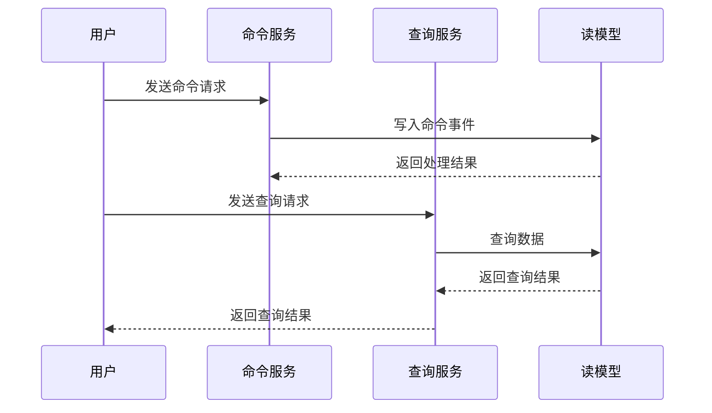

                 

### 文章标题

《CQRS模式：命令查询职责分离的架构模式》

### 关键词

CQRS模式、架构设计、命令查询分离、系统性能、分布式系统、微服务架构、实时查询、数据处理

### 摘要

本文将深入探讨CQRS模式，一种基于命令查询职责分离的架构模式。首先，我们将回顾CQRS模式的发展历程和基本概念，接着详细解释其核心原理和与传统的区别。随后，我们将展示CQRS模式在Web应用、分布式系统和微服务架构中的应用，并分析其优缺点及适用场景。通过实战案例解析，我们将进一步阐述CQRS模式的具体实现和效果。最后，本文将对CQRS模式的未来发展趋势进行展望，并总结最佳实践和注意事项。

## 引言与概述

### 1.1 CQRS模式的发展历程

CQRS（Command Query Responsibility Segregation）模式最初由读我思维（Read Model）之父Greg Young在2005年提出。它是一种针对传统关系型数据库架构的改进模式，旨在解决在复杂系统中查询和操作数据的性能问题。随着微服务架构的流行和分布式系统的广泛应用，CQRS模式逐渐被开发者们认可并应用于实际项目中。

CQRS模式的发展历程可以分为以下几个阶段：

1. **概念提出阶段（2005年）**：Greg Young首次提出了CQRS模式，并详细阐述了其原理和优势。
2. **理论完善阶段（2008年-2012年）**：在这一阶段，CQRS模式的理论逐渐完善，许多研究者和实践者对其进行了深入研究和探讨。
3. **应用实践阶段（2012年至今）**：随着云计算和大数据技术的兴起，CQRS模式在各个领域得到了广泛应用，成为了一种主流的架构设计模式。

### 1.2 CQRS模式的基本概念

CQRS模式的核心概念是命令查询职责分离。具体来说，CQRS模式将系统的数据操作分为两个独立的层面：命令层和查询层。

- **命令层（Command）**：负责处理数据的创建、更新和删除等操作。命令层通常使用无状态、独立的存储服务，以保证操作的高性能和可扩展性。
- **查询层（Query）**：负责处理数据的查询操作。查询层通常使用专门设计的读模型（Read Model），以保证查询的高性能和一致性。

CQRS模式通过将命令和查询分离，实现了以下目标：

1. **提高系统性能**：命令和查询分离后，可以独立优化各自的操作，从而提高系统的整体性能。
2. **提升系统可维护性**：命令和查询分离后，系统的各个模块可以独立开发、测试和维护，提高了系统的可维护性。

### 1.3 CQRS模式在架构设计中的重要性

CQRS模式在架构设计中的重要性体现在以下几个方面：

1. **性能优化**：通过将命令和查询分离，CQRS模式可以针对不同的操作类型进行独立优化，从而提高系统的性能。
2. **可扩展性**：CQRS模式支持无状态、独立的命令和查询服务，便于系统进行水平扩展。
3. **一致性保障**：CQRS模式通过使用事件溯源（Event Sourcing）和CQRS合并（CQRS Merging）等技术，保证了系统的一致性。
4. **灵活性**：CQRS模式可以根据实际需求灵活调整命令和查询的操作方式，满足多样化的业务需求。

总之，CQRS模式为复杂系统的架构设计提供了一种有效的方法，有助于提升系统性能、可维护性和灵活性。

## CQRS模式的基础理论

### 2.1 命令查询职责分离的原则

命令查询职责分离是CQRS模式的核心原则，其本质是将系统的数据处理操作分为两个独立的职责：命令和查询。

1. **命令层原则**：
   - **无状态性**：命令层的服务通常是无状态的，这意味着每个命令请求都可以独立处理，不需要依赖之前的请求状态。
   - **独立存储**：命令层通常使用独立的存储服务，以保证命令操作的高性能和可扩展性。这种存储服务可以是关系型数据库、文档数据库或其他类型的数据库。
   - **幂等性**：命令操作应该是幂等的，即多次执行同一命令的结果应该一致，不会导致数据不一致的问题。

2. **查询层原则**：
   - **高性能查询**：查询层的服务主要关注数据的高效查询。为此，查询层通常会使用专门设计的读模型，这些读模型可以根据查询需求进行定制化设计，以实现高性能的查询操作。
   - **一致性保障**：查询层需要确保查询结果的一致性。在CQRS模式中，通常通过事件溯源和CQRS合并等技术来实现一致性保障。

### 2.2 CQRS模式的核心原理

CQRS模式的核心原理在于将系统的数据操作分为命令和查询两个独立的层面，并在这两个层面之间保持松耦合。

1. **命令查询分离**：CQRS模式通过将命令和查询分离，实现了数据操作的高效、独立和灵活。命令层负责处理数据的创建、更新和删除等操作，而查询层则负责处理数据的高效查询。这种分离不仅提高了系统的性能，还增强了系统的可维护性和扩展性。

2. **读模型设计**：在CQRS模式中，查询层使用专门设计的读模型来存储和查询数据。这些读模型可以根据查询需求进行定制化设计，以实现高性能的查询操作。例如，可以设计一个用于快速查询用户订单的读模型，或者一个用于统计网站流量的读模型。

3. **事件溯源**：事件溯源是一种数据一致性保障技术，它将系统中的所有状态变更记录为一系列的事件。这些事件可以被持久化存储，并在需要时重新播放，以重建系统状态。通过事件溯源，CQRS模式可以确保系统的一致性和可恢复性。

4. **CQRS合并**：CQRS合并是一种在命令层和查询层之间同步数据的技术。当命令层更新数据时，会生成相应的事件，这些事件会被传递到查询层，并触发查询层的更新。通过CQRS合并，可以确保查询层的数据与命令层的数据保持一致。

### 2.3 CQRS模式与传统模式的区别

CQRS模式与传统的关系型数据库架构存在显著的区别：

1. **数据操作分离**：在传统模式中，数据操作通常是在同一层进行的，即数据的创建、更新、删除和查询都是在同一个数据库中完成的。而在CQRS模式中，命令和查询是分离的，命令层负责数据的操作，查询层负责数据的高效查询。

2. **数据存储结构**：在传统模式中，数据通常按照实体关系模型存储在关系型数据库中。而在CQRS模式中，命令层和查询层可能使用不同的数据存储结构。例如，命令层可能使用事件溯源模型存储数据，而查询层可能使用文档数据库或图数据库来存储读模型。

3. **性能优化**：在传统模式中，数据操作通常是顺序执行的，这可能导致性能瓶颈。而在CQRS模式中，命令和查询是分离的，可以独立进行优化，从而提高系统的性能。

4. **一致性保障**：在传统模式中，数据的一致性通常是通过事务来保障的。而在CQRS模式中，数据的一致性是通过事件溯源和CQRS合并等机制来保障的，这些机制提供了更强的数据一致性和可恢复性。

通过上述区别，我们可以看出CQRS模式在系统设计方面具有显著的优势，特别是在处理复杂查询和提升系统性能方面。

## CQRS模式的核心概念与联系

### 3.1 命令模式与查询模式的关系

在CQRS模式中，命令模式（Command Pattern）和查询模式（Query Pattern）是两个核心概念，它们共同构成了CQRS模式的核心架构。

**命令模式**：

命令模式是指系统中的操作指令，负责数据的创建、更新和删除等操作。命令模式的特点是无状态性和独立性。无状态性意味着每个命令请求都可以独立处理，不需要依赖之前的请求状态；独立性意味着命令层的服务可以独立于其他层运行，从而提高系统的性能和可扩展性。

在CQRS模式中，命令模式通常由以下几个组成部分：

1. **命令对象**：命令对象是命令模式的主体，它封装了具体的操作指令，如创建订单、更新用户信息等。
2. **命令处理器**：命令处理器是负责处理命令对象的服务，它会根据命令对象的要求执行相应的操作。
3. **命令队列**：命令队列是用于暂存命令对象的数据结构，它可以确保命令对象按照一定的顺序进行处理。

**查询模式**：

查询模式是指系统中的数据查询操作，负责提供数据的高效查询。查询模式的特点是高性能和定制化。高性能意味着查询操作可以快速响应，定制化意味着查询模式可以根据不同的查询需求进行优化设计。

在CQRS模式中，查询模式通常由以下几个组成部分：

1. **查询对象**：查询对象是查询模式的主体，它封装了具体的查询请求，如获取用户订单列表、统计网站流量等。
2. **查询处理器**：查询处理器是负责处理查询对象的服务，它会根据查询对象的要求执行相应的查询操作。
3. **读模型**：读模型是用于存储和查询数据的数据结构，它可以根据查询需求进行定制化设计，以实现高性能的查询操作。

**命令模式与查询模式的关系**：

命令模式与查询模式在CQRS模式中是紧密联系的，它们共同构成了CQRS模式的核心架构。

1. **数据一致性**：命令模式负责数据的创建、更新和删除操作，这些操作会生成一系列的事件。查询模式负责根据这些事件重建数据的状态，从而确保数据的一致性。
2. **数据查询**：查询模式负责提供数据的高效查询，这些查询操作依赖于命令模式生成的事件数据。通过命令模式与查询模式的协同工作，系统可以实现高效的数据操作和查询。

通过命令模式与查询模式的紧密联系，CQRS模式实现了数据操作与查询的分离，从而提高了系统的性能和可扩展性。

### 3.2 CQRS模式的Mermaid流程图

为了更直观地展示CQRS模式的架构和工作流程，我们可以使用Mermaid流程图来描述。以下是一个简单的CQRS模式的Mermaid流程图：

**Mermaid流程图的详细解释**：

1. **用户发送命令请求**：用户向命令服务发送命令请求，例如创建订单、更新用户信息等。
2. **命令服务写入命令事件**：命令服务将用户发送的命令请求转换为命令事件，并将其写入读模型中。读模型是一个专门用于存储和查询数据的数据结构，它可以是一个数据库表、文档、图等。
3. **命令服务返回处理结果**：命令服务将处理结果返回给用户，例如订单创建成功、用户信息更新成功等。
4. **用户发送查询请求**：用户向查询服务发送查询请求，例如查询订单列表、查询用户信息等。
5. **查询服务查询数据**：查询服务从读模型中查询数据，并将查询结果返回给用户。
6. **查询服务返回查询结果**：查询服务将查询结果返回给用户，例如订单列表、用户信息等。

通过这个Mermaid流程图，我们可以清晰地看到CQRS模式中命令和查询的分离，以及它们之间的数据一致性保障。

### 3.3 CQRS模式中的核心术语

在CQRS模式中，有一些核心术语和概念，理解这些术语有助于我们更好地掌握CQRS模式的核心原理和实际应用。以下是一些常见的核心术语及其含义：

1. **命令（Command）**：命令是系统中的操作指令，负责数据的创建、更新和删除等操作。命令是无状态的和独立的，每个命令请求都可以独立处理，不需要依赖之前的请求状态。

2. **查询（Query）**：查询是系统中的数据查询请求，负责提供数据的高效查询。查询是定制的，可以根据不同的查询需求进行优化设计。

3. **命令模式（Command Pattern）**：命令模式是一种设计模式，用于封装系统的操作指令。命令模式的特点是无状态性和独立性，适用于CQRS模式中的命令层。

4. **查询模式（Query Pattern）**：查询模式是一种设计模式，用于封装系统的数据查询请求。查询模式的特点是高性能和定制化，适用于CQRS模式中的查询层。

5. **读模型（Read Model）**：读模型是CQRS模式中的核心概念，用于存储和查询数据。读模型可以根据查询需求进行定制化设计，以实现高性能的查询操作。

6. **事件溯源（Event Sourcing）**：事件溯源是一种数据一致性保障技术，将系统中的所有状态变更记录为一系列的事件。这些事件可以被持久化存储，并在需要时重新播放，以重建系统状态。

7. **CQRS合并（CQRS Merging）**：CQRS合并是一种在命令层和查询层之间同步数据的技术。当命令层更新数据时，会生成相应的事件，这些事件会被传递到查询层，并触发查询层的更新。

通过理解这些核心术语，我们可以更好地掌握CQRS模式的核心原理和实际应用，从而在实际项目中有效地设计和实现CQRS模式。

## CQRS模式在系统设计中的应用

### 4.1 CQRS模式在Web应用中的实践

CQRS模式在Web应用中有着广泛的应用，尤其是在处理高并发、大数据量的场景下。下面，我们将通过一个电商平台的案例，详细讲解CQRS模式在Web应用中的具体实践。

**背景**：

一个电商平台需要处理大量的用户订单、商品信息等数据。随着用户数量的增加和业务的发展，系统需要具备高性能、高可扩展性和高可用性。

**CQRS模式在电商平台中的应用**：

1. **命令层**：
   - **命令对象**：电商平台中的命令对象包括创建订单、更新订单、取消订单等。每个命令对象都封装了具体的操作指令，如创建订单的命令对象包含用户ID、商品ID、数量等信息。
   - **命令处理器**：命令处理器负责接收并处理命令对象。当接收到创建订单的命令对象时，命令处理器会执行相应的操作，如添加订单到数据库，并生成订单创建事件。
   - **命令队列**：为了确保命令处理的高性能和可扩展性，电商平台通常会使用命令队列来暂存命令对象。命令队列可以是一个消息队列，如RabbitMQ或Kafka，以确保命令对象按照一定的顺序进行处理。

2. **查询层**：
   - **查询对象**：电商平台中的查询对象包括查询订单列表、查询特定订单等。查询对象封装了具体的查询请求，如查询订单列表的查询对象可能包含用户ID、订单状态等信息。
   - **查询处理器**：查询处理器负责处理查询对象，并从读模型中查询数据。读模型是专门设计的用于高效查询的数据结构，如订单读模型包含订单ID、用户ID、商品ID、数量等信息。
   - **读模型**：电商平台会为每个查询对象设计一个读模型，以实现高效查询。例如，订单读模型可以是一个文档数据库表，用于快速查询订单信息。

**CQRS模式的优势**：

1. **性能优化**：通过将命令和查询分离，电商平台可以针对不同的操作类型进行独立优化。例如，命令层可以使用事件溯源技术，提高写操作的性能；查询层可以使用缓存技术，提高读操作的性能。

2. **可扩展性**：CQRS模式支持无状态、独立的命令和查询服务，使得系统可以水平扩展。例如，电商平台可以独立扩展命令层和查询层的服务器集群，以应对业务增长。

3. **一致性保障**：通过事件溯源和CQRS合并技术，电商平台可以确保命令层和查询层的数据一致性。当命令层更新数据时，会生成相应的事件，这些事件会被传递到查询层，并触发查询层的更新。

4. **灵活性**：CQRS模式可以根据实际需求灵活调整命令和查询的操作方式。例如，可以根据不同的业务场景，设计不同的命令对象和查询对象，以满足多样化的业务需求。

总之，通过CQRS模式的应用，电商平台可以显著提升系统的性能、可扩展性和灵活性，从而更好地应对业务增长和用户需求。

### 4.2 CQRS模式在分布式系统中的应用

CQRS模式在分布式系统中的应用尤为重要，尤其是在高并发、大数据量的场景下。通过将命令和查询分离，分布式系统可以更好地处理复杂的数据操作，提高系统的性能和可扩展性。

**背景**：

一个分布式系统需要处理大量的用户请求和数据，这些请求和数据分布在不同的节点上。分布式系统需要具备高性能、高可扩展性和高可用性。

**CQRS模式在分布式系统中的应用**：

1. **命令层**：
   - **命令对象**：分布式系统中的命令对象包括创建用户、更新用户、删除用户等。每个命令对象都封装了具体的操作指令，如创建用户的命令对象包含用户名、密码、邮箱等信息。
   - **命令处理器**：命令处理器负责接收并处理命令对象。为了确保命令处理的高性能和可扩展性，分布式系统通常会使用分布式消息队列，如RabbitMQ或Kafka，将命令对象发送到不同的节点进行并行处理。
   - **命令队列**：命令队列用于暂存命令对象，确保命令对象按照一定的顺序进行处理。命令队列可以是分布式消息队列或分布式队列，如RabbitMQ或Redis Queue。

2. **查询层**：
   - **查询对象**：分布式系统中的查询对象包括查询用户列表、查询特定用户等。查询对象封装了具体的查询请求，如查询用户列表的查询对象可能包含用户ID、用户名、邮箱等信息。
   - **查询处理器**：查询处理器负责处理查询对象，并从读模型中查询数据。为了提高查询的性能，分布式系统通常会使用分布式缓存，如Redis或Memcached，缓存查询结果。
   - **读模型**：分布式系统会为每个查询对象设计一个读模型，以实现高效查询。读模型可以是分布式数据库，如Cassandra或MongoDB，也可以是分布式缓存，如Redis或Memcached。

**CQRS模式的优势**：

1. **性能优化**：通过将命令和查询分离，分布式系统可以针对不同的操作类型进行独立优化。例如，命令层可以使用分布式消息队列，提高写操作的性能；查询层可以使用分布式缓存，提高读操作的性能。

2. **可扩展性**：CQRS模式支持无状态、独立的命令和查询服务，使得系统可以水平扩展。例如，分布式系统可以独立扩展命令层和查询层的服务器集群，以应对业务增长。

3. **一致性保障**：通过事件溯源和CQRS合并技术，分布式系统可以确保命令层和查询层的数据一致性。当命令层更新数据时，会生成相应的事件，这些事件会被传递到查询层，并触发查询层的更新。

4. **灵活性**：CQRS模式可以根据实际需求灵活调整命令和查询的操作方式。例如，可以根据不同的业务场景，设计不同的命令对象和查询对象，以满足多样化的业务需求。

总之，通过CQRS模式在分布式系统中的应用，分布式系统可以显著提升系统的性能、可扩展性和灵活性，从而更好地应对业务增长和用户需求。

### 4.3 CQRS模式在微服务架构中的实现

在微服务架构中，CQRS模式可以有效地解决数据一致性和性能优化的问题。微服务架构的特点是将系统拆分为多个独立的、可扩展的服务，每个服务负责处理特定的业务功能。通过CQRS模式，微服务架构可以更好地应对高并发、大数据量的场景。

**背景**：

一个电商平台采用微服务架构，将订单管理、用户管理、商品管理等功能拆分为独立的微服务。随着业务的发展，系统需要具备高性能、高可扩展性和高可用性。

**CQRS模式在微服务架构中的实现**：

1. **命令层**：
   - **命令对象**：每个微服务都有自己的命令对象，如订单微服务的命令对象包括创建订单、更新订单、取消订单等。
   - **命令处理器**：命令处理器负责接收并处理命令对象。由于微服务之间的通信是通过API进行的，命令处理器通常是一个API网关，它负责将命令对象路由到相应的微服务进行处理。
   - **事件溯源**：每个微服务都会将命令操作转换为事件，并将事件存储在分布式事件存储中，如Kafka或Event Store。事件溯源可以确保命令层和查询层的数据一致性。

2. **查询层**：
   - **查询对象**：每个微服务都有自己的查询对象，如订单微服务的查询对象包括查询订单列表、查询特定订单等。
   - **查询处理器**：查询处理器负责处理查询对象，并从读模型中查询数据。为了提高查询的性能，微服务通常会使用分布式缓存，如Redis或Memcached。
   - **读模型**：每个微服务都会为每个查询对象设计一个读模型，以实现高效查询。例如，订单微服务可能会使用一个基于MongoDB的订单读模型，用于快速查询订单信息。

**CQRS模式的优势**：

1. **数据一致性**：通过事件溯源技术，CQRS模式可以确保命令层和查询层的数据一致性。当命令层更新数据时，会生成相应的事件，这些事件会被传递到查询层，并触发查询层的更新。

2. **性能优化**：通过将命令和查询分离，微服务可以独立优化各自的操作。例如，命令层可以使用事件溯源，提高写操作的性能；查询层可以使用分布式缓存，提高读操作的性能。

3. **高可扩展性**：CQRS模式支持无状态、独立的命令和查询服务，使得微服务架构可以水平扩展。例如，可以独立扩展命令层和查询层的服务器集群，以应对业务增长。

4. **灵活性**：CQRS模式可以根据实际需求灵活调整命令和查询的操作方式。例如，可以根据不同的业务场景，设计不同的命令对象和查询对象，以满足多样化的业务需求。

总之，通过CQRS模式在微服务架构中的实现，电商平台可以显著提升系统的性能、可扩展性和灵活性，从而更好地应对业务增长和用户需求。

## CQRS模式的优缺点与适用场景

### 5.1 CQRS模式的优点

CQRS模式在系统设计中具有许多优点，使其成为处理复杂业务场景的一种有效方法。

1. **性能优化**：通过将命令和查询分离，CQRS模式可以独立优化命令和查询操作。例如，命令层可以使用事件溯源技术提高写操作的性能，查询层可以使用缓存技术提高读操作的性能。

2. **数据一致性**：CQRS模式通过事件溯源和CQRS合并技术，确保了命令层和查询层的数据一致性。这避免了传统架构中由于查询和操作分离导致的数据不一致问题。

3. **高可扩展性**：CQRS模式支持无状态、独立的命令和查询服务，使得系统可以水平扩展。这意味着在业务增长时，可以独立扩展命令层和查询层，提高了系统的可扩展性。

4. **灵活性**：CQRS模式可以根据实际需求灵活调整命令和查询的操作方式。例如，可以根据不同的业务场景，设计不同的命令对象和查询对象，以满足多样化的业务需求。

### 5.2 CQRS模式的缺点

尽管CQRS模式具有许多优点，但也存在一些缺点。

1. **复杂性**：CQRS模式引入了额外的复杂性，包括事件溯源、CQRS合并等概念。这可能导致系统设计和维护的难度增加。

2. **性能开销**：CQRS模式中的事件溯源和CQRS合并可能引入一定的性能开销，尤其是在高并发、大数据量的场景下。

3. **适用性限制**：CQRS模式并非适用于所有场景。在某些情况下，如简单的业务场景或低并发场景，使用CQRS模式可能并不是最佳选择。

### 5.3 CQRS模式的适用场景

CQRS模式适用于以下场景：

1. **高并发、大数据量场景**：CQRS模式通过分离命令和查询，可以独立优化操作性能，提高系统的整体性能。

2. **复杂业务场景**：CQRS模式可以灵活调整命令和查询的操作方式，满足复杂业务需求。

3. **需要数据一致性的场景**：CQRS模式通过事件溯源和CQRS合并技术，确保了命令层和查询层的数据一致性，适用于需要强一致性保障的场景。

4. **需要水平扩展的场景**：CQRS模式支持无状态、独立的命令和查询服务，使得系统可以水平扩展，适用于需要高可扩展性的场景。

总之，CQRS模式在系统设计中具有显著的优势，但在选择是否使用CQRS模式时，需要综合考虑业务场景和系统需求。

## 实战案例解析

### 6.1 案例一：电商平台的数据处理

一个大型电商平台在数据处理方面面临着巨大的挑战，需要处理海量订单、用户信息和商品信息等数据。为了提高系统的性能和可扩展性，该电商平台采用了CQRS模式进行架构设计。

**背景**：

电商平台每天要处理数百万甚至数千万的订单，同时需要实时响应用户的查询请求，如查询订单状态、商品库存等。系统需要具备高性能、高可扩展性和高可用性。

**CQRS模式在电商平台中的应用**：

1. **命令层**：
   - **命令对象**：电商平台中的命令对象包括创建订单、更新订单、取消订单等。每个命令对象都封装了具体的操作指令，如创建订单的命令对象包含用户ID、商品ID、数量等信息。
   - **命令处理器**：命令处理器负责接收并处理命令对象。由于订单处理是一个高并发、大数据量的场景，电商平台使用消息队列（如Kafka）将命令对象发送到不同的处理节点，以确保命令处理的高性能和可扩展性。
   - **命令队列**：命令队列用于暂存命令对象，确保命令对象按照一定的顺序进行处理。命令队列可以是分布式消息队列或分布式队列（如RabbitMQ或Redis Queue）。

2. **查询层**：
   - **查询对象**：电商平台中的查询对象包括查询订单列表、查询特定订单、查询商品库存等。查询对象封装了具体的查询请求，如查询订单列表的查询对象可能包含用户ID、订单状态等信息。
   - **查询处理器**：查询处理器负责处理查询对象，并从读模型中查询数据。为了提高查询的性能，电商平台使用分布式缓存（如Redis或Memcached），缓存查询结果。
   - **读模型**：电商平台为每个查询对象设计了一个读模型，以实现高效查询。例如，订单读模型可以是一个文档数据库表（如MongoDB），用于快速查询订单信息。

**CQRS模式的优势**：

1. **性能优化**：通过将命令和查询分离，电商平台可以独立优化命令和查询操作。例如，命令层可以使用事件溯源技术提高写操作的性能，查询层可以使用缓存技术提高读操作的性能。

2. **数据一致性**：通过事件溯源和CQRS合并技术，电商平台可以确保命令层和查询层的数据一致性。当命令层更新数据时，会生成相应的事件，这些事件会被传递到查询层，并触发查询层的更新。

3. **高可扩展性**：CQRS模式支持无状态、独立的命令和查询服务，使得电商平台可以水平扩展。例如，可以独立扩展命令层和查询层的服务器集群，以应对业务增长。

4. **灵活性**：CQRS模式可以根据实际需求灵活调整命令和查询的操作方式。例如，可以根据不同的业务场景，设计不同的命令对象和查询对象，以满足多样化的业务需求。

**案例分析**：

电商平台在采用CQRS模式后，订单处理速度显著提升，查询响应时间也大幅缩短。同时，系统在业务增长时表现出良好的可扩展性，可以轻松应对高并发、大数据量的场景。通过事件溯源和CQRS合并技术，电商平台确保了数据的一致性，避免了传统架构中由于查询和操作分离导致的数据不一致问题。

### 6.2 案例二：社交媒体平台的实时查询

一个大型社交媒体平台在实时查询方面面临着巨大的挑战，需要实时响应用户的点赞、评论、分享等操作。为了提高系统的性能和可扩展性，该社交媒体平台采用了CQRS模式进行架构设计。

**背景**：

社交媒体平台每天要处理数百万甚至数千万的用户操作，同时需要实时响应用户的查询请求，如查询用户动态、查询好友列表等。系统需要具备高性能、高可扩展性和高可用性。

**CQRS模式在社交媒体平台中的应用**：

1. **命令层**：
   - **命令对象**：社交媒体平台中的命令对象包括创建动态、点赞、评论、分享等。每个命令对象都封装了具体的操作指令，如创建动态的命令对象包含用户ID、动态内容等信息。
   - **命令处理器**：命令处理器负责接收并处理命令对象。由于用户操作是一个高并发、大数据量的场景，社交媒体平台使用消息队列（如Kafka）将命令对象发送到不同的处理节点，以确保命令处理的高性能和可扩展性。
   - **命令队列**：命令队列用于暂存命令对象，确保命令对象按照一定的顺序进行处理。命令队列可以是分布式消息队列或分布式队列（如RabbitMQ或Redis Queue）。

2. **查询层**：
   - **查询对象**：社交媒体平台中的查询对象包括查询用户动态、查询好友列表、查询热门话题等。查询对象封装了具体的查询请求，如查询用户动态的查询对象可能包含用户ID、动态状态等信息。
   - **查询处理器**：查询处理器负责处理查询对象，并从读模型中查询数据。为了提高查询的性能，社交媒体平台使用分布式缓存（如Redis或Memcached），缓存查询结果。
   - **读模型**：社交媒体平台为每个查询对象设计了一个读模型，以实现高效查询。例如，用户动态读模型可以是一个文档数据库表（如MongoDB），用于快速查询用户动态信息。

**CQRS模式的优势**：

1. **性能优化**：通过将命令和查询分离，社交媒体平台可以独立优化命令和查询操作。例如，命令层可以使用事件溯源技术提高写操作的性能，查询层可以使用缓存技术提高读操作的性能。

2. **数据一致性**：通过事件溯源和CQRS合并技术，社交媒体平台可以确保命令层和查询层的数据一致性。当命令层更新数据时，会生成相应的事件，这些事件会被传递到查询层，并触发查询层的更新。

3. **高可扩展性**：CQRS模式支持无状态、独立的命令和查询服务，使得社交媒体平台可以水平扩展。例如，可以独立扩展命令层和查询层的服务器集群，以应对业务增长。

4. **灵活性**：CQRS模式可以根据实际需求灵活调整命令和查询的操作方式。例如，可以根据不同的业务场景，设计不同的命令对象和查询对象，以满足多样化的业务需求。

**案例分析**：

社交媒体平台在采用CQRS模式后，用户操作的响应速度显著提升，查询响应时间也大幅缩短。同时，系统在业务增长时表现出良好的可扩展性，可以轻松应对高并发、大数据量的场景。通过事件溯源和CQRS合并技术，社交媒体平台确保了数据的一致性，避免了传统架构中由于查询和操作分离导致的数据不一致问题。

### 6.3 案例三：物联网系统的数据处理

一个物联网系统需要处理大量的传感器数据，实时分析并响应设备的状态变化。为了提高系统的性能和可扩展性，该物联网系统采用了CQRS模式进行架构设计。

**背景**：

物联网系统每天要处理数百万甚至数千万的传感器数据，同时需要实时分析设备的状态变化，并触发相应的操作。系统需要具备高性能、高可扩展性和高可用性。

**CQRS模式在物联网系统中的应用**：

1. **命令层**：
   - **命令对象**：物联网系统中的命令对象包括创建传感器数据、更新传感器数据、删除传感器数据等。每个命令对象都封装了具体的操作指令，如创建传感器数据的命令对象包含设备ID、传感器值等信息。
   - **命令处理器**：命令处理器负责接收并处理命令对象。由于传感器数据处理是一个高并发、大数据量的场景，物联网系统使用消息队列（如Kafka）将命令对象发送到不同的处理节点，以确保命令处理的高性能和可扩展性。
   - **命令队列**：命令队列用于暂存命令对象，确保命令对象按照一定的顺序进行处理。命令队列可以是分布式消息队列或分布式队列（如RabbitMQ或Redis Queue）。

2. **查询层**：
   - **查询对象**：物联网系统中的查询对象包括查询传感器数据、查询设备状态等。查询对象封装了具体的查询请求，如查询传感器数据的查询对象可能包含设备ID、时间范围等信息。
   - **查询处理器**：查询处理器负责处理查询对象，并从读模型中查询数据。为了提高查询的性能，物联网系统使用分布式缓存（如Redis或Memcached），缓存查询结果。
   - **读模型**：物联网系统为每个查询对象设计了一个读模型，以实现高效查询。例如，传感器数据读模型可以是一个文档数据库表（如MongoDB），用于快速查询传感器数据。

**CQRS模式的优势**：

1. **性能优化**：通过将命令和查询分离，物联网系统可以独立优化命令和查询操作。例如，命令层可以使用事件溯源技术提高写操作的性能，查询层可以使用缓存技术提高读操作的性能。

2. **数据一致性**：通过事件溯源和CQRS合并技术，物联网系统可以确保命令层和查询层的数据一致性。当命令层更新数据时，会生成相应的事件，这些事件会被传递到查询层，并触发查询层的更新。

3. **高可扩展性**：CQRS模式支持无状态、独立的命令和查询服务，使得物联网系统可以水平扩展。例如，可以独立扩展命令层和查询层的服务器集群，以应对业务增长。

4. **灵活性**：CQRS模式可以根据实际需求灵活调整命令和查询的操作方式。例如，可以根据不同的业务场景，设计不同的命令对象和查询对象，以满足多样化的业务需求。

**案例分析**：

物联网系统在采用CQRS模式后，传感器数据的处理速度显著提升，查询响应时间也大幅缩短。同时，系统在业务增长时表现出良好的可扩展性，可以轻松应对高并发、大数据量的场景。通过事件溯源和CQRS合并技术，物联网系统确保了数据的一致性，避免了传统架构中由于查询和操作分离导致的数据不一致问题。

## 结论与展望

CQRS模式作为一种基于命令查询职责分离的架构模式，在系统设计中展现出了显著的优势。通过将命令和查询分离，CQRS模式能够有效提高系统的性能、可扩展性和一致性。在实际应用中，CQRS模式已经被广泛应用于电商平台、社交媒体平台和物联网系统等领域，并取得了良好的效果。

### 7.1 CQRS模式的未来发展趋势

展望未来，CQRS模式的发展趋势将主要集中在以下几个方面：

1. **云计算和大数据技术的融合**：随着云计算和大数据技术的不断发展，CQRS模式将更好地与这些技术相结合，实现更高效、更智能的数据处理和分析。

2. **边缘计算的应用**：边缘计算将数据处理的任务从中心服务器转移到更靠近数据源的边缘设备，CQRS模式将在边缘计算环境中发挥重要作用，提高数据处理的实时性和效率。

3. **人工智能和机器学习的集成**：结合人工智能和机器学习技术，CQRS模式可以进一步提升系统的智能化水平，实现更精准的数据预测和决策。

4. **标准化和生态系统的完善**：随着CQRS模式的普及，相关标准和工具将不断涌现，形成完善的生态系统，进一步降低开发和使用CQRS模式的门槛。

### 7.2 CQRS模式在行业中的应用前景

在各个行业中，CQRS模式具有广泛的应用前景：

1. **金融行业**：金融行业中的高频交易、风险管理等场景可以受益于CQRS模式，实现更高效、更精准的数据处理和决策。

2. **零售行业**：零售行业中的订单处理、库存管理、用户行为分析等场景可以借助CQRS模式，提升系统的性能和用户体验。

3. **医疗行业**：医疗行业中的电子病历、医疗数据分析、远程医疗等场景可以利用CQRS模式，提高数据处理的效率和准确性。

4. **交通行业**：交通行业中的智能交通管理、车辆调度、实时监控等场景可以借助CQRS模式，实现更智能、更高效的管理和调度。

总之，CQRS模式作为一种有效的系统架构设计模式，将在未来继续发挥重要作用，推动各个行业的数字化和智能化进程。

## 附录

### A.1 CQRS模式相关的工具与资源

为了更好地理解和应用CQRS模式，以下是一些相关的工具和资源：

1. **书籍**：
   - 《CQRS in Action》（CQRS实战指南）
   - 《Command Query Responsibility Segregation》（命令查询职责分离）

2. **在线课程**：
   - Pluralsight的《CQRS模式：设计与实现》
   - Udemy的《CQRS模式：实战微服务架构》

3. **开源框架**：
   - EventFlow：一个用于构建CQRS模式的.NET框架
   - Axon Framework：一个用于构建事件驱动的微服务的框架

4. **社区和论坛**：
   - Stack Overflow：CQRS相关的问题和解决方案
   - Reddit：r/SoftwareArchitecture社区中的CQRS讨论

### A.2 CQRS模式的学习建议与实战经验

对于想要学习CQRS模式的开发者，以下是一些建议和实战经验：

1. **基础知识**：首先，掌握基本的软件开发和数据库知识，了解关系型数据库、NoSQL数据库、消息队列等基本概念。

2. **阅读资料**：阅读相关的书籍、课程和文档，深入了解CQRS模式的理论和实践。

3. **动手实践**：通过实际项目来应用CQRS模式，逐步掌握其设计和实现方法。可以从简单的场景开始，例如一个简单的电商系统，然后逐步扩展到更复杂的场景。

4. **案例学习**：研究成功应用的案例，分析其优点和不足，学习如何在实际项目中应用CQRS模式。

5. **持续学习**：CQRS模式是一个不断发展的领域，开发者需要持续学习最新的技术和趋势，以便在实践中不断改进和优化。

通过以上建议和实战经验，开发者可以更好地掌握CQRS模式，并将其应用于实际项目中，提升系统的性能和可扩展性。

