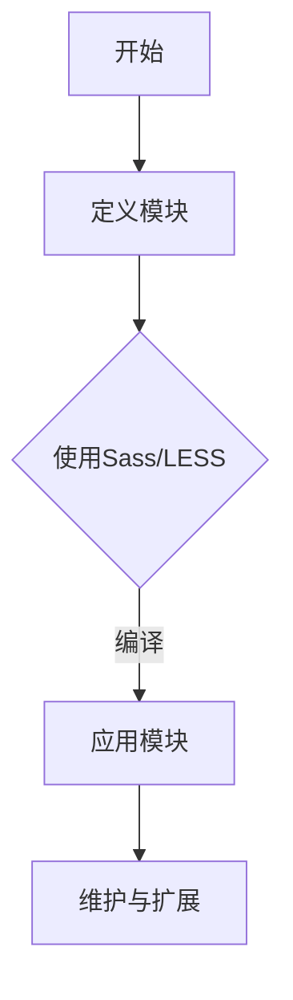
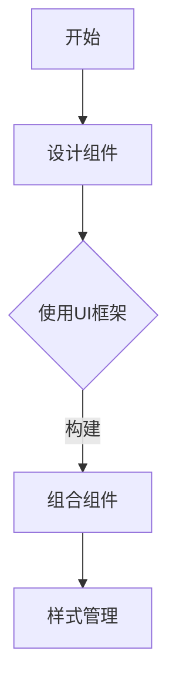
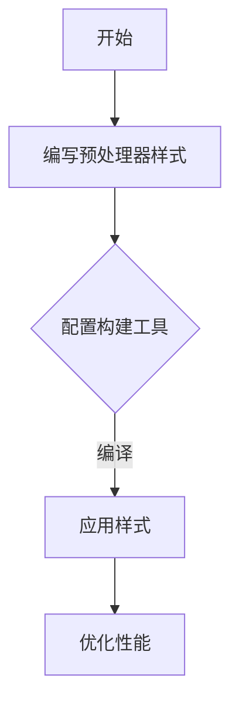
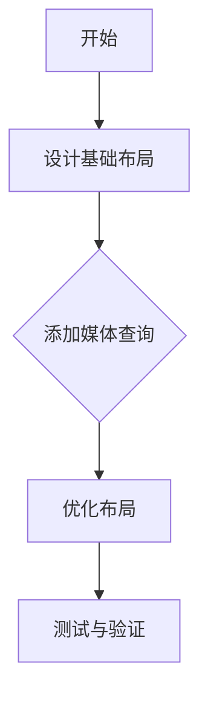

                 

## CSS架构：大规模样式管理策略

### 关键词
- CSS架构
- 样式管理
- 模块化
- 预处理器
- 组件化
- 响应式设计

### 摘要
本文将深入探讨CSS架构在应对大规模样式管理时的策略。从模块化和组件化的角度出发，结合预处理器和响应式设计，我们将一步步分析并解释如何构建高效的CSS架构。通过引入Mermaid流程图和伪代码，本文旨在为开发者提供清晰的理解和实用的方法，以应对复杂的样式管理挑战。

### 引言
在现代网页开发中，CSS（层叠样式表）是不可或缺的一部分。然而，随着项目规模的不断扩大，CSS的管理变得越来越复杂。传统的CSS方法往往会导致样式冗余、难以维护和调试。因此，需要一种更加高效和可扩展的CSS架构来应对这些挑战。本文将介绍一些关键策略，包括模块化、组件化、预处理器和响应式设计，帮助开发者构建大规模的CSS架构。

## 第一章：模块化与CSS架构

### 1.1 背景介绍
模块化设计是一种将复杂的系统分解为更小的、独立的、可重用的模块的方法。在CSS架构中，模块化意味着将样式分为独立的片段，每个片段负责一个特定的功能或页面部分。这种方法有助于提高代码的可维护性和可重用性。

### 1.2 核心概念与联系
- **核心概念**：模块化、Sass、LESS
- **联系**：预处理器允许开发者使用变量、嵌套和混合等功能，从而简化CSS的编写和复用。

### 1.3 Mermaid流程图


### 1.4 核心算法原理讲解
使用Sass的伪代码示例：
```scss
// 定义变量
$primary-color: #3498db;

// 创建模块
.module-hero {
  background-color: $primary-color;
  padding: 20px;
  // ...更多样式
}
```

### 1.5 数学模型和公式
无具体数学模型，但可以使用变量管理样式属性，例如：
$$\text{background-color} = \text{primary-color}$$

### 1.6 举例说明
创建一个响应式导航栏的模块化样式：
```scss
// 变量
$breakpoint: 768px;

// 基础导航样式
.nav {
  display: flex;
  justify-content: space-around;
  // ...更多样式
}

// 响应式调整
@media (max-width: $breakpoint) {
  .nav {
    flex-direction: column;
    // ...更多样式
  }
}
```

### 1.7 最佳实践 tips
- 保持模块的独立性，避免互相依赖。
- 使用命名规范，如BEM（Block Element Modifier）。
- 定期重构和审查模块。

## 第二章：组件化与CSS架构

### 2.1 背景介绍
组件化是现代前端开发的核心概念之一。它将UI界面分解为可重用的组件，每个组件具有独立的功能和样式。组件化使得开发过程更加模块化、可重用和可测试。

### 2.2 核心概念与联系
- **核心概念**：组件化、React、Vue、Angular
- **联系**：组件化CSS通常与UI框架结合使用，例如Bootstrap或Ant Design。

### 2.3 Mermaid流程图


### 2.4 核心算法原理讲解
使用React的伪代码示例：
```jsx
// 创建组件
function NavComponent() {
  return (
    <nav className="nav">
      {/* 组件内容 */}
    </nav>
  );
}

// 应用样式
.nav {
  display: flex;
  justify-content: space-around;
  // ...更多样式
}
```

### 2.5 数学模型和公式
无具体数学模型，但可以使用组件的属性来管理样式，例如：
$$\text{style} = \text{props.style}$$

### 2.6 举例说明
创建一个可重用的按钮组件：
```jsx
// ButtonComponent.jsx
import React from 'react';

const Button = ({ text, onClick }) => {
  return (
    <button className="button" onClick={onClick}>
      {text}
    </button>
  );
};

export default Button;

// Button.module.css
.button {
  background-color: #3498db;
  color: white;
  padding: 10px 20px;
  border: none;
  border-radius: 5px;
  cursor: pointer;
}
```

### 2.7 最佳实践 tips
- 保持组件的单一职责原则。
- 使用CSS-in-JS解决方案，如styled-components。

## 第三章：预处理器与CSS架构

### 3.1 背景介绍
预处理器是CSS的扩展工具，允许开发者使用变量、嵌套和混合等功能，从而提高样式的编写效率和可维护性。常见的预处理器有Sass和LESS。

### 3.2 核心概念与联系
- **核心概念**：预处理器、Sass、LESS
- **联系**：预处理器与构建工具（如Webpack或Gulp）的结合使用。

### 3.3 Mermaid流程图


### 3.4 核心算法原理讲解
使用Sass的伪代码示例：
```scss
// 定义变量
$primary-color: #3498db;

// 创建混合
@mixin flex-center {
  display: flex;
  justify-content: center;
  align-items: center;
}

// 应用混合
.hero {
  @include flex-center;
  background-color: $primary-color;
  // ...更多样式
}
```

### 3.5 数学模型和公式
无具体数学模型，但可以使用预处理器变量简化样式编写，例如：
$$\text{background-color} = \text{primary-color}$$

### 3.6 举例说明
使用Sass创建一个响应式布局：
```scss
// 定义变量
$breakpoint: 768px;

// 基础样式
.container {
  width: 100%;
  padding: 0 20px;
  margin: 0 auto;
}

// 响应式调整
@media (max-width: $breakpoint) {
  .container {
    padding: 0 10px;
  }
}
```

### 3.7 最佳实践 tips
- 使用预处理器变量和混合减少重复代码。
- 定期更新预处理器版本，确保最佳性能。

## 第四章：响应式设计与CSS架构

### 4.1 背景介绍
响应式设计是一种能够适应不同设备尺寸和分辨率的网页设计方法。它确保网页在不同设备上具有一致的用户体验。随着移动设备的普及，响应式设计变得越来越重要。

### 4.2 核心概念与联系
- **核心概念**：响应式设计、媒体查询、断点
- **联系**：响应式设计通常与弹性布局和CSS框架（如Bootstrap或Foundation）结合使用。

### 4.3 Mermaid流程图


### 4.4 核心算法原理讲解
使用媒体查询的伪代码示例：
```css
/* 基础布局 */
.container {
  padding: 20px;
}

/* 小屏幕布局 */
@media (max-width: 768px) {
  .container {
    padding: 10px;
  }
}
```

### 4.5 数学模型和公式
无具体数学模型，但可以使用断点定义布局的响应式点，例如：
$$\text{breakpoint} = 768px$$

### 4.6 举例说明
创建一个简单的响应式网格布局：
```css
/* 基础网格 */
.grid {
  display: flex;
  flex-wrap: wrap;
}

/* 网格项目 */
.grid-item {
  flex: 1 0 200px; /* 自动调整宽度，最小宽度200px */
  padding: 20px;
  margin: 10px;
}
```

### 4.7 最佳实践 tips
- 使用断点定义清晰，确保布局在不同设备上具有一致性。
- 避免过度使用媒体查询，以免代码冗余。

## 第五章：实战项目：构建一个响应式电商网站

### 5.1 背景介绍
在本节中，我们将通过一个实战项目，展示如何将上述CSS架构策略应用于一个响应式电商网站。项目将涵盖开发环境搭建、组件化实现、样式管理以及响应式设计。

### 5.2 开发环境搭建
- **工具**：Webpack、Sass、React
- **配置**：安装Node.js，然后使用以下命令初始化项目：
  ```bash
  npx create-react-app ecommerce-website
  cd ecommerce-website
  npm install sass
  ```

### 5.3 源代码实现
以下是关键的组件和样式实现：
```jsx
// Components/Header.js
import React from 'react';
import './Header.module.css';

const Header = () => {
  return (
    <header className="header">
      {/* 头部内容 */}
    </header>
  );
};

export default Header;

// Components/Header.module.css
.header {
  background-color: #3498db;
  color: white;
  padding: 20px;
}
```

### 5.4 代码解读与分析
- **组件**：`Header` 组件是页面头部部分，包含品牌标识、导航菜单等。
- **样式**：使用Sass模块化样式，确保样式独立且可重用。

### 5.5 实际案例分析和详细讲解剖析
本案例展示了如何将模块化和组件化应用于实际项目，确保代码的可维护性和可扩展性。

### 5.6 项目小结
通过本实战项目，我们了解了如何利用CSS架构策略构建一个响应式电商网站。项目强调了模块化、组件化和响应式设计的重要性，为开发者提供了实际操作的指导和经验。

## 结语
在本文中，我们探讨了CSS架构在应对大规模样式管理时的策略，包括模块化、组件化、预处理器和响应式设计。通过逐步分析每个策略的核心概念、算法原理和最佳实践，我们为开发者提供了一套实用的方法。希望本文能帮助您在开发过程中更好地管理样式，提升代码质量和用户体验。

### 拓展阅读
- 《CSS揭秘》
- 《前端架构：设计与构建大型Web应用》
- 《React小书》

### 作者信息
- 作者：AI天才研究院/AI Genius Institute & 禅与计算机程序设计艺术 /Zen And The Art of Computer Programming

