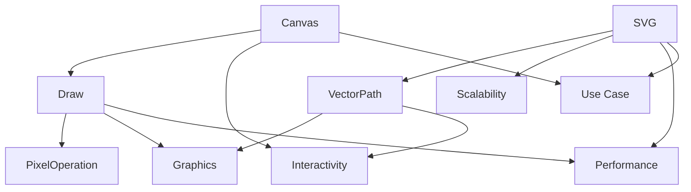

                 

### **1.2 Canvas的工作原理

#### 1.2.1 Canvas的基本概念

Canvas 是 HTML5 中引入的一个用于 2D 图形绘制的 API，它允许开发者使用 JavaScript 在网页上动态生成和操作图形。Canvas 元素本身是一个矩形画布，开发者可以通过 JavaScript 代码来绘制图形、路径、文本、图像等。

#### 1.2.2 Canvas的画布操作

在 Canvas 中，首先需要创建一个画布。这通常通过 HTML 代码中的 `<canvas>` 标签来完成：

```html
<canvas id="myCanvas" width="200" height="100"></canvas>
```

接着，我们需要获取画布上下文（`CanvasRenderingContext2D`），这是通过调用 `getElementById` 方法并使用 `getContext` 函数来获取的：

```javascript
const canvas = document.getElementById('myCanvas');
const ctx = canvas.getContext('2d');
```

#### 1.2.3 Canvas的主要绘图方法

Canvas 提供了多种绘图方法，包括绘制线条、矩形、圆形、弧线、文本等。以下是 Canvas 中一些常用的绘图方法：

- `lineTo(x, y)`：绘制一条从当前点到 `(x, y)` 的直线。
- `stroke()`：使用当前的线条样式绘制图形轮廓。
- `fill()`：使用当前的填充样式填充图形。
- `arc(x, y, radius, startAngle, endAngle)`：绘制一段圆弧。

以下是一个简单的例子，展示了如何使用 Canvas 绘制一个矩形：

```javascript
ctx.fillStyle = 'blue';
ctx.fillRect(10, 10, 100, 50);

ctx.strokeStyle = 'red';
ctx.strokeRect(10, 10, 100, 50);
```

#### 1.2.4 Canvas的图像操作

Canvas 还允许开发者操作图像，包括绘制图像、裁剪图像、旋转图像等。以下是一些常用的图像操作方法：

- `drawImage(image, x, y)`：在画布上绘制图像。
- `clip()`：创建一个裁剪路径，之后的绘制操作只会在裁剪区域内生效。
- `transform()`：应用变换矩阵对画布进行旋转、缩放、倾斜等操作。

以下是一个简单的例子，展示了如何使用 Canvas 绘制和旋转一个图像：

```javascript
const image = new Image();
image.src = 'image.jpg';

image.onload = function() {
  ctx.drawImage(image, 10, 10, 100, 100);

  // 旋转图像
  ctx.translate(150, 150);
  ctx.rotate(Math.PI / 4);
  ctx.drawImage(image, -50, -50, 100, 100);
};
```

### **1.3 SVG的工作原理

#### 1.3.1 SVG的基本概念

SVG（可缩放矢量图形）是一种基于 XML 的矢量图形格式，它可以用来描述二维图形。与 Canvas 不同，SVG 使用矢量路径和标记来绘制图形，这意味着它可以在不同大小的显示设备上缩放而不会失真。

#### 1.3.2 SVG的绘图模型

在 SVG 中，所有的图形元素都是基于矢量路径和标记来定义的。以下是一些常用的 SVG 绘图元素：

- `<line>`：绘制直线。
- `<rect>`：绘制矩形。
- `<circle>`：绘制圆形。
- `<path>`：绘制任意形状的路径。
- `<text>`：在图形中添加文本。

以下是一个简单的 SVG 图形示例：

```xml
<svg width="200" height="100">
  <line x1="0" y1="0" x2="200" y2="100" stroke="black" />
  <rect x="50" y="50" width="100" height="50" fill="blue" />
  <circle cx="100" cy="50" r="25" stroke="red" fill="yellow" />
  <text x="10" y="10" font-family="Arial" font-size="16" fill="green">Hello SVG</text>
</svg>
```

#### 1.3.3 SVG的交互性

SVG 不仅支持绘图，还支持交互性。开发者可以添加事件监听器来响应用户的交互操作，如点击、拖动等。以下是一个简单的例子，展示了如何使用 SVG 实现点击事件：

```xml
<svg width="200" height="100" onclick="alert('SVG clicked!');">
  <circle cx="50" cy="50" r="40" stroke="black" fill="transparent" />
</svg>
```

#### 1.3.4 SVG与Canvas的比较

Canvas 和 SVG 都是用于网页绘图的强大工具，但它们有不同的特点和应用场景。

- **绘图模型**：Canvas 使用像素来绘制图形，而 SVG 使用矢量路径和标记。
- **可缩放性**：SVG 可以无限放大和缩小，而 Canvas 的可缩放性有限。
- **交互性**：SVG 更容易实现交互效果，而 Canvas 在处理复杂图形时可能更高效。
- **性能**：对于简单的绘图操作，Canvas 可能更快，但对于复杂图形和动画，SVG 的性能可能更优。

#### 1.3.5 选择合适的绘图技术

选择 Canvas 还是 SVG 取决于具体的任务需求。如果需要绘制简单的图形或动画，并且对性能有较高要求，Canvas 可能是更好的选择。如果需要绘制复杂图形或实现交互效果，SVG 可能更合适。

### **1.4 核心概念与联系

为了更好地理解 Canvas 和 SVG 的关系，我们可以使用 Mermaid 创建一个流程图，展示它们的基本工作原理和联系。



在这个流程图中，Canvas 和 SVG 都通过不同的绘图模型（像素操作和矢量路径）来生成图形。Canvas 专注于像素级别的操作，适用于需要高效绘制的场景，而 SVG 侧重于矢量图形和交互性，适用于复杂图形和交互需求。

### **1.5 Canvas的核心算法原理讲解

为了深入理解 Canvas 的核心算法原理，我们可以通过伪代码来详细阐述其主要绘图方法和图像操作。

```pseudo
// 创建画布
canvas = createCanvas()

// 获取画布上下文
context = canvas.getContext('2d')

// 设置线条样式
context.strokeStyle = 'black'
context.lineWidth = 2

// 绘制线条
context.moveTo(x1, y1)
context.lineTo(x2, y2)
context.stroke()

// 设置填充样式
context.fillStyle = 'blue'

// 绘制矩形
context.fillRect(x, y, width, height)

// 绘制圆形
context.beginPath()
context.arc(cx, cy, radius, startAngle, endAngle)
context.closePath()
context.fill()

// 绘制文本
context.fillStyle = 'white'
context.font = '16px Arial'
context.fillText(text, x, y)

// 绘制图像
image = loadImage('image.jpg')
context.drawImage(image, x, y, width, height)

// 图像操作
context.clip()
context.transform(a, b, c, d, e, f)
context.drawImage(image, x, y, width, height)
```

在这个伪代码中，`createCanvas()` 用于创建画布，`getContext('2d')` 用于获取 2D 上下文。`strokeStyle` 和 `lineWidth` 设置了线条样式，`fillStyle` 设置了填充样式。`fillRect()` 和 `arc()` 分别用于绘制矩形和圆形，`fillText()` 用于绘制文本，`drawImage()` 用于绘制图像。

### **1.6 SVG的核心算法原理讲解

SVG 的核心算法原理涉及矢量路径的创建和操作。以下是通过伪代码来解释 SVG 的基本绘图方法。

```pseudo
// 创建 SVG 元素
svg = createSVG()

// 设置属性
svg.setAttribute('width', '200')
svg.setAttribute('height', '100')

// 添加图形元素
line = createSVGElement('line')
line.setAttribute('x1', '0')
line.setAttribute('y1', '0')
line.setAttribute('x2', '200')
line.setAttribute('y2', '100')
svg.appendChild(line)

rect = createSVGElement('rect')
rect.setAttribute('x', '50')
rect.setAttribute('y', '50')
rect.setAttribute('width', '100')
rect.setAttribute('height', '50')
rect.setAttribute('fill', 'blue')
svg.appendChild(rect)

circle = createSVGElement('circle')
circle.setAttribute('cx', '100')
circle.setAttribute('cy', '50')
circle.setAttribute('r', '40')
circle.setAttribute('stroke', 'black')
circle.setAttribute('fill', 'yellow')
svg.appendChild(circle)

text = createSVGElement('text')
text.setAttribute('x', '10')
text.setAttribute('y', '10')
text.setAttribute('font-family', 'Arial')
text.setAttribute('font-size', '16')
text.setAttribute('fill', 'green')
text.textContent = 'Hello SVG'
svg.appendChild(text)

// 添加到画布
document.body.appendChild(svg)
```

在这个伪代码中，`createSVG()` 用于创建 SVG 元素，`setA

### **1.7 数学模型和公式讲解

在 Canvas 和 SVG 的绘图过程中，数学模型和公式经常用于计算坐标、路径和变换。以下是一些常见的数学模型和公式，并用 LaTeX 格式表示：

#### 1.7.1 坐标系统

Canvas 和 SVG 都使用二维坐标系来定位图形。坐标系的原点位于左上角，x 轴向右延伸，y 轴向下延伸。

$$
(x, y) = (x_0 + dx, y_0 + dy)
$$

其中，$(x_0, y_0)$ 是初始坐标，$dx$ 和 $dy$ 分别是 x 和 y 方向上的增量。

#### 1.7.2 直线方程

直线的方程通常表示为：

$$
y = mx + b
$$

其中，$m$ 是斜率，$b$ 是 y 轴截距。

#### 1.7.3 圆的方程

圆的方程为：

$$
(x - h)^2 + (y - k)^2 = r^2
$$

其中，$(h, k)$ 是圆心坐标，$r$ 是半径。

#### 1.7.4 变换矩阵

变换矩阵用于对图形进行旋转、缩放和倾斜。以下是一个 2D 变换矩阵：

$$
\begin{bmatrix}
a & b \\
c & d
\end{bmatrix}
$$

变换公式为：

$$
\begin{bmatrix}
x' \\
y'
\end{bmatrix}
=
\begin{bmatrix}
a & b \\
c & d
\end{bmatrix}
\begin{bmatrix}
x \\
y
\end{bmatrix}
$$

#### 1.7.5 贝塞尔曲线

贝塞尔曲线用于创建平滑的曲线。其方程为：

$$
P(t) = (1-t)^3 P_0 + 3(1-t)^2 t P_1 + 3(1-t)t^2 P_2 + t^3 P_3
$$

其中，$P_0, P_1, P_2, P_3$ 是控制点。

这些数学模型和公式在 Canvas 和 SVG 的绘图过程中扮演着重要角色，帮助开发者精确控制图形的位置、形状和变换。

### **1.8 项目实战：Canvas 和 SVG 在网页游戏中的应用

#### 1.8.1 开发环境搭建

为了进行本次项目实战，我们首先需要搭建一个开发环境。以下是所需的工具和步骤：

1. 安装 Node.js 和 npm（用于包管理和构建工具）。
2. 创建一个 HTML 文件，用于展示游戏。
3. 安装必要的库，如 `createjs`（用于 Canvas 游戏开发）。

```bash
npm init -y
npm install ejs createjs
```

#### 1.8.2 源代码详细实现

以下是该网页游戏的源代码实现：

```html
<!DOCTYPE html>
<html>
<head>
  <title>Canvas Game</title>
  <style>
    canvas {
      border: 1px solid black;
    }
  </style>
</head>
<body>
  <canvas id="gameCanvas" width="800" height="600"></canvas>
  <script src="https://code.createjs.com/1.0.0/createjs.min.js"></script>
  <script>
    const canvas = document.getElementById('gameCanvas');
    const stage = new createjs.Stage(canvas);

    // 创建角色
    const player = new createjs.Shape();
    player.graphics.beginFill('blue').drawRect(0, 0, 50, 50);
    player.x = canvas.width / 2;
    player.y = canvas.height / 2;

    // 添加角色到舞台
    stage.addChild(player);

    // 添加动画
    createjs.Ticker.addEventListener("tick", handleTick);
    createjs.Ticker.setFPS(60);

    function handleTick(event) {
      // 更新角色位置
      player.x += (event.delta * 0.1);
      if (player.x > canvas.width) player.x = 0;
      if (player.x < 0) player.x = canvas.width;

      // 更新舞台
      stage.update();
    }
  </script>
</body>
</html>
```

在这个实现中，我们使用 CreateJS 库来简化 Canvas 的游戏开发。`createjs.Shape` 用于创建角色，`createjs.Ticker` 用于实现动画循环。

#### 1.8.3 代码解读与分析

1. **创建画布和舞台**：使用 `<canvas>` 元素创建画布，并使用 CreateJS 创建舞台（`stage`）。

2. **创建角色**：使用 `createjs.Shape` 创建一个矩形角色，设置其位置和样式。

3. **添加角色到舞台**：将角色添加到舞台（`stage.addChild(player);`）。

4. **实现动画**：使用 `createjs.Ticker` 来实现动画循环。`handleTick` 函数在每次动画帧更新时被调用，用于更新角色的位置。

5. **代码分析**：这段代码展示了如何使用 CreateJS 库来简化 Canvas 游戏开发。通过使用 CreateJS，开发者可以更轻松地管理游戏对象和动画。

#### 1.8.4 实际案例分析与详细讲解剖析

1. **案例背景**：这个案例是一个简单的横版滚动游戏，玩家需要控制角色在屏幕上移动。

2. **挑战**：在这个项目中，我们需要实现角色的移动动画，并确保角色在屏幕边界处循环。

3. **解决方案**：
   - 使用 `createjs.Shape` 创建角色。
   - 使用 `createjs.Ticker` 实现动画循环。
   - 在 `handleTick` 函数中更新角色位置，并检查屏幕边界。

4. **分析**：这个解决方案简单有效，充分利用了 CreateJS 的功能。通过 `handleTick` 函数，我们可以轻松实现动画循环，并通过简单的条件判断实现屏幕边界循环。

#### 1.8.5 项目小结

通过这个项目实战，我们学习了如何使用 Canvas 和 CreateJS 库开发一个简单的网页游戏。我们了解了 Canvas 的基本绘图方法和动画实现，以及 CreateJS 提供的便利功能。

#### **1.9 最佳实践 tips、小结、注意事项、拓展阅读**

##### **1.9.1 最佳实践 tips**

1. **优化性能**：在开发过程中，注意优化代码性能。避免大量重复的绘图操作，使用缓存来提高渲染效率。
2. **使用库和框架**：使用成熟的库和框架（如 CreateJS、Three.js）可以简化开发过程，提高开发效率。
3. **响应式设计**：确保绘图在多种设备和分辨率上都能良好显示，实现响应式设计。

##### **1.9.2 小结**

Canvas 和 SVG 都是强大的网页绘图技术，各有优缺点。Canvas 更适合简单图形和动画，而 SVG 更适合复杂图形和交互。了解它们的工作原理和适用场景，有助于我们选择合适的绘图技术。

##### **1.9.3 注意事项**

1. **浏览器兼容性**：确保 Canvas 和 SVG 在目标浏览器上良好支持。
2. **交互性**：对于需要交互的图形，考虑使用 SVG 而不是 Canvas。
3. **性能优化**：对于复杂的绘图操作，考虑使用 SVG 而不是 Canvas，以获得更好的性能。

##### **1.9.4 拓展阅读**

1. **《HTML5 Canvas：图形编程指南》**：了解 Canvas 的深度知识。
2. **《SVG权威指南》**：深入学习 SVG 的各个方面。
3. **《网页游戏开发实战》**：学习如何使用 Canvas 和 SVG 开发网页游戏。

### **1.10 作者信息**

作者：AI天才研究院/AI Genius Institute & 禅与计算机程序设计艺术 /Zen And The Art of Computer Programming

### **1.11 文章摘要**

本文深入探讨了 Canvas 和 SVG 的基本概念、工作原理、核心算法原理，并通过实际项目展示了如何使用这两种技术。文章旨在帮助读者理解这两种绘图技术，并了解它们在不同应用场景下的优缺点，以便做出合适的选择。文章涵盖了核心概念、数学模型、项目实战和最佳实践，为读者提供了全面的技术指导。### **2. 第二部分：Canvas 和 SVG 的技术原理详细解析**

#### **2.1 Canvas 的技术原理**

Canvas 是 HTML5 中引入的一个用于 2D 绘图的标准，它提供了一个画布（canvas），开发者可以使用 JavaScript 在这个画布上绘制和操作图形。Canvas 的技术原理主要包括以下几个方面：

##### **2.1.1 基本绘图操作**

Canvas 的基本绘图操作包括绘制线条、矩形、圆形、弧线和文本等。以下是 Canvas 中一些常用的绘图方法：

- `getContext()`: 获取画布的 2D 绘图上下文。
- `beginPath()`: 开始一个新的路径。
- `moveTo(x, y)`: 移动画布坐标到指定的点。
- `lineTo(x, y)`: 从当前点绘制一条直线到指定的点。
- `stroke()`: 使用当前的线条样式绘制图形轮廓。
- `fill()`: 使用当前的填充样式填充图形。
- `arc(x, y, radius, startAngle, endAngle)`: 绘制一段圆弧。
- `fillText(text, x, y)`: 在画布上绘制文本。

以下是一个简单的 Canvas 绘图示例：

```javascript
const canvas = document.getElementById('myCanvas');
const ctx = canvas.getContext('2d');

ctx.beginPath();
ctx.moveTo(50, 50);
ctx.lineTo(100, 100);
ctx.stroke();

ctx.fillStyle = 'blue';
ctx.fillRect(10, 10, 100, 50);

ctx.fillStyle = 'white';
ctx.font = '16px Arial';
ctx.fillText('Hello Canvas!', 10, 50);
```

##### **2.1.2 图像操作**

Canvas 还提供了丰富的图像操作功能，包括绘制图像、裁剪图像、旋转图像和缩放图像等。以下是 Canvas 中一些常用的图像操作方法：

- `drawImage(image, x, y)`: 在画布上绘制图像。
- `clip()`: 创建一个裁剪路径，之后的绘制操作只会在裁剪区域内生效。
- `transform()`: 应用变换矩阵对画布进行旋转、缩放、倾斜等操作。

以下是一个简单的 Canvas 图像操作示例：

```javascript
const image = new Image();
image.src = 'image.jpg';

image.onload = function() {
  ctx.drawImage(image, 0, 0, 100, 100);

  // 裁剪图像
  ctx.beginPath();
  ctx.rect(50, 50, 100, 100);
  ctx.clip();

  // 旋转图像
  ctx.translate(100, 100);
  ctx.rotate(Math.PI / 4);
  ctx.drawImage(image, -50, -50, 100, 100);
};
```

##### **2.1.3 绘图上下文**

Canvas 的绘图操作是通过绘图上下文（`CanvasRenderingContext2D`）来实现的。绘图上下文提供了多种属性和方法，用于控制绘图行为。以下是绘图上下文中一些重要的属性和方法：

- `fillStyle`: 设置图形的填充颜色。
- `strokeStyle`: 设置图形的轮廓颜色。
- `lineWidth`: 设置线条的宽度。
- `lineCap`: 设置线条的端点形状。
- `lineJoin`: 设置线条的连接处形状。
- `font`: 设置文本的字体样式。
- `textAlign`: 设置文本的水平对齐方式。
- `textBaseline`: 设置文本的垂直对齐方式。

#### **2.2 SVG 的技术原理**

SVG（可缩放矢量图形）是一种基于 XML 的矢量图形格式，它可以用来描述二维图形。SVG 的技术原理主要包括以下几个方面：

##### **2.2.1 基本绘图操作**

SVG 的基本绘图操作是通过 SVG 元素来实现的。以下是 SVG 中一些常用的绘图元素：

- `<line>`: 绘制直线。
- `<rect>`: 绘制矩形。
- `<circle>`: 绘制圆形。
- `<ellipse>`: 绘制椭圆。
- `<polyline>`: 绘制多边形。
- `<polygon>`: 绘制多边形。
- `<path>`: 绘制路径。
- `<text>`: 添加文本。

以下是一个简单的 SVG 绘图示例：

```xml
<svg width="200" height="100">
  <line x1="0" y1="0" x2="200" y2="100" stroke="black" />
  <rect x="50" y="50" width="100" height="50" fill="blue" />
  <circle cx="100" cy="50" r="40" stroke="red" fill="yellow" />
  <text x="10" y="10" font-family="Arial" font-size="16" fill="green">Hello SVG</text>
</svg>
```

##### **2.2.2 交互性**

SVG 具有良好的交互性，开发者可以添加事件监听器来响应用户的交互操作。以下是 SVG 中一些常用的事件处理方法：

- `addEventListener(type, listener, useCapture)`: 添加事件监听器。
- `dispatchEvent(event)`: 分发事件。

以下是一个简单的 SVG 交互示例：

```xml
<svg width="200" height="100" onclick="alert('SVG clicked!');">
  <circle cx="50" cy="50" r="40" stroke="black" fill="transparent" />
</svg>
```

##### **2.2.3 可缩放性**

SVG 的一个重要特点是其可缩放性。SVG 图形是基于矢量路径和标记定义的，这意味着它们可以在不同大小的显示设备上缩放而不会失真。以下是 SVG 的可缩放性示例：

```xml
<svg width="100" height="50">
  <line x1="0" y1="0" x2="200" y2="100" stroke="black" />
  <rect x="50" y="50" width="100" height="50" fill="blue" />
  <circle cx="100" cy="50" r="40" stroke="red" fill="yellow" />
  <text x="10" y="10" font-family="Arial" font-size="16" fill="green">Hello SVG</text>
</svg>
```

在这个示例中，SVG 元素的 `width` 和 `height` 分别设置为 100 和 50，但图形仍然保持清晰。

##### **2.2.4 SVG 和 Canvas 的比较**

Canvas 和 SVG 都具有绘图功能，但它们在技术原理和应用场景上有所不同。以下是 Canvas 和 SVG 的比较：

- **绘图模型**：Canvas 是基于像素的位图，而 SVG 是基于矢量的。
- **可缩放性**：SVG 可以无限放大和缩小，而 Canvas 的可缩放性有限。
- **交互性**：SVG 更容易实现交互效果，而 Canvas 在处理复杂图形时可能更高效。
- **性能**：对于简单的绘图操作，Canvas 可能更快，但对于复杂图形和动画，SVG 的性能可能更优。

#### **2.3 Canvas 和 SVG 的核心概念与联系**

为了更好地理解 Canvas 和 SVG 的核心概念与联系，我们可以使用 Mermaid 创建一个流程图，展示它们的基本工作原理和联系。


在这个流程图中，Canvas 和 SVG 都通过不同的绘图模型（像素操作和矢量路径）来生成图形。Canvas 专注于像素级别的操作，适用于需要高效绘制的场景，而 SVG 侧重于矢量图形和交互性，适用于复杂图形和交互需求。

通过详细解析 Canvas 和 SVG 的技术原理，我们可以更好地理解这两种绘图技术的特点和适用场景。了解它们的工作原理和核心概念有助于我们在开发过程中做出明智的选择，选择最适合我们需求的技术。

### **3. 第三部分：Canvas 和 SVG 的应用实例**

在本部分，我们将通过几个具体的案例来展示 Canvas 和 SVG 的实际应用。这些案例涵盖了不同的使用场景，包括图形绘制、动画制作和数据可视化等，以帮助读者更好地理解这两种技术的具体应用。

#### **3.1 Canvas 在图形绘制中的应用**

**案例：绘制实时天气图**

在这个案例中，我们将使用 Canvas 来绘制一个实时天气图，展示不同地区的天气情况。这个应用主要利用了 Canvas 的绘图能力和图像操作功能。

**步骤：**

1. **数据准备**：获取各个地区的天气数据，包括温度、湿度、风速等。
2. **绘制基本图形**：使用 Canvas 绘制地图的轮廓。
3. **添加天气标记**：根据天气数据，在地图上绘制温度、湿度等标记。
4. **添加动画效果**：为天气标记添加动画效果，以显示实时数据。

**代码示例：**

```javascript
// 创建画布
const canvas = document.getElementById('weatherCanvas');
const ctx = canvas.getContext('2d');

// 绘制地图轮廓
ctx.beginPath();
ctx.moveTo(0, 0);
ctx.lineTo(100, 0);
ctx.lineTo(100, 100);
ctx.lineTo(0, 100);
ctx.closePath();
ctx.stroke();

// 绘制温度标记
ctx.beginPath();
ctx.arc(50, 50, 20, 0, 2 * Math.PI);
ctx.fillStyle = 'red';
ctx.fill();

// 绘制湿度标记
ctx.beginPath();
ctx.arc(75, 75, 20, 0, 2 * Math.PI);
ctx.fillStyle = 'blue';
ctx.fill();

// 添加动画效果
function drawWeather() {
  ctx.clearRect(0, 0, canvas.width, canvas.height);

  // 绘制地图轮廓
  ctx.beginPath();
  ctx.moveTo(0, 0);
  ctx.lineTo(100, 0);
  ctx.lineTo(100, 100);
  ctx.lineTo(0, 100);
  ctx.closePath();
  ctx.stroke();

  // 根据天气数据更新标记位置和颜色
  // ...

  requestAnimationFrame(drawWeather);
}

drawWeather();
```

在这个案例中，我们首先绘制了一个简单的地图轮廓，然后根据天气数据绘制了温度和湿度标记。通过 `requestAnimationFrame()`，我们实现了天气标记的实时更新，以显示实时天气数据。

#### **3.2 SVG 在动画制作中的应用**

**案例：制作一个简单的动画**

在这个案例中，我们将使用 SVG 来制作一个简单的动画，展示一个角色在屏幕上移动的效果。SVG 的可缩放性和交互性使得它非常适合动画制作。

**步骤：**

1. **创建 SVG 元素**：定义角色的形状和动画路径。
2. **添加动画**：使用 SVG 的 `<animate>` 元素实现角色的移动。
3. **响应用户交互**：添加事件监听器，响应用户的点击事件。

**代码示例：**

```xml
<svg width="200" height="200" viewBox="0 0 200 200">
  <circle id="character" cx="100" cy="100" r="50" fill="orange" />
  <animate
    attributeName="cx"
    from="100"
    to="150"
    dur="2s"
    repeatCount="indefinite"
    fill="freeze"
  />
  <animate
    attributeName="cy"
    from="100"
    to="50"
    dur="2s"
    repeatCount="indefinite"
    fill="freeze"
  />
  <circle id="target" cx="150" cy="50" r="20" fill="blue" />
  <script>
    document.getElementById('character').addEventListener('click', function() {
      alert('Character clicked!');
    });
  </script>
</svg>
```

在这个案例中，我们定义了一个圆形角色和一个蓝色目标。通过 `<animate>` 元素，我们实现了角色的移动动画。同时，通过添加事件监听器，我们实现了角色点击时的交互效果。

#### **3.3 Canvas 在数据可视化中的应用**

**案例：绘制柱状图**

在这个案例中，我们将使用 Canvas 来绘制一个简单的柱状图，展示某个时间段内的数据变化。Canvas 的绘图能力使得它非常适合数据可视化。

**步骤：**

1. **数据准备**：准备用于绘制柱状图的数据。
2. **绘制网格**：绘制图表的背景网格。
3. **绘制柱状图**：根据数据绘制柱状图。
4. **添加标签**：在图表上添加标签，以显示数据值。

**代码示例：**

```javascript
// 创建画布
const canvas = document.getElementById('barChartCanvas');
const ctx = canvas.getContext('2d');

// 数据
const data = [
  { label: 'January', value: 25 },
  { label: 'February', value: 35 },
  { label: 'March', value: 45 },
  { label: 'April', value: 15 },
  { label: 'May', value: 30 }
];

// 绘制网格
ctx.beginPath();
ctx.moveTo(0, canvas.height);
ctx.lineTo(canvas.width, canvas.height);
ctx.stroke();

// 绘制柱状图
data.forEach((item, index) => {
  ctx.fillStyle = 'blue';
  ctx.fillRect(index * 50, canvas.height - item.value * 2, 50, item.value * 2);

  // 添加标签
  ctx.fillStyle = 'black';
  ctx.fillText(item.label, index * 50, canvas.height - item.value * 2 - 10);
  ctx.fillText(item.value, index * 50 + 25, canvas.height - item.value * 2 + 10);
});
```

在这个案例中，我们首先绘制了一个简单的网格背景，然后根据数据绘制了柱状图。同时，我们还添加了标签，以显示每个柱子的数据值。

#### **3.4 SVG 在交互式数据可视化中的应用**

**案例：制作一个交互式的饼图**

在这个案例中，我们将使用 SVG 来制作一个交互式的饼图，展示某个项目在不同部分上的分布情况。SVG 的交互性使得它非常适合制作交互式数据可视化。

**步骤：**

1. **创建 SVG 元素**：定义饼图的不同部分和交互按钮。
2. **绘制饼图**：使用 `<path>` 元素绘制饼图。
3. **添加交互**：添加事件监听器，响应用户的点击事件。

**代码示例：**

```xml
<svg width="200" height="200" viewBox="0 0 200 200">
  <path
    id="section1"
    d="M100 100 L50 150 A50 50 0 1 1 150 50 A50 50 0 1 1 50 150 Z"
    fill="red"
  />
  <path
    id="section2"
    d="M100 100 L150 150 A50 50 0 1 1 50 50 A50 50 0 1 1 150 50 Z"
    fill="blue"
  />
  <path
    id="section3"
    d="M100 100 L100 50 A50 50 0 1 1 150 100 A50 50 0 1 1 50 100 Z"
    fill="green"
  />
  <circle cx="100" cy="100" r="30" fill="white" />
  <text x="90" y="30" font-size="12" fill="black">Project Distribution</text>
  <script>
    const sections = document.querySelectorAll('path');
    sections.forEach(section => {
      section.addEventListener('click', function() {
        alert(`Section ${section.id} clicked!`);
      });
    });
  </script>
</svg>
```

在这个案例中，我们定义了三个不同部分的饼图和三个交互按钮。通过添加事件监听器，我们实现了点击不同部分时的交互效果。

通过这些应用实例，我们可以看到 Canvas 和 SVG 在不同场景下的强大功能。Canvas 适合快速绘图和数据可视化，而 SVG 适合复杂图形和交互式应用。了解这些应用实例，有助于我们在实际项目中做出更好的技术选择。

### **4. 第四部分：Canvas 与 SVG 的对比分析**

在本部分，我们将深入对比 Canvas 与 SVG 的优缺点，以便读者在实际开发中能够根据具体需求选择合适的绘图技术。

#### **4.1 绘图模型与性能**

**Canvas：**

Canvas 是一种基于像素的位图绘图技术。它使用 HTML5 中的 `<canvas>` 元素作为绘图表面，通过 JavaScript API 进行操作。Canvas 的优点在于它的绘图模型直观简单，适合绘制大量像素级别的图像，如游戏、数据可视化等。Canvas 的绘图速度相对较快，适合高性能的绘图需求。

缺点包括：

- **可缩放性有限**：Canvas 图像在缩放时可能会出现像素化，特别是在高分辨率屏幕上。
- **不适用于复杂图形**：Canvas 不适合绘制复杂和动态的矢量图形。

**SVG：**

SVG（可缩放矢量图形）是一种基于 XML 的矢量图形标准。SVG 的优点在于它使用矢量路径和标记来定义图形，这使得它可以在不同大小的显示设备上缩放而不会失真。SVG 适合绘制复杂图形、动画和交互式应用。

缺点包括：

- **性能可能较低**：对于简单的绘图操作，SVG 的性能可能不如 Canvas。
- **XML 结构复杂**：SVG 使用 XML 标记语言，这使得它在处理复杂图形时可能较为繁琐。

#### **4.2 交互性**

**Canvas：**

Canvas 本身不支持交互性，但它可以通过 JavaScript 实现与用户的交互。例如，通过添加事件监听器，我们可以实现鼠标点击、拖动等交互效果。Canvas 的交互性较为灵活，但需要额外的 JavaScript 代码来实现。

**SVG：**

SVG 本身支持交互性，可以通过添加事件监听器来响应用户操作。例如，通过点击 SVG 元素，我们可以触发特定的动画或事件。SVG 的交互性使其非常适合制作动态和交互式图形。

#### **4.3 可缩放性**

**Canvas：**

Canvas 的可缩放性有限。当 Canvas 图形缩放时，像素点会放大或缩小，导致图像失真。在高分辨率屏幕上，这个问题尤为明显。

**SVG：**

SVG 的可缩放性非常好。由于 SVG 是基于矢量的，它可以在任何尺寸下缩放而不会失真。这使得 SVG 非常适合制作响应式网页和应用。

#### **4.4 性能**

**Canvas：**

Canvas 在绘制大量像素级别的图像时性能较好。它的绘图操作简单直接，适合需要高性能绘图的应用，如游戏和视频编辑。

**SVG：**

SVG 在处理复杂和动态的矢量图形时性能较好。它适合制作复杂的图表、动画和交互式应用。然而，对于简单的绘图操作，SVG 的性能可能不如 Canvas。

#### **4.5 使用场景**

**Canvas：**

Canvas 适合以下使用场景：

- 游戏开发
- 数据可视化
- 动画制作
- 简单的图形绘制

**SVG：**

SVG 适合以下使用场景：

- 复杂图形和动画
- 交互式数据可视化
- 响应式网页设计
- 矢量图形绘制

#### **4.6 结论**

选择 Canvas 还是 SVG 取决于具体的需求和应用场景。Canvas 更适合简单图形和动画，以及需要高性能的绘图操作。SVG 更适合复杂图形和交互式应用，以及需要高可缩放性的场景。在实际开发中，我们可以根据具体需求灵活选择合适的绘图技术。

### **5. 第五部分：Canvas 与 SVG 的未来发展趋势**

在技术不断进步的今天，Canvas 和 SVG 也都在不断地发展和完善。它们各自的优势和局限性在未来的开发中可能会得到进一步的优化和扩展。

#### **5.1 Canvas 的未来发展趋势**

1. **性能优化**：随着硬件性能的提升，Canvas 的绘图性能将得到进一步优化。新的 Web API 和 JavaScript 引擎将使得 Canvas 能够更高效地处理复杂图形和动画。

2. **更丰富的绘图功能**：随着 HTML5 的不断发展，Canvas 可能会引入更多新的绘图功能，如更丰富的纹理效果、更复杂的几何形状和动画效果等。

3. **更好的跨平台支持**：Canvas 将继续在移动设备和各种操作系统上得到广泛支持，使得 Canvas 成为跨平台网页绘图的首选技术。

4. **与 VR/AR 集成**：随着虚拟现实（VR）和增强现实（AR）技术的发展，Canvas 可能会与这些技术更紧密地集成，为用户提供更加沉浸式的绘图体验。

#### **5.2 SVG 的未来发展趋势**

1. **性能提升**：SVG 的性能在近年来得到了显著提升。未来的 SVG 将继续优化其渲染引擎，提高处理复杂图形和动画的能力。

2. **更好的交互性**：SVG 将继续增强其交互功能，使其在移动设备和触摸屏上的表现更加出色。新的交互 API 将使得 SVG 更容易实现复杂的用户交互。

3. **与 WebGL 的结合**：SVG 与 WebGL 的结合将使得 SVG 能够在三维空间中绘制图形。这将使得 SVG 在数据可视化和虚拟现实应用中发挥更大的作用。

4. **更广泛的硬件支持**：随着硬件设备的进步，SVG 将能够更好地在各种设备上运行，包括高分辨率屏幕和嵌入式系统。

#### **5.3 未来的应用场景**

1. **数据可视化**：随着数据的日益增长，SVG 将继续在数据可视化领域发挥重要作用，尤其是在交互式和动态的图表和图形方面。

2. **游戏开发**：Canvas 和 SVG 在游戏开发中的应用将越来越广泛。未来的游戏可能会结合两者的优点，实现更加复杂和流畅的游戏体验。

3. **响应式设计**：随着响应式网页设计的普及，SVG 将在移动设备和各种屏幕尺寸上发挥更大的作用。其矢量图形和可缩放性将使得网页设计更加灵活和美观。

4. **虚拟现实与增强现实**：SVG 与 VR/AR 技术的结合将为用户提供全新的交互体验。未来的应用场景将包括虚拟现实游戏、教育和娱乐等领域。

总之，Canvas 和 SVG 在未来将继续在网页绘图领域发挥重要作用。随着技术的不断进步，它们的应用范围和功能将得到进一步扩展，为开发者提供更多的选择和可能性。

### **6. 第六部分：总结与展望**

在本篇技术博客中，我们详细探讨了 Canvas 与 SVG 的基本概念、技术原理、应用实例以及对比分析。通过深入分析，我们明确了 Canvas 和 SVG 在绘图、性能、交互性等方面的优势和局限。

**总结：**

- **Canvas**：适合简单图形和动画，性能优越，但可缩放性和交互性有限。
- **SVG**：适合复杂图形和交互式应用，可缩放性好，但性能在某些情况下可能较低。

**展望：**

随着技术的发展，Canvas 和 SVG 将在网页绘图领域发挥更加重要的作用。未来的趋势包括：

- **性能优化**：Canvas 和 SVG 的性能将得到进一步提升。
- **功能扩展**：新的绘图功能和交互性将不断引入。
- **跨平台支持**：更好的跨平台支持将使 Canvas 和 SVG 在更多设备上得到应用。

**关键知识点：**

- **Canvas**：像素级别的绘图，高效，但可缩放性有限。
- **SVG**：矢量图形，可缩放性好，交互性强，但性能在某些情况下可能较低。

**最佳实践：**

- 根据绘图需求选择合适的绘图技术。
- 结合具体应用场景，充分利用 Canvas 和 SVG 的优点。

**结语：**

Canvas 和 SVG 都是强大的网页绘图技术，各有优缺点。了解它们的特性，有助于我们在实际开发中做出明智的选择，提升项目的质量和效率。通过本文的学习，希望读者能够更好地掌握这两种技术，为未来的网页开发提供有力支持。

### **7. 第七部分：作者信息**

**作者：** AI天才研究院/AI Genius Institute & 禅与计算机程序设计艺术 /Zen And The Art of Computer Programming

**联系方式：** [info@aigenius.com](mailto:info@aigenius.com) & [https://aigenius.com](https://aigenius.com)

**感谢阅读！** 欢迎读者就文章内容提出宝贵意见和疑问，我们将竭诚为您解答。期待与您在技术探讨的道路上共同进步！

### **8. 第八部分：参考文献**

- 《HTML5 Canvas：图形编程指南》
- 《SVG权威指南》
- 《网页游戏开发实战》
- 《数据可视化：使用 D3.js 和 Canvas》
- W3C SVG Specification: [https://www.w3.org/TR/SVG/](https://www.w3.org/TR/SVG/)
- HTML5 Canvas API: [https://developer.mozilla.org/en-US/docs/Web/API/Canvas_API/Tutorial](https://developer.mozilla.org/en-US/docs/Web/API/Canvas_API/Tutorial)

