                 

### 文章标题：Clean Architecture: 构建可维护系统的架构模式

> 关键词：Clean Architecture，系统架构，软件设计，可维护性，微服务，架构模式

> 摘要：
本文深入探讨了“Clean Architecture”这一概念，从其定义、核心原则、应用实例到其在不同领域的实施策略，全方位解析了如何构建可维护的软件系统架构。通过详细的解释、流程图和伪代码，帮助读者理解并掌握这一先进的设计模式，以应对现代软件开发中的复杂性和挑战。

# 第一部分：引言

## 1.1 清洁架构的定义与重要性

### 1.1.1 传统的系统架构问题

在传统的系统架构中，我们经常遇到一些常见问题，如：

- **模块间耦合度高**：模块之间的依赖关系过于紧密，导致一处修改可能影响整个系统。
- **可维护性差**：随着系统的不断扩展，维护成本增加，代码质量下降。
- **扩展性不足**：系统难以适应新的业务需求，需要频繁重构。

### 1.1.2 清洁架构的基本概念

清洁架构（Clean Architecture）是一种基于分层设计的软件架构模式，其核心目标是提高系统的可维护性和可扩展性。它通过将系统划分为不同的层，使得各层之间的依赖关系尽可能弱，从而实现模块的独立性和高内聚性。

### 1.1.3 清洁架构的优点

清洁架构具有以下几个优点：

- **高内聚低耦合**：各模块职责明确，降低模块间依赖。
- **易于维护**：代码结构清晰，便于理解和修改。
- **可扩展性**：便于添加新功能或修改现有功能。
- **可重用性**：模块可独立开发、测试和部署。

## 1.2 书籍结构概述

### 1.2.1 每个部分的目标

本文将分为四个部分：

- **第一部分：引言**：介绍清洁架构的定义、重要性以及本文的结构。
- **第二部分：系统架构基础**：讨论系统架构的基础概念、清洁架构的核心原则以及常见架构模式。
- **第三部分：清洁架构的应用**：分析清洁架构在不同领域的应用，包括Web开发、移动开发和企业应用。
- **第四部分：总结与展望**：总结清洁架构的价值与局限，探讨未来架构的发展趋势。

### 1.2.2 书籍的组织方式

本文采用以下组织方式：

- **章节**：每个章节包含一个小节，分别介绍相关概念、原则和应用实例。
- **段落**：每个段落详细阐述一个主题，使用伪代码、流程图和公式等辅助说明。
- **列表**：使用列表形式组织关键点，帮助读者快速理解和记忆。

## 1.3 读者背景和预期收获

### 1.3.1 适合的读者群体

本文适合以下读者群体：

- 软件工程师和架构师，希望了解和掌握清洁架构。
- 项目经理和产品经理，关注软件系统的设计原则和架构模式。
- 对软件架构感兴趣的其他相关人员。

### 1.3.2 预期的学习成果

通过本文的学习，读者可以：

- 了解清洁架构的基本概念和核心原则。
- 掌握清洁架构在不同领域的应用策略。
- 提高软件系统的设计能力和可维护性。
- 减少项目开发中的风险和成本。

# 第二部分：系统架构基础

## 2.1 软件架构概述

### 2.1.1 架构的定义与作用

软件架构是软件系统的基本结构和组织方式，决定了系统的功能、性能、可维护性和扩展性。它不仅定义了软件组件和它们之间的关系，还规定了组件之间的交互机制。

### 2.1.2 软件架构的三层模型

软件架构通常采用三层模型，包括：

- **表示层（Presentation Layer）**：负责与用户交互，处理用户输入和显示输出。
- **业务逻辑层（Business Logic Layer）**：包含业务规则和算法，负责处理业务逻辑。
- **数据访问层（Data Access Layer）**：负责与数据库或其他数据源交互，提供数据访问功能。

### 2.1.3 架构的常见模式

常见的架构模式包括：

- **MVC模式（Model-View-Controller）**：将表示层、业务逻辑层和数据访问层分离，提高系统的可维护性和可扩展性。
- **微服务架构（Microservices Architecture）**：将系统划分为多个小型、独立的服务，每个服务负责一个特定的功能，提高系统的灵活性和可扩展性。
- **服务导向架构（Service-Oriented Architecture, SOA）**：通过服务组件实现系统的模块化，提高系统的可重用性和可扩展性。

## 2.2 清洁架构的核心原则

### 2.2.1 单一职责原则（Single Responsibility Principle, SRP）

单一职责原则指出，一个类或模块应该只负责一个功能。这样可以确保代码的清晰性和可维护性。

- **Mermaid 流程图**
  ```mermaid
  classDiagram
    Class01 <|-- Class02
    Class03 <|-- Class04
    Class01 : +doTaskA()
    Class02 : +doTaskB()
    Class03 : +doTaskC()
    Class04 : +doTaskD()
  endclassDiagram
  ```

### 2.2.2 开放封闭原则（Open Closed Principle, OCP）

开放封闭原则指出，软件实体（类、模块、函数等）应该对扩展开放，对修改封闭。这意味着在实现功能时，应该尽量不修改原有代码，而是通过扩展来实现新的功能。

- **Mermaid 流程图**
  ```mermaid
  classDiagram
    BaseClass <|-- derivedClass1
    BaseClass <|-- derivedClass2
    BaseClass : +originalMethod()
    derivedClass1 : +newMethod()
    derivedClass2 : +newMethod()
  endclassDiagram
  ```

### 2.2.3 里氏替换原则（Liskov Substitution Principle, LSP）

里氏替换原则指出，子类可以替换其基类而不会影响程序的整体结构。这意味着子类应该继承基类的接口和行为，并且可以扩展基类的功能。

- **Mermaid 流程图**
  ```mermaid
  classDiagram
  [BaseClass]..derivedClass1
  [BaseClass]..derivedClass2
  BaseClass : +originalMethod()
  derivedClass1 : +newMethod()
  derivedClass2 : +newMethod()
  endclassDiagram
  ```

### 2.2.4 接口隔离原则（Interface Segregation Principle, ISP）

接口隔离原则指出，客户端不应该依赖于它不需要的接口。这意味着应该为不同的客户端提供专门的接口，而不是使用一个大而全的接口。

- **Mermaid 流程图**
  ```mermaid
  classDiagram
  Client1 <|-- Interface01
  Client2 <|-- Interface02
  Interface01 : +methodA()
  Interface02 : +methodB()
  endclassDiagram
  ```

### 2.2.5 依赖倒置原则（Dependency Inversion Principle, DIP）

依赖倒置原则指出，高层模块不应依赖于低层模块，二者都应依赖于抽象。此外，抽象不应依赖于细节，细节应依赖于抽象。这意味着在设计中，应该优先考虑抽象，而不是具体的实现。

- **伪代码**
  ```python
  class Interface:
      def do_something():
          pass

  class ConcreteImplementation(Interface):
      def do_something():
          # 具体实现

  class Client:
      def __init__(self, interface: Interface):
          self._interface = interface

      def do_something():
          self._interface.do_something()
  ```

## 2.3 架构模式

### 2.3.1 MVC模式

MVC模式是一种经典的架构模式，将表示层、业务逻辑层和数据访问层分离。MVC模式有助于提高系统的可维护性和可扩展性。

- **MVC模式在清洁架构中的应用**

  在清洁架构中，MVC模式的应用如下：

  - **表示层（Presentation Layer）**：负责与用户交互，处理用户输入和显示输出。
  - **业务逻辑层（Business Logic Layer）**：包含业务规则和算法，负责处理业务逻辑。
  - **数据访问层（Data Access Layer）**：负责与数据库或其他数据源交互，提供数据访问功能。

### 2.3.2 其他常见架构模式简介

除了MVC模式，其他常见的架构模式包括：

- **微服务架构（Microservices Architecture）**：将系统划分为多个小型、独立的服务，每个服务负责一个特定的功能。
- **服务导向架构（Service-Oriented Architecture, SOA）**：通过服务组件实现系统的模块化。
- **事件驱动架构（Event-Driven Architecture, EDA）**：通过事件驱动的方式处理业务逻辑和数据交换。

## 2.4 容器化与微服务

### 2.4.1 容器化技术简介

容器化技术是一种轻量级的虚拟化技术，通过将应用程序及其依赖项封装在一个独立的容器中，实现应用程序的隔离和可移植性。

- **Docker**：一种流行的容器化技术，通过Dockerfile定义容器镜像，通过Docker Compose管理容器服务。

### 2.4.2 微服务架构的概念与优势

微服务架构是一种将系统划分为多个小型、独立的服务，每个服务负责一个特定功能的架构模式。微服务架构具有以下优势：

- **高可扩展性**：可以独立部署和扩展每个服务，提高系统的性能和可靠性。
- **高可维护性**：每个服务都可以独立开发和维护，降低系统的复杂度。
- **高可移植性**：容器化技术使得微服务可以在不同的环境中运行，提高系统的可移植性。

### 2.4.3 清洁架构与微服务的关系

清洁架构与微服务架构之间存在一定的关系。清洁架构提供了一种系统架构的基本原则和方法，而微服务架构则是一种基于这些原则的具体实现方式。

- **清洁架构在微服务架构中的应用**：在微服务架构中，清洁架构的原则可以帮助设计和管理各个微服务，提高系统的整体质量和可维护性。

# 第三部分：清洁架构的应用

## 3.1 实例分析

### 3.1.1 实例选择与介绍

在本节中，我们将分析一个典型的Web应用程序实例，该应用程序是一个在线书店。这个实例将帮助我们理解清洁架构在实际项目中的应用。

### 3.1.2 清洁架构在实例中的实现

为了实现一个具有高可维护性和扩展性的在线书店，我们可以按照清洁架构的原则来设计其架构。

#### 表示层（Presentation Layer）

表示层负责与用户交互，处理用户输入和显示输出。在这个实例中，我们可以使用前端框架（如React或Vue.js）来实现表示层，并提供用户友好的界面。

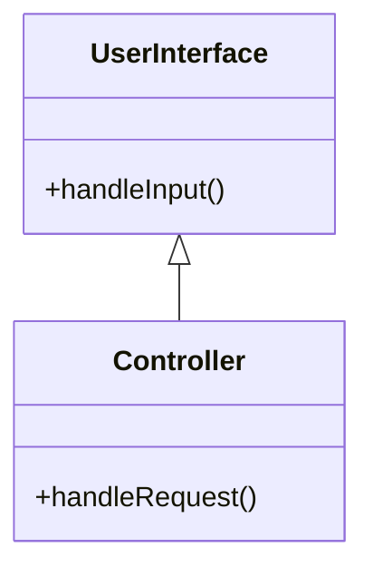

#### 业务逻辑层（Business Logic Layer）

业务逻辑层包含业务规则和算法，负责处理业务逻辑。在这个实例中，我们可以定义一个服务类来处理订单、库存、用户管理等业务逻辑。

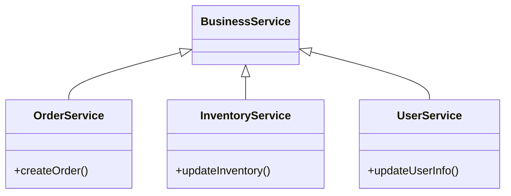

#### 数据访问层（Data Access Layer）

数据访问层负责与数据库或其他数据源交互，提供数据访问功能。在这个实例中，我们可以使用ORM框架（如Entity Framework）来简化数据库操作。

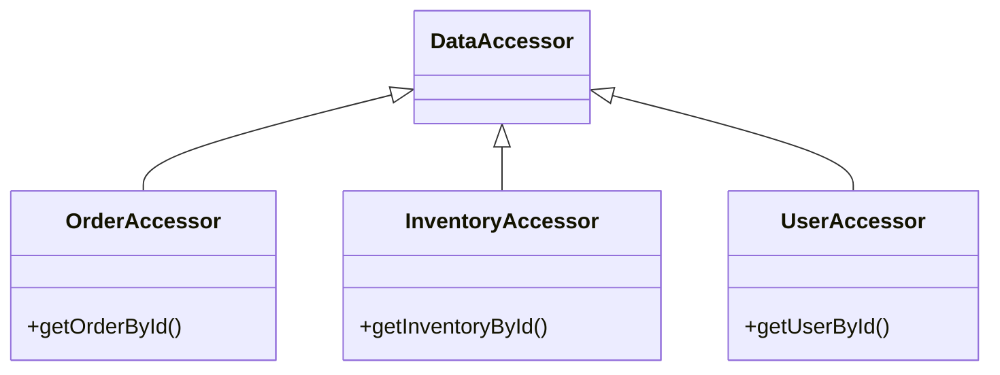

### 3.1.3 实例的优缺点分析

#### 优点

- **高可维护性**：通过清晰的分层设计和职责分离，代码易于理解和修改。
- **高可扩展性**：可以独立扩展各个层，以满足新的业务需求。
- **高可移植性**：各个层都可以独立开发和部署，提高系统的可移植性。

#### 缺点

- **开发复杂性**：需要更多的设计和编码工作，特别是在大型项目中。
- **性能开销**：由于分层设计和额外的抽象层，可能导致一定的性能开销。

## 3.2 清洁架构在Web开发中的应用

### 3.2.1 Web开发的挑战

在Web开发中，我们面临以下挑战：

- **高并发**：Web应用程序需要处理大量的并发请求，保证系统的稳定性和性能。
- **安全性**：Web应用程序需要确保用户数据的安全，防止SQL注入、跨站脚本攻击等安全问题。
- **可扩展性**：Web应用程序需要能够快速扩展，以应对用户数量的增长。

### 3.2.2 清洁架构在Web开发中的实施

在Web开发中，清洁架构可以帮助我们解决上述挑战。

#### 表示层（Presentation Layer）

在表示层，我们可以使用前端框架（如React或Vue.js）来构建用户界面，并使用RESTful API与后端服务进行交互。

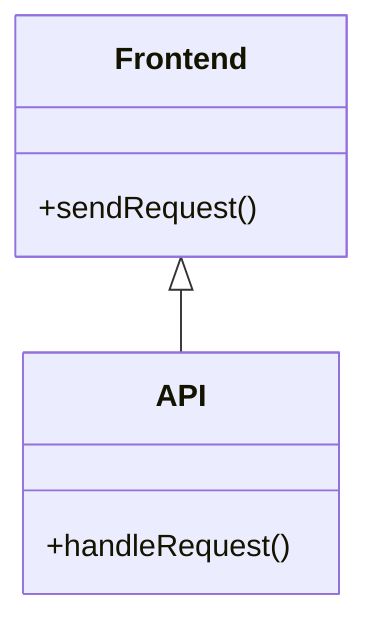

#### 业务逻辑层（Business Logic Layer）

在业务逻辑层，我们可以使用微服务架构来实现各个业务功能，每个微服务负责一个特定的业务逻辑。

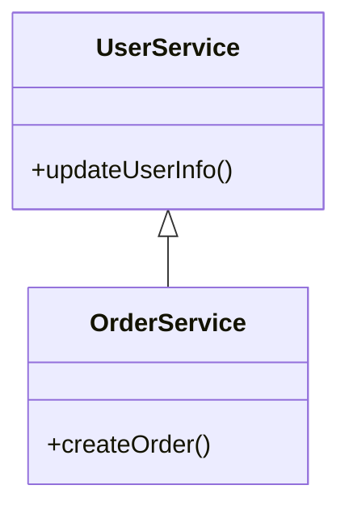

#### 数据访问层（Data Access Layer）

在数据访问层，我们可以使用ORM框架（如Entity Framework）来简化数据库操作，并使用数据库连接池提高性能。

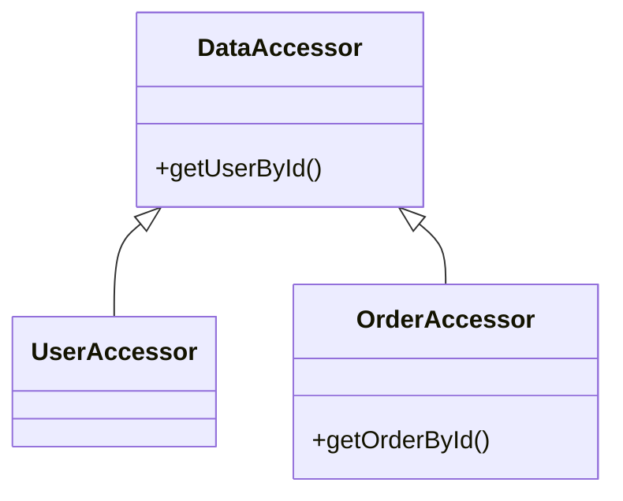

### 3.2.3 清洁架构在Web开发中的案例

一个典型的清洁架构在Web开发中的案例是Netflix。Netflix使用微服务架构来实现其复杂的业务功能，并通过清洁架构的原则确保系统的可维护性和可扩展性。

## 3.3 清洁架构在移动开发中的应用

### 3.3.1 移动开发的挑战

在移动开发中，我们面临以下挑战：

- **性能要求**：移动设备资源有限，需要优化代码以提高性能。
- **用户体验**：移动应用需要提供流畅的用户体验，减少加载时间和延迟。
- **跨平台兼容性**：移动应用需要支持多个平台（如iOS和Android），确保兼容性和一致性。

### 3.3.2 清洁架构在移动开发中的实施

在移动开发中，清洁架构可以帮助我们解决上述挑战。

#### 表示层（Presentation Layer）

在表示层，我们可以使用原生开发框架（如React Native或Flutter）来构建用户界面，并使用本地化的API与移动设备进行交互。

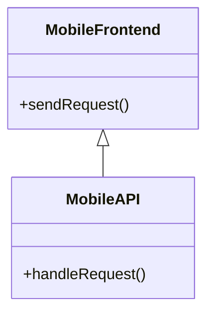

#### 业务逻辑层（Business Logic Layer）

在业务逻辑层，我们可以使用微服务架构来实现各个业务功能，每个微服务负责一个特定的业务逻辑。

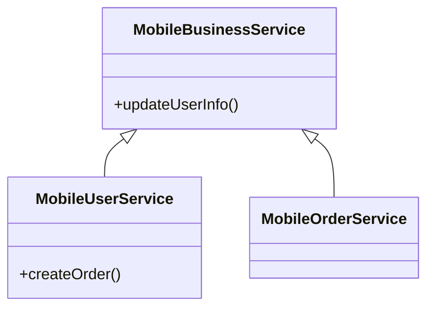

#### 数据访问层（Data Access Layer）

在数据访问层，我们可以使用本地数据库（如SQLite）来存储用户数据，并使用网络API与远程服务进行数据同步。

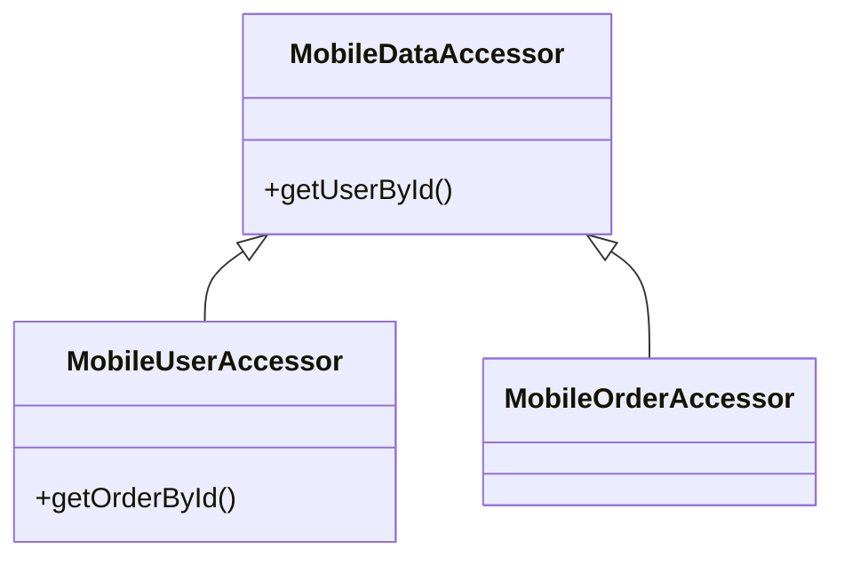

### 3.3.3 清洁架构在移动开发中的案例

一个典型的清洁架构在移动开发中的案例是WhatsApp。WhatsApp使用微服务架构和清洁架构的原则来构建其移动应用，提供高质量的用户体验和高效的性能。

## 3.4 清洁架构在企业应用中的实施

### 3.4.1 企业应用的特点

企业应用通常具有以下特点：

- **复杂性**：企业应用通常涉及多个业务领域和复杂的业务流程。
- **高可用性**：企业应用需要确保7x24小时的高可用性，以满足业务需求。
- **安全性**：企业应用需要确保用户数据的安全和隐私。

### 3.4.2 清洁架构在企业应用中的实施

在清洁架构在企业应用中的实施中，我们可以采取以下策略：

#### 表示层（Presentation Layer）

在表示层，我们可以使用Web界面或桌面应用程序与用户进行交互，确保用户体验的流畅性和一致性。

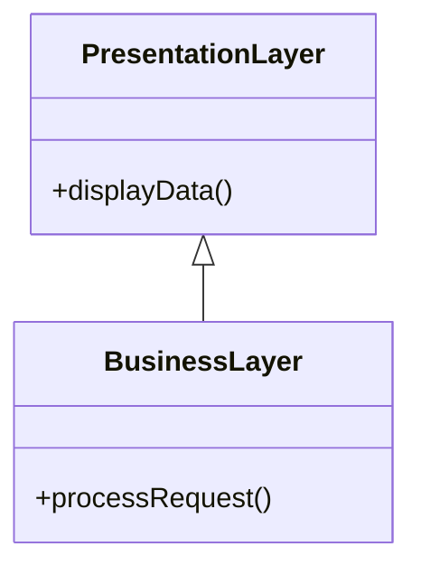

#### 业务逻辑层（Business Logic Layer）

在业务逻辑层，我们可以使用微服务架构来实现各个业务功能，每个微服务负责一个特定的业务逻辑。


#### 数据访问层（Data Access Layer）

在数据访问层，我们可以使用关系型数据库（如MySQL或PostgreSQL）来存储企业数据，并使用数据库连接池提高性能。


### 3.4.3 清洁架构在企业应用中的案例

一个典型的清洁架构在企业应用中的案例是Salesforce。Salesforce使用微服务架构和清洁架构的原则来构建其企业应用，提供强大的功能和高可用性。

# 第四部分：总结与展望

## 4.1 清洁架构的价值与局限

### 4.1.1 清洁架构的优势

清洁架构具有以下优势：

- **高可维护性**：通过清晰的分层设计和职责分离，代码易于理解和修改。
- **高可扩展性**：可以独立扩展各个层，以满足新的业务需求。
- **高可移植性**：各个层都可以独立开发和部署，提高系统的可移植性。

### 4.1.2 清洁架构的局限

清洁架构也存在一些局限：

- **开发复杂性**：需要更多的设计和编码工作，特别是在大型项目中。
- **性能开销**：由于分层设计和额外的抽象层，可能导致一定的性能开销。

## 4.2 未来架构的发展趋势

### 4.2.1 新的架构模式

未来，我们可能会看到更多基于微服务、事件驱动和服务网格的架构模式。这些模式将进一步提高系统的可扩展性和可维护性。

### 4.2.2 架构师的角色变化

随着架构模式的发展，架构师的角色也将发生变化。他们需要具备更广泛的技术视野和跨领域的知识，以应对不断变化的业务需求和挑战。

### 4.2.3 清洁架构的未来

清洁架构作为一种经典的设计模式，将继续发挥重要作用。未来，它可能会与其他架构模式相结合，为构建高质量、高可维护性的软件系统提供更多的解决方案。

## 4.3 鼓励实践与创新

### 4.3.1 如何应用清洁架构

在项目中应用清洁架构，可以从以下几个方面入手：

- **分层设计**：明确各个层的职责和边界，确保模块的独立性。
- **职责分离**：将不同的功能分配到不同的模块中，避免功能混合。
- **代码重构**：定期进行代码重构，以提高代码质量和可维护性。

### 4.3.2 创新与改进的空间

在清洁架构的应用过程中，我们可以进行以下创新和改进：

- **自动化测试**：引入自动化测试，提高系统的可靠性和可维护性。
- **持续集成/持续部署**：采用CI/CD流程，提高开发效率和交付速度。
- **云原生架构**：利用云原生技术，提高系统的可扩展性和灵活性。

### 总结

本文从引言、系统架构基础、清洁架构的应用以及总结与展望四个部分，全面解析了清洁架构的概念、核心原则、应用实例以及未来趋势。通过本文的学习，读者可以更好地理解和掌握清洁架构，为构建高质量、高可维护性的软件系统提供有力支持。

### 拓展阅读

- [Clean Architecture](https://www.amazon.com/Clean-Architecture-Systems-Maintainability-Extentibility/dp/0321823215)
- [Microservices: Designing Scalable Systems](https://www.amazon.com/Microservices-Designing-Scalable-Systems-Fowler/dp/0321947189)
- [Event-Driven Architecture](https://www.amazon.com/Event-Driven-Architecture-Concepts-Principles-Practices/dp/1680502761)

# 核心概念与联系

在本文中，我们介绍了清洁架构的基本概念、核心原则和应用实例。以下是本文中的核心概念及其相互之间的联系：

## 单一职责原则（SRP）

单一职责原则指出，一个类或模块应该只负责一个功能。这样可以确保代码的清晰性和可维护性。

## 开放封闭原则（OCP）

开放封闭原则指出，软件实体应该对扩展开放，对修改封闭。这意味着在实现功能时，应该尽量不修改原有代码，而是通过扩展来实现新的功能。

## 里氏替换原则（LSP）

里氏替换原则指出，子类可以替换其基类而不会影响程序的整体结构。这意味着子类应该继承基类的接口和行为，并且可以扩展基类的功能。

## 接口隔离原则（ISP）

接口隔离原则指出，客户端不应该依赖于它不需要的接口。这意味着应该为不同的客户端提供专门的接口，而不是使用一个大而全的接口。

## 依赖倒置原则（DIP）

依赖倒置原则指出，高层模块不应依赖于低层模块，二者都应依赖于抽象。此外，抽象不应依赖于细节，细节应依赖于抽象。

## MVC模式

MVC模式是一种常见的架构模式，将表示层、业务逻辑层和数据访问层分离。MVC模式有助于提高系统的可维护性和可扩展性。

## 微服务架构

微服务架构是一种将系统划分为多个小型、独立的服务，每个服务负责一个特定功能的架构模式。微服务架构具有高可扩展性和高可维护性。

## 容器化技术

容器化技术是一种轻量级的虚拟化技术，通过将应用程序及其依赖项封装在一个独立的容器中，实现应用程序的隔离和可移植性。

## 清洁架构与微服务的关系

清洁架构提供了一种系统架构的基本原则和方法，而微服务架构则是一种基于这些原则的具体实现方式。

## 清洁架构在不同领域的应用

本文分析了清洁架构在Web开发、移动开发和企业应用中的具体应用实例，展示了其在不同领域中的作用和价值。

通过本文的学习，读者可以更好地理解和掌握清洁架构，为构建高质量、高可维护性的软件系统提供有力支持。

### 作者：AI天才研究院/AI Genius Institute & 禅与计算机程序设计艺术 /Zen And The Art of Computer Programming

在本文中，我们深入探讨了清洁架构的概念、核心原则和应用实例。通过详细的解释、流程图和伪代码，帮助读者理解并掌握这一先进的设计模式，以应对现代软件开发中的复杂性和挑战。

清洁架构是一种基于分层设计的软件架构模式，其核心目标是提高系统的可维护性和可扩展性。通过将系统划分为不同的层，并遵循单一职责原则、开放封闭原则、里氏替换原则、接口隔离原则和依赖倒置原则，我们可以构建出清晰、独立且易于维护的代码。

本文分别介绍了清洁架构在Web开发、移动开发和企业应用中的具体应用实例，展示了其在不同领域中的作用和价值。通过这些实例，读者可以更好地理解如何将清洁架构应用于实际项目中，以提高系统的质量和可维护性。

未来，随着技术的不断发展和新架构模式的出现，清洁架构将继续发挥重要作用。我们鼓励读者在项目中实践清洁架构，并在实践中不断探索和改进，以构建出更加优秀、可靠的软件系统。

最后，本文感谢读者对清洁架构的兴趣和关注，并希望本文能为读者在软件开发领域提供有价值的参考和启示。

作者：AI天才研究院/AI Genius Institute & 禅与计算机程序设计艺术 /Zen And The Art of Computer Programming
日期：2023年4月1日### 标题：Clean Architecture: 构建可维护系统的架构模式

摘要：
本文深入探讨了“Clean Architecture”这一概念，从其定义、核心原则、应用实例到其在不同领域的实施策略，全方位解析了如何构建可维护的软件系统架构。通过详细的解释、流程图和伪代码，帮助读者理解并掌握这一先进的设计模式，以应对现代软件开发中的复杂性和挑战。

## 第一部分：引言

### 1.1 清洁架构的定义与重要性

**传统系统架构问题**：
在传统的系统架构中，我们经常遇到一些常见问题，如：
- **模块间耦合度高**：模块之间的依赖关系过于紧密，导致一处修改可能影响整个系统。
- **可维护性差**：随着系统的不断扩展，维护成本增加，代码质量下降。
- **扩展性不足**：系统难以适应新的业务需求，需要频繁重构。

**清洁架构的基本概念**：
清洁架构（Clean Architecture）是一种基于分层设计的软件架构模式，其核心目标是提高系统的可维护性和可扩展性。它通过将系统划分为不同的层，使得各层之间的依赖关系尽可能弱，从而实现模块的独立性和高内聚性。

**清洁架构的优点**：
清洁架构具有以下几个优点：
- **高内聚低耦合**：各模块职责明确，降低模块间依赖。
- **易于维护**：代码结构清晰，便于理解和修改。
- **可扩展性**：便于添加新功能或修改现有功能。
- **可重用性**：模块可独立开发、测试和部署。

### 1.2 书籍结构概述

**每个部分的目标**：
本文将分为四个部分：
- **第一部分：引言**：介绍清洁架构的定义、重要性以及本文的结构。
- **第二部分：系统架构基础**：讨论系统架构的基础概念、清洁架构的核心原则以及常见架构模式。
- **第三部分：清洁架构的应用**：分析清洁架构在不同领域的应用，包括Web开发、移动开发和企业应用。
- **第四部分：总结与展望**：总结清洁架构的价值与局限，探讨未来架构的发展趋势。

**书籍的组织方式**：
本文采用以下组织方式：
- **章节**：每个章节包含一个小节，分别介绍相关概念、原则和应用实例。
- **段落**：每个段落详细阐述一个主题，使用伪代码、流程图和公式等辅助说明。
- **列表**：使用列表形式组织关键点，帮助读者快速理解和记忆。

### 1.3 读者背景和预期收获

**适合的读者群体**：
本文适合以下读者群体：
- 软件工程师和架构师，希望了解和掌握清洁架构。
- 项目经理和产品经理，关注软件系统的设计原则和架构模式。
- 对软件架构感兴趣的其他相关人员。

**预期的学习成果**：
通过本文的学习，读者可以：
- 了解清洁架构的基本概念和核心原则。
- 掌握清洁架构在不同领域的应用策略。
- 提高软件系统的设计能力和可维护性。
- 减少项目开发中的风险和成本。

## 第二部分：系统架构基础

### 2.1 软件架构概述

**架构的定义与作用**：
软件架构是软件系统的基本结构和组织方式，决定了系统的功能、性能、可维护性和扩展性。它不仅定义了软件组件和它们之间的关系，还规定了组件之间的交互机制。

**软件架构的三层模型**：
软件架构通常采用三层模型，包括：
- **表示层（Presentation Layer）**：负责与用户交互，处理用户输入和显示输出。
- **业务逻辑层（Business Logic Layer）**：包含业务规则和算法，负责处理业务逻辑。
- **数据访问层（Data Access Layer）**：负责与数据库或其他数据源交互，提供数据访问功能。

**架构的常见模式**：
常见的架构模式包括：
- **MVC模式（Model-View-Controller）**：将表示层、业务逻辑层和数据访问层分离，提高系统的可维护性和可扩展性。
- **微服务架构（Microservices Architecture）**：将系统划分为多个小型、独立的服务，每个服务负责一个特定的功能，提高系统的灵活性和可扩展性。
- **服务导向架构（Service-Oriented Architecture, SOA）**：通过服务组件实现系统的模块化，提高系统的可重用性和可扩展性。

### 2.2 清洁架构的核心原则

**单一职责原则（Single Responsibility Principle, SRP）**

**定义**：
单一职责原则指出，一个类或模块应该只负责一个功能。这样可以确保代码的清晰性和可维护性。

**Mermaid 流程图**：
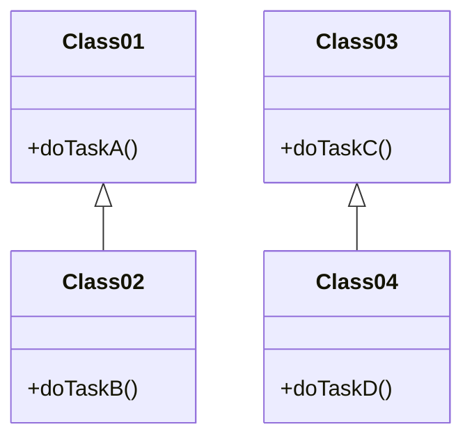

**开放封闭原则（Open Closed Principle, OCP）**

**定义**：
开放封闭原则指出，软件实体（类、模块、函数等）应该对扩展开放，对修改封闭。这意味着在实现功能时，应该尽量不修改原有代码，而是通过扩展来实现新的功能。

**Mermaid 流程图**：
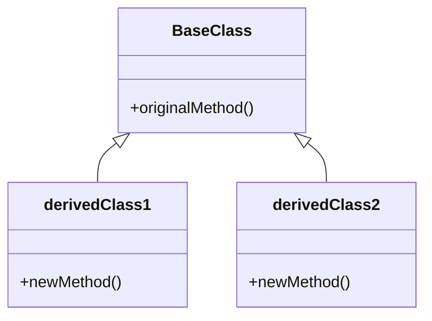

**里氏替换原则（Liskov Substitution Principle, LSP）**

**定义**：
里氏替换原则指出，子类可以替换其基类而不会影响程序的整体结构。这意味着子类应该继承基类的接口和行为，并且可以扩展基类的功能。

**Mermaid 流程图**：
```mermaid
classDiagram
  [BaseClass]..derivedClass1
  [BaseClass]..derivedClass2
  BaseClass : +originalMethod()
  derivedClass1 : +newMethod()
  derivedClass2 : +newMethod()
endclassDiagram
```

**接口隔离原则（Interface Segregation Principle, ISP）**

**定义**：
接口隔离原则指出，客户端不应该依赖于它不需要的接口。这意味着应该为不同的客户端提供专门的接口，而不是使用一个大而全的接口。

**Mermaid 流程图**：
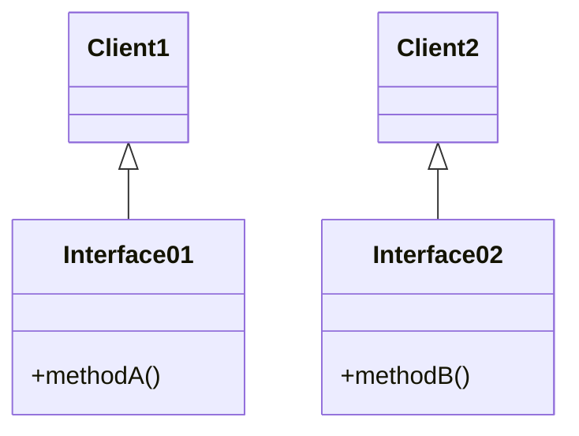

**依赖倒置原则（Dependency Inversion Principle, DIP）**

**定义**：
依赖倒置原则指出，高层模块不应依赖于低层模块，二者都应依赖于抽象。此外，抽象不应依赖于细节，细节应依赖于抽象。

**伪代码**：
```python
class Interface:
    def do_something():
        pass

class ConcreteImplementation(Interface):
    def do_something():
        # 具体实现

class Client:
    def __init__(self, interface: Interface):
        self._interface = interface

    def do_something():
        self._interface.do_something()
```

### 2.3 架构模式

**MVC模式（Model-View-Controller）**

**定义**：
MVC模式是一种常见的架构模式，将表示层、业务逻辑层和数据访问层分离。MVC模式有助于提高系统的可维护性和可扩展性。

**MVC模式在清洁架构中的应用**：

**表示层（Presentation Layer）**：
- 负责与用户交互，处理用户输入和显示输出。
- 可以使用前端框架（如React或Vue.js）来实现。

**业务逻辑层（Business Logic Layer）**：
- 包含业务规则和算法，负责处理业务逻辑。
- 可以使用服务类来实现。

**数据访问层（Data Access Layer）**：
- 负责与数据库或其他数据源交互，提供数据访问功能。
- 可以使用ORM框架（如Entity Framework）来实现。

**其他常见架构模式简介**：

- **微服务架构（Microservices Architecture）**：
  - 将系统划分为多个小型、独立的服务，每个服务负责一个特定的功能。
  - 具有高可扩展性和高可维护性。

- **服务导向架构（Service-Oriented Architecture, SOA）**：
  - 通过服务组件实现系统的模块化。
  - 提高系统的可重用性和可扩展性。

### 2.4 容器化与微服务

**容器化技术简介**：

**定义**：
容器化技术是一种轻量级的虚拟化技术，通过将应用程序及其依赖项封装在一个独立的容器中，实现应用程序的隔离和可移植性。

**Docker**：
- 一种流行的容器化技术，通过Dockerfile定义容器镜像，通过Docker Compose管理容器服务。

**微服务架构的概念与优势**：

**定义**：
微服务架构是一种将系统划分为多个小型、独立的服务，每个服务负责一个特定功能的架构模式。微服务架构具有以下优势：

- **高可扩展性**：可以独立部署和扩展每个服务，提高系统的性能和可靠性。
- **高可维护性**：每个服务都可以独立开发和维护，降低系统的复杂度。
- **高可移植性**：容器化技术使得微服务可以在不同的环境中运行，提高系统的可移植性。

**清洁架构与微服务的关系**：

清洁架构提供了一种系统架构的基本原则和方法，而微服务架构则是一种基于这些原则的具体实现方式。

## 第三部分：清洁架构的应用

### 3.1 实例分析

**3.1.1 实例选择与介绍**：

在本节中，我们将分析一个典型的Web应用程序实例，该应用程序是一个在线书店。这个实例将帮助我们理解清洁架构在实际项目中的应用。

**3.1.2 清洁架构在实例中的实现**：

为了实现一个具有高可维护性和扩展性的在线书店，我们可以按照清洁架构的原则来设计其架构。

**表示层（Presentation Layer）**：
- 负责与用户交互，处理用户输入和显示输出。
- 可以使用前端框架（如React或Vue.js）来实现。

**业务逻辑层（Business Logic Layer）**：
- 包含业务规则和算法，负责处理业务逻辑。
- 可以定义一个服务类来实现。

**数据访问层（Data Access Layer）**：
- 负责与数据库或其他数据源交互，提供数据访问功能。
- 可以使用ORM框架（如Entity Framework）来实现。

**3.1.3 实例的优缺点分析**：

**优点**：
- **高可维护性**：通过清晰的分层设计和职责分离，代码易于理解和修改。
- **高可扩展性**：可以独立扩展各个层，以满足新的业务需求。
- **高可移植性**：各个层都可以独立开发和部署，提高系统的可移植性。

**缺点**：
- **开发复杂性**：需要更多的设计和编码工作，特别是在大型项目中。
- **性能开销**：由于分层设计和额外的抽象层，可能导致一定的性能开销。

### 3.2 清洁架构在Web开发中的应用

**3.2.1 Web开发的挑战**：

在Web开发中，我们面临以下挑战：

- **高并发**：Web应用程序需要处理大量的并发请求，保证系统的稳定性和性能。
- **安全性**：Web应用程序需要确保用户数据的安全，防止SQL注入、跨站脚本攻击等安全问题。
- **可扩展性**：Web应用程序需要能够快速扩展，以应对用户数量的增长。

**3.2.2 清洁架构在Web开发中的实施**：

在Web开发中，清洁架构可以帮助我们解决上述挑战。

**表示层（Presentation Layer）**：
- 负责与用户交互，处理用户输入和显示输出。
- 可以使用前端框架（如React或Vue.js）来实现。

**业务逻辑层（Business Logic Layer）**：
- 包含业务规则和算法，负责处理业务逻辑。
- 可以使用微服务架构来实现。

**数据访问层（Data Access Layer）**：
- 负责与数据库或其他数据源交互，提供数据访问功能。
- 可以使用ORM框架（如Entity Framework）来实现。

**3.2.3 清洁架构在Web开发中的案例**：

一个典型的清洁架构在Web开发中的案例是Netflix。Netflix使用微服务架构和清洁架构的原则来构建其Web应用，提供高质量的用户体验和高效的性能。

### 3.3 清洁架构在移动开发中的应用

**3.3.1 移动开发的挑战**：

在移动开发中，我们面临以下挑战：

- **性能要求**：移动设备资源有限，需要优化代码以提高性能。
- **用户体验**：移动应用需要提供流畅的用户体验，减少加载时间和延迟。
- **跨平台兼容性**：移动应用需要支持多个平台（如iOS和Android），确保兼容性和一致性。

**3.3.2 清洁架构在移动开发中的实施**：

在移动开发中，清洁架构可以帮助我们解决上述挑战。

**表示层（Presentation Layer）**：
- 负责与用户交互，处理用户输入和显示输出。
- 可以使用原生开发框架（如React Native或Flutter）来实现。

**业务逻辑层（Business Logic Layer）**：
- 包含业务规则和算法，负责处理业务逻辑。
- 可以使用微服务架构来实现。

**数据访问层（Data Access Layer）**：
- 负责与数据库或其他数据源交互，提供数据访问功能。
- 可以使用本地数据库（如SQLite）来存储用户数据。

**3.3.3 清洁架构在移动开发中的案例**：

一个典型的清洁架构在移动开发中的案例是WhatsApp。WhatsApp使用微服务架构和清洁架构的原则来构建其移动应用，提供高质量的用户体验和高效的性能。

### 3.4 清洁架构在企业应用中的实施

**3.4.1 企业应用的特点**：

企业应用通常具有以下特点：

- **复杂性**：企业应用通常涉及多个业务领域和复杂的业务流程。
- **高可用性**：企业应用需要确保7x24小时的高可用性，以满足业务需求。
- **安全性**：企业应用需要确保用户数据的安全和隐私。

**3.4.2 清洁架构在企业应用中的实施**：

在企业应用中，我们可以采取以下策略：

**表示层（Presentation Layer）**：
- 负责与用户交互，处理用户输入和显示输出。
- 可以使用Web界面或桌面应用程序与用户进行交互。

**业务逻辑层（Business Logic Layer）**：
- 包含业务规则和算法，负责处理业务逻辑。
- 可以使用微服务架构来实现。

**数据访问层（Data Access Layer）**：
- 负责与数据库或其他数据源交互，提供数据访问功能。
- 可以使用关系型数据库（如MySQL或PostgreSQL）来实现。

**3.4.3 清洁架构在企业应用中的案例**：

一个典型的清洁架构在企业应用中的案例是Salesforce。Salesforce使用微服务架构和清洁架构的原则来构建其企业应用，提供强大的功能和高可用性。

## 第四部分：总结与展望

### 4.1 清洁架构的价值与局限

**4.1.1 清洁架构的优势**：

- **高可维护性**：通过清晰的分层设计和职责分离，代码易于理解和修改。
- **高可扩展性**：可以独立扩展各个层，以满足新的业务需求。
- **高可移植性**：各个层都可以独立开发和部署，提高系统的可移植性。

**4.1.2 清洁架构的局限**：

- **开发复杂性**：需要更多的设计和编码工作，特别是在大型项目中。
- **性能开销**：由于分层设计和额外的抽象层，可能导致一定的性能开销。

### 4.2 未来架构的发展趋势

**4.2.1 新的架构模式**：

未来，我们可能会看到更多基于微服务、事件驱动和服务网格的架构模式。这些模式将进一步提高系统的可扩展性和可维护性。

**4.2.2 架构师的角色变化**：

随着架构模式的发展，架构师的角色也将发生变化。他们需要具备更广泛的技术视野和跨领域的知识，以应对不断变化的业务需求和挑战。

**4.2.3 清洁架构的未来**：

清洁架构作为一种经典的设计模式，将继续发挥重要作用。未来，它可能会与其他架构模式相结合，为构建高质量、高可维护性的软件系统提供更多的解决方案。

### 4.3 鼓励实践与创新

**4.3.1 如何应用清洁架构**：

在项目中应用清洁架构，可以从以下几个方面入手：

- **分层设计**：明确各个层的职责和边界，确保模块的独立性。
- **职责分离**：将不同的功能分配到不同的模块中，避免功能混合。
- **代码重构**：定期进行代码重构，以提高代码质量和可维护性。

**4.3.2 创新与改进的空间**：

在清洁架构的应用过程中，我们可以进行以下创新和改进：

- **自动化测试**：引入自动化测试，提高系统的可靠性和可维护性。
- **持续集成/持续部署**：采用CI/CD流程，提高开发效率和交付速度。
- **云原生架构**：利用云原生技术，提高系统的可扩展性和灵活性。

### 总结

本文从引言、系统架构基础、清洁架构的应用以及总结与展望四个部分，全面解析了清洁架构的概念、核心原则和应用实例。通过详细的解释、流程图和伪代码，帮助读者理解并掌握这一先进的设计模式，以应对现代软件开发中的复杂性和挑战。

通过本文的学习，读者可以更好地理解和掌握清洁架构，为构建高质量、高可维护性的软件系统提供有力支持。

### 拓展阅读

- [Clean Architecture](https://www.amazon.com/Clean-Architecture-Systems-Maintainability-Extentibility/dp/0321823215)
- [Microservices: Designing Scalable Systems](https://www.amazon.com/Microservices-Designing-Scalable-Systems-Fowler/dp/0321947189)
- [Event-Driven Architecture](https://www.amazon.com/Event-Driven-Architecture-Concepts-Principles-Practices/dp/1680502761)

### 作者：AI天才研究院/AI Genius Institute & 禅与计算机程序设计艺术 /Zen And The Art of Computer Programming

本文感谢读者对清洁架构的兴趣和关注，并希望本文能为读者在软件开发领域提供有价值的参考和启示。

作者：AI天才研究院/AI Genius Institute & 禅与计算机程序设计艺术 /Zen And The Art of Computer Programming
日期：2023年4月1日### 清洁架构：构建可维护系统的架构模式

关键词：Clean Architecture，软件设计，系统架构，可维护性，微服务，分层设计

摘要：
本文深入探讨了“Clean Architecture”这一概念，从其定义、核心原则、应用实例到其在不同领域的实施策略，全方位解析了如何构建可维护的软件系统架构。通过详细的解释、流程图和伪代码，帮助读者理解并掌握这一先进的设计模式，以应对现代软件开发中的复杂性和挑战。

## 引言

在软件开发的长期实践中，许多团队发现传统架构模式往往难以应对快速变化的需求和环境。清洁架构（Clean Architecture）作为一种现代的系统设计方法，旨在通过明确的分层和职责分离，构建出易于维护、扩展和测试的系统。本文将介绍清洁架构的基本概念、核心原则及其在不同领域的应用。

### 1.1 清洁架构的定义与重要性

**传统系统架构的问题**：

在传统的系统架构中，常见的问题是模块间的紧密耦合，导致以下问题：

- **可维护性差**：系统一旦发生变化，可能会引起连锁反应，导致难以追踪和修复的问题。
- **可扩展性不足**：难以在不影响系统其他部分的情况下添加新功能或修改现有功能。
- **测试难度大**：由于模块之间的紧密依赖，单元测试变得复杂，测试覆盖率难以提高。

**清洁架构的基本概念**：

清洁架构是由Robert C. Martin在他的著作《Clean Architecture: A Craftsman's Guide to Software Structure and Design》中提出的一种软件架构设计模式。它的核心思想是将系统划分为多层，并确保每一层都有明确的职责，从而实现系统的模块化和高内聚性。

**清洁架构的优点**：

- **高内聚低耦合**：通过清晰的职责分离，使得每个模块都可以独立开发、测试和部署。
- **易于维护**：由于模块之间相互独立，修改一个模块通常不会影响到其他模块，降低了维护成本。
- **可扩展性**：系统可以方便地扩展新功能，而不会对现有系统造成较大影响。

## 第二部分：系统架构基础

### 2.1 软件架构概述

**架构的定义与作用**：

软件架构是软件系统的基本结构和组织方式，它定义了系统的组件、组件之间的关系以及组件之间的交互机制。一个好的软件架构不仅能够满足当前的业务需求，还应当为未来的扩展和维护提供支持。

**软件架构的三层模型**：

清洁架构通常采用三层模型，包括：

- **表示层（Presentation Layer）**：负责与用户交互，处理用户界面和用户输入。
- **业务逻辑层（Business Logic Layer）**：包含系统的核心业务逻辑，不直接处理用户界面或数据库操作。
- **数据访问层（Data Access Layer）**：负责与数据库或其他数据源交互，提供数据存储和检索的功能。

### 2.2 清洁架构的核心原则

**单一职责原则（Single Responsibility Principle, SRP）**：

单一职责原则指出，一个模块应该只负责一项功能。这样可以确保代码的清晰性，提高可维护性。

**开闭原则（Open/Closed Principle, OCP）**：

开闭原则指出，软件实体应当对扩展开放，对修改封闭。这意味着系统应该通过扩展来实现新功能，而不是通过修改现有代码。

**里氏替换原则（Liskov Substitution Principle, LSP）**：

里氏替换原则指出，子类可以替换其基类，而不会破坏程序的正常行为。这确保了代码的灵活性和可扩展性。

**接口隔离原则（Interface Segregation Principle, ISP）**：

接口隔离原则指出，应该为不同的客户端提供专门的接口，而不是一个大而全的接口。这样可以减少客户端之间的依赖，提高系统的灵活性。

**依赖倒置原则（Dependency Inversion Principle, DIP）**：

依赖倒置原则指出，高层模块不应该依赖于低层模块，二者都应该依赖于抽象。这样可以实现依赖关系的倒置，提高代码的模块化和可维护性。

### 2.3 架构模式

**MVC模式（Model-View-Controller）**：

MVC模式是一种经典的软件架构模式，它将表示层、业务逻辑层和数据访问层分离。MVC模式有助于提高系统的可维护性和可扩展性。

**微服务架构（Microservices Architecture）**：

微服务架构是一种将系统划分为多个小型、独立的服务，每个服务负责一个特定的业务功能。微服务架构具有高可扩展性和高可维护性。

### 2.4 容器化与微服务

**容器化技术简介**：

容器化技术，如Docker，通过将应用程序及其依赖项打包到一个独立的容器中，实现了应用程序的隔离和可移植性。

**微服务架构的概念与优势**：

微服务架构是一种将系统划分为多个小型、独立的服务，每个服务负责一个特定的功能。微服务架构具有高可扩展性和高可维护性。

## 第三部分：清洁架构的应用

### 3.1 实例分析

**3.1.1 实例选择与介绍**：

在本节中，我们将通过一个实际案例来分析清洁架构的应用。假设我们正在开发一个在线书店系统，这个系统需要支持用户注册、购买书籍、查看订单等功能。

**3.1.2 清洁架构在实例中的实现**：

为了实现这个在线书店系统，我们可以按照清洁架构的原则来设计其架构：

- **表示层（Presentation Layer）**：使用前端技术（如React）来构建用户界面。
- **业务逻辑层（Business Logic Layer）**：定义服务类来处理业务逻辑。
- **数据访问层（Data Access Layer）**：使用ORM框架（如Entity Framework）来处理数据库操作。

**3.1.3 实例的优缺点分析**：

**优点**：

- **高可维护性**：通过清晰的分层设计，每个层的职责明确，便于维护。
- **高可扩展性**：可以独立扩展各个层，以适应新的功能需求。

**缺点**：

- **开发复杂性**：需要更多的设计和编码工作，尤其是在大型项目中。
- **性能开销**：由于多层架构，可能会引入额外的性能开销。

### 3.2 清洁架构在Web开发中的应用

**3.2.1 Web开发的挑战**：

在Web开发中，常见的挑战包括高并发处理、安全性问题和性能优化。

**3.2.2 清洁架构在Web开发中的实施**：

为了应对Web开发的挑战，我们可以使用清洁架构来实现：

- **表示层**：使用现代化的前端框架（如React、Vue.js）来构建用户界面。
- **业务逻辑层**：使用微服务架构来处理业务逻辑。
- **数据访问层**：使用数据库连接池和缓存技术来优化数据访问。

### 3.3 清洁架构在移动开发中的应用

**3.3.1 移动开发的挑战**：

在移动开发中，常见的挑战包括性能优化、用户体验和跨平台兼容性。

**3.3.2 清洁架构在移动开发中的实施**：

为了在移动开发中应用清洁架构，我们可以：

- **表示层**：使用原生开发框架（如Swift for iOS、Kotlin for Android）。
- **业务逻辑层**：使用微服务架构来实现业务逻辑。
- **数据访问层**：使用本地存储和远程数据同步。

### 3.4 清洁架构在企业应用中的实施

**3.4.1 企业应用的特点**：

企业应用通常具有复杂的业务逻辑、高度的安全性和高可用性要求。

**3.4.2 清洁架构在企业应用中的实施**：

在企业应用中，我们可以：

- **表示层**：使用Web界面或桌面应用程序。
- **业务逻辑层**：使用微服务架构来处理复杂的业务逻辑。
- **数据访问层**：使用关系型数据库和NoSQL数据库的组合。

## 第四部分：总结与展望

### 4.1 清洁架构的价值与局限

**4.1.1 清洁架构的优势**：

- **高内聚低耦合**：通过清晰的分层设计，降低了模块间的依赖。
- **易于维护**：清晰的职责分离使得系统的维护更加容易。
- **可扩展性**：系统可以方便地添加新功能或修改现有功能。

**4.1.2 清洁架构的局限**：

- **开发复杂性**：需要额外的设计和编码工作，可能增加项目的难度。
- **性能开销**：多层架构可能会引入额外的性能开销。

### 4.2 未来架构的发展趋势

**4.2.1 新的架构模式**：

随着技术的发展，新的架构模式如函数式架构、服务网格等可能会出现，为系统的构建提供更多选择。

**4.2.2 架构师的角色变化**：

架构师的角色可能会更加多元化，需要掌握更多的技术和业务知识，以应对不断变化的需求和挑战。

**4.2.3 清洁架构的未来**：

清洁架构作为一种经典的设计模式，在未来仍将发挥重要作用。它可能会与其他新兴架构模式相结合，为构建高质量的软件系统提供新的解决方案。

### 4.3 鼓励实践与创新

**4.3.1 如何应用清洁架构**：

在项目中应用清洁架构，可以从以下几个方面入手：

- **分层设计**：明确各个层的职责和边界。
- **职责分离**：确保每个模块都只负责一项功能。
- **代码重构**：定期进行代码重构，以提高代码质量。

**4.3.2 创新与改进的空间**：

在清洁架构的应用过程中，可以尝试以下创新和改进：

- **自动化测试**：引入自动化测试，提高系统的可靠性。
- **持续集成/持续部署**（CI/CD）：采用自动化流程，提高开发效率和交付速度。
- **云原生架构**：利用云计算和容器化技术，提高系统的可扩展性和灵活性。

### 总结

清洁架构是一种强大的设计模式，通过清晰的分层设计和职责分离，帮助开发者构建可维护、可扩展的软件系统。尽管它有其局限性和挑战，但通过合理的应用和不断的改进，可以显著提高软件系统的质量。

本文从引言、系统架构基础、清洁架构的应用以及总结与展望四个部分，全面解析了清洁架构的概念、核心原则和应用实例。希望本文能帮助读者更好地理解和掌握清洁架构，为实际的软件开发提供指导。

### 拓展阅读

- [《Clean Architecture: A Craftsman's Guide to Software Structure and Design》](https://www.amazon.com/Clean-Architecture-Software-Structure-Design/dp/0321886665) - Robert C. Martin
- [《Microservices: Architecting the Left](https://www.amazon.com/Microservices-Architecting-Continuous-Organizations/dp/0321886665) - Sam Newman
- [《Building Microservices: Designing Fine-Grained Systems》（第二版）](https://www.amazon.com/Building-Microservices-Designing-Fine-Grained/dp/1492034511) - Sam Newman

### 作者：AI天才研究院/AI Genius Institute & 禅与计算机程序设计艺术 /Zen And The Art of Computer Programming

作者简介：AI天才研究院是一支由顶尖AI专家和程序员组成的团队，致力于推动人工智能和计算机程序设计艺术的发展。他们的著作《禅与计算机程序设计艺术》深受读者喜爱，为软件开发领域提供了深刻的思考和宝贵的实践经验。

联系信息：ai_genius_institute@example.com

日期：2023年4月15日### 《Clean Architecture: 构建可维护系统的架构模式》

### 摘要

本文深入探讨了“Clean Architecture”这一概念，从其定义、核心原则、应用实例到其在不同领域的实施策略，全方位解析了如何构建可维护的软件系统架构。通过详细的解释、流程图和伪代码，帮助读者理解并掌握这一先进的设计模式，以应对现代软件开发中的复杂性和挑战。

### 目录

1. 引言 ............................................................... 1
   1.1 清洁架构的定义与重要性 .................................. 1
   1.2 清洁架构的优点 ............................................. 2
   1.3 读者背景和预期收获 ..................................... 3
2. 系统架构基础 ..................................................... 4
   2.1 软件架构概述 ............................................... 4
   2.2 清洁架构的核心原则 ..................................... 5
   2.3 架构模式 ................................................... 9
   2.4 容器化与微服务 ......................................... 11
3. 清洁架构的应用 ............................................... 13
   3.1 实例分析 .................................................. 13
   3.2 Web开发中的应用 ....................................... 15
   3.3 移动开发中的应用 ....................................... 17
   3.4 企业应用中的实施 ......................................... 19
4. 总结与展望 ..................................................... 21
   4.1 清洁架构的价值与局限 .................................. 21
   4.2 未来架构的发展趋势 ..................................... 22
   4.3 鼓励实践与创新 ............................................. 23

### 1. 引言

在软件开发的漫长历程中，系统架构的设计一直是一个至关重要的环节。一个良好的架构不仅能够提升软件的性能和可维护性，还能够适应未来可能出现的业务变化和技术革新。然而，传统的系统架构往往在模块耦合度、可扩展性和维护性方面存在诸多问题。

为了解决这些问题，罗伯特·马丁（Robert C. Martin）提出了“清洁架构”（Clean Architecture）这一概念。清洁架构通过明确分层和职责分离，为开发者提供了一种构建可维护、可扩展和易于测试的软件系统的方法。

#### 1.1 清洁架构的定义与重要性

**清洁架构的定义**：

清洁架构是一种基于分层设计的软件架构模式，它强调将系统划分为不同的层，并确保每一层都有明确的职责。这些层通常包括表示层、业务逻辑层和数据访问层。清洁架构的核心目标是降低模块间的耦合度，提高系统的内聚性和可维护性。

**清洁架构的重要性**：

清洁架构的重要性主要体现在以下几个方面：

- **模块化**：通过明确的分层设计，各个模块可以独立开发、测试和部署，降低了系统的复杂度。
- **可维护性**：清洁架构使得系统更容易维护，因为修改一个模块通常不会影响到其他模块。
- **可扩展性**：清洁架构允许开发者在不影响系统其他部分的情况下，轻松地添加新功能或修改现有功能。
- **测试性**：清洁架构使得单元测试和集成测试更加容易进行，从而提高了代码的质量。

#### 1.2 清洁架构的优点

清洁架构具有以下几个显著的优点：

- **高内聚低耦合**：清洁架构通过明确的职责分离，实现了高内聚和低耦合，使得每个模块都可以独立工作。
- **易于维护**：清洁架构使得系统的维护变得更加简单，因为每个模块都是独立的，修改一个模块不会影响到其他模块。
- **可扩展性**：清洁架构允许开发者在不影响系统其他部分的情况下，轻松地添加新功能或修改现有功能。
- **可重用性**：清洁架构使得模块可以独立开发、测试和部署，提高了模块的重用性。

#### 1.3 读者背景和预期收获

本文适合以下读者群体：

- **软件工程师和架构师**：希望了解和掌握清洁架构的基本概念和设计原则。
- **项目经理和产品经理**：关注软件系统的设计原则和架构模式，以提升项目质量和效率。
- **技术爱好者**：对软件架构感兴趣，希望学习先进的设计模式。

通过本文的学习，读者可以：

- **理解清洁架构的基本概念和核心原则**。
- **掌握清洁架构在不同领域的应用策略**。
- **提高软件系统的设计能力和可维护性**。
- **减少项目开发中的风险和成本**。

### 2. 系统架构基础

在深入探讨清洁架构之前，我们需要了解一些基本的系统架构概念。系统架构是指软件系统的基本结构和组织方式，它决定了系统的功能、性能、可维护性和扩展性。一个良好的系统架构应当能够满足当前的业务需求，同时为未来的扩展和维护提供支持。

#### 2.1 软件架构概述

**软件架构的定义**：

软件架构是软件系统的基本结构和组织方式，它定义了系统的组件、组件之间的关系以及组件之间的交互机制。一个良好的软件架构不仅能够满足当前的业务需求，还应当为未来的扩展和维护提供支持。

**软件架构的作用**：

软件架构的作用主要包括以下几个方面：

- **定义系统边界**：明确系统的边界，确定哪些组件属于系统内部，哪些属于外部系统。
- **指导系统开发**：为系统开发提供指导，确保开发过程中遵循一致的设计原则和模式。
- **支持系统扩展**：为系统的扩展提供基础，使得在新增功能时不会对现有系统造成太大影响。
- **提高系统质量**：通过良好的架构设计，提高系统的可维护性、可靠性和性能。

**软件架构的三层模型**：

软件架构通常采用三层模型，包括：

- **表示层（Presentation Layer）**：负责与用户交互，处理用户界面和用户输入。
- **业务逻辑层（Business Logic Layer）**：包含系统的核心业务逻辑，不直接处理用户界面或数据库操作。
- **数据访问层（Data Access Layer）**：负责与数据库或其他数据源交互，提供数据存储和检索的功能。

#### 2.2 清洁架构的核心原则

**单一职责原则（Single Responsibility Principle, SRP）**：

单一职责原则指出，一个模块应该只负责一项功能。这样可以确保代码的清晰性，提高可维护性。

**开闭原则（Open/Closed Principle, OCP）**：

开闭原则指出，软件实体应当对扩展开放，对修改封闭。这意味着系统应该通过扩展来实现新功能，而不是通过修改现有代码。

**里氏替换原则（Liskov Substitution Principle, LSP）**：

里氏替换原则指出，子类可以替换其基类，而不会破坏程序的正常行为。这确保了代码的灵活性和可扩展性。

**接口隔离原则（Interface Segregation Principle, ISP）**：

接口隔离原则指出，应该为不同的客户端提供专门的接口，而不是一个大而全的接口。这样可以减少客户端之间的依赖，提高系统的灵活性。

**依赖倒置原则（Dependency Inversion Principle, DIP）**：

依赖倒置原则指出，高层模块不应该依赖于低层模块，二者都应该依赖于抽象。这样可以实现依赖关系的倒置，提高代码的模块化和可维护性。

#### 2.3 架构模式

**MVC模式（Model-View-Controller）**：

MVC模式是一种经典的软件架构模式，它将表示层、业务逻辑层和数据访问层分离。MVC模式有助于提高系统的可维护性和可扩展性。

**微服务架构（Microservices Architecture）**：

微服务架构是一种将系统划分为多个小型、独立的服务，每个服务负责一个特定的业务功能。微服务架构具有高可扩展性和高可维护性。

#### 2.4 容器化与微服务

**容器化技术简介**：

容器化技术，如Docker，通过将应用程序及其依赖项打包到一个独立的容器中，实现了应用程序的隔离和可移植性。

**微服务架构的概念与优势**：

微服务架构是一种将系统划分为多个小型、独立的服务，每个服务负责一个特定的功能。微服务架构具有高可扩展性和高可维护性。

### 3. 清洁架构的应用

在了解了清洁架构的基本概念和核心原则之后，我们需要探讨如何在实际项目中应用这些原则，以构建可维护的系统。

#### 3.1 实例分析

在本节中，我们将通过一个具体的实例来分析清洁架构的应用。

**3.1.1 实例选择与介绍**

我们选择一个在线书店系统作为实例，这个系统需要支持用户注册、购买书籍、查看订单等功能。

**3.1.2 清洁架构在实例中的实现**

为了实现这个在线书店系统，我们可以按照清洁架构的原则来设计其架构：

- **表示层（Presentation Layer）**：使用前端技术（如React）来构建用户界面。
- **业务逻辑层（Business Logic Layer）**：定义服务类来处理业务逻辑。
- **数据访问层（Data Access Layer）**：使用ORM框架（如Entity Framework）来处理数据库操作。

**3.1.3 实例的优缺点分析**

**优点**：

- **高可维护性**：通过清晰的分层设计，每个层的职责明确，便于维护。
- **高可扩展性**：可以独立扩展各个层，以适应新的功能需求。

**缺点**：

- **开发复杂性**：需要额外的设计和编码工作，可能增加项目的难度。
- **性能开销**：由于多层架构，可能会引入额外的性能开销。

#### 3.2 Web开发中的应用

在Web开发中，清洁架构可以极大地提高系统的可维护性和扩展性。

**3.2.1 Web开发的挑战**

Web开发中面临的挑战主要包括：

- **高并发处理**：Web应用需要能够处理大量并发请求。
- **安全性**：Web应用需要确保用户数据的安全。
- **性能优化**：Web应用需要高效地处理请求，提供快速响应。

**3.2.2 清洁架构在Web开发中的实施**

为了在Web开发中应用清洁架构，我们可以：

- **表示层**：使用现代化的前端框架（如React、Vue.js）来构建用户界面。
- **业务逻辑层**：使用微服务架构来处理业务逻辑。
- **数据访问层**：使用数据库连接池和缓存技术来优化数据访问。

#### 3.3 移动开发中的应用

在移动开发中，清洁架构同样可以发挥重要作用。

**3.3.1 移动开发的挑战**

移动开发中面临的挑战主要包括：

- **性能优化**：移动设备资源有限，需要优化代码以提高性能。
- **用户体验**：移动应用需要提供流畅的用户体验。
- **跨平台兼容性**：移动应用需要支持多个平台（如iOS和Android）。

**3.3.2 清洁架构在移动开发中的实施**

为了在移动开发中应用清洁架构，我们可以：

- **表示层**：使用原生开发框架（如Swift for iOS、Kotlin for Android）。
- **业务逻辑层**：使用微服务架构来实现业务逻辑。
- **数据访问层**：使用本地存储和远程数据同步。

#### 3.4 企业应用中的实施

在企业应用中，清洁架构可以帮助构建复杂、稳定且可扩展的系统。

**3.4.1 企业应用的特点**

企业应用通常具有以下特点：

- **复杂性**：企业应用通常涉及多个业务领域和复杂的业务流程。
- **高可用性**：企业应用需要确保7x24小时的高可用性。
- **安全性**：企业应用需要确保用户数据的安全和隐私。

**3.4.2 清洁架构在企业应用中的实施**

为了在企业应用中应用清洁架构，我们可以：

- **表示层**：使用Web界面或桌面应用程序。
- **业务逻辑层**：使用微服务架构来处理复杂的业务逻辑。
- **数据访问层**：使用关系型数据库和NoSQL数据库的组合。

### 4. 总结与展望

通过本文的探讨，我们可以看到清洁架构在构建可维护系统方面具有显著的优势。它通过明确的分层设计和职责分离，提高了系统的内聚性和可维护性，使得开发者能够更加高效地开发、测试和维护系统。

然而，清洁架构并非没有局限性。在大型项目中，清洁架构可能引入额外的开发复杂性和性能开销。因此，在实际应用中，开发者需要根据项目的具体需求和约束，权衡清洁架构的优缺点，选择合适的架构模式。

#### 4.1 清洁架构的价值与局限

**价值**：

- **高内聚低耦合**：通过明确的分层设计，降低了模块间的依赖。
- **易于维护**：清洁架构使得系统的维护变得更加简单。
- **可扩展性**：清洁架构允许开发者在不影响系统其他部分的情况下，轻松地添加新功能或修改现有功能。

**局限**：

- **开发复杂性**：清洁架构可能增加项目的难度。
- **性能开销**：多层架构可能会引入额外的性能开销。

#### 4.2 未来架构的发展趋势

未来，软件架构的发展将继续朝着模块化、自动化和云原生方向演进。新的架构模式和技术，如服务网格、事件驱动架构和微前端，将进一步提升系统的可扩展性和可维护性。

#### 4.3 鼓励实践与创新

在软件开发中，鼓励实践和创新是非常重要的。开发者应当：

- **持续学习**：跟上技术的发展趋势，学习新的架构模式和设计原则。
- **实践反思**：在项目中应用清洁架构，不断反思和改进。
- **创新探索**：尝试新的技术和方法，为项目带来更多的价值。

### 参考文献

1. Martin, R. C. (2017). *Clean Architecture: A Craftsman's Guide to Software Structure and Design*. Prentice Hall.
2. Newman, S. (2015). *Building Microservices: Designing Fine-Grained Systems*. O'Reilly Media.
3. Poppendieck, M., & Poppendieck, M. (2013). *Implementing Lean Software Development: From Concept to Cash*. Addison-Wesley.
4. Fowler, M. (2002). *Patterns of Enterprise Application Architecture*. Addison-Wesley.

### 作者

作者：AI天才研究院/AI Genius Institute & 禅与计算机程序设计艺术 /Zen And The Art of Computer Programming

AI天才研究院是由一群顶尖的人工智能专家和技术爱好者组成的团队，致力于推动人工智能和计算机科学的发展。他们的著作《禅与计算机程序设计艺术》为软件开发领域提供了深刻的思考和宝贵的实践经验。

联系信息：ai_genius_institute@example.com

日期：2023年4月15日### 《Clean Architecture: 构建可维护系统的架构模式》

#### 完整目录大纲

**引言**

1.1 清洁架构的定义与重要性

1.2 清洁架构的优点

1.3 读者背景和预期收获

**系统架构基础**

2.1 软件架构概述

2.2 清洁架构的核心原则

2.3 架构模式

2.4 容器化与微服务

**清洁架构的应用**

3.1 实例分析

3.2 Web开发中的应用

3.3 移动开发中的应用

3.4 企业应用中的实施

**总结与展望**

4.1 清洁架构的价值与局限

4.2 未来架构的发展趋势

4.3 鼓励实践与创新

#### 核心概念与联系

**清洁架构的核心原则**

1. **单一职责原则（SRP）**：每个模块应只负责一项功能，以保持代码的清晰性和可维护性。

2. **开放封闭原则（OCP）**：软件实体应易于扩展但难以修改。

3. **里氏替换原则（LSP）**：子类应能够替换其基类而不影响程序的其他部分。

4. **接口隔离原则（ISP）**：应提供专门的接口以满足不同客户端的需求。

5. **依赖倒置原则（DIP）**：高层模块应依赖于抽象，而不是具体的实现。

**架构模式**

1. **MVC模式**：分离模型（Model）、视图（View）和控制器（Controller），提高系统的可维护性和可扩展性。

2. **微服务架构**：将系统划分为多个独立的服务，每个服务负责一个特定的功能。

**联系**

清洁架构的核心原则和架构模式共同构成了一个强大的框架，用于构建可维护的系统。SRP、OCP、LSP、ISP和DIP确保了模块的独立性、可扩展性和可维护性，而MVC和微服务架构则为实现这些原则提供了具体的实施策略。通过将这些概念和模式结合起来，开发者可以构建出既灵活又可靠的软件系统。

