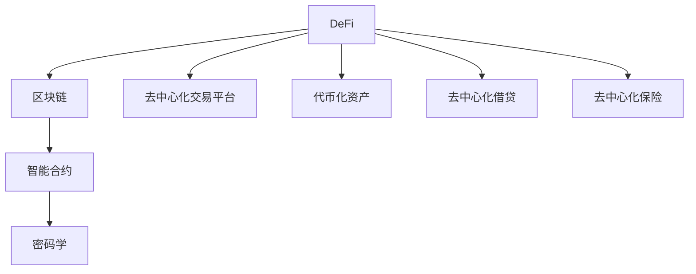

                 

### 文章标题：DeFi：去中心化金融的技术基础

> 关键词：DeFi、去中心化金融、区块链、智能合约、密码学、应用实例

> 摘要：本文详细探讨了DeFi（去中心化金融）的技术基础，包括核心概念、技术原理、应用实例以及面临的挑战和未来趋势。通过逻辑清晰、结构紧凑的论述，让读者深入了解DeFi的内在机制和实际应用，为研究者和从业者提供了宝贵的参考。

-------------------------------------------------------------------

# DeFi：去中心化金融的技术基础

## 1. 引言

DeFi（去中心化金融）作为一种新型的金融模式，正在迅速崛起并改变着传统金融的格局。其核心特点在于去中心化和透明化，通过区块链技术和智能合约实现了金融服务的自动化和去中介化。DeFi的出现，不仅为金融行业带来了新的机遇，同时也带来了一系列挑战。

本文旨在全面解析DeFi的技术基础，包括其核心概念、技术原理、应用实例以及面临的挑战和未来趋势。文章结构如下：

- **第一部分：去中心化金融概述**：介绍DeFi的基本概念和历史背景，阐述其在金融领域的意义。
- **第二部分：DeFi的技术基础**：深入探讨区块链、智能合约和密码学等技术原理，以及这些技术在DeFi中的应用。
- **第三部分：DeFi的应用实例**：分析DeFi在金融领域的主要应用，如代币化资产、去中心化借贷和去中心化保险。
- **第四部分：DeFi的挑战与未来趋势**：讨论DeFi技术面临的主要挑战和未来发展趋势。

## 2. 去中心化金融概述

### 2.1 DeFi的定义与特点

DeFi，全称为Decentralized Finance，即去中心化金融。它是一种基于区块链技术的金融模式，通过智能合约实现了金融服务的去中介化和自动化。与传统的中心化金融体系相比，DeFi具有以下几个显著特点：

1. **去中心化**：DeFi通过去中心化网络实现金融服务的提供，不依赖于中央机构，确保了系统的透明性和安全性。
2. **自动化**：智能合约在DeFi中发挥了关键作用，通过编写在区块链上执行的代码，实现了金融交易的自动化和高效性。
3. **透明性**：所有交易记录都公开透明，不可篡改，用户可以随时查询和验证。
4. **包容性**：DeFi打破了传统金融体系的门槛，使得更多人能够享受到金融服务，促进了金融民主化。

### 2.2 DeFi的发展历程

DeFi的概念可以追溯到比特币的诞生。比特币作为第一个成功的去中心化加密货币，为人们提供了一个去中心化的价值传递网络。随着区块链技术的发展，特别是在以太坊平台上，智能合约技术的出现为DeFi的发展奠定了基础。

- **2010年代初期**：比特币的出现标志着去中心化金融的萌芽。
- **2016年**：以太坊平台的推出，使得智能合约技术得到了广泛应用，DeFi开始崭露头角。
- **2017年**：初始代币发行（ICO）热潮推动了DeFi的发展，许多去中心化金融项目应运而生。
- **2018年**：DeFi市场受到监管压力和加密货币市场波动的影响，经历了一段调整期。
- **2019年至今**：DeFi市场逐渐成熟，越来越多的用户和机构开始关注和参与其中。

### 2.3 DeFi在金融领域的意义

DeFi的出现，对传统金融体系产生了深远的影响，主要体现在以下几个方面：

1. **金融民主化**：DeFi降低了金融服务的门槛，使得更多的人能够参与到金融活动中，实现了金融资源的公平分配。
2. **去中介化**：DeFi通过去中心化的方式，减少了传统金融体系中的中介环节，降低了交易成本，提高了效率。
3. **创新与竞争**：DeFi为金融创新提供了广阔的空间，许多新型金融服务模式在DeFi平台上得以实现，激发了金融行业的活力。
4. **风险分散**：DeFi通过分布式网络的方式，分散了金融风险，提高了系统的安全性。

## 3. DeFi的技术基础

### 3.1 区块链与分布式账本

区块链技术是DeFi的基石。它是一种分布式账本技术，通过多个节点共同维护和更新账本记录，确保数据的真实性和安全性。

- **区块链的基本原理**：
  - **哈希算法**：区块链通过哈希算法将交易记录转换为哈希值，确保数据的唯一性和不可篡改性。
  - **链式结构**：区块链通过将每个区块连接成链式结构，实现了数据的有序存储和追溯。

- **区块链的共识机制**：
  - **工作量证明（PoW）**：通过计算工作量来达成共识，如比特币使用的SHA-256算法。
  - **权益证明（PoS）**：通过持有币龄和权益来达成共识，如以太坊2.0的Casper算法。

### 3.2 智能合约

智能合约是DeFi的核心技术之一。它是一种自动执行合约条款的计算机程序，能够在区块链上执行预定义的规则和逻辑。

- **智能合约的原理与实现**：
  - **原理**：智能合约通过编程语言（如Solidity）编写，存储在区块链上，并在满足特定条件时自动执行。
  - **实现**：以太坊是当前最流行的智能合约平台，通过其虚拟机（EVM）执行智能合约代码。

- **Solidity编程语言简介**：
  - **语法**：Solidity类似于JavaScript和Python，具有简单的语法和丰富的功能。
  - **特性**：支持状态变量、函数、事件、错误处理等，能够实现复杂的逻辑和业务流程。

### 3.3 密码学基础

密码学是保障区块链和智能合约安全性的关键技术。它包括了一系列加密算法和协议，用于保护数据的隐私性和完整性。

- **公钥与私钥**：
  - **公钥**：用于加密数据和验证签名，公开可访问。
  - **私钥**：用于解密数据和创建签名，必须保密。

- **数字签名**：
  - **原理**：通过将消息与私钥进行哈希运算，生成签名，确保消息的来源和完整性。
  - **应用**：用于身份验证和交易授权，确保数据的真实性和安全性。

## 4. DeFi的应用实例

### 4.1 代币化资产

代币化资产是DeFi最典型的应用之一，通过将现实世界的资产数字化，实现资产的所有权和使用权分离。

- **数字货币与代币**：
  - **数字货币**：如比特币、以太坊等，作为价值传递的媒介。
  - **代币**：如ERC-20、ERC-721等，用于代表特定资产的所有权和权益。

- **基于区块链的资产代币化**：
  - **原理**：将现实世界的资产（如房产、债券等）通过区块链技术进行数字化，发行对应的代币。
  - **实现**：通过智能合约实现资产的登记、发行、转移和交易。

### 4.2 去中心化借贷

去中心化借贷是DeFi中另一重要应用，通过智能合约实现借贷和借款的过程，无需传统金融中介。

- **稳定币**：
  - **定义**：价值稳定、易于交易的加密货币，如DAI、USDC等。
  - **实现**：通过智能合约和抵押机制，确保稳定币的价值稳定。

- **去中心化借贷平台案例**：
  - **原理**：用户可以抵押数字资产获得稳定币贷款，利率由市场供需决定。
  - **案例**：Compound、Aave等平台，提供灵活的借贷服务。

### 4.3 去中心化保险

去中心化保险通过智能合约实现保险产品和服务的提供，提高了保险市场的透明度和效率。

- **保险合约的实现**：
  - **原理**：通过智能合约定义保险条款、保费、理赔条件等，确保透明和自动执行。
  - **案例**：Cover、Luminary等平台，提供去中心化保险解决方案。

- **DeFi保险市场的前景**：
  - **挑战**：法律法规和信任问题。
  - **前景**：随着技术的成熟和用户认知的提升，去中心化保险有望成为主流保险模式。

## 5. DeFi的挑战与未来趋势

### 5.1 技术挑战

DeFi的发展面临着一系列技术挑战，主要包括：

- **安全性问题**：
  - **智能合约漏洞**：智能合约代码的复杂性导致漏洞的出现，可能引发重大安全事故。
  - **网络拥堵**：随着交易量的增加，区块链网络可能出现拥堵，影响用户体验。

- **可扩展性**：
  - **交易费用**：高交易费用可能导致用户使用成本增加，影响DeFi的普及。
  - **解决方案**：Layer 2技术、跨链技术等，旨在提高区块链的扩展性和性能。

### 5.2 法律与监管

DeFi的快速发展也带来了法律和监管方面的挑战：

- **法律地位**：
  - **不同国家的监管态度**：各国对DeFi的法律地位和监管政策存在差异。
  - **国际合作**：全球范围内的法律协调和合作，确保DeFi的合规性和可持续发展。

- **监管技术**：
  - **可信执行**：确保智能合约的执行过程符合法律法规。
  - **隐私保护**：在保护用户隐私的同时，实现监管合规。

### 5.3 未来趋势

DeFi的未来趋势主要体现在以下几个方面：

- **新兴技术与DeFi**：
  - **跨链技术**：实现不同区块链之间的互操作性和兼容性。
  - **去中心化金融与元宇宙**：DeFi将在元宇宙中发挥重要作用，提供新型的金融服务和应用场景。

- **DeFi生态的可持续发展**：
  - **社区治理**：建立有效的社区治理机制，确保DeFi生态的健康和可持续发展。
  - **生态建设**：通过技术创新和合作，构建完整的DeFi生态体系。

## 6. 结论

DeFi作为一种新兴的金融模式，凭借其去中心化、自动化和透明化的特点，正在逐步改变传统金融的格局。本文通过对DeFi的核心概念、技术基础、应用实例以及面临的挑战和未来趋势的深入探讨，为读者提供了一个全面的视角，以理解DeFi的内在机制和实际应用。

DeFi的发展不仅为金融行业带来了新的机遇，同时也带来了诸多挑战。随着技术的不断进步和监管环境的逐步完善，DeFi有望在金融领域发挥更大的作用，推动金融体系的创新和变革。

## 作者信息

作者：AI天才研究院/AI Genius Institute & 禅与计算机程序设计艺术 /Zen And The Art of Computer Programming

-------------------------------------------------------------------

## 附录

### A. Mermaid 流程图

以下是一个Mermaid流程图的示例，展示了DeFi的核心概念和联系：



### B. 伪代码讲解

以下是一个简单的伪代码示例，用于说明智能合约的执行过程：

```python
// 定义智能合约
contract DeFiPlatform {
    // 定义状态变量
    balance: uint256
    owner: address

    // 构造函数
    constructor() {
        owner = msg.sender
        balance = 0
    }

    // 存入资金
    function deposit() public payable {
        require(msg.value > 0, "存入金额必须大于0")
        balance += msg.value
    }

    // 提取资金
    function withdraw() public {
        require(balance > 0, "余额不足")
        payable(msg.sender).transfer(balance)
        balance = 0
    }
}
```

### C. 数学模型和公式

以下是一个简单的数学模型和公式的示例：

$$
\text{稳定币价值} = \frac{\text{总抵押价值}}{\text{总抵押数量}}
$$

### D. 项目实战

以下是一个DeFi项目的实战案例，包括开发环境搭建、源代码实现和代码解读：

- **开发环境搭建**：
  - 安装Node.js和npm
  - 安装Truffle框架
  - 配置以太坊节点

- **源代码实现**：
  - 创建智能合约
  - 编写合约代码
  - 部署合约到测试网络

- **代码解读与分析**：
  - 分析合约的存储和状态
  - 解读合约的函数逻辑
  - 进行单元测试

- **实际案例分析和详细讲解剖析**：
  - 分析一个去中心化借贷平台的合约实现
  - 解析合约的安全性和性能优化

- **项目小结**：
  - 总结项目实现的关键点
  - 提出改进和扩展的建议

### E. 最佳实践 Tips、小结、注意事项、拓展阅读等内容

- **最佳实践 Tips**：
  - 在编写智能合约时，注意代码的可读性和可维护性。
  - 定期进行安全审计和漏洞修复。
  - 关注智能合约的性能优化。

- **小结**：
  - DeFi技术具有巨大的潜力和前景，但同时也面临诸多挑战。
  - 只有不断探索和创新，才能推动DeFi技术的可持续发展。

- **注意事项**：
  - 了解并遵守相关法律法规，确保DeFi项目的合规性。
  - 注意保护用户隐私和安全，提高系统的安全性。

- **拓展阅读**：
  - 《智能合约：从入门到精通》
  - 《区块链技术指南》
  - 《DeFi：去中心化金融实战》

-------------------------------------------------------------------

### 结论

本文系统地介绍了DeFi（去中心化金融）的技术基础，包括其核心概念、技术原理、应用实例以及面临的挑战和未来趋势。通过深入分析和详细讲解，帮助读者全面了解DeFi的内在机制和实际应用。

DeFi作为一种新兴的金融模式，具有去中心化、自动化和透明化的特点，正在逐步改变传统金融的格局。其发展不仅为金融行业带来了新的机遇，也带来了一系列挑战。随着技术的不断进步和监管环境的逐步完善，DeFi有望在金融领域发挥更大的作用，推动金融体系的创新和变革。

本文作者AI天才研究院和禅与计算机程序设计艺术，致力于推动人工智能和计算机科学领域的发展。希望通过本文，为研究者和从业者提供一个有价值的参考，共同推动DeFi技术的可持续发展。未来，我们将继续关注DeFi的最新动态和研究进展，与读者分享更多的见解和成果。

