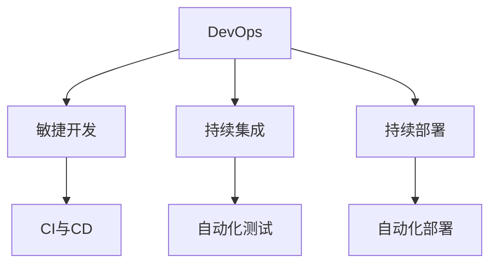

                 


### 文章标题：DevOps实践：P9工程师的全流程思维

#### 关键词：DevOps、持续集成、持续部署、自动化、敏捷开发、云原生、容器化技术

#### 摘要：
本文旨在为P9工程师提供全面的DevOps实践指南。通过深入解析DevOps的核心概念、技术原理、数学模型以及项目实战，本文旨在帮助读者理解DevOps的全流程思维，掌握其在现代软件开发中的实际应用。文章分为五大章节，涵盖了从基础理论到高级实践的各个方面，旨在为读者提供一条清晰的路径，以实现DevOps的最佳实践。

----------------------------------------------------------------

### 文章正文

#### 引言

在当今快速变化的软件开发环境中，DevOps已经成为提升软件交付效率和质量的关键方法论。P9工程师作为技术团队的领导者，需要具备全面理解DevOps的能力，以便在项目中实现高效协作和持续改进。本文将逐步分析DevOps的核心概念、技术原理、数学模型和项目实战，帮助P9工程师建立全流程思维，实现DevOps的最佳实践。

#### 目录

1. **背景介绍**
   - DevOps的定义与起源
   - DevOps的重要性
   - P9工程师的角色与责任

2. **核心概念与联系**
   - DevOps与敏捷开发的联系
   - 持续集成（CI）与持续部署（CD）

3. **核心算法原理讲解**
   - 持续集成的工作原理与流程
   - 持续部署的策略与实现

4. **数学模型和数学公式**
   - 风险管理模型
   - 量化度量标准

5. **项目实战**
   - 实战案例一：企业级DevOps实施
   - 实战案例二：云原生DevOps实践

6. **高级DevOps技巧**
   - 容器化技术
   - 云原生架构

7. **总结与展望**
   - DevOps实践的总结
   - 未来DevOps的发展趋势

8. **附录**
   - DevOps相关工具列表
   - 学习资源推荐

#### 1. 背景介绍

**DevOps的定义与起源**

DevOps是一种文化和运动，旨在通过强化软件开发（Development）与运维（Operations）之间的协作和沟通，来提高软件交付的效率和质量。DevOps起源于2000年代末期，当时许多企业开始意识到传统软件开发与运维之间的脱节，导致项目周期延长、质量问题频发。DevOps通过提倡自动化、敏捷开发和持续交付，实现了这两者之间的无缝衔接。

**DevOps的重要性**

随着软件定义的一切（Software-Defined Everything）趋势的兴起，DevOps的重要性愈发凸显。DevOps不仅能够加速软件交付，还能够提高系统的可靠性、安全性和可伸缩性。对于P9工程师来说，掌握DevOps不仅有助于提升个人技术能力，还能够为团队和组织带来显著的业务价值。

**P9工程师的角色与责任**

P9工程师通常是技术团队的高级成员，负责领导大型项目的开发和运维工作。在DevOps实践中，P9工程师的角色包括但不限于：

- 制定和推广DevOps策略
- 设计和实施自动化流程
- 搭建和优化持续集成/持续部署（CI/CD）管道
- 管理和优化基础设施
- 引导团队采用敏捷开发方法

#### 2. 核心概念与联系

**DevOps与敏捷开发的联系**

敏捷开发（Agile Development）是一种以人为核心、迭代和增量的软件开发方法。DevOps与敏捷开发之间有着密切的联系，两者都强调快速响应变化、持续交付和持续改进。DevOps通过将敏捷开发的理念扩展到运维领域，实现了从开发到生产环境的无缝协作。

**持续集成（CI）与持续部署（CD）**

持续集成（Continuous Integration，CI）是一种开发实践，通过频繁地将代码合并到主干分支，并进行自动化测试，确保代码质量。持续部署（Continuous Deployment，CD）则进一步将CI的概念扩展到生产环境，实现自动化的代码发布。


**Mermaid流程图**



#### 3. 核心算法原理讲解

**持续集成的工作原理与流程**

持续集成（CI）的核心思想是将代码频繁地合并到主干分支，并通过自动化测试确保代码质量。以下是CI的基本流程：

1. **代码提交**：开发者将自己的代码提交到版本控制系统。
2. **构建触发**：版本控制系统检测到提交后，触发构建过程。
3. **自动化测试**：构建系统执行一系列预定义的测试，包括单元测试、集成测试等。
4. **结果反馈**：测试结果通过邮件、通知等方式反馈给开发者。

**伪代码示例**

```python
def continuous_integration():
    # 检查代码提交
    if code_submitted():
        # 开始构建
        build_start()
        # 运行单元测试
        run_unit_tests()
        # 运行集成测试
        run_integration_tests()
        # 检查测试结果
        if test_passed():
            # 提交成功，通知开发者
            notify_developer("CI成功：代码通过测试")
        else:
            # 提交失败，通知开发者
            notify_developer("CI失败：代码未通过测试")
```

**持续部署的策略与实现**

持续部署（CD）是将经过CI验证的代码自动部署到生产环境。CD的策略包括：

- **蓝绿部署**：在新的环境（蓝环境）部署新版本，再逐步切换流量。
- **灰度发布**：在部分用户中逐步部署新版本，观察反馈后再全量发布。

**伪代码示例**

```python
def continuous_deployment():
    # 检查CI结果
    if ci_passed():
        # 部署到测试环境
        deploy_to_test_env()
        # 运行测试环境下的验收测试
        run_acceptance_tests()
        # 检查测试结果
        if test_passed():
            # 部署到生产环境
            deploy_to_production_env()
            # 通知开发者
            notify_developer("CD成功：新版本已部署到生产环境")
        else:
            # 部署失败，回滚至旧版本
            rollback_to_previous_version()
            # 通知开发者
            notify_developer("CD失败：新版本未通过测试，已回滚至旧版本")
    else:
        # CI未通过，不执行CD
        notify_developer("CI未通过，CD暂停")
```

#### 4. 数学模型和数学公式

**风险管理模型**

在DevOps实践中，风险管理至关重要。以下是一个简单但有效的风险管理模型：

\[ R = \frac{P \times C}{S} \]

其中：
- \( R \)：风险水平
- \( P \)：概率（发生故障的可能性）
- \( C \)：成本（故障导致的损失）
- \( S \)：安全措施（风险缓解措施）

**举例说明**

假设某系统有20%的概率发生故障，每次故障的成本为5000美元，而采取安全措施的成本为2000美元。根据公式计算：

\[ R = \frac{0.20 \times 5000}{2000} = 0.50 \]

这意味着风险水平为50%，表明该系统存在中等风险。

#### 5. 项目实战

**实战案例一：企业级DevOps实施**

**项目背景与目标**

某大型企业需要提升软件交付效率，实现快速响应市场需求。项目目标包括：
- 构建高效的持续集成/持续部署管道
- 提高系统的可靠性、安全性和可伸缩性
- 建立自动化的基础设施管理流程

**环境搭建**

1. **版本控制系统**：选择Git作为版本控制系统。
2. **自动化构建工具**：使用Jenkins作为自动化构建工具。
3. **测试环境**：搭建测试环境，包括应用服务器、数据库等。
4. **生产环境**：部署到云平台，如AWS或Azure。

**源代码管理**

1. **代码仓库**：将所有项目代码存储在Git仓库中。
2. **分支策略**：采用Git Flow或GitLab Flow等分支策略。
3. **代码审查**：使用GitLab或GitHub进行代码审查。

**持续集成与持续部署流程**

1. **构建触发**：代码提交到Git仓库时，Jenkins自动触发构建。
2. **自动化测试**：执行单元测试、集成测试和验收测试。
3. **部署到测试环境**：通过Jenkins将代码部署到测试环境，运行验收测试。
4. **部署到生产环境**：通过蓝绿部署或灰度发布将代码部署到生产环境。

**实际操作与案例分析**

在实际操作中，企业通过持续集成和持续部署实现了以下效果：
- 短时间内将新功能推向市场。
- 提高了系统的稳定性和安全性。
- 降低了人工干预的风险和成本。

**项目小结**

通过实施企业级DevOps，企业不仅提高了软件交付效率，还实现了自动化和智能化的运维管理。项目总结指出，成功的关键在于明确的策略、完善的工具链和持续的学习与改进。

**实战案例二：云原生DevOps实践**

**云原生概述**

云原生（Cloud-Native）是指应用程序在云计算环境中构建、运行和管理的最佳实践。云原生应用程序具有以下特点：
- **容器化**：使用容器（如Docker）封装应用及其依赖。
- **微服务架构**：将应用程序拆分为小而独立的微服务。
- **自动化**：通过自动化工具实现基础设施的自动化部署和管理。

**Kubernetes与CI/CD**

Kubernetes是云原生应用的核心平台，用于容器编排和管理。CI/CD在云原生环境中同样至关重要。

**实际操作与案例分析**

某企业在迁移至云原生架构时，采用以下步骤：

1. **容器化应用**：使用Docker将应用容器化。
2. **部署到Kubernetes**：使用Kubernetes进行容器编排和管理。
3. **配置CI/CD管道**：使用GitLab CI/CD构建和部署容器镜像。

通过云原生DevOps实践，企业实现了以下效果：
- 灵活的部署和管理。
- 高度的可伸缩性。
- 显著降低了运维成本。

#### 6. 高级DevOps技巧

**容器化技术**

容器化是云原生架构的核心。容器提供了一种轻量级、可移植的封装方式，使得应用程序可以在不同的环境中运行，而无需关心底层的基础设施。

**Docker与容器编排**

Docker是一种容器化技术，用于封装、分发和运行应用程序。容器编排则是指如何管理和调度容器。Kubernetes是当前最流行的容器编排工具。

**Kubernetes的深入使用**

Kubernetes提供了丰富的功能，如自动扩展、滚动更新、负载均衡等。深入使用Kubernetes可以帮助企业实现更高效、更可靠的容器化应用管理。

#### 7. 总结与展望

**DevOps实践的总结**

DevOps通过强化开发和运维之间的协作，实现了更高效、更可靠的软件交付。实践中的成功案例表明，DevOps不仅提高了软件质量，还降低了运营成本。

**未来DevOps的发展趋势**

随着云计算、大数据和人工智能等技术的发展，DevOps也在不断进化。未来的DevOps将更加智能化、自动化，并与新兴技术深度融合。

#### 8. 附录

**DevOps相关工具列表**

- 版本控制系统：Git、Mercurial
- 自动化构建工具：Jenkins、GitLab CI、Travis CI
- 测试框架：JUnit、Selenium、Cucumber
- 容器化技术：Docker、Kubernetes
- 监控工具：Prometheus、Grafana、ELK Stack

**学习资源推荐**

- 《DevOps手册》
- 《持续交付：发布可靠软件的实践之路》
- Kubernetes官方文档
- 云原生计算基金会（CNCF）资源

#### 结语

作者：AI天才研究院/AI Genius Institute & 禅与计算机程序设计艺术 /Zen And The Art of Computer Programming

本文《DevOps实践：P9工程师的全流程思维》旨在为P9工程师提供全面的DevOps实践指南。通过深入解析DevOps的核心概念、技术原理、数学模型和项目实战，本文旨在帮助读者理解DevOps的全流程思维，掌握其在现代软件开发中的实际应用。希望本文能对P9工程师在DevOps实践中提供有价值的参考和指导。

