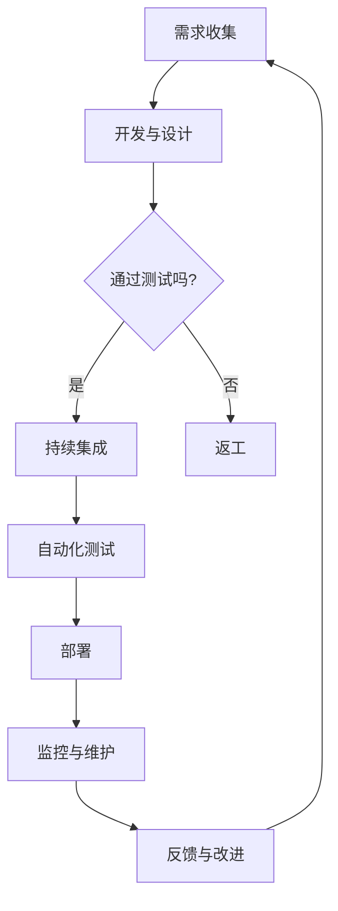

                 

### DevOps文化：打破开发与运维的壁垒

#### 关键词：DevOps文化、持续集成/持续部署、敏捷开发、基础设施即代码

#### 摘要：
DevOps文化是一种倡导开发与运维协作的实践方式，通过打破传统开发与运维之间的壁垒，实现更高效的软件开发、测试、部署和运维过程。本文将从DevOps的起源与重要性、核心概念与联系、核心算法原理讲解、数学模型与公式应用、项目实战、推广与实践以及未来趋势等方面，深入探讨DevOps文化的内涵和实际应用，帮助读者全面理解并掌握DevOps的核心技术和实践方法。

---

### 引言：DevOps文化的起源与重要性

#### 1. DevOps的起源与演进

DevOps文化起源于20世纪90年代末到21世纪初，其初衷是为了解决软件开发和IT运维之间存在的协作难题。当时，软件开发团队（Development）和IT运维团队（Operations）在职责上存在明显的分界，导致双方在项目进度、质量控制和问题解决等方面产生诸多矛盾。开发者专注于编码和实现新功能，而运维人员则负责系统的部署、监控和维护。这种分离的工作模式，不仅降低了团队之间的沟通效率，还增加了项目的风险和成本。

随着互联网的快速发展，企业对软件交付的速度和质量提出了更高的要求。为了应对这一挑战，一些企业开始尝试将开发和运维团队合并，以实现更紧密的协作和更高效的软件开发流程。这种尝试逐渐演变成了一种新型的文化——DevOps。

#### 2. DevOps的核心价值观

DevOps文化的核心价值观包括以下几个方面：

- **协作**：打破开发与运维之间的壁垒，实现团队之间的紧密协作，共同推进项目进展。
- **自动化**：通过自动化工具和流程，减少人工干预，提高工作效率和可靠性。
- **持续交付**：实现持续集成、持续部署和持续交付，确保软件交付的连续性和稳定性。
- **质量保证**：从项目开始就关注质量，通过自动化测试和持续监控，确保软件质量。
- **共享责任**：开发和运维团队共同承担项目的责任，共同解决问题和应对挑战。

#### 3. DevOps与敏捷开发的关联

敏捷开发（Agile Development）是一种以人为核心、迭代、灵活应对变化的软件开发方法。DevOps与敏捷开发有着紧密的关联，二者共同追求快速交付高质量软件的目标。

- **敏捷开发强调**：用户需求的变化、快速迭代、团队协作、持续改进。
- **DevOps强调**：自动化、持续交付、基础设施即代码、共享责任。

DevOps与敏捷开发的结合，可以更好地实现快速交付、持续改进和高效协作。通过DevOps实践，敏捷开发团队可以更加专注于开发和创新，同时确保软件交付的稳定性和可靠性。

### Mermaid流程图：DevOps实践的整体流程

### 总结

通过上述分析，我们可以看到DevOps文化是一种旨在打破开发与运维壁垒的新型实践方式，其核心是协作、自动化和持续交付。DevOps与敏捷开发的结合，可以更好地实现快速交付、持续改进和高效协作。在接下来的章节中，我们将进一步探讨DevOps的核心概念、算法原理、数学模型以及项目实战，帮助读者全面理解并掌握DevOps文化。

---

在引言部分，我们首先介绍了DevOps文化的起源与重要性，包括其起源背景、核心价值观以及与敏捷开发的关联。随后，我们通过一个Mermaid流程图展示了DevOps实践的整体流程，为后续章节的内容铺垫了基础。

接下来，我们将进一步深入探讨DevOps的核心概念，如持续集成/持续部署（CI/CD）、基础设施即代码（IaC）等，并解释这些概念之间的联系和相互作用。通过详细的理论讲解和实践案例，我们将帮助读者理解这些概念在实际开发与运维过程中的应用和价值。

