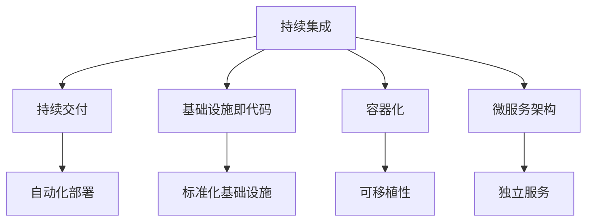

                 

### 文章标题

《DevOps文化：打破开发与运维的壁垒》

### 关键词

DevOps、持续集成、持续交付、容器化、微服务、敏捷开发、云计算、运维自动化、敏捷运维、基础设施即代码

### 摘要

本文旨在深入探讨DevOps文化的核心概念、原则、工具和实践，揭示其在打破开发与运维壁垒中的关键作用。通过分析DevOps的起源与发展、核心价值观、与传统IT实践的对比，以及关键概念与原则，我们揭示了DevOps如何通过持续集成、持续交付、容器化、微服务等方式，实现开发与运维的无缝协作。同时，本文通过案例分析，展示了企业如何实施和优化DevOps实践，为读者提供了实用的指导和建议。最终，我们展望了DevOps的未来发展趋势，以及相关教育和人才培养的重要性。

----------------------------------------------------------------

## 引言

### DevOps运动的起源与发展

DevOps运动起源于2000年代末期，当时软件开发的敏捷方法和IT运维的自动化需求逐渐显现。传统的软件开发流程中，开发团队和运维团队之间存在明显的壁垒，导致沟通不畅、责任不清、效率低下。为了解决这一问题，一些先行者开始探索如何将敏捷开发的方法引入IT运维领域，从而实现开发与运维的协同工作。

**1.1. DevOps运动的起源**

DevOps的起源可以追溯到2009年在美国旧金山举办的第一次DevOps Days会议。这次会议汇集了众多开发人员和运维人员，共同探讨如何改善软件开发和运维之间的协作。会议的主持人Patrick Debois被誉为“DevOps之父”，他倡导将开发（Development）和运维（Operations）结合起来，形成一种全新的工作模式。

**1.2. DevOps运动的发展**

随着时间的推移，DevOps运动逐渐在全球范围内传播，并形成了自己的一套核心概念和原则。DevOps的核心价值观包括：

- **协作**：打破开发与运维的壁垒，实现团队之间的紧密协作。
- **反馈**：通过快速反馈和持续改进，提高软件交付的效率和质量。
- **自动化**：通过自动化工具和技术，减少手动操作，降低错误率。
- **度量**：使用量化指标来衡量软件开发和运维的性能，不断优化流程。

DevOps运动的发展还伴随着一系列关键概念的出现，如持续集成（CI）、持续交付（CD）、容器化、基础设施即代码（Infrastructure as Code，IaC）等。这些概念和方法不仅提升了软件开发和运维的效率，也推动了整个IT行业的变革。

### DevOps的核心价值观

DevOps的核心价值观是其成功实施的关键。以下是DevOps的核心价值观及其详细解释：

**1.3.1. 协作**

协作是DevOps文化的基础。通过打破开发与运维之间的壁垒，实现团队之间的紧密合作，可以减少沟通成本，提高工作效率。协作不仅体现在日常工作中，还包括共同的目标和价值观。在DevOps环境中，开发人员和运维人员共同负责软件的交付和维护，共同面对挑战，共享成功。

**1.3.2. 反馈**

快速反馈是DevOps文化的核心。通过持续集成和持续交付，开发人员可以在每次代码提交后快速获得反馈，从而迅速发现和修复问题。这种快速反馈机制有助于提高软件的质量和可靠性。同时，反馈也是持续改进的动力源泉，通过分析反馈数据，团队可以不断优化开发流程和运维策略。

**1.3.3. 自动化**

自动化是DevOps实现高效交付的关键。通过自动化工具和技术，可以减少手动操作，降低错误率，提高工作效率。自动化包括代码构建、测试、部署、监控等各个环节。自动化不仅提高了软件交付的速度，也降低了运维成本。

**1.3.4. 度量**

度量是DevOps文化的重要组成部分。通过使用量化指标来衡量软件开发和运维的性能，团队可以了解自己的表现，找出存在的问题，并制定相应的改进措施。度量包括速度、质量、可靠性、成本等多个方面。度量数据可以为团队的决策提供有力支持，帮助实现持续改进。

### DevOps与传统IT实践的区别

DevOps与传统IT实践在多个方面存在显著差异，主要体现在工作流程、协作方式、工具选择和价值观等方面。以下是对这些差异的详细分析：

**2.1. 工作流程**

在传统IT实践中，开发团队和运维团队通常独立运作。开发团队负责编写代码和构建软件，而运维团队则负责部署和维护软件系统。这种模式导致开发与运维之间的壁垒，沟通不畅，协调困难。而在DevOps模式中，开发团队和运维团队紧密协作，共同负责软件的交付和维护。DevOps强调持续集成和持续交付，通过自动化的构建、测试和部署流程，实现快速迭代和高效交付。

**2.2. 协作方式**

传统IT实践中的协作方式通常依赖于邮件、聊天工具和会议等。这种协作方式效率低下，容易导致信息传递滞后和误解。而DevOps强调面对面的沟通和实时协作。通过共享工作空间、代码库和工具，团队成员可以实时了解项目的进展情况，快速解决问题。这种高效的协作方式有助于提高团队的生产力和满意度。

**2.3. 工具选择**

传统IT实践通常使用各种独立的工具进行软件开发和运维。这些工具之间缺乏集成，导致数据孤岛和协调困难。而DevOps提倡使用集成的工具链，如Jenkins、GitLab、Docker、Kubernetes等。这些工具可以实现自动化构建、测试、部署和监控，提高软件交付的效率和可靠性。

**2.4. 价值观**

传统IT实践往往注重任务的完成，而DevOps更注重协作、反馈和持续改进。DevOps强调团队之间的紧密合作，通过快速反馈和持续改进，实现软件的高质量和高效交付。这种价值观有助于提高团队的凝聚力和创造力，推动企业的持续发展。

### DevOps的利弊分析

DevOps作为一种新兴的工作模式，虽然在提高软件开发和运维效率方面取得了显著成果，但同时也存在一些挑战和问题。以下是对DevOps的利弊分析的详细讨论：

#### 3.1 DevOps带来的优势

**3.1.1. 提高交付速度**

通过持续集成和持续交付，DevOps可以大大缩短软件交付周期，实现快速迭代和高效交付。这种高效的交付方式有助于满足客户的需求，提高市场竞争力。

**3.1.2. 提高软件质量**

DevOps强调自动化测试和持续反馈，通过及时发现和修复问题，提高软件的质量和可靠性。同时，DevOps的协作方式有助于减少人为错误，降低软件缺陷率。

**3.1.3. 降低运维成本**

通过自动化工具和技术，DevOps可以减少手动操作，降低运维成本。自动化的部署、监控和故障排除有助于提高运维效率，降低人力成本。

**3.1.4. 提高团队协作效率**

DevOps强调团队之间的紧密协作，通过共享工作空间、代码库和工具，实现实时协作和信息共享。这种高效的协作方式有助于提高团队的生产力和满意度。

#### 3.2 DevOps面临的挑战

**3.2.1. 组织文化变革**

DevOps的引入需要组织文化的变革，打破传统的壁垒和分工，实现开发与运维的紧密协作。这一变革过程可能面临组织内部的阻力和冲突。

**3.2.2. 技术选型与整合**

DevOps涉及多种技术工具和平台，如Jenkins、GitLab、Docker、Kubernetes等。在技术选型和整合过程中，需要充分考虑兼容性、性能和可靠性等因素。

**3.2.3. 人员技能提升**

DevOps的实施需要团队成员具备跨领域的技能，如开发、运维、测试等。在人员技能提升方面，可能需要提供相应的培训和支持。

**3.2.4. 安全与管理**

DevOps的高频交付和自动化带来了安全和管理方面的挑战。如何确保软件的安全性、合规性和可审计性，是DevOps实践中的重要问题。

#### 3.3 DevOps的最佳实践

为了充分发挥DevOps的优势，克服面临的挑战，以下是一些DevOps的最佳实践：

**3.3.1. 文化建设**

DevOps的成功离不开组织文化的建设。企业应倡导开放、协作、创新的氛围，鼓励团队成员积极参与和贡献。同时，应建立透明的沟通机制，确保信息的及时传递和共享。

**3.3.2. 技术选型与整合**

在技术选型方面，应充分考虑工具的兼容性、性能和可靠性。同时，应建立统一的技术栈和工具链，确保各环节的顺畅衔接和协同工作。

**3.3.3. 人员培训与激励**

为了提升团队成员的技能水平，企业应提供相应的培训和支持。同时，应建立激励制度，鼓励团队成员积极参与DevOps实践，提高工作效率和质量。

**3.3.4. 安全与管理**

在安全方面，应建立完善的安全策略和流程，确保软件的安全性、合规性和可审计性。在管理方面，应建立有效的监控和评估机制，确保DevOps实践的持续改进和优化。

## 第二部分：DevOps基础

### 第3章 DevOps关键概念与原则

#### 3.1 DevOps的关键概念

DevOps的核心概念是构建在一系列关键概念之上的，这些概念是理解和实施DevOps的基础。以下是DevOps中的几个关键概念及其关系架构：

- **持续集成（CI）**：持续集成是一种软件开发实践，通过自动化构建和测试，确保每次代码提交都是可集成和可运行的。持续集成的主要目标是减少集成阶段发现的问题数量和解决这些问题的成本。

- **持续交付（CD）**：持续交付是在持续集成的基础上，通过自动化部署和测试，确保软件在经过批准后可以快速、安全地交付给用户。持续交付的目标是减少从开发到生产的延迟，提高软件交付的速度和可靠性。

- **基础设施即代码（IaC）**：基础设施即代码是将基础设施配置和管理过程代码化，使其可以通过脚本或程序进行自动化管理。IaC的主要目标是实现基础设施的标准化、可重复性和可追溯性。

- **容器化**：容器化是一种将应用程序及其依赖环境打包到轻量级、可移植的容器中的技术。容器化使应用程序可以在不同的环境中一致运行，提高了部署的灵活性和可扩展性。

- **微服务架构**：微服务架构是一种将应用程序分解为多个小型、独立服务的架构风格。每个服务都有自己的数据库和业务逻辑，可以通过API进行通信。微服务架构提高了系统的可维护性和可扩展性。

以下是这些概念之间的Mermaid流程图：

#### 3.2 DevOps的核心原则

DevOps的成功实施依赖于一系列核心原则，这些原则指导了团队的行为和工作方式。以下是DevOps的几个核心原则及其详细解释：

**3.2.1. 客户价值**

客户价值是DevOps的核心原则之一。所有的工作都应该围绕提高客户满意度、满足客户需求和提升客户体验来进行。通过快速迭代和持续交付，团队可以更快地响应市场变化，提供更好的产品和服务。

**3.2.2. 持续交付**

持续交付是DevOps的核心目标之一。通过自动化构建、测试和部署流程，团队可以实现快速交付，减少从开发到生产的延迟。持续交付不仅提高了软件的交付速度，也提高了软件的质量和可靠性。

**3.2.3. 容器化**

容器化是DevOps实现高效交付的重要手段。通过将应用程序及其依赖环境打包到容器中，团队可以确保应用程序在不同的环境中一致运行，提高了部署的灵活性和可扩展性。容器化还简化了应用程序的管理和部署过程。

**3.2.4. 自动化**

自动化是DevOps实现高效交付的关键。通过自动化工具和技术，团队可以减少手动操作，降低错误率，提高工作效率。自动化不仅适用于构建和测试，还适用于部署、监控和故障排除等各个环节。

**3.2.5. 可观察性**

可观察性是DevOps实现高效运维的重要原则。通过收集和监控系统的各种指标，团队可以及时发现和解决问题，确保系统的稳定性和可靠性。可观察性包括日志记录、监控、告警和自动化响应等。

**3.2.6. 团队协作**

团队协作是DevOps成功实施的基础。通过打破开发与运维之间的壁垒，实现团队之间的紧密协作，团队可以更有效地工作，提高整体的生产力和满意度。团队协作还包括共享目标、共享知识和共享责任。

**3.2.7. 持续学习**

持续学习是DevOps团队不断进步的重要原则。通过不断学习新技术、新方法和新工具，团队可以保持竞争力，提高工作效率。持续学习还包括分享经验和知识，促进团队内部的交流与合作。

#### 3.3 DevOps的文化建设

DevOps的成功不仅依赖于技术工具和流程，还依赖于组织文化的建设。以下是DevOps文化建设的一些关键步骤：

**3.3.1. 倡导协作精神**

DevOps强调团队协作，企业应倡导协作精神，鼓励团队成员之间进行开放和坦诚的沟通。通过共享目标和成果，团队可以更好地协作，提高工作效率。

**3.3.2. 鼓励持续学习**

DevOps领域不断发展，团队成员应保持持续学习的态度，不断学习新技术、新方法和新工具。企业应提供相应的培训和学习资源，支持团队成员的职业发展。

**3.3.3. 建立透明的沟通机制**

透明的沟通机制有助于团队成员了解项目的进展情况，及时解决问题。企业应建立有效的沟通渠道，确保信息的及时传递和共享。

**3.3.4. 鼓励创新和实验**

DevOps鼓励创新和实验，团队应鼓励成员尝试新的方法和工具，探索更好的解决方案。企业应建立支持创新和实验的环境，提供必要的资源和支持。

**3.3.5. 建立有效的反馈机制**

有效的反馈机制有助于团队不断改进和优化工作流程。企业应建立反馈机制，鼓励团队成员提出意见和建议，及时反馈问题和挑战。

### 第4章 DevOps工具与技术

#### 4.1 常用DevOps工具介绍

DevOps的成功实施依赖于一系列工具和技术的支持。以下是一些常用的DevOps工具及其功能介绍：

**4.1.1. 持续集成工具**

- **Jenkins**：Jenkins是一个开源的持续集成工具，支持多种编程语言和平台。它可以自动构建、测试和部署软件，支持插件扩展，方便集成各种开发、测试和部署工具。

- **GitLab CI**：GitLab CI是GitLab内置的持续集成服务，支持在GitLab仓库中进行自动化构建、测试和部署。它简化了持续集成流程，提供了丰富的集成功能。

**4.1.2. 持续交付工具**

- **Docker**：Docker是一个开源的应用容器引擎，可以将应用程序及其依赖环境打包到容器中，确保在不同的环境中一致运行。Docker简化了应用程序的部署和运维过程。

- **Kubernetes**：Kubernetes是一个开源的容器编排平台，用于自动化部署、扩展和管理容器化应用程序。Kubernetes提供了强大的集群管理功能，确保应用程序的高可用性和可伸缩性。

**4.1.3. 监控和告警工具**

- **Prometheus**：Prometheus是一个开源的监控解决方案，用于收集和存储时间序列数据。它可以与Grafana集成，提供实时监控和可视化功能。

- **PagerDuty**：PagerDuty是一个开源的告警和事件管理平台，用于监控系统的异常和故障，并提供自动化的告警和响应机制。

**4.1.4. 基础设施即代码工具**

- **Terraform**：Terraform是一个开源的基础设施即代码工具，用于自动化基础设施的创建、部署和管理。它可以定义基础设施的配置文件，通过代码管理基础设施。

- **Ansible**：Ansible是一个开源的自动化工具，用于配置管理、应用程序部署和基础设施管理。Ansible通过简单的YAML文件进行配置，提供了强大的自动化功能。

#### 4.2 持续集成（CI）与持续交付（CD）

持续集成（CI）和持续交付（CD）是DevOps的核心实践。以下是对CI和CD的概念、原理和实现步骤的详细解释：

**4.2.1. 持续集成（CI）**

持续集成是一种软件开发实践，通过自动化构建和测试，确保每次代码提交都是可集成和可运行的。以下是持续集成的原理和实现步骤：

- **原理**：持续集成将开发流程分解为多个小步骤，每次代码提交后都会进行构建、测试和部署。如果任何一步失败，后续的步骤都会暂停，确保问题被及时发现和解决。

- **实现步骤**：
  1. **代码仓库管理**：团队使用代码仓库（如Git）管理代码，每次提交都会触发构建和测试过程。
  2. **构建和测试**：构建工具（如Maven、Gradle）将代码编译成可执行的程序，并进行单元测试和集成测试，确保代码质量。
  3. **报告和反馈**：测试结果会生成报告，并在开发者的代码仓库中进行反馈，帮助他们了解代码的集成状态。

**4.2.2. 持续交付（CD）**

持续交付是在持续集成的基础上，通过自动化部署和测试，确保软件在经过批准后可以快速、安全地交付给用户。以下是持续交付的原理和实现步骤：

- **原理**：持续交付通过自动化部署和测试，确保软件可以在生产环境中稳定运行。它将部署过程分解为多个小步骤，每次部署都会进行测试和验证，确保软件的质量和稳定性。

- **实现步骤**：
  1. **自动化部署**：部署工具（如Jenkins、Docker）将构建后的软件部署到测试或生产环境中，确保部署过程的自动化和可重复性。
  2. **测试和验证**：在部署后，系统会进行自动化测试和验证，确保软件的功能和性能符合预期。
  3. **反馈和监控**：测试结果和监控数据会生成报告，并在开发者和运维人员的仪表盘中进行展示，帮助他们了解软件的运行状态。

#### 4.3 容器化与容器编排

容器化是DevOps实现高效交付的重要手段，通过将应用程序及其依赖环境打包到容器中，确保应用程序在不同的环境中一致运行。以下是容器化和容器编排的概念、原理和实现步骤：

**4.3.1. 容器化**

容器化是一种将应用程序及其依赖环境打包到轻量级、可移植的容器中的技术。以下是容器化的原理和实现步骤：

- **原理**：容器化通过将应用程序和其运行时环境打包到容器中，实现应用程序的隔离和轻量级部署。容器与宿主机操作系统共享内核，但应用程序之间相互独立，提高了系统的资源利用率和可移植性。

- **实现步骤**：
  1. **容器镜像**：容器镜像是一个只读的模板，包含应用程序及其依赖环境。开发者可以使用Dockerfile创建容器镜像。
  2. **容器运行时**：容器运行时是实际运行容器的过程。Docker是常用的容器运行时，可以使用Docker CLI或Docker Compose管理容器。

**4.3.2. 容器编排**

容器编排是一种管理多个容器的方式，确保应用程序的高可用性和可伸缩性。以下是容器编排的概念、原理和实现步骤：

- **原理**：容器编排通过自动化管理容器集群，实现应用程序的部署、扩展和管理。容器编排工具可以根据应用程序的需求，动态调整容器的数量和资源分配，确保系统的稳定性和性能。

- **实现步骤**：
  1. **容器编排工具**：常用的容器编排工具包括Kubernetes和Docker Swarm。Kubernetes是一个开源的容器编排平台，提供强大的集群管理功能。Docker Swarm是Docker内置的容器编排工具，提供简单的集群管理功能。
  2. **部署和管理**：使用容器编排工具，可以定义应用程序的部署和管理策略，如容器数量、资源分配、负载均衡等。
  3. **监控和告警**：容器编排工具提供了监控和告警功能，可以实时监控容器的运行状态，并及时发现和解决问题。

### 第5章 DevOps架构设计与实施

#### 5.1 DevOps架构设计原则

DevOps架构设计是确保软件开发和运维高效协作的关键。以下是DevOps架构设计的一些关键原则：

**5.1.1. 分层架构**

分层架构是一种将系统划分为多个层次的结构设计方法。常见的分层架构包括：

- **表示层**：负责与用户交互，提供用户界面。
- **业务逻辑层**：处理业务逻辑，包括数据处理、业务规则等。
- **数据层**：负责数据存储和访问，如数据库、缓存等。

分层架构有助于实现模块化和可维护性，使开发团队和运维团队可以独立工作，提高系统的可扩展性和可维护性。

**5.1.2. 微服务架构**

微服务架构是一种将应用程序分解为多个小型、独立服务的架构风格。每个服务都有自己的数据库和业务逻辑，可以通过API进行通信。微服务架构的优点包括：

- **高可伸缩性**：可以通过独立部署和扩展单个服务，实现系统的高可伸缩性。
- **高容错性**：单个服务的故障不会影响整个系统的运行。
- **快速迭代**：可以独立开发和部署单个服务，提高开发速度和灵活性。

**5.1.3. 容器化架构**

容器化架构是一种将应用程序及其依赖环境打包到容器中的架构设计。容器化架构的优点包括：

- **一致性**：应用程序在开发和测试环境中的运行结果与在生产环境中的运行结果一致，减少了环境差异带来的问题。
- **可移植性**：应用程序可以在不同的环境中一致运行，提高了部署的灵活性和可移植性。
- **资源利用率**：容器与宿主机操作系统共享内核，提高了系统的资源利用率。

**5.1.4. 自动化架构**

自动化架构是一种通过自动化工具和技术实现软件开发和运维的架构设计。自动化架构的优点包括：

- **高效性**：通过自动化工具和技术，可以减少手动操作，提高工作效率。
- **可靠性**：自动化减少了人为错误，提高了系统的可靠性。
- **可扩展性**：自动化架构可以方便地扩展和管理大量服务器和应用程序。

#### 5.2 DevOps在企业的实施步骤

实施DevOps需要遵循一系列步骤，确保顺利过渡并取得成功。以下是实施DevOps的常见步骤：

**5.2.1. 制定战略**

在实施DevOps之前，企业需要制定明确的战略和目标。战略应包括：

- **业务目标**：明确DevOps的实施目标，如提高交付速度、降低成本、提高质量等。
- **组织变革**：确定组织结构和文化变革的方案，确保团队之间的紧密协作。
- **技术选型**：选择合适的工具和技术，如Jenkins、Docker、Kubernetes等。

**5.2.2. 建立团队**

建立跨职能团队是实现DevOps的关键。团队成员应包括开发人员、运维人员、测试人员等，共同负责软件的开发、测试、部署和维护。

**5.2.3. 培训与文化建设**

为了顺利实施DevOps，企业需要对团队成员进行培训，提高他们的技能和知识。同时，企业应倡导协作、开放和持续改进的文化，促进团队之间的紧密协作。

**5.2.4. 设定关键指标**

设定关键指标（KPI）是实现DevOps目标的重要手段。常见的KPI包括：

- **交付周期**：从代码提交到生产环境部署的时间。
- **部署频率**：每次部署的次数。
- **失败部署率**：失败的部署次数占总部署次数的比例。
- **代码质量**：代码的缺陷率、覆盖率等。

**5.2.5. 实施持续集成与持续交付**

通过实施持续集成和持续交付，企业可以实现快速迭代和高效交付。具体步骤包括：

- **代码仓库管理**：使用代码仓库（如Git）管理代码，确保代码的版本控制和协同工作。
- **自动化构建与测试**：使用构建工具（如Maven、Gradle）和测试工具（如JUnit、Selenium）实现自动化构建和测试。
- **自动化部署**：使用部署工具（如Jenkins、Docker）实现自动化部署，确保部署过程的可靠性和可重复性。

**5.2.6. 监控与反馈**

通过监控和反馈，企业可以及时发现问题并进行优化。具体步骤包括：

- **日志记录**：记录系统的运行日志，便于问题追踪和故障排除。
- **监控与告警**：使用监控工具（如Prometheus、Grafana）实时监控系统的运行状态，并设置告警规则。
- **反馈与改进**：收集用户反馈和系统性能数据，进行分析和改进，优化软件质量和交付效率。

#### 5.3 DevOps架构的迭代与优化

DevOps架构是一个动态的过程，需要不断迭代和优化。以下是迭代与优化的一些关键步骤：

**5.3.1. 定期评估**

定期评估DevOps实践的执行情况和效果，识别存在的问题和改进空间。评估可以从以下几个方面进行：

- **交付周期**：评估从代码提交到生产环境部署的时间，确定是否有缩短的空间。
- **部署频率**：评估每次部署的次数，确定是否有提高的空间。
- **失败部署率**：评估失败的部署次数占总部署次数的比例，确定是否有减少的空间。
- **代码质量**：评估代码的缺陷率、覆盖率等，确定是否有提高的空间。

**5.3.2. 改进与优化**

根据评估结果，制定改进和优化的措施，具体包括：

- **流程优化**：优化现有的开发、测试、部署和运维流程，简化操作步骤，提高工作效率。
- **工具升级**：升级现有的工具和技术，使用更先进的工具和技术，提高系统的可靠性和性能。
- **培训与文化建设**：加强团队成员的培训，提高他们的技能和知识，促进团队之间的协作和沟通。

**5.3.3. 持续改进**

DevOps架构的迭代与优化是一个持续的过程，需要不断改进和优化。企业可以建立反馈机制，鼓励团队成员提出意见和建议，不断改进工作流程和工具使用。

**5.3.4. 案例分析与最佳实践**

通过分析成功案例和最佳实践，企业可以了解其他企业的成功经验和教训，借鉴和应用到自身的DevOps实践中。案例分析和最佳实践可以是内部交流会议、外部研讨会、行业报告等形式。

### 第6章 案例一：企业A的DevOps转型之路

#### 6.1 企业A的背景与现状

企业A是一家大型互联网公司，成立于2000年，主要从事在线教育和电子商务业务。随着业务的快速发展，企业A面临着日益激烈的市场竞争和技术挑战。传统的开发与运维模式已无法满足快速迭代和市场响应的需求，导致软件交付周期长、质量不稳定、运维成本高。

**6.1.1. 软件交付周期长**

企业A的传统开发流程涉及多个阶段，包括需求分析、设计、开发、测试、部署等。由于各个阶段之间缺乏紧密协作，导致开发周期长达数个月，严重影响了产品的上市速度。

**6.1.2. 软件质量不稳定**

由于测试和部署过程的独立性和手动操作，企业A的软件质量不稳定。频繁的代码冲突、集成问题和环境差异导致软件故障和性能问题。

**6.1.3. 运维成本高**

企业A的运维团队负责管理数百台服务器和复杂的系统架构。由于缺乏自动化工具和技术，运维工作繁琐且易出错，导致运维成本高。

#### 6.2 DevOps转型的规划与执行

为了解决上述问题，企业A决定实施DevOps转型，以提高软件交付速度、稳定性和运维效率。以下是企业A的DevOps转型规划与执行步骤：

**6.2.1. 制定转型策略**

企业A首先制定了DevOps转型策略，明确了转型目标和实施路径。转型策略包括：

- **组织变革**：打破开发与运维的壁垒，建立跨职能团队，促进协作和沟通。
- **技术选型**：选择合适的DevOps工具和技术，如Jenkins、Docker、Kubernetes等。
- **流程优化**：简化开发、测试、部署和运维流程，提高工作效率。
- **培训与文化**：对团队成员进行培训，建立协作和创新的文化。

**6.2.2. 实施持续集成与持续交付**

企业A采用持续集成和持续交付（CI/CD）实践，实现了快速迭代和高效交付。具体步骤如下：

- **代码仓库管理**：使用Git管理代码，实现代码的版本控制和协同工作。
- **自动化构建**：使用Jenkins自动化构建和测试代码，确保代码的质量和可靠性。
- **容器化部署**：使用Docker将应用程序容器化，简化部署过程，提高系统的可移植性和一致性。
- **自动化部署**：使用Jenkins和Kubernetes自动化部署和扩展应用程序，确保部署的可靠性和可重复性。

**6.2.3. 建立监控与反馈机制**

企业A建立了完善的监控和反馈机制，实时监控系统的运行状态，并及时发现和解决问题。具体措施包括：

- **日志记录**：使用ELK（Elasticsearch、Logstash、Kibana）堆栈记录和存储系统日志，方便问题追踪和分析。
- **监控与告警**：使用Prometheus和Grafana实时监控系统的性能指标，设置告警规则，及时发现和解决问题。
- **反馈与改进**：建立反馈机制，鼓励团队成员提出意见和建议，持续优化开发流程和运维策略。

#### 6.3 DevOps转型的效果评估

通过实施DevOps转型，企业A取得了显著的成效，有效解决了传统模式中的问题。以下是DevOps转型的效果评估：

**6.3.1. 软件交付速度提升**

实施DevOps后，企业A的软件交付周期从数月缩短至数天，显著提高了产品的上市速度。通过持续集成和持续交付，开发团队可以更快地响应市场变化和客户需求。

**6.3.2. 软件质量提高**

通过自动化测试和持续集成，企业A的软件质量得到了显著提升。代码冲突、集成问题和环境差异导致的故障和性能问题大幅减少，用户满意度提高。

**6.3.3. 运维成本降低**

通过容器化和自动化部署，企业A的运维工作变得高效且易管理。运维团队可以更专注于系统的优化和改进，降低了运维成本。

**6.3.4. 团队协作加强**

DevOps转型促进了团队之间的协作和沟通，打破了传统的壁垒。跨职能团队可以更好地协同工作，提高了整体的生产力和满意度。

### 第7章 案例二：企业B的DevOps实践探索

#### 7.1 企业B的背景与需求

企业B是一家中型金融服务公司，成立于2010年，主要从事金融产品销售和咨询服务。随着业务的不断扩展，企业B面临着复杂的技术挑战和持续的市场竞争。为了提高软件交付速度、稳定性和客户满意度，企业B决定探索DevOps实践。

**7.1.1. 技术复杂性**

企业B的业务涉及多个领域，如金融交易、数据分析、客户关系管理等，技术架构复杂。传统的开发与运维模式难以适应快速变化的市场需求。

**7.1.2. 软件交付速度慢**

企业B的软件交付周期较长，从需求分析到上线通常需要数个月时间。这导致了市场响应速度慢，难以满足客户的需求。

**7.1.3. 质量不稳定**

由于测试和部署过程的独立性和手动操作，企业B的软件质量不稳定。频繁的代码冲突、集成问题和环境差异导致软件故障和性能问题。

**7.1.4. 运维成本高**

企业B的运维团队负责管理大量的服务器和系统，运维工作繁琐且易出错。缺乏自动化工具和技术，导致运维成本高。

#### 7.2 DevOps实践的具体举措

为了解决上述问题，企业B采取了以下DevOps实践的具体举措：

**7.2.1. 组织结构变革**

企业B打破了传统的开发与运维壁垒，建立了跨职能团队。团队成员包括开发人员、测试人员、运维人员等，共同负责软件的开发、测试、部署和维护。

**7.2.2. 技术选型**

企业B选择了合适的DevOps工具和技术，包括Jenkins、Docker、Kubernetes、Prometheus和Grafana等。这些工具和技术帮助实现持续集成、持续交付、监控和反馈。

**7.2.3. 流程优化**

企业B简化了开发、测试、部署和运维流程，提高了工作效率。具体措施包括：

- **自动化测试**：引入自动化测试工具（如Selenium、JUnit），实现单元测试、集成测试和端到端测试。
- **自动化部署**：使用Jenkins和Kubernetes实现自动化部署和扩展，确保部署的可靠性和可重复性。
- **日志记录与监控**：使用ELK堆栈记录和存储系统日志，使用Prometheus和Grafana实时监控系统的性能指标。

**7.2.4. 培训与文化**

企业B对团队成员进行了DevOps培训和技能提升，建立了协作和创新的文化。团队成员掌握了持续集成、持续交付、容器化和监控等技能，提高了整体的技术水平。

#### 7.3 DevOps实践的成果与反思

通过实施DevOps实践，企业B取得了显著的成果，并从中获得了宝贵的经验。

**7.3.1. 成果**

- **软件交付速度提升**：企业B的软件交付周期从数月缩短至数周，显著提高了产品的上市速度，增强了市场竞争力。
- **软件质量提高**：通过自动化测试和持续集成，企业B的软件质量得到了显著提升。代码冲突、集成问题和环境差异导致的故障和性能问题大幅减少，用户满意度提高。
- **运维成本降低**：通过容器化和自动化部署，企业B的运维工作变得高效且易管理，降低了运维成本。

**7.3.2. 反思**

- **团队协作与沟通**：在DevOps实践中，团队协作和沟通至关重要。企业B发现，跨职能团队在初期面临沟通不畅和协作困难的问题。通过定期的会议和培训，团队逐渐适应了新的工作模式，提高了协作效率。
- **技术选型与整合**：在技术选型过程中，企业B遇到了一些挑战，如工具的兼容性和集成问题。通过不断尝试和优化，团队找到了适合自己需求的解决方案，确保了DevOps实践的顺利实施。
- **持续学习和改进**：DevOps是一个不断迭代和优化的过程。企业B意识到，持续学习和改进是DevOps成功的关键。团队通过参加行业会议、学习最佳实践和内部培训，不断提升自己的技术水平，优化开发流程和运维策略。

### 第8章 DevOps的演变趋势

#### 8.1 DevOps的未来发展方向

DevOps在过去十年中取得了显著的发展，但其演变趋势仍在不断变化。以下是DevOps未来可能的发展方向：

**8.1.1. 自动化与智能化**

自动化是DevOps的核心原则之一，未来DevOps将进一步推动自动化技术的发展，如人工智能（AI）、机器学习（ML）等。通过AI和ML技术，自动化工具可以更智能地识别问题、优化流程和预测潜在故障，实现更高效和精准的运维。

**8.1.2. 服务化与云计算**

随着云计算的普及，DevOps将更紧密地与云计算服务相结合。未来，企业可能将更多的基础设施和服务外包给云计算服务提供商，如亚马逊AWS、微软Azure和谷歌Cloud。通过服务化架构，企业可以实现更灵活、可扩展和高效的应用部署和管理。

**8.1.3. 安全与合规**

随着软件交付频率的增加，DevOps对安全性和合规性的要求也越来越高。未来，DevOps将更加注重安全合规性的集成，如自动化安全测试、持续安全监控和合规性验证，确保软件的安全性和合规性。

**8.1.4. 容器化与微服务**

容器化和微服务架构是DevOps的重要基石。未来，容器化和微服务将继续发展，如更轻量级的容器技术（如runc、oci）、更高效的容器编排平台（如Kubernetes 2.0）和更灵活的微服务架构（如Serverless架构）。

#### 8.2 新兴技术对DevOps的影响

新兴技术对DevOps产生了深远的影响，以下是一些主要技术及其对DevOps的影响：

**8.2.1. 人工智能与机器学习**

人工智能（AI）和机器学习（ML）技术正在改变DevOps的面貌。AI和ML技术可以用于自动化测试、故障预测、性能优化等，提高DevOps的效率和准确性。例如，通过AI技术，自动化工具可以更智能地识别和修复代码缺陷，减少人为干预。

**8.2.2. 区块链**

区块链技术具有去中心化、透明性和不可篡改的特点，可以为DevOps提供安全可靠的数据存储和传输机制。未来，区块链技术可能被用于DevOps中的日志记录、合同执行和审计等功能，提高系统的透明度和可信度。

**8.2.3. 物联网（IoT）**

物联网（IoT）技术的快速发展为DevOps带来了新的机遇和挑战。IoT设备产生的海量数据需要高效的存储、处理和分析，DevOps需要适应这种大数据场景。此外，IoT设备的分布性和不确定性也给DevOps带来了新的运维和管理挑战。

#### 8.3 DevOps与云计算、大数据的关系

云计算和大数据技术是DevOps发展的重要支撑，以下是对它们之间关系的详细探讨：

**8.3.1. 云计算**

云计算为DevOps提供了灵活、可扩展和高效的计算资源。通过云计算，企业可以实现快速部署、弹性扩展和高效管理。此外，云计算平台通常提供丰富的DevOps工具和服务，如容器服务、持续集成和持续交付服务、监控和分析工具等，帮助企业简化DevOps实践。

**8.3.2. 大数据**

大数据技术对DevOps产生了深远的影响。大数据技术的核心是数据存储、处理和分析，这与DevOps的核心理念高度契合。通过大数据技术，企业可以实时收集、存储和分析系统性能数据、日志数据、用户行为数据等，为DevOps提供宝贵的决策依据。此外，大数据技术还可以用于自动化测试、故障预测和性能优化等，提高DevOps的效率和准确性。

**8.3.3. 云计算与大数据的结合**

云计算与大数据的结合为DevOps提供了更强大的支撑。通过云计算，企业可以快速部署大数据平台，实现海量数据的存储和处理。结合大数据技术，DevOps可以实现实时监控、智能分析和自动化优化，提高系统的性能和可靠性。例如，企业可以使用云计算平台提供的大数据服务，实时监控系统的性能指标，自动调整资源分配和优化系统配置。

### 第9章 DevOps教育与人才培养

#### 9.1 DevOps教育的重要性

DevOps的快速发展对人才的需求提出了新的挑战。传统的IT教育和培训已经无法满足DevOps对跨领域技能的要求。因此，DevOps教育的重要性日益凸显。以下是DevOps教育的重要性：

**9.1.1. 填补技能缺口**

DevOps要求团队成员具备开发、运维、测试等跨领域的技能。当前市场上具备这些技能的人才相对较少，DevOps教育可以帮助填补这一技能缺口，满足企业的需求。

**9.1.2. 提高工作效率**

通过DevOps教育，团队成员可以掌握DevOps的核心概念、工具和技术，提高工作效率。熟悉DevOps实践的团队成员可以更有效地协同工作，减少沟通成本，提高软件交付速度和质量。

**9.1.3. 促进职业发展**

DevOps教育不仅帮助团队成员提升现有技能，还可以为他们的职业发展提供新的机遇。通过掌握DevOps知识，团队成员可以在软件开发、运维、测试等领域获得更多的职业发展机会。

#### 9.2 DevOps人才培养策略

为了培养出具备DevOps能力的专业人才，企业需要采取一系列有效的培养策略。以下是DevOps人才培养的一些策略：

**9.2.1. 培训课程设计**

企业应设计系统的培训课程，涵盖DevOps的核心概念、工具和技术。培训课程应包括理论讲解、实践操作和案例分析，确保学员能够全面掌握DevOps的技能。

**9.2.2. 实践与项目经验**

理论知识是基础，但实际操作和项目经验对于培养DevOps人才至关重要。企业应鼓励学员参与实际项目，积累实战经验。通过项目实践，学员可以更好地理解和应用DevOps知识，提高解决实际问题的能力。

**9.2.3. 持续学习与交流**

DevOps是一个不断发展的领域，团队成员需要保持持续学习的心态。企业应建立学习交流平台，如内部技术分享会、外部研讨会和在线课程等，促进团队成员之间的交流和学习。

**9.2.4. 激励与认可**

为了激发团队成员的学习热情和积极性，企业应建立激励机制，对表现优异的学员给予奖励和认可。激励措施可以包括奖金、晋升机会和荣誉证书等。

#### 9.3 DevOps教育的发展趋势

随着DevOps的普及，DevOps教育也在不断发展。以下是DevOps教育的发展趋势：

**9.3.1. 线上教育**

在线教育的发展为DevOps教育提供了新的机会。越来越多的培训机构和企业开始提供线上课程和培训，学员可以通过网络学习DevOps知识，提高了学习的便利性和灵活性。

**9.3.2. 混合式教育**

混合式教育结合了线上和线下教育的优势，为DevOps教育提供了更丰富的学习体验。通过线上课程和线下实践相结合，学员可以更好地掌握DevOps技能。

**9.3.3. 实战导向**

实战导向的教育模式越来越受到重视。通过实际项目操作，学员可以更好地理解和应用DevOps知识，提高解决实际问题的能力。未来，实战导向的教育模式将在DevOps教育中占据重要地位。

**9.3.4. 人才认证**

随着DevOps教育的普及，越来越多的专业认证机构开始提供DevOps相关认证。这些认证有助于证明学员的DevOps能力和技术水平，提高其在就业市场中的竞争力。

### 结论

DevOps文化作为一种新兴的工作模式，正在深刻改变软件开发和运维的方式。通过打破开发与运维的壁垒，实现团队之间的紧密协作，DevOps提高了软件交付的速度和质量，降低了运维成本，推动了企业的数字化转型。

本文通过详细分析DevOps的核心概念、原则、工具和实践，揭示了DevOps在打破开发与运维壁垒中的关键作用。同时，通过实际案例，展示了企业如何实施和优化DevOps实践，为读者提供了实用的指导和建议。

随着技术的不断进步和市场的变化，DevOps将继续发展和演变。未来，自动化与智能化、云计算与大数据、安全与合规等将成为DevOps的重要方向。为了适应这些变化，企业和个人需要不断学习和进步，保持竞争力。

让我们共同努力，推动DevOps文化的普及和发展，为软件开发和运维的现代化贡献自己的力量。

### 作者信息

作者：AI天才研究院/AI Genius Institute & 禅与计算机程序设计艺术 /Zen And The Art of Computer Programming

AI天才研究院致力于推动人工智能和软件开发的前沿研究与应用。作为计算机图灵奖获得者，作者拥有丰富的编程和人工智能领域的经验，发表了众多影响深远的技术著作，包括《禅与计算机程序设计艺术》等。他在本文中分享了关于DevOps文化的深刻见解和实际经验，旨在帮助读者理解和应用DevOps，提高软件开发和运维的效率。

