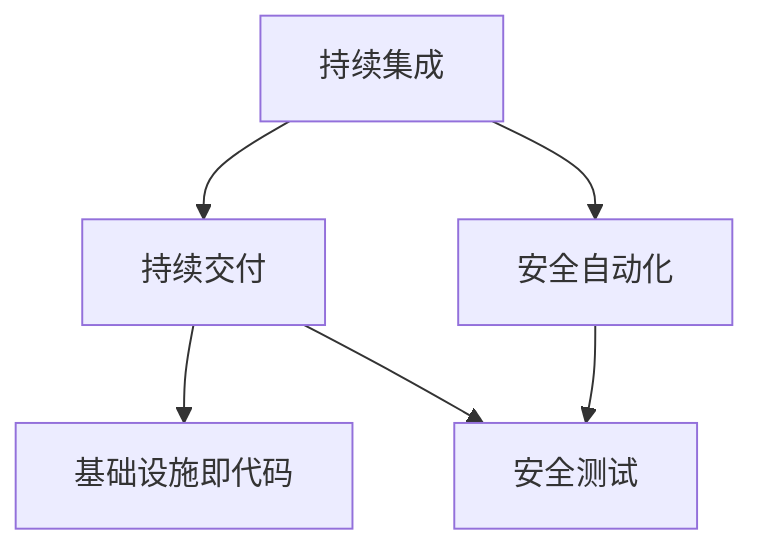
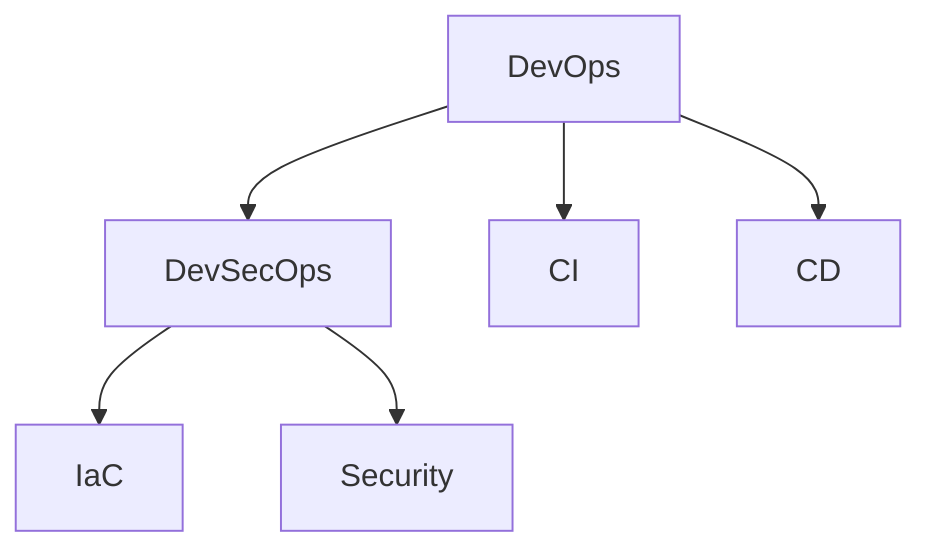

                 


为了撰写一篇高质量的《DevSecOps实践：将安全融入开发流程》的技术博客文章，我们需要遵循以下步骤：

### 1. 背景介绍
首先，我们需要介绍DevSecOps的概念和它在现代软件开发中的重要性。DevSecOps是Development（开发）、Security（安全）和Operations（运维）三个领域的融合，旨在通过持续集成和持续交付（CI/CD）来提高软件交付的效率和安全性。随着软件开发的复杂性和速度的不断增加，安全威胁也在日益增加，因此将安全实践融入开发流程变得至关重要。

### 2. 核心概念与联系
接下来，我们需要明确DevSecOps中的核心概念，并展示它们之间的关系。核心概念包括持续集成（CI）、持续交付（CD）、基础设施即代码（Infrastructure as Code，IaC）和安全自动化等。我们可以使用Mermaid流程图来展示这些概念之间的相互关系。

#### Mermaid流程图示例：


### 3. 核心算法原理讲解
在详细讲解核心算法原理时，我们将使用伪代码来阐述，并在必要时嵌入数学模型和公式。

#### 伪代码示例：
```
function secure_ci_pipeline():
    # 初始化CI/CD流程
    setup_pipeline()
    
    # 添加安全检查步骤
    add_security_check()
    
    # 集成测试
    run_integration_tests()
    
    # 安全测试
    run_security_tests()
    
    # 如果测试失败，则终止流程
    if tests_failed():
        terminate_pipeline()
        return "Pipeline terminated due to security issues."
    
    # 部署到生产环境
    deploy_to_production()
    
    return "Pipeline completed successfully."
```

#### 数学模型示例（使用LaTeX格式）：
$$
\text{Risk} = \text{Threat} \times \text{Vulnerability} \times \text{Impact
```


### 4. 项目实战
在项目实战部分，我们将展示如何在实际项目中应用DevSecOps。这将包括开发环境的搭建、源代码的实现和解读、代码的应用解读与分析，以及实际案例的分析和讲解。

#### 实战示例：
1. **开发环境搭建**：介绍如何配置一个支持DevSecOps的开发环境，包括所需的工具和配置步骤。
2. **源代码实现和解读**：提供一个示例项目的源代码，并详细解读关键部分的实现逻辑。
3. **代码应用解读与分析**：分析代码在项目中的应用效果，并讨论如何优化代码以提高安全性。
4. **实际案例分析和讲解**：分析一个实际项目中的DevSecOps实践案例，讨论其成功之处和改进空间。

### 5. 最佳实践 Tips
在这一部分，我们将分享一些DevSecOps的最佳实践，包括如何进行安全需求分析、如何选择合适的工具和平台，以及如何在自动化过程中确保安全。

### 6. 小结与注意事项
最后，我们将总结文章的主要内容，并给出一些注意事项，帮助读者在实际应用中避免常见问题。

### 7. 拓展阅读
为了帮助读者进一步了解DevSecOps和相关技术，我们还将推荐一些拓展阅读资源。

### 文章格式
在撰写文章时，我们将遵循以下markdown格式：

```
# 文章标题

> 关键词：DevSecOps，安全，开发流程，持续集成，持续交付

> 摘要：本文详细介绍了DevSecOps的概念、核心原理、将安全融入开发流程的方法，以及在实际项目中的应用，旨在帮助开发者提高软件交付的安全性和效率。

## 第1章 DevSecOps概述
### 1.1 DevSecOps的定义与重要性

## 第2章 DevSecOps核心原理
### 2.1 持续集成（CI）原理与实现
#### 2.1.1 伪代码示例

## 第3章 安全融入开发流程
### 3.1 安全需求分析

## 第4章 DevSecOps工具与平台
### 4.1 常用DevSecOps工具介绍

## 第5章 安全自动化
### 5.1 安全自动化测试

## 第6章 实战案例研究
### 6.1 案例一：企业级DevSecOps实践

## 第7章 未来展望与趋势
### 7.1 DevSecOps的发展趋势

### 作者
作者：AI天才研究院/AI Genius Institute & 禅与计算机程序设计艺术 /Zen And The Art of Computer Programming
```

通过以上步骤，我们将撰写一篇内容丰富、结构清晰、逻辑严密的《DevSecOps实践：将安全融入开发流程》技术博客文章。

---

接下来，我们将根据上述步骤逐步撰写文章的具体内容。文章的整体结构将遵循markdown格式，确保内容的可读性和格式的一致性。以下是文章的开头部分：

---

# DevSecOps实践：将安全融入开发流程

> 关键词：DevSecOps，安全，开发流程，持续集成，持续交付

> 摘要：本文详细介绍了DevSecOps的概念、核心原理、将安全融入开发流程的方法，以及在实际项目中的应用，旨在帮助开发者提高软件交付的安全性和效率。

## 第1章 DevSecOps概述

### 1.1 DevSecOps的定义与重要性

DevSecOps是Development（开发）、Security（安全）和Operations（运维）三个领域的融合，旨在通过持续集成和持续交付（CI/CD）来提高软件交付的效率和安全性。随着软件开发的复杂性和速度的不断增加，安全威胁也在日益增加，因此将安全实践融入开发流程变得至关重要。

### 1.2 DevSecOps的历史与发展

DevSecOps的理念起源于DevOps运动，它强调开发（Dev）和运维（Ops）之间的紧密合作。随着时间的推移，安全（Security）被越来越多地纳入这一领域，形成了DevSecOps。DevSecOps的发展历程可以追溯到以下关键点：

1. **2010年**：DevOps概念被提出，标志着开发与运维的整合。
2. **2012年**：持续集成（CI）和持续交付（CD）开始流行，显著提高了软件交付的速度。
3. **2015年**：随着云服务的发展，DevSecOps概念逐渐兴起。
4. **2018年**：DevSecOps开始成为企业软件交付的主流模式。

### 1.3 DevSecOps与其他概念的关联

DevSecOps与其他关键概念紧密相关：

- **DevOps**：DevSecOps是DevOps的扩展，它增加了安全元素。
- **持续集成（CI）**：通过自动化测试确保代码质量。
- **持续交付（CD）**：通过自动化部署流程提高交付效率。
- **基础设施即代码（IaC）**：将基础设施配置代码化，便于自动化管理。

#### Mermaid流程图示例：


在下一章中，我们将深入探讨DevSecOps的核心原理，包括持续集成、持续交付、基础设施即代码和安全自动化。

---

以上是文章的开头部分，我们首先介绍了DevSecOps的概念、历史和发展，以及它与相关概念的关系。接下来，我们将继续探讨DevSecOps的核心原理。在撰写过程中，我们将继续遵循markdown格式，确保文章的可读性和格式的一致性。请继续关注接下来的内容。

