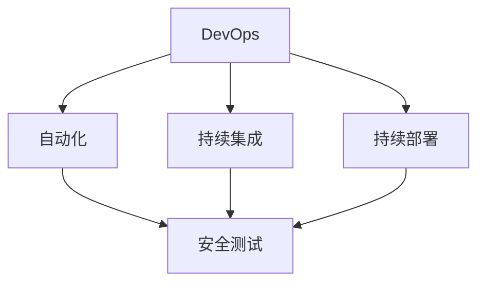

                 


## 文章标题

《DevSecOps：将安全融入开发流程》

## 文章关键词

- DevSecOps
- 安全
- 开发流程
- 自动化
- 持续集成
- 持续部署

## 文章摘要

本文深入探讨了DevSecOps的概念、原理和实践，强调了在开发流程中融入安全的重要性。通过分析其与传统安全实践的对比，以及自动化、持续集成和持续部署等关键技术的应用，文章提供了一个系统的框架，帮助企业构建安全、高效的开发环境。此外，通过实际案例分析和项目实战，本文为开发者提供了实用的最佳实践和解决方案。

### 引言

随着数字化转型的加速，软件的开发和部署流程变得越来越复杂。传统的开发模式往往将安全视为一个独立的阶段，导致安全问题和漏洞在开发后期才被识别和修复，这不仅影响了项目进度，还增加了修复成本。DevSecOps（Development and Security Operations）应运而生，它将安全贯穿于整个开发流程，从设计到部署，确保软件在交付前达到高安全标准。

### DevSecOps的核心概念与联系

DevSecOps并不是一个孤立的概念，它与DevOps、安全等概念紧密相连。DevOps注重开发和运维的协同工作，强调快速迭代和持续交付。而DevSecOps在DevOps的基础上，增加了安全这一重要环节，通过自动化、持续集成和持续部署等手段，将安全测试和漏洞修复纳入开发流程中。

以下是一个Mermaid流程图，展示了DevSecOps的核心概念及其相互关系：



在这个流程图中，我们可以看到，自动化、持续集成和持续部署是DevSecOps的核心支柱，而安全测试贯穿于整个流程中，确保每个环节都符合安全标准。

### DevSecOps的关键技术

1. **自动化工具**

自动化是DevSecOps的核心，它提高了开发效率和准确性。通过自动化工具，开发者可以自动化执行安全测试、漏洞扫描、代码审查等任务。以下是一个简单的伪代码示例，展示了如何使用自动化工具进行代码审查：

```python
def automated_code_review(code):
    vulnerabilities = []
    for line in code:
        if contains_vulnerability(line):
            vulnerabilities.append(line)
    return vulnerabilities

def contains_vulnerability(line):
    # 这里实现漏洞检测逻辑
    return True if "SQL injection" in line else False
```

2. **持续集成与持续部署**

持续集成（CI）和持续部署（CD）是DevSecOps的关键技术，它们确保代码在每次提交后都能自动构建、测试和部署。以下是一个简化的伪代码示例，展示了CI/CD的工作流程：

```python
def continuous_integration(code):
    build = build_code(code)
    test_results = run_tests(build)
    if test_results.failed:
        raise Exception("Tests failed")
    return build

def continuous_deployment(build):
    deploy_to_staging(build)
    run_security_tests(build)
    if security_tests_failed:
        raise Exception("Security tests failed")
    deploy_to_production(build)
```

3. **安全测试和漏洞管理**

安全测试是DevSecOps不可或缺的一部分。通过静态代码分析、动态代码分析、依赖关系检查等方式，开发者可以及时发现和修复安全漏洞。以下是一个简化的伪代码示例，展示了如何进行安全测试：

```python
def security_tests(code):
    vulnerabilities = []
    for test in [static_code_analysis, dynamic_code_analysis, dependency_check]:
        found_vulnerabilities = test(code)
        vulnerabilities.extend(found_vulnerabilities)
    return vulnerabilities

def static_code_analysis(code):
    # 这里实现静态代码分析逻辑
    return ["SQL injection"]

def dynamic_code_analysis(code):
    # 这里实现动态代码分析逻辑
    return []

def dependency_check(code):
    # 这里实现依赖关系检查逻辑
    return ["outdated_dependency"]
```

4. **安全信息收集和监控**

安全信息收集和监控是确保系统安全的关键。通过实时收集系统日志、网络流量等信息，开发者可以及时发现和响应潜在的安全威胁。以下是一个简化的伪代码示例，展示了如何收集和监控安全信息：

```python
def collect_security_logs():
    logs = ["log1", "log2", "log3"]
    return logs

def monitor_security_logs(logs):
    for log in logs:
        if log.indicates_attack():
            raise Exception("Potential attack detected")
```

### DevSecOps实施案例

以下是两个DevSecOps实施案例的简要描述：

1. **企业级DevSecOps实践**

某大型企业通过引入DevSecOps实践，实现了开发流程的自动化和高效化。通过持续集成和持续部署，企业显著提高了软件交付速度，同时降低了安全漏洞的风险。

2. **开源工具在DevSecOps中的应用**

某初创公司利用开源工具（如Jenkins、SonarQube等）构建了DevSecOps环境。通过自动化测试和安全检查，公司确保了软件在发布前达到高安全标准，提高了客户满意度。

### DevSecOps项目实战

以下是一个关于DevSecOps项目实战的简要描述：

**项目背景**：某电商平台需要构建一个安全的支付系统，以满足不断增长的交易需求。

**开发环境搭建**：开发者搭建了一个基于Docker的容器化开发环境，使用Jenkins作为CI/CD工具，实现了自动化构建、测试和部署。

**源代码详细实现**：开发者使用Java编写了支付系统的核心功能，同时引入了Spring Security框架，确保系统的安全性。

**代码解读与分析**：通过对代码的分析，开发者发现并修复了多个潜在的安全漏洞，如SQL注入、跨站脚本攻击等。

**实际案例分析和详细讲解剖析**：通过对支付系统的测试，开发者发现并解决了多个性能瓶颈和安全隐患，确保了系统的稳定性和安全性。

**项目小结**：该项目通过DevSecOps实践，实现了快速迭代和安全交付。开发者不仅提高了开发效率，还显著降低了安全风险。

### 最佳实践 tips

1. **尽早引入安全测试**：在开发早期引入安全测试，可以及时发现和修复漏洞，降低修复成本。

2. **持续监控和改进**：持续监控安全信息和日志，及时响应潜在的安全威胁，并不断改进安全策略。

3. **培训和教育**：对开发团队进行安全培训，提高其安全意识和技能。

### 小结

DevSecOps是一种将安全融入开发流程的先进实践。通过自动化、持续集成和持续部署等关键技术，DevSecOps确保了软件在交付前达到高安全标准。实际案例和项目实战表明，DevSecOps不仅提高了开发效率，还降低了安全风险。未来，随着技术的不断发展，DevSecOps将在更多领域得到应用。

### 拓展阅读

- [DevSecOps概述](https://www.cvedetails.com/vulnerability-list/DevSecOps/All-Dist-All-Vendor.html)
- [DevSecOps最佳实践](https://www.infoq.com/minibooks/devsecops-best-practices/)
- [DevSecOps工具集](https://www.sonarlint.org/)

### 作者信息

作者：AI天才研究院/AI Genius Institute & 禅与计算机程序设计艺术 /Zen And The Art of Computer Programming

