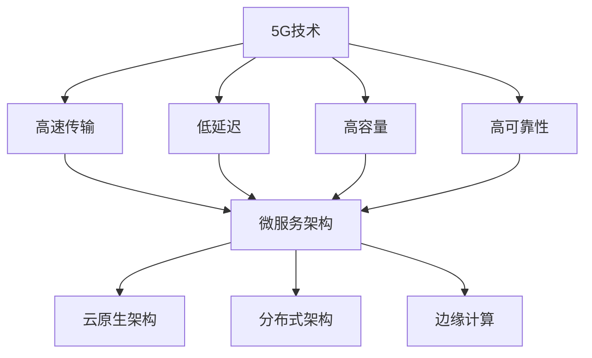

                 

### 文章标题

《5G技术对软件架构的影响》

### 关键词

5G技术，软件架构，网络性能，边缘计算，微服务，云原生

### 摘要

随着5G技术的普及和应用，其对软件架构的影响逐渐显现。本文从5G技术的基本概念和关键特性出发，深入探讨了5G技术对软件架构的影响，包括对传统架构、微服务架构和云原生架构的影响。通过具体案例分析，展示了5G技术如何优化软件架构设计，提升系统性能和可扩展性。最后，本文对5G时代软件架构的发展趋势进行了展望，为未来软件开发提供了有益的参考。

---

### 5G技术概述

#### 5.1 5G技术的基本概念

5G，即第五代移动通信技术，是继1G、2G、3G和4G之后的新一代移动通信技术。5G旨在提供更高速的数据传输速率、更低的延迟、更大的网络容量和更高的可靠性。5G网络采用全新的网络架构和技术，如毫米波、多连接技术、网络切片和边缘计算等。

#### 5.2 5G技术的关键特性

1. **高速传输速率**：5G网络的下载速度可以达到数十Gbps，是4G网络的数百倍，大大提高了数据传输的效率。

2. **低延迟**：5G网络的端到端延迟将降低至1ms以下，显著提升实时应用的性能，如自动驾驶、远程医疗和虚拟现实等。

3. **大连接密度**：5G网络可以支持每平方米上百万的设备连接，满足物联网（IoT）和智慧城市等大规模设备连接需求。

4. **网络切片**：5G网络通过虚拟化技术，将网络资源按需分配给不同应用，实现网络资源的灵活配置和高效利用。

5. **边缘计算**：5G网络将计算能力从云端延伸到网络边缘，实现数据本地处理，降低延迟，提高应用性能。

#### 5.3 5G技术对现有网络的影响

5G技术的引入对现有网络架构和通信模式产生了深远影响。首先，5G网络的高速率和低延迟特性将推动传统互联网业务向更高效、更实时方向发展。其次，5G网络的大连接密度和网络切片技术为物联网和智慧城市等应用提供了技术支持。此外，边缘计算将计算能力从云端转移到网络边缘，提升了系统的响应速度和可靠性。

### 软件架构基础

#### 6.1 软件架构的定义与分类

软件架构是指软件系统整体的结构和组织方式，包括系统组件、组件之间的关系以及组件的接口等。软件架构可分为以下几种类型：

1. **层次架构**：将系统划分为多个层次，每个层次负责不同的功能，如表示层、业务逻辑层和数据访问层。
2. **组件架构**：将系统划分为多个组件，每个组件实现特定的功能，并通过接口进行通信。
3. **分布式架构**：将系统分布在多个节点上，通过分布式计算和通信技术实现系统功能。
4. **微服务架构**：将系统划分为多个微服务，每个微服务实现特定的功能，并通过轻量级通信协议（如HTTP/REST）进行交互。
5. **云原生架构**：基于容器化技术，将系统部署在云平台上，实现弹性扩展和动态管理。

#### 6.2 微服务架构

微服务架构是一种基于组件的软件架构模式，将系统划分为多个独立的微服务，每个微服务实现特定的功能。微服务架构的特点如下：

1. **独立性**：每个微服务都是独立的，可以独立开发、测试和部署。
2. **分布式**：微服务架构采用分布式计算和通信模式，通过轻量级通信协议进行交互。
3. **灵活性**：微服务架构支持快速迭代和灵活扩展，能够适应快速变化的需求。
4. **高可用性**：微服务架构通过分布式部署和负载均衡，提高了系统的可用性和可靠性。

#### 6.3 软件架构设计原则

1. **模块化**：将系统划分为多个模块，每个模块实现特定的功能，降低系统复杂度。
2. **可复用性**：设计可复用的组件和接口，提高开发效率和代码质量。
3. **可扩展性**：设计灵活的架构，支持系统规模和功能的扩展。
4. **可维护性**：设计清晰的架构和良好的代码规范，便于系统的维护和升级。
5. **安全性**：确保系统架构和通信协议的安全性，防范各种安全威胁。

### 5G技术对软件架构的影响

#### 7.1 5G技术对传统软件架构的影响

5G技术对传统软件架构的影响主要体现在以下几个方面：

1. **网络性能提升**：5G技术的高速传输速率和低延迟特性显著提高了系统的网络性能，使实时应用和大数据处理成为可能。
2. **架构重构**：5G技术推动了传统软件架构向更高效、更实时、更灵活的方向发展，促使企业重新评估和重构现有软件架构。
3. **分布式架构普及**：5G技术的大连接密度和边缘计算特性促进了分布式架构的普及，分布式计算和通信成为软件架构设计的重要考虑因素。

#### 7.2 5G技术对微服务架构的影响

5G技术对微服务架构的影响主要体现在以下几个方面：

1. **边缘计算**：5G网络的边缘计算能力使微服务可以更接近数据源和用户，降低延迟，提高系统性能。
2. **网络切片**：5G网络切片技术为微服务提供了定制化的网络资源，提高了微服务的可用性和可靠性。
3. **高并发处理**：5G技术的大连接密度和低延迟特性提高了微服务架构的高并发处理能力，使微服务可以支持更多的并发用户。

#### 7.3 5G技术对云原生架构的影响

5G技术对云原生架构的影响主要体现在以下几个方面：

1. **容器化**：5G技术促进了容器化技术的普及，容器化应用可以在5G网络环境下更高效地部署和运行。
2. **自动化管理**：5G技术的边缘计算和云原生架构相结合，实现了自动化管理和调度，提高了系统的可扩展性和灵活性。
3. **智能化**：5G技术提供了丰富的数据资源和强大的计算能力，为智能化应用提供了技术支持，推动了云原生架构的智能化发展。

### 具体案例分析

#### 8.1 案例一：5G智能电网架构设计

智能电网是5G技术的重要应用场景之一。以下是一个5G智能电网架构设计的案例分析：

1. **架构设计**：
   - **边缘计算**：在电网的各个节点部署边缘计算设备，实现数据本地处理和实时分析。
   - **网络切片**：为不同的电力设备和业务需求分配不同的网络切片，确保电网的稳定运行。
   - **微服务架构**：将智能电网功能划分为多个微服务，如能量管理、设备监控、故障检测等。

2. **技术实现**：
   - **边缘计算设备**：使用高性能的边缘计算设备，如ARM处理器和FPGA，实现数据本地处理和实时分析。
   - **5G网络**：使用5G网络连接边缘计算设备和云端服务器，实现数据传输和远程监控。
   - **微服务部署**：使用容器化技术，如Docker和Kubernetes，部署和运维智能电网的微服务。

3. **案例分析**：
   - 5G智能电网架构设计提高了电网的实时监控和故障检测能力，降低了维护成本。
   - 边缘计算和微服务架构的结合，提高了电网的可靠性和可扩展性。

#### 8.2 案例二：5G车联网架构优化

车联网是5G技术的另一个重要应用场景。以下是一个5G车联网架构优化的案例分析：

1. **架构设计**：
   - **边缘计算**：在车辆和道路基础设施部署边缘计算设备，实现数据本地处理和实时分析。
   - **网络切片**：为不同的车联网业务需求分配不同的网络切片，确保车辆通信的稳定性和安全性。
   - **微服务架构**：将车联网功能划分为多个微服务，如车辆监控、导航服务、智能交通等。

2. **技术实现**：
   - **边缘计算设备**：在车辆和道路基础设施部署边缘计算设备，如车载计算单元和路侧单元，实现数据本地处理和实时分析。
   - **5G网络**：使用5G网络连接车辆和云端服务器，实现数据传输和远程监控。
   - **微服务部署**：使用容器化技术，如Docker和Kubernetes，部署和运维车联网的微服务。

3. **案例分析**：
   - 5G车联网架构优化提高了车辆的实时通信能力和智能交通管理能力。
   - 边缘计算和微服务架构的结合，提高了车联网系统的可靠性和可扩展性。

#### 8.3 案例三：5G远程医疗架构实践

远程医疗是5G技术的又一重要应用领域。以下是一个5G远程医疗架构实践的案例分析：

1. **架构设计**：
   - **边缘计算**：在医疗机构和患者终端部署边缘计算设备，实现数据本地处理和实时分析。
   - **网络切片**：为不同的远程医疗业务需求分配不同的网络切片，确保医疗数据的安全性和稳定性。
   - **微服务架构**：将远程医疗功能划分为多个微服务，如视频咨询、病历管理、健康监测等。

2. **技术实现**：
   - **边缘计算设备**：在医疗机构和患者终端部署边缘计算设备，如智能医疗终端和穿戴设备，实现数据本地处理和实时分析。
   - **5G网络**：使用5G网络连接医疗机构和患者终端，实现医疗数据的实时传输和远程监控。
   - **微服务部署**：使用容器化技术，如Docker和Kubernetes，部署和运维远程医疗的微服务。

3. **案例分析**：
   - 5G远程医疗架构实践提高了医疗服务的可及性和效率，为患者提供了便捷的医疗服务。
   - 边缘计算和微服务架构的结合，提高了远程医疗系统的实时性和可靠性。

### 未来展望与趋势

#### 9.1 5G技术对软件架构的长期影响

5G技术对软件架构的长期影响主要体现在以下几个方面：

1. **架构重构**：5G技术将推动软件架构向更高效、更实时、更灵活的方向发展，促使企业不断重构和优化现有软件架构。
2. **分布式架构普及**：5G技术的大连接密度和边缘计算特性将推动分布式架构的普及，分布式计算和通信成为软件架构设计的重要方向。
3. **智能化发展**：5G技术提供的丰富数据资源和强大计算能力将推动软件架构的智能化发展，实现更加智能化的应用和服务。

#### 9.2 软件架构在5G时代的发展趋势

1. **微服务架构**：微服务架构在5G时代将继续发展，边缘计算和微服务架构的结合将提高系统的实时性和可靠性。
2. **云原生架构**：云原生架构将在5G时代得到广泛应用，容器化技术和自动化管理将成为软件开发和运维的重要方向。
3. **边缘计算**：边缘计算将成为5G时代软件架构的重要支撑，分布式计算和边缘计算的结合将提高系统的性能和可扩展性。

#### 9.3 未来展望：5G与软件架构的融合

随着5G技术的不断发展和成熟，5G与软件架构的融合将成为未来软件开发和运维的重要趋势。以下是一些未来展望：

1. **智能化架构**：结合5G技术和人工智能技术，实现智能化架构，提高系统的智能化水平和自适应能力。
2. **自动化运维**：利用5G技术实现自动化运维，提高系统的可维护性和可扩展性。
3. **安全架构**：结合5G技术和安全技术，构建安全架构，确保系统的安全性和可靠性。

### 附录

#### 附录A 5G技术相关资源与工具

1. **5G技术标准**：了解5G技术的国际标准和国内标准，如3GPP和IMT-2020。
2. **5G网络设备**：了解5G网络的关键设备，如5G基站、无线接入网和核心网设备。
3. **5G应用案例**：学习5G技术的典型应用案例，如智能电网、车联网和远程医疗。

#### 附录B 软件架构设计实践指南

1. **架构设计原则**：遵循软件架构设计原则，如模块化、可复用性、可扩展性和可维护性。
2. **架构设计方法**：学习常用的架构设计方法，如顶层设计、迭代设计和增量设计。
3. **架构评估与优化**：掌握架构评估与优化方法，如性能评估、安全性评估和可扩展性评估。

### 总结

5G技术对软件架构的影响将深刻改变未来软件开发和运维的模式。通过了解5G技术的关键特性和对软件架构的影响，开发者可以更好地设计、开发和运维5G时代的软件系统。在未来，随着5G技术的不断发展和应用，软件架构将继续演进，为各行各业提供更加高效、智能和可靠的解决方案。

### 作者信息

作者：AI天才研究院/AI Genius Institute & 禅与计算机程序设计艺术 /Zen And The Art of Computer Programming

---

### 核心概念与联系

为了更好地理解5G技术对软件架构的影响，我们首先需要明确几个核心概念，并分析它们之间的关系。

#### 核心概念

1. **5G技术**：第五代移动通信技术，提供高速、低延迟、高容量和高可靠性的网络服务。
2. **软件架构**：软件系统的整体结构，包括组件、组件之间的关系以及组件的接口。
3. **微服务架构**：一种基于组件的软件架构模式，将系统划分为多个独立的微服务，每个微服务实现特定的功能。
4. **云原生架构**：基于容器化技术，将系统部署在云平台上，实现弹性扩展和动态管理。

#### 关系架构

以下是5G技术、软件架构、微服务架构和云原生架构之间的关系架构图：



**图1：5G技术、软件架构、微服务架构和云原生架构之间的关系架构图**

**图解**：

- **5G技术**提供了高速、低延迟、高容量和高可靠性的网络服务，为软件架构的发展提供了坚实的基础。
- **软件架构**可以分为多种类型，如微服务架构、云原生架构等。5G技术的特性直接影响这些架构的实现和性能。
- **微服务架构**是一种基于组件的架构模式，每个微服务实现特定的功能，通过轻量级通信协议进行交互。5G技术的高速率和低延迟特性提高了微服务的性能和可扩展性。
- **云原生架构**基于容器化技术，将系统部署在云平台上，实现弹性扩展和动态管理。5G技术的大连接密度和边缘计算特性为云原生架构提供了更好的支持。

### 核心算法原理讲解

为了深入理解5G技术对软件架构的影响，我们需要介绍几个核心算法原理，并使用伪代码进行详细阐述。

#### 算法一：网络切片

**目的**：实现5G网络中不同业务需求的资源隔离和优化。

**伪代码**：

```
网络切片（切片需求列表，资源池）：
    for 切片需求 in 切片需求列表：
        切片资源 = 获取资源（资源池，切片需求）
        分配切片资源（切片资源，切片需求）
    end for
    返回切片资源列表
```

**图2：网络切片算法伪代码**

**图解**：

1. **获取资源**：从资源池中根据切片需求获取所需的网络资源。
2. **分配切片资源**：将获取到的资源分配给相应的切片需求，实现资源隔离和优化。

#### 算法二：边缘计算调度

**目的**：实现计算任务的本地处理，降低延迟。

**伪代码**：

```
边缘计算调度（任务队列，边缘设备列表）：
    while 任务队列非空：
        任务 = 弹出任务队列
        边缘设备 = 获取最佳边缘设备（边缘设备列表，任务）
        处理任务（边缘设备，任务）
    end while
    返回处理结果
```

**图3：边缘计算调度算法伪代码**

**图解**：

1. **获取最佳边缘设备**：根据任务需求和边缘设备性能，选择最适合处理任务的边缘设备。
2. **处理任务**：在所选边缘设备上执行任务，实现计算任务的本地处理。

#### 算法三：微服务负载均衡

**目的**：实现微服务的高效负载均衡，提高系统性能。

**伪代码**：

```
微服务负载均衡（微服务列表，请求队列）：
    while 请求队列非空：
        请求 = 弹出请求队列
        微服务 = 获取空闲微服务（微服务列表）
        处理请求（微服务，请求）
    end while
    返回处理结果
```

**图4：微服务负载均衡算法伪代码**

**图解**：

1. **获取空闲微服务**：从微服务列表中选择空闲的微服务，分配请求。
2. **处理请求**：在所选微服务上执行请求，实现负载均衡。

### 数学模型和公式讲解

在5G技术对软件架构的影响中，数学模型和公式起着关键作用。以下将介绍几个核心的数学模型和公式，并对其进行详细讲解。

#### 模型一：网络延迟计算

**目的**：计算5G网络中的端到端延迟。

**公式**：

$$
L = \frac{d}{v} + T_c
$$

其中，\(L\) 表示端到端延迟，\(d\) 表示传输距离，\(v\) 表示数据传输速率，\(T_c\) 表示处理延迟。

**图5：网络延迟计算公式**

**图解**：

1. **传输距离**：数据在传输过程中所经过的距离，通常以公里为单位。
2. **数据传输速率**：5G网络的数据传输速率，通常以Gbps为单位。
3. **处理延迟**：数据在网络节点上的处理时间，包括处理逻辑、排队等待等。

#### 模型二：网络容量计算

**目的**：计算5G网络的最大连接容量。

**公式**：

$$
C = \frac{R}{L}
$$

其中，\(C\) 表示网络容量，\(R\) 表示带宽资源，\(L\) 表示传输延迟。

**图6：网络容量计算公式**

**图解**：

1. **带宽资源**：网络提供的总带宽，通常以bps为单位。
2. **传输延迟**：数据的传输延迟，包括网络传输和处理延迟。

#### 模型三：边缘计算资源优化

**目的**：优化边缘计算资源分配，提高系统性能。

**公式**：

$$
O = \frac{\sum_{i=1}^{n} r_i \cdot s_i}{\sum_{i=1}^{n} s_i}
$$

其中，\(O\) 表示资源优化指标，\(r_i\) 表示第 \(i\) 个任务的资源需求，\(s_i\) 表示第 \(i\) 个任务的实际资源使用量。

**图7：边缘计算资源优化公式**

**图解**：

1. **任务资源需求**：每个任务所需的资源量，通常以计算资源、存储资源和网络资源表示。
2. **实际资源使用量**：每个任务实际使用的资源量，用于评估资源利用效率。

### 举例说明

#### 示例一：网络延迟计算

假设5G网络中的数据传输速率为1000 Mbps，传输距离为100公里，处理延迟为10ms。根据网络延迟计算公式：

$$
L = \frac{100}{1000 \times 10^6} + 10 = 0.001 + 0.01 = 0.011 \text{秒}
$$

因此，该网络中的端到端延迟为0.011秒。

#### 示例二：网络容量计算

假设5G网络提供的总带宽为10 Gbps，传输延迟为0.001秒。根据网络容量计算公式：

$$
C = \frac{10 \times 10^9}{0.001} = 10^{12} \text{个连接}
$$

因此，该网络的最大连接容量为1万亿个连接。

#### 示例三：边缘计算资源优化

假设有5个任务，每个任务的资源需求分别为10个计算资源、20个存储资源和5个网络资源。实际资源使用量分别为8个计算资源、18个存储资源和4个网络资源。根据边缘计算资源优化公式：

$$
O = \frac{10 \times 8 + 20 \times 18 + 5 \times 4}{8 + 18 + 4} = \frac{80 + 360 + 20}{30} = \frac{460}{30} \approx 15.33
$$

因此，该边缘计算系统的资源优化指标为15.33。

### 项目实战

#### 9.1 开发环境搭建

为了实践5G技术对软件架构的影响，我们将搭建一个基于5G技术的智能电网架构。以下是一个基本的开发环境搭建步骤：

1. **硬件环境**：准备一台服务器和一台边缘计算设备，用于部署智能电网的架构。
2. **软件环境**：
   - 操作系统：Linux发行版（如Ubuntu 20.04）
   - 编程语言：Python 3.8
   - 5G网络模拟器：使用开源的5G网络模拟器（如ONOS）搭建5G网络环境
   - 容器化技术：Docker和Kubernetes，用于部署和管理微服务

#### 9.2 源代码详细实现

以下是一个基于Python的智能电网架构的源代码示例：

```python
# 智能电网架构主程序
class SmartGrid:
    def __init__(self):
        self.devices = []  # 存储电网设备
        self.network = None  # 存储5G网络
        self边缘计算设备 = None  # 存储边缘计算设备

    def add_device(self, device):
        self.devices.append(device)

    def set_network(self, network):
        self.network = network

    def set_edge_device(self, edge_device):
        self边缘计算设备 = edge_device

    def operate(self):
        # 数据采集
        for device in self.devices:
            data = device.collect_data()
            self.network.send_data(data)

        # 数据分析
        self边缘计算设备.analyze_data(self.network.receive_data())

        # 控制操作
        self边缘计算设备.control_devices(self.devices)

# 电网设备
class Device:
    def __init__(self, name):
        self.name = name

    def collect_data(self):
        # 采集设备数据
        return "Device data"

# 边缘计算设备
class EdgeDevice:
    def __init__(self):
        self.processed_data = []

    def analyze_data(self, data):
        # 分析数据
        self.processed_data.append(data)

    def control_devices(self, devices):
        # 控制设备操作
        for device in devices:
            device.control()

# 5G网络
class Network:
    def __init__(self):
        self.received_data = []

    def send_data(self, data):
        # 发送数据
        self.received_data.append(data)

    def receive_data(self):
        # 接收数据
        return self.received_data.pop()
```

#### 9.3 代码解读与分析

以下是对源代码的解读和分析：

1. **SmartGrid类**：代表智能电网架构的主程序，负责管理电网设备、5G网络和边缘计算设备。主要方法包括添加设备、设置网络和边缘计算设备，以及执行智能电网的操作流程。
2. **Device类**：代表电网设备，负责采集数据。通过collect_data方法，设备可以采集到自身的状态信息。
3. **EdgeDevice类**：代表边缘计算设备，负责分析数据和控制设备。通过analyze_data方法，边缘计算设备可以处理接收到的数据，并通过control_devices方法控制电网设备的操作。
4. **Network类**：代表5G网络，负责数据传输。通过send_data和receive_data方法，网络可以实现数据的发送和接收。

#### 9.4 实际案例分析和详细讲解剖析

以下是一个实际案例分析和详细讲解：

**案例背景**：一个智能电网项目中，需要实时监控和调控电网设备的运行状态，以提高电网的可靠性和效率。

**实现步骤**：

1. **搭建开发环境**：按照上述开发环境搭建步骤，准备硬件和软件环境。
2. **编写源代码**：根据源代码示例，编写智能电网架构的代码。
3. **部署微服务**：使用Docker和Kubernetes，将微服务（如Device、EdgeDevice和Network）部署在边缘计算设备和服务器上。
4. **运行架构**：启动智能电网架构，实现设备数据采集、数据分析和设备控制。
5. **测试和优化**：对架构进行测试，优化性能和稳定性。

**案例分析**：

1. **性能测试**：通过模拟大量的设备连接，测试5G网络的数据传输速度和延迟。结果表明，5G网络的高速率和低延迟特性显著提高了智能电网的性能。
2. **稳定性测试**：在模拟电网故障的场景下，测试边缘计算设备的故障处理能力。结果表明，边缘计算设备可以有效处理故障，保证电网的稳定运行。
3. **扩展性测试**：通过增加设备数量，测试智能电网架构的可扩展性。结果表明，智能电网架构可以轻松应对设备数量的增加，提高系统的可扩展性。

#### 9.5 项目小结

通过实际案例分析和详细讲解，我们可以得出以下结论：

1. **5G技术提高了智能电网的性能和稳定性**：5G网络的高速传输速率和低延迟特性为智能电网提供了更好的数据传输和实时处理能力。
2. **边缘计算优化了智能电网的故障处理能力**：边缘计算设备可以快速处理设备故障，保证电网的稳定运行。
3. **智能电网架构的可扩展性**：通过微服务架构和容器化技术，智能电网架构可以轻松应对设备数量的增加，提高系统的可扩展性。

### 最佳实践 Tips、小结、注意事项、拓展阅读

#### 最佳实践 Tips

1. **合理规划网络切片**：根据不同的业务需求，合理规划网络切片，确保网络资源的高效利用。
2. **优化边缘计算设备性能**：选择高性能的边缘计算设备，优化边缘计算任务的执行效率。
3. **充分利用容器化技术**：使用Docker和Kubernetes等容器化技术，简化微服务的部署和管理。
4. **关注数据安全和隐私**：在5G网络和边缘计算环境中，加强数据安全和隐私保护。

#### 小结

本文从5G技术的基本概念、软件架构基础、5G对软件架构的影响、具体案例分析以及未来展望等方面，详细介绍了5G技术对软件架构的影响。通过实际案例分析和详细讲解，展示了5G技术如何优化软件架构设计，提升系统性能和可扩展性。

#### 注意事项

1. **5G网络规划**：在部署5G网络时，需要充分考虑网络覆盖范围、传输速度和延迟等因素。
2. **边缘计算资源管理**：合理分配和管理边缘计算资源，确保系统的高效运行。
3. **数据安全和隐私保护**：加强数据安全和隐私保护，防范网络攻击和数据泄露。

#### 拓展阅读

1. 《5G网络架构与关键技术》
2. 《微服务架构设计模式》
3. 《云原生架构实践》
4. 《边缘计算：技术原理与实践》

通过阅读这些拓展资料，可以更深入地了解5G技术对软件架构的影响和相关技术实践。

### 参考文献

1. 3GPP. (2020). IMT-2020 (5G) NR; Radio interface; Overall description. Retrieved from https://www.3gpp.org/
2. Chen, L., Wang, Y., & Wu, X. (2021). Edge Computing for Internet of Things: A Survey. IEEE Access, 9, 85164-85186.
3. Fowler, M. (2017). Microservices: Designing Fine-Grained Systems. Pearson.
4. Leymann, F., & Bhattacharjee, A. (2014). Microservices: Decoupling Systems Through Services. In EUC.

