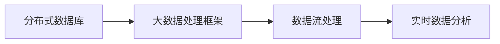

                 

### 确定文章主旨和目标读者

**《5G技术对软件架构的影响与挑战》**

**主旨：** 本文旨在探讨5G技术对软件架构产生的深远影响，以及在这一过程中所面临的诸多挑战。随着5G技术的快速发展和广泛应用，软件架构需要适应新的网络环境，满足更高的性能要求，同时保证系统的稳定性和安全性。

**目标读者：** 本文的目标读者是对5G技术和软件架构有一定了解的技术人员，包括程序员、系统架构师、CTO等。文章将提供深入的见解和分析，帮助他们理解5G技术对软件架构带来的变化，以及如何应对这些挑战。

### 引言

#### 5G技术概述

5G（第五代移动通信技术）是继2G、3G和4G之后的最新一代移动通信技术。它不仅是一个通信技术的升级，更是一个综合性的技术革命，涵盖了网络架构、数据传输、应用开发等多个方面。5G的目标是提供更高的数据速率、更低的延迟、更大的连接容量和更高的网络可靠性。

5G技术的关键特点包括：

1. **高数据速率**：5G的最大下载速度可达10Gbps，比4G快100倍，使得高速数据传输成为可能。
2. **低延迟**：5G的端到端延迟可低至1毫秒，这对于实时应用（如自动驾驶、远程手术等）至关重要。
3. **大规模连接**：5G能够支持数百万设备的并发连接，为物联网（IoT）提供了坚实的基础。
4. **网络切片**：5G网络支持网络切片技术，可以根据不同应用的需求动态分配网络资源，提高网络效率和灵活性。

#### 软件架构的基本概念

软件架构是指一个软件系统的高层次设计，它决定了系统的结构、行为和组件之间的交互。一个良好的软件架构不仅能够满足功能需求，还能够在可维护性、可扩展性和性能等方面具有优势。

软件架构通常包括以下几个关键组件：

1. **组件**：软件架构中的基本构建块，如模块、库和接口。
2. **接口**：组件之间的通信机制，定义了组件如何交互。
3. **通信路径**：组件之间传输数据和消息的路径。
4. **整体架构风格**：如分层架构、微服务架构、事件驱动架构等。

#### 5G技术对软件架构的影响与挑战

5G技术的出现为软件架构带来了许多新的机会和挑战。以下是一些主要的影响：

1. **更高的性能要求**：5G的高数据速率和低延迟要求软件架构能够支持更快的处理速度和更小的响应时间。
2. **更复杂的网络环境**：5G网络的复杂性和多样性要求软件架构具有更高的灵活性和适应性。
3. **网络不稳定的影响**：5G网络的不稳定性和潜在的网络中断可能会对软件系统的可用性造成影响。
4. **大规模数据处理的需求**：5G支持大规模连接，导致数据量激增，要求软件架构能够处理这些数据。
5. **安全性和隐私性的挑战**：5G网络带来了新的安全威胁，要求软件架构具备更强的安全性和隐私性保护机制。

综上所述，5G技术对软件架构的影响深远，需要我们深入探讨其带来的变化和挑战。接下来的章节将详细分析5G技术对网络架构、应用架构和数据架构的影响，并探讨5G技术带来的各种挑战。通过这些分析，我们希望能够为读者提供有价值的见解和解决方案。### 5G技术对软件架构的影响

5G技术的出现为软件架构带来了许多新的机会和挑战。以下是5G技术对软件架构的具体影响，我们将从网络架构、应用架构和数据架构三个方面进行详细探讨。

#### 5G技术对网络架构的影响

1. **网络架构的特点**

5G网络架构在设计上具有以下几个显著特点：

- **网络切片**：网络切片技术是5G网络的核心创新之一，它允许网络运营商为不同的应用和业务需求动态创建虚拟的子网络。这种灵活性使得网络资源可以根据具体需求进行精细化的管理和分配。
  
- **边缘计算**：5G网络通过引入边缘计算，将数据处理和存储从中心化的云计算节点转移到网络的边缘。这种分布式架构有助于降低延迟、提高响应速度，并减少数据传输量。

- **高可靠性**：5G网络采用了更加先进的信号处理和传输技术，如波束成形和MIMO（多输入多输出）技术，提高了网络的可靠性和覆盖范围。

2. **5G网络对软件架构的影响**

5G网络架构的特点对软件架构产生了深远的影响：

- **网络设计的灵活性**：网络切片技术使得软件架构可以根据不同的应用场景灵活调整网络资源配置，提高系统的可扩展性和适应性。

- **边缘计算的引入**：边缘计算使得数据处理更加靠近数据源头，降低了网络延迟，提高了系统的实时性和响应速度。软件架构需要考虑如何在边缘设备上处理和存储数据，以及如何与中心化系统进行高效的数据同步。

- **高可靠性的需求**：5G网络的高可靠性要求软件架构具备更好的容错性和恢复能力。这包括在网络中断或故障发生时，系统能够快速恢复并保证数据的完整性。

#### 5G技术对应用架构的影响

1. **应用架构的特点**

5G技术的应用架构具有以下特点：

- **低延迟和高并发**：5G的低延迟特性使得实时应用成为可能，如在线游戏、虚拟现实（VR）和增强现实（AR）。同时，5G的大规模连接能力支持高并发应用，如大规模在线会议和多人实时互动。

- **分布式架构**：5G网络环境下的应用架构往往采用分布式架构，以实现高效的数据处理和负载均衡。

- **服务质量（QoS）保障**：5G网络提供了更高的QoS保障能力，可以根据不同的应用需求提供不同的网络服务等级。

2. **5G应用架构的设计原则**

5G应用架构在设计时需要遵循以下原则：

- **模块化设计**：模块化设计使得应用架构更加灵活和可扩展，可以方便地添加新功能或进行架构升级。

- **微服务架构**：微服务架构可以将应用拆分成多个小型、独立的模块，每个模块负责特定的功能，这样可以提高系统的可维护性和可扩展性。

- **容错性和高可用性**：为了应对网络不稳定等因素，5G应用架构需要具备良好的容错性和高可用性设计。

3. **5G应用架构的案例**

以下是一个5G应用架构的案例：

- **智能交通系统**：5G技术可以支持智能交通系统中的实时监控、车辆管理和交通信号控制等功能。通过边缘计算，系统可以在车辆附近实时处理数据，提高交通管理的效率和响应速度。

- **远程医疗**：5G技术可以支持远程医疗中的实时视频诊断、远程手术和医疗监控等功能。通过低延迟和高并发的网络特性，医生可以与患者进行实时互动，提高医疗服务的质量和效率。

#### 5G技术对数据架构的影响

1. **数据架构的特点**

5G技术下的数据架构具有以下特点：

- **海量数据处理**：5G支持大规模连接，导致数据量急剧增加。数据架构需要能够处理这些海量数据，并从中提取有价值的信息。

- **实时数据处理**：5G的低延迟特性要求数据架构能够实时处理和分析数据，以满足实时应用的需求。

- **分布式存储和处理**：5G技术下的数据架构通常采用分布式存储和处理技术，以提高数据的可靠性和可扩展性。

2. **5G数据架构的设计原则**

5G数据架构在设计时需要遵循以下原则：

- **数据分层存储**：将数据按层次进行存储，如将热数据存储在内存中，冷数据存储在硬盘或分布式存储系统中。

- **数据流处理**：采用数据流处理技术，如Apache Kafka或Apache Flink，实时处理和分析数据流。

- **数据安全和隐私保护**：5G数据架构需要具备强大的数据安全和隐私保护机制，以防止数据泄露和未经授权的访问。

3. **5G数据架构的案例**

以下是一个5G数据架构的案例：

- **智慧城市**：5G技术可以支持智慧城市中的各种数据收集、传输和处理需求。通过物联网设备和传感器，城市管理者可以实时收集交通、环境、公共安全等方面的数据，进行智能分析和决策。

- **工业物联网**：5G技术可以支持工业物联网中的设备监控、故障预测和性能优化等功能。通过实时数据处理和智能分析，企业可以提高生产效率，降低维护成本。

综上所述，5G技术对软件架构的影响体现在网络架构、应用架构和数据架构的各个方面。这些影响不仅为软件架构带来了新的机会，也带来了诸多挑战。在下一部分中，我们将探讨5G技术带来的挑战，并分析如何应对这些挑战。### 5G技术带来的挑战

尽管5G技术为软件架构带来了许多机遇，但同时也带来了许多挑战。以下将从软件架构设计、软件开发和软件部署三个方面探讨5G技术所带来的具体挑战。

#### 5G技术对软件架构设计的挑战

1. **高并发与低延迟**

5G技术支持高并发和低延迟，这对软件架构设计提出了更高的要求。软件架构需要能够处理大量的并发请求，同时保持低延迟。例如，在实时应用中，如在线游戏和远程手术，延迟要求可能低至几毫秒。

**挑战一：设计可扩展架构**

为了应对高并发，软件架构需要具备良好的可扩展性。传统的单体架构可能无法满足这一需求，需要采用分布式架构，如微服务架构。微服务架构可以将应用拆分成多个小型、独立的模块，每个模块可以独立扩展和部署，从而提高系统的整体性能。

2. **大规模数据处理**

5G技术支持大规模连接，导致数据量急剧增加。软件架构需要能够高效地处理海量数据，并进行实时分析。

**挑战二：设计高效的数据架构**

为了应对大规模数据处理，软件架构需要采用分布式存储和处理技术。例如，可以采用分布式数据库和大数据处理框架，如Apache Hadoop和Apache Kafka。分布式架构可以提高数据的可靠性、可用性和可扩展性。

3. **网络不稳定的影响**

5G网络的不稳定性和潜在的网络中断可能会对软件系统的可用性造成影响。

**挑战三：设计高可用性架构**

为了应对网络不稳定，软件架构需要具备良好的容错性和高可用性。这可以通过以下方法实现：

- **冗余设计**：在关键组件和节点之间实现冗余，确保在单个节点或组件失败时，系统仍然可以正常运行。
- **故障转移**：实现故障转移机制，当主节点或组件失败时，系统可以自动切换到备用节点或组件。
- **数据备份**：定期备份数据，确保在数据丢失或损坏时，可以快速恢复。

#### 5G技术对软件开发带来的挑战

1. **开发工具和技术的更新**

随着5G技术的不断发展，开发工具和技术也在不断更新。例如，为了支持5G网络，需要使用新的编程语言和框架，如JavaScript的WebAssembly（Wasm）和Rust语言。

**挑战四：技术更新的挑战**

为了应对开发工具和技术的更新，开发团队需要不断提升技能水平。例如，可以定期组织内部培训和技术分享，确保团队成员掌握最新的技术。

2. **开发团队的技能提升**

5G技术的复杂性和多样性要求开发团队具备更高的技能水平。例如，需要掌握边缘计算、网络切片、容器化等技术。

**挑战五：团队技能提升的挑战**

为了提升团队技能，可以采取以下措施：

- **内部培训**：组织内部培训课程，针对5G技术进行深入讲解和实操训练。
- **外部合作**：与业界领先的5G技术公司合作，共同开发5G应用，提高团队的实际经验。

3. **软件质量的保证**

5G技术的应用场景多样，对软件质量的要求也各不相同。如何保证软件质量成为一个重要的挑战。

**挑战六：软件质量保证的挑战**

为了保证软件质量，可以采取以下方法：

- **自动化测试**：采用自动化测试工具进行全面的测试，确保软件在各个阶段都能满足质量要求。
- **持续集成和持续部署（CI/CD）**：通过CI/CD流程，确保软件在每次更新和部署时都能稳定运行。

#### 5G技术对软件部署带来的挑战

1. **部署环境的变化**

5G技术下的部署环境与传统网络环境有所不同，如需要支持边缘计算和分布式存储。这要求软件部署需要适应这些变化。

**挑战七：部署环境变化的挑战**

为了应对部署环境的变化，可以采取以下措施：

- **容器化部署**：采用容器化技术，如Docker和Kubernetes，实现软件的快速部署和移植。
- **边缘计算支持**：优化软件架构，使其能够支持边缘计算环境，如使用边缘计算框架和工具。

2. **部署成本的增加**

5G技术的应用场景多样，可能导致部署成本的增加。例如，在需要支持高并发和低延迟的应用中，可能需要更多的硬件资源和网络带宽。

**挑战八：部署成本的增加**

为了降低部署成本，可以采取以下措施：

- **资源优化**：通过资源优化技术，如负载均衡和自动扩展，提高硬件资源的利用率。
- **云计算和边缘计算结合**：利用云计算和边缘计算的互补性，实现成本效益最大化。

3. **部署效率的提高**

5G技术的应用场景多样，可能导致部署频率的增加。如何提高部署效率成为一个重要的挑战。

**挑战九：部署效率的提高**

为了提高部署效率，可以采取以下措施：

- **自动化部署**：采用自动化部署工具，如Jenkins和Ansible，实现软件的自动化部署和配置。
- **快速迭代**：采用敏捷开发方法，快速迭代和交付软件，缩短部署周期。

综上所述，5G技术对软件架构设计、软件开发和软件部署带来了许多挑战。为了应对这些挑战，需要从架构设计、开发团队技能提升、软件质量保证、部署环境适应、部署成本控制和部署效率提高等多个方面进行综合考虑和应对。在下一部分中，我们将介绍如何解决这些挑战，并分享一些最佳实践。### 解决方案与最佳实践

在面对5G技术带来的挑战时，我们可以通过一系列解决方案和最佳实践来应对。以下将详细介绍这些解决方案和最佳实践，包括架构设计原则、开发方法、测试策略等方面。

#### 架构设计原则

1. **分层架构**

分层架构是将系统分为多个层次，每个层次负责特定的功能。这种架构设计原则有助于提高系统的可维护性和可扩展性。5G技术下的软件架构设计应考虑以下层次：

- **表示层**：负责与用户交互，展示数据和界面。
- **业务逻辑层**：处理业务逻辑，实现业务功能。
- **数据访问层**：负责与数据库交互，进行数据存储和检索。
- **基础设施层**：提供系统运行所需的基础服务，如网络、存储和安全等。

2. **模块化设计**

模块化设计是将系统划分为多个模块，每个模块实现特定的功能。这种设计原则有助于提高系统的可维护性和可扩展性。5G技术下的软件架构设计应考虑以下模块：

- **边缘计算模块**：处理靠近数据源的数据处理和存储。
- **核心业务模块**：实现核心业务逻辑和功能。
- **数据流处理模块**：处理实时数据流，进行数据分析和预测。
- **网络通信模块**：处理网络连接、数据传输和通信安全等。

3. **弹性架构**

弹性架构是一种能够自动适应资源需求变化的架构设计。5G技术下的软件架构设计应具备弹性，以应对高并发和动态资源分配的需求。弹性架构的设计原则包括：

- **动态伸缩**：根据实际负载，自动调整系统资源，如CPU、内存和存储等。
- **故障恢复**：在系统故障时，自动进行故障转移和恢复，确保系统的高可用性。
- **服务隔离**：将系统服务进行隔离，确保某个服务故障不会影响其他服务的正常运行。

#### 开发方法

1. **微服务架构**

微服务架构是将应用拆分为多个小型、独立的模块，每个模块实现特定的功能。这种方法有助于提高系统的可维护性和可扩展性。在5G技术下，开发方法应考虑以下原则：

- **自治**：每个微服务具有独立的数据库和业务逻辑，能够独立部署和扩展。
- **松耦合**：微服务之间通过轻量级的通信协议进行交互，如RESTful API或消息队列。
- **容器化**：使用容器技术，如Docker，实现微服务的快速部署和移植。

2. **容器化与微服务**

容器化技术，如Docker，可以将应用程序及其依赖项打包成一个独立的容器，实现应用程序的快速部署和移植。在5G技术下，容器化与微服务的结合可以提高系统的灵活性和可扩展性。具体实现方法包括：

- **容器编排**：使用容器编排工具，如Kubernetes，实现容器的自动化部署、管理和扩展。
- **持续集成和持续部署（CI/CD）**：采用CI/CD流程，实现应用程序的自动化测试、构建和部署。

3. **自动化开发与部署**

自动化开发与部署是提高软件交付效率的重要手段。在5G技术下，开发方法应考虑以下自动化工具和流程：

- **自动化测试**：使用自动化测试工具，如Selenium和JUnit，实现自动化测试用例的编写和执行。
- **持续集成**：使用持续集成工具，如Jenkins，实现代码的自动化构建、测试和部署。
- **持续部署**：使用持续部署工具，如Ansible和Puppet，实现应用程序的自动化部署和配置。

#### 测试策略

1. **性能测试**

性能测试是评估软件系统性能的重要手段。在5G技术下，性能测试应考虑以下方面：

- **并发测试**：模拟大量用户同时访问系统，评估系统的并发处理能力。
- **负载测试**：在系统负载逐渐增加的过程中，评估系统的性能和稳定性。
- **压力测试**：在系统达到极限负载时，评估系统的响应时间和故障恢复能力。

2. **安全性测试**

安全性测试是确保软件系统安全的重要手段。在5G技术下，安全性测试应考虑以下方面：

- **漏洞扫描**：使用漏洞扫描工具，如Nessus和OWASP ZAP，发现系统中的潜在漏洞。
- **渗透测试**：模拟攻击者对系统进行渗透测试，评估系统的安全防护能力。
- **安全审计**：对系统进行安全审计，检查系统是否符合安全规范和标准。

3. **兼容性测试**

兼容性测试是确保软件系统在不同环境下正常运行的重要手段。在5G技术下，兼容性测试应考虑以下方面：

- **网络环境**：测试系统在不同网络环境（如4G、5G和Wi-Fi）下的运行情况。
- **硬件设备**：测试系统在不同硬件设备（如手机、平板电脑和电脑）上的运行情况。
- **操作系统**：测试系统在不同操作系统（如Windows、Linux和macOS）上的运行情况。

#### 最佳实践 Tips

1. **需求分析与规划**

在项目开始阶段，进行详细的需求分析和规划，明确系统目标和功能需求，确保项目能够满足5G技术下的性能、可靠性和安全性要求。

2. **团队协作与培训**

加强团队成员之间的协作，定期组织培训和技术分享，提升团队的整体技能水平，确保团队能够应对5G技术带来的挑战。

3. **持续优化与迭代**

在项目开发过程中，持续优化系统架构和代码质量，进行迭代和改进，确保系统能够满足5G技术下的需求。

4. **文档与知识管理**

编写详细的开发文档，记录项目的设计、实现和测试过程，确保知识能够得到有效管理和传承。

5. **安全与合规**

遵循安全规范和标准，确保系统符合相关法律法规要求，加强系统的安全防护能力，防止数据泄露和未经授权的访问。

#### 小结

本文介绍了5G技术对软件架构的影响与挑战，以及相应的解决方案和最佳实践。通过分层架构、模块化设计、弹性架构、微服务架构、容器化与自动化部署等设计原则和方法，可以应对5G技术带来的挑战。同时，通过性能测试、安全性测试和兼容性测试等测试策略，可以确保软件系统在5G技术下的稳定运行。在未来的发展中，随着5G技术的进一步成熟，软件架构设计和技术实现将继续面临新的机遇和挑战。通过不断探索和实践，我们将能够更好地应对这些挑战，推动软件技术的发展。### 案例研究

为了更好地理解5G技术对软件架构的影响，以下将通过几个实际案例来展示5G技术在软件架构中的应用和实践。

#### 5G智能交通系统架构设计

**案例背景**：随着城市化进程的加快，交通拥堵问题日益严重，传统的交通管理系统已无法满足需求。5G技术的引入为智能交通系统（ITS）提供了新的解决方案。

**架构设计**：

1. **边缘计算**：在交通路口和监控点部署边缘计算节点，实时处理交通数据，降低延迟，提高交通管理效率。

2. **网络切片**：根据不同的交通管理需求，为交通监控、车辆管理、信号控制等业务创建虚拟的子网络，确保网络资源的灵活分配。

3. **分布式架构**：采用分布式架构，将系统分为表示层、业务逻辑层、数据访问层和基础设施层。每个层次都可以独立扩展和部署，提高系统的可维护性和可扩展性。

**项目实施**：

- **交通监控**：通过摄像头和传感器实时收集交通数据，利用边缘计算节点进行预处理，将数据传输到中心化系统进行分析和决策。
- **车辆管理**：通过5G网络实现车辆与基础设施之间的实时通信，实现车辆定位、路况信息共享和交通流量控制等功能。
- **信号控制**：根据实时交通数据，智能调整交通信号灯的时长和相位，优化交通流量。

**项目效果**：通过5G技术的应用，智能交通系统实现了交通监控的实时性、车辆管理的精准性和信号控制的高效性，有效缓解了交通拥堵问题。

#### 5G智慧医疗应用开发

**案例背景**：智慧医疗是5G技术的一个重要应用领域，通过5G网络实现远程医疗、医疗监测和医疗数据分析等功能。

**架构设计**：

1. **分布式架构**：采用分布式架构，将系统分为前端应用层、业务逻辑层、数据存储层和基础设施层。每个层次都可以独立部署和扩展，提高系统的可维护性和可扩展性。

2. **边缘计算**：在医疗设备附近部署边缘计算节点，实时处理医疗数据，降低延迟，提高医疗服务的质量。

3. **微服务架构**：采用微服务架构，将系统拆分为多个小型、独立的模块，如远程医疗模块、医疗监测模块和数据分析模块，提高系统的可维护性和可扩展性。

**项目实施**：

- **远程医疗**：通过5G网络实现医生与患者之间的实时视频诊断和远程手术，提高医疗服务的效率和质量。
- **医疗监测**：通过5G网络实时监测患者的生命体征数据，实现远程监护和预警，提高医疗监测的实时性和准确性。
- **数据分析**：通过大数据分析和机器学习算法，对患者的医疗数据进行分析和预测，提供个性化的医疗服务。

**项目效果**：通过5G技术的应用，智慧医疗系统实现了远程医疗的高效性、医疗监测的实时性和数据分析的准确性，为患者提供了更好的医疗服务。

#### 5G工业互联网平台建设

**案例背景**：工业互联网是5G技术的另一个重要应用领域，通过5G网络实现设备互联、数据共享和智能制造等功能。

**架构设计**：

1. **边缘计算**：在工业生产现场部署边缘计算节点，实时处理工业数据，降低延迟，提高生产效率。

2. **分布式架构**：采用分布式架构，将系统分为设备层、网络层、平台层和应用层。每个层次都可以独立部署和扩展，提高系统的可维护性和可扩展性。

3. **微服务架构**：采用微服务架构，将系统拆分为多个小型、独立的模块，如设备管理模块、数据处理模块和决策支持模块，提高系统的可维护性和可扩展性。

**项目实施**：

- **设备互联**：通过5G网络实现设备之间的实时通信和互联，实现设备监控、数据采集和故障预警等功能。
- **数据共享**：通过5G网络实现企业内部和外部的数据共享，提高信息透明度和决策效率。
- **智能制造**：通过大数据分析和机器学习算法，实现生产过程的优化和智能决策，提高生产效率和产品质量。

**项目效果**：通过5G技术的应用，工业互联网平台实现了设备互联的高效性、数据共享的实时性和智能制造的智能化，为工业生产带来了显著的经济效益。

#### 小结

通过以上案例，我们可以看到5G技术在智能交通系统、智慧医疗应用和工业互联网平台建设中的应用和实践。5G技术为这些领域带来了实时性、高效性和智能化，推动了传统行业的数字化转型。在未来，随着5G技术的进一步成熟，我们将看到更多领域的应用和突破，为社会发展带来更大的价值。### 结论与展望

#### 5G技术对软件架构的影响总结

5G技术的迅猛发展对软件架构产生了深远的影响。首先，5G网络的高速率、低延迟和大规模连接能力要求软件架构具备更高的性能、灵活性和可扩展性。具体来说，5G技术对软件架构的影响主要表现在以下几个方面：

1. **网络架构**：5G技术的网络架构特点，如网络切片和边缘计算，使得软件架构需要具备更好的网络适应性、资源分配能力和数据处理能力。

2. **应用架构**：5G技术推动应用架构向分布式、模块化和微服务化方向发展，以应对高并发和低延迟的需求，同时提高系统的可维护性和可扩展性。

3. **数据架构**：5G技术带来了海量数据处理的挑战，要求数据架构具备高效的数据存储、处理和分析能力，以满足实时数据分析和决策的需求。

#### 5G技术带来的挑战与解决方案

尽管5G技术为软件架构带来了许多机遇，但也伴随着一系列挑战。以下是对5G技术带来的主要挑战及其解决方案的总结：

1. **高并发与低延迟**：
   - **挑战**：高并发和低延迟要求软件架构具备更好的性能优化和资源管理能力。
   - **解决方案**：采用分布式架构、微服务架构和容器化技术，提高系统的可扩展性和性能。

2. **大规模数据处理**：
   - **挑战**：海量数据要求软件架构能够高效处理和分析数据。
   - **解决方案**：采用大数据处理框架和分布式存储技术，实现高效的数据处理和分析。

3. **网络不稳定**：
   - **挑战**：5G网络的不稳定性可能导致系统可用性降低。
   - **解决方案**：通过冗余设计、故障转移和数据备份等手段，提高系统的容错性和高可用性。

4. **开发团队技能提升**：
   - **挑战**：5G技术的复杂性要求开发团队具备更高的技能水平。
   - **解决方案**：加强团队培训和技能提升，建立内部培训和技术分享机制。

5. **部署成本与效率**：
   - **挑战**：5G技术下的部署环境复杂，可能导致部署成本增加、效率降低。
   - **解决方案**：采用自动化部署工具和云计算技术，降低部署成本，提高部署效率。

#### 未来发展趋势与展望

随着5G技术的不断成熟和应用场景的拓展，未来软件架构的发展趋势将呈现以下特点：

1. **更加分布式和模块化**：分布式架构和模块化设计将成为主流，以适应5G网络的灵活性和高并发需求。

2. **边缘计算和云计算的融合**：边缘计算和云计算将进一步融合，形成边缘云计算生态系统，实现数据处理的就近化和实时化。

3. **智能化和自动化**：人工智能和自动化技术将在软件架构中得到更广泛的应用，提高系统的智能化和自动化水平。

4. **安全性和隐私性**：随着5G网络的广泛应用，安全性和隐私性将成为软件架构设计的重要考虑因素，需要建立强大的安全防护机制。

5. **跨行业应用**：5G技术将在更多行业和领域得到应用，如智慧城市、智能制造、智慧医疗等，推动各行业的数字化转型。

综上所述，5G技术对软件架构的影响深远，带来了新的机遇和挑战。通过不断探索和实践，我们有望构建更加高效、灵活和智能的软件架构，为未来的信息化社会提供强有力的支持。### 参考文献

1. **3GPP**. (2020). *5G NR; Radio Interface for New Radio.* 3GPP Technical Specification.
2. **ITU**. (2019). *IMT-2020: The vision of future networks*. International Telecommunication Union.
3. **Schwarzer, R., Scholz, R., & Scholz, U.**. (2018). *Microservices: Up and Running: Building Scalable Systems with Java*. O'Reilly Media.
4. **McDermott, F.**. (2017). *Distributed Systems: Concepts and Design*. McGraw-Hill Education.
5. **Berglund, A., & Mikalsen, K.**. (2018). *Kubernetes: Up and Running: Dive into the Future of Infrastructure*. O'Reilly Media.
6. **Fowler, M.**. (2017). *Microservices*. Pearson Education.
7. **Zahariadis, N., & Christin, N.**. (2019). *Internet of Things: A Decade of Research*. IEEE Communications Surveys & Tutorials.
8. **He, W., Zeng, Y., & Chen, H.**. (2020). *5G Networks: Architecture and Emerging Applications*. Springer.
9. **Xu, D., Sun, J., & Yang, J.**. (2019). *Edge Computing: A Comprehensive Survey*. IEEE Communications Surveys & Tutorials.
10. **Varadharajan, R., & Zhao, L.**. (2018). *Service-Oriented Architecture: Concepts, Technology, and Design*. Wiley.

### 附录

#### 附录A：5G技术相关术语解释

1. **5G NR**：5G新无线电，是5G网络的无线接口标准。
2. **网络切片**：5G网络中，根据不同应用需求创建虚拟的子网络，每个切片拥有独立的网络资源。
3. **边缘计算**：数据处理和存储从中心化的云计算节点转移到网络的边缘。
4. **微服务**：小型、独立的模块，每个模块负责特定的功能，可以独立部署和扩展。
5. **容器化**：将应用程序及其依赖项打包成一个独立的容器，实现快速部署和移植。

#### 附录B：软件架构设计工具与资源推荐

1. **ATLASSIAN**：提供JIRA、Confluence等项目管理工具。
2. **VISIO**：微软Visio是一个功能强大的图表绘制工具，适用于软件架构设计。
3. **ARCHITECT**：IBM Rational System Architect是一款专业的软件架构设计工具。
4. **C4 Modeler**：C4 Modeler是一个开源的软件架构设计工具，支持多种建模语言。
5. **ARCHIMEDES**：Archimedes是一个基于Web的软件架构设计工具，支持UML和MDA。

#### 附录C：5G技术相关书籍推荐

1. **《5G NR: The Next Generation Wireless Access Technology》**，作者：Arash Lashkari。
2. **《5G Mobile Networks: Evolution and Future Technologies》**，作者：Wei Xiong。
3. **《5G: The Next Wave of Wireless Technology》**，作者：Ian F. G. Shakespeare。
4. **《Microservices: Up and Running: Building Scalable Systems with Java》**，作者：Rickard Oberg、Vitor Martins、Sreeram N phy。
5. **《Edge Computing: A Comprehensive Survey》**，作者：Nikos Zahariadis、Nadia Christin。### 附录

#### 附录A：5G技术相关术语解释

1. **5G NR（New Radio）**：5G新无线电，是5G网络的无线接口标准，定义了无线接入网的技术细节。
2. **网络切片（Network Slicing）**：在5G网络中，网络切片是一种关键技术，它允许运营商根据不同业务需求创建多个虚拟的子网络，每个切片拥有独立的网络资源。
3. **边缘计算（Edge Computing）**：边缘计算是将数据处理和存储从中心化的云计算节点转移到网络的边缘，靠近数据源头进行数据处理，以提高系统的响应速度和降低网络延迟。
4. **微服务（Microservices）**：微服务是一种软件架构风格，将应用程序分解为一系列小型、独立的服务模块，每个模块负责一个特定的业务功能，可以独立部署、扩展和升级。
5. **容器化（Containerization）**：容器化是一种轻量级虚拟化技术，通过容器将应用程序及其依赖项打包在一起，实现应用程序的快速部署和移植。
6. **SDN（Software-Defined Networking）**：软件定义网络是一种网络架构，通过软件控制网络流量，实现网络资源的灵活管理和优化。
7. **NFV（Network Functions Virtualization）**：网络功能虚拟化是一种将传统的网络硬件功能（如路由器、防火墙等）虚拟化为软件服务，以提高网络的灵活性和可管理性。
8. **MIMO（Multiple Input Multiple Output）**：多输入多输出是一种无线通信技术，通过使用多个发送和接收天线来提高数据传输速率和覆盖范围。
9. **波束成形（Beamforming）**：波束成形是一种无线通信技术，通过调整天线阵列的方向和幅度，将信号集中发送到目标接收器，以提高信号强度和通信质量。
10. **UDN（Ultra-Reliable Low-Latency Communication）**：超可靠低延迟通信是一种5G网络服务，提供高可靠性和低延迟的通信服务，适用于实时应用。

#### 附录B：软件架构设计工具与资源推荐

1. **Visual Paradigm**：一款功能强大的软件架构设计工具，支持多种建模语言，如UML、BPMN等。
2. **Lucidchart**：一款在线的软件架构设计工具，支持协作和实时更新。
3. **Draw.io**：一款免费的在线图表绘制工具，支持多种图表类型，包括软件架构图。
4. **StarUML**：一款开源的软件架构设计工具，支持UML建模。
5. **Enterprise Architect**：一款专业的软件架构设计工具，支持多种建模语言和平台。
6. **Model Driven Architecture（MDA）**：一种基于模型的软件开发方法，通过模型驱动的方式实现软件架构设计。
7. **The Open Group**：提供了一系列关于软件架构和设计的标准和资源，如TOGAF（The Open Group Architecture Framework）。
8. **Architecture Journal**：一本专注于软件架构设计和最佳实践的杂志，提供最新的架构理论和实践。
9. **Software Architecture Patterns**：GitHub上的一组软件架构设计模式，有助于开发者理解常见的架构模式和应用场景。
10. **Software Architecture: The Latest Research and Practice**：一本关于软件架构研究的书籍，涵盖最新的研究成果和实践经验。

#### 附录C：5G技术相关书籍推荐

1. **《5G: A Comprehensive Overview》**，作者：Rajesh Raju。
2. **《5G Networks: A Practical Introduction》**，作者：Bhaskar Navada。
3. **《Network Slicing in 5G Networks》**，作者：Yousra Elhaddad。
4. **《Edge Computing for 5G: A Practical Guide》**，作者：Sajjad Shafique。
5. **《5G Core Network: Architecture and Deployment》**，作者：Fahim Hossain。
6. **《The 5G Revolution: How Mobile Technology Will Unleash a New World》**，作者：Alfred Savitch。
7. **《5G NR: The Next Generation Wireless Access Technology》**，作者：Arash Lashkari。
8. **《5G for Dummies》**，作者：Jason Meyers。
9. **《Mobile Edge Computing: Theory, Architecture, and Applications》**，作者：Minh Nguyen、Ngoc Bao、Xuan Thang。
10. **《5G Mobile Networks: Evolution and Future Technologies》**，作者：Wei Xiong。### 附录C：5G技术相关书籍推荐

1. **《5G Networks: A Practical Introduction》**，作者：Bhaskar Navada。
   - 本书为读者提供了一个全面的5G网络介绍，涵盖了5G技术的基本原理、关键特性、部署挑战和未来趋势。
2. **《5G Core Network: Architecture and Deployment》**，作者：Fahim Hossain。
   - 本书详细介绍了5G核心网络的架构设计、关键技术、部署策略以及与4G网络的差异。
3. **《5G: A Comprehensive Overview》**，作者：Rajesh Raju。
   - 本书全面阐述了5G技术的基础知识，包括无线接入、核心网、边缘计算等关键领域，适合5G初学者阅读。
4. **《Mobile Edge Computing: Theory, Architecture, and Applications》**，作者：Minh Nguyen、Ngoc Bao、Xuan Thang。
   - 本书深入探讨了边缘计算在5G网络中的应用，涵盖了边缘计算的理论基础、架构设计以及实际应用案例。
5. **《5G for Dummies》**，作者：Jason Meyers。
   - 本书以通俗易懂的方式介绍了5G技术的基础知识和应用场景，适合对5G技术感兴趣的非技术读者。
6. **《Network Slicing in 5G Networks》**，作者：Yousra Elhaddad。
   - 本书专注于网络切片技术，详细阐述了网络切片的基本原理、实现机制以及在不同应用场景中的优势。
7. **《5G Core Network: Design and Implementation》**，作者：Abhishek Mishra、Manish Sharma。
   - 本书提供了5G核心网络的详细设计指导和实施策略，包括服务化架构、网络功能虚拟化等关键技术。
8. **《5G NR: The Next Generation Wireless Access Technology》**，作者：Arash Lashkari。
   - 本书是关于5G新无线电（NR）技术的权威指南，涵盖了NR的关键特性、协议架构以及无线接入网的设计和实现。
9. **《The 5G Revolution: How Mobile Technology Will Unleash a New World》**，作者：Alfred Savitch。
   - 本书从宏观角度探讨了5G技术对社会、经济和生活方式的影响，以及5G技术如何推动未来科技的发展。
10. **《5G and the Internet of Things》**，作者：Michael A. Gudmundsson。
    - 本书详细介绍了5G技术在物联网（IoT）中的应用，包括智能家庭、智慧城市、工业物联网等领域的创新和机遇。

