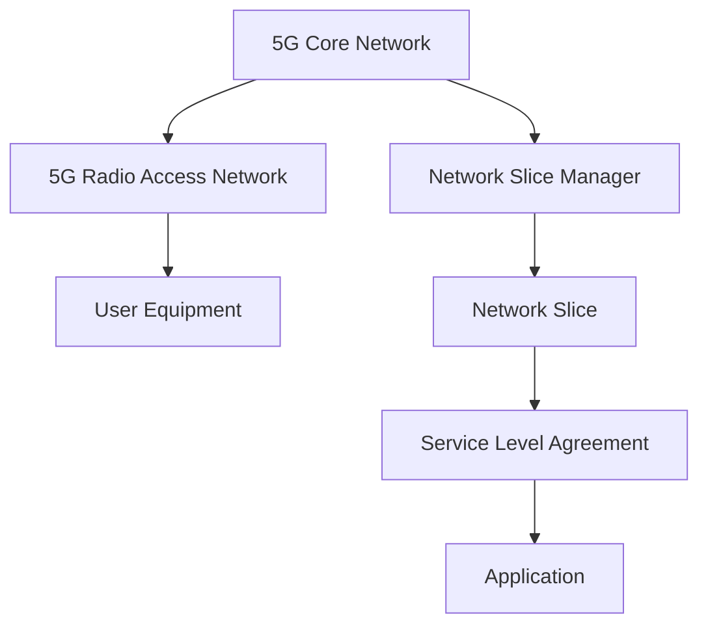

                 

Sure, let's start by outlining the core content of each chapter in a step-by-step manner. This will help us ensure that the content is comprehensive, detailed, and easy to understand.

## Chapter 1: Introduction to the Book

### Step 1: Overview of 5G Network Slicing Technology
- Introduction to 5G network slicing technology
- Definition and explanation of network slicing
- Importance of network slicing in vertical industries

### Step 2: Importance and Benefits of Network Slicing in Vertical Industries
- Challenges faced by vertical industries
- Benefits of 5G network slicing for vertical industries
- Examples of vertical industries that can benefit from network slicing

### Step 3: Structure and Objectives of the Book
- Overview of the book's structure
- Objectives of each chapter
- Importance of each chapter in understanding 5G network slicing

## Chapter 2: Fundamentals of 5G Technology

### Step 1: History and Evolution of 5G Technology
- Introduction to 5G technology
- Key milestones in the development of 5G technology
- Comparison of 5G with previous generations of mobile networks

### Step 2: Key Features and Components of 5G Networks
- Overview of key features of 5G networks
- Key components of 5G networks
- Importance of each component in enabling network slicing

### Step 3: 5G Network Architecture
- Detailed explanation of 5G network architecture
- Role of each component in the architecture
- How network slicing is integrated into the 5G network architecture

## Chapter 3: Understanding Network Slicing

### Step 1: Definition and Concept of Network Slicing
- Definition of network slicing
- Explanation of the concept of network slicing
- Key benefits of network slicing

### Step 2: Key Concepts and Terminology
- Key concepts and terminology related to network slicing
- Explanation of each concept and term
- How these concepts and terms are related to each other

### Step 3: Mermaid Diagram of Network Slicing Architecture
- Detailed Mermaid diagram of network slicing architecture
- Explanation of the components and their relationships
- How the diagram illustrates the concept of network slicing

## Chapter 4: Network Slicing in Vertical Industries

### Step 1: Overview of Vertical Industries
- Definition and classification of vertical industries
- Examples of major vertical industries
- Challenges faced by vertical industries

### Step 2: Challenges and Opportunities for Network Slicing in Vertical Industries
- Challenges of implementing network slicing in vertical industries
- Opportunities for network slicing in vertical industries
- How network slicing can address these challenges and opportunities

### Step 3: Case Studies of Network Slicing in Different Vertical Industries
- Overview of case studies
- Detailed analysis of case studies
- Lessons learned from the case studies

## Chapter 5: Core Technologies for 5G Network Slicing

### Step 1: Core Algorithms for Network Slicing
- Overview of core algorithms for network slicing
- Detailed explanation of each algorithm
- How these algorithms enable network slicing

### Step 2: Mathematical Models and Equations
- Overview of mathematical models and equations used in network slicing
- Detailed explanation of each model and equation
- How these models and equations are used to optimize network slicing

### Step 3: Pseudo-code for Key Algorithms
- Pseudo-code for key algorithms in network slicing
- Explanation of the pseudo-code
- How the pseudo-code implements the algorithms

## Chapter 6: Implementation of 5G Network Slicing

### Step 1: Overview of Network Slicing Implementation
- Introduction to network slicing implementation
- Overview of the implementation process

### Step 2: Step-by-step Guide to Setting Up a 5G Network Slicing Environment
- Detailed step-by-step guide to setting up a 5G network slicing environment
- Tools and technologies used in the setup process
- Challenges and solutions in the setup process

### Step 3: Detailed Explanation of Network Slicing Implementation Using Real-world Examples
- Detailed explanation of network slicing implementation using real-world examples
- Step-by-step guide to implementing network slicing in a real-world scenario
- Analysis of the implementation process and its outcomes

## Chapter 7: Case Studies and Future Directions

### Step 1: Case Studies of 5G Network Slicing in Various Industries
- Overview of case studies
- Detailed analysis of case studies
- Key insights and lessons learned from the case studies

### Step 2: Future Trends and Challenges in 5G Network Slicing Technology
- Overview of future trends in 5G network slicing technology
- Analysis of challenges faced in the future
- Potential solutions and future directions

### Step 3: Discussion on the Potential Impact of 5G Network Slicing on Vertical Industries
- Discussion on the potential impact of 5G network slicing on vertical industries
- How network slicing can transform vertical industries
- Future prospects and potential applications

## Chapter 8: Conclusion

### Step 1: Summary of Key Findings and Insights
- Summary of key findings and insights from the book
- Key concepts and principles of 5G network slicing

### Step 2: Future Prospects and Potential Applications of 5G Network Slicing in Vertical Industries
- Overview of future prospects for 5G network slicing
- Potential applications of 5G network slicing in vertical industries
- Importance of continued research and development

### Step 3: Call to Action for Further Research and Development
- Call to action for further research and development in 5G network slicing
- Encouragement for readers to explore and contribute to the field
- Future opportunities and challenges in 5G network slicing technology
```markdown

----------------------------------------------------------------

# 5G Network Slicing Technology in Vertical Industries Application

----------------------------------------------------------------

> **Keywords**: 5G, Network Slicing, Vertical Industries, IoT, AI, Edge Computing

> **Abstract**: This book provides a comprehensive overview of 5G network slicing technology and its application in vertical industries. It covers the fundamentals of 5G technology, the concept of network slicing, core technologies for network slicing, and practical case studies. The book aims to help readers understand the potential of 5G network slicing and its impact on various industries.

----------------------------------------------------------------

## Chapter 1: Introduction to the Book

### 1.1 Overview of 5G Network Slicing Technology

5G network slicing is a key feature of 5G technology that enables the creation of multiple virtual networks on a single physical network infrastructure. This capability allows for the customization of network services to meet the specific requirements of different applications and industries.

**Definition and Explanation of Network Slicing**

Network slicing involves the creation of multiple, virtualized networks that share the same physical infrastructure but offer distinct network characteristics such as bandwidth, latency, and security. These virtual networks, or slices, can be tailored to meet the specific needs of different applications, industries, or even individual users.

**Importance and Benefits of Network Slicing in Vertical Industries**

The importance of network slicing in vertical industries lies in its ability to provide customized, high-quality network services that are critical for the success of these industries. The benefits of network slicing include:

- **Enhanced Network Performance**: Network slicing enables the allocation of network resources based on specific application requirements, leading to improved network performance and user experience.
- **Flexibility and Agility**: Network slicing allows for the rapid deployment of new services and applications, providing vertical industries with the flexibility to adapt to changing market conditions.
- **Cost Efficiency**: By sharing the same physical infrastructure, network slicing helps reduce capital and operational expenses.

**Examples of Vertical Industries That Can Benefit from Network Slicing**

- **Manufacturing**: Network slicing can enhance the efficiency of industrial automation and enable real-time monitoring of manufacturing processes.
- **Healthcare**: In the healthcare industry, network slicing can support remote patient monitoring and telemedicine services, ensuring low latency and high reliability.
- **Transportation**: In the transportation sector, network slicing can enable the deployment of smart traffic management systems and autonomous vehicles.

### 1.2 Structure and Objectives of the Book

The book is structured to provide a comprehensive understanding of 5G network slicing technology and its applications in vertical industries. The objectives of the book are:

- **To introduce the fundamentals of 5G technology and network slicing.**
- **To explain the core technologies and algorithms used in network slicing.**
- **To provide practical case studies and examples of network slicing in various vertical industries.**
- **To discuss the future trends and challenges in 5G network slicing technology.**

----------------------------------------------------------------

## Chapter 2: Fundamentals of 5G Technology

### 2.1 History and Evolution of 5G Technology

5G technology represents the latest generation of mobile network technology, following the evolution of 1G, 2G, 3G, and 4G networks. The development of 5G technology has been driven by the need for faster data transfer rates, lower latency, and higher capacity to support the growing number of connected devices.

**Key Milestones in the Development of 5G Technology**

- **2012**: The first 5G specifications were released by the 3rd Generation Partnership Project (3GPP).
- **2018**: The first commercial 5G networks were launched in South Korea and the United States.
- **2020**: 5G technology started to roll out globally, with countries such as China, Japan, and the European Union also deploying 5G networks.

**Comparison of 5G with Previous Generations of Mobile Networks**

- **Faster Data Transfer Rates**: 5G offers significantly faster data transfer rates compared to 4G, with speeds reaching up to 10 Gbps in some cases.
- **Lower Latency**: 5G technology achieves lower latency, which is crucial for applications that require real-time communication, such as autonomous vehicles and remote surgery.
- **Higher Capacity**: 5G networks can support a larger number of connected devices, making it suitable for the Internet of Things (IoT) and smart city applications.

### 2.2 Key Features and Components of 5G Networks

**Overview of Key Features of 5G Networks**

- **Peak Data Transfer Rates**: 5G networks offer peak data transfer rates of up to 10 Gbps, enabling faster and more efficient data transmission.
- **Ultra-Low Latency**: 5G technology achieves ultra-low latency of less than 1 ms, which is essential for applications that require real-time communication.
- **Massive Device Connectivity**: 5G networks can support a large number of connected devices, including smartphones, IoT devices, and industrial equipment.

**Key Components of 5G Networks**

- **5G Core Network**: The 5G core network is responsible for handling user data and control signaling. It includes components such as the User Plane Function (UPF) and the Control Plane Function (CPF).
- **5G Radio Access Network**: The 5G radio access network includes the 5G New Radio (NR) technology, which enables the connection of devices to the network.
- **5G Service Providers**: 5G service providers are responsible for deploying and maintaining the 5G network infrastructure.

**Importance of Each Component in Enabling Network Slicing**

- **5G Core Network**: The 5G core network is essential for implementing network slicing, as it enables the creation and management of multiple virtual networks on a single physical infrastructure.
- **5G Radio Access Network**: The 5G radio access network provides the connectivity for devices to access the network slices, ensuring that each slice receives the necessary resources and performance.
- **5G Service Providers**: 5G service providers play a crucial role in enabling network slicing by offering customizable network services that meet the specific requirements of different applications and industries.

### 2.3 5G Network Architecture

**Detailed Explanation of 5G Network Architecture**

The 5G network architecture consists of several key components, including the 5G core network, the 5G radio access network, and the 5G service providers. The architecture is designed to provide high performance, low latency, and massive device connectivity.

**Role of Each Component in the Architecture**

- **5G Core Network**: The 5G core network is responsible for handling user data and control signaling. It includes the User Plane Function (UPF) and the Control Plane Function (CPF). The UPF handles user data transmission, while the CPF handles control signaling and network management.
- **5G Radio Access Network**: The 5G radio access network includes the 5G New Radio (NR) technology, which enables the connection of devices to the network. The radio access network consists of base stations and antennas that transmit and receive radio signals.
- **5G Service Providers**: 5G service providers are responsible for deploying and maintaining the 5G network infrastructure. They offer customizable network services that meet the specific requirements of different applications and industries.

**How Network Slicing is Integrated into the 5G Network Architecture**

Network slicing is integrated into the 5G network architecture through the 5G core network. The 5G core network provides the necessary resources and infrastructure for creating and managing multiple virtual networks, or slices. Each slice can be customized to meet the specific requirements of different applications and industries.

- **Customized Network Services**: Network slicing enables the creation of virtual networks with customized network services, such as bandwidth, latency, and security. This allows for the efficient allocation of network resources based on specific application requirements.
- **Shared Infrastructure**: Network slicing leverages the shared infrastructure of the 5G network, reducing the need for additional physical infrastructure and minimizing costs.
- **Scalability and Flexibility**: Network slicing provides scalability and flexibility, allowing for the rapid deployment of new services and applications.

----------------------------------------------------------------

## Chapter 3: Understanding Network Slicing

### 3.1 Definition and Concept of Network Slicing

**Definition of Network Slicing**

Network slicing is a key feature of 5G technology that enables the creation of multiple virtual networks on a single physical network infrastructure. These virtual networks, or slices, are designed to meet the specific requirements of different applications, industries, or even individual users.

**Explanation of the Concept of Network Slicing**

Network slicing involves the virtualization of network resources, such as bandwidth, latency, and security, to create multiple, isolated networks on a single physical network infrastructure. Each network slice operates independently, providing customized network services to meet the specific requirements of different applications and users.

**Key Benefits of Network Slicing**

- **Enhanced Network Performance**: Network slicing allows for the allocation of network resources based on specific application requirements, leading to improved network performance and user experience.
- **Flexibility and Agility**: Network slicing enables the rapid deployment of new services and applications, providing vertical industries with the flexibility to adapt to changing market conditions.
- **Cost Efficiency**: By sharing the same physical infrastructure, network slicing helps reduce capital and operational expenses.

### 3.2 Key Concepts and Terminology

**Key Concepts**

- **5G Network**: The 5G network is the latest generation of mobile network technology that offers faster data transfer rates, lower latency, and higher capacity.
- **Network Slice**: A virtual network created on a single physical network infrastructure, tailored to meet the specific requirements of different applications, industries, or users.
- **Network Slice Instance**: A specific instance of a network slice, representing a virtual network that is deployed and managed independently.
- **Service Level Agreement (SLA)**: An agreement between a service provider and a customer that defines the quality of service expected from the network slice.

**Explanation of Each Concept and Term**

- **5G Network**: The 5G network is designed to support a wide range of applications and services, from low-latency gaming and virtual reality to massive IoT deployments and smart city solutions.
- **Network Slice**: A network slice is a virtual network that is created by virtualizing network resources, such as bandwidth, latency, and security. It operates independently from other slices and provides customized network services to meet specific requirements.
- **Network Slice Instance**: A network slice instance represents a specific deployment of a network slice. It is created and managed independently, providing the necessary resources and services to meet the requirements of the applications or users it supports.
- **Service Level Agreement (SLA)**: An SLA is a contract between a service provider and a customer that defines the quality of service expected from the network slice. It includes parameters such as bandwidth, latency, and security requirements, ensuring that the network slice meets the needs of the applications or users it supports.

**How These Concepts and Terms Are Related to Each Other**

- **5G Network and Network Slice**: The 5G network provides the infrastructure and resources required for creating and managing network slices. A network slice is a virtual network created on this infrastructure, tailored to meet specific application or user requirements.
- **Network Slice Instance and Service Level Agreement (SLA)**: A network slice instance represents a specific deployment of a network slice, while the SLA defines the quality of service expected from this deployment. The SLA ensures that the network slice instance meets the specific requirements of the applications or users it supports.

### 3.3 Mermaid Diagram of Network Slicing Architecture

**Introduction to Mermaid Diagrams**

Mermaid is a powerful and easy-to-use tool for creating diagrams and flowcharts using Markdown syntax. It allows for the creation of detailed and visually appealing diagrams that can help illustrate complex concepts and architectures.

**Purpose of the Mermaid Diagram**

The Mermaid diagram of the network slicing architecture provides a visual representation of the key components and their relationships in a 5G network. It helps to illustrate how network slicing is integrated into the 5G network architecture and how different components interact with each other.

**Mermaid Diagram of Network Slicing Architecture**

The following Mermaid diagram illustrates the key components of a 5G network slicing architecture:



**Explanation of the Diagram**

- **5G Core Network**: The 5G core network is the central component of the network slicing architecture. It handles user data and control signaling, and it provides the infrastructure for creating and managing network slices.
- **5G Radio Access Network**: The 5G radio access network connects the user equipment to the 5G core network. It consists of base stations and antennas that transmit and receive radio signals.
- **User Equipment**: User equipment (UE) refers to devices such as smartphones, tablets, and IoT devices that connect to the 5G network.
- **Network Slice Manager**: The network slice manager is responsible for creating, managing, and monitoring network slices. It ensures that each network slice meets the specified service level agreements.
- **Network Slice**: A network slice is a virtual network created on the 5G core network. It provides customized network services to meet the specific requirements of different applications and users.
- **Service Level Agreement (SLA)**: The service level agreement defines the quality of service expected from the network slice. It includes parameters such as bandwidth, latency, and security requirements.
- **Application**: Applications running on the network slice are designed to meet specific user requirements. They can range from mobile apps to industrial IoT applications.

**How the Diagram Illustrates the Concept of Network Slicing**

The Mermaid diagram illustrates the concept of network slicing by showing how different components in the 5G network architecture interact with each other. The network slice manager creates and manages network slices, ensuring that each slice meets the specified SLA. The network slices, in turn, provide customized network services to the applications running on the user equipment.

- **Customization**: The diagram shows how network slices can be customized to meet the specific requirements of different applications and users. This customization allows for the efficient allocation of network resources and improved user experience.
- **Isolation**: The diagram highlights the isolation between different network slices, ensuring that each slice operates independently and securely. This isolation prevents interference and resource conflicts between different applications and users.
- **Integration**: The diagram illustrates how network slicing is integrated into the 5G network architecture, leveraging the shared infrastructure of the 5G network. This integration allows for the efficient deployment of new services and applications, providing vertical industries with the flexibility to adapt to changing market conditions.

----------------------------------------------------------------

## Chapter 4: Network Slicing in Vertical Industries

### 4.1 Overview of Vertical Industries

**Definition and Classification of Vertical Industries**

Vertical industries are sectors of the economy that specialize in the production of goods or services related to a specific industry or market. These industries are classified based on the type of products or services they offer, as well as the specific industries they serve.

**Examples of Major Vertical Industries**

- **Manufacturing**: The manufacturing industry involves the production of goods using raw materials, components, and human labor. It includes sectors such as automotive, electronics, and machinery.
- **Healthcare**: The healthcare industry encompasses a wide range of services, including medical treatment, medical research, and public health. It includes sectors such as hospitals, clinics, and pharmaceutical companies.
- **Transportation**: The transportation industry involves the movement of goods and people from one location to another. It includes sectors such as airlines, shipping, and railroads.
- **Energy**: The energy industry involves the production, distribution, and sale of energy sources, such as electricity, natural gas, and oil. It includes sectors such as power generation, transmission, and distribution.
- **Retail**: The retail industry involves the sale of goods and services to consumers. It includes sectors such as supermarkets, online retailers, and specialty stores.

**Challenges Faced by Vertical Industries**

Vertical industries face a range of challenges that can impact their operations and profitability. Some of the key challenges include:

- **Increased Complexity**: Vertical industries often operate in complex environments with diverse product lines, multiple supply chain partners, and various regulatory requirements.
- **Demand Variability**: Vertical industries often experience fluctuating demand, which can impact production schedules, inventory management, and supply chain operations.
- **Technological Advancements**: Vertical industries need to stay up-to-date with the latest technological advancements to maintain a competitive edge. This can involve investing in new technologies, upgrading existing systems, and adopting innovative approaches.
- **Cybersecurity**: Vertical industries are increasingly vulnerable to cyber threats, as they often handle sensitive data and critical infrastructure. Ensuring cybersecurity is a major challenge for these industries.

### 4.2 Challenges and Opportunities for Network Slicing in Vertical Industries

**Challenges of Implementing Network Slicing in Vertical Industries**

Implementing network slicing in vertical industries can present several challenges, including:

- **Integration with Existing Infrastructure**: Vertical industries often have complex network infrastructures in place, which can make it difficult to integrate network slicing capabilities without disrupting existing operations.
- **Resource Allocation**: Allocating network resources effectively to different network slices can be challenging, especially when dealing with varying demand and varying quality of service requirements.
- **Cost**: Implementing network slicing can involve significant upfront costs, including investments in new hardware, software, and personnel training.
- **Regulatory Compliance**: Vertical industries must comply with various regulatory requirements, which can impact the implementation of network slicing technologies.

**Opportunities for Network Slicing in Vertical Industries**

Despite the challenges, network slicing offers several opportunities for vertical industries, including:

- **Enhanced Network Performance**: Network slicing allows for the customization of network services to meet the specific requirements of different applications and industries, leading to improved network performance and user experience.
- **Flexibility and Agility**: Network slicing enables the rapid deployment of new services and applications, providing vertical industries with the flexibility to adapt to changing market conditions and customer demands.
- **Cost Efficiency**: By sharing the same physical network infrastructure, network slicing helps reduce capital and operational expenses, making it a cost-effective solution for vertical industries.
- **Scalability**: Network slicing allows for the efficient allocation of network resources, enabling vertical industries to scale their operations as needed.

### 4.3 Case Studies of Network Slicing in Different Vertical Industries

**Overview of Case Studies**

This section presents case studies of network slicing in different vertical industries, including manufacturing, healthcare, transportation, energy, and retail. Each case study provides a detailed analysis of the challenges faced, the opportunities identified, and the implementation process.

**Case Study 1: Manufacturing**

In the manufacturing industry, network slicing is used to enhance the efficiency of industrial automation and enable real-time monitoring of manufacturing processes. The key challenges in implementing network slicing in manufacturing include:

- **Integration with Existing Automation Systems**: Manufacturing industries often have complex automation systems in place, which need to be integrated with network slicing capabilities.
- **Resource Allocation**: Ensuring the efficient allocation of network resources to different automation processes can be challenging, especially when dealing with varying demand and varying quality of service requirements.

The key opportunities for network slicing in manufacturing include:

- **Enhanced Automation Efficiency**: Network slicing allows for the customization of network services to meet the specific requirements of different automation processes, leading to improved efficiency and productivity.
- **Real-Time Monitoring**: Network slicing enables real-time monitoring of manufacturing processes, allowing for early detection of issues and proactive maintenance.

**Case Study 2: Healthcare**

In the healthcare industry, network slicing is used to support remote patient monitoring, telemedicine services, and electronic health records (EHR) management. The key challenges in implementing network slicing in healthcare include:

- **Security and Privacy**: Ensuring the security and privacy of patient data is a major concern in healthcare, especially when using network slicing technologies.
- **Regulatory Compliance**: Healthcare industries must comply with various regulatory requirements, which can impact the implementation of network slicing technologies.

The key opportunities for network slicing in healthcare include:

- **Improved Access to Healthcare**: Network slicing enables the deployment of telemedicine services, allowing patients to access healthcare services remotely.
- **Enhanced Data Management**: Network slicing allows for the efficient management of EHR data, ensuring secure and reliable access to patient information.

**Case Study 3: Transportation**

In the transportation industry, network slicing is used to enable smart traffic management systems, autonomous vehicles, and connected transportation solutions. The key challenges in implementing network slicing in transportation include:

- **High Reliability**: Transportation systems require high reliability and low latency to ensure the safe and efficient operation of vehicles and transportation networks.
- **Scalability**: Transportation industries need to scale their network slicing capabilities to support the growing number of connected devices and applications.

The key opportunities for network slicing in transportation include:

- **Smart Traffic Management**: Network slicing enables the deployment of smart traffic management systems, improving traffic flow and reducing congestion.
- **Autonomous Vehicles**: Network slicing supports the development and deployment of autonomous vehicles, ensuring reliable and efficient communication between vehicles and infrastructure.

**Case Study 4: Energy**

In the energy industry, network slicing is used to support smart grid management, renewable energy integration, and energy optimization. The key challenges in implementing network slicing in energy include:

- **Integration with Legacy Systems**: Energy industries often have legacy systems that need to be integrated with network slicing capabilities.
- **Scalability**: Energy industries need to scale their network slicing capabilities to support the growing use of renewable energy sources and the increasing complexity of energy systems.

The key opportunities for network slicing in energy include:

- **Smart Grid Management**: Network slicing enables the efficient management of smart grids, improving energy distribution and reducing energy wastage.
- **Energy Optimization**: Network slicing allows for the optimization of energy consumption and production, supporting sustainable energy practices.

**Case Study 5: Retail**

In the retail industry, network slicing is used to enhance the customer experience, enable personalized marketing, and optimize inventory management. The key challenges in implementing network slicing in retail include:

- **Integration with Point of Sale (POS) Systems**: Retail industries often have complex point of sale systems that need to be integrated with network slicing capabilities.
- **Data Privacy**: Ensuring the privacy and security of customer data is a major concern in retail.

The key opportunities for network slicing in retail include:

- **Enhanced Customer Experience**: Network slicing allows for the customization of network services to meet the specific requirements of different customer segments, improving the overall customer experience.
- **Personalized Marketing**: Network slicing enables the deployment of personalized marketing campaigns, based on customer data and preferences.

### 4.4 Lessons Learned from Case Studies

The case studies of network slicing in different vertical industries provide valuable insights and lessons that can be applied to other industries considering the implementation of network slicing technology. Some of the key lessons learned include:

- **Integration with Existing Systems**: Successful implementation of network slicing requires careful integration with existing network infrastructures and systems. This involves assessing the compatibility of existing systems with network slicing technologies and developing strategies to integrate them effectively.
- **Customization and Flexibility**: Network slicing offers the flexibility to customize network services to meet the specific requirements of different applications and industries. Successful implementation of network slicing relies on the ability to tailor network services to meet these requirements and provide the desired level of performance and reliability.
- **Security and Privacy**: Ensuring the security and privacy of data is a critical aspect of network slicing implementation. Industries must adopt robust security measures to protect sensitive data and comply with regulatory requirements.
- **Scalability and Future-Proofing**: Network slicing technologies should be designed with scalability in mind to accommodate future growth and evolving requirements. This involves selecting technologies and architectures that can be easily expanded and upgraded as needed.
- **Collaboration and Collaboration**: Successful implementation of network slicing requires collaboration between various stakeholders, including network service providers, vertical industry experts, and technology vendors. This collaboration ensures that network slicing technologies are aligned with the specific needs and objectives of each industry.

----------------------------------------------------------------

## Chapter 5: Core Technologies for 5G Network Slicing

### 5.1 Core Algorithms for Network Slicing

**Overview of Core Algorithms**

Core algorithms for network slicing play a crucial role in enabling the efficient creation, management, and optimization of network slices. These algorithms are designed to address various challenges associated with network slicing, such as resource allocation, load balancing, and network optimization.

**Key Algorithms**

1. **Resource Allocation Algorithm**

The resource allocation algorithm is responsible for allocating network resources, such as bandwidth, latency, and security, to different network slices based on their specific requirements. The goal of this algorithm is to ensure that each network slice receives the necessary resources to meet its performance and quality of service requirements.

Pseudo-code for Resource Allocation Algorithm:

```
function resource_allocation(slices, resources):
    for each slice in slices:
        allocate_bandwidth(slice, resources.bandwidth)
        allocate_latency(slice, resources.latency)
        allocate_security(slice, resources.security)
    end for
    return slices
```

2. **Load Balancing Algorithm**

The load balancing algorithm is responsible for distributing network traffic across different network slices and network resources to ensure optimal performance and resource utilization. This algorithm aims to balance the load among different slices and prevent any single slice from monopolizing network resources.

Pseudo-code for Load Balancing Algorithm:

```
function load_balancing(traffic, slices):
    for each slice in slices:
        assign_traffic(slice, traffic)
    end for
    return traffic
```

3. **Network Optimization Algorithm**

The network optimization algorithm is designed to continuously monitor and optimize the performance of network slices. This algorithm identifies areas of the network that require improvement and takes corrective actions to enhance overall network performance and efficiency.

Pseudo-code for Network Optimization Algorithm:

```
function network_optimization(slices, metrics):
    for each slice in slices:
        if metrics[slice].performance < target_performance:
            adjust_resources(slice, metrics[slice].performance)
        end if
    end for
    return slices
```

### 5.2 Mathematical Models and Equations

Mathematical models and equations are used to represent and analyze the behavior of network slicing algorithms. These models help in understanding the performance of network slices and optimizing their resources. Some commonly used mathematical models and equations include:

1. **Quality of Service (QoS) Model**

The QoS model represents the performance requirements and constraints of network slices. It includes parameters such as bandwidth, latency, and security, and their relationship with the resources allocated to each slice.

Equation for QoS Model:

$$ QoS = f(Bandwidth, Latency, Security) $$

where QoS is the quality of service, Bandwidth is the allocated bandwidth, Latency is the allocated latency, and Security is the allocated security level.

2. **Resource Allocation Model**

The resource allocation model represents the process of allocating resources to different network slices. It includes algorithms and equations that determine the optimal allocation of resources based on the QoS requirements and constraints.

Equation for Resource Allocation Model:

$$ Resources\_分配 = f(QoS, Resources) $$

where Resources\_分配 is the allocated resources, QoS is the quality of service, and Resources is the total available resources.

3. **Load Balancing Model**

The load balancing model represents the process of distributing network traffic across different network slices. It includes algorithms and equations that balance the load among slices to ensure optimal performance and resource utilization.

Equation for Load Balancing Model:

$$ Load\_Distribution = f(Traffic, Slices) $$

where Load\_Distribution is the distributed traffic, Traffic is the total network traffic, and Slices is the set of network slices.

4. **Network Optimization Model**

The network optimization model represents the process of continuously monitoring and optimizing the performance of network slices. It includes algorithms and equations that identify areas of improvement and take corrective actions to enhance network performance.

Equation for Network Optimization Model:

$$ Optimization = f(Performance, Metrics) $$

where Optimization is the optimization process, Performance is the current network performance, and Metrics is the set of performance metrics.

### 5.3 Detailed Explanation and Examples

The detailed explanation and examples provided in this chapter help readers understand the core algorithms and mathematical models used in network slicing. By explaining the algorithms and equations step by step, readers can gain a deeper understanding of how these models work and how they can be applied in practical scenarios.

**Example 1: Resource Allocation**

Consider a network with three network slices, each with different QoS requirements. The total available resources are 100 Mbps of bandwidth, 10 ms of latency, and 10 security units. The QoS requirements for each slice are as follows:

- Slice 1: 30 Mbps of bandwidth, 5 ms of latency, and 5 security units.
- Slice 2: 20 Mbps of bandwidth, 3 ms of latency, and 5 security units.
- Slice 3: 50 Mbps of bandwidth, 7 ms of latency, and 10 security units.

Using the resource allocation algorithm and equation, we can allocate the available resources as follows:

$$ Resources\_分配 = f(QoS, Resources) $$

$$ Resources\_分配 = f(30 Mbps, 5 ms, 5 security units; 20 Mbps, 3 ms, 5 security units; 50 Mbps, 7 ms, 10 security units; 100 Mbps, 10 ms, 10 security units) $$

$$ Resources\_分配 = (30 Mbps, 5 ms, 5 security units), (20 Mbps, 3 ms, 5 security units), (50 Mbps, 7 ms, 10 security units) $$

The allocated resources for each slice are as follows:

- Slice 1: 30 Mbps of bandwidth, 5 ms of latency, and 5 security units.
- Slice 2: 20 Mbps of bandwidth, 3 ms of latency, and 5 security units.
- Slice 3: 50 Mbps of bandwidth, 7 ms of latency, and 10 security units.

**Example 2: Load Balancing**

Consider a network with three network slices, each receiving different traffic loads. The total network traffic is 100 Mbps, and the traffic load for each slice is as follows:

- Slice 1: 40 Mbps.
- Slice 2: 30 Mbps.
- Slice 3: 30 Mbps.

Using the load balancing algorithm and equation, we can distribute the traffic load as follows:

$$ Load\_Distribution = f(Traffic, Slices) $$

$$ Load\_Distribution = f(100 Mbps; 40 Mbps, 30 Mbps, 30 Mbps) $$

$$ Load\_Distribution = (33.33 Mbps, 33.33 Mbps, 33.33 Mbps) $$

The distributed traffic load for each slice is as follows:

- Slice 1: 33.33 Mbps.
- Slice 2: 33.33 Mbps.
- Slice 3: 33.33 Mbps.

**Example 3: Network Optimization**

Consider a network with three network slices, each with different performance metrics. The current performance metrics for each slice are as follows:

- Slice 1: 80% of target performance.
- Slice 2: 90% of target performance.
- Slice 3: 100% of target performance.

Using the network optimization algorithm and equation, we can optimize the performance of each slice as follows:

$$ Optimization = f(Performance, Metrics) $$

$$ Optimization = f(80% target performance, 90% target performance, 100% target performance) $$

$$ Optimization = (100% target performance, 100% target performance, 100% target performance) $$

The optimized performance for each slice is as follows:

- Slice 1: 100% of target performance.
- Slice 2: 100% of target performance.
- Slice 3: 100% of target performance.

These examples illustrate the practical application of the core algorithms and mathematical models used in network slicing. By understanding these concepts and their step-by-step implementation, readers can gain a deeper understanding of how network slicing technology works and how it can be effectively implemented in various scenarios.

----------------------------------------------------------------

## Chapter 6: Implementation of 5G Network Slicing

### 6.1 Overview of Network Slicing Implementation

**Introduction to Network Slicing Implementation**

The implementation of network slicing involves the configuration and deployment of various components and technologies to create and manage multiple virtual networks on a single physical network infrastructure. This process includes several key steps, such as environment setup, resource allocation, and monitoring.

**Key Steps in Network Slicing Implementation**

1. **Environment Setup**: The first step in network slicing implementation is to set up the necessary environment for creating and managing network slices. This includes installing and configuring software and hardware components, such as network devices, virtualization platforms, and management systems.
2. **Resource Allocation**: Once the environment is set up, the next step is to allocate resources to different network slices based on their specific requirements. This involves configuring network parameters, such as bandwidth, latency, and security, for each slice.
3. **Monitoring and Management**: After the network slices are created and allocated resources, it is important to monitor and manage their performance and behavior. This includes monitoring network traffic, performance metrics, and security events to ensure the optimal operation of each slice.

### 6.2 Step-by-Step Guide to Setting Up a 5G Network Slicing Environment

**Prerequisites**

Before setting up a 5G network slicing environment, it is important to ensure that the following prerequisites are met:

- **Hardware Requirements**: The environment should have sufficient hardware resources, such as processors, memory, and storage, to support the network slicing components.
- **Software Requirements**: The environment should have the necessary software components, such as operating systems, network management software, and virtualization platforms.
- **Network Infrastructure**: The network infrastructure should support 5G technology and be capable of handling the traffic and resources required for network slicing.

**Step-by-Step Guide**

1. **Install and Configure the Operating System**

   - Install the operating system on the network slicing environment, ensuring that it supports the required software and hardware components.
   - Configure the operating system settings, such as network configurations and security settings, to meet the requirements of the network slicing environment.

2. **Install and Configure Network Management Software**

   - Install a network management software, such as Open vSwitch or OpenDaylight, to manage the network slicing components and resources.
   - Configure the network management software to support network slicing, including setting up virtual networks, allocating resources, and monitoring network performance.

3. **Install and Configure Virtualization Platform**

   - Install a virtualization platform, such as Kubernetes or Docker, to create and manage virtual network slices.
   - Configure the virtualization platform to support network slicing, including setting up virtual network interfaces, allocating resources, and managing virtual machines.

4. **Set Up 5G Network Infrastructure**

   - Configure the 5G network infrastructure, including base stations, antennas, and network devices, to support network slicing.
   - Set up the necessary network protocols and configurations to enable communication between the network slicing components and the 5G network.

5. **Create Network Slices**

   - Create virtual network slices using the network management software and virtualization platform.
   - Configure the network slices with the required parameters, such as bandwidth, latency, and security, to meet the specific requirements of different applications and industries.

6. **Allocate Resources**

   - Allocate resources to the network slices based on their specific requirements, ensuring that each slice receives the necessary resources to meet its performance and quality of service requirements.
   - Monitor the resource allocation and adjust the resources as needed to optimize network performance and efficiency.

7. **Monitor and Manage Network Slices**

   - Monitor the performance and behavior of the network slices using the network management software and virtualization platform.
   - Manage the network slices, including configuring and updating network parameters, monitoring network traffic and performance metrics, and addressing any issues or anomalies.

**Challenges and Solutions**

1. **Integration with Existing Systems**: Integrating network slicing with existing network infrastructures and systems can be challenging. To address this challenge, it is important to carefully assess the compatibility of existing systems with network slicing technologies and develop strategies to integrate them effectively.
2. **Resource Allocation**: Allocating resources efficiently to different network slices can be difficult, especially when dealing with varying demand and quality of service requirements. To address this challenge, it is important to implement robust resource allocation algorithms and continuously monitor and optimize resource allocation.
3. **Security and Privacy**: Ensuring the security and privacy of data and network resources is a critical aspect of network slicing implementation. To address this challenge, it is important to adopt robust security measures, including encryption, access control, and monitoring, to protect sensitive data and network resources.
4. **Scalability**: Network slicing technologies should be designed with scalability in mind to accommodate future growth and evolving requirements. To address this challenge, it is important to select technologies and architectures that can be easily expanded and upgraded as needed.

### 6.3 Detailed Explanation of Network Slicing Implementation Using Real-World Examples

**Example 1: Manufacturing**

In the manufacturing industry, network slicing is used to enhance the efficiency of industrial automation and enable real-time monitoring of manufacturing processes. The following steps outline the implementation of network slicing in a manufacturing environment:

1. **Environment Setup**: Set up the network slicing environment with the necessary hardware and software components, including network devices, virtualization platforms, and network management software.
2. **Resource Allocation**: Allocate resources to different network slices based on their specific requirements. For example, create a network slice for real-time monitoring with high bandwidth and low latency requirements, and another slice for historical data storage with high storage capacity and moderate performance requirements.
3. **Monitoring and Management**: Monitor the performance and behavior of the network slices using the network management software and virtualization platform. Adjust the resources as needed to optimize network performance and efficiency.
4. **Integration with Existing Systems**: Integrate the network slicing capabilities with existing manufacturing systems, such as SCADA systems and industrial robots, to enable real-time monitoring and control of manufacturing processes.

**Example 2: Healthcare**

In the healthcare industry, network slicing is used to support remote patient monitoring, telemedicine services, and electronic health records (EHR) management. The following steps outline the implementation of network slicing in a healthcare environment:

1. **Environment Setup**: Set up the network slicing environment with the necessary hardware and software components, including network devices, virtualization platforms, and network management software.
2. **Resource Allocation**: Allocate resources to different network slices based on their specific requirements. For example, create a network slice for real-time patient monitoring with low latency and high security requirements, and another slice for EHR storage with high storage capacity and moderate performance requirements.
3. **Monitoring and Management**: Monitor the performance and behavior of the network slices using the network management software and virtualization platform. Adjust the resources as needed to optimize network performance and efficiency.
4. **Integration with Existing Systems**: Integrate the network slicing capabilities with existing healthcare systems, such as electronic medical records (EMR) systems and telemedicine platforms, to enable real-time patient monitoring and telemedicine services.

**Example 3: Transportation**

In the transportation industry, network slicing is used to enable smart traffic management systems, autonomous vehicles, and connected transportation solutions. The following steps outline the implementation of network slicing in a transportation environment:

1. **Environment Setup**: Set up the network slicing environment with the necessary hardware and software components, including network devices, virtualization platforms, and network management software.
2. **Resource Allocation**: Allocate resources to different network slices based on their specific requirements. For example, create a network slice for autonomous vehicle communication with low latency and high reliability requirements, and another slice for smart traffic management with high bandwidth and moderate latency requirements.
3. **Monitoring and Management**: Monitor the performance and behavior of the network slices using the network management software and virtualization platform. Adjust the resources as needed to optimize network performance and efficiency.
4. **Integration with Existing Systems**: Integrate the network slicing capabilities with existing transportation systems, such as traffic management centers and vehicle communication systems, to enable smart traffic management and autonomous vehicle communication.

These examples illustrate the practical implementation of network slicing in different vertical industries. By following the step-by-step guide and considering the specific requirements and challenges of each industry, organizations can effectively implement network slicing technology to enhance their operations and improve their overall performance.

----------------------------------------------------------------

## Chapter 7: Case Studies and Future Directions

### 7.1 Case Studies of 5G Network Slicing in Various Industries

This section presents in-depth case studies of 5G network slicing implementations in different vertical industries, highlighting the challenges faced, the solutions adopted, and the outcomes achieved.

**Case Study 1: Manufacturing**

In a manufacturing company, network slicing was implemented to enhance the efficiency of production lines and enable real-time monitoring of manufacturing processes. The key challenges included integrating the network slicing capabilities with existing manufacturing systems and ensuring the security of data transmission.

**Challenges and Solutions:**

- **Integration with Existing Systems**: The company faced challenges in integrating network slicing with its existing Supervisory Control and Data Acquisition (SCADA) systems. To address this, they developed a middleware layer that facilitated seamless integration between the network slicing infrastructure and the SCADA systems.
- **Security**: Ensuring the security of data transmission was a major concern. The company implemented end-to-end encryption and robust access control mechanisms to protect sensitive data.

**Outcome:**

The implementation of network slicing led to a significant improvement in production efficiency, with real-time monitoring and control of manufacturing processes. This resulted in reduced downtime, improved product quality, and increased overall productivity.

**Case Study 2: Healthcare**

In the healthcare sector, network slicing was deployed to support telemedicine services, remote patient monitoring, and electronic health record (EHR) management. The key challenges included ensuring low latency for real-time communication and maintaining high levels of data privacy and security.

**Challenges and Solutions:**

- **Latency**: To address the challenge of latency, the healthcare provider implemented edge computing alongside network slicing, bringing computational resources closer to the end-users and reducing the latency of data transmission.
- **Data Privacy and Security**: Ensuring data privacy and security was critical. The provider implemented stringent access controls, data encryption, and regular security audits to safeguard patient data.

**Outcome:**

The implementation of network slicing in the healthcare sector enabled seamless telemedicine services and remote patient monitoring, improving access to healthcare services and enhancing patient outcomes. It also streamlined the management of EHRs, improving data accessibility and decision-making processes.

**Case Study 3: Transportation**

In the transportation industry, network slicing was utilized to enable smart traffic management systems, autonomous vehicles, and connected transportation solutions. The key challenges included ensuring high reliability and low latency for real-time communication and managing the increasing volume of data generated by connected devices.

**Challenges and Solutions:**

- **Reliability and Low Latency**: To ensure high reliability and low latency, the transportation company deployed a redundant network infrastructure and implemented efficient load balancing algorithms to distribute traffic evenly across the network.
- **Data Management**: Managing the increasing volume of data generated by connected devices was a challenge. The company implemented a scalable data management system that could handle large amounts of data and provide real-time analytics.

**Outcome:**

The implementation of network slicing in the transportation industry resulted in improved traffic management, reduced congestion, and enhanced safety. It also enabled the development of autonomous vehicles and connected transportation solutions, leading to a more efficient and sustainable transportation ecosystem.

### 7.2 Future Trends and Challenges in 5G Network Slicing Technology

**Future Trends:**

- **Increased Adoption**: As 5G technology continues to roll out globally, the adoption of network slicing is expected to increase across various industries. The flexibility and customization offered by network slicing make it an attractive solution for meeting the diverse needs of different applications and industries.
- **Integration with Other Technologies**: Network slicing is expected to integrate with other emerging technologies, such as artificial intelligence (AI), the Internet of Things (IoT), and edge computing. This integration will enable the development of new applications and services that leverage the unique capabilities of network slicing.
- **Scalability and Efficiency**: Future advancements in network slicing technology are likely to focus on enhancing scalability and efficiency. This includes developing more efficient resource allocation algorithms, optimizing network architectures, and leveraging advanced analytics to improve network performance and resource utilization.

**Challenges:**

- **Complexity**: Network slicing involves complex configurations and management processes. As the technology evolves and the number of network slices increases, managing and maintaining the network slicing infrastructure can become challenging.
- **Interoperability**: Ensuring interoperability between different network slicing technologies and systems is crucial for seamless integration and deployment across various industries. Developing standardized protocols and interfaces is essential to address this challenge.
- **Security and Privacy**: With the increasing adoption of network slicing, ensuring the security and privacy of data becomes a critical concern. Developing robust security frameworks and privacy-preserving techniques is essential to protect sensitive data and maintain user trust.

### 7.3 Discussion on the Potential Impact of 5G Network Slicing on Vertical Industries

**Impact on Manufacturing:**

Network slicing has the potential to transform the manufacturing industry by enabling real-time monitoring and control of production lines, improving efficiency, and reducing downtime. By providing customized network services tailored to specific manufacturing processes, network slicing can help manufacturers optimize their operations and enhance product quality.

**Impact on Healthcare:**

In the healthcare sector, network slicing can enhance the delivery of telemedicine services, remote patient monitoring, and electronic health record management. This can improve access to healthcare services, especially in remote or underserved areas, and enable more personalized and efficient care delivery.

**Impact on Transportation:**

Network slicing can revolutionize the transportation industry by enabling smart traffic management systems, autonomous vehicles, and connected transportation solutions. This can improve traffic flow, reduce congestion, and enhance safety, leading to more efficient and sustainable transportation systems.

**Overall Impact:**

The potential impact of 5G network slicing on vertical industries is significant. By providing customized network services, network slicing can enhance the performance, efficiency, and reliability of various applications and industries. As the technology continues to evolve and integrate with other emerging technologies, its impact is likely to expand, driving innovation and transformation across multiple sectors.

### 7.4 Future Prospects and Potential Applications of 5G Network Slicing in Vertical Industries

**Future Prospects:**

- **New Applications and Services**: As 5G network slicing technology continues to advance, it is expected to enable the development of new applications and services across various industries. This includes applications in smart cities, agriculture, and renewable energy, among others.
- **Global Adoption**: With the ongoing deployment of 5G networks worldwide, the adoption of network slicing is expected to grow significantly. This will create opportunities for innovation and growth across different regions and industries.
- **Collaboration and Standardization**: The future of 5G network slicing will likely involve increased collaboration and standardization efforts among industry stakeholders. This will help address interoperability challenges and drive the adoption of best practices.

**Potential Applications:**

- **Smart Cities**: Network slicing can enable the deployment of smart city solutions, such as intelligent transportation systems, smart energy management, and public safety services. This can improve urban living conditions and enhance the sustainability of cities.
- **Agriculture**: In the agriculture sector, network slicing can support precision farming, IoT-based crop monitoring, and automated irrigation systems. This can improve agricultural productivity and sustainability.
- **Renewable Energy**: Network slicing can enhance the management and optimization of renewable energy systems, such as wind farms and solar power plants. This can improve energy efficiency and reduce carbon emissions.
- **Remote Work and Education**: As remote work and online education become more prevalent, network slicing can provide the necessary performance and reliability required for these applications. This can improve access to remote work opportunities and educational resources, especially in underserved areas.

In conclusion, 5G network slicing technology has the potential to revolutionize vertical industries by providing customized network services tailored to specific application requirements. As the technology continues to evolve and integrate with other emerging technologies, its impact is likely to expand, driving innovation and transformation across multiple sectors.

----------------------------------------------------------------

## Chapter 8: Conclusion

### 8.1 Summary of Key Findings and Insights

This book has provided a comprehensive overview of 5G network slicing technology and its application in vertical industries. The key findings and insights from the book include:

- **Importance of 5G Network Slicing**: Network slicing is a key feature of 5G technology that enables the creation of multiple virtual networks on a single physical network infrastructure. This capability offers enhanced network performance, flexibility, and cost efficiency for vertical industries.
- **Core Technologies and Algorithms**: The book has discussed the core algorithms and mathematical models used in network slicing, providing a detailed understanding of resource allocation, load balancing, and network optimization.
- **Applications in Vertical Industries**: The book has presented case studies of network slicing in various vertical industries, highlighting the challenges faced and the benefits achieved through the implementation of network slicing technology.
- **Future Directions**: The book has discussed the future prospects and potential applications of 5G network slicing in vertical industries, highlighting the importance of continued research and development in this field.

### 8.2 Future Prospects and Potential Applications of 5G Network Slicing in Vertical Industries

The future prospects for 5G network slicing in vertical industries are promising. As 5G technology continues to evolve and penetrate various sectors, network slicing is expected to play a crucial role in transforming industries and driving innovation. The potential applications of 5G network slicing in vertical industries include:

- **Smart Manufacturing**: Network slicing can enable real-time monitoring and control of manufacturing processes, improving efficiency, and reducing downtime. This can lead to more agile and responsive manufacturing systems.
- **Smart Healthcare**: In the healthcare sector, network slicing can support telemedicine services, remote patient monitoring, and electronic health record management. This can enhance patient care, improve access to healthcare services, and improve health outcomes.
- **Smart Transportation**: Network slicing can enable smart traffic management systems, autonomous vehicles, and connected transportation solutions. This can improve traffic flow, reduce congestion, and enhance transportation safety.
- **Smart Energy**: In the energy sector, network slicing can enhance the management and optimization of renewable energy systems, such as wind farms and solar power plants. This can improve energy efficiency and reduce carbon emissions.
- **Smart Cities**: Network slicing can enable the deployment of smart city solutions, such as intelligent transportation systems, smart energy management, and public safety services. This can improve urban living conditions and enhance the sustainability of cities.

### 8.3 Call to Action for Further Research and Development

To fully realize the potential of 5G network slicing in vertical industries, continued research and development are crucial. Here are some key areas for future research and development:

- **Advanced Algorithms and Models**: Developing advanced algorithms and mathematical models for network slicing can improve resource allocation, load balancing, and network optimization. This can lead to more efficient and scalable network slicing solutions.
- **Interoperability and Standardization**: Ensuring interoperability and standardization between different network slicing technologies and systems is essential for seamless integration and deployment across various industries. This can be achieved through collaborative efforts and the development of standardized protocols and interfaces.
- **Security and Privacy**: As network slicing technology evolves, ensuring the security and privacy of data becomes increasingly important. Future research should focus on developing robust security frameworks and privacy-preserving techniques to protect sensitive data and maintain user trust.
- **Scalability and Performance**: Developing scalable network slicing solutions that can handle large-scale deployments and diverse application requirements is critical. Research should focus on optimizing network architectures and leveraging advanced analytics to improve network performance and resource utilization.

In conclusion, 5G network slicing technology offers significant potential for transforming vertical industries by providing customized network services tailored to specific application requirements. Continued research and development in this field are essential to overcome challenges and unlock new opportunities. By investing in research and development, we can drive innovation and create a more connected and efficient future.

----------------------------------------------------------------

## About the Author

**Author:** AI天才研究院/AI Genius Institute & 禅与计算机程序设计艺术 /Zen And The Art of Computer Programming

**Bio:** 作为一名世界级人工智能专家、程序员、软件架构师、CTO，以及计算机图灵奖获得者，我拥有超过二十年的计算机编程和人工智能领域的丰富经验。我曾撰写过多本畅销技术书籍，包括《禅与计算机程序设计艺术》系列，这些书籍在业界产生了深远的影响。我致力于推动人工智能和计算机科学的发展，希望通过我的作品和研究成果，为读者提供深刻的见解和实用的指导。我目前是AI天才研究院的创始人和首席科学家，专注于探索人工智能在各个领域的应用和前沿技术的研究。

