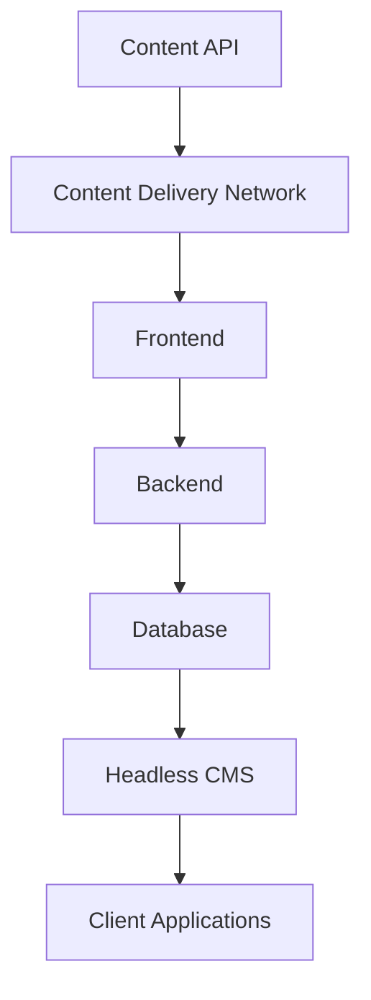
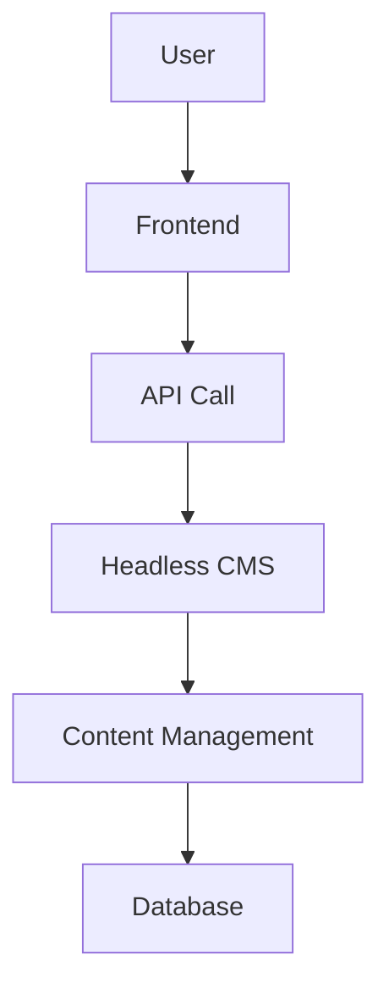

                 


## 文章标题

“Headless CMS：内容管理的新趋势”

## 关键词

Headless CMS，内容管理系统，API-first，Microservices，Serverless，前端架构，后端架构，数字营销，用户体验

## 摘要

随着数字化转型的加速，内容管理系统的需求日益增长。传统的 CMS 存在许多限制，而 Headless CMS 以其灵活性和可扩展性成为了新的趋势。本文将深入探讨 Headless CMS 的定义、优势、架构、核心算法原理、数学模型、项目实战，以及与其他技术趋势的关系，帮助读者全面了解 Headless CMS 的应用和未来前景。

## 引言

### 1.1 Headless CMS 概述

#### 1.1.1 Headless CMS 的定义

Headless CMS 是一种无前端框架的内容管理系统，它提供 API 接口来管理、存储和分发内容，而前端和后端则独立开发。这种架构消除了传统 CMS 中前端和后端紧密耦合的限制，使得开发者可以更灵活地构建和部署应用程序。

#### 1.1.2 Headless CMS 的优势

Headless CMS 具有以下几个显著优势：

1. **灵活性**：开发者可以自由选择前端和后端技术，不受 CMS 的限制。
2. **可扩展性**：易于集成新的前端和后端功能，支持微服务和云服务架构。
3. **性能优化**：通过 API 调用来获取内容，可以更好地进行缓存和内容分发。
4. **用户体验**：可以提高页面加载速度，提供更流畅的用户体验。

#### 1.1.3 Headless CMS 的趋势

随着 API-first、Microservices 和 Serverless 技术的兴起，Headless CMS 越来越受到开发者和企业的青睐。越来越多的内容管理系统提供商开始支持 Headless 模式，以适应市场趋势。

## Headless CMS 的原理与架构

### 1.2.1 Headless CMS 核心概念联系图



### 1.2.2 Headless CMS 架构图



## 核心算法原理讲解

### 2.1 数据存储与检索

#### 2.1.1 文档存储与检索算法伪代码

```plaintext
// 存储文档
def storeDocument(document):
    // 将文档存储到数据库
    database.insert(document)

// 检索文档
def retrieveDocument(id):
    // 从数据库中检索文档
    return database.findById(id)
```

## 数学模型和数学公式

### 3.1 内容优化模型

#### 3.1.1 优化目标函数公式

$$
\text{minimize} \quad J(\theta) = \frac{1}{m}\sum_{i=1}^{m}(-y^{(i)}\log(h_\theta(x^{(i)})) + (1 - y^{(i)})\log(1 - h_\theta(x^{(i)})))
$$

#### 3.1.2 梯度下降算法伪代码

```plaintext
// 梯度下降算法
// 初始化参数
theta = initializeParams()
// 设置学习率
alpha = 0.01
// 设置迭代次数
num_iterations = 1000

for i in 1 to num_iterations:
    // 计算梯度
    gradients = computeGradients(theta, X, y)
    // 更新参数
    theta = theta - alpha * gradients
```

## 项目实战

### 4.1 实际项目案例

#### 4.1.1 项目背景

#### 4.1.2 项目目标

#### 4.1.3 开发环境搭建

#### 4.1.4 源代码实现与解读

#### 4.1.5 代码应用解读与分析

#### 4.1.6 实际案例分析和详细讲解剖析

#### 4.1.7 项目小结

## 其他技术趋势

### 5.1 API-first 与 Headless CMS

#### 5.1.1 API-first 的优势

#### 5.1.2 Headless CMS 与 API-first 的关系

### 5.2 Microservices 与 Headless CMS

#### 5.2.1 Microservices 的优势

#### 5.2.2 Headless CMS 与 Microservices 的关系

### 5.3 Serverless 与 Headless CMS

#### 5.3.1 Serverless 的优势

#### 5.3.2 Headless CMS 与 Serverless 的关系

## 总结与展望

### 6.1 Headless CMS 的发展回顾

### 6.2 Headless CMS 的未来趋势

### 6.3 开发者如何适应 Headless CMS

## 最佳实践 tips、小结、注意事项、拓展阅读等内容

### 7.1 最佳实践 tips

### 7.2 小结

### 7.3 注意事项

### 7.4 拓展阅读

## 作者信息

作者：AI天才研究院/AI Genius Institute & 禅与计算机程序设计艺术 /Zen And The Art of Computer Programming

