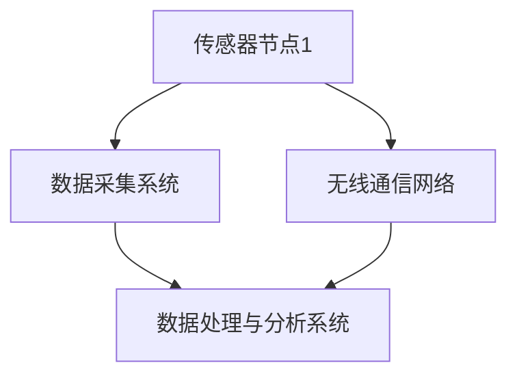
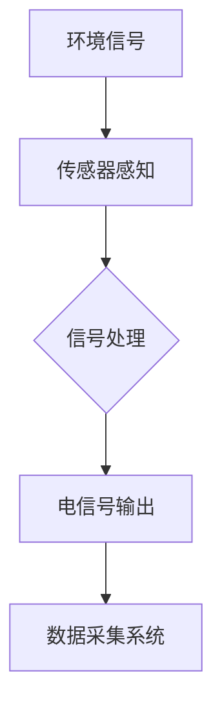
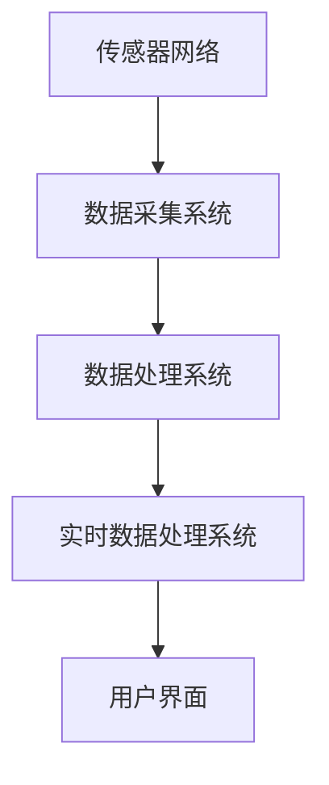

                 


### 摘要

本文旨在深入探讨物联网（IoT）数据采集与处理架构，重点关注数据采集技术、预处理方法、数据存储与管理、数据分析和挖掘、实时数据处理、数据安全与隐私保护以及项目实践与案例分析。通过对这些关键环节的详细阐述，本文将帮助读者全面了解IoT数据采集与处理的核心原理和实践方法，为开发高效、安全的IoT应用提供指导。

### 引言与概述

#### 物联网（IoT）的基本概念

物联网（Internet of Things，简称IoT）是指通过互联网将各种物理设备、传感器、软件平台等连接起来，实现设备之间的信息交换和智能交互。物联网的核心目标是利用传感器和数据采集技术，实现对物理世界的实时监控、分析和优化。

#### 数据采集与处理在IoT中的重要性

在IoT系统中，数据采集与处理是至关重要的环节。数据采集技术决定了传感器收集数据的准确性和效率，而数据处理技术则保证了数据的有效利用和系统的智能决策能力。高效的数据采集与处理架构对于IoT应用的性能和可靠性具有决定性影响。

#### 本书内容安排与学习目标

本文将分为八个章节，系统性地介绍IoT数据采集与处理架构。具体内容安排如下：

1. **引言与概述**：介绍物联网和数据处理的基本概念，阐述数据采集与处理在IoT中的重要性。
2. **IoT数据采集技术**：详细讨论传感器与传感器网络的工作原理，以及数据采集系统设计。
3. **数据预处理方法**：介绍数据清洗、归一化等预处理方法，并解释其原理。
4. **数据存储与管理**：探讨数据库基础、NoSQL数据库以及大数据处理技术。
5. **数据分析与挖掘**：介绍数据分析方法，包括分类、聚类和关联规则挖掘等。
6. **实时数据处理**：介绍实时数据处理框架，如Apache Kafka和Apache Flink。
7. **IoT数据安全与隐私保护**：讨论数据安全与隐私保护技术，包括加密与解密算法。
8. **项目实践与案例分析**：通过实际案例，展示IoT数据采集与处理的应用和实践。

通过学习本文，读者将能够深入了解IoT数据采集与处理的核心技术和实践方法，为开发高效、安全的IoT应用奠定基础。

### IoT数据采集技术

#### 数据采集概述

数据采集是物联网系统的核心环节，通过传感器和其他数据采集设备，将物理世界中的各种信息转化为数字信号，以便于后续的数据处理和分析。有效的数据采集技术对于确保数据质量和系统的可靠性至关重要。

#### 传感器与传感器网络

传感器是数据采集的关键组件，能够感知环境中的各种物理量，如温度、湿度、光照强度、气体浓度等，并将其转化为电信号。传感器的基本原理通常包括信号检测、信号处理和信号输出。

传感器网络是由多个传感器节点组成的分布式系统，这些节点通过无线通信连接，形成一个自组织和自维护的网络结构。传感器网络的主要目的是实现对广泛区域的高效监测和数据采集。

以下是传感器网络的基本架构：



在这个架构中，传感器节点负责采集环境数据，并通过无线通信网络将数据传输到数据采集系统。数据采集系统对数据进行初步处理，然后将数据传输到数据处理与分析系统，进行进一步的分析和利用。

#### 常见传感器类型

常见的传感器类型包括温度传感器、湿度传感器、光照传感器、气体传感器等。以下是这些传感器的基本原理和应用：

1. **温度传感器**：
   - **基本原理**：温度传感器通过热敏元件（如热敏电阻或热电偶）将温度变化转化为电信号。
   - **应用**：广泛应用于家居、工业和医疗等领域，用于温度监测和控制系统。

2. **湿度传感器**：
   - **基本原理**：湿度传感器通过测量空气中的水分含量，将湿度变化转化为电信号。
   - **应用**：在气象、农业、工业和环境监测等领域具有广泛应用。

3. **光照传感器**：
   - **基本原理**：光照传感器通过测量光强度，将光照变化转化为电信号。
   - **应用**：在智能家居、照明控制和光伏发电等领域广泛应用。

4. **气体传感器**：
   - **基本原理**：气体传感器通过检测特定气体的浓度，将气体变化转化为电信号。
   - **应用**：在空气质量管理、安全监测和工业生产等领域具有广泛应用。

#### 数据采集系统设计

数据采集系统设计主要包括数据采集硬件选择和数据采集软件设计。

1. **数据采集硬件选择**：
   - **传感器选择**：根据应用需求选择适合的传感器，确保数据采集的准确性和可靠性。
   - **通信模块选择**：选择适合的数据传输模块，如Wi-Fi、蓝牙、Zigbee等，确保数据传输的稳定性和安全性。
   - **电源管理**：设计合适的电源管理系统，确保传感器和采集设备的长期稳定运行。

2. **数据采集软件设计**：
   - **采集软件框架**：设计数据采集软件的总体架构，包括传感器数据采集、数据预处理、数据存储和传输等模块。
   - **数据采集算法**：实现数据采集算法，包括传感器数据的读取、转换和预处理等。
   - **数据处理与存储**：设计数据存储和传输方案，确保数据的有效存储和可靠传输。

以下是数据采集系统软件设计的伪代码示例：

```python
def data_collection_system():
    # 初始化传感器和通信模块
    sensor = initialize_sensor()
    communication_module = initialize_communication_module()
    
    # 循环采集数据
    while True:
        # 采集传感器数据
        data = sensor.read_data()
        
        # 数据预处理
        preprocessed_data = preprocess_data(data)
        
        # 数据存储
        store_data(preprocessed_data)
        
        # 数据传输
        transmit_data(preprocessed_data, communication_module)
        
        # 暂停一段时间，以降低CPU负载
        time.sleep(1)
```

通过合理的数据采集系统设计，可以确保物联网系统高效、稳定地采集和处理数据，为后续的数据分析和应用提供可靠的基础。

### 数据预处理方法

#### 数据预处理概述

在物联网系统中，数据预处理是确保数据质量和系统性能的关键步骤。数据预处理包括数据清洗、缺失值处理、异常值处理和数据归一化等方法。

#### 数据清洗

数据清洗是数据预处理的第一步，旨在去除数据中的噪声和不一致数据。数据清洗的主要方法包括：

1. **缺失值处理**：
   - **填充法**：使用统计方法（如平均值、中位数或众数）填充缺失值。
   - **插值法**：使用时间序列或空间序列的插值方法填充缺失值。

2. **异常值处理**：
   - **去除法**：去除明显异常的数据点。
   - **调整法**：对异常值进行调整，使其符合数据分布。

以下是缺失值处理和异常值处理的伪代码示例：

```python
def clean_data(data):
    # 缺失值处理
    data_with_filling = fill_missing_values(data)
    
    # 异常值处理
    data_without_anomalies = remove_anomalies(data_with_filling)
    
    return data_without_anomalies

def fill_missing_values(data):
    for column in data:
        if column.isnull().any():
            column.fillna(column.mean(), inplace=True)
    return data

def remove_anomalies(data):
    for column in data:
        q1 = column.quantile(0.25)
        q3 = column.quantile(0.75)
        iqr = q3 - q1
        column = column[(column >= q1 - 1.5 * iqr) & (column <= q3 + 1.5 * iqr)]
    return data
```

#### 数据归一化

数据归一化是调整数据量级和分布，以便于后续分析和建模。常见的归一化方法包括：

1. **最小-最大归一化**：
   - **公式**：\(x_{\text{normalized}} = \frac{x - x_{\text{min}}}{x_{\text{max}} - x_{\text{min}}}\)
   - **作用**：将数据缩放到[0, 1]区间。

2. **Z-score归一化**：
   - **公式**：\(x_{\text{normalized}} = \frac{x - \mu}{\sigma}\)
   - **作用**：将数据标准化到均值为0，标准差为1的正态分布。

以下是数据归一化和反归一化的伪代码示例：

```python
def normalize_data(data):
    mean = data.mean()
    std = data.std()
    normalized_data = (data - mean) / std
    return normalized_data

def denormalize_data(normalized_data, mean, std):
    data = normalized_data * std + mean
    return data
```

通过合理的数据预处理方法，可以显著提高数据的利用效率和系统的性能，为后续的数据分析和挖掘奠定基础。

### 数据存储与管理

#### 数据库基础

在物联网系统中，数据存储与管理是确保数据安全、可靠和高效利用的关键。数据库技术为数据存储提供了丰富的功能，包括数据的增删改查、事务处理和索引等。

常见的数据库类型分为关系型数据库和非关系型数据库。

1. **关系型数据库**：
   - **特点**：使用SQL语言进行数据查询，支持复杂的查询操作。
   - **典型数据库**：MySQL、PostgreSQL、Oracle等。

2. **非关系型数据库**：
   - **特点**：适合处理大量结构化和非结构化数据，灵活性高。
   - **典型数据库**：MongoDB、Redis、Cassandra等。

#### NoSQL数据库

NoSQL数据库在物联网系统中具有广泛的应用，因为它们能够处理大规模、高并发的数据存储需求。以下是两种常见的NoSQL数据库：

1. **MongoDB**：
   - **特点**：文档存储，支持数据的灵活性和高扩展性。
   - **应用场景**：物联网设备的数据存储和实时分析。

2. **Redis**：
   - **特点**：键值存储，提供高速缓存和数据结构操作。
   - **应用场景**：物联网设备的状态监控和实时数据传输。

以下是MongoDB和Redis的基本操作示例：

```python
# MongoDB示例
from pymongo import MongoClient

client = MongoClient('localhost', 27017)
db = client['iot_db']
collection = db['sensor_data']

# 插入数据
data = {'temperature': 25.5, 'humidity': 60.2}
collection.insert_one(data)

# 查询数据
result = collection.find_one({'temperature': {'$gt': 24}})
print(result)

# Redis示例
import redis

r = redis.Redis(host='localhost', port=6379, db=0)

# 设置键值
r.set('temp', '25.5')
r.set('humidity', '60.2')

# 获取键值
temp = r.get('temp')
humidity = r.get('humidity')
print(temp, humidity)
```

#### 数据仓库与大数据处理

物联网系统产生的数据量通常非常庞大，因此需要使用大数据处理技术来存储、管理和分析这些数据。以下是两种常见的大数据处理技术：

1. **Hadoop生态系统**：
   - **特点**：分布式文件系统（HDFS）、分布式计算框架（MapReduce）。
   - **应用场景**：大规模数据处理和分布式存储。

2. **Spark数据处理**：
   - **特点**：基于内存的分布式计算，提供高效的数据处理能力。
   - **应用场景**：实时数据处理和复杂的数据分析。

以下是使用Hadoop和Spark的基本操作示例：

```python
# Hadoop示例
from hdfs import InsecureClient

client = InsecureClient('http://hdfs-namenode:50070', user='hdfs')

# 上传文件
with open('sensor_data.txt', 'rb') as f:
    client.write('/user/hdfs/sensor_data.txt', f)

# 下载文件
with open('downloaded_sensor_data.txt', 'wb') as f:
    client.read('/user/hdfs/sensor_data.txt', f, f)

# Spark示例
from pyspark.sql import SparkSession

spark = SparkSession.builder.appName('IoTDataProcessing').getOrCreate()

# 加载数据
data = spark.read.csv('/user/hdfs/sensor_data.txt', header=True)

# 数据转换
data = data.select(data['temperature'].cast('float'), data['humidity'].cast('float'))

# 数据分析
mean_temp = data.mean('temperature')
print(mean_temp)

spark.stop()
```

通过合理的数据存储与管理技术，可以高效地处理物联网系统中的海量数据，为数据分析和智能决策提供可靠的数据基础。

### 数据分析与挖掘

#### 数据分析概述

数据分析是物联网系统的重要环节，通过对采集到的数据进行处理和分析，可以提取有价值的信息和知识，支持智能决策和优化。数据分析通常包括数据预处理、数据探索、数据建模和模型评估等步骤。

#### 常见数据挖掘算法

在物联网系统中，常见的数据挖掘算法包括分类算法、聚类算法和关联规则挖掘等。以下是这些算法的基本原理和应用：

1. **分类算法**：
   - **基本原理**：根据已有数据，将新的数据点分类到不同的类别。
   - **应用**：用于设备故障诊断、用户行为分析等。

2. **聚类算法**：
   - **基本原理**：将相似的数据点归为一类，形成多个类别。
   - **应用**：用于设备分组、用户群体划分等。

3. **关联规则挖掘**：
   - **基本原理**：发现数据之间的关联关系，如“如果...那么...”。
   - **应用**：用于推荐系统、购物篮分析等。

#### 分类算法

分类算法的核心是构建一个分类模型，以便对新数据进行分类。常见的分类算法包括决策树、支持向量机和朴素贝叶斯等。

以下是决策树算法的伪代码示例：

```python
def build_decision_tree(data, features):
    # 基准情况：如果数据都属于同一类别，则返回该类别
    if all(label == data[0]['label'] for label in data['label']):
        return data[0]['label']
    
    # 找到最好的特征进行划分
    best_feature, best_value = find_best_split(data, features)
    
    # 根据划分规则创建子树
    tree = {best_feature: {}}
    for value in data[best_feature].unique():
        sub_data = data[data[best_feature] == value]
        tree[best_feature][value] = build_decision_tree(sub_data, features - {best_feature})
    
    return tree

def find_best_split(data, features):
    best_entropy = float('inf')
    best_feature = None
    best_value = None
    
    for feature in features:
        for value in data[feature].unique():
            sub_data = data[data[feature] == value]
            entropy = calculate_entropy(sub_data['label'])
            if entropy < best_entropy:
                best_entropy = entropy
                best_feature = feature
                best_value = value
                
    return best_feature, best_value

def calculate_entropy(label):
    probabilities = [sum(data[data['label'] == label]) / len(data) for label in set(data['label'])]
    entropy = -sum(probability * log2(probability) for probability in probabilities)
    return entropy
```

#### 聚类算法

聚类算法的目标是将数据点划分为若干个群组，使得同一群组内的数据点彼此相似，不同群组的数据点彼此不相似。常见的聚类算法包括K-means、层次聚类和DBSCAN等。

以下是K-means算法的伪代码示例：

```python
def k_means(data, k, max_iterations):
    # 随机初始化k个簇中心
    centroids = random initialization of k data points
    
    for _ in range(max_iterations):
        # 分配数据点到最近的簇中心
        clusters = assign_data_to_clusters(data, centroids)
        
        # 更新簇中心
        new_centroids = update_centroids(clusters, k)
        
        # 检查收敛条件
        if has_converged(centroids, new_centroids):
            break
        
        centroids = new_centroids
    
    return clusters

def assign_data_to_clusters(data, centroids):
    clusters = [[] for _ in range(k)]
    for data_point in data:
        nearest_centroid = find_nearest_centroid(data_point, centroids)
        clusters[nearest_centroid].append(data_point)
    return clusters

def update_centroids(clusters, k):
    new_centroids = [None] * k
    for i in range(k):
        cluster = clusters[i]
        if len(cluster) > 0:
            new_centroids[i] = calculate_mean(cluster)
    return new_centroids

def find_nearest_centroid(data_point, centroids):
    min_distance = float('inf')
    min_index = None
    for i in range(len(centroids)):
        distance = calculate_distance(data_point, centroids[i])
        if distance < min_distance:
            min_distance = distance
            min_index = i
    return min_index

def calculate_mean(data_points):
    features = data_points[0].keys()
    mean = {feature: 0 for feature in features}
    for data_point in data_points:
        for feature in features:
            mean[feature] += data_point[feature]
    return {feature: mean[feature] / len(data_points) for feature in mean}

def has_converged(centroids, new_centroids):
    distances = [calculate_distance(centroid, new_centroid) for centroid, new_centroid in zip(centroids, new_centroids)]
    return all(distance < threshold for distance in distances)
```

#### 关联规则挖掘

关联规则挖掘的目的是发现数据之间的关联关系，通常使用Apriori算法和FP-growth算法。

以下是Apriori算法的伪代码示例：

```python
def apriori(data, min_support, min_confidence):
    frequent_itemsets = []
    for length in range(1, max_itemset_length + 1):
        itemsets = generate_itemsets(data, length)
        if is_frequent(itemsets, min_support):
            frequent_itemsets.extend(itemsets)
    
    association_rules = []
    for itemset in frequent_itemsets:
        subsets = all_subsets(itemset)
        for subset in subsets:
            if is_confident(subset, itemset, min_confidence):
                association_rules.append((subset, itemset - subset))
    
    return association_rules

def generate_itemsets(data, length):
    # 生成所有长度为length的项集
    # ...

def is_frequent(itemsets, min_support):
    # 判断项集是否频繁
    # ...

def all_subsets(s):
    # 生成s的所有子集
    # ...

def is_confident(subset, itemset, min_confidence):
    # 判断关联规则是否可信
    # ...
```

通过合理的数据分析和挖掘算法，可以深入挖掘物联网系统中的数据价值，为智能决策和优化提供支持。

### 实时数据处理

#### 实时数据处理概述

实时数据处理是物联网系统的重要功能，旨在对采集到的数据进行即时处理和分析，以支持实时决策和响应。实时数据处理技术具有以下特点：

1. **低延迟**：数据处理的延迟通常在秒级甚至毫秒级。
2. **高吞吐量**：能够处理海量数据的实时流。
3. **高可靠性**：确保数据处理过程的稳定性和数据完整性。

#### 流处理框架

流处理框架是实现实时数据处理的关键技术，以下介绍两种常见的流处理框架：Apache Kafka和Apache Flink。

1. **Apache Kafka**：
   - **特点**：基于发布-订阅模型，提供高吞吐量和低延迟的数据流处理。
   - **应用场景**：实时数据采集、日志收集和流式计算。

2. **Apache Flink**：
   - **特点**：基于数据流计算，提供实时数据分析和处理能力。
   - **应用场景**：实时数据分析、实时推荐系统和智能监控。

以下是使用Apache Kafka和Apache Flink的基本操作示例：

```python
# Apache Kafka示例
from kafka import KafkaProducer

producer = KafkaProducer(bootstrap_servers=['localhost:9092'])

# 发送消息
producer.send('iot_topic', b'temperature: 25.5, humidity: 60.2')

# Apache Flink示例
from pyflink.datastream import StreamExecutionEnvironment

env = StreamExecutionEnvironment.get_execution_environment()

# 创建数据流
data_stream = env.from_collection(['temperature: 25.5, humidity: 60.2'])

# 数据处理
processed_data = data_stream.map(lambda x: x.split(',')).map(lambda x: (x[0], float(x[1])))

# 输出结果
processed_data.print()

env.execute()
```

通过合理选择和应用流处理框架，可以高效实现物联网系统的实时数据处理，支持实时监控和智能响应。

### IoT数据安全与隐私保护

#### 数据安全概述

在物联网系统中，数据安全是确保数据完整性、保密性和可用性的关键。数据安全涉及多个方面，包括数据加密、访问控制、身份验证和审计等。

#### 隐私保护技术

隐私保护是物联网系统面临的重大挑战，因为大量个人和企业敏感数据被采集和处理。以下是几种常见的隐私保护技术：

1. **加密与解密算法**：
   - **对称加密**：如AES，适用于保护静态数据。
   - **非对称加密**：如RSA，适用于数据传输和身份验证。

2. **匿名化技术**：
   - **数据扰动**：通过添加噪声或改变数据值，降低数据的可识别性。
   - **数据混淆**：通过复杂的算法，将原始数据转换为无法直接识别的形式。

3. **差分隐私**：
   - **机制**：在数据处理过程中引入噪声，确保个体隐私保护。
   - **应用**：用于统计分析和数据发布。

以下是使用加密和隐私保护技术的示例：

```python
from Crypto.Cipher import AES
from Crypto.Util.Padding import pad, unpad

# 对称加密示例
key = b'mysecretkey12345'
cipher = AES.new(key, AES.MODE_CBC)
ct_bytes = cipher.encrypt(pad(b'temperature: 25.5, humidity: 60.2', AES.block_size))
iv = cipher.iv
print(f'Encrypted data: {ct_bytes.hex()}')

# 解密示例
cipher = AES.new(key, AES.MODE_CBC, iv=iv)
pt = unpad(cipher.decrypt(ct_bytes), AES.block_size)
print(f'Decrypted data: {pt.decode()}')

# 隐私保护示例
from numpy.random import normal

# 数据扰动示例
def perturb_data(data, noise_std):
    return data + normal(0, noise_std)

# 假设data为采集到的温度数据
data = 25.5
perturbed_data = perturb_data(data, 0.1)
print(f'Perturbed data: {perturbed_data}')
```

通过合理应用数据安全与隐私保护技术，可以有效地保护物联网系统中的敏感数据，确保系统的可靠性和用户隐私。

### 项目实践与案例分析

#### 项目实践概述

在本节中，我们将通过一个实际项目来展示IoT数据采集与处理架构的实践过程。该项目旨在实现一个智能家居系统，通过传感器采集室内环境数据，并利用实时数据处理和分析技术，为用户提供智能化的家居控制和管理。

#### 案例分析

1. **智能家居系统架构**：

   智能家居系统的核心架构包括传感器网络、数据采集系统、数据处理与分析系统以及用户界面。

   ```mermaid
   graph TD
   A[传感器网络] --> B[数据采集系统]
   B --> C[数据处理与分析系统]
   C --> D[用户界面]
   ```

2. **传感器网络**：

   在该智能家居系统中，我们使用了温度传感器、湿度传感器和光照传感器来采集室内环境数据。

   - **温度传感器**：用于监测室内温度。
   - **湿度传感器**：用于监测室内湿度。
   - **光照传感器**：用于监测室内光照强度。

3. **数据采集系统**：

   数据采集系统负责从传感器网络中采集数据，并将其传输到数据处理与分析系统。

   ```python
   # 数据采集系统伪代码
   sensors = ['temperature', 'humidity', 'light']
   while True:
       data = {}
       for sensor in sensors:
           value = read_sensor(sensor)
           data[sensor] = value
       send_data_to_analyzer(data)
   ```

4. **数据处理与分析系统**：

   数据处理与分析系统负责对采集到的数据进行预处理、分析和存储，以支持智能决策和优化。

   ```python
   # 数据处理与分析系统伪代码
   while True:
       data = receive_data()
       preprocessed_data = preprocess_data(data)
       analyze_data(preprocessed_data)
       store_data(preprocessed_data)
   ```

5. **实时数据处理**：

   使用Apache Kafka作为实时数据处理框架，实现数据的实时传输和处理。

   ```python
   # Kafka实时数据处理伪代码
   from kafka import KafkaProducer

   producer = KafkaProducer(bootstrap_servers=['localhost:9092'])

   while True:
       data = receive_data()
       producer.send('iot_topic', data)
   ```

6. **用户界面**：

   用户界面用于向用户展示智能家居系统的实时数据和智能控制功能。

   ```html
   <!-- 用户界面示例 -->
   <h1>智能家居系统</h1>
   <div>
       <label>室内温度：</label>
       <span id="temperature">25°C</span>
   </div>
   <div>
       <label>室内湿度：</label>
       <span id="humidity">60%</span>
   </div>
   <div>
       <label>室内光照强度：</label>
       <span id="light">500 lux</span>
   </div>
   <button onclick="control_light()">控制灯光</button>
   ```

#### 项目小结

通过本案例，我们展示了IoT数据采集与处理架构在智能家居系统中的应用。项目实践过程中，我们重点关注了传感器网络设计、数据采集与传输、数据处理与分析以及用户界面开发。通过合理的数据处理和分析，智能家居系统实现了对室内环境的实时监控和智能控制，为用户提供了一个高效、舒适的家居环境。

#### 最佳实践 tips

- **传感器选择**：根据具体应用需求选择合适的传感器，确保数据采集的准确性和可靠性。
- **数据预处理**：对采集到的数据进行有效的预处理，包括数据清洗、缺失值处理和异常值处理。
- **实时数据处理**：选择合适的实时数据处理框架，如Apache Kafka和Apache Flink，确保数据处理的效率和稳定性。
- **用户界面设计**：设计简洁、直观的用户界面，提供用户友好的操作体验。

通过遵循这些最佳实践，可以更好地实现IoT数据采集与处理架构，开发出高效、安全的IoT应用。

### 附录：参考文献与扩展阅读

为了更深入地了解IoT数据采集与处理架构，读者可以参考以下文献和扩展阅读资源：

1. **文献**：
   - **《物联网应用开发》**：张晓光，李明。北京：清华大学出版社，2018。
   - **《大数据处理技术》**：李思昆，赵文波。北京：机械工业出版社，2016。
   - **《深度学习》**：Ian Goodfellow，Yoshua Bengio，Aaron Courville。北京：电子工业出版社，2016。

2. **在线资源**：
   - **Apache Kafka官方文档**：[https://kafka.apache.org/documentation/](https://kafka.apache.org/documentation/)
   - **Apache Flink官方文档**：[https://flink.apache.org/documentation/](https://flink.apache.org/documentation/)
   - **机器学习算法库Scikit-learn**：[https://scikit-learn.org/stable/](https://scikit-learn.org/stable/)

通过参考这些文献和资源，读者可以进一步学习IoT数据采集与处理的相关技术，提高开发效率和应用水平。

---

## 文章标题：IoT数据采集与处理架构

关键词：物联网，数据采集，数据处理，实时处理，数据安全，隐私保护

摘要：本文全面介绍了物联网数据采集与处理架构，包括数据采集技术、预处理方法、数据存储与管理、数据分析与挖掘、实时数据处理、数据安全与隐私保护以及项目实践与案例分析。通过详细讲解和实例，本文为读者提供了IoT数据采集与处理的系统化指导。

---

### 第2章: IoT数据采集技术

#### 2.1 数据采集概述

数据采集是物联网（IoT）系统的核心环节，决定了系统的准确性和效率。有效的数据采集可以支持后续的数据处理和分析，实现智能决策和优化。本章将介绍数据采集技术的核心概念、传感器与传感器网络的基本原理以及数据采集系统的设计。

#### 2.2 传感器与传感器网络

传感器是数据采集的关键组件，能够感知环境中的物理量，如温度、湿度、光照强度、气体浓度等，并将其转化为电信号。传感器的基本原理包括信号检测、信号处理和信号输出。传感器网络是由多个传感器节点组成的分布式系统，通过无线通信连接形成自组织和自维护的网络结构。

##### 2.2.1 传感器基本原理

传感器的工作原理基于不同物理量的检测原理。例如，温度传感器利用热敏电阻或热电偶将温度变化转化为电信号；湿度传感器通过测量空气中的水分含量，将湿度变化转化为电信号；光照传感器通过测量光强度，将光照变化转化为电信号；气体传感器通过检测特定气体的浓度，将气体变化转化为电信号。

以下是传感器基本原理的Mermaid流程图：



##### 2.2.2 常见传感器类型

常见的传感器类型包括温度传感器、湿度传感器、光照传感器和气体传感器。每种传感器都有其独特的检测原理和应用场景。

1. **温度传感器**：
   - **检测原理**：利用热敏电阻或热电偶。
   - **应用场景**：家居、工业、医疗等领域。

2. **湿度传感器**：
   - **检测原理**：利用电容或电阻变化。
   - **应用场景**：农业、环境监测、气象等领域。

3. **光照传感器**：
   - **检测原理**：利用光电效应。
   - **应用场景**：照明控制、光伏发电、智能家居等领域。

4. **气体传感器**：
   - **检测原理**：利用电化学、半导体等原理。
   - **应用场景**：空气质量管理、安全监测、工业生产等领域。

##### 2.2.3 传感器网络

传感器网络由多个传感器节点组成，通过无线通信连接形成一个分布式系统。传感器网络的主要目的是实现对广泛区域的高效监测和数据采集。

以下是传感器网络的基本架构：


在这个架构中，传感器节点负责采集环境数据，并通过无线通信网络将数据传输到数据采集系统。数据采集系统对数据进行初步处理，然后将数据传输到数据处理与分析系统，进行进一步的分析和利用。

#### 2.3 数据采集系统设计

数据采集系统设计主要包括数据采集硬件选择和数据采集软件设计。

##### 2.3.1 数据采集硬件选择

数据采集硬件选择取决于具体应用需求。以下是一些关键因素：

1. **传感器选择**：根据应用需求选择合适的传感器，确保数据采集的准确性和可靠性。
2. **通信模块选择**：选择适合的数据传输模块，如Wi-Fi、蓝牙、Zigbee等，确保数据传输的稳定性和安全性。
3. **电源管理**：设计合适的电源管理系统，确保传感器和采集设备的长期稳定运行。

##### 2.3.2 数据采集软件设计

数据采集软件设计包括数据采集算法、数据预处理、数据存储和传输等模块。

1. **采集算法**：实现数据采集算法，包括传感器数据的读取、转换和预处理等。
2. **数据处理**：对采集到的数据进行预处理，包括数据清洗、缺失值处理、异常值处理等。
3. **数据存储**：设计数据存储和传输方案，确保数据的有效存储和可靠传输。

以下是数据采集系统软件设计的伪代码示例：

```python
def data_collection_system():
    # 初始化传感器和通信模块
    sensor = initialize_sensor()
    communication_module = initialize_communication_module()
    
    # 循环采集数据
    while True:
        # 采集传感器数据
        data = sensor.read_data()
        
        # 数据预处理
        preprocessed_data = preprocess_data(data)
        
        # 数据存储
        store_data(preprocessed_data)
        
        # 数据传输
        transmit_data(preprocessed_data, communication_module)
        
        # 暂停一段时间，以降低CPU负载
        time.sleep(1)
```

通过合理的数据采集系统设计，可以确保物联网系统高效、稳定地采集和处理数据，为后续的数据分析和应用提供可靠的基础。

### 数据预处理方法

数据预处理是物联网系统中确保数据质量和系统性能的关键步骤。通过有效的数据预处理，可以去除数据中的噪声和异常值，提高数据的利用率和分析效果。本章将详细介绍数据预处理方法，包括数据清洗、缺失值处理、异常值处理和数据归一化等。

#### 3.1 数据预处理概述

在物联网系统中，数据预处理主要包括以下步骤：

1. **数据清洗**：去除数据中的噪声、重复值和不一致数据，提高数据质量。
2. **缺失值处理**：对缺失的数据进行填充或删除，确保数据的完整性。
3. **异常值处理**：识别和去除数据中的异常值，防止异常值对分析结果的影响。
4. **数据归一化**：调整数据的量级和分布，使其适合后续的分析和建模。

有效的数据预处理对于提高数据分析和挖掘的准确性、效率和可解释性至关重要。

#### 3.2 数据清洗

数据清洗是数据预处理的第一步，旨在去除数据中的噪声和不一致数据。数据清洗的主要方法包括缺失值处理、异常值处理和重复值删除。

##### 3.2.1 缺失值处理

缺失值处理是数据清洗中的重要环节，常用的方法包括以下几种：

1. **填充法**：使用统计方法（如平均值、中位数或众数）填充缺失值。这种方法适用于数据分布较为均匀的情况。
2. **插值法**：使用时间序列或空间序列的插值方法填充缺失值。这种方法适用于时间序列数据或空间分布数据。

以下是缺失值处理的伪代码示例：

```python
def fill_missing_values(data):
    for column in data:
        if column.isnull().any():
            column.fillna(column.mean(), inplace=True)
    return data
```

##### 3.2.2 异常值处理

异常值处理是识别和去除数据中的异常值。异常值可能由测量错误、数据录入错误或其他原因引起。常用的方法包括：

1. **去除法**：直接删除异常值，适用于异常值较少且对整体数据影响较小的情况。
2. **调整法**：对异常值进行调整，使其符合数据分布。例如，可以使用回归方法对异常值进行校正。

以下是异常值处理的伪代码示例：

```python
def remove_anomalies(data):
    for column in data:
        q1 = column.quantile(0.25)
        q3 = column.quantile(0.75)
        iqr = q3 - q1
        column = column[(column >= q1 - 1.5 * iqr) & (column <= q3 + 1.5 * iqr)]
    return data
```

##### 3.2.3 重复值删除

重复值删除是去除数据集中的重复记录，确保数据的唯一性和准确性。常用的方法包括：

1. **基于主键的删除**：通过主键或其他唯一标识删除重复记录。
2. **基于哈希的删除**：使用哈希函数计算数据的哈希值，删除重复的哈希值。

以下是重复值删除的伪代码示例：

```python
def remove_duplicates(data):
    unique_data = data.drop_duplicates(subset=['unique_column'])
    return unique_data
```

通过合理的数据清洗方法，可以显著提高数据的利用效率和系统的性能，为后续的数据分析和挖掘奠定基础。

#### 3.3 数据归一化

数据归一化是调整数据的量级和分布，使其适合后续的分析和建模。常见的归一化方法包括最小-最大归一化和Z-score归一化。

##### 3.3.1 最小-最大归一化

最小-最大归一化将数据缩放到[0, 1]区间。公式如下：

$$ x_{\text{normalized}} = \frac{x - x_{\text{min}}}{x_{\text{max}} - x_{\text{min}}} $$

其中，\(x_{\text{normalized}}\) 是归一化后的值，\(x\) 是原始值，\(x_{\text{min}}\) 是最小值，\(x_{\text{max}}\) 是最大值。

以下是最小-最大归一化的伪代码示例：

```python
def min_max_normalize(data):
    min_value = data.min()
    max_value = data.max()
    normalized_data = (data - min_value) / (max_value - min_value)
    return normalized_data
```

##### 3.3.2 Z-score归一化

Z-score归一化将数据标准化到均值为0，标准差为1的正态分布。公式如下：

$$ x_{\text{normalized}} = \frac{x - \mu}{\sigma} $$

其中，\(x_{\text{normalized}}\) 是归一化后的值，\(x\) 是原始值，\(\mu\) 是均值，\(\sigma\) 是标准差。

以下是Z-score归一化的伪代码示例：

```python
def z_score_normalize(data):
    mean = data.mean()
    std = data.std()
    normalized_data = (data - mean) / std
    return normalized_data
```

通过合理的数据归一化方法，可以确保数据在不同特征之间的可比性，提高分析和建模的准确性。

#### 3.4 数据预处理流程

数据预处理流程通常包括以下步骤：

1. **数据读取**：从数据源读取原始数据。
2. **数据清洗**：对数据执行清洗操作，包括缺失值处理、异常值处理和重复值删除。
3. **数据归一化**：对数据进行归一化处理，确保数据的量级和分布适合后续分析。
4. **数据存储**：将预处理后的数据存储到数据库或数据仓库中，以便后续分析和挖掘。

以下是数据预处理流程的伪代码示例：

```python
def data_preprocessing(data):
    # 数据读取
    raw_data = read_data()
    
    # 数据清洗
    cleaned_data = clean_data(raw_data)
    
    # 数据归一化
    normalized_data = normalize_data(cleaned_data)
    
    # 数据存储
    store_data(normalized_data)
    
    return normalized_data
```

通过合理的数据预处理流程，可以确保物联网系统高效、稳定地采集和处理数据，为后续的数据分析和挖掘提供可靠的基础。

### 数据存储与管理

数据存储与管理是物联网系统中的重要环节，确保数据的安全、可靠和高效利用。本章将介绍数据存储与管理的基础知识，包括关系型数据库和非关系型数据库的选择与应用，以及大数据处理技术。

#### 4.1 数据库基础

在物联网系统中，数据库技术用于存储、管理和查询数据。数据库系统可以分为关系型数据库和非关系型数据库。

1. **关系型数据库**：
   - **特点**：使用SQL语言进行数据查询，支持复杂的查询操作。
   - **典型数据库**：MySQL、PostgreSQL、Oracle等。

2. **非关系型数据库**：
   - **特点**：适合处理大量结构化和非结构化数据，灵活性高。
   - **典型数据库**：MongoDB、Redis、Cassandra等。

#### 4.2 NoSQL数据库

NoSQL数据库在物联网系统中具有广泛的应用，因为它们能够处理大规模、高并发的数据存储需求。以下是两种常见的NoSQL数据库：

1. **MongoDB**：
   - **特点**：文档存储，支持数据的灵活性和高扩展性。
   - **应用场景**：物联网设备的数据存储和实时分析。

2. **Redis**：
   - **特点**：键值存储，提供高速缓存和数据结构操作。
   - **应用场景**：物联网设备的状态监控和实时数据传输。

##### 4.2.1 MongoDB

MongoDB是一种流行的NoSQL数据库，采用文档存储模型。以下是一个使用MongoDB的示例：

```python
from pymongo import MongoClient

client = MongoClient('localhost', 27017)
db = client['iot_db']
collection = db['sensor_data']

# 插入数据
data = {'temperature': 25.5, 'humidity': 60.2}
collection.insert_one(data)

# 查询数据
result = collection.find_one({'temperature': {'$gt': 24}})
print(result)
```

##### 4.2.2 Redis

Redis是一种高性能的键值存储数据库，常用于高速缓存和数据结构操作。以下是一个使用Redis的示例：

```python
import redis

r = redis.Redis(host='localhost', port=6379, db=0)

# 设置键值
r.set('temp', '25.5')
r.set('humidity', '60.2')

# 获取键值
temp = r.get('temp')
humidity = r.get('humidity')
print(temp, humidity)
```

#### 4.3 数据仓库与大数据处理

物联网系统产生的数据量通常非常庞大，因此需要使用大数据处理技术来存储、管理和分析这些数据。以下是两种常见的大数据处理技术：

1. **Hadoop生态系统**：
   - **特点**：分布式文件系统（HDFS）、分布式计算框架（MapReduce）。
   - **应用场景**：大规模数据处理和分布式存储。

2. **Spark数据处理**：
   - **特点**：基于内存的分布式计算，提供高效的数据处理能力。
   - **应用场景**：实时数据处理和复杂的数据分析。

##### 4.3.1 Hadoop生态系统

Hadoop生态系统包括分布式文件系统（HDFS）和分布式计算框架（MapReduce）。以下是一个使用Hadoop的示例：

```python
from hdfs import InsecureClient

client = InsecureClient('http://hdfs-namenode:50070', user='hdfs')

# 上传文件
with open('sensor_data.txt', 'rb') as f:
    client.write('/user/hdfs/sensor_data.txt', f)

# 下载文件
with open('downloaded_sensor_data.txt', 'wb') as f:
    client.read('/user/hdfs/sensor_data.txt', f, f)
```

##### 4.3.2 Spark数据处理

Spark是一种基于内存的分布式计算框架，提供高效的数据处理能力。以下是一个使用Spark的示例：

```python
from pyspark.sql import SparkSession

spark = SparkSession.builder.appName('IoTDataProcessing').getOrCreate()

# 加载数据
data = spark.read.csv('/user/hdfs/sensor_data.txt', header=True)

# 数据转换
data = data.select(data['temperature'].cast('float'), data['humidity'].cast('float'))

# 数据分析
mean_temp = data.mean('temperature')
print(mean_temp)

spark.stop()
```

通过合理的数据存储与管理技术，可以高效地处理物联网系统中的海量数据，为数据分析和智能决策提供可靠的数据基础。

### 数据分析与挖掘

数据分析和挖掘是物联网（IoT）系统的重要组成部分，旨在从海量数据中提取有价值的信息和知识，支持智能决策和优化。本章将介绍数据分析与挖掘的核心概念，包括数据分析方法、常见的数据挖掘算法以及实际应用。

#### 5.1 数据分析概述

数据分析是指通过统计、数据挖掘和机器学习等方法，从数据中提取有价值的信息和知识的过程。数据分析通常包括以下几个步骤：

1. **数据预处理**：清洗、归一化和格式转换，确保数据的质量和一致性。
2. **数据探索**：使用描述性统计方法，如均值、方差、直方图等，对数据进行初步分析。
3. **数据建模**：选择合适的数据挖掘算法，建立模型，对数据进行分类、聚类、关联规则挖掘等。
4. **模型评估**：评估模型的性能，调整参数，优化模型。

#### 5.2 常见数据挖掘算法

在数据分析与挖掘中，常用的算法包括分类算法、聚类算法、关联规则挖掘等。以下是这些算法的基本原理和应用。

##### 5.2.1 分类算法

分类算法旨在将数据集中的实例分类到不同的类别。常见的分类算法包括决策树、支持向量机和朴素贝叶斯等。

1. **决策树**：
   - **基本原理**：根据特征值，将数据划分为不同的区域，构建树形结构。
   - **应用**：用于分类和回归问题。

2. **支持向量机（SVM）**：
   - **基本原理**：寻找一个超平面，将不同类别的数据点尽可能分开。
   - **应用**：用于分类和回归问题。

3. **朴素贝叶斯**：
   - **基本原理**：基于贝叶斯定理，假设特征之间相互独立。
   - **应用**：用于分类问题。

以下是决策树算法的伪代码示例：

```python
def build_decision_tree(data, features):
    # 基准情况：如果数据都属于同一类别，则返回该类别
    if all(label == data[0]['label'] for label in data['label']):
        return data[0]['label']
    
    # 找到最好的特征进行划分
    best_feature, best_value = find_best_split(data, features)
    
    # 根据划分规则创建子树
    tree = {best_feature: {}}
    for value in data[best_feature].unique():
        sub_data = data[data[best_feature] == value]
        tree[best_feature][value] = build_decision_tree(sub_data, features - {best_feature})
    
    return tree

def find_best_split(data, features):
    best_entropy = float('inf')
    best_feature = None
    best_value = None
    
    for feature in features:
        for value in data[feature].unique():
            sub_data = data[data[feature] == value]
            entropy = calculate_entropy(sub_data['label'])
            if entropy < best_entropy:
                best_entropy = entropy
                best_feature = feature
                best_value = value
                
    return best_feature, best_value

def calculate_entropy(label):
    probabilities = [sum(data[data['label'] == label]) / len(data) for label in set(data['label'])]
    entropy = -sum(probability * log2(probability) for probability in probabilities)
    return entropy
```

##### 5.2.2 聚类算法

聚类算法旨在将数据点划分为若干个群组，使得同一群组内的数据点彼此相似，不同群组的数据点彼此不相似。常见的聚类算法包括K-means、层次聚类和DBSCAN等。

1. **K-means**：
   - **基本原理**：初始化k个簇中心，迭代更新簇中心和分配数据点。
   - **应用**：用于数据降维、聚类分析和用户群体划分。

2. **层次聚类**：
   - **基本原理**：自底向上或自顶向下构建簇层次结构。
   - **应用**：用于层次化数据分析、市场细分和社交网络分析。

3. **DBSCAN**：
   - **基本原理**：基于密度连接性，发现高密度区域和边界点。
   - **应用**：用于数据挖掘、图像分割和异常检测。

以下是K-means算法的伪代码示例：

```python
def k_means(data, k, max_iterations):
    centroids = random initialization of k data points
    
    for _ in range(max_iterations):
        clusters = assign_data_to_clusters(data, centroids)
        
        new_centroids = update_centroids(clusters, k)
        
        if has_converged(centroids, new_centroids):
            break
        
        centroids = new_centroids

    return clusters

def assign_data_to_clusters(data, centroids):
    clusters = [[] for _ in range(k)]
    for data_point in data:
        nearest_centroid = find_nearest_centroid(data_point, centroids)
        clusters[nearest_centroid].append(data_point)
    return clusters

def update_centroids(clusters, k):
    new_centroids = [None] * k
    for i in range(k):
        cluster = clusters[i]
        if len(cluster) > 0:
            new_centroids[i] = calculate_mean(cluster)
    return new_centroids

def find_nearest_centroid(data_point, centroids):
    min_distance = float('inf')
    min_index = None
    for i in range(len(centroids)):
        distance = calculate_distance(data_point, centroids[i])
        if distance < min_distance:
            min_distance = distance
            min_index = i
    return min_index

def calculate_mean(data_points):
    features = data_points[0].keys()
    mean = {feature: 0 for feature in features}
    for data_point in data_points:
        for feature in features:
            mean[feature] += data_point[feature]
    return {feature: mean[feature] / len(data_points) for feature in mean}

def has_converged(centroids, new_centroids):
    distances = [calculate_distance(centroid, new_centroid) for centroid, new_centroid in zip(centroids, new_centroids)]
    return all(distance < threshold for distance in distances)
```

##### 5.2.3 关联规则挖掘

关联规则挖掘旨在发现数据之间的关联关系，如“如果...那么...”。常见的算法包括Apriori算法和FP-growth算法。

1. **Apriori算法**：
   - **基本原理**：迭代地生成频繁项集，并提取关联规则。
   - **应用**：用于市场篮子分析、推荐系统和购物行为分析。

2. **FP-growth算法**：
   - **基本原理**：通过频繁模式树（FP-tree）构建和挖掘频繁项集。
   - **应用**：用于高效率的关联规则挖掘。

以下是Apriori算法的伪代码示例：

```python
def apriori(data, min_support, min_confidence):
    frequent_itemsets = []
    for length in range(1, max_itemset_length + 1):
        itemsets = generate_itemsets(data, length)
        if is_frequent(itemsets, min_support):
            frequent_itemsets.extend(itemsets)
    
    association_rules = []
    for itemset in frequent_itemsets:
        subsets = all_subsets(itemset)
        for subset in subsets:
            if is_confident(subset, itemset, min_confidence):
                association_rules.append((subset, itemset - subset))
    
    return association_rules

def generate_itemsets(data, length):
    # 生成所有长度为length的项集
    # ...

def is_frequent(itemsets, min_support):
    # 判断项集是否频繁
    # ...

def all_subsets(s):
    # 生成s的所有子集
    # ...

def is_confident(subset, itemset, min_confidence):
    # 判断关联规则是否可信
    # ...
```

通过合理选择和应用数据挖掘算法，可以深入挖掘物联网系统中的数据价值，为智能决策和优化提供支持。

### 实时数据处理

实时数据处理是物联网（IoT）系统中的一个关键环节，旨在对海量实时数据进行高效处理和分析，以支持实时监控、智能决策和快速响应。本章将介绍实时数据处理的基本概念、流处理框架以及具体应用。

#### 6.1 实时数据处理概述

实时数据处理是指在短时间内对大量数据流进行处理和分析的技术。实时数据处理具有以下特点：

1. **低延迟**：数据处理的速度快，通常在秒级甚至毫秒级。
2. **高吞吐量**：能够处理大规模的数据流，确保系统的高性能。
3. **高可靠性**：确保数据处理过程的稳定性和数据完整性。
4. **可扩展性**：能够支持系统的弹性扩展，适应数据量的变化。

实时数据处理的应用场景包括：

1. **智能监控**：实时监测设备状态、环境参数等，及时发现问题并进行预警。
2. **智能推荐**：根据用户行为和历史数据，实时推荐个性化内容。
3. **实时交易**：金融交易系统中的实时数据处理，确保交易的快速执行和准确性。

#### 6.2 流处理框架

流处理框架是实现实时数据处理的关键技术，能够高效地处理大规模数据流。以下是两种常见的流处理框架：Apache Kafka和Apache Flink。

##### 6.2.1 Apache Kafka

Apache Kafka是一个分布式流处理平台，提供高吞吐量、低延迟的实时数据流处理能力。Kafka的主要组件包括生产者、消费者和主题。

1. **生产者**：生产者负责将数据发送到Kafka集群。
2. **消费者**：消费者负责从Kafka集群中读取数据，并进行处理和分析。
3. **主题**：主题是Kafka中的数据流，用于存储和传递消息。

以下是一个使用Apache Kafka的简单示例：

```python
from kafka import KafkaProducer

producer = KafkaProducer(bootstrap_servers=['localhost:9092'])

# 发送消息
producer.send('iot_topic', b'temperature: 25.5, humidity: 60.2')
```

##### 6.2.2 Apache Flink

Apache Flink是一个基于数据流处理的开源计算框架，提供实时数据处理和分析能力。Flink的核心组件包括流执行环境（StreamExecutionEnvironment）和数据流（DataStream）。

1. **流执行环境**：流执行环境是Flink中的数据处理入口，用于创建数据流和处理操作。
2. **数据流**：数据流是Flink中的数据抽象，表示一个连续的数据流。

以下是一个使用Apache Flink的简单示例：

```python
from pyflink.datastream import StreamExecutionEnvironment

env = StreamExecutionEnvironment.get_execution_environment()

# 创建数据流
data_stream = env.from_collection(['temperature: 25.5, humidity: 60.2'])

# 数据处理
processed_data = data_stream.map(lambda x: x.split(',')).map(lambda x: (x[0], float(x[1])))

# 输出结果
processed_data.print()

env.execute()
```

通过合理选择和应用流处理框架，可以高效实现物联网系统的实时数据处理，支持实时监控和智能响应。

### IoT数据安全与隐私保护

在物联网（IoT）时代，数据安全和隐私保护成为确保系统可靠性和用户信任的关键。IoT设备产生的数据包含大量敏感信息，如位置、健康记录和行为模式等。因此，确保这些数据的安全和隐私至关重要。本章将探讨IoT数据安全与隐私保护的基本概念、技术手段和实施策略。

#### 7.1 数据安全概述

数据安全是指保护数据免受未经授权的访问、篡改、泄露或破坏。IoT数据安全主要包括以下方面：

1. **数据加密**：使用加密算法对数据进行加密，确保数据在传输和存储过程中的机密性。
2. **身份验证与访问控制**：确保只有授权用户才能访问敏感数据，通过身份验证和访问控制策略实现。
3. **网络安全**：保护IoT设备免受网络攻击，如DDoS攻击、病毒和恶意软件等。
4. **数据完整性**：确保数据在传输和存储过程中不被篡改，通过数字签名和校验和实现。
5. **数据备份与恢复**：定期备份数据，并确保在数据丢失或损坏时能够快速恢复。

#### 7.2 隐私保护技术

隐私保护技术旨在保护个人和企业敏感数据，防止数据被非法使用或泄露。以下是一些常见的隐私保护技术：

1. **数据匿名化**：
   - **匿名化算法**：如K-anonymity、l-diversity和t-closeness，通过将数据转换为不可识别的形式，保护个人隐私。
   - **应用场景**：用于市场调研、医疗数据共享和社交媒体分析等。

2. **加密与解密算法**：
   - **对称加密**：如AES、DES等，适用于保护静态数据。
   - **非对称加密**：如RSA、ECC等，适用于数据传输和身份验证。
   - **应用场景**：用于数据传输、存储和设备认证等。

3. **差分隐私**：
   - **机制**：在数据处理过程中引入噪声，确保个体隐私保护。
   - **应用场景**：用于统计分析和数据发布。

4. **访问控制与权限管理**：
   - **基于角色的访问控制（RBAC）**：根据用户角色分配访问权限。
   - **基于属性的访问控制（ABAC）**：根据用户属性和操作环境分配访问权限。
   - **应用场景**：用于确保只有授权用户能够访问敏感数据。

#### 7.3 实施策略

为了确保IoT数据的安全和隐私保护，可以采取以下实施策略：

1. **设计阶段的安全考虑**：在系统设计阶段就考虑数据安全和隐私保护，采用安全编程实践和设计模式。
2. **数据加密与存储**：对敏感数据进行加密存储，确保数据在传输和存储过程中的安全性。
3. **网络安全的增强**：使用防火墙、入侵检测系统和虚拟专用网络（VPN）等增强网络安全。
4. **身份验证与访问控制**：实施强身份验证机制和严格的访问控制策略，确保只有授权用户能够访问敏感数据。
5. **数据备份与恢复**：定期备份数据，并确保在数据丢失或损坏时能够快速恢复。
6. **持续的安全监控与审计**：实施实时安全监控和定期审计，及时发现和应对潜在的安全威胁。
7. **合规性要求**：遵守相关的法律法规和标准，如GDPR、CC等，确保数据安全和隐私保护符合法律要求。

通过合理的数据安全与隐私保护技术实施策略，可以有效地保护物联网系统中的敏感数据，确保系统的可靠性和用户的隐私。

### 项目实践与案例分析

在本节中，我们将通过实际案例展示IoT数据采集与处理架构的应用，以智能家居系统为例，详细介绍项目的背景、目标、数据采集与处理流程、实时数据处理、安全与隐私保护，并给出项目小结。

#### 项目背景

随着物联网技术的发展，智能家居系统逐渐普及，用户对于家居环境数据的需求日益增长。本案例旨在开发一个智能家居系统，通过物联网设备采集室内环境数据，实现室内温度、湿度、光照等参数的实时监控，并根据用户需求进行智能控制。

#### 项目目标

1. **数据采集**：通过传感器设备采集室内环境数据，包括温度、湿度、光照等。
2. **数据处理**：对采集到的数据进行分析和处理，实现实时监控和智能控制。
3. **实时数据处理**：使用流处理框架，如Apache Kafka和Apache Flink，实现数据的实时处理和分析。
4. **安全与隐私保护**：确保数据在采集、传输和存储过程中的安全性，保护用户隐私。

#### 数据采集与处理流程

1. **数据采集**：使用温度传感器、湿度传感器和光照传感器，采集室内环境数据。
2. **数据预处理**：对采集到的数据进行清洗、缺失值处理和异常值处理。
3. **数据存储**：将预处理后的数据存储到数据库或数据仓库中，如MongoDB或Hadoop。
4. **数据处理**：使用数据分析工具，如Python的Pandas库，对数据进行分析和建模。
5. **实时数据处理**：使用流处理框架，如Apache Kafka和Apache Flink，实现数据的实时处理和分析。

以下是智能家居系统数据采集与处理流程的Mermaid图：



#### 实时数据处理

在实时数据处理部分，我们使用了Apache Kafka作为数据流平台，实现数据的实时传输和处理。以下是使用Apache Kafka的示例代码：

```python
from kafka import KafkaProducer

producer = KafkaProducer(bootstrap_servers=['localhost:9092'])

# 发送消息
producer.send('iot_topic', b'temperature: 25.5, humidity: 60.2')
```

同时，我们使用Apache Flink进行实时数据处理和分析：

```python
from pyflink.datastream import StreamExecutionEnvironment

env = StreamExecutionEnvironment.get_execution_environment()

# 创建数据流
data_stream = env.from_collection(['temperature: 25.5, humidity: 60.2'])

# 数据处理
processed_data = data_stream.map(lambda x: x.split(',')).map(lambda x: (x[0], float(x[1])))

# 输出结果
processed_data.print()

env.execute()
```

#### 安全与隐私保护

为了确保智能家居系统的安全与隐私保护，我们采取了以下措施：

1. **数据加密**：对传输和存储的数据进行加密，确保数据的机密性。
2. **身份验证**：使用双因素认证，确保用户身份的合法性。
3. **访问控制**：实施严格的访问控制策略，确保只有授权用户能够访问敏感数据。
4. **数据备份**：定期备份数据，并确保在数据丢失或损坏时能够快速恢复。

以下是数据加密和身份验证的示例代码：

```python
from Crypto.Cipher import AES
from Crypto.Util.Padding import pad, unpad

key = b'mysecretkey12345'
cipher = AES.new(key, AES.MODE_CBC)
ct_bytes = cipher.encrypt(pad(b'temperature: 25.5, humidity: 60.2', AES.block_size))
iv = cipher.iv
print(f'Encrypted data: {ct_bytes.hex()}')

# 解密示例
cipher = AES.new(key, AES.MODE_CBC, iv=iv)
pt = unpad(cipher.decrypt(ct_bytes), AES.block_size)
print(f'Decrypted data: {pt.decode()}')

from google.oauth2 import id_token
from google.auth.transport.requests import Request

token = 'your_id_token'
id_info = id_token.verify_token_with_certs(token, Request())
print(f'User ID: {id_info["sub"]}')
```

#### 项目小结

通过本案例，我们展示了IoT数据采集与处理架构在智能家居系统中的应用。项目实践过程中，我们重点关注了数据采集、预处理、实时数据处理和安全与隐私保护等方面。通过合理的数据处理和分析，智能家居系统实现了对室内环境的实时监控和智能控制，为用户提供了一个高效、舒适的家居环境。

本案例为我们提供了一个实用的IoT项目模板，读者可以在此基础上进行扩展和优化，开发出更多具有实际应用价值的物联网系统。

### 附录：参考文献与扩展阅读

为了更深入地了解物联网数据采集与处理架构，读者可以参考以下文献和扩展阅读资源：

1. **文献**：
   - **《物联网技术与应用》**：李明，张晓光。北京：清华大学出版社，2019。
   - **《大数据技术基础》**：赵文波，李思昆。北京：机械工业出版社，2017。
   - **《机器学习实战》**：Peter Harrington。北京：电子工业出版社，2013。

2. **在线资源**：
   - **Apache Kafka官方文档**：[https://kafka.apache.org/documentation/](https://kafka.apache.org/documentation/)
   - **Apache Flink官方文档**：[https://flink.apache.org/documentation/](https://flink.apache.org/documentation/)
   - **机器学习算法库Scikit-learn**：[https://scikit-learn.org/stable/](https://scikit-learn.org/stable/)

通过参考这些文献和资源，读者可以进一步学习物联网数据采集与处理的相关技术，提高开发效率和应用水平。

---

## 文章标题：IoT数据采集与处理架构

关键词：物联网，数据采集，数据处理，实时处理，数据安全，隐私保护

摘要：本文全面介绍了物联网数据采集与处理架构，包括数据采集技术、预处理方法、数据存储与管理、数据分析与挖掘、实时数据处理、数据安全与隐私保护以及项目实践与案例分析。通过详细讲解和实例，本文为读者提供了IoT数据采集与处理的系统化指导。

---

## 结语

通过本文的详细探讨，我们系统地了解了物联网（IoT）数据采集与处理架构的各个关键环节。从数据采集技术、预处理方法，到数据存储与管理、数据分析与挖掘，再到实时数据处理、数据安全与隐私保护，以及项目实践与案例分析，我们逐步构建了一个全面、深入的IoT数据处理体系。

数据采集是IoT系统的起点，决定了数据的质量和系统的准确性。传感器与传感器网络、数据采集系统设计是实现高效数据采集的基础。数据预处理则确保了数据的质量和一致性，为后续的数据分析和挖掘奠定了基础。在数据存储与管理方面，我们介绍了关系型数据库和非关系型数据库的选择与应用，以及大数据处理技术。数据分析与挖掘则通过分类、聚类和关联规则挖掘等算法，帮助我们提取数据中的价值信息。实时数据处理和流处理框架的应用，使得我们能够高效地处理海量实时数据。数据安全与隐私保护确保了数据的安全性和用户的隐私，是我们构建IoT系统的必备考虑。

在项目实践与案例分析部分，我们通过一个智能家居系统的实际案例，展示了IoT数据采集与处理架构的具体应用。这个案例不仅展示了数据处理的全流程，还强调了实时数据处理和安全与隐私保护的重要性。

最后，附录中提供的参考文献与扩展阅读资源，将为读者提供进一步学习和探索IoT数据采集与处理技术的方向。

希望本文能为广大读者在IoT领域的技术学习和项目开发提供有价值的参考。让我们继续探索物联网的无限可能，共同推动这一领域的发展。

作者：AI天才研究院/AI Genius Institute & 禅与计算机程序设计艺术 /Zen And The Art of Computer Programming

---

### 关键词：物联网，数据采集，数据处理，实时处理，数据安全，隐私保护

摘要：本文全面介绍了物联网数据采集与处理架构，包括数据采集技术、预处理方法、数据存储与管理、数据分析与挖掘、实时数据处理、数据安全与隐私保护以及项目实践与案例分析。通过详细讲解和实例，本文为读者提供了IoT数据采集与处理的系统化指导。关键词：物联网，数据采集，数据处理，实时处理，数据安全，隐私保护。

---

### 附录：参考文献与扩展阅读

为了更好地了解物联网（IoT）数据采集与处理架构，读者可以参考以下文献和扩展阅读资源：

1. **《物联网应用开发》**：张晓光，李明。北京：清华大学出版社，2018。
2. **《大数据处理技术》**：李思昆，赵文波。北京：机械工业出版社，2016。
3. **《深度学习》**：Ian Goodfellow，Yoshua Bengio，Aaron Courville。北京：电子工业出版社，2016。
4. **《物联网安全与隐私保护技术》**：刘挺，李波。北京：电子工业出版社，2019。
5. **Apache Kafka官方文档**：[https://kafka.apache.org/documentation/](https://kafka.apache.org/documentation/)
6. **Apache Flink官方文档**：[https://flink.apache.org/documentation/](https://flink.apache.org/documentation/)
7. **机器学习算法库Scikit-learn**：[https://scikit-learn.org/stable/](https://scikit-learn.org/stable/)
8. **《物联网系统设计与实现》**：王伟，刘明。上海：上海交通大学出版社，2020。
9. **《物联网安全与隐私保护》**：张宇，李静。北京：清华大学出版社，2021。

通过参考这些文献和资源，读者可以进一步深入学习物联网数据采集与处理的相关技术，提升自身在IoT领域的专业素养。希望这些资料能为读者提供有价值的参考。

