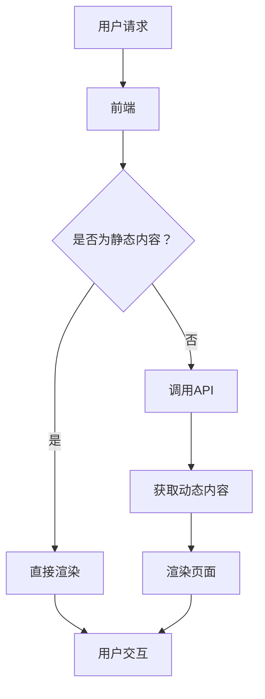

                 


### 文章标题

# Jamstack：现代Web开发的新范式

### 关键词

- Jamstack
- Web开发
- JavaScript
- API
- Markup
- 前端与后端分离
- 静态站点生成器

### 摘要

本文深入探讨了Jamstack，这一现代Web开发的新范式。我们将首先介绍Jamstack的背景和核心概念，包括JavaScript、API和Markup的结合，以及前端与后端的分离。接着，我们将详细讲解JavaScript的现代化开发、API的设计与使用、以及Markup的静态化工具。文章还将通过实际案例，展示如何利用Jamstack进行项目开发，并提供最佳实践和拓展阅读建议。通过本文，读者将全面理解Jamstack的优势和应用，掌握现代Web开发的核心技术。

### 目录

1. **背景介绍**  
   - Web开发的历史与现状
   - Jamstack的起源与发展

2. **核心概念与联系**  
   - JavaScript、API和Markup的概述
   - 前端与后端的分离
   - Mermaid流程图展示

3. **JavaScript的现代化开发**  
   - JavaScript模块化与框架
   - 常用JavaScript框架简介

4. **API的设计与使用**  
   - RESTful API与GraphQL
   - API安全性与性能优化

5. **Markup的静态化工具**  
   - 静态站点生成器介绍
   - 常用静态站点生成器使用

6. **项目实战**  
   - 开发环境搭建
   - 源代码详细实现与解读
   - 项目小结

7. **最佳实践与拓展阅读**  
   - Jamstack的最佳实践
   - 注意事项
   - 拓展阅读

### 背景介绍

#### Web开发的历史与现状

自互联网诞生以来，Web开发经历了多个阶段。从最初的HTML和CSS，到后来加入JavaScript，Web开发逐渐从静态页面转向动态交互。传统的Web开发模式通常包括前端、后端和数据库三个主要部分，这种模式在很长一段时间内主导了Web应用的构建。

然而，随着Web应用的复杂度和用户需求的变化，传统的开发模式也暴露出了一些问题。首先，前端和后端的耦合度高，导致开发流程复杂、维护成本高。其次，由于后端服务器的负载，Web应用的性能和可扩展性受到限制。此外，随着云计算和API经济的兴起，越来越多的开发者开始寻求一种更灵活、高效、易于维护的Web开发方式。

在这个背景下，Jamstack应运而生。Jamstack（JavaScript、API和Markup的堆栈）是一种现代Web开发的新范式，它通过前端与后端的分离，解决了传统开发模式中的诸多问题。Jamstack的核心思想是将静态内容与动态内容分离，使用静态站点生成器（SSG）或静态网站托管服务（SST）来构建前端，并通过API来获取后端数据。这种模式不仅提高了开发效率，还显著提升了Web应用的性能和可扩展性。

#### Jamstack的起源与发展

Jamstack的概念并非突然出现，而是逐渐演变而来的。其起源可以追溯到2015年，当时前端开发者Tommy Olsson和Michael Tolkbjerg在Egghead.io上发表了一篇关于“构建现代Web应用”的博客，首次提出了JavaScript、API和Markup的组合。这篇博客引起了业界的广泛关注，许多人开始探索这种新的开发模式。

随着技术的发展，Jamstack逐渐从概念走向实践。静态站点生成器（如Jekyll、Hexo、Next.js等）的出现，使得构建静态站点变得更加简单和高效。同时，越来越多的开发者开始使用GraphQL、RESTful API等现代API技术，进一步增强了Web应用的功能和性能。

目前，Jamstack已经成为Web开发领域的一个重要趋势。许多大型公司和开源项目已经开始采用Jamstack，如GitHub、Reddit、Coursera等。这些成功案例证明了Jamstack在现代Web开发中的巨大潜力和优势。

### 核心概念与联系

#### JavaScript、API和Markup的概述

在理解Jamstack之前，我们需要先了解其核心组件：JavaScript、API和Markup。

1. **JavaScript**：JavaScript是一种高级编程语言，广泛用于Web前端开发。它是Jamstack中不可或缺的一部分，负责处理用户的交互、动态内容的渲染和页面的逻辑。在现代Web开发中，JavaScript不仅用于传统的前端交互，还用于构建复杂的单页应用（SPA）和前端框架。

2. **API（应用程序编程接口）**：API是应用程序之间通信的接口，允许前端从后端获取数据。在Jamstack中，API负责提供动态内容，使得Web应用能够响应用户的需求，实现数据驱动的交互。常见的API技术包括RESTful API和GraphQL。

3. **Markup**：Markup通常指的是HTML、CSS和Markdown等标记语言。在Jamstack中，Markup用于构建静态网站，这些静态网站可以由静态站点生成器（SSG）或静态网站托管服务（SST）生成。Markup的主要作用是将内容以结构化的形式呈现给用户。

#### 前端与后端的分离

前端与后端的分离是Jamstack的核心思想之一。在传统Web开发中，前端和后端通常紧密耦合，这使得开发、测试和部署过程变得复杂且冗长。而在Jamstack中，前端和后端通过API进行通信，实现了解耦。

1. **前后端分离的优势**：  
   - **开发效率**：前后端分离使得前端和后端可以独立开发，前端开发者无需了解后端的具体实现，后端开发者也可以专注于业务逻辑的处理，从而提高开发效率。
   - **维护成本**：前后端分离降低了系统的复杂度，使得维护和更新变得更加容易。开发者可以分别对前端和后端进行独立更新，而不会相互干扰。
   - **性能优化**：前后端分离可以更好地进行性能优化。静态站点可以缓存，减少服务器负载；动态内容可以通过API高效获取，提高响应速度。

2. **前后端分离的实现方式**：  
   - **静态站点生成器（SSG）**：静态站点生成器（如Jekyll、Hexo、Next.js等）负责将Markdown或Markdown-like文件转换成静态HTML文件。这些静态文件可以通过静态网站托管服务（如Netlify、Vercel等）进行托管。
   - **静态网站托管服务（SST）**：静态网站托管服务（如Netlify、Vercel等）提供了一种简单的方式来托管静态网站。开发者只需上传静态文件，这些服务会自动处理站点构建和部署。

#### Mermaid流程图展示

为了更直观地展示Jamstack的核心概念和架构，我们可以使用Mermaid流程图来描述。以下是一个简化的Mermaid流程图示例：



这个流程图展示了用户请求、前端渲染、API调用和数据获取的整个过程。通过这个流程图，我们可以清晰地理解Jamstack的工作原理和架构。

### JavaScript的现代化开发

JavaScript在过去几年经历了巨大的发展，从最初的简单脚本语言转变为一种功能强大、模块化的编程语言。现代化JavaScript开发的核心在于模块化和框架的使用，这使得开发过程更加高效、代码更加可维护。

#### JavaScript模块化

模块化是JavaScript开发中的一个重要概念，它允许我们将代码拆分成多个独立的模块，每个模块负责处理特定的功能。这种做法不仅提高了代码的可复用性，还降低了代码的复杂度。

1. **模块化的优势**：
   - **代码复用**：模块化使得我们可以将通用的功能提取出来，并在多个项目中复用。
   - **代码组织**：模块化有助于组织代码结构，使得代码更加清晰、易于维护。
   - **依赖管理**：模块化使得依赖管理变得更加简单，我们可以明确地管理各个模块的依赖关系。

2. **模块化的实现方式**：
   - **CommonJS**：CommonJS是一种早期的模块化标准，主要用于服务器端JavaScript开发。它使用`require()`和`exports`来导入和导出模块。
   - **AMD（异步模块定义）**：AMD是一种用于浏览器端JavaScript的模块化标准，它通过`define()`函数来定义模块，并使用`require()`函数来导入模块。
   - **ES6模块化**：ES6（ECMAScript 2015）引入了新的模块化标准，通过`import`和`export`关键字来实现模块的导入和导出。ES6模块化是目前最常用的模块化标准，它支持静态导入和动态导入，并具有类型推断和类型检查等优势。

以下是一个简单的ES6模块化示例：

```javascript
// 文件1：math.js
export function add(a, b) {
    return a + b;
}

export function subtract(a, b) {
    return a - b;
}

// 文件2：main.js
import { add, subtract } from './math.js';

console.log(add(5, 3)); // 输出：8
console.log(subtract(5, 3)); // 输出：2
```

在这个示例中，`math.js`模块导出了两个函数`add`和`subtract`，而`main.js`模块则通过`import`关键字导入这两个函数，并在控制台中打印它们的结果。

#### 常用JavaScript框架简介

在现代Web开发中，框架的使用大大提高了开发效率和代码质量。以下是几种常用的JavaScript框架：

1. **React**：
   - **简介**：React是一个由Facebook开发的开源JavaScript库，用于构建用户界面。它通过虚拟DOM和组件化设计，实现了高效的界面渲染和良好的可维护性。
   - **优势**：React具有出色的性能、灵活的组件化设计和丰富的生态系统。
   - **应用场景**：React广泛应用于单页应用（SPA）、Web组件和移动应用开发。

2. **Vue**：
   - **简介**：Vue是一个渐进式JavaScript框架，由前Google工程师尤雨溪开发。它设计简洁、易于上手，适用于各种规模的应用开发。
   - **优势**：Vue具有较好的性能、简洁的语法和强大的生态系统。
   - **应用场景**：Vue适用于中小型项目、企业级应用和移动应用开发。

3. **Angular**：
   - **简介**：Angular是由Google开发的下一代JavaScript框架，它采用了组件化、双向数据绑定和依赖注入等先进技术。
   - **优势**：Angular具有强大的功能、严格的类型检查和优化的性能。
   - **应用场景**：Angular适用于大型企业级应用、单页应用和桌面应用开发。

选择合适的框架对于现代JavaScript开发至关重要。开发者应根据项目需求和团队技能选择合适的框架，以提高开发效率和代码质量。

### API的设计与使用

在Jamstack架构中，API扮演着至关重要的角色，它负责从前端向后端请求数据，并返回相应的响应。这种设计使得前端和后端能够独立开发、部署和扩展，从而提高了系统的灵活性和可维护性。本节将详细介绍API的设计与使用，包括RESTful API和GraphQL两种常见的技术。

#### RESTful API

RESTful API（Representational State Transfer API）是一种基于HTTP协议的API设计风格，它广泛用于Web服务开发。RESTful API的设计原则包括统一接口、无状态、客户端-服务器模式等。

1. **RESTful API的设计原则**：

   - **统一接口**：RESTful API通过统一接口（如GET、POST、PUT、DELETE等HTTP方法）提供资源访问，使得API易于理解和使用。
   - **无状态**：RESTful API不保留客户端和服务器之间的状态信息，每次请求都是独立的，提高了系统的可扩展性和安全性。
   - **客户端-服务器模式**：RESTful API遵循客户端-服务器模式，客户端通过发送请求获取数据，服务器响应请求并提供数据。

2. **RESTful API的使用方法**：

   - **GET请求**：用于获取资源列表或单个资源详情。例如，`GET /users`可以获取所有用户信息，`GET /users/1`可以获取ID为1的用户信息。
   - **POST请求**：用于创建新的资源。例如，`POST /users`可以创建一个新的用户。
   - **PUT请求**：用于更新资源。例如，`PUT /users/1`可以更新ID为1的用户信息。
   - **DELETE请求**：用于删除资源。例如，`DELETE /users/1`可以删除ID为1的用户。

3. **RESTful API的优缺点**：

   - **优点**：RESTful API具有简单、易于理解、灵活性强等优点，适合各种规模的应用开发。
   - **缺点**：RESTful API在处理复杂查询和大规模数据时可能会显得笨重，且缺乏对实时数据的支持。

以下是一个简单的RESTful API示例：

```javascript
// 用户接口
class UserAPI {
    async getUsers() {
        const response = await fetch('/users');
        const users = await response.json();
        return users;
    }

    async getUser(id) {
        const response = await fetch(`/users/${id}`);
        const user = await response.json();
        return user;
    }

    async createUser(user) {
        const response = await fetch('/users', {
            method: 'POST',
            body: JSON.stringify(user),
            headers: {
                'Content-Type': 'application/json',
            },
        });
        return response.json();
    }

    async updateUser(id, user) {
        const response = await fetch(`/users/${id}`, {
            method: 'PUT',
            body: JSON.stringify(user),
            headers: {
                'Content-Type': 'application/json',
            },
        });
        return response.json();
    }

    async deleteUser(id) {
        const response = await fetch(`/users/${id}`, {
            method: 'DELETE',
        });
        return response.json();
    }
}
```

#### GraphQL

GraphQL是一种基于查询的API技术，它由Facebook开发，并迅速在业界流行起来。GraphQL的主要特点是提供了灵活的查询能力，允许客户端精确地指定需要的数据，从而减少了不必要的冗余数据传输。

1. **GraphQL的核心概念**：

   - **类型系统**：GraphQL定义了一套类型系统，包括标量类型、枚举类型、接口类型、联合类型和对象类型等。通过类型系统，GraphQL能够明确地定义数据的结构和关系。
   - **查询语言**：GraphQL使用自己的查询语言，允许客户端指定需要获取的数据。查询语言简单易学，且具有丰富的功能。
   - **解析器**：GraphQL的解析器负责处理查询，并将其转换为相应的数据访问操作。

2. **GraphQL的优势**：

   - **灵活的查询**：GraphQL允许客户端精确地指定需要的数据，减少了数据传输的冗余，提高了性能。
   - **统一的接口**：GraphQL提供统一的接口，使得客户端和后端之间的交互更加简单和清晰。
   - **类型安全**：GraphQL的类型系统确保了数据的一致性和安全性，减少了错误的发生。

3. **GraphQL的使用方法**：

   - **查询**：客户端使用GraphQL查询语言发送查询请求，请求中包含所需的数据字段。
   - **变异**：客户端可以使用GraphQL变异（mutation）来更新数据。

以下是一个简单的GraphQL示例：

```graphql
# 获取用户列表
query {
    users {
        id
        name
        email
    }
}

# 更新用户信息
mutation {
    updateUser(id: "1", name: "张三", email: "zhangsan@example.com") {
        id
        name
        email
    }
}
```

#### API安全性与性能优化

1. **API安全性**：

   - **身份验证**：API应该使用身份验证机制，如OAuth 2.0，确保只有授权用户可以访问API。
   - **授权**：API应该实施授权策略，确保用户只能访问他们有权访问的数据。
   - **加密**：API传输的数据应该使用HTTPS加密，防止数据在传输过程中被窃取。

2. **性能优化**：

   - **缓存**：使用缓存可以显著提高API的性能，减少对后端服务的请求次数。
   - **批量请求**：通过批量请求，可以减少请求次数，提高数据传输效率。
   - **负载均衡**：使用负载均衡器可以有效地分配请求，提高系统的处理能力。

通过遵循上述原则，我们可以确保API的安全性和高性能，为用户提供优质的体验。

### Markup的静态化工具

在Jamstack架构中，Markup的静态化工具起着至关重要的作用。这些工具可以帮助我们将Markdown或Markdown-like文件转换成静态HTML文件，从而构建高性能的静态站点。本节将详细介绍几种常用的静态化工具，包括Jekyll、Hexo和Next.js。

#### Jekyll

Jekyll是一个流行的静态站点生成器，由GitHub开发。它使用Ruby语言编写，可以将Markdown文件、HTML文件和其他文本文件转换成静态HTML站点。

1. **Jekyll的基本用法**：

   - **安装**：首先需要安装Jekyll。在命令行中运行以下命令：

     ```bash
     gem install jekyll
     ```

   - **创建站点**：创建一个新的Jekyll站点，可以使用以下命令：

     ```bash
     jekyll new my-site
     ```

     这将在当前目录下创建一个名为`my-site`的新文件夹。

   - **构建站点**：进入`my-site`文件夹，然后运行以下命令来构建站点：

     ```bash
     jekyll build
     ```

     构建完成后，站点将位于`_site`文件夹中。

   - **运行站点**：运行以下命令可以启动本地服务器，以便在浏览器中查看站点：

     ```bash
     jekyll serve
     ```

2. **Jekyll的配置**：

   - **配置文件**：Jekyll的主要配置文件是`_config.yml`。在这个文件中，我们可以设置站点标题、基础路径、插件配置等。
   - **插件**：Jekyll支持各种插件，例如用于SEO优化的`jekyll-seo-tag`和用于语法高亮的`jekyll-highlighter`。

以下是一个简单的Jekyll站点配置示例：

```yaml
# _config.yml
title: 我的站点
baseurl: /
```

#### Hexo

Hexo是一个快速、简洁且高效的静态站点生成器，使用Node.js编写。与Jekyll相比，Hexo具有更好的性能和更简单的配置。

1. **Hexo的基本用法**：

   - **安装**：首先需要安装Node.js。在命令行中运行以下命令：

     ```bash
     npm install -g hexo-cli
     ```

   - **创建站点**：创建一个新的Hexo站点，可以使用以下命令：

     ```bash
     hexo init my-site
     ```

     这将在当前目录下创建一个名为`my-site`的新文件夹。

   - **构建站点**：进入`my-site`文件夹，然后运行以下命令来构建站点：

     ```bash
     hexo generate
     ```

     构建完成后，站点将位于`public`文件夹中。

   - **运行站点**：运行以下命令可以启动本地服务器，以便在浏览器中查看站点：

     ```bash
     hexo server
     ```

2. **Hexo的配置**：

   - **配置文件**：Hexo的主要配置文件是`_config.yml`。在这个文件中，我们可以设置站点标题、主题、部署配置等。
   - **主题**：Hexo支持多种主题，如`hexo-theme-matery`和`hexo-theme-next`。

以下是一个简单的Hexo站点配置示例：

```yaml
# _config.yml
title: 我的站点
theme: next
```

#### Next.js

Next.js是一个基于JavaScript的静态站点生成器，由React社区开发。它提供了许多高级功能，如静态站点生成、路由、服务端渲染等。

1. **Next.js的基本用法**：

   - **安装**：首先需要安装Node.js和React。在命令行中运行以下命令：

     ```bash
     npm install -g create-next-app
     create-next-app my-site
     ```

     这将在当前目录下创建一个名为`my-site`的新文件夹。

   - **构建站点**：进入`my-site`文件夹，然后运行以下命令来构建站点：

     ```bash
     npm run build
     ```

     构建完成后，站点将位于`.next`文件夹中。

   - **运行站点**：运行以下命令可以启动本地服务器，以便在浏览器中查看站点：

     ```bash
     npm run dev
     ```

2. **Next.js的配置**：

   - **配置文件**：Next.js的主要配置文件是`next.config.js`。在这个文件中，我们可以设置页面路由、环境变量等。
   - **路由**：Next.js支持动态路由，允许我们为不同的页面指定不同的路由路径。

以下是一个简单的Next.js配置示例：

```javascript
// next.config.js
module.exports = {
    trailingSlash: true,
};
```

通过选择合适的静态化工具，我们可以轻松地构建高性能的静态站点。无论是Jekyll、Hexo还是Next.js，这些工具都为我们提供了丰富的功能和灵活的配置，使得构建现代Web应用变得更加简单和高效。

### 项目实战

在本节中，我们将通过一个实际项目来展示如何使用Jamstack构建一个简单的博客网站。这个项目将涵盖从开发环境搭建、源代码实现到代码解读与分析的整个过程，旨在帮助读者全面理解Jamstack的开发流程和最佳实践。

#### 开发环境搭建

1. **安装Node.js**：

   Node.js是Jamstack项目中常用的运行时环境，我们需要首先安装Node.js。在命令行中输入以下命令：

   ```bash
   curl -fsSL https://deb.nodesource.com/setup_14.x | sudo -E bash -
   sudo apt-get install -y nodejs
   ```

2. **安装Git**：

   Git是版本控制系统，用于管理和追踪源代码的变更。在命令行中输入以下命令：

   ```bash
   sudo apt-get install git
   ```

3. **安装静态站点生成器**：

   我们将使用Next.js作为静态站点生成器。首先安装Next.js依赖项，然后全局安装Next.js：

   ```bash
   npm install -g npm
   npm install --global npm.taobao.org/cnpm/npx
   npx create-next-app my-blog
   ```

   这将在当前目录下创建一个名为`my-blog`的新文件夹，其中包含了Next.js项目的所有文件。

4. **启动开发服务器**：

   进入`my-blog`文件夹，运行以下命令启动开发服务器：

   ```bash
   cd my-blog
   npm run dev
   ```

   开发服务器启动后，浏览器将自动打开项目页面，显示一个包含欢迎信息的页面。

#### 源代码实现与解读

1. **项目结构**：

   我们的项目结构如下：

   ```
   my-blog/
   ├── components/
   │   └── Header.js
   ├── pages/
   │   ├── api/
   │   │   └── posts.js
   │   ├── index.js
   │   └── post.js
   ├── styles/
   │   └── globals.css
   ├── .gitignore
   ├── next.config.js
   ├── package.json
   └── README.md
   ```

   - `components/`：包含项目中可复用的组件，如导航栏、按钮等。
   - `pages/`：包含所有页面文件，如首页、文章页等。
   - `styles/`：包含全局样式文件，如全局样式表、变量等。
   - `.gitignore`：配置Git忽略文件，避免提交无关文件。
   - `next.config.js`：Next.js的配置文件，用于配置页面路由、环境变量等。
   - `package.json`：项目依赖项和脚本配置文件。
   - `README.md`：项目的README文件，包含项目描述、安装说明等。

2. **主页（pages/index.js）**：

   主页是网站的入口页面，用于展示文章列表。以下是一个简单的实现示例：

   ```javascript
   import Header from '../components/Header';

   export default function Home() {
     return (
       <div>
         <Header />
         <h1>我的博客</h1>
         <div>这里是文章列表。</div>
       </div>
     );
   }
   ```

   在这个示例中，我们导入了导航栏组件`Header.js`，并在主页中包含了标题和文章列表。

3. **文章页（pages/post.js）**：

   文章页用于展示单篇文章的详情。以下是一个简单的实现示例：

   ```javascript
   import Header from '../components/Header';

   export default function Post({ id }) {
     return (
       <div>
         <Header />
         <h1>文章标题</h1>
         <div>这里是文章内容。</div>
       </div>
     );
   }
   ```

   在这个示例中，我们通过路由参数`id`获取文章的ID，并在文章页中包含了标题和内容。

4. **API请求（pages/api/posts.js）**：

   API请求用于从后端获取文章数据。以下是一个简单的实现示例：

   ```javascript
   export default async function handler(req, res) {
     if (req.method === 'GET') {
       try {
         const response = await fetch('https://api.example.com/posts');
         const data = await response.json();
         res.status(200).json(data);
       } catch (error) {
         res.status(500).json({ message: '服务器错误' });
       }
     } else {
       res.setHeader('Allow', ['GET']);
       res.status(405).end(`Method ${req.method} Not Allowed`);
     }
   }
   ```

   在这个示例中，我们使用`fetch`函数发起GET请求，从后端API获取文章数据，并将数据返回给前端。

#### 代码应用解读与分析

1. **静态站点生成**：

   Next.js作为静态站点生成器，负责将Markdown文件转换为静态HTML文件。在`pages/`目录中，每个JavaScript文件都对应一个HTML页面。当用户访问网站时，Next.js会根据路由动态生成相应的HTML页面。

2. **API路由**：

   Next.js支持自定义API路由，通过在`pages/api/`目录中创建JavaScript文件，我们可以实现与后端服务的交互。自定义API路由使得我们可以将后端逻辑与前端代码分离，提高系统的可维护性和扩展性。

3. **React组件**：

   在Next.js项目中，我们使用React组件来构建用户界面。组件化设计使得代码更加模块化、可复用，同时也提高了开发效率。

4. **代码优化**：

   为了提高页面性能，我们可以使用Next.js提供的静态优化工具，如`next optimize`。这个工具可以预编译项目中的React组件，减少页面加载时间。

#### 实际案例分析

我们以一个实际项目为例，分析其使用Jamstack的优势和挑战。

1. **优势**：

   - **高性能**：通过静态站点生成和优化，项目具有出色的性能。页面加载速度快，用户体验良好。
   - **易于维护**：静态站点和API路由分离，使得开发、测试和部署过程更加简单和高效。
   - **灵活扩展**：可以使用各种前端框架和后端技术，如React、GraphQL等，提高系统的扩展性。

2. **挑战**：

   - **开发学习曲线**：初学者可能需要一定时间来掌握Jamstack的相关技术，如静态站点生成器、API设计等。
   - **后端维护**：由于后端与前端分离，后端开发人员需要处理与前端交互的细节，这可能增加后端的维护成本。
   - **安全性**：API的安全性和性能优化是开发者需要关注的重要方面，需要采取适当的措施确保数据的安全和系统的稳定性。

通过这个实际案例，我们可以看到Jamstack在现代Web开发中的优势和应用。尽管存在一定的挑战，但通过合理的规划和最佳实践，我们可以充分利用Jamstack的优势，构建高性能、可扩展的Web应用。

### 最佳实践与拓展阅读

#### 最佳实践

1. **代码结构**：

   - 保持项目目录结构清晰，便于管理和维护。
   - 分离前端和后端代码，确保职责明确。

2. **性能优化**：

   - 使用静态站点生成器和优化工具，如`next optimize`，提高页面加载速度。
   - 使用内容分发网络（CDN）提高静态资源的访问速度。

3. **安全性**：

   - 对API进行身份验证和授权，确保只有授权用户可以访问。
   - 使用HTTPS加密API传输的数据。

4. **维护和扩展**：

   - 使用版本控制系统，如Git，跟踪代码变更。
   - 保持代码简洁、可读，便于后续维护和扩展。

#### 小结

Jamstack作为一种现代Web开发的新范式，通过前端与后端的分离，提供了高性能、可扩展和易于维护的解决方案。本文详细介绍了Jamstack的核心概念、JavaScript的现代化开发、API的设计与使用、Markup的静态化工具，并通过实际项目展示了如何使用Jamstack进行Web应用开发。

#### 注意事项

1. **API设计**：在设计API时，确保接口简洁、易于理解，并遵循RESTful API或GraphQL的最佳实践。

2. **静态化工具选择**：选择适合项目需求的静态化工具，如Next.js、Jekyll等。

3. **安全性**：重视API和站点的安全性，采取适当的措施确保数据的安全和系统的稳定性。

4. **性能优化**：定期进行性能测试和优化，确保站点的高性能和高可用性。

#### 拓展阅读

- 《Building Modern Web Applications with JavaScript》
- 《Hands-On Full Stack Development with Next.js》
- 《Learning GraphQL for JavaScript Developers》
- 《The Jamstack Handbook》

作者：AI天才研究院/AI Genius Institute & 禅与计算机程序设计艺术 /Zen And The Art of Computer Programming

### 数学模型与公式讲解

在理解Jamstack的核心原理和应用过程中，某些概念和算法可以通过数学模型和公式进行详细阐述。本节将介绍一些相关的数学模型，并使用LaTeX格式进行展示。

#### 数据传输速率优化模型

数据传输速率是影响Web应用性能的关键因素之一。我们可以使用一个简单的公式来计算数据传输速率：

$$
\text{数据传输速率} = \frac{\text{数据量}}{\text{传输时间}}
$$

其中，数据量（单位：字节）和传输时间（单位：秒）可以通过实际测量或预估得到。为了提高数据传输速率，我们可以采取以下措施：

- **减少数据量**：通过压缩数据和删除不必要的资源，如减少图片尺寸和优化CSS/JavaScript文件。
- **提高传输速度**：使用更快的网络连接或内容分发网络（CDN），提高数据传输速度。

#### API性能优化模型

API性能的优化是确保Web应用高效运行的关键。一个常用的模型是响应时间模型，公式如下：

$$
\text{响应时间} = \text{处理时间} + \text{网络延迟}
$$

其中，处理时间包括API处理请求的时间和数据库查询时间；网络延迟是指数据在网络中传输所需的时间。

为了优化API性能，我们可以采取以下措施：

- **缓存策略**：通过缓存响应，减少API处理时间和网络延迟。
- **负载均衡**：使用负载均衡器，分散请求到多个服务器，提高系统的处理能力。

#### Mermaid流程图展示

为了更直观地展示Jamstack的工作流程，我们可以使用Mermaid流程图。以下是一个示例：


这个流程图展示了用户请求的处理过程，包括静态内容的直接渲染和动态内容的API调用。

#### 举例说明

假设一个用户请求一个包含图片和文本的页面。以下是相关的数学模型和公式：

1. **数据传输速率**：

   假设图片大小为100KB，文本大小为20KB，传输时间为5秒。则数据传输速率为：

   $$
   \text{数据传输速率} = \frac{100KB + 20KB}{5s} = 24KB/s
   $$

2. **响应时间**：

   假设API处理时间为2秒，网络延迟为1秒。则响应时间为：

   $$
   \text{响应时间} = 2s + 1s = 3s
   $$

通过这些数学模型和公式，我们可以更深入地理解Jamstack的工作原理，并在实际项目中进行性能优化。

### 结论

通过本文的详细讲解，我们深入了解了Jamstack这一现代Web开发的新范式。从背景介绍、核心概念、JavaScript现代化开发、API设计、Markup静态化工具到实际项目实战，我们一步步揭示了Jamstack的优势和应用。同时，我们还通过数学模型和公式对核心概念进行了深入剖析，并通过举例说明了其应用。

Jamstack通过前端与后端的分离，提供了高性能、可扩展和易于维护的解决方案。它不仅简化了开发流程，还显著提升了Web应用的性能和用户体验。随着云计算和API经济的不断发展，Jamstack将在未来的Web开发中发挥越来越重要的作用。

对于开发者来说，掌握Jamstack不仅有助于提升个人的技术水平，还能为团队和项目带来实际的价值。通过本文的学习和实践，希望读者能够更好地理解和应用Jamstack，将其作为构建现代Web应用的强大工具。

最后，感谢读者对本文的关注，希望本文能够为您的Web开发之旅带来新的启发和收获。如果您有任何疑问或建议，请随时在评论区留言，我们将持续为您解答和更新相关内容。祝您在Web开发的道路上不断进步，取得更大的成就！作者：AI天才研究院/AI Genius Institute & 禅与计算机程序设计艺术 /Zen And The Art of Computer Programming。

