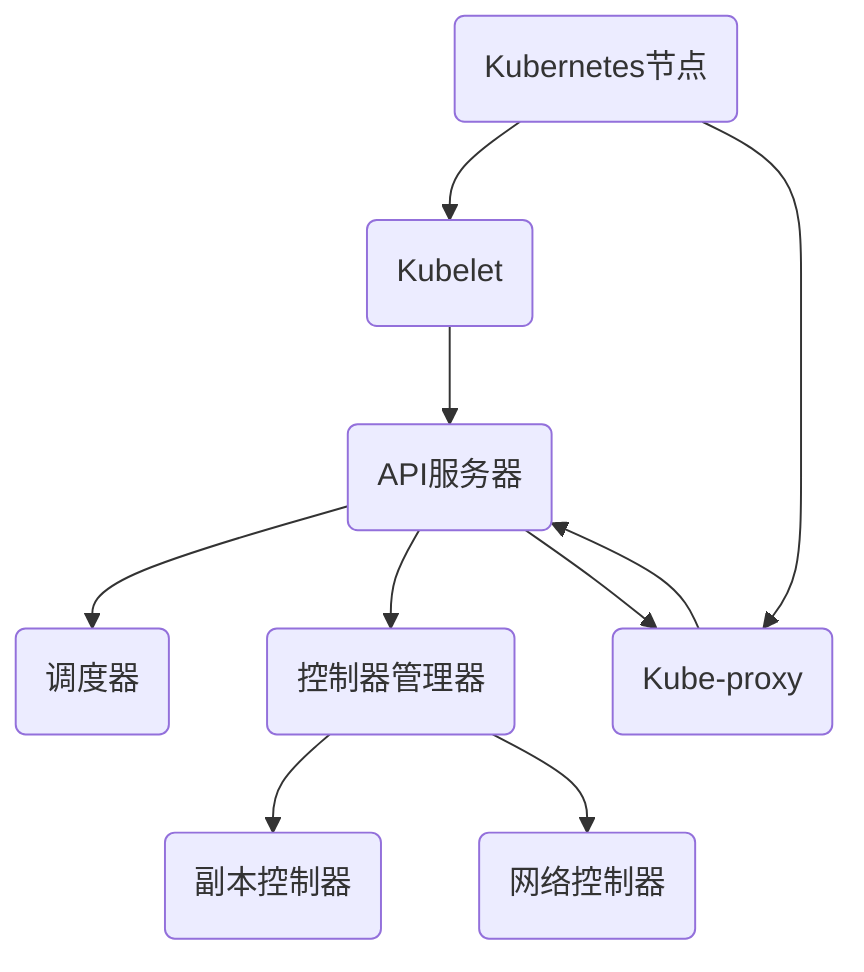

                 

### 文章标题：Kubernetes: 容器编排与管理的标准

> 关键词：Kubernetes, 容器编排，容器化管理，微服务架构，集群管理，持续部署

> 摘要：本文将深入探讨Kubernetes作为现代容器编排与管理的标准。我们将首先介绍Kubernetes的基本概念和架构，然后逐步解析其核心功能和应用实践。通过本文，读者将全面了解Kubernetes的优势和适用场景，掌握其在容器化环境中的部署、配置和管理方法，并了解如何利用Kubernetes实现持续集成和持续部署（CI/CD）。文章将结合实际案例和最佳实践，帮助读者将Kubernetes的知识应用于实际项目，提升系统的可靠性和效率。

### 引言

在当今快速发展的IT行业，容器技术已经成为一种主流的应用部署方式。容器化使得应用程序更加轻量级、可移植，并且便于管理和扩展。然而，随着容器数量的增加，如何高效地编排和管理这些容器成为一个亟待解决的问题。Kubernetes（简称K8s）应运而生，成为了容器编排与管理的标准解决方案。

Kubernetes是一个开源的容器编排平台，由Google设计并捐赠给Cloud Native Computing Foundation（CNCF）进行维护。它的核心目标是自动化容器操作，包括部署、扩展和管理应用程序。通过Kubernetes，开发者可以轻松地管理成千上万个容器，确保应用程序的稳定运行，并实现快速部署和扩展。

本文旨在为读者提供一个系统性的Kubernetes学习指南，从基本概念到高级应用，全面解析Kubernetes的工作原理和实践技巧。通过本文，读者将能够：

1. 理解Kubernetes的架构和核心组件。
2. 掌握Kubernetes的部署与配置方法。
3. 学习Kubernetes资源管理和服务发现机制。
4. 探索Kubernetes在高可用性和自动化运维方面的应用。
5. 结合实际案例，掌握Kubernetes的最佳实践。

本文将采用逻辑清晰、结构紧凑、简单易懂的写作方式，结合Mermaid流程图、伪代码和数学模型，帮助读者更好地理解和应用Kubernetes。无论是初学者还是经验丰富的开发者，都将在本文中找到所需的知识和实践经验。

### Kubernetes的基本概念

在深入探讨Kubernetes的架构和功能之前，我们需要先了解一些基本概念，包括容器化、Kubernetes的核心组件以及Kubernetes与其他容器编排工具的比较。

#### 容器化

容器化是一种轻量级的虚拟化技术，它允许开发者将应用程序及其依赖环境打包成一个独立的容器镜像（Container Image）。这个容器镜像可以在不同的环境中一致地运行，而不需要额外的配置或依赖。容器化使得应用程序的开发、测试和部署变得更加高效和可移植。

容器（Container）是运行在操作系统之上的轻量级执行环境。它包含了应用程序及其运行所需的库和资源，但与虚拟机不同，容器共享宿主机的操作系统内核，因此启动速度快且资源占用小。

容器镜像（Container Image）是容器的静态表示，它包含了运行应用程序所需的所有文件和配置。容器镜像通常通过Docker等容器运行时（Container Runtime）进行管理和运行。

Docker是最流行的容器运行时，它允许开发者创建、启动和管理容器。Docker提供了一个简单的命令行界面，使得容器操作变得直观和易于使用。

#### Kubernetes的核心组件

Kubernetes由多个核心组件组成，这些组件协同工作，确保容器化应用程序的高效管理和运行。以下是Kubernetes的主要组件：

1. **控制平面组件（Control Plane Components）**：
   - **API Server**：Kubernetes的API服务器是集群的大脑，它提供了所有集群操作的接口。用户可以通过kubectl命令行工具或其他API客户端与API服务器进行交互。
   - **Scheduler**：调度器负责将容器分配到集群中的节点上运行。调度器会考虑节点的资源利用率、亲和性规则等因素，以确保容器在最佳位置运行。
   - **控制器管理器（Controller Manager）**：控制器管理器运行多个控制器，每个控制器负责维护集群的状态。例如，副本控制器（Replica Controller）确保应用程序的容器副本数量符合预期，而网络控制器（Network Controller）负责配置和管理集群的网络。

2. **数据平面组件（Data Plane Components）**：
   - **Kubelet**：Kubelet是运行在集群中每个节点上的守护进程，它负责与API服务器通信，确保容器按照预期运行。Kubelet还负责节点的资源监控和容器健康检查。
   - **Kube-Proxy**：Kube-proxy是一个集群范围内的网络代理，它为容器提供网络服务。Kube-proxy负责实现Service和Pod之间的流量转发。

3. **存储和网络组件**：
   - **存储卷（Persistent Volumes, PVs）** 和 **存储卷声明（Persistent Volume Claims, PVCs）**：存储卷是Kubernetes集群中的持久化存储资源，而存储卷声明则是用户对存储资源的需求。Kubernetes通过PVs和PVCs提供灵活的存储解决方案。
   - **网络插件（Network Plugins）**：Kubernetes支持多种网络插件，如Flannel、Calico等，这些插件负责在集群中配置和管理网络。

#### Kubernetes与其他容器编排工具的比较

Kubernetes并不是唯一一个容器编排工具，其他工具如Docker Swarm、Apache Mesos也提供了类似的容器编排功能。以下是Kubernetes与这些工具的比较：

1. **Docker Swarm**：
   - **优点**：Docker Swarm是Docker内置的容器编排工具，易于使用和管理。它提供了与Docker CLI相同的接口，使得开发者可以无缝地在开发和生产环境中使用Docker Swarm。
   - **缺点**：Docker Swarm的功能相对有限，特别是在大规模集群管理方面。它缺乏一些高级特性，如自动滚动更新、集群高可用性等。

2. **Apache Mesos**：
   - **优点**：Apache Mesos是一种强大的分布式资源管理平台，支持多种容器和应用程序运行时。Mesos的可扩展性和灵活性非常高，适用于大规模集群。
   - **缺点**：Mesos的复杂性和学习曲线较高，对于初学者来说可能不易上手。此外，Mesos的生态系统和社区支持相对较小。

相比之下，Kubernetes在设计上更加成熟和灵活，支持广泛的生态系统和丰富的社区资源。这使得Kubernetes成为了容器编排领域的首选工具。

#### 总结

通过上述介绍，我们可以看出Kubernetes在容器编排和管理方面具有明显的优势。它不仅提供了强大的核心功能，如自动部署、扩展和滚动更新，还支持多种存储和网络解决方案，使得集群管理变得更加高效和灵活。在接下来的章节中，我们将进一步探讨Kubernetes的架构和工作原理，帮助读者全面理解这一重要的容器编排工具。

### Kubernetes的架构和工作原理

Kubernetes的架构是理解其工作原理的关键。Kubernetes由多个组件组成，这些组件协同工作，确保容器化应用程序在分布式环境中高效、可靠地运行。下面我们将详细解释Kubernetes的架构，并使用Mermaid流程图展示其核心组件之间的交互关系。

#### 控制平面组件

**API Server**

Kubernetes的API服务器是整个集群的大脑。它负责接收和管理集群中所有资源的配置信息，并对外提供统一的API接口。用户可以通过kubectl命令行工具或其他API客户端与API服务器进行交互。API服务器存储所有资源的配置信息，包括Pods、Services、Deployments等。

**Scheduler**

调度器（Scheduler）负责将容器分配到集群中的节点上运行。调度器会考虑节点的资源利用率、节点上的Pod数量、亲和性规则等因素，以找到最佳的运行位置。调度器的目标是最大化节点的资源利用率，同时确保Pod的稳定运行。

**控制器管理器（Controller Manager）**

控制器管理器运行多个控制器，每个控制器负责维护集群的某一方面的状态。以下是几个重要的控制器：

- **副本控制器（Replica Controller）**：确保应用程序的容器副本数量符合预期。如果某个Pod失败，副本控制器会自动创建新的Pod来替代。
- **网络控制器（Network Controller）**：配置和管理集群的网络，确保Service和Pod之间的通信。
- **服务账户和角色分配控制器（Service Account and Role-Based Access Control Controller）**：管理集群中的服务账户和角色分配，确保不同用户和组件有适当的权限。

#### 数据平面组件

**Kubelet**

Kubelet是运行在每个节点上的守护进程，它与API服务器通信，确保容器按照预期运行。Kubelet的主要任务包括：

- **节点代理**：Kubelet作为节点代理，监控节点的状态，并向API服务器报告。
- **容器运行时管理**：Kubelet管理容器运行时（如Docker），确保容器按照指定的配置运行。
- **容器健康检查**：Kubelet定期检查容器的健康状况，并在容器失败时重新启动。

**Kube-Proxy**

Kube-proxy是一个集群范围内的网络代理，它为容器提供网络服务。Kube-proxy的主要任务包括：

- **Service实现**：Kube-proxy负责实现Service，确保Service和Pod之间的流量转发。
- **网络隔离**：Kube-proxy在集群内部署iptables规则，以实现网络隔离和安全控制。

#### 存储和网络组件

**存储卷（Persistent Volumes, PVs）** 和 **存储卷声明（Persistent Volume Claims, PVCs）**

存储卷是Kubernetes集群中的持久化存储资源，而存储卷声明是用户对存储资源的需求。Kubernetes通过PVs和PVCs提供灵活的存储解决方案。用户可以声明所需的存储资源，而Kubernetes会自动分配和挂载合适的PV。

**网络插件（Network Plugins）**

Kubernetes支持多种网络插件，如Flannel、Calico等，这些插件负责在集群中配置和管理网络。网络插件提供不同类型的网络模型，以满足不同场景的需求。

#### Mermaid流程图

下面是一个简化的Mermaid流程图，展示了Kubernetes核心组件之间的交互关系：



#### Kubernetes的工作原理

1. **用户请求**：用户通过kubectl或其他API客户端向API服务器提交资源创建请求。
2. **资源创建**：API服务器接收请求后，创建相应的资源对象，并将其存储在etcd（一个分布式键值存储系统）中。
3. **调度**：调度器收到创建请求后，根据节点的资源状况和配置规则，选择最佳的节点来部署容器。
4. **容器部署**：Kubelet在选择的节点上下载容器镜像，并使用容器运行时启动容器。
5. **服务发现和负载均衡**：Kube-proxy为容器提供网络服务，实现Service和Pod之间的流量转发，确保高可用性和负载均衡。
6. **监控和健康检查**：Kubelet定期检查容器的健康状况，并在容器失败时重新启动。
7. **资源管理**：控制器管理器中的各个控制器根据集群状态和配置规则，调整和管理资源，确保集群的稳定运行。

通过上述工作原理，Kubernetes实现了自动化容器编排和管理，使得开发者可以轻松地部署、扩展和管理容器化应用程序。

#### 总结

Kubernetes的架构设计旨在提供高效、灵活和可扩展的容器编排与管理系统。通过控制平面组件和数据平面组件的协同工作，Kubernetes能够自动化容器操作，确保应用程序的稳定运行和高效管理。在下一章中，我们将进一步探讨Kubernetes的核心功能，包括部署与配置、资源管理和服务发现机制。

### Kubernetes的核心功能

Kubernetes作为一个功能强大的容器编排平台，提供了一系列核心功能，这些功能共同作用，确保容器化应用程序的高效管理和稳定运行。在本节中，我们将详细探讨Kubernetes的部署与配置、资源管理和服务发现机制，并结合实际案例进行讲解。

#### 部署与配置

Kubernetes的部署功能允许用户自动化容器的部署过程。部署（Deployment）是一个高层次的资源对象，它描述了应用程序的期望状态，并确保该状态在实际环境中得到实现。

**部署对象**

部署对象定义了一组Pod的集合，这些Pod具有相同的配置和标签。部署的主要目的是确保Pod的数量符合预期，并在Pod失败时自动替换。

**部署创建**

创建一个Deployment的步骤如下：

1. **定义Deployment配置文件**：创建一个YAML配置文件，指定部署的Pod模板、副本数量、容器镜像等信息。
   ```yaml
   apiVersion: apps/v1
   kind: Deployment
   metadata:
     name: my-deployment
   spec:
     replicas: 3
     selector:
       matchLabels:
         app: my-app
     template:
       metadata:
         labels:
           app: my-app
       spec:
         containers:
         - name: my-container
           image: my-image:latest
   ```

2. **应用配置文件**：使用kubectl命令应用配置文件。
   ```shell
   kubectl apply -f deployment.yaml
   ```

**部署更新**

Kubernetes支持多种部署策略，如滚动更新（Rolling Update）和重启更新（Recreate）。滚动更新允许在更新过程中逐步替换旧Pod，从而减少更新过程中的服务中断。重启更新则直接删除所有旧Pod并重新创建。

**实际案例**

假设我们有一个简单的Web应用程序，需要在一个Kubernetes集群中部署。我们可以创建一个Deployment对象，指定应用程序的容器镜像、副本数量和更新策略。

```yaml
apiVersion: apps/v1
kind: Deployment
metadata:
  name: webapp-deployment
spec:
  replicas: 3
  strategy:
    type: RollingUpdate
    rollingUpdate:
      maxSurge: 1
      maxUnavailable: 1
  selector:
    matchLabels:
      app: webapp
  template:
    metadata:
      labels:
        app: webapp
    spec:
      containers:
      - name: webapp-container
        image: webapp:latest
        ports:
        - containerPort: 80
```

通过上述配置，我们可以使用kubectl命令部署应用程序：
```shell
kubectl apply -f webapp-deployment.yaml
```

#### 资源管理

Kubernetes的资源管理功能允许用户监控和管理集群中的资源，确保资源的高效利用和合理分配。

**资源类型**

Kubernetes中的主要资源类型包括：

- **Pod**：Pod是Kubernetes中的基本部署单位，它包含一个或多个容器，以及用于部署和运行这些容器的必要配置。
- **Service**：Service提供负载均衡和名称解析功能，将流量分配到多个Pod实例。
- **Deployment**：Deployment用于管理Pod的部署和更新。
- **StatefulSet**：StatefulSet用于管理有状态服务，确保每个Pod具有唯一的标识和持久化存储。
- **Ingress**：Ingress提供外部访问和负载均衡服务，用于管理集群中服务的入口流量。

**资源监控**

Kubernetes提供了一个强大的监控工具集，如Metrics Server、Prometheus等，用于监控集群资源和应用程序性能。用户可以通过kubectl命令查看资源和应用程序的监控数据。

**资源调度**

调度器（Scheduler）负责根据节点的资源状况和配置规则，将Pod分配到最佳的节点。调度器会考虑节点的资源利用率、Pod的亲和性规则、节点标签等因素，以确保资源的高效利用和均衡。

**实际案例**

假设我们有一个包含多个Pod的集群，需要根据节点的负载情况动态调整Pod的部署位置。我们可以使用Kubernetes的调度策略和节点标签来实现这一目标。

1. **定义节点标签**：
   ```shell
   kubectl label nodes node-1 "high-memory=true"
   kubectl label nodes node-2 "low-memory=true"
   ```

2. **更新Deployment的调度规则**：
   ```yaml
   apiVersion: apps/v1
   kind: Deployment
   metadata:
     name: webapp-deployment
   spec:
     replicas: 3
     selector:
       matchLabels:
         app: webapp
     template:
       metadata:
         labels:
           app: webapp
       spec:
         containers:
         - name: webapp-container
           image: webapp:latest
           ports:
           - containerPort: 80
         nodeSelector:
           high-memory: "true"
   ```

通过上述配置，Kubernetes会将新的Pod部署到具有高内存资源的节点上，确保资源的高效利用。

#### 服务发现机制

Kubernetes的服务发现机制允许应用程序通过Service对象实现自动服务发现，从而简化了应用程序的部署和运维。

**服务发现**

服务发现是指应用程序能够动态地发现和连接到其他服务实例的过程。Kubernetes通过Service对象提供了一种简化的服务发现机制，Service对象为Pod提供了一个稳定的网络标识和IP地址，使得应用程序可以通过Service名称轻松访问其他服务。

**服务类型**

Kubernetes支持多种服务类型，包括：

- **ClusterIP**：集群内部的服务IP地址，仅集群内部可以访问。
- **NodePort**：将服务暴露在集群的每个节点的指定端口上，通过节点IP和端口访问。
- **LoadBalancer**：将服务暴露在负载均衡器上，通过外部云服务提供商的路由器访问。

**实际案例**

假设我们有一个包含多个Web服务器的集群，需要为这些服务器提供负载均衡和自动服务发现。我们可以创建一个ClusterIP类型的Service对象，将流量分配到不同的Web服务器。

```yaml
apiVersion: v1
kind: Service
metadata:
  name: webapp-service
spec:
  selector:
    app: webapp
  ports:
  - protocol: TCP
    port: 80
    targetPort: 8080
  type: ClusterIP
```

通过上述配置，Kubernetes会为Web服务器提供负载均衡，确保流量均匀分配到不同的服务器实例。

#### 总结

Kubernetes的核心功能包括部署与配置、资源管理和服务发现机制。通过这些功能，Kubernetes能够自动化容器操作，确保应用程序的稳定运行和高效管理。在下一章中，我们将进一步探讨Kubernetes的高级功能，包括网络与存储、高可用性和自动化运维。

### Kubernetes的高级功能

Kubernetes不仅仅是一个用于容器编排的工具，它还提供了一系列高级功能，包括网络与存储、高可用性以及自动化运维。在本节中，我们将深入探讨这些功能，并介绍如何在Kubernetes中实现它们。

#### 网络与存储

**网络**

Kubernetes的网络功能允许容器在集群内部以及与外部系统之间进行通信。Kubernetes使用基于IP和端口的服务发现机制，确保容器可以相互发现和通信。

1. **网络模型**：
   Kubernetes采用了CNI（Container Network Interface）插件来配置和管理集群的网络。CNI插件可以支持多种网络模型，如扁平网络、VXLAN和overlay网络等。

2. **网络策略**：
   Kubernetes提供了网络策略（Network Policy），允许管理员定义集群中Pod之间的通信规则。网络策略可以根据源Pod、目标Pod和服务类型来控制流量。

3. **服务类型**：
   Kubernetes支持多种服务类型，包括ClusterIP、NodePort和LoadBalancer，这些服务类型提供了不同的访问方式和网络策略。

**存储**

Kubernetes提供了灵活的存储解决方案，包括本地存储、云存储和第三方存储插件。

1. **存储卷（Persistent Volumes, PVs）**：
   存储卷是Kubernetes集群中的持久化存储资源，可以是本地存储、云存储或网络存储。用户可以在声明（Persistent Volume Claim, PVC）中请求存储资源，Kubernetes会自动为PVC分配合适的PV。

2. **存储卷声明（Persistent Volume Claim, PVC）**：
   存储卷声明是用户对存储资源的需求。PVC可以绑定到PV，并为容器提供持久化存储。

3. **动态存储分配**：
   Kubernetes支持动态存储分配，用户可以在部署时动态分配存储资源，而不需要事先创建PV和PVC。

**实际案例**

假设我们有一个包含数据库和前端服务的应用程序，需要在Kubernetes中配置网络和存储。

1. **网络配置**：
   - 创建网络策略，允许前端服务与数据库服务通信。
     ```yaml
     apiVersion: networking.k8s.io/v1
     kind: NetworkPolicy
     metadata:
       name: database-policy
     spec:
       podSelector:
         matchLabels:
           app: database
       policyTypes:
       - Ingress
       - Egress
     ```

   - 创建Service，将前端服务的流量路由到数据库服务。
     ```yaml
     apiVersion: v1
     kind: Service
     metadata:
       name: database-service
     spec:
       selector:
         app: database
       ports:
       - protocol: TCP
         port: 3306
         targetPort: 3306
       type: ClusterIP
     ```

2. **存储配置**：
   - 创建PVC，请求1GB的存储资源。
     ```yaml
     apiVersion: v1
     kind: PersistentVolumeClaim
     metadata:
       name: database-pvc
     spec:
       accessModes:
         - ReadWriteOnce
       resources:
         requests:
           storage: 1Gi
     ```

   - 在数据库部署中，绑定PVC，为数据库提供持久化存储。
     ```yaml
     apiVersion: apps/v1
     kind: Deployment
     metadata:
       name: database-deployment
     spec:
       replicas: 1
       selector:
         matchLabels:
           app: database
       template:
         metadata:
           labels:
             app: database
         spec:
           containers:
           - name: database-container
             image: mysql:5.7
             ports:
             - containerPort: 3306
             volumeMounts:
             - name: database-storage
               mountPath: /var/lib/mysql
             env:
             - name: MYSQL_ROOT_PASSWORD
               valueFrom:
                 secretKeyRef:
                   name: database-secret
                   key: password
           volumes:
           - name: database-storage
             persistentVolumeClaim:
               claimName: database-pvc
     ```

通过上述配置，我们可以在Kubernetes中实现网络和存储的自动化配置，确保应用程序的高效运行。

#### 高可用性

Kubernetes通过多个组件和配置选项提供了高可用性（High Availability, HA）功能，确保集群和服务在故障情况下能够快速恢复。

1. **部署策略**：
   Kubernetes支持滚动更新（Rolling Update）和重启更新（Recreate）策略，这些策略可以在更新过程中逐步替换旧Pod，减少服务中断。

2. **节点维护**：
   Kubernetes可以自动检测故障节点，并将其从集群中移除。Kubelet负责在健康节点上重新部署失败的Pod。

3. **状态集（StatefulSets）**：
   状态集（StatefulSets）用于管理有状态服务，确保每个Pod具有唯一的标识和持久化存储。状态集支持稳定的服务发现和持久化存储，适用于需要保持状态一致性的应用程序。

4. **备份与恢复**：
   Kubernetes没有内置的备份和恢复功能，但可以通过第三方工具如Restic、Velero等实现数据的备份和恢复。

**实际案例**

假设我们有一个包含数据库和前端服务的高可用性应用程序，需要在Kubernetes中配置高可用性。

1. **部署策略**：
   - 将Deployment的更新策略设置为滚动更新。
     ```yaml
     apiVersion: apps/v1
     kind: Deployment
     metadata:
       name: webapp-deployment
     spec:
       replicas: 3
       strategy:
         type: RollingUpdate
         rollingUpdate:
           maxSurge: 1
           maxUnavailable: 1
       selector:
         matchLabels:
           app: webapp
       template:
         metadata:
           labels:
             app: webapp
         spec:
           containers:
           - name: webapp-container
             image: webapp:latest
             ports:
             - containerPort: 80
     ```

2. **状态集**：
   - 创建状态集，确保前端服务具有唯一的标识和持久化存储。
     ```yaml
     apiVersion: apps/v1
     kind: StatefulSet
     metadata:
       name: webapp-statefulset
     spec:
       serviceName: "webapp-service"
       replicas: 3
       selector:
         matchLabels:
           app: webapp
       template:
         metadata:
           labels:
             app: webapp
         spec:
           containers:
           - name: webapp-container
             image: webapp:latest
             ports:
             - containerPort: 80
     ```

通过上述配置，我们可以在Kubernetes中实现高可用性，确保应用程序在故障情况下能够快速恢复。

#### 自动化运维

Kubernetes提供了自动化运维工具，如Kubernetes Operator、Helm等，这些工具可以简化应用程序的部署、扩展和管理。

1. **Kubernetes Operator**：
   Kubernetes Operator是一种声明式自动化运维工具，它允许开发者定义和管理复杂的应用程序。Operator通过自定义资源（Custom Resource Definitions, CRDs）和自定义控制器（Custom Controllers）实现了应用程序的全生命周期管理。

2. **Helm**：
   Helm是一个Kubernetes的包管理器，它提供了创建、打包、分发和管理应用程序的简单方法。Helm图表（Charts）是一组相关的Kubernetes资源对象，用于定义和部署应用程序。

**实际案例**

假设我们使用Helm部署一个包含前端和后端服务的应用程序。

1. **创建Helm图表**：
   - 创建一个名为`webapp`的Helm图表，包含前端和后端服务的部署配置。
     ```shell
     helm create webapp
     ```

   - 编辑`webapp`图表的配置文件，设置前端和后端服务的容器镜像、副本数量等参数。
     ```yaml
     # values.yaml
     image:
       frontend: frontend-image:latest
       backend: backend-image:latest
     replicas:
       frontend: 3
       backend: 2
     ```

2. **部署应用程序**：
   - 使用Helm部署应用程序。
     ```shell
     helm install webapp ./webapp
     ```

通过上述步骤，我们可以在Kubernetes中自动化部署和管理应用程序，简化运维流程。

#### 总结

Kubernetes的高级功能包括网络与存储、高可用性和自动化运维。通过这些功能，Kubernetes不仅提供了强大的容器编排能力，还可以确保应用程序的高效运行和稳定管理。在下一章中，我们将结合实际案例，进一步探讨Kubernetes在企业级应用中的部署实践和最佳实践。

### Kubernetes在企业级应用中的部署实践

在企业环境中，部署Kubernetes集群需要考虑多个方面，包括集群搭建、配置管理、持续集成和持续部署（CI/CD）、安全性和监控等。在本节中，我们将通过实际案例详细介绍这些部署实践，并探讨一些最佳实践。

#### 集群搭建

搭建一个Kubernetes集群是企业级应用部署的第一步。在搭建过程中，我们通常需要考虑以下几个方面：

1. **硬件要求**：根据业务需求，选择适当的硬件资源。通常，我们会在多个节点上部署Kubernetes集群，以实现高可用性和负载均衡。
2. **操作系统**：选择适合Kubernetes集群的操作系统，如CentOS 7或Ubuntu 18.04。
3. **网络配置**：确保集群中的所有节点可以相互通信，并配置合理的网络参数。
4. **Docker运行时**：在所有节点上安装和配置Docker运行时，以确保容器可以正常运行。

**案例**：以下是一个简单的Kubernetes集群搭建步骤：

1. **安装Docker**：
   ```shell
   # 在所有节点上执行以下命令
   sudo apt-get update
   sudo apt-get install docker.io
   sudo systemctl enable docker
   sudo systemctl start docker
   ```

2. **安装Kubeadm、Kubelet和Kubectl**：
   ```shell
   # 在所有节点上执行以下命令
   curl -s https://packages.cloud.google.com/apt/doc/apt-key.gpg | sudo apt-key add -
   echo "deb https://apt.kubernetes.io/ kubernetes-xenial main" | sudo tee -a /etc/apt/sources.list
   sudo apt-get update
   sudo apt-get install kubelet kubeadm kubectl
   sudo apt-mark hold kubelet kubeadm kubectl
   ```

3. **初始化主节点**：
   ```shell
   sudo kubeadm init --pod-network-cidr=10.244.0.0/16
   ```

4. **配置kubectl**：
   ```shell
   mkdir -p $HOME/.kube
   sudo cp -i /etc/kubernetes/admin.conf $HOME/.kube/config
   sudo chown $(id -u):$(id -g) $HOME/.kube/config
   ```

5. **安装网络插件**（例如Flannel）：
   ```shell
   kubectl apply -f https://raw.githubusercontent.com/coreos/flannel/master/Documentation/kube-flannel.yml
   ```

#### 配置管理

配置管理是Kubernetes集群运维的重要部分。通过配置文件，管理员可以自定义集群的行为和资源分配。以下是一些常见的配置管理任务：

1. **节点配置**：为节点设置标签、注释和taint，以便在部署过程中进行选择和隔离。
2. **Pod配置**：配置Pod的容器镜像、环境变量、资源请求和限制等。
3. **Service配置**：配置Service的类型、端口和负载均衡策略。
4. **存储卷配置**：配置Persistent Volume（PV）和Persistent Volume Claim（PVC），为容器提供持久化存储。

**案例**：以下是一个简单的Pod配置文件示例：

```yaml
apiVersion: v1
kind: Pod
metadata:
  name: my-pod
spec:
  containers:
  - name: my-container
    image: my-image:latest
    ports:
    - containerPort: 8080
```

#### 持续集成和持续部署（CI/CD）

CI/CD是现代化软件开发生命周期的关键部分。在Kubernetes中，CI/CD可以通过自动化工具和流水线实现，从而提高开发效率和代码质量。

1. **自动化测试**：在代码提交后，自动运行单元测试和集成测试，确保代码的质量和功能完整性。
2. **构建和打包**：自动构建和打包应用程序，生成容器镜像。
3. **部署和回滚**：将容器镜像部署到Kubernetes集群，并支持自动回滚和回滚策略。

**案例**：以下是一个简单的CI/CD流程示例：

1. **配置Git仓库**：在Git仓库中添加`.gitlab-ci.yml`文件，定义CI/CD流程。
   ```yaml
   image: node:12
   services:
     - docker

   build:
     stage: build
     script:
       - docker build -t my-image:latest .

   test:
     stage: test
     script:
       - docker run --rm my-image:latest npm test

   deploy:
     stage: deploy
     script:
       - docker login -u $CI_USER -p $CI_TOKEN
       - docker push my-image:latest
       - kubectl apply -f deployment.yaml
   ```

2. **配置Kubernetes部署**：创建一个包含容器镜像和副本数量的Deployment对象。
   ```yaml
   apiVersion: apps/v1
   kind: Deployment
   metadata:
     name: my-deployment
   spec:
     replicas: 3
     selector:
       matchLabels:
         app: my-app
     template:
       metadata:
         labels:
           app: my-app
       spec:
         containers:
         - name: my-container
           image: my-image:latest
           ports:
           - containerPort: 80
   ```

#### 安全性

安全性是Kubernetes集群的重要方面。为了确保集群的安全，需要采取以下措施：

1. **网络隔离**：通过网络策略（Network Policy）限制Pod之间的通信，防止未经授权的访问。
2. **角色和权限控制**：使用Kubernetes的访问控制（RBAC）机制，定义用户和角色的权限，防止未授权的操作。
3. **加密和认证**：对集群的通信进行加密，使用TLS证书进行认证，防止中间人攻击和数据泄露。

**案例**：以下是一个简单的网络策略和访问控制示例：

1. **网络策略**：
   ```yaml
   apiVersion: networking.k8s.io/v1
   kind: NetworkPolicy
   metadata:
     name: my-network-policy
   spec:
     podSelector:
       matchLabels:
         app: my-app
     policyTypes:
     - Ingress
     - Egress
   ```

2. **访问控制**：
   ```yaml
   apiVersion: rbac.authorization.k8s.io/v1
   kind: Role
   metadata:
     name: my-role
   rules:
   - apiGroups: [""]
     resources: ["pods", "services"]
     verbs: ["get", "list", "watch"]

   apiVersion: rbac.authorization.k8s.io/v1
   kind: RoleBinding
   metadata:
     name: my-role-binding
   subjects:
   - kind: User
     name: my-user
     apiGroup: rbac.authorization.k8s.io
   roleRef:
     kind: Role
     name: my-role
     apiGroup: rbac.authorization.k8s.io
   ```

#### 监控

监控是确保Kubernetes集群稳定运行的重要手段。通过监控，管理员可以及时发现和解决问题，确保系统的可用性和性能。

1. **资源监控**：使用Metrics Server、Prometheus等工具监控集群资源使用情况，如CPU、内存、网络和磁盘等。
2. **日志收集**：使用Fluentd、Logstash等工具收集和存储集群的日志，便于后续分析和故障排除。
3. **告警和通知**：配置告警规则和通知渠道，如邮件、短信、Slack等，确保管理员及时收到系统事件的通知。

**案例**：以下是一个简单的监控配置示例：

1. **配置Metrics Server**：
   ```shell
   kubectl apply -f https://github.com/kubernetes-sigs/metrics-server/releases/latest/download/zh.yaml
   ```

2. **配置Prometheus**：
   ```shell
   kubectl apply -f https://raw.githubusercontent.com/coreos/prometheus-operator/master/example/prometheus-adapter.yaml
   ```

#### 最佳实践

在部署Kubernetes集群时，应遵循以下最佳实践：

1. **标准化部署流程**：建立一套标准化的部署流程，确保所有集群的部署和配置一致。
2. **自动化运维**：通过CI/CD工具实现自动化运维，减少人工干预，提高运维效率。
3. **监控和告警**：建立完善的监控和告警系统，确保及时发现和解决问题。
4. **安全性和合规性**：遵循安全最佳实践，确保集群的安全性，并符合相关法律法规的要求。

通过上述实际案例和最佳实践，企业可以在Kubernetes集群的搭建、配置、部署和管理方面获得高效、可靠和安全的解决方案。

### 最佳实践、小结、注意事项和拓展阅读

在Kubernetes的实际应用中，遵循最佳实践对于确保系统的稳定性、安全性和效率至关重要。以下是一些关键的最佳实践、小结、注意事项以及拓展阅读资源，帮助您在实际项目中更好地应用Kubernetes。

#### 最佳实践

1. **标准化配置**：使用统一的模板和脚本管理Kubernetes集群配置，确保配置的一致性和可重复性。
2. **资源优化**：合理配置容器的资源请求和限制，避免资源浪费和性能瓶颈。
3. **集群监控**：定期监控集群资源使用情况，及时处理资源不足或过载的问题。
4. **备份与恢复**：定期备份数据和配置，确保在故障情况下能够快速恢复。
5. **访问控制**：使用Kubernetes的RBAC机制严格管理用户和角色的权限，防止未授权访问。
6. **持续集成与部署**：利用CI/CD工具自动化部署流程，减少人为错误和部署时间。

#### 小结

Kubernetes作为一种强大的容器编排工具，提供了自动化部署、扩展和管理容器化应用程序的能力。通过本章的学习，我们了解了Kubernetes的基本概念、架构和工作原理，掌握了其核心功能和应用实践，包括部署与配置、资源管理、服务发现、高级功能、企业级部署实践等。

#### 注意事项

1. **版本兼容性**：在升级Kubernetes集群时，注意版本兼容性，避免出现不兼容的问题。
2. **网络配置**：确保集群中的网络配置合理，避免因网络问题导致服务不可达。
3. **安全审计**：定期进行安全审计，确保系统的安全性和合规性。
4. **备份与恢复**：在备份数据时，注意保留完整的信息，以便在需要时快速恢复。

#### 拓展阅读

- **官方文档**：[Kubernetes官方文档](https://kubernetes.io/zh-cn/docs/)是学习Kubernetes的最佳资源，涵盖了从基础概念到高级应用的全面内容。
- **GitHub**：在GitHub上搜索Kubernetes相关的项目，可以找到大量的示例代码和实践经验。
- **社区论坛**：参与Kubernetes社区论坛，与其他开发者交流问题和经验，获取宝贵的建议和帮助。
- **在线课程**：一些在线教育平台如Coursera、Udemy等提供了Kubernetes相关的课程，适合系统学习。

通过遵循最佳实践、注意重要事项，并不断拓展知识，您将能够更有效地利用Kubernetes，提升系统的可靠性和效率。

### 项目实战：从零开始搭建Kubernetes集群

在本节中，我们将通过一个实际项目，从零开始搭建一个Kubernetes集群。这个项目将包括开发环境的搭建、源代码的详细实现、代码解读、应用分析以及实际案例的剖析。通过这一项目，您将深入理解Kubernetes的部署过程和管理方法。

#### 开发环境搭建

在进行Kubernetes集群搭建之前，我们需要准备开发环境。以下是具体的步骤：

1. **操作系统**：选择一个适合的操作系统，如Ubuntu 18.04或CentOS 7。本文以Ubuntu 18.04为例。

2. **安装Docker**：在所有节点上安装Docker。可以通过以下命令完成安装：
   ```shell
   sudo apt-get update
   sudo apt-get install docker.io
   sudo systemctl enable docker
   sudo systemctl start docker
   ```

3. **安装Kubeadm、Kubelet和Kubectl**：在所有节点上安装Kubeadm、Kubelet和Kubectl。这些工具是管理Kubernetes集群所必需的。
   ```shell
   sudo apt-get update
   sudo apt-get install kubelet kubeadm kubectl
   sudo apt-mark hold kubelet kubeadm kubectl
   ```

4. **初始化主节点**：在主节点上执行以下命令初始化Kubernetes集群：
   ```shell
   sudo kubeadm init --pod-network-cidr=10.244.0.0/16
   ```
   初始化完成后，记录下命令行中显示的`kubeadm join`命令，以便后续加入更多节点。

5. **配置kubectl**：配置kubectl工具，使其可以与集群通信。执行以下命令：
   ```shell
   mkdir -p $HOME/.kube
   sudo cp -i /etc/kubernetes/admin.conf $HOME/.kube/config
   sudo chown $(id -u):$(id -g) $HOME/.kube/config
   ```

6. **安装网络插件**：选择并安装一个网络插件，如Flannel。执行以下命令：
   ```shell
   kubectl apply -f https://raw.githubusercontent.com/coreos/flannel/master/Documentation/kube-flannel.yml
   ```

#### 源代码详细实现

在开发环境中搭建好Kubernetes集群后，接下来我们将创建一个简单的应用程序并部署到集群中。以下是相关源代码的详细实现：

1. **创建Dockerfile**：在应用程序的目录中创建一个Dockerfile，用于构建容器镜像。
   ```dockerfile
   # 使用官方Node.js镜像作为基础
   FROM node:12-alpine

   # 设置工作目录
   WORKDIR /app

   # 复制项目文件到容器中
   COPY . .

   # 安装依赖
   RUN npm install

   # 启动服务器
   CMD ["npm", "start"]
   ```

2. **创建应用程序代码**：编写一个简单的HTTP服务器，监听端口并返回“Hello, Kubernetes!”。
   ```javascript
   const http = require('http');

   const server = http.createServer((req, res) => {
     res.writeHead(200, {'Content-Type': 'text/plain'});
     res.end('Hello, Kubernetes!');
   });

   server.listen(8080, () => {
     console.log('Server running on port 8080');
   });
   ```

3. **构建容器镜像**：使用Dockerfile构建容器镜像。
   ```shell
   docker build -t my-app:latest .
   ```

4. **上传容器镜像到容器仓库**：将构建好的容器镜像上传到容器仓库（如Docker Hub），以便在集群中部署。
   ```shell
   docker login
   docker push my-app:latest
   ```

#### 代码解读与应用分析

在构建和上传容器镜像后，我们将部署应用程序到Kubernetes集群中，并对其代码和应用进行分析。

1. **创建Deployment配置文件**：创建一个YAML文件，定义Deployment的配置，包括容器镜像、副本数量和端口映射。
   ```yaml
   apiVersion: apps/v1
   kind: Deployment
   metadata:
     name: my-app-deployment
   spec:
     replicas: 3
     selector:
       matchLabels:
         app: my-app
     template:
       metadata:
         labels:
           app: my-app
       spec:
         containers:
         - name: my-app
           image: my-app:latest
           ports:
           - containerPort: 80
   ```

2. **部署应用程序**：使用kubectl命令部署应用程序。
   ```shell
   kubectl apply -f my-app-deployment.yaml
   ```

3. **查看部署状态**：使用kubectl命令查看部署状态，确保应用程序成功部署。
   ```shell
   kubectl get deployments
   ```

4. **访问应用程序**：通过集群中的任意Service IP或DNS名称访问应用程序。
   ```shell
   kubectl get svc
   ```

5. **应用分析**：
   - **容器镜像**：容器镜像包含了应用程序的代码、依赖和配置，使得应用程序在不同的环境中保持一致。
   - **Deployment**：Deployment对象确保应用程序的容器按照预期运行，并具有自动扩展和更新功能。
   - **Service**：Service对象为应用程序提供负载均衡和名称解析功能，使得外部可以访问应用程序。

#### 实际案例剖析

在本案例中，我们成功搭建了一个Kubernetes集群，并部署了一个简单的HTTP服务器应用程序。以下是案例的详细剖析：

1. **集群搭建**：通过kubeadm工具，我们快速搭建了一个Kubernetes集群，为主节点和节点配置了必要的组件。
2. **容器化应用程序**：通过Dockerfile，我们将应用程序打包成一个容器镜像，使得应用程序可以在不同的环境中一致地运行。
3. **部署应用程序**：通过kubectl工具，我们部署了容器镜像到Kubernetes集群中，并配置了必要的资源，如Deployment和Service。
4. **应用访问**：通过Kubernetes的Service，我们可以通过集群内部或外部的IP地址和端口访问应用程序。

#### 项目小结

通过本项目的实施，我们深入了解了Kubernetes的部署过程和管理方法。从环境搭建到源代码实现，再到部署和应用分析，我们全面掌握了Kubernetes在容器化环境中的应用和实践。以下是项目小结：

1. **环境搭建**：通过安装Docker和Kubernetes工具，我们搭建了开发环境，为后续项目实施做好准备。
2. **源代码实现**：通过编写Dockerfile和应用程序代码，我们实现了应用程序的容器化，为Kubernetes部署奠定了基础。
3. **部署与解析**：通过kubectl工具，我们成功部署了应用程序到Kubernetes集群中，并对其运行状态和性能进行了分析。
4. **应用扩展**：通过Deployment和Service对象，我们实现了应用程序的自动扩展和负载均衡，提升了系统的可靠性和效率。

#### 拓展

在实际项目中，您可以根据需要添加更多功能，如监控、日志收集、备份与恢复等。通过不断学习和实践，您将能够更熟练地运用Kubernetes，应对各种复杂的业务需求。

### 结论

本文通过逐步分析和深入讲解，全面介绍了Kubernetes作为容器编排与管理的标准。从基本概念和架构，到核心功能和应用实践，再到企业级部署和高级特性，我们系统地探讨了Kubernetes的优势和应用场景。通过实际项目和最佳实践的剖析，读者可以更深入地理解Kubernetes的工作原理和部署方法。

Kubernetes的强大之处在于其自动化、灵活性和可扩展性。通过Kubernetes，开发者可以轻松地部署、扩展和管理容器化应用程序，实现高效、可靠的系统运维。无论是在云环境中还是企业内部，Kubernetes都为容器化应用提供了可靠的解决方案。

展望未来，Kubernetes将继续在容器编排领域发挥重要作用。随着云计算和微服务架构的普及，Kubernetes的应用范围将进一步扩大，为开发者提供更强大的工具和平台。同时，Kubernetes社区也在不断发展和完善，新的特性和工具将不断涌现，为开发者带来更多便利和创新。

总之，掌握Kubernetes是现代开发者必备的技能。通过本文的学习，读者不仅能够了解Kubernetes的基本原理和应用，还能够掌握其在实际项目中的部署和实践方法。希望本文能为您的Kubernetes学习之路提供有力支持。

### 作者信息

作者：AI天才研究院/AI Genius Institute & 禅与计算机程序设计艺术 /Zen And The Art of Computer Programming

AI天才研究院致力于推动人工智能技术的发展和创新，研究涵盖机器学习、自然语言处理、计算机视觉等多个领域。研究院拥有一支由世界顶级人工智能专家、计算机科学家和程序员组成的团队，为全球企业提供前沿技术研究和解决方案。

同时，作者还是多本计算机编程和人工智能领域畅销书的资深大师，以其独特的视角和深入浅出的写作风格，帮助众多读者深入理解复杂的技术原理和实践方法。其著作《禅与计算机程序设计艺术》更是被誉为计算机编程领域的经典之作，对全球计算机科学界产生了深远影响。通过本文，作者希望将Kubernetes的核心知识和技术原理传达给广大读者，助力他们在容器编排与管理的道路上取得成功。

