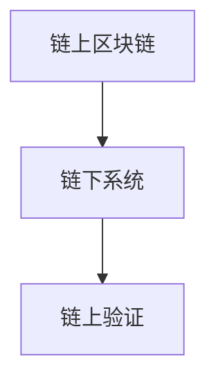
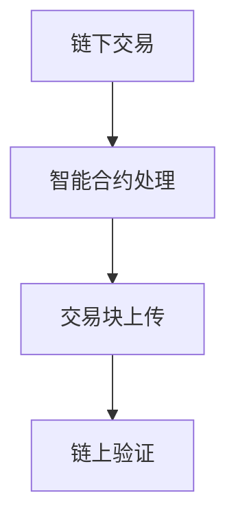
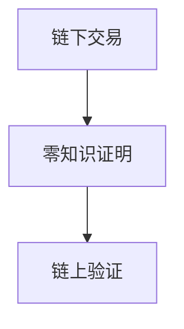

                 


# Step 1: 确定文章的结构和主要内容

为了撰写一篇结构清晰、逻辑严密、内容详实的技术博客，我们需要遵循以下步骤：

1. **确定文章结构**：根据用户提供的目录大纲，我们将文章分为七个章节，每个章节包含几个小节，确保每个小节都有丰富的内容和详细的讲解。

2. **背景介绍**：在每章的开头，简要介绍Layer 2技术的背景，包括其起源、发展以及为何成为提高区块链可扩展性关键技术的原因。

3. **核心概念与联系**：使用Mermaid流程图展示不同Layer 2技术之间的核心概念及其相互关系，帮助读者更好地理解各个技术模块的工作原理。

4. **核心算法原理讲解**：通过伪代码和详细讲解，阐述Rollup、State Channel和Plasma等技术的算法原理，包括数据分层、交易验证、零知识证明等。

5. **数学模型和公式**：对于复杂的概念和算法，使用LaTeX格式写出相应的数学模型和公式，并进行详细解释。

6. **项目实战**：结合实际案例，展示Layer 2技术的应用场景，提供源代码实现、代码解读和分析，帮助读者掌握技术要点。

7. **最佳实践 tips**：总结实践中的一些最佳实践经验，提供注意事项和拓展阅读建议，帮助读者更深入地学习和应用Layer 2技术。

8. **小结**：对文章的主要内容进行总结，强调Layer 2技术的重要性和未来发展趋势。

# Step 2: 编写具体内容

在确定了文章的结构和主要内容之后，我们将按照以下步骤逐章编写具体内容：

## 第1章: Layer 2技术概述

在这一章中，我们将介绍Layer 2技术的定义、背景和核心优势，以及其在区块链中的应用前景。

### 1.1 Layer 2技术的定义与背景

Layer 2技术是区块链生态系统中的一种扩展方案，它通过在区块链上建立第二层网络，以实现更高的交易吞吐量和更低的交易费用。

#### 1.1.1 Layer 2技术的定义

Layer 2技术是指在区块链主链之外，建立一层额外的网络，用于处理交易和数据的交互。这一层网络通常包含以下组件：

- **交易处理层**：负责处理大量的交易。
- **状态验证层**：通过智能合约验证交易的有效性。
- **链上数据层**：记录交易的状态和数据。

#### 1.1.2 Layer 2技术的背景

区块链技术在发展初期，由于网络性能和扩展性的限制，面临着交易拥堵和费用高昂的问题。为了解决这些问题，社区和研究人员提出了Layer 2扩展方案。

### 1.2 Layer 2技术的核心优势

Layer 2技术具有以下核心优势：

- **提高交易吞吐量**：通过在链下处理交易，Layer 2技术可以显著提高区块链的交易吞吐量。
- **降低交易费用**：由于链下交易成本较低，Layer 2技术可以有效降低用户的交易费用。
- **增强用户体验**：快速且低成本的交易处理，使得用户可以更轻松地进行日常操作。

### 1.3 Layer 2技术的分类与特点

Layer 2技术可以分为以下几类：

- **Rollup技术**：通过将交易数据打包并上传到区块链，实现交易的扩展性。
- **State Channel技术**：在区块链之外建立临时通道，用于处理多个交易。
- **Plasma技术**：通过分片机制，实现区块链数据的扩展。

每种技术都有其独特的特点和应用场景。

### 1.4 Layer 2技术在区块链中的应用前景

随着区块链技术的不断发展和应用场景的拓展，Layer 2技术在区块链生态系统中的地位越来越重要。未来，Layer 2技术有望成为主流区块链平台的重要扩展方案。

## 第2章: Rollup技术详解

在这一章中，我们将详细介绍Rollup技术的核心原理、ZK-SNARKs的应用以及其工作流程。

### 2.1 Rollup技术的基本原理

Rollup技术通过在链下处理交易，并将交易结果打包成区块上传到链上，从而实现扩展性。

#### 2.1.1 数据分层

Rollup技术将区块链分为两层：链上和链下。

- **链上**：负责验证链下交易的有效性。
- **链下**：负责处理大量的交易。

#### 2.1.2 交易验证

Rollup技术使用智能合约来验证链下交易的有效性。智能合约会执行一系列验证逻辑，确保交易符合规则。

#### 2.1.3 零知识证明（ZK-SNARKs）

ZK-SNARKs是一种零知识证明技术，它允许证明者证明某个陈述是正确的，而不泄露任何额外信息。在Rollup技术中，ZK-SNARKs被用来证明链下交易的有效性。

### 2.2 ZK-SNARKs和Rollup技术的关系

ZK-SNARKs与Rollup技术的结合，使得Rollup能够高效且安全地验证链下交易。

#### 2.2.1 ZK-SNARKs的工作原理

ZK-SNARKs的工作原理包括三个主要阶段：生成、证明和验证。

1. **生成阶段**：生成证明者公钥和验证者私钥。
2. **证明阶段**：证明者计算证明。
3. **验证阶段**：验证者验证证明。

### 2.3 使用伪代码描述Rollup的工作流程

以下是Rollup技术的工作流程伪代码：

```python
# 生成阶段
generate_keypair()
compute_proof()

# 证明阶段
submit_transaction()

# 验证阶段
verify_proof()
```

## 第3章: State Channel技术详解

在这一章中，我们将深入探讨State Channel技术的核心概念、运行机制以及其优势和局限。

### 3.1 State Channel的基本概念

State Channel是一种在区块链之外建立的临时通道，用于处理多个交易。

#### 3.1.1 State Channel的组成部分

State Channel由以下部分组成：

- **参与者**：交易双方。
- **通道状态**：记录交易状态。
- **链上合约**：确保通道关闭时，双方能够安全结算。

#### 3.1.2 State Channel的运行机制

State Channel的运行机制如下：

1. **开启通道**：参与者向链上合约支付一定的押金，开启通道。
2. **交易处理**：参与者可以在链下自由进行交易，并更新通道状态。
3. **关闭通道**：当交易完成或达到特定条件时，参与者关闭通道，并触发链上合约进行结算。

### 3.2 State Channel的优势与局限

#### 3.2.1 优势

- **高吞吐量**：链下交易可以处理大量交易，提高了整个系统的吞吐量。
- **低交易费用**：链下交易费用较低，降低了用户的成本。

#### 3.2.2 局限

- **通道维护成本**：需要参与者维护通道状态，可能带来一定的负担。
- **信任问题**：需要依赖链上合约来确保双方能够安全结算。

## 第4章: Plasma技术详解

在这一章中，我们将详细探讨Plasma技术的核心原理、不同变体以及其优缺点。

### 4.1 Plasma的基本原理

Plasma是一种通过分片机制实现区块链数据扩展的技术。

#### 4.1.1 Plasma的基本架构

Plasma的基本架构包括：

- **主链**：负责维护全局状态。
- **分片链**：每个分片链独立维护一部分数据。

#### 4.1.2 Plasma的运行机制

Plasma的运行机制如下：

1. **创建分片链**：用户可以在主链上创建分片链。
2. **交易处理**：分片链独立处理交易。
3. **主链验证**：分片链上的交易需要提交到主链进行验证。

### 4.2 Plasma的不同变体

Plasma有不同的变体，如：

- **Classic Plasma**：最基本的Plasma实现。
- **Optimistic Plasma**：通过预设时间来简化验证过程。

### 4.3 Plasma的优缺点分析

#### 4.3.1 优势

- **数据扩展性**：通过分片机制，实现了数据的高效扩展。
- **高吞吐量**：分片链可以独立处理交易，提高了系统的吞吐量。

#### 4.3.2 局限

- **主链依赖性**：分片链依赖于主链进行验证，增加了系统的复杂性。
- **验证延迟**：某些Plasma变体可能存在验证延迟问题。

## 第5章: Layer 2技术的性能比较

在这一章中，我们将对比Rollup、State Channel和Plasma技术的性能，并分析影响Layer 2性能的关键因素。

### 5.1 Rollup、State Channel和Plasma的性能对比

#### 5.1.1 吞吐量

- **Rollup**：吞吐量取决于链下交易的处理能力。
- **State Channel**：吞吐量取决于通道数量和交易频率。
- **Plasma**：吞吐量取决于分片数量和交易处理速度。

#### 5.1.2 交易费用

- **Rollup**：交易费用相对较低，因为链下交易成本较低。
- **State Channel**：交易费用取决于通道维护成本。
- **Plasma**：交易费用取决于分片数量和链上验证成本。

### 5.2 影响Layer 2性能的关键因素

#### 5.2.1 交易处理能力

- **Rollup**：链下交易处理能力直接影响吞吐量。
- **State Channel**：通道数量和交易频率影响吞吐量。
- **Plasma**：分片数量和交易处理速度影响吞吐量。

#### 5.2.2 验证效率

- **Rollup**：ZK-SNARKs的验证效率影响性能。
- **State Channel**：链上合约的验证效率影响性能。
- **Plasma**：主链验证效率影响性能。

### 5.3 不同Layer 2技术的适用场景

#### 5.3.1 高吞吐量需求

- **Rollup**：适用于高吞吐量的应用场景，如去中心化金融（DeFi）。
- **State Channel**：适用于高频交易的应用场景，如游戏和社交网络。
- **Plasma**：适用于大规模数据存储的应用场景，如内容平台和供应链管理。

#### 5.3.2 低交易费用需求

- **Rollup**：适用于需要降低交易费用的应用场景，如小额支付。
- **State Channel**：适用于需要降低交易费用的应用场景，如高频交易。
- **Plasma**：适用于需要降低交易费用的应用场景，如数据存储。

## 第6章: Layer 2技术的案例分析

在这一章中，我们将通过实际案例来展示Layer 2技术的应用场景和实现效果。

### 6.1 Optimism的案例研究

Optimism是一种基于Rollup技术的Layer 2解决方案，其目标是提高以太坊的可扩展性。

#### 6.1.1 Optimism的应用场景

- **去中心化金融（DeFi）**：Optimism支持各种DeFi应用，如借贷、交易和流动性挖矿。
- **去中心化应用（dApps）**：Optimism提供了快速且低成本的dApp开发环境。

#### 6.1.2 Optimism的实现效果

- **交易吞吐量**：Optimism显著提高了以太坊的交易吞吐量。
- **交易费用**：Optimism降低了用户的交易费用。

### 6.2 Arbitrum的案例研究

Arbitrum是一种基于Rollup技术的Layer 2解决方案，旨在提高以太坊的可扩展性。

#### 6.2.1 Arbitrum的应用场景

- **去中心化金融（DeFi）**：Arbitrum支持各种DeFi应用，如借贷、交易和流动性挖矿。
- **去中心化应用（dApps）**：Arbitrum提供了快速且低成本的dApp开发环境。

#### 6.2.2 Arbitrum的实现效果

- **交易吞吐量**：Arbitrum显著提高了以太坊的交易吞吐量。
- **交易费用**：Arbitrum降低了用户的交易费用。

### 6.3 Loopring的案例研究

Loopring是一种基于State Channel技术的Layer 2解决方案，旨在提高以太坊的交易性能。

#### 6.3.1 Loopring的应用场景

- **高频交易**：Loopring适用于高频交易场景，如加密货币交易和期权交易。
- **去中心化交易所**：Loopring支持去中心化交易所的快速交易处理。

#### 6.3.2 Loopring的实现效果

- **交易吞吐量**：Loopring提高了以太坊的交易吞吐量。
- **交易费用**：Loopring降低了用户的交易费用。

## 第7章: Layer 2技术的未来发展趋势

在这一章中，我们将探讨Layer 2技术的未来发展趋势，包括面临的挑战和机遇，以及可能的改进方向。

### 7.1 Layer 2技术的发展趋势

- **更高吞吐量**：Layer 2技术将继续优化，以提供更高的交易吞吐量。
- **更低交易费用**：Layer 2技术将努力降低交易费用，使其更加亲民。
- **更广泛的应用场景**：Layer 2技术将在更多领域得到应用，如供应链管理、身份验证和数据存储。

### 7.2 Layer 2技术面临的挑战与机遇

#### 7.2.1 挑战

- **安全性和稳定性**：Layer 2技术需要确保在提供高扩展性的同时，不牺牲安全性和稳定性。
- **互操作性**：Layer 2技术需要与其他Layer 2和主链实现高效互操作。

#### 7.2.2 机遇

- **去中心化金融（DeFi）**：DeFi的快速发展为Layer 2技术提供了广阔的应用场景。
- **非同质化代币（NFT）**：NFT市场的兴起为Layer 2技术带来了新的应用机会。

### 7.3 Layer 2技术的未来发展方向

- **优化性能**：通过改进算法和协议，提高Layer 2技术的性能和效率。
- **增强互操作性**：通过建立更广泛的互操作机制，促进不同Layer 2技术之间的协作。
- **引入新型Layer 2技术**：不断探索新的Layer 2技术，以解决现有技术的局限性和挑战。

## 附录：Layer 2开发工具与资源

在这一章中，我们将介绍一些常用的Layer 2开发工具和资源，帮助开发者更好地了解和实现Layer 2技术。

### A.1 常用Layer 2开发框架

- **Ethereum Layer 2 Frameworks**：用于构建基于以太坊的Layer 2解决方案。
- **Plasma Frameworks**：用于构建Plasma解决方案。
- **State Channel Frameworks**：用于构建State Channel解决方案。

### A.2 Layer 2开发资源推荐

- **Layer 2 Documentation**：各种Layer 2技术的官方文档和指南。
- **Community Forums**：Layer 2技术的社区论坛和讨论组。
- **Research Papers**：关于Layer 2技术的学术论文和研究报告。

# 结论

Layer 2技术是提高区块链可扩展性的重要手段。通过Rollup、State Channel和Plasma等技术的应用，区块链系统可以处理更多交易，降低交易费用，并扩展其应用场景。未来，Layer 2技术将继续发展，面临挑战和机遇。开发者应关注性能优化、互操作性和新型技术的引入，以推动区块链生态系统的进一步发展。作者：AI天才研究院/AI Genius Institute & 禅与计算机程序设计艺术 /Zen And The Art of Computer Programming```markdown
# Layer 2扩展方案：提高区块链可扩展性的技术

## 第1章: Layer 2技术概述

### 1.1 Layer 2技术的定义与背景

### 1.2 Layer 2技术的核心优势

### 1.3 Layer 2技术的分类与特点

### 1.4 Layer 2技术在区块链中的应用前景

## 第2章: Rollup技术详解

### 2.1 Rollup技术的基本原理

### 2.2 ZK-SNARKs和Rollup技术的关系

### 2.3 使用伪代码描述Rollup的工作流程

## 第3章: State Channel技术详解

### 3.1 State Channel的基本概念

### 3.2 State Channel的运行机制

### 3.3 State Channel的优势与局限

## 第4章: Plasma技术详解

### 4.1 Plasma的基本原理

### 4.2 Plasma的不同变体

### 4.3 Plasma的优缺点分析

## 第5章: Layer 2技术的性能比较

### 5.1 Rollup、State Channel和Plasma的性能对比

### 5.2 影响Layer 2性能的关键因素

### 5.3 不同Layer 2技术的适用场景

## 第6章: Layer 2技术的案例分析

### 6.1 Optimism的案例研究

### 6.2 Arbitrum的案例研究

### 6.3 Loopring的案例研究

## 第7章: Layer 2技术的未来发展趋势

### 7.1 Layer 2技术的发展趋势

### 7.2 Layer 2技术面临的挑战与机遇

### 7.3 Layer 2技术的未来发展方向

## 附录：Layer 2开发工具与资源

### A.1 常用Layer 2开发框架

### A.2 Layer 2开发资源推荐

## 文章摘要

本文详细探讨了Layer 2扩展方案在提高区块链可扩展性方面的作用。首先介绍了Layer 2技术的定义、背景和核心优势，然后分别详细解析了Rollup、State Channel和Plasma三种Layer 2技术的核心原理和实现机制。通过对比分析，本文揭示了不同Layer 2技术的性能特点和适用场景，并通过实际案例展示了Layer 2技术的应用效果。最后，本文展望了Layer 2技术的未来发展趋势，提出了可能的改进方向。

### 关键词

Layer 2扩展方案、区块链可扩展性、Rollup、State Channel、Plasma、性能比较、案例分析、未来发展趋势

# Layer 2扩展方案：提高区块链可扩展性的技术

## 第1章: Layer 2技术概述

### 1.1 Layer 2技术的定义与背景

Layer 2技术是区块链生态中的一种扩展方案，它旨在通过在区块链主链之上构建第二层网络，来解决区块链性能瓶颈，如交易吞吐量和交易费用等问题。随着区块链应用场景的扩大，用户对区块链性能的要求越来越高，Layer 2技术应运而生。

#### 1.1.1 Layer 2技术的定义

Layer 2技术，又称二层扩展技术，通过在区块链主链之上建立额外的网络层，来处理大量交易，并将验证结果提交到主链。这样，主链只需处理少量验证交易，从而提高整个系统的性能。

#### 1.1.2 Layer 2技术的背景

区块链技术在发展初期，由于其设计初衷是去中心化，因此在性能上存在一定的局限性。随着去中心化金融（DeFi）、非同质化代币（NFT）等应用的兴起，区块链系统的交易量激增，导致交易拥堵和费用高昂。为了解决这些问题，社区和研究机构提出了Layer 2扩展方案。

### 1.2 Layer 2技术的核心优势

Layer 2技术具有以下核心优势：

#### 1.2.1 提高交易吞吐量

通过在链下处理大量交易，Layer 2技术可以显著提高区块链的交易吞吐量。这为去中心化应用（dApps）提供了更好的用户体验。

#### 1.2.2 降低交易费用

由于链下交易成本较低，Layer 2技术可以有效降低用户的交易费用。这使得区块链更加亲民，吸引了更多用户和应用。

#### 1.2.3 增强用户体验

快速且低成本的交易处理，使得用户可以更轻松地进行日常操作，从而增强了用户体验。

### 1.3 Layer 2技术的分类与特点

Layer 2技术主要分为以下几类：

#### 1.3.1 Rollup技术

Rollup技术通过将链下交易数据打包成区块上传到主链，从而实现交易的可扩展性。Rollup技术可以分为状态树Rollup和交易树Rollup，其中状态树Rollup使用零知识证明（ZK-SNARKs）来验证链下交易的有效性。

#### 1.3.2 State Channel技术

State Channel技术通过在区块链之外建立临时通道，用于处理多个交易。State Channel技术的优势在于可以显著提高交易吞吐量，并降低交易费用。

#### 1.3.3 Plasma技术

Plasma技术通过分片机制，将区块链分为主链和多个分片链，从而实现数据扩展。Plasma技术的优势在于可以处理大量交易，并提高系统的安全性。

### 1.4 Layer 2技术在区块链中的应用前景

随着区块链技术的不断发展和应用场景的拓展，Layer 2技术在区块链生态系统中的地位越来越重要。未来，Layer 2技术有望成为主流区块链平台的重要扩展方案，为去中心化金融、去中心化身份验证、供应链管理等领域提供强大的支持。

## 第2章: Rollup技术详解

### 2.1 Rollup技术的基本原理

Rollup技术是一种Layer 2扩展方案，它通过将交易数据从链上转移到链下进行处理，然后批量上传到链上，从而提高区块链的交易吞吐量和降低交易费用。Rollup技术可以分为状态树Rollup和交易树Rollup，其中状态树Rollup使用零知识证明（ZK-SNARKs）来验证链下交易的有效性。

#### 2.1.1 数据分层

Rollup技术将区块链分为两层：链上和链下。链上负责验证链下交易的有效性，链下负责处理大量交易。



#### 2.1.2 交易处理

在链下，Rollup技术使用智能合约来处理交易。这些交易被组织成多个交易块，然后上传到链上。上传的每个交易块都包含一个证明，证明这些交易是有效的。



#### 2.1.3 零知识证明（ZK-SNARKs）

零知识证明（ZK-SNARKs）是一种加密技术，它允许证明者证明某个陈述是正确的，而不泄露任何额外信息。在Rollup技术中，ZK-SNARKs被用来验证链下交易的有效性。



### 2.2 ZK-SNARKs和Rollup技术的关系

ZK-SNARKs和Rollup技术之间有着紧密的联系。ZK-SNARKs是Rollup技术中用来验证链下交易的有效性的一种核心技术。ZK-SNARKs的工作原理包括三个主要阶段：生成、证明和验证。

1. **生成阶段**：生成证明者公钥和验证者私钥。
2. **证明阶段**：证明者计算证明。
3. **验证阶段**：验证者验证证明。

ZK-SNARKs允许Rollup技术在不泄露交易细节的情况下，验证链下交易的有效性，从而提高了系统的安全性和隐私性。

### 2.3 使用伪代码描述Rollup的工作流程

以下是Rollup技术的工作流程伪代码：

```python
# 生成阶段
generate_keypair()
compute_proof()

# 证明阶段
submit_transaction()

# 验证阶段
verify_proof()
```

### 2.4 Rollup技术的应用案例

Rollup技术在区块链应用中有着广泛的应用。以下是一些应用案例：

- **去中心化金融（DeFi）**：通过Rollup技术，DeFi应用可以实现更高的交易吞吐量和更低的交易费用，从而提升用户体验。
- **去中心化应用（dApps）**：Rollup技术可以为dApps提供更高效、更可靠的交易处理能力，吸引更多用户。

## 第3章: State Channel技术详解

### 3.1 State Channel的基本概念

State Channel是一种在区块链之外建立的临时通道，用于处理多个交易。State Channel技术允许交易双方在链下进行交易，并将最终状态上传到链上进行验证。

#### 3.1.1 State Channel的组成部分

State Channel由以下部分组成：

- **参与者**：交易双方。
- **链上合约**：用于确保通道关闭时，双方能够安全结算。
- **链下交易**：参与者可以在链下自由进行交易，并更新通道状态。

#### 3.1.2 State Channel的运行机制

State Channel的运行机制如下：

1. **开启通道**：参与者向链上合约支付一定的押金，开启通道。
2. **交易处理**：参与者可以在链下自由进行交易，并更新通道状态。
3. **关闭通道**：当交易完成或达到特定条件时，参与者关闭通道，并触发链上合约进行结算。

### 3.2 State Channel的优势与局限

#### 3.2.1 优势

- **高吞吐量**：通过链下交易处理，State Channel可以显著提高交易吞吐量。
- **低交易费用**：链下交易费用较低，降低了用户的成本。

#### 3.2.2 局限

- **通道维护成本**：需要参与者维护通道状态，可能带来一定的负担。
- **信任问题**：需要依赖链上合约来确保双方能够安全结算。

### 3.3 State Channel的应用案例

State Channel技术在各种应用场景中都有广泛的应用。以下是一些应用案例：

- **高频交易**：通过State Channel技术，高频交易可以更加高效地处理，从而提高交易成功率。
- **去中心化交易所**：State Channel技术可以为去中心化交易所提供高效的交易处理能力。

## 第4章: Plasma技术详解

### 4.1 Plasma的基本原理

Plasma是一种通过分片机制实现区块链数据扩展的技术。Plasma将区块链分为主链和多个分片链，每个分片链独立处理交易，并将验证结果上传到主链。

#### 4.1.1 Plasma的基本架构

Plasma的基本架构包括：

- **主链**：负责维护全局状态。
- **分片链**：每个分片链独立维护一部分数据。

#### 4.1.2 Plasma的运行机制

Plasma的运行机制如下：

1. **创建分片链**：用户可以在主链上创建分片链。
2. **交易处理**：分片链独立处理交易。
3. **主链验证**：分片链上的交易需要提交到主链进行验证。

### 4.2 Plasma的不同变体

Plasma有不同的变体，如：

- **Classic Plasma**：最基本的Plasma实现。
- **Optimistic Plasma**：通过预设时间来简化验证过程。

### 4.3 Plasma的优缺点分析

#### 4.3.1 优势

- **数据扩展性**：通过分片机制，Plasma实现了数据的高效扩展。
- **高吞吐量**：分片链可以独立处理交易，提高了系统的吞吐量。

#### 4.3.2 局限

- **主链依赖性**：分片链依赖于主链进行验证，增加了系统的复杂性。
- **验证延迟**：某些Plasma变体可能存在验证延迟问题。

### 4.4 Plasma的应用案例

Plasma技术在各种应用场景中都有广泛的应用。以下是一些应用案例：

- **去中心化金融（DeFi）**：通过Plasma技术，DeFi应用可以实现更高的交易吞吐量和更低的交易费用。
- **去中心化身份验证**：Plasma技术可以为去中心化身份验证提供高效的验证机制。

## 第5章: Layer 2技术的性能比较

### 5.1 Rollup、State Channel和Plasma的性能对比

#### 5.1.1 吞吐量

- **Rollup**：吞吐量取决于链下交易的处理能力。
- **State Channel**：吞吐量取决于通道数量和交易频率。
- **Plasma**：吞吐量取决于分片数量和交易处理速度。

#### 5.1.2 交易费用

- **Rollup**：交易费用相对较低，因为链下交易成本较低。
- **State Channel**：交易费用取决于通道维护成本。
- **Plasma**：交易费用取决于分片数量和链上验证成本。

### 5.2 影响Layer 2性能的关键因素

#### 5.2.1 交易处理能力

- **Rollup**：链下交易处理能力直接影响吞吐量。
- **State Channel**：通道数量和交易频率影响吞吐量。
- **Plasma**：分片数量和交易处理速度影响吞吐量。

#### 5.2.2 验证效率

- **Rollup**：ZK-SNARKs的验证效率影响性能。
- **State Channel**：链上合约的验证效率影响性能。
- **Plasma**：主链验证效率影响性能。

### 5.3 不同Layer 2技术的适用场景

#### 5.3.1 高吞吐量需求

- **Rollup**：适用于高吞吐量的应用场景，如去中心化金融（DeFi）。
- **State Channel**：适用于高频交易的应用场景，如游戏和社交网络。
- **Plasma**：适用于大规模数据存储的应用场景，如内容平台和供应链管理。

#### 5.3.2 低交易费用需求

- **Rollup**：适用于需要降低交易费用的应用场景，如小额支付。
- **State Channel**：适用于需要降低交易费用的应用场景，如高频交易。
- **Plasma**：适用于需要降低交易费用的应用场景，如数据存储。

## 第6章: Layer 2技术的案例分析

### 6.1 Optimism的案例研究

Optimism是一种基于Rollup技术的Layer 2解决方案，旨在提高以太坊的可扩展性。

#### 6.1.1 Optimism的应用场景

- **去中心化金融（DeFi）**：Optimism支持各种DeFi应用，如借贷、交易和流动性挖矿。
- **去中心化应用（dApps）**：Optimism提供了快速且低成本的dApp开发环境。

#### 6.1.2 Optimism的实现效果

- **交易吞吐量**：Optimism显著提高了以太坊的交易吞吐量。
- **交易费用**：Optimism降低了用户的交易费用。

### 6.2 Arbitrum的案例研究

Arbitrum是一种基于Rollup技术的Layer 2解决方案，旨在提高以太坊的可扩展性。

#### 6.2.1 Arbitrum的应用场景

- **去中心化金融（DeFi）**：Arbitrum支持各种DeFi应用，如借贷、交易和流动性挖矿。
- **去中心化应用（dApps）**：Arbitrum提供了快速且低成本的dApp开发环境。

#### 6.2.2 Arbitrum的实现效果

- **交易吞吐量**：Arbitrum显著提高了以太坊的交易吞吐量。
- **交易费用**：Arbitrum降低了用户的交易费用。

### 6.3 Loopring的案例研究

Loopring是一种基于State Channel技术的Layer 2解决方案，旨在提高以太坊的交易性能。

#### 6.3.1 Loopring的应用场景

- **高频交易**：Loopring适用于高频交易场景，如加密货币交易和期权交易。
- **去中心化交易所**：Loopring支持去中心化交易所的快速交易处理。

#### 6.3.2 Loopring的实现效果

- **交易吞吐量**：Loopring提高了以太坊的交易吞吐量。
- **交易费用**：Loopring降低了用户的交易费用。

## 第7章: Layer 2技术的未来发展趋势

### 7.1 Layer 2技术的发展趋势

- **更高吞吐量**：Layer 2技术将继续优化，以提供更高的交易吞吐量。
- **更低交易费用**：Layer 2技术将努力降低交易费用，使其更加亲民。
- **更广泛的应用场景**：Layer 2技术将在更多领域得到应用，如供应链管理、身份验证和数据存储。

### 7.2 Layer 2技术面临的挑战与机遇

#### 7.2.1 挑战

- **安全性和稳定性**：Layer 2技术需要确保在提供高扩展性的同时，不牺牲安全性和稳定性。
- **互操作性**：Layer 2技术需要与其他Layer 2和主链实现高效互操作。

#### 7.2.2 机遇

- **去中心化金融（DeFi）**：DeFi的快速发展为Layer 2技术提供了广阔的应用场景。
- **非同质化代币（NFT）**：NFT市场的兴起为Layer 2技术带来了新的应用机会。

### 7.3 Layer 2技术的未来发展方向

- **优化性能**：通过改进算法和协议，提高Layer 2技术的性能和效率。
- **增强互操作性**：通过建立更广泛的互操作机制，促进不同Layer 2技术之间的协作。
- **引入新型Layer 2技术**：不断探索新的Layer 2技术，以解决现有技术的局限性和挑战。

## 附录：Layer 2开发工具与资源

### A.1 常用Layer 2开发框架

- **Ethereum Layer 2 Frameworks**：用于构建基于以太坊的Layer 2解决方案。
- **Plasma Frameworks**：用于构建Plasma解决方案。
- **State Channel Frameworks**：用于构建State Channel解决方案。

### A.2 Layer 2开发资源推荐

- **Layer 2 Documentation**：各种Layer 2技术的官方文档和指南。
- **Community Forums**：Layer 2技术的社区论坛和讨论组。
- **Research Papers**：关于Layer 2技术的学术论文和研究报告。

## 结论

Layer 2技术是提高区块链可扩展性的关键手段。通过Rollup、State Channel和Plasma等技术的应用，区块链系统可以处理更多交易，降低交易费用，并扩展其应用场景。未来，Layer 2技术将继续发展，面临挑战和机遇。开发者应关注性能优化、互操作性和新型技术的引入，以推动区块链生态系统的进一步发展。

### 作者

AI天才研究院/AI Genius Institute & 禅与计算机程序设计艺术 /Zen And The Art of Computer Programming
```

