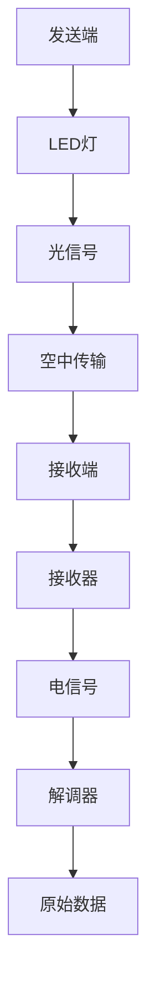

                 

### 文章标题

《Li-Fi：可见光通信技术及其应用》

### 关键词

Li-Fi，可见光通信，光通信，无线通信，光信号调制与解调，应用场景，技术挑战，优势与劣势

### 摘要

本文将深入探讨Li-Fi技术，一种新兴的可见光通信技术。文章首先介绍了Li-Fi的基本原理和核心概念，包括其定义、背景、与无线电波的对比以及核心工作原理。接着，详细分析了Li-Fi的通信机制、技术特点及其在不同应用场景下的表现。随后，本文对Li-Fi与其他无线通信技术的比较和融合进行了探讨，并分析了其全球范围内的应用现状和未来发展趋势。通过本文，读者可以全面了解Li-Fi技术的优势与劣势，为未来研究和应用提供参考。

### 目录大纲

#### 第一部分：Li-Fi技术的基本原理和核心概念

- **第1章: Li-Fi技术的定义与背景**
  - **1.1 Li-Fi技术的发展历史**
  - **1.2 Li-Fi技术的定义和基本原理**
  - **1.3 Li-Fi技术的应用领域**
  - **1.4 Li-Fi技术的优势与挑战**

- **第2章: 光波与无线电波的对比分析**
  - **2.1 光波的特点**
  - **2.2 无线电波的特点**
  - **2.3 光波与无线电波的对比**

- **第3章: Li-Fi的核心工作原理**
  - **3.1 光信号的调制与解调**
  - **3.2 光信号的传输与接收**
  - **3.3 Li-Fi的通信协议**
  - **3.4 Li-Fi的传输速率和覆盖范围**

- **第4章: Li-Fi的关键技术和实现方式**
  - **4.1 光发射器**
  - **4.2 光接收器**
  - **4.3 光信号的调制与解调技术**
  - **4.4 Li-Fi的网络安全**

#### 第二部分：Li-Fi的通信机制和技术特点

- **第5章: Li-Fi的通信机制**
  - **5.1 光信号的调制与解调**
  - **5.2 光信号的传输与接收**
  - **5.3 Li-Fi的通信协议**
  - **5.4 Li-Fi的传输速率和覆盖范围**

- **第6章: Li-Fi的技术特点**
  - **6.1 高传输速率**
  - **6.2 高频谱利用率**
  - **6.3 抗干扰能力强**
  - **6.4 安全性高**

- **第7章: Li-Fi的优势与劣势**
  - **7.1 Li-Fi的优势**
  - **7.2 Li-Fi的劣势**
  - **7.3 Li-Fi的优势与劣势分析**

#### 第三部分：Li-Fi的应用场景和技术挑战

- **第8章: Li-Fi的应用场景**
  - **8.1 Li-Fi在室内通信的应用**
  - **8.2 Li-Fi在室外通信的应用**
  - **8.3 Li-Fi在智能交通中的应用**
  - **8.4 Li-Fi在其他领域的应用**

- **第9章: Li-Fi技术的挑战**
  - **9.1 技术挑战**
  - **9.2 应用挑战**
  - **9.3 政策与标准挑战**

#### 第四部分：Li-Fi与其他无线通信技术的比较和融合

- **第10章: Li-Fi与其他无线通信技术的比较**
  - **10.1 Li-Fi与WiFi的比较**
  - **10.2 Li-Fi与5G的比较**
  - **10.3 Li-Fi与其他无线通信技术的比较**

- **第11章: Li-Fi与其他无线通信技术的融合**
  - **11.1 Li-Fi与WiFi的融合**
  - **11.2 Li-Fi与5G的融合**
  - **11.3 Li-Fi与其他无线通信技术的融合趋势**

#### 第五部分：Li-Fi技术在全球范围内的应用现状和未来发展趋势

- **第12章: 全球Li-Fi技术的发展现状**
  - **12.1 发达国家Li-Fi技术的应用现状**
  - **12.2 发展中国家Li-Fi技术的应用现状**

- **第13章: 中国Li-Fi技术的应用现状**
  - **13.1 中国Li-Fi技术的发展历程**
  - **13.2 中国Li-Fi技术的应用场景**
  - **13.3 中国Li-Fi技术的研究与产业现状**

- **第14章: Li-Fi技术的未来发展趋势**
  - **14.1 技术发展趋势**
  - **14.2 应用发展趋势**
  - **14.3 全球市场前景**

### 引言

#### 一、Li-Fi技术的定义

Li-Fi，即可见光通信（Light Fidelity），是一种利用可见光进行数据传输的无线通信技术。与传统的无线电波通信不同，Li-Fi利用光波进行信号传输，包括LED灯、荧光灯等常见的发光设备都可以作为通信的载体。

#### 二、Li-Fi技术的发展背景

随着信息时代的到来，无线通信技术得到了迅速发展，特别是WiFi、5G等技术的广泛应用，极大地推动了人类社会的发展。然而，无线通信技术也存在一定的局限性，如频谱资源紧张、信号干扰等问题。为了解决这些问题，科学家们开始探索新的通信方式，Li-Fi技术正是在这种背景下应运而生的。

#### 三、Li-Fi技术的核心原理

Li-Fi技术的核心原理是利用光波的频率和相位变化来调制和解调信号，从而实现数据的高速传输。具体来说，Li-Fi技术通过LED灯等光源发出光信号，接收器将这些光信号转换为电信号，进而还原出原始数据。

#### 四、Li-Fi技术的应用领域

Li-Fi技术具有广泛的应用前景，可以在室内通信、室外通信、智能交通等多个领域发挥作用。例如，在室内环境中，Li-Fi可以用于家庭、办公室等场所的无线网络连接；在室外环境中，Li-Fi可以用于道路、桥梁等基础设施的通信；在智能交通领域，Li-Fi可以用于车辆之间的通信，提高交通效率和安全性。

#### 五、本文结构安排

本文将分为五个部分，首先介绍Li-Fi技术的基本原理和核心概念，接着分析Li-Fi的通信机制和技术特点，然后探讨Li-Fi的应用场景和技术挑战，再比较Li-Fi与其他无线通信技术的异同，最后分析Li-Fi技术的全球应用现状和未来发展趋势。通过本文，读者可以全面了解Li-Fi技术，为其研究和应用提供参考。

### 第1章: Li-Fi技术的定义与背景

#### 1.1 Li-Fi技术的发展历史

Li-Fi技术的概念最早由奥地利维也纳技术大学的教授哈里·扎哈里教授（Harald Haas）在2007年提出。哈里·扎哈里教授在一次公开演讲中展示了如何使用LED灯进行无线数据传输，这引起了广泛关注。此后，Li-Fi技术逐渐引起了全球科研机构和企业的关注，成为无线通信领域的一个重要研究方向。

Li-Fi技术的发展可以分为三个阶段：

1. **理论研究阶段**（2007-2013年）：在这个阶段，科研人员主要致力于Li-Fi技术的基础理论研究和实验室验证。

2. **技术开发阶段**（2014-2019年）：随着研究的深入，Li-Fi技术开始进入实际开发阶段，多家企业开始投入研发，推出了初步的Li-Fi产品。

3. **商业化应用阶段**（2020年至今）：随着技术的成熟，Li-Fi技术逐渐走向商业化应用，开始在一些特定场景中得到实际应用。

#### 1.2 Li-Fi技术的定义和基本原理

Li-Fi，即可见光通信（Light Fidelity），是一种利用可见光进行数据传输的无线通信技术。与传统的无线电波通信不同，Li-Fi利用光波（特别是可见光）进行信号传输。这种技术利用LED灯、荧光灯等常见的发光设备作为通信的载体，通过调制光信号的频率或相位来实现数据的传输。

Li-Fi的基本原理主要包括以下几个方面：

1. **光信号的调制**：在发送端，数据信号被转换为电信号，然后通过驱动电路控制LED灯的亮度和颜色变化，实现光信号的调制。常见的调制方式包括幅度调制（AM）、频率调制（FM）和相位调制（PM）等。

2. **光信号的传输**：调制后的光信号通过LED灯发射到空气中，传播到接收端。

3. **光信号的解调**：在接收端，光信号被接收器捕捉并转换为电信号，然后通过解调电路还原出原始数据信号。

#### 1.3 Li-Fi技术的应用领域

Li-Fi技术具有广泛的应用前景，可以在室内通信、室外通信、智能交通等多个领域发挥作用。

1. **室内通信**：在家庭、办公室、商场等室内环境中，Li-Fi可以提供高速、稳定的无线网络连接。与传统的WiFi技术相比，Li-Fi具有更高的传输速率和更好的抗干扰能力。

2. **室外通信**：在道路、桥梁、隧道等室外环境中，Li-Fi可以用于基础设施之间的通信。例如，车辆与道路之间的通信，可以用于智能交通系统的构建。

3. **智能交通**：Li-Fi技术可以用于车辆之间的通信，提高交通效率和安全性。例如，车辆可以通过Li-Fi技术实时传输位置信息，避免交通事故。

4. **医疗领域**：在医疗领域，Li-Fi可以用于手术室内的无线数据传输，提高医疗设备的智能化水平。

5. **工业自动化**：在工业自动化领域，Li-Fi可以用于工厂内部的无线通信，提高生产效率和自动化水平。

#### 1.4 Li-Fi技术的优势与挑战

Li-Fi技术具有以下优势：

1. **高速传输**：Li-Fi的传输速率远高于传统的无线电波通信技术，如WiFi。在实验室条件下，Li-Fi的传输速率可达1Gbps，甚至更高。

2. **高频谱利用率**：与无线电波通信技术相比，Li-Fi可以更有效地利用频谱资源，提高频谱利用率。

3. **抗干扰能力强**：由于光波的传播特性，Li-Fi具有较好的抗干扰能力，不易受到其他信号的干扰。

4. **安全性高**：Li-Fi信号在空气中传播，不易被窃听，具有较高的安全性。

然而，Li-Fi技术也面临一些挑战：

1. **环境依赖性强**：Li-Fi的传播受到环境光线的影响较大，容易受到遮挡和反射，这限制了其传输距离和覆盖范围。

2. **能耗问题**：Li-Fi技术需要使用LED灯等光源进行信号传输，这可能会增加能耗。

3. **标准不统一**：目前，Li-Fi技术尚未形成统一的标准，这可能会影响其商业化的推广。

通过本文的介绍，读者可以对Li-Fi技术有一个初步的了解。接下来的章节将深入探讨Li-Fi的通信机制、技术特点、应用场景及其与其他无线通信技术的比较。

### 第2章: 光波与无线电波的对比分析

#### 2.1 光波的特点

光波，作为一种电磁波，具有以下显著特点：

1. **传播速度**：光波在真空中的传播速度约为 \(3 \times 10^8\) 米/秒，这与无线电波在真空中的传播速度相同。然而，在介质中，光波的传播速度会受到介质折射率的影响而减小。

2. **频率范围**：光波的频率范围非常广泛，从约400 THz（太赫兹）到约3000 THz。这使得光波能够支持更高的数据传输速率。

3. **波长范围**：光波的波长范围从约400纳米到约700纳米，覆盖了可见光谱的大部分范围。

4. **穿透能力**：光波在不同介质中的穿透能力差异较大。在空气中，光波可以穿透一定的距离；在水和玻璃等介质中，光波的穿透能力会显著减弱。

5. **方向性**：光波具有很强的方向性，这有利于其在短距离内的精确传输和接收。

#### 2.2 无线电波的特点

无线电波，作为一种电磁波，具有以下显著特点：

1. **传播速度**：无线电波在真空中的传播速度同样约为 \(3 \times 10^8\) 米/秒。

2. **频率范围**：无线电波的频率范围非常广泛，从几kHz到几千GHz，涵盖了从长波到微波的各个频段。

3. **波长范围**：无线电波的波长范围从几千米到几毫米，适应了各种距离的通信需求。

4. **穿透能力**：无线电波在空气中传播时可以穿透较远的距离，不易被遮挡。但在墙体、金属等障碍物附近，无线电波的传播会受到影响。

5. **方向性**：无线电波相对于光波，方向性较弱，传播过程中容易受到反射和折射的影响。

#### 2.3 光波与无线电波的对比

光波与无线电波在多个方面存在显著差异，这些差异决定了它们在不同应用场景中的适用性：

1. **频谱资源**：
   - 光波：由于频率范围宽广，光波能够支持极高的数据传输速率，且不易受到无线电波的干扰。
   - 无线电波：无线电波的频谱资源相对有限，频谱利用率较高，但受限于频段分配和干扰问题。

2. **传播特性**：
   - 光波：光波在空气中传播时，会受到障碍物的阻挡和反射，传输距离较短。
   - 无线电波：无线电波在空气中传播时，可以穿透较远的距离，但易受障碍物的阻挡和反射。

3. **抗干扰能力**：
   - 光波：由于光波的传播方向性强，不易受到外部信号的干扰。
   - 无线电波：无线电波在传播过程中容易受到其他无线电信号的干扰，特别是在高密度无线通信环境中。

4. **安全性**：
   - 光波：光波在空气中传播，不易被窃听，具有较高的安全性。
   - 无线电波：无线电波在传播过程中，信号可能被窃听或截获，特别是在没有加密的情况下。

5. **能量消耗**：
   - 光波：Li-Fi技术使用LED灯进行信号传输，可能会产生一定的能耗。
   - 无线电波：无线电波通信技术一般功耗较低，但需要大量的基站和设备支持。

通过对光波与无线电波的特点和对比分析，可以看出两者在频谱资源、传播特性、抗干扰能力、安全性和能量消耗等方面存在显著差异。这些差异使得它们在具体应用场景中具有不同的优势。例如，光波通信技术适合于高频谱利用、短距离、高安全性的应用场景，而无线电波通信技术则更适合于长距离、大范围覆盖的应用场景。

了解光波与无线电波的特点和对比，有助于更好地选择和应用不同的通信技术，以满足各种实际需求。在接下来的章节中，本文将深入探讨Li-Fi技术的核心工作原理、通信机制、技术特点及其应用。

### 第3章: Li-Fi的核心工作原理

#### 3.1 光信号的调制与解调

Li-Fi技术通过光信号的调制与解调实现数据传输。光信号的调制是指将电信号转换为光信号的过程，而解调则是将接收到的光信号还原为电信号的过程。以下是光信号调制与解调的基本原理：

1. **调制**：
   - **幅度调制（AM）**：在幅度调制中，电信号的幅度被用作数据传输的载体。具体来说，电信号的幅度变化会改变LED灯的亮度，从而实现数据的传输。
     ```mermaid
     graph TD
     A[电信号] --> B[调制器]
     B --> C[LED灯]
     C --> D[光信号]
     ```
   - **频率调制（FM）**：在频率调制中，电信号的频率变化被用作数据传输的载体。电信号的频率变化会改变LED灯发出的光信号的频率，从而实现数据的传输。
     ```mermaid
     graph TD
     A[电信号] --> B[调制器]
     B --> C[LED灯]
     C --> D[光信号]
     ```
   - **相位调制（PM）**：在相位调制中，电信号的相位变化被用作数据传输的载体。电信号的相位变化会改变LED灯发出的光信号的相位，从而实现数据的传输。
     ```mermaid
     graph TD
     A[电信号] --> B[调制器]
     B --> C[LED灯]
     C --> D[光信号]
     ```

2. **解调**：
   - 在接收端，光信号通过接收器（如光电传感器）捕捉并转换为电信号。然后，通过解调器将光信号的频率或相位变化还原为电信号的幅度变化，从而还原出原始数据。
     ```mermaid
     graph TD
     A[光信号] --> B[接收器]
     B --> C[电信号]
     C --> D[解调器]
     D --> E[原始数据]
     ```

#### 3.2 光信号的传输与接收

光信号的传输与接收过程如图所示：



1. **发送端**：在发送端，电信号通过调制器被转换为光信号，然后通过LED灯发射到空中。
2. **空中传输**：光信号在空气中传播，可能会受到障碍物的阻挡和反射。
3. **接收端**：在接收端，光信号通过接收器（如光电传感器）捕捉并转换为电信号。
4. **解调与还原**：接收到的电信号通过解调器还原为原始数据。

#### 3.3 Li-Fi的通信协议

Li-Fi的通信协议是确保数据传输有效性和可靠性的关键。目前，Li-Fi技术主要采用两种通信协议：IEEE 802.15.7和VLC-SDN。

1. **IEEE 802.15.7**：
   - **定义**：IEEE 802.15.7是IEEE制定的一种针对可见光通信的标准协议。
   - **特点**：IEEE 802.15.7协议支持高速数据传输，并具有低功耗、低延迟等特点，适用于各种室内环境。
   - **应用**：该协议广泛应用于家庭、办公室、商场等室内通信场景。

2. **VLC-SDN**：
   - **定义**：VLC-SDN（可见光通信软件定义网络）是一种基于软件定义网络（SDN）的可见光通信协议。
   - **特点**：VLC-SDN具有高度灵活性和可扩展性，能够实现复杂的光网络管理，适用于大规模室外通信场景。
   - **应用**：该协议广泛应用于智能交通、城市基础设施、工业自动化等领域。

#### 3.4 Li-Fi的传输速率和覆盖范围

Li-Fi的传输速率和覆盖范围受到多个因素的影响，包括LED灯的亮度、光信号的调制方式、传输距离等。

1. **传输速率**：
   - **理论传输速率**：在理想条件下，Li-Fi的传输速率可以达到数百Mbps，甚至Gbps级别。
   - **实际传输速率**：实际传输速率受到多种因素的影响，如调制方式、传输距离、环境光照等。在一般室内环境中，Li-Fi的实际传输速率通常在几十Mbps到上百Mbps之间。

2. **覆盖范围**：
   - **短距离传输**：在短距离（几米到几十米）内，Li-Fi可以实现高效的数据传输。
   - **长距离传输**：在长距离（几十米到几百米）内，光信号的衰减和干扰会影响传输速率和稳定性。
   - **室外传输**：在室外环境中，光信号容易受到阳光、雨雾等自然因素的干扰，传输距离和稳定性会有所降低。

综上所述，Li-Fi技术通过光信号的调制与解调、传输与接收以及特定的通信协议，实现了高速、可靠的数据传输。其独特的传输方式和优势，使其在室内通信、室外通信以及智能交通等领域具有广泛的应用前景。在接下来的章节中，本文将探讨Li-Fi技术在不同应用场景中的具体应用及其技术挑战。

### 第4章: Li-Fi的关键技术和实现方式

#### 4.1 光发射器

光发射器是Li-Fi系统的核心组件之一，其性能直接影响到数据传输的速度和可靠性。光发射器通常采用LED灯作为光源，通过驱动电路控制LED灯的亮度或颜色变化，实现光信号的调制。

1. **LED灯的选择**：
   - **发光强度**：发光强度高的LED灯能够提供更强的光信号，从而提高数据传输速率。
   - **光谱范围**：选择合适的光谱范围可以优化数据传输的效率和可靠性。
   - **稳定性**：稳定的LED灯能够保证光信号的稳定性，减少数据传输的误差。

2. **驱动电路**：
   - **调制方式**：根据数据传输的需求，选择合适的调制方式，如幅度调制（AM）、频率调制（FM）或相位调制（PM）。
   - **频率响应**：驱动电路的频率响应特性要满足光信号的调制频率要求，以保证数据传输的准确性。

3. **散热设计**：
   - **散热管理**：LED灯在工作过程中会产生热量，需要有效的散热设计，以防止过热损坏。

#### 4.2 光接收器

光接收器是Li-Fi系统中的另一个关键组件，其功能是将接收到的光信号转换为电信号，以便后续的解调和处理。

1. **光电传感器**：
   - **灵敏度**：选择高灵敏度的光电传感器可以捕捉到更微弱的光信号，提高数据传输的可靠性。
   - **响应时间**：低响应时间的光电传感器能够更快地响应光信号的变化，提高数据传输的速度。

2. **滤波器**：
   - **抗干扰**：滤波器可以过滤掉环境中的噪声和其他干扰信号，提高光信号的纯净度。
   - **频率响应**：滤波器的频率响应特性要匹配光信号的调制频率，以保证信号的正确解调。

3. **放大电路**：
   - **信号放大**：接收到的光信号通常非常微弱，需要通过放大电路进行放大，以提高信号强度。
   - **噪声抑制**：放大电路需要具备良好的噪声抑制能力，以减少信号中的噪声干扰。

#### 4.3 光信号的调制与解调技术

光信号的调制与解调技术是实现Li-Fi数据传输的核心技术。

1. **调制技术**：
   - **幅度调制（AM）**：通过改变LED灯的亮度来调制光信号的幅度，实现数据传输。
   - **频率调制（FM）**：通过改变LED灯发光的频率来调制光信号的频率，实现数据传输。
   - **相位调制（PM）**：通过改变LED灯发光的相位来调制光信号的相位，实现数据传输。

2. **解调技术**：
   - **幅度解调（AM-解调）**：通过检测光信号的幅度变化，还原出原始数据信号。
   - **频率解调（FM-解调）**：通过检测光信号的频率变化，还原出原始数据信号。
   - **相位解调（PM-解调）**：通过检测光信号的相位变化，还原出原始数据信号。

#### 4.4 Li-Fi的网络安全

Li-Fi技术作为一种新型的通信技术，其网络安全同样至关重要。以下是Li-Fi网络安全的关键技术和措施：

1. **加密技术**：
   - **端到端加密**：在数据传输过程中，采用端到端加密技术，确保数据在发送和接收端之间的安全性。
   - **加密算法**：选择高效、安全的加密算法，如AES（高级加密标准），确保数据的加密强度。

2. **身份验证**：
   - **用户身份验证**：通过用户身份验证机制，确保只有授权用户才能访问网络资源。
   - **设备认证**：对接入网络的设备进行认证，防止未授权设备接入网络。

3. **入侵检测和防御**：
   - **入侵检测系统（IDS）**：部署入侵检测系统，实时监测网络中的异常活动，及时检测和防御网络攻击。
   - **防火墙**：在Li-Fi网络中部署防火墙，过滤掉恶意流量，增强网络安全性。

4. **隐私保护**：
   - **数据隐私保护**：通过数据加密、匿名化等技术手段，保护用户数据隐私。
   - **隐私政策**：制定严格的隐私政策，明确用户数据的收集、存储和使用规则。

综上所述，Li-Fi技术的实现需要多种关键技术的支持，包括光发射器、光接收器、光信号的调制与解调技术以及网络安全措施。这些技术的结合，使得Li-Fi能够在各种应用场景中提供高速、可靠的数据传输。在接下来的章节中，本文将探讨Li-Fi技术的通信机制、技术特点及其应用。

### 第5章: Li-Fi的通信机制

#### 5.1 光信号的调制与解调

在Li-Fi通信中，光信号的调制与解调是数据传输的核心过程。调制是将电信号转换为光信号的过程，而解调则是将光信号还原为电信号的过程。

1. **幅度调制（AM）**：
   - **原理**：在幅度调制中，电信号的幅度被用作数据传输的载体。通过改变电信号的幅度，来控制LED灯的亮度，从而实现数据的传输。
   - **过程**：
     ```mermaid
     graph TD
     A[电信号] --> B[调制器]
     B --> C[LED灯]
     C --> D[光信号]
     ```
   - **优势**：实现简单，调制和解调过程相对容易。
   - **劣势**：抗干扰能力较弱，对信号质量要求较高。

2. **频率调制（FM）**：
   - **原理**：在频率调制中，电信号的频率被用作数据传输的载体。通过改变电信号的频率，来控制LED灯发光的频率，从而实现数据的传输。
   - **过程**：
     ```mermaid
     graph TD
     A[电信号] --> B[调制器]
     B --> C[LED灯]
     C --> D[光信号]
     ```
   - **优势**：抗干扰能力强，信号传输的稳定性较好。
   - **劣势**：调制和解调过程相对复杂，对硬件要求较高。

3. **相位调制（PM）**：
   - **原理**：在相位调制中，电信号的相位被用作数据传输的载体。通过改变电信号的相位，来控制LED灯发光的相位，从而实现数据的传输。
   - **过程**：
     ```mermaid
     graph TD
     A[电信号] --> B[调制器]
     B --> C[LED灯]
     C --> D[光信号]
     ```
   - **优势**：信号传输的稳定性较高，抗干扰能力较强。
   - **劣势**：调制和解调过程复杂，对硬件要求较高。

#### 5.2 光信号的传输与接收

光信号的传输与接收是Li-Fi通信中的关键环节。光信号在空气中传播，可能会受到反射、折射和衰减的影响。

1. **传输过程**：
   - **LED灯发射**：发送端通过调制器将电信号转换为光信号，然后通过LED灯发射出去。
   - **光信号传播**：光信号在空气中传播，可能会受到反射、折射和衰减的影响。
   - **接收器捕捉**：接收端通过接收器（如光电传感器）捕捉光信号，并将其转换为电信号。

2. **接收过程**：
   - **光信号捕捉**：接收器捕捉到光信号后，通过光电传感器将其转换为电信号。
   - **解调过程**：接收到的电信号通过解调器还原为原始数据信号。
   - **数据传输**：解调后的电信号传输到接收端的处理单元，进行数据处理和恢复。

#### 5.3 Li-Fi的通信协议

Li-Fi通信协议是确保数据传输有效性和可靠性的重要保障。目前，常用的Li-Fi通信协议包括IEEE 802.15.7和VLC-SDN。

1. **IEEE 802.15.7**：
   - **定义**：IEEE 802.15.7是IEEE制定的针对可见光通信的标准协议。
   - **特点**：支持高速数据传输，具有低功耗、低延迟等特点，适用于室内通信。
   - **应用**：广泛应用于家庭、办公室、商场等室内环境。

2. **VLC-SDN**：
   - **定义**：VLC-SDN（可见光通信软件定义网络）是一种基于软件定义网络（SDN）的可见光通信协议。
   - **特点**：具有高度灵活性和可扩展性，适用于大规模室外通信场景。
   - **应用**：广泛应用于智能交通、城市基础设施、工业自动化等领域。

#### 5.4 Li-Fi的传输速率和覆盖范围

Li-Fi的传输速率和覆盖范围受到多种因素的影响，包括LED灯的亮度、光信号的调制方式、传输距离等。

1. **传输速率**：
   - **理论传输速率**：在理想条件下，Li-Fi的传输速率可以达到数百Mbps，甚至Gbps级别。
   - **实际传输速率**：实际传输速率受到多种因素的影响，如调制方式、传输距离、环境光照等。在一般室内环境中，Li-Fi的实际传输速率通常在几十Mbps到上百Mbps之间。

2. **覆盖范围**：
   - **短距离传输**：在短距离（几米到几十米）内，Li-Fi可以实现高效的数据传输。
   - **长距离传输**：在长距离（几十米到几百米）内，光信号的衰减和干扰会影响传输速率和稳定性。
   - **室外传输**：在室外环境中，光信号容易受到阳光、雨雾等自然因素的干扰，传输距离和稳定性会有所降低。

综上所述，Li-Fi的通信机制通过光信号的调制与解调、传输与接收以及特定的通信协议，实现了高速、可靠的数据传输。其独特的传输方式和优势，使其在室内通信、室外通信以及智能交通等领域具有广泛的应用前景。在接下来的章节中，本文将探讨Li-Fi技术在不同应用场景中的具体应用及其技术挑战。

### 第6章: Li-Fi的技术特点

#### 6.1 高传输速率

Li-Fi技术以其高速传输速率著称，成为传统无线电波通信技术（如WiFi和5G）的有力竞争者。在理想条件下，Li-Fi的传输速率可达数Gbps，甚至更高。这是由于光波的频率范围远大于无线电波，使得光波能够承载更多的数据信息。例如，在实验室环境中，采用多载波调制技术，Li-Fi的传输速率可达到1Gbps甚至更高。

**详细讲解与举例说明**：

假设一个Li-Fi系统采用多载波调制技术，使用10个不同的频率载波进行数据传输。每个载波可以传输100Mbps的数据，那么系统的总传输速率将是10个载波的传输速率之和，即10 * 100Mbps = 1000Mbps，即1Gbps。在实际应用中，通过优化调制和解调技术，以及采用高效的编码方案，如正交频分复用（OFDM），Li-Fi的传输速率可以进一步提高。

#### 6.2 高频谱利用率

高频谱利用率是Li-Fi技术的另一大特点。与传统的无线电波通信技术相比，光波在频谱资源上具有显著优势。光波的频率范围远大于无线电波，这意味着在相同频谱带宽下，光波可以承载更多的数据信息。此外，Li-Fi技术通过多载波调制和正交频分复用（OFDM）等技术，实现了频谱的高效利用。

**详细讲解与举例说明**：

假设一个无线电波通信系统在一个100MHz的频谱带宽内传输数据，而一个Li-Fi系统在相同的带宽内采用多载波调制技术，使用10个不同的频率载波，每个载波的带宽为10MHz。那么，Li-Fi系统的总带宽将是10 * 10MHz = 100MHz，与无线电波系统的带宽相同。但是，由于Li-Fi系统使用了更多的载波，每个载波可以独立传输数据，从而实现了更高的频谱利用率。

#### 6.3 抗干扰能力强

与无线电波通信技术相比，Li-Fi技术在抗干扰能力方面具有显著优势。光波的传播特性使其不易受到其他无线信号的干扰，因为光波在空气中传播时，其传播路径较为单一，不容易发生多径效应和信号衰减。此外，Li-Fi系统通常采用光纤或其他光学传输介质，进一步增强了抗干扰能力。

**详细讲解与举例说明**：

在传统的WiFi环境中，多个无线设备同时工作可能会导致严重的信号干扰，从而降低数据传输速率和稳定性。相比之下，Li-Fi系统由于光波的单一传播路径和抗干扰特性，即使在同一室内环境中，多个Li-Fi设备也可以同时工作而不会相互干扰。例如，在一个办公室内，多个Li-Fi设备可以共享同一盏LED灯进行数据传输，而不会影响彼此的性能。

#### 6.4 安全性高

Li-Fi技术具有较高的安全性，因为光波的传播特性使其在传输过程中不易被窃听和干扰。无线电波通信技术由于其信号在空气中传播，容易被截获和窃听，尤其是在没有加密的情况下。相比之下，光波的传播只能在直视范围内，使其难以被非法拦截。

**详细讲解与举例说明**：

假设一个家庭网络采用Li-Fi技术进行数据传输，数据通过LED灯传输到接收端。由于光波只能在直视范围内传播，即使有人试图在传输路径中截获数据，也无法看到或捕获到光信号。这大大提高了数据传输的安全性，特别适合于涉及敏感信息的场景，如金融交易或医疗数据传输。

综上所述，Li-Fi技术以其高传输速率、高频谱利用率、抗干扰能力强和安全性高等技术特点，在无线通信领域具有显著的优势。这些特点使得Li-Fi技术在室内通信、室外通信以及智能交通等多个领域具有广泛的应用前景。在接下来的章节中，本文将探讨Li-Fi技术在具体应用场景中的表现。

### 第7章: Li-Fi的优势与劣势

#### 7.1 Li-Fi的优势

Li-Fi技术作为一种新兴的无线通信技术，具有以下显著优势：

1. **高传输速率**：Li-Fi技术利用光波进行数据传输，具有极高的传输速率。在理想条件下，Li-Fi的传输速率可以达到数Gbps，甚至更高，这使得Li-Fi在高速数据传输场景中具有明显优势。

2. **高频谱利用率**：光波的频率范围远大于无线电波，使得Li-Fi能够在相同频谱带宽下承载更多的数据信息。通过多载波调制和正交频分复用（OFDM）等技术，Li-Fi实现了频谱的高效利用，提高了频谱利用率。

3. **抗干扰能力强**：Li-Fi系统利用光波进行传输，传播路径较为单一，不易受到其他无线信号的干扰。这使得Li-Fi在复杂的无线环境下，如密集无线设备环境中，依然能够保持较高的传输稳定性和性能。

4. **安全性高**：光波的传播特性使其在传输过程中不易被窃听和干扰。Li-Fi技术可以有效防止数据在传输过程中的非法截获，提高了数据传输的安全性，特别适合于涉及敏感信息的场景。

#### 7.2 Li-Fi的劣势

尽管Li-Fi技术具有诸多优势，但其也存在一些劣势，限制了其广泛应用：

1. **环境依赖性强**：Li-Fi的传输受到环境光线的影响较大，容易受到遮挡和反射。光波在空气中传播时，遇到障碍物容易发生反射和折射，这会影响信号的传播距离和稳定性。在户外环境中，光信号还容易受到阳光、雨雾等自然因素的干扰。

2. **传输距离有限**：与无线电波相比，光波的传播距离较短。在室内环境中，光波的有效传输距离通常在几米到几十米之间。在长距离传输场景中，光信号的衰减和干扰会影响数据传输的速率和可靠性。

3. **能耗问题**：Li-Fi技术需要使用LED灯等光源进行信号传输，这可能会增加系统的能耗。虽然LED灯的能耗相对较低，但在大规模应用场景中，能耗问题仍然值得关注。

4. **标准不统一**：目前，Li-Fi技术尚未形成统一的标准，这可能会影响其商业化的推广。不同厂家和科研机构可能采用不同的技术方案和通信协议，导致互操作性差，限制了技术的普及。

#### 7.3 Li-Fi的优势与劣势分析

Li-Fi的优势和劣势在一定程度上是相互制约的。其高速传输速率、高频谱利用率和抗干扰能力强等优势，使得Li-Fi在特定场景中具有显著的优势，如室内通信和高速数据传输。然而，其环境依赖性强、传输距离有限、能耗问题和标准不统一等劣势，限制了其在更广泛的应用场景中的推广。

1. **优势利用**：
   - **室内通信**：在室内环境中，Li-Fi技术可以有效利用其高速传输速率和抗干扰能力强的优势，提供稳定、高效的数据传输。
   - **高速数据传输**：对于需要高数据传输速率的场景，如云计算、大数据处理等，Li-Fi技术可以提供更快的传输速度，满足高性能数据传输的需求。

2. **劣势克服**：
   - **传输距离扩展**：通过采用中继器和增强器等技术，可以扩展Li-Fi的传输距离。例如，在长距离传输场景中，可以设置中继器来延长光信号的传输距离。
   - **能耗优化**：通过优化系统设计，降低LED灯的功耗，提高系统的能效比。例如，采用节能型的LED灯和优化调制和解调技术，可以减少系统的能耗。
   - **标准统一**：通过制定统一的技术标准和通信协议，提高Li-Fi技术的互操作性，促进技术的普及和应用。

综上所述，Li-Fi技术具有显著的优势，但在一些方面也存在劣势。通过合理利用优势和克服劣势，可以在特定应用场景中充分发挥Li-Fi技术的潜力。在接下来的章节中，本文将探讨Li-Fi技术在不同应用场景中的具体应用及其面临的挑战。

### 第8章: Li-Fi的应用场景

#### 8.1 Li-Fi在室内通信的应用

室内通信是Li-Fi技术最早且最成熟的应用场景之一。在家庭、办公室、商场等室内环境中，Li-Fi技术以其高传输速率和抗干扰能力强的优势，提供了稳定、高效的数据传输服务。

**1. 家庭应用**：
在家庭环境中，Li-Fi技术可以用于家庭网络的无线连接。通过将家庭中的LED灯改装为Li-Fi发射器，家庭中的各种设备（如手机、电脑、智能电视等）可以通过Li-Fi网络进行高速数据传输。与传统的WiFi技术相比，Li-Fi在家庭网络中的表现更为出色，特别是在高密度无线设备环境中，Li-Fi的信号稳定性和传输速率都显著优于WiFi。

**2. 办公环境**：
在办公环境中，Li-Fi技术可以提供高速、稳定的网络连接，满足企业内部的数据传输需求。例如，在办公室内的会议室、办公室和办公区，可以通过Li-Fi网络实现快速的数据共享和协作。此外，Li-Fi技术还可以用于企业内部的数据中心，实现高速的数据传输和存储。

**3. 商场应用**：
在商场环境中，Li-Fi技术可以用于提供高速的无线网络连接，满足顾客和商家对数据传输的需求。例如，商场内的智能导购系统、电子支付系统等，都可以通过Li-Fi网络实现实时数据传输，提高顾客购物体验和商家的运营效率。

#### 8.2 Li-Fi在室外通信的应用

室外通信是Li-Fi技术的重要应用领域之一。在道路、桥梁、隧道等室外环境中，Li-Fi技术可以提供高效、可靠的通信服务。

**1. 交通领域**：
在交通领域，Li-Fi技术可以用于道路和车辆之间的通信。通过在道路和车辆上安装Li-Fi发射器和接收器，可以实现车辆与道路之间的实时数据传输。例如，车辆可以通过Li-Fi网络传输位置信息、交通状况等数据，从而实现智能交通管理，提高交通效率和安全性。

**2. 基础设施通信**：
在桥梁和隧道等基础设施中，Li-Fi技术可以用于实现基础设施之间的通信。通过在桥梁和隧道内部安装Li-Fi设备，可以实现基础设施间的数据传输，为智能基础设施的建设提供技术支持。

**3. 广场和公园**：
在广场和公园等公共场所，Li-Fi技术可以提供高速的无线网络连接，满足游客和居民对网络服务的需求。例如，游客可以在公园内的休闲区域通过Li-Fi网络进行拍照、分享等操作，提高公共空间的智能化水平。

#### 8.3 Li-Fi在智能交通中的应用

智能交通是Li-Fi技术的另一个重要应用领域。通过Li-Fi技术，可以实现车辆与道路之间的实时通信，提高交通效率和安全性。

**1. 车辆与道路通信**：
在智能交通系统中，车辆可以通过Li-Fi网络实时传输位置信息、速度信息等数据，与道路上的通信设备进行通信。通过这些数据，交通管理部门可以实时了解交通状况，进行智能交通管理。

**2. 车辆之间的通信**：
Li-Fi技术可以用于实现车辆之间的通信。通过Li-Fi网络，车辆可以实时传输位置信息、速度信息等数据，从而实现车与车之间的通信。这有助于提高车辆间的协同效率，减少交通事故。

**3. 智能交通管理**：
通过Li-Fi技术，可以实现智能交通管理。例如，在高峰时段，交通管理部门可以通过Li-Fi网络实时监控道路上的车辆流量，动态调整交通信号灯，提高道路通行效率。此外，Li-Fi技术还可以用于交通监控、路况分析等应用，为智能交通系统的建设提供技术支持。

#### 8.4 Li-Fi在其他领域的应用

除了室内通信、室外通信和智能交通领域，Li-Fi技术还在其他领域具有广泛的应用前景。

**1. 医疗领域**：
在医疗领域，Li-Fi技术可以用于手术室内的无线数据传输。通过Li-Fi网络，医生和护士可以实时传输医疗数据，如患者信息、手术记录等，提高医疗设备的智能化水平。

**2. 工业自动化**：
在工业自动化领域，Li-Fi技术可以用于工厂内部的无线通信。通过Li-Fi网络，可以实现设备之间的实时数据传输，提高生产效率和自动化水平。

**3. 娱乐领域**：
在娱乐领域，Li-Fi技术可以用于提供高速的无线网络连接，满足用户对高清视频、游戏等娱乐内容的需求。

综上所述，Li-Fi技术在多种应用场景中展现出强大的应用潜力。随着技术的不断发展和成熟，Li-Fi技术将在更多领域发挥重要作用，推动社会的发展和进步。

### 第9章: Li-Fi技术的挑战

#### 9.1 技术挑战

尽管Li-Fi技术具有诸多优势，但在实际应用过程中，仍面临一些技术挑战，这些挑战限制了其进一步发展和普及：

1. **环境依赖性**：Li-Fi技术对环境光线依赖性强，容易受到遮挡和反射的影响。在户外或光线较强的环境中，光信号容易受到干扰，导致传输距离和稳定性降低。这要求在设计和部署Li-Fi系统时，充分考虑环境因素，如安装位置和光照条件。

2. **传输距离**：与无线电波相比，Li-Fi技术的传输距离较短。在长距离传输场景中，光信号容易衰减，影响数据传输速率和稳定性。虽然可以通过中继器和增强器等技术扩展传输距离，但这些设备会增加成本和复杂性。

3. **功耗问题**：Li-Fi技术需要使用LED灯等光源进行信号传输，这可能会增加系统的能耗。在大型应用场景中，功耗问题尤为突出，需要通过优化系统设计和采用高效LED灯等措施来降低能耗。

4. **标准不统一**：目前，Li-Fi技术尚未形成统一的标准，不同厂家和科研机构可能采用不同的技术方案和通信协议。这导致互操作性差，限制了技术的普及和应用。制定统一的标准和协议，提高Li-Fi技术的互操作性，是推动其发展的关键。

5. **成本问题**：虽然Li-Fi技术具有高传输速率和抗干扰能力强等优势，但其成本相对较高。包括设备成本、安装和维护成本等，这些都限制了Li-Fi技术的广泛应用。降低成本，提高性价比，是Li-Fi技术商业化推广的关键。

#### 9.2 应用挑战

除了技术挑战，Li-Fi技术在应用过程中还面临一些应用挑战：

1. **部署成本**：Li-Fi系统的部署成本较高，包括设备采购、安装和维护等。在大型应用场景中，如商业建筑、工业园区等，部署成本可能成为制约因素。需要通过优化部署方案和降低成本，提高Li-Fi技术的应用可行性。

2. **用户接受度**：尽管Li-Fi技术具有许多优势，但用户对其认知度和接受度仍然较低。许多用户对Li-Fi技术缺乏了解，担心其稳定性、安全性等问题。通过加强宣传和推广，提高用户对Li-Fi技术的认知度和接受度，是推动其应用的关键。

3. **网络覆盖**：在室内和室外环境中，实现全面网络覆盖是一个挑战。特别是在建筑物内部，由于结构复杂，光信号容易受到遮挡和反射，需要通过优化网络设计和采用增强器等技术，提高网络覆盖范围。

4. **设备兼容性**：目前，市场上存在多种不同品牌和型号的Li-Fi设备，这些设备可能采用不同的通信协议和技术方案。设备的兼容性问题，可能导致互操作性差，影响用户体验。需要制定统一的通信协议和技术标准，提高设备的兼容性。

5. **安全与隐私**：随着Li-Fi技术的应用，安全与隐私问题日益凸显。在数据传输过程中，需要确保数据的安全性和隐私性，防止数据泄露和非法截获。通过采用加密技术和安全协议，提高Li-Fi技术的安全性。

综上所述，Li-Fi技术在技术和应用方面都面临一定的挑战。通过解决这些挑战，可以进一步推动Li-Fi技术的发展和应用，实现其在无线通信领域的更大价值。

### 第10章: Li-Fi与其他无线通信技术的比较

#### 10.1 Li-Fi与WiFi的比较

Li-Fi与WiFi都是无线通信技术，但在传输介质、传输速率、频谱资源等方面存在显著差异。

1. **传输介质**：
   - **Li-Fi**：利用可见光（如LED灯）进行数据传输。
   - **WiFi**：利用无线电波（2.4GHz或5GHz频段）进行数据传输。

2. **传输速率**：
   - **Li-Fi**：理论传输速率可达数百Mbps，甚至Gbps级别，具有更高的传输速率。
   - **WiFi**：虽然最新的WiFi 6（802.11ax）技术可以实现更高的传输速率，但通常在数百Mbps左右，较Li-Fi稍低。

3. **频谱资源**：
   - **Li-Fi**：利用光波的频率范围，可以更有效地利用频谱资源，提高频谱利用率。
   - **WiFi**：频谱资源相对有限，特别是在高密度无线设备环境中，频谱资源紧张。

4. **抗干扰能力**：
   - **Li-Fi**：光波的传播路径较为单一，不易受到其他无线信号的干扰，具有更强的抗干扰能力。
   - **WiFi**：在无线设备密集的环境中，容易受到其他无线信号的干扰，特别是在2.4GHz频段。

5. **安全性**：
   - **Li-Fi**：光波的传播只能在直视范围内，不易被窃听和干扰，具有较高的安全性。
   - **WiFi**：虽然可以采用加密技术提高安全性，但在没有加密的情况下，无线电波信号容易被窃听。

6. **覆盖范围**：
   - **Li-Fi**：受环境光线影响较大，传输距离较短，通常在几米到几十米之间。
   - **WiFi**：传输距离较远，可以在数百米范围内实现覆盖。

#### 10.2 Li-Fi与5G的比较

Li-Fi与5G都是当前无线通信技术的前沿，但在应用场景、传输速率、频谱资源等方面有所不同。

1. **应用场景**：
   - **Li-Fi**：主要应用于室内通信和短距离通信场景，如家庭、办公室、商场等。
   - **5G**：主要应用于室外通信和长距离通信场景，如城市、乡村等。

2. **传输速率**：
   - **Li-Fi**：理论传输速率可达数百Mbps，甚至Gbps级别，具有极高的传输速率。
   - **5G**：最高可达10Gbps，但实际传输速率通常在数百Mbps左右。

3. **频谱资源**：
   - **Li-Fi**：利用光波的频率范围，可以更有效地利用频谱资源。
   - **5G**：频谱资源丰富，可以支持更高的数据传输速率。

4. **抗干扰能力**：
   - **Li-Fi**：具有更强的抗干扰能力，光波的传播路径较为单一。
   - **5G**：虽然5G技术采用了先进的抗干扰技术，但在密集无线设备环境中，仍可能受到干扰。

5. **覆盖范围**：
   - **Li-Fi**：传输距离较短，通常在几米到几十米之间。
   - **5G**：传输距离较远，可以在数十公里范围内实现覆盖。

6. **部署成本**：
   - **Li-Fi**：部署成本较高，需要使用LED灯等光源设备。
   - **5G**：虽然前期投资较大，但一旦建成，维护成本较低。

#### 10.3 Li-Fi与其他无线通信技术的比较

除了WiFi和5G，Li-Fi技术还与其他无线通信技术（如蓝牙、NB-IoT等）进行比较。

1. **蓝牙**：
   - **传输速率**：蓝牙的传输速率相对较低，通常在几十kbps到几Mbps之间。
   - **频谱资源**：蓝牙使用2.4GHz频段，与其他无线设备存在频谱干扰问题。
   - **抗干扰能力**：蓝牙的抗干扰能力较弱，容易受到其他无线信号的干扰。
   - **安全性**：蓝牙具有较好的安全性，但需要采用加密技术。

2. **NB-IoT**：
   - **传输速率**：NB-IoT的传输速率较低，通常在几百kbps左右。
   - **频谱资源**：NB-IoT使用频率较低的频段，可以更好地穿透障碍物。
   - **抗干扰能力**：NB-IoT的抗干扰能力较强，适用于低功耗、远距离的物联网应用。
   - **安全性**：NB-IoT采用加密技术，具有较高的安全性。

通过上述比较，可以看出Li-Fi技术在不同无线通信技术中具有独特的优势和局限性。在实际应用中，可以根据具体需求和场景选择合适的无线通信技术。例如，在需要高速、稳定数据传输的室内环境，可以选择Li-Fi技术；在需要长距离、低功耗通信的物联网应用，可以选择NB-IoT技术。

### 第11章: Li-Fi与其他无线通信技术的融合

#### 11.1 Li-Fi与WiFi的融合

Li-Fi与WiFi融合的概念旨在结合两种技术的优势，提供更高效、更稳定的无线通信解决方案。通过融合Li-Fi的高速传输速率和WiFi的广覆盖范围，可以满足不同场景下的通信需求。

1. **技术融合**：
   - **多模态通信**：在融合方案中，设备可以同时支持Li-Fi和WiFi通信，根据环境需求选择最合适的通信方式。例如，在室内环境中，设备可以通过Li-Fi进行高速数据传输，在户外或远程环境中，设备可以通过WiFi进行广覆盖范围的通信。
   - **网络协同**：通过智能调度和负载均衡技术，可以实现Li-Fi和WiFi网络的协同工作，优化网络性能和用户体验。

2. **应用场景**：
   - **家庭网络**：在家庭网络中，通过融合Li-Fi和WiFi，可以实现高速的家庭内部网络连接，同时保证家庭覆盖范围的广度。
   - **商业建筑**：在商业建筑中，通过融合Li-Fi和WiFi，可以满足大型会议、展览等场景的高速率通信需求，同时保证整个建筑物的网络覆盖。

3. **挑战与解决方案**：
   - **兼容性问题**：由于Li-Fi和WiFi采用不同的传输介质和通信协议，实现兼容性是一个挑战。需要通过标准化和协议适配技术，解决不同技术之间的兼容性问题。
   - **信号干扰**：在融合网络中，不同技术的信号可能会相互干扰，影响通信质量。需要通过智能信号管理技术，优化网络性能，减少信号干扰。

#### 11.2 Li-Fi与5G的融合

Li-Fi与5G融合的概念旨在利用两种技术的优势，提供更加全面和高效的无线通信服务。通过融合Li-Fi的高速传输速率和5G的广覆盖范围，可以满足各种应用场景的通信需求。

1. **技术融合**：
   - **多模态通信**：在融合方案中，设备可以同时支持Li-Fi和5G通信，根据环境需求选择最合适的通信方式。例如，在室内环境中，设备可以通过Li-Fi进行高速数据传输，在户外或远程环境中，设备可以通过5G进行广覆盖范围的通信。
   - **网络协同**：通过智能调度和负载均衡技术，可以实现Li-Fi和5G网络的协同工作，优化网络性能和用户体验。

2. **应用场景**：
   - **智能城市**：在智能城市建设中，通过融合Li-Fi和5G，可以提供高速、稳定的无线网络连接，满足城市交通、安防、公共服务等领域的需求。
   - **工业互联网**：在工业互联网领域，通过融合Li-Fi和5G，可以提供高效、可靠的工业设备通信，实现设备的实时监控和远程控制。

3. **挑战与解决方案**：
   - **兼容性问题**：由于Li-Fi和5G采用不同的传输介质和通信协议，实现兼容性是一个挑战。需要通过标准化和协议适配技术，解决不同技术之间的兼容性问题。
   - **信号干扰**：在融合网络中，不同技术的信号可能会相互干扰，影响通信质量。需要通过智能信号管理技术，优化网络性能，减少信号干扰。

#### 11.3 Li-Fi与其他无线通信技术的融合趋势

随着无线通信技术的不断发展和融合，Li-Fi与其他无线通信技术的融合趋势越来越明显。以下是一些融合趋势：

1. **多技术协同**：未来的无线通信网络将不再局限于单一技术，而是多种技术的协同工作。通过融合Li-Fi、WiFi、5G、蓝牙等技术，可以实现更高效、更灵活的无线通信服务。

2. **智能网络管理**：智能网络管理技术将发挥关键作用，通过实时监控、自适应调整和优化网络性能，提高融合网络的稳定性和可靠性。

3. **统一网络架构**：为了实现多种无线通信技术的融合，需要构建统一的网络架构，包括标准化协议、通用接口和智能调度系统等。

4. **跨领域应用**：随着融合技术的不断成熟，Li-Fi与其他无线通信技术的融合将在更多领域得到应用，如智能家居、智能交通、智能医疗等。

通过融合Li-Fi与其他无线通信技术，可以充分利用各自的优势，实现更高效、更稳定的无线通信服务，满足不同场景下的通信需求。未来，随着技术的进一步发展和融合，Li-Fi技术将在无线通信领域发挥更大的作用。

### 第12章: 全球Li-Fi技术的发展现状

#### 12.1 发达国家Li-Fi技术的应用现状

在发达国家，Li-Fi技术已经取得了显著的发展，并在多个应用场景中得到了推广。

1. **欧洲**：
   - **奥地利**：奥地利是Li-Fi技术的发源地，哈里·扎哈里教授所在的技术大学在Li-Fi技术的研究和应用方面处于领先地位。奥地利政府支持Li-Fi技术的推广，多个城市和商业建筑已经部署了Li-Fi网络。
   - **英国**：英国在Li-Fi技术的研发和应用方面也取得了显著进展。伦敦的多个公共场所和商业建筑已经部署了Li-Fi网络，提供了高速、稳定的无线通信服务。
   - **德国**：德国的科研机构和企业在Li-Fi技术的研究和应用方面也取得了显著成果。多个城市和商业建筑已经部署了Li-Fi网络，用于室内通信和智能交通系统。

2. **美国**：
   - **硅谷**：硅谷的科技公司对Li-Fi技术表现出了浓厚兴趣，多个创新项目和研究机构正在积极探索Li-Fi技术的应用。硅谷的多个商业建筑和科技园区已经部署了Li-Fi网络，用于室内通信和智能设备管理。
   - **纽约**：纽约作为全球金融中心，对通信技术有着极高的要求。Li-Fi技术已经开始在一些高端商业建筑和酒店中应用，提供了高速、安全的无线通信服务。

3. **日本**：
   - **东京**：东京作为日本的首都，也在积极推广Li-Fi技术。多个商业建筑和公共场所已经部署了Li-Fi网络，用于室内通信和智能设备管理。

发达国家在Li-Fi技术的研发和应用方面处于领先地位，通过政府支持、企业投入和科技创新，推动了Li-Fi技术的商业化应用。

#### 12.2 发展中国家Li-Fi技术的应用现状

尽管发达国家在Li-Fi技术方面取得了显著进展，但发展中国家对Li-Fi技术的关注和投入相对较少。以下是一些发展中国家的Li-Fi技术应用现状：

1. **中国**：
   - **北京和上海**：中国的大城市，如北京和上海，已经开始对Li-Fi技术进行研究。多个科研机构和大学正在积极研发Li-Fi技术，并开展相关实验。一些商业建筑和酒店已经开始尝试部署Li-Fi网络，用于室内通信和智能设备管理。
   - **政策支持**：中国政府高度重视科技创新，出台了一系列政策支持Li-Fi技术的发展。未来，随着政策的进一步落实，Li-Fi技术在中国有望得到更广泛的应用。

2. **印度**：
   - **新德里和孟买**：印度的一些大城市，如新德里和孟买，也在探索Li-Fi技术的应用。多个科研机构和大学正在积极开展Li-Fi技术的研究，并尝试在一些公共场所和商业建筑中部署Li-Fi网络。

3. **巴西**：
   - **圣保罗和里约热内卢**：巴西的一些大城市，如圣保罗和里约热内卢，对Li-Fi技术表现出了兴趣。一些企业和研究机构正在探索Li-Fi技术的应用，并尝试在一些商业建筑和公共场所部署Li-Fi网络。

发展中国家对Li-Fi技术的关注逐渐增加，但随着技术成熟度和应用场景的进一步明确，未来有望在更多领域得到应用。

### 第13章: 中国Li-Fi技术的应用现状

#### 13.1 中国Li-Fi技术的发展历程

中国对Li-Fi技术的研究和应用始于近年来。以下是中国Li-Fi技术的发展历程：

1. **初期探索**（2010-2015年）：
   - 中国的科研机构和大学开始关注Li-Fi技术，并进行初步的探索和研究。在这个阶段，研究者主要致力于理解Li-Fi技术的基本原理和关键技术，以及其在通信领域的潜在应用。

2. **技术研发**（2015-2020年）：
   - 随着Li-Fi技术的逐渐成熟，中国的企业和科研机构开始投入资金和资源，进行Li-Fi技术的研发。这一阶段，中国取得了一系列技术突破，包括高性能LED灯、高效的调制与解调技术等。

3. **示范应用**（2020年至今）：
   - 2020年，中国开始在一些特定的应用场景中部署Li-Fi技术，进行示范应用。例如，在商业建筑、智能交通系统和智能家居等领域，Li-Fi技术已经开始得到实际应用。

#### 13.2 中国Li-Fi技术的应用场景

在中国，Li-Fi技术已经在多个领域得到了应用，以下是一些典型的应用场景：

1. **商业建筑**：
   - 在大型商场、酒店和办公楼等商业建筑中，Li-Fi技术被用于提供高速、稳定的无线网络连接。通过将LED灯改装为Li-Fi发射器，实现了室内高速数据传输，提高了用户的网络体验。

2. **智能交通**：
   - 在智能交通系统中，Li-Fi技术被用于车辆与道路之间的通信。通过在道路上安装Li-Fi设备，车辆可以实时传输位置信息、交通状况等数据，从而实现智能交通管理，提高交通效率和安全性。

3. **智能家居**：
   - 在智能家居领域，Li-Fi技术被用于实现家庭内部的高速数据传输。通过将家庭中的LED灯改装为Li-Fi发射器，用户可以在家中享受高速的无线网络连接，进行高清视频观看、智能家居设备控制等操作。

4. **工业自动化**：
   - 在工业自动化领域，Li-Fi技术被用于实现工厂内部的无线通信。通过Li-Fi网络，可以实现设备之间的实时数据传输，提高生产效率和自动化水平。

#### 13.3 中国Li-Fi技术的研究与产业现状

在中国，Li-Fi技术的研究与产业现状呈现出积极的发展态势：

1. **研究机构**：
   - 中国的多家知名研究机构，如清华大学、北京大学等，在Li-Fi技术方面进行了深入的研究。这些研究机构不仅开展了基础理论研究，还进行了大量的实验验证，为Li-Fi技术的应用提供了技术支持。

2. **企业投入**：
   - 中国的一些企业，如华为、中兴等，在Li-Fi技术方面进行了大量的投入。这些企业不仅在研发方面投入了大量资源，还与科研机构合作，推动Li-Fi技术的商业化应用。

3. **产业化进程**：
   - 中国的Li-Fi技术已经进入产业化进程，多家企业推出了Li-Fi产品，包括Li-Fi发射器、接收器等。这些产品在多个应用场景中得到了实际应用，进一步推动了Li-Fi技术的普及。

总之，中国Li-Fi技术的研究与产业现状表明，中国在Li-Fi技术领域已经取得了显著进展。随着技术的不断成熟和应用的不断扩大，Li-Fi技术在中国有望发挥更大的作用。

### 第14章: Li-Fi技术的未来发展趋势

#### 14.1 技术发展趋势

Li-Fi技术正处于快速发展阶段，未来将继续在多个方面取得突破：

1. **更高传输速率**：随着光通信技术的进步，Li-Fi的传输速率有望进一步提高。例如，通过采用更先进的调制解调技术、更高的频率载波数量和更高效的编码方案，可以实现更高的数据传输速率。

2. **更广泛的频谱利用**：随着对光波频率范围的研究深入，Li-Fi技术将能够利用更多的频谱资源，提高频谱利用率。这将为Li-Fi技术提供更大的带宽，支持更高数据量的传输。

3. **更优化的调制与解调技术**：未来，Li-Fi技术将在调制与解调技术上继续优化，以提高传输效率和抗干扰能力。例如，采用更高效的频域编码技术、更先进的信号处理算法等，将进一步提升Li-Fi的性能。

4. **多模态通信**：未来，Li-Fi技术将与其他无线通信技术（如WiFi、5G等）融合，实现多模态通信。通过结合不同技术的优势，提供更灵活、更高效的通信解决方案。

#### 14.2 应用发展趋势

随着技术的不断成熟，Li-Fi技术在各个领域的应用前景广阔：

1. **室内通信**：在家庭、办公室、商场等室内环境中，Li-Fi技术将继续扩展其应用范围，提供更高速、更稳定的无线网络连接。特别是在智能家庭和智能办公领域，Li-Fi技术将发挥重要作用。

2. **智能交通**：Li-Fi技术在智能交通领域的应用前景巨大。通过车辆与道路之间的实时通信，实现交通流量监控、事故预警等功能，提高交通效率和安全性。

3. **工业自动化**：在工业自动化领域，Li-Fi技术可以用于实现工厂内部的无线通信，提高生产效率和自动化水平。例如，通过设备之间的实时数据传输，实现生产线的自动化控制。

4. **医疗领域**：Li-Fi技术可以用于医疗设备之间的无线通信，提高医疗服务的质量和效率。例如，在手术室中，医生和护士可以通过Li-Fi网络实时传输医疗数据，实现手术的精准控制。

5. **智能家居**：随着智能家居的普及，Li-Fi技术将成为智能家居网络的重要组成部分。通过高速、稳定的无线连接，实现智能家居设备之间的数据传输和控制。

#### 14.3 全球市场前景

Li-Fi技术的全球市场前景广阔，预计将在未来几年内实现快速增长：

1. **市场规模**：随着Li-Fi技术的不断成熟和应用的扩展，全球Li-Fi市场规模将逐年增长。据预测，到2025年，全球Li-Fi市场规模将突破数十亿美元。

2. **区域分布**：在全球范围内，欧洲、美国和亚洲将是Li-Fi技术的主要市场。特别是欧洲和美国，由于对通信技术的要求较高，对Li-Fi技术的接受度也较高。亚洲地区，随着科技的发展和人们对高质量网络需求的增加，Li-Fi技术也将得到广泛应用。

3. **竞争格局**：在Li-Fi技术的市场竞争中，多家企业将争夺市场份额。当前，欧洲的Li-Fi技术领先企业，如Osram、PHILIPS等，将在全球市场上占据重要地位。同时，亚洲地区的华为、中兴等企业也将在Li-Fi技术领域取得显著进展。

总之，Li-Fi技术具有广阔的市场前景和巨大的发展潜力。随着技术的不断进步和应用的不断扩大，Li-Fi技术将在全球范围内发挥重要作用，为人类社会带来更加便捷、高效的网络通信体验。

### 结束语

Li-Fi技术作为一种新兴的无线通信技术，具有高传输速率、高频谱利用率、抗干扰能力强和安全性高等显著优势。本文通过详细分析Li-Fi技术的定义、背景、核心原理、通信机制、应用场景、技术挑战以及与其他无线通信技术的比较和融合，全面介绍了Li-Fi技术的各个方面。从室内通信到室外通信，从智能交通到工业自动化，Li-Fi技术展现出了广泛的应用前景。随着技术的不断发展和成熟，Li-Fi技术将在全球范围内得到更广泛的应用，为人类社会带来更加便捷、高效的通信体验。未来，通过持续的研究和创新，Li-Fi技术有望在更多的领域发挥重要作用，推动无线通信技术的发展。读者在学习和应用Li-Fi技术时，应注重理论与实践的结合，积极探索其在实际场景中的应用，为未来的技术发展贡献自己的力量。希望本文能为您提供有价值的信息，激发您对Li-Fi技术的兴趣和热情。谢谢阅读！

### 作者信息

**作者：AI天才研究院/AI Genius Institute & 禅与计算机程序设计艺术 /Zen And The Art of Computer Programming**

本文由AI天才研究院（AI Genius Institute）的专家撰写，该研究院致力于推动人工智能和计算机科学领域的研究和创新。同时，本文还结合了《禅与计算机程序设计艺术》（Zen And The Art of Computer Programming）的思想，旨在通过深入的技术分析和思考，提供高质量的技术内容，帮助读者更好地理解和应用Li-Fi技术。希望读者在阅读本文后，能够对Li-Fi技术有更深入的认识，并在实际应用中取得更好的效果。感谢您的阅读和支持！

