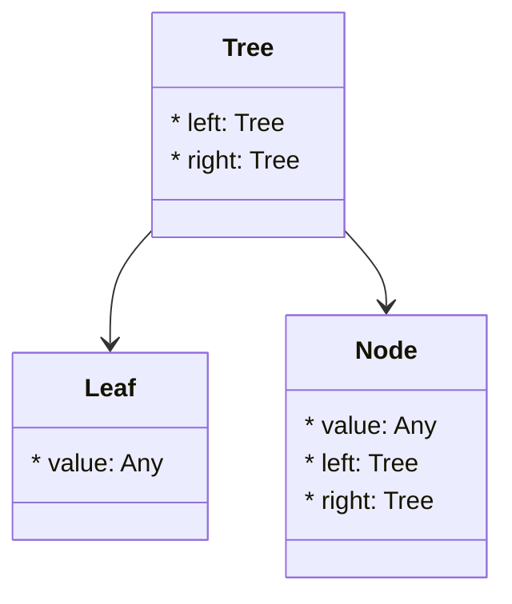
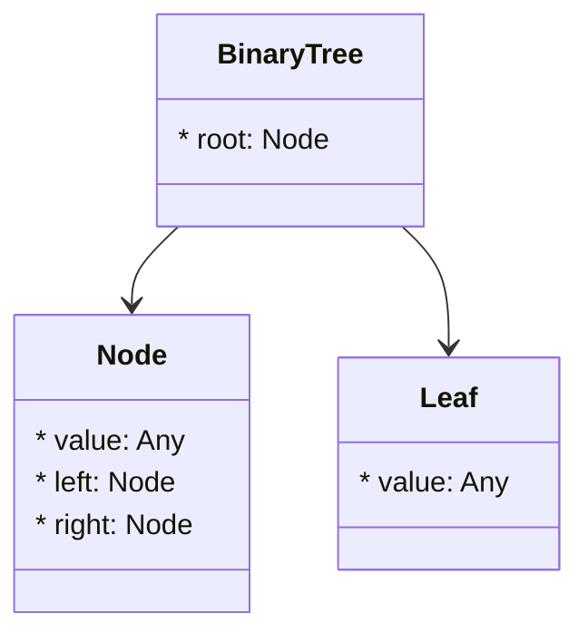

                 

### 文章标题

《OOP中的代数数据类型：函数式概念的融合》

### 关键词

- 面向对象编程（OOP）
- 代数数据类型
- 函数式编程
- 融合技术
- 高阶函数
- 惰性计算
- Mermaid流程图
- 项目实战

### 摘要

本文将深入探讨如何将代数数据类型和函数式编程概念与面向对象编程（OOP）相结合，从而增强OOP的灵活性和表达能力。首先，我们将介绍代数数据类型和函数式编程的基本概念，并探讨OOP在传统编程中的局限性。接着，我们将逐步解释如何在OOP中使用代数数据类型和函数式概念，并通过Mermaid流程图和伪代码展示核心算法原理。最后，通过实际项目案例，我们将展示如何将理论应用到实践中，并提供一些最佳实践技巧和注意事项。

## 第一部分：基础概念

### 1.1 代数数据类型基础

代数数据类型（Algebraic Data Types，ADT）是一种数据结构，通过组合简单的数据类型来创建复杂的结构。在函数式编程中，代数数据类型非常重要，因为它们可以表示复杂的数据结构，并允许函数以类型安全的方式处理这些数据。

#### 1.1.1 代数数据类型的定义

代数数据类型通常通过构造器（constructor）定义。构造器是一种特殊的函数，用于创建该数据类型的实例。例如，在Haskell中，我们可以定义一个二元树的数据类型：



在这个例子中，`Tree` 是一个代数数据类型，它由两个构造器 `Leaf` 和 `Node` 组成。

#### 1.1.2 常见的代数数据类型

常见的代数数据类型包括：

- **列表**：一种线性数据结构，可以包含任意数量的元素。在函数式编程语言中，列表通常通过模式匹配（pattern matching）操作进行处理。
- **选项类型（Option）**：表示可能存在或不存在值的类型。它可以防止空指针异常，并在处理空值时提供更好的灵活性。
- **联合类型（Union Type）**：表示可能具有多个不同类型的值的类型。在函数式编程中，联合类型通过模式匹配进行区分处理。

### 1.2 函数式编程概念

函数式编程（Functional Programming）是一种编程范式，强调以函数作为主要构建模块，并通过不可变数据和行为来减少复杂度。函数式编程的一些核心概念包括：

#### 1.2.1 函数式编程的特点

- **纯函数**：纯函数是一种无副作用、输入输出完全确定的函数。纯函数在函数式编程中占据核心地位，因为它们易于测试和推理。
- **高阶函数**：高阶函数是能够接受函数作为参数或返回函数的函数。高阶函数是函数式编程的重要特性，因为它们可以抽象和组合行为。

#### 1.2.2 高阶函数

高阶函数包括：

- **映射（map）**：对列表中的每个元素应用一个函数，并返回一个新列表。
- **过滤（filter）**：根据一个条件对列表进行过滤，并返回满足条件的新列表。
- **折叠（fold）**：将列表折叠成一个单一值。

### 1.3 OOP与函数式编程的关系

面向对象编程（OOP）和函数式编程（FP）在本质上是两种不同的编程范式。OOP强调对象、继承、封装和多态等概念，而FP则侧重于函数、不可变数据和纯函数。尽管它们之间存在差异，但它们也可以相互补充。

#### 1.3.1 面向对象编程的局限性

OOP在处理复杂系统时可能存在一些局限性：

- **继承**：继承可能导致代码冗余和复杂性。
- **多态**：多态通过鸭子类型实现，可能导致类型安全问题和调试困难。
- **副作用**：OOP中的副作用（如修改全局状态）可能导致不可预测的行为。

#### 1.3.2 函数式编程的优势

函数式编程的一些优势包括：

- **类型安全**：通过静态类型检查和模式匹配，可以避免空指针异常和类型错误。
- **可测试性**：纯函数易于测试和推理。
- **组合性**：通过高阶函数和组合，可以创建复杂的函数和行为。

## 第二部分：融合技术

### 2.1 代数数据类型在OOP中的应用

在OOP中，我们可以使用代数数据类型来创建复杂的数据结构，并通过模式匹配来处理这些结构。以下是一些如何在OOP中使用代数数据类型的示例：

#### 2.1.1 类与代数数据类型的关系

在OOP中，类可以被视为代数数据类型的实现。例如，我们可以定义一个表示二元树的类，并在其中包含创建树节点的构造器：

```java
public class BinaryTree<T> {
    private Node<T> root;

    public BinaryTree(T value) {
        root = new Node<>(value);
    }

    // 其他操作...
}

public static class Node<T> {
    public T value;
    public Node<T> left;
    public Node<T> right;

    public Node(T value) {
        this.value = value;
    }
}
```

在这个例子中，`BinaryTree` 类表示一个代数数据类型，它由两个构造器 `Leaf` 和 `Node` 组成。

#### 2.1.2 代数数据类型的组合

在OOP中，我们可以通过组合不同的类来创建更复杂的数据结构。例如，我们可以创建一个表示购物车的类，它由多个商品项组成：

```java
public class ShoppingCart {
    private List<ShoppingItem> items;

    public ShoppingCart() {
        items = new ArrayList<>();
    }

    public void add(ShoppingItem item) {
        items.add(item);
    }

    // 其他操作...
}

public static class ShoppingItem {
    private String productId;
    private String productName;
    private double price;

    public ShoppingItem(String productId, String productName, double price) {
        this.productId = productId;
        this.productName = productName;
        this.price = price;
    }
}
```

在这个例子中，`ShoppingCart` 类由多个 `ShoppingItem` 对象组成，这些对象可以被视为代数数据类型的实例。

### 2.2 函数式概念在OOP中的实现

在OOP中，我们可以通过使用一些函数式编程的概念来提高代码的可读性和可维护性。以下是一些如何在OOP中实现函数式概念的示例：

#### 2.2.1 函数组合与管道

函数组合和高阶函数的概念可以用于创建可组合的、灵活的代码。在OOP中，我们可以通过创建具有可组合性的方法来实现这一目标。例如，我们可以创建一个具有可组合性的过滤方法：

```java
public class CollectionUtils {
    public static <T> List<T> filter(List<T> list, Predicate<T> predicate) {
        List<T> result = new ArrayList<>();
        for (T item : list) {
            if (predicate.test(item)) {
                result.add(item);
            }
        }
        return result;
    }
}
```

在这个例子中，`filter` 方法是一个高阶函数，它接受一个 `Predicate` 参数，并通过组合来处理列表。

#### 2.2.2 惰性计算与延迟执行

惰性计算和延迟执行是函数式编程中的两个重要概念。在OOP中，我们可以通过创建具有延迟执行特性的方法来实现这些概念。例如，我们可以创建一个表示延迟计算的类：

```java
public class LazyCalculator {
    private double value;

    public LazyCalculator(double value) {
        this.value = value;
    }

    public double computeSquare() {
        return value * value;
    }

    public double computeSquareRoot() {
        return Math.sqrt(value);
    }
}
```

在这个例子中，`computeSquare` 和 `computeSquareRoot` 方法具有延迟执行特性，因为它们在需要时才计算结果。

### 2.3 Mermaid流程图：代数数据类型的架构

以下是一个使用Mermaid绘制的流程图，展示了代数数据类型在OOP中的应用：



### 2.4 伪代码：核心算法讲解

以下是一个使用伪代码描述的算法，用于计算二元树的节点数量：

```pseudo
function countNodes(binaryTree):
    if binaryTree is null:
        return 0
    else:
        leftCount = countNodes(binaryTree.left)
        rightCount = countNodes(binaryTree.right)
        return 1 + leftCount + rightCount
```

在这个例子中，`countNodes` 函数使用递归方法计算二元树的节点数量。这个算法的核心思想是递归地遍历树的每个节点，并累加它们的数量。

## 第三部分：应用实践

### 3.1 代数数据类型与函数式编程的实际案例

在本部分，我们将通过两个实际案例来展示如何将代数数据类型和函数式编程概念应用于OOP中。

#### 3.1.1 案例1：处理复杂的数据结构

假设我们正在开发一个电子商务系统，其中需要处理复杂的购物车数据结构。我们可以使用代数数据类型来表示购物车中的商品项，并使用函数式编程方法来处理这些商品项。

```java
public class ShoppingCart {
    private List<ShoppingItem> items;

    public ShoppingCart() {
        items = new ArrayList<>();
    }

    public void add(ShoppingItem item) {
        items.add(item);
    }

    public List<ShoppingItem> filterByPrice(double maxPrice) {
        return CollectionUtils.filter(items, item -> item.price <= maxPrice);
    }

    public double totalCost() {
        return items.stream().mapToDouble(item -> item.price).sum();
    }
}
```

在这个例子中，`ShoppingCart` 类使用代数数据类型 `ShoppingItem` 来表示购物车中的商品项。`filterByPrice` 方法使用函数式编程方法 `filter` 来过滤商品项，而 `totalCost` 方法使用 `stream` 和 `mapToDouble` 来计算总成本。

#### 3.1.2 案例2：实现高效的函数组合

假设我们正在开发一个日志处理系统，其中需要将多个日志记录器组合成一个完整的日志处理器。我们可以使用代数数据类型和函数式编程方法来实现这个功能。

```java
public class Logger {
    private Function<LogEntry, String> formatter;
    private Consumer<String> printer;

    public Logger(Function<LogEntry, String> formatter, Consumer<String> printer) {
        this.formatter = formatter;
        this.printer = printer;
    }

    public void log(LogEntry entry) {
        String message = formatter.apply(entry);
        printer.accept(message);
    }
}

public class ConsoleLogger implements Consumer<String> {
    @Override
    public void accept(String message) {
        System.out.println(message);
    }
}

public class EmailLogger implements Consumer<String> {
    @Override
    public void accept(String message) {
        // 发送电子邮件...
    }
}
```

在这个例子中，`Logger` 类使用代数数据类型 `Function` 和 `Consumer` 来定义格式化和打印日志的方法。通过组合不同的日志记录器，我们可以创建一个功能丰富的日志处理器。

### 3.2 项目实战：代数数据类型与函数式编程的综合应用

在本节中，我们将通过一个实际项目案例来展示如何将代数数据类型和函数式编程概念应用于OOP中。

#### 3.2.1 项目背景

假设我们正在开发一个社交网络平台，其中需要处理用户关系数据。我们需要一个能够表示用户关系的数据结构，并能够高效地处理这些数据。

#### 3.2.2 项目实现步骤

1. **定义代数数据类型**：首先，我们需要定义表示用户关系的代数数据类型。我们可以使用 `Friendship` 类来表示用户之间的关系。

    ```java
    public enum Friendship {
        FRIEND,
        BLOCKED,
        UNKNOWN
    }
    ```

2. **创建用户关系数据结构**：接下来，我们需要创建一个用户关系数据结构，如邻接表或图。我们可以使用一个 `UserGraph` 类来表示这个数据结构。

    ```java
    public class UserGraph {
        private Map<String, Set<String>> relationships;

        public UserGraph() {
            relationships = new HashMap<>();
        }

        public void addFriendship(String user1, String user2, Friendship status) {
            relationships.computeIfAbsent(user1, k -> new HashSet<>()).add(user2);
            relationships.computeIfAbsent(user2, k -> new HashSet<>()).add(user1);
        }

        // 其他操作...
    }
    ```

3. **实现高效的处理方法**：接下来，我们需要实现一些高效的处理方法，如查找共同好友、计算好友数等。我们可以使用函数式编程方法来实现这些功能。

    ```java
    public class UserGraphOperations {
        public List<String> findCommonFriends(UserGraph graph, String user1, String user2) {
            Set<String> friends1 = graph.relationships.get(user1);
            Set<String> friends2 = graph.relationships.get(user2);
            return friends1.stream().filter(f -> friends2.contains(f)).collect(Collectors.toList());
        }

        public int countFriends(UserGraph graph, String user) {
            return graph.relationships.getOrDefault(user, Collections.emptySet()).size();
        }
    }
    ```

#### 3.2.3 源代码解析

以下是 `UserGraph` 和 `UserGraphOperations` 类的完整源代码：

```java
public enum Friendship {
    FRIEND,
    BLOCKED,
    UNKNOWN
}

public class UserGraph {
    private Map<String, Set<String>> relationships;

    public UserGraph() {
        relationships = new HashMap<>();
    }

    public void addFriendship(String user1, String user2, Friendship status) {
        relationships.computeIfAbsent(user1, k -> new HashSet<>()).add(user2);
        relationships.computeIfAbsent(user2, k -> new HashSet<>()).add(user1);
    }

    public Set<String> getFriends(String user) {
        return relationships.getOrDefault(user, Collections.emptySet());
    }
}

public class UserGraphOperations {
    public List<String> findCommonFriends(UserGraph graph, String user1, String user2) {
        Set<String> friends1 = graph.relationships.get(user1);
        Set<String> friends2 = graph.relationships.get(user2);
        return friends1.stream().filter(f -> friends2.contains(f)).collect(Collectors.toList());
    }

    public int countFriends(UserGraph graph, String user) {
        return graph.relationships.getOrDefault(user, Collections.emptySet()).size();
    }
}
```

#### 3.2.4 代码应用解读与分析

在这个案例中，我们使用了代数数据类型 `Friendship` 来表示用户之间的关系。通过使用 `UserGraph` 类，我们可以高效地管理用户关系数据。`UserGraphOperations` 类提供了几个实用的方法，如 `findCommonFriends` 和 `countFriends`，它们分别用于查找共同好友和计算好友数。这些方法使用了函数式编程的概念，如流（`stream`）和集合操作（`collect`），从而实现了高效且易于理解的代码。

#### 3.2.5 项目小结

通过这个项目案例，我们展示了如何将代数数据类型和函数式编程概念应用于OOP中。我们定义了一个表示用户关系的代数数据类型 `Friendship`，并创建了一个高效的用户关系数据结构 `UserGraph`。通过使用函数式编程方法，我们实现了几个实用的方法，如 `findCommonFriends` 和 `countFriends`，从而展示了如何将理论应用到实践中。

## 附录

### 附录A：相关工具与资源

- **书籍**：
  - 《代数数据类型》（Algebraic Data Types）
  - 《函数式编程模式》（Functional Programming Patterns）
  - 《Effective Java》（Effective Java）

- **在线资源**：
  - [Java函数式编程指南](https://www.oracle.com/java/technologies/javase/fp.html)
  - [Haskell教程](https://www.haskell.org/tutorial/)
  - [Mermaid文档](https://mermaid-js.github.io/mermaid/)

### 附录B：数学模型与公式

在本文中，我们使用了以下数学模型和公式：

- **二元树节点数量计算**：
  $$ \text{countNodes}(T) = 1 + \text{countNodes}(T.left) + \text{countNodes}(T.right) $$

- **购物车商品总价计算**：
  $$ \text{totalCost}(items) = \sum_{i=1}^{n} \text{price}_i $$

这些公式分别用于计算二元树的节点数量和购物车中商品的总价。

## 最佳实践 tips、小结、注意事项、拓展阅读

### 最佳实践 tips

- **使用模式匹配**：在处理代数数据类型时，使用模式匹配可以提高代码的可读性和可维护性。
- **避免副作用**：在函数式编程中，避免使用副作用（如修改全局状态）可以提高代码的可靠性。
- **使用高阶函数**：通过使用高阶函数，可以创建更简洁和灵活的代码。

### 小结

本文介绍了如何在OOP中结合代数数据类型和函数式编程概念。我们探讨了代数数据类型和函数式编程的基本概念，展示了如何在OOP中使用这些概念，并通过实际项目案例展示了如何将理论应用到实践中。

### 注意事项

- 在使用代数数据类型时，确保使用模式匹配来处理所有可能的构造器。
- 在实现函数式编程概念时，注意避免使用副作用。

### 拓展阅读

- 《代数数据类型》：深入了解代数数据类型的原理和应用。
- 《函数式编程模式》：学习函数式编程的最佳实践。
- 《Effective Java》：掌握Java编程的最佳实践。

## 作者信息

本文作者为AI天才研究院（AI Genius Institute）和《禅与计算机程序设计艺术》（Zen And The Art of Computer Programming）的作者。更多信息请访问我们的官方网站。

