                 

# P9 工作法：夯实技术硬实力、架构力和领导力

> 关键词：P9工作法，技术硬实力，架构力，领导力，职业发展

> 摘要：本文将深入探讨P9工作法的核心理念，即通过夯实技术硬实力、提升架构力以及增强领导力，从而实现IT领域专业人士的全方位成长。文章将详细解析每个核心概念，结合实际案例，提供实用的指导和建议。

## 引言与概述

### 1.1 P9工作法背景

P9工作法起源于对IT行业高阶人才需求的深入分析。随着技术的快速发展，企业对专业技术人员的素质要求日益提高。P9工作法应运而生，旨在为专业人士提供一套系统的职业发展路径，助力他们在技术、架构和领导力方面全面提升。

### 1.2 P9工作法的重要性

P9工作法不仅关注技术能力的培养，还强调架构设计和领导力的提升。这对于在快速变化的IT行业中保持竞争力至关重要。掌握P9工作法，可以使专业人士在职业发展中脱颖而出。

### 1.3 P9工作法与其他工作法的区别

与其他工作法相比，P9工作法更全面，它不仅涵盖技术硬实力，还包括架构力和领导力。这种综合性的培养方式有助于专业人士在职业生涯中实现持续成长。

## 概述

### 2.1 技术硬实力的意义

技术硬实力是P9工作法的基础。它包括编程能力、数据结构和算法知识、设计模式等。技术硬实力直接决定了专业人士解决实际问题的能力。

### 2.2 架构力的关键要素

架构力是P9工作法的核心。它涉及软件架构设计、系统集成、部署策略等方面。强大的架构力有助于构建稳定、高效、可扩展的系统。

### 2.3 领导力的作用与内涵

领导力是P9工作法的延伸。它不仅涉及个人领导能力的培养，还包括团队管理、项目管理等。领导力有助于专业人士在团队中发挥核心作用，推动项目成功。

## P9工作法核心框架

### 3.1 技术硬实力框架

技术硬实力框架包括编程基础、框架与工具、新技术探索和项目实战等。以下是对每个部分的详细解析：

### 3.1.1 编程基础

编程基础是技术硬实力的基石。它包括编程语言的学习、数据结构与算法的应用、设计模式的理解等。以下是一个编程基础框架的Mermaid流程图：

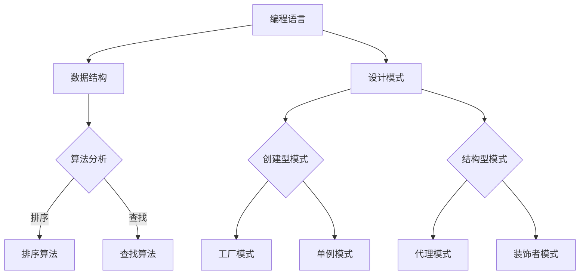

### 3.1.2 框架与工具

框架与工具是提升编程效率的重要手段。常用的开发框架包括Web开发框架、数据库框架和服务框架。以下是一个框架与工具框架的Mermaid流程图：

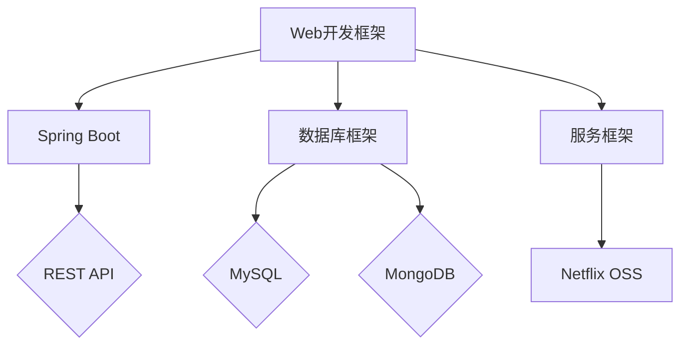

### 3.1.3 新技术探索

新技术探索是保持技术前沿的关键。云计算、大数据和人工智能是当前的热门领域。以下是一个新技术探索框架的Mermaid流程图：

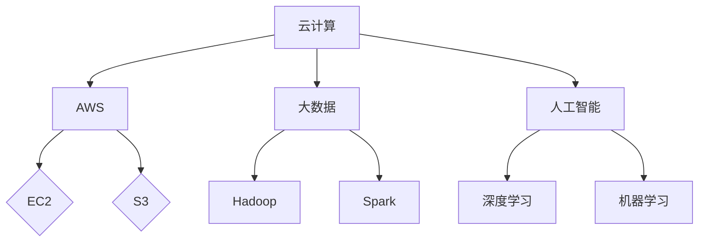

### 3.1.4 项目实战

项目实战是将所学知识应用于实际场景的过程。以下是一个项目实战框架的Mermaid流程图：

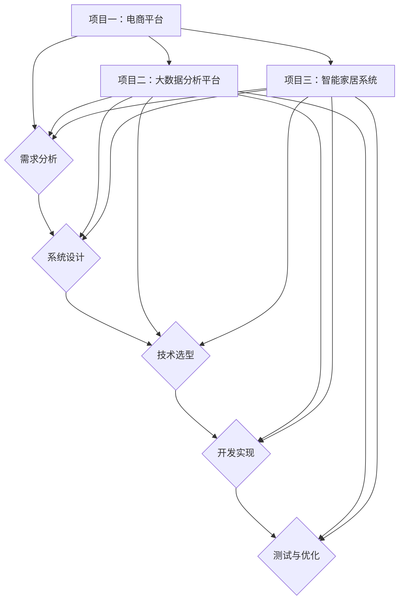

### 3.2 架构力框架

架构力框架包括架构基础、架构设计与优化、系统集成与部署等。以下是对每个部分的详细解析：

### 3.2.1 架构基础

架构基础是理解软件架构的起点。它包括软件架构概述、架构风格与设计原则、微服务架构等。以下是一个架构基础框架的Mermaid流程图：

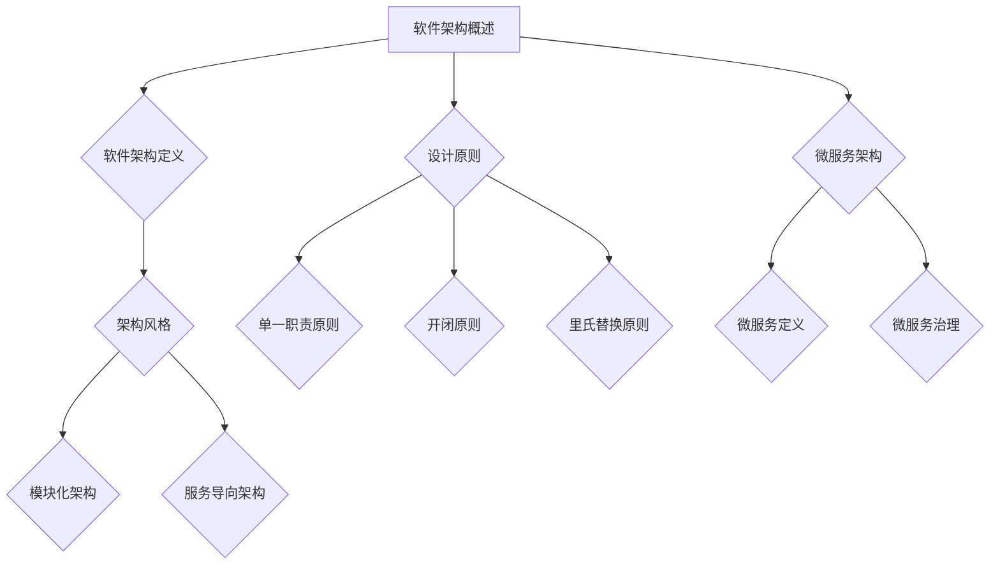

### 3.2.2 架构设计与优化

架构设计与优化是构建高质量系统的关键。它包括架构设计方法论、架构优化实践、高并发架构设计等。以下是一个架构设计与优化框架的Mermaid流程图：

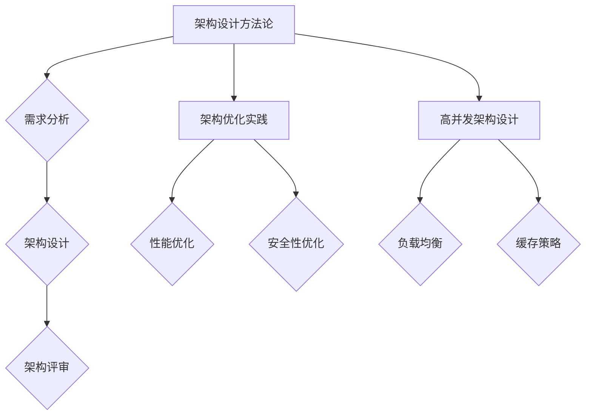

### 3.2.3 系统集成与部署

系统集成与部署是确保系统稳定运行的重要环节。它包括系统集成技术、部署策略与工具、云原生架构与容器化部署等。以下是一个系统集成与部署框架的Mermaid流程图：

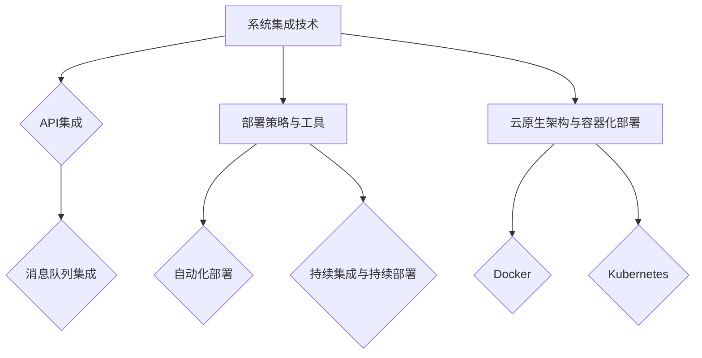

### 3.3 领导力框架

领导力框架包括领导力概述、领导力提升方法和领导力实战等。以下是对每个部分的详细解析：

### 3.3.1 领导力概述

领导力概述是理解领导力的重要基础。它包括领导力的重要性、核心要素和未来发展等。以下是一个领导力概述框架的Mermaid流程图：

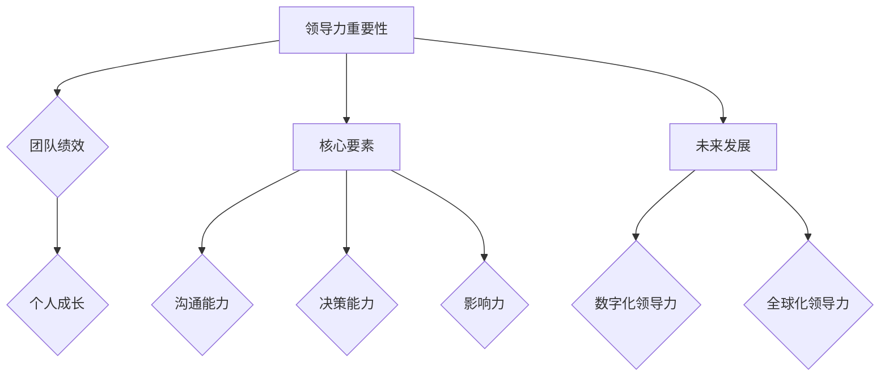

### 3.3.2 领导力提升方法

领导力提升方法是提升个人领导能力的重要手段。它包括自我认知与提升、团队管理与沟通、决策与战略规划等。以下是一个领导力提升方法框架的Mermaid流程图：

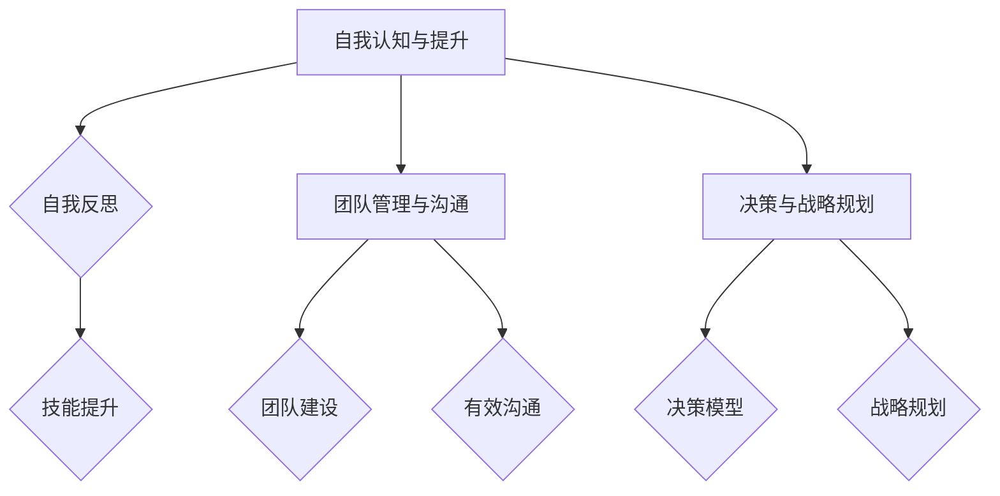

### 3.3.3 领导力实战

领导力实战是将领导力理论应用于实际场景的过程。它包括团队建设实战、项目管理实战和领导力角色转变等。以下是一个领导力实战框架的Mermaid流程图：

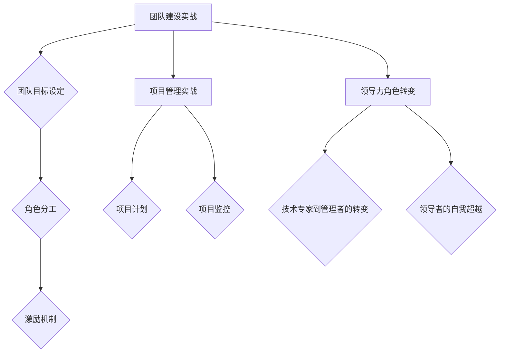

## P9工作法应用场景

### 4.1 企业应用

在企业应用中，P9工作法可以帮助企业提升技术水平、优化系统架构和增强领导力。以下是一个企业应用框架的Mermaid流程图：

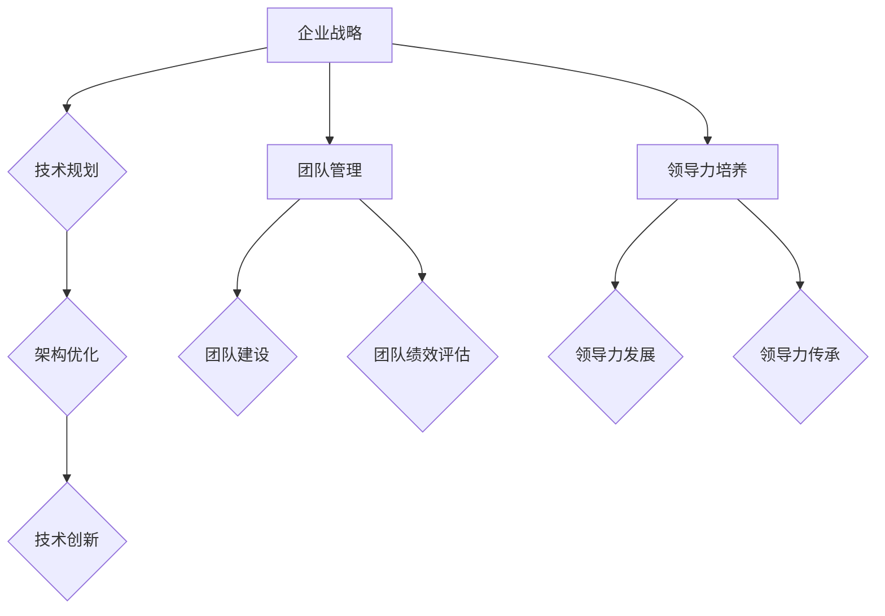

### 4.2 团队管理

在团队管理中，P9工作法可以帮助团队成员提升技术能力、优化架构设计和增强领导力。以下是一个团队管理框架的Mermaid流程图：

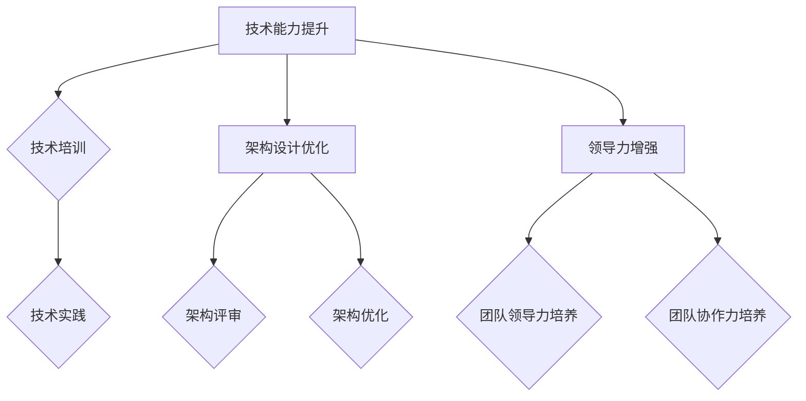

### 4.3 个人成长

在个人成长中，P9工作法可以帮助个人夯实技术基础、提升架构能力和增强领导力。以下是一个个人成长框架的Mermaid流程图：

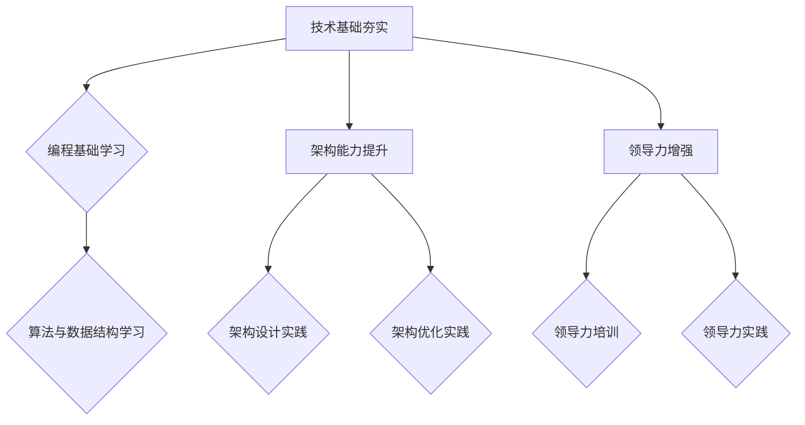

## 总结

P9工作法为IT领域专业人士提供了一个全面的职业发展路径。通过夯实技术硬实力、提升架构力和增强领导力，专业人士可以在技术、管理和领导等方面实现全面发展。本文详细介绍了P9工作法的核心框架和应用场景，为专业人士的职业生涯提供了实用的指导。

## 附录

### 附录 A: P9工作法相关资源

以下是一些推荐的学习资源，供读者参考：

#### A.1 书籍推荐

- 《禅与计算机程序设计艺术》/《Zen And The Art of Computer Programming》
- 《设计模式：可复用面向对象软件的基础》/《Design Patterns: Elements of Reusable Object-Oriented Software》
- 《大型分布式系统设计》/《Designing Data-Intensive Applications》

#### A.2 课程资源

- Coursera上的《算法导论》/《Introduction to Algorithms》
- edX上的《软件架构与设计模式》/《Software Architecture and Design Patterns》
- Udemy上的《领导力提升》/《Leadership Development》

#### A.3 论文与研究报告

- 《云计算服务模型》/《Cloud Computing Service Models》
- 《大数据处理技术综述》/《A Survey on Big Data Processing Techniques》
- 《人工智能在IT领域的应用》/《Application of Artificial Intelligence in the IT Field》

### 参考文献

1. Horowitz, E. (2012). **Zen And The Art of Computer Programming**. Volume 1, 3rd ed. A K Peters.
2. Gamma, E., Helm, R., Johnson, R., & Vlissides, J. M. (1995). **Design Patterns: Elements of Reusable Object-Oriented Software**. Addison-Wesley.
3. Martin, F. (2011). **Clean Architecture: A Craftsman's Guide to Software Structure and Design**. Prentice Hall.
4. Sen, S., & Wickham, H. A. (2014). **Software Architecture: Foundations, Theory, and Practice**. Taylor & Francis.
5. Murphy, P. (2009). **Designing Data-Intensive Applications: The Big Ideas Behind Reliable, Scalable, and Maintainable Systems**. O'Reilly Media.
6. Russell, S., & Norvig, P. (2016). **Artificial Intelligence: A Modern Approach**. Pearson.

### 作者信息

作者：AI天才研究院/AI Genius Institute & 禅与计算机程序设计艺术/Zen And The Art of Computer Programming

[END]

